cola Report for Consensus Partitioning
==================

**Date**: 2019-12-07 09:38:58 CET, **cola version**: 1.3.2

----------------------------------------------------------------

<style type='text/css'>

body, td, th {
   font-family: Arial,Helvetica,sans-serif;
   background-color: white;
   font-size: 13px;
  max-width: 800px;
  margin: auto;
  margin-left:210px;
  padding: 0px 10px 0px 10px;
  border-left: 1px solid #EEEEEE;
  line-height: 150%;
}

tt, code, pre {
   font-family: 'DejaVu Sans Mono', 'Droid Sans Mono', 'Lucida Console', Consolas, Monaco, 

monospace;
}

h1 {
   font-size:2.2em;
}

h2 {
   font-size:1.8em;
}

h3 {
   font-size:1.4em;
}

h4 {
   font-size:1.0em;
}

h5 {
   font-size:0.9em;
}

h6 {
   font-size:0.8em;
}

a {
  text-decoration: none;
  color: #0366d6;
}

a:hover {
  text-decoration: underline;
}

a:visited {
   color: #0366d6;
}

pre, img {
  max-width: 100%;
}
pre {
  overflow-x: auto;
}
pre code {
   display: block; padding: 0.5em;
}

code {
  font-size: 92%;
  border: 1px solid #ccc;
}

code[class] {
  background-color: #F8F8F8;
}

table, td, th {
  border: 1px solid #ccc;
}

blockquote {
   color:#666666;
   margin:0;
   padding-left: 1em;
   border-left: 0.5em #EEE solid;
}

hr {
   height: 0px;
   border-bottom: none;
   border-top-width: thin;
   border-top-style: dotted;
   border-top-color: #999999;
}

@media print {
   * {
      background: transparent !important;
      color: black !important;
      filter:none !important;
      -ms-filter: none !important;
   }

   body {
      font-size:12pt;
      max-width:100%;
   }

   a, a:visited {
      text-decoration: underline;
   }

   hr {
      visibility: hidden;
      page-break-before: always;
   }

   pre, blockquote {
      padding-right: 1em;
      page-break-inside: avoid;
   }

   tr, img {
      page-break-inside: avoid;
   }

   img {
      max-width: 100% !important;
   }

   @page :left {
      margin: 15mm 20mm 15mm 10mm;
   }

   @page :right {
      margin: 15mm 10mm 15mm 20mm;
   }

   p, h2, h3 {
      orphans: 3; widows: 3;
   }

   h2, h3 {
      page-break-after: avoid;
   }
}
</style>


## Summary


All available functions which can be applied to this `res_list` object:


```r
res_list
```

```
#> A 'ConsensusPartitionList' object with 24 methods.
#>   On a matrix with 14523 rows and 169 columns.
#>   Top rows are extracted by 'SD, CV, MAD, ATC' methods.
#>   Subgroups are detected by 'hclust, kmeans, skmeans, pam, mclust, NMF' method.
#>   Number of partitions are tried for k = 2, 3, 4, 5, 6.
#>   Performed in total 30000 partitions by row resampling.
#> 
#> Following methods can be applied to this 'ConsensusPartitionList' object:
#>  [1] "cola_report"           "collect_classes"       "collect_plots"         "collect_stats"        
#>  [5] "colnames"              "functional_enrichment" "get_anno_col"          "get_anno"             
#>  [9] "get_classes"           "get_matrix"            "get_membership"        "get_stats"            
#> [13] "is_best_k"             "is_stable_k"           "ncol"                  "nrow"                 
#> [17] "rownames"              "show"                  "suggest_best_k"        "test_to_known_factors"
#> [21] "top_rows_heatmap"      "top_rows_overlap"     
#> 
#> You can get result for a single method by, e.g. object["SD", "hclust"] or object["SD:hclust"]
#> or a subset of methods by object[c("SD", "CV")], c("hclust", "kmeans")]
```

The call of `run_all_consensus_partition_methods()` was:


```
#> run_all_consensus_partition_methods(data = mat, mc.cores = 4)
```

Dimension of the input matrix:


```r
mat = get_matrix(res_list)
dim(mat)
```

```
#> [1] 14523   169
```

### Density distribution

The density distribution for each sample is visualized as in one column in the
following heatmap. The clustering is based on the distance which is the
Kolmogorov-Smirnov statistic between two distributions.


```r
library(ComplexHeatmap)
densityHeatmap(mat, ylab = "value", cluster_columns = TRUE, show_column_names = FALSE,
    mc.cores = 4)
```

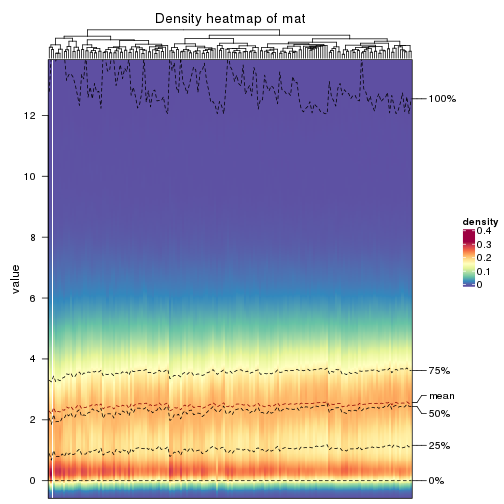


### Suggest the best k


Folowing table shows the best `k` (number of partitions) for each combination
of top-value methods and partition methods. Clicking on the method name in
the table goes to the section for a single combination of methods.

[The cola vignette](http://bioconductor.org/packages/devel/bioc/vignettes/cola/inst/doc/cola.html#toc_13)
explains the definition of the metrics used for determining the best
number of partitions.


```r
suggest_best_k(res_list)
```


|                            | The best k| 1-PAC| Mean silhouette| Concordance|   |Optional k |
|:---------------------------|----------:|-----:|---------------:|-----------:|:--|:----------|
|[ATC:skmeans](#ATC-skmeans) |          2| 0.988|           0.957|       0.983|** |           |
|[CV:NMF](#CV-NMF)           |          2| 0.975|           0.951|       0.980|** |           |
|[ATC:kmeans](#ATC-kmeans)   |          3| 0.947|           0.950|       0.978|*  |2          |
|[ATC:NMF](#ATC-NMF)         |          2| 0.926|           0.939|       0.974|*  |           |
|[ATC:mclust](#ATC-mclust)   |          2| 0.915|           0.947|       0.975|*  |           |
|[MAD:skmeans](#MAD-skmeans) |          4| 0.855|           0.833|       0.933|   |           |
|[SD:mclust](#SD-mclust)     |          2| 0.799|           0.913|       0.960|   |           |
|[ATC:pam](#ATC-pam)         |          3| 0.756|           0.823|       0.917|   |           |
|[MAD:mclust](#MAD-mclust)   |          2| 0.748|           0.889|       0.950|   |           |
|[SD:skmeans](#SD-skmeans)   |          2| 0.732|           0.873|       0.940|   |           |
|[MAD:pam](#MAD-pam)         |          3| 0.727|           0.840|       0.923|   |           |
|[CV:mclust](#CV-mclust)     |          2| 0.700|           0.856|       0.936|   |           |
|[CV:skmeans](#CV-skmeans)   |          2| 0.690|           0.869|       0.943|   |           |
|[SD:kmeans](#SD-kmeans)     |          4| 0.674|           0.766|       0.865|   |           |
|[SD:pam](#SD-pam)           |          3| 0.674|           0.837|       0.915|   |           |
|[CV:pam](#CV-pam)           |          5| 0.641|           0.723|       0.812|   |           |
|[MAD:NMF](#MAD-NMF)         |          2| 0.547|           0.757|       0.901|   |           |
|[SD:NMF](#SD-NMF)           |          3| 0.514|           0.729|       0.822|   |           |
|[CV:kmeans](#CV-kmeans)     |          3| 0.488|           0.736|       0.822|   |           |
|[ATC:hclust](#ATC-hclust)   |          3| 0.455|           0.673|       0.794|   |           |
|[MAD:kmeans](#MAD-kmeans)   |          2| 0.432|           0.810|       0.882|   |           |
|[CV:hclust](#CV-hclust)     |          2| 0.255|           0.564|       0.819|   |           |
|[SD:hclust](#SD-hclust)     |          3| 0.203|           0.587|       0.741|   |           |
|[MAD:hclust](#MAD-hclust)   |          2| 0.174|           0.697|       0.811|   |           |

\*\*: 1-PAC > 0.95, \*: 1-PAC > 0.9


### CDF of consensus matrices

Cumulative distribution function curves of consensus matrix for all methods.


```r
collect_plots(res_list, fun = plot_ecdf)
```

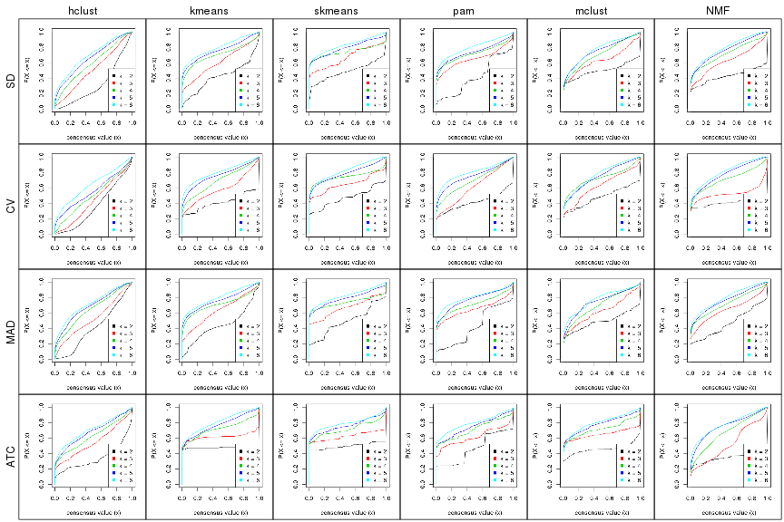


### Consensus heatmap

Consensus heatmaps for all methods. ([What is a consensus heatmap?](http://bioconductor.org/packages/devel/bioc/vignettes/cola/inst/doc/cola.html#toc_9))


<style type='text/css'>


.ui-helper-hidden {
	display: none;
}
.ui-helper-hidden-accessible {
	border: 0;
	clip: rect(0 0 0 0);
	height: 1px;
	margin: -1px;
	overflow: hidden;
	padding: 0;
	position: absolute;
	width: 1px;
}
.ui-helper-reset {
	margin: 0;
	padding: 0;
	border: 0;
	outline: 0;
	line-height: 1.3;
	text-decoration: none;
	font-size: 100%;
	list-style: none;
}
.ui-helper-clearfix:before,
.ui-helper-clearfix:after {
	content: "";
	display: table;
	border-collapse: collapse;
}
.ui-helper-clearfix:after {
	clear: both;
}
.ui-helper-zfix {
	width: 100%;
	height: 100%;
	top: 0;
	left: 0;
	position: absolute;
	opacity: 0;
	filter:Alpha(Opacity=0); 
}

.ui-front {
	z-index: 100;
}


.ui-state-disabled {
	cursor: default !important;
	pointer-events: none;
}


.ui-icon {
	display: inline-block;
	vertical-align: middle;
	margin-top: -.25em;
	position: relative;
	text-indent: -99999px;
	overflow: hidden;
	background-repeat: no-repeat;
}

.ui-widget-icon-block {
	left: 50%;
	margin-left: -8px;
	display: block;
}


.ui-widget-overlay {
	position: fixed;
	top: 0;
	left: 0;
	width: 100%;
	height: 100%;
}
.ui-accordion .ui-accordion-header {
	display: block;
	cursor: pointer;
	position: relative;
	margin: 2px 0 0 0;
	padding: .5em .5em .5em .7em;
	font-size: 100%;
}
.ui-accordion .ui-accordion-content {
	padding: 1em 2.2em;
	border-top: 0;
	overflow: auto;
}
.ui-autocomplete {
	position: absolute;
	top: 0;
	left: 0;
	cursor: default;
}
.ui-menu {
	list-style: none;
	padding: 0;
	margin: 0;
	display: block;
	outline: 0;
}
.ui-menu .ui-menu {
	position: absolute;
}
.ui-menu .ui-menu-item {
	margin: 0;
	cursor: pointer;
	
	list-style-image: url("data:image/gif;base64,R0lGODlhAQABAIAAAAAAAP///yH5BAEAAAAALAAAAAABAAEAAAIBRAA7");
}
.ui-menu .ui-menu-item-wrapper {
	position: relative;
	padding: 3px 1em 3px .4em;
}
.ui-menu .ui-menu-divider {
	margin: 5px 0;
	height: 0;
	font-size: 0;
	line-height: 0;
	border-width: 1px 0 0 0;
}
.ui-menu .ui-state-focus,
.ui-menu .ui-state-active {
	margin: -1px;
}


.ui-menu-icons {
	position: relative;
}
.ui-menu-icons .ui-menu-item-wrapper {
	padding-left: 2em;
}


.ui-menu .ui-icon {
	position: absolute;
	top: 0;
	bottom: 0;
	left: .2em;
	margin: auto 0;
}


.ui-menu .ui-menu-icon {
	left: auto;
	right: 0;
}
.ui-button {
	padding: .4em 1em;
	display: inline-block;
	position: relative;
	line-height: normal;
	margin-right: .1em;
	cursor: pointer;
	vertical-align: middle;
	text-align: center;
	-webkit-user-select: none;
	-moz-user-select: none;
	-ms-user-select: none;
	user-select: none;

	
	overflow: visible;
}

.ui-button,
.ui-button:link,
.ui-button:visited,
.ui-button:hover,
.ui-button:active {
	text-decoration: none;
}


.ui-button-icon-only {
	width: 2em;
	box-sizing: border-box;
	text-indent: -9999px;
	white-space: nowrap;
}


input.ui-button.ui-button-icon-only {
	text-indent: 0;
}


.ui-button-icon-only .ui-icon {
	position: absolute;
	top: 50%;
	left: 50%;
	margin-top: -8px;
	margin-left: -8px;
}

.ui-button.ui-icon-notext .ui-icon {
	padding: 0;
	width: 2.1em;
	height: 2.1em;
	text-indent: -9999px;
	white-space: nowrap;

}

input.ui-button.ui-icon-notext .ui-icon {
	width: auto;
	height: auto;
	text-indent: 0;
	white-space: normal;
	padding: .4em 1em;
}


input.ui-button::-moz-focus-inner,
button.ui-button::-moz-focus-inner {
	border: 0;
	padding: 0;
}
.ui-controlgroup {
	vertical-align: middle;
	display: inline-block;
}
.ui-controlgroup > .ui-controlgroup-item {
	float: left;
	margin-left: 0;
	margin-right: 0;
}
.ui-controlgroup > .ui-controlgroup-item:focus,
.ui-controlgroup > .ui-controlgroup-item.ui-visual-focus {
	z-index: 9999;
}
.ui-controlgroup-vertical > .ui-controlgroup-item {
	display: block;
	float: none;
	width: 100%;
	margin-top: 0;
	margin-bottom: 0;
	text-align: left;
}
.ui-controlgroup-vertical .ui-controlgroup-item {
	box-sizing: border-box;
}
.ui-controlgroup .ui-controlgroup-label {
	padding: .4em 1em;
}
.ui-controlgroup .ui-controlgroup-label span {
	font-size: 80%;
}
.ui-controlgroup-horizontal .ui-controlgroup-label + .ui-controlgroup-item {
	border-left: none;
}
.ui-controlgroup-vertical .ui-controlgroup-label + .ui-controlgroup-item {
	border-top: none;
}
.ui-controlgroup-horizontal .ui-controlgroup-label.ui-widget-content {
	border-right: none;
}
.ui-controlgroup-vertical .ui-controlgroup-label.ui-widget-content {
	border-bottom: none;
}


.ui-controlgroup-vertical .ui-spinner-input {

	
	width: 75%;
	width: calc( 100% - 2.4em );
}
.ui-controlgroup-vertical .ui-spinner .ui-spinner-up {
	border-top-style: solid;
}

.ui-checkboxradio-label .ui-icon-background {
	box-shadow: inset 1px 1px 1px #ccc;
	border-radius: .12em;
	border: none;
}
.ui-checkboxradio-radio-label .ui-icon-background {
	width: 16px;
	height: 16px;
	border-radius: 1em;
	overflow: visible;
	border: none;
}
.ui-checkboxradio-radio-label.ui-checkboxradio-checked .ui-icon,
.ui-checkboxradio-radio-label.ui-checkboxradio-checked:hover .ui-icon {
	background-image: none;
	width: 8px;
	height: 8px;
	border-width: 4px;
	border-style: solid;
}
.ui-checkboxradio-disabled {
	pointer-events: none;
}
.ui-datepicker {
	width: 17em;
	padding: .2em .2em 0;
	display: none;
}
.ui-datepicker .ui-datepicker-header {
	position: relative;
	padding: .2em 0;
}
.ui-datepicker .ui-datepicker-prev,
.ui-datepicker .ui-datepicker-next {
	position: absolute;
	top: 2px;
	width: 1.8em;
	height: 1.8em;
}
.ui-datepicker .ui-datepicker-prev-hover,
.ui-datepicker .ui-datepicker-next-hover {
	top: 1px;
}
.ui-datepicker .ui-datepicker-prev {
	left: 2px;
}
.ui-datepicker .ui-datepicker-next {
	right: 2px;
}
.ui-datepicker .ui-datepicker-prev-hover {
	left: 1px;
}
.ui-datepicker .ui-datepicker-next-hover {
	right: 1px;
}
.ui-datepicker .ui-datepicker-prev span,
.ui-datepicker .ui-datepicker-next span {
	display: block;
	position: absolute;
	left: 50%;
	margin-left: -8px;
	top: 50%;
	margin-top: -8px;
}
.ui-datepicker .ui-datepicker-title {
	margin: 0 2.3em;
	line-height: 1.8em;
	text-align: center;
}
.ui-datepicker .ui-datepicker-title select {
	font-size: 1em;
	margin: 1px 0;
}
.ui-datepicker select.ui-datepicker-month,
.ui-datepicker select.ui-datepicker-year {
	width: 45%;
}
.ui-datepicker table {
	width: 100%;
	font-size: .9em;
	border-collapse: collapse;
	margin: 0 0 .4em;
}
.ui-datepicker th {
	padding: .7em .3em;
	text-align: center;
	font-weight: bold;
	border: 0;
}
.ui-datepicker td {
	border: 0;
	padding: 1px;
}
.ui-datepicker td span,
.ui-datepicker td a {
	display: block;
	padding: .2em;
	text-align: right;
	text-decoration: none;
}
.ui-datepicker .ui-datepicker-buttonpane {
	background-image: none;
	margin: .7em 0 0 0;
	padding: 0 .2em;
	border-left: 0;
	border-right: 0;
	border-bottom: 0;
}
.ui-datepicker .ui-datepicker-buttonpane button {
	float: right;
	margin: .5em .2em .4em;
	cursor: pointer;
	padding: .2em .6em .3em .6em;
	width: auto;
	overflow: visible;
}
.ui-datepicker .ui-datepicker-buttonpane button.ui-datepicker-current {
	float: left;
}


.ui-datepicker.ui-datepicker-multi {
	width: auto;
}
.ui-datepicker-multi .ui-datepicker-group {
	float: left;
}
.ui-datepicker-multi .ui-datepicker-group table {
	width: 95%;
	margin: 0 auto .4em;
}
.ui-datepicker-multi-2 .ui-datepicker-group {
	width: 50%;
}
.ui-datepicker-multi-3 .ui-datepicker-group {
	width: 33.3%;
}
.ui-datepicker-multi-4 .ui-datepicker-group {
	width: 25%;
}
.ui-datepicker-multi .ui-datepicker-group-last .ui-datepicker-header,
.ui-datepicker-multi .ui-datepicker-group-middle .ui-datepicker-header {
	border-left-width: 0;
}
.ui-datepicker-multi .ui-datepicker-buttonpane {
	clear: left;
}
.ui-datepicker-row-break {
	clear: both;
	width: 100%;
	font-size: 0;
}


.ui-datepicker-rtl {
	direction: rtl;
}
.ui-datepicker-rtl .ui-datepicker-prev {
	right: 2px;
	left: auto;
}
.ui-datepicker-rtl .ui-datepicker-next {
	left: 2px;
	right: auto;
}
.ui-datepicker-rtl .ui-datepicker-prev:hover {
	right: 1px;
	left: auto;
}
.ui-datepicker-rtl .ui-datepicker-next:hover {
	left: 1px;
	right: auto;
}
.ui-datepicker-rtl .ui-datepicker-buttonpane {
	clear: right;
}
.ui-datepicker-rtl .ui-datepicker-buttonpane button {
	float: left;
}
.ui-datepicker-rtl .ui-datepicker-buttonpane button.ui-datepicker-current,
.ui-datepicker-rtl .ui-datepicker-group {
	float: right;
}
.ui-datepicker-rtl .ui-datepicker-group-last .ui-datepicker-header,
.ui-datepicker-rtl .ui-datepicker-group-middle .ui-datepicker-header {
	border-right-width: 0;
	border-left-width: 1px;
}


.ui-datepicker .ui-icon {
	display: block;
	text-indent: -99999px;
	overflow: hidden;
	background-repeat: no-repeat;
	left: .5em;
	top: .3em;
}
.ui-dialog {
	position: absolute;
	top: 0;
	left: 0;
	padding: .2em;
	outline: 0;
}
.ui-dialog .ui-dialog-titlebar {
	padding: .4em 1em;
	position: relative;
}
.ui-dialog .ui-dialog-title {
	float: left;
	margin: .1em 0;
	white-space: nowrap;
	width: 90%;
	overflow: hidden;
	text-overflow: ellipsis;
}
.ui-dialog .ui-dialog-titlebar-close {
	position: absolute;
	right: .3em;
	top: 50%;
	width: 20px;
	margin: -10px 0 0 0;
	padding: 1px;
	height: 20px;
}
.ui-dialog .ui-dialog-content {
	position: relative;
	border: 0;
	padding: .5em 1em;
	background: none;
	overflow: auto;
}
.ui-dialog .ui-dialog-buttonpane {
	text-align: left;
	border-width: 1px 0 0 0;
	background-image: none;
	margin-top: .5em;
	padding: .3em 1em .5em .4em;
}
.ui-dialog .ui-dialog-buttonpane .ui-dialog-buttonset {
	float: right;
}
.ui-dialog .ui-dialog-buttonpane button {
	margin: .5em .4em .5em 0;
	cursor: pointer;
}
.ui-dialog .ui-resizable-n {
	height: 2px;
	top: 0;
}
.ui-dialog .ui-resizable-e {
	width: 2px;
	right: 0;
}
.ui-dialog .ui-resizable-s {
	height: 2px;
	bottom: 0;
}
.ui-dialog .ui-resizable-w {
	width: 2px;
	left: 0;
}
.ui-dialog .ui-resizable-se,
.ui-dialog .ui-resizable-sw,
.ui-dialog .ui-resizable-ne,
.ui-dialog .ui-resizable-nw {
	width: 7px;
	height: 7px;
}
.ui-dialog .ui-resizable-se {
	right: 0;
	bottom: 0;
}
.ui-dialog .ui-resizable-sw {
	left: 0;
	bottom: 0;
}
.ui-dialog .ui-resizable-ne {
	right: 0;
	top: 0;
}
.ui-dialog .ui-resizable-nw {
	left: 0;
	top: 0;
}
.ui-draggable .ui-dialog-titlebar {
	cursor: move;
}
.ui-draggable-handle {
	-ms-touch-action: none;
	touch-action: none;
}
.ui-resizable {
	position: relative;
}
.ui-resizable-handle {
	position: absolute;
	font-size: 0.1px;
	display: block;
	-ms-touch-action: none;
	touch-action: none;
}
.ui-resizable-disabled .ui-resizable-handle,
.ui-resizable-autohide .ui-resizable-handle {
	display: none;
}
.ui-resizable-n {
	cursor: n-resize;
	height: 7px;
	width: 100%;
	top: -5px;
	left: 0;
}
.ui-resizable-s {
	cursor: s-resize;
	height: 7px;
	width: 100%;
	bottom: -5px;
	left: 0;
}
.ui-resizable-e {
	cursor: e-resize;
	width: 7px;
	right: -5px;
	top: 0;
	height: 100%;
}
.ui-resizable-w {
	cursor: w-resize;
	width: 7px;
	left: -5px;
	top: 0;
	height: 100%;
}
.ui-resizable-se {
	cursor: se-resize;
	width: 12px;
	height: 12px;
	right: 1px;
	bottom: 1px;
}
.ui-resizable-sw {
	cursor: sw-resize;
	width: 9px;
	height: 9px;
	left: -5px;
	bottom: -5px;
}
.ui-resizable-nw {
	cursor: nw-resize;
	width: 9px;
	height: 9px;
	left: -5px;
	top: -5px;
}
.ui-resizable-ne {
	cursor: ne-resize;
	width: 9px;
	height: 9px;
	right: -5px;
	top: -5px;
}
.ui-progressbar {
	height: 2em;
	text-align: left;
	overflow: hidden;
}
.ui-progressbar .ui-progressbar-value {
	margin: -1px;
	height: 100%;
}
.ui-progressbar .ui-progressbar-overlay {
	background: url("");
	height: 100%;
	filter: alpha(opacity=25); 
	opacity: 0.25;
}
.ui-progressbar-indeterminate .ui-progressbar-value {
	background-image: none;
}
.ui-selectable {
	-ms-touch-action: none;
	touch-action: none;
}
.ui-selectable-helper {
	position: absolute;
	z-index: 100;
	border: 1px dotted black;
}
.ui-selectmenu-menu {
	padding: 0;
	margin: 0;
	position: absolute;
	top: 0;
	left: 0;
	display: none;
}
.ui-selectmenu-menu .ui-menu {
	overflow: auto;
	overflow-x: hidden;
	padding-bottom: 1px;
}
.ui-selectmenu-menu .ui-menu .ui-selectmenu-optgroup {
	font-size: 1em;
	font-weight: bold;
	line-height: 1.5;
	padding: 2px 0.4em;
	margin: 0.5em 0 0 0;
	height: auto;
	border: 0;
}
.ui-selectmenu-open {
	display: block;
}
.ui-selectmenu-text {
	display: block;
	margin-right: 20px;
	overflow: hidden;
	text-overflow: ellipsis;
}
.ui-selectmenu-button.ui-button {
	text-align: left;
	white-space: nowrap;
	width: 14em;
}
.ui-selectmenu-icon.ui-icon {
	float: right;
	margin-top: 0;
}
.ui-slider {
	position: relative;
	text-align: left;
}
.ui-slider .ui-slider-handle {
	position: absolute;
	z-index: 2;
	width: 1.2em;
	height: 1.2em;
	cursor: default;
	-ms-touch-action: none;
	touch-action: none;
}
.ui-slider .ui-slider-range {
	position: absolute;
	z-index: 1;
	font-size: .7em;
	display: block;
	border: 0;
	background-position: 0 0;
}


.ui-slider.ui-state-disabled .ui-slider-handle,
.ui-slider.ui-state-disabled .ui-slider-range {
	filter: inherit;
}

.ui-slider-horizontal {
	height: .8em;
}
.ui-slider-horizontal .ui-slider-handle {
	top: -.3em;
	margin-left: -.6em;
}
.ui-slider-horizontal .ui-slider-range {
	top: 0;
	height: 100%;
}
.ui-slider-horizontal .ui-slider-range-min {
	left: 0;
}
.ui-slider-horizontal .ui-slider-range-max {
	right: 0;
}

.ui-slider-vertical {
	width: .8em;
	height: 100px;
}
.ui-slider-vertical .ui-slider-handle {
	left: -.3em;
	margin-left: 0;
	margin-bottom: -.6em;
}
.ui-slider-vertical .ui-slider-range {
	left: 0;
	width: 100%;
}
.ui-slider-vertical .ui-slider-range-min {
	bottom: 0;
}
.ui-slider-vertical .ui-slider-range-max {
	top: 0;
}
.ui-sortable-handle {
	-ms-touch-action: none;
	touch-action: none;
}
.ui-spinner {
	position: relative;
	display: inline-block;
	overflow: hidden;
	padding: 0;
	vertical-align: middle;
}
.ui-spinner-input {
	border: none;
	background: none;
	color: inherit;
	padding: .222em 0;
	margin: .2em 0;
	vertical-align: middle;
	margin-left: .4em;
	margin-right: 2em;
}
.ui-spinner-button {
	width: 1.6em;
	height: 50%;
	font-size: .5em;
	padding: 0;
	margin: 0;
	text-align: center;
	position: absolute;
	cursor: default;
	display: block;
	overflow: hidden;
	right: 0;
}

.ui-spinner a.ui-spinner-button {
	border-top-style: none;
	border-bottom-style: none;
	border-right-style: none;
}
.ui-spinner-up {
	top: 0;
}
.ui-spinner-down {
	bottom: 0;
}
.ui-tabs {
	position: relative;
	padding: .2em;
}
.ui-tabs .ui-tabs-nav {
	margin: 0;
	padding: .2em .2em 0;
}
.ui-tabs .ui-tabs-nav li {
	list-style: none;
	float: left;
	position: relative;
	top: 0;
	margin: 1px .2em 0 0;
	border-bottom-width: 0;
	padding: 0;
	white-space: nowrap;
}
.ui-tabs .ui-tabs-nav .ui-tabs-anchor {
	float: left;
	padding: .5em 1em;
	text-decoration: none;
}
.ui-tabs .ui-tabs-nav li.ui-tabs-active {
	margin-bottom: -1px;
	padding-bottom: 1px;
}
.ui-tabs .ui-tabs-nav li.ui-tabs-active .ui-tabs-anchor,
.ui-tabs .ui-tabs-nav li.ui-state-disabled .ui-tabs-anchor,
.ui-tabs .ui-tabs-nav li.ui-tabs-loading .ui-tabs-anchor {
	cursor: text;
}
.ui-tabs-collapsible .ui-tabs-nav li.ui-tabs-active .ui-tabs-anchor {
	cursor: pointer;
}
.ui-tabs .ui-tabs-panel {
	display: block;
	border-width: 0;
	padding: 1em 1.4em;
	background: none;
}
.ui-tooltip {
	padding: 8px;
	position: absolute;
	z-index: 9999;
	max-width: 300px;
}
body .ui-tooltip {
	border-width: 2px;
}

.ui-widget {
	font-family: Arial,Helvetica,sans-serif;
	font-size: 1em;
}
.ui-widget .ui-widget {
	font-size: 1em;
}
.ui-widget input,
.ui-widget select,
.ui-widget textarea,
.ui-widget button {
	font-family: Arial,Helvetica,sans-serif;
	font-size: 1em;
}
.ui-widget.ui-widget-content {
	border: 1px solid #c5c5c5;
}
.ui-widget-content {
	border: 1px solid #dddddd;
	background: #ffffff;
	color: #333333;
}
.ui-widget-content a {
	color: #333333;
}
.ui-widget-header {
	border: 1px solid #dddddd;
	background: #e9e9e9;
	color: #333333;
	font-weight: bold;
}
.ui-widget-header a {
	color: #333333;
}


.ui-state-default,
.ui-widget-content .ui-state-default,
.ui-widget-header .ui-state-default,
.ui-button,


html .ui-button.ui-state-disabled:hover,
html .ui-button.ui-state-disabled:active {
	border: 1px solid #c5c5c5;
	background: #f6f6f6;
	font-weight: normal;
	color: #454545;
}
.ui-state-default a,
.ui-state-default a:link,
.ui-state-default a:visited,
a.ui-button,
a:link.ui-button,
a:visited.ui-button,
.ui-button {
	color: #454545;
	text-decoration: none;
}
.ui-state-hover,
.ui-widget-content .ui-state-hover,
.ui-widget-header .ui-state-hover,
.ui-state-focus,
.ui-widget-content .ui-state-focus,
.ui-widget-header .ui-state-focus,
.ui-button:hover,
.ui-button:focus {
	border: 1px solid #cccccc;
	background: #ededed;
	font-weight: normal;
	color: #2b2b2b;
}
.ui-state-hover a,
.ui-state-hover a:hover,
.ui-state-hover a:link,
.ui-state-hover a:visited,
.ui-state-focus a,
.ui-state-focus a:hover,
.ui-state-focus a:link,
.ui-state-focus a:visited,
a.ui-button:hover,
a.ui-button:focus {
	color: #2b2b2b;
	text-decoration: none;
}

.ui-visual-focus {
	box-shadow: 0 0 3px 1px rgb(94, 158, 214);
}
.ui-state-active,
.ui-widget-content .ui-state-active,
.ui-widget-header .ui-state-active,
a.ui-button:active,
.ui-button:active,
.ui-button.ui-state-active:hover {
	border: 1px solid #003eff;
	background: #007fff;
	font-weight: normal;
	color: #ffffff;
}
.ui-icon-background,
.ui-state-active .ui-icon-background {
	border: #003eff;
	background-color: #ffffff;
}
.ui-state-active a,
.ui-state-active a:link,
.ui-state-active a:visited {
	color: #ffffff;
	text-decoration: none;
}


.ui-state-highlight,
.ui-widget-content .ui-state-highlight,
.ui-widget-header .ui-state-highlight {
	border: 1px solid #dad55e;
	background: #fffa90;
	color: #777620;
}
.ui-state-checked {
	border: 1px solid #dad55e;
	background: #fffa90;
}
.ui-state-highlight a,
.ui-widget-content .ui-state-highlight a,
.ui-widget-header .ui-state-highlight a {
	color: #777620;
}
.ui-state-error,
.ui-widget-content .ui-state-error,
.ui-widget-header .ui-state-error {
	border: 1px solid #f1a899;
	background: #fddfdf;
	color: #5f3f3f;
}
.ui-state-error a,
.ui-widget-content .ui-state-error a,
.ui-widget-header .ui-state-error a {
	color: #5f3f3f;
}
.ui-state-error-text,
.ui-widget-content .ui-state-error-text,
.ui-widget-header .ui-state-error-text {
	color: #5f3f3f;
}
.ui-priority-primary,
.ui-widget-content .ui-priority-primary,
.ui-widget-header .ui-priority-primary {
	font-weight: bold;
}
.ui-priority-secondary,
.ui-widget-content .ui-priority-secondary,
.ui-widget-header .ui-priority-secondary {
	opacity: .7;
	filter:Alpha(Opacity=70); 
	font-weight: normal;
}
.ui-state-disabled,
.ui-widget-content .ui-state-disabled,
.ui-widget-header .ui-state-disabled {
	opacity: .35;
	filter:Alpha(Opacity=35); 
	background-image: none;
}
.ui-state-disabled .ui-icon {
	filter:Alpha(Opacity=35); 
}


.ui-icon {
	width: 16px;
	height: 16px;
}
.ui-icon,
.ui-widget-content .ui-icon {
	background-image: url("images/ui-icons_444444_256x240.png");
}
.ui-widget-header .ui-icon {
	background-image: url("images/ui-icons_444444_256x240.png");
}
.ui-state-hover .ui-icon,
.ui-state-focus .ui-icon,
.ui-button:hover .ui-icon,
.ui-button:focus .ui-icon {
	background-image: url("images/ui-icons_555555_256x240.png");
}
.ui-state-active .ui-icon,
.ui-button:active .ui-icon {
	background-image: url("images/ui-icons_ffffff_256x240.png");
}
.ui-state-highlight .ui-icon,
.ui-button .ui-state-highlight.ui-icon {
	background-image: url("images/ui-icons_777620_256x240.png");
}
.ui-state-error .ui-icon,
.ui-state-error-text .ui-icon {
	background-image: url("images/ui-icons_cc0000_256x240.png");
}
.ui-button .ui-icon {
	background-image: url("images/ui-icons_777777_256x240.png");
}


.ui-icon-blank { background-position: 16px 16px; }
.ui-icon-caret-1-n { background-position: 0 0; }
.ui-icon-caret-1-ne { background-position: -16px 0; }
.ui-icon-caret-1-e { background-position: -32px 0; }
.ui-icon-caret-1-se { background-position: -48px 0; }
.ui-icon-caret-1-s { background-position: -65px 0; }
.ui-icon-caret-1-sw { background-position: -80px 0; }
.ui-icon-caret-1-w { background-position: -96px 0; }
.ui-icon-caret-1-nw { background-position: -112px 0; }
.ui-icon-caret-2-n-s { background-position: -128px 0; }
.ui-icon-caret-2-e-w { background-position: -144px 0; }
.ui-icon-triangle-1-n { background-position: 0 -16px; }
.ui-icon-triangle-1-ne { background-position: -16px -16px; }
.ui-icon-triangle-1-e { background-position: -32px -16px; }
.ui-icon-triangle-1-se { background-position: -48px -16px; }
.ui-icon-triangle-1-s { background-position: -65px -16px; }
.ui-icon-triangle-1-sw { background-position: -80px -16px; }
.ui-icon-triangle-1-w { background-position: -96px -16px; }
.ui-icon-triangle-1-nw { background-position: -112px -16px; }
.ui-icon-triangle-2-n-s { background-position: -128px -16px; }
.ui-icon-triangle-2-e-w { background-position: -144px -16px; }
.ui-icon-arrow-1-n { background-position: 0 -32px; }
.ui-icon-arrow-1-ne { background-position: -16px -32px; }
.ui-icon-arrow-1-e { background-position: -32px -32px; }
.ui-icon-arrow-1-se { background-position: -48px -32px; }
.ui-icon-arrow-1-s { background-position: -65px -32px; }
.ui-icon-arrow-1-sw { background-position: -80px -32px; }
.ui-icon-arrow-1-w { background-position: -96px -32px; }
.ui-icon-arrow-1-nw { background-position: -112px -32px; }
.ui-icon-arrow-2-n-s { background-position: -128px -32px; }
.ui-icon-arrow-2-ne-sw { background-position: -144px -32px; }
.ui-icon-arrow-2-e-w { background-position: -160px -32px; }
.ui-icon-arrow-2-se-nw { background-position: -176px -32px; }
.ui-icon-arrowstop-1-n { background-position: -192px -32px; }
.ui-icon-arrowstop-1-e { background-position: -208px -32px; }
.ui-icon-arrowstop-1-s { background-position: -224px -32px; }
.ui-icon-arrowstop-1-w { background-position: -240px -32px; }
.ui-icon-arrowthick-1-n { background-position: 1px -48px; }
.ui-icon-arrowthick-1-ne { background-position: -16px -48px; }
.ui-icon-arrowthick-1-e { background-position: -32px -48px; }
.ui-icon-arrowthick-1-se { background-position: -48px -48px; }
.ui-icon-arrowthick-1-s { background-position: -64px -48px; }
.ui-icon-arrowthick-1-sw { background-position: -80px -48px; }
.ui-icon-arrowthick-1-w { background-position: -96px -48px; }
.ui-icon-arrowthick-1-nw { background-position: -112px -48px; }
.ui-icon-arrowthick-2-n-s { background-position: -128px -48px; }
.ui-icon-arrowthick-2-ne-sw { background-position: -144px -48px; }
.ui-icon-arrowthick-2-e-w { background-position: -160px -48px; }
.ui-icon-arrowthick-2-se-nw { background-position: -176px -48px; }
.ui-icon-arrowthickstop-1-n { background-position: -192px -48px; }
.ui-icon-arrowthickstop-1-e { background-position: -208px -48px; }
.ui-icon-arrowthickstop-1-s { background-position: -224px -48px; }
.ui-icon-arrowthickstop-1-w { background-position: -240px -48px; }
.ui-icon-arrowreturnthick-1-w { background-position: 0 -64px; }
.ui-icon-arrowreturnthick-1-n { background-position: -16px -64px; }
.ui-icon-arrowreturnthick-1-e { background-position: -32px -64px; }
.ui-icon-arrowreturnthick-1-s { background-position: -48px -64px; }
.ui-icon-arrowreturn-1-w { background-position: -64px -64px; }
.ui-icon-arrowreturn-1-n { background-position: -80px -64px; }
.ui-icon-arrowreturn-1-e { background-position: -96px -64px; }
.ui-icon-arrowreturn-1-s { background-position: -112px -64px; }
.ui-icon-arrowrefresh-1-w { background-position: -128px -64px; }
.ui-icon-arrowrefresh-1-n { background-position: -144px -64px; }
.ui-icon-arrowrefresh-1-e { background-position: -160px -64px; }
.ui-icon-arrowrefresh-1-s { background-position: -176px -64px; }
.ui-icon-arrow-4 { background-position: 0 -80px; }
.ui-icon-arrow-4-diag { background-position: -16px -80px; }
.ui-icon-extlink { background-position: -32px -80px; }
.ui-icon-newwin { background-position: -48px -80px; }
.ui-icon-refresh { background-position: -64px -80px; }
.ui-icon-shuffle { background-position: -80px -80px; }
.ui-icon-transfer-e-w { background-position: -96px -80px; }
.ui-icon-transferthick-e-w { background-position: -112px -80px; }
.ui-icon-folder-collapsed { background-position: 0 -96px; }
.ui-icon-folder-open { background-position: -16px -96px; }
.ui-icon-document { background-position: -32px -96px; }
.ui-icon-document-b { background-position: -48px -96px; }
.ui-icon-note { background-position: -64px -96px; }
.ui-icon-mail-closed { background-position: -80px -96px; }
.ui-icon-mail-open { background-position: -96px -96px; }
.ui-icon-suitcase { background-position: -112px -96px; }
.ui-icon-comment { background-position: -128px -96px; }
.ui-icon-person { background-position: -144px -96px; }
.ui-icon-print { background-position: -160px -96px; }
.ui-icon-trash { background-position: -176px -96px; }
.ui-icon-locked { background-position: -192px -96px; }
.ui-icon-unlocked { background-position: -208px -96px; }
.ui-icon-bookmark { background-position: -224px -96px; }
.ui-icon-tag { background-position: -240px -96px; }
.ui-icon-home { background-position: 0 -112px; }
.ui-icon-flag { background-position: -16px -112px; }
.ui-icon-calendar { background-position: -32px -112px; }
.ui-icon-cart { background-position: -48px -112px; }
.ui-icon-pencil { background-position: -64px -112px; }
.ui-icon-clock { background-position: -80px -112px; }
.ui-icon-disk { background-position: -96px -112px; }
.ui-icon-calculator { background-position: -112px -112px; }
.ui-icon-zoomin { background-position: -128px -112px; }
.ui-icon-zoomout { background-position: -144px -112px; }
.ui-icon-search { background-position: -160px -112px; }
.ui-icon-wrench { background-position: -176px -112px; }
.ui-icon-gear { background-position: -192px -112px; }
.ui-icon-heart { background-position: -208px -112px; }
.ui-icon-star { background-position: -224px -112px; }
.ui-icon-link { background-position: -240px -112px; }
.ui-icon-cancel { background-position: 0 -128px; }
.ui-icon-plus { background-position: -16px -128px; }
.ui-icon-plusthick { background-position: -32px -128px; }
.ui-icon-minus { background-position: -48px -128px; }
.ui-icon-minusthick { background-position: -64px -128px; }
.ui-icon-close { background-position: -80px -128px; }
.ui-icon-closethick { background-position: -96px -128px; }
.ui-icon-key { background-position: -112px -128px; }
.ui-icon-lightbulb { background-position: -128px -128px; }
.ui-icon-scissors { background-position: -144px -128px; }
.ui-icon-clipboard { background-position: -160px -128px; }
.ui-icon-copy { background-position: -176px -128px; }
.ui-icon-contact { background-position: -192px -128px; }
.ui-icon-image { background-position: -208px -128px; }
.ui-icon-video { background-position: -224px -128px; }
.ui-icon-script { background-position: -240px -128px; }
.ui-icon-alert { background-position: 0 -144px; }
.ui-icon-info { background-position: -16px -144px; }
.ui-icon-notice { background-position: -32px -144px; }
.ui-icon-help { background-position: -48px -144px; }
.ui-icon-check { background-position: -64px -144px; }
.ui-icon-bullet { background-position: -80px -144px; }
.ui-icon-radio-on { background-position: -96px -144px; }
.ui-icon-radio-off { background-position: -112px -144px; }
.ui-icon-pin-w { background-position: -128px -144px; }
.ui-icon-pin-s { background-position: -144px -144px; }
.ui-icon-play { background-position: 0 -160px; }
.ui-icon-pause { background-position: -16px -160px; }
.ui-icon-seek-next { background-position: -32px -160px; }
.ui-icon-seek-prev { background-position: -48px -160px; }
.ui-icon-seek-end { background-position: -64px -160px; }
.ui-icon-seek-start { background-position: -80px -160px; }

.ui-icon-seek-first { background-position: -80px -160px; }
.ui-icon-stop { background-position: -96px -160px; }
.ui-icon-eject { background-position: -112px -160px; }
.ui-icon-volume-off { background-position: -128px -160px; }
.ui-icon-volume-on { background-position: -144px -160px; }
.ui-icon-power { background-position: 0 -176px; }
.ui-icon-signal-diag { background-position: -16px -176px; }
.ui-icon-signal { background-position: -32px -176px; }
.ui-icon-battery-0 { background-position: -48px -176px; }
.ui-icon-battery-1 { background-position: -64px -176px; }
.ui-icon-battery-2 { background-position: -80px -176px; }
.ui-icon-battery-3 { background-position: -96px -176px; }
.ui-icon-circle-plus { background-position: 0 -192px; }
.ui-icon-circle-minus { background-position: -16px -192px; }
.ui-icon-circle-close { background-position: -32px -192px; }
.ui-icon-circle-triangle-e { background-position: -48px -192px; }
.ui-icon-circle-triangle-s { background-position: -64px -192px; }
.ui-icon-circle-triangle-w { background-position: -80px -192px; }
.ui-icon-circle-triangle-n { background-position: -96px -192px; }
.ui-icon-circle-arrow-e { background-position: -112px -192px; }
.ui-icon-circle-arrow-s { background-position: -128px -192px; }
.ui-icon-circle-arrow-w { background-position: -144px -192px; }
.ui-icon-circle-arrow-n { background-position: -160px -192px; }
.ui-icon-circle-zoomin { background-position: -176px -192px; }
.ui-icon-circle-zoomout { background-position: -192px -192px; }
.ui-icon-circle-check { background-position: -208px -192px; }
.ui-icon-circlesmall-plus { background-position: 0 -208px; }
.ui-icon-circlesmall-minus { background-position: -16px -208px; }
.ui-icon-circlesmall-close { background-position: -32px -208px; }
.ui-icon-squaresmall-plus { background-position: -48px -208px; }
.ui-icon-squaresmall-minus { background-position: -64px -208px; }
.ui-icon-squaresmall-close { background-position: -80px -208px; }
.ui-icon-grip-dotted-vertical { background-position: 0 -224px; }
.ui-icon-grip-dotted-horizontal { background-position: -16px -224px; }
.ui-icon-grip-solid-vertical { background-position: -32px -224px; }
.ui-icon-grip-solid-horizontal { background-position: -48px -224px; }
.ui-icon-gripsmall-diagonal-se { background-position: -64px -224px; }
.ui-icon-grip-diagonal-se { background-position: -80px -224px; }


.ui-corner-all,
.ui-corner-top,
.ui-corner-left,
.ui-corner-tl {
	border-top-left-radius: 3px;
}
.ui-corner-all,
.ui-corner-top,
.ui-corner-right,
.ui-corner-tr {
	border-top-right-radius: 3px;
}
.ui-corner-all,
.ui-corner-bottom,
.ui-corner-left,
.ui-corner-bl {
	border-bottom-left-radius: 3px;
}
.ui-corner-all,
.ui-corner-bottom,
.ui-corner-right,
.ui-corner-br {
	border-bottom-right-radius: 3px;
}


.ui-widget-overlay {
	background: #aaaaaa;
	opacity: .3;
	filter: Alpha(Opacity=30); 
}
.ui-widget-shadow {
	-webkit-box-shadow: 0px 0px 5px #666666;
	box-shadow: 0px 0px 5px #666666;
} 
</style>
<script src='js/jquery-1.12.4.js'></script>
<script src='js/jquery-ui.js'></script>

<script>
$( function() {
	$( '#tabs-collect-consensus-heatmap' ).tabs();
} );
</script>
<div id='tabs-collect-consensus-heatmap'>
<ul>
<li><a href='#tab-collect-consensus-heatmap-1'>k = 2</a></li>
<li><a href='#tab-collect-consensus-heatmap-2'>k = 3</a></li>
<li><a href='#tab-collect-consensus-heatmap-3'>k = 4</a></li>
<li><a href='#tab-collect-consensus-heatmap-4'>k = 5</a></li>
<li><a href='#tab-collect-consensus-heatmap-5'>k = 6</a></li>
</ul>
<div id='tab-collect-consensus-heatmap-1'>
<pre><code class="r">collect_plots(res_list, k = 2, fun = consensus_heatmap, mc.cores = 4)
</code></pre>

<p>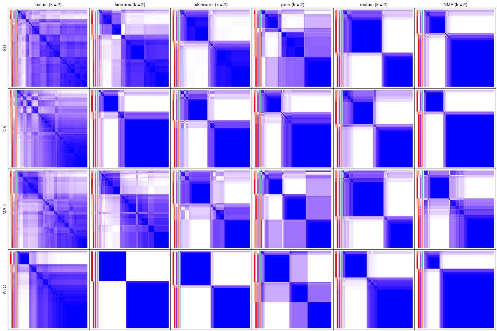</p>

</div>
<div id='tab-collect-consensus-heatmap-2'>
<pre><code class="r">collect_plots(res_list, k = 3, fun = consensus_heatmap, mc.cores = 4)
</code></pre>

<p>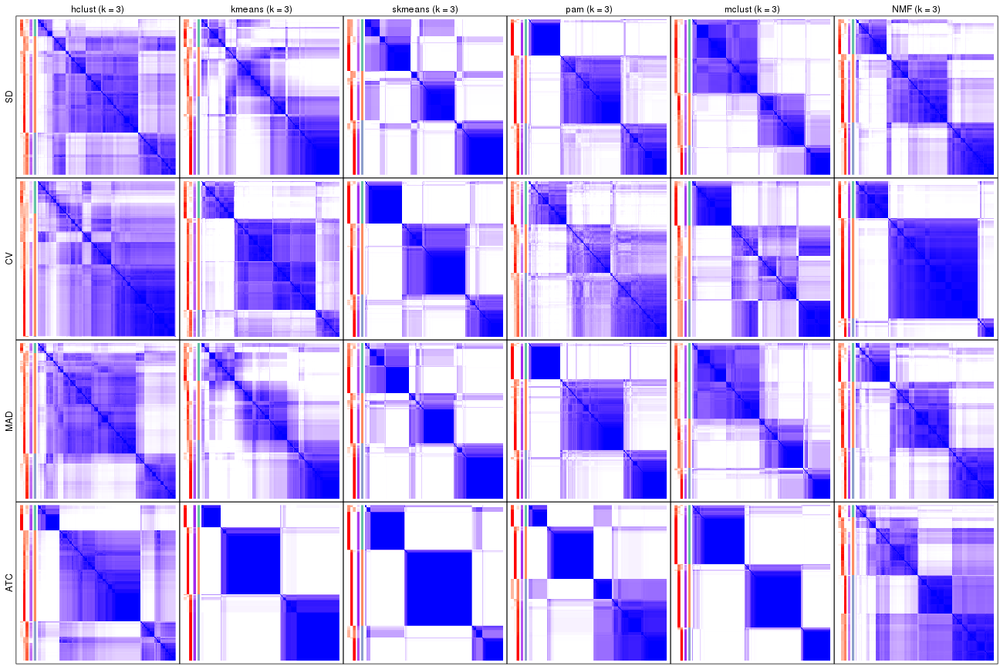</p>

</div>
<div id='tab-collect-consensus-heatmap-3'>
<pre><code class="r">collect_plots(res_list, k = 4, fun = consensus_heatmap, mc.cores = 4)
</code></pre>

<p>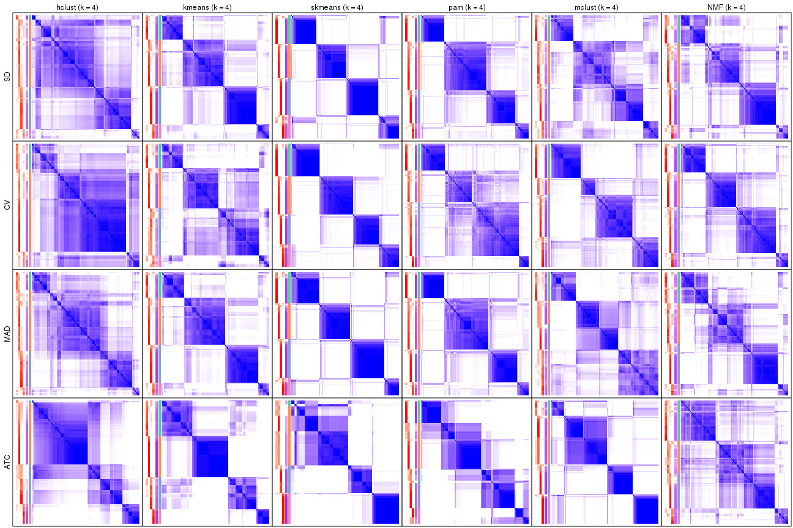</p>

</div>
<div id='tab-collect-consensus-heatmap-4'>
<pre><code class="r">collect_plots(res_list, k = 5, fun = consensus_heatmap, mc.cores = 4)
</code></pre>

<p>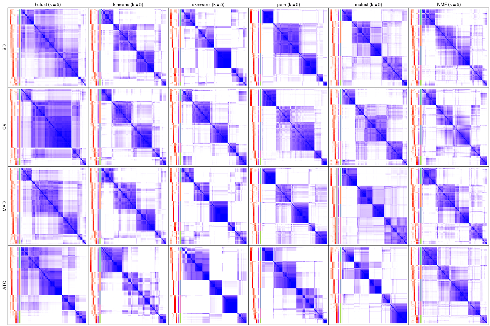</p>

</div>
<div id='tab-collect-consensus-heatmap-5'>
<pre><code class="r">collect_plots(res_list, k = 6, fun = consensus_heatmap, mc.cores = 4)
</code></pre>

<p>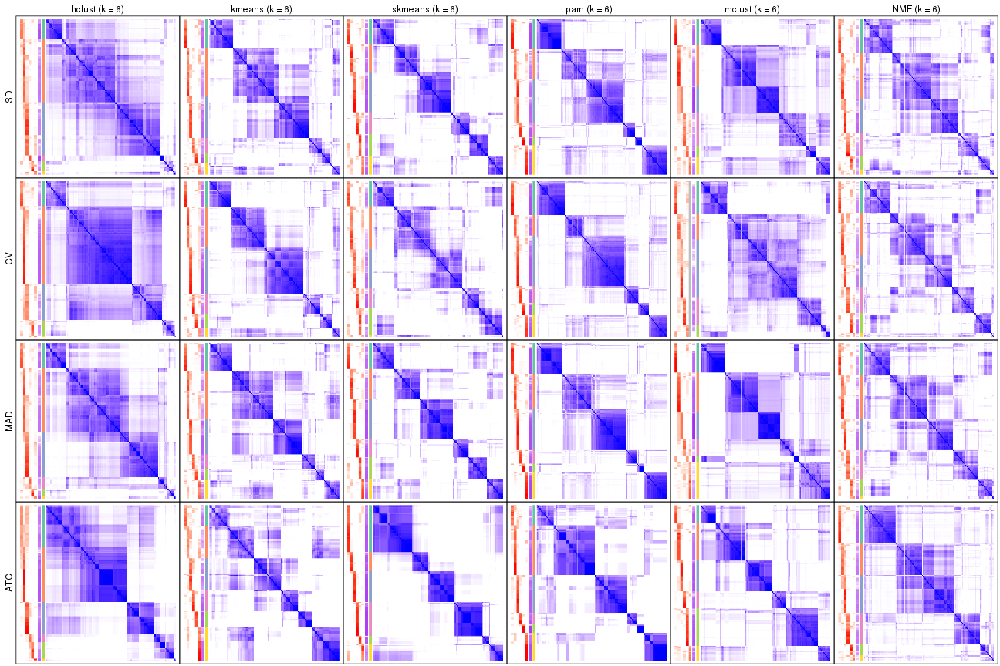</p>

</div>
</div>


### Membership heatmap

Membership heatmaps for all methods. ([What is a membership heatmap?](http://bioconductor.org/packages/devel/bioc/vignettes/cola/inst/doc/cola.html#toc_12))


<script>
$( function() {
	$( '#tabs-collect-membership-heatmap' ).tabs();
} );
</script>
<div id='tabs-collect-membership-heatmap'>
<ul>
<li><a href='#tab-collect-membership-heatmap-1'>k = 2</a></li>
<li><a href='#tab-collect-membership-heatmap-2'>k = 3</a></li>
<li><a href='#tab-collect-membership-heatmap-3'>k = 4</a></li>
<li><a href='#tab-collect-membership-heatmap-4'>k = 5</a></li>
<li><a href='#tab-collect-membership-heatmap-5'>k = 6</a></li>
</ul>
<div id='tab-collect-membership-heatmap-1'>
<pre><code class="r">collect_plots(res_list, k = 2, fun = membership_heatmap, mc.cores = 4)
</code></pre>

<p>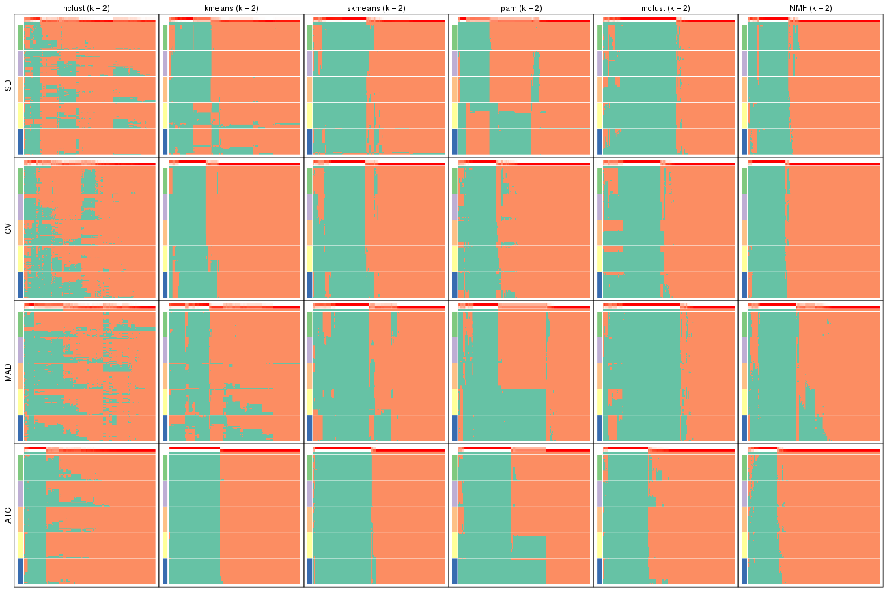</p>

</div>
<div id='tab-collect-membership-heatmap-2'>
<pre><code class="r">collect_plots(res_list, k = 3, fun = membership_heatmap, mc.cores = 4)
</code></pre>

<p>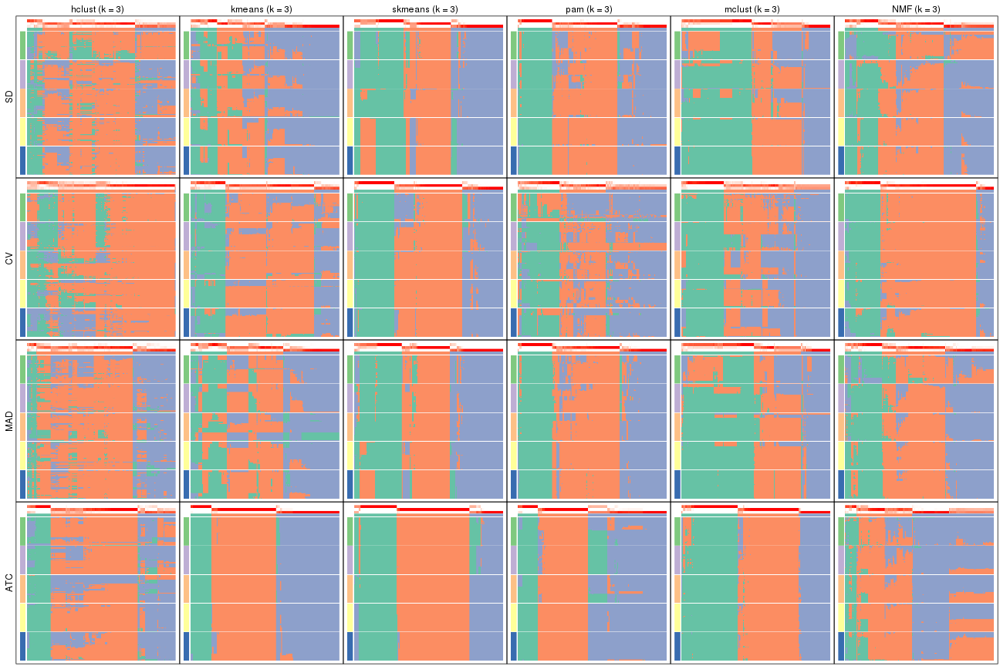</p>

</div>
<div id='tab-collect-membership-heatmap-3'>
<pre><code class="r">collect_plots(res_list, k = 4, fun = membership_heatmap, mc.cores = 4)
</code></pre>

<p>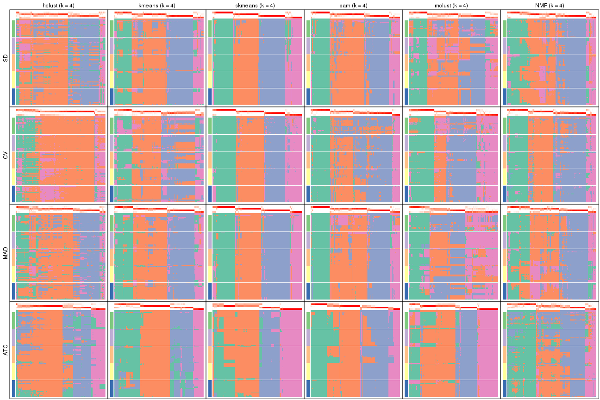</p>

</div>
<div id='tab-collect-membership-heatmap-4'>
<pre><code class="r">collect_plots(res_list, k = 5, fun = membership_heatmap, mc.cores = 4)
</code></pre>

<p>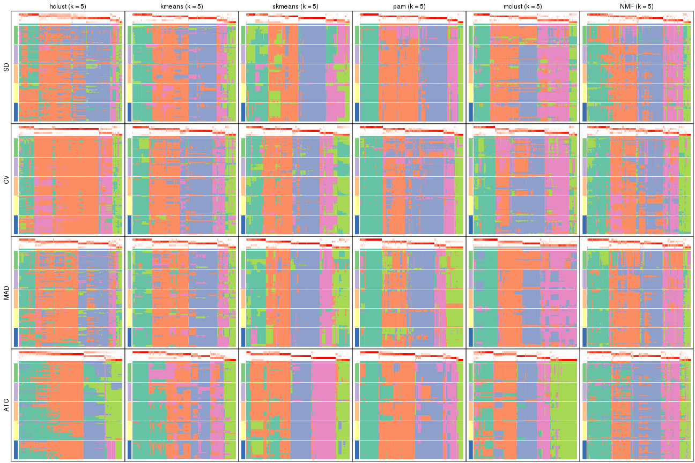</p>

</div>
<div id='tab-collect-membership-heatmap-5'>
<pre><code class="r">collect_plots(res_list, k = 6, fun = membership_heatmap, mc.cores = 4)
</code></pre>

<p>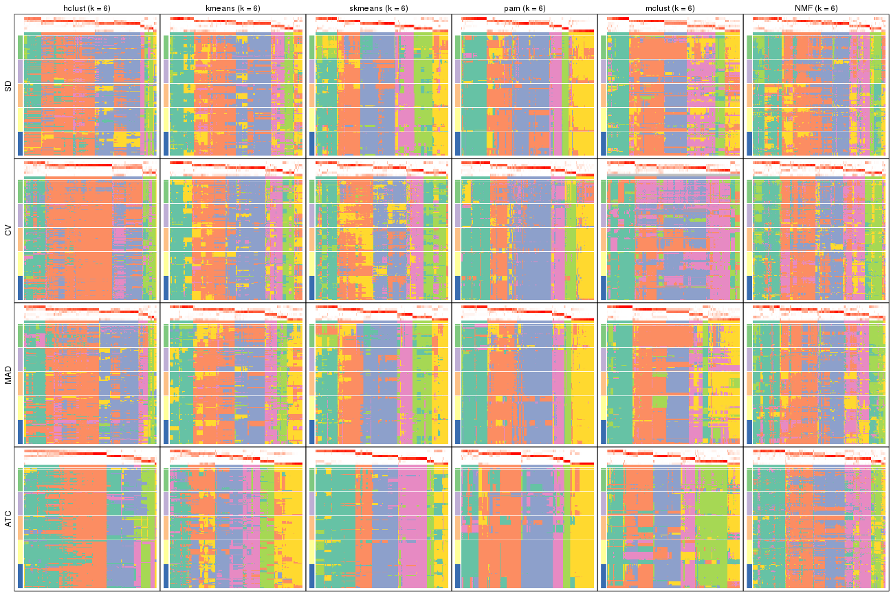</p>

</div>
</div>


### Signature heatmap

Signature heatmaps for all methods. ([What is a signature heatmap?](http://bioconductor.org/packages/devel/bioc/vignettes/cola/inst/doc/cola.html#toc_22))


Note in following heatmaps, rows are scaled.


<script>
$( function() {
	$( '#tabs-collect-get-signatures' ).tabs();
} );
</script>
<div id='tabs-collect-get-signatures'>
<ul>
<li><a href='#tab-collect-get-signatures-1'>k = 2</a></li>
<li><a href='#tab-collect-get-signatures-2'>k = 3</a></li>
<li><a href='#tab-collect-get-signatures-3'>k = 4</a></li>
<li><a href='#tab-collect-get-signatures-4'>k = 5</a></li>
<li><a href='#tab-collect-get-signatures-5'>k = 6</a></li>
</ul>
<div id='tab-collect-get-signatures-1'>
<pre><code class="r">collect_plots(res_list, k = 2, fun = get_signatures, mc.cores = 4)
</code></pre>

<p>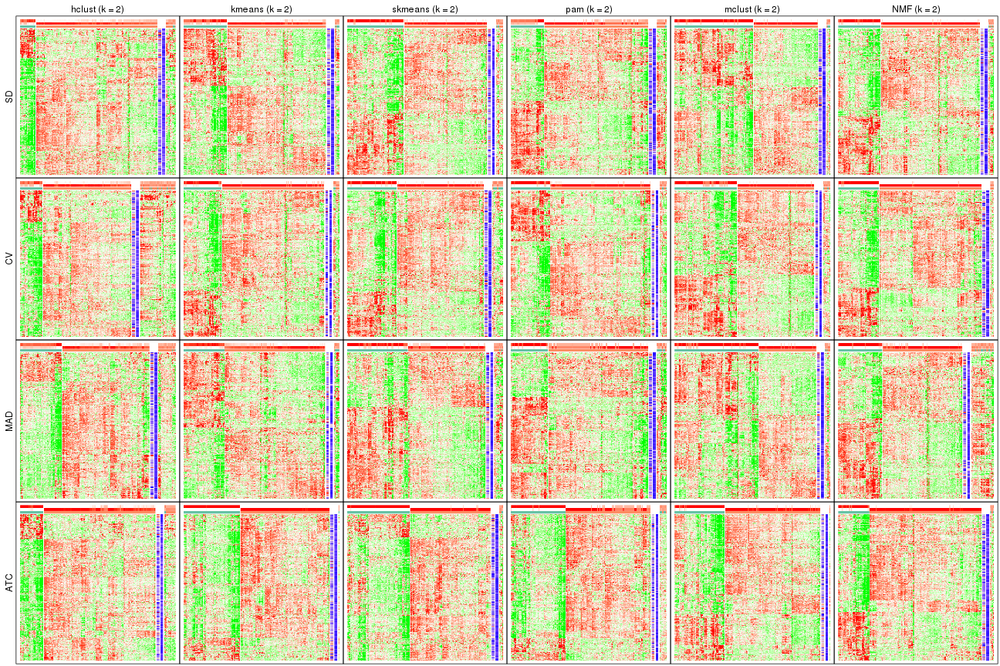</p>

</div>
<div id='tab-collect-get-signatures-2'>
<pre><code class="r">collect_plots(res_list, k = 3, fun = get_signatures, mc.cores = 4)
</code></pre>

<p>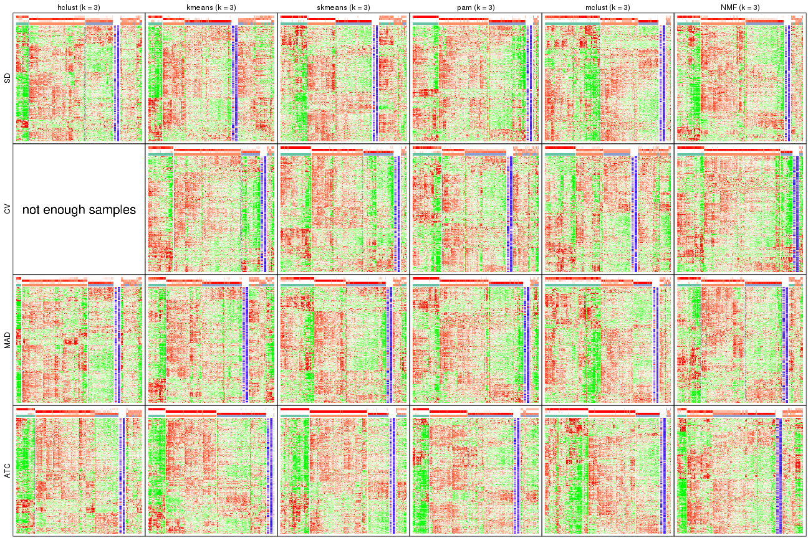</p>

</div>
<div id='tab-collect-get-signatures-3'>
<pre><code class="r">collect_plots(res_list, k = 4, fun = get_signatures, mc.cores = 4)
</code></pre>

<p>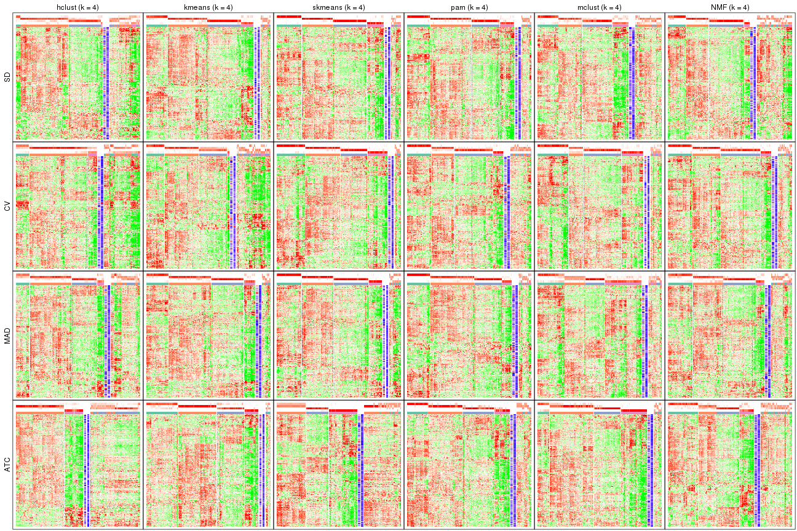</p>

</div>
<div id='tab-collect-get-signatures-4'>
<pre><code class="r">collect_plots(res_list, k = 5, fun = get_signatures, mc.cores = 4)
</code></pre>

<p>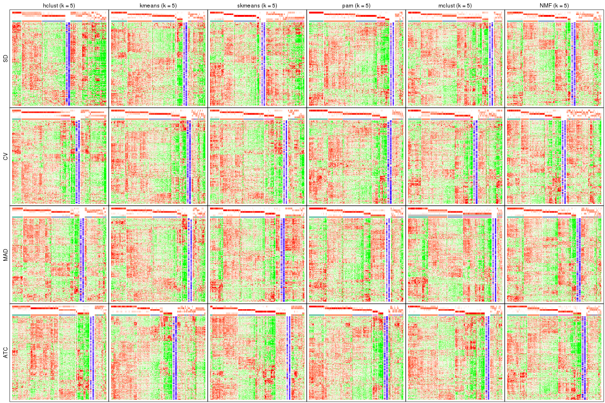</p>

</div>
<div id='tab-collect-get-signatures-5'>
<pre><code class="r">collect_plots(res_list, k = 6, fun = get_signatures, mc.cores = 4)
</code></pre>

<p>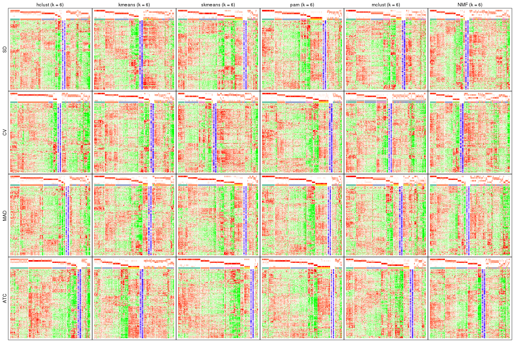</p>

</div>
</div>


### Statistics table

The statistics used for measuring the stability of consensus partitioning.
([How are they
defined?](http://bioconductor.org/packages/devel/bioc/vignettes/cola/inst/doc/cola.html#toc_13))


<script>
$( function() {
	$( '#tabs-get-stats-from-consensus-partition-list' ).tabs();
} );
</script>
<div id='tabs-get-stats-from-consensus-partition-list'>
<ul>
<li><a href='#tab-get-stats-from-consensus-partition-list-1'>k = 2</a></li>
<li><a href='#tab-get-stats-from-consensus-partition-list-2'>k = 3</a></li>
<li><a href='#tab-get-stats-from-consensus-partition-list-3'>k = 4</a></li>
<li><a href='#tab-get-stats-from-consensus-partition-list-4'>k = 5</a></li>
<li><a href='#tab-get-stats-from-consensus-partition-list-5'>k = 6</a></li>
</ul>
<div id='tab-get-stats-from-consensus-partition-list-1'>
<pre><code class="r">get_stats(res_list, k = 2)
</code></pre>

<pre><code>#&gt;             k 1-PAC mean_silhouette concordance area_increased  Rand Jaccard
#&gt; SD:NMF      2 0.834           0.911       0.961          0.425 0.571   0.571
#&gt; CV:NMF      2 0.975           0.951       0.980          0.410 0.596   0.596
#&gt; MAD:NMF     2 0.547           0.757       0.901          0.469 0.536   0.536
#&gt; ATC:NMF     2 0.926           0.939       0.974          0.347 0.649   0.649
#&gt; SD:skmeans  2 0.732           0.873       0.940          0.487 0.516   0.516
#&gt; CV:skmeans  2 0.690           0.869       0.943          0.472 0.521   0.521
#&gt; MAD:skmeans 2 0.513           0.796       0.910          0.496 0.508   0.508
#&gt; ATC:skmeans 2 0.988           0.957       0.983          0.497 0.505   0.505
#&gt; SD:mclust   2 0.799           0.913       0.960          0.499 0.503   0.503
#&gt; CV:mclust   2 0.700           0.856       0.936          0.480 0.505   0.505
#&gt; MAD:mclust  2 0.748           0.889       0.950          0.491 0.512   0.512
#&gt; ATC:mclust  2 0.915           0.947       0.975          0.459 0.546   0.546
#&gt; SD:kmeans   2 0.499           0.817       0.888          0.422 0.563   0.563
#&gt; CV:kmeans   2 0.761           0.890       0.952          0.412 0.596   0.596
#&gt; MAD:kmeans  2 0.432           0.810       0.882          0.444 0.571   0.571
#&gt; ATC:kmeans  2 1.000           0.989       0.996          0.478 0.521   0.521
#&gt; SD:pam      2 0.458           0.660       0.800          0.419 0.637   0.637
#&gt; CV:pam      2 0.730           0.885       0.949          0.417 0.591   0.591
#&gt; MAD:pam     2 0.412           0.645       0.812          0.429 0.576   0.576
#&gt; ATC:pam     2 0.595           0.768       0.885          0.465 0.516   0.516
#&gt; SD:hclust   2 0.256           0.715       0.841          0.320 0.790   0.790
#&gt; CV:hclust   2 0.255           0.564       0.819          0.360 0.677   0.677
#&gt; MAD:hclust  2 0.174           0.697       0.811          0.411 0.581   0.581
#&gt; ATC:hclust  2 0.590           0.847       0.920          0.340 0.714   0.714
</code></pre>

</div>
<div id='tab-get-stats-from-consensus-partition-list-2'>
<pre><code class="r">get_stats(res_list, k = 3)
</code></pre>

<pre><code>#&gt;             k 1-PAC mean_silhouette concordance area_increased  Rand Jaccard
#&gt; SD:NMF      3 0.514           0.729       0.822          0.481 0.651   0.451
#&gt; CV:NMF      3 0.839           0.885       0.945          0.292 0.857   0.766
#&gt; MAD:NMF     3 0.583           0.754       0.861          0.375 0.621   0.399
#&gt; ATC:NMF     3 0.374           0.568       0.787          0.509 0.658   0.523
#&gt; SD:skmeans  3 0.696           0.703       0.877          0.373 0.736   0.524
#&gt; CV:skmeans  3 0.713           0.834       0.921          0.377 0.758   0.565
#&gt; MAD:skmeans 3 0.687           0.780       0.904          0.346 0.692   0.462
#&gt; ATC:skmeans 3 0.895           0.878       0.951          0.258 0.808   0.640
#&gt; SD:mclust   3 0.540           0.780       0.842          0.271 0.766   0.578
#&gt; CV:mclust   3 0.455           0.557       0.750          0.303 0.655   0.429
#&gt; MAD:mclust  3 0.516           0.707       0.817          0.276 0.742   0.548
#&gt; ATC:mclust  3 0.887           0.907       0.962          0.416 0.692   0.490
#&gt; SD:kmeans   3 0.438           0.587       0.812          0.444 0.710   0.530
#&gt; CV:kmeans   3 0.488           0.736       0.822          0.416 0.807   0.684
#&gt; MAD:kmeans  3 0.473           0.613       0.775          0.425 0.637   0.431
#&gt; ATC:kmeans  3 0.947           0.950       0.978          0.293 0.686   0.485
#&gt; SD:pam      3 0.674           0.837       0.915          0.554 0.682   0.512
#&gt; CV:pam      3 0.390           0.617       0.744          0.470 0.722   0.540
#&gt; MAD:pam     3 0.727           0.840       0.923          0.514 0.669   0.476
#&gt; ATC:pam     3 0.756           0.823       0.917          0.327 0.611   0.407
#&gt; SD:hclust   3 0.203           0.587       0.741          0.606 0.666   0.580
#&gt; CV:hclust   3 0.235           0.423       0.751          0.210 0.890   0.848
#&gt; MAD:hclust  3 0.298           0.652       0.811          0.298 0.846   0.751
#&gt; ATC:hclust  3 0.455           0.673       0.794          0.619 0.704   0.589
</code></pre>

</div>
<div id='tab-get-stats-from-consensus-partition-list-3'>
<pre><code class="r">get_stats(res_list, k = 4)
</code></pre>

<pre><code>#&gt;             k 1-PAC mean_silhouette concordance area_increased  Rand Jaccard
#&gt; SD:NMF      4 0.613           0.598       0.810          0.146 0.819   0.554
#&gt; CV:NMF      4 0.656           0.738       0.866          0.351 0.735   0.485
#&gt; MAD:NMF     4 0.608           0.619       0.765          0.123 0.815   0.544
#&gt; ATC:NMF     4 0.416           0.570       0.751          0.293 0.672   0.370
#&gt; SD:skmeans  4 0.846           0.826       0.929          0.112 0.847   0.585
#&gt; CV:skmeans  4 0.867           0.861       0.935          0.147 0.834   0.571
#&gt; MAD:skmeans 4 0.855           0.833       0.933          0.104 0.882   0.669
#&gt; ATC:skmeans 4 0.746           0.604       0.816          0.151 0.946   0.859
#&gt; SD:mclust   4 0.515           0.618       0.751          0.122 0.690   0.348
#&gt; CV:mclust   4 0.668           0.761       0.854          0.163 0.782   0.484
#&gt; MAD:mclust  4 0.507           0.656       0.682          0.124 0.754   0.444
#&gt; ATC:mclust  4 0.755           0.795       0.872          0.107 0.882   0.686
#&gt; SD:kmeans   4 0.674           0.766       0.865          0.160 0.706   0.389
#&gt; CV:kmeans   4 0.519           0.553       0.725          0.188 0.719   0.443
#&gt; MAD:kmeans  4 0.694           0.770       0.873          0.126 0.795   0.510
#&gt; ATC:kmeans  4 0.693           0.800       0.872          0.165 0.793   0.520
#&gt; SD:pam      4 0.736           0.789       0.896          0.102 0.865   0.649
#&gt; CV:pam      4 0.529           0.684       0.813          0.137 0.846   0.616
#&gt; MAD:pam     4 0.700           0.787       0.878          0.101 0.919   0.780
#&gt; ATC:pam     4 0.684           0.712       0.863          0.159 0.725   0.429
#&gt; SD:hclust   4 0.280           0.584       0.744          0.163 0.870   0.744
#&gt; CV:hclust   4 0.314           0.551       0.775          0.159 0.788   0.692
#&gt; MAD:hclust  4 0.335           0.562       0.757          0.214 0.842   0.689
#&gt; ATC:hclust  4 0.516           0.533       0.790          0.143 0.859   0.701
</code></pre>

</div>
<div id='tab-get-stats-from-consensus-partition-list-4'>
<pre><code class="r">get_stats(res_list, k = 5)
</code></pre>

<pre><code>#&gt;             k 1-PAC mean_silhouette concordance area_increased  Rand Jaccard
#&gt; SD:NMF      5 0.563           0.550       0.752         0.0645 0.820   0.470
#&gt; CV:NMF      5 0.573           0.503       0.714         0.0921 0.783   0.388
#&gt; MAD:NMF     5 0.584           0.591       0.767         0.0613 0.796   0.424
#&gt; ATC:NMF     5 0.560           0.660       0.790         0.1206 0.838   0.497
#&gt; SD:skmeans  5 0.747           0.559       0.754         0.0661 0.914   0.698
#&gt; CV:skmeans  5 0.697           0.639       0.799         0.0566 0.897   0.640
#&gt; MAD:skmeans 5 0.728           0.675       0.817         0.0716 0.870   0.572
#&gt; ATC:skmeans 5 0.789           0.712       0.842         0.0618 0.885   0.677
#&gt; SD:mclust   5 0.560           0.707       0.766         0.0588 0.759   0.355
#&gt; CV:mclust   5 0.520           0.547       0.732         0.0286 0.937   0.778
#&gt; MAD:mclust  5 0.603           0.763       0.779         0.0610 0.949   0.824
#&gt; ATC:mclust  5 0.715           0.705       0.815         0.0843 0.859   0.553
#&gt; SD:kmeans   5 0.622           0.658       0.803         0.0746 0.937   0.790
#&gt; CV:kmeans   5 0.630           0.674       0.799         0.0966 0.879   0.630
#&gt; MAD:kmeans  5 0.642           0.663       0.807         0.0710 0.934   0.781
#&gt; ATC:kmeans  5 0.653           0.573       0.759         0.0717 0.917   0.713
#&gt; SD:pam      5 0.698           0.765       0.869         0.0323 0.975   0.913
#&gt; CV:pam      5 0.641           0.723       0.812         0.0850 0.904   0.705
#&gt; MAD:pam     5 0.666           0.710       0.816         0.0817 0.899   0.667
#&gt; ATC:pam     5 0.632           0.647       0.837         0.0488 0.942   0.802
#&gt; SD:hclust   5 0.357           0.446       0.657         0.1117 0.787   0.532
#&gt; CV:hclust   5 0.378           0.554       0.768         0.1102 0.911   0.827
#&gt; MAD:hclust  5 0.385           0.566       0.738         0.0700 0.922   0.784
#&gt; ATC:hclust  5 0.511           0.683       0.740         0.0867 0.810   0.539
</code></pre>

</div>
<div id='tab-get-stats-from-consensus-partition-list-5'>
<pre><code class="r">get_stats(res_list, k = 6)
</code></pre>

<pre><code>#&gt;             k 1-PAC mean_silhouette concordance area_increased  Rand Jaccard
#&gt; SD:NMF      6 0.582           0.364       0.684         0.0354 0.843   0.466
#&gt; CV:NMF      6 0.610           0.372       0.682         0.0385 0.862   0.495
#&gt; MAD:NMF     6 0.604           0.417       0.689         0.0405 0.861   0.508
#&gt; ATC:NMF     6 0.589           0.517       0.722         0.0244 0.913   0.654
#&gt; SD:skmeans  6 0.718           0.642       0.773         0.0437 0.887   0.565
#&gt; CV:skmeans  6 0.662           0.368       0.674         0.0453 0.963   0.838
#&gt; MAD:skmeans 6 0.738           0.674       0.792         0.0444 0.910   0.622
#&gt; ATC:skmeans 6 0.775           0.776       0.876         0.0414 0.915   0.687
#&gt; SD:mclust   6 0.548           0.611       0.701         0.0222 0.926   0.699
#&gt; CV:mclust   6 0.519           0.452       0.614         0.0302 0.925   0.730
#&gt; MAD:mclust  6 0.612           0.587       0.713         0.0344 0.920   0.701
#&gt; ATC:mclust  6 0.684           0.683       0.768         0.0242 0.928   0.687
#&gt; SD:kmeans   6 0.638           0.512       0.737         0.0501 0.946   0.793
#&gt; CV:kmeans   6 0.671           0.581       0.755         0.0531 0.940   0.763
#&gt; MAD:kmeans  6 0.654           0.549       0.716         0.0493 0.880   0.581
#&gt; ATC:kmeans  6 0.652           0.518       0.714         0.0491 0.848   0.447
#&gt; SD:pam      6 0.694           0.658       0.797         0.0815 0.907   0.665
#&gt; CV:pam      6 0.702           0.709       0.815         0.0578 0.931   0.735
#&gt; MAD:pam     6 0.732           0.723       0.848         0.0371 0.967   0.851
#&gt; ATC:pam     6 0.694           0.700       0.826         0.0594 0.930   0.736
#&gt; SD:hclust   6 0.377           0.518       0.692         0.0552 0.890   0.681
#&gt; CV:hclust   6 0.395           0.504       0.717         0.1458 0.840   0.657
#&gt; MAD:hclust  6 0.424           0.543       0.723         0.0459 0.990   0.964
#&gt; ATC:hclust  6 0.545           0.657       0.741         0.0418 0.983   0.936
</code></pre>

</div>
</div>

Following heatmap plots the partition for each combination of methods and the
lightness correspond to the silhouette scores for samples in each method. On
top the consensus subgroup is inferred from all methods by taking the mean
silhouette scores as weight.


<script>
$( function() {
	$( '#tabs-collect-stats-from-consensus-partition-list' ).tabs();
} );
</script>
<div id='tabs-collect-stats-from-consensus-partition-list'>
<ul>
<li><a href='#tab-collect-stats-from-consensus-partition-list-1'>k = 2</a></li>
<li><a href='#tab-collect-stats-from-consensus-partition-list-2'>k = 3</a></li>
<li><a href='#tab-collect-stats-from-consensus-partition-list-3'>k = 4</a></li>
<li><a href='#tab-collect-stats-from-consensus-partition-list-4'>k = 5</a></li>
<li><a href='#tab-collect-stats-from-consensus-partition-list-5'>k = 6</a></li>
</ul>
<div id='tab-collect-stats-from-consensus-partition-list-1'>
<pre><code class="r">collect_stats(res_list, k = 2)
</code></pre>

<p>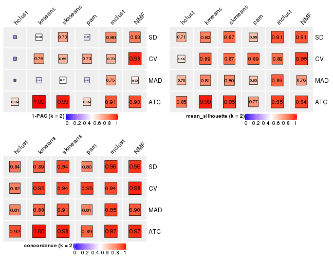</p>

</div>
<div id='tab-collect-stats-from-consensus-partition-list-2'>
<pre><code class="r">collect_stats(res_list, k = 3)
</code></pre>

<p>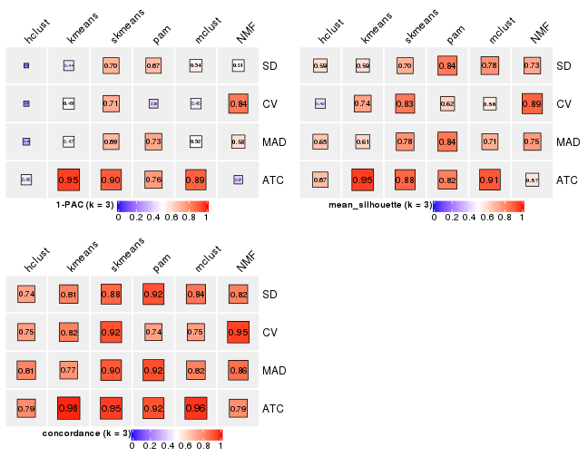</p>

</div>
<div id='tab-collect-stats-from-consensus-partition-list-3'>
<pre><code class="r">collect_stats(res_list, k = 4)
</code></pre>

<p>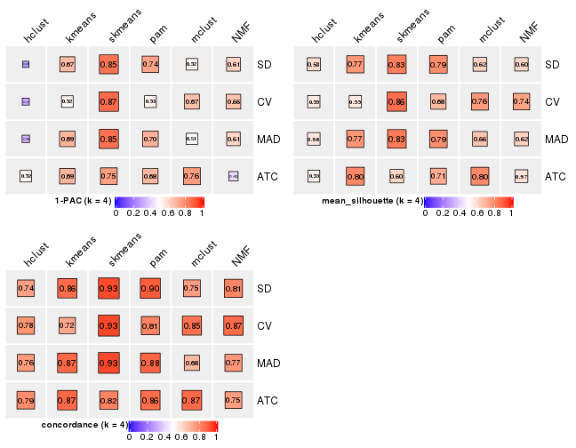</p>

</div>
<div id='tab-collect-stats-from-consensus-partition-list-4'>
<pre><code class="r">collect_stats(res_list, k = 5)
</code></pre>

<p>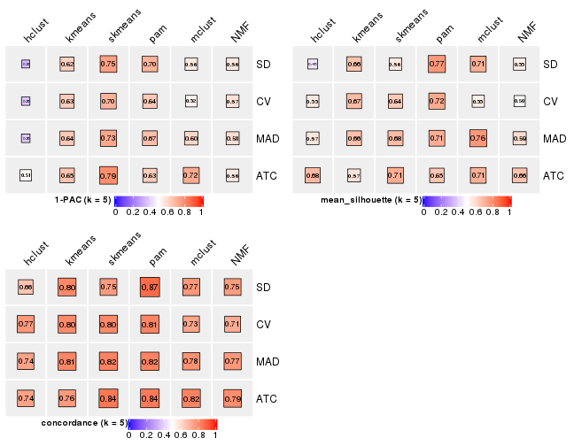</p>

</div>
<div id='tab-collect-stats-from-consensus-partition-list-5'>
<pre><code class="r">collect_stats(res_list, k = 6)
</code></pre>

<p>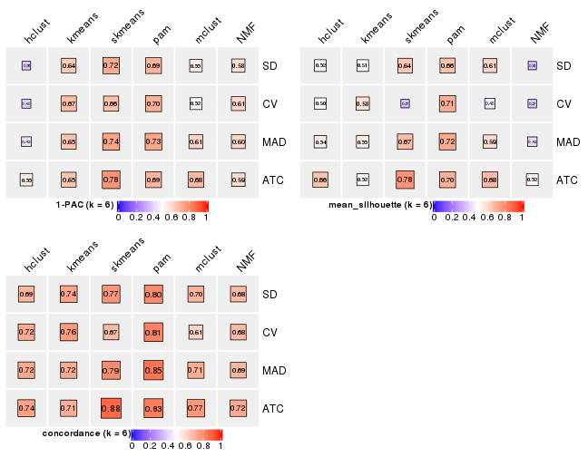</p>

</div>
</div>

### Partition from all methods


Collect partitions from all methods:


<script>
$( function() {
	$( '#tabs-collect-classes-from-consensus-partition-list' ).tabs();
} );
</script>
<div id='tabs-collect-classes-from-consensus-partition-list'>
<ul>
<li><a href='#tab-collect-classes-from-consensus-partition-list-1'>k = 2</a></li>
<li><a href='#tab-collect-classes-from-consensus-partition-list-2'>k = 3</a></li>
<li><a href='#tab-collect-classes-from-consensus-partition-list-3'>k = 4</a></li>
<li><a href='#tab-collect-classes-from-consensus-partition-list-4'>k = 5</a></li>
<li><a href='#tab-collect-classes-from-consensus-partition-list-5'>k = 6</a></li>
</ul>
<div id='tab-collect-classes-from-consensus-partition-list-1'>
<pre><code class="r">collect_classes(res_list, k = 2)
</code></pre>

<p>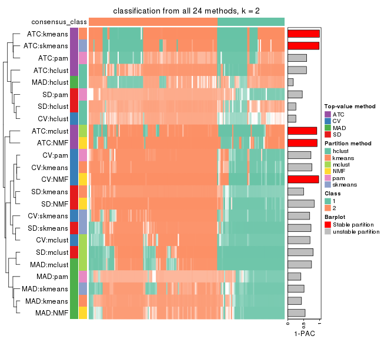</p>

</div>
<div id='tab-collect-classes-from-consensus-partition-list-2'>
<pre><code class="r">collect_classes(res_list, k = 3)
</code></pre>

<p>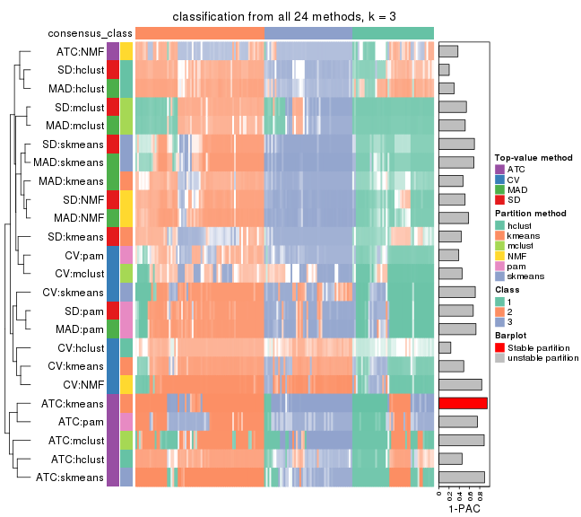</p>

</div>
<div id='tab-collect-classes-from-consensus-partition-list-3'>
<pre><code class="r">collect_classes(res_list, k = 4)
</code></pre>

<p>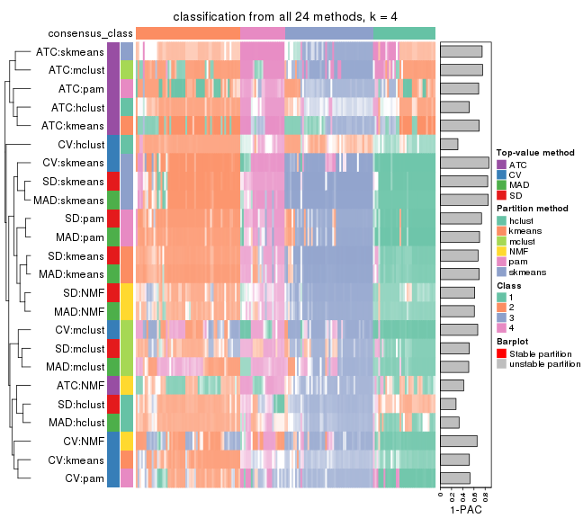</p>

</div>
<div id='tab-collect-classes-from-consensus-partition-list-4'>
<pre><code class="r">collect_classes(res_list, k = 5)
</code></pre>

<p>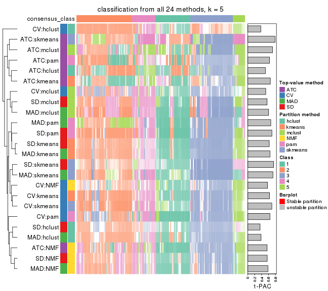</p>

</div>
<div id='tab-collect-classes-from-consensus-partition-list-5'>
<pre><code class="r">collect_classes(res_list, k = 6)
</code></pre>

<p>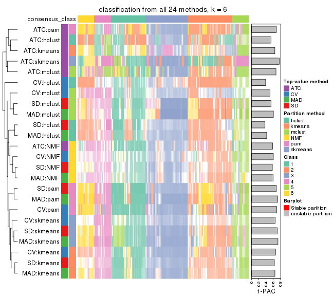</p>

</div>
</div>


### Top rows overlap


Overlap of top rows from different top-row methods:


<script>
$( function() {
	$( '#tabs-top-rows-overlap-by-euler' ).tabs();
} );
</script>
<div id='tabs-top-rows-overlap-by-euler'>
<ul>
<li><a href='#tab-top-rows-overlap-by-euler-1'>top_n = 1000</a></li>
<li><a href='#tab-top-rows-overlap-by-euler-2'>top_n = 2000</a></li>
<li><a href='#tab-top-rows-overlap-by-euler-3'>top_n = 3000</a></li>
<li><a href='#tab-top-rows-overlap-by-euler-4'>top_n = 4000</a></li>
<li><a href='#tab-top-rows-overlap-by-euler-5'>top_n = 5000</a></li>
</ul>
<div id='tab-top-rows-overlap-by-euler-1'>
<pre><code class="r">top_rows_overlap(res_list, top_n = 1000, method = &quot;euler&quot;)
</code></pre>

<p>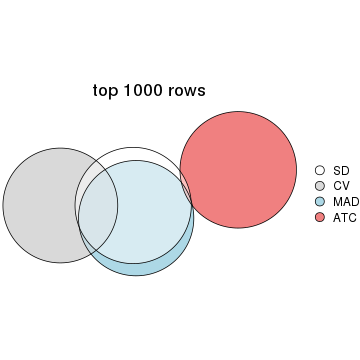</p>

</div>
<div id='tab-top-rows-overlap-by-euler-2'>
<pre><code class="r">top_rows_overlap(res_list, top_n = 2000, method = &quot;euler&quot;)
</code></pre>

<p>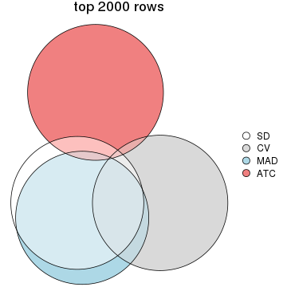</p>

</div>
<div id='tab-top-rows-overlap-by-euler-3'>
<pre><code class="r">top_rows_overlap(res_list, top_n = 3000, method = &quot;euler&quot;)
</code></pre>

<p>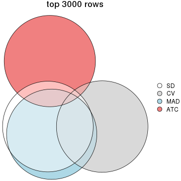</p>

</div>
<div id='tab-top-rows-overlap-by-euler-4'>
<pre><code class="r">top_rows_overlap(res_list, top_n = 4000, method = &quot;euler&quot;)
</code></pre>

<p>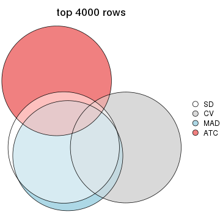</p>

</div>
<div id='tab-top-rows-overlap-by-euler-5'>
<pre><code class="r">top_rows_overlap(res_list, top_n = 5000, method = &quot;euler&quot;)
</code></pre>

<p>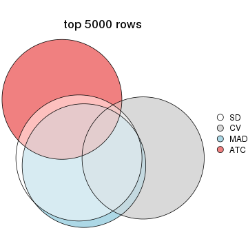</p>

</div>
</div>

Also visualize the correspondance of rankings between different top-row methods:


<script>
$( function() {
	$( '#tabs-top-rows-overlap-by-correspondance' ).tabs();
} );
</script>
<div id='tabs-top-rows-overlap-by-correspondance'>
<ul>
<li><a href='#tab-top-rows-overlap-by-correspondance-1'>top_n = 1000</a></li>
<li><a href='#tab-top-rows-overlap-by-correspondance-2'>top_n = 2000</a></li>
<li><a href='#tab-top-rows-overlap-by-correspondance-3'>top_n = 3000</a></li>
<li><a href='#tab-top-rows-overlap-by-correspondance-4'>top_n = 4000</a></li>
<li><a href='#tab-top-rows-overlap-by-correspondance-5'>top_n = 5000</a></li>
</ul>
<div id='tab-top-rows-overlap-by-correspondance-1'>
<pre><code class="r">top_rows_overlap(res_list, top_n = 1000, method = &quot;correspondance&quot;)
</code></pre>

<p>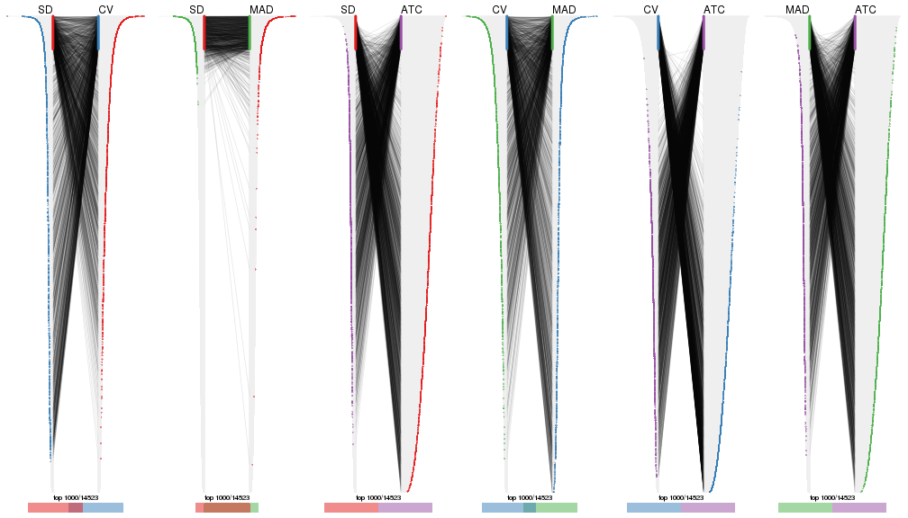</p>

</div>
<div id='tab-top-rows-overlap-by-correspondance-2'>
<pre><code class="r">top_rows_overlap(res_list, top_n = 2000, method = &quot;correspondance&quot;)
</code></pre>

<p>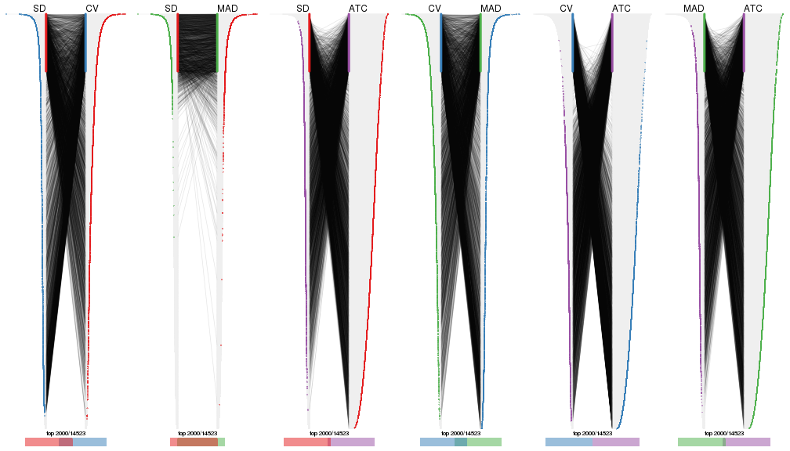</p>

</div>
<div id='tab-top-rows-overlap-by-correspondance-3'>
<pre><code class="r">top_rows_overlap(res_list, top_n = 3000, method = &quot;correspondance&quot;)
</code></pre>

<p>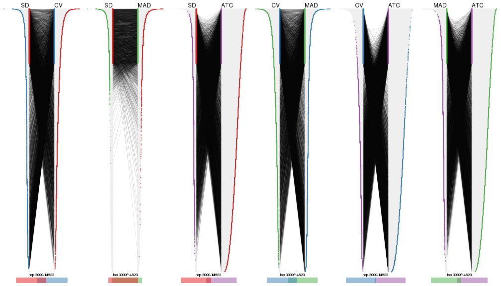</p>

</div>
<div id='tab-top-rows-overlap-by-correspondance-4'>
<pre><code class="r">top_rows_overlap(res_list, top_n = 4000, method = &quot;correspondance&quot;)
</code></pre>

<p>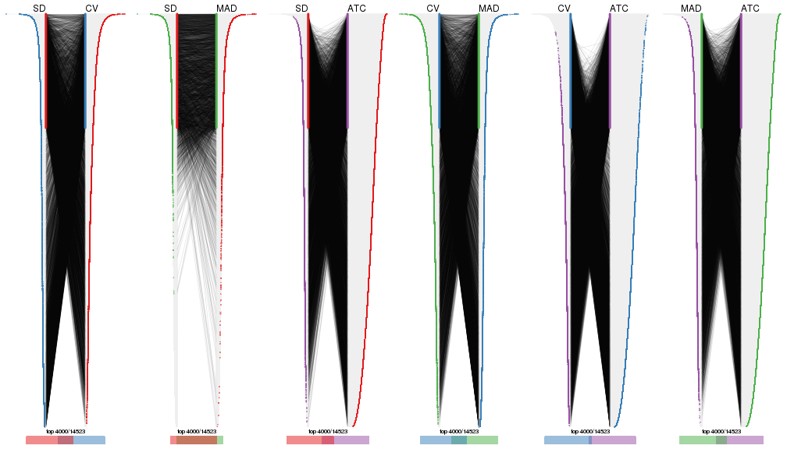</p>

</div>
<div id='tab-top-rows-overlap-by-correspondance-5'>
<pre><code class="r">top_rows_overlap(res_list, top_n = 5000, method = &quot;correspondance&quot;)
</code></pre>

<p>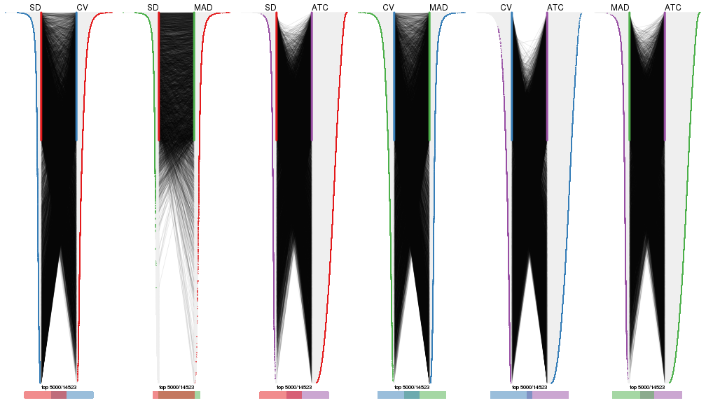</p>

</div>
</div>


Heatmaps of the top rows:


<script>
$( function() {
	$( '#tabs-top-rows-heatmap' ).tabs();
} );
</script>
<div id='tabs-top-rows-heatmap'>
<ul>
<li><a href='#tab-top-rows-heatmap-1'>top_n = 1000</a></li>
<li><a href='#tab-top-rows-heatmap-2'>top_n = 2000</a></li>
<li><a href='#tab-top-rows-heatmap-3'>top_n = 3000</a></li>
<li><a href='#tab-top-rows-heatmap-4'>top_n = 4000</a></li>
<li><a href='#tab-top-rows-heatmap-5'>top_n = 5000</a></li>
</ul>
<div id='tab-top-rows-heatmap-1'>
<pre><code class="r">top_rows_heatmap(res_list, top_n = 1000)
</code></pre>

<p>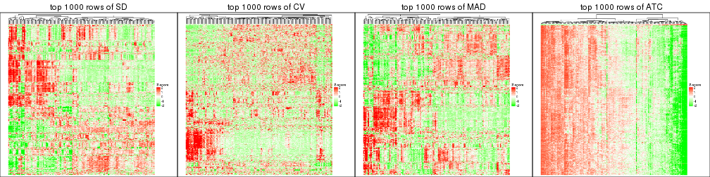</p>

</div>
<div id='tab-top-rows-heatmap-2'>
<pre><code class="r">top_rows_heatmap(res_list, top_n = 2000)
</code></pre>

<p>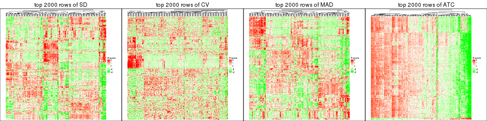</p>

</div>
<div id='tab-top-rows-heatmap-3'>
<pre><code class="r">top_rows_heatmap(res_list, top_n = 3000)
</code></pre>

<p>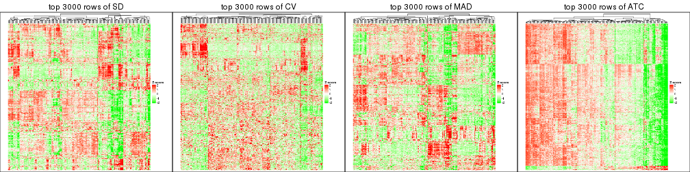</p>

</div>
<div id='tab-top-rows-heatmap-4'>
<pre><code class="r">top_rows_heatmap(res_list, top_n = 4000)
</code></pre>

<p>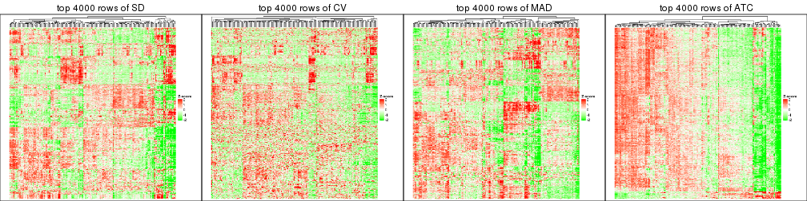</p>

</div>
<div id='tab-top-rows-heatmap-5'>
<pre><code class="r">top_rows_heatmap(res_list, top_n = 5000)
</code></pre>

<p>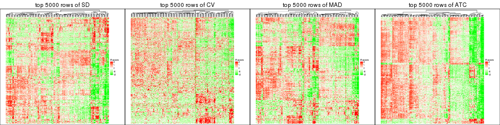</p>

</div>
</div>


 
## Results for each method


---------------------------------------------------


### SD:hclust


The object with results only for a single top-value method and a single partition method 
can be extracted as:

```r
res = res_list["SD", "hclust"]
# you can also extract it by
# res = res_list["SD:hclust"]
```

A summary of `res` and all the functions that can be applied to it:

```r
res
```

```
#> A 'ConsensusPartition' object with k = 2, 3, 4, 5, 6.
#>   On a matrix with 14523 rows and 169 columns.
#>   Top rows (1000, 2000, 3000, 4000, 5000) are extracted by 'SD' method.
#>   Subgroups are detected by 'hclust' method.
#>   Performed in total 1250 partitions by row resampling.
#>   Best k for subgroups seems to be 3.
#> 
#> Following methods can be applied to this 'ConsensusPartition' object:
#>  [1] "cola_report"             "collect_classes"         "collect_plots"          
#>  [4] "collect_stats"           "colnames"                "compare_signatures"     
#>  [7] "consensus_heatmap"       "dimension_reduction"     "functional_enrichment"  
#> [10] "get_anno_col"            "get_anno"                "get_classes"            
#> [13] "get_consensus"           "get_matrix"              "get_membership"         
#> [16] "get_param"               "get_signatures"          "get_stats"              
#> [19] "is_best_k"               "is_stable_k"             "membership_heatmap"     
#> [22] "ncol"                    "nrow"                    "plot_ecdf"              
#> [25] "rownames"                "select_partition_number" "show"                   
#> [28] "suggest_best_k"          "test_to_known_factors"
```

`collect_plots()` function collects all the plots made from `res` for all `k` (number of partitions)
into one single page to provide an easy and fast comparison between different `k`.

```r
collect_plots(res)
```

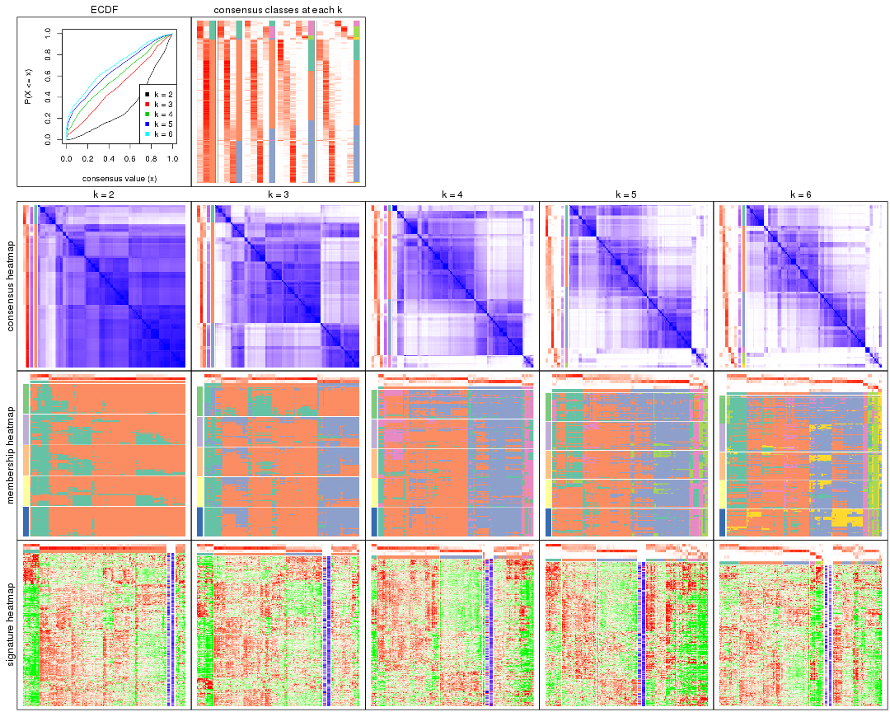

The plots are:

- The first row: a plot of the ECDF (Empirical cumulative distribution
  function) curves of the consensus matrix for each `k` and the heatmap of
  predicted classes for each `k`.
- The second row: heatmaps of the consensus matrix for each `k`.
- The third row: heatmaps of the membership matrix for each `k`.
- The fouth row: heatmaps of the signatures for each `k`.

All the plots in panels can be made by individual functions and they are
plotted later in this section.

`select_partition_number()` produces several plots showing different
statistics for choosing "optimized" `k`. There are following statistics:

- ECDF curves of the consensus matrix for each `k`;
- 1-PAC. [The PAC
  score](https://en.wikipedia.org/wiki/Consensus_clustering#Over-interpretation_potential_of_consensus_clustering)
  measures the proportion of the ambiguous subgrouping.
- Mean silhouette score.
- Concordance. The mean probability of fiting the consensus class ids in all
  partitions.
- Area increased. Denote $A_k$ as the area under the ECDF curve for current
  `k`, the area increased is defined as $A_k - A_{k-1}$.
- Rand index. The percent of pairs of samples that are both in a same cluster
  or both are not in a same cluster in the partition of k and k-1.
- Jaccard index. The ratio of pairs of samples are both in a same cluster in
  the partition of k and k-1 and the pairs of samples are both in a same
  cluster in the partition k or k-1.

The detailed explanations of these statistics can be found in [the cola
vignette](http://bioconductor.org/packages/devel/bioc/vignettes/cola/inst/doc/cola.html#toc_13).

Generally speaking, lower PAC score, higher mean silhouette score or higher
concordance corresponds to better partition. Rand index and Jaccard index
measure how similar the current partition is compared to partition with `k-1`.
If they are too similar, we won't accept `k` is better than `k-1`.

```r
select_partition_number(res)
```

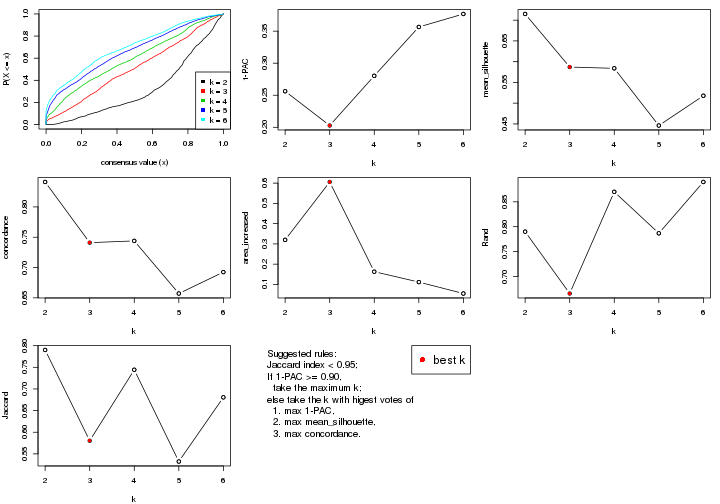

The numeric values for all these statistics can be obtained by `get_stats()`.

```r
get_stats(res)
```

```
#>   k 1-PAC mean_silhouette concordance area_increased  Rand Jaccard
#> 2 2 0.256           0.715       0.841         0.3201 0.790   0.790
#> 3 3 0.203           0.587       0.741         0.6057 0.666   0.580
#> 4 4 0.280           0.584       0.744         0.1630 0.870   0.744
#> 5 5 0.357           0.446       0.657         0.1117 0.787   0.532
#> 6 6 0.377           0.518       0.692         0.0552 0.890   0.681
```

`suggest_best_k()` suggests the best $k$ based on these statistics. The rules are as follows:

- All $k$ with Jaccard index larger than 0.95 are removed because the increase of
  the partition number does not provides enough extra information. If all $k$ are removed,
  the best $k$ is assigned by `NA`.
- For $k$ with 1-PAC larger than 0.9, the maximal $k$ is taken as the "best k". Other $k$ is called "optional k".
- If it does not fit the second rule. The $k$ with the highest vote of highest
  1-PAC, mean silhouette and concordance is taken as the "best k".

```r
suggest_best_k(res)
```

```
#> [1] 3
```


Following shows the table of the partitions (You need to click the **show/hide
code output** link to see it). The membership matrix (columns with name `p*`)
is inferred by
[`clue::cl_consensus()`](https://www.rdocumentation.org/link/cl_consensus?package=clue)
function with the `SE` method. Basically the value in the membership matrix
represents the probability to belong to a certain group. The finall class
label for an item is determined with the group with highest probability it
belongs to.

In `get_classes()` function, the entropy is calculated from the membership
matrix and the silhouette score is calculated from the consensus matrix.


<script>
$( function() {
	$( '#tabs-SD-hclust-get-classes' ).tabs();
} );
</script>
<div id='tabs-SD-hclust-get-classes'>
<ul>
<li><a href='#tab-SD-hclust-get-classes-1'>k = 2</a></li>
<li><a href='#tab-SD-hclust-get-classes-2'>k = 3</a></li>
<li><a href='#tab-SD-hclust-get-classes-3'>k = 4</a></li>
<li><a href='#tab-SD-hclust-get-classes-4'>k = 5</a></li>
<li><a href='#tab-SD-hclust-get-classes-5'>k = 6</a></li>
</ul>

<div id='tab-SD-hclust-get-classes-1'>
<p><a id='tab-SD-hclust-get-classes-1-a' style='color:#0366d6' href='#'>show/hide code output</a></p>
<pre><code class="r">cbind(get_classes(res, k = 2), get_membership(res, k = 2))
</code></pre>

<pre><code>#&gt;            class entropy silhouette    p1    p2
#&gt; SRR2052702     2  0.0376     0.8069 0.004 0.996
#&gt; SRR2052701     2  0.0672     0.8031 0.008 0.992
#&gt; SRR2052700     2  0.2603     0.8018 0.044 0.956
#&gt; SRR2052699     2  0.2423     0.8134 0.040 0.960
#&gt; SRR2052698     2  0.6531     0.7816 0.168 0.832
#&gt; SRR2052708     2  0.7674     0.6303 0.224 0.776
#&gt; SRR2052749     2  0.7674     0.6303 0.224 0.776
#&gt; SRR2052786     2  0.2043     0.8137 0.032 0.968
#&gt; SRR2052825     1  0.9286     0.7103 0.656 0.344
#&gt; SRR2052824     1  0.9286     0.7103 0.656 0.344
#&gt; SRR2052823     2  0.1633     0.8030 0.024 0.976
#&gt; SRR2052822     2  0.5946     0.7909 0.144 0.856
#&gt; SRR2052821     2  0.2603     0.8068 0.044 0.956
#&gt; SRR2052820     2  0.9129     0.6413 0.328 0.672
#&gt; SRR2052819     1  0.9552     0.6478 0.624 0.376
#&gt; SRR2052818     2  0.3114     0.7970 0.056 0.944
#&gt; SRR2052817     2  0.6623     0.7794 0.172 0.828
#&gt; SRR2052816     2  0.4815     0.7963 0.104 0.896
#&gt; SRR2052815     1  0.9286     0.7103 0.656 0.344
#&gt; SRR2052814     2  0.7883     0.5703 0.236 0.764
#&gt; SRR2052813     2  0.4431     0.8070 0.092 0.908
#&gt; SRR2052812     2  0.0376     0.8069 0.004 0.996
#&gt; SRR2052811     2  0.0376     0.8069 0.004 0.996
#&gt; SRR2052810     2  0.4022     0.7844 0.080 0.920
#&gt; SRR2052809     2  0.5059     0.8044 0.112 0.888
#&gt; SRR2052808     2  0.7453     0.7226 0.212 0.788
#&gt; SRR2052807     1  0.4022     0.7907 0.920 0.080
#&gt; SRR2052806     2  0.9933     0.0176 0.452 0.548
#&gt; SRR2052805     2  0.9922     0.0231 0.448 0.552
#&gt; SRR2052804     2  0.9795     0.4109 0.416 0.584
#&gt; SRR2052803     2  0.9922     0.0231 0.448 0.552
#&gt; SRR2052802     1  0.4298     0.7926 0.912 0.088
#&gt; SRR2052801     1  0.2603     0.7839 0.956 0.044
#&gt; SRR2052800     1  0.4298     0.7926 0.912 0.088
#&gt; SRR2052799     1  0.2778     0.7860 0.952 0.048
#&gt; SRR2052798     2  0.7674     0.6303 0.224 0.776
#&gt; SRR2052797     2  0.2778     0.8149 0.048 0.952
#&gt; SRR2052796     1  0.2603     0.7839 0.956 0.044
#&gt; SRR2052795     2  0.7674     0.6303 0.224 0.776
#&gt; SRR2052794     1  0.2603     0.7839 0.956 0.044
#&gt; SRR2052793     1  0.7602     0.7520 0.780 0.220
#&gt; SRR2052792     1  0.4562     0.7621 0.904 0.096
#&gt; SRR2052791     1  0.9896     0.0362 0.560 0.440
#&gt; SRR2052790     2  0.6438     0.7789 0.164 0.836
#&gt; SRR2052789     2  0.7376     0.7521 0.208 0.792
#&gt; SRR2052788     2  0.7376     0.7521 0.208 0.792
#&gt; SRR2052787     2  0.2603     0.8152 0.044 0.956
#&gt; SRR2052785     2  0.6343     0.7816 0.160 0.840
#&gt; SRR2052784     2  0.6148     0.7846 0.152 0.848
#&gt; SRR2052783     2  0.6247     0.7825 0.156 0.844
#&gt; SRR2052782     2  0.4431     0.8070 0.092 0.908
#&gt; SRR2052781     2  0.5519     0.7990 0.128 0.872
#&gt; SRR2052780     2  0.7376     0.7518 0.208 0.792
#&gt; SRR2052777     2  0.3584     0.8115 0.068 0.932
#&gt; SRR2052779     2  0.4431     0.8070 0.092 0.908
#&gt; SRR2052778     2  0.9087     0.6468 0.324 0.676
#&gt; SRR2052776     2  0.6048     0.7866 0.148 0.852
#&gt; SRR2052775     2  0.7219     0.7576 0.200 0.800
#&gt; SRR2052773     2  0.7376     0.7536 0.208 0.792
#&gt; SRR2052772     2  0.8555     0.7005 0.280 0.720
#&gt; SRR2052774     2  0.7376     0.7536 0.208 0.792
#&gt; SRR2052771     1  0.9896     0.0362 0.560 0.440
#&gt; SRR2052769     2  0.8813     0.6798 0.300 0.700
#&gt; SRR2052770     2  0.8861     0.6730 0.304 0.696
#&gt; SRR2052768     2  0.0376     0.8069 0.004 0.996
#&gt; SRR2052767     2  0.0376     0.8069 0.004 0.996
#&gt; SRR2052766     2  0.9977     0.3243 0.472 0.528
#&gt; SRR2052765     2  0.0672     0.8090 0.008 0.992
#&gt; SRR2052763     2  0.9044     0.6525 0.320 0.680
#&gt; SRR2052764     2  0.1414     0.8047 0.020 0.980
#&gt; SRR2052761     2  0.9129     0.6413 0.328 0.672
#&gt; SRR2052760     2  0.1414     0.8126 0.020 0.980
#&gt; SRR2052759     2  0.9044     0.6525 0.320 0.680
#&gt; SRR2052762     2  0.3114     0.8130 0.056 0.944
#&gt; SRR2052758     2  0.7376     0.7590 0.208 0.792
#&gt; SRR2052756     2  0.8661     0.4485 0.288 0.712
#&gt; SRR2052757     2  0.6343     0.7833 0.160 0.840
#&gt; SRR2052755     2  0.7299     0.6493 0.204 0.796
#&gt; SRR2052754     1  0.6247     0.7942 0.844 0.156
#&gt; SRR2052753     2  0.7219     0.6550 0.200 0.800
#&gt; SRR2052752     2  0.9661     0.2721 0.392 0.608
#&gt; SRR2052750     2  0.5842     0.7193 0.140 0.860
#&gt; SRR2052751     2  0.3274     0.8130 0.060 0.940
#&gt; SRR2052748     2  0.9635     0.5348 0.388 0.612
#&gt; SRR2052747     2  0.8661     0.5232 0.288 0.712
#&gt; SRR2052746     2  0.9044     0.6525 0.320 0.680
#&gt; SRR2052745     2  0.9044     0.6525 0.320 0.680
#&gt; SRR2052744     2  0.2948     0.7923 0.052 0.948
#&gt; SRR2052741     2  0.2236     0.8131 0.036 0.964
#&gt; SRR2052743     2  0.2603     0.8134 0.044 0.956
#&gt; SRR2052740     2  0.2236     0.8131 0.036 0.964
#&gt; SRR2052742     2  0.3274     0.8130 0.060 0.940
#&gt; SRR2052739     2  0.0672     0.8090 0.008 0.992
#&gt; SRR2052738     2  0.9129     0.6408 0.328 0.672
#&gt; SRR2052736     2  0.0672     0.8031 0.008 0.992
#&gt; SRR2052735     2  0.0672     0.8031 0.008 0.992
#&gt; SRR2052734     2  0.0672     0.8031 0.008 0.992
#&gt; SRR2052737     2  0.1414     0.8124 0.020 0.980
#&gt; SRR2052733     2  0.8861     0.6730 0.304 0.696
#&gt; SRR2052732     2  0.2603     0.7983 0.044 0.956
#&gt; SRR2052731     2  0.7299     0.7539 0.204 0.796
#&gt; SRR2052729     2  0.7528     0.6308 0.216 0.784
#&gt; SRR2052728     2  0.3431     0.7756 0.064 0.936
#&gt; SRR2052730     2  0.9248     0.5636 0.340 0.660
#&gt; SRR2052727     2  0.6438     0.6944 0.164 0.836
#&gt; SRR2052725     2  0.1184     0.8035 0.016 0.984
#&gt; SRR2052726     2  0.0672     0.8031 0.008 0.992
#&gt; SRR2052724     2  0.7674     0.6303 0.224 0.776
#&gt; SRR2052723     2  0.9686     0.5193 0.396 0.604
#&gt; SRR2052722     2  0.7528     0.7475 0.216 0.784
#&gt; SRR2052721     2  0.5946     0.7173 0.144 0.856
#&gt; SRR2052720     2  0.1843     0.8134 0.028 0.972
#&gt; SRR2052719     2  0.0672     0.8090 0.008 0.992
#&gt; SRR2052718     2  0.2423     0.7946 0.040 0.960
#&gt; SRR2052717     2  0.3114     0.8130 0.056 0.944
#&gt; SRR2052714     2  0.7745     0.6420 0.228 0.772
#&gt; SRR2052716     2  0.9129     0.6413 0.328 0.672
#&gt; SRR2052715     2  0.7528     0.7476 0.216 0.784
#&gt; SRR2052713     2  0.7883     0.5969 0.236 0.764
#&gt; SRR2052712     1  0.9286     0.7103 0.656 0.344
#&gt; SRR2052711     2  0.8555     0.4672 0.280 0.720
#&gt; SRR2052710     2  0.3431     0.7941 0.064 0.936
#&gt; SRR2052707     2  0.8555     0.7011 0.280 0.720
#&gt; SRR2052709     2  0.7528     0.7476 0.216 0.784
#&gt; SRR2052704     2  0.9460     0.5806 0.364 0.636
#&gt; SRR2052705     2  0.2603     0.8134 0.044 0.956
#&gt; SRR2052697     2  0.0376     0.8069 0.004 0.996
#&gt; SRR2052703     2  0.7376     0.7536 0.208 0.792
#&gt; SRR2052696     2  0.7674     0.6304 0.224 0.776
#&gt; SRR2052706     2  0.2603     0.8068 0.044 0.956
#&gt; SRR2052695     2  0.1414     0.8128 0.020 0.980
#&gt; SRR2052694     2  0.1414     0.8126 0.020 0.980
#&gt; SRR2052692     2  0.7376     0.7590 0.208 0.792
#&gt; SRR2052693     2  0.6343     0.7833 0.160 0.840
#&gt; SRR2052691     2  0.2236     0.8131 0.036 0.964
#&gt; SRR2052690     2  0.2236     0.8131 0.036 0.964
#&gt; SRR2052689     2  0.9248     0.5636 0.340 0.660
#&gt; SRR2052687     2  0.7815     0.7081 0.232 0.768
#&gt; SRR2052686     2  0.1633     0.8023 0.024 0.976
#&gt; SRR2052688     2  0.1414     0.8124 0.020 0.980
#&gt; SRR2052684     2  0.9996     0.2775 0.488 0.512
#&gt; SRR2052685     2  0.0938     0.8103 0.012 0.988
#&gt; SRR2052683     1  0.6247     0.7855 0.844 0.156
#&gt; SRR2052681     2  0.4161     0.7816 0.084 0.916
#&gt; SRR2052680     1  0.9286     0.7103 0.656 0.344
#&gt; SRR2052682     2  0.0672     0.8031 0.008 0.992
#&gt; SRR2052679     2  0.6438     0.6944 0.164 0.836
#&gt; SRR2052678     2  0.7299     0.7556 0.204 0.796
#&gt; SRR2052677     2  0.5178     0.7989 0.116 0.884
#&gt; SRR2052675     2  0.0376     0.8069 0.004 0.996
#&gt; SRR2052676     2  0.6048     0.7178 0.148 0.852
#&gt; SRR2052674     2  0.3879     0.7990 0.076 0.924
#&gt; SRR2052672     2  0.7528     0.7481 0.216 0.784
#&gt; SRR2052673     2  0.0672     0.8031 0.008 0.992
#&gt; SRR2052671     2  0.0672     0.8090 0.008 0.992
#&gt; SRR2052670     2  0.7453     0.7503 0.212 0.788
#&gt; SRR2052669     2  0.1843     0.8137 0.028 0.972
#&gt; SRR2052668     2  0.2236     0.8131 0.036 0.964
#&gt; SRR2052667     2  0.2948     0.8073 0.052 0.948
#&gt; SRR2052666     2  0.7602     0.7430 0.220 0.780
#&gt; SRR2052665     2  0.2423     0.8134 0.040 0.960
#&gt; SRR2052664     1  0.6531     0.7922 0.832 0.168
#&gt; SRR2052663     2  0.1414     0.8047 0.020 0.980
#&gt; SRR2052662     2  0.2236     0.8140 0.036 0.964
#&gt; SRR2052661     2  0.2778     0.7876 0.048 0.952
#&gt; SRR2052660     2  0.7674     0.7468 0.224 0.776
#&gt; SRR2052659     2  0.9129     0.6405 0.328 0.672
#&gt; SRR2052658     2  0.2423     0.8134 0.040 0.960
#&gt; SRR2052657     2  0.7674     0.6221 0.224 0.776
</code></pre>

<script>
$('#tab-SD-hclust-get-classes-1-a').parent().next().next().hide();
$('#tab-SD-hclust-get-classes-1-a').click(function(){
  $('#tab-SD-hclust-get-classes-1-a').parent().next().next().toggle();
  return(false);
});
</script>
</div>

<div id='tab-SD-hclust-get-classes-2'>
<p><a id='tab-SD-hclust-get-classes-2-a' style='color:#0366d6' href='#'>show/hide code output</a></p>
<pre><code class="r">cbind(get_classes(res, k = 3), get_membership(res, k = 3))
</code></pre>

<pre><code>#&gt;            class entropy silhouette    p1    p2    p3
#&gt; SRR2052702     2  0.1267    0.71978 0.004 0.972 0.024
#&gt; SRR2052701     2  0.1170    0.72054 0.008 0.976 0.016
#&gt; SRR2052700     2  0.2689    0.71836 0.036 0.932 0.032
#&gt; SRR2052699     2  0.3941    0.63532 0.000 0.844 0.156
#&gt; SRR2052698     3  0.6520    0.42522 0.004 0.488 0.508
#&gt; SRR2052708     2  0.6168    0.56101 0.224 0.740 0.036
#&gt; SRR2052749     2  0.6168    0.56101 0.224 0.740 0.036
#&gt; SRR2052786     2  0.3752    0.66492 0.000 0.856 0.144
#&gt; SRR2052825     1  0.8455    0.66065 0.584 0.296 0.120
#&gt; SRR2052824     1  0.8455    0.66065 0.584 0.296 0.120
#&gt; SRR2052823     2  0.1774    0.72204 0.016 0.960 0.024
#&gt; SRR2052822     2  0.6500   -0.29303 0.004 0.532 0.464
#&gt; SRR2052821     2  0.3678    0.71004 0.028 0.892 0.080
#&gt; SRR2052820     3  0.5772    0.79485 0.024 0.220 0.756
#&gt; SRR2052819     1  0.8994    0.54003 0.556 0.260 0.184
#&gt; SRR2052818     2  0.2793    0.71204 0.044 0.928 0.028
#&gt; SRR2052817     3  0.6505    0.48758 0.004 0.468 0.528
#&gt; SRR2052816     2  0.6007    0.57617 0.048 0.768 0.184
#&gt; SRR2052815     1  0.8455    0.66065 0.584 0.296 0.120
#&gt; SRR2052814     2  0.7543    0.52066 0.216 0.680 0.104
#&gt; SRR2052813     2  0.5760    0.27684 0.000 0.672 0.328
#&gt; SRR2052812     2  0.1267    0.71978 0.004 0.972 0.024
#&gt; SRR2052811     2  0.1267    0.71978 0.004 0.972 0.024
#&gt; SRR2052810     2  0.3406    0.70497 0.068 0.904 0.028
#&gt; SRR2052809     2  0.6330    0.02680 0.004 0.600 0.396
#&gt; SRR2052808     2  0.7793    0.00471 0.052 0.524 0.424
#&gt; SRR2052807     1  0.4702    0.74965 0.788 0.000 0.212
#&gt; SRR2052806     2  0.7534    0.11145 0.428 0.532 0.040
#&gt; SRR2052805     2  0.7366    0.09648 0.444 0.524 0.032
#&gt; SRR2052804     3  0.7984    0.58358 0.132 0.216 0.652
#&gt; SRR2052803     2  0.7366    0.09648 0.444 0.524 0.032
#&gt; SRR2052802     1  0.5363    0.73691 0.724 0.000 0.276
#&gt; SRR2052801     1  0.3116    0.76591 0.892 0.000 0.108
#&gt; SRR2052800     1  0.5363    0.73691 0.724 0.000 0.276
#&gt; SRR2052799     1  0.3425    0.76633 0.884 0.004 0.112
#&gt; SRR2052798     2  0.6168    0.56101 0.224 0.740 0.036
#&gt; SRR2052797     2  0.3826    0.69045 0.008 0.868 0.124
#&gt; SRR2052796     1  0.3116    0.76591 0.892 0.000 0.108
#&gt; SRR2052795     2  0.6168    0.56101 0.224 0.740 0.036
#&gt; SRR2052794     1  0.3192    0.76517 0.888 0.000 0.112
#&gt; SRR2052793     1  0.6354    0.69607 0.748 0.196 0.056
#&gt; SRR2052792     1  0.6460    0.62014 0.556 0.004 0.440
#&gt; SRR2052791     3  0.7266    0.11059 0.232 0.080 0.688
#&gt; SRR2052790     3  0.6309    0.41529 0.000 0.500 0.500
#&gt; SRR2052789     3  0.6126    0.76571 0.004 0.352 0.644
#&gt; SRR2052788     3  0.6126    0.76571 0.004 0.352 0.644
#&gt; SRR2052787     2  0.4002    0.64900 0.000 0.840 0.160
#&gt; SRR2052785     2  0.6518   -0.39107 0.004 0.512 0.484
#&gt; SRR2052784     2  0.6291   -0.32141 0.000 0.532 0.468
#&gt; SRR2052783     2  0.6295   -0.33672 0.000 0.528 0.472
#&gt; SRR2052782     2  0.5760    0.27684 0.000 0.672 0.328
#&gt; SRR2052781     2  0.6442   -0.16686 0.004 0.564 0.432
#&gt; SRR2052780     3  0.5882    0.77116 0.000 0.348 0.652
#&gt; SRR2052777     2  0.5733    0.28809 0.000 0.676 0.324
#&gt; SRR2052779     2  0.5760    0.27684 0.000 0.672 0.328
#&gt; SRR2052778     3  0.5414    0.79437 0.016 0.212 0.772
#&gt; SRR2052776     2  0.6302   -0.36708 0.000 0.520 0.480
#&gt; SRR2052775     3  0.6247    0.73294 0.004 0.376 0.620
#&gt; SRR2052773     3  0.6209    0.74434 0.004 0.368 0.628
#&gt; SRR2052772     3  0.5848    0.80195 0.012 0.268 0.720
#&gt; SRR2052774     3  0.6209    0.74434 0.004 0.368 0.628
#&gt; SRR2052771     3  0.7266    0.11059 0.232 0.080 0.688
#&gt; SRR2052769     3  0.6702    0.74759 0.024 0.328 0.648
#&gt; SRR2052770     3  0.6016    0.80172 0.020 0.256 0.724
#&gt; SRR2052768     2  0.2772    0.70795 0.004 0.916 0.080
#&gt; SRR2052767     2  0.1267    0.71978 0.004 0.972 0.024
#&gt; SRR2052766     3  0.6981    0.58982 0.136 0.132 0.732
#&gt; SRR2052765     2  0.2878    0.69897 0.000 0.904 0.096
#&gt; SRR2052763     3  0.5315    0.79613 0.012 0.216 0.772
#&gt; SRR2052764     2  0.1182    0.72023 0.012 0.976 0.012
#&gt; SRR2052761     3  0.5772    0.79485 0.024 0.220 0.756
#&gt; SRR2052760     2  0.2796    0.69955 0.000 0.908 0.092
#&gt; SRR2052759     3  0.5315    0.79613 0.012 0.216 0.772
#&gt; SRR2052762     2  0.4654    0.56638 0.000 0.792 0.208
#&gt; SRR2052758     3  0.5926    0.75807 0.000 0.356 0.644
#&gt; SRR2052756     2  0.7146    0.43039 0.264 0.676 0.060
#&gt; SRR2052757     2  0.6521   -0.42360 0.004 0.500 0.496
#&gt; SRR2052755     2  0.5318    0.59267 0.204 0.780 0.016
#&gt; SRR2052754     1  0.4371    0.75930 0.860 0.108 0.032
#&gt; SRR2052753     2  0.5269    0.59829 0.200 0.784 0.016
#&gt; SRR2052752     2  0.8925    0.16954 0.364 0.504 0.132
#&gt; SRR2052750     2  0.4411    0.65349 0.140 0.844 0.016
#&gt; SRR2052751     2  0.5291    0.45612 0.000 0.732 0.268
#&gt; SRR2052748     3  0.5470    0.73641 0.036 0.168 0.796
#&gt; SRR2052747     2  0.6294    0.45842 0.288 0.692 0.020
#&gt; SRR2052746     3  0.5315    0.79613 0.012 0.216 0.772
#&gt; SRR2052745     3  0.5315    0.79613 0.012 0.216 0.772
#&gt; SRR2052744     2  0.2384    0.70847 0.056 0.936 0.008
#&gt; SRR2052741     2  0.3941    0.63608 0.000 0.844 0.156
#&gt; SRR2052743     2  0.4121    0.62248 0.000 0.832 0.168
#&gt; SRR2052740     2  0.3941    0.63608 0.000 0.844 0.156
#&gt; SRR2052742     2  0.5138    0.48656 0.000 0.748 0.252
#&gt; SRR2052739     2  0.2796    0.69933 0.000 0.908 0.092
#&gt; SRR2052738     3  0.5220    0.79143 0.012 0.208 0.780
#&gt; SRR2052736     2  0.0424    0.71957 0.008 0.992 0.000
#&gt; SRR2052735     2  0.0424    0.71957 0.008 0.992 0.000
#&gt; SRR2052734     2  0.0424    0.71957 0.008 0.992 0.000
#&gt; SRR2052737     2  0.3267    0.68520 0.000 0.884 0.116
#&gt; SRR2052733     3  0.5977    0.80158 0.020 0.252 0.728
#&gt; SRR2052732     2  0.2313    0.71518 0.032 0.944 0.024
#&gt; SRR2052731     3  0.5905    0.76538 0.000 0.352 0.648
#&gt; SRR2052729     2  0.5461    0.57032 0.216 0.768 0.016
#&gt; SRR2052728     2  0.2774    0.69434 0.072 0.920 0.008
#&gt; SRR2052730     3  0.7666    0.62319 0.076 0.288 0.636
#&gt; SRR2052727     2  0.4782    0.63108 0.164 0.820 0.016
#&gt; SRR2052725     2  0.0747    0.71933 0.016 0.984 0.000
#&gt; SRR2052726     2  0.0424    0.71957 0.008 0.992 0.000
#&gt; SRR2052724     2  0.6168    0.56101 0.224 0.740 0.036
#&gt; SRR2052723     3  0.5407    0.72166 0.040 0.156 0.804
#&gt; SRR2052722     3  0.6081    0.77045 0.004 0.344 0.652
#&gt; SRR2052721     2  0.4475    0.64934 0.144 0.840 0.016
#&gt; SRR2052720     2  0.3686    0.66810 0.000 0.860 0.140
#&gt; SRR2052719     2  0.2066    0.71163 0.000 0.940 0.060
#&gt; SRR2052718     2  0.1765    0.71215 0.040 0.956 0.004
#&gt; SRR2052717     2  0.4654    0.56638 0.000 0.792 0.208
#&gt; SRR2052714     2  0.7739    0.54121 0.204 0.672 0.124
#&gt; SRR2052716     3  0.5772    0.79485 0.024 0.220 0.756
#&gt; SRR2052715     3  0.5760    0.78391 0.000 0.328 0.672
#&gt; SRR2052713     2  0.5817    0.53838 0.236 0.744 0.020
#&gt; SRR2052712     1  0.8455    0.66065 0.584 0.296 0.120
#&gt; SRR2052711     2  0.7076    0.45070 0.256 0.684 0.060
#&gt; SRR2052710     2  0.4586    0.70305 0.048 0.856 0.096
#&gt; SRR2052707     3  0.5775    0.80179 0.012 0.260 0.728
#&gt; SRR2052709     3  0.5760    0.78391 0.000 0.328 0.672
#&gt; SRR2052704     3  0.5223    0.76040 0.024 0.176 0.800
#&gt; SRR2052705     2  0.4121    0.62248 0.000 0.832 0.168
#&gt; SRR2052697     2  0.1267    0.71978 0.004 0.972 0.024
#&gt; SRR2052703     3  0.6209    0.74434 0.004 0.368 0.628
#&gt; SRR2052696     2  0.6168    0.56121 0.224 0.740 0.036
#&gt; SRR2052706     2  0.3499    0.71322 0.028 0.900 0.072
#&gt; SRR2052695     2  0.2959    0.69747 0.000 0.900 0.100
#&gt; SRR2052694     2  0.2796    0.69955 0.000 0.908 0.092
#&gt; SRR2052692     3  0.5948    0.75616 0.000 0.360 0.640
#&gt; SRR2052693     2  0.6521   -0.42360 0.004 0.500 0.496
#&gt; SRR2052691     2  0.4002    0.63290 0.000 0.840 0.160
#&gt; SRR2052690     2  0.3879    0.63885 0.000 0.848 0.152
#&gt; SRR2052689     3  0.7666    0.62319 0.076 0.288 0.636
#&gt; SRR2052687     2  0.8033   -0.07184 0.064 0.512 0.424
#&gt; SRR2052686     2  0.1129    0.71862 0.020 0.976 0.004
#&gt; SRR2052688     2  0.3267    0.68520 0.000 0.884 0.116
#&gt; SRR2052684     3  0.3791    0.49275 0.060 0.048 0.892
#&gt; SRR2052685     2  0.2625    0.70260 0.000 0.916 0.084
#&gt; SRR2052683     1  0.4063    0.75513 0.868 0.112 0.020
#&gt; SRR2052681     2  0.3764    0.70730 0.068 0.892 0.040
#&gt; SRR2052680     1  0.8455    0.66065 0.584 0.296 0.120
#&gt; SRR2052682     2  0.0424    0.71957 0.008 0.992 0.000
#&gt; SRR2052679     2  0.4782    0.63108 0.164 0.820 0.016
#&gt; SRR2052678     3  0.6045    0.72588 0.000 0.380 0.620
#&gt; SRR2052677     2  0.6079    0.04563 0.000 0.612 0.388
#&gt; SRR2052675     2  0.1267    0.71978 0.004 0.972 0.024
#&gt; SRR2052676     2  0.4453    0.64093 0.152 0.836 0.012
#&gt; SRR2052674     2  0.5267    0.65603 0.044 0.816 0.140
#&gt; SRR2052672     3  0.5785    0.78203 0.000 0.332 0.668
#&gt; SRR2052673     2  0.0424    0.71957 0.008 0.992 0.000
#&gt; SRR2052671     2  0.1529    0.71689 0.000 0.960 0.040
#&gt; SRR2052670     3  0.6081    0.77160 0.004 0.344 0.652
#&gt; SRR2052669     2  0.3686    0.66811 0.000 0.860 0.140
#&gt; SRR2052668     2  0.4062    0.62832 0.000 0.836 0.164
#&gt; SRR2052667     2  0.4662    0.69411 0.032 0.844 0.124
#&gt; SRR2052666     3  0.5650    0.78753 0.000 0.312 0.688
#&gt; SRR2052665     2  0.4121    0.62229 0.000 0.832 0.168
#&gt; SRR2052664     1  0.4591    0.75740 0.848 0.120 0.032
#&gt; SRR2052663     2  0.1182    0.72023 0.012 0.976 0.012
#&gt; SRR2052662     2  0.3752    0.66068 0.000 0.856 0.144
#&gt; SRR2052661     2  0.2200    0.70442 0.056 0.940 0.004
#&gt; SRR2052660     3  0.6081    0.77237 0.004 0.344 0.652
#&gt; SRR2052659     3  0.5551    0.79249 0.020 0.212 0.768
#&gt; SRR2052658     2  0.3941    0.63532 0.000 0.844 0.156
#&gt; SRR2052657     2  0.6168    0.55377 0.224 0.740 0.036
</code></pre>

<script>
$('#tab-SD-hclust-get-classes-2-a').parent().next().next().hide();
$('#tab-SD-hclust-get-classes-2-a').click(function(){
  $('#tab-SD-hclust-get-classes-2-a').parent().next().next().toggle();
  return(false);
});
</script>
</div>

<div id='tab-SD-hclust-get-classes-3'>
<p><a id='tab-SD-hclust-get-classes-3-a' style='color:#0366d6' href='#'>show/hide code output</a></p>
<pre><code class="r">cbind(get_classes(res, k = 4), get_membership(res, k = 4))
</code></pre>

<pre><code>#&gt;            class entropy silhouette    p1    p2    p3    p4
#&gt; SRR2052702     2   0.249     0.7251 0.020 0.912 0.068 0.000
#&gt; SRR2052701     2   0.201     0.7244 0.004 0.932 0.060 0.004
#&gt; SRR2052700     2   0.497     0.6758 0.140 0.772 0.088 0.000
#&gt; SRR2052699     2   0.423     0.6439 0.004 0.764 0.228 0.004
#&gt; SRR2052698     3   0.488     0.6070 0.008 0.296 0.692 0.004
#&gt; SRR2052708     2   0.641     0.4883 0.068 0.680 0.032 0.220
#&gt; SRR2052749     2   0.641     0.4883 0.068 0.680 0.032 0.220
#&gt; SRR2052786     2   0.419     0.6460 0.000 0.752 0.244 0.004
#&gt; SRR2052825     1   0.442     0.9133 0.812 0.132 0.052 0.004
#&gt; SRR2052824     1   0.442     0.9133 0.812 0.132 0.052 0.004
#&gt; SRR2052823     2   0.352     0.7242 0.052 0.864 0.084 0.000
#&gt; SRR2052822     3   0.512     0.4488 0.004 0.376 0.616 0.004
#&gt; SRR2052821     2   0.566     0.6774 0.124 0.720 0.156 0.000
#&gt; SRR2052820     3   0.262     0.7177 0.016 0.036 0.920 0.028
#&gt; SRR2052819     1   0.539     0.5912 0.736 0.056 0.200 0.008
#&gt; SRR2052818     2   0.471     0.6508 0.172 0.776 0.052 0.000
#&gt; SRR2052817     3   0.482     0.6236 0.008 0.288 0.700 0.004
#&gt; SRR2052816     2   0.681     0.5120 0.144 0.612 0.240 0.004
#&gt; SRR2052815     1   0.442     0.9133 0.812 0.132 0.052 0.004
#&gt; SRR2052814     2   0.729     0.2488 0.364 0.480 0.156 0.000
#&gt; SRR2052813     2   0.537     0.1400 0.012 0.544 0.444 0.000
#&gt; SRR2052812     2   0.249     0.7251 0.020 0.912 0.068 0.000
#&gt; SRR2052811     2   0.249     0.7251 0.020 0.912 0.068 0.000
#&gt; SRR2052810     2   0.500     0.6271 0.200 0.748 0.052 0.000
#&gt; SRR2052809     3   0.545     0.1602 0.008 0.468 0.520 0.004
#&gt; SRR2052808     3   0.754     0.1932 0.144 0.344 0.500 0.012
#&gt; SRR2052807     4   0.545     0.4624 0.360 0.000 0.024 0.616
#&gt; SRR2052806     4   0.730    -0.1637 0.096 0.444 0.016 0.444
#&gt; SRR2052805     2   0.735     0.0707 0.092 0.448 0.020 0.440
#&gt; SRR2052804     3   0.700     0.5111 0.140 0.064 0.676 0.120
#&gt; SRR2052803     2   0.735     0.0707 0.092 0.448 0.020 0.440
#&gt; SRR2052802     4   0.651     0.3414 0.456 0.000 0.072 0.472
#&gt; SRR2052801     4   0.546     0.4486 0.392 0.000 0.020 0.588
#&gt; SRR2052800     4   0.651     0.3414 0.456 0.000 0.072 0.472
#&gt; SRR2052799     4   0.479     0.5090 0.236 0.004 0.020 0.740
#&gt; SRR2052798     2   0.641     0.4883 0.068 0.680 0.032 0.220
#&gt; SRR2052797     2   0.553     0.6520 0.076 0.712 0.212 0.000
#&gt; SRR2052796     4   0.545     0.4516 0.388 0.000 0.020 0.592
#&gt; SRR2052795     2   0.641     0.4883 0.068 0.680 0.032 0.220
#&gt; SRR2052794     4   0.461     0.5080 0.236 0.000 0.020 0.744
#&gt; SRR2052793     4   0.604     0.3357 0.116 0.140 0.020 0.724
#&gt; SRR2052792     4   0.766     0.1411 0.380 0.000 0.212 0.408
#&gt; SRR2052791     3   0.843     0.1334 0.192 0.060 0.512 0.236
#&gt; SRR2052790     3   0.505     0.5653 0.004 0.328 0.660 0.008
#&gt; SRR2052789     3   0.325     0.7671 0.000 0.140 0.852 0.008
#&gt; SRR2052788     3   0.325     0.7671 0.000 0.140 0.852 0.008
#&gt; SRR2052787     2   0.440     0.6354 0.004 0.744 0.248 0.004
#&gt; SRR2052785     3   0.482     0.5359 0.000 0.344 0.652 0.004
#&gt; SRR2052784     3   0.511     0.4717 0.004 0.372 0.620 0.004
#&gt; SRR2052783     3   0.508     0.4895 0.004 0.364 0.628 0.004
#&gt; SRR2052782     2   0.537     0.1400 0.012 0.544 0.444 0.000
#&gt; SRR2052781     3   0.537     0.3488 0.008 0.412 0.576 0.004
#&gt; SRR2052780     3   0.324     0.7682 0.004 0.136 0.856 0.004
#&gt; SRR2052777     2   0.526     0.1309 0.008 0.548 0.444 0.000
#&gt; SRR2052779     2   0.537     0.1400 0.012 0.544 0.444 0.000
#&gt; SRR2052778     3   0.272     0.7236 0.024 0.040 0.916 0.020
#&gt; SRR2052776     3   0.480     0.5469 0.000 0.340 0.656 0.004
#&gt; SRR2052775     3   0.345     0.7626 0.000 0.156 0.836 0.008
#&gt; SRR2052773     3   0.350     0.7619 0.000 0.160 0.832 0.008
#&gt; SRR2052772     3   0.259     0.7506 0.008 0.068 0.912 0.012
#&gt; SRR2052774     3   0.350     0.7619 0.000 0.160 0.832 0.008
#&gt; SRR2052771     3   0.843     0.1334 0.192 0.060 0.512 0.236
#&gt; SRR2052769     3   0.491     0.7225 0.040 0.152 0.788 0.020
#&gt; SRR2052770     3   0.349     0.7465 0.032 0.068 0.880 0.020
#&gt; SRR2052768     2   0.379     0.7096 0.016 0.820 0.164 0.000
#&gt; SRR2052767     2   0.249     0.7251 0.020 0.912 0.068 0.000
#&gt; SRR2052766     3   0.562     0.5629 0.116 0.012 0.748 0.124
#&gt; SRR2052765     2   0.404     0.6990 0.020 0.804 0.176 0.000
#&gt; SRR2052763     3   0.253     0.7222 0.020 0.032 0.924 0.024
#&gt; SRR2052764     2   0.313     0.7024 0.076 0.884 0.040 0.000
#&gt; SRR2052761     3   0.262     0.7177 0.016 0.036 0.920 0.028
#&gt; SRR2052760     2   0.388     0.6996 0.016 0.812 0.172 0.000
#&gt; SRR2052759     3   0.253     0.7222 0.020 0.032 0.924 0.024
#&gt; SRR2052762     2   0.503     0.5231 0.016 0.672 0.312 0.000
#&gt; SRR2052758     3   0.348     0.7676 0.004 0.144 0.844 0.008
#&gt; SRR2052756     2   0.662     0.0652 0.404 0.532 0.044 0.020
#&gt; SRR2052757     3   0.456     0.6070 0.000 0.296 0.700 0.004
#&gt; SRR2052755     2   0.564     0.5212 0.068 0.720 0.008 0.204
#&gt; SRR2052754     4   0.643     0.3261 0.372 0.076 0.000 0.552
#&gt; SRR2052753     2   0.580     0.5319 0.072 0.716 0.012 0.200
#&gt; SRR2052752     2   0.864     0.1082 0.084 0.432 0.124 0.360
#&gt; SRR2052750     2   0.446     0.5886 0.044 0.792 0.000 0.164
#&gt; SRR2052751     2   0.496     0.3822 0.000 0.616 0.380 0.004
#&gt; SRR2052748     3   0.350     0.6723 0.048 0.016 0.880 0.056
#&gt; SRR2052747     2   0.632     0.4080 0.084 0.632 0.004 0.280
#&gt; SRR2052746     3   0.253     0.7222 0.020 0.032 0.924 0.024
#&gt; SRR2052745     3   0.253     0.7222 0.020 0.032 0.924 0.024
#&gt; SRR2052744     2   0.282     0.6839 0.008 0.904 0.020 0.068
#&gt; SRR2052741     2   0.412     0.6497 0.008 0.772 0.220 0.000
#&gt; SRR2052743     2   0.439     0.6214 0.008 0.740 0.252 0.000
#&gt; SRR2052740     2   0.412     0.6497 0.008 0.772 0.220 0.000
#&gt; SRR2052742     2   0.506     0.4245 0.004 0.632 0.360 0.004
#&gt; SRR2052739     2   0.388     0.6991 0.016 0.812 0.172 0.000
#&gt; SRR2052738     3   0.233     0.7138 0.020 0.024 0.932 0.024
#&gt; SRR2052736     2   0.213     0.7135 0.008 0.936 0.040 0.016
#&gt; SRR2052735     2   0.213     0.7135 0.008 0.936 0.040 0.016
#&gt; SRR2052734     2   0.201     0.7156 0.008 0.940 0.040 0.012
#&gt; SRR2052737     2   0.405     0.6717 0.008 0.780 0.212 0.000
#&gt; SRR2052733     3   0.334     0.7431 0.032 0.060 0.888 0.020
#&gt; SRR2052732     2   0.418     0.6826 0.128 0.820 0.052 0.000
#&gt; SRR2052731     3   0.325     0.7663 0.000 0.140 0.852 0.008
#&gt; SRR2052729     2   0.540     0.5032 0.064 0.716 0.000 0.220
#&gt; SRR2052728     2   0.279     0.6551 0.012 0.896 0.004 0.088
#&gt; SRR2052730     3   0.691     0.5431 0.156 0.116 0.676 0.052
#&gt; SRR2052727     2   0.476     0.5674 0.048 0.768 0.000 0.184
#&gt; SRR2052725     2   0.221     0.7154 0.024 0.932 0.040 0.004
#&gt; SRR2052726     2   0.213     0.7135 0.008 0.936 0.040 0.016
#&gt; SRR2052724     2   0.641     0.4883 0.068 0.680 0.032 0.220
#&gt; SRR2052723     3   0.334     0.6593 0.052 0.008 0.884 0.056
#&gt; SRR2052722     3   0.300     0.7674 0.000 0.132 0.864 0.004
#&gt; SRR2052721     2   0.438     0.5872 0.036 0.792 0.000 0.172
#&gt; SRR2052720     2   0.405     0.6585 0.004 0.768 0.228 0.000
#&gt; SRR2052719     2   0.350     0.7151 0.016 0.844 0.140 0.000
#&gt; SRR2052718     2   0.176     0.7021 0.020 0.952 0.016 0.012
#&gt; SRR2052717     2   0.503     0.5231 0.016 0.672 0.312 0.000
#&gt; SRR2052714     2   0.766     0.4361 0.068 0.612 0.124 0.196
#&gt; SRR2052716     3   0.262     0.7177 0.016 0.036 0.920 0.028
#&gt; SRR2052715     3   0.322     0.7682 0.004 0.124 0.864 0.008
#&gt; SRR2052713     2   0.580     0.4839 0.068 0.688 0.004 0.240
#&gt; SRR2052712     1   0.442     0.9133 0.812 0.132 0.052 0.004
#&gt; SRR2052711     2   0.656     0.0737 0.408 0.528 0.052 0.012
#&gt; SRR2052710     2   0.569     0.6835 0.104 0.712 0.184 0.000
#&gt; SRR2052707     3   0.298     0.7499 0.016 0.076 0.896 0.012
#&gt; SRR2052709     3   0.316     0.7684 0.004 0.120 0.868 0.008
#&gt; SRR2052704     3   0.290     0.6867 0.040 0.016 0.908 0.036
#&gt; SRR2052705     2   0.439     0.6214 0.008 0.740 0.252 0.000
#&gt; SRR2052697     2   0.249     0.7251 0.020 0.912 0.068 0.000
#&gt; SRR2052703     3   0.345     0.7620 0.000 0.156 0.836 0.008
#&gt; SRR2052696     2   0.632     0.4911 0.068 0.684 0.028 0.220
#&gt; SRR2052706     2   0.553     0.6823 0.124 0.732 0.144 0.000
#&gt; SRR2052695     2   0.397     0.6974 0.016 0.804 0.180 0.000
#&gt; SRR2052694     2   0.388     0.6996 0.016 0.812 0.172 0.000
#&gt; SRR2052692     3   0.353     0.7675 0.004 0.148 0.840 0.008
#&gt; SRR2052693     3   0.456     0.6070 0.000 0.296 0.700 0.004
#&gt; SRR2052691     2   0.412     0.6406 0.004 0.760 0.236 0.000
#&gt; SRR2052690     2   0.420     0.6472 0.004 0.768 0.224 0.004
#&gt; SRR2052689     3   0.691     0.5431 0.156 0.116 0.676 0.052
#&gt; SRR2052687     3   0.762     0.2621 0.148 0.324 0.512 0.016
#&gt; SRR2052686     2   0.240     0.7146 0.028 0.928 0.032 0.012
#&gt; SRR2052688     2   0.405     0.6717 0.008 0.780 0.212 0.000
#&gt; SRR2052684     3   0.494     0.4759 0.172 0.000 0.764 0.064
#&gt; SRR2052685     2   0.335     0.7160 0.008 0.844 0.148 0.000
#&gt; SRR2052683     4   0.620     0.3443 0.344 0.056 0.004 0.596
#&gt; SRR2052681     2   0.471     0.6744 0.152 0.784 0.064 0.000
#&gt; SRR2052680     1   0.442     0.9133 0.812 0.132 0.052 0.004
#&gt; SRR2052682     2   0.213     0.7147 0.008 0.936 0.040 0.016
#&gt; SRR2052679     2   0.476     0.5674 0.048 0.768 0.000 0.184
#&gt; SRR2052678     3   0.364     0.7566 0.000 0.172 0.820 0.008
#&gt; SRR2052677     3   0.533     0.1279 0.004 0.476 0.516 0.004
#&gt; SRR2052675     2   0.249     0.7251 0.020 0.912 0.068 0.000
#&gt; SRR2052676     2   0.414     0.6002 0.024 0.800 0.000 0.176
#&gt; SRR2052674     2   0.620     0.5882 0.164 0.672 0.164 0.000
#&gt; SRR2052672     3   0.329     0.7666 0.004 0.120 0.864 0.012
#&gt; SRR2052673     2   0.201     0.7156 0.008 0.940 0.040 0.012
#&gt; SRR2052671     2   0.311     0.7253 0.016 0.872 0.112 0.000
#&gt; SRR2052670     3   0.309     0.7665 0.000 0.128 0.864 0.008
#&gt; SRR2052669     2   0.405     0.6589 0.004 0.768 0.228 0.000
#&gt; SRR2052668     2   0.416     0.6358 0.004 0.756 0.240 0.000
#&gt; SRR2052667     2   0.536     0.6738 0.064 0.720 0.216 0.000
#&gt; SRR2052666     3   0.280     0.7593 0.004 0.096 0.892 0.008
#&gt; SRR2052665     2   0.439     0.6206 0.008 0.740 0.252 0.000
#&gt; SRR2052664     4   0.653     0.3026 0.388 0.080 0.000 0.532
#&gt; SRR2052663     2   0.313     0.7024 0.076 0.884 0.040 0.000
#&gt; SRR2052662     2   0.430     0.6427 0.008 0.752 0.240 0.000
#&gt; SRR2052661     2   0.236     0.6688 0.012 0.920 0.004 0.064
#&gt; SRR2052660     3   0.361     0.7688 0.004 0.144 0.840 0.012
#&gt; SRR2052659     3   0.230     0.7125 0.012 0.028 0.932 0.028
#&gt; SRR2052658     2   0.423     0.6439 0.004 0.764 0.228 0.004
#&gt; SRR2052657     2   0.626     0.4870 0.068 0.684 0.024 0.224
</code></pre>

<script>
$('#tab-SD-hclust-get-classes-3-a').parent().next().next().hide();
$('#tab-SD-hclust-get-classes-3-a').click(function(){
  $('#tab-SD-hclust-get-classes-3-a').parent().next().next().toggle();
  return(false);
});
</script>
</div>

<div id='tab-SD-hclust-get-classes-4'>
<p><a id='tab-SD-hclust-get-classes-4-a' style='color:#0366d6' href='#'>show/hide code output</a></p>
<pre><code class="r">cbind(get_classes(res, k = 5), get_membership(res, k = 5))
</code></pre>

<pre><code>#&gt;            class entropy silhouette    p1    p2    p3    p4    p5
#&gt; SRR2052702     2  0.5611     0.5303 0.408 0.516 0.076 0.000 0.000
#&gt; SRR2052701     2  0.5598     0.4514 0.452 0.484 0.060 0.004 0.000
#&gt; SRR2052700     2  0.6508     0.5187 0.280 0.576 0.092 0.052 0.000
#&gt; SRR2052699     2  0.6897     0.5812 0.336 0.388 0.272 0.004 0.000
#&gt; SRR2052698     3  0.4457     0.6189 0.092 0.152 0.756 0.000 0.000
#&gt; SRR2052708     1  0.1041     0.6557 0.964 0.000 0.032 0.004 0.000
#&gt; SRR2052749     1  0.1041     0.6557 0.964 0.000 0.032 0.004 0.000
#&gt; SRR2052786     2  0.6778     0.6121 0.340 0.380 0.280 0.000 0.000
#&gt; SRR2052825     4  0.6072     0.3850 0.000 0.432 0.004 0.460 0.104
#&gt; SRR2052824     4  0.6072     0.3850 0.000 0.432 0.004 0.460 0.104
#&gt; SRR2052823     2  0.6470     0.5400 0.392 0.488 0.088 0.032 0.000
#&gt; SRR2052822     3  0.5149     0.5007 0.104 0.216 0.680 0.000 0.000
#&gt; SRR2052821     2  0.7043     0.5718 0.256 0.528 0.176 0.036 0.004
#&gt; SRR2052820     3  0.3357     0.5950 0.012 0.016 0.836 0.000 0.136
#&gt; SRR2052819     4  0.7880     0.1393 0.000 0.276 0.196 0.428 0.100
#&gt; SRR2052818     2  0.5631     0.4218 0.268 0.640 0.020 0.072 0.000
#&gt; SRR2052817     3  0.4297     0.6294 0.072 0.164 0.764 0.000 0.000
#&gt; SRR2052816     2  0.7767     0.4208 0.204 0.492 0.228 0.056 0.020
#&gt; SRR2052815     4  0.6072     0.3850 0.000 0.432 0.004 0.460 0.104
#&gt; SRR2052814     2  0.6256     0.2976 0.072 0.664 0.160 0.100 0.004
#&gt; SRR2052813     3  0.6321    -0.0402 0.160 0.312 0.524 0.000 0.004
#&gt; SRR2052812     2  0.5605     0.5328 0.404 0.520 0.076 0.000 0.000
#&gt; SRR2052811     2  0.5605     0.5328 0.404 0.520 0.076 0.000 0.000
#&gt; SRR2052810     2  0.5748     0.3931 0.252 0.640 0.020 0.088 0.000
#&gt; SRR2052809     3  0.5848     0.2675 0.128 0.296 0.576 0.000 0.000
#&gt; SRR2052808     3  0.8714     0.2404 0.156 0.268 0.420 0.064 0.092
#&gt; SRR2052807     4  0.5582     0.0407 0.028 0.012 0.008 0.484 0.468
#&gt; SRR2052806     1  0.4845     0.3644 0.684 0.024 0.012 0.276 0.004
#&gt; SRR2052805     1  0.5047     0.3572 0.692 0.024 0.012 0.256 0.016
#&gt; SRR2052804     3  0.6671     0.2749 0.012 0.120 0.568 0.024 0.276
#&gt; SRR2052803     1  0.5047     0.3572 0.692 0.024 0.012 0.256 0.016
#&gt; SRR2052802     5  0.4235     0.2152 0.004 0.016 0.012 0.212 0.756
#&gt; SRR2052801     4  0.4221     0.3035 0.044 0.000 0.004 0.764 0.188
#&gt; SRR2052800     5  0.4235     0.2152 0.004 0.016 0.012 0.212 0.756
#&gt; SRR2052799     4  0.5166     0.1907 0.044 0.000 0.004 0.604 0.348
#&gt; SRR2052798     1  0.1041     0.6557 0.964 0.000 0.032 0.004 0.000
#&gt; SRR2052797     2  0.7109     0.5802 0.248 0.480 0.248 0.020 0.004
#&gt; SRR2052796     4  0.4256     0.3018 0.044 0.000 0.004 0.760 0.192
#&gt; SRR2052795     1  0.1041     0.6557 0.964 0.000 0.032 0.004 0.000
#&gt; SRR2052794     4  0.5099     0.1876 0.040 0.000 0.004 0.608 0.348
#&gt; SRR2052793     4  0.7470     0.1944 0.292 0.024 0.012 0.440 0.232
#&gt; SRR2052792     5  0.1522     0.3314 0.000 0.012 0.044 0.000 0.944
#&gt; SRR2052791     5  0.7391     0.4021 0.068 0.016 0.376 0.088 0.452
#&gt; SRR2052790     3  0.4407     0.5801 0.064 0.172 0.760 0.000 0.004
#&gt; SRR2052789     3  0.1356     0.6793 0.012 0.028 0.956 0.000 0.004
#&gt; SRR2052788     3  0.1356     0.6793 0.012 0.028 0.956 0.000 0.004
#&gt; SRR2052787     2  0.6815     0.6023 0.336 0.356 0.308 0.000 0.000
#&gt; SRR2052785     3  0.4373     0.5651 0.080 0.160 0.760 0.000 0.000
#&gt; SRR2052784     3  0.4747     0.5110 0.084 0.196 0.720 0.000 0.000
#&gt; SRR2052783     3  0.4660     0.5251 0.080 0.192 0.728 0.000 0.000
#&gt; SRR2052782     3  0.6321    -0.0402 0.160 0.312 0.524 0.000 0.004
#&gt; SRR2052781     3  0.5491     0.4286 0.116 0.224 0.656 0.004 0.000
#&gt; SRR2052780     3  0.1569     0.6799 0.008 0.032 0.948 0.000 0.012
#&gt; SRR2052777     3  0.6212    -0.0882 0.160 0.324 0.516 0.000 0.000
#&gt; SRR2052779     3  0.6321    -0.0402 0.160 0.312 0.524 0.000 0.004
#&gt; SRR2052778     3  0.3493     0.5895 0.000 0.060 0.832 0.000 0.108
#&gt; SRR2052776     3  0.4376     0.5764 0.092 0.144 0.764 0.000 0.000
#&gt; SRR2052775     3  0.1522     0.6817 0.012 0.044 0.944 0.000 0.000
#&gt; SRR2052773     3  0.1960     0.6819 0.020 0.048 0.928 0.000 0.004
#&gt; SRR2052772     3  0.2171     0.6438 0.000 0.024 0.912 0.000 0.064
#&gt; SRR2052774     3  0.1960     0.6819 0.020 0.048 0.928 0.000 0.004
#&gt; SRR2052771     5  0.7391     0.4021 0.068 0.016 0.376 0.088 0.452
#&gt; SRR2052769     3  0.4875     0.6207 0.032 0.092 0.776 0.008 0.092
#&gt; SRR2052770     3  0.2845     0.6413 0.000 0.020 0.876 0.008 0.096
#&gt; SRR2052768     2  0.6510     0.6404 0.360 0.444 0.196 0.000 0.000
#&gt; SRR2052767     2  0.5611     0.5303 0.408 0.516 0.076 0.000 0.000
#&gt; SRR2052766     3  0.5371     0.3390 0.000 0.052 0.624 0.012 0.312
#&gt; SRR2052765     2  0.6685     0.6423 0.332 0.452 0.212 0.004 0.000
#&gt; SRR2052763     3  0.2818     0.6034 0.004 0.008 0.860 0.000 0.128
#&gt; SRR2052764     2  0.5162     0.4514 0.344 0.612 0.032 0.012 0.000
#&gt; SRR2052761     3  0.3357     0.5950 0.012 0.016 0.836 0.000 0.136
#&gt; SRR2052760     2  0.6638     0.6366 0.364 0.412 0.224 0.000 0.000
#&gt; SRR2052759     3  0.2818     0.6034 0.004 0.008 0.860 0.000 0.128
#&gt; SRR2052762     3  0.6756    -0.5398 0.264 0.364 0.372 0.000 0.000
#&gt; SRR2052758     3  0.1949     0.6805 0.012 0.040 0.932 0.000 0.016
#&gt; SRR2052756     2  0.5517     0.1044 0.112 0.716 0.032 0.136 0.004
#&gt; SRR2052757     3  0.4064     0.6215 0.092 0.116 0.792 0.000 0.000
#&gt; SRR2052755     1  0.1329     0.6542 0.956 0.032 0.008 0.004 0.000
#&gt; SRR2052754     4  0.4759     0.3497 0.328 0.020 0.000 0.644 0.008
#&gt; SRR2052753     1  0.1788     0.6457 0.932 0.056 0.008 0.004 0.000
#&gt; SRR2052752     1  0.6334     0.3450 0.652 0.020 0.104 0.192 0.032
#&gt; SRR2052750     1  0.2621     0.6122 0.876 0.112 0.008 0.004 0.000
#&gt; SRR2052751     3  0.6647    -0.3327 0.252 0.304 0.444 0.000 0.000
#&gt; SRR2052748     3  0.3764     0.5227 0.008 0.008 0.772 0.000 0.212
#&gt; SRR2052747     1  0.2228     0.6240 0.912 0.012 0.008 0.068 0.000
#&gt; SRR2052746     3  0.2818     0.6034 0.004 0.008 0.860 0.000 0.128
#&gt; SRR2052745     3  0.2818     0.6034 0.004 0.008 0.860 0.000 0.128
#&gt; SRR2052744     1  0.4314     0.3479 0.700 0.280 0.016 0.004 0.000
#&gt; SRR2052741     2  0.6821     0.6004 0.320 0.424 0.252 0.004 0.000
#&gt; SRR2052743     2  0.6918     0.5842 0.300 0.388 0.308 0.004 0.000
#&gt; SRR2052740     2  0.6821     0.6004 0.320 0.424 0.252 0.004 0.000
#&gt; SRR2052742     3  0.6839    -0.3783 0.260 0.316 0.420 0.004 0.000
#&gt; SRR2052739     2  0.6730     0.6393 0.364 0.420 0.212 0.004 0.000
#&gt; SRR2052738     3  0.2911     0.5973 0.004 0.008 0.852 0.000 0.136
#&gt; SRR2052736     1  0.4943    -0.0392 0.556 0.420 0.016 0.008 0.000
#&gt; SRR2052735     1  0.4943    -0.0392 0.556 0.420 0.016 0.008 0.000
#&gt; SRR2052734     1  0.5144    -0.1669 0.520 0.448 0.024 0.008 0.000
#&gt; SRR2052737     2  0.6746     0.6262 0.360 0.380 0.260 0.000 0.000
#&gt; SRR2052733     3  0.2645     0.6350 0.000 0.012 0.884 0.008 0.096
#&gt; SRR2052732     2  0.5673     0.4283 0.312 0.608 0.020 0.060 0.000
#&gt; SRR2052731     3  0.1243     0.6787 0.008 0.028 0.960 0.000 0.004
#&gt; SRR2052729     1  0.1059     0.6560 0.968 0.020 0.008 0.004 0.000
#&gt; SRR2052728     1  0.3937     0.4211 0.736 0.252 0.004 0.008 0.000
#&gt; SRR2052730     3  0.7353     0.3388 0.024 0.172 0.572 0.060 0.172
#&gt; SRR2052727     1  0.2295     0.6326 0.900 0.088 0.008 0.004 0.000
#&gt; SRR2052725     2  0.5161     0.2842 0.484 0.484 0.024 0.008 0.000
#&gt; SRR2052726     1  0.4943    -0.0392 0.556 0.420 0.016 0.008 0.000
#&gt; SRR2052724     1  0.1041     0.6557 0.964 0.000 0.032 0.004 0.000
#&gt; SRR2052723     3  0.4404     0.4870 0.008 0.040 0.748 0.000 0.204
#&gt; SRR2052722     3  0.1988     0.6765 0.016 0.048 0.928 0.000 0.008
#&gt; SRR2052721     1  0.2621     0.6121 0.876 0.112 0.008 0.004 0.000
#&gt; SRR2052720     2  0.6788     0.6184 0.344 0.372 0.284 0.000 0.000
#&gt; SRR2052719     2  0.6431     0.6123 0.388 0.436 0.176 0.000 0.000
#&gt; SRR2052718     1  0.4882    -0.1737 0.540 0.440 0.012 0.008 0.000
#&gt; SRR2052717     3  0.6756    -0.5398 0.264 0.364 0.372 0.000 0.000
#&gt; SRR2052714     1  0.2943     0.5719 0.868 0.004 0.108 0.004 0.016
#&gt; SRR2052716     3  0.3357     0.5950 0.012 0.016 0.836 0.000 0.136
#&gt; SRR2052715     3  0.1690     0.6769 0.008 0.024 0.944 0.000 0.024
#&gt; SRR2052713     1  0.1059     0.6541 0.968 0.004 0.008 0.020 0.000
#&gt; SRR2052712     4  0.6179     0.3836 0.000 0.428 0.008 0.460 0.104
#&gt; SRR2052711     2  0.5400     0.1279 0.088 0.732 0.044 0.132 0.004
#&gt; SRR2052710     2  0.7364     0.5586 0.340 0.436 0.172 0.052 0.000
#&gt; SRR2052707     3  0.2992     0.6282 0.000 0.068 0.868 0.000 0.064
#&gt; SRR2052709     3  0.1780     0.6764 0.008 0.028 0.940 0.000 0.024
#&gt; SRR2052704     3  0.4288     0.5372 0.008 0.056 0.776 0.000 0.160
#&gt; SRR2052705     2  0.6924     0.5820 0.304 0.384 0.308 0.004 0.000
#&gt; SRR2052697     2  0.5616     0.5269 0.412 0.512 0.076 0.000 0.000
#&gt; SRR2052703     3  0.2032     0.6816 0.020 0.052 0.924 0.000 0.004
#&gt; SRR2052696     1  0.1041     0.6555 0.964 0.000 0.032 0.004 0.000
#&gt; SRR2052706     2  0.6994     0.5712 0.264 0.532 0.164 0.036 0.004
#&gt; SRR2052695     2  0.6667     0.6389 0.364 0.404 0.232 0.000 0.000
#&gt; SRR2052694     2  0.6638     0.6366 0.364 0.412 0.224 0.000 0.000
#&gt; SRR2052692     3  0.1869     0.6808 0.012 0.036 0.936 0.000 0.016
#&gt; SRR2052693     3  0.4064     0.6215 0.092 0.116 0.792 0.000 0.000
#&gt; SRR2052691     1  0.6908    -0.5911 0.364 0.360 0.272 0.004 0.000
#&gt; SRR2052690     2  0.6888     0.5796 0.348 0.384 0.264 0.004 0.000
#&gt; SRR2052689     3  0.7322     0.3430 0.024 0.168 0.576 0.060 0.172
#&gt; SRR2052687     3  0.8612     0.2928 0.148 0.232 0.456 0.064 0.100
#&gt; SRR2052686     2  0.5257     0.3066 0.476 0.488 0.024 0.012 0.000
#&gt; SRR2052688     2  0.6746     0.6262 0.360 0.380 0.260 0.000 0.000
#&gt; SRR2052684     3  0.4645     0.1158 0.008 0.008 0.608 0.000 0.376
#&gt; SRR2052685     2  0.6553     0.6171 0.368 0.452 0.176 0.004 0.000
#&gt; SRR2052683     4  0.4262     0.3479 0.288 0.012 0.000 0.696 0.004
#&gt; SRR2052681     2  0.6334     0.4510 0.340 0.552 0.036 0.068 0.004
#&gt; SRR2052680     4  0.6179     0.3836 0.000 0.428 0.008 0.460 0.104
#&gt; SRR2052682     1  0.5057    -0.1186 0.532 0.440 0.020 0.008 0.000
#&gt; SRR2052679     1  0.2295     0.6326 0.900 0.088 0.008 0.004 0.000
#&gt; SRR2052678     3  0.2158     0.6804 0.020 0.052 0.920 0.000 0.008
#&gt; SRR2052677     3  0.5796     0.2268 0.128 0.284 0.588 0.000 0.000
#&gt; SRR2052675     2  0.5616     0.5269 0.412 0.512 0.076 0.000 0.000
#&gt; SRR2052676     1  0.4004     0.5633 0.784 0.172 0.004 0.040 0.000
#&gt; SRR2052674     2  0.6970     0.4156 0.208 0.584 0.128 0.076 0.004
#&gt; SRR2052672     3  0.1503     0.6756 0.008 0.020 0.952 0.000 0.020
#&gt; SRR2052673     1  0.5144    -0.1669 0.520 0.448 0.024 0.008 0.000
#&gt; SRR2052671     2  0.6210     0.5886 0.404 0.456 0.140 0.000 0.000
#&gt; SRR2052670     3  0.1329     0.6759 0.008 0.032 0.956 0.000 0.004
#&gt; SRR2052669     2  0.6775     0.6206 0.348 0.376 0.276 0.000 0.000
#&gt; SRR2052668     2  0.6921     0.5785 0.336 0.376 0.284 0.004 0.000
#&gt; SRR2052667     2  0.7459     0.5878 0.348 0.396 0.212 0.044 0.000
#&gt; SRR2052666     3  0.1483     0.6538 0.012 0.008 0.952 0.000 0.028
#&gt; SRR2052665     2  0.6929     0.5809 0.308 0.380 0.308 0.004 0.000
#&gt; SRR2052664     4  0.5140     0.3524 0.328 0.040 0.000 0.624 0.008
#&gt; SRR2052663     2  0.5162     0.4514 0.344 0.612 0.032 0.012 0.000
#&gt; SRR2052662     2  0.6805     0.6114 0.344 0.360 0.296 0.000 0.000
#&gt; SRR2052661     1  0.4338     0.3301 0.684 0.300 0.008 0.008 0.000
#&gt; SRR2052660     3  0.2339     0.6783 0.008 0.052 0.912 0.000 0.028
#&gt; SRR2052659     3  0.3210     0.5921 0.012 0.012 0.844 0.000 0.132
#&gt; SRR2052658     2  0.6889     0.5872 0.328 0.396 0.272 0.004 0.000
#&gt; SRR2052657     1  0.0865     0.6565 0.972 0.000 0.024 0.004 0.000
</code></pre>

<script>
$('#tab-SD-hclust-get-classes-4-a').parent().next().next().hide();
$('#tab-SD-hclust-get-classes-4-a').click(function(){
  $('#tab-SD-hclust-get-classes-4-a').parent().next().next().toggle();
  return(false);
});
</script>
</div>

<div id='tab-SD-hclust-get-classes-5'>
<p><a id='tab-SD-hclust-get-classes-5-a' style='color:#0366d6' href='#'>show/hide code output</a></p>
<pre><code class="r">cbind(get_classes(res, k = 6), get_membership(res, k = 6))
</code></pre>

<pre><code>#&gt;            class entropy silhouette    p1    p2    p3    p4    p5    p6
#&gt; SRR2052702     2  0.2123     0.6354 0.024 0.912 0.052 0.012 0.000 0.000
#&gt; SRR2052701     2  0.3220     0.5916 0.064 0.860 0.040 0.024 0.000 0.012
#&gt; SRR2052700     2  0.5786     0.5859 0.084 0.672 0.084 0.140 0.000 0.020
#&gt; SRR2052699     2  0.4622     0.6477 0.048 0.708 0.220 0.008 0.000 0.016
#&gt; SRR2052698     3  0.4480     0.5535 0.008 0.208 0.724 0.044 0.000 0.016
#&gt; SRR2052708     1  0.4274     0.8566 0.676 0.288 0.024 0.012 0.000 0.000
#&gt; SRR2052749     1  0.4274     0.8566 0.676 0.288 0.024 0.012 0.000 0.000
#&gt; SRR2052786     2  0.4156     0.6454 0.008 0.704 0.256 0.032 0.000 0.000
#&gt; SRR2052825     4  0.2812     0.8960 0.000 0.104 0.008 0.860 0.028 0.000
#&gt; SRR2052824     4  0.2812     0.8960 0.000 0.104 0.008 0.860 0.028 0.000
#&gt; SRR2052823     2  0.3546     0.6391 0.028 0.828 0.072 0.072 0.000 0.000
#&gt; SRR2052822     3  0.4916     0.4271 0.008 0.284 0.648 0.044 0.000 0.016
#&gt; SRR2052821     2  0.6390     0.6035 0.080 0.604 0.176 0.120 0.000 0.020
#&gt; SRR2052820     3  0.4002     0.4125 0.016 0.008 0.728 0.008 0.000 0.240
#&gt; SRR2052819     4  0.3937     0.5366 0.000 0.008 0.196 0.760 0.028 0.008
#&gt; SRR2052818     2  0.5341     0.5089 0.080 0.668 0.020 0.212 0.000 0.020
#&gt; SRR2052817     3  0.4394     0.5615 0.008 0.196 0.736 0.044 0.000 0.016
#&gt; SRR2052816     2  0.7292     0.4162 0.064 0.532 0.176 0.140 0.000 0.088
#&gt; SRR2052815     4  0.2812     0.8960 0.000 0.104 0.008 0.860 0.028 0.000
#&gt; SRR2052814     2  0.7715     0.1067 0.108 0.392 0.160 0.304 0.000 0.036
#&gt; SRR2052813     3  0.4720    -0.1398 0.008 0.476 0.492 0.008 0.000 0.016
#&gt; SRR2052812     2  0.2202     0.6366 0.028 0.908 0.052 0.012 0.000 0.000
#&gt; SRR2052811     2  0.2202     0.6366 0.028 0.908 0.052 0.012 0.000 0.000
#&gt; SRR2052810     2  0.5460     0.4649 0.076 0.644 0.020 0.240 0.000 0.020
#&gt; SRR2052809     3  0.5250     0.1601 0.008 0.388 0.544 0.044 0.000 0.016
#&gt; SRR2052808     3  0.8188     0.1251 0.064 0.236 0.384 0.164 0.000 0.152
#&gt; SRR2052807     5  0.3155     0.5722 0.000 0.000 0.004 0.088 0.840 0.068
#&gt; SRR2052806     1  0.5997     0.5259 0.572 0.184 0.004 0.016 0.220 0.004
#&gt; SRR2052805     1  0.5977     0.5423 0.600 0.180 0.004 0.028 0.184 0.004
#&gt; SRR2052804     3  0.6564    -0.0446 0.032 0.020 0.484 0.100 0.008 0.356
#&gt; SRR2052803     1  0.5977     0.5423 0.600 0.180 0.004 0.028 0.184 0.004
#&gt; SRR2052802     5  0.6393     0.3121 0.036 0.000 0.008 0.124 0.440 0.392
#&gt; SRR2052801     5  0.2668     0.5745 0.004 0.000 0.000 0.168 0.828 0.000
#&gt; SRR2052800     5  0.6393     0.3121 0.036 0.000 0.008 0.124 0.440 0.392
#&gt; SRR2052799     5  0.0363     0.6161 0.000 0.000 0.000 0.012 0.988 0.000
#&gt; SRR2052798     1  0.4274     0.8566 0.676 0.288 0.024 0.012 0.000 0.000
#&gt; SRR2052797     2  0.6253     0.5842 0.064 0.592 0.240 0.080 0.000 0.024
#&gt; SRR2052796     5  0.2632     0.5769 0.004 0.000 0.000 0.164 0.832 0.000
#&gt; SRR2052795     1  0.4274     0.8566 0.676 0.288 0.024 0.012 0.000 0.000
#&gt; SRR2052794     5  0.0260     0.6155 0.000 0.000 0.000 0.008 0.992 0.000
#&gt; SRR2052793     5  0.4332     0.5118 0.352 0.000 0.000 0.032 0.616 0.000
#&gt; SRR2052792     6  0.4498    -0.1011 0.036 0.000 0.016 0.028 0.172 0.748
#&gt; SRR2052791     6  0.6471     0.6215 0.116 0.000 0.240 0.008 0.080 0.556
#&gt; SRR2052790     3  0.3734     0.5287 0.008 0.244 0.736 0.004 0.000 0.008
#&gt; SRR2052789     3  0.1226     0.6158 0.004 0.040 0.952 0.004 0.000 0.000
#&gt; SRR2052788     3  0.1226     0.6158 0.004 0.040 0.952 0.004 0.000 0.000
#&gt; SRR2052787     2  0.3788     0.6290 0.004 0.704 0.280 0.012 0.000 0.000
#&gt; SRR2052785     3  0.4050     0.5009 0.008 0.248 0.720 0.008 0.000 0.016
#&gt; SRR2052784     3  0.4265     0.4373 0.008 0.288 0.680 0.008 0.000 0.016
#&gt; SRR2052783     3  0.4226     0.4538 0.008 0.280 0.688 0.008 0.000 0.016
#&gt; SRR2052782     3  0.4720    -0.1398 0.008 0.476 0.492 0.008 0.000 0.016
#&gt; SRR2052781     3  0.4877     0.3409 0.008 0.320 0.624 0.032 0.000 0.016
#&gt; SRR2052780     3  0.1794     0.6145 0.000 0.040 0.924 0.000 0.000 0.036
#&gt; SRR2052777     2  0.4708     0.1654 0.004 0.492 0.476 0.012 0.000 0.016
#&gt; SRR2052779     3  0.4720    -0.1398 0.008 0.476 0.492 0.008 0.000 0.016
#&gt; SRR2052778     3  0.4220     0.4255 0.004 0.012 0.736 0.040 0.000 0.208
#&gt; SRR2052776     3  0.4026     0.5154 0.008 0.244 0.724 0.008 0.000 0.016
#&gt; SRR2052775     3  0.1889     0.6216 0.000 0.056 0.920 0.004 0.000 0.020
#&gt; SRR2052773     3  0.1759     0.6189 0.004 0.064 0.924 0.004 0.000 0.004
#&gt; SRR2052772     3  0.2925     0.5406 0.000 0.016 0.832 0.004 0.000 0.148
#&gt; SRR2052774     3  0.1759     0.6189 0.004 0.064 0.924 0.004 0.000 0.004
#&gt; SRR2052771     6  0.6471     0.6215 0.116 0.000 0.240 0.008 0.080 0.556
#&gt; SRR2052769     3  0.4894     0.5135 0.032 0.072 0.732 0.016 0.000 0.148
#&gt; SRR2052770     3  0.3386     0.5147 0.000 0.016 0.796 0.012 0.000 0.176
#&gt; SRR2052768     2  0.3546     0.6836 0.020 0.788 0.180 0.008 0.000 0.004
#&gt; SRR2052767     2  0.2123     0.6354 0.024 0.912 0.052 0.012 0.000 0.000
#&gt; SRR2052766     3  0.5661    -0.0647 0.008 0.004 0.504 0.064 0.016 0.404
#&gt; SRR2052765     2  0.4492     0.6769 0.048 0.728 0.200 0.012 0.000 0.012
#&gt; SRR2052763     3  0.3602     0.4265 0.008 0.004 0.744 0.004 0.000 0.240
#&gt; SRR2052764     2  0.3569     0.5742 0.080 0.828 0.008 0.072 0.000 0.012
#&gt; SRR2052761     3  0.4002     0.4125 0.016 0.008 0.728 0.008 0.000 0.240
#&gt; SRR2052760     2  0.3311     0.6770 0.012 0.780 0.204 0.004 0.000 0.000
#&gt; SRR2052759     3  0.3602     0.4265 0.008 0.004 0.744 0.004 0.000 0.240
#&gt; SRR2052762     2  0.4420     0.5401 0.008 0.644 0.324 0.008 0.000 0.016
#&gt; SRR2052758     3  0.2644     0.6158 0.000 0.060 0.880 0.008 0.000 0.052
#&gt; SRR2052756     2  0.6720    -0.1902 0.152 0.444 0.024 0.352 0.000 0.028
#&gt; SRR2052757     3  0.3884     0.5647 0.008 0.208 0.756 0.012 0.000 0.016
#&gt; SRR2052755     1  0.3668     0.8470 0.668 0.328 0.004 0.000 0.000 0.000
#&gt; SRR2052754     5  0.5992     0.4679 0.352 0.000 0.000 0.236 0.412 0.000
#&gt; SRR2052753     1  0.3892     0.8308 0.640 0.352 0.004 0.004 0.000 0.000
#&gt; SRR2052752     1  0.7377     0.5095 0.540 0.172 0.072 0.020 0.156 0.040
#&gt; SRR2052750     1  0.4284     0.7746 0.608 0.372 0.004 0.004 0.000 0.012
#&gt; SRR2052751     2  0.5110     0.3870 0.016 0.556 0.388 0.024 0.000 0.016
#&gt; SRR2052748     3  0.4365     0.2450 0.012 0.004 0.648 0.004 0.008 0.324
#&gt; SRR2052747     1  0.4218     0.8023 0.716 0.244 0.004 0.024 0.008 0.004
#&gt; SRR2052746     3  0.3602     0.4265 0.008 0.004 0.744 0.004 0.000 0.240
#&gt; SRR2052745     3  0.3602     0.4265 0.008 0.004 0.744 0.004 0.000 0.240
#&gt; SRR2052744     2  0.4635    -0.3207 0.404 0.564 0.004 0.016 0.000 0.012
#&gt; SRR2052741     2  0.3885     0.6629 0.016 0.764 0.196 0.008 0.000 0.016
#&gt; SRR2052743     2  0.4352     0.6331 0.016 0.704 0.252 0.012 0.000 0.016
#&gt; SRR2052740     2  0.3885     0.6629 0.016 0.764 0.196 0.008 0.000 0.016
#&gt; SRR2052742     2  0.5339     0.4275 0.024 0.564 0.364 0.032 0.000 0.016
#&gt; SRR2052739     2  0.3661     0.6779 0.020 0.768 0.200 0.012 0.000 0.000
#&gt; SRR2052738     3  0.3627     0.4139 0.008 0.004 0.740 0.004 0.000 0.244
#&gt; SRR2052736     2  0.4054     0.3446 0.180 0.760 0.000 0.036 0.000 0.024
#&gt; SRR2052735     2  0.4054     0.3446 0.180 0.760 0.000 0.036 0.000 0.024
#&gt; SRR2052734     2  0.3737     0.4243 0.136 0.800 0.000 0.036 0.000 0.028
#&gt; SRR2052737     2  0.4001     0.6641 0.020 0.724 0.244 0.008 0.000 0.004
#&gt; SRR2052733     3  0.3197     0.5055 0.000 0.008 0.804 0.012 0.000 0.176
#&gt; SRR2052732     2  0.4878     0.5429 0.072 0.712 0.020 0.184 0.000 0.012
#&gt; SRR2052731     3  0.1789     0.6161 0.000 0.044 0.924 0.000 0.000 0.032
#&gt; SRR2052729     1  0.3738     0.8513 0.680 0.312 0.004 0.000 0.000 0.004
#&gt; SRR2052728     2  0.5124    -0.2953 0.392 0.544 0.000 0.036 0.000 0.028
#&gt; SRR2052730     3  0.6925     0.0492 0.036 0.036 0.492 0.168 0.000 0.268
#&gt; SRR2052727     1  0.4211     0.8085 0.632 0.348 0.004 0.004 0.000 0.012
#&gt; SRR2052725     2  0.3368     0.5166 0.092 0.840 0.008 0.048 0.000 0.012
#&gt; SRR2052726     2  0.4054     0.3446 0.180 0.760 0.000 0.036 0.000 0.024
#&gt; SRR2052724     1  0.4274     0.8566 0.676 0.288 0.024 0.012 0.000 0.000
#&gt; SRR2052723     3  0.4821     0.1835 0.012 0.000 0.620 0.032 0.008 0.328
#&gt; SRR2052722     3  0.1536     0.6135 0.000 0.040 0.940 0.016 0.000 0.004
#&gt; SRR2052721     1  0.4295     0.7673 0.604 0.376 0.004 0.004 0.000 0.012
#&gt; SRR2052720     2  0.3656     0.6519 0.004 0.728 0.256 0.012 0.000 0.000
#&gt; SRR2052719     2  0.3428     0.6681 0.024 0.808 0.152 0.016 0.000 0.000
#&gt; SRR2052718     2  0.4064     0.4401 0.164 0.768 0.004 0.052 0.000 0.012
#&gt; SRR2052717     2  0.4420     0.5401 0.008 0.644 0.324 0.008 0.000 0.016
#&gt; SRR2052714     1  0.5766     0.7667 0.612 0.256 0.080 0.012 0.000 0.040
#&gt; SRR2052716     3  0.4002     0.4125 0.016 0.008 0.728 0.008 0.000 0.240
#&gt; SRR2052715     3  0.1860     0.6063 0.004 0.028 0.928 0.004 0.000 0.036
#&gt; SRR2052713     1  0.4053     0.8502 0.676 0.300 0.004 0.020 0.000 0.000
#&gt; SRR2052712     4  0.2812     0.8900 0.000 0.104 0.008 0.860 0.028 0.000
#&gt; SRR2052711     2  0.6597    -0.1568 0.116 0.472 0.032 0.352 0.000 0.028
#&gt; SRR2052710     2  0.5174     0.6216 0.012 0.668 0.168 0.148 0.000 0.004
#&gt; SRR2052707     3  0.3844     0.5175 0.000 0.024 0.788 0.040 0.000 0.148
#&gt; SRR2052709     3  0.1780     0.6053 0.004 0.024 0.932 0.004 0.000 0.036
#&gt; SRR2052704     3  0.4731     0.3072 0.012 0.008 0.664 0.040 0.000 0.276
#&gt; SRR2052705     2  0.4434     0.6332 0.020 0.700 0.252 0.012 0.000 0.016
#&gt; SRR2052697     2  0.2202     0.6341 0.028 0.908 0.052 0.012 0.000 0.000
#&gt; SRR2052703     3  0.1699     0.6185 0.004 0.060 0.928 0.004 0.000 0.004
#&gt; SRR2052696     1  0.3917     0.8558 0.692 0.284 0.024 0.000 0.000 0.000
#&gt; SRR2052706     2  0.6305     0.6042 0.080 0.616 0.164 0.120 0.000 0.020
#&gt; SRR2052695     2  0.3370     0.6780 0.012 0.772 0.212 0.004 0.000 0.000
#&gt; SRR2052694     2  0.3311     0.6770 0.012 0.780 0.204 0.004 0.000 0.000
#&gt; SRR2052692     3  0.2532     0.6162 0.000 0.060 0.884 0.004 0.000 0.052
#&gt; SRR2052693     3  0.3884     0.5647 0.008 0.208 0.756 0.012 0.000 0.016
#&gt; SRR2052691     2  0.5070     0.6410 0.076 0.680 0.216 0.012 0.000 0.016
#&gt; SRR2052690     2  0.4628     0.6463 0.052 0.712 0.212 0.008 0.000 0.016
#&gt; SRR2052689     3  0.6901     0.0578 0.036 0.036 0.496 0.164 0.000 0.268
#&gt; SRR2052687     3  0.8081     0.1647 0.064 0.216 0.412 0.144 0.000 0.164
#&gt; SRR2052686     2  0.3289     0.5193 0.100 0.840 0.004 0.044 0.000 0.012
#&gt; SRR2052688     2  0.4001     0.6641 0.020 0.724 0.244 0.008 0.000 0.004
#&gt; SRR2052684     6  0.4411     0.2386 0.012 0.000 0.476 0.000 0.008 0.504
#&gt; SRR2052685     2  0.3157     0.6795 0.016 0.832 0.136 0.004 0.000 0.012
#&gt; SRR2052683     5  0.5808     0.4967 0.316 0.000 0.000 0.204 0.480 0.000
#&gt; SRR2052681     2  0.3863     0.5710 0.012 0.768 0.028 0.188 0.000 0.004
#&gt; SRR2052680     4  0.2764     0.8935 0.000 0.100 0.008 0.864 0.028 0.000
#&gt; SRR2052682     2  0.3770     0.4007 0.156 0.788 0.000 0.036 0.000 0.020
#&gt; SRR2052679     1  0.4211     0.8085 0.632 0.348 0.004 0.004 0.000 0.012
#&gt; SRR2052678     3  0.2452     0.6202 0.004 0.084 0.884 0.000 0.000 0.028
#&gt; SRR2052677     3  0.4896     0.1182 0.008 0.404 0.552 0.020 0.000 0.016
#&gt; SRR2052675     2  0.2202     0.6341 0.028 0.908 0.052 0.012 0.000 0.000
#&gt; SRR2052676     1  0.5233     0.6014 0.500 0.436 0.000 0.040 0.004 0.020
#&gt; SRR2052674     2  0.6756     0.3981 0.064 0.580 0.088 0.200 0.000 0.068
#&gt; SRR2052672     3  0.1931     0.6038 0.004 0.028 0.924 0.004 0.000 0.040
#&gt; SRR2052673     2  0.3737     0.4243 0.136 0.800 0.000 0.036 0.000 0.028
#&gt; SRR2052671     2  0.3062     0.6609 0.024 0.844 0.116 0.016 0.000 0.000
#&gt; SRR2052670     3  0.1719     0.6128 0.000 0.032 0.932 0.004 0.000 0.032
#&gt; SRR2052669     2  0.3740     0.6546 0.008 0.728 0.252 0.012 0.000 0.000
#&gt; SRR2052668     2  0.4768     0.6472 0.048 0.696 0.228 0.012 0.000 0.016
#&gt; SRR2052667     2  0.4738     0.6448 0.004 0.684 0.200 0.112 0.000 0.000
#&gt; SRR2052666     3  0.3168     0.5575 0.036 0.020 0.860 0.004 0.004 0.076
#&gt; SRR2052665     2  0.4434     0.6341 0.020 0.700 0.252 0.012 0.000 0.016
#&gt; SRR2052664     5  0.6235     0.4513 0.352 0.008 0.000 0.244 0.396 0.000
#&gt; SRR2052663     2  0.3569     0.5742 0.080 0.828 0.008 0.072 0.000 0.012
#&gt; SRR2052662     2  0.3628     0.6412 0.004 0.720 0.268 0.008 0.000 0.000
#&gt; SRR2052661     2  0.4942    -0.0957 0.324 0.612 0.000 0.036 0.000 0.028
#&gt; SRR2052660     3  0.3296     0.6071 0.000 0.064 0.840 0.016 0.000 0.080
#&gt; SRR2052659     3  0.3962     0.4050 0.012 0.008 0.724 0.008 0.000 0.248
#&gt; SRR2052658     2  0.4432     0.6524 0.036 0.720 0.220 0.008 0.000 0.016
#&gt; SRR2052657     1  0.4216     0.8568 0.676 0.292 0.020 0.012 0.000 0.000
</code></pre>

<script>
$('#tab-SD-hclust-get-classes-5-a').parent().next().next().hide();
$('#tab-SD-hclust-get-classes-5-a').click(function(){
  $('#tab-SD-hclust-get-classes-5-a').parent().next().next().toggle();
  return(false);
});
</script>
</div>
</div>

Heatmaps for the consensus matrix. It visualizes the probability of two
samples to be in a same group.


<script>
$( function() {
	$( '#tabs-SD-hclust-consensus-heatmap' ).tabs();
} );
</script>
<div id='tabs-SD-hclust-consensus-heatmap'>
<ul>
<li><a href='#tab-SD-hclust-consensus-heatmap-1'>k = 2</a></li>
<li><a href='#tab-SD-hclust-consensus-heatmap-2'>k = 3</a></li>
<li><a href='#tab-SD-hclust-consensus-heatmap-3'>k = 4</a></li>
<li><a href='#tab-SD-hclust-consensus-heatmap-4'>k = 5</a></li>
<li><a href='#tab-SD-hclust-consensus-heatmap-5'>k = 6</a></li>
</ul>
<div id='tab-SD-hclust-consensus-heatmap-1'>
<pre><code class="r">consensus_heatmap(res, k = 2)
</code></pre>

<p>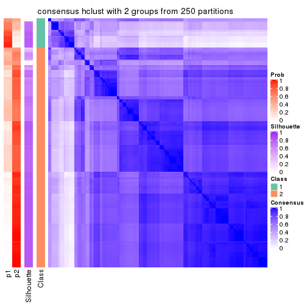</p>

</div>
<div id='tab-SD-hclust-consensus-heatmap-2'>
<pre><code class="r">consensus_heatmap(res, k = 3)
</code></pre>

<p>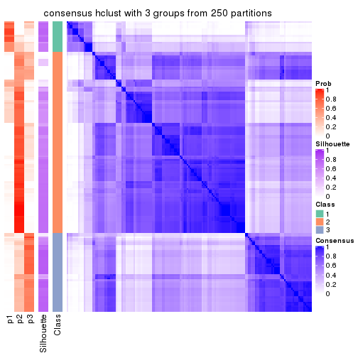</p>

</div>
<div id='tab-SD-hclust-consensus-heatmap-3'>
<pre><code class="r">consensus_heatmap(res, k = 4)
</code></pre>

<p>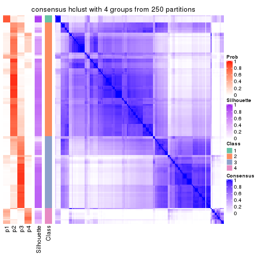</p>

</div>
<div id='tab-SD-hclust-consensus-heatmap-4'>
<pre><code class="r">consensus_heatmap(res, k = 5)
</code></pre>

<p>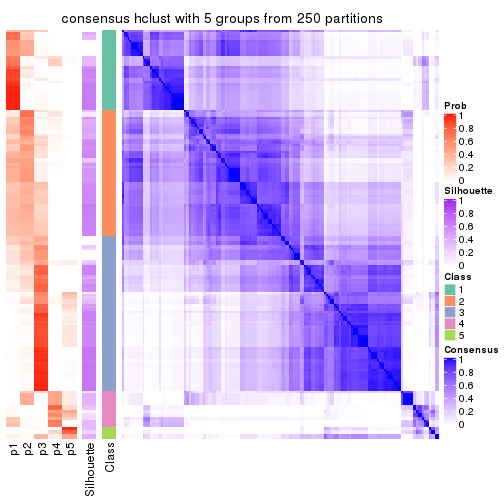</p>

</div>
<div id='tab-SD-hclust-consensus-heatmap-5'>
<pre><code class="r">consensus_heatmap(res, k = 6)
</code></pre>

<p>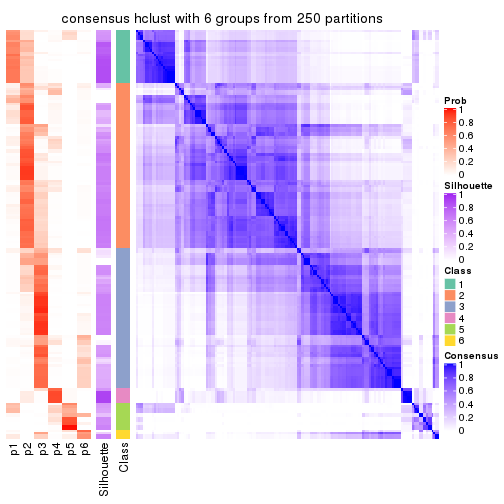</p>

</div>
</div>

Heatmaps for the membership of samples in all partitions to see how consistent they are:


<script>
$( function() {
	$( '#tabs-SD-hclust-membership-heatmap' ).tabs();
} );
</script>
<div id='tabs-SD-hclust-membership-heatmap'>
<ul>
<li><a href='#tab-SD-hclust-membership-heatmap-1'>k = 2</a></li>
<li><a href='#tab-SD-hclust-membership-heatmap-2'>k = 3</a></li>
<li><a href='#tab-SD-hclust-membership-heatmap-3'>k = 4</a></li>
<li><a href='#tab-SD-hclust-membership-heatmap-4'>k = 5</a></li>
<li><a href='#tab-SD-hclust-membership-heatmap-5'>k = 6</a></li>
</ul>
<div id='tab-SD-hclust-membership-heatmap-1'>
<pre><code class="r">membership_heatmap(res, k = 2)
</code></pre>

<p>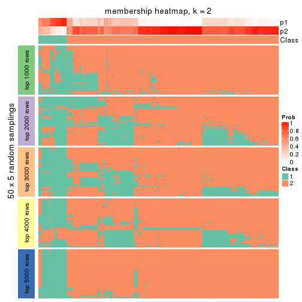</p>

</div>
<div id='tab-SD-hclust-membership-heatmap-2'>
<pre><code class="r">membership_heatmap(res, k = 3)
</code></pre>

<p>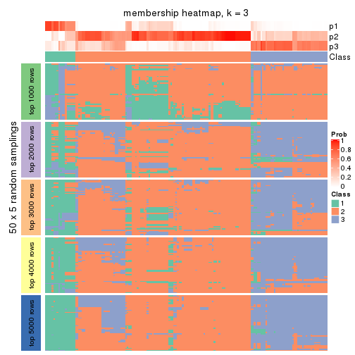</p>

</div>
<div id='tab-SD-hclust-membership-heatmap-3'>
<pre><code class="r">membership_heatmap(res, k = 4)
</code></pre>

<p>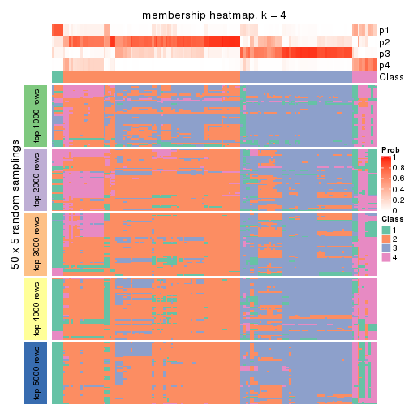</p>

</div>
<div id='tab-SD-hclust-membership-heatmap-4'>
<pre><code class="r">membership_heatmap(res, k = 5)
</code></pre>

<p>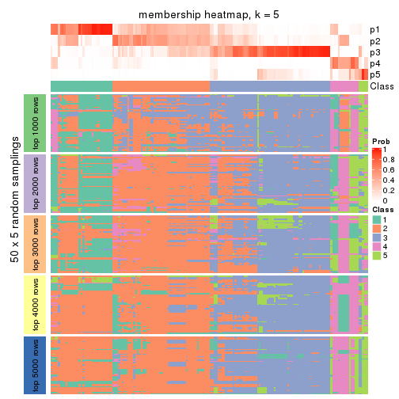</p>

</div>
<div id='tab-SD-hclust-membership-heatmap-5'>
<pre><code class="r">membership_heatmap(res, k = 6)
</code></pre>

<p>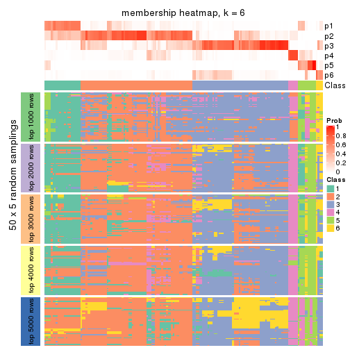</p>

</div>
</div>

As soon as we have had the classes for columns, we can look for signatures
which are significantly different between classes which can be candidate marks
for certain classes. Following are the heatmaps for signatures.


Signature heatmaps where rows are scaled:


<script>
$( function() {
	$( '#tabs-SD-hclust-get-signatures' ).tabs();
} );
</script>
<div id='tabs-SD-hclust-get-signatures'>
<ul>
<li><a href='#tab-SD-hclust-get-signatures-1'>k = 2</a></li>
<li><a href='#tab-SD-hclust-get-signatures-2'>k = 3</a></li>
<li><a href='#tab-SD-hclust-get-signatures-3'>k = 4</a></li>
<li><a href='#tab-SD-hclust-get-signatures-4'>k = 5</a></li>
<li><a href='#tab-SD-hclust-get-signatures-5'>k = 6</a></li>
</ul>
<div id='tab-SD-hclust-get-signatures-1'>
<pre><code class="r">get_signatures(res, k = 2)
</code></pre>

<p>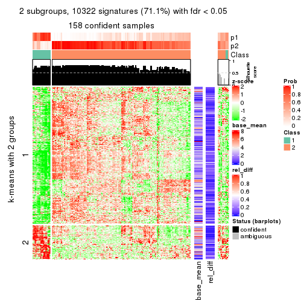</p>

</div>
<div id='tab-SD-hclust-get-signatures-2'>
<pre><code class="r">get_signatures(res, k = 3)
</code></pre>

<p>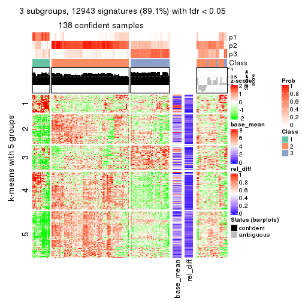</p>

</div>
<div id='tab-SD-hclust-get-signatures-3'>
<pre><code class="r">get_signatures(res, k = 4)
</code></pre>

<p>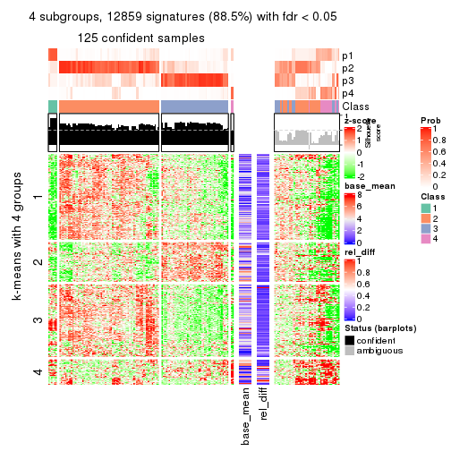</p>

</div>
<div id='tab-SD-hclust-get-signatures-4'>
<pre><code class="r">get_signatures(res, k = 5)
</code></pre>

<p>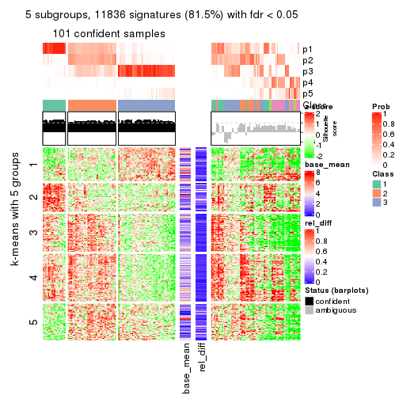</p>

</div>
<div id='tab-SD-hclust-get-signatures-5'>
<pre><code class="r">get_signatures(res, k = 6)
</code></pre>

<p>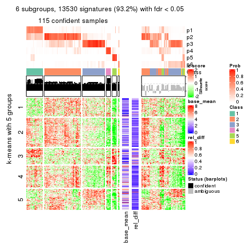</p>

</div>
</div>


Signature heatmaps where rows are not scaled:


<script>
$( function() {
	$( '#tabs-SD-hclust-get-signatures-no-scale' ).tabs();
} );
</script>
<div id='tabs-SD-hclust-get-signatures-no-scale'>
<ul>
<li><a href='#tab-SD-hclust-get-signatures-no-scale-1'>k = 2</a></li>
<li><a href='#tab-SD-hclust-get-signatures-no-scale-2'>k = 3</a></li>
<li><a href='#tab-SD-hclust-get-signatures-no-scale-3'>k = 4</a></li>
<li><a href='#tab-SD-hclust-get-signatures-no-scale-4'>k = 5</a></li>
<li><a href='#tab-SD-hclust-get-signatures-no-scale-5'>k = 6</a></li>
</ul>
<div id='tab-SD-hclust-get-signatures-no-scale-1'>
<pre><code class="r">get_signatures(res, k = 2, scale_rows = FALSE)
</code></pre>

<p>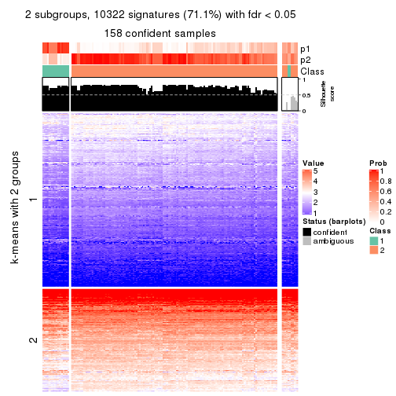</p>

</div>
<div id='tab-SD-hclust-get-signatures-no-scale-2'>
<pre><code class="r">get_signatures(res, k = 3, scale_rows = FALSE)
</code></pre>

<p>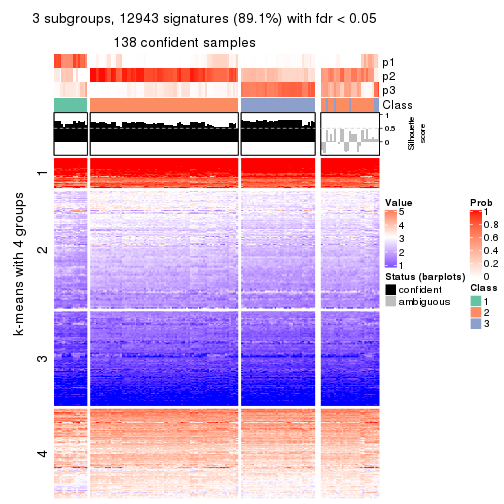</p>

</div>
<div id='tab-SD-hclust-get-signatures-no-scale-3'>
<pre><code class="r">get_signatures(res, k = 4, scale_rows = FALSE)
</code></pre>

<p>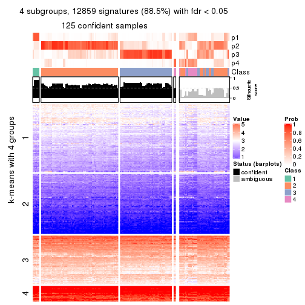</p>

</div>
<div id='tab-SD-hclust-get-signatures-no-scale-4'>
<pre><code class="r">get_signatures(res, k = 5, scale_rows = FALSE)
</code></pre>

<p>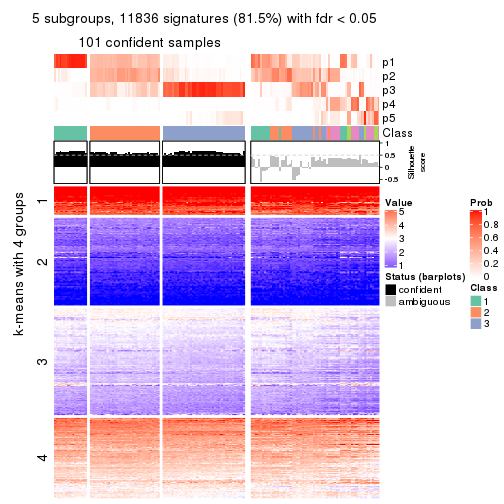</p>

</div>
<div id='tab-SD-hclust-get-signatures-no-scale-5'>
<pre><code class="r">get_signatures(res, k = 6, scale_rows = FALSE)
</code></pre>

<p>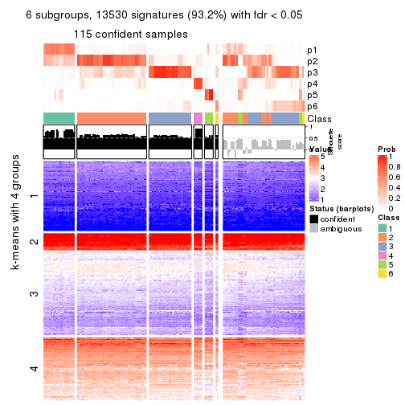</p>

</div>
</div>


Compare the overlap of signatures from different k:

```r
compare_signatures(res)
```

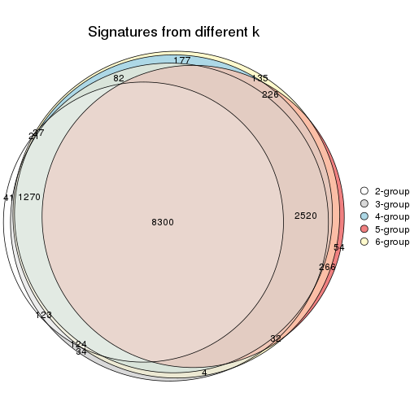

`get_signature()` returns a data frame invisibly. TO get the list of signatures, the function
call should be assigned to a variable explicitly. In following code, if `plot` argument is set
to `FALSE`, no heatmap is plotted while only the differential analysis is performed.

```r
# code only for demonstration
tb = get_signature(res, k = ..., plot = FALSE)
```

An example of the output of `tb` is:

```
#>   which_row         fdr    mean_1    mean_2 scaled_mean_1 scaled_mean_2 km
#> 1        38 0.042760348  8.373488  9.131774    -0.5533452     0.5164555  1
#> 2        40 0.018707592  7.106213  8.469186    -0.6173731     0.5762149  1
#> 3        55 0.019134737 10.221463 11.207825    -0.6159697     0.5749050  1
#> 4        59 0.006059896  5.921854  7.869574    -0.6899429     0.6439467  1
#> 5        60 0.018055526  8.928898 10.211722    -0.6204761     0.5791110  1
#> 6        98 0.009384629 15.714769 14.887706     0.6635654    -0.6193277  2
...
```

The columns in `tb` are:

1. `which_row`: row indices corresponding to the input matrix.
2. `fdr`: FDR for the differential test. 
3. `mean_x`: The mean value in group x.
4. `scaled_mean_x`: The mean value in group x after rows are scaled.
5. `km`: Row groups if k-means clustering is applied to rows.


UMAP plot which shows how samples are separated.


<script>
$( function() {
	$( '#tabs-SD-hclust-dimension-reduction' ).tabs();
} );
</script>
<div id='tabs-SD-hclust-dimension-reduction'>
<ul>
<li><a href='#tab-SD-hclust-dimension-reduction-1'>k = 2</a></li>
<li><a href='#tab-SD-hclust-dimension-reduction-2'>k = 3</a></li>
<li><a href='#tab-SD-hclust-dimension-reduction-3'>k = 4</a></li>
<li><a href='#tab-SD-hclust-dimension-reduction-4'>k = 5</a></li>
<li><a href='#tab-SD-hclust-dimension-reduction-5'>k = 6</a></li>
</ul>
<div id='tab-SD-hclust-dimension-reduction-1'>
<pre><code class="r">dimension_reduction(res, k = 2, method = &quot;UMAP&quot;)
</code></pre>

<p>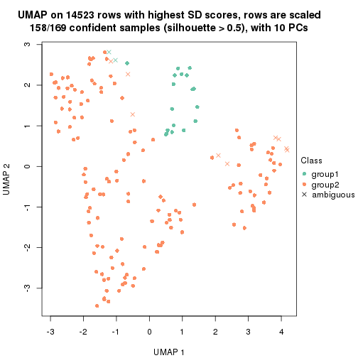</p>

</div>
<div id='tab-SD-hclust-dimension-reduction-2'>
<pre><code class="r">dimension_reduction(res, k = 3, method = &quot;UMAP&quot;)
</code></pre>

<p>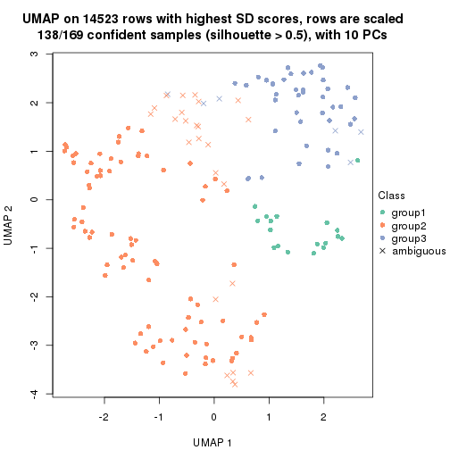</p>

</div>
<div id='tab-SD-hclust-dimension-reduction-3'>
<pre><code class="r">dimension_reduction(res, k = 4, method = &quot;UMAP&quot;)
</code></pre>

<p>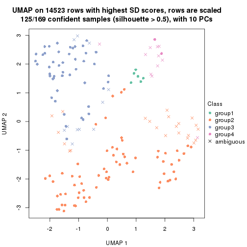</p>

</div>
<div id='tab-SD-hclust-dimension-reduction-4'>
<pre><code class="r">dimension_reduction(res, k = 5, method = &quot;UMAP&quot;)
</code></pre>

<p>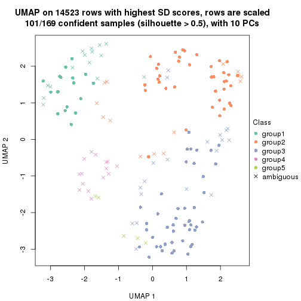</p>

</div>
<div id='tab-SD-hclust-dimension-reduction-5'>
<pre><code class="r">dimension_reduction(res, k = 6, method = &quot;UMAP&quot;)
</code></pre>

<p>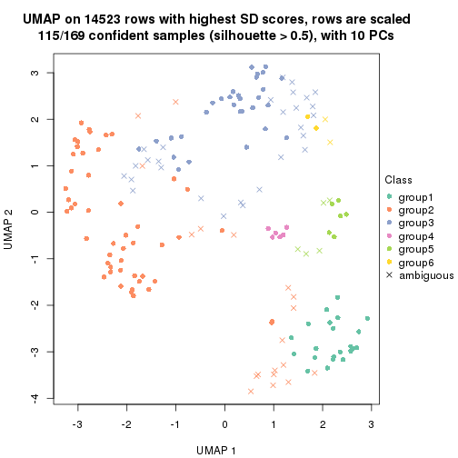</p>

</div>
</div>


Following heatmap shows how subgroups are split when increasing `k`:

```r
collect_classes(res)
```

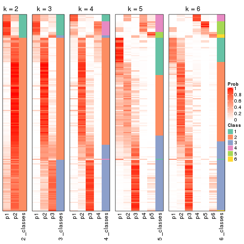


If matrix rows can be associated to genes, consider to use `GO_Enrichment(res,
...)` to perform function enrichment for the signature genes.


 

---------------------------------------------------


### SD:kmeans


The object with results only for a single top-value method and a single partition method 
can be extracted as:

```r
res = res_list["SD", "kmeans"]
# you can also extract it by
# res = res_list["SD:kmeans"]
```

A summary of `res` and all the functions that can be applied to it:

```r
res
```

```
#> A 'ConsensusPartition' object with k = 2, 3, 4, 5, 6.
#>   On a matrix with 14523 rows and 169 columns.
#>   Top rows (1000, 2000, 3000, 4000, 5000) are extracted by 'SD' method.
#>   Subgroups are detected by 'kmeans' method.
#>   Performed in total 1250 partitions by row resampling.
#>   Best k for subgroups seems to be 4.
#> 
#> Following methods can be applied to this 'ConsensusPartition' object:
#>  [1] "cola_report"             "collect_classes"         "collect_plots"          
#>  [4] "collect_stats"           "colnames"                "compare_signatures"     
#>  [7] "consensus_heatmap"       "dimension_reduction"     "functional_enrichment"  
#> [10] "get_anno_col"            "get_anno"                "get_classes"            
#> [13] "get_consensus"           "get_matrix"              "get_membership"         
#> [16] "get_param"               "get_signatures"          "get_stats"              
#> [19] "is_best_k"               "is_stable_k"             "membership_heatmap"     
#> [22] "ncol"                    "nrow"                    "plot_ecdf"              
#> [25] "rownames"                "select_partition_number" "show"                   
#> [28] "suggest_best_k"          "test_to_known_factors"
```

`collect_plots()` function collects all the plots made from `res` for all `k` (number of partitions)
into one single page to provide an easy and fast comparison between different `k`.

```r
collect_plots(res)
```

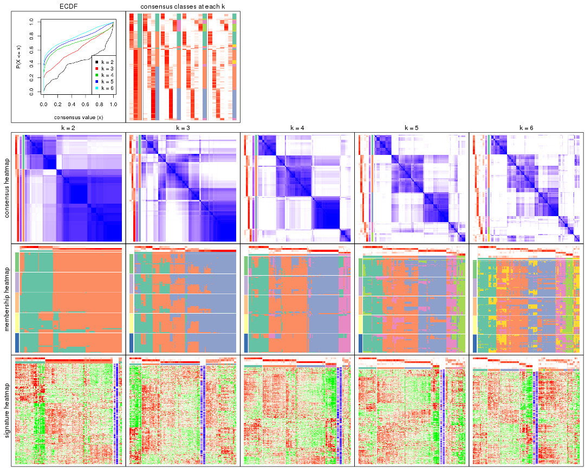

The plots are:

- The first row: a plot of the ECDF (Empirical cumulative distribution
  function) curves of the consensus matrix for each `k` and the heatmap of
  predicted classes for each `k`.
- The second row: heatmaps of the consensus matrix for each `k`.
- The third row: heatmaps of the membership matrix for each `k`.
- The fouth row: heatmaps of the signatures for each `k`.

All the plots in panels can be made by individual functions and they are
plotted later in this section.

`select_partition_number()` produces several plots showing different
statistics for choosing "optimized" `k`. There are following statistics:

- ECDF curves of the consensus matrix for each `k`;
- 1-PAC. [The PAC
  score](https://en.wikipedia.org/wiki/Consensus_clustering#Over-interpretation_potential_of_consensus_clustering)
  measures the proportion of the ambiguous subgrouping.
- Mean silhouette score.
- Concordance. The mean probability of fiting the consensus class ids in all
  partitions.
- Area increased. Denote $A_k$ as the area under the ECDF curve for current
  `k`, the area increased is defined as $A_k - A_{k-1}$.
- Rand index. The percent of pairs of samples that are both in a same cluster
  or both are not in a same cluster in the partition of k and k-1.
- Jaccard index. The ratio of pairs of samples are both in a same cluster in
  the partition of k and k-1 and the pairs of samples are both in a same
  cluster in the partition k or k-1.

The detailed explanations of these statistics can be found in [the cola
vignette](http://bioconductor.org/packages/devel/bioc/vignettes/cola/inst/doc/cola.html#toc_13).

Generally speaking, lower PAC score, higher mean silhouette score or higher
concordance corresponds to better partition. Rand index and Jaccard index
measure how similar the current partition is compared to partition with `k-1`.
If they are too similar, we won't accept `k` is better than `k-1`.

```r
select_partition_number(res)
```

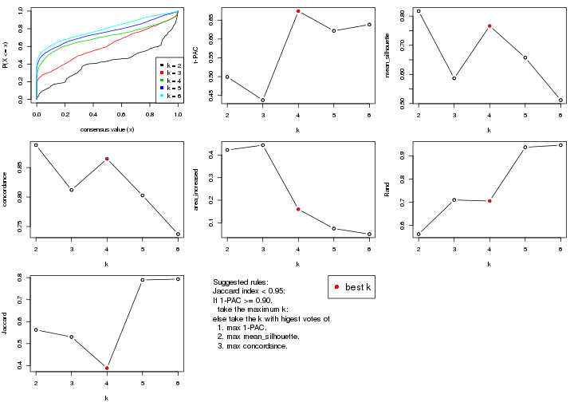

The numeric values for all these statistics can be obtained by `get_stats()`.

```r
get_stats(res)
```

```
#>   k 1-PAC mean_silhouette concordance area_increased  Rand Jaccard
#> 2 2 0.499           0.817       0.888         0.4223 0.563   0.563
#> 3 3 0.438           0.587       0.812         0.4437 0.710   0.530
#> 4 4 0.674           0.766       0.865         0.1600 0.706   0.389
#> 5 5 0.622           0.658       0.803         0.0746 0.937   0.790
#> 6 6 0.638           0.512       0.737         0.0501 0.946   0.793
```

`suggest_best_k()` suggests the best $k$ based on these statistics. The rules are as follows:

- All $k$ with Jaccard index larger than 0.95 are removed because the increase of
  the partition number does not provides enough extra information. If all $k$ are removed,
  the best $k$ is assigned by `NA`.
- For $k$ with 1-PAC larger than 0.9, the maximal $k$ is taken as the "best k". Other $k$ is called "optional k".
- If it does not fit the second rule. The $k$ with the highest vote of highest
  1-PAC, mean silhouette and concordance is taken as the "best k".

```r
suggest_best_k(res)
```

```
#> [1] 4
```


Following shows the table of the partitions (You need to click the **show/hide
code output** link to see it). The membership matrix (columns with name `p*`)
is inferred by
[`clue::cl_consensus()`](https://www.rdocumentation.org/link/cl_consensus?package=clue)
function with the `SE` method. Basically the value in the membership matrix
represents the probability to belong to a certain group. The finall class
label for an item is determined with the group with highest probability it
belongs to.

In `get_classes()` function, the entropy is calculated from the membership
matrix and the silhouette score is calculated from the consensus matrix.


<script>
$( function() {
	$( '#tabs-SD-kmeans-get-classes' ).tabs();
} );
</script>
<div id='tabs-SD-kmeans-get-classes'>
<ul>
<li><a href='#tab-SD-kmeans-get-classes-1'>k = 2</a></li>
<li><a href='#tab-SD-kmeans-get-classes-2'>k = 3</a></li>
<li><a href='#tab-SD-kmeans-get-classes-3'>k = 4</a></li>
<li><a href='#tab-SD-kmeans-get-classes-4'>k = 5</a></li>
<li><a href='#tab-SD-kmeans-get-classes-5'>k = 6</a></li>
</ul>

<div id='tab-SD-kmeans-get-classes-1'>
<p><a id='tab-SD-kmeans-get-classes-1-a' style='color:#0366d6' href='#'>show/hide code output</a></p>
<pre><code class="r">cbind(get_classes(res, k = 2), get_membership(res, k = 2))
</code></pre>

<pre><code>#&gt;            class entropy silhouette    p1    p2
#&gt; SRR2052702     2  0.1414     0.9033 0.020 0.980
#&gt; SRR2052701     2  0.1414     0.9033 0.020 0.980
#&gt; SRR2052700     2  0.7376     0.7799 0.208 0.792
#&gt; SRR2052699     2  0.1414     0.9033 0.020 0.980
#&gt; SRR2052698     2  0.2948     0.9044 0.052 0.948
#&gt; SRR2052708     1  0.0672     0.7905 0.992 0.008
#&gt; SRR2052749     1  0.8443     0.7631 0.728 0.272
#&gt; SRR2052786     2  0.1414     0.9033 0.020 0.980
#&gt; SRR2052825     1  0.7453     0.6480 0.788 0.212
#&gt; SRR2052824     1  0.9866     0.1202 0.568 0.432
#&gt; SRR2052823     2  0.1414     0.9033 0.020 0.980
#&gt; SRR2052822     2  0.1184     0.9083 0.016 0.984
#&gt; SRR2052821     2  0.0000     0.9068 0.000 1.000
#&gt; SRR2052820     2  0.4562     0.8903 0.096 0.904
#&gt; SRR2052819     2  0.8955     0.6037 0.312 0.688
#&gt; SRR2052818     2  0.2423     0.8906 0.040 0.960
#&gt; SRR2052817     2  0.3584     0.9004 0.068 0.932
#&gt; SRR2052816     2  0.4161     0.9016 0.084 0.916
#&gt; SRR2052815     1  0.9866     0.1202 0.568 0.432
#&gt; SRR2052814     2  0.4431     0.8941 0.092 0.908
#&gt; SRR2052813     2  0.0000     0.9068 0.000 1.000
#&gt; SRR2052812     2  0.1414     0.9033 0.020 0.980
#&gt; SRR2052811     2  0.1414     0.9033 0.020 0.980
#&gt; SRR2052810     2  0.9209     0.5843 0.336 0.664
#&gt; SRR2052809     2  0.1184     0.9083 0.016 0.984
#&gt; SRR2052808     2  0.2778     0.9051 0.048 0.952
#&gt; SRR2052807     1  0.1184     0.7854 0.984 0.016
#&gt; SRR2052806     1  0.4298     0.7838 0.912 0.088
#&gt; SRR2052805     1  0.1184     0.7904 0.984 0.016
#&gt; SRR2052804     1  0.7674     0.6392 0.776 0.224
#&gt; SRR2052803     1  0.2603     0.7896 0.956 0.044
#&gt; SRR2052802     1  0.2778     0.7788 0.952 0.048
#&gt; SRR2052801     1  0.0376     0.7892 0.996 0.004
#&gt; SRR2052800     1  0.2778     0.7788 0.952 0.048
#&gt; SRR2052799     1  0.0376     0.7892 0.996 0.004
#&gt; SRR2052798     1  0.8813     0.7517 0.700 0.300
#&gt; SRR2052797     2  0.0000     0.9068 0.000 1.000
#&gt; SRR2052796     1  0.0000     0.7901 1.000 0.000
#&gt; SRR2052795     1  0.0000     0.7901 1.000 0.000
#&gt; SRR2052794     1  0.1414     0.7840 0.980 0.020
#&gt; SRR2052793     1  0.0000     0.7901 1.000 0.000
#&gt; SRR2052792     1  0.8386     0.5731 0.732 0.268
#&gt; SRR2052791     1  0.1414     0.7840 0.980 0.020
#&gt; SRR2052790     2  0.1184     0.9083 0.016 0.984
#&gt; SRR2052789     2  0.4562     0.8903 0.096 0.904
#&gt; SRR2052788     2  0.4562     0.8903 0.096 0.904
#&gt; SRR2052787     2  0.1414     0.9033 0.020 0.980
#&gt; SRR2052785     2  0.4562     0.8903 0.096 0.904
#&gt; SRR2052784     2  0.1184     0.9083 0.016 0.984
#&gt; SRR2052783     2  0.1184     0.9083 0.016 0.984
#&gt; SRR2052782     2  0.0000     0.9068 0.000 1.000
#&gt; SRR2052781     2  0.1184     0.9083 0.016 0.984
#&gt; SRR2052780     2  0.3274     0.9026 0.060 0.940
#&gt; SRR2052777     2  0.0000     0.9068 0.000 1.000
#&gt; SRR2052779     2  0.0000     0.9068 0.000 1.000
#&gt; SRR2052778     2  0.4562     0.8903 0.096 0.904
#&gt; SRR2052776     2  0.2948     0.9044 0.052 0.948
#&gt; SRR2052775     2  0.4562     0.8903 0.096 0.904
#&gt; SRR2052773     2  0.1184     0.9083 0.016 0.984
#&gt; SRR2052772     2  0.4562     0.8903 0.096 0.904
#&gt; SRR2052774     2  0.2948     0.9044 0.052 0.948
#&gt; SRR2052771     1  0.1414     0.7840 0.980 0.020
#&gt; SRR2052769     2  0.4562     0.8903 0.096 0.904
#&gt; SRR2052770     2  0.4562     0.8903 0.096 0.904
#&gt; SRR2052768     2  0.1414     0.9033 0.020 0.980
#&gt; SRR2052767     2  0.1414     0.9033 0.020 0.980
#&gt; SRR2052766     2  0.9044     0.5900 0.320 0.680
#&gt; SRR2052765     2  0.0938     0.9056 0.012 0.988
#&gt; SRR2052763     2  0.4562     0.8903 0.096 0.904
#&gt; SRR2052764     2  0.2603     0.8872 0.044 0.956
#&gt; SRR2052761     2  0.4562     0.8903 0.096 0.904
#&gt; SRR2052760     2  0.1414     0.9033 0.020 0.980
#&gt; SRR2052759     2  0.4562     0.8903 0.096 0.904
#&gt; SRR2052762     2  0.0000     0.9068 0.000 1.000
#&gt; SRR2052758     2  0.4562     0.8903 0.096 0.904
#&gt; SRR2052756     1  0.4431     0.7831 0.908 0.092
#&gt; SRR2052757     2  0.4161     0.8950 0.084 0.916
#&gt; SRR2052755     1  0.8813     0.7517 0.700 0.300
#&gt; SRR2052754     1  0.0000     0.7901 1.000 0.000
#&gt; SRR2052753     1  0.8813     0.7517 0.700 0.300
#&gt; SRR2052752     1  0.0000     0.7901 1.000 0.000
#&gt; SRR2052750     1  0.8813     0.7517 0.700 0.300
#&gt; SRR2052751     2  0.0000     0.9068 0.000 1.000
#&gt; SRR2052748     2  0.8813     0.6214 0.300 0.700
#&gt; SRR2052747     1  0.8555     0.7607 0.720 0.280
#&gt; SRR2052746     2  0.4562     0.8903 0.096 0.904
#&gt; SRR2052745     2  0.4562     0.8903 0.096 0.904
#&gt; SRR2052744     1  0.8813     0.7517 0.700 0.300
#&gt; SRR2052741     2  0.1414     0.9033 0.020 0.980
#&gt; SRR2052743     2  0.1414     0.9033 0.020 0.980
#&gt; SRR2052740     2  0.1414     0.9033 0.020 0.980
#&gt; SRR2052742     2  0.0376     0.9063 0.004 0.996
#&gt; SRR2052739     2  0.1414     0.9033 0.020 0.980
#&gt; SRR2052738     2  0.4562     0.8903 0.096 0.904
#&gt; SRR2052736     2  0.2236     0.8933 0.036 0.964
#&gt; SRR2052735     1  0.8955     0.7383 0.688 0.312
#&gt; SRR2052734     1  0.9044     0.7285 0.680 0.320
#&gt; SRR2052737     2  0.0672     0.9062 0.008 0.992
#&gt; SRR2052733     2  0.4562     0.8903 0.096 0.904
#&gt; SRR2052732     2  0.2603     0.8872 0.044 0.956
#&gt; SRR2052731     2  0.4562     0.8903 0.096 0.904
#&gt; SRR2052729     1  0.8813     0.7517 0.700 0.300
#&gt; SRR2052728     1  0.8813     0.7517 0.700 0.300
#&gt; SRR2052730     2  0.9129     0.5776 0.328 0.672
#&gt; SRR2052727     1  0.8813     0.7517 0.700 0.300
#&gt; SRR2052725     1  0.9998     0.4061 0.508 0.492
#&gt; SRR2052726     1  0.8861     0.7475 0.696 0.304
#&gt; SRR2052724     1  0.0000     0.7901 1.000 0.000
#&gt; SRR2052723     2  0.8861     0.6154 0.304 0.696
#&gt; SRR2052722     2  0.4562     0.8903 0.096 0.904
#&gt; SRR2052721     1  0.8813     0.7517 0.700 0.300
#&gt; SRR2052720     2  0.1184     0.9043 0.016 0.984
#&gt; SRR2052719     2  0.1414     0.9033 0.020 0.980
#&gt; SRR2052718     1  0.8813     0.7517 0.700 0.300
#&gt; SRR2052717     2  0.1184     0.9043 0.016 0.984
#&gt; SRR2052714     1  0.1184     0.7854 0.984 0.016
#&gt; SRR2052716     2  0.8267     0.6872 0.260 0.740
#&gt; SRR2052715     2  0.4562     0.8903 0.096 0.904
#&gt; SRR2052713     1  0.4562     0.7820 0.904 0.096
#&gt; SRR2052712     1  0.6712     0.6932 0.824 0.176
#&gt; SRR2052711     1  0.7376     0.6606 0.792 0.208
#&gt; SRR2052710     2  0.1843     0.9086 0.028 0.972
#&gt; SRR2052707     2  0.4562     0.8903 0.096 0.904
#&gt; SRR2052709     2  0.4562     0.8903 0.096 0.904
#&gt; SRR2052704     2  0.4939     0.8806 0.108 0.892
#&gt; SRR2052705     2  0.1414     0.9033 0.020 0.980
#&gt; SRR2052697     2  0.1414     0.9033 0.020 0.980
#&gt; SRR2052703     2  0.4562     0.8903 0.096 0.904
#&gt; SRR2052696     1  0.8555     0.7607 0.720 0.280
#&gt; SRR2052706     2  0.1184     0.9083 0.016 0.984
#&gt; SRR2052695     2  0.0672     0.9062 0.008 0.992
#&gt; SRR2052694     2  0.1184     0.9043 0.016 0.984
#&gt; SRR2052692     2  0.4562     0.8903 0.096 0.904
#&gt; SRR2052693     2  0.4562     0.8903 0.096 0.904
#&gt; SRR2052691     2  0.9795    -0.0809 0.416 0.584
#&gt; SRR2052690     2  0.1633     0.9010 0.024 0.976
#&gt; SRR2052689     2  0.8813     0.6214 0.300 0.700
#&gt; SRR2052687     2  0.6247     0.8309 0.156 0.844
#&gt; SRR2052686     1  0.8813     0.7517 0.700 0.300
#&gt; SRR2052688     2  0.1414     0.9033 0.020 0.980
#&gt; SRR2052684     2  0.9209     0.5642 0.336 0.664
#&gt; SRR2052685     2  0.1414     0.9033 0.020 0.980
#&gt; SRR2052683     1  0.1414     0.7906 0.980 0.020
#&gt; SRR2052681     2  0.7376     0.7678 0.208 0.792
#&gt; SRR2052680     1  0.9866     0.1202 0.568 0.432
#&gt; SRR2052682     1  0.9087     0.7234 0.676 0.324
#&gt; SRR2052679     1  0.8813     0.7517 0.700 0.300
#&gt; SRR2052678     2  0.4562     0.8903 0.096 0.904
#&gt; SRR2052677     2  0.0000     0.9068 0.000 1.000
#&gt; SRR2052675     2  0.1414     0.9033 0.020 0.980
#&gt; SRR2052676     1  0.8813     0.7517 0.700 0.300
#&gt; SRR2052674     2  0.3584     0.9052 0.068 0.932
#&gt; SRR2052672     2  0.4562     0.8903 0.096 0.904
#&gt; SRR2052673     2  0.2603     0.8871 0.044 0.956
#&gt; SRR2052671     2  0.1414     0.9033 0.020 0.980
#&gt; SRR2052670     2  0.3274     0.9026 0.060 0.940
#&gt; SRR2052669     2  0.1184     0.9043 0.016 0.984
#&gt; SRR2052668     2  0.1414     0.9033 0.020 0.980
#&gt; SRR2052667     2  0.1414     0.9033 0.020 0.980
#&gt; SRR2052666     2  0.3274     0.9026 0.060 0.940
#&gt; SRR2052665     2  0.1184     0.9043 0.016 0.984
#&gt; SRR2052664     1  0.0000     0.7901 1.000 0.000
#&gt; SRR2052663     2  0.2603     0.8872 0.044 0.956
#&gt; SRR2052662     2  0.1414     0.9033 0.020 0.980
#&gt; SRR2052661     1  0.8813     0.7517 0.700 0.300
#&gt; SRR2052660     2  0.4562     0.8903 0.096 0.904
#&gt; SRR2052659     2  0.4562     0.8903 0.096 0.904
#&gt; SRR2052658     2  0.1414     0.9033 0.020 0.980
#&gt; SRR2052657     1  0.8144     0.7653 0.748 0.252
</code></pre>

<script>
$('#tab-SD-kmeans-get-classes-1-a').parent().next().next().hide();
$('#tab-SD-kmeans-get-classes-1-a').click(function(){
  $('#tab-SD-kmeans-get-classes-1-a').parent().next().next().toggle();
  return(false);
});
</script>
</div>

<div id='tab-SD-kmeans-get-classes-2'>
<p><a id='tab-SD-kmeans-get-classes-2-a' style='color:#0366d6' href='#'>show/hide code output</a></p>
<pre><code class="r">cbind(get_classes(res, k = 3), get_membership(res, k = 3))
</code></pre>

<pre><code>#&gt;            class entropy silhouette    p1    p2    p3
#&gt; SRR2052702     2  0.5016    0.55108 0.000 0.760 0.240
#&gt; SRR2052701     2  0.3816    0.64473 0.000 0.852 0.148
#&gt; SRR2052700     2  0.8038    0.45219 0.100 0.620 0.280
#&gt; SRR2052699     2  0.3816    0.64512 0.000 0.852 0.148
#&gt; SRR2052698     3  0.0892    0.82136 0.000 0.020 0.980
#&gt; SRR2052708     1  0.6305    0.14895 0.516 0.484 0.000
#&gt; SRR2052749     2  0.5760    0.38491 0.328 0.672 0.000
#&gt; SRR2052786     3  0.6295    0.28225 0.000 0.472 0.528
#&gt; SRR2052825     1  0.7360    0.57674 0.692 0.096 0.212
#&gt; SRR2052824     1  0.7308    0.56240 0.656 0.060 0.284
#&gt; SRR2052823     2  0.4291    0.62935 0.000 0.820 0.180
#&gt; SRR2052822     3  0.1860    0.81319 0.000 0.052 0.948
#&gt; SRR2052821     3  0.3551    0.77703 0.000 0.132 0.868
#&gt; SRR2052820     3  0.0424    0.81790 0.000 0.008 0.992
#&gt; SRR2052819     3  0.6286   -0.06074 0.464 0.000 0.536
#&gt; SRR2052818     2  0.6129    0.38151 0.008 0.668 0.324
#&gt; SRR2052817     3  0.0237    0.82209 0.000 0.004 0.996
#&gt; SRR2052816     2  0.6205    0.42199 0.008 0.656 0.336
#&gt; SRR2052815     1  0.7416    0.56055 0.656 0.068 0.276
#&gt; SRR2052814     3  0.5292    0.69416 0.008 0.228 0.764
#&gt; SRR2052813     3  0.4796    0.70611 0.000 0.220 0.780
#&gt; SRR2052812     3  0.6309    0.21736 0.000 0.496 0.504
#&gt; SRR2052811     2  0.4931    0.56399 0.000 0.768 0.232
#&gt; SRR2052810     1  0.9364    0.20345 0.484 0.184 0.332
#&gt; SRR2052809     3  0.2448    0.80541 0.000 0.076 0.924
#&gt; SRR2052808     3  0.3192    0.78878 0.000 0.112 0.888
#&gt; SRR2052807     1  0.0892    0.69761 0.980 0.000 0.020
#&gt; SRR2052806     1  0.5882    0.40547 0.652 0.348 0.000
#&gt; SRR2052805     1  0.5621    0.46325 0.692 0.308 0.000
#&gt; SRR2052804     1  0.4974    0.63719 0.764 0.000 0.236
#&gt; SRR2052803     1  0.5882    0.40547 0.652 0.348 0.000
#&gt; SRR2052802     1  0.4121    0.67134 0.832 0.000 0.168
#&gt; SRR2052801     1  0.0747    0.69530 0.984 0.016 0.000
#&gt; SRR2052800     1  0.4121    0.67134 0.832 0.000 0.168
#&gt; SRR2052799     1  0.0424    0.69584 0.992 0.008 0.000
#&gt; SRR2052798     2  0.5291    0.46991 0.268 0.732 0.000
#&gt; SRR2052797     3  0.3619    0.77447 0.000 0.136 0.864
#&gt; SRR2052796     1  0.0892    0.69464 0.980 0.020 0.000
#&gt; SRR2052795     1  0.6309    0.11806 0.504 0.496 0.000
#&gt; SRR2052794     1  0.1315    0.69841 0.972 0.008 0.020
#&gt; SRR2052793     1  0.0892    0.69464 0.980 0.020 0.000
#&gt; SRR2052792     1  0.5254    0.61795 0.736 0.000 0.264
#&gt; SRR2052791     1  0.3896    0.67609 0.864 0.008 0.128
#&gt; SRR2052790     3  0.1860    0.81353 0.000 0.052 0.948
#&gt; SRR2052789     3  0.0237    0.82209 0.000 0.004 0.996
#&gt; SRR2052788     3  0.0000    0.82164 0.000 0.000 1.000
#&gt; SRR2052787     3  0.6252    0.34549 0.000 0.444 0.556
#&gt; SRR2052785     3  0.0000    0.82164 0.000 0.000 1.000
#&gt; SRR2052784     3  0.3340    0.78323 0.000 0.120 0.880
#&gt; SRR2052783     3  0.2356    0.80682 0.000 0.072 0.928
#&gt; SRR2052782     3  0.3816    0.76616 0.000 0.148 0.852
#&gt; SRR2052781     3  0.2356    0.80682 0.000 0.072 0.928
#&gt; SRR2052780     3  0.0424    0.82222 0.000 0.008 0.992
#&gt; SRR2052777     3  0.4504    0.72932 0.000 0.196 0.804
#&gt; SRR2052779     3  0.3752    0.76885 0.000 0.144 0.856
#&gt; SRR2052778     3  0.0000    0.82164 0.000 0.000 1.000
#&gt; SRR2052776     3  0.0892    0.82136 0.000 0.020 0.980
#&gt; SRR2052775     3  0.0000    0.82164 0.000 0.000 1.000
#&gt; SRR2052773     3  0.1643    0.81539 0.000 0.044 0.956
#&gt; SRR2052772     3  0.0000    0.82164 0.000 0.000 1.000
#&gt; SRR2052774     3  0.0747    0.82206 0.000 0.016 0.984
#&gt; SRR2052771     1  0.2269    0.69962 0.944 0.016 0.040
#&gt; SRR2052769     3  0.0000    0.82164 0.000 0.000 1.000
#&gt; SRR2052770     3  0.0000    0.82164 0.000 0.000 1.000
#&gt; SRR2052768     3  0.6309    0.21736 0.000 0.496 0.504
#&gt; SRR2052767     2  0.5216    0.51570 0.000 0.740 0.260
#&gt; SRR2052766     1  0.6225    0.33943 0.568 0.000 0.432
#&gt; SRR2052765     3  0.6274    0.32166 0.000 0.456 0.544
#&gt; SRR2052763     3  0.0000    0.82164 0.000 0.000 1.000
#&gt; SRR2052764     2  0.4164    0.64342 0.008 0.848 0.144
#&gt; SRR2052761     3  0.0000    0.82164 0.000 0.000 1.000
#&gt; SRR2052760     3  0.6309    0.21736 0.000 0.496 0.504
#&gt; SRR2052759     3  0.0000    0.82164 0.000 0.000 1.000
#&gt; SRR2052762     3  0.4504    0.72952 0.000 0.196 0.804
#&gt; SRR2052758     3  0.0000    0.82164 0.000 0.000 1.000
#&gt; SRR2052756     2  0.6244    0.00896 0.440 0.560 0.000
#&gt; SRR2052757     3  0.0592    0.82234 0.000 0.012 0.988
#&gt; SRR2052755     2  0.4974    0.50348 0.236 0.764 0.000
#&gt; SRR2052754     1  0.1031    0.69352 0.976 0.024 0.000
#&gt; SRR2052753     2  0.4702    0.52052 0.212 0.788 0.000
#&gt; SRR2052752     1  0.6026    0.35558 0.624 0.376 0.000
#&gt; SRR2052750     2  0.5216    0.48002 0.260 0.740 0.000
#&gt; SRR2052751     3  0.3192    0.78866 0.000 0.112 0.888
#&gt; SRR2052748     3  0.0592    0.81245 0.012 0.000 0.988
#&gt; SRR2052747     2  0.5835    0.36834 0.340 0.660 0.000
#&gt; SRR2052746     3  0.0000    0.82164 0.000 0.000 1.000
#&gt; SRR2052745     3  0.0000    0.82164 0.000 0.000 1.000
#&gt; SRR2052744     2  0.4887    0.51295 0.228 0.772 0.000
#&gt; SRR2052741     2  0.3816    0.64512 0.000 0.852 0.148
#&gt; SRR2052743     2  0.6267   -0.06325 0.000 0.548 0.452
#&gt; SRR2052740     2  0.3038    0.65613 0.000 0.896 0.104
#&gt; SRR2052742     3  0.4346    0.74060 0.000 0.184 0.816
#&gt; SRR2052739     3  0.6295    0.28225 0.000 0.472 0.528
#&gt; SRR2052738     3  0.0000    0.82164 0.000 0.000 1.000
#&gt; SRR2052736     2  0.0424    0.64465 0.000 0.992 0.008
#&gt; SRR2052735     2  0.2878    0.60635 0.096 0.904 0.000
#&gt; SRR2052734     2  0.0592    0.63848 0.012 0.988 0.000
#&gt; SRR2052737     3  0.5621    0.58798 0.000 0.308 0.692
#&gt; SRR2052733     3  0.0000    0.82164 0.000 0.000 1.000
#&gt; SRR2052732     2  0.4099    0.64511 0.008 0.852 0.140
#&gt; SRR2052731     3  0.0000    0.82164 0.000 0.000 1.000
#&gt; SRR2052729     2  0.5216    0.48002 0.260 0.740 0.000
#&gt; SRR2052728     2  0.4887    0.51295 0.228 0.772 0.000
#&gt; SRR2052730     3  0.5835    0.28476 0.340 0.000 0.660
#&gt; SRR2052727     2  0.5216    0.48002 0.260 0.740 0.000
#&gt; SRR2052725     2  0.1170    0.64270 0.016 0.976 0.008
#&gt; SRR2052726     2  0.2959    0.60401 0.100 0.900 0.000
#&gt; SRR2052724     2  0.6307   -0.12789 0.488 0.512 0.000
#&gt; SRR2052723     3  0.1529    0.78684 0.040 0.000 0.960
#&gt; SRR2052722     3  0.0000    0.82164 0.000 0.000 1.000
#&gt; SRR2052721     2  0.5178    0.48460 0.256 0.744 0.000
#&gt; SRR2052720     3  0.6280    0.31096 0.000 0.460 0.540
#&gt; SRR2052719     2  0.6309   -0.21649 0.000 0.504 0.496
#&gt; SRR2052718     2  0.3116    0.59873 0.108 0.892 0.000
#&gt; SRR2052717     3  0.6111    0.45852 0.000 0.396 0.604
#&gt; SRR2052714     1  0.6796    0.42127 0.632 0.344 0.024
#&gt; SRR2052716     3  0.0000    0.82164 0.000 0.000 1.000
#&gt; SRR2052715     3  0.0000    0.82164 0.000 0.000 1.000
#&gt; SRR2052713     1  0.6291    0.17792 0.532 0.468 0.000
#&gt; SRR2052712     1  0.4521    0.66555 0.816 0.004 0.180
#&gt; SRR2052711     2  0.6489   -0.12924 0.456 0.540 0.004
#&gt; SRR2052710     3  0.5098    0.66015 0.000 0.248 0.752
#&gt; SRR2052707     3  0.0000    0.82164 0.000 0.000 1.000
#&gt; SRR2052709     3  0.0000    0.82164 0.000 0.000 1.000
#&gt; SRR2052704     3  0.0000    0.82164 0.000 0.000 1.000
#&gt; SRR2052705     2  0.6309   -0.21649 0.000 0.504 0.496
#&gt; SRR2052697     2  0.3038    0.65613 0.000 0.896 0.104
#&gt; SRR2052703     3  0.0000    0.82164 0.000 0.000 1.000
#&gt; SRR2052696     2  0.5497    0.43845 0.292 0.708 0.000
#&gt; SRR2052706     3  0.3752    0.76939 0.000 0.144 0.856
#&gt; SRR2052695     3  0.5948    0.51707 0.000 0.360 0.640
#&gt; SRR2052694     3  0.6267    0.33073 0.000 0.452 0.548
#&gt; SRR2052692     3  0.0000    0.82164 0.000 0.000 1.000
#&gt; SRR2052693     3  0.0000    0.82164 0.000 0.000 1.000
#&gt; SRR2052691     2  0.0237    0.64098 0.004 0.996 0.000
#&gt; SRR2052690     2  0.2625    0.65569 0.000 0.916 0.084
#&gt; SRR2052689     3  0.5835    0.28215 0.340 0.000 0.660
#&gt; SRR2052687     3  0.0892    0.81019 0.020 0.000 0.980
#&gt; SRR2052686     2  0.1643    0.62688 0.044 0.956 0.000
#&gt; SRR2052688     3  0.6295    0.28225 0.000 0.472 0.528
#&gt; SRR2052684     3  0.4555    0.57330 0.200 0.000 0.800
#&gt; SRR2052685     2  0.4178    0.63384 0.000 0.828 0.172
#&gt; SRR2052683     1  0.2261    0.67476 0.932 0.068 0.000
#&gt; SRR2052681     2  0.6924    0.21690 0.020 0.580 0.400
#&gt; SRR2052680     1  0.7416    0.56055 0.656 0.068 0.276
#&gt; SRR2052682     2  0.0000    0.64190 0.000 1.000 0.000
#&gt; SRR2052679     2  0.5216    0.48002 0.260 0.740 0.000
#&gt; SRR2052678     3  0.0237    0.82209 0.000 0.004 0.996
#&gt; SRR2052677     3  0.3038    0.79298 0.000 0.104 0.896
#&gt; SRR2052675     2  0.3038    0.65613 0.000 0.896 0.104
#&gt; SRR2052676     2  0.5529    0.44002 0.296 0.704 0.000
#&gt; SRR2052674     3  0.6129    0.56340 0.008 0.324 0.668
#&gt; SRR2052672     3  0.0000    0.82164 0.000 0.000 1.000
#&gt; SRR2052673     2  0.0424    0.64465 0.000 0.992 0.008
#&gt; SRR2052671     2  0.4750    0.58765 0.000 0.784 0.216
#&gt; SRR2052670     3  0.0424    0.82222 0.000 0.008 0.992
#&gt; SRR2052669     3  0.6180    0.41180 0.000 0.416 0.584
#&gt; SRR2052668     2  0.5397    0.46743 0.000 0.720 0.280
#&gt; SRR2052667     3  0.6302    0.26042 0.000 0.480 0.520
#&gt; SRR2052666     3  0.0892    0.82163 0.000 0.020 0.980
#&gt; SRR2052665     3  0.6309    0.20574 0.000 0.500 0.500
#&gt; SRR2052664     1  0.0592    0.69577 0.988 0.012 0.000
#&gt; SRR2052663     2  0.3116    0.65557 0.000 0.892 0.108
#&gt; SRR2052662     3  0.6295    0.28225 0.000 0.472 0.528
#&gt; SRR2052661     2  0.3038    0.60113 0.104 0.896 0.000
#&gt; SRR2052660     3  0.0000    0.82164 0.000 0.000 1.000
#&gt; SRR2052659     3  0.0000    0.82164 0.000 0.000 1.000
#&gt; SRR2052658     2  0.6045    0.20726 0.000 0.620 0.380
#&gt; SRR2052657     2  0.5882    0.35303 0.348 0.652 0.000
</code></pre>

<script>
$('#tab-SD-kmeans-get-classes-2-a').parent().next().next().hide();
$('#tab-SD-kmeans-get-classes-2-a').click(function(){
  $('#tab-SD-kmeans-get-classes-2-a').parent().next().next().toggle();
  return(false);
});
</script>
</div>

<div id='tab-SD-kmeans-get-classes-3'>
<p><a id='tab-SD-kmeans-get-classes-3-a' style='color:#0366d6' href='#'>show/hide code output</a></p>
<pre><code class="r">cbind(get_classes(res, k = 4), get_membership(res, k = 4))
</code></pre>

<pre><code>#&gt;            class entropy silhouette    p1    p2    p3    p4
#&gt; SRR2052702     2  0.0895    0.80663 0.004 0.976 0.020 0.000
#&gt; SRR2052701     2  0.0895    0.79854 0.020 0.976 0.004 0.000
#&gt; SRR2052700     2  0.3755    0.72055 0.012 0.836 0.008 0.144
#&gt; SRR2052699     2  0.2266    0.76119 0.084 0.912 0.000 0.004
#&gt; SRR2052698     3  0.0469    0.93278 0.000 0.012 0.988 0.000
#&gt; SRR2052708     1  0.0524    0.81648 0.988 0.008 0.000 0.004
#&gt; SRR2052749     1  0.1661    0.84211 0.944 0.052 0.000 0.004
#&gt; SRR2052786     2  0.2973    0.80924 0.000 0.856 0.144 0.000
#&gt; SRR2052825     4  0.3279    0.74623 0.000 0.096 0.032 0.872
#&gt; SRR2052824     4  0.3721    0.75266 0.008 0.072 0.056 0.864
#&gt; SRR2052823     2  0.0779    0.79880 0.016 0.980 0.004 0.000
#&gt; SRR2052822     3  0.4916   -0.04444 0.000 0.424 0.576 0.000
#&gt; SRR2052821     2  0.4746    0.59712 0.000 0.632 0.368 0.000
#&gt; SRR2052820     3  0.0859    0.91361 0.008 0.008 0.980 0.004
#&gt; SRR2052819     4  0.6069    0.24673 0.008 0.032 0.404 0.556
#&gt; SRR2052818     2  0.4160    0.71439 0.008 0.808 0.016 0.168
#&gt; SRR2052817     3  0.0469    0.93278 0.000 0.012 0.988 0.000
#&gt; SRR2052816     2  0.3676    0.74346 0.012 0.856 0.020 0.112
#&gt; SRR2052815     4  0.3721    0.75266 0.008 0.072 0.056 0.864
#&gt; SRR2052814     2  0.4660    0.78989 0.008 0.804 0.128 0.060
#&gt; SRR2052813     2  0.4040    0.75040 0.000 0.752 0.248 0.000
#&gt; SRR2052812     2  0.2216    0.81844 0.000 0.908 0.092 0.000
#&gt; SRR2052811     2  0.0779    0.80513 0.004 0.980 0.016 0.000
#&gt; SRR2052810     2  0.5171    0.61419 0.008 0.704 0.020 0.268
#&gt; SRR2052809     2  0.5000    0.30099 0.000 0.500 0.500 0.000
#&gt; SRR2052808     2  0.6045    0.68204 0.008 0.664 0.264 0.064
#&gt; SRR2052807     4  0.1792    0.78581 0.068 0.000 0.000 0.932
#&gt; SRR2052806     1  0.2773    0.71987 0.880 0.004 0.000 0.116
#&gt; SRR2052805     1  0.2704    0.70895 0.876 0.000 0.000 0.124
#&gt; SRR2052804     4  0.3572    0.76084 0.024 0.020 0.084 0.872
#&gt; SRR2052803     1  0.2773    0.71987 0.880 0.004 0.000 0.116
#&gt; SRR2052802     4  0.1902    0.78615 0.064 0.000 0.004 0.932
#&gt; SRR2052801     4  0.4040    0.73587 0.248 0.000 0.000 0.752
#&gt; SRR2052800     4  0.2088    0.78626 0.064 0.004 0.004 0.928
#&gt; SRR2052799     4  0.4040    0.73587 0.248 0.000 0.000 0.752
#&gt; SRR2052798     1  0.1557    0.84379 0.944 0.056 0.000 0.000
#&gt; SRR2052797     2  0.4776    0.58368 0.000 0.624 0.376 0.000
#&gt; SRR2052796     4  0.4103    0.72976 0.256 0.000 0.000 0.744
#&gt; SRR2052795     1  0.0524    0.81648 0.988 0.008 0.000 0.004
#&gt; SRR2052794     4  0.4188    0.73750 0.244 0.000 0.004 0.752
#&gt; SRR2052793     4  0.4164    0.72261 0.264 0.000 0.000 0.736
#&gt; SRR2052792     4  0.4336    0.76638 0.064 0.008 0.100 0.828
#&gt; SRR2052791     3  0.7278    0.10705 0.284 0.000 0.528 0.188
#&gt; SRR2052790     3  0.1022    0.91670 0.000 0.032 0.968 0.000
#&gt; SRR2052789     3  0.0469    0.93278 0.000 0.012 0.988 0.000
#&gt; SRR2052788     3  0.0469    0.93278 0.000 0.012 0.988 0.000
#&gt; SRR2052787     2  0.3311    0.79833 0.000 0.828 0.172 0.000
#&gt; SRR2052785     3  0.0469    0.93278 0.000 0.012 0.988 0.000
#&gt; SRR2052784     2  0.4933    0.47046 0.000 0.568 0.432 0.000
#&gt; SRR2052783     2  0.4994    0.35981 0.000 0.520 0.480 0.000
#&gt; SRR2052782     2  0.4817    0.56267 0.000 0.612 0.388 0.000
#&gt; SRR2052781     2  0.4985    0.39260 0.000 0.532 0.468 0.000
#&gt; SRR2052780     3  0.0469    0.93278 0.000 0.012 0.988 0.000
#&gt; SRR2052777     2  0.4072    0.74555 0.000 0.748 0.252 0.000
#&gt; SRR2052779     2  0.4830    0.55521 0.000 0.608 0.392 0.000
#&gt; SRR2052778     3  0.0376    0.92182 0.000 0.004 0.992 0.004
#&gt; SRR2052776     3  0.0592    0.93019 0.000 0.016 0.984 0.000
#&gt; SRR2052775     3  0.0469    0.93278 0.000 0.012 0.988 0.000
#&gt; SRR2052773     3  0.0592    0.93019 0.000 0.016 0.984 0.000
#&gt; SRR2052772     3  0.0469    0.93278 0.000 0.012 0.988 0.000
#&gt; SRR2052774     3  0.0469    0.93278 0.000 0.012 0.988 0.000
#&gt; SRR2052771     1  0.7269    0.06643 0.524 0.000 0.296 0.180
#&gt; SRR2052769     3  0.1909    0.88473 0.008 0.004 0.940 0.048
#&gt; SRR2052770     3  0.0000    0.92664 0.000 0.000 1.000 0.000
#&gt; SRR2052768     2  0.2216    0.81846 0.000 0.908 0.092 0.000
#&gt; SRR2052767     2  0.0895    0.80663 0.004 0.976 0.020 0.000
#&gt; SRR2052766     3  0.4648    0.63963 0.016 0.008 0.760 0.216
#&gt; SRR2052765     2  0.4551    0.79084 0.008 0.812 0.120 0.060
#&gt; SRR2052763     3  0.0469    0.93278 0.000 0.012 0.988 0.000
#&gt; SRR2052764     2  0.1042    0.79269 0.008 0.972 0.000 0.020
#&gt; SRR2052761     3  0.0657    0.93102 0.004 0.012 0.984 0.000
#&gt; SRR2052760     2  0.2011    0.81815 0.000 0.920 0.080 0.000
#&gt; SRR2052759     3  0.0336    0.93113 0.000 0.008 0.992 0.000
#&gt; SRR2052762     2  0.4585    0.64811 0.000 0.668 0.332 0.000
#&gt; SRR2052758     3  0.0469    0.93278 0.000 0.012 0.988 0.000
#&gt; SRR2052756     1  0.1807    0.83005 0.940 0.052 0.000 0.008
#&gt; SRR2052757     3  0.1022    0.91563 0.000 0.032 0.968 0.000
#&gt; SRR2052755     1  0.3088    0.82548 0.864 0.128 0.000 0.008
#&gt; SRR2052754     4  0.4193    0.72021 0.268 0.000 0.000 0.732
#&gt; SRR2052753     1  0.3498    0.80443 0.832 0.160 0.000 0.008
#&gt; SRR2052752     1  0.1716    0.76757 0.936 0.000 0.000 0.064
#&gt; SRR2052750     1  0.2081    0.84636 0.916 0.084 0.000 0.000
#&gt; SRR2052751     3  0.2081    0.85698 0.000 0.084 0.916 0.000
#&gt; SRR2052748     3  0.0564    0.91955 0.004 0.004 0.988 0.004
#&gt; SRR2052747     1  0.1722    0.84034 0.944 0.048 0.000 0.008
#&gt; SRR2052746     3  0.0469    0.93278 0.000 0.012 0.988 0.000
#&gt; SRR2052745     3  0.0188    0.92488 0.004 0.000 0.996 0.000
#&gt; SRR2052744     1  0.2593    0.83919 0.892 0.104 0.000 0.004
#&gt; SRR2052741     2  0.1211    0.79256 0.040 0.960 0.000 0.000
#&gt; SRR2052743     2  0.1389    0.81329 0.000 0.952 0.048 0.000
#&gt; SRR2052740     2  0.1211    0.79256 0.040 0.960 0.000 0.000
#&gt; SRR2052742     3  0.2814    0.79889 0.000 0.132 0.868 0.000
#&gt; SRR2052739     2  0.2647    0.81420 0.000 0.880 0.120 0.000
#&gt; SRR2052738     3  0.0336    0.93113 0.000 0.008 0.992 0.000
#&gt; SRR2052736     2  0.1890    0.77785 0.056 0.936 0.000 0.008
#&gt; SRR2052735     1  0.4567    0.70852 0.716 0.276 0.000 0.008
#&gt; SRR2052734     1  0.4621    0.69829 0.708 0.284 0.000 0.008
#&gt; SRR2052737     2  0.3975    0.75963 0.000 0.760 0.240 0.000
#&gt; SRR2052733     3  0.0188    0.92434 0.000 0.004 0.996 0.000
#&gt; SRR2052732     2  0.1042    0.79269 0.008 0.972 0.000 0.020
#&gt; SRR2052731     3  0.0469    0.93278 0.000 0.012 0.988 0.000
#&gt; SRR2052729     1  0.2081    0.84636 0.916 0.084 0.000 0.000
#&gt; SRR2052728     1  0.2408    0.84024 0.896 0.104 0.000 0.000
#&gt; SRR2052730     3  0.5484    0.54894 0.008 0.040 0.704 0.248
#&gt; SRR2052727     1  0.2081    0.84636 0.916 0.084 0.000 0.000
#&gt; SRR2052725     2  0.1284    0.78578 0.024 0.964 0.000 0.012
#&gt; SRR2052726     1  0.4539    0.71287 0.720 0.272 0.000 0.008
#&gt; SRR2052724     1  0.0524    0.81648 0.988 0.008 0.000 0.004
#&gt; SRR2052723     3  0.1139    0.90662 0.008 0.008 0.972 0.012
#&gt; SRR2052722     3  0.0469    0.93278 0.000 0.012 0.988 0.000
#&gt; SRR2052721     1  0.2081    0.84636 0.916 0.084 0.000 0.000
#&gt; SRR2052720     2  0.3074    0.80672 0.000 0.848 0.152 0.000
#&gt; SRR2052719     2  0.1557    0.81651 0.000 0.944 0.056 0.000
#&gt; SRR2052718     1  0.4567    0.70852 0.716 0.276 0.000 0.008
#&gt; SRR2052717     2  0.2469    0.81721 0.000 0.892 0.108 0.000
#&gt; SRR2052714     1  0.0524    0.81648 0.988 0.008 0.000 0.004
#&gt; SRR2052716     3  0.0672    0.91699 0.008 0.008 0.984 0.000
#&gt; SRR2052715     3  0.0469    0.93278 0.000 0.012 0.988 0.000
#&gt; SRR2052713     1  0.0524    0.81287 0.988 0.004 0.000 0.008
#&gt; SRR2052712     4  0.1833    0.77373 0.000 0.024 0.032 0.944
#&gt; SRR2052711     4  0.6494    0.43961 0.088 0.340 0.000 0.572
#&gt; SRR2052710     2  0.5961    0.71706 0.004 0.704 0.172 0.120
#&gt; SRR2052707     3  0.0469    0.93278 0.000 0.012 0.988 0.000
#&gt; SRR2052709     3  0.0469    0.93278 0.000 0.012 0.988 0.000
#&gt; SRR2052704     3  0.0376    0.92182 0.000 0.004 0.992 0.004
#&gt; SRR2052705     2  0.1637    0.81601 0.000 0.940 0.060 0.000
#&gt; SRR2052697     2  0.1022    0.79455 0.032 0.968 0.000 0.000
#&gt; SRR2052703     3  0.0469    0.93278 0.000 0.012 0.988 0.000
#&gt; SRR2052696     1  0.1637    0.84435 0.940 0.060 0.000 0.000
#&gt; SRR2052706     2  0.5710    0.72610 0.008 0.704 0.228 0.060
#&gt; SRR2052695     2  0.3172    0.80356 0.000 0.840 0.160 0.000
#&gt; SRR2052694     2  0.3074    0.80672 0.000 0.848 0.152 0.000
#&gt; SRR2052692     3  0.0469    0.93278 0.000 0.012 0.988 0.000
#&gt; SRR2052693     3  0.0469    0.93278 0.000 0.012 0.988 0.000
#&gt; SRR2052691     1  0.4372    0.71875 0.728 0.268 0.000 0.004
#&gt; SRR2052690     2  0.5070    0.00361 0.416 0.580 0.000 0.004
#&gt; SRR2052689     3  0.5484    0.54894 0.008 0.040 0.704 0.248
#&gt; SRR2052687     3  0.7851    0.03677 0.008 0.348 0.444 0.200
#&gt; SRR2052686     1  0.5693    0.33633 0.504 0.472 0.000 0.024
#&gt; SRR2052688     2  0.2704    0.81319 0.000 0.876 0.124 0.000
#&gt; SRR2052684     3  0.1509    0.89634 0.012 0.008 0.960 0.020
#&gt; SRR2052685     2  0.1109    0.79735 0.028 0.968 0.004 0.000
#&gt; SRR2052683     4  0.4193    0.72021 0.268 0.000 0.000 0.732
#&gt; SRR2052681     2  0.5733    0.62582 0.008 0.696 0.056 0.240
#&gt; SRR2052680     4  0.3721    0.75266 0.008 0.072 0.056 0.864
#&gt; SRR2052682     2  0.4814    0.33737 0.316 0.676 0.000 0.008
#&gt; SRR2052679     1  0.2081    0.84636 0.916 0.084 0.000 0.000
#&gt; SRR2052678     3  0.0469    0.93278 0.000 0.012 0.988 0.000
#&gt; SRR2052677     2  0.4916    0.49509 0.000 0.576 0.424 0.000
#&gt; SRR2052675     2  0.1211    0.79256 0.040 0.960 0.000 0.000
#&gt; SRR2052676     1  0.2053    0.84551 0.924 0.072 0.000 0.004
#&gt; SRR2052674     2  0.5259    0.72732 0.008 0.764 0.080 0.148
#&gt; SRR2052672     3  0.0469    0.93278 0.000 0.012 0.988 0.000
#&gt; SRR2052673     2  0.1576    0.78425 0.048 0.948 0.000 0.004
#&gt; SRR2052671     2  0.0895    0.80663 0.004 0.976 0.020 0.000
#&gt; SRR2052670     3  0.0469    0.93278 0.000 0.012 0.988 0.000
#&gt; SRR2052669     2  0.3123    0.80520 0.000 0.844 0.156 0.000
#&gt; SRR2052668     2  0.1211    0.79256 0.040 0.960 0.000 0.000
#&gt; SRR2052667     2  0.2053    0.81783 0.000 0.924 0.072 0.004
#&gt; SRR2052666     3  0.0592    0.93021 0.000 0.016 0.984 0.000
#&gt; SRR2052665     2  0.1716    0.81667 0.000 0.936 0.064 0.000
#&gt; SRR2052664     4  0.4053    0.74664 0.228 0.004 0.000 0.768
#&gt; SRR2052663     2  0.0895    0.79518 0.020 0.976 0.000 0.004
#&gt; SRR2052662     2  0.2973    0.80924 0.000 0.856 0.144 0.000
#&gt; SRR2052661     1  0.4328    0.73774 0.748 0.244 0.000 0.008
#&gt; SRR2052660     3  0.0469    0.93278 0.000 0.012 0.988 0.000
#&gt; SRR2052659     3  0.0524    0.92933 0.004 0.008 0.988 0.000
#&gt; SRR2052658     2  0.1398    0.81140 0.004 0.956 0.040 0.000
#&gt; SRR2052657     1  0.0895    0.82746 0.976 0.020 0.000 0.004
</code></pre>

<script>
$('#tab-SD-kmeans-get-classes-3-a').parent().next().next().hide();
$('#tab-SD-kmeans-get-classes-3-a').click(function(){
  $('#tab-SD-kmeans-get-classes-3-a').parent().next().next().toggle();
  return(false);
});
</script>
</div>

<div id='tab-SD-kmeans-get-classes-4'>
<p><a id='tab-SD-kmeans-get-classes-4-a' style='color:#0366d6' href='#'>show/hide code output</a></p>
<pre><code class="r">cbind(get_classes(res, k = 5), get_membership(res, k = 5))
</code></pre>

<pre><code>#&gt;            class entropy silhouette    p1    p2    p3    p4    p5
#&gt; SRR2052702     2  0.3093      0.649 0.008 0.824 0.000 0.168 0.000
#&gt; SRR2052701     2  0.4150      0.601 0.036 0.748 0.000 0.216 0.000
#&gt; SRR2052700     4  0.4276      0.332 0.000 0.380 0.000 0.616 0.004
#&gt; SRR2052699     2  0.3193      0.657 0.112 0.852 0.004 0.032 0.000
#&gt; SRR2052698     3  0.3496      0.790 0.000 0.200 0.788 0.012 0.000
#&gt; SRR2052708     1  0.3023      0.801 0.872 0.000 0.012 0.028 0.088
#&gt; SRR2052749     1  0.3023      0.801 0.872 0.000 0.012 0.028 0.088
#&gt; SRR2052786     2  0.1892      0.708 0.000 0.916 0.080 0.004 0.000
#&gt; SRR2052825     4  0.4851      0.376 0.000 0.020 0.008 0.620 0.352
#&gt; SRR2052824     4  0.5072      0.399 0.000 0.028 0.012 0.620 0.340
#&gt; SRR2052823     2  0.3132      0.651 0.008 0.820 0.000 0.172 0.000
#&gt; SRR2052822     2  0.4597      0.208 0.000 0.564 0.424 0.012 0.000
#&gt; SRR2052821     2  0.4100      0.655 0.000 0.764 0.192 0.044 0.000
#&gt; SRR2052820     3  0.3035      0.748 0.000 0.000 0.856 0.112 0.032
#&gt; SRR2052819     4  0.5924      0.379 0.000 0.004 0.232 0.608 0.156
#&gt; SRR2052818     4  0.4444      0.324 0.000 0.364 0.012 0.624 0.000
#&gt; SRR2052817     3  0.2707      0.845 0.000 0.132 0.860 0.008 0.000
#&gt; SRR2052816     4  0.4256      0.167 0.000 0.436 0.000 0.564 0.000
#&gt; SRR2052815     4  0.5072      0.399 0.000 0.028 0.012 0.620 0.340
#&gt; SRR2052814     2  0.5320      0.296 0.000 0.572 0.060 0.368 0.000
#&gt; SRR2052813     2  0.2660      0.694 0.000 0.864 0.128 0.008 0.000
#&gt; SRR2052812     2  0.2932      0.695 0.000 0.864 0.032 0.104 0.000
#&gt; SRR2052811     2  0.3282      0.638 0.008 0.804 0.000 0.188 0.000
#&gt; SRR2052810     4  0.4002      0.547 0.000 0.184 0.008 0.780 0.028
#&gt; SRR2052809     2  0.4505      0.337 0.000 0.604 0.384 0.012 0.000
#&gt; SRR2052808     2  0.5987      0.348 0.000 0.572 0.156 0.272 0.000
#&gt; SRR2052807     5  0.2648      0.632 0.000 0.000 0.000 0.152 0.848
#&gt; SRR2052806     1  0.4047      0.543 0.676 0.000 0.000 0.004 0.320
#&gt; SRR2052805     1  0.4066      0.539 0.672 0.000 0.000 0.004 0.324
#&gt; SRR2052804     4  0.4951      0.366 0.000 0.000 0.100 0.704 0.196
#&gt; SRR2052803     1  0.3766      0.630 0.728 0.000 0.000 0.004 0.268
#&gt; SRR2052802     5  0.3177      0.579 0.000 0.000 0.000 0.208 0.792
#&gt; SRR2052801     5  0.1043      0.741 0.040 0.000 0.000 0.000 0.960
#&gt; SRR2052800     5  0.3210      0.574 0.000 0.000 0.000 0.212 0.788
#&gt; SRR2052799     5  0.1043      0.741 0.040 0.000 0.000 0.000 0.960
#&gt; SRR2052798     1  0.2844      0.804 0.880 0.000 0.012 0.020 0.088
#&gt; SRR2052797     2  0.3519      0.632 0.000 0.776 0.216 0.008 0.000
#&gt; SRR2052796     5  0.1121      0.741 0.044 0.000 0.000 0.000 0.956
#&gt; SRR2052795     1  0.3023      0.801 0.872 0.000 0.012 0.028 0.088
#&gt; SRR2052794     5  0.1124      0.740 0.036 0.000 0.000 0.004 0.960
#&gt; SRR2052793     5  0.2411      0.707 0.108 0.000 0.000 0.008 0.884
#&gt; SRR2052792     5  0.6286      0.332 0.000 0.000 0.204 0.264 0.532
#&gt; SRR2052791     5  0.7690      0.327 0.148 0.000 0.312 0.100 0.440
#&gt; SRR2052790     3  0.3109      0.792 0.000 0.200 0.800 0.000 0.000
#&gt; SRR2052789     3  0.2068      0.865 0.000 0.092 0.904 0.004 0.000
#&gt; SRR2052788     3  0.1851      0.865 0.000 0.088 0.912 0.000 0.000
#&gt; SRR2052787     2  0.2411      0.699 0.000 0.884 0.108 0.008 0.000
#&gt; SRR2052785     3  0.3318      0.804 0.000 0.180 0.808 0.012 0.000
#&gt; SRR2052784     2  0.4067      0.546 0.000 0.692 0.300 0.008 0.000
#&gt; SRR2052783     2  0.4470      0.370 0.000 0.616 0.372 0.012 0.000
#&gt; SRR2052782     2  0.3728      0.609 0.000 0.748 0.244 0.008 0.000
#&gt; SRR2052781     2  0.4430      0.399 0.000 0.628 0.360 0.012 0.000
#&gt; SRR2052780     3  0.1965      0.865 0.000 0.096 0.904 0.000 0.000
#&gt; SRR2052777     2  0.3203      0.665 0.000 0.820 0.168 0.012 0.000
#&gt; SRR2052779     2  0.3835      0.594 0.000 0.732 0.260 0.008 0.000
#&gt; SRR2052778     3  0.1885      0.827 0.000 0.020 0.932 0.044 0.004
#&gt; SRR2052776     3  0.3779      0.747 0.000 0.236 0.752 0.012 0.000
#&gt; SRR2052775     3  0.2124      0.865 0.000 0.096 0.900 0.004 0.000
#&gt; SRR2052773     3  0.3519      0.776 0.000 0.216 0.776 0.008 0.000
#&gt; SRR2052772     3  0.2124      0.865 0.000 0.096 0.900 0.004 0.000
#&gt; SRR2052774     3  0.2806      0.834 0.000 0.152 0.844 0.004 0.000
#&gt; SRR2052771     5  0.8037      0.322 0.256 0.000 0.252 0.100 0.392
#&gt; SRR2052769     3  0.3180      0.795 0.000 0.076 0.856 0.068 0.000
#&gt; SRR2052770     3  0.1117      0.838 0.000 0.016 0.964 0.020 0.000
#&gt; SRR2052768     2  0.2984      0.693 0.000 0.860 0.032 0.108 0.000
#&gt; SRR2052767     2  0.2848      0.658 0.004 0.840 0.000 0.156 0.000
#&gt; SRR2052766     3  0.4691      0.479 0.000 0.000 0.680 0.276 0.044
#&gt; SRR2052765     2  0.5122      0.494 0.000 0.628 0.060 0.312 0.000
#&gt; SRR2052763     3  0.2124      0.817 0.000 0.012 0.924 0.044 0.020
#&gt; SRR2052764     2  0.4360      0.506 0.020 0.680 0.000 0.300 0.000
#&gt; SRR2052761     3  0.2418      0.822 0.000 0.020 0.912 0.044 0.024
#&gt; SRR2052760     2  0.2793      0.700 0.000 0.876 0.036 0.088 0.000
#&gt; SRR2052759     3  0.2047      0.819 0.000 0.012 0.928 0.040 0.020
#&gt; SRR2052762     2  0.3388      0.650 0.000 0.792 0.200 0.008 0.000
#&gt; SRR2052758     3  0.1851      0.865 0.000 0.088 0.912 0.000 0.000
#&gt; SRR2052756     1  0.2457      0.818 0.900 0.008 0.000 0.076 0.016
#&gt; SRR2052757     3  0.3779      0.745 0.000 0.236 0.752 0.012 0.000
#&gt; SRR2052755     1  0.2305      0.803 0.896 0.012 0.000 0.092 0.000
#&gt; SRR2052754     5  0.1608      0.735 0.072 0.000 0.000 0.000 0.928
#&gt; SRR2052753     1  0.2505      0.799 0.888 0.020 0.000 0.092 0.000
#&gt; SRR2052752     1  0.3573      0.748 0.816 0.000 0.012 0.016 0.156
#&gt; SRR2052750     1  0.0671      0.828 0.980 0.000 0.000 0.016 0.004
#&gt; SRR2052751     3  0.4403      0.444 0.000 0.384 0.608 0.008 0.000
#&gt; SRR2052748     3  0.2482      0.776 0.000 0.000 0.892 0.084 0.024
#&gt; SRR2052747     1  0.2068      0.810 0.904 0.000 0.000 0.004 0.092
#&gt; SRR2052746     3  0.1799      0.825 0.000 0.012 0.940 0.028 0.020
#&gt; SRR2052745     3  0.2362      0.782 0.000 0.000 0.900 0.076 0.024
#&gt; SRR2052744     1  0.1544      0.817 0.932 0.000 0.000 0.068 0.000
#&gt; SRR2052741     2  0.2381      0.692 0.036 0.908 0.004 0.052 0.000
#&gt; SRR2052743     2  0.0898      0.711 0.000 0.972 0.008 0.020 0.000
#&gt; SRR2052740     2  0.3921      0.630 0.044 0.784 0.000 0.172 0.000
#&gt; SRR2052742     3  0.4504      0.327 0.000 0.428 0.564 0.008 0.000
#&gt; SRR2052739     2  0.3780      0.690 0.000 0.808 0.060 0.132 0.000
#&gt; SRR2052738     3  0.2217      0.814 0.000 0.012 0.920 0.044 0.024
#&gt; SRR2052736     2  0.5423      0.503 0.124 0.652 0.000 0.224 0.000
#&gt; SRR2052735     1  0.4219      0.722 0.780 0.104 0.000 0.116 0.000
#&gt; SRR2052734     1  0.4458      0.702 0.760 0.120 0.000 0.120 0.000
#&gt; SRR2052737     2  0.3203      0.663 0.000 0.820 0.168 0.012 0.000
#&gt; SRR2052733     3  0.2409      0.808 0.000 0.012 0.908 0.060 0.020
#&gt; SRR2052732     2  0.4626      0.409 0.020 0.616 0.000 0.364 0.000
#&gt; SRR2052731     3  0.2011      0.865 0.000 0.088 0.908 0.004 0.000
#&gt; SRR2052729     1  0.1168      0.827 0.960 0.000 0.000 0.032 0.008
#&gt; SRR2052728     1  0.1851      0.810 0.912 0.000 0.000 0.088 0.000
#&gt; SRR2052730     4  0.4240      0.379 0.000 0.004 0.284 0.700 0.012
#&gt; SRR2052727     1  0.0510      0.827 0.984 0.000 0.000 0.000 0.016
#&gt; SRR2052725     2  0.6062      0.175 0.120 0.464 0.000 0.416 0.000
#&gt; SRR2052726     1  0.4219      0.722 0.780 0.104 0.000 0.116 0.000
#&gt; SRR2052724     1  0.3107      0.799 0.868 0.000 0.012 0.032 0.088
#&gt; SRR2052723     3  0.3064      0.745 0.000 0.000 0.856 0.108 0.036
#&gt; SRR2052722     3  0.2179      0.864 0.000 0.100 0.896 0.004 0.000
#&gt; SRR2052721     1  0.0955      0.827 0.968 0.000 0.000 0.028 0.004
#&gt; SRR2052720     2  0.1952      0.708 0.000 0.912 0.084 0.004 0.000
#&gt; SRR2052719     2  0.2920      0.678 0.000 0.852 0.016 0.132 0.000
#&gt; SRR2052718     1  0.4262      0.719 0.776 0.100 0.000 0.124 0.000
#&gt; SRR2052717     2  0.2193      0.709 0.000 0.900 0.092 0.008 0.000
#&gt; SRR2052714     1  0.3538      0.788 0.848 0.000 0.020 0.044 0.088
#&gt; SRR2052716     3  0.2795      0.761 0.000 0.000 0.872 0.100 0.028
#&gt; SRR2052715     3  0.2124      0.865 0.000 0.096 0.900 0.004 0.000
#&gt; SRR2052713     1  0.1892      0.814 0.916 0.000 0.000 0.004 0.080
#&gt; SRR2052712     4  0.4367      0.335 0.000 0.000 0.008 0.620 0.372
#&gt; SRR2052711     4  0.7326      0.344 0.108 0.136 0.000 0.536 0.220
#&gt; SRR2052710     2  0.4944      0.534 0.000 0.700 0.092 0.208 0.000
#&gt; SRR2052707     3  0.2304      0.862 0.000 0.100 0.892 0.008 0.000
#&gt; SRR2052709     3  0.2179      0.864 0.000 0.100 0.896 0.004 0.000
#&gt; SRR2052704     3  0.2172      0.820 0.000 0.020 0.916 0.060 0.004
#&gt; SRR2052705     2  0.0510      0.711 0.000 0.984 0.000 0.016 0.000
#&gt; SRR2052697     2  0.4384      0.586 0.044 0.728 0.000 0.228 0.000
#&gt; SRR2052703     3  0.2179      0.864 0.000 0.100 0.896 0.004 0.000
#&gt; SRR2052696     1  0.1892      0.814 0.916 0.000 0.000 0.004 0.080
#&gt; SRR2052706     2  0.5441      0.460 0.000 0.596 0.080 0.324 0.000
#&gt; SRR2052695     2  0.1952      0.710 0.000 0.912 0.084 0.004 0.000
#&gt; SRR2052694     2  0.1851      0.710 0.000 0.912 0.088 0.000 0.000
#&gt; SRR2052692     3  0.2295      0.864 0.000 0.088 0.900 0.008 0.004
#&gt; SRR2052693     3  0.3462      0.794 0.000 0.196 0.792 0.012 0.000
#&gt; SRR2052691     1  0.3971      0.741 0.800 0.100 0.000 0.100 0.000
#&gt; SRR2052690     2  0.5071      0.433 0.284 0.660 0.008 0.048 0.000
#&gt; SRR2052689     4  0.4283      0.378 0.000 0.004 0.292 0.692 0.012
#&gt; SRR2052687     4  0.5102      0.510 0.000 0.128 0.176 0.696 0.000
#&gt; SRR2052686     1  0.6428      0.161 0.440 0.176 0.000 0.384 0.000
#&gt; SRR2052688     2  0.4058      0.681 0.000 0.784 0.064 0.152 0.000
#&gt; SRR2052684     3  0.3064      0.745 0.000 0.000 0.856 0.108 0.036
#&gt; SRR2052685     2  0.2753      0.666 0.008 0.856 0.000 0.136 0.000
#&gt; SRR2052683     5  0.2540      0.719 0.088 0.000 0.000 0.024 0.888
#&gt; SRR2052681     4  0.3807      0.544 0.000 0.240 0.012 0.748 0.000
#&gt; SRR2052680     4  0.5072      0.399 0.000 0.028 0.012 0.620 0.340
#&gt; SRR2052682     2  0.6581      0.207 0.324 0.452 0.000 0.224 0.000
#&gt; SRR2052679     1  0.0510      0.827 0.984 0.000 0.000 0.000 0.016
#&gt; SRR2052678     3  0.1908      0.865 0.000 0.092 0.908 0.000 0.000
#&gt; SRR2052677     2  0.4152      0.534 0.000 0.692 0.296 0.012 0.000
#&gt; SRR2052675     2  0.4233      0.601 0.044 0.748 0.000 0.208 0.000
#&gt; SRR2052676     1  0.1522      0.826 0.944 0.000 0.000 0.044 0.012
#&gt; SRR2052674     4  0.5000      0.225 0.000 0.388 0.036 0.576 0.000
#&gt; SRR2052672     3  0.1851      0.865 0.000 0.088 0.912 0.000 0.000
#&gt; SRR2052673     2  0.5334      0.506 0.104 0.652 0.000 0.244 0.000
#&gt; SRR2052671     2  0.3013      0.653 0.008 0.832 0.000 0.160 0.000
#&gt; SRR2052670     3  0.2179      0.864 0.000 0.100 0.896 0.004 0.000
#&gt; SRR2052669     2  0.2020      0.705 0.000 0.900 0.100 0.000 0.000
#&gt; SRR2052668     2  0.3016      0.692 0.040 0.884 0.032 0.044 0.000
#&gt; SRR2052667     2  0.2504      0.698 0.000 0.896 0.040 0.064 0.000
#&gt; SRR2052666     3  0.2747      0.860 0.000 0.088 0.884 0.012 0.016
#&gt; SRR2052665     2  0.1774      0.712 0.000 0.932 0.052 0.016 0.000
#&gt; SRR2052664     5  0.4989      0.588 0.168 0.000 0.000 0.124 0.708
#&gt; SRR2052663     2  0.3961      0.607 0.028 0.760 0.000 0.212 0.000
#&gt; SRR2052662     2  0.1792      0.709 0.000 0.916 0.084 0.000 0.000
#&gt; SRR2052661     1  0.3493      0.765 0.832 0.060 0.000 0.108 0.000
#&gt; SRR2052660     3  0.2532      0.863 0.000 0.088 0.892 0.008 0.012
#&gt; SRR2052659     3  0.2473      0.782 0.000 0.000 0.896 0.072 0.032
#&gt; SRR2052658     2  0.0955      0.711 0.000 0.968 0.004 0.028 0.000
#&gt; SRR2052657     1  0.1892      0.814 0.916 0.000 0.000 0.004 0.080
</code></pre>

<script>
$('#tab-SD-kmeans-get-classes-4-a').parent().next().next().hide();
$('#tab-SD-kmeans-get-classes-4-a').click(function(){
  $('#tab-SD-kmeans-get-classes-4-a').parent().next().next().toggle();
  return(false);
});
</script>
</div>

<div id='tab-SD-kmeans-get-classes-5'>
<p><a id='tab-SD-kmeans-get-classes-5-a' style='color:#0366d6' href='#'>show/hide code output</a></p>
<pre><code class="r">cbind(get_classes(res, k = 6), get_membership(res, k = 6))
</code></pre>

<pre><code>#&gt;            class entropy silhouette    p1    p2    p3    p4    p5    p6
#&gt; SRR2052702     2  0.5379    -0.1069 0.000 0.516 0.000 0.120 0.000 0.364
#&gt; SRR2052701     6  0.3867     0.2442 0.000 0.488 0.000 0.000 0.000 0.512
#&gt; SRR2052700     4  0.5002     0.4163 0.000 0.136 0.000 0.636 0.000 0.228
#&gt; SRR2052699     2  0.4592     0.4541 0.060 0.732 0.020 0.008 0.000 0.180
#&gt; SRR2052698     3  0.3975     0.3866 0.000 0.392 0.600 0.008 0.000 0.000
#&gt; SRR2052708     1  0.1789     0.7639 0.924 0.000 0.000 0.000 0.032 0.044
#&gt; SRR2052749     1  0.1644     0.7666 0.932 0.000 0.000 0.000 0.028 0.040
#&gt; SRR2052786     2  0.1152     0.6052 0.000 0.952 0.044 0.004 0.000 0.000
#&gt; SRR2052825     4  0.3644     0.5347 0.000 0.000 0.008 0.732 0.252 0.008
#&gt; SRR2052824     4  0.3644     0.5347 0.000 0.000 0.008 0.732 0.252 0.008
#&gt; SRR2052823     2  0.5519    -0.0433 0.000 0.512 0.000 0.144 0.000 0.344
#&gt; SRR2052822     2  0.3955     0.2522 0.000 0.608 0.384 0.008 0.000 0.000
#&gt; SRR2052821     2  0.5854     0.5009 0.000 0.624 0.168 0.144 0.000 0.064
#&gt; SRR2052820     3  0.4998     0.4525 0.000 0.000 0.620 0.092 0.004 0.284
#&gt; SRR2052819     4  0.4965     0.5375 0.000 0.004 0.128 0.704 0.144 0.020
#&gt; SRR2052818     4  0.4871     0.4310 0.000 0.132 0.000 0.656 0.000 0.212
#&gt; SRR2052817     3  0.2980     0.6947 0.000 0.192 0.800 0.008 0.000 0.000
#&gt; SRR2052816     4  0.5366     0.2956 0.000 0.132 0.000 0.548 0.000 0.320
#&gt; SRR2052815     4  0.3644     0.5347 0.000 0.000 0.008 0.732 0.252 0.008
#&gt; SRR2052814     2  0.4750     0.3261 0.000 0.628 0.016 0.316 0.000 0.040
#&gt; SRR2052813     2  0.1411     0.6074 0.000 0.936 0.060 0.000 0.000 0.004
#&gt; SRR2052812     2  0.3621     0.4262 0.000 0.788 0.004 0.048 0.000 0.160
#&gt; SRR2052811     2  0.5576    -0.1673 0.000 0.480 0.000 0.144 0.000 0.376
#&gt; SRR2052810     4  0.3348     0.6203 0.000 0.044 0.008 0.836 0.008 0.104
#&gt; SRR2052809     2  0.3911     0.2959 0.000 0.624 0.368 0.008 0.000 0.000
#&gt; SRR2052808     2  0.6359     0.4345 0.000 0.528 0.196 0.228 0.000 0.048
#&gt; SRR2052807     5  0.2214     0.8028 0.000 0.000 0.000 0.096 0.888 0.016
#&gt; SRR2052806     1  0.3531     0.4710 0.672 0.000 0.000 0.000 0.328 0.000
#&gt; SRR2052805     1  0.3647     0.4290 0.640 0.000 0.000 0.000 0.360 0.000
#&gt; SRR2052804     4  0.5651     0.4102 0.000 0.000 0.072 0.632 0.080 0.216
#&gt; SRR2052803     1  0.3288     0.5536 0.724 0.000 0.000 0.000 0.276 0.000
#&gt; SRR2052802     5  0.3776     0.6863 0.000 0.000 0.000 0.196 0.756 0.048
#&gt; SRR2052801     5  0.0405     0.8544 0.008 0.000 0.000 0.004 0.988 0.000
#&gt; SRR2052800     5  0.3864     0.6713 0.000 0.000 0.000 0.208 0.744 0.048
#&gt; SRR2052799     5  0.0405     0.8544 0.008 0.000 0.000 0.004 0.988 0.000
#&gt; SRR2052798     1  0.1261     0.7733 0.952 0.000 0.000 0.000 0.024 0.024
#&gt; SRR2052797     2  0.3357     0.5551 0.000 0.764 0.224 0.004 0.000 0.008
#&gt; SRR2052796     5  0.0363     0.8533 0.012 0.000 0.000 0.000 0.988 0.000
#&gt; SRR2052795     1  0.1789     0.7639 0.924 0.000 0.000 0.000 0.032 0.044
#&gt; SRR2052794     5  0.1138     0.8396 0.004 0.000 0.000 0.024 0.960 0.012
#&gt; SRR2052793     5  0.1983     0.7980 0.072 0.000 0.000 0.020 0.908 0.000
#&gt; SRR2052792     6  0.7675    -0.3136 0.000 0.000 0.228 0.212 0.248 0.312
#&gt; SRR2052791     6  0.8644    -0.2972 0.184 0.000 0.164 0.100 0.272 0.280
#&gt; SRR2052790     3  0.3993     0.1821 0.000 0.476 0.520 0.000 0.000 0.004
#&gt; SRR2052789     3  0.2234     0.7488 0.000 0.124 0.872 0.004 0.000 0.000
#&gt; SRR2052788     3  0.2092     0.7495 0.000 0.124 0.876 0.000 0.000 0.000
#&gt; SRR2052787     2  0.1701     0.6045 0.000 0.920 0.072 0.008 0.000 0.000
#&gt; SRR2052785     3  0.3833     0.4845 0.000 0.344 0.648 0.008 0.000 0.000
#&gt; SRR2052784     2  0.3489     0.4621 0.000 0.708 0.288 0.000 0.000 0.004
#&gt; SRR2052783     2  0.3923     0.2867 0.000 0.620 0.372 0.008 0.000 0.000
#&gt; SRR2052782     2  0.3221     0.5009 0.000 0.736 0.264 0.000 0.000 0.000
#&gt; SRR2052781     2  0.3899     0.3043 0.000 0.628 0.364 0.008 0.000 0.000
#&gt; SRR2052780     3  0.2135     0.7474 0.000 0.128 0.872 0.000 0.000 0.000
#&gt; SRR2052777     2  0.3103     0.5683 0.000 0.784 0.208 0.008 0.000 0.000
#&gt; SRR2052779     2  0.3266     0.4887 0.000 0.728 0.272 0.000 0.000 0.000
#&gt; SRR2052778     3  0.1932     0.7200 0.000 0.020 0.924 0.016 0.000 0.040
#&gt; SRR2052776     3  0.4097     0.1271 0.000 0.492 0.500 0.008 0.000 0.000
#&gt; SRR2052775     3  0.2320     0.7460 0.000 0.132 0.864 0.004 0.000 0.000
#&gt; SRR2052773     3  0.4076     0.2395 0.000 0.452 0.540 0.008 0.000 0.000
#&gt; SRR2052772     3  0.2146     0.7516 0.000 0.116 0.880 0.004 0.000 0.000
#&gt; SRR2052774     3  0.3215     0.6431 0.000 0.240 0.756 0.004 0.000 0.000
#&gt; SRR2052771     1  0.8251    -0.1016 0.328 0.000 0.084 0.092 0.208 0.288
#&gt; SRR2052769     3  0.4554     0.6579 0.000 0.156 0.732 0.092 0.000 0.020
#&gt; SRR2052770     3  0.1536     0.7272 0.000 0.020 0.944 0.012 0.000 0.024
#&gt; SRR2052768     2  0.3562     0.4218 0.000 0.788 0.004 0.040 0.000 0.168
#&gt; SRR2052767     2  0.4760     0.0794 0.000 0.604 0.000 0.068 0.000 0.328
#&gt; SRR2052766     3  0.6198     0.1575 0.000 0.000 0.460 0.236 0.012 0.292
#&gt; SRR2052765     2  0.6113     0.1559 0.000 0.524 0.024 0.260 0.000 0.192
#&gt; SRR2052763     3  0.2750     0.6567 0.000 0.000 0.844 0.020 0.000 0.136
#&gt; SRR2052764     6  0.5870     0.2367 0.000 0.392 0.000 0.196 0.000 0.412
#&gt; SRR2052761     3  0.2631     0.6700 0.000 0.004 0.856 0.012 0.000 0.128
#&gt; SRR2052760     2  0.3042     0.4720 0.000 0.836 0.004 0.032 0.000 0.128
#&gt; SRR2052759     3  0.2750     0.6567 0.000 0.000 0.844 0.020 0.000 0.136
#&gt; SRR2052762     2  0.3568     0.5826 0.000 0.788 0.172 0.008 0.000 0.032
#&gt; SRR2052758     3  0.2003     0.7512 0.000 0.116 0.884 0.000 0.000 0.000
#&gt; SRR2052756     1  0.3770     0.7160 0.752 0.000 0.000 0.032 0.004 0.212
#&gt; SRR2052757     3  0.4051     0.2983 0.000 0.432 0.560 0.008 0.000 0.000
#&gt; SRR2052755     1  0.3266     0.6789 0.728 0.000 0.000 0.000 0.000 0.272
#&gt; SRR2052754     5  0.1349     0.8399 0.056 0.000 0.000 0.004 0.940 0.000
#&gt; SRR2052753     1  0.3244     0.6876 0.732 0.000 0.000 0.000 0.000 0.268
#&gt; SRR2052752     1  0.2290     0.7407 0.892 0.000 0.000 0.004 0.084 0.020
#&gt; SRR2052750     1  0.0632     0.7790 0.976 0.000 0.000 0.000 0.000 0.024
#&gt; SRR2052751     2  0.4384     0.0144 0.000 0.520 0.460 0.016 0.000 0.004
#&gt; SRR2052748     3  0.4659     0.4924 0.000 0.000 0.656 0.084 0.000 0.260
#&gt; SRR2052747     1  0.0713     0.7759 0.972 0.000 0.000 0.000 0.028 0.000
#&gt; SRR2052746     3  0.2039     0.6917 0.000 0.000 0.904 0.020 0.000 0.076
#&gt; SRR2052745     3  0.4059     0.5542 0.000 0.000 0.720 0.052 0.000 0.228
#&gt; SRR2052744     1  0.3023     0.7068 0.768 0.000 0.000 0.000 0.000 0.232
#&gt; SRR2052741     2  0.3304     0.4733 0.004 0.804 0.012 0.008 0.000 0.172
#&gt; SRR2052743     2  0.2222     0.5523 0.000 0.896 0.012 0.008 0.000 0.084
#&gt; SRR2052740     2  0.4261     0.0551 0.008 0.620 0.004 0.008 0.000 0.360
#&gt; SRR2052742     2  0.4541     0.1165 0.000 0.544 0.428 0.016 0.000 0.012
#&gt; SRR2052739     2  0.4659     0.3989 0.000 0.720 0.028 0.072 0.000 0.180
#&gt; SRR2052738     3  0.3017     0.6341 0.000 0.000 0.816 0.020 0.000 0.164
#&gt; SRR2052736     6  0.4938     0.4517 0.076 0.356 0.000 0.000 0.000 0.568
#&gt; SRR2052735     1  0.4246     0.4931 0.580 0.020 0.000 0.000 0.000 0.400
#&gt; SRR2052734     6  0.4936    -0.2203 0.436 0.064 0.000 0.000 0.000 0.500
#&gt; SRR2052737     2  0.2593     0.5893 0.000 0.844 0.148 0.008 0.000 0.000
#&gt; SRR2052733     3  0.3017     0.6369 0.000 0.000 0.816 0.020 0.000 0.164
#&gt; SRR2052732     6  0.6013     0.3206 0.000 0.292 0.000 0.276 0.000 0.432
#&gt; SRR2052731     3  0.1843     0.7536 0.000 0.080 0.912 0.004 0.000 0.004
#&gt; SRR2052729     1  0.1863     0.7630 0.896 0.000 0.000 0.000 0.000 0.104
#&gt; SRR2052728     1  0.3221     0.6844 0.736 0.000 0.000 0.000 0.000 0.264
#&gt; SRR2052730     4  0.4203     0.5217 0.000 0.000 0.136 0.740 0.000 0.124
#&gt; SRR2052727     1  0.0146     0.7803 0.996 0.000 0.000 0.000 0.000 0.004
#&gt; SRR2052725     6  0.5550     0.3821 0.036 0.152 0.000 0.172 0.000 0.640
#&gt; SRR2052726     1  0.4246     0.4931 0.580 0.020 0.000 0.000 0.000 0.400
#&gt; SRR2052724     1  0.2213     0.7573 0.908 0.000 0.000 0.012 0.032 0.048
#&gt; SRR2052723     3  0.5146     0.4197 0.000 0.000 0.596 0.100 0.004 0.300
#&gt; SRR2052722     3  0.2278     0.7478 0.000 0.128 0.868 0.004 0.000 0.000
#&gt; SRR2052721     1  0.1910     0.7619 0.892 0.000 0.000 0.000 0.000 0.108
#&gt; SRR2052720     2  0.0790     0.6036 0.000 0.968 0.032 0.000 0.000 0.000
#&gt; SRR2052719     2  0.4202     0.3053 0.000 0.712 0.000 0.064 0.000 0.224
#&gt; SRR2052718     1  0.4250     0.3926 0.528 0.016 0.000 0.000 0.000 0.456
#&gt; SRR2052717     2  0.2190     0.5910 0.000 0.908 0.044 0.008 0.000 0.040
#&gt; SRR2052714     1  0.3345     0.7119 0.844 0.000 0.004 0.032 0.032 0.088
#&gt; SRR2052716     3  0.4808     0.4732 0.000 0.000 0.636 0.092 0.000 0.272
#&gt; SRR2052715     3  0.2146     0.7516 0.000 0.116 0.880 0.004 0.000 0.000
#&gt; SRR2052713     1  0.0935     0.7744 0.964 0.000 0.000 0.000 0.032 0.004
#&gt; SRR2052712     4  0.3644     0.5347 0.000 0.000 0.008 0.732 0.252 0.008
#&gt; SRR2052711     4  0.7367     0.3490 0.052 0.048 0.000 0.452 0.180 0.268
#&gt; SRR2052710     2  0.4828     0.5062 0.000 0.676 0.124 0.196 0.000 0.004
#&gt; SRR2052707     3  0.2513     0.7390 0.000 0.140 0.852 0.008 0.000 0.000
#&gt; SRR2052709     3  0.2278     0.7478 0.000 0.128 0.868 0.004 0.000 0.000
#&gt; SRR2052704     3  0.2982     0.6759 0.000 0.016 0.844 0.016 0.000 0.124
#&gt; SRR2052705     2  0.2058     0.5595 0.000 0.908 0.012 0.008 0.000 0.072
#&gt; SRR2052697     6  0.4847     0.2708 0.000 0.444 0.000 0.056 0.000 0.500
#&gt; SRR2052703     3  0.2278     0.7478 0.000 0.128 0.868 0.004 0.000 0.000
#&gt; SRR2052696     1  0.0632     0.7766 0.976 0.000 0.000 0.000 0.024 0.000
#&gt; SRR2052706     2  0.6356     0.1223 0.000 0.472 0.036 0.324 0.000 0.168
#&gt; SRR2052695     2  0.0935     0.6029 0.000 0.964 0.032 0.000 0.000 0.004
#&gt; SRR2052694     2  0.0790     0.6028 0.000 0.968 0.032 0.000 0.000 0.000
#&gt; SRR2052692     3  0.2207     0.7513 0.000 0.076 0.900 0.008 0.000 0.016
#&gt; SRR2052693     3  0.3945     0.4212 0.000 0.380 0.612 0.008 0.000 0.000
#&gt; SRR2052691     1  0.4380     0.5992 0.648 0.020 0.004 0.008 0.000 0.320
#&gt; SRR2052690     2  0.5464     0.3363 0.116 0.644 0.020 0.008 0.000 0.212
#&gt; SRR2052689     4  0.4141     0.5253 0.000 0.000 0.128 0.756 0.004 0.112
#&gt; SRR2052687     4  0.3524     0.6275 0.000 0.040 0.052 0.832 0.000 0.076
#&gt; SRR2052686     6  0.5679     0.3419 0.152 0.068 0.000 0.132 0.000 0.648
#&gt; SRR2052688     2  0.5307     0.3629 0.000 0.664 0.036 0.112 0.000 0.188
#&gt; SRR2052684     3  0.5190     0.4019 0.000 0.000 0.584 0.100 0.004 0.312
#&gt; SRR2052685     2  0.4552     0.2119 0.000 0.648 0.000 0.064 0.000 0.288
#&gt; SRR2052683     5  0.1737     0.8427 0.040 0.000 0.000 0.020 0.932 0.008
#&gt; SRR2052681     4  0.3802     0.6123 0.000 0.116 0.008 0.792 0.000 0.084
#&gt; SRR2052680     4  0.3644     0.5347 0.000 0.000 0.008 0.732 0.252 0.008
#&gt; SRR2052682     6  0.5417     0.4873 0.164 0.268 0.000 0.000 0.000 0.568
#&gt; SRR2052679     1  0.0146     0.7803 0.996 0.000 0.000 0.000 0.000 0.004
#&gt; SRR2052678     3  0.2234     0.7503 0.000 0.124 0.872 0.000 0.000 0.004
#&gt; SRR2052677     2  0.3615     0.4471 0.000 0.700 0.292 0.008 0.000 0.000
#&gt; SRR2052675     2  0.4217    -0.2315 0.004 0.524 0.000 0.008 0.000 0.464
#&gt; SRR2052676     1  0.2527     0.7394 0.832 0.000 0.000 0.000 0.000 0.168
#&gt; SRR2052674     4  0.4965     0.4657 0.000 0.140 0.008 0.672 0.000 0.180
#&gt; SRR2052672     3  0.2100     0.7526 0.000 0.112 0.884 0.000 0.000 0.004
#&gt; SRR2052673     6  0.4518     0.4598 0.036 0.348 0.000 0.004 0.000 0.612
#&gt; SRR2052671     2  0.4763     0.0434 0.000 0.592 0.000 0.064 0.000 0.344
#&gt; SRR2052670     3  0.2234     0.7485 0.000 0.124 0.872 0.004 0.000 0.000
#&gt; SRR2052669     2  0.1075     0.6063 0.000 0.952 0.048 0.000 0.000 0.000
#&gt; SRR2052668     2  0.3778     0.4906 0.004 0.780 0.036 0.008 0.000 0.172
#&gt; SRR2052667     2  0.2704     0.5870 0.000 0.876 0.036 0.076 0.000 0.012
#&gt; SRR2052666     3  0.2604     0.7521 0.000 0.100 0.872 0.008 0.000 0.020
#&gt; SRR2052665     2  0.2492     0.5740 0.000 0.888 0.036 0.008 0.000 0.068
#&gt; SRR2052664     5  0.5749     0.5388 0.180 0.000 0.000 0.180 0.608 0.032
#&gt; SRR2052663     2  0.5611    -0.2701 0.000 0.436 0.000 0.144 0.000 0.420
#&gt; SRR2052662     2  0.0713     0.6028 0.000 0.972 0.028 0.000 0.000 0.000
#&gt; SRR2052661     1  0.3934     0.5552 0.616 0.008 0.000 0.000 0.000 0.376
#&gt; SRR2052660     3  0.2174     0.7533 0.000 0.088 0.896 0.008 0.000 0.008
#&gt; SRR2052659     3  0.3516     0.5863 0.000 0.000 0.760 0.016 0.004 0.220
#&gt; SRR2052658     2  0.2652     0.5507 0.000 0.868 0.020 0.008 0.000 0.104
#&gt; SRR2052657     1  0.0632     0.7766 0.976 0.000 0.000 0.000 0.024 0.000
</code></pre>

<script>
$('#tab-SD-kmeans-get-classes-5-a').parent().next().next().hide();
$('#tab-SD-kmeans-get-classes-5-a').click(function(){
  $('#tab-SD-kmeans-get-classes-5-a').parent().next().next().toggle();
  return(false);
});
</script>
</div>
</div>

Heatmaps for the consensus matrix. It visualizes the probability of two
samples to be in a same group.


<script>
$( function() {
	$( '#tabs-SD-kmeans-consensus-heatmap' ).tabs();
} );
</script>
<div id='tabs-SD-kmeans-consensus-heatmap'>
<ul>
<li><a href='#tab-SD-kmeans-consensus-heatmap-1'>k = 2</a></li>
<li><a href='#tab-SD-kmeans-consensus-heatmap-2'>k = 3</a></li>
<li><a href='#tab-SD-kmeans-consensus-heatmap-3'>k = 4</a></li>
<li><a href='#tab-SD-kmeans-consensus-heatmap-4'>k = 5</a></li>
<li><a href='#tab-SD-kmeans-consensus-heatmap-5'>k = 6</a></li>
</ul>
<div id='tab-SD-kmeans-consensus-heatmap-1'>
<pre><code class="r">consensus_heatmap(res, k = 2)
</code></pre>

<p>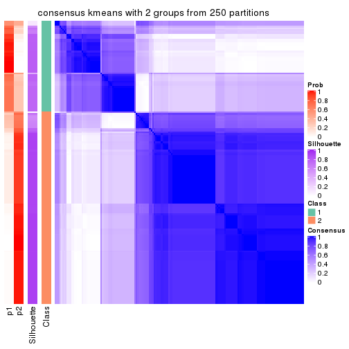</p>

</div>
<div id='tab-SD-kmeans-consensus-heatmap-2'>
<pre><code class="r">consensus_heatmap(res, k = 3)
</code></pre>

<p>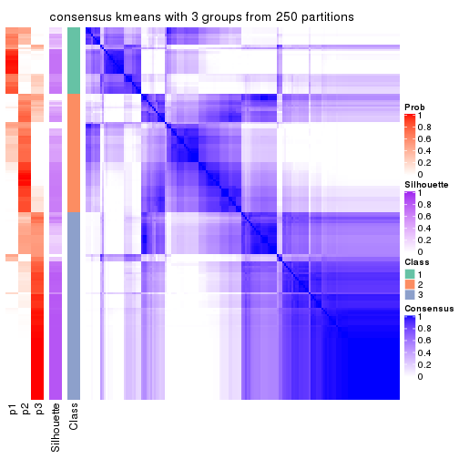</p>

</div>
<div id='tab-SD-kmeans-consensus-heatmap-3'>
<pre><code class="r">consensus_heatmap(res, k = 4)
</code></pre>

<p>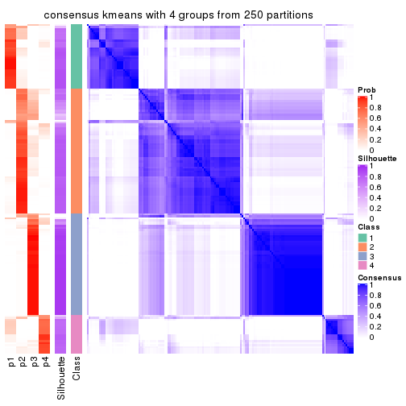</p>

</div>
<div id='tab-SD-kmeans-consensus-heatmap-4'>
<pre><code class="r">consensus_heatmap(res, k = 5)
</code></pre>

<p>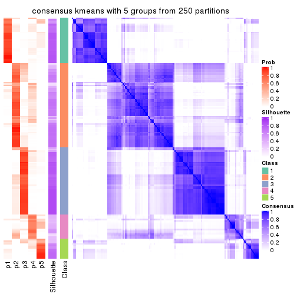</p>

</div>
<div id='tab-SD-kmeans-consensus-heatmap-5'>
<pre><code class="r">consensus_heatmap(res, k = 6)
</code></pre>

<p>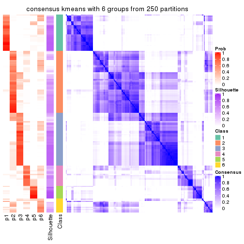</p>

</div>
</div>

Heatmaps for the membership of samples in all partitions to see how consistent they are:


<script>
$( function() {
	$( '#tabs-SD-kmeans-membership-heatmap' ).tabs();
} );
</script>
<div id='tabs-SD-kmeans-membership-heatmap'>
<ul>
<li><a href='#tab-SD-kmeans-membership-heatmap-1'>k = 2</a></li>
<li><a href='#tab-SD-kmeans-membership-heatmap-2'>k = 3</a></li>
<li><a href='#tab-SD-kmeans-membership-heatmap-3'>k = 4</a></li>
<li><a href='#tab-SD-kmeans-membership-heatmap-4'>k = 5</a></li>
<li><a href='#tab-SD-kmeans-membership-heatmap-5'>k = 6</a></li>
</ul>
<div id='tab-SD-kmeans-membership-heatmap-1'>
<pre><code class="r">membership_heatmap(res, k = 2)
</code></pre>

<p>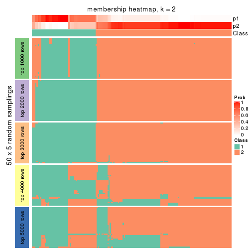</p>

</div>
<div id='tab-SD-kmeans-membership-heatmap-2'>
<pre><code class="r">membership_heatmap(res, k = 3)
</code></pre>

<p>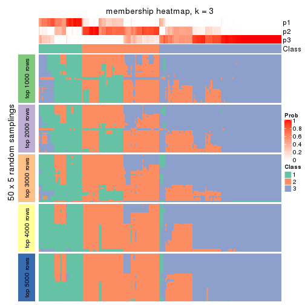</p>

</div>
<div id='tab-SD-kmeans-membership-heatmap-3'>
<pre><code class="r">membership_heatmap(res, k = 4)
</code></pre>

<p>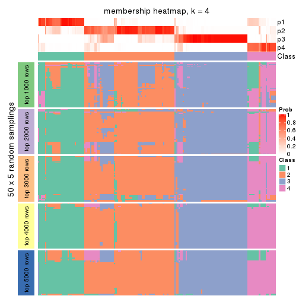</p>

</div>
<div id='tab-SD-kmeans-membership-heatmap-4'>
<pre><code class="r">membership_heatmap(res, k = 5)
</code></pre>

<p>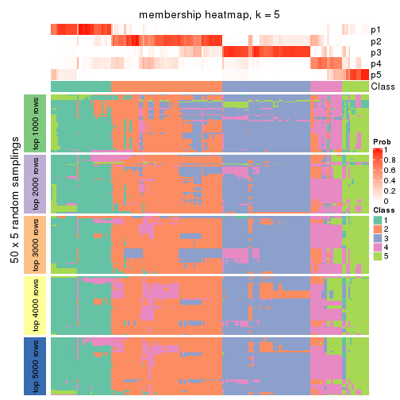</p>

</div>
<div id='tab-SD-kmeans-membership-heatmap-5'>
<pre><code class="r">membership_heatmap(res, k = 6)
</code></pre>

<p>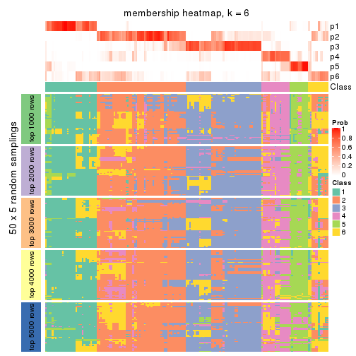</p>

</div>
</div>

As soon as we have had the classes for columns, we can look for signatures
which are significantly different between classes which can be candidate marks
for certain classes. Following are the heatmaps for signatures.


Signature heatmaps where rows are scaled:


<script>
$( function() {
	$( '#tabs-SD-kmeans-get-signatures' ).tabs();
} );
</script>
<div id='tabs-SD-kmeans-get-signatures'>
<ul>
<li><a href='#tab-SD-kmeans-get-signatures-1'>k = 2</a></li>
<li><a href='#tab-SD-kmeans-get-signatures-2'>k = 3</a></li>
<li><a href='#tab-SD-kmeans-get-signatures-3'>k = 4</a></li>
<li><a href='#tab-SD-kmeans-get-signatures-4'>k = 5</a></li>
<li><a href='#tab-SD-kmeans-get-signatures-5'>k = 6</a></li>
</ul>
<div id='tab-SD-kmeans-get-signatures-1'>
<pre><code class="r">get_signatures(res, k = 2)
</code></pre>

<p>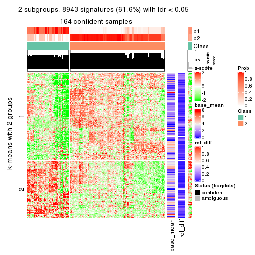</p>

</div>
<div id='tab-SD-kmeans-get-signatures-2'>
<pre><code class="r">get_signatures(res, k = 3)
</code></pre>

<p>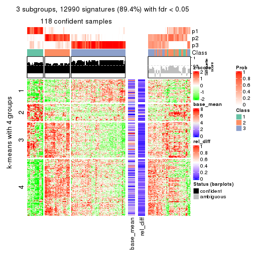</p>

</div>
<div id='tab-SD-kmeans-get-signatures-3'>
<pre><code class="r">get_signatures(res, k = 4)
</code></pre>

<p>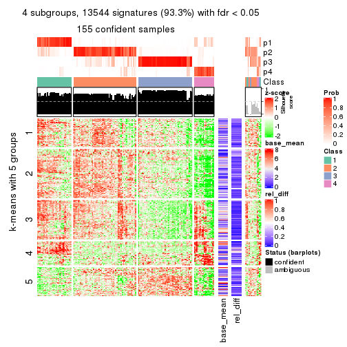</p>

</div>
<div id='tab-SD-kmeans-get-signatures-4'>
<pre><code class="r">get_signatures(res, k = 5)
</code></pre>

<p>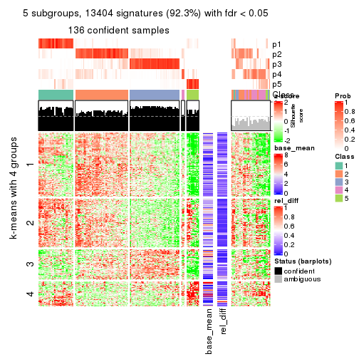</p>

</div>
<div id='tab-SD-kmeans-get-signatures-5'>
<pre><code class="r">get_signatures(res, k = 6)
</code></pre>

<p>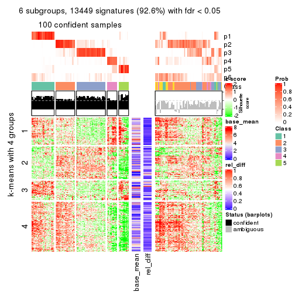</p>

</div>
</div>


Signature heatmaps where rows are not scaled:


<script>
$( function() {
	$( '#tabs-SD-kmeans-get-signatures-no-scale' ).tabs();
} );
</script>
<div id='tabs-SD-kmeans-get-signatures-no-scale'>
<ul>
<li><a href='#tab-SD-kmeans-get-signatures-no-scale-1'>k = 2</a></li>
<li><a href='#tab-SD-kmeans-get-signatures-no-scale-2'>k = 3</a></li>
<li><a href='#tab-SD-kmeans-get-signatures-no-scale-3'>k = 4</a></li>
<li><a href='#tab-SD-kmeans-get-signatures-no-scale-4'>k = 5</a></li>
<li><a href='#tab-SD-kmeans-get-signatures-no-scale-5'>k = 6</a></li>
</ul>
<div id='tab-SD-kmeans-get-signatures-no-scale-1'>
<pre><code class="r">get_signatures(res, k = 2, scale_rows = FALSE)
</code></pre>

<p>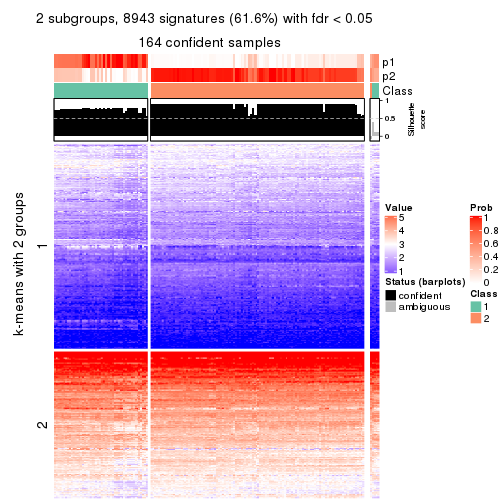</p>

</div>
<div id='tab-SD-kmeans-get-signatures-no-scale-2'>
<pre><code class="r">get_signatures(res, k = 3, scale_rows = FALSE)
</code></pre>

<p>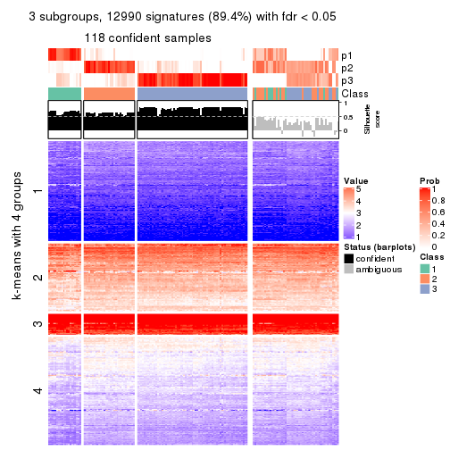</p>

</div>
<div id='tab-SD-kmeans-get-signatures-no-scale-3'>
<pre><code class="r">get_signatures(res, k = 4, scale_rows = FALSE)
</code></pre>

<p>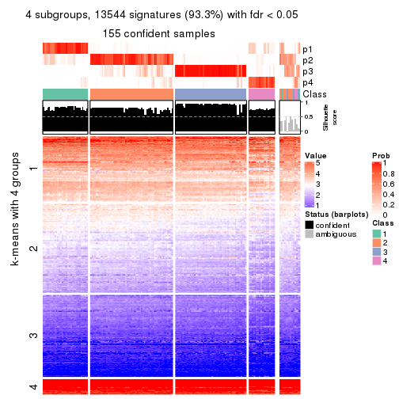</p>

</div>
<div id='tab-SD-kmeans-get-signatures-no-scale-4'>
<pre><code class="r">get_signatures(res, k = 5, scale_rows = FALSE)
</code></pre>

<p>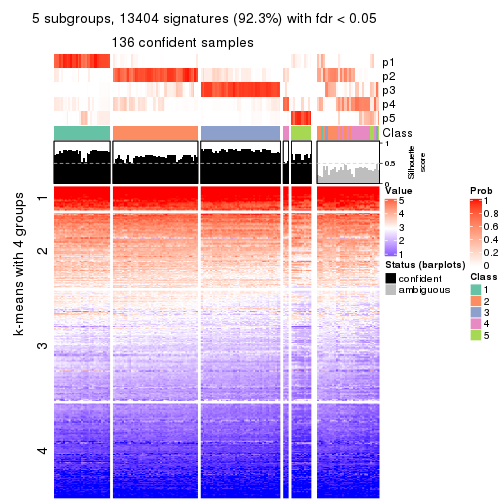</p>

</div>
<div id='tab-SD-kmeans-get-signatures-no-scale-5'>
<pre><code class="r">get_signatures(res, k = 6, scale_rows = FALSE)
</code></pre>

<p>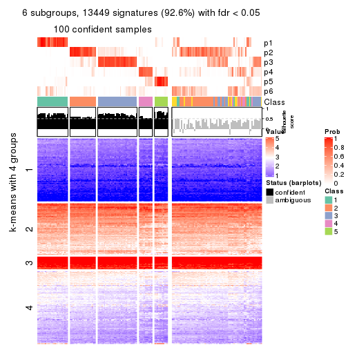</p>

</div>
</div>


Compare the overlap of signatures from different k:

```r
compare_signatures(res)
```

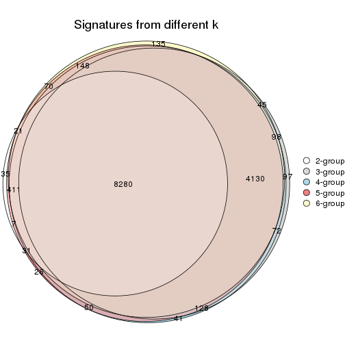

`get_signature()` returns a data frame invisibly. TO get the list of signatures, the function
call should be assigned to a variable explicitly. In following code, if `plot` argument is set
to `FALSE`, no heatmap is plotted while only the differential analysis is performed.

```r
# code only for demonstration
tb = get_signature(res, k = ..., plot = FALSE)
```

An example of the output of `tb` is:

```
#>   which_row         fdr    mean_1    mean_2 scaled_mean_1 scaled_mean_2 km
#> 1        38 0.042760348  8.373488  9.131774    -0.5533452     0.5164555  1
#> 2        40 0.018707592  7.106213  8.469186    -0.6173731     0.5762149  1
#> 3        55 0.019134737 10.221463 11.207825    -0.6159697     0.5749050  1
#> 4        59 0.006059896  5.921854  7.869574    -0.6899429     0.6439467  1
#> 5        60 0.018055526  8.928898 10.211722    -0.6204761     0.5791110  1
#> 6        98 0.009384629 15.714769 14.887706     0.6635654    -0.6193277  2
...
```

The columns in `tb` are:

1. `which_row`: row indices corresponding to the input matrix.
2. `fdr`: FDR for the differential test. 
3. `mean_x`: The mean value in group x.
4. `scaled_mean_x`: The mean value in group x after rows are scaled.
5. `km`: Row groups if k-means clustering is applied to rows.


UMAP plot which shows how samples are separated.


<script>
$( function() {
	$( '#tabs-SD-kmeans-dimension-reduction' ).tabs();
} );
</script>
<div id='tabs-SD-kmeans-dimension-reduction'>
<ul>
<li><a href='#tab-SD-kmeans-dimension-reduction-1'>k = 2</a></li>
<li><a href='#tab-SD-kmeans-dimension-reduction-2'>k = 3</a></li>
<li><a href='#tab-SD-kmeans-dimension-reduction-3'>k = 4</a></li>
<li><a href='#tab-SD-kmeans-dimension-reduction-4'>k = 5</a></li>
<li><a href='#tab-SD-kmeans-dimension-reduction-5'>k = 6</a></li>
</ul>
<div id='tab-SD-kmeans-dimension-reduction-1'>
<pre><code class="r">dimension_reduction(res, k = 2, method = &quot;UMAP&quot;)
</code></pre>

<p>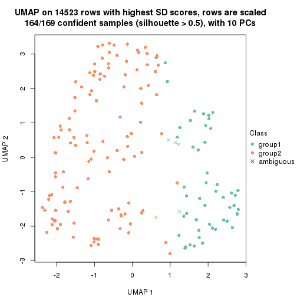</p>

</div>
<div id='tab-SD-kmeans-dimension-reduction-2'>
<pre><code class="r">dimension_reduction(res, k = 3, method = &quot;UMAP&quot;)
</code></pre>

<p>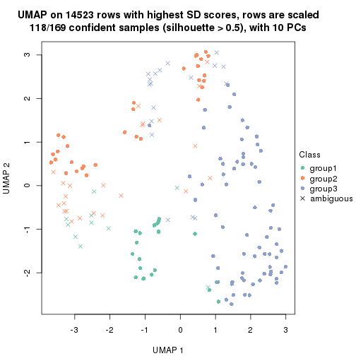</p>

</div>
<div id='tab-SD-kmeans-dimension-reduction-3'>
<pre><code class="r">dimension_reduction(res, k = 4, method = &quot;UMAP&quot;)
</code></pre>

<p>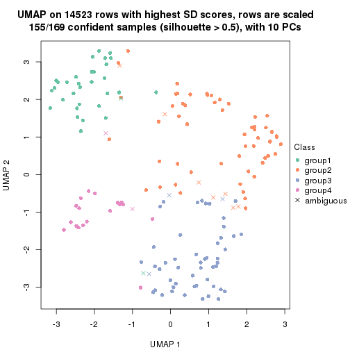</p>

</div>
<div id='tab-SD-kmeans-dimension-reduction-4'>
<pre><code class="r">dimension_reduction(res, k = 5, method = &quot;UMAP&quot;)
</code></pre>

<p>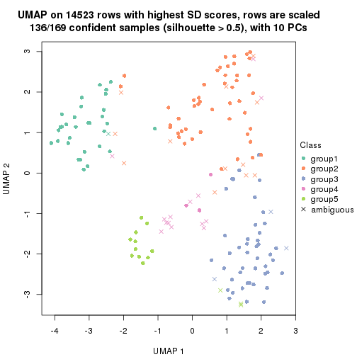</p>

</div>
<div id='tab-SD-kmeans-dimension-reduction-5'>
<pre><code class="r">dimension_reduction(res, k = 6, method = &quot;UMAP&quot;)
</code></pre>

<p>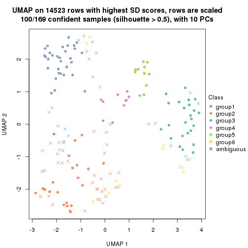</p>

</div>
</div>


Following heatmap shows how subgroups are split when increasing `k`:

```r
collect_classes(res)
```

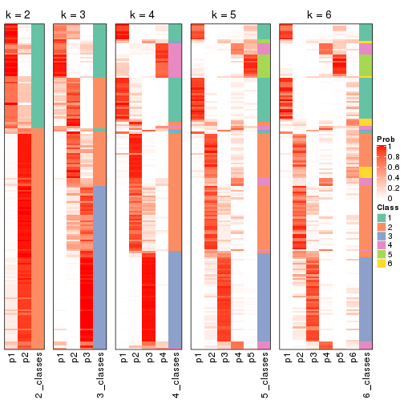


If matrix rows can be associated to genes, consider to use `GO_Enrichment(res,
...)` to perform function enrichment for the signature genes.


 

---------------------------------------------------


### SD:skmeans


The object with results only for a single top-value method and a single partition method 
can be extracted as:

```r
res = res_list["SD", "skmeans"]
# you can also extract it by
# res = res_list["SD:skmeans"]
```

A summary of `res` and all the functions that can be applied to it:

```r
res
```

```
#> A 'ConsensusPartition' object with k = 2, 3, 4, 5, 6.
#>   On a matrix with 14523 rows and 169 columns.
#>   Top rows (1000, 2000, 3000, 4000, 5000) are extracted by 'SD' method.
#>   Subgroups are detected by 'skmeans' method.
#>   Performed in total 1250 partitions by row resampling.
#>   Best k for subgroups seems to be 2.
#> 
#> Following methods can be applied to this 'ConsensusPartition' object:
#>  [1] "cola_report"             "collect_classes"         "collect_plots"          
#>  [4] "collect_stats"           "colnames"                "compare_signatures"     
#>  [7] "consensus_heatmap"       "dimension_reduction"     "functional_enrichment"  
#> [10] "get_anno_col"            "get_anno"                "get_classes"            
#> [13] "get_consensus"           "get_matrix"              "get_membership"         
#> [16] "get_param"               "get_signatures"          "get_stats"              
#> [19] "is_best_k"               "is_stable_k"             "membership_heatmap"     
#> [22] "ncol"                    "nrow"                    "plot_ecdf"              
#> [25] "rownames"                "select_partition_number" "show"                   
#> [28] "suggest_best_k"          "test_to_known_factors"
```

`collect_plots()` function collects all the plots made from `res` for all `k` (number of partitions)
into one single page to provide an easy and fast comparison between different `k`.

```r
collect_plots(res)
```

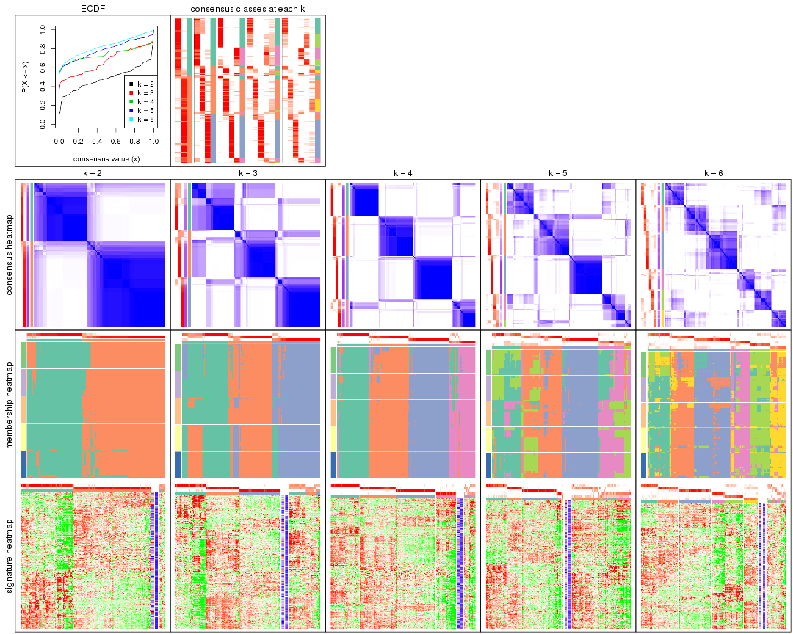

The plots are:

- The first row: a plot of the ECDF (Empirical cumulative distribution
  function) curves of the consensus matrix for each `k` and the heatmap of
  predicted classes for each `k`.
- The second row: heatmaps of the consensus matrix for each `k`.
- The third row: heatmaps of the membership matrix for each `k`.
- The fouth row: heatmaps of the signatures for each `k`.

All the plots in panels can be made by individual functions and they are
plotted later in this section.

`select_partition_number()` produces several plots showing different
statistics for choosing "optimized" `k`. There are following statistics:

- ECDF curves of the consensus matrix for each `k`;
- 1-PAC. [The PAC
  score](https://en.wikipedia.org/wiki/Consensus_clustering#Over-interpretation_potential_of_consensus_clustering)
  measures the proportion of the ambiguous subgrouping.
- Mean silhouette score.
- Concordance. The mean probability of fiting the consensus class ids in all
  partitions.
- Area increased. Denote $A_k$ as the area under the ECDF curve for current
  `k`, the area increased is defined as $A_k - A_{k-1}$.
- Rand index. The percent of pairs of samples that are both in a same cluster
  or both are not in a same cluster in the partition of k and k-1.
- Jaccard index. The ratio of pairs of samples are both in a same cluster in
  the partition of k and k-1 and the pairs of samples are both in a same
  cluster in the partition k or k-1.

The detailed explanations of these statistics can be found in [the cola
vignette](http://bioconductor.org/packages/devel/bioc/vignettes/cola/inst/doc/cola.html#toc_13).

Generally speaking, lower PAC score, higher mean silhouette score or higher
concordance corresponds to better partition. Rand index and Jaccard index
measure how similar the current partition is compared to partition with `k-1`.
If they are too similar, we won't accept `k` is better than `k-1`.

```r
select_partition_number(res)
```

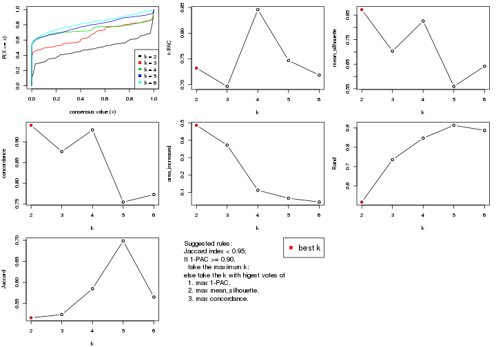

The numeric values for all these statistics can be obtained by `get_stats()`.

```r
get_stats(res)
```

```
#>   k 1-PAC mean_silhouette concordance area_increased  Rand Jaccard
#> 2 2 0.732           0.873       0.940         0.4867 0.516   0.516
#> 3 3 0.696           0.703       0.877         0.3725 0.736   0.524
#> 4 4 0.846           0.826       0.929         0.1119 0.847   0.585
#> 5 5 0.747           0.559       0.754         0.0661 0.914   0.698
#> 6 6 0.718           0.642       0.773         0.0437 0.887   0.565
```

`suggest_best_k()` suggests the best $k$ based on these statistics. The rules are as follows:

- All $k$ with Jaccard index larger than 0.95 are removed because the increase of
  the partition number does not provides enough extra information. If all $k$ are removed,
  the best $k$ is assigned by `NA`.
- For $k$ with 1-PAC larger than 0.9, the maximal $k$ is taken as the "best k". Other $k$ is called "optional k".
- If it does not fit the second rule. The $k$ with the highest vote of highest
  1-PAC, mean silhouette and concordance is taken as the "best k".

```r
suggest_best_k(res)
```

```
#> [1] 2
```


Following shows the table of the partitions (You need to click the **show/hide
code output** link to see it). The membership matrix (columns with name `p*`)
is inferred by
[`clue::cl_consensus()`](https://www.rdocumentation.org/link/cl_consensus?package=clue)
function with the `SE` method. Basically the value in the membership matrix
represents the probability to belong to a certain group. The finall class
label for an item is determined with the group with highest probability it
belongs to.

In `get_classes()` function, the entropy is calculated from the membership
matrix and the silhouette score is calculated from the consensus matrix.


<script>
$( function() {
	$( '#tabs-SD-skmeans-get-classes' ).tabs();
} );
</script>
<div id='tabs-SD-skmeans-get-classes'>
<ul>
<li><a href='#tab-SD-skmeans-get-classes-1'>k = 2</a></li>
<li><a href='#tab-SD-skmeans-get-classes-2'>k = 3</a></li>
<li><a href='#tab-SD-skmeans-get-classes-3'>k = 4</a></li>
<li><a href='#tab-SD-skmeans-get-classes-4'>k = 5</a></li>
<li><a href='#tab-SD-skmeans-get-classes-5'>k = 6</a></li>
</ul>

<div id='tab-SD-skmeans-get-classes-1'>
<p><a id='tab-SD-skmeans-get-classes-1-a' style='color:#0366d6' href='#'>show/hide code output</a></p>
<pre><code class="r">cbind(get_classes(res, k = 2), get_membership(res, k = 2))
</code></pre>

<pre><code>#&gt;            class entropy silhouette    p1    p2
#&gt; SRR2052702     2  0.4022      0.893 0.080 0.920
#&gt; SRR2052701     2  0.6801      0.778 0.180 0.820
#&gt; SRR2052700     1  0.0000      0.931 1.000 0.000
#&gt; SRR2052699     1  0.5059      0.842 0.888 0.112
#&gt; SRR2052698     2  0.0000      0.939 0.000 1.000
#&gt; SRR2052708     1  0.0376      0.931 0.996 0.004
#&gt; SRR2052749     1  0.0000      0.931 1.000 0.000
#&gt; SRR2052786     2  0.1633      0.935 0.024 0.976
#&gt; SRR2052825     1  0.4431      0.881 0.908 0.092
#&gt; SRR2052824     1  0.7674      0.740 0.776 0.224
#&gt; SRR2052823     2  0.9286      0.522 0.344 0.656
#&gt; SRR2052822     2  0.0376      0.939 0.004 0.996
#&gt; SRR2052821     2  0.1184      0.937 0.016 0.984
#&gt; SRR2052820     2  0.9754      0.321 0.408 0.592
#&gt; SRR2052819     2  0.5408      0.828 0.124 0.876
#&gt; SRR2052818     1  0.9635      0.389 0.612 0.388
#&gt; SRR2052817     2  0.0000      0.939 0.000 1.000
#&gt; SRR2052816     1  0.1633      0.926 0.976 0.024
#&gt; SRR2052815     1  0.7674      0.740 0.776 0.224
#&gt; SRR2052814     2  0.1843      0.922 0.028 0.972
#&gt; SRR2052813     2  0.1414      0.936 0.020 0.980
#&gt; SRR2052812     2  0.1633      0.935 0.024 0.976
#&gt; SRR2052811     2  0.4022      0.893 0.080 0.920
#&gt; SRR2052810     1  0.9815      0.350 0.580 0.420
#&gt; SRR2052809     2  0.0672      0.938 0.008 0.992
#&gt; SRR2052808     2  0.0000      0.939 0.000 1.000
#&gt; SRR2052807     1  0.1633      0.926 0.976 0.024
#&gt; SRR2052806     1  0.0000      0.931 1.000 0.000
#&gt; SRR2052805     1  0.0376      0.931 0.996 0.004
#&gt; SRR2052804     1  0.1633      0.926 0.976 0.024
#&gt; SRR2052803     1  0.0000      0.931 1.000 0.000
#&gt; SRR2052802     1  0.1633      0.926 0.976 0.024
#&gt; SRR2052801     1  0.1414      0.927 0.980 0.020
#&gt; SRR2052800     1  0.1633      0.926 0.976 0.024
#&gt; SRR2052799     1  0.1414      0.927 0.980 0.020
#&gt; SRR2052798     1  0.0000      0.931 1.000 0.000
#&gt; SRR2052797     2  0.1184      0.937 0.016 0.984
#&gt; SRR2052796     1  0.1184      0.929 0.984 0.016
#&gt; SRR2052795     1  0.0938      0.929 0.988 0.012
#&gt; SRR2052794     1  0.1633      0.926 0.976 0.024
#&gt; SRR2052793     1  0.1184      0.929 0.984 0.016
#&gt; SRR2052792     1  0.4815      0.869 0.896 0.104
#&gt; SRR2052791     1  0.1633      0.926 0.976 0.024
#&gt; SRR2052790     2  0.0000      0.939 0.000 1.000
#&gt; SRR2052789     2  0.0000      0.939 0.000 1.000
#&gt; SRR2052788     2  0.0000      0.939 0.000 1.000
#&gt; SRR2052787     2  0.1633      0.935 0.024 0.976
#&gt; SRR2052785     2  0.0000      0.939 0.000 1.000
#&gt; SRR2052784     2  0.0376      0.939 0.004 0.996
#&gt; SRR2052783     2  0.0376      0.939 0.004 0.996
#&gt; SRR2052782     2  0.1184      0.937 0.016 0.984
#&gt; SRR2052781     2  0.0376      0.939 0.004 0.996
#&gt; SRR2052780     2  0.0000      0.939 0.000 1.000
#&gt; SRR2052777     2  0.1184      0.937 0.016 0.984
#&gt; SRR2052779     2  0.1184      0.937 0.016 0.984
#&gt; SRR2052778     2  0.0000      0.939 0.000 1.000
#&gt; SRR2052776     2  0.0000      0.939 0.000 1.000
#&gt; SRR2052775     2  0.0000      0.939 0.000 1.000
#&gt; SRR2052773     2  0.0000      0.939 0.000 1.000
#&gt; SRR2052772     2  0.0000      0.939 0.000 1.000
#&gt; SRR2052774     2  0.0000      0.939 0.000 1.000
#&gt; SRR2052771     1  0.1633      0.926 0.976 0.024
#&gt; SRR2052769     2  0.0000      0.939 0.000 1.000
#&gt; SRR2052770     2  0.0000      0.939 0.000 1.000
#&gt; SRR2052768     2  0.1633      0.935 0.024 0.976
#&gt; SRR2052767     2  0.1633      0.935 0.024 0.976
#&gt; SRR2052766     2  0.5294      0.833 0.120 0.880
#&gt; SRR2052765     2  0.1414      0.936 0.020 0.980
#&gt; SRR2052763     2  0.0000      0.939 0.000 1.000
#&gt; SRR2052764     1  0.9209      0.516 0.664 0.336
#&gt; SRR2052761     2  0.0000      0.939 0.000 1.000
#&gt; SRR2052760     2  0.1633      0.935 0.024 0.976
#&gt; SRR2052759     2  0.0000      0.939 0.000 1.000
#&gt; SRR2052762     2  0.1184      0.937 0.016 0.984
#&gt; SRR2052758     2  0.0000      0.939 0.000 1.000
#&gt; SRR2052756     1  0.0000      0.931 1.000 0.000
#&gt; SRR2052757     2  0.0000      0.939 0.000 1.000
#&gt; SRR2052755     1  0.0000      0.931 1.000 0.000
#&gt; SRR2052754     1  0.1184      0.929 0.984 0.016
#&gt; SRR2052753     1  0.0000      0.931 1.000 0.000
#&gt; SRR2052752     1  0.1184      0.929 0.984 0.016
#&gt; SRR2052750     1  0.0000      0.931 1.000 0.000
#&gt; SRR2052751     2  0.1184      0.937 0.016 0.984
#&gt; SRR2052748     2  0.0000      0.939 0.000 1.000
#&gt; SRR2052747     1  0.0000      0.931 1.000 0.000
#&gt; SRR2052746     2  0.0000      0.939 0.000 1.000
#&gt; SRR2052745     2  0.0000      0.939 0.000 1.000
#&gt; SRR2052744     1  0.0000      0.931 1.000 0.000
#&gt; SRR2052741     2  0.7602      0.728 0.220 0.780
#&gt; SRR2052743     2  0.1633      0.935 0.024 0.976
#&gt; SRR2052740     2  0.2043      0.931 0.032 0.968
#&gt; SRR2052742     2  0.1184      0.937 0.016 0.984
#&gt; SRR2052739     2  0.1633      0.935 0.024 0.976
#&gt; SRR2052738     2  0.0000      0.939 0.000 1.000
#&gt; SRR2052736     1  0.5059      0.842 0.888 0.112
#&gt; SRR2052735     1  0.0000      0.931 1.000 0.000
#&gt; SRR2052734     1  0.0000      0.931 1.000 0.000
#&gt; SRR2052737     2  0.1414      0.936 0.020 0.980
#&gt; SRR2052733     2  0.0000      0.939 0.000 1.000
#&gt; SRR2052732     1  0.8443      0.641 0.728 0.272
#&gt; SRR2052731     2  0.0000      0.939 0.000 1.000
#&gt; SRR2052729     1  0.0000      0.931 1.000 0.000
#&gt; SRR2052728     1  0.0000      0.931 1.000 0.000
#&gt; SRR2052730     1  0.7674      0.740 0.776 0.224
#&gt; SRR2052727     1  0.0000      0.931 1.000 0.000
#&gt; SRR2052725     1  0.0000      0.931 1.000 0.000
#&gt; SRR2052726     1  0.0000      0.931 1.000 0.000
#&gt; SRR2052724     1  0.1184      0.929 0.984 0.016
#&gt; SRR2052723     2  0.9944      0.189 0.456 0.544
#&gt; SRR2052722     2  0.0000      0.939 0.000 1.000
#&gt; SRR2052721     1  0.0000      0.931 1.000 0.000
#&gt; SRR2052720     2  0.1633      0.935 0.024 0.976
#&gt; SRR2052719     2  0.1633      0.935 0.024 0.976
#&gt; SRR2052718     1  0.0000      0.931 1.000 0.000
#&gt; SRR2052717     2  0.1633      0.935 0.024 0.976
#&gt; SRR2052714     1  0.1414      0.927 0.980 0.020
#&gt; SRR2052716     2  0.5178      0.839 0.116 0.884
#&gt; SRR2052715     2  0.0000      0.939 0.000 1.000
#&gt; SRR2052713     1  0.0000      0.931 1.000 0.000
#&gt; SRR2052712     1  0.1633      0.926 0.976 0.024
#&gt; SRR2052711     1  0.1184      0.929 0.984 0.016
#&gt; SRR2052710     2  0.0938      0.938 0.012 0.988
#&gt; SRR2052707     2  0.0000      0.939 0.000 1.000
#&gt; SRR2052709     2  0.0000      0.939 0.000 1.000
#&gt; SRR2052704     2  0.0000      0.939 0.000 1.000
#&gt; SRR2052705     2  0.1633      0.935 0.024 0.976
#&gt; SRR2052697     1  0.9661      0.385 0.608 0.392
#&gt; SRR2052703     2  0.0000      0.939 0.000 1.000
#&gt; SRR2052696     1  0.0000      0.931 1.000 0.000
#&gt; SRR2052706     2  0.0000      0.939 0.000 1.000
#&gt; SRR2052695     2  0.1414      0.936 0.020 0.980
#&gt; SRR2052694     2  0.1633      0.935 0.024 0.976
#&gt; SRR2052692     2  0.0000      0.939 0.000 1.000
#&gt; SRR2052693     2  0.0000      0.939 0.000 1.000
#&gt; SRR2052691     1  0.5059      0.842 0.888 0.112
#&gt; SRR2052690     2  0.9998      0.088 0.492 0.508
#&gt; SRR2052689     2  0.5059      0.841 0.112 0.888
#&gt; SRR2052687     2  0.7950      0.667 0.240 0.760
#&gt; SRR2052686     1  0.0000      0.931 1.000 0.000
#&gt; SRR2052688     2  0.1633      0.935 0.024 0.976
#&gt; SRR2052684     2  0.9963      0.161 0.464 0.536
#&gt; SRR2052685     2  0.9323      0.516 0.348 0.652
#&gt; SRR2052683     1  0.0000      0.931 1.000 0.000
#&gt; SRR2052681     1  0.7299      0.747 0.796 0.204
#&gt; SRR2052680     1  0.7674      0.740 0.776 0.224
#&gt; SRR2052682     1  0.0000      0.931 1.000 0.000
#&gt; SRR2052679     1  0.0000      0.931 1.000 0.000
#&gt; SRR2052678     2  0.0000      0.939 0.000 1.000
#&gt; SRR2052677     2  0.1184      0.937 0.016 0.984
#&gt; SRR2052675     2  0.2043      0.931 0.032 0.968
#&gt; SRR2052676     1  0.0000      0.931 1.000 0.000
#&gt; SRR2052674     2  0.9710      0.286 0.400 0.600
#&gt; SRR2052672     2  0.0000      0.939 0.000 1.000
#&gt; SRR2052673     1  0.5059      0.843 0.888 0.112
#&gt; SRR2052671     2  0.4022      0.893 0.080 0.920
#&gt; SRR2052670     2  0.0000      0.939 0.000 1.000
#&gt; SRR2052669     2  0.1633      0.935 0.024 0.976
#&gt; SRR2052668     2  0.7674      0.722 0.224 0.776
#&gt; SRR2052667     2  0.1633      0.935 0.024 0.976
#&gt; SRR2052666     2  0.0000      0.939 0.000 1.000
#&gt; SRR2052665     2  0.1633      0.935 0.024 0.976
#&gt; SRR2052664     1  0.1184      0.929 0.984 0.016
#&gt; SRR2052663     1  0.8763      0.597 0.704 0.296
#&gt; SRR2052662     2  0.1633      0.935 0.024 0.976
#&gt; SRR2052661     1  0.0000      0.931 1.000 0.000
#&gt; SRR2052660     2  0.0000      0.939 0.000 1.000
#&gt; SRR2052659     2  0.7219      0.731 0.200 0.800
#&gt; SRR2052658     2  0.7674      0.722 0.224 0.776
#&gt; SRR2052657     1  0.0000      0.931 1.000 0.000
</code></pre>

<script>
$('#tab-SD-skmeans-get-classes-1-a').parent().next().next().hide();
$('#tab-SD-skmeans-get-classes-1-a').click(function(){
  $('#tab-SD-skmeans-get-classes-1-a').parent().next().next().toggle();
  return(false);
});
</script>
</div>

<div id='tab-SD-skmeans-get-classes-2'>
<p><a id='tab-SD-skmeans-get-classes-2-a' style='color:#0366d6' href='#'>show/hide code output</a></p>
<pre><code class="r">cbind(get_classes(res, k = 3), get_membership(res, k = 3))
</code></pre>

<pre><code>#&gt;            class entropy silhouette    p1    p2    p3
#&gt; SRR2052702     2  0.0000     0.8310 0.000 1.000 0.000
#&gt; SRR2052701     2  0.0000     0.8310 0.000 1.000 0.000
#&gt; SRR2052700     1  0.0424     0.7742 0.992 0.008 0.000
#&gt; SRR2052699     1  0.6295     0.3321 0.528 0.472 0.000
#&gt; SRR2052698     3  0.0000     0.9154 0.000 0.000 1.000
#&gt; SRR2052708     1  0.0000     0.7777 1.000 0.000 0.000
#&gt; SRR2052749     1  0.0000     0.7777 1.000 0.000 0.000
#&gt; SRR2052786     2  0.0237     0.8316 0.000 0.996 0.004
#&gt; SRR2052825     1  0.3532     0.7098 0.884 0.008 0.108
#&gt; SRR2052824     1  0.5178     0.5291 0.744 0.000 0.256
#&gt; SRR2052823     2  0.0000     0.8310 0.000 1.000 0.000
#&gt; SRR2052822     3  0.0000     0.9154 0.000 0.000 1.000
#&gt; SRR2052821     2  0.6302     0.1187 0.000 0.520 0.480
#&gt; SRR2052820     3  0.4178     0.7456 0.172 0.000 0.828
#&gt; SRR2052819     3  0.6140     0.3755 0.404 0.000 0.596
#&gt; SRR2052818     2  0.0237     0.8300 0.004 0.996 0.000
#&gt; SRR2052817     3  0.0000     0.9154 0.000 0.000 1.000
#&gt; SRR2052816     1  0.4605     0.6004 0.796 0.204 0.000
#&gt; SRR2052815     1  0.5178     0.5291 0.744 0.000 0.256
#&gt; SRR2052814     2  0.6969     0.2802 0.380 0.596 0.024
#&gt; SRR2052813     2  0.4121     0.7005 0.000 0.832 0.168
#&gt; SRR2052812     2  0.0237     0.8316 0.000 0.996 0.004
#&gt; SRR2052811     2  0.0000     0.8310 0.000 1.000 0.000
#&gt; SRR2052810     2  0.7178     0.0792 0.464 0.512 0.024
#&gt; SRR2052809     3  0.2796     0.8295 0.000 0.092 0.908
#&gt; SRR2052808     3  0.0000     0.9154 0.000 0.000 1.000
#&gt; SRR2052807     1  0.0000     0.7777 1.000 0.000 0.000
#&gt; SRR2052806     1  0.0000     0.7777 1.000 0.000 0.000
#&gt; SRR2052805     1  0.0000     0.7777 1.000 0.000 0.000
#&gt; SRR2052804     1  0.5138     0.5355 0.748 0.000 0.252
#&gt; SRR2052803     1  0.0000     0.7777 1.000 0.000 0.000
#&gt; SRR2052802     1  0.5138     0.5355 0.748 0.000 0.252
#&gt; SRR2052801     1  0.0000     0.7777 1.000 0.000 0.000
#&gt; SRR2052800     1  0.5138     0.5355 0.748 0.000 0.252
#&gt; SRR2052799     1  0.0000     0.7777 1.000 0.000 0.000
#&gt; SRR2052798     1  0.0237     0.7770 0.996 0.004 0.000
#&gt; SRR2052797     2  0.6302     0.1187 0.000 0.520 0.480
#&gt; SRR2052796     1  0.0000     0.7777 1.000 0.000 0.000
#&gt; SRR2052795     1  0.0000     0.7777 1.000 0.000 0.000
#&gt; SRR2052794     1  0.0000     0.7777 1.000 0.000 0.000
#&gt; SRR2052793     1  0.0000     0.7777 1.000 0.000 0.000
#&gt; SRR2052792     3  0.6180     0.3477 0.416 0.000 0.584
#&gt; SRR2052791     1  0.0000     0.7777 1.000 0.000 0.000
#&gt; SRR2052790     3  0.4654     0.6724 0.000 0.208 0.792
#&gt; SRR2052789     3  0.0000     0.9154 0.000 0.000 1.000
#&gt; SRR2052788     3  0.0000     0.9154 0.000 0.000 1.000
#&gt; SRR2052787     2  0.0424     0.8301 0.000 0.992 0.008
#&gt; SRR2052785     3  0.0000     0.9154 0.000 0.000 1.000
#&gt; SRR2052784     3  0.5465     0.5277 0.000 0.288 0.712
#&gt; SRR2052783     3  0.0237     0.9127 0.000 0.004 0.996
#&gt; SRR2052782     2  0.6302     0.1187 0.000 0.520 0.480
#&gt; SRR2052781     3  0.0237     0.9127 0.000 0.004 0.996
#&gt; SRR2052780     3  0.0000     0.9154 0.000 0.000 1.000
#&gt; SRR2052777     2  0.6140     0.3155 0.000 0.596 0.404
#&gt; SRR2052779     2  0.6302     0.1187 0.000 0.520 0.480
#&gt; SRR2052778     3  0.0000     0.9154 0.000 0.000 1.000
#&gt; SRR2052776     3  0.0000     0.9154 0.000 0.000 1.000
#&gt; SRR2052775     3  0.0000     0.9154 0.000 0.000 1.000
#&gt; SRR2052773     3  0.0000     0.9154 0.000 0.000 1.000
#&gt; SRR2052772     3  0.0000     0.9154 0.000 0.000 1.000
#&gt; SRR2052774     3  0.0000     0.9154 0.000 0.000 1.000
#&gt; SRR2052771     1  0.0000     0.7777 1.000 0.000 0.000
#&gt; SRR2052769     3  0.0000     0.9154 0.000 0.000 1.000
#&gt; SRR2052770     3  0.0000     0.9154 0.000 0.000 1.000
#&gt; SRR2052768     2  0.0237     0.8316 0.000 0.996 0.004
#&gt; SRR2052767     2  0.0000     0.8310 0.000 1.000 0.000
#&gt; SRR2052766     3  0.6126     0.3841 0.400 0.000 0.600
#&gt; SRR2052765     2  0.0237     0.8316 0.000 0.996 0.004
#&gt; SRR2052763     3  0.1529     0.8827 0.000 0.040 0.960
#&gt; SRR2052764     2  0.0000     0.8310 0.000 1.000 0.000
#&gt; SRR2052761     3  0.0000     0.9154 0.000 0.000 1.000
#&gt; SRR2052760     2  0.0237     0.8316 0.000 0.996 0.004
#&gt; SRR2052759     3  0.0000     0.9154 0.000 0.000 1.000
#&gt; SRR2052762     2  0.6308     0.0787 0.000 0.508 0.492
#&gt; SRR2052758     3  0.0000     0.9154 0.000 0.000 1.000
#&gt; SRR2052756     1  0.0237     0.7770 0.996 0.004 0.000
#&gt; SRR2052757     3  0.0000     0.9154 0.000 0.000 1.000
#&gt; SRR2052755     1  0.6154     0.4491 0.592 0.408 0.000
#&gt; SRR2052754     1  0.0000     0.7777 1.000 0.000 0.000
#&gt; SRR2052753     1  0.6126     0.4609 0.600 0.400 0.000
#&gt; SRR2052752     1  0.0000     0.7777 1.000 0.000 0.000
#&gt; SRR2052750     1  0.6126     0.4609 0.600 0.400 0.000
#&gt; SRR2052751     3  0.1289     0.8904 0.000 0.032 0.968
#&gt; SRR2052748     3  0.0000     0.9154 0.000 0.000 1.000
#&gt; SRR2052747     1  0.0237     0.7770 0.996 0.004 0.000
#&gt; SRR2052746     3  0.0000     0.9154 0.000 0.000 1.000
#&gt; SRR2052745     3  0.0000     0.9154 0.000 0.000 1.000
#&gt; SRR2052744     1  0.6154     0.4491 0.592 0.408 0.000
#&gt; SRR2052741     2  0.0000     0.8310 0.000 1.000 0.000
#&gt; SRR2052743     2  0.0000     0.8310 0.000 1.000 0.000
#&gt; SRR2052740     2  0.0000     0.8310 0.000 1.000 0.000
#&gt; SRR2052742     3  0.3340     0.8005 0.000 0.120 0.880
#&gt; SRR2052739     2  0.0237     0.8316 0.000 0.996 0.004
#&gt; SRR2052738     3  0.0000     0.9154 0.000 0.000 1.000
#&gt; SRR2052736     2  0.4504     0.5910 0.196 0.804 0.000
#&gt; SRR2052735     1  0.6299     0.3235 0.524 0.476 0.000
#&gt; SRR2052734     2  0.5138     0.4868 0.252 0.748 0.000
#&gt; SRR2052737     2  0.2711     0.7706 0.000 0.912 0.088
#&gt; SRR2052733     3  0.0000     0.9154 0.000 0.000 1.000
#&gt; SRR2052732     2  0.0000     0.8310 0.000 1.000 0.000
#&gt; SRR2052731     3  0.0000     0.9154 0.000 0.000 1.000
#&gt; SRR2052729     1  0.6126     0.4609 0.600 0.400 0.000
#&gt; SRR2052728     1  0.6286     0.3486 0.536 0.464 0.000
#&gt; SRR2052730     3  0.6286     0.2224 0.464 0.000 0.536
#&gt; SRR2052727     1  0.6126     0.4609 0.600 0.400 0.000
#&gt; SRR2052725     1  0.6302     0.3155 0.520 0.480 0.000
#&gt; SRR2052726     1  0.6299     0.3235 0.524 0.476 0.000
#&gt; SRR2052724     1  0.0000     0.7777 1.000 0.000 0.000
#&gt; SRR2052723     3  0.1031     0.8992 0.024 0.000 0.976
#&gt; SRR2052722     3  0.0000     0.9154 0.000 0.000 1.000
#&gt; SRR2052721     1  0.6154     0.4491 0.592 0.408 0.000
#&gt; SRR2052720     2  0.0237     0.8316 0.000 0.996 0.004
#&gt; SRR2052719     2  0.0237     0.8316 0.000 0.996 0.004
#&gt; SRR2052718     1  0.6274     0.3643 0.544 0.456 0.000
#&gt; SRR2052717     2  0.1163     0.8176 0.000 0.972 0.028
#&gt; SRR2052714     1  0.0000     0.7777 1.000 0.000 0.000
#&gt; SRR2052716     3  0.4121     0.7569 0.168 0.000 0.832
#&gt; SRR2052715     3  0.0000     0.9154 0.000 0.000 1.000
#&gt; SRR2052713     1  0.0237     0.7770 0.996 0.004 0.000
#&gt; SRR2052712     1  0.2711     0.7263 0.912 0.000 0.088
#&gt; SRR2052711     1  0.0237     0.7763 0.996 0.004 0.000
#&gt; SRR2052710     2  0.6095     0.3639 0.000 0.608 0.392
#&gt; SRR2052707     3  0.0000     0.9154 0.000 0.000 1.000
#&gt; SRR2052709     3  0.0000     0.9154 0.000 0.000 1.000
#&gt; SRR2052704     3  0.0000     0.9154 0.000 0.000 1.000
#&gt; SRR2052705     2  0.0237     0.8316 0.000 0.996 0.004
#&gt; SRR2052697     2  0.0000     0.8310 0.000 1.000 0.000
#&gt; SRR2052703     3  0.0000     0.9154 0.000 0.000 1.000
#&gt; SRR2052696     1  0.0237     0.7770 0.996 0.004 0.000
#&gt; SRR2052706     2  0.6299     0.1293 0.000 0.524 0.476
#&gt; SRR2052695     2  0.0592     0.8278 0.000 0.988 0.012
#&gt; SRR2052694     2  0.0424     0.8300 0.000 0.992 0.008
#&gt; SRR2052692     3  0.0000     0.9154 0.000 0.000 1.000
#&gt; SRR2052693     3  0.0000     0.9154 0.000 0.000 1.000
#&gt; SRR2052691     1  0.6305     0.3031 0.516 0.484 0.000
#&gt; SRR2052690     2  0.5905     0.2282 0.352 0.648 0.000
#&gt; SRR2052689     3  0.6126     0.3841 0.400 0.000 0.600
#&gt; SRR2052687     3  0.6140     0.3755 0.404 0.000 0.596
#&gt; SRR2052686     1  0.6126     0.4609 0.600 0.400 0.000
#&gt; SRR2052688     2  0.0237     0.8316 0.000 0.996 0.004
#&gt; SRR2052684     3  0.1163     0.8970 0.028 0.000 0.972
#&gt; SRR2052685     2  0.0000     0.8310 0.000 1.000 0.000
#&gt; SRR2052683     1  0.0000     0.7777 1.000 0.000 0.000
#&gt; SRR2052681     1  0.4575     0.6278 0.812 0.004 0.184
#&gt; SRR2052680     1  0.5178     0.5291 0.744 0.000 0.256
#&gt; SRR2052682     2  0.5138     0.4868 0.252 0.748 0.000
#&gt; SRR2052679     1  0.6126     0.4609 0.600 0.400 0.000
#&gt; SRR2052678     3  0.0000     0.9154 0.000 0.000 1.000
#&gt; SRR2052677     3  0.6309    -0.0761 0.000 0.496 0.504
#&gt; SRR2052675     2  0.0000     0.8310 0.000 1.000 0.000
#&gt; SRR2052676     1  0.6126     0.4609 0.600 0.400 0.000
#&gt; SRR2052674     2  0.8403     0.1408 0.400 0.512 0.088
#&gt; SRR2052672     3  0.0000     0.9154 0.000 0.000 1.000
#&gt; SRR2052673     2  0.0000     0.8310 0.000 1.000 0.000
#&gt; SRR2052671     2  0.0000     0.8310 0.000 1.000 0.000
#&gt; SRR2052670     3  0.0000     0.9154 0.000 0.000 1.000
#&gt; SRR2052669     2  0.0424     0.8300 0.000 0.992 0.008
#&gt; SRR2052668     2  0.0424     0.8256 0.008 0.992 0.000
#&gt; SRR2052667     2  0.2448     0.7733 0.000 0.924 0.076
#&gt; SRR2052666     3  0.2796     0.8303 0.000 0.092 0.908
#&gt; SRR2052665     2  0.0237     0.8316 0.000 0.996 0.004
#&gt; SRR2052664     1  0.0000     0.7777 1.000 0.000 0.000
#&gt; SRR2052663     2  0.0000     0.8310 0.000 1.000 0.000
#&gt; SRR2052662     2  0.0237     0.8316 0.000 0.996 0.004
#&gt; SRR2052661     1  0.6299     0.3235 0.524 0.476 0.000
#&gt; SRR2052660     3  0.0000     0.9154 0.000 0.000 1.000
#&gt; SRR2052659     3  0.0000     0.9154 0.000 0.000 1.000
#&gt; SRR2052658     2  0.1860     0.7846 0.052 0.948 0.000
#&gt; SRR2052657     1  0.0237     0.7770 0.996 0.004 0.000
</code></pre>

<script>
$('#tab-SD-skmeans-get-classes-2-a').parent().next().next().hide();
$('#tab-SD-skmeans-get-classes-2-a').click(function(){
  $('#tab-SD-skmeans-get-classes-2-a').parent().next().next().toggle();
  return(false);
});
</script>
</div>

<div id='tab-SD-skmeans-get-classes-3'>
<p><a id='tab-SD-skmeans-get-classes-3-a' style='color:#0366d6' href='#'>show/hide code output</a></p>
<pre><code class="r">cbind(get_classes(res, k = 4), get_membership(res, k = 4))
</code></pre>

<pre><code>#&gt;            class entropy silhouette    p1    p2    p3    p4
#&gt; SRR2052702     2  0.0000     0.9272 0.000 1.000 0.000 0.000
#&gt; SRR2052701     2  0.0000     0.9272 0.000 1.000 0.000 0.000
#&gt; SRR2052700     4  0.0000     0.8167 0.000 0.000 0.000 1.000
#&gt; SRR2052699     1  0.0000     0.9279 1.000 0.000 0.000 0.000
#&gt; SRR2052698     3  0.0000     0.9599 0.000 0.000 1.000 0.000
#&gt; SRR2052708     1  0.0000     0.9279 1.000 0.000 0.000 0.000
#&gt; SRR2052749     1  0.0000     0.9279 1.000 0.000 0.000 0.000
#&gt; SRR2052786     2  0.0921     0.9222 0.000 0.972 0.028 0.000
#&gt; SRR2052825     4  0.0000     0.8167 0.000 0.000 0.000 1.000
#&gt; SRR2052824     4  0.0000     0.8167 0.000 0.000 0.000 1.000
#&gt; SRR2052823     2  0.0000     0.9272 0.000 1.000 0.000 0.000
#&gt; SRR2052822     3  0.0000     0.9599 0.000 0.000 1.000 0.000
#&gt; SRR2052821     2  0.3356     0.7969 0.000 0.824 0.176 0.000
#&gt; SRR2052820     3  0.3836     0.7478 0.168 0.000 0.816 0.016
#&gt; SRR2052819     4  0.0707     0.8082 0.000 0.000 0.020 0.980
#&gt; SRR2052818     4  0.5000    -0.1546 0.000 0.496 0.000 0.504
#&gt; SRR2052817     3  0.0000     0.9599 0.000 0.000 1.000 0.000
#&gt; SRR2052816     4  0.4017     0.7397 0.044 0.128 0.000 0.828
#&gt; SRR2052815     4  0.0000     0.8167 0.000 0.000 0.000 1.000
#&gt; SRR2052814     4  0.5295     0.1057 0.000 0.488 0.008 0.504
#&gt; SRR2052813     2  0.1474     0.9085 0.000 0.948 0.052 0.000
#&gt; SRR2052812     2  0.0000     0.9272 0.000 1.000 0.000 0.000
#&gt; SRR2052811     2  0.0000     0.9272 0.000 1.000 0.000 0.000
#&gt; SRR2052810     4  0.0000     0.8167 0.000 0.000 0.000 1.000
#&gt; SRR2052809     2  0.4999     0.1177 0.000 0.508 0.492 0.000
#&gt; SRR2052808     4  0.5031     0.6634 0.000 0.092 0.140 0.768
#&gt; SRR2052807     4  0.0000     0.8167 0.000 0.000 0.000 1.000
#&gt; SRR2052806     1  0.0000     0.9279 1.000 0.000 0.000 0.000
#&gt; SRR2052805     1  0.0000     0.9279 1.000 0.000 0.000 0.000
#&gt; SRR2052804     4  0.0000     0.8167 0.000 0.000 0.000 1.000
#&gt; SRR2052803     1  0.0000     0.9279 1.000 0.000 0.000 0.000
#&gt; SRR2052802     4  0.0000     0.8167 0.000 0.000 0.000 1.000
#&gt; SRR2052801     4  0.4830     0.4364 0.392 0.000 0.000 0.608
#&gt; SRR2052800     4  0.0000     0.8167 0.000 0.000 0.000 1.000
#&gt; SRR2052799     4  0.4543     0.5526 0.324 0.000 0.000 0.676
#&gt; SRR2052798     1  0.0000     0.9279 1.000 0.000 0.000 0.000
#&gt; SRR2052797     2  0.2868     0.8386 0.000 0.864 0.136 0.000
#&gt; SRR2052796     4  0.4999     0.1942 0.492 0.000 0.000 0.508
#&gt; SRR2052795     1  0.0000     0.9279 1.000 0.000 0.000 0.000
#&gt; SRR2052794     4  0.4585     0.5408 0.332 0.000 0.000 0.668
#&gt; SRR2052793     1  0.4994    -0.1477 0.520 0.000 0.000 0.480
#&gt; SRR2052792     4  0.2589     0.7520 0.000 0.000 0.116 0.884
#&gt; SRR2052791     4  0.5158     0.2461 0.472 0.000 0.004 0.524
#&gt; SRR2052790     3  0.0000     0.9599 0.000 0.000 1.000 0.000
#&gt; SRR2052789     3  0.0000     0.9599 0.000 0.000 1.000 0.000
#&gt; SRR2052788     3  0.0000     0.9599 0.000 0.000 1.000 0.000
#&gt; SRR2052787     2  0.1716     0.9007 0.000 0.936 0.064 0.000
#&gt; SRR2052785     3  0.0000     0.9599 0.000 0.000 1.000 0.000
#&gt; SRR2052784     3  0.3311     0.7701 0.000 0.172 0.828 0.000
#&gt; SRR2052783     3  0.3907     0.6607 0.000 0.232 0.768 0.000
#&gt; SRR2052782     2  0.2921     0.8349 0.000 0.860 0.140 0.000
#&gt; SRR2052781     3  0.1022     0.9309 0.000 0.032 0.968 0.000
#&gt; SRR2052780     3  0.0000     0.9599 0.000 0.000 1.000 0.000
#&gt; SRR2052777     2  0.2011     0.8898 0.000 0.920 0.080 0.000
#&gt; SRR2052779     2  0.3024     0.8269 0.000 0.852 0.148 0.000
#&gt; SRR2052778     3  0.0000     0.9599 0.000 0.000 1.000 0.000
#&gt; SRR2052776     3  0.0000     0.9599 0.000 0.000 1.000 0.000
#&gt; SRR2052775     3  0.0000     0.9599 0.000 0.000 1.000 0.000
#&gt; SRR2052773     3  0.0000     0.9599 0.000 0.000 1.000 0.000
#&gt; SRR2052772     3  0.0000     0.9599 0.000 0.000 1.000 0.000
#&gt; SRR2052774     3  0.0000     0.9599 0.000 0.000 1.000 0.000
#&gt; SRR2052771     4  0.4989     0.2503 0.472 0.000 0.000 0.528
#&gt; SRR2052769     3  0.5000    -0.0482 0.000 0.000 0.500 0.500
#&gt; SRR2052770     3  0.0000     0.9599 0.000 0.000 1.000 0.000
#&gt; SRR2052768     2  0.0000     0.9272 0.000 1.000 0.000 0.000
#&gt; SRR2052767     2  0.0000     0.9272 0.000 1.000 0.000 0.000
#&gt; SRR2052766     4  0.2589     0.7520 0.000 0.000 0.116 0.884
#&gt; SRR2052765     2  0.0817     0.9235 0.000 0.976 0.024 0.000
#&gt; SRR2052763     3  0.0000     0.9599 0.000 0.000 1.000 0.000
#&gt; SRR2052764     2  0.0000     0.9272 0.000 1.000 0.000 0.000
#&gt; SRR2052761     3  0.0000     0.9599 0.000 0.000 1.000 0.000
#&gt; SRR2052760     2  0.0000     0.9272 0.000 1.000 0.000 0.000
#&gt; SRR2052759     3  0.0000     0.9599 0.000 0.000 1.000 0.000
#&gt; SRR2052762     3  0.4998     0.0593 0.000 0.488 0.512 0.000
#&gt; SRR2052758     3  0.0000     0.9599 0.000 0.000 1.000 0.000
#&gt; SRR2052756     1  0.0000     0.9279 1.000 0.000 0.000 0.000
#&gt; SRR2052757     3  0.0000     0.9599 0.000 0.000 1.000 0.000
#&gt; SRR2052755     1  0.0000     0.9279 1.000 0.000 0.000 0.000
#&gt; SRR2052754     4  0.4999     0.1942 0.492 0.000 0.000 0.508
#&gt; SRR2052753     1  0.0000     0.9279 1.000 0.000 0.000 0.000
#&gt; SRR2052752     1  0.0000     0.9279 1.000 0.000 0.000 0.000
#&gt; SRR2052750     1  0.0000     0.9279 1.000 0.000 0.000 0.000
#&gt; SRR2052751     3  0.0000     0.9599 0.000 0.000 1.000 0.000
#&gt; SRR2052748     3  0.0000     0.9599 0.000 0.000 1.000 0.000
#&gt; SRR2052747     1  0.0000     0.9279 1.000 0.000 0.000 0.000
#&gt; SRR2052746     3  0.0000     0.9599 0.000 0.000 1.000 0.000
#&gt; SRR2052745     3  0.0000     0.9599 0.000 0.000 1.000 0.000
#&gt; SRR2052744     1  0.0000     0.9279 1.000 0.000 0.000 0.000
#&gt; SRR2052741     2  0.0000     0.9272 0.000 1.000 0.000 0.000
#&gt; SRR2052743     2  0.0000     0.9272 0.000 1.000 0.000 0.000
#&gt; SRR2052740     2  0.0000     0.9272 0.000 1.000 0.000 0.000
#&gt; SRR2052742     3  0.0817     0.9394 0.000 0.024 0.976 0.000
#&gt; SRR2052739     2  0.0817     0.9235 0.000 0.976 0.024 0.000
#&gt; SRR2052738     3  0.0000     0.9599 0.000 0.000 1.000 0.000
#&gt; SRR2052736     2  0.2973     0.7834 0.144 0.856 0.000 0.000
#&gt; SRR2052735     1  0.0000     0.9279 1.000 0.000 0.000 0.000
#&gt; SRR2052734     1  0.2530     0.8085 0.888 0.112 0.000 0.000
#&gt; SRR2052737     2  0.2921     0.8350 0.000 0.860 0.140 0.000
#&gt; SRR2052733     3  0.0000     0.9599 0.000 0.000 1.000 0.000
#&gt; SRR2052732     2  0.0921     0.9129 0.000 0.972 0.000 0.028
#&gt; SRR2052731     3  0.0000     0.9599 0.000 0.000 1.000 0.000
#&gt; SRR2052729     1  0.0000     0.9279 1.000 0.000 0.000 0.000
#&gt; SRR2052728     1  0.0000     0.9279 1.000 0.000 0.000 0.000
#&gt; SRR2052730     4  0.0000     0.8167 0.000 0.000 0.000 1.000
#&gt; SRR2052727     1  0.0000     0.9279 1.000 0.000 0.000 0.000
#&gt; SRR2052725     1  0.5594     0.6098 0.724 0.112 0.000 0.164
#&gt; SRR2052726     1  0.0000     0.9279 1.000 0.000 0.000 0.000
#&gt; SRR2052724     1  0.0000     0.9279 1.000 0.000 0.000 0.000
#&gt; SRR2052723     3  0.1398     0.9229 0.004 0.000 0.956 0.040
#&gt; SRR2052722     3  0.0000     0.9599 0.000 0.000 1.000 0.000
#&gt; SRR2052721     1  0.0000     0.9279 1.000 0.000 0.000 0.000
#&gt; SRR2052720     2  0.0921     0.9221 0.000 0.972 0.028 0.000
#&gt; SRR2052719     2  0.0000     0.9272 0.000 1.000 0.000 0.000
#&gt; SRR2052718     1  0.0000     0.9279 1.000 0.000 0.000 0.000
#&gt; SRR2052717     2  0.0000     0.9272 0.000 1.000 0.000 0.000
#&gt; SRR2052714     1  0.3610     0.6568 0.800 0.000 0.000 0.200
#&gt; SRR2052716     3  0.0817     0.9414 0.000 0.000 0.976 0.024
#&gt; SRR2052715     3  0.0000     0.9599 0.000 0.000 1.000 0.000
#&gt; SRR2052713     1  0.0000     0.9279 1.000 0.000 0.000 0.000
#&gt; SRR2052712     4  0.0000     0.8167 0.000 0.000 0.000 1.000
#&gt; SRR2052711     4  0.4755     0.6787 0.200 0.040 0.000 0.760
#&gt; SRR2052710     2  0.5508     0.1743 0.000 0.508 0.016 0.476
#&gt; SRR2052707     3  0.0000     0.9599 0.000 0.000 1.000 0.000
#&gt; SRR2052709     3  0.0000     0.9599 0.000 0.000 1.000 0.000
#&gt; SRR2052704     3  0.0000     0.9599 0.000 0.000 1.000 0.000
#&gt; SRR2052705     2  0.0000     0.9272 0.000 1.000 0.000 0.000
#&gt; SRR2052697     2  0.0000     0.9272 0.000 1.000 0.000 0.000
#&gt; SRR2052703     3  0.0000     0.9599 0.000 0.000 1.000 0.000
#&gt; SRR2052696     1  0.0000     0.9279 1.000 0.000 0.000 0.000
#&gt; SRR2052706     2  0.2402     0.8863 0.000 0.912 0.076 0.012
#&gt; SRR2052695     2  0.0921     0.9221 0.000 0.972 0.028 0.000
#&gt; SRR2052694     2  0.0817     0.9235 0.000 0.976 0.024 0.000
#&gt; SRR2052692     3  0.0000     0.9599 0.000 0.000 1.000 0.000
#&gt; SRR2052693     3  0.0000     0.9599 0.000 0.000 1.000 0.000
#&gt; SRR2052691     1  0.0000     0.9279 1.000 0.000 0.000 0.000
#&gt; SRR2052690     1  0.0000     0.9279 1.000 0.000 0.000 0.000
#&gt; SRR2052689     4  0.0000     0.8167 0.000 0.000 0.000 1.000
#&gt; SRR2052687     4  0.0000     0.8167 0.000 0.000 0.000 1.000
#&gt; SRR2052686     1  0.0336     0.9208 0.992 0.008 0.000 0.000
#&gt; SRR2052688     2  0.0921     0.9221 0.000 0.972 0.028 0.000
#&gt; SRR2052684     3  0.2222     0.8868 0.060 0.000 0.924 0.016
#&gt; SRR2052685     2  0.0000     0.9272 0.000 1.000 0.000 0.000
#&gt; SRR2052683     1  0.4994    -0.1477 0.520 0.000 0.000 0.480
#&gt; SRR2052681     4  0.0000     0.8167 0.000 0.000 0.000 1.000
#&gt; SRR2052680     4  0.0000     0.8167 0.000 0.000 0.000 1.000
#&gt; SRR2052682     1  0.2704     0.7939 0.876 0.124 0.000 0.000
#&gt; SRR2052679     1  0.0000     0.9279 1.000 0.000 0.000 0.000
#&gt; SRR2052678     3  0.0000     0.9599 0.000 0.000 1.000 0.000
#&gt; SRR2052677     2  0.4250     0.6643 0.000 0.724 0.276 0.000
#&gt; SRR2052675     2  0.0000     0.9272 0.000 1.000 0.000 0.000
#&gt; SRR2052676     1  0.0000     0.9279 1.000 0.000 0.000 0.000
#&gt; SRR2052674     4  0.0188     0.8153 0.000 0.004 0.000 0.996
#&gt; SRR2052672     3  0.0000     0.9599 0.000 0.000 1.000 0.000
#&gt; SRR2052673     2  0.0000     0.9272 0.000 1.000 0.000 0.000
#&gt; SRR2052671     2  0.0000     0.9272 0.000 1.000 0.000 0.000
#&gt; SRR2052670     3  0.0000     0.9599 0.000 0.000 1.000 0.000
#&gt; SRR2052669     2  0.0921     0.9221 0.000 0.972 0.028 0.000
#&gt; SRR2052668     1  0.4999     0.0481 0.508 0.492 0.000 0.000
#&gt; SRR2052667     2  0.3569     0.7577 0.000 0.804 0.000 0.196
#&gt; SRR2052666     3  0.0000     0.9599 0.000 0.000 1.000 0.000
#&gt; SRR2052665     2  0.0000     0.9272 0.000 1.000 0.000 0.000
#&gt; SRR2052664     4  0.4103     0.6372 0.256 0.000 0.000 0.744
#&gt; SRR2052663     2  0.0000     0.9272 0.000 1.000 0.000 0.000
#&gt; SRR2052662     2  0.0707     0.9245 0.000 0.980 0.020 0.000
#&gt; SRR2052661     1  0.0336     0.9208 0.992 0.008 0.000 0.000
#&gt; SRR2052660     3  0.0000     0.9599 0.000 0.000 1.000 0.000
#&gt; SRR2052659     3  0.0469     0.9488 0.012 0.000 0.988 0.000
#&gt; SRR2052658     2  0.1022     0.9059 0.032 0.968 0.000 0.000
#&gt; SRR2052657     1  0.0000     0.9279 1.000 0.000 0.000 0.000
</code></pre>

<script>
$('#tab-SD-skmeans-get-classes-3-a').parent().next().next().hide();
$('#tab-SD-skmeans-get-classes-3-a').click(function(){
  $('#tab-SD-skmeans-get-classes-3-a').parent().next().next().toggle();
  return(false);
});
</script>
</div>

<div id='tab-SD-skmeans-get-classes-4'>
<p><a id='tab-SD-skmeans-get-classes-4-a' style='color:#0366d6' href='#'>show/hide code output</a></p>
<pre><code class="r">cbind(get_classes(res, k = 5), get_membership(res, k = 5))
</code></pre>

<pre><code>#&gt;            class entropy silhouette    p1    p2    p3    p4    p5
#&gt; SRR2052702     2  0.5822     0.2808 0.108 0.548 0.000 0.000 0.344
#&gt; SRR2052701     2  0.6398     0.2583 0.200 0.500 0.000 0.000 0.300
#&gt; SRR2052700     4  0.4455     0.2232 0.008 0.000 0.000 0.588 0.404
#&gt; SRR2052699     1  0.0794     0.7144 0.972 0.000 0.000 0.000 0.028
#&gt; SRR2052698     3  0.0000     0.9447 0.000 0.000 1.000 0.000 0.000
#&gt; SRR2052708     1  0.6754     0.3270 0.396 0.000 0.000 0.332 0.272
#&gt; SRR2052749     1  0.6486     0.4586 0.492 0.000 0.000 0.236 0.272
#&gt; SRR2052786     2  0.0162     0.6103 0.000 0.996 0.004 0.000 0.000
#&gt; SRR2052825     4  0.4114     0.3036 0.000 0.000 0.000 0.624 0.376
#&gt; SRR2052824     4  0.4114     0.3036 0.000 0.000 0.000 0.624 0.376
#&gt; SRR2052823     2  0.6506     0.1832 0.200 0.456 0.000 0.000 0.344
#&gt; SRR2052822     2  0.4256     0.1679 0.000 0.564 0.436 0.000 0.000
#&gt; SRR2052821     2  0.4603     0.3947 0.000 0.668 0.032 0.000 0.300
#&gt; SRR2052820     3  0.5176     0.6588 0.040 0.000 0.736 0.148 0.076
#&gt; SRR2052819     4  0.5180     0.2793 0.000 0.000 0.064 0.624 0.312
#&gt; SRR2052818     5  0.4047     0.4982 0.000 0.004 0.000 0.320 0.676
#&gt; SRR2052817     3  0.0000     0.9447 0.000 0.000 1.000 0.000 0.000
#&gt; SRR2052816     5  0.5361     0.5285 0.104 0.008 0.000 0.208 0.680
#&gt; SRR2052815     4  0.4114     0.3036 0.000 0.000 0.000 0.624 0.376
#&gt; SRR2052814     2  0.6693    -0.3463 0.000 0.396 0.000 0.364 0.240
#&gt; SRR2052813     2  0.0000     0.6106 0.000 1.000 0.000 0.000 0.000
#&gt; SRR2052812     2  0.3612     0.4443 0.000 0.732 0.000 0.000 0.268
#&gt; SRR2052811     2  0.5822     0.2808 0.108 0.548 0.000 0.000 0.344
#&gt; SRR2052810     4  0.4268     0.1506 0.000 0.000 0.000 0.556 0.444
#&gt; SRR2052809     2  0.4015     0.3411 0.000 0.652 0.348 0.000 0.000
#&gt; SRR2052808     5  0.4147     0.4955 0.000 0.000 0.008 0.316 0.676
#&gt; SRR2052807     4  0.0000     0.5168 0.000 0.000 0.000 1.000 0.000
#&gt; SRR2052806     1  0.6762     0.3151 0.388 0.000 0.000 0.340 0.272
#&gt; SRR2052805     1  0.6771     0.2863 0.372 0.000 0.000 0.356 0.272
#&gt; SRR2052804     4  0.0162     0.5163 0.000 0.000 0.000 0.996 0.004
#&gt; SRR2052803     1  0.6762     0.3151 0.388 0.000 0.000 0.340 0.272
#&gt; SRR2052802     4  0.0000     0.5168 0.000 0.000 0.000 1.000 0.000
#&gt; SRR2052801     4  0.4735     0.4683 0.048 0.000 0.000 0.680 0.272
#&gt; SRR2052800     4  0.0000     0.5168 0.000 0.000 0.000 1.000 0.000
#&gt; SRR2052799     4  0.4735     0.4683 0.048 0.000 0.000 0.680 0.272
#&gt; SRR2052798     1  0.3766     0.6903 0.728 0.000 0.000 0.004 0.268
#&gt; SRR2052797     2  0.4114     0.4379 0.000 0.712 0.016 0.000 0.272
#&gt; SRR2052796     4  0.4800     0.4652 0.052 0.000 0.000 0.676 0.272
#&gt; SRR2052795     1  0.6758     0.3208 0.392 0.000 0.000 0.336 0.272
#&gt; SRR2052794     4  0.4758     0.4672 0.048 0.000 0.000 0.676 0.276
#&gt; SRR2052793     4  0.4924     0.4553 0.060 0.000 0.000 0.668 0.272
#&gt; SRR2052792     4  0.2522     0.4877 0.000 0.000 0.108 0.880 0.012
#&gt; SRR2052791     4  0.4713     0.4689 0.044 0.000 0.000 0.676 0.280
#&gt; SRR2052790     2  0.4300     0.0149 0.000 0.524 0.476 0.000 0.000
#&gt; SRR2052789     3  0.0000     0.9447 0.000 0.000 1.000 0.000 0.000
#&gt; SRR2052788     3  0.0000     0.9447 0.000 0.000 1.000 0.000 0.000
#&gt; SRR2052787     2  0.0510     0.6090 0.000 0.984 0.016 0.000 0.000
#&gt; SRR2052785     3  0.0162     0.9426 0.000 0.004 0.996 0.000 0.000
#&gt; SRR2052784     2  0.3774     0.3695 0.000 0.704 0.296 0.000 0.000
#&gt; SRR2052783     2  0.4182     0.2785 0.000 0.600 0.400 0.000 0.000
#&gt; SRR2052782     2  0.0609     0.6079 0.000 0.980 0.020 0.000 0.000
#&gt; SRR2052781     2  0.4297     0.0667 0.000 0.528 0.472 0.000 0.000
#&gt; SRR2052780     3  0.0000     0.9447 0.000 0.000 1.000 0.000 0.000
#&gt; SRR2052777     2  0.0880     0.6039 0.000 0.968 0.032 0.000 0.000
#&gt; SRR2052779     2  0.0703     0.6069 0.000 0.976 0.024 0.000 0.000
#&gt; SRR2052778     3  0.0000     0.9447 0.000 0.000 1.000 0.000 0.000
#&gt; SRR2052776     3  0.2605     0.7910 0.000 0.148 0.852 0.000 0.000
#&gt; SRR2052775     3  0.0000     0.9447 0.000 0.000 1.000 0.000 0.000
#&gt; SRR2052773     3  0.2929     0.7510 0.000 0.180 0.820 0.000 0.000
#&gt; SRR2052772     3  0.0000     0.9447 0.000 0.000 1.000 0.000 0.000
#&gt; SRR2052774     3  0.0000     0.9447 0.000 0.000 1.000 0.000 0.000
#&gt; SRR2052771     4  0.4758     0.4672 0.048 0.000 0.000 0.676 0.276
#&gt; SRR2052769     3  0.6534    -0.1259 0.000 0.000 0.436 0.364 0.200
#&gt; SRR2052770     3  0.0000     0.9447 0.000 0.000 1.000 0.000 0.000
#&gt; SRR2052768     2  0.3586     0.4484 0.000 0.736 0.000 0.000 0.264
#&gt; SRR2052767     2  0.4213     0.4209 0.012 0.680 0.000 0.000 0.308
#&gt; SRR2052766     4  0.3756     0.3621 0.000 0.000 0.248 0.744 0.008
#&gt; SRR2052765     5  0.4622     0.2589 0.000 0.440 0.000 0.012 0.548
#&gt; SRR2052763     3  0.0290     0.9421 0.000 0.000 0.992 0.000 0.008
#&gt; SRR2052764     5  0.5930     0.1537 0.112 0.372 0.000 0.000 0.516
#&gt; SRR2052761     3  0.0290     0.9421 0.000 0.000 0.992 0.000 0.008
#&gt; SRR2052760     2  0.0000     0.6106 0.000 1.000 0.000 0.000 0.000
#&gt; SRR2052759     3  0.0162     0.9437 0.000 0.000 0.996 0.000 0.004
#&gt; SRR2052762     2  0.1197     0.5971 0.000 0.952 0.048 0.000 0.000
#&gt; SRR2052758     3  0.0000     0.9447 0.000 0.000 1.000 0.000 0.000
#&gt; SRR2052756     1  0.5396     0.6373 0.656 0.000 0.000 0.124 0.220
#&gt; SRR2052757     3  0.0162     0.9426 0.000 0.004 0.996 0.000 0.000
#&gt; SRR2052755     1  0.0794     0.7144 0.972 0.000 0.000 0.000 0.028
#&gt; SRR2052754     4  0.4924     0.4579 0.060 0.000 0.000 0.668 0.272
#&gt; SRR2052753     1  0.1965     0.7219 0.904 0.000 0.000 0.000 0.096
#&gt; SRR2052752     4  0.6772    -0.3142 0.364 0.000 0.000 0.364 0.272
#&gt; SRR2052750     1  0.3039     0.7213 0.808 0.000 0.000 0.000 0.192
#&gt; SRR2052751     3  0.1121     0.9090 0.000 0.044 0.956 0.000 0.000
#&gt; SRR2052748     3  0.0290     0.9421 0.000 0.000 0.992 0.000 0.008
#&gt; SRR2052747     1  0.4114     0.6814 0.712 0.000 0.000 0.016 0.272
#&gt; SRR2052746     3  0.0162     0.9437 0.000 0.000 0.996 0.000 0.004
#&gt; SRR2052745     3  0.0290     0.9421 0.000 0.000 0.992 0.000 0.008
#&gt; SRR2052744     1  0.2690     0.7243 0.844 0.000 0.000 0.000 0.156
#&gt; SRR2052741     2  0.4908     0.3651 0.320 0.636 0.000 0.000 0.044
#&gt; SRR2052743     2  0.1818     0.5964 0.024 0.932 0.000 0.000 0.044
#&gt; SRR2052740     2  0.4495     0.4398 0.244 0.712 0.000 0.000 0.044
#&gt; SRR2052742     3  0.4114     0.6186 0.024 0.244 0.732 0.000 0.000
#&gt; SRR2052739     2  0.3586     0.4484 0.000 0.736 0.000 0.000 0.264
#&gt; SRR2052738     3  0.0162     0.9437 0.000 0.000 0.996 0.000 0.004
#&gt; SRR2052736     1  0.4203     0.4654 0.760 0.188 0.000 0.000 0.052
#&gt; SRR2052735     1  0.0000     0.7027 1.000 0.000 0.000 0.000 0.000
#&gt; SRR2052734     1  0.1121     0.6693 0.956 0.000 0.000 0.000 0.044
#&gt; SRR2052737     2  0.1908     0.5698 0.000 0.908 0.092 0.000 0.000
#&gt; SRR2052733     3  0.0290     0.9421 0.000 0.000 0.992 0.000 0.008
#&gt; SRR2052732     5  0.4824     0.5337 0.200 0.076 0.000 0.004 0.720
#&gt; SRR2052731     3  0.0000     0.9447 0.000 0.000 1.000 0.000 0.000
#&gt; SRR2052729     1  0.3039     0.7213 0.808 0.000 0.000 0.000 0.192
#&gt; SRR2052728     1  0.0000     0.7027 1.000 0.000 0.000 0.000 0.000
#&gt; SRR2052730     4  0.4126     0.3026 0.000 0.000 0.000 0.620 0.380
#&gt; SRR2052727     1  0.3210     0.7150 0.788 0.000 0.000 0.000 0.212
#&gt; SRR2052725     1  0.4313     0.2261 0.636 0.000 0.000 0.008 0.356
#&gt; SRR2052726     1  0.0000     0.7027 1.000 0.000 0.000 0.000 0.000
#&gt; SRR2052724     1  0.6771     0.2589 0.372 0.000 0.000 0.356 0.272
#&gt; SRR2052723     3  0.4058     0.6559 0.000 0.000 0.740 0.236 0.024
#&gt; SRR2052722     3  0.0000     0.9447 0.000 0.000 1.000 0.000 0.000
#&gt; SRR2052721     1  0.3003     0.7220 0.812 0.000 0.000 0.000 0.188
#&gt; SRR2052720     2  0.0000     0.6106 0.000 1.000 0.000 0.000 0.000
#&gt; SRR2052719     2  0.3586     0.4484 0.000 0.736 0.000 0.000 0.264
#&gt; SRR2052718     1  0.0000     0.7027 1.000 0.000 0.000 0.000 0.000
#&gt; SRR2052717     2  0.0000     0.6106 0.000 1.000 0.000 0.000 0.000
#&gt; SRR2052714     4  0.5954     0.3061 0.152 0.000 0.000 0.576 0.272
#&gt; SRR2052716     3  0.1628     0.8996 0.000 0.000 0.936 0.056 0.008
#&gt; SRR2052715     3  0.0000     0.9447 0.000 0.000 1.000 0.000 0.000
#&gt; SRR2052713     1  0.4374     0.6740 0.700 0.000 0.000 0.028 0.272
#&gt; SRR2052712     4  0.4114     0.3036 0.000 0.000 0.000 0.624 0.376
#&gt; SRR2052711     4  0.5843     0.2579 0.304 0.000 0.000 0.572 0.124
#&gt; SRR2052710     2  0.6811    -0.3160 0.000 0.388 0.004 0.232 0.376
#&gt; SRR2052707     3  0.0000     0.9447 0.000 0.000 1.000 0.000 0.000
#&gt; SRR2052709     3  0.0000     0.9447 0.000 0.000 1.000 0.000 0.000
#&gt; SRR2052704     3  0.0162     0.9435 0.000 0.000 0.996 0.000 0.004
#&gt; SRR2052705     2  0.1121     0.6031 0.000 0.956 0.000 0.000 0.044
#&gt; SRR2052697     2  0.6676     0.1288 0.240 0.416 0.000 0.000 0.344
#&gt; SRR2052703     3  0.0000     0.9447 0.000 0.000 1.000 0.000 0.000
#&gt; SRR2052696     1  0.3790     0.6884 0.724 0.000 0.000 0.004 0.272
#&gt; SRR2052706     5  0.4617     0.2687 0.000 0.436 0.000 0.012 0.552
#&gt; SRR2052695     2  0.0000     0.6106 0.000 1.000 0.000 0.000 0.000
#&gt; SRR2052694     2  0.0000     0.6106 0.000 1.000 0.000 0.000 0.000
#&gt; SRR2052692     3  0.0162     0.9437 0.000 0.000 0.996 0.000 0.004
#&gt; SRR2052693     3  0.0162     0.9429 0.000 0.000 0.996 0.004 0.000
#&gt; SRR2052691     1  0.0963     0.6763 0.964 0.000 0.000 0.000 0.036
#&gt; SRR2052690     1  0.2488     0.6057 0.872 0.124 0.000 0.000 0.004
#&gt; SRR2052689     4  0.4126     0.3026 0.000 0.000 0.000 0.620 0.380
#&gt; SRR2052687     4  0.4126     0.2970 0.000 0.000 0.000 0.620 0.380
#&gt; SRR2052686     1  0.3123     0.5409 0.812 0.000 0.000 0.004 0.184
#&gt; SRR2052688     2  0.3796     0.4043 0.000 0.700 0.000 0.000 0.300
#&gt; SRR2052684     3  0.4987     0.5650 0.000 0.000 0.684 0.236 0.080
#&gt; SRR2052685     2  0.6463     0.1927 0.192 0.464 0.000 0.000 0.344
#&gt; SRR2052683     4  0.5491     0.4112 0.104 0.000 0.000 0.624 0.272
#&gt; SRR2052681     4  0.4114     0.3036 0.000 0.000 0.000 0.624 0.376
#&gt; SRR2052680     4  0.4114     0.3036 0.000 0.000 0.000 0.624 0.376
#&gt; SRR2052682     1  0.1197     0.6663 0.952 0.000 0.000 0.000 0.048
#&gt; SRR2052679     1  0.3039     0.7213 0.808 0.000 0.000 0.000 0.192
#&gt; SRR2052678     3  0.0000     0.9447 0.000 0.000 1.000 0.000 0.000
#&gt; SRR2052677     2  0.1965     0.5659 0.000 0.904 0.096 0.000 0.000
#&gt; SRR2052675     2  0.6491     0.2411 0.220 0.484 0.000 0.000 0.296
#&gt; SRR2052676     1  0.3003     0.7220 0.812 0.000 0.000 0.000 0.188
#&gt; SRR2052674     5  0.3913     0.4918 0.000 0.000 0.000 0.324 0.676
#&gt; SRR2052672     3  0.0000     0.9447 0.000 0.000 1.000 0.000 0.000
#&gt; SRR2052673     2  0.6779     0.1143 0.300 0.392 0.000 0.000 0.308
#&gt; SRR2052671     2  0.5699     0.3350 0.108 0.584 0.000 0.000 0.308
#&gt; SRR2052670     3  0.0000     0.9447 0.000 0.000 1.000 0.000 0.000
#&gt; SRR2052669     2  0.0000     0.6106 0.000 1.000 0.000 0.000 0.000
#&gt; SRR2052668     1  0.4925     0.2381 0.632 0.324 0.000 0.000 0.044
#&gt; SRR2052667     2  0.4732     0.4347 0.024 0.776 0.004 0.112 0.084
#&gt; SRR2052666     3  0.0162     0.9437 0.000 0.000 0.996 0.000 0.004
#&gt; SRR2052665     2  0.1522     0.6003 0.012 0.944 0.000 0.000 0.044
#&gt; SRR2052664     4  0.4395     0.5054 0.064 0.000 0.000 0.748 0.188
#&gt; SRR2052663     2  0.5939     0.2669 0.120 0.536 0.000 0.000 0.344
#&gt; SRR2052662     2  0.0000     0.6106 0.000 1.000 0.000 0.000 0.000
#&gt; SRR2052661     1  0.1121     0.6693 0.956 0.000 0.000 0.000 0.044
#&gt; SRR2052660     3  0.0000     0.9447 0.000 0.000 1.000 0.000 0.000
#&gt; SRR2052659     3  0.1469     0.9092 0.000 0.000 0.948 0.036 0.016
#&gt; SRR2052658     2  0.4836     0.3836 0.304 0.652 0.000 0.000 0.044
#&gt; SRR2052657     1  0.4924     0.6506 0.668 0.000 0.000 0.060 0.272
</code></pre>

<script>
$('#tab-SD-skmeans-get-classes-4-a').parent().next().next().hide();
$('#tab-SD-skmeans-get-classes-4-a').click(function(){
  $('#tab-SD-skmeans-get-classes-4-a').parent().next().next().toggle();
  return(false);
});
</script>
</div>

<div id='tab-SD-skmeans-get-classes-5'>
<p><a id='tab-SD-skmeans-get-classes-5-a' style='color:#0366d6' href='#'>show/hide code output</a></p>
<pre><code class="r">cbind(get_classes(res, k = 6), get_membership(res, k = 6))
</code></pre>

<pre><code>#&gt;            class entropy silhouette    p1    p2    p3    p4    p5    p6
#&gt; SRR2052702     6  0.3933     0.7718 0.036 0.248 0.000 0.000 0.000 0.716
#&gt; SRR2052701     6  0.5697     0.3917 0.356 0.168 0.000 0.000 0.000 0.476
#&gt; SRR2052700     4  0.2341     0.7194 0.012 0.000 0.000 0.900 0.032 0.056
#&gt; SRR2052699     1  0.1820     0.7288 0.924 0.012 0.000 0.000 0.056 0.008
#&gt; SRR2052698     3  0.1714     0.7720 0.000 0.092 0.908 0.000 0.000 0.000
#&gt; SRR2052708     5  0.3101     0.7531 0.244 0.000 0.000 0.000 0.756 0.000
#&gt; SRR2052749     5  0.3266     0.7309 0.272 0.000 0.000 0.000 0.728 0.000
#&gt; SRR2052786     2  0.1462     0.7220 0.000 0.936 0.056 0.000 0.000 0.008
#&gt; SRR2052825     4  0.0458     0.7348 0.000 0.000 0.000 0.984 0.016 0.000
#&gt; SRR2052824     4  0.0458     0.7348 0.000 0.000 0.000 0.984 0.016 0.000
#&gt; SRR2052823     6  0.4117     0.7517 0.112 0.140 0.000 0.000 0.000 0.748
#&gt; SRR2052822     2  0.3428     0.6303 0.000 0.696 0.304 0.000 0.000 0.000
#&gt; SRR2052821     6  0.4787     0.5251 0.000 0.440 0.020 0.020 0.000 0.520
#&gt; SRR2052820     3  0.5034     0.6878 0.000 0.000 0.628 0.000 0.132 0.240
#&gt; SRR2052819     4  0.1823     0.7274 0.000 0.004 0.036 0.932 0.016 0.012
#&gt; SRR2052818     4  0.3864    -0.0396 0.000 0.000 0.000 0.520 0.000 0.480
#&gt; SRR2052817     3  0.0713     0.8200 0.000 0.028 0.972 0.000 0.000 0.000
#&gt; SRR2052816     6  0.5508     0.2655 0.108 0.008 0.000 0.364 0.000 0.520
#&gt; SRR2052815     4  0.0146     0.7322 0.000 0.000 0.000 0.996 0.004 0.000
#&gt; SRR2052814     4  0.5019     0.3098 0.000 0.356 0.000 0.580 0.020 0.044
#&gt; SRR2052813     2  0.0725     0.7041 0.000 0.976 0.012 0.000 0.000 0.012
#&gt; SRR2052812     6  0.3717     0.6981 0.000 0.384 0.000 0.000 0.000 0.616
#&gt; SRR2052811     6  0.3782     0.7751 0.036 0.224 0.000 0.000 0.000 0.740
#&gt; SRR2052810     4  0.0937     0.7170 0.000 0.000 0.000 0.960 0.000 0.040
#&gt; SRR2052809     2  0.3464     0.6245 0.000 0.688 0.312 0.000 0.000 0.000
#&gt; SRR2052808     4  0.5091     0.2016 0.000 0.004 0.076 0.556 0.000 0.364
#&gt; SRR2052807     4  0.4012     0.5347 0.000 0.000 0.000 0.640 0.344 0.016
#&gt; SRR2052806     5  0.2631     0.7826 0.180 0.000 0.000 0.000 0.820 0.000
#&gt; SRR2052805     5  0.2597     0.7833 0.176 0.000 0.000 0.000 0.824 0.000
#&gt; SRR2052804     4  0.4139     0.5468 0.000 0.000 0.000 0.640 0.336 0.024
#&gt; SRR2052803     5  0.2664     0.7816 0.184 0.000 0.000 0.000 0.816 0.000
#&gt; SRR2052802     4  0.4139     0.5419 0.000 0.000 0.000 0.640 0.336 0.024
#&gt; SRR2052801     5  0.1982     0.7259 0.004 0.000 0.000 0.068 0.912 0.016
#&gt; SRR2052800     4  0.4139     0.5419 0.000 0.000 0.000 0.640 0.336 0.024
#&gt; SRR2052799     5  0.2255     0.7069 0.004 0.000 0.000 0.088 0.892 0.016
#&gt; SRR2052798     5  0.3706     0.5991 0.380 0.000 0.000 0.000 0.620 0.000
#&gt; SRR2052797     2  0.4742    -0.3452 0.000 0.512 0.048 0.000 0.000 0.440
#&gt; SRR2052796     5  0.2058     0.7582 0.024 0.000 0.000 0.048 0.916 0.012
#&gt; SRR2052795     5  0.3126     0.7502 0.248 0.000 0.000 0.000 0.752 0.000
#&gt; SRR2052794     5  0.1982     0.7259 0.004 0.000 0.000 0.068 0.912 0.016
#&gt; SRR2052793     5  0.1857     0.7694 0.032 0.000 0.000 0.028 0.928 0.012
#&gt; SRR2052792     4  0.6517     0.4006 0.000 0.000 0.024 0.404 0.320 0.252
#&gt; SRR2052791     5  0.1007     0.7174 0.000 0.000 0.000 0.000 0.956 0.044
#&gt; SRR2052790     2  0.2841     0.7094 0.000 0.824 0.164 0.000 0.000 0.012
#&gt; SRR2052789     3  0.0146     0.8303 0.000 0.004 0.996 0.000 0.000 0.000
#&gt; SRR2052788     3  0.0146     0.8303 0.000 0.004 0.996 0.000 0.000 0.000
#&gt; SRR2052787     2  0.1970     0.7271 0.000 0.900 0.092 0.000 0.000 0.008
#&gt; SRR2052785     3  0.2003     0.7463 0.000 0.116 0.884 0.000 0.000 0.000
#&gt; SRR2052784     2  0.2260     0.7206 0.000 0.860 0.140 0.000 0.000 0.000
#&gt; SRR2052783     2  0.3607     0.5864 0.000 0.652 0.348 0.000 0.000 0.000
#&gt; SRR2052782     2  0.2092     0.7235 0.000 0.876 0.124 0.000 0.000 0.000
#&gt; SRR2052781     2  0.3592     0.5867 0.000 0.656 0.344 0.000 0.000 0.000
#&gt; SRR2052780     3  0.0146     0.8303 0.000 0.004 0.996 0.000 0.000 0.000
#&gt; SRR2052777     2  0.2838     0.7048 0.000 0.808 0.188 0.000 0.000 0.004
#&gt; SRR2052779     2  0.2092     0.7235 0.000 0.876 0.124 0.000 0.000 0.000
#&gt; SRR2052778     3  0.2364     0.8256 0.000 0.004 0.892 0.000 0.032 0.072
#&gt; SRR2052776     3  0.3578     0.3516 0.000 0.340 0.660 0.000 0.000 0.000
#&gt; SRR2052775     3  0.0146     0.8307 0.000 0.004 0.996 0.000 0.000 0.000
#&gt; SRR2052773     3  0.3659     0.2628 0.000 0.364 0.636 0.000 0.000 0.000
#&gt; SRR2052772     3  0.0146     0.8307 0.000 0.004 0.996 0.000 0.000 0.000
#&gt; SRR2052774     3  0.1714     0.7720 0.000 0.092 0.908 0.000 0.000 0.000
#&gt; SRR2052771     5  0.0603     0.7451 0.004 0.000 0.000 0.000 0.980 0.016
#&gt; SRR2052769     4  0.6620     0.3287 0.000 0.008 0.228 0.500 0.040 0.224
#&gt; SRR2052770     3  0.2436     0.8228 0.000 0.000 0.880 0.000 0.032 0.088
#&gt; SRR2052768     6  0.3717     0.6984 0.000 0.384 0.000 0.000 0.000 0.616
#&gt; SRR2052767     6  0.4060     0.7568 0.032 0.284 0.000 0.000 0.000 0.684
#&gt; SRR2052766     4  0.7241     0.4369 0.000 0.000 0.144 0.432 0.192 0.232
#&gt; SRR2052765     6  0.5813     0.5988 0.000 0.300 0.004 0.188 0.000 0.508
#&gt; SRR2052763     3  0.4012     0.7690 0.000 0.008 0.728 0.000 0.032 0.232
#&gt; SRR2052764     6  0.4292     0.7748 0.048 0.196 0.000 0.020 0.000 0.736
#&gt; SRR2052761     3  0.3909     0.7630 0.000 0.000 0.720 0.000 0.036 0.244
#&gt; SRR2052760     2  0.2003     0.6009 0.000 0.884 0.000 0.000 0.000 0.116
#&gt; SRR2052759     3  0.3686     0.7780 0.000 0.000 0.748 0.000 0.032 0.220
#&gt; SRR2052762     2  0.2451     0.7057 0.000 0.884 0.056 0.000 0.000 0.060
#&gt; SRR2052758     3  0.1556     0.8320 0.000 0.000 0.920 0.000 0.000 0.080
#&gt; SRR2052756     1  0.5022     0.0604 0.528 0.000 0.000 0.076 0.396 0.000
#&gt; SRR2052757     3  0.2883     0.6127 0.000 0.212 0.788 0.000 0.000 0.000
#&gt; SRR2052755     1  0.1219     0.7295 0.948 0.000 0.000 0.000 0.048 0.004
#&gt; SRR2052754     5  0.2444     0.7508 0.028 0.000 0.000 0.068 0.892 0.012
#&gt; SRR2052753     1  0.1327     0.7205 0.936 0.000 0.000 0.000 0.064 0.000
#&gt; SRR2052752     5  0.2416     0.7865 0.156 0.000 0.000 0.000 0.844 0.000
#&gt; SRR2052750     1  0.2793     0.5834 0.800 0.000 0.000 0.000 0.200 0.000
#&gt; SRR2052751     3  0.2003     0.7486 0.000 0.116 0.884 0.000 0.000 0.000
#&gt; SRR2052748     3  0.3860     0.7675 0.000 0.000 0.728 0.000 0.036 0.236
#&gt; SRR2052747     5  0.3706     0.5991 0.380 0.000 0.000 0.000 0.620 0.000
#&gt; SRR2052746     3  0.3740     0.7742 0.000 0.000 0.740 0.000 0.032 0.228
#&gt; SRR2052745     3  0.3860     0.7675 0.000 0.000 0.728 0.000 0.036 0.236
#&gt; SRR2052744     1  0.2003     0.6815 0.884 0.000 0.000 0.000 0.116 0.000
#&gt; SRR2052741     1  0.5592     0.2231 0.504 0.340 0.000 0.000 0.000 0.156
#&gt; SRR2052743     2  0.3563     0.5519 0.072 0.796 0.000 0.000 0.000 0.132
#&gt; SRR2052740     1  0.5841     0.0510 0.436 0.372 0.000 0.000 0.000 0.192
#&gt; SRR2052742     3  0.3653     0.4077 0.008 0.300 0.692 0.000 0.000 0.000
#&gt; SRR2052739     2  0.3998    -0.5424 0.000 0.504 0.004 0.000 0.000 0.492
#&gt; SRR2052738     3  0.3860     0.7675 0.000 0.000 0.728 0.000 0.036 0.236
#&gt; SRR2052736     1  0.3585     0.6226 0.780 0.048 0.000 0.000 0.000 0.172
#&gt; SRR2052735     1  0.1624     0.7367 0.936 0.004 0.000 0.000 0.040 0.020
#&gt; SRR2052734     1  0.3101     0.6570 0.820 0.032 0.000 0.000 0.000 0.148
#&gt; SRR2052737     2  0.2778     0.7117 0.000 0.824 0.168 0.000 0.000 0.008
#&gt; SRR2052733     3  0.3740     0.7742 0.000 0.000 0.740 0.000 0.032 0.228
#&gt; SRR2052732     6  0.5337     0.6467 0.116 0.056 0.000 0.148 0.000 0.680
#&gt; SRR2052731     3  0.1075     0.8342 0.000 0.000 0.952 0.000 0.000 0.048
#&gt; SRR2052729     1  0.2454     0.6386 0.840 0.000 0.000 0.000 0.160 0.000
#&gt; SRR2052728     1  0.1219     0.7295 0.948 0.000 0.000 0.000 0.048 0.004
#&gt; SRR2052730     4  0.1524     0.7275 0.000 0.000 0.000 0.932 0.060 0.008
#&gt; SRR2052727     1  0.3499     0.3211 0.680 0.000 0.000 0.000 0.320 0.000
#&gt; SRR2052725     1  0.4638     0.5697 0.704 0.004 0.000 0.144 0.000 0.148
#&gt; SRR2052726     1  0.1480     0.7358 0.940 0.000 0.000 0.000 0.040 0.020
#&gt; SRR2052724     5  0.2738     0.7802 0.176 0.000 0.000 0.004 0.820 0.000
#&gt; SRR2052723     3  0.5277     0.6512 0.000 0.000 0.592 0.000 0.152 0.256
#&gt; SRR2052722     3  0.0146     0.8307 0.000 0.004 0.996 0.000 0.000 0.000
#&gt; SRR2052721     1  0.2454     0.6386 0.840 0.000 0.000 0.000 0.160 0.000
#&gt; SRR2052720     2  0.0405     0.7034 0.000 0.988 0.004 0.000 0.000 0.008
#&gt; SRR2052719     6  0.3727     0.6926 0.000 0.388 0.000 0.000 0.000 0.612
#&gt; SRR2052718     1  0.2119     0.7346 0.904 0.000 0.000 0.000 0.036 0.060
#&gt; SRR2052717     2  0.1267     0.6704 0.000 0.940 0.000 0.000 0.000 0.060
#&gt; SRR2052714     5  0.2664     0.7854 0.136 0.000 0.000 0.016 0.848 0.000
#&gt; SRR2052716     3  0.4992     0.7108 0.000 0.000 0.652 0.016 0.080 0.252
#&gt; SRR2052715     3  0.0291     0.8316 0.000 0.004 0.992 0.000 0.004 0.000
#&gt; SRR2052713     5  0.3647     0.6275 0.360 0.000 0.000 0.000 0.640 0.000
#&gt; SRR2052712     4  0.0777     0.7349 0.000 0.000 0.000 0.972 0.024 0.004
#&gt; SRR2052711     4  0.6111     0.2820 0.352 0.000 0.000 0.500 0.092 0.056
#&gt; SRR2052710     2  0.5645     0.2582 0.000 0.456 0.152 0.392 0.000 0.000
#&gt; SRR2052707     3  0.0260     0.8295 0.000 0.008 0.992 0.000 0.000 0.000
#&gt; SRR2052709     3  0.0260     0.8295 0.000 0.008 0.992 0.000 0.000 0.000
#&gt; SRR2052704     3  0.2630     0.8216 0.000 0.004 0.872 0.000 0.032 0.092
#&gt; SRR2052705     2  0.3190     0.5636 0.044 0.820 0.000 0.000 0.000 0.136
#&gt; SRR2052697     6  0.4603     0.7243 0.156 0.148 0.000 0.000 0.000 0.696
#&gt; SRR2052703     3  0.0260     0.8295 0.000 0.008 0.992 0.000 0.000 0.000
#&gt; SRR2052696     5  0.3695     0.6054 0.376 0.000 0.000 0.000 0.624 0.000
#&gt; SRR2052706     6  0.5940     0.5951 0.000 0.288 0.008 0.200 0.000 0.504
#&gt; SRR2052695     2  0.0547     0.6952 0.000 0.980 0.000 0.000 0.000 0.020
#&gt; SRR2052694     2  0.0363     0.6983 0.000 0.988 0.000 0.000 0.000 0.012
#&gt; SRR2052692     3  0.3320     0.7891 0.000 0.000 0.772 0.000 0.016 0.212
#&gt; SRR2052693     3  0.0547     0.8245 0.000 0.020 0.980 0.000 0.000 0.000
#&gt; SRR2052691     1  0.0508     0.7371 0.984 0.000 0.000 0.000 0.012 0.004
#&gt; SRR2052690     1  0.2741     0.7082 0.868 0.092 0.000 0.000 0.032 0.008
#&gt; SRR2052689     4  0.1204     0.7279 0.000 0.000 0.000 0.944 0.056 0.000
#&gt; SRR2052687     4  0.0790     0.7234 0.000 0.000 0.000 0.968 0.000 0.032
#&gt; SRR2052686     1  0.3728     0.6566 0.788 0.000 0.000 0.068 0.004 0.140
#&gt; SRR2052688     6  0.3907     0.6340 0.000 0.408 0.004 0.000 0.000 0.588
#&gt; SRR2052684     3  0.5298     0.6519 0.000 0.000 0.592 0.000 0.160 0.248
#&gt; SRR2052685     6  0.4200     0.7671 0.072 0.208 0.000 0.000 0.000 0.720
#&gt; SRR2052683     5  0.3419     0.7686 0.088 0.000 0.000 0.088 0.820 0.004
#&gt; SRR2052681     4  0.0547     0.7350 0.000 0.000 0.000 0.980 0.020 0.000
#&gt; SRR2052680     4  0.0458     0.7348 0.000 0.000 0.000 0.984 0.016 0.000
#&gt; SRR2052682     1  0.3318     0.6340 0.796 0.032 0.000 0.000 0.000 0.172
#&gt; SRR2052679     1  0.2996     0.5419 0.772 0.000 0.000 0.000 0.228 0.000
#&gt; SRR2052678     3  0.0603     0.8324 0.000 0.004 0.980 0.000 0.000 0.016
#&gt; SRR2052677     2  0.2823     0.6956 0.000 0.796 0.204 0.000 0.000 0.000
#&gt; SRR2052675     6  0.5536     0.5134 0.300 0.164 0.000 0.000 0.000 0.536
#&gt; SRR2052676     1  0.2595     0.6438 0.836 0.000 0.000 0.000 0.160 0.004
#&gt; SRR2052674     4  0.3823     0.0942 0.000 0.000 0.000 0.564 0.000 0.436
#&gt; SRR2052672     3  0.0458     0.8329 0.000 0.000 0.984 0.000 0.000 0.016
#&gt; SRR2052673     1  0.5197     0.2111 0.568 0.112 0.000 0.000 0.000 0.320
#&gt; SRR2052671     6  0.4089     0.7638 0.040 0.264 0.000 0.000 0.000 0.696
#&gt; SRR2052670     3  0.0260     0.8295 0.000 0.008 0.992 0.000 0.000 0.000
#&gt; SRR2052669     2  0.0405     0.7084 0.000 0.988 0.008 0.000 0.000 0.004
#&gt; SRR2052668     1  0.4957     0.4842 0.648 0.204 0.000 0.000 0.000 0.148
#&gt; SRR2052667     2  0.5090     0.6364 0.040 0.732 0.096 0.108 0.000 0.024
#&gt; SRR2052666     3  0.2821     0.8127 0.000 0.016 0.832 0.000 0.000 0.152
#&gt; SRR2052665     2  0.3395     0.5622 0.060 0.808 0.000 0.000 0.000 0.132
#&gt; SRR2052664     5  0.4832    -0.0116 0.032 0.000 0.000 0.440 0.516 0.012
#&gt; SRR2052663     6  0.3924     0.7761 0.052 0.208 0.000 0.000 0.000 0.740
#&gt; SRR2052662     2  0.0405     0.7034 0.000 0.988 0.004 0.000 0.000 0.008
#&gt; SRR2052661     1  0.1007     0.7295 0.956 0.000 0.000 0.000 0.000 0.044
#&gt; SRR2052660     3  0.2664     0.8063 0.000 0.000 0.816 0.000 0.000 0.184
#&gt; SRR2052659     3  0.4181     0.7492 0.000 0.000 0.700 0.000 0.052 0.248
#&gt; SRR2052658     2  0.5411     0.2268 0.336 0.532 0.000 0.000 0.000 0.132
#&gt; SRR2052657     5  0.3695     0.6054 0.376 0.000 0.000 0.000 0.624 0.000
</code></pre>

<script>
$('#tab-SD-skmeans-get-classes-5-a').parent().next().next().hide();
$('#tab-SD-skmeans-get-classes-5-a').click(function(){
  $('#tab-SD-skmeans-get-classes-5-a').parent().next().next().toggle();
  return(false);
});
</script>
</div>
</div>

Heatmaps for the consensus matrix. It visualizes the probability of two
samples to be in a same group.


<script>
$( function() {
	$( '#tabs-SD-skmeans-consensus-heatmap' ).tabs();
} );
</script>
<div id='tabs-SD-skmeans-consensus-heatmap'>
<ul>
<li><a href='#tab-SD-skmeans-consensus-heatmap-1'>k = 2</a></li>
<li><a href='#tab-SD-skmeans-consensus-heatmap-2'>k = 3</a></li>
<li><a href='#tab-SD-skmeans-consensus-heatmap-3'>k = 4</a></li>
<li><a href='#tab-SD-skmeans-consensus-heatmap-4'>k = 5</a></li>
<li><a href='#tab-SD-skmeans-consensus-heatmap-5'>k = 6</a></li>
</ul>
<div id='tab-SD-skmeans-consensus-heatmap-1'>
<pre><code class="r">consensus_heatmap(res, k = 2)
</code></pre>

<p>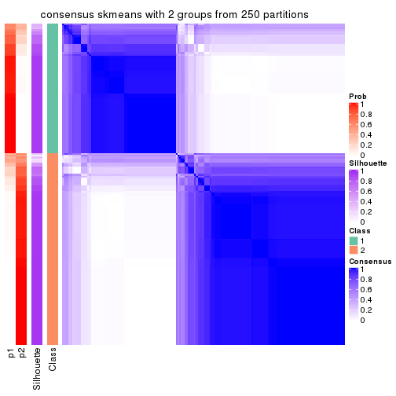</p>

</div>
<div id='tab-SD-skmeans-consensus-heatmap-2'>
<pre><code class="r">consensus_heatmap(res, k = 3)
</code></pre>

<p>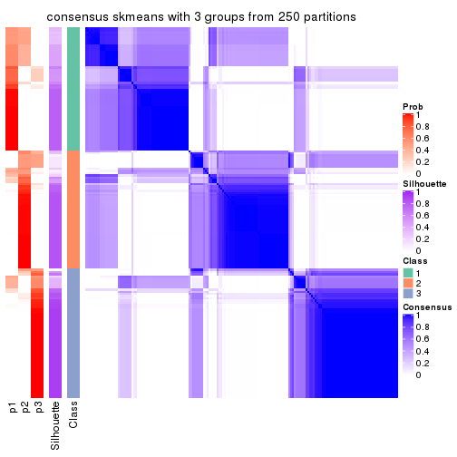</p>

</div>
<div id='tab-SD-skmeans-consensus-heatmap-3'>
<pre><code class="r">consensus_heatmap(res, k = 4)
</code></pre>

<p>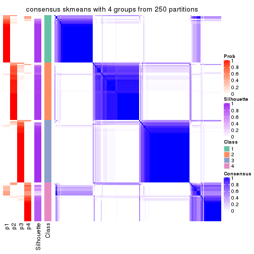</p>

</div>
<div id='tab-SD-skmeans-consensus-heatmap-4'>
<pre><code class="r">consensus_heatmap(res, k = 5)
</code></pre>

<p>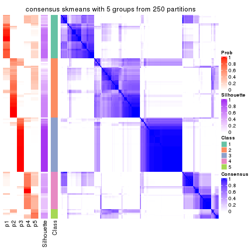</p>

</div>
<div id='tab-SD-skmeans-consensus-heatmap-5'>
<pre><code class="r">consensus_heatmap(res, k = 6)
</code></pre>

<p>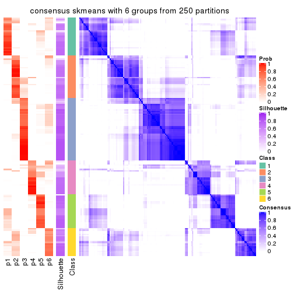</p>

</div>
</div>

Heatmaps for the membership of samples in all partitions to see how consistent they are:


<script>
$( function() {
	$( '#tabs-SD-skmeans-membership-heatmap' ).tabs();
} );
</script>
<div id='tabs-SD-skmeans-membership-heatmap'>
<ul>
<li><a href='#tab-SD-skmeans-membership-heatmap-1'>k = 2</a></li>
<li><a href='#tab-SD-skmeans-membership-heatmap-2'>k = 3</a></li>
<li><a href='#tab-SD-skmeans-membership-heatmap-3'>k = 4</a></li>
<li><a href='#tab-SD-skmeans-membership-heatmap-4'>k = 5</a></li>
<li><a href='#tab-SD-skmeans-membership-heatmap-5'>k = 6</a></li>
</ul>
<div id='tab-SD-skmeans-membership-heatmap-1'>
<pre><code class="r">membership_heatmap(res, k = 2)
</code></pre>

<p>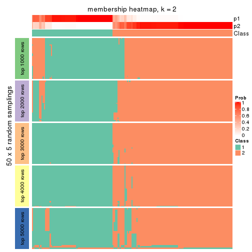</p>

</div>
<div id='tab-SD-skmeans-membership-heatmap-2'>
<pre><code class="r">membership_heatmap(res, k = 3)
</code></pre>

<p>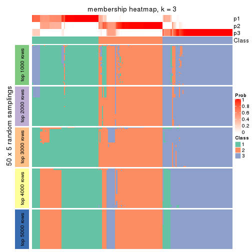</p>

</div>
<div id='tab-SD-skmeans-membership-heatmap-3'>
<pre><code class="r">membership_heatmap(res, k = 4)
</code></pre>

<p>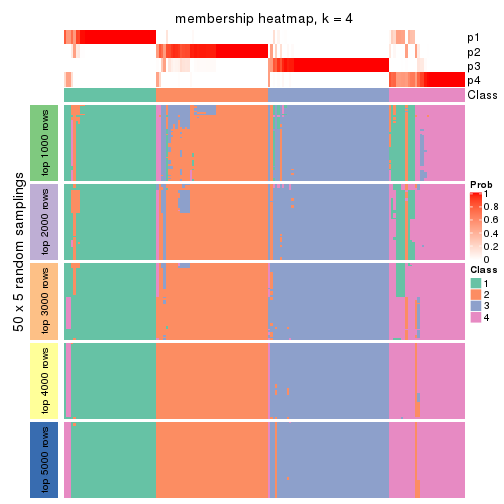</p>

</div>
<div id='tab-SD-skmeans-membership-heatmap-4'>
<pre><code class="r">membership_heatmap(res, k = 5)
</code></pre>

<p>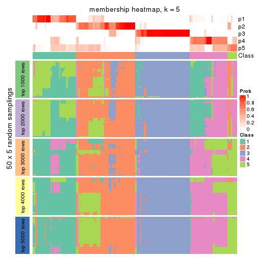</p>

</div>
<div id='tab-SD-skmeans-membership-heatmap-5'>
<pre><code class="r">membership_heatmap(res, k = 6)
</code></pre>

<p>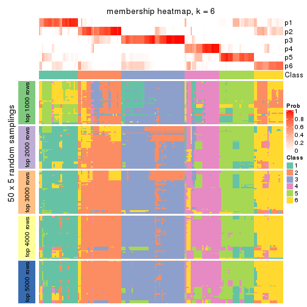</p>

</div>
</div>

As soon as we have had the classes for columns, we can look for signatures
which are significantly different between classes which can be candidate marks
for certain classes. Following are the heatmaps for signatures.


Signature heatmaps where rows are scaled:


<script>
$( function() {
	$( '#tabs-SD-skmeans-get-signatures' ).tabs();
} );
</script>
<div id='tabs-SD-skmeans-get-signatures'>
<ul>
<li><a href='#tab-SD-skmeans-get-signatures-1'>k = 2</a></li>
<li><a href='#tab-SD-skmeans-get-signatures-2'>k = 3</a></li>
<li><a href='#tab-SD-skmeans-get-signatures-3'>k = 4</a></li>
<li><a href='#tab-SD-skmeans-get-signatures-4'>k = 5</a></li>
<li><a href='#tab-SD-skmeans-get-signatures-5'>k = 6</a></li>
</ul>
<div id='tab-SD-skmeans-get-signatures-1'>
<pre><code class="r">get_signatures(res, k = 2)
</code></pre>

<p>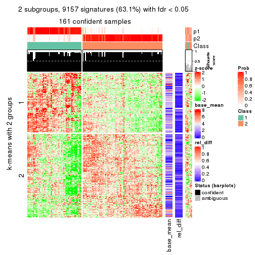</p>

</div>
<div id='tab-SD-skmeans-get-signatures-2'>
<pre><code class="r">get_signatures(res, k = 3)
</code></pre>

<p>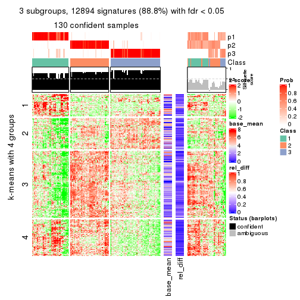</p>

</div>
<div id='tab-SD-skmeans-get-signatures-3'>
<pre><code class="r">get_signatures(res, k = 4)
</code></pre>

<p>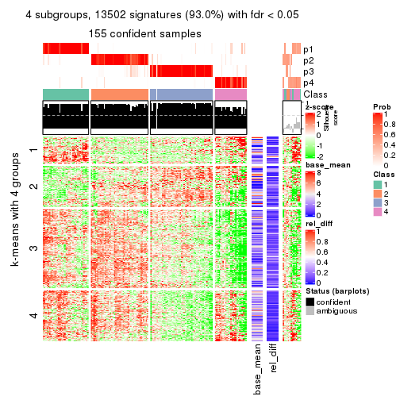</p>

</div>
<div id='tab-SD-skmeans-get-signatures-4'>
<pre><code class="r">get_signatures(res, k = 5)
</code></pre>

<p>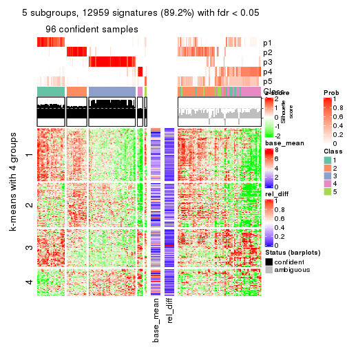</p>

</div>
<div id='tab-SD-skmeans-get-signatures-5'>
<pre><code class="r">get_signatures(res, k = 6)
</code></pre>

<p>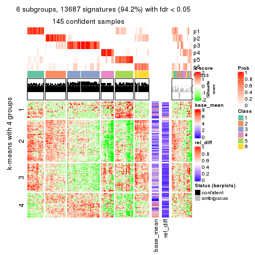</p>

</div>
</div>


Signature heatmaps where rows are not scaled:


<script>
$( function() {
	$( '#tabs-SD-skmeans-get-signatures-no-scale' ).tabs();
} );
</script>
<div id='tabs-SD-skmeans-get-signatures-no-scale'>
<ul>
<li><a href='#tab-SD-skmeans-get-signatures-no-scale-1'>k = 2</a></li>
<li><a href='#tab-SD-skmeans-get-signatures-no-scale-2'>k = 3</a></li>
<li><a href='#tab-SD-skmeans-get-signatures-no-scale-3'>k = 4</a></li>
<li><a href='#tab-SD-skmeans-get-signatures-no-scale-4'>k = 5</a></li>
<li><a href='#tab-SD-skmeans-get-signatures-no-scale-5'>k = 6</a></li>
</ul>
<div id='tab-SD-skmeans-get-signatures-no-scale-1'>
<pre><code class="r">get_signatures(res, k = 2, scale_rows = FALSE)
</code></pre>

<p>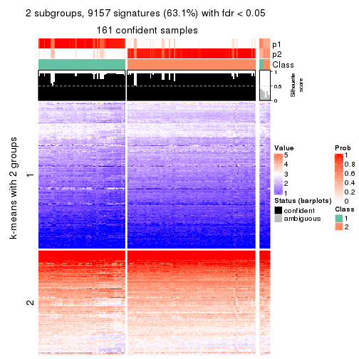</p>

</div>
<div id='tab-SD-skmeans-get-signatures-no-scale-2'>
<pre><code class="r">get_signatures(res, k = 3, scale_rows = FALSE)
</code></pre>

<p>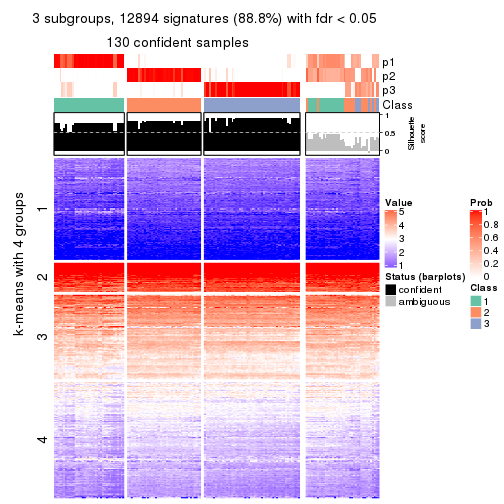</p>

</div>
<div id='tab-SD-skmeans-get-signatures-no-scale-3'>
<pre><code class="r">get_signatures(res, k = 4, scale_rows = FALSE)
</code></pre>

<p>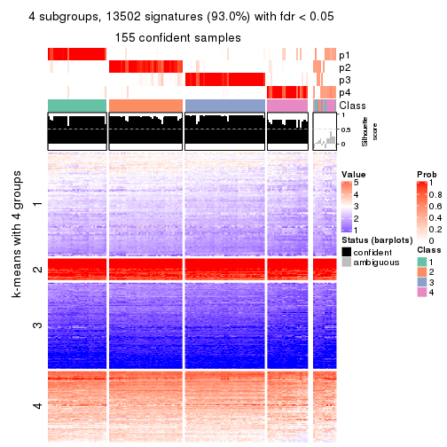</p>

</div>
<div id='tab-SD-skmeans-get-signatures-no-scale-4'>
<pre><code class="r">get_signatures(res, k = 5, scale_rows = FALSE)
</code></pre>

<p>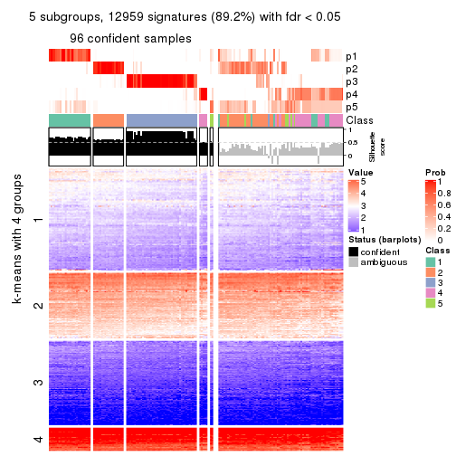</p>

</div>
<div id='tab-SD-skmeans-get-signatures-no-scale-5'>
<pre><code class="r">get_signatures(res, k = 6, scale_rows = FALSE)
</code></pre>

<p>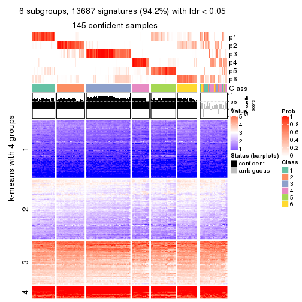</p>

</div>
</div>


Compare the overlap of signatures from different k:

```r
compare_signatures(res)
```

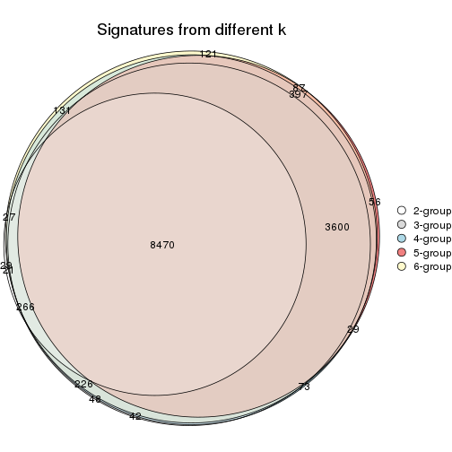

`get_signature()` returns a data frame invisibly. TO get the list of signatures, the function
call should be assigned to a variable explicitly. In following code, if `plot` argument is set
to `FALSE`, no heatmap is plotted while only the differential analysis is performed.

```r
# code only for demonstration
tb = get_signature(res, k = ..., plot = FALSE)
```

An example of the output of `tb` is:

```
#>   which_row         fdr    mean_1    mean_2 scaled_mean_1 scaled_mean_2 km
#> 1        38 0.042760348  8.373488  9.131774    -0.5533452     0.5164555  1
#> 2        40 0.018707592  7.106213  8.469186    -0.6173731     0.5762149  1
#> 3        55 0.019134737 10.221463 11.207825    -0.6159697     0.5749050  1
#> 4        59 0.006059896  5.921854  7.869574    -0.6899429     0.6439467  1
#> 5        60 0.018055526  8.928898 10.211722    -0.6204761     0.5791110  1
#> 6        98 0.009384629 15.714769 14.887706     0.6635654    -0.6193277  2
...
```

The columns in `tb` are:

1. `which_row`: row indices corresponding to the input matrix.
2. `fdr`: FDR for the differential test. 
3. `mean_x`: The mean value in group x.
4. `scaled_mean_x`: The mean value in group x after rows are scaled.
5. `km`: Row groups if k-means clustering is applied to rows.


UMAP plot which shows how samples are separated.


<script>
$( function() {
	$( '#tabs-SD-skmeans-dimension-reduction' ).tabs();
} );
</script>
<div id='tabs-SD-skmeans-dimension-reduction'>
<ul>
<li><a href='#tab-SD-skmeans-dimension-reduction-1'>k = 2</a></li>
<li><a href='#tab-SD-skmeans-dimension-reduction-2'>k = 3</a></li>
<li><a href='#tab-SD-skmeans-dimension-reduction-3'>k = 4</a></li>
<li><a href='#tab-SD-skmeans-dimension-reduction-4'>k = 5</a></li>
<li><a href='#tab-SD-skmeans-dimension-reduction-5'>k = 6</a></li>
</ul>
<div id='tab-SD-skmeans-dimension-reduction-1'>
<pre><code class="r">dimension_reduction(res, k = 2, method = &quot;UMAP&quot;)
</code></pre>

<p>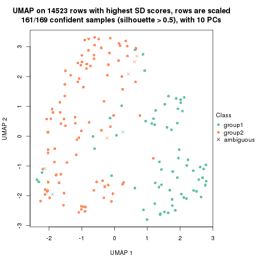</p>

</div>
<div id='tab-SD-skmeans-dimension-reduction-2'>
<pre><code class="r">dimension_reduction(res, k = 3, method = &quot;UMAP&quot;)
</code></pre>

<p>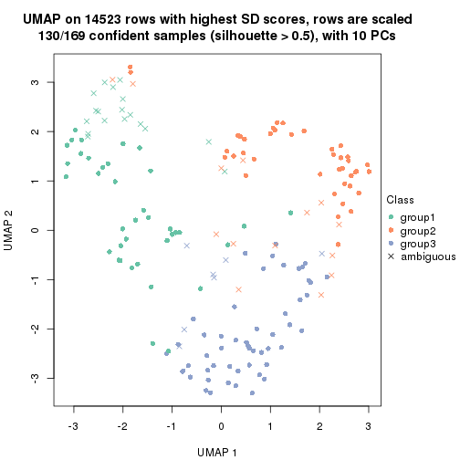</p>

</div>
<div id='tab-SD-skmeans-dimension-reduction-3'>
<pre><code class="r">dimension_reduction(res, k = 4, method = &quot;UMAP&quot;)
</code></pre>

<p>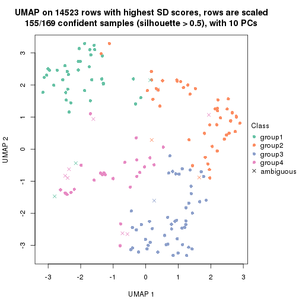</p>

</div>
<div id='tab-SD-skmeans-dimension-reduction-4'>
<pre><code class="r">dimension_reduction(res, k = 5, method = &quot;UMAP&quot;)
</code></pre>

<p>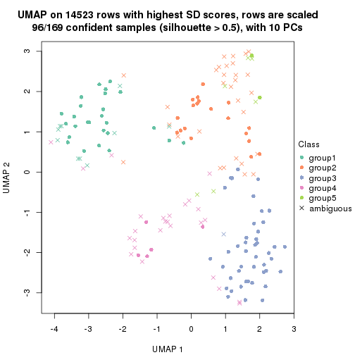</p>

</div>
<div id='tab-SD-skmeans-dimension-reduction-5'>
<pre><code class="r">dimension_reduction(res, k = 6, method = &quot;UMAP&quot;)
</code></pre>

<p>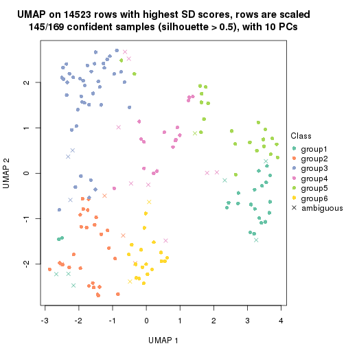</p>

</div>
</div>


Following heatmap shows how subgroups are split when increasing `k`:

```r
collect_classes(res)
```

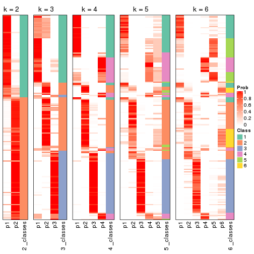


If matrix rows can be associated to genes, consider to use `GO_Enrichment(res,
...)` to perform function enrichment for the signature genes.


 

---------------------------------------------------


### SD:pam


The object with results only for a single top-value method and a single partition method 
can be extracted as:

```r
res = res_list["SD", "pam"]
# you can also extract it by
# res = res_list["SD:pam"]
```

A summary of `res` and all the functions that can be applied to it:

```r
res
```

```
#> A 'ConsensusPartition' object with k = 2, 3, 4, 5, 6.
#>   On a matrix with 14523 rows and 169 columns.
#>   Top rows (1000, 2000, 3000, 4000, 5000) are extracted by 'SD' method.
#>   Subgroups are detected by 'pam' method.
#>   Performed in total 1250 partitions by row resampling.
#>   Best k for subgroups seems to be 3.
#> 
#> Following methods can be applied to this 'ConsensusPartition' object:
#>  [1] "cola_report"             "collect_classes"         "collect_plots"          
#>  [4] "collect_stats"           "colnames"                "compare_signatures"     
#>  [7] "consensus_heatmap"       "dimension_reduction"     "functional_enrichment"  
#> [10] "get_anno_col"            "get_anno"                "get_classes"            
#> [13] "get_consensus"           "get_matrix"              "get_membership"         
#> [16] "get_param"               "get_signatures"          "get_stats"              
#> [19] "is_best_k"               "is_stable_k"             "membership_heatmap"     
#> [22] "ncol"                    "nrow"                    "plot_ecdf"              
#> [25] "rownames"                "select_partition_number" "show"                   
#> [28] "suggest_best_k"          "test_to_known_factors"
```

`collect_plots()` function collects all the plots made from `res` for all `k` (number of partitions)
into one single page to provide an easy and fast comparison between different `k`.

```r
collect_plots(res)
```

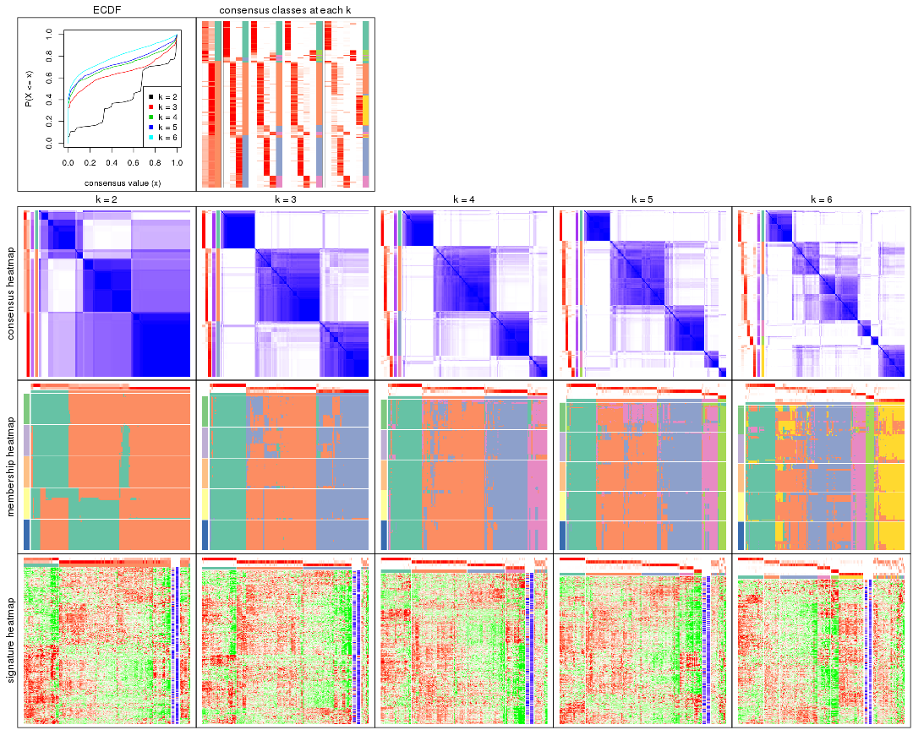

The plots are:

- The first row: a plot of the ECDF (Empirical cumulative distribution
  function) curves of the consensus matrix for each `k` and the heatmap of
  predicted classes for each `k`.
- The second row: heatmaps of the consensus matrix for each `k`.
- The third row: heatmaps of the membership matrix for each `k`.
- The fouth row: heatmaps of the signatures for each `k`.

All the plots in panels can be made by individual functions and they are
plotted later in this section.

`select_partition_number()` produces several plots showing different
statistics for choosing "optimized" `k`. There are following statistics:

- ECDF curves of the consensus matrix for each `k`;
- 1-PAC. [The PAC
  score](https://en.wikipedia.org/wiki/Consensus_clustering#Over-interpretation_potential_of_consensus_clustering)
  measures the proportion of the ambiguous subgrouping.
- Mean silhouette score.
- Concordance. The mean probability of fiting the consensus class ids in all
  partitions.
- Area increased. Denote $A_k$ as the area under the ECDF curve for current
  `k`, the area increased is defined as $A_k - A_{k-1}$.
- Rand index. The percent of pairs of samples that are both in a same cluster
  or both are not in a same cluster in the partition of k and k-1.
- Jaccard index. The ratio of pairs of samples are both in a same cluster in
  the partition of k and k-1 and the pairs of samples are both in a same
  cluster in the partition k or k-1.

The detailed explanations of these statistics can be found in [the cola
vignette](http://bioconductor.org/packages/devel/bioc/vignettes/cola/inst/doc/cola.html#toc_13).

Generally speaking, lower PAC score, higher mean silhouette score or higher
concordance corresponds to better partition. Rand index and Jaccard index
measure how similar the current partition is compared to partition with `k-1`.
If they are too similar, we won't accept `k` is better than `k-1`.

```r
select_partition_number(res)
```

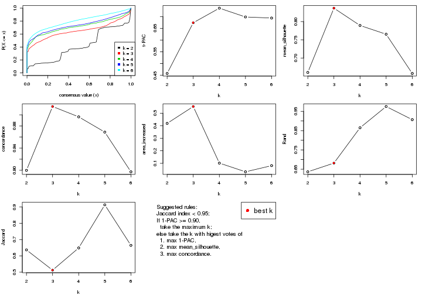

The numeric values for all these statistics can be obtained by `get_stats()`.

```r
get_stats(res)
```

```
#>   k 1-PAC mean_silhouette concordance area_increased  Rand Jaccard
#> 2 2 0.458           0.660       0.800         0.4187 0.637   0.637
#> 3 3 0.674           0.837       0.915         0.5535 0.682   0.512
#> 4 4 0.736           0.789       0.896         0.1017 0.865   0.649
#> 5 5 0.698           0.765       0.869         0.0323 0.975   0.913
#> 6 6 0.694           0.658       0.797         0.0815 0.907   0.665
```

`suggest_best_k()` suggests the best $k$ based on these statistics. The rules are as follows:

- All $k$ with Jaccard index larger than 0.95 are removed because the increase of
  the partition number does not provides enough extra information. If all $k$ are removed,
  the best $k$ is assigned by `NA`.
- For $k$ with 1-PAC larger than 0.9, the maximal $k$ is taken as the "best k". Other $k$ is called "optional k".
- If it does not fit the second rule. The $k$ with the highest vote of highest
  1-PAC, mean silhouette and concordance is taken as the "best k".

```r
suggest_best_k(res)
```

```
#> [1] 3
```


Following shows the table of the partitions (You need to click the **show/hide
code output** link to see it). The membership matrix (columns with name `p*`)
is inferred by
[`clue::cl_consensus()`](https://www.rdocumentation.org/link/cl_consensus?package=clue)
function with the `SE` method. Basically the value in the membership matrix
represents the probability to belong to a certain group. The finall class
label for an item is determined with the group with highest probability it
belongs to.

In `get_classes()` function, the entropy is calculated from the membership
matrix and the silhouette score is calculated from the consensus matrix.


<script>
$( function() {
	$( '#tabs-SD-pam-get-classes' ).tabs();
} );
</script>
<div id='tabs-SD-pam-get-classes'>
<ul>
<li><a href='#tab-SD-pam-get-classes-1'>k = 2</a></li>
<li><a href='#tab-SD-pam-get-classes-2'>k = 3</a></li>
<li><a href='#tab-SD-pam-get-classes-3'>k = 4</a></li>
<li><a href='#tab-SD-pam-get-classes-4'>k = 5</a></li>
<li><a href='#tab-SD-pam-get-classes-5'>k = 6</a></li>
</ul>

<div id='tab-SD-pam-get-classes-1'>
<p><a id='tab-SD-pam-get-classes-1-a' style='color:#0366d6' href='#'>show/hide code output</a></p>
<pre><code class="r">cbind(get_classes(res, k = 2), get_membership(res, k = 2))
</code></pre>

<pre><code>#&gt;            class entropy silhouette    p1    p2
#&gt; SRR2052702     2  0.0000      0.736 0.000 1.000
#&gt; SRR2052701     2  0.0000      0.736 0.000 1.000
#&gt; SRR2052700     2  0.1184      0.731 0.016 0.984
#&gt; SRR2052699     2  0.0000      0.736 0.000 1.000
#&gt; SRR2052698     2  0.9000      0.692 0.316 0.684
#&gt; SRR2052708     1  0.9087      0.837 0.676 0.324
#&gt; SRR2052749     1  0.9170      0.840 0.668 0.332
#&gt; SRR2052786     2  0.0000      0.736 0.000 1.000
#&gt; SRR2052825     2  0.9686      0.630 0.396 0.604
#&gt; SRR2052824     2  0.9209      0.682 0.336 0.664
#&gt; SRR2052823     2  0.0000      0.736 0.000 1.000
#&gt; SRR2052822     2  0.0000      0.736 0.000 1.000
#&gt; SRR2052821     2  0.0000      0.736 0.000 1.000
#&gt; SRR2052820     2  0.0000      0.736 0.000 1.000
#&gt; SRR2052819     2  0.9170      0.685 0.332 0.668
#&gt; SRR2052818     2  0.1184      0.731 0.016 0.984
#&gt; SRR2052817     2  0.9000      0.692 0.316 0.684
#&gt; SRR2052816     2  0.1184      0.731 0.016 0.984
#&gt; SRR2052815     2  0.9686      0.630 0.396 0.604
#&gt; SRR2052814     2  0.9170      0.685 0.332 0.668
#&gt; SRR2052813     2  0.0000      0.736 0.000 1.000
#&gt; SRR2052812     2  0.0000      0.736 0.000 1.000
#&gt; SRR2052811     2  0.0000      0.736 0.000 1.000
#&gt; SRR2052810     2  0.9170      0.685 0.332 0.668
#&gt; SRR2052809     2  0.0672      0.736 0.008 0.992
#&gt; SRR2052808     2  0.0376      0.735 0.004 0.996
#&gt; SRR2052807     1  0.9635     -0.263 0.612 0.388
#&gt; SRR2052806     1  0.9000      0.833 0.684 0.316
#&gt; SRR2052805     1  0.9000      0.833 0.684 0.316
#&gt; SRR2052804     2  0.9686      0.630 0.396 0.604
#&gt; SRR2052803     1  0.9044      0.835 0.680 0.320
#&gt; SRR2052802     2  0.9996      0.504 0.488 0.512
#&gt; SRR2052801     1  0.0000      0.576 1.000 0.000
#&gt; SRR2052800     2  0.9963      0.542 0.464 0.536
#&gt; SRR2052799     1  0.0000      0.576 1.000 0.000
#&gt; SRR2052798     1  0.9170      0.840 0.668 0.332
#&gt; SRR2052797     2  0.0000      0.736 0.000 1.000
#&gt; SRR2052796     1  0.0000      0.576 1.000 0.000
#&gt; SRR2052795     1  0.9170      0.840 0.668 0.332
#&gt; SRR2052794     1  0.0000      0.576 1.000 0.000
#&gt; SRR2052793     1  0.0000      0.576 1.000 0.000
#&gt; SRR2052792     2  0.9686      0.630 0.396 0.604
#&gt; SRR2052791     1  0.9460     -0.203 0.636 0.364
#&gt; SRR2052790     2  0.0000      0.736 0.000 1.000
#&gt; SRR2052789     2  0.9000      0.692 0.316 0.684
#&gt; SRR2052788     2  0.9000      0.692 0.316 0.684
#&gt; SRR2052787     2  0.0000      0.736 0.000 1.000
#&gt; SRR2052785     2  0.9000      0.692 0.316 0.684
#&gt; SRR2052784     2  0.0000      0.736 0.000 1.000
#&gt; SRR2052783     2  0.0000      0.736 0.000 1.000
#&gt; SRR2052782     2  0.0000      0.736 0.000 1.000
#&gt; SRR2052781     2  0.0000      0.736 0.000 1.000
#&gt; SRR2052780     2  0.9000      0.692 0.316 0.684
#&gt; SRR2052777     2  0.0000      0.736 0.000 1.000
#&gt; SRR2052779     2  0.0000      0.736 0.000 1.000
#&gt; SRR2052778     2  0.9170      0.685 0.332 0.668
#&gt; SRR2052776     2  0.0000      0.736 0.000 1.000
#&gt; SRR2052775     2  0.9000      0.692 0.316 0.684
#&gt; SRR2052773     2  0.0000      0.736 0.000 1.000
#&gt; SRR2052772     2  0.9000      0.692 0.316 0.684
#&gt; SRR2052774     2  0.0000      0.736 0.000 1.000
#&gt; SRR2052771     1  0.0376      0.573 0.996 0.004
#&gt; SRR2052769     2  0.9170      0.685 0.332 0.668
#&gt; SRR2052770     2  0.9170      0.685 0.332 0.668
#&gt; SRR2052768     2  0.0000      0.736 0.000 1.000
#&gt; SRR2052767     2  0.0000      0.736 0.000 1.000
#&gt; SRR2052766     2  0.9686      0.630 0.396 0.604
#&gt; SRR2052765     2  0.1184      0.731 0.016 0.984
#&gt; SRR2052763     2  0.9000      0.692 0.316 0.684
#&gt; SRR2052764     2  0.0000      0.736 0.000 1.000
#&gt; SRR2052761     2  0.0000      0.736 0.000 1.000
#&gt; SRR2052760     2  0.0000      0.736 0.000 1.000
#&gt; SRR2052759     2  0.9170      0.685 0.332 0.668
#&gt; SRR2052762     2  0.0000      0.736 0.000 1.000
#&gt; SRR2052758     2  0.9000      0.692 0.316 0.684
#&gt; SRR2052756     1  0.9170      0.840 0.668 0.332
#&gt; SRR2052757     2  0.9087      0.689 0.324 0.676
#&gt; SRR2052755     1  0.9686      0.775 0.604 0.396
#&gt; SRR2052754     1  0.0000      0.576 1.000 0.000
#&gt; SRR2052753     1  0.9170      0.840 0.668 0.332
#&gt; SRR2052752     1  0.9170      0.840 0.668 0.332
#&gt; SRR2052750     1  0.9170      0.840 0.668 0.332
#&gt; SRR2052751     2  0.0000      0.736 0.000 1.000
#&gt; SRR2052748     2  0.9170      0.685 0.332 0.668
#&gt; SRR2052747     1  0.9170      0.840 0.668 0.332
#&gt; SRR2052746     2  0.9170      0.685 0.332 0.668
#&gt; SRR2052745     2  0.9170      0.685 0.332 0.668
#&gt; SRR2052744     1  0.9686      0.775 0.604 0.396
#&gt; SRR2052741     2  0.0000      0.736 0.000 1.000
#&gt; SRR2052743     2  0.0000      0.736 0.000 1.000
#&gt; SRR2052740     2  0.0000      0.736 0.000 1.000
#&gt; SRR2052742     2  0.0000      0.736 0.000 1.000
#&gt; SRR2052739     2  0.0000      0.736 0.000 1.000
#&gt; SRR2052738     2  0.9170      0.685 0.332 0.668
#&gt; SRR2052736     2  0.9710     -0.324 0.400 0.600
#&gt; SRR2052735     1  0.9686      0.775 0.604 0.396
#&gt; SRR2052734     2  0.9850     -0.409 0.428 0.572
#&gt; SRR2052737     2  0.0000      0.736 0.000 1.000
#&gt; SRR2052733     2  0.9170      0.685 0.332 0.668
#&gt; SRR2052732     2  0.0376      0.735 0.004 0.996
#&gt; SRR2052731     2  0.9000      0.692 0.316 0.684
#&gt; SRR2052729     1  0.9170      0.840 0.668 0.332
#&gt; SRR2052728     1  0.9170      0.840 0.668 0.332
#&gt; SRR2052730     2  0.9686      0.630 0.396 0.604
#&gt; SRR2052727     1  0.9170      0.840 0.668 0.332
#&gt; SRR2052725     2  0.9393     -0.180 0.356 0.644
#&gt; SRR2052726     1  0.9686      0.775 0.604 0.396
#&gt; SRR2052724     1  0.9170      0.840 0.668 0.332
#&gt; SRR2052723     2  0.9686      0.630 0.396 0.604
#&gt; SRR2052722     2  0.9000      0.692 0.316 0.684
#&gt; SRR2052721     1  0.9170      0.840 0.668 0.332
#&gt; SRR2052720     2  0.0000      0.736 0.000 1.000
#&gt; SRR2052719     2  0.0000      0.736 0.000 1.000
#&gt; SRR2052718     1  0.9686      0.775 0.604 0.396
#&gt; SRR2052717     2  0.0000      0.736 0.000 1.000
#&gt; SRR2052714     1  0.5408      0.673 0.876 0.124
#&gt; SRR2052716     2  0.8763      0.696 0.296 0.704
#&gt; SRR2052715     2  0.9129      0.687 0.328 0.672
#&gt; SRR2052713     1  0.9170      0.840 0.668 0.332
#&gt; SRR2052712     2  0.9686      0.630 0.396 0.604
#&gt; SRR2052711     2  0.8267      0.249 0.260 0.740
#&gt; SRR2052710     2  0.0000      0.736 0.000 1.000
#&gt; SRR2052707     2  0.9000      0.692 0.316 0.684
#&gt; SRR2052709     2  0.9000      0.692 0.316 0.684
#&gt; SRR2052704     2  0.9170      0.685 0.332 0.668
#&gt; SRR2052705     2  0.0000      0.736 0.000 1.000
#&gt; SRR2052697     2  0.5842      0.521 0.140 0.860
#&gt; SRR2052703     2  0.9000      0.692 0.316 0.684
#&gt; SRR2052696     1  0.9170      0.840 0.668 0.332
#&gt; SRR2052706     2  0.9044      0.691 0.320 0.680
#&gt; SRR2052695     2  0.0000      0.736 0.000 1.000
#&gt; SRR2052694     2  0.0000      0.736 0.000 1.000
#&gt; SRR2052692     2  0.9000      0.692 0.316 0.684
#&gt; SRR2052693     2  0.1633      0.733 0.024 0.976
#&gt; SRR2052691     2  0.9754     -0.349 0.408 0.592
#&gt; SRR2052690     2  0.4815      0.593 0.104 0.896
#&gt; SRR2052689     2  0.9170      0.685 0.332 0.668
#&gt; SRR2052687     2  0.9170      0.685 0.332 0.668
#&gt; SRR2052686     2  0.9754     -0.349 0.408 0.592
#&gt; SRR2052688     2  0.0000      0.736 0.000 1.000
#&gt; SRR2052684     2  0.9710      0.626 0.400 0.600
#&gt; SRR2052685     2  0.0000      0.736 0.000 1.000
#&gt; SRR2052683     1  0.9000      0.833 0.684 0.316
#&gt; SRR2052681     2  0.1184      0.731 0.016 0.984
#&gt; SRR2052680     2  0.9170      0.685 0.332 0.668
#&gt; SRR2052682     2  0.9732     -0.337 0.404 0.596
#&gt; SRR2052679     1  0.9170      0.840 0.668 0.332
#&gt; SRR2052678     2  0.9000      0.692 0.316 0.684
#&gt; SRR2052677     2  0.0000      0.736 0.000 1.000
#&gt; SRR2052675     2  0.0376      0.732 0.004 0.996
#&gt; SRR2052676     1  0.9170      0.840 0.668 0.332
#&gt; SRR2052674     2  0.1184      0.731 0.016 0.984
#&gt; SRR2052672     2  0.9000      0.692 0.316 0.684
#&gt; SRR2052673     2  0.9710     -0.324 0.400 0.600
#&gt; SRR2052671     2  0.0000      0.736 0.000 1.000
#&gt; SRR2052670     2  0.9000      0.692 0.316 0.684
#&gt; SRR2052669     2  0.0000      0.736 0.000 1.000
#&gt; SRR2052668     2  0.0000      0.736 0.000 1.000
#&gt; SRR2052667     2  0.0000      0.736 0.000 1.000
#&gt; SRR2052666     2  0.9000      0.692 0.316 0.684
#&gt; SRR2052665     2  0.0000      0.736 0.000 1.000
#&gt; SRR2052664     1  0.9000      0.833 0.684 0.316
#&gt; SRR2052663     2  0.8661      0.094 0.288 0.712
#&gt; SRR2052662     2  0.0000      0.736 0.000 1.000
#&gt; SRR2052661     1  0.9686      0.775 0.604 0.396
#&gt; SRR2052660     2  0.8813      0.696 0.300 0.700
#&gt; SRR2052659     2  0.9000      0.692 0.316 0.684
#&gt; SRR2052658     2  0.0000      0.736 0.000 1.000
#&gt; SRR2052657     1  0.9170      0.840 0.668 0.332
</code></pre>

<script>
$('#tab-SD-pam-get-classes-1-a').parent().next().next().hide();
$('#tab-SD-pam-get-classes-1-a').click(function(){
  $('#tab-SD-pam-get-classes-1-a').parent().next().next().toggle();
  return(false);
});
</script>
</div>

<div id='tab-SD-pam-get-classes-2'>
<p><a id='tab-SD-pam-get-classes-2-a' style='color:#0366d6' href='#'>show/hide code output</a></p>
<pre><code class="r">cbind(get_classes(res, k = 3), get_membership(res, k = 3))
</code></pre>

<pre><code>#&gt;            class entropy silhouette    p1    p2    p3
#&gt; SRR2052702     2  0.0000      0.887 0.000 1.000 0.000
#&gt; SRR2052701     2  0.0000      0.887 0.000 1.000 0.000
#&gt; SRR2052700     2  0.2537      0.867 0.000 0.920 0.080
#&gt; SRR2052699     2  0.2448      0.868 0.000 0.924 0.076
#&gt; SRR2052698     3  0.2356      0.875 0.000 0.072 0.928
#&gt; SRR2052708     1  0.0000      0.961 1.000 0.000 0.000
#&gt; SRR2052749     1  0.0000      0.961 1.000 0.000 0.000
#&gt; SRR2052786     2  0.4842      0.737 0.000 0.776 0.224
#&gt; SRR2052825     3  0.4452      0.777 0.000 0.192 0.808
#&gt; SRR2052824     3  0.4452      0.777 0.000 0.192 0.808
#&gt; SRR2052823     2  0.0000      0.887 0.000 1.000 0.000
#&gt; SRR2052822     2  0.5988      0.583 0.000 0.632 0.368
#&gt; SRR2052821     2  0.5327      0.693 0.000 0.728 0.272
#&gt; SRR2052820     2  0.4750      0.757 0.000 0.784 0.216
#&gt; SRR2052819     3  0.3879      0.818 0.000 0.152 0.848
#&gt; SRR2052818     2  0.3816      0.817 0.000 0.852 0.148
#&gt; SRR2052817     3  0.2066      0.881 0.000 0.060 0.940
#&gt; SRR2052816     2  0.0747      0.884 0.000 0.984 0.016
#&gt; SRR2052815     3  0.4452      0.777 0.000 0.192 0.808
#&gt; SRR2052814     2  0.6168      0.145 0.000 0.588 0.412
#&gt; SRR2052813     2  0.0000      0.887 0.000 1.000 0.000
#&gt; SRR2052812     2  0.0000      0.887 0.000 1.000 0.000
#&gt; SRR2052811     2  0.0000      0.887 0.000 1.000 0.000
#&gt; SRR2052810     3  0.5621      0.645 0.000 0.308 0.692
#&gt; SRR2052809     2  0.6291      0.225 0.000 0.532 0.468
#&gt; SRR2052808     2  0.5216      0.711 0.000 0.740 0.260
#&gt; SRR2052807     3  0.6579      0.510 0.328 0.020 0.652
#&gt; SRR2052806     1  0.0000      0.961 1.000 0.000 0.000
#&gt; SRR2052805     1  0.0000      0.961 1.000 0.000 0.000
#&gt; SRR2052804     3  0.1964      0.878 0.000 0.056 0.944
#&gt; SRR2052803     1  0.0000      0.961 1.000 0.000 0.000
#&gt; SRR2052802     3  0.1643      0.874 0.044 0.000 0.956
#&gt; SRR2052801     1  0.0592      0.952 0.988 0.000 0.012
#&gt; SRR2052800     3  0.3213      0.862 0.060 0.028 0.912
#&gt; SRR2052799     1  0.3941      0.784 0.844 0.000 0.156
#&gt; SRR2052798     1  0.0000      0.961 1.000 0.000 0.000
#&gt; SRR2052797     2  0.4702      0.746 0.000 0.788 0.212
#&gt; SRR2052796     1  0.0000      0.961 1.000 0.000 0.000
#&gt; SRR2052795     1  0.0000      0.961 1.000 0.000 0.000
#&gt; SRR2052794     3  0.6062      0.397 0.384 0.000 0.616
#&gt; SRR2052793     1  0.0000      0.961 1.000 0.000 0.000
#&gt; SRR2052792     3  0.0000      0.893 0.000 0.000 1.000
#&gt; SRR2052791     3  0.5098      0.657 0.248 0.000 0.752
#&gt; SRR2052790     2  0.4887      0.744 0.000 0.772 0.228
#&gt; SRR2052789     3  0.0592      0.895 0.000 0.012 0.988
#&gt; SRR2052788     3  0.0592      0.895 0.000 0.012 0.988
#&gt; SRR2052787     2  0.4235      0.784 0.000 0.824 0.176
#&gt; SRR2052785     3  0.3686      0.837 0.000 0.140 0.860
#&gt; SRR2052784     2  0.1860      0.875 0.000 0.948 0.052
#&gt; SRR2052783     2  0.2165      0.875 0.000 0.936 0.064
#&gt; SRR2052782     2  0.0000      0.887 0.000 1.000 0.000
#&gt; SRR2052781     2  0.3686      0.828 0.000 0.860 0.140
#&gt; SRR2052780     3  0.1753      0.887 0.000 0.048 0.952
#&gt; SRR2052777     2  0.0000      0.887 0.000 1.000 0.000
#&gt; SRR2052779     2  0.0747      0.886 0.000 0.984 0.016
#&gt; SRR2052778     3  0.0592      0.895 0.000 0.012 0.988
#&gt; SRR2052776     2  0.3619      0.831 0.000 0.864 0.136
#&gt; SRR2052775     3  0.0592      0.895 0.000 0.012 0.988
#&gt; SRR2052773     2  0.2448      0.871 0.000 0.924 0.076
#&gt; SRR2052772     3  0.0592      0.895 0.000 0.012 0.988
#&gt; SRR2052774     2  0.6168      0.501 0.000 0.588 0.412
#&gt; SRR2052771     1  0.6260      0.109 0.552 0.000 0.448
#&gt; SRR2052769     3  0.3412      0.841 0.000 0.124 0.876
#&gt; SRR2052770     3  0.0000      0.893 0.000 0.000 1.000
#&gt; SRR2052768     2  0.0000      0.887 0.000 1.000 0.000
#&gt; SRR2052767     2  0.0000      0.887 0.000 1.000 0.000
#&gt; SRR2052766     3  0.0000      0.893 0.000 0.000 1.000
#&gt; SRR2052765     2  0.3941      0.810 0.000 0.844 0.156
#&gt; SRR2052763     3  0.4291      0.764 0.000 0.180 0.820
#&gt; SRR2052764     2  0.0592      0.883 0.000 0.988 0.012
#&gt; SRR2052761     2  0.4702      0.757 0.000 0.788 0.212
#&gt; SRR2052760     2  0.0000      0.887 0.000 1.000 0.000
#&gt; SRR2052759     3  0.0592      0.895 0.000 0.012 0.988
#&gt; SRR2052762     2  0.2261      0.867 0.000 0.932 0.068
#&gt; SRR2052758     3  0.4291      0.772 0.000 0.180 0.820
#&gt; SRR2052756     1  0.0000      0.961 1.000 0.000 0.000
#&gt; SRR2052757     3  0.0892      0.895 0.000 0.020 0.980
#&gt; SRR2052755     1  0.0000      0.961 1.000 0.000 0.000
#&gt; SRR2052754     1  0.0000      0.961 1.000 0.000 0.000
#&gt; SRR2052753     1  0.0000      0.961 1.000 0.000 0.000
#&gt; SRR2052752     1  0.0000      0.961 1.000 0.000 0.000
#&gt; SRR2052750     1  0.0000      0.961 1.000 0.000 0.000
#&gt; SRR2052751     2  0.4555      0.793 0.000 0.800 0.200
#&gt; SRR2052748     3  0.0000      0.893 0.000 0.000 1.000
#&gt; SRR2052747     1  0.0000      0.961 1.000 0.000 0.000
#&gt; SRR2052746     3  0.0592      0.895 0.000 0.012 0.988
#&gt; SRR2052745     3  0.3116      0.831 0.000 0.108 0.892
#&gt; SRR2052744     1  0.0000      0.961 1.000 0.000 0.000
#&gt; SRR2052741     2  0.0424      0.886 0.000 0.992 0.008
#&gt; SRR2052743     2  0.1753      0.875 0.000 0.952 0.048
#&gt; SRR2052740     2  0.0000      0.887 0.000 1.000 0.000
#&gt; SRR2052742     2  0.3752      0.824 0.000 0.856 0.144
#&gt; SRR2052739     2  0.0000      0.887 0.000 1.000 0.000
#&gt; SRR2052738     3  0.0592      0.895 0.000 0.012 0.988
#&gt; SRR2052736     2  0.1289      0.877 0.032 0.968 0.000
#&gt; SRR2052735     1  0.0000      0.961 1.000 0.000 0.000
#&gt; SRR2052734     1  0.5431      0.602 0.716 0.284 0.000
#&gt; SRR2052737     2  0.0000      0.887 0.000 1.000 0.000
#&gt; SRR2052733     3  0.0000      0.893 0.000 0.000 1.000
#&gt; SRR2052732     2  0.0592      0.883 0.000 0.988 0.012
#&gt; SRR2052731     3  0.0592      0.895 0.000 0.012 0.988
#&gt; SRR2052729     1  0.0000      0.961 1.000 0.000 0.000
#&gt; SRR2052728     1  0.0000      0.961 1.000 0.000 0.000
#&gt; SRR2052730     3  0.2448      0.869 0.000 0.076 0.924
#&gt; SRR2052727     1  0.0000      0.961 1.000 0.000 0.000
#&gt; SRR2052725     2  0.1753      0.868 0.048 0.952 0.000
#&gt; SRR2052726     1  0.0000      0.961 1.000 0.000 0.000
#&gt; SRR2052724     1  0.0000      0.961 1.000 0.000 0.000
#&gt; SRR2052723     3  0.0000      0.893 0.000 0.000 1.000
#&gt; SRR2052722     3  0.0592      0.895 0.000 0.012 0.988
#&gt; SRR2052721     1  0.0000      0.961 1.000 0.000 0.000
#&gt; SRR2052720     2  0.1289      0.881 0.000 0.968 0.032
#&gt; SRR2052719     2  0.0000      0.887 0.000 1.000 0.000
#&gt; SRR2052718     1  0.0000      0.961 1.000 0.000 0.000
#&gt; SRR2052717     2  0.2261      0.867 0.000 0.932 0.068
#&gt; SRR2052714     1  0.0000      0.961 1.000 0.000 0.000
#&gt; SRR2052716     3  0.6260      0.188 0.000 0.448 0.552
#&gt; SRR2052715     3  0.0592      0.895 0.000 0.012 0.988
#&gt; SRR2052713     1  0.0000      0.961 1.000 0.000 0.000
#&gt; SRR2052712     3  0.4452      0.777 0.000 0.192 0.808
#&gt; SRR2052711     2  0.3921      0.846 0.080 0.884 0.036
#&gt; SRR2052710     2  0.4974      0.732 0.000 0.764 0.236
#&gt; SRR2052707     3  0.0592      0.895 0.000 0.012 0.988
#&gt; SRR2052709     3  0.0592      0.895 0.000 0.012 0.988
#&gt; SRR2052704     3  0.0000      0.893 0.000 0.000 1.000
#&gt; SRR2052705     2  0.0000      0.887 0.000 1.000 0.000
#&gt; SRR2052697     2  0.0000      0.887 0.000 1.000 0.000
#&gt; SRR2052703     3  0.1289      0.889 0.000 0.032 0.968
#&gt; SRR2052696     1  0.0000      0.961 1.000 0.000 0.000
#&gt; SRR2052706     3  0.6215      0.418 0.000 0.428 0.572
#&gt; SRR2052695     2  0.0000      0.887 0.000 1.000 0.000
#&gt; SRR2052694     2  0.0592      0.886 0.000 0.988 0.012
#&gt; SRR2052692     3  0.0592      0.895 0.000 0.012 0.988
#&gt; SRR2052693     2  0.6308      0.314 0.000 0.508 0.492
#&gt; SRR2052691     2  0.6144      0.763 0.132 0.780 0.088
#&gt; SRR2052690     2  0.4370      0.837 0.076 0.868 0.056
#&gt; SRR2052689     3  0.3267      0.845 0.000 0.116 0.884
#&gt; SRR2052687     3  0.3551      0.834 0.000 0.132 0.868
#&gt; SRR2052686     1  0.6079      0.381 0.612 0.388 0.000
#&gt; SRR2052688     2  0.0000      0.887 0.000 1.000 0.000
#&gt; SRR2052684     3  0.0000      0.893 0.000 0.000 1.000
#&gt; SRR2052685     2  0.0000      0.887 0.000 1.000 0.000
#&gt; SRR2052683     1  0.0000      0.961 1.000 0.000 0.000
#&gt; SRR2052681     2  0.4974      0.732 0.000 0.764 0.236
#&gt; SRR2052680     3  0.4452      0.777 0.000 0.192 0.808
#&gt; SRR2052682     2  0.2878      0.840 0.096 0.904 0.000
#&gt; SRR2052679     1  0.0000      0.961 1.000 0.000 0.000
#&gt; SRR2052678     3  0.0592      0.895 0.000 0.012 0.988
#&gt; SRR2052677     2  0.5363      0.690 0.000 0.724 0.276
#&gt; SRR2052675     2  0.0000      0.887 0.000 1.000 0.000
#&gt; SRR2052676     1  0.0000      0.961 1.000 0.000 0.000
#&gt; SRR2052674     2  0.4750      0.756 0.000 0.784 0.216
#&gt; SRR2052672     3  0.0592      0.895 0.000 0.012 0.988
#&gt; SRR2052673     2  0.0592      0.883 0.012 0.988 0.000
#&gt; SRR2052671     2  0.0000      0.887 0.000 1.000 0.000
#&gt; SRR2052670     3  0.0592      0.895 0.000 0.012 0.988
#&gt; SRR2052669     2  0.1163      0.885 0.000 0.972 0.028
#&gt; SRR2052668     2  0.2356      0.865 0.000 0.928 0.072
#&gt; SRR2052667     2  0.4842      0.737 0.000 0.776 0.224
#&gt; SRR2052666     3  0.4235      0.770 0.000 0.176 0.824
#&gt; SRR2052665     2  0.2796      0.854 0.000 0.908 0.092
#&gt; SRR2052664     1  0.0592      0.952 0.988 0.000 0.012
#&gt; SRR2052663     2  0.0592      0.883 0.000 0.988 0.012
#&gt; SRR2052662     2  0.0000      0.887 0.000 1.000 0.000
#&gt; SRR2052661     1  0.1411      0.927 0.964 0.036 0.000
#&gt; SRR2052660     3  0.1643      0.882 0.000 0.044 0.956
#&gt; SRR2052659     3  0.4702      0.721 0.000 0.212 0.788
#&gt; SRR2052658     2  0.2448      0.870 0.000 0.924 0.076
#&gt; SRR2052657     1  0.0000      0.961 1.000 0.000 0.000
</code></pre>

<script>
$('#tab-SD-pam-get-classes-2-a').parent().next().next().hide();
$('#tab-SD-pam-get-classes-2-a').click(function(){
  $('#tab-SD-pam-get-classes-2-a').parent().next().next().toggle();
  return(false);
});
</script>
</div>

<div id='tab-SD-pam-get-classes-3'>
<p><a id='tab-SD-pam-get-classes-3-a' style='color:#0366d6' href='#'>show/hide code output</a></p>
<pre><code class="r">cbind(get_classes(res, k = 4), get_membership(res, k = 4))
</code></pre>

<pre><code>#&gt;            class entropy silhouette    p1    p2    p3    p4
#&gt; SRR2052702     2  0.0524     0.8676 0.000 0.988 0.008 0.004
#&gt; SRR2052701     2  0.0469     0.8663 0.000 0.988 0.000 0.012
#&gt; SRR2052700     4  0.2216     0.8442 0.000 0.092 0.000 0.908
#&gt; SRR2052699     2  0.1994     0.8623 0.008 0.936 0.052 0.004
#&gt; SRR2052698     3  0.2255     0.8356 0.000 0.068 0.920 0.012
#&gt; SRR2052708     1  0.0000     0.9301 1.000 0.000 0.000 0.000
#&gt; SRR2052749     1  0.0000     0.9301 1.000 0.000 0.000 0.000
#&gt; SRR2052786     2  0.2706     0.8507 0.000 0.900 0.080 0.020
#&gt; SRR2052825     4  0.1902     0.8524 0.000 0.064 0.004 0.932
#&gt; SRR2052824     4  0.1902     0.8524 0.000 0.064 0.004 0.932
#&gt; SRR2052823     2  0.0188     0.8660 0.000 0.996 0.000 0.004
#&gt; SRR2052822     2  0.5607     0.1298 0.000 0.492 0.488 0.020
#&gt; SRR2052821     2  0.3900     0.7993 0.000 0.816 0.164 0.020
#&gt; SRR2052820     2  0.3791     0.7626 0.000 0.796 0.200 0.004
#&gt; SRR2052819     4  0.2101     0.8519 0.000 0.060 0.012 0.928
#&gt; SRR2052818     4  0.2773     0.8251 0.000 0.116 0.004 0.880
#&gt; SRR2052817     3  0.2101     0.8426 0.000 0.060 0.928 0.012
#&gt; SRR2052816     2  0.0657     0.8679 0.000 0.984 0.012 0.004
#&gt; SRR2052815     4  0.1902     0.8524 0.000 0.064 0.004 0.932
#&gt; SRR2052814     2  0.4103     0.6265 0.000 0.744 0.256 0.000
#&gt; SRR2052813     2  0.0937     0.8665 0.000 0.976 0.012 0.012
#&gt; SRR2052812     2  0.0657     0.8666 0.000 0.984 0.004 0.012
#&gt; SRR2052811     2  0.0000     0.8663 0.000 1.000 0.000 0.000
#&gt; SRR2052810     4  0.2149     0.8426 0.000 0.088 0.000 0.912
#&gt; SRR2052809     3  0.4936     0.4888 0.000 0.316 0.672 0.012
#&gt; SRR2052808     2  0.3757     0.8130 0.000 0.828 0.152 0.020
#&gt; SRR2052807     4  0.0921     0.8154 0.028 0.000 0.000 0.972
#&gt; SRR2052806     1  0.1716     0.8913 0.936 0.000 0.000 0.064
#&gt; SRR2052805     1  0.1557     0.8969 0.944 0.000 0.000 0.056
#&gt; SRR2052804     4  0.5062     0.5870 0.000 0.020 0.300 0.680
#&gt; SRR2052803     1  0.0336     0.9259 0.992 0.000 0.000 0.008
#&gt; SRR2052802     4  0.0592     0.8261 0.000 0.000 0.016 0.984
#&gt; SRR2052801     4  0.3764     0.6465 0.216 0.000 0.000 0.784
#&gt; SRR2052800     4  0.0592     0.8261 0.000 0.000 0.016 0.984
#&gt; SRR2052799     4  0.3311     0.7034 0.172 0.000 0.000 0.828
#&gt; SRR2052798     1  0.0000     0.9301 1.000 0.000 0.000 0.000
#&gt; SRR2052797     2  0.5310     0.2982 0.000 0.576 0.412 0.012
#&gt; SRR2052796     1  0.2081     0.8771 0.916 0.000 0.000 0.084
#&gt; SRR2052795     1  0.0000     0.9301 1.000 0.000 0.000 0.000
#&gt; SRR2052794     4  0.6798     0.5835 0.172 0.000 0.224 0.604
#&gt; SRR2052793     1  0.1716     0.8913 0.936 0.000 0.000 0.064
#&gt; SRR2052792     3  0.2345     0.8071 0.000 0.000 0.900 0.100
#&gt; SRR2052791     3  0.5030     0.6030 0.188 0.000 0.752 0.060
#&gt; SRR2052790     3  0.4584     0.5106 0.000 0.300 0.696 0.004
#&gt; SRR2052789     3  0.0469     0.8776 0.000 0.000 0.988 0.012
#&gt; SRR2052788     3  0.0000     0.8770 0.000 0.000 1.000 0.000
#&gt; SRR2052787     2  0.4453     0.7018 0.000 0.744 0.244 0.012
#&gt; SRR2052785     3  0.3219     0.7877 0.000 0.112 0.868 0.020
#&gt; SRR2052784     2  0.2976     0.8456 0.000 0.872 0.120 0.008
#&gt; SRR2052783     2  0.3625     0.8125 0.000 0.828 0.160 0.012
#&gt; SRR2052782     2  0.5360     0.2545 0.000 0.552 0.436 0.012
#&gt; SRR2052781     2  0.3166     0.8381 0.000 0.868 0.116 0.016
#&gt; SRR2052780     3  0.0376     0.8754 0.000 0.004 0.992 0.004
#&gt; SRR2052777     2  0.4546     0.7035 0.000 0.732 0.256 0.012
#&gt; SRR2052779     3  0.5408    -0.0500 0.000 0.488 0.500 0.012
#&gt; SRR2052778     3  0.0469     0.8776 0.000 0.000 0.988 0.012
#&gt; SRR2052776     2  0.3625     0.8176 0.000 0.828 0.160 0.012
#&gt; SRR2052775     3  0.0469     0.8776 0.000 0.000 0.988 0.012
#&gt; SRR2052773     3  0.5143     0.3561 0.000 0.360 0.628 0.012
#&gt; SRR2052772     3  0.0336     0.8778 0.000 0.000 0.992 0.008
#&gt; SRR2052774     3  0.4391     0.5710 0.000 0.252 0.740 0.008
#&gt; SRR2052771     1  0.4884     0.5438 0.708 0.008 0.276 0.008
#&gt; SRR2052769     3  0.3873     0.6634 0.000 0.228 0.772 0.000
#&gt; SRR2052770     3  0.0469     0.8776 0.000 0.000 0.988 0.012
#&gt; SRR2052768     2  0.0937     0.8665 0.000 0.976 0.012 0.012
#&gt; SRR2052767     2  0.0000     0.8663 0.000 1.000 0.000 0.000
#&gt; SRR2052766     3  0.4134     0.5748 0.000 0.000 0.740 0.260
#&gt; SRR2052765     2  0.1059     0.8668 0.000 0.972 0.016 0.012
#&gt; SRR2052763     3  0.1474     0.8479 0.000 0.052 0.948 0.000
#&gt; SRR2052764     2  0.0469     0.8663 0.000 0.988 0.000 0.012
#&gt; SRR2052761     2  0.3831     0.7577 0.000 0.792 0.204 0.004
#&gt; SRR2052760     2  0.0937     0.8665 0.000 0.976 0.012 0.012
#&gt; SRR2052759     3  0.0469     0.8776 0.000 0.000 0.988 0.012
#&gt; SRR2052762     2  0.2125     0.8578 0.000 0.920 0.076 0.004
#&gt; SRR2052758     3  0.1389     0.8568 0.000 0.048 0.952 0.000
#&gt; SRR2052756     1  0.0000     0.9301 1.000 0.000 0.000 0.000
#&gt; SRR2052757     3  0.1854     0.8514 0.000 0.048 0.940 0.012
#&gt; SRR2052755     1  0.0000     0.9301 1.000 0.000 0.000 0.000
#&gt; SRR2052754     1  0.4955     0.2313 0.556 0.000 0.000 0.444
#&gt; SRR2052753     1  0.0000     0.9301 1.000 0.000 0.000 0.000
#&gt; SRR2052752     1  0.0000     0.9301 1.000 0.000 0.000 0.000
#&gt; SRR2052750     1  0.0000     0.9301 1.000 0.000 0.000 0.000
#&gt; SRR2052751     2  0.4175     0.7707 0.000 0.784 0.200 0.016
#&gt; SRR2052748     3  0.0469     0.8776 0.000 0.000 0.988 0.012
#&gt; SRR2052747     1  0.0000     0.9301 1.000 0.000 0.000 0.000
#&gt; SRR2052746     3  0.0000     0.8770 0.000 0.000 1.000 0.000
#&gt; SRR2052745     3  0.0336     0.8746 0.000 0.008 0.992 0.000
#&gt; SRR2052744     1  0.0000     0.9301 1.000 0.000 0.000 0.000
#&gt; SRR2052741     2  0.0376     0.8671 0.000 0.992 0.004 0.004
#&gt; SRR2052743     2  0.0779     0.8656 0.000 0.980 0.016 0.004
#&gt; SRR2052740     2  0.0188     0.8660 0.000 0.996 0.000 0.004
#&gt; SRR2052742     2  0.5217     0.4495 0.000 0.608 0.380 0.012
#&gt; SRR2052739     2  0.0937     0.8665 0.000 0.976 0.012 0.012
#&gt; SRR2052738     3  0.0000     0.8770 0.000 0.000 1.000 0.000
#&gt; SRR2052736     2  0.1661     0.8476 0.052 0.944 0.000 0.004
#&gt; SRR2052735     1  0.0188     0.9277 0.996 0.000 0.000 0.004
#&gt; SRR2052734     1  0.3402     0.7336 0.832 0.164 0.000 0.004
#&gt; SRR2052737     2  0.4957     0.5710 0.000 0.668 0.320 0.012
#&gt; SRR2052733     3  0.0469     0.8776 0.000 0.000 0.988 0.012
#&gt; SRR2052732     2  0.0469     0.8663 0.000 0.988 0.000 0.012
#&gt; SRR2052731     3  0.0000     0.8770 0.000 0.000 1.000 0.000
#&gt; SRR2052729     1  0.0000     0.9301 1.000 0.000 0.000 0.000
#&gt; SRR2052728     1  0.0000     0.9301 1.000 0.000 0.000 0.000
#&gt; SRR2052730     3  0.7688     0.0941 0.000 0.328 0.440 0.232
#&gt; SRR2052727     1  0.0000     0.9301 1.000 0.000 0.000 0.000
#&gt; SRR2052725     2  0.5321     0.5456 0.032 0.672 0.000 0.296
#&gt; SRR2052726     1  0.0376     0.9250 0.992 0.004 0.000 0.004
#&gt; SRR2052724     1  0.0000     0.9301 1.000 0.000 0.000 0.000
#&gt; SRR2052723     3  0.0469     0.8776 0.000 0.000 0.988 0.012
#&gt; SRR2052722     3  0.0469     0.8776 0.000 0.000 0.988 0.012
#&gt; SRR2052721     1  0.0000     0.9301 1.000 0.000 0.000 0.000
#&gt; SRR2052720     2  0.1938     0.8621 0.000 0.936 0.052 0.012
#&gt; SRR2052719     2  0.0937     0.8665 0.000 0.976 0.012 0.012
#&gt; SRR2052718     1  0.0000     0.9301 1.000 0.000 0.000 0.000
#&gt; SRR2052717     2  0.1305     0.8646 0.000 0.960 0.036 0.004
#&gt; SRR2052714     1  0.1474     0.8837 0.948 0.000 0.052 0.000
#&gt; SRR2052716     2  0.4830     0.3921 0.000 0.608 0.392 0.000
#&gt; SRR2052715     3  0.0469     0.8776 0.000 0.000 0.988 0.012
#&gt; SRR2052713     1  0.0000     0.9301 1.000 0.000 0.000 0.000
#&gt; SRR2052712     4  0.2048     0.8524 0.000 0.064 0.008 0.928
#&gt; SRR2052711     4  0.5557     0.5527 0.040 0.308 0.000 0.652
#&gt; SRR2052710     2  0.6351     0.4454 0.000 0.588 0.080 0.332
#&gt; SRR2052707     3  0.0469     0.8776 0.000 0.000 0.988 0.012
#&gt; SRR2052709     3  0.0000     0.8770 0.000 0.000 1.000 0.000
#&gt; SRR2052704     3  0.0469     0.8776 0.000 0.000 0.988 0.012
#&gt; SRR2052705     2  0.0188     0.8675 0.000 0.996 0.004 0.000
#&gt; SRR2052697     2  0.0188     0.8660 0.000 0.996 0.000 0.004
#&gt; SRR2052703     3  0.0188     0.8777 0.000 0.000 0.996 0.004
#&gt; SRR2052696     1  0.0000     0.9301 1.000 0.000 0.000 0.000
#&gt; SRR2052706     2  0.4576     0.6135 0.000 0.728 0.260 0.012
#&gt; SRR2052695     2  0.1576     0.8654 0.000 0.948 0.048 0.004
#&gt; SRR2052694     2  0.1284     0.8675 0.000 0.964 0.024 0.012
#&gt; SRR2052692     3  0.0657     0.8774 0.000 0.004 0.984 0.012
#&gt; SRR2052693     3  0.5231     0.2735 0.000 0.384 0.604 0.012
#&gt; SRR2052691     2  0.4599     0.7147 0.184 0.780 0.032 0.004
#&gt; SRR2052690     2  0.2727     0.8268 0.084 0.900 0.012 0.004
#&gt; SRR2052689     4  0.5522     0.5983 0.000 0.044 0.288 0.668
#&gt; SRR2052687     4  0.5668     0.5789 0.000 0.048 0.300 0.652
#&gt; SRR2052686     1  0.6187     0.3677 0.596 0.336 0.000 0.068
#&gt; SRR2052688     2  0.1059     0.8675 0.000 0.972 0.016 0.012
#&gt; SRR2052684     3  0.0937     0.8736 0.000 0.012 0.976 0.012
#&gt; SRR2052685     2  0.0188     0.8660 0.000 0.996 0.000 0.004
#&gt; SRR2052683     1  0.4916     0.2769 0.576 0.000 0.000 0.424
#&gt; SRR2052681     4  0.1902     0.8524 0.000 0.064 0.004 0.932
#&gt; SRR2052680     4  0.2048     0.8524 0.000 0.064 0.008 0.928
#&gt; SRR2052682     2  0.2266     0.8262 0.084 0.912 0.000 0.004
#&gt; SRR2052679     1  0.0000     0.9301 1.000 0.000 0.000 0.000
#&gt; SRR2052678     3  0.0188     0.8777 0.000 0.000 0.996 0.004
#&gt; SRR2052677     2  0.4123     0.7619 0.000 0.772 0.220 0.008
#&gt; SRR2052675     2  0.0188     0.8660 0.000 0.996 0.000 0.004
#&gt; SRR2052676     1  0.0000     0.9301 1.000 0.000 0.000 0.000
#&gt; SRR2052674     2  0.3164     0.8458 0.000 0.884 0.064 0.052
#&gt; SRR2052672     3  0.0000     0.8770 0.000 0.000 1.000 0.000
#&gt; SRR2052673     2  0.0469     0.8663 0.000 0.988 0.000 0.012
#&gt; SRR2052671     2  0.0000     0.8663 0.000 1.000 0.000 0.000
#&gt; SRR2052670     3  0.0469     0.8776 0.000 0.000 0.988 0.012
#&gt; SRR2052669     2  0.2473     0.8550 0.000 0.908 0.080 0.012
#&gt; SRR2052668     2  0.1978     0.8562 0.000 0.928 0.068 0.004
#&gt; SRR2052667     2  0.2773     0.8526 0.000 0.900 0.072 0.028
#&gt; SRR2052666     3  0.0336     0.8746 0.000 0.008 0.992 0.000
#&gt; SRR2052665     2  0.1743     0.8602 0.000 0.940 0.056 0.004
#&gt; SRR2052664     4  0.3942     0.6616 0.236 0.000 0.000 0.764
#&gt; SRR2052663     2  0.0000     0.8663 0.000 1.000 0.000 0.000
#&gt; SRR2052662     2  0.2255     0.8586 0.000 0.920 0.068 0.012
#&gt; SRR2052661     1  0.1305     0.8957 0.960 0.036 0.000 0.004
#&gt; SRR2052660     3  0.0937     0.8752 0.000 0.012 0.976 0.012
#&gt; SRR2052659     3  0.1118     0.8630 0.000 0.036 0.964 0.000
#&gt; SRR2052658     2  0.0895     0.8657 0.000 0.976 0.020 0.004
#&gt; SRR2052657     1  0.0000     0.9301 1.000 0.000 0.000 0.000
</code></pre>

<script>
$('#tab-SD-pam-get-classes-3-a').parent().next().next().hide();
$('#tab-SD-pam-get-classes-3-a').click(function(){
  $('#tab-SD-pam-get-classes-3-a').parent().next().next().toggle();
  return(false);
});
</script>
</div>

<div id='tab-SD-pam-get-classes-4'>
<p><a id='tab-SD-pam-get-classes-4-a' style='color:#0366d6' href='#'>show/hide code output</a></p>
<pre><code class="r">cbind(get_classes(res, k = 5), get_membership(res, k = 5))
</code></pre>

<pre><code>#&gt;            class entropy silhouette    p1    p2    p3    p4    p5
#&gt; SRR2052702     2  0.2116     0.8363 0.000 0.912 0.008 0.076 0.004
#&gt; SRR2052701     2  0.2011     0.8321 0.000 0.908 0.000 0.088 0.004
#&gt; SRR2052700     4  0.2233     0.7271 0.000 0.104 0.004 0.892 0.000
#&gt; SRR2052699     2  0.3533     0.8044 0.048 0.856 0.072 0.004 0.020
#&gt; SRR2052698     3  0.2069     0.8077 0.000 0.076 0.912 0.012 0.000
#&gt; SRR2052708     1  0.0290     0.9413 0.992 0.000 0.000 0.008 0.000
#&gt; SRR2052749     1  0.0290     0.9413 0.992 0.000 0.000 0.008 0.000
#&gt; SRR2052786     2  0.2899     0.8335 0.000 0.872 0.028 0.096 0.004
#&gt; SRR2052825     4  0.0693     0.8071 0.000 0.012 0.008 0.980 0.000
#&gt; SRR2052824     4  0.0693     0.8071 0.000 0.012 0.008 0.980 0.000
#&gt; SRR2052823     2  0.0566     0.8304 0.000 0.984 0.000 0.004 0.012
#&gt; SRR2052822     3  0.4747    -0.1306 0.000 0.484 0.500 0.016 0.000
#&gt; SRR2052821     2  0.3433     0.8089 0.000 0.832 0.136 0.024 0.008
#&gt; SRR2052820     2  0.3628     0.7297 0.000 0.772 0.216 0.000 0.012
#&gt; SRR2052819     4  0.0693     0.8071 0.000 0.012 0.008 0.980 0.000
#&gt; SRR2052818     4  0.1571     0.7707 0.000 0.060 0.004 0.936 0.000
#&gt; SRR2052817     3  0.2006     0.8113 0.000 0.072 0.916 0.012 0.000
#&gt; SRR2052816     2  0.2243     0.8216 0.000 0.916 0.012 0.056 0.016
#&gt; SRR2052815     4  0.0693     0.8071 0.000 0.012 0.008 0.980 0.000
#&gt; SRR2052814     2  0.4967     0.5793 0.000 0.708 0.220 0.060 0.012
#&gt; SRR2052813     2  0.2577     0.8361 0.000 0.892 0.016 0.084 0.008
#&gt; SRR2052812     2  0.2228     0.8318 0.000 0.900 0.004 0.092 0.004
#&gt; SRR2052811     2  0.0451     0.8309 0.000 0.988 0.000 0.004 0.008
#&gt; SRR2052810     4  0.0880     0.7927 0.000 0.032 0.000 0.968 0.000
#&gt; SRR2052809     3  0.4318     0.5172 0.000 0.292 0.688 0.020 0.000
#&gt; SRR2052808     2  0.4361     0.8006 0.000 0.768 0.124 0.108 0.000
#&gt; SRR2052807     5  0.0703     0.8611 0.000 0.000 0.000 0.024 0.976
#&gt; SRR2052806     5  0.4166     0.4933 0.348 0.000 0.000 0.004 0.648
#&gt; SRR2052805     1  0.4138     0.2967 0.616 0.000 0.000 0.000 0.384
#&gt; SRR2052804     4  0.5086     0.5811 0.000 0.076 0.236 0.684 0.004
#&gt; SRR2052803     1  0.1484     0.8936 0.944 0.000 0.000 0.008 0.048
#&gt; SRR2052802     4  0.4297     0.1810 0.000 0.000 0.000 0.528 0.472
#&gt; SRR2052801     5  0.0794     0.8940 0.028 0.000 0.000 0.000 0.972
#&gt; SRR2052800     4  0.2852     0.6554 0.000 0.000 0.000 0.828 0.172
#&gt; SRR2052799     5  0.0703     0.8922 0.024 0.000 0.000 0.000 0.976
#&gt; SRR2052798     1  0.0290     0.9413 0.992 0.000 0.000 0.008 0.000
#&gt; SRR2052797     2  0.5766     0.3807 0.000 0.560 0.348 0.088 0.004
#&gt; SRR2052796     5  0.0794     0.8940 0.028 0.000 0.000 0.000 0.972
#&gt; SRR2052795     1  0.0290     0.9413 0.992 0.000 0.000 0.008 0.000
#&gt; SRR2052794     5  0.0703     0.8922 0.024 0.000 0.000 0.000 0.976
#&gt; SRR2052793     5  0.0794     0.8940 0.028 0.000 0.000 0.000 0.972
#&gt; SRR2052792     3  0.2719     0.7374 0.000 0.000 0.852 0.144 0.004
#&gt; SRR2052791     3  0.5834     0.3993 0.036 0.000 0.616 0.056 0.292
#&gt; SRR2052790     3  0.4449     0.5169 0.000 0.288 0.688 0.020 0.004
#&gt; SRR2052789     3  0.0404     0.8517 0.000 0.000 0.988 0.012 0.000
#&gt; SRR2052788     3  0.0324     0.8512 0.000 0.004 0.992 0.004 0.000
#&gt; SRR2052787     2  0.4749     0.7428 0.000 0.736 0.172 0.088 0.004
#&gt; SRR2052785     3  0.3862     0.7088 0.000 0.104 0.808 0.088 0.000
#&gt; SRR2052784     2  0.4231     0.8180 0.000 0.792 0.132 0.064 0.012
#&gt; SRR2052783     2  0.4269     0.8045 0.000 0.780 0.140 0.076 0.004
#&gt; SRR2052782     2  0.5775     0.1737 0.000 0.472 0.440 0.088 0.000
#&gt; SRR2052781     2  0.3786     0.8108 0.000 0.816 0.132 0.044 0.008
#&gt; SRR2052780     3  0.0579     0.8498 0.000 0.008 0.984 0.008 0.000
#&gt; SRR2052777     2  0.4982     0.7253 0.000 0.692 0.220 0.088 0.000
#&gt; SRR2052779     3  0.5757     0.0136 0.000 0.416 0.496 0.088 0.000
#&gt; SRR2052778     3  0.0404     0.8517 0.000 0.000 0.988 0.012 0.000
#&gt; SRR2052776     2  0.4465     0.8011 0.000 0.764 0.148 0.084 0.004
#&gt; SRR2052775     3  0.0404     0.8517 0.000 0.000 0.988 0.012 0.000
#&gt; SRR2052773     3  0.5420     0.3070 0.000 0.332 0.592 0.076 0.000
#&gt; SRR2052772     3  0.0290     0.8523 0.000 0.000 0.992 0.008 0.000
#&gt; SRR2052774     3  0.3521     0.6083 0.000 0.232 0.764 0.004 0.000
#&gt; SRR2052771     1  0.5903     0.3925 0.636 0.004 0.264 0.060 0.036
#&gt; SRR2052769     3  0.5318     0.5783 0.000 0.156 0.696 0.140 0.008
#&gt; SRR2052770     3  0.0404     0.8517 0.000 0.000 0.988 0.012 0.000
#&gt; SRR2052768     2  0.2464     0.8309 0.000 0.892 0.012 0.092 0.004
#&gt; SRR2052767     2  0.0579     0.8321 0.000 0.984 0.000 0.008 0.008
#&gt; SRR2052766     3  0.3814     0.5317 0.000 0.000 0.720 0.276 0.004
#&gt; SRR2052765     2  0.2833     0.8239 0.000 0.864 0.012 0.120 0.004
#&gt; SRR2052763     3  0.2577     0.7875 0.000 0.084 0.892 0.008 0.016
#&gt; SRR2052764     2  0.2011     0.8321 0.000 0.908 0.000 0.088 0.004
#&gt; SRR2052761     2  0.3719     0.7328 0.000 0.776 0.208 0.004 0.012
#&gt; SRR2052760     2  0.2589     0.8333 0.000 0.888 0.012 0.092 0.008
#&gt; SRR2052759     3  0.0404     0.8517 0.000 0.000 0.988 0.012 0.000
#&gt; SRR2052762     2  0.2420     0.8257 0.000 0.896 0.088 0.008 0.008
#&gt; SRR2052758     3  0.1082     0.8420 0.000 0.028 0.964 0.000 0.008
#&gt; SRR2052756     1  0.0000     0.9418 1.000 0.000 0.000 0.000 0.000
#&gt; SRR2052757     3  0.1740     0.8220 0.000 0.056 0.932 0.012 0.000
#&gt; SRR2052755     1  0.0162     0.9408 0.996 0.000 0.000 0.000 0.004
#&gt; SRR2052754     5  0.2707     0.8254 0.132 0.000 0.000 0.008 0.860
#&gt; SRR2052753     1  0.0162     0.9408 0.996 0.000 0.000 0.000 0.004
#&gt; SRR2052752     1  0.0000     0.9418 1.000 0.000 0.000 0.000 0.000
#&gt; SRR2052750     1  0.0162     0.9420 0.996 0.000 0.000 0.004 0.000
#&gt; SRR2052751     2  0.3990     0.7294 0.000 0.740 0.244 0.012 0.004
#&gt; SRR2052748     3  0.0404     0.8517 0.000 0.000 0.988 0.012 0.000
#&gt; SRR2052747     1  0.0162     0.9420 0.996 0.000 0.000 0.004 0.000
#&gt; SRR2052746     3  0.0324     0.8512 0.000 0.004 0.992 0.004 0.000
#&gt; SRR2052745     3  0.0324     0.8512 0.000 0.004 0.992 0.004 0.000
#&gt; SRR2052744     1  0.0162     0.9408 0.996 0.000 0.000 0.000 0.004
#&gt; SRR2052741     2  0.1372     0.8328 0.000 0.956 0.024 0.004 0.016
#&gt; SRR2052743     2  0.1179     0.8289 0.000 0.964 0.016 0.004 0.016
#&gt; SRR2052740     2  0.0798     0.8289 0.000 0.976 0.000 0.008 0.016
#&gt; SRR2052742     2  0.4664     0.3084 0.000 0.552 0.436 0.008 0.004
#&gt; SRR2052739     2  0.2407     0.8312 0.000 0.896 0.012 0.088 0.004
#&gt; SRR2052738     3  0.0324     0.8512 0.000 0.004 0.992 0.004 0.000
#&gt; SRR2052736     2  0.2677     0.7808 0.112 0.872 0.000 0.000 0.016
#&gt; SRR2052735     1  0.0162     0.9408 0.996 0.000 0.000 0.000 0.004
#&gt; SRR2052734     1  0.0898     0.9189 0.972 0.008 0.000 0.000 0.020
#&gt; SRR2052737     2  0.5607     0.5569 0.000 0.604 0.304 0.088 0.004
#&gt; SRR2052733     3  0.0880     0.8405 0.000 0.000 0.968 0.032 0.000
#&gt; SRR2052732     2  0.2179     0.8309 0.000 0.896 0.000 0.100 0.004
#&gt; SRR2052731     3  0.0324     0.8512 0.000 0.004 0.992 0.004 0.000
#&gt; SRR2052729     1  0.0000     0.9418 1.000 0.000 0.000 0.000 0.000
#&gt; SRR2052728     1  0.0324     0.9415 0.992 0.000 0.000 0.004 0.004
#&gt; SRR2052730     3  0.6787    -0.0966 0.000 0.288 0.380 0.332 0.000
#&gt; SRR2052727     1  0.0290     0.9413 0.992 0.000 0.000 0.008 0.000
#&gt; SRR2052725     2  0.4904     0.5913 0.036 0.644 0.000 0.316 0.004
#&gt; SRR2052726     1  0.0162     0.9408 0.996 0.000 0.000 0.000 0.004
#&gt; SRR2052724     1  0.0290     0.9413 0.992 0.000 0.000 0.008 0.000
#&gt; SRR2052723     3  0.0794     0.8433 0.000 0.000 0.972 0.028 0.000
#&gt; SRR2052722     3  0.0404     0.8517 0.000 0.000 0.988 0.012 0.000
#&gt; SRR2052721     1  0.0162     0.9420 0.996 0.000 0.000 0.004 0.000
#&gt; SRR2052720     2  0.2787     0.8308 0.000 0.880 0.028 0.088 0.004
#&gt; SRR2052719     2  0.2464     0.8338 0.000 0.892 0.012 0.092 0.004
#&gt; SRR2052718     1  0.0162     0.9408 0.996 0.000 0.000 0.000 0.004
#&gt; SRR2052717     2  0.1914     0.8296 0.000 0.928 0.056 0.008 0.008
#&gt; SRR2052714     1  0.1502     0.8737 0.940 0.000 0.056 0.004 0.000
#&gt; SRR2052716     2  0.5465     0.3326 0.000 0.568 0.376 0.044 0.012
#&gt; SRR2052715     3  0.0404     0.8517 0.000 0.000 0.988 0.012 0.000
#&gt; SRR2052713     1  0.0162     0.9420 0.996 0.000 0.000 0.004 0.000
#&gt; SRR2052712     4  0.0854     0.8055 0.000 0.012 0.008 0.976 0.004
#&gt; SRR2052711     4  0.5580     0.4348 0.056 0.304 0.000 0.620 0.020
#&gt; SRR2052710     2  0.5696     0.5206 0.000 0.560 0.096 0.344 0.000
#&gt; SRR2052707     3  0.0404     0.8517 0.000 0.000 0.988 0.012 0.000
#&gt; SRR2052709     3  0.0324     0.8512 0.000 0.004 0.992 0.004 0.000
#&gt; SRR2052704     3  0.0404     0.8517 0.000 0.000 0.988 0.012 0.000
#&gt; SRR2052705     2  0.0798     0.8328 0.000 0.976 0.008 0.000 0.016
#&gt; SRR2052697     2  0.0807     0.8326 0.000 0.976 0.000 0.012 0.012
#&gt; SRR2052703     3  0.0000     0.8522 0.000 0.000 1.000 0.000 0.000
#&gt; SRR2052696     1  0.0290     0.9413 0.992 0.000 0.000 0.008 0.000
#&gt; SRR2052706     2  0.5806     0.5430 0.000 0.620 0.236 0.140 0.004
#&gt; SRR2052695     2  0.2452     0.8424 0.000 0.908 0.028 0.052 0.012
#&gt; SRR2052694     2  0.2589     0.8333 0.000 0.888 0.012 0.092 0.008
#&gt; SRR2052692     3  0.0566     0.8517 0.000 0.000 0.984 0.012 0.004
#&gt; SRR2052693     3  0.4746     0.2767 0.000 0.376 0.600 0.024 0.000
#&gt; SRR2052691     2  0.3999     0.6440 0.240 0.740 0.000 0.000 0.020
#&gt; SRR2052690     2  0.3500     0.7559 0.136 0.832 0.008 0.004 0.020
#&gt; SRR2052689     4  0.3942     0.5897 0.000 0.012 0.260 0.728 0.000
#&gt; SRR2052687     4  0.4114     0.5753 0.000 0.016 0.272 0.712 0.000
#&gt; SRR2052686     1  0.4906     0.4014 0.648 0.316 0.000 0.020 0.016
#&gt; SRR2052688     2  0.2692     0.8357 0.000 0.884 0.016 0.092 0.008
#&gt; SRR2052684     3  0.1202     0.8403 0.000 0.004 0.960 0.032 0.004
#&gt; SRR2052685     2  0.0798     0.8289 0.000 0.976 0.000 0.008 0.016
#&gt; SRR2052683     5  0.2561     0.8213 0.144 0.000 0.000 0.000 0.856
#&gt; SRR2052681     4  0.0693     0.8071 0.000 0.012 0.008 0.980 0.000
#&gt; SRR2052680     4  0.0693     0.8071 0.000 0.012 0.008 0.980 0.000
#&gt; SRR2052682     2  0.3213     0.7527 0.144 0.836 0.000 0.004 0.016
#&gt; SRR2052679     1  0.0290     0.9413 0.992 0.000 0.000 0.008 0.000
#&gt; SRR2052678     3  0.0162     0.8518 0.000 0.004 0.996 0.000 0.000
#&gt; SRR2052677     2  0.4270     0.7725 0.000 0.748 0.204 0.048 0.000
#&gt; SRR2052675     2  0.0693     0.8320 0.000 0.980 0.000 0.012 0.008
#&gt; SRR2052676     1  0.0000     0.9418 1.000 0.000 0.000 0.000 0.000
#&gt; SRR2052674     2  0.4281     0.7954 0.000 0.768 0.056 0.172 0.004
#&gt; SRR2052672     3  0.0324     0.8512 0.000 0.004 0.992 0.004 0.000
#&gt; SRR2052673     2  0.1952     0.8332 0.000 0.912 0.000 0.084 0.004
#&gt; SRR2052671     2  0.0693     0.8294 0.000 0.980 0.000 0.008 0.012
#&gt; SRR2052670     3  0.0566     0.8522 0.000 0.004 0.984 0.012 0.000
#&gt; SRR2052669     2  0.3479     0.8291 0.000 0.836 0.080 0.084 0.000
#&gt; SRR2052668     2  0.2550     0.8175 0.000 0.892 0.084 0.004 0.020
#&gt; SRR2052667     2  0.4123     0.8164 0.000 0.796 0.092 0.108 0.004
#&gt; SRR2052666     3  0.0613     0.8496 0.000 0.004 0.984 0.008 0.004
#&gt; SRR2052665     2  0.2332     0.8208 0.000 0.904 0.076 0.004 0.016
#&gt; SRR2052664     4  0.3690     0.5653 0.200 0.000 0.000 0.780 0.020
#&gt; SRR2052663     2  0.0693     0.8294 0.000 0.980 0.000 0.008 0.012
#&gt; SRR2052662     2  0.3512     0.8293 0.000 0.840 0.068 0.088 0.004
#&gt; SRR2052661     1  0.0290     0.9378 0.992 0.000 0.000 0.000 0.008
#&gt; SRR2052660     3  0.0693     0.8515 0.000 0.008 0.980 0.012 0.000
#&gt; SRR2052659     3  0.0771     0.8469 0.000 0.020 0.976 0.004 0.000
#&gt; SRR2052658     2  0.1278     0.8287 0.000 0.960 0.020 0.004 0.016
#&gt; SRR2052657     1  0.0162     0.9417 0.996 0.000 0.000 0.004 0.000
</code></pre>

<script>
$('#tab-SD-pam-get-classes-4-a').parent().next().next().hide();
$('#tab-SD-pam-get-classes-4-a').click(function(){
  $('#tab-SD-pam-get-classes-4-a').parent().next().next().toggle();
  return(false);
});
</script>
</div>

<div id='tab-SD-pam-get-classes-5'>
<p><a id='tab-SD-pam-get-classes-5-a' style='color:#0366d6' href='#'>show/hide code output</a></p>
<pre><code class="r">cbind(get_classes(res, k = 6), get_membership(res, k = 6))
</code></pre>

<pre><code>#&gt;            class entropy silhouette    p1    p2    p3    p4    p5    p6
#&gt; SRR2052702     6  0.0547    0.81543 0.000 0.020 0.000 0.000 0.000 0.980
#&gt; SRR2052701     6  0.0260    0.81394 0.000 0.008 0.000 0.000 0.000 0.992
#&gt; SRR2052700     4  0.1462    0.78900 0.000 0.056 0.008 0.936 0.000 0.000
#&gt; SRR2052699     2  0.3657    0.66175 0.072 0.824 0.060 0.000 0.000 0.044
#&gt; SRR2052698     3  0.3445    0.73187 0.000 0.244 0.744 0.012 0.000 0.000
#&gt; SRR2052708     1  0.2697    0.84422 0.864 0.092 0.000 0.044 0.000 0.000
#&gt; SRR2052749     1  0.2697    0.84422 0.864 0.092 0.000 0.044 0.000 0.000
#&gt; SRR2052786     6  0.3997    0.59005 0.000 0.216 0.044 0.004 0.000 0.736
#&gt; SRR2052825     4  0.1442    0.81461 0.000 0.004 0.012 0.944 0.000 0.040
#&gt; SRR2052824     4  0.1442    0.81461 0.000 0.004 0.012 0.944 0.000 0.040
#&gt; SRR2052823     2  0.3864    0.10557 0.000 0.520 0.000 0.000 0.000 0.480
#&gt; SRR2052822     2  0.4647   -0.12286 0.000 0.508 0.460 0.012 0.000 0.020
#&gt; SRR2052821     6  0.4788    0.52374 0.000 0.248 0.072 0.012 0.000 0.668
#&gt; SRR2052820     2  0.3236    0.62508 0.000 0.820 0.140 0.004 0.000 0.036
#&gt; SRR2052819     4  0.1296    0.81444 0.000 0.004 0.012 0.952 0.000 0.032
#&gt; SRR2052818     6  0.4222   -0.00235 0.000 0.004 0.008 0.472 0.000 0.516
#&gt; SRR2052817     3  0.3445    0.73187 0.000 0.244 0.744 0.012 0.000 0.000
#&gt; SRR2052816     2  0.5005    0.46520 0.000 0.644 0.192 0.000 0.000 0.164
#&gt; SRR2052815     4  0.1442    0.81461 0.000 0.004 0.012 0.944 0.000 0.040
#&gt; SRR2052814     6  0.5991    0.02211 0.000 0.308 0.256 0.000 0.000 0.436
#&gt; SRR2052813     2  0.4057    0.26557 0.000 0.556 0.008 0.000 0.000 0.436
#&gt; SRR2052812     6  0.1387    0.79661 0.000 0.068 0.000 0.000 0.000 0.932
#&gt; SRR2052811     6  0.1327    0.80253 0.000 0.064 0.000 0.000 0.000 0.936
#&gt; SRR2052810     4  0.1625    0.79797 0.000 0.012 0.000 0.928 0.000 0.060
#&gt; SRR2052809     3  0.4121    0.65376 0.000 0.308 0.668 0.012 0.000 0.012
#&gt; SRR2052808     2  0.5667    0.46353 0.000 0.456 0.424 0.012 0.000 0.108
#&gt; SRR2052807     5  0.0000    0.91979 0.000 0.000 0.000 0.000 1.000 0.000
#&gt; SRR2052806     5  0.4605    0.46191 0.296 0.016 0.000 0.036 0.652 0.000
#&gt; SRR2052805     1  0.4129    0.27904 0.564 0.012 0.000 0.000 0.424 0.000
#&gt; SRR2052804     4  0.4871    0.55402 0.000 0.088 0.296 0.616 0.000 0.000
#&gt; SRR2052803     1  0.3833    0.78712 0.804 0.044 0.000 0.040 0.112 0.000
#&gt; SRR2052802     4  0.3804    0.32004 0.000 0.000 0.000 0.576 0.424 0.000
#&gt; SRR2052801     5  0.0000    0.91979 0.000 0.000 0.000 0.000 1.000 0.000
#&gt; SRR2052800     4  0.1204    0.78011 0.000 0.000 0.000 0.944 0.056 0.000
#&gt; SRR2052799     5  0.0000    0.91979 0.000 0.000 0.000 0.000 1.000 0.000
#&gt; SRR2052798     1  0.2595    0.84832 0.872 0.084 0.000 0.044 0.000 0.000
#&gt; SRR2052797     6  0.2875    0.74798 0.000 0.096 0.052 0.000 0.000 0.852
#&gt; SRR2052796     5  0.0000    0.91979 0.000 0.000 0.000 0.000 1.000 0.000
#&gt; SRR2052795     1  0.2697    0.84422 0.864 0.092 0.000 0.044 0.000 0.000
#&gt; SRR2052794     5  0.0000    0.91979 0.000 0.000 0.000 0.000 1.000 0.000
#&gt; SRR2052793     5  0.0000    0.91979 0.000 0.000 0.000 0.000 1.000 0.000
#&gt; SRR2052792     3  0.3701    0.56129 0.000 0.112 0.788 0.100 0.000 0.000
#&gt; SRR2052791     3  0.6064    0.24967 0.020 0.140 0.584 0.020 0.236 0.000
#&gt; SRR2052790     3  0.5094    0.54145 0.000 0.336 0.568 0.000 0.000 0.096
#&gt; SRR2052789     3  0.2912    0.74592 0.000 0.216 0.784 0.000 0.000 0.000
#&gt; SRR2052788     3  0.3190    0.74311 0.000 0.220 0.772 0.000 0.000 0.008
#&gt; SRR2052787     6  0.3352    0.70793 0.000 0.112 0.072 0.000 0.000 0.816
#&gt; SRR2052785     3  0.4117    0.70189 0.000 0.160 0.760 0.012 0.000 0.068
#&gt; SRR2052784     2  0.4125    0.65260 0.000 0.748 0.128 0.000 0.000 0.124
#&gt; SRR2052783     2  0.4474    0.60720 0.000 0.704 0.188 0.000 0.000 0.108
#&gt; SRR2052782     3  0.5508    0.22871 0.000 0.428 0.444 0.000 0.000 0.128
#&gt; SRR2052781     2  0.4022    0.64689 0.000 0.764 0.144 0.004 0.000 0.088
#&gt; SRR2052780     3  0.3534    0.73131 0.000 0.244 0.740 0.000 0.000 0.016
#&gt; SRR2052777     2  0.5076    0.48427 0.000 0.620 0.248 0.000 0.000 0.132
#&gt; SRR2052779     3  0.5565    0.36642 0.000 0.368 0.488 0.000 0.000 0.144
#&gt; SRR2052778     3  0.0363    0.72522 0.000 0.000 0.988 0.012 0.000 0.000
#&gt; SRR2052776     2  0.4687    0.60394 0.000 0.684 0.180 0.000 0.000 0.136
#&gt; SRR2052775     3  0.2915    0.75534 0.000 0.184 0.808 0.008 0.000 0.000
#&gt; SRR2052773     3  0.4974    0.54469 0.000 0.324 0.588 0.000 0.000 0.088
#&gt; SRR2052772     3  0.2793    0.75171 0.000 0.200 0.800 0.000 0.000 0.000
#&gt; SRR2052774     3  0.3707    0.65053 0.000 0.312 0.680 0.000 0.000 0.008
#&gt; SRR2052771     1  0.6375    0.35881 0.516 0.148 0.288 0.044 0.004 0.000
#&gt; SRR2052769     3  0.4605    0.51403 0.000 0.196 0.708 0.012 0.000 0.084
#&gt; SRR2052770     3  0.0363    0.72522 0.000 0.000 0.988 0.012 0.000 0.000
#&gt; SRR2052768     6  0.0146    0.81328 0.000 0.004 0.000 0.000 0.000 0.996
#&gt; SRR2052767     6  0.1387    0.80063 0.000 0.068 0.000 0.000 0.000 0.932
#&gt; SRR2052766     3  0.4443    0.29855 0.000 0.060 0.664 0.276 0.000 0.000
#&gt; SRR2052765     6  0.0260    0.81285 0.000 0.008 0.000 0.000 0.000 0.992
#&gt; SRR2052763     3  0.2384    0.67510 0.000 0.084 0.884 0.000 0.000 0.032
#&gt; SRR2052764     6  0.0260    0.81394 0.000 0.008 0.000 0.000 0.000 0.992
#&gt; SRR2052761     2  0.3054    0.62862 0.000 0.828 0.136 0.000 0.000 0.036
#&gt; SRR2052760     6  0.1007    0.81256 0.000 0.044 0.000 0.000 0.000 0.956
#&gt; SRR2052759     3  0.0458    0.73353 0.000 0.016 0.984 0.000 0.000 0.000
#&gt; SRR2052762     2  0.3907    0.65779 0.000 0.764 0.084 0.000 0.000 0.152
#&gt; SRR2052758     3  0.3050    0.74364 0.000 0.236 0.764 0.000 0.000 0.000
#&gt; SRR2052756     1  0.0363    0.87956 0.988 0.012 0.000 0.000 0.000 0.000
#&gt; SRR2052757     3  0.1434    0.73110 0.000 0.048 0.940 0.012 0.000 0.000
#&gt; SRR2052755     1  0.0363    0.87956 0.988 0.012 0.000 0.000 0.000 0.000
#&gt; SRR2052754     5  0.1708    0.87916 0.024 0.004 0.000 0.040 0.932 0.000
#&gt; SRR2052753     1  0.0363    0.87956 0.988 0.012 0.000 0.000 0.000 0.000
#&gt; SRR2052752     1  0.1926    0.86324 0.912 0.068 0.000 0.020 0.000 0.000
#&gt; SRR2052750     1  0.0777    0.87878 0.972 0.004 0.000 0.024 0.000 0.000
#&gt; SRR2052751     2  0.4349    0.52753 0.000 0.684 0.264 0.004 0.000 0.048
#&gt; SRR2052748     3  0.1267    0.69228 0.000 0.060 0.940 0.000 0.000 0.000
#&gt; SRR2052747     1  0.0891    0.87839 0.968 0.008 0.000 0.024 0.000 0.000
#&gt; SRR2052746     3  0.0891    0.72622 0.000 0.024 0.968 0.000 0.000 0.008
#&gt; SRR2052745     3  0.1524    0.69634 0.000 0.060 0.932 0.000 0.000 0.008
#&gt; SRR2052744     1  0.0363    0.87956 0.988 0.012 0.000 0.000 0.000 0.000
#&gt; SRR2052741     2  0.3078    0.66575 0.000 0.836 0.056 0.000 0.000 0.108
#&gt; SRR2052743     2  0.3672    0.31001 0.000 0.632 0.000 0.000 0.000 0.368
#&gt; SRR2052740     2  0.3782    0.23000 0.000 0.588 0.000 0.000 0.000 0.412
#&gt; SRR2052742     2  0.4569    0.12045 0.000 0.564 0.396 0.000 0.000 0.040
#&gt; SRR2052739     6  0.0713    0.81105 0.000 0.028 0.000 0.000 0.000 0.972
#&gt; SRR2052738     3  0.2778    0.75725 0.000 0.168 0.824 0.000 0.000 0.008
#&gt; SRR2052736     2  0.4468    0.23485 0.408 0.560 0.000 0.000 0.000 0.032
#&gt; SRR2052735     1  0.0363    0.87956 0.988 0.012 0.000 0.000 0.000 0.000
#&gt; SRR2052734     1  0.0363    0.87956 0.988 0.012 0.000 0.000 0.000 0.000
#&gt; SRR2052737     6  0.5878    0.00255 0.000 0.224 0.308 0.000 0.000 0.468
#&gt; SRR2052733     3  0.1204    0.69479 0.000 0.056 0.944 0.000 0.000 0.000
#&gt; SRR2052732     6  0.0363    0.81351 0.000 0.012 0.000 0.000 0.000 0.988
#&gt; SRR2052731     3  0.3043    0.75069 0.000 0.200 0.792 0.000 0.000 0.008
#&gt; SRR2052729     1  0.0363    0.87956 0.988 0.012 0.000 0.000 0.000 0.000
#&gt; SRR2052728     1  0.0777    0.87878 0.972 0.004 0.000 0.024 0.000 0.000
#&gt; SRR2052730     3  0.7026   -0.14641 0.000 0.300 0.412 0.204 0.000 0.084
#&gt; SRR2052727     1  0.2488    0.85162 0.880 0.076 0.000 0.044 0.000 0.000
#&gt; SRR2052725     6  0.6356    0.39006 0.072 0.152 0.000 0.224 0.000 0.552
#&gt; SRR2052726     1  0.0363    0.87956 0.988 0.012 0.000 0.000 0.000 0.000
#&gt; SRR2052724     1  0.3229    0.80715 0.816 0.140 0.000 0.044 0.000 0.000
#&gt; SRR2052723     3  0.2445    0.65780 0.000 0.108 0.872 0.020 0.000 0.000
#&gt; SRR2052722     3  0.3110    0.75168 0.000 0.196 0.792 0.012 0.000 0.000
#&gt; SRR2052721     1  0.0777    0.87878 0.972 0.004 0.000 0.024 0.000 0.000
#&gt; SRR2052720     6  0.1957    0.76535 0.000 0.112 0.000 0.000 0.000 0.888
#&gt; SRR2052719     6  0.0547    0.81466 0.000 0.020 0.000 0.000 0.000 0.980
#&gt; SRR2052718     1  0.0363    0.87956 0.988 0.012 0.000 0.000 0.000 0.000
#&gt; SRR2052717     2  0.3543    0.61856 0.000 0.768 0.032 0.000 0.000 0.200
#&gt; SRR2052714     1  0.1867    0.85866 0.916 0.064 0.020 0.000 0.000 0.000
#&gt; SRR2052716     2  0.4664    0.44401 0.000 0.584 0.364 0.000 0.000 0.052
#&gt; SRR2052715     3  0.0000    0.72608 0.000 0.000 1.000 0.000 0.000 0.000
#&gt; SRR2052713     1  0.0146    0.88023 0.996 0.000 0.000 0.004 0.000 0.000
#&gt; SRR2052712     4  0.1218    0.81260 0.000 0.004 0.012 0.956 0.000 0.028
#&gt; SRR2052711     4  0.5224    0.44027 0.104 0.284 0.000 0.604 0.000 0.008
#&gt; SRR2052710     2  0.6330    0.36697 0.000 0.500 0.144 0.308 0.000 0.048
#&gt; SRR2052707     3  0.0993    0.73491 0.000 0.024 0.964 0.012 0.000 0.000
#&gt; SRR2052709     3  0.3298    0.73718 0.000 0.236 0.756 0.000 0.000 0.008
#&gt; SRR2052704     3  0.0508    0.72363 0.000 0.004 0.984 0.012 0.000 0.000
#&gt; SRR2052705     2  0.4134    0.43588 0.000 0.656 0.028 0.000 0.000 0.316
#&gt; SRR2052697     6  0.1327    0.80337 0.000 0.064 0.000 0.000 0.000 0.936
#&gt; SRR2052703     3  0.3073    0.74989 0.000 0.204 0.788 0.000 0.000 0.008
#&gt; SRR2052696     1  0.2595    0.84832 0.872 0.084 0.000 0.044 0.000 0.000
#&gt; SRR2052706     6  0.0632    0.81320 0.000 0.024 0.000 0.000 0.000 0.976
#&gt; SRR2052695     6  0.2416    0.76257 0.000 0.156 0.000 0.000 0.000 0.844
#&gt; SRR2052694     6  0.2178    0.76496 0.000 0.132 0.000 0.000 0.000 0.868
#&gt; SRR2052692     3  0.3171    0.75212 0.000 0.204 0.784 0.012 0.000 0.000
#&gt; SRR2052693     3  0.4366    0.46300 0.000 0.380 0.596 0.012 0.000 0.012
#&gt; SRR2052691     1  0.4183    0.00890 0.508 0.480 0.000 0.000 0.000 0.012
#&gt; SRR2052690     2  0.3671    0.56797 0.208 0.756 0.000 0.000 0.000 0.036
#&gt; SRR2052689     4  0.4840    0.55422 0.000 0.044 0.324 0.616 0.000 0.016
#&gt; SRR2052687     4  0.4238    0.56491 0.000 0.008 0.340 0.636 0.000 0.016
#&gt; SRR2052686     1  0.5156    0.45056 0.624 0.276 0.000 0.016 0.000 0.084
#&gt; SRR2052688     6  0.2170    0.77294 0.000 0.100 0.012 0.000 0.000 0.888
#&gt; SRR2052684     3  0.2830    0.62252 0.000 0.144 0.836 0.020 0.000 0.000
#&gt; SRR2052685     6  0.2260    0.76870 0.000 0.140 0.000 0.000 0.000 0.860
#&gt; SRR2052683     5  0.1444    0.87182 0.072 0.000 0.000 0.000 0.928 0.000
#&gt; SRR2052681     4  0.1442    0.81461 0.000 0.004 0.012 0.944 0.000 0.040
#&gt; SRR2052680     4  0.1296    0.81444 0.000 0.004 0.012 0.952 0.000 0.032
#&gt; SRR2052682     2  0.4720    0.26306 0.388 0.560 0.000 0.000 0.000 0.052
#&gt; SRR2052679     1  0.2003    0.86375 0.912 0.044 0.000 0.044 0.000 0.000
#&gt; SRR2052678     3  0.3298    0.73852 0.000 0.236 0.756 0.000 0.000 0.008
#&gt; SRR2052677     2  0.4851    0.56288 0.000 0.680 0.212 0.012 0.000 0.096
#&gt; SRR2052675     6  0.1501    0.79963 0.000 0.076 0.000 0.000 0.000 0.924
#&gt; SRR2052676     1  0.0363    0.87956 0.988 0.012 0.000 0.000 0.000 0.000
#&gt; SRR2052674     6  0.5495   -0.16071 0.000 0.408 0.068 0.024 0.000 0.500
#&gt; SRR2052672     3  0.0717    0.72668 0.000 0.016 0.976 0.000 0.000 0.008
#&gt; SRR2052673     6  0.1257    0.79783 0.028 0.020 0.000 0.000 0.000 0.952
#&gt; SRR2052671     6  0.1714    0.78840 0.000 0.092 0.000 0.000 0.000 0.908
#&gt; SRR2052670     3  0.2912    0.74592 0.000 0.216 0.784 0.000 0.000 0.000
#&gt; SRR2052669     2  0.4809    0.61270 0.000 0.652 0.108 0.000 0.000 0.240
#&gt; SRR2052668     2  0.3317    0.67581 0.004 0.828 0.088 0.000 0.000 0.080
#&gt; SRR2052667     2  0.5696    0.57755 0.000 0.568 0.144 0.016 0.000 0.272
#&gt; SRR2052666     3  0.3494    0.73131 0.000 0.252 0.736 0.000 0.000 0.012
#&gt; SRR2052665     2  0.3321    0.67133 0.000 0.820 0.100 0.000 0.000 0.080
#&gt; SRR2052664     4  0.3044    0.64083 0.116 0.048 0.000 0.836 0.000 0.000
#&gt; SRR2052663     6  0.1610    0.79339 0.000 0.084 0.000 0.000 0.000 0.916
#&gt; SRR2052662     2  0.5182    0.47777 0.000 0.556 0.104 0.000 0.000 0.340
#&gt; SRR2052661     1  0.0363    0.87956 0.988 0.012 0.000 0.000 0.000 0.000
#&gt; SRR2052660     3  0.2933    0.75154 0.000 0.200 0.796 0.004 0.000 0.000
#&gt; SRR2052659     3  0.3887    0.73567 0.000 0.248 0.724 0.020 0.000 0.008
#&gt; SRR2052658     2  0.3940    0.33240 0.000 0.640 0.012 0.000 0.000 0.348
#&gt; SRR2052657     1  0.0790    0.87945 0.968 0.032 0.000 0.000 0.000 0.000
</code></pre>

<script>
$('#tab-SD-pam-get-classes-5-a').parent().next().next().hide();
$('#tab-SD-pam-get-classes-5-a').click(function(){
  $('#tab-SD-pam-get-classes-5-a').parent().next().next().toggle();
  return(false);
});
</script>
</div>
</div>

Heatmaps for the consensus matrix. It visualizes the probability of two
samples to be in a same group.


<script>
$( function() {
	$( '#tabs-SD-pam-consensus-heatmap' ).tabs();
} );
</script>
<div id='tabs-SD-pam-consensus-heatmap'>
<ul>
<li><a href='#tab-SD-pam-consensus-heatmap-1'>k = 2</a></li>
<li><a href='#tab-SD-pam-consensus-heatmap-2'>k = 3</a></li>
<li><a href='#tab-SD-pam-consensus-heatmap-3'>k = 4</a></li>
<li><a href='#tab-SD-pam-consensus-heatmap-4'>k = 5</a></li>
<li><a href='#tab-SD-pam-consensus-heatmap-5'>k = 6</a></li>
</ul>
<div id='tab-SD-pam-consensus-heatmap-1'>
<pre><code class="r">consensus_heatmap(res, k = 2)
</code></pre>

<p>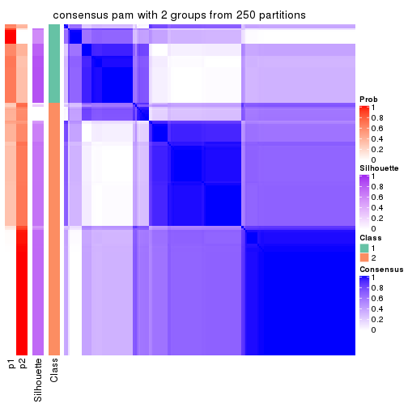</p>

</div>
<div id='tab-SD-pam-consensus-heatmap-2'>
<pre><code class="r">consensus_heatmap(res, k = 3)
</code></pre>

<p>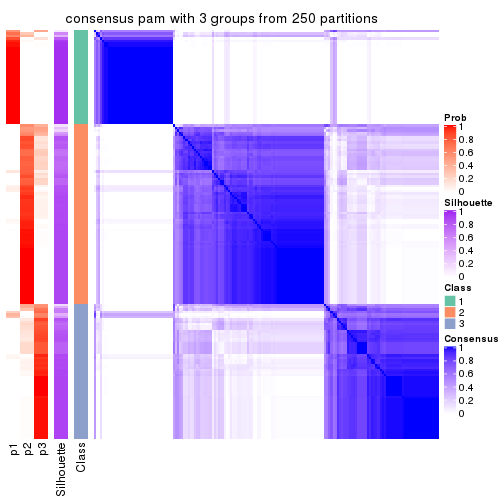</p>

</div>
<div id='tab-SD-pam-consensus-heatmap-3'>
<pre><code class="r">consensus_heatmap(res, k = 4)
</code></pre>

<p>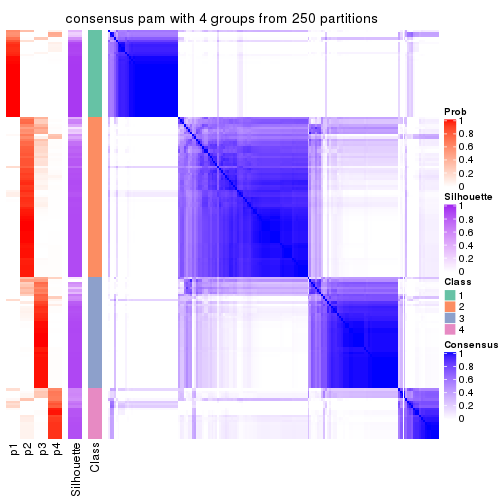</p>

</div>
<div id='tab-SD-pam-consensus-heatmap-4'>
<pre><code class="r">consensus_heatmap(res, k = 5)
</code></pre>

<p>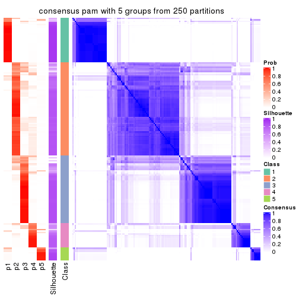</p>

</div>
<div id='tab-SD-pam-consensus-heatmap-5'>
<pre><code class="r">consensus_heatmap(res, k = 6)
</code></pre>

<p>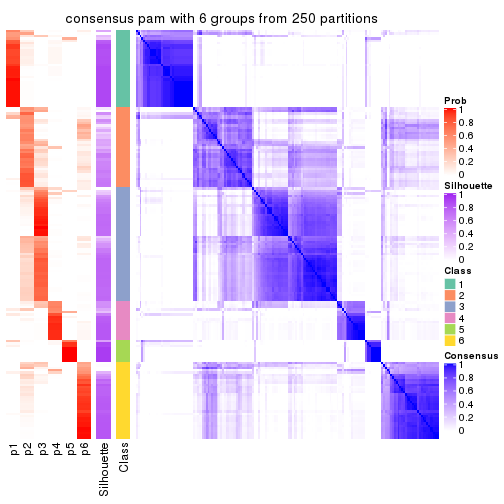</p>

</div>
</div>

Heatmaps for the membership of samples in all partitions to see how consistent they are:


<script>
$( function() {
	$( '#tabs-SD-pam-membership-heatmap' ).tabs();
} );
</script>
<div id='tabs-SD-pam-membership-heatmap'>
<ul>
<li><a href='#tab-SD-pam-membership-heatmap-1'>k = 2</a></li>
<li><a href='#tab-SD-pam-membership-heatmap-2'>k = 3</a></li>
<li><a href='#tab-SD-pam-membership-heatmap-3'>k = 4</a></li>
<li><a href='#tab-SD-pam-membership-heatmap-4'>k = 5</a></li>
<li><a href='#tab-SD-pam-membership-heatmap-5'>k = 6</a></li>
</ul>
<div id='tab-SD-pam-membership-heatmap-1'>
<pre><code class="r">membership_heatmap(res, k = 2)
</code></pre>

<p>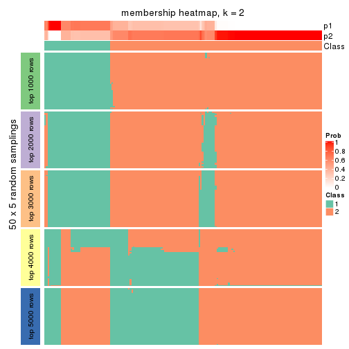</p>

</div>
<div id='tab-SD-pam-membership-heatmap-2'>
<pre><code class="r">membership_heatmap(res, k = 3)
</code></pre>

<p>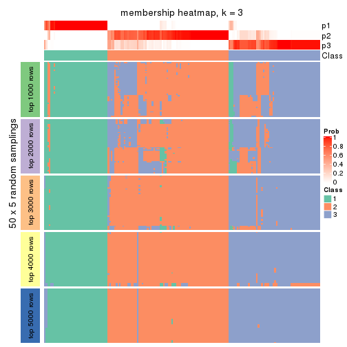</p>

</div>
<div id='tab-SD-pam-membership-heatmap-3'>
<pre><code class="r">membership_heatmap(res, k = 4)
</code></pre>

<p>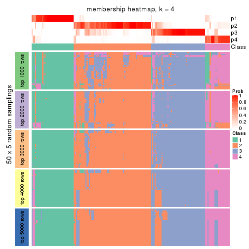</p>

</div>
<div id='tab-SD-pam-membership-heatmap-4'>
<pre><code class="r">membership_heatmap(res, k = 5)
</code></pre>

<p>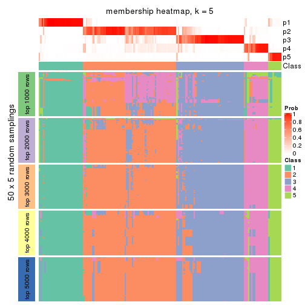</p>

</div>
<div id='tab-SD-pam-membership-heatmap-5'>
<pre><code class="r">membership_heatmap(res, k = 6)
</code></pre>

<p>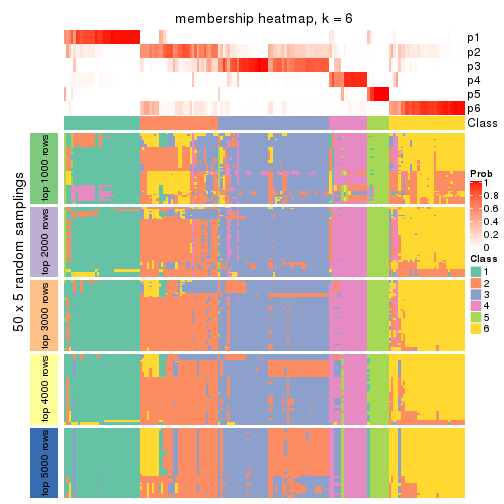</p>

</div>
</div>

As soon as we have had the classes for columns, we can look for signatures
which are significantly different between classes which can be candidate marks
for certain classes. Following are the heatmaps for signatures.


Signature heatmaps where rows are scaled:


<script>
$( function() {
	$( '#tabs-SD-pam-get-signatures' ).tabs();
} );
</script>
<div id='tabs-SD-pam-get-signatures'>
<ul>
<li><a href='#tab-SD-pam-get-signatures-1'>k = 2</a></li>
<li><a href='#tab-SD-pam-get-signatures-2'>k = 3</a></li>
<li><a href='#tab-SD-pam-get-signatures-3'>k = 4</a></li>
<li><a href='#tab-SD-pam-get-signatures-4'>k = 5</a></li>
<li><a href='#tab-SD-pam-get-signatures-5'>k = 6</a></li>
</ul>
<div id='tab-SD-pam-get-signatures-1'>
<pre><code class="r">get_signatures(res, k = 2)
</code></pre>

<p>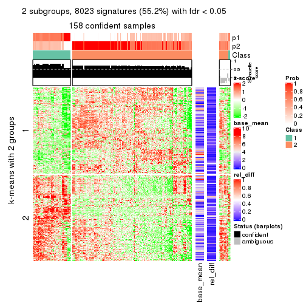</p>

</div>
<div id='tab-SD-pam-get-signatures-2'>
<pre><code class="r">get_signatures(res, k = 3)
</code></pre>

<p>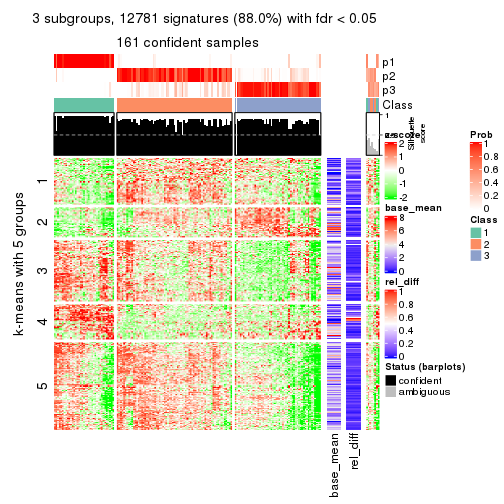</p>

</div>
<div id='tab-SD-pam-get-signatures-3'>
<pre><code class="r">get_signatures(res, k = 4)
</code></pre>

<p>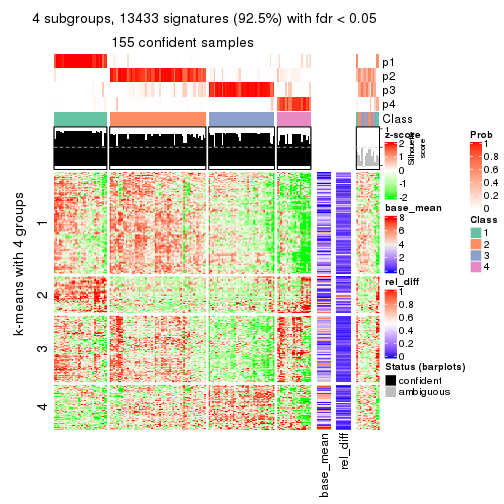</p>

</div>
<div id='tab-SD-pam-get-signatures-4'>
<pre><code class="r">get_signatures(res, k = 5)
</code></pre>

<p>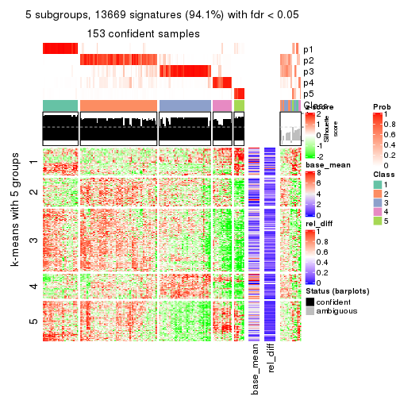</p>

</div>
<div id='tab-SD-pam-get-signatures-5'>
<pre><code class="r">get_signatures(res, k = 6)
</code></pre>

<p>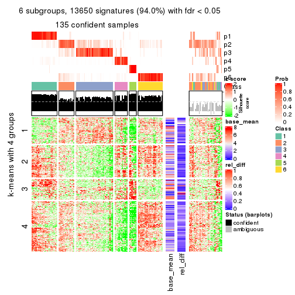</p>

</div>
</div>


Signature heatmaps where rows are not scaled:


<script>
$( function() {
	$( '#tabs-SD-pam-get-signatures-no-scale' ).tabs();
} );
</script>
<div id='tabs-SD-pam-get-signatures-no-scale'>
<ul>
<li><a href='#tab-SD-pam-get-signatures-no-scale-1'>k = 2</a></li>
<li><a href='#tab-SD-pam-get-signatures-no-scale-2'>k = 3</a></li>
<li><a href='#tab-SD-pam-get-signatures-no-scale-3'>k = 4</a></li>
<li><a href='#tab-SD-pam-get-signatures-no-scale-4'>k = 5</a></li>
<li><a href='#tab-SD-pam-get-signatures-no-scale-5'>k = 6</a></li>
</ul>
<div id='tab-SD-pam-get-signatures-no-scale-1'>
<pre><code class="r">get_signatures(res, k = 2, scale_rows = FALSE)
</code></pre>

<p>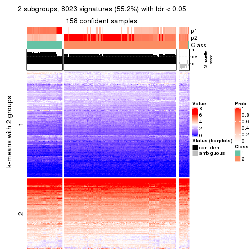</p>

</div>
<div id='tab-SD-pam-get-signatures-no-scale-2'>
<pre><code class="r">get_signatures(res, k = 3, scale_rows = FALSE)
</code></pre>

<p>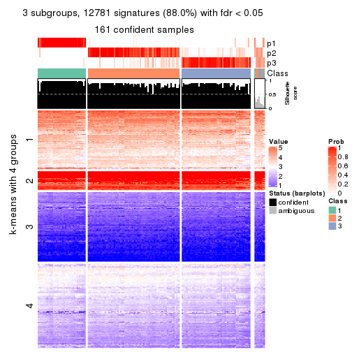</p>

</div>
<div id='tab-SD-pam-get-signatures-no-scale-3'>
<pre><code class="r">get_signatures(res, k = 4, scale_rows = FALSE)
</code></pre>

<p>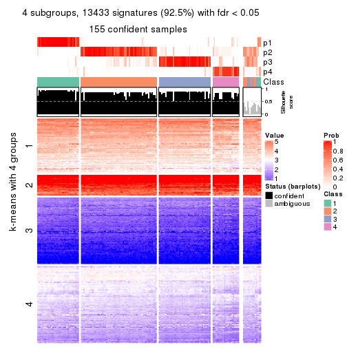</p>

</div>
<div id='tab-SD-pam-get-signatures-no-scale-4'>
<pre><code class="r">get_signatures(res, k = 5, scale_rows = FALSE)
</code></pre>

<p>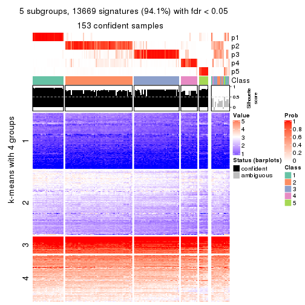</p>

</div>
<div id='tab-SD-pam-get-signatures-no-scale-5'>
<pre><code class="r">get_signatures(res, k = 6, scale_rows = FALSE)
</code></pre>

<p>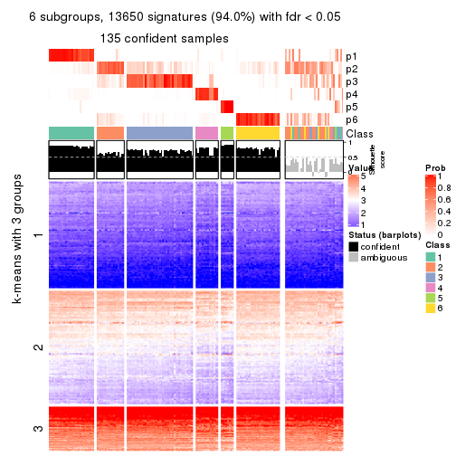</p>

</div>
</div>


Compare the overlap of signatures from different k:

```r
compare_signatures(res)
```

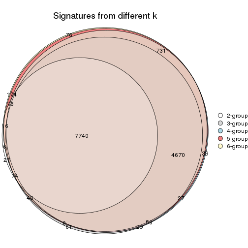

`get_signature()` returns a data frame invisibly. TO get the list of signatures, the function
call should be assigned to a variable explicitly. In following code, if `plot` argument is set
to `FALSE`, no heatmap is plotted while only the differential analysis is performed.

```r
# code only for demonstration
tb = get_signature(res, k = ..., plot = FALSE)
```

An example of the output of `tb` is:

```
#>   which_row         fdr    mean_1    mean_2 scaled_mean_1 scaled_mean_2 km
#> 1        38 0.042760348  8.373488  9.131774    -0.5533452     0.5164555  1
#> 2        40 0.018707592  7.106213  8.469186    -0.6173731     0.5762149  1
#> 3        55 0.019134737 10.221463 11.207825    -0.6159697     0.5749050  1
#> 4        59 0.006059896  5.921854  7.869574    -0.6899429     0.6439467  1
#> 5        60 0.018055526  8.928898 10.211722    -0.6204761     0.5791110  1
#> 6        98 0.009384629 15.714769 14.887706     0.6635654    -0.6193277  2
...
```

The columns in `tb` are:

1. `which_row`: row indices corresponding to the input matrix.
2. `fdr`: FDR for the differential test. 
3. `mean_x`: The mean value in group x.
4. `scaled_mean_x`: The mean value in group x after rows are scaled.
5. `km`: Row groups if k-means clustering is applied to rows.


UMAP plot which shows how samples are separated.


<script>
$( function() {
	$( '#tabs-SD-pam-dimension-reduction' ).tabs();
} );
</script>
<div id='tabs-SD-pam-dimension-reduction'>
<ul>
<li><a href='#tab-SD-pam-dimension-reduction-1'>k = 2</a></li>
<li><a href='#tab-SD-pam-dimension-reduction-2'>k = 3</a></li>
<li><a href='#tab-SD-pam-dimension-reduction-3'>k = 4</a></li>
<li><a href='#tab-SD-pam-dimension-reduction-4'>k = 5</a></li>
<li><a href='#tab-SD-pam-dimension-reduction-5'>k = 6</a></li>
</ul>
<div id='tab-SD-pam-dimension-reduction-1'>
<pre><code class="r">dimension_reduction(res, k = 2, method = &quot;UMAP&quot;)
</code></pre>

<p>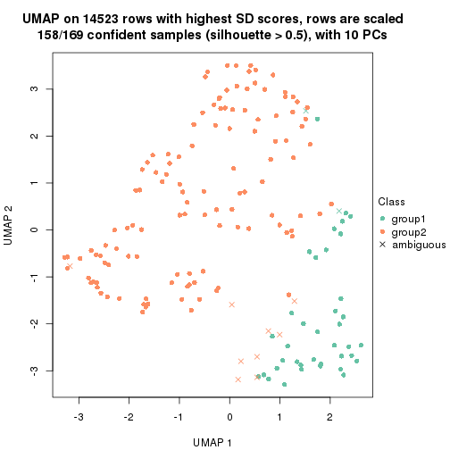</p>

</div>
<div id='tab-SD-pam-dimension-reduction-2'>
<pre><code class="r">dimension_reduction(res, k = 3, method = &quot;UMAP&quot;)
</code></pre>

<p>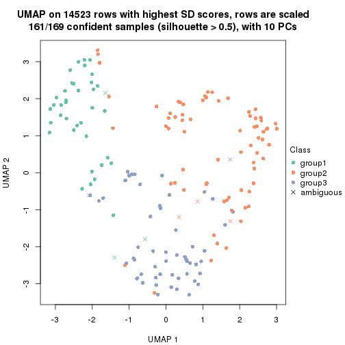</p>

</div>
<div id='tab-SD-pam-dimension-reduction-3'>
<pre><code class="r">dimension_reduction(res, k = 4, method = &quot;UMAP&quot;)
</code></pre>

<p>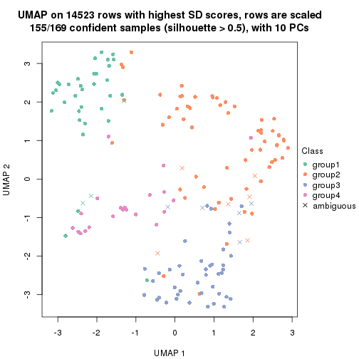</p>

</div>
<div id='tab-SD-pam-dimension-reduction-4'>
<pre><code class="r">dimension_reduction(res, k = 5, method = &quot;UMAP&quot;)
</code></pre>

<p>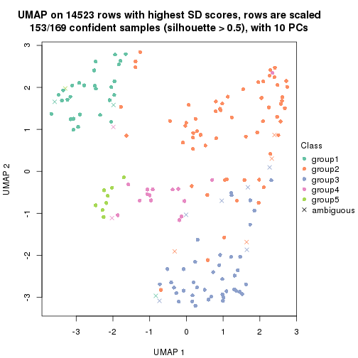</p>

</div>
<div id='tab-SD-pam-dimension-reduction-5'>
<pre><code class="r">dimension_reduction(res, k = 6, method = &quot;UMAP&quot;)
</code></pre>

<p>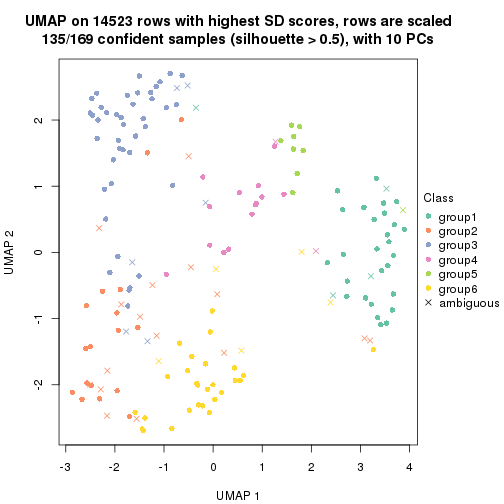</p>

</div>
</div>


Following heatmap shows how subgroups are split when increasing `k`:

```r
collect_classes(res)
```

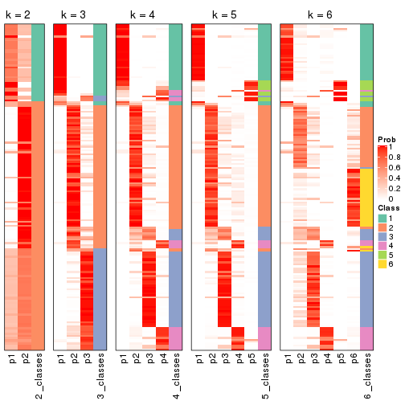


If matrix rows can be associated to genes, consider to use `GO_Enrichment(res,
...)` to perform function enrichment for the signature genes.


 

---------------------------------------------------


### SD:mclust


The object with results only for a single top-value method and a single partition method 
can be extracted as:

```r
res = res_list["SD", "mclust"]
# you can also extract it by
# res = res_list["SD:mclust"]
```

A summary of `res` and all the functions that can be applied to it:

```r
res
```

```
#> A 'ConsensusPartition' object with k = 2, 3, 4, 5, 6.
#>   On a matrix with 14523 rows and 169 columns.
#>   Top rows (1000, 2000, 3000, 4000, 5000) are extracted by 'SD' method.
#>   Subgroups are detected by 'mclust' method.
#>   Performed in total 1250 partitions by row resampling.
#>   Best k for subgroups seems to be 2.
#> 
#> Following methods can be applied to this 'ConsensusPartition' object:
#>  [1] "cola_report"             "collect_classes"         "collect_plots"          
#>  [4] "collect_stats"           "colnames"                "compare_signatures"     
#>  [7] "consensus_heatmap"       "dimension_reduction"     "functional_enrichment"  
#> [10] "get_anno_col"            "get_anno"                "get_classes"            
#> [13] "get_consensus"           "get_matrix"              "get_membership"         
#> [16] "get_param"               "get_signatures"          "get_stats"              
#> [19] "is_best_k"               "is_stable_k"             "membership_heatmap"     
#> [22] "ncol"                    "nrow"                    "plot_ecdf"              
#> [25] "rownames"                "select_partition_number" "show"                   
#> [28] "suggest_best_k"          "test_to_known_factors"
```

`collect_plots()` function collects all the plots made from `res` for all `k` (number of partitions)
into one single page to provide an easy and fast comparison between different `k`.

```r
collect_plots(res)
```

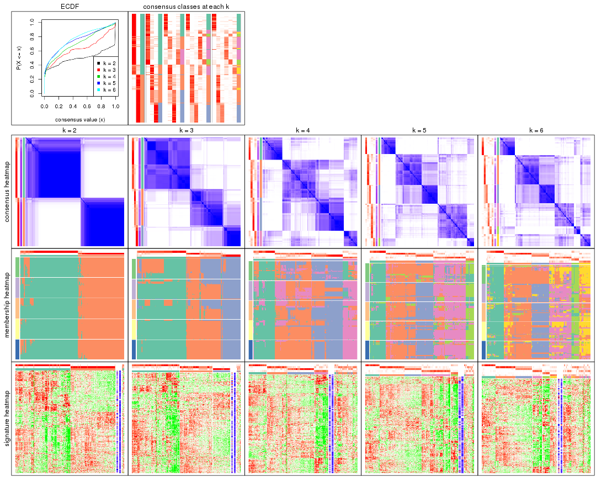

The plots are:

- The first row: a plot of the ECDF (Empirical cumulative distribution
  function) curves of the consensus matrix for each `k` and the heatmap of
  predicted classes for each `k`.
- The second row: heatmaps of the consensus matrix for each `k`.
- The third row: heatmaps of the membership matrix for each `k`.
- The fouth row: heatmaps of the signatures for each `k`.

All the plots in panels can be made by individual functions and they are
plotted later in this section.

`select_partition_number()` produces several plots showing different
statistics for choosing "optimized" `k`. There are following statistics:

- ECDF curves of the consensus matrix for each `k`;
- 1-PAC. [The PAC
  score](https://en.wikipedia.org/wiki/Consensus_clustering#Over-interpretation_potential_of_consensus_clustering)
  measures the proportion of the ambiguous subgrouping.
- Mean silhouette score.
- Concordance. The mean probability of fiting the consensus class ids in all
  partitions.
- Area increased. Denote $A_k$ as the area under the ECDF curve for current
  `k`, the area increased is defined as $A_k - A_{k-1}$.
- Rand index. The percent of pairs of samples that are both in a same cluster
  or both are not in a same cluster in the partition of k and k-1.
- Jaccard index. The ratio of pairs of samples are both in a same cluster in
  the partition of k and k-1 and the pairs of samples are both in a same
  cluster in the partition k or k-1.

The detailed explanations of these statistics can be found in [the cola
vignette](http://bioconductor.org/packages/devel/bioc/vignettes/cola/inst/doc/cola.html#toc_13).

Generally speaking, lower PAC score, higher mean silhouette score or higher
concordance corresponds to better partition. Rand index and Jaccard index
measure how similar the current partition is compared to partition with `k-1`.
If they are too similar, we won't accept `k` is better than `k-1`.

```r
select_partition_number(res)
```

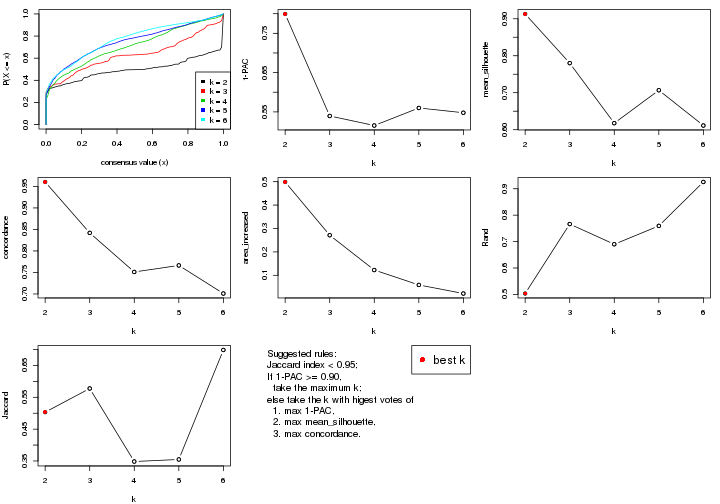

The numeric values for all these statistics can be obtained by `get_stats()`.

```r
get_stats(res)
```

```
#>   k 1-PAC mean_silhouette concordance area_increased  Rand Jaccard
#> 2 2 0.799           0.913       0.960         0.4987 0.503   0.503
#> 3 3 0.540           0.780       0.842         0.2712 0.766   0.578
#> 4 4 0.515           0.618       0.751         0.1225 0.690   0.348
#> 5 5 0.560           0.707       0.766         0.0588 0.759   0.355
#> 6 6 0.548           0.611       0.701         0.0222 0.926   0.699
```

`suggest_best_k()` suggests the best $k$ based on these statistics. The rules are as follows:

- All $k$ with Jaccard index larger than 0.95 are removed because the increase of
  the partition number does not provides enough extra information. If all $k$ are removed,
  the best $k$ is assigned by `NA`.
- For $k$ with 1-PAC larger than 0.9, the maximal $k$ is taken as the "best k". Other $k$ is called "optional k".
- If it does not fit the second rule. The $k$ with the highest vote of highest
  1-PAC, mean silhouette and concordance is taken as the "best k".

```r
suggest_best_k(res)
```

```
#> [1] 2
```


Following shows the table of the partitions (You need to click the **show/hide
code output** link to see it). The membership matrix (columns with name `p*`)
is inferred by
[`clue::cl_consensus()`](https://www.rdocumentation.org/link/cl_consensus?package=clue)
function with the `SE` method. Basically the value in the membership matrix
represents the probability to belong to a certain group. The finall class
label for an item is determined with the group with highest probability it
belongs to.

In `get_classes()` function, the entropy is calculated from the membership
matrix and the silhouette score is calculated from the consensus matrix.


<script>
$( function() {
	$( '#tabs-SD-mclust-get-classes' ).tabs();
} );
</script>
<div id='tabs-SD-mclust-get-classes'>
<ul>
<li><a href='#tab-SD-mclust-get-classes-1'>k = 2</a></li>
<li><a href='#tab-SD-mclust-get-classes-2'>k = 3</a></li>
<li><a href='#tab-SD-mclust-get-classes-3'>k = 4</a></li>
<li><a href='#tab-SD-mclust-get-classes-4'>k = 5</a></li>
<li><a href='#tab-SD-mclust-get-classes-5'>k = 6</a></li>
</ul>

<div id='tab-SD-mclust-get-classes-1'>
<p><a id='tab-SD-mclust-get-classes-1-a' style='color:#0366d6' href='#'>show/hide code output</a></p>
<pre><code class="r">cbind(get_classes(res, k = 2), get_membership(res, k = 2))
</code></pre>

<pre><code>#&gt;            class entropy silhouette    p1    p2
#&gt; SRR2052702     2  0.2236      0.942 0.036 0.964
#&gt; SRR2052701     1  0.7602      0.733 0.780 0.220
#&gt; SRR2052700     1  0.0000      0.947 1.000 0.000
#&gt; SRR2052699     1  0.0000      0.947 1.000 0.000
#&gt; SRR2052698     2  0.0000      0.972 0.000 1.000
#&gt; SRR2052708     1  0.0000      0.947 1.000 0.000
#&gt; SRR2052749     1  0.0000      0.947 1.000 0.000
#&gt; SRR2052786     2  0.0000      0.972 0.000 1.000
#&gt; SRR2052825     1  0.0000      0.947 1.000 0.000
#&gt; SRR2052824     1  0.0000      0.947 1.000 0.000
#&gt; SRR2052823     1  0.8608      0.632 0.716 0.284
#&gt; SRR2052822     2  0.0000      0.972 0.000 1.000
#&gt; SRR2052821     2  0.0000      0.972 0.000 1.000
#&gt; SRR2052820     1  0.0000      0.947 1.000 0.000
#&gt; SRR2052819     1  0.7453      0.745 0.788 0.212
#&gt; SRR2052818     1  0.4939      0.862 0.892 0.108
#&gt; SRR2052817     2  0.0000      0.972 0.000 1.000
#&gt; SRR2052816     1  0.0000      0.947 1.000 0.000
#&gt; SRR2052815     1  0.0376      0.944 0.996 0.004
#&gt; SRR2052814     1  0.9732      0.368 0.596 0.404
#&gt; SRR2052813     2  0.0000      0.972 0.000 1.000
#&gt; SRR2052812     2  0.0000      0.972 0.000 1.000
#&gt; SRR2052811     2  0.1414      0.957 0.020 0.980
#&gt; SRR2052810     1  0.6048      0.822 0.852 0.148
#&gt; SRR2052809     2  0.0000      0.972 0.000 1.000
#&gt; SRR2052808     2  0.8909      0.548 0.308 0.692
#&gt; SRR2052807     1  0.0000      0.947 1.000 0.000
#&gt; SRR2052806     1  0.0000      0.947 1.000 0.000
#&gt; SRR2052805     1  0.0000      0.947 1.000 0.000
#&gt; SRR2052804     1  0.0000      0.947 1.000 0.000
#&gt; SRR2052803     1  0.0000      0.947 1.000 0.000
#&gt; SRR2052802     1  0.0000      0.947 1.000 0.000
#&gt; SRR2052801     1  0.0000      0.947 1.000 0.000
#&gt; SRR2052800     1  0.0000      0.947 1.000 0.000
#&gt; SRR2052799     1  0.0000      0.947 1.000 0.000
#&gt; SRR2052798     1  0.0000      0.947 1.000 0.000
#&gt; SRR2052797     2  0.0000      0.972 0.000 1.000
#&gt; SRR2052796     1  0.0000      0.947 1.000 0.000
#&gt; SRR2052795     1  0.0000      0.947 1.000 0.000
#&gt; SRR2052794     1  0.0000      0.947 1.000 0.000
#&gt; SRR2052793     1  0.0000      0.947 1.000 0.000
#&gt; SRR2052792     1  0.0000      0.947 1.000 0.000
#&gt; SRR2052791     1  0.0000      0.947 1.000 0.000
#&gt; SRR2052790     2  0.0000      0.972 0.000 1.000
#&gt; SRR2052789     2  0.0000      0.972 0.000 1.000
#&gt; SRR2052788     2  0.0000      0.972 0.000 1.000
#&gt; SRR2052787     2  0.0000      0.972 0.000 1.000
#&gt; SRR2052785     2  0.0000      0.972 0.000 1.000
#&gt; SRR2052784     2  0.0000      0.972 0.000 1.000
#&gt; SRR2052783     2  0.0000      0.972 0.000 1.000
#&gt; SRR2052782     2  0.0000      0.972 0.000 1.000
#&gt; SRR2052781     2  0.0000      0.972 0.000 1.000
#&gt; SRR2052780     2  0.0000      0.972 0.000 1.000
#&gt; SRR2052777     2  0.0000      0.972 0.000 1.000
#&gt; SRR2052779     2  0.0000      0.972 0.000 1.000
#&gt; SRR2052778     2  0.0000      0.972 0.000 1.000
#&gt; SRR2052776     2  0.0000      0.972 0.000 1.000
#&gt; SRR2052775     2  0.0000      0.972 0.000 1.000
#&gt; SRR2052773     2  0.0000      0.972 0.000 1.000
#&gt; SRR2052772     2  0.0000      0.972 0.000 1.000
#&gt; SRR2052774     2  0.0000      0.972 0.000 1.000
#&gt; SRR2052771     1  0.0000      0.947 1.000 0.000
#&gt; SRR2052769     2  0.6247      0.804 0.156 0.844
#&gt; SRR2052770     2  0.0000      0.972 0.000 1.000
#&gt; SRR2052768     2  0.0000      0.972 0.000 1.000
#&gt; SRR2052767     2  0.0000      0.972 0.000 1.000
#&gt; SRR2052766     1  0.0000      0.947 1.000 0.000
#&gt; SRR2052765     1  0.9460      0.472 0.636 0.364
#&gt; SRR2052763     2  0.0000      0.972 0.000 1.000
#&gt; SRR2052764     1  0.0376      0.944 0.996 0.004
#&gt; SRR2052761     1  0.8499      0.648 0.724 0.276
#&gt; SRR2052760     2  0.0000      0.972 0.000 1.000
#&gt; SRR2052759     2  0.0000      0.972 0.000 1.000
#&gt; SRR2052762     2  0.0938      0.963 0.012 0.988
#&gt; SRR2052758     2  0.0000      0.972 0.000 1.000
#&gt; SRR2052756     1  0.0000      0.947 1.000 0.000
#&gt; SRR2052757     2  0.0000      0.972 0.000 1.000
#&gt; SRR2052755     1  0.0000      0.947 1.000 0.000
#&gt; SRR2052754     1  0.0000      0.947 1.000 0.000
#&gt; SRR2052753     1  0.0000      0.947 1.000 0.000
#&gt; SRR2052752     1  0.0000      0.947 1.000 0.000
#&gt; SRR2052750     1  0.0000      0.947 1.000 0.000
#&gt; SRR2052751     1  0.9896      0.261 0.560 0.440
#&gt; SRR2052748     2  0.8081      0.677 0.248 0.752
#&gt; SRR2052747     1  0.0000      0.947 1.000 0.000
#&gt; SRR2052746     2  0.0000      0.972 0.000 1.000
#&gt; SRR2052745     2  0.0376      0.969 0.004 0.996
#&gt; SRR2052744     1  0.0000      0.947 1.000 0.000
#&gt; SRR2052741     1  0.4298      0.883 0.912 0.088
#&gt; SRR2052743     2  0.9795      0.260 0.416 0.584
#&gt; SRR2052740     1  0.8016      0.701 0.756 0.244
#&gt; SRR2052742     1  0.7139      0.769 0.804 0.196
#&gt; SRR2052739     2  0.0000      0.972 0.000 1.000
#&gt; SRR2052738     2  0.0000      0.972 0.000 1.000
#&gt; SRR2052736     1  0.0000      0.947 1.000 0.000
#&gt; SRR2052735     1  0.0000      0.947 1.000 0.000
#&gt; SRR2052734     1  0.0000      0.947 1.000 0.000
#&gt; SRR2052737     2  0.0000      0.972 0.000 1.000
#&gt; SRR2052733     2  0.0000      0.972 0.000 1.000
#&gt; SRR2052732     1  0.0000      0.947 1.000 0.000
#&gt; SRR2052731     2  0.0000      0.972 0.000 1.000
#&gt; SRR2052729     1  0.0000      0.947 1.000 0.000
#&gt; SRR2052728     1  0.0000      0.947 1.000 0.000
#&gt; SRR2052730     1  0.0000      0.947 1.000 0.000
#&gt; SRR2052727     1  0.0000      0.947 1.000 0.000
#&gt; SRR2052725     1  0.0000      0.947 1.000 0.000
#&gt; SRR2052726     1  0.0000      0.947 1.000 0.000
#&gt; SRR2052724     1  0.0000      0.947 1.000 0.000
#&gt; SRR2052723     1  0.0000      0.947 1.000 0.000
#&gt; SRR2052722     2  0.0000      0.972 0.000 1.000
#&gt; SRR2052721     1  0.0000      0.947 1.000 0.000
#&gt; SRR2052720     2  0.0000      0.972 0.000 1.000
#&gt; SRR2052719     2  0.0000      0.972 0.000 1.000
#&gt; SRR2052718     1  0.0000      0.947 1.000 0.000
#&gt; SRR2052717     2  0.1184      0.960 0.016 0.984
#&gt; SRR2052714     1  0.0000      0.947 1.000 0.000
#&gt; SRR2052716     1  0.0000      0.947 1.000 0.000
#&gt; SRR2052715     2  0.0000      0.972 0.000 1.000
#&gt; SRR2052713     1  0.0000      0.947 1.000 0.000
#&gt; SRR2052712     1  0.0000      0.947 1.000 0.000
#&gt; SRR2052711     1  0.0000      0.947 1.000 0.000
#&gt; SRR2052710     1  0.8016      0.706 0.756 0.244
#&gt; SRR2052707     2  0.0000      0.972 0.000 1.000
#&gt; SRR2052709     2  0.0000      0.972 0.000 1.000
#&gt; SRR2052704     2  0.0376      0.969 0.004 0.996
#&gt; SRR2052705     2  0.6623      0.788 0.172 0.828
#&gt; SRR2052697     1  0.5294      0.854 0.880 0.120
#&gt; SRR2052703     2  0.0000      0.972 0.000 1.000
#&gt; SRR2052696     1  0.0000      0.947 1.000 0.000
#&gt; SRR2052706     2  0.2603      0.935 0.044 0.956
#&gt; SRR2052695     2  0.0000      0.972 0.000 1.000
#&gt; SRR2052694     2  0.0000      0.972 0.000 1.000
#&gt; SRR2052692     2  0.0000      0.972 0.000 1.000
#&gt; SRR2052693     2  0.0000      0.972 0.000 1.000
#&gt; SRR2052691     1  0.0000      0.947 1.000 0.000
#&gt; SRR2052690     1  0.0000      0.947 1.000 0.000
#&gt; SRR2052689     1  0.7299      0.755 0.796 0.204
#&gt; SRR2052687     1  0.7376      0.750 0.792 0.208
#&gt; SRR2052686     1  0.0000      0.947 1.000 0.000
#&gt; SRR2052688     2  0.0000      0.972 0.000 1.000
#&gt; SRR2052684     1  0.0000      0.947 1.000 0.000
#&gt; SRR2052685     1  0.4298      0.883 0.912 0.088
#&gt; SRR2052683     1  0.0000      0.947 1.000 0.000
#&gt; SRR2052681     1  0.0000      0.947 1.000 0.000
#&gt; SRR2052680     1  0.0000      0.947 1.000 0.000
#&gt; SRR2052682     1  0.0000      0.947 1.000 0.000
#&gt; SRR2052679     1  0.0000      0.947 1.000 0.000
#&gt; SRR2052678     2  0.0000      0.972 0.000 1.000
#&gt; SRR2052677     2  0.0000      0.972 0.000 1.000
#&gt; SRR2052675     1  0.5629      0.842 0.868 0.132
#&gt; SRR2052676     1  0.0000      0.947 1.000 0.000
#&gt; SRR2052674     1  0.7453      0.745 0.788 0.212
#&gt; SRR2052672     2  0.0000      0.972 0.000 1.000
#&gt; SRR2052673     1  0.0000      0.947 1.000 0.000
#&gt; SRR2052671     2  0.7883      0.690 0.236 0.764
#&gt; SRR2052670     2  0.0000      0.972 0.000 1.000
#&gt; SRR2052669     2  0.0000      0.972 0.000 1.000
#&gt; SRR2052668     1  0.3584      0.898 0.932 0.068
#&gt; SRR2052667     2  0.7299      0.742 0.204 0.796
#&gt; SRR2052666     1  0.9248      0.533 0.660 0.340
#&gt; SRR2052665     2  0.3274      0.920 0.060 0.940
#&gt; SRR2052664     1  0.0000      0.947 1.000 0.000
#&gt; SRR2052663     1  0.0672      0.942 0.992 0.008
#&gt; SRR2052662     2  0.0938      0.963 0.012 0.988
#&gt; SRR2052661     1  0.0000      0.947 1.000 0.000
#&gt; SRR2052660     2  0.0938      0.963 0.012 0.988
#&gt; SRR2052659     1  0.1414      0.934 0.980 0.020
#&gt; SRR2052658     1  0.4690      0.872 0.900 0.100
#&gt; SRR2052657     1  0.0000      0.947 1.000 0.000
</code></pre>

<script>
$('#tab-SD-mclust-get-classes-1-a').parent().next().next().hide();
$('#tab-SD-mclust-get-classes-1-a').click(function(){
  $('#tab-SD-mclust-get-classes-1-a').parent().next().next().toggle();
  return(false);
});
</script>
</div>

<div id='tab-SD-mclust-get-classes-2'>
<p><a id='tab-SD-mclust-get-classes-2-a' style='color:#0366d6' href='#'>show/hide code output</a></p>
<pre><code class="r">cbind(get_classes(res, k = 3), get_membership(res, k = 3))
</code></pre>

<pre><code>#&gt;            class entropy silhouette    p1    p2    p3
#&gt; SRR2052702     2  0.2959     0.7098 0.000 0.900 0.100
#&gt; SRR2052701     2  0.0592     0.6740 0.012 0.988 0.000
#&gt; SRR2052700     1  0.4399     0.8584 0.812 0.188 0.000
#&gt; SRR2052699     1  0.5785     0.7922 0.668 0.332 0.000
#&gt; SRR2052698     2  0.6192     0.6453 0.000 0.580 0.420
#&gt; SRR2052708     1  0.0424     0.8671 0.992 0.008 0.000
#&gt; SRR2052749     1  0.3038     0.8515 0.896 0.104 0.000
#&gt; SRR2052786     2  0.5706     0.7389 0.000 0.680 0.320
#&gt; SRR2052825     1  0.4002     0.8689 0.840 0.160 0.000
#&gt; SRR2052824     1  0.5524     0.8481 0.796 0.164 0.040
#&gt; SRR2052823     2  0.0000     0.6809 0.000 1.000 0.000
#&gt; SRR2052822     2  0.5948     0.7283 0.000 0.640 0.360
#&gt; SRR2052821     2  0.5948     0.7283 0.000 0.640 0.360
#&gt; SRR2052820     1  0.4121     0.8694 0.832 0.168 0.000
#&gt; SRR2052819     1  0.5619     0.6753 0.744 0.012 0.244
#&gt; SRR2052818     1  0.6488     0.8167 0.756 0.160 0.084
#&gt; SRR2052817     3  0.0237     0.9074 0.000 0.004 0.996
#&gt; SRR2052816     1  0.5760     0.7262 0.672 0.328 0.000
#&gt; SRR2052815     1  0.5734     0.8426 0.788 0.164 0.048
#&gt; SRR2052814     1  0.9877    -0.2338 0.388 0.260 0.352
#&gt; SRR2052813     2  0.5948     0.7283 0.000 0.640 0.360
#&gt; SRR2052812     2  0.5098     0.7384 0.000 0.752 0.248
#&gt; SRR2052811     2  0.2959     0.7098 0.000 0.900 0.100
#&gt; SRR2052810     1  0.6363     0.7929 0.768 0.096 0.136
#&gt; SRR2052809     2  0.5948     0.7283 0.000 0.640 0.360
#&gt; SRR2052808     2  0.7458     0.7160 0.088 0.676 0.236
#&gt; SRR2052807     1  0.3686     0.8729 0.860 0.140 0.000
#&gt; SRR2052806     1  0.0237     0.8666 0.996 0.004 0.000
#&gt; SRR2052805     1  0.0237     0.8666 0.996 0.004 0.000
#&gt; SRR2052804     1  0.4002     0.8689 0.840 0.160 0.000
#&gt; SRR2052803     1  0.0424     0.8671 0.992 0.008 0.000
#&gt; SRR2052802     1  0.3941     0.8701 0.844 0.156 0.000
#&gt; SRR2052801     1  0.0000     0.8661 1.000 0.000 0.000
#&gt; SRR2052800     1  0.4002     0.8689 0.840 0.160 0.000
#&gt; SRR2052799     1  0.0000     0.8661 1.000 0.000 0.000
#&gt; SRR2052798     1  0.3038     0.8515 0.896 0.104 0.000
#&gt; SRR2052797     2  0.5948     0.7283 0.000 0.640 0.360
#&gt; SRR2052796     1  0.0000     0.8661 1.000 0.000 0.000
#&gt; SRR2052795     1  0.0892     0.8672 0.980 0.020 0.000
#&gt; SRR2052794     1  0.0000     0.8661 1.000 0.000 0.000
#&gt; SRR2052793     1  0.0000     0.8661 1.000 0.000 0.000
#&gt; SRR2052792     1  0.4002     0.8689 0.840 0.160 0.000
#&gt; SRR2052791     1  0.0424     0.8671 0.992 0.008 0.000
#&gt; SRR2052790     3  0.0237     0.9064 0.000 0.004 0.996
#&gt; SRR2052789     3  0.0000     0.9098 0.000 0.000 1.000
#&gt; SRR2052788     3  0.0000     0.9098 0.000 0.000 1.000
#&gt; SRR2052787     2  0.5882     0.7332 0.000 0.652 0.348
#&gt; SRR2052785     3  0.6192    -0.2719 0.000 0.420 0.580
#&gt; SRR2052784     2  0.5948     0.7283 0.000 0.640 0.360
#&gt; SRR2052783     2  0.5926     0.7295 0.000 0.644 0.356
#&gt; SRR2052782     2  0.5948     0.7283 0.000 0.640 0.360
#&gt; SRR2052781     2  0.5905     0.7318 0.000 0.648 0.352
#&gt; SRR2052780     3  0.0000     0.9098 0.000 0.000 1.000
#&gt; SRR2052777     2  0.5882     0.7332 0.000 0.652 0.348
#&gt; SRR2052779     2  0.5948     0.7283 0.000 0.640 0.360
#&gt; SRR2052778     3  0.0237     0.9074 0.000 0.004 0.996
#&gt; SRR2052776     2  0.5988     0.7201 0.000 0.632 0.368
#&gt; SRR2052775     3  0.0000     0.9098 0.000 0.000 1.000
#&gt; SRR2052773     3  0.5397     0.3438 0.000 0.280 0.720
#&gt; SRR2052772     3  0.0000     0.9098 0.000 0.000 1.000
#&gt; SRR2052774     3  0.0000     0.9098 0.000 0.000 1.000
#&gt; SRR2052771     1  0.0424     0.8671 0.992 0.008 0.000
#&gt; SRR2052769     2  0.8243     0.6377 0.084 0.548 0.368
#&gt; SRR2052770     3  0.0000     0.9098 0.000 0.000 1.000
#&gt; SRR2052768     2  0.5058     0.7386 0.000 0.756 0.244
#&gt; SRR2052767     2  0.3192     0.7132 0.000 0.888 0.112
#&gt; SRR2052766     1  0.4062     0.8677 0.836 0.164 0.000
#&gt; SRR2052765     2  0.8230     0.6508 0.088 0.564 0.348
#&gt; SRR2052763     3  0.3482     0.7620 0.000 0.128 0.872
#&gt; SRR2052764     1  0.4062     0.8677 0.836 0.164 0.000
#&gt; SRR2052761     3  0.8594     0.4071 0.144 0.268 0.588
#&gt; SRR2052760     2  0.5291     0.7369 0.000 0.732 0.268
#&gt; SRR2052759     3  0.0000     0.9098 0.000 0.000 1.000
#&gt; SRR2052762     2  0.1643     0.6976 0.000 0.956 0.044
#&gt; SRR2052758     3  0.0000     0.9098 0.000 0.000 1.000
#&gt; SRR2052756     1  0.0237     0.8666 0.996 0.004 0.000
#&gt; SRR2052757     2  0.6062     0.6990 0.000 0.616 0.384
#&gt; SRR2052755     1  0.3038     0.8515 0.896 0.104 0.000
#&gt; SRR2052754     1  0.0000     0.8661 1.000 0.000 0.000
#&gt; SRR2052753     1  0.1031     0.8670 0.976 0.024 0.000
#&gt; SRR2052752     1  0.0424     0.8671 0.992 0.008 0.000
#&gt; SRR2052750     1  0.3038     0.8515 0.896 0.104 0.000
#&gt; SRR2052751     2  0.0000     0.6809 0.000 1.000 0.000
#&gt; SRR2052748     1  0.7825     0.7345 0.672 0.156 0.172
#&gt; SRR2052747     1  0.3038     0.8515 0.896 0.104 0.000
#&gt; SRR2052746     3  0.0000     0.9098 0.000 0.000 1.000
#&gt; SRR2052745     3  0.3619     0.7515 0.000 0.136 0.864
#&gt; SRR2052744     1  0.3038     0.8515 0.896 0.104 0.000
#&gt; SRR2052741     2  0.0892     0.6658 0.020 0.980 0.000
#&gt; SRR2052743     2  0.0000     0.6809 0.000 1.000 0.000
#&gt; SRR2052740     2  0.1289     0.6664 0.032 0.968 0.000
#&gt; SRR2052742     2  0.0000     0.6809 0.000 1.000 0.000
#&gt; SRR2052739     2  0.5948     0.7283 0.000 0.640 0.360
#&gt; SRR2052738     3  0.3619     0.7541 0.000 0.136 0.864
#&gt; SRR2052736     1  0.5254     0.8395 0.736 0.264 0.000
#&gt; SRR2052735     1  0.5016     0.8478 0.760 0.240 0.000
#&gt; SRR2052734     1  0.5016     0.8478 0.760 0.240 0.000
#&gt; SRR2052737     2  0.5926     0.7295 0.000 0.644 0.356
#&gt; SRR2052733     3  0.0000     0.9098 0.000 0.000 1.000
#&gt; SRR2052732     1  0.4121     0.8668 0.832 0.168 0.000
#&gt; SRR2052731     3  0.0000     0.9098 0.000 0.000 1.000
#&gt; SRR2052729     1  0.3038     0.8515 0.896 0.104 0.000
#&gt; SRR2052728     1  0.3038     0.8515 0.896 0.104 0.000
#&gt; SRR2052730     1  0.4002     0.8689 0.840 0.160 0.000
#&gt; SRR2052727     1  0.3038     0.8515 0.896 0.104 0.000
#&gt; SRR2052725     1  0.4002     0.8689 0.840 0.160 0.000
#&gt; SRR2052726     1  0.4931     0.8497 0.768 0.232 0.000
#&gt; SRR2052724     1  0.0592     0.8673 0.988 0.012 0.000
#&gt; SRR2052723     1  0.4121     0.8694 0.832 0.168 0.000
#&gt; SRR2052722     3  0.0237     0.9074 0.000 0.004 0.996
#&gt; SRR2052721     1  0.3038     0.8515 0.896 0.104 0.000
#&gt; SRR2052720     2  0.5733     0.7382 0.000 0.676 0.324
#&gt; SRR2052719     2  0.5254     0.7376 0.000 0.736 0.264
#&gt; SRR2052718     1  0.3941     0.8753 0.844 0.156 0.000
#&gt; SRR2052717     2  0.0892     0.6896 0.000 0.980 0.020
#&gt; SRR2052714     1  0.0424     0.8671 0.992 0.008 0.000
#&gt; SRR2052716     1  0.4178     0.8684 0.828 0.172 0.000
#&gt; SRR2052715     3  0.0000     0.9098 0.000 0.000 1.000
#&gt; SRR2052713     1  0.0424     0.8671 0.992 0.008 0.000
#&gt; SRR2052712     1  0.4002     0.8689 0.840 0.160 0.000
#&gt; SRR2052711     1  0.4062     0.8684 0.836 0.164 0.000
#&gt; SRR2052710     2  0.8821     0.4391 0.232 0.580 0.188
#&gt; SRR2052707     3  0.0237     0.9074 0.000 0.004 0.996
#&gt; SRR2052709     3  0.0000     0.9098 0.000 0.000 1.000
#&gt; SRR2052704     3  0.0661     0.9006 0.008 0.004 0.988
#&gt; SRR2052705     2  0.0237     0.6830 0.000 0.996 0.004
#&gt; SRR2052697     2  0.0424     0.6761 0.008 0.992 0.000
#&gt; SRR2052703     3  0.0000     0.9098 0.000 0.000 1.000
#&gt; SRR2052696     1  0.3038     0.8515 0.896 0.104 0.000
#&gt; SRR2052706     2  0.5948     0.7283 0.000 0.640 0.360
#&gt; SRR2052695     2  0.5948     0.7283 0.000 0.640 0.360
#&gt; SRR2052694     2  0.5733     0.7382 0.000 0.676 0.324
#&gt; SRR2052692     3  0.3267     0.7815 0.000 0.116 0.884
#&gt; SRR2052693     2  0.5988     0.7190 0.000 0.632 0.368
#&gt; SRR2052691     1  0.5363     0.8329 0.724 0.276 0.000
#&gt; SRR2052690     1  0.5650     0.8096 0.688 0.312 0.000
#&gt; SRR2052689     1  0.5842     0.7362 0.768 0.036 0.196
#&gt; SRR2052687     1  0.5921     0.7145 0.756 0.032 0.212
#&gt; SRR2052686     1  0.4002     0.8689 0.840 0.160 0.000
#&gt; SRR2052688     2  0.5926     0.7295 0.000 0.644 0.356
#&gt; SRR2052684     1  0.4121     0.8694 0.832 0.168 0.000
#&gt; SRR2052685     2  0.0000     0.6809 0.000 1.000 0.000
#&gt; SRR2052683     1  0.0000     0.8661 1.000 0.000 0.000
#&gt; SRR2052681     1  0.4062     0.8677 0.836 0.164 0.000
#&gt; SRR2052680     1  0.5413     0.8507 0.800 0.164 0.036
#&gt; SRR2052682     1  0.5254     0.8395 0.736 0.264 0.000
#&gt; SRR2052679     1  0.3038     0.8515 0.896 0.104 0.000
#&gt; SRR2052678     3  0.0000     0.9098 0.000 0.000 1.000
#&gt; SRR2052677     2  0.5948     0.7283 0.000 0.640 0.360
#&gt; SRR2052675     2  0.3619     0.5548 0.136 0.864 0.000
#&gt; SRR2052676     1  0.3038     0.8515 0.896 0.104 0.000
#&gt; SRR2052674     2  0.9464     0.4836 0.252 0.500 0.248
#&gt; SRR2052672     3  0.0000     0.9098 0.000 0.000 1.000
#&gt; SRR2052673     1  0.5254     0.8395 0.736 0.264 0.000
#&gt; SRR2052671     2  0.0237     0.6830 0.000 0.996 0.004
#&gt; SRR2052670     3  0.0000     0.9098 0.000 0.000 1.000
#&gt; SRR2052669     2  0.5733     0.7382 0.000 0.676 0.324
#&gt; SRR2052668     2  0.5706     0.0155 0.320 0.680 0.000
#&gt; SRR2052667     2  0.3965     0.7139 0.008 0.860 0.132
#&gt; SRR2052666     1  0.8085     0.6961 0.648 0.148 0.204
#&gt; SRR2052665     2  0.0592     0.6866 0.000 0.988 0.012
#&gt; SRR2052664     1  0.0000     0.8661 1.000 0.000 0.000
#&gt; SRR2052663     1  0.5465     0.8124 0.712 0.288 0.000
#&gt; SRR2052662     2  0.3879     0.7157 0.000 0.848 0.152
#&gt; SRR2052661     1  0.3038     0.8515 0.896 0.104 0.000
#&gt; SRR2052660     3  0.3116     0.7944 0.000 0.108 0.892
#&gt; SRR2052659     1  0.4121     0.8694 0.832 0.168 0.000
#&gt; SRR2052658     2  0.0000     0.6809 0.000 1.000 0.000
#&gt; SRR2052657     1  0.1163     0.8669 0.972 0.028 0.000
</code></pre>

<script>
$('#tab-SD-mclust-get-classes-2-a').parent().next().next().hide();
$('#tab-SD-mclust-get-classes-2-a').click(function(){
  $('#tab-SD-mclust-get-classes-2-a').parent().next().next().toggle();
  return(false);
});
</script>
</div>

<div id='tab-SD-mclust-get-classes-3'>
<p><a id='tab-SD-mclust-get-classes-3-a' style='color:#0366d6' href='#'>show/hide code output</a></p>
<pre><code class="r">cbind(get_classes(res, k = 4), get_membership(res, k = 4))
</code></pre>

<pre><code>#&gt;            class entropy silhouette    p1    p2    p3    p4
#&gt; SRR2052702     2  0.3828    0.68622 0.008 0.840 0.132 0.020
#&gt; SRR2052701     2  0.2335    0.69326 0.020 0.920 0.060 0.000
#&gt; SRR2052700     2  0.4775    0.40463 0.028 0.740 0.000 0.232
#&gt; SRR2052699     2  0.4713    0.56999 0.112 0.808 0.012 0.068
#&gt; SRR2052698     3  0.4462    0.74032 0.000 0.132 0.804 0.064
#&gt; SRR2052708     1  0.1867    0.77188 0.928 0.000 0.000 0.072
#&gt; SRR2052749     1  0.1557    0.78082 0.944 0.000 0.000 0.056
#&gt; SRR2052786     2  0.6683    0.04920 0.000 0.496 0.416 0.088
#&gt; SRR2052825     4  0.5887    0.69085 0.016 0.272 0.040 0.672
#&gt; SRR2052824     4  0.6032    0.63347 0.004 0.308 0.056 0.632
#&gt; SRR2052823     2  0.1871    0.67521 0.012 0.948 0.024 0.016
#&gt; SRR2052822     3  0.5646    0.69610 0.000 0.204 0.708 0.088
#&gt; SRR2052821     3  0.5558    0.69850 0.000 0.208 0.712 0.080
#&gt; SRR2052820     2  0.6614    0.34534 0.096 0.656 0.020 0.228
#&gt; SRR2052819     2  0.7678    0.34278 0.008 0.504 0.200 0.288
#&gt; SRR2052818     2  0.5867    0.46781 0.004 0.668 0.060 0.268
#&gt; SRR2052817     3  0.0000    0.78952 0.000 0.000 1.000 0.000
#&gt; SRR2052816     2  0.3601    0.61500 0.024 0.864 0.012 0.100
#&gt; SRR2052815     4  0.5961    0.63746 0.004 0.308 0.052 0.636
#&gt; SRR2052814     2  0.6944    0.53257 0.004 0.596 0.248 0.152
#&gt; SRR2052813     3  0.5681    0.69436 0.000 0.208 0.704 0.088
#&gt; SRR2052812     2  0.6295    0.38138 0.000 0.616 0.296 0.088
#&gt; SRR2052811     2  0.4376    0.65937 0.012 0.796 0.176 0.016
#&gt; SRR2052810     2  0.5935    0.47303 0.004 0.664 0.064 0.268
#&gt; SRR2052809     3  0.5756    0.68474 0.000 0.224 0.692 0.084
#&gt; SRR2052808     2  0.4436    0.66360 0.000 0.800 0.148 0.052
#&gt; SRR2052807     4  0.4274    0.72108 0.072 0.108 0.000 0.820
#&gt; SRR2052806     1  0.4992    0.00208 0.524 0.000 0.000 0.476
#&gt; SRR2052805     1  0.4103    0.64696 0.744 0.000 0.000 0.256
#&gt; SRR2052804     4  0.5393    0.72873 0.044 0.268 0.000 0.688
#&gt; SRR2052803     1  0.3649    0.70195 0.796 0.000 0.000 0.204
#&gt; SRR2052802     4  0.4636    0.73265 0.068 0.140 0.000 0.792
#&gt; SRR2052801     4  0.4008    0.62383 0.244 0.000 0.000 0.756
#&gt; SRR2052800     4  0.4614    0.73367 0.064 0.144 0.000 0.792
#&gt; SRR2052799     4  0.4008    0.62383 0.244 0.000 0.000 0.756
#&gt; SRR2052798     1  0.0336    0.79375 0.992 0.000 0.000 0.008
#&gt; SRR2052797     3  0.5620    0.69942 0.000 0.208 0.708 0.084
#&gt; SRR2052796     4  0.4008    0.62383 0.244 0.000 0.000 0.756
#&gt; SRR2052795     1  0.1940    0.76986 0.924 0.000 0.000 0.076
#&gt; SRR2052794     4  0.4008    0.62383 0.244 0.000 0.000 0.756
#&gt; SRR2052793     4  0.4008    0.62383 0.244 0.000 0.000 0.756
#&gt; SRR2052792     4  0.5464    0.73489 0.064 0.228 0.000 0.708
#&gt; SRR2052791     1  0.4799    0.60390 0.744 0.032 0.000 0.224
#&gt; SRR2052790     3  0.1929    0.77502 0.000 0.024 0.940 0.036
#&gt; SRR2052789     3  0.0469    0.78727 0.000 0.000 0.988 0.012
#&gt; SRR2052788     3  0.0707    0.78387 0.000 0.000 0.980 0.020
#&gt; SRR2052787     3  0.6705    0.13803 0.000 0.440 0.472 0.088
#&gt; SRR2052785     3  0.2376    0.77463 0.000 0.068 0.916 0.016
#&gt; SRR2052784     3  0.5681    0.69436 0.000 0.208 0.704 0.088
#&gt; SRR2052783     3  0.6389    0.13699 0.000 0.448 0.488 0.064
#&gt; SRR2052782     3  0.5798    0.69644 0.000 0.208 0.696 0.096
#&gt; SRR2052781     2  0.5990    0.46517 0.000 0.644 0.284 0.072
#&gt; SRR2052780     3  0.0524    0.78903 0.000 0.004 0.988 0.008
#&gt; SRR2052777     3  0.6494    0.47688 0.000 0.340 0.572 0.088
#&gt; SRR2052779     3  0.5740    0.69563 0.000 0.208 0.700 0.092
#&gt; SRR2052778     3  0.0000    0.78952 0.000 0.000 1.000 0.000
#&gt; SRR2052776     3  0.5609    0.70053 0.000 0.200 0.712 0.088
#&gt; SRR2052775     3  0.0188    0.78929 0.000 0.000 0.996 0.004
#&gt; SRR2052773     3  0.4635    0.74146 0.000 0.124 0.796 0.080
#&gt; SRR2052772     3  0.0000    0.78952 0.000 0.000 1.000 0.000
#&gt; SRR2052774     3  0.0188    0.78929 0.000 0.000 0.996 0.004
#&gt; SRR2052771     1  0.3801    0.64540 0.780 0.000 0.000 0.220
#&gt; SRR2052769     2  0.6942    0.50756 0.004 0.576 0.292 0.128
#&gt; SRR2052770     3  0.0000    0.78952 0.000 0.000 1.000 0.000
#&gt; SRR2052768     2  0.5940    0.48992 0.000 0.672 0.240 0.088
#&gt; SRR2052767     2  0.6193    0.51626 0.012 0.672 0.240 0.076
#&gt; SRR2052766     4  0.6333    0.63571 0.020 0.336 0.040 0.604
#&gt; SRR2052765     2  0.6779    0.54223 0.004 0.612 0.248 0.136
#&gt; SRR2052763     3  0.3667    0.70974 0.000 0.088 0.856 0.056
#&gt; SRR2052764     2  0.5852    0.45207 0.012 0.680 0.048 0.260
#&gt; SRR2052761     2  0.5422    0.57318 0.032 0.748 0.188 0.032
#&gt; SRR2052760     3  0.5940    0.66890 0.000 0.240 0.672 0.088
#&gt; SRR2052759     3  0.1211    0.77357 0.000 0.000 0.960 0.040
#&gt; SRR2052762     2  0.4239    0.66572 0.004 0.812 0.152 0.032
#&gt; SRR2052758     3  0.0779    0.78808 0.000 0.016 0.980 0.004
#&gt; SRR2052756     4  0.4888    0.40466 0.412 0.000 0.000 0.588
#&gt; SRR2052757     3  0.6212    0.34823 0.000 0.380 0.560 0.060
#&gt; SRR2052755     1  0.0336    0.79269 0.992 0.000 0.000 0.008
#&gt; SRR2052754     4  0.4040    0.62023 0.248 0.000 0.000 0.752
#&gt; SRR2052753     1  0.1297    0.78514 0.964 0.020 0.000 0.016
#&gt; SRR2052752     1  0.2408    0.75696 0.896 0.000 0.000 0.104
#&gt; SRR2052750     1  0.0000    0.79295 1.000 0.000 0.000 0.000
#&gt; SRR2052751     2  0.2610    0.70033 0.012 0.900 0.088 0.000
#&gt; SRR2052748     3  0.7668    0.14906 0.004 0.248 0.496 0.252
#&gt; SRR2052747     1  0.1389    0.78229 0.952 0.000 0.000 0.048
#&gt; SRR2052746     3  0.1398    0.77481 0.000 0.004 0.956 0.040
#&gt; SRR2052745     3  0.3667    0.70974 0.000 0.088 0.856 0.056
#&gt; SRR2052744     1  0.0336    0.79269 0.992 0.000 0.000 0.008
#&gt; SRR2052741     2  0.2096    0.67699 0.016 0.940 0.028 0.016
#&gt; SRR2052743     2  0.2542    0.69872 0.012 0.904 0.084 0.000
#&gt; SRR2052740     2  0.2210    0.67717 0.020 0.936 0.028 0.016
#&gt; SRR2052742     2  0.2271    0.69057 0.012 0.928 0.052 0.008
#&gt; SRR2052739     2  0.6375    0.39063 0.000 0.600 0.312 0.088
#&gt; SRR2052738     3  0.3612    0.70479 0.000 0.100 0.856 0.044
#&gt; SRR2052736     1  0.7614    0.21510 0.500 0.332 0.012 0.156
#&gt; SRR2052735     1  0.5495    0.61364 0.728 0.176 0.000 0.096
#&gt; SRR2052734     1  0.5857    0.57444 0.696 0.196 0.000 0.108
#&gt; SRR2052737     2  0.6394    0.37421 0.000 0.596 0.316 0.088
#&gt; SRR2052733     3  0.0336    0.78842 0.000 0.000 0.992 0.008
#&gt; SRR2052732     2  0.6215    0.46390 0.024 0.668 0.052 0.256
#&gt; SRR2052731     3  0.1118    0.77579 0.000 0.000 0.964 0.036
#&gt; SRR2052729     1  0.0336    0.79269 0.992 0.000 0.000 0.008
#&gt; SRR2052728     1  0.0336    0.79269 0.992 0.000 0.000 0.008
#&gt; SRR2052730     2  0.6009    0.43919 0.028 0.692 0.044 0.236
#&gt; SRR2052727     1  0.0000    0.79295 1.000 0.000 0.000 0.000
#&gt; SRR2052725     4  0.5404    0.69506 0.028 0.328 0.000 0.644
#&gt; SRR2052726     1  0.5151    0.65517 0.760 0.140 0.000 0.100
#&gt; SRR2052724     1  0.2814    0.73415 0.868 0.000 0.000 0.132
#&gt; SRR2052723     2  0.6578    0.32427 0.084 0.624 0.012 0.280
#&gt; SRR2052722     3  0.4164    0.43867 0.000 0.264 0.736 0.000
#&gt; SRR2052721     1  0.0000    0.79295 1.000 0.000 0.000 0.000
#&gt; SRR2052720     3  0.5750    0.68927 0.000 0.216 0.696 0.088
#&gt; SRR2052719     2  0.6688   -0.01502 0.000 0.492 0.420 0.088
#&gt; SRR2052718     1  0.6198    0.54045 0.672 0.176 0.000 0.152
#&gt; SRR2052717     2  0.3737    0.68332 0.004 0.840 0.136 0.020
#&gt; SRR2052714     1  0.3649    0.66198 0.796 0.000 0.000 0.204
#&gt; SRR2052716     2  0.5702    0.42064 0.040 0.708 0.020 0.232
#&gt; SRR2052715     3  0.0000    0.78952 0.000 0.000 1.000 0.000
#&gt; SRR2052713     1  0.3266    0.71492 0.832 0.000 0.000 0.168
#&gt; SRR2052712     4  0.5813    0.73157 0.028 0.232 0.036 0.704
#&gt; SRR2052711     4  0.5423    0.69142 0.028 0.332 0.000 0.640
#&gt; SRR2052710     2  0.4545    0.68242 0.004 0.812 0.088 0.096
#&gt; SRR2052707     3  0.0188    0.78968 0.000 0.000 0.996 0.004
#&gt; SRR2052709     3  0.0336    0.78842 0.000 0.000 0.992 0.008
#&gt; SRR2052704     3  0.0804    0.78580 0.000 0.008 0.980 0.012
#&gt; SRR2052705     2  0.3113    0.70007 0.012 0.876 0.108 0.004
#&gt; SRR2052697     2  0.1749    0.66527 0.024 0.952 0.012 0.012
#&gt; SRR2052703     3  0.0000    0.78952 0.000 0.000 1.000 0.000
#&gt; SRR2052696     1  0.0000    0.79295 1.000 0.000 0.000 0.000
#&gt; SRR2052706     2  0.6694    0.15137 0.000 0.516 0.392 0.092
#&gt; SRR2052695     3  0.5740    0.69563 0.000 0.208 0.700 0.092
#&gt; SRR2052694     3  0.5716    0.69200 0.000 0.212 0.700 0.088
#&gt; SRR2052692     3  0.4957    0.36271 0.000 0.320 0.668 0.012
#&gt; SRR2052693     2  0.6392    0.08794 0.000 0.484 0.452 0.064
#&gt; SRR2052691     1  0.6967    0.36937 0.580 0.280 0.004 0.136
#&gt; SRR2052690     2  0.6455    0.37891 0.176 0.676 0.012 0.136
#&gt; SRR2052689     2  0.6504    0.48522 0.008 0.644 0.104 0.244
#&gt; SRR2052687     2  0.6425    0.52027 0.004 0.656 0.128 0.212
#&gt; SRR2052686     4  0.5578    0.71244 0.040 0.312 0.000 0.648
#&gt; SRR2052688     2  0.6274    0.42806 0.000 0.620 0.292 0.088
#&gt; SRR2052684     4  0.7223    0.64609 0.172 0.224 0.012 0.592
#&gt; SRR2052685     2  0.1526    0.66851 0.012 0.960 0.012 0.016
#&gt; SRR2052683     4  0.4008    0.62383 0.244 0.000 0.000 0.756
#&gt; SRR2052681     2  0.5887    0.43315 0.016 0.672 0.040 0.272
#&gt; SRR2052680     4  0.6059    0.60518 0.004 0.328 0.052 0.616
#&gt; SRR2052682     1  0.6868    0.36694 0.584 0.264 0.000 0.152
#&gt; SRR2052679     1  0.0000    0.79295 1.000 0.000 0.000 0.000
#&gt; SRR2052678     3  0.0469    0.78727 0.000 0.000 0.988 0.012
#&gt; SRR2052677     3  0.5740    0.69563 0.000 0.208 0.700 0.092
#&gt; SRR2052675     2  0.2605    0.66777 0.040 0.920 0.024 0.016
#&gt; SRR2052676     1  0.0592    0.79042 0.984 0.000 0.000 0.016
#&gt; SRR2052674     2  0.5212    0.66728 0.004 0.764 0.140 0.092
#&gt; SRR2052672     3  0.0469    0.78727 0.000 0.000 0.988 0.012
#&gt; SRR2052673     1  0.7994    0.05344 0.428 0.356 0.012 0.204
#&gt; SRR2052671     2  0.2741    0.70097 0.012 0.892 0.096 0.000
#&gt; SRR2052670     3  0.0188    0.78903 0.000 0.000 0.996 0.004
#&gt; SRR2052669     3  0.5750    0.68927 0.000 0.216 0.696 0.088
#&gt; SRR2052668     2  0.1648    0.66768 0.016 0.956 0.012 0.016
#&gt; SRR2052667     2  0.3895    0.68768 0.000 0.832 0.132 0.036
#&gt; SRR2052666     2  0.6741    0.53378 0.004 0.612 0.128 0.256
#&gt; SRR2052665     2  0.3340    0.68396 0.004 0.848 0.144 0.004
#&gt; SRR2052664     4  0.4072    0.61783 0.252 0.000 0.000 0.748
#&gt; SRR2052663     2  0.5076    0.46097 0.036 0.756 0.012 0.196
#&gt; SRR2052662     2  0.5522    0.55788 0.000 0.716 0.204 0.080
#&gt; SRR2052661     1  0.0937    0.79006 0.976 0.012 0.000 0.012
#&gt; SRR2052660     2  0.5313    0.50227 0.000 0.608 0.376 0.016
#&gt; SRR2052659     2  0.5546    0.42142 0.040 0.708 0.012 0.240
#&gt; SRR2052658     2  0.1526    0.66851 0.012 0.960 0.012 0.016
#&gt; SRR2052657     1  0.0707    0.79110 0.980 0.000 0.000 0.020
</code></pre>

<script>
$('#tab-SD-mclust-get-classes-3-a').parent().next().next().hide();
$('#tab-SD-mclust-get-classes-3-a').click(function(){
  $('#tab-SD-mclust-get-classes-3-a').parent().next().next().toggle();
  return(false);
});
</script>
</div>

<div id='tab-SD-mclust-get-classes-4'>
<p><a id='tab-SD-mclust-get-classes-4-a' style='color:#0366d6' href='#'>show/hide code output</a></p>
<pre><code class="r">cbind(get_classes(res, k = 5), get_membership(res, k = 5))
</code></pre>

<pre><code>#&gt;            class entropy silhouette    p1    p2    p3    p4    p5
#&gt; SRR2052702     2  0.3978    0.67341 0.000 0.796 0.004 0.148 0.052
#&gt; SRR2052701     4  0.6121    0.61272 0.000 0.272 0.016 0.592 0.120
#&gt; SRR2052700     4  0.0798    0.73664 0.000 0.016 0.000 0.976 0.008
#&gt; SRR2052699     4  0.6125    0.68736 0.036 0.204 0.024 0.668 0.068
#&gt; SRR2052698     2  0.4681    0.56386 0.000 0.696 0.252 0.000 0.052
#&gt; SRR2052708     1  0.2082    0.82867 0.928 0.000 0.024 0.016 0.032
#&gt; SRR2052749     1  0.0613    0.85358 0.984 0.000 0.004 0.008 0.004
#&gt; SRR2052786     2  0.0880    0.76193 0.000 0.968 0.032 0.000 0.000
#&gt; SRR2052825     4  0.3784    0.70415 0.000 0.016 0.064 0.832 0.088
#&gt; SRR2052824     4  0.3410    0.71499 0.000 0.024 0.052 0.860 0.064
#&gt; SRR2052823     4  0.6011    0.37715 0.000 0.412 0.016 0.500 0.072
#&gt; SRR2052822     2  0.3958    0.66708 0.000 0.776 0.184 0.000 0.040
#&gt; SRR2052821     2  0.3922    0.67535 0.000 0.780 0.180 0.000 0.040
#&gt; SRR2052820     4  0.3368    0.74850 0.008 0.060 0.068 0.860 0.004
#&gt; SRR2052819     4  0.4796    0.65427 0.000 0.156 0.072 0.752 0.020
#&gt; SRR2052818     4  0.4063    0.71944 0.000 0.112 0.020 0.812 0.056
#&gt; SRR2052817     3  0.3807    0.92727 0.000 0.240 0.748 0.000 0.012
#&gt; SRR2052816     4  0.2871    0.74884 0.000 0.088 0.004 0.876 0.032
#&gt; SRR2052815     4  0.4276    0.71165 0.000 0.072 0.052 0.812 0.064
#&gt; SRR2052814     2  0.5585    0.16411 0.000 0.504 0.060 0.432 0.004
#&gt; SRR2052813     2  0.2628    0.75082 0.000 0.884 0.088 0.000 0.028
#&gt; SRR2052812     2  0.0912    0.75455 0.000 0.972 0.012 0.016 0.000
#&gt; SRR2052811     2  0.3607    0.71158 0.000 0.840 0.012 0.092 0.056
#&gt; SRR2052810     4  0.3878    0.71411 0.000 0.120 0.020 0.820 0.040
#&gt; SRR2052809     2  0.4368    0.69607 0.000 0.772 0.164 0.012 0.052
#&gt; SRR2052808     2  0.4147    0.48706 0.000 0.676 0.008 0.316 0.000
#&gt; SRR2052807     5  0.6358    0.45648 0.040 0.000 0.084 0.312 0.564
#&gt; SRR2052806     5  0.4735    0.71058 0.352 0.000 0.020 0.004 0.624
#&gt; SRR2052805     5  0.5658    0.78386 0.284 0.000 0.020 0.068 0.628
#&gt; SRR2052804     4  0.3966    0.68068 0.012 0.000 0.132 0.808 0.048
#&gt; SRR2052803     5  0.4763    0.69660 0.360 0.000 0.020 0.004 0.616
#&gt; SRR2052802     4  0.5831    0.57698 0.028 0.000 0.128 0.668 0.176
#&gt; SRR2052801     5  0.4714    0.85757 0.192 0.000 0.000 0.084 0.724
#&gt; SRR2052800     4  0.5831    0.57698 0.028 0.000 0.128 0.668 0.176
#&gt; SRR2052799     5  0.4714    0.85757 0.192 0.000 0.000 0.084 0.724
#&gt; SRR2052798     1  0.0613    0.85358 0.984 0.000 0.004 0.008 0.004
#&gt; SRR2052797     2  0.3885    0.68001 0.000 0.784 0.176 0.000 0.040
#&gt; SRR2052796     5  0.4714    0.85757 0.192 0.000 0.000 0.084 0.724
#&gt; SRR2052795     1  0.1815    0.83614 0.940 0.000 0.024 0.016 0.020
#&gt; SRR2052794     5  0.4768    0.84761 0.180 0.000 0.000 0.096 0.724
#&gt; SRR2052793     5  0.4958    0.84676 0.224 0.000 0.000 0.084 0.692
#&gt; SRR2052792     4  0.4136    0.67570 0.016 0.000 0.132 0.800 0.052
#&gt; SRR2052791     4  0.6680   -0.02506 0.432 0.000 0.100 0.432 0.036
#&gt; SRR2052790     3  0.3826    0.89433 0.000 0.236 0.752 0.008 0.004
#&gt; SRR2052789     3  0.3424    0.92995 0.000 0.240 0.760 0.000 0.000
#&gt; SRR2052788     3  0.3274    0.93048 0.000 0.220 0.780 0.000 0.000
#&gt; SRR2052787     2  0.1732    0.75655 0.000 0.920 0.080 0.000 0.000
#&gt; SRR2052785     2  0.4872    0.00422 0.000 0.540 0.436 0.000 0.024
#&gt; SRR2052784     2  0.3810    0.68423 0.000 0.792 0.168 0.000 0.040
#&gt; SRR2052783     2  0.2408    0.75385 0.000 0.892 0.092 0.000 0.016
#&gt; SRR2052782     2  0.3922    0.67239 0.000 0.780 0.180 0.000 0.040
#&gt; SRR2052781     2  0.2506    0.76318 0.000 0.904 0.052 0.036 0.008
#&gt; SRR2052780     3  0.3452    0.92463 0.000 0.244 0.756 0.000 0.000
#&gt; SRR2052777     2  0.1764    0.75984 0.000 0.928 0.064 0.000 0.008
#&gt; SRR2052779     2  0.4096    0.64830 0.000 0.760 0.200 0.000 0.040
#&gt; SRR2052778     3  0.3720    0.93030 0.000 0.228 0.760 0.000 0.012
#&gt; SRR2052776     2  0.4028    0.66222 0.000 0.768 0.192 0.000 0.040
#&gt; SRR2052775     3  0.3452    0.92814 0.000 0.244 0.756 0.000 0.000
#&gt; SRR2052773     2  0.5175   -0.26837 0.000 0.496 0.464 0.000 0.040
#&gt; SRR2052772     3  0.3779    0.92972 0.000 0.236 0.752 0.000 0.012
#&gt; SRR2052774     3  0.3579    0.92762 0.000 0.240 0.756 0.000 0.004
#&gt; SRR2052771     1  0.3871    0.73353 0.824 0.000 0.024 0.112 0.040
#&gt; SRR2052769     2  0.5216    0.58448 0.000 0.660 0.092 0.248 0.000
#&gt; SRR2052770     3  0.3690    0.92862 0.000 0.224 0.764 0.000 0.012
#&gt; SRR2052768     2  0.0771    0.75085 0.000 0.976 0.004 0.020 0.000
#&gt; SRR2052767     2  0.2878    0.73932 0.000 0.888 0.016 0.048 0.048
#&gt; SRR2052766     4  0.3419    0.73107 0.000 0.084 0.036 0.856 0.024
#&gt; SRR2052765     2  0.5805    0.54285 0.000 0.632 0.056 0.272 0.040
#&gt; SRR2052763     3  0.4110    0.88028 0.000 0.184 0.776 0.028 0.012
#&gt; SRR2052764     4  0.3406    0.73528 0.004 0.040 0.004 0.848 0.104
#&gt; SRR2052761     4  0.5370    0.66903 0.000 0.180 0.136 0.680 0.004
#&gt; SRR2052760     2  0.1901    0.76167 0.000 0.928 0.056 0.004 0.012
#&gt; SRR2052759     3  0.3474    0.90657 0.000 0.192 0.796 0.004 0.008
#&gt; SRR2052762     2  0.3182    0.70999 0.000 0.864 0.016 0.092 0.028
#&gt; SRR2052758     3  0.3636    0.90834 0.000 0.272 0.728 0.000 0.000
#&gt; SRR2052756     1  0.4022    0.68113 0.796 0.000 0.000 0.104 0.100
#&gt; SRR2052757     2  0.4305    0.64839 0.000 0.744 0.216 0.004 0.036
#&gt; SRR2052755     1  0.1270    0.83679 0.948 0.000 0.000 0.000 0.052
#&gt; SRR2052754     5  0.4747    0.85707 0.196 0.000 0.000 0.084 0.720
#&gt; SRR2052753     1  0.1934    0.84281 0.932 0.000 0.020 0.008 0.040
#&gt; SRR2052752     1  0.2472    0.81065 0.908 0.000 0.020 0.052 0.020
#&gt; SRR2052750     1  0.0162    0.85329 0.996 0.000 0.004 0.000 0.000
#&gt; SRR2052751     2  0.5920   -0.24891 0.000 0.476 0.020 0.448 0.056
#&gt; SRR2052748     4  0.5819    0.57585 0.000 0.164 0.176 0.648 0.012
#&gt; SRR2052747     1  0.3983    0.16979 0.660 0.000 0.000 0.000 0.340
#&gt; SRR2052746     3  0.3474    0.90657 0.000 0.192 0.796 0.004 0.008
#&gt; SRR2052745     3  0.4145    0.87792 0.000 0.188 0.772 0.028 0.012
#&gt; SRR2052744     1  0.0162    0.85276 0.996 0.000 0.000 0.000 0.004
#&gt; SRR2052741     4  0.6259    0.61312 0.020 0.280 0.016 0.604 0.080
#&gt; SRR2052743     2  0.5087    0.48279 0.000 0.696 0.016 0.232 0.056
#&gt; SRR2052740     4  0.6516    0.54558 0.004 0.304 0.016 0.544 0.132
#&gt; SRR2052742     4  0.5792    0.49707 0.000 0.364 0.020 0.560 0.056
#&gt; SRR2052739     2  0.2694    0.75652 0.000 0.892 0.068 0.008 0.032
#&gt; SRR2052738     3  0.4268    0.86466 0.000 0.184 0.768 0.036 0.012
#&gt; SRR2052736     4  0.6099    0.69981 0.096 0.076 0.020 0.704 0.104
#&gt; SRR2052735     1  0.5111    0.53537 0.704 0.000 0.012 0.208 0.076
#&gt; SRR2052734     1  0.5846    0.45573 0.644 0.004 0.012 0.228 0.112
#&gt; SRR2052737     2  0.1845    0.76298 0.000 0.928 0.056 0.016 0.000
#&gt; SRR2052733     3  0.3274    0.92982 0.000 0.220 0.780 0.000 0.000
#&gt; SRR2052732     4  0.3319    0.73646 0.008 0.040 0.000 0.852 0.100
#&gt; SRR2052731     3  0.3196    0.91243 0.000 0.192 0.804 0.000 0.004
#&gt; SRR2052729     1  0.0162    0.85261 0.996 0.000 0.000 0.000 0.004
#&gt; SRR2052728     1  0.1357    0.84028 0.948 0.000 0.004 0.000 0.048
#&gt; SRR2052730     4  0.2095    0.73676 0.000 0.028 0.020 0.928 0.024
#&gt; SRR2052727     1  0.0324    0.85347 0.992 0.000 0.004 0.000 0.004
#&gt; SRR2052725     4  0.4319    0.69571 0.028 0.000 0.024 0.772 0.176
#&gt; SRR2052726     1  0.4848    0.59119 0.736 0.000 0.012 0.176 0.076
#&gt; SRR2052724     1  0.2967    0.79309 0.884 0.000 0.024 0.060 0.032
#&gt; SRR2052723     4  0.4082    0.72786 0.008 0.036 0.120 0.816 0.020
#&gt; SRR2052722     3  0.4777    0.87571 0.000 0.240 0.708 0.040 0.012
#&gt; SRR2052721     1  0.0324    0.85347 0.992 0.000 0.004 0.000 0.004
#&gt; SRR2052720     2  0.1410    0.75971 0.000 0.940 0.060 0.000 0.000
#&gt; SRR2052719     2  0.1605    0.76165 0.000 0.944 0.040 0.004 0.012
#&gt; SRR2052718     4  0.6903    0.10901 0.408 0.000 0.032 0.424 0.136
#&gt; SRR2052717     2  0.3518    0.68619 0.000 0.840 0.008 0.104 0.048
#&gt; SRR2052714     1  0.3361    0.77011 0.860 0.000 0.024 0.080 0.036
#&gt; SRR2052716     4  0.2900    0.74893 0.000 0.064 0.040 0.884 0.012
#&gt; SRR2052715     3  0.3690    0.92862 0.000 0.224 0.764 0.000 0.012
#&gt; SRR2052713     5  0.4763    0.69859 0.360 0.000 0.020 0.004 0.616
#&gt; SRR2052712     4  0.4718    0.66723 0.008 0.008 0.120 0.768 0.096
#&gt; SRR2052711     4  0.3543    0.69229 0.008 0.000 0.036 0.832 0.124
#&gt; SRR2052710     4  0.6336    0.17699 0.000 0.404 0.040 0.492 0.064
#&gt; SRR2052707     3  0.3750    0.93041 0.000 0.232 0.756 0.000 0.012
#&gt; SRR2052709     3  0.3452    0.92814 0.000 0.244 0.756 0.000 0.000
#&gt; SRR2052704     3  0.4764    0.89873 0.000 0.228 0.716 0.044 0.012
#&gt; SRR2052705     2  0.4534    0.59466 0.000 0.764 0.016 0.164 0.056
#&gt; SRR2052697     4  0.6469    0.65672 0.020 0.216 0.016 0.616 0.132
#&gt; SRR2052703     3  0.3452    0.92814 0.000 0.244 0.756 0.000 0.000
#&gt; SRR2052696     1  0.0324    0.85347 0.992 0.000 0.004 0.000 0.004
#&gt; SRR2052706     2  0.4073    0.72216 0.000 0.800 0.104 0.092 0.004
#&gt; SRR2052695     2  0.2740    0.74542 0.000 0.876 0.096 0.000 0.028
#&gt; SRR2052694     2  0.1792    0.75553 0.000 0.916 0.084 0.000 0.000
#&gt; SRR2052692     3  0.5532    0.76316 0.000 0.256 0.644 0.092 0.008
#&gt; SRR2052693     2  0.4248    0.70322 0.000 0.784 0.160 0.032 0.024
#&gt; SRR2052691     4  0.5760    0.59769 0.252 0.036 0.016 0.660 0.036
#&gt; SRR2052690     4  0.6255    0.69879 0.064 0.168 0.028 0.680 0.060
#&gt; SRR2052689     4  0.3754    0.70600 0.000 0.124 0.036 0.824 0.016
#&gt; SRR2052687     4  0.3616    0.69534 0.000 0.164 0.032 0.804 0.000
#&gt; SRR2052686     4  0.5434    0.64342 0.104 0.000 0.020 0.696 0.180
#&gt; SRR2052688     2  0.2331    0.76200 0.000 0.908 0.068 0.016 0.008
#&gt; SRR2052684     4  0.4603    0.71623 0.028 0.036 0.116 0.796 0.024
#&gt; SRR2052685     4  0.5954    0.62443 0.012 0.276 0.016 0.624 0.072
#&gt; SRR2052683     5  0.4714    0.85757 0.192 0.000 0.000 0.084 0.724
#&gt; SRR2052681     4  0.1996    0.72891 0.000 0.032 0.004 0.928 0.036
#&gt; SRR2052680     4  0.3319    0.71441 0.000 0.020 0.052 0.864 0.064
#&gt; SRR2052682     4  0.5841    0.63746 0.180 0.008 0.020 0.676 0.116
#&gt; SRR2052679     1  0.0324    0.85347 0.992 0.000 0.004 0.000 0.004
#&gt; SRR2052678     3  0.3491    0.93122 0.000 0.228 0.768 0.000 0.004
#&gt; SRR2052677     2  0.3885    0.67543 0.000 0.784 0.176 0.000 0.040
#&gt; SRR2052675     4  0.6342    0.61726 0.004 0.256 0.016 0.588 0.136
#&gt; SRR2052676     1  0.2561    0.75655 0.856 0.000 0.000 0.000 0.144
#&gt; SRR2052674     4  0.4493    0.62415 0.000 0.272 0.016 0.700 0.012
#&gt; SRR2052672     3  0.3336    0.93171 0.000 0.228 0.772 0.000 0.000
#&gt; SRR2052673     4  0.5413    0.71326 0.084 0.060 0.016 0.752 0.088
#&gt; SRR2052671     2  0.5933    0.32619 0.000 0.612 0.016 0.268 0.104
#&gt; SRR2052670     3  0.3395    0.92785 0.000 0.236 0.764 0.000 0.000
#&gt; SRR2052669     2  0.1410    0.76022 0.000 0.940 0.060 0.000 0.000
#&gt; SRR2052668     4  0.6279    0.66661 0.036 0.228 0.016 0.640 0.080
#&gt; SRR2052667     2  0.4061    0.61759 0.000 0.776 0.012 0.188 0.024
#&gt; SRR2052666     4  0.5229    0.66494 0.000 0.152 0.116 0.716 0.016
#&gt; SRR2052665     2  0.3901    0.67653 0.000 0.820 0.016 0.112 0.052
#&gt; SRR2052664     5  0.5480    0.76528 0.288 0.000 0.000 0.096 0.616
#&gt; SRR2052663     4  0.4194    0.73869 0.004 0.088 0.008 0.804 0.096
#&gt; SRR2052662     2  0.1695    0.73356 0.000 0.940 0.008 0.044 0.008
#&gt; SRR2052661     1  0.2409    0.81477 0.908 0.000 0.008 0.028 0.056
#&gt; SRR2052660     3  0.6747    0.45079 0.000 0.248 0.484 0.260 0.008
#&gt; SRR2052659     4  0.3507    0.74831 0.008 0.088 0.060 0.844 0.000
#&gt; SRR2052658     4  0.5644    0.61793 0.000 0.288 0.016 0.624 0.072
#&gt; SRR2052657     1  0.0324    0.85425 0.992 0.000 0.000 0.004 0.004
</code></pre>

<script>
$('#tab-SD-mclust-get-classes-4-a').parent().next().next().hide();
$('#tab-SD-mclust-get-classes-4-a').click(function(){
  $('#tab-SD-mclust-get-classes-4-a').parent().next().next().toggle();
  return(false);
});
</script>
</div>

<div id='tab-SD-mclust-get-classes-5'>
<p><a id='tab-SD-mclust-get-classes-5-a' style='color:#0366d6' href='#'>show/hide code output</a></p>
<pre><code class="r">cbind(get_classes(res, k = 6), get_membership(res, k = 6))
</code></pre>

<pre><code>#&gt;            class entropy silhouette    p1    p2    p3    p4    p5    p6
#&gt; SRR2052702     2  0.4345     0.5670 0.000 0.724 0.012 0.020 0.020 0.224
#&gt; SRR2052701     6  0.5653     0.5880 0.000 0.132 0.020 0.204 0.012 0.632
#&gt; SRR2052700     4  0.5288     0.4540 0.000 0.012 0.008 0.612 0.076 0.292
#&gt; SRR2052699     6  0.5131     0.6629 0.000 0.152 0.000 0.176 0.012 0.660
#&gt; SRR2052698     2  0.4248     0.4293 0.000 0.748 0.180 0.000 0.024 0.048
#&gt; SRR2052708     1  0.0363     0.7966 0.988 0.000 0.000 0.000 0.000 0.012
#&gt; SRR2052749     1  0.0363     0.7966 0.988 0.000 0.000 0.000 0.000 0.012
#&gt; SRR2052786     2  0.1007     0.7529 0.000 0.956 0.000 0.000 0.000 0.044
#&gt; SRR2052825     4  0.4144     0.5627 0.000 0.016 0.068 0.804 0.040 0.072
#&gt; SRR2052824     4  0.4187     0.5643 0.000 0.024 0.068 0.804 0.036 0.068
#&gt; SRR2052823     6  0.4792     0.6713 0.000 0.208 0.000 0.112 0.004 0.676
#&gt; SRR2052822     2  0.2737     0.6626 0.000 0.868 0.084 0.000 0.044 0.004
#&gt; SRR2052821     2  0.1693     0.7288 0.000 0.932 0.020 0.000 0.044 0.004
#&gt; SRR2052820     4  0.7137     0.2762 0.000 0.076 0.112 0.468 0.036 0.308
#&gt; SRR2052819     4  0.5875     0.4532 0.000 0.192 0.028 0.624 0.016 0.140
#&gt; SRR2052818     4  0.5654     0.4949 0.000 0.160 0.000 0.652 0.076 0.112
#&gt; SRR2052817     3  0.4619     0.9164 0.000 0.348 0.600 0.000 0.000 0.052
#&gt; SRR2052816     4  0.6251     0.1778 0.000 0.080 0.008 0.488 0.056 0.368
#&gt; SRR2052815     4  0.4224     0.5656 0.000 0.032 0.068 0.804 0.036 0.060
#&gt; SRR2052814     2  0.6634     0.1603 0.000 0.500 0.000 0.276 0.092 0.132
#&gt; SRR2052813     2  0.1167     0.7447 0.000 0.960 0.008 0.000 0.020 0.012
#&gt; SRR2052812     2  0.1897     0.7372 0.000 0.908 0.004 0.004 0.000 0.084
#&gt; SRR2052811     2  0.4521     0.5349 0.000 0.696 0.020 0.016 0.016 0.252
#&gt; SRR2052810     4  0.5455     0.5031 0.000 0.164 0.000 0.668 0.064 0.104
#&gt; SRR2052809     2  0.1636     0.7348 0.000 0.936 0.024 0.004 0.036 0.000
#&gt; SRR2052808     2  0.5931     0.1453 0.000 0.576 0.000 0.148 0.036 0.240
#&gt; SRR2052807     4  0.5457     0.0999 0.004 0.000 0.104 0.544 0.344 0.004
#&gt; SRR2052806     5  0.3852     0.6053 0.384 0.000 0.000 0.004 0.612 0.000
#&gt; SRR2052805     5  0.4330     0.6720 0.332 0.000 0.000 0.036 0.632 0.000
#&gt; SRR2052804     4  0.4225     0.5577 0.012 0.004 0.124 0.788 0.024 0.048
#&gt; SRR2052803     5  0.3830     0.6173 0.376 0.000 0.000 0.004 0.620 0.000
#&gt; SRR2052802     4  0.4419     0.5131 0.000 0.000 0.132 0.728 0.136 0.004
#&gt; SRR2052801     5  0.3796     0.8303 0.084 0.000 0.000 0.140 0.776 0.000
#&gt; SRR2052800     4  0.4419     0.5131 0.000 0.000 0.132 0.728 0.136 0.004
#&gt; SRR2052799     5  0.3796     0.8303 0.084 0.000 0.000 0.140 0.776 0.000
#&gt; SRR2052798     1  0.0146     0.7984 0.996 0.000 0.000 0.004 0.000 0.000
#&gt; SRR2052797     2  0.1693     0.7288 0.000 0.932 0.020 0.000 0.044 0.004
#&gt; SRR2052796     5  0.3845     0.8307 0.088 0.000 0.000 0.140 0.772 0.000
#&gt; SRR2052795     1  0.0363     0.7966 0.988 0.000 0.000 0.000 0.000 0.012
#&gt; SRR2052794     5  0.3845     0.8307 0.088 0.000 0.000 0.140 0.772 0.000
#&gt; SRR2052793     5  0.3992     0.8260 0.104 0.000 0.000 0.136 0.760 0.000
#&gt; SRR2052792     4  0.4341     0.5538 0.016 0.000 0.132 0.776 0.032 0.044
#&gt; SRR2052791     1  0.5567     0.2614 0.548 0.000 0.060 0.360 0.020 0.012
#&gt; SRR2052790     3  0.4058     0.9035 0.000 0.372 0.616 0.004 0.000 0.008
#&gt; SRR2052789     3  0.3563     0.9349 0.000 0.336 0.664 0.000 0.000 0.000
#&gt; SRR2052788     3  0.3668     0.9333 0.000 0.328 0.668 0.000 0.000 0.004
#&gt; SRR2052787     2  0.0865     0.7517 0.000 0.964 0.000 0.000 0.000 0.036
#&gt; SRR2052785     2  0.5054    -0.0326 0.000 0.624 0.296 0.000 0.024 0.056
#&gt; SRR2052784     2  0.1480     0.7312 0.000 0.940 0.020 0.000 0.040 0.000
#&gt; SRR2052783     2  0.0870     0.7445 0.000 0.972 0.012 0.000 0.012 0.004
#&gt; SRR2052782     2  0.1933     0.7204 0.000 0.920 0.032 0.000 0.044 0.004
#&gt; SRR2052781     2  0.1858     0.7287 0.000 0.912 0.000 0.012 0.000 0.076
#&gt; SRR2052780     3  0.3607     0.9319 0.000 0.348 0.652 0.000 0.000 0.000
#&gt; SRR2052777     2  0.0291     0.7500 0.000 0.992 0.000 0.004 0.000 0.004
#&gt; SRR2052779     2  0.2575     0.6780 0.000 0.880 0.072 0.000 0.044 0.004
#&gt; SRR2052778     3  0.4859     0.9217 0.000 0.332 0.604 0.000 0.008 0.056
#&gt; SRR2052776     2  0.2843     0.6198 0.000 0.848 0.116 0.000 0.036 0.000
#&gt; SRR2052775     3  0.4167     0.9145 0.000 0.368 0.612 0.000 0.000 0.020
#&gt; SRR2052773     2  0.4681    -0.5177 0.000 0.524 0.432 0.000 0.044 0.000
#&gt; SRR2052772     3  0.3953     0.9350 0.000 0.328 0.656 0.000 0.000 0.016
#&gt; SRR2052774     3  0.3659     0.9221 0.000 0.364 0.636 0.000 0.000 0.000
#&gt; SRR2052771     1  0.3082     0.6661 0.828 0.000 0.000 0.144 0.020 0.008
#&gt; SRR2052769     2  0.6591     0.4675 0.000 0.608 0.092 0.136 0.040 0.124
#&gt; SRR2052770     3  0.4672     0.9236 0.000 0.340 0.608 0.000 0.004 0.048
#&gt; SRR2052768     2  0.1918     0.7382 0.000 0.904 0.000 0.008 0.000 0.088
#&gt; SRR2052767     2  0.2897     0.7194 0.000 0.852 0.012 0.004 0.012 0.120
#&gt; SRR2052766     4  0.5791     0.5660 0.008 0.080 0.068 0.688 0.024 0.132
#&gt; SRR2052765     2  0.6391     0.3207 0.000 0.564 0.000 0.200 0.096 0.140
#&gt; SRR2052763     3  0.4335     0.9194 0.000 0.324 0.644 0.024 0.000 0.008
#&gt; SRR2052764     4  0.5990     0.4746 0.000 0.052 0.020 0.604 0.072 0.252
#&gt; SRR2052761     4  0.7702    -0.0197 0.000 0.176 0.144 0.364 0.016 0.300
#&gt; SRR2052760     2  0.0935     0.7525 0.000 0.964 0.000 0.004 0.000 0.032
#&gt; SRR2052759     3  0.4000     0.9304 0.000 0.324 0.660 0.000 0.008 0.008
#&gt; SRR2052762     2  0.4260     0.3795 0.000 0.632 0.012 0.012 0.000 0.344
#&gt; SRR2052758     3  0.3769     0.9265 0.000 0.356 0.640 0.004 0.000 0.000
#&gt; SRR2052756     1  0.3990     0.6738 0.792 0.000 0.032 0.136 0.032 0.008
#&gt; SRR2052757     2  0.3935     0.5585 0.000 0.792 0.124 0.000 0.028 0.056
#&gt; SRR2052755     1  0.3354     0.7523 0.844 0.000 0.032 0.008 0.024 0.092
#&gt; SRR2052754     5  0.3796     0.8303 0.084 0.000 0.000 0.140 0.776 0.000
#&gt; SRR2052753     1  0.3421     0.7521 0.844 0.000 0.048 0.008 0.024 0.076
#&gt; SRR2052752     1  0.0508     0.7956 0.984 0.000 0.000 0.004 0.000 0.012
#&gt; SRR2052750     1  0.0000     0.7981 1.000 0.000 0.000 0.000 0.000 0.000
#&gt; SRR2052751     6  0.6039     0.4934 0.000 0.352 0.012 0.116 0.016 0.504
#&gt; SRR2052748     4  0.6677     0.2947 0.000 0.292 0.056 0.520 0.028 0.104
#&gt; SRR2052747     1  0.3899    -0.0635 0.592 0.000 0.004 0.000 0.404 0.000
#&gt; SRR2052746     3  0.3758     0.9311 0.000 0.324 0.668 0.000 0.000 0.008
#&gt; SRR2052745     3  0.4575     0.9166 0.000 0.324 0.636 0.024 0.008 0.008
#&gt; SRR2052744     1  0.1875     0.7861 0.928 0.000 0.020 0.000 0.020 0.032
#&gt; SRR2052741     6  0.5226     0.6800 0.000 0.168 0.008 0.132 0.016 0.676
#&gt; SRR2052743     6  0.5442     0.4604 0.000 0.372 0.008 0.068 0.012 0.540
#&gt; SRR2052740     6  0.5077     0.6591 0.000 0.128 0.024 0.148 0.004 0.696
#&gt; SRR2052742     6  0.5763     0.6490 0.000 0.208 0.020 0.132 0.016 0.624
#&gt; SRR2052739     2  0.1666     0.7497 0.000 0.936 0.000 0.008 0.020 0.036
#&gt; SRR2052738     3  0.4699     0.9129 0.000 0.320 0.632 0.032 0.008 0.008
#&gt; SRR2052736     6  0.5624     0.0323 0.008 0.040 0.020 0.364 0.016 0.552
#&gt; SRR2052735     1  0.6946     0.4850 0.536 0.000 0.096 0.096 0.036 0.236
#&gt; SRR2052734     1  0.7172     0.4436 0.508 0.008 0.072 0.108 0.036 0.268
#&gt; SRR2052737     2  0.1010     0.7524 0.000 0.960 0.000 0.004 0.000 0.036
#&gt; SRR2052733     3  0.4350     0.9345 0.000 0.328 0.640 0.000 0.008 0.024
#&gt; SRR2052732     4  0.6065     0.4447 0.000 0.040 0.024 0.572 0.072 0.292
#&gt; SRR2052731     3  0.3894     0.9309 0.000 0.324 0.664 0.000 0.004 0.008
#&gt; SRR2052729     1  0.0146     0.7984 0.996 0.000 0.004 0.000 0.000 0.000
#&gt; SRR2052728     1  0.2346     0.7749 0.892 0.000 0.004 0.004 0.016 0.084
#&gt; SRR2052730     4  0.4374     0.5424 0.000 0.020 0.024 0.736 0.016 0.204
#&gt; SRR2052727     1  0.0000     0.7981 1.000 0.000 0.000 0.000 0.000 0.000
#&gt; SRR2052725     4  0.5837     0.4896 0.032 0.000 0.056 0.652 0.064 0.196
#&gt; SRR2052726     1  0.6720     0.5139 0.560 0.000 0.096 0.076 0.036 0.232
#&gt; SRR2052724     1  0.1151     0.7831 0.956 0.000 0.000 0.032 0.000 0.012
#&gt; SRR2052723     4  0.6210     0.5185 0.008 0.032 0.128 0.636 0.036 0.160
#&gt; SRR2052722     3  0.4897     0.9086 0.000 0.344 0.588 0.004 0.000 0.064
#&gt; SRR2052721     1  0.0146     0.7983 0.996 0.000 0.000 0.000 0.004 0.000
#&gt; SRR2052720     2  0.1075     0.7532 0.000 0.952 0.000 0.000 0.000 0.048
#&gt; SRR2052719     2  0.1493     0.7504 0.000 0.936 0.000 0.004 0.004 0.056
#&gt; SRR2052718     1  0.7428     0.3996 0.488 0.000 0.080 0.180 0.048 0.204
#&gt; SRR2052717     2  0.4161     0.3322 0.000 0.612 0.008 0.008 0.000 0.372
#&gt; SRR2052714     1  0.2847     0.6939 0.852 0.000 0.000 0.120 0.016 0.012
#&gt; SRR2052716     4  0.7277     0.2537 0.000 0.104 0.116 0.456 0.028 0.296
#&gt; SRR2052715     3  0.4606     0.9178 0.000 0.344 0.604 0.000 0.000 0.052
#&gt; SRR2052713     5  0.3915     0.5542 0.412 0.000 0.000 0.004 0.584 0.000
#&gt; SRR2052712     4  0.2780     0.5523 0.000 0.000 0.092 0.868 0.024 0.016
#&gt; SRR2052711     4  0.4455     0.5399 0.000 0.000 0.032 0.736 0.052 0.180
#&gt; SRR2052710     2  0.6982    -0.1608 0.000 0.396 0.000 0.352 0.100 0.152
#&gt; SRR2052707     3  0.4619     0.9164 0.000 0.348 0.600 0.000 0.000 0.052
#&gt; SRR2052709     3  0.3607     0.9325 0.000 0.348 0.652 0.000 0.000 0.000
#&gt; SRR2052704     3  0.5111     0.9114 0.000 0.328 0.604 0.020 0.008 0.040
#&gt; SRR2052705     6  0.4471     0.1576 0.000 0.472 0.000 0.028 0.000 0.500
#&gt; SRR2052697     6  0.4621     0.6263 0.000 0.096 0.016 0.152 0.004 0.732
#&gt; SRR2052703     3  0.4155     0.9190 0.000 0.364 0.616 0.000 0.000 0.020
#&gt; SRR2052696     1  0.0000     0.7981 1.000 0.000 0.000 0.000 0.000 0.000
#&gt; SRR2052706     2  0.2395     0.7437 0.000 0.908 0.016 0.024 0.036 0.016
#&gt; SRR2052695     2  0.1059     0.7486 0.000 0.964 0.004 0.000 0.016 0.016
#&gt; SRR2052694     2  0.0837     0.7491 0.000 0.972 0.004 0.000 0.004 0.020
#&gt; SRR2052692     3  0.4933     0.8659 0.000 0.304 0.628 0.036 0.000 0.032
#&gt; SRR2052693     2  0.4373     0.5542 0.000 0.756 0.128 0.000 0.024 0.092
#&gt; SRR2052691     6  0.7811     0.0132 0.232 0.028 0.048 0.256 0.028 0.408
#&gt; SRR2052690     6  0.6174     0.5461 0.000 0.136 0.028 0.252 0.016 0.568
#&gt; SRR2052689     4  0.5220     0.4799 0.000 0.192 0.012 0.680 0.020 0.096
#&gt; SRR2052687     4  0.6232     0.4396 0.000 0.192 0.012 0.600 0.060 0.136
#&gt; SRR2052686     4  0.6597     0.4673 0.084 0.000 0.064 0.608 0.076 0.168
#&gt; SRR2052688     2  0.1518     0.7508 0.000 0.944 0.000 0.008 0.024 0.024
#&gt; SRR2052684     4  0.5983     0.5421 0.020 0.032 0.124 0.676 0.032 0.116
#&gt; SRR2052685     6  0.4761     0.6806 0.000 0.156 0.000 0.128 0.012 0.704
#&gt; SRR2052683     5  0.3796     0.8303 0.084 0.000 0.000 0.140 0.776 0.000
#&gt; SRR2052681     4  0.4811     0.5329 0.000 0.016 0.004 0.712 0.104 0.164
#&gt; SRR2052680     4  0.4090     0.5628 0.000 0.020 0.068 0.808 0.032 0.072
#&gt; SRR2052682     4  0.7439     0.2485 0.064 0.012 0.096 0.412 0.048 0.368
#&gt; SRR2052679     1  0.0000     0.7981 1.000 0.000 0.000 0.000 0.000 0.000
#&gt; SRR2052678     3  0.3714     0.9344 0.000 0.340 0.656 0.000 0.000 0.004
#&gt; SRR2052677     2  0.1933     0.7204 0.000 0.920 0.032 0.000 0.044 0.004
#&gt; SRR2052675     6  0.4826     0.6298 0.000 0.100 0.024 0.152 0.004 0.720
#&gt; SRR2052676     1  0.3472     0.6837 0.812 0.000 0.004 0.004 0.136 0.044
#&gt; SRR2052674     4  0.6709     0.2988 0.000 0.276 0.000 0.488 0.088 0.148
#&gt; SRR2052672     3  0.3774     0.9355 0.000 0.328 0.664 0.000 0.000 0.008
#&gt; SRR2052673     6  0.5430    -0.2174 0.004 0.036 0.000 0.432 0.036 0.492
#&gt; SRR2052671     6  0.5165     0.3951 0.000 0.404 0.000 0.076 0.004 0.516
#&gt; SRR2052670     3  0.3969     0.9336 0.000 0.344 0.644 0.000 0.008 0.004
#&gt; SRR2052669     2  0.0865     0.7534 0.000 0.964 0.000 0.000 0.000 0.036
#&gt; SRR2052668     6  0.5204     0.6766 0.000 0.152 0.008 0.144 0.016 0.680
#&gt; SRR2052667     2  0.5071     0.1091 0.000 0.576 0.000 0.080 0.004 0.340
#&gt; SRR2052666     4  0.7568     0.1719 0.000 0.292 0.112 0.416 0.028 0.152
#&gt; SRR2052665     2  0.4597     0.1685 0.000 0.548 0.008 0.012 0.008 0.424
#&gt; SRR2052664     5  0.5875     0.5489 0.256 0.000 0.000 0.264 0.480 0.000
#&gt; SRR2052663     4  0.5304     0.2671 0.000 0.008 0.008 0.484 0.056 0.444
#&gt; SRR2052662     2  0.3437     0.5882 0.000 0.752 0.008 0.004 0.000 0.236
#&gt; SRR2052661     1  0.4836     0.6760 0.728 0.000 0.088 0.008 0.028 0.148
#&gt; SRR2052660     3  0.7391     0.4336 0.000 0.292 0.408 0.132 0.008 0.160
#&gt; SRR2052659     4  0.7273     0.2571 0.000 0.112 0.104 0.484 0.036 0.264
#&gt; SRR2052658     6  0.4921     0.6830 0.000 0.176 0.000 0.128 0.012 0.684
#&gt; SRR2052657     1  0.0146     0.7979 0.996 0.000 0.000 0.000 0.000 0.004
</code></pre>

<script>
$('#tab-SD-mclust-get-classes-5-a').parent().next().next().hide();
$('#tab-SD-mclust-get-classes-5-a').click(function(){
  $('#tab-SD-mclust-get-classes-5-a').parent().next().next().toggle();
  return(false);
});
</script>
</div>
</div>

Heatmaps for the consensus matrix. It visualizes the probability of two
samples to be in a same group.


<script>
$( function() {
	$( '#tabs-SD-mclust-consensus-heatmap' ).tabs();
} );
</script>
<div id='tabs-SD-mclust-consensus-heatmap'>
<ul>
<li><a href='#tab-SD-mclust-consensus-heatmap-1'>k = 2</a></li>
<li><a href='#tab-SD-mclust-consensus-heatmap-2'>k = 3</a></li>
<li><a href='#tab-SD-mclust-consensus-heatmap-3'>k = 4</a></li>
<li><a href='#tab-SD-mclust-consensus-heatmap-4'>k = 5</a></li>
<li><a href='#tab-SD-mclust-consensus-heatmap-5'>k = 6</a></li>
</ul>
<div id='tab-SD-mclust-consensus-heatmap-1'>
<pre><code class="r">consensus_heatmap(res, k = 2)
</code></pre>

<p>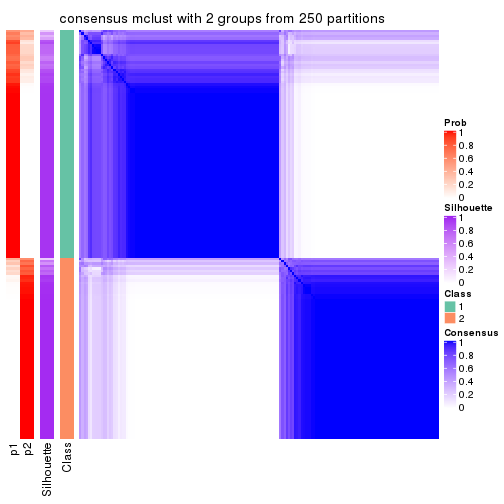</p>

</div>
<div id='tab-SD-mclust-consensus-heatmap-2'>
<pre><code class="r">consensus_heatmap(res, k = 3)
</code></pre>

<p>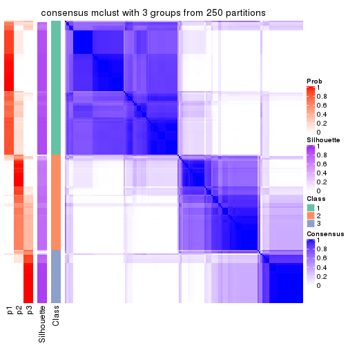</p>

</div>
<div id='tab-SD-mclust-consensus-heatmap-3'>
<pre><code class="r">consensus_heatmap(res, k = 4)
</code></pre>

<p>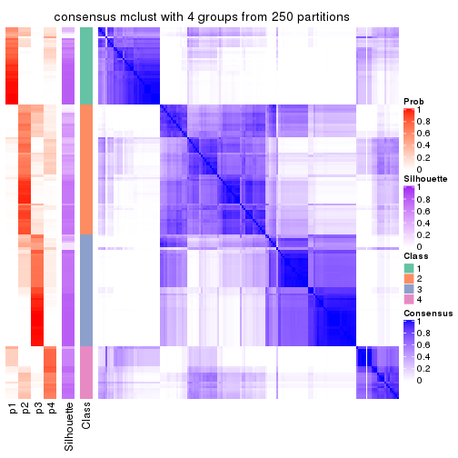</p>

</div>
<div id='tab-SD-mclust-consensus-heatmap-4'>
<pre><code class="r">consensus_heatmap(res, k = 5)
</code></pre>

<p>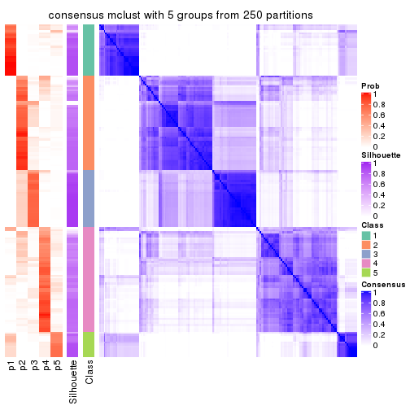</p>

</div>
<div id='tab-SD-mclust-consensus-heatmap-5'>
<pre><code class="r">consensus_heatmap(res, k = 6)
</code></pre>

<p>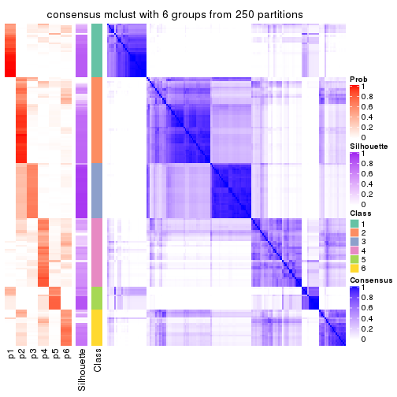</p>

</div>
</div>

Heatmaps for the membership of samples in all partitions to see how consistent they are:


<script>
$( function() {
	$( '#tabs-SD-mclust-membership-heatmap' ).tabs();
} );
</script>
<div id='tabs-SD-mclust-membership-heatmap'>
<ul>
<li><a href='#tab-SD-mclust-membership-heatmap-1'>k = 2</a></li>
<li><a href='#tab-SD-mclust-membership-heatmap-2'>k = 3</a></li>
<li><a href='#tab-SD-mclust-membership-heatmap-3'>k = 4</a></li>
<li><a href='#tab-SD-mclust-membership-heatmap-4'>k = 5</a></li>
<li><a href='#tab-SD-mclust-membership-heatmap-5'>k = 6</a></li>
</ul>
<div id='tab-SD-mclust-membership-heatmap-1'>
<pre><code class="r">membership_heatmap(res, k = 2)
</code></pre>

<p>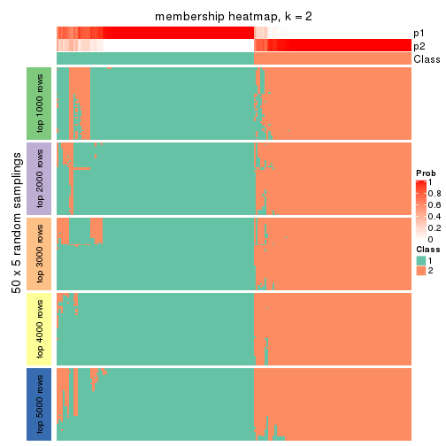</p>

</div>
<div id='tab-SD-mclust-membership-heatmap-2'>
<pre><code class="r">membership_heatmap(res, k = 3)
</code></pre>

<p>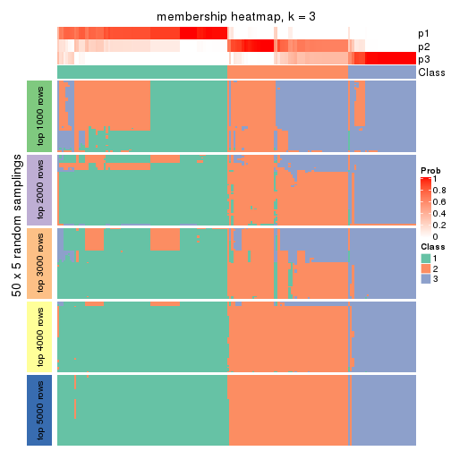</p>

</div>
<div id='tab-SD-mclust-membership-heatmap-3'>
<pre><code class="r">membership_heatmap(res, k = 4)
</code></pre>

<p>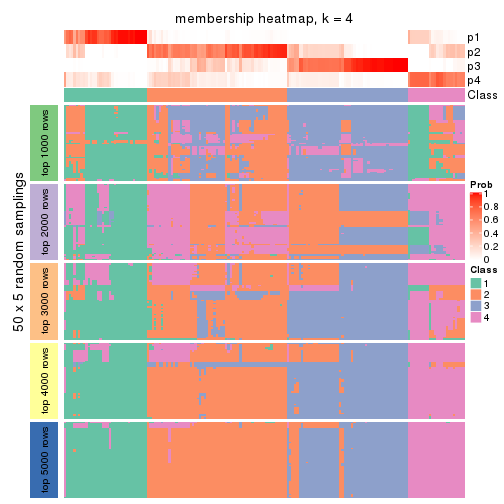</p>

</div>
<div id='tab-SD-mclust-membership-heatmap-4'>
<pre><code class="r">membership_heatmap(res, k = 5)
</code></pre>

<p>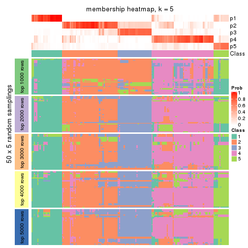</p>

</div>
<div id='tab-SD-mclust-membership-heatmap-5'>
<pre><code class="r">membership_heatmap(res, k = 6)
</code></pre>

<p>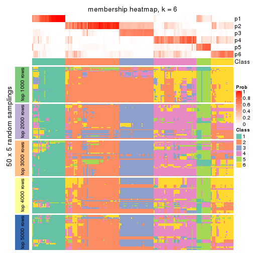</p>

</div>
</div>

As soon as we have had the classes for columns, we can look for signatures
which are significantly different between classes which can be candidate marks
for certain classes. Following are the heatmaps for signatures.


Signature heatmaps where rows are scaled:


<script>
$( function() {
	$( '#tabs-SD-mclust-get-signatures' ).tabs();
} );
</script>
<div id='tabs-SD-mclust-get-signatures'>
<ul>
<li><a href='#tab-SD-mclust-get-signatures-1'>k = 2</a></li>
<li><a href='#tab-SD-mclust-get-signatures-2'>k = 3</a></li>
<li><a href='#tab-SD-mclust-get-signatures-3'>k = 4</a></li>
<li><a href='#tab-SD-mclust-get-signatures-4'>k = 5</a></li>
<li><a href='#tab-SD-mclust-get-signatures-5'>k = 6</a></li>
</ul>
<div id='tab-SD-mclust-get-signatures-1'>
<pre><code class="r">get_signatures(res, k = 2)
</code></pre>

<p>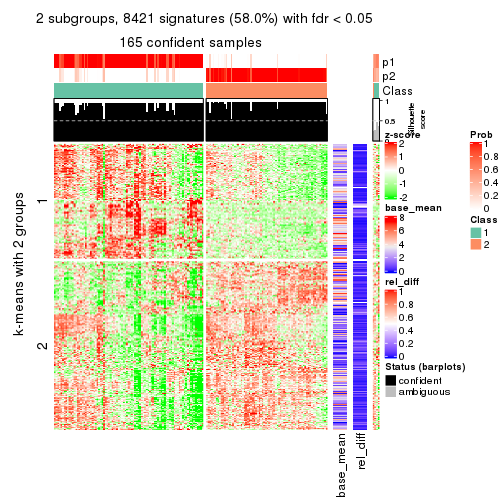</p>

</div>
<div id='tab-SD-mclust-get-signatures-2'>
<pre><code class="r">get_signatures(res, k = 3)
</code></pre>

<p>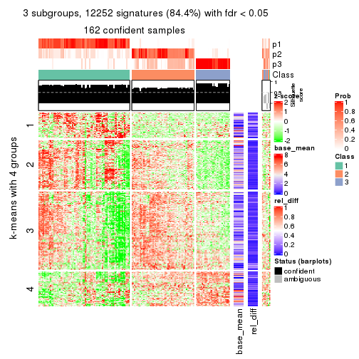</p>

</div>
<div id='tab-SD-mclust-get-signatures-3'>
<pre><code class="r">get_signatures(res, k = 4)
</code></pre>

<p>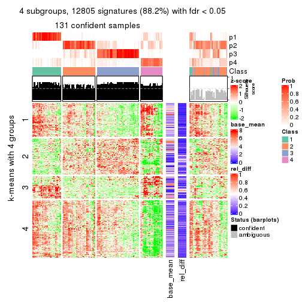</p>

</div>
<div id='tab-SD-mclust-get-signatures-4'>
<pre><code class="r">get_signatures(res, k = 5)
</code></pre>

<p>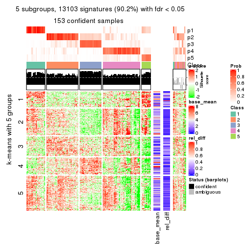</p>

</div>
<div id='tab-SD-mclust-get-signatures-5'>
<pre><code class="r">get_signatures(res, k = 6)
</code></pre>

<p>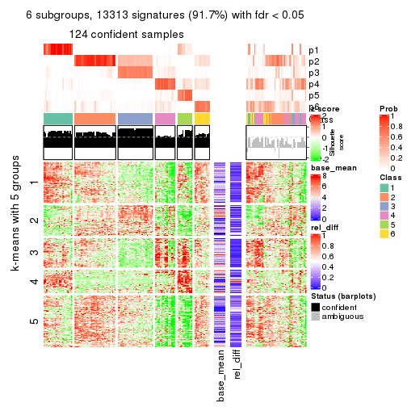</p>

</div>
</div>


Signature heatmaps where rows are not scaled:


<script>
$( function() {
	$( '#tabs-SD-mclust-get-signatures-no-scale' ).tabs();
} );
</script>
<div id='tabs-SD-mclust-get-signatures-no-scale'>
<ul>
<li><a href='#tab-SD-mclust-get-signatures-no-scale-1'>k = 2</a></li>
<li><a href='#tab-SD-mclust-get-signatures-no-scale-2'>k = 3</a></li>
<li><a href='#tab-SD-mclust-get-signatures-no-scale-3'>k = 4</a></li>
<li><a href='#tab-SD-mclust-get-signatures-no-scale-4'>k = 5</a></li>
<li><a href='#tab-SD-mclust-get-signatures-no-scale-5'>k = 6</a></li>
</ul>
<div id='tab-SD-mclust-get-signatures-no-scale-1'>
<pre><code class="r">get_signatures(res, k = 2, scale_rows = FALSE)
</code></pre>

<p>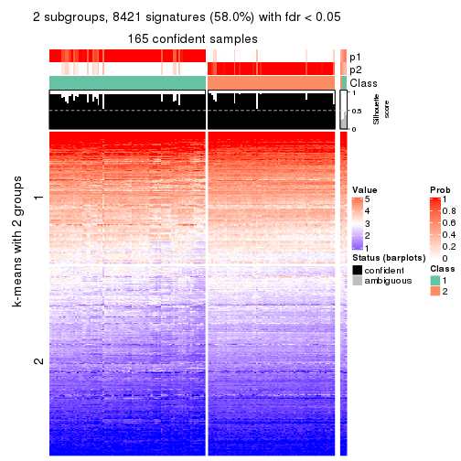</p>

</div>
<div id='tab-SD-mclust-get-signatures-no-scale-2'>
<pre><code class="r">get_signatures(res, k = 3, scale_rows = FALSE)
</code></pre>

<p>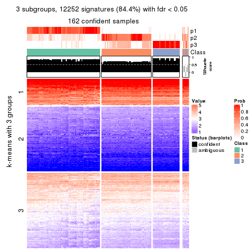</p>

</div>
<div id='tab-SD-mclust-get-signatures-no-scale-3'>
<pre><code class="r">get_signatures(res, k = 4, scale_rows = FALSE)
</code></pre>

<p>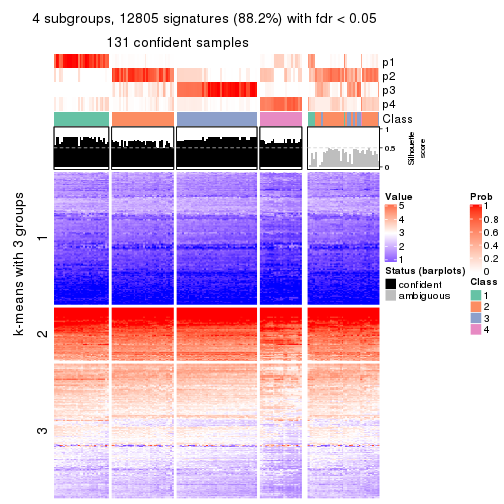</p>

</div>
<div id='tab-SD-mclust-get-signatures-no-scale-4'>
<pre><code class="r">get_signatures(res, k = 5, scale_rows = FALSE)
</code></pre>

<p>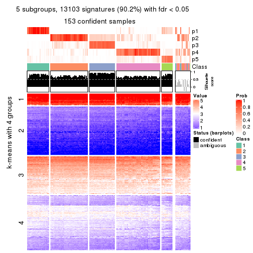</p>

</div>
<div id='tab-SD-mclust-get-signatures-no-scale-5'>
<pre><code class="r">get_signatures(res, k = 6, scale_rows = FALSE)
</code></pre>

<p>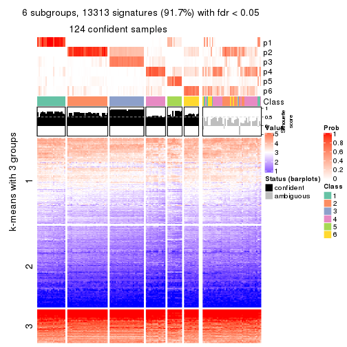</p>

</div>
</div>


Compare the overlap of signatures from different k:

```r
compare_signatures(res)
```

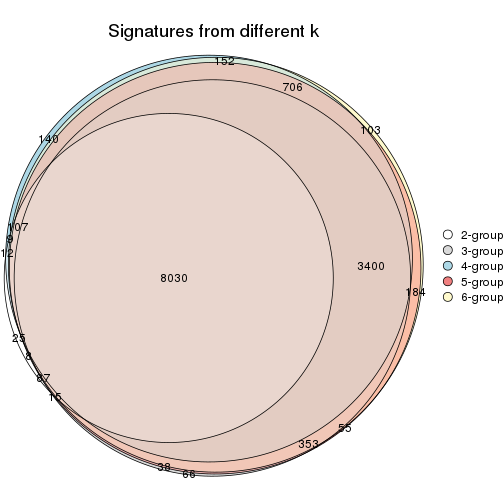

`get_signature()` returns a data frame invisibly. TO get the list of signatures, the function
call should be assigned to a variable explicitly. In following code, if `plot` argument is set
to `FALSE`, no heatmap is plotted while only the differential analysis is performed.

```r
# code only for demonstration
tb = get_signature(res, k = ..., plot = FALSE)
```

An example of the output of `tb` is:

```
#>   which_row         fdr    mean_1    mean_2 scaled_mean_1 scaled_mean_2 km
#> 1        38 0.042760348  8.373488  9.131774    -0.5533452     0.5164555  1
#> 2        40 0.018707592  7.106213  8.469186    -0.6173731     0.5762149  1
#> 3        55 0.019134737 10.221463 11.207825    -0.6159697     0.5749050  1
#> 4        59 0.006059896  5.921854  7.869574    -0.6899429     0.6439467  1
#> 5        60 0.018055526  8.928898 10.211722    -0.6204761     0.5791110  1
#> 6        98 0.009384629 15.714769 14.887706     0.6635654    -0.6193277  2
...
```

The columns in `tb` are:

1. `which_row`: row indices corresponding to the input matrix.
2. `fdr`: FDR for the differential test. 
3. `mean_x`: The mean value in group x.
4. `scaled_mean_x`: The mean value in group x after rows are scaled.
5. `km`: Row groups if k-means clustering is applied to rows.


UMAP plot which shows how samples are separated.


<script>
$( function() {
	$( '#tabs-SD-mclust-dimension-reduction' ).tabs();
} );
</script>
<div id='tabs-SD-mclust-dimension-reduction'>
<ul>
<li><a href='#tab-SD-mclust-dimension-reduction-1'>k = 2</a></li>
<li><a href='#tab-SD-mclust-dimension-reduction-2'>k = 3</a></li>
<li><a href='#tab-SD-mclust-dimension-reduction-3'>k = 4</a></li>
<li><a href='#tab-SD-mclust-dimension-reduction-4'>k = 5</a></li>
<li><a href='#tab-SD-mclust-dimension-reduction-5'>k = 6</a></li>
</ul>
<div id='tab-SD-mclust-dimension-reduction-1'>
<pre><code class="r">dimension_reduction(res, k = 2, method = &quot;UMAP&quot;)
</code></pre>

<p>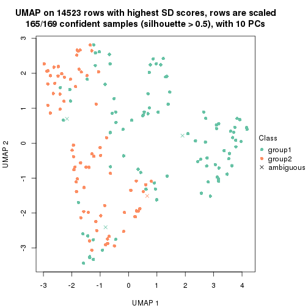</p>

</div>
<div id='tab-SD-mclust-dimension-reduction-2'>
<pre><code class="r">dimension_reduction(res, k = 3, method = &quot;UMAP&quot;)
</code></pre>

<p>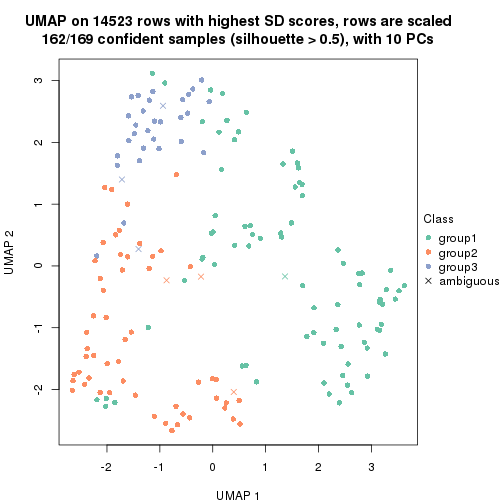</p>

</div>
<div id='tab-SD-mclust-dimension-reduction-3'>
<pre><code class="r">dimension_reduction(res, k = 4, method = &quot;UMAP&quot;)
</code></pre>

<p>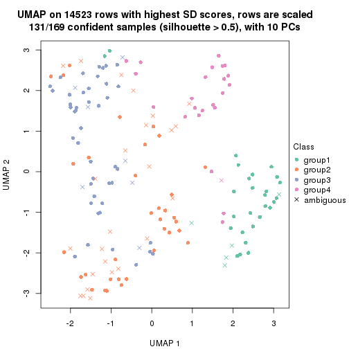</p>

</div>
<div id='tab-SD-mclust-dimension-reduction-4'>
<pre><code class="r">dimension_reduction(res, k = 5, method = &quot;UMAP&quot;)
</code></pre>

<p>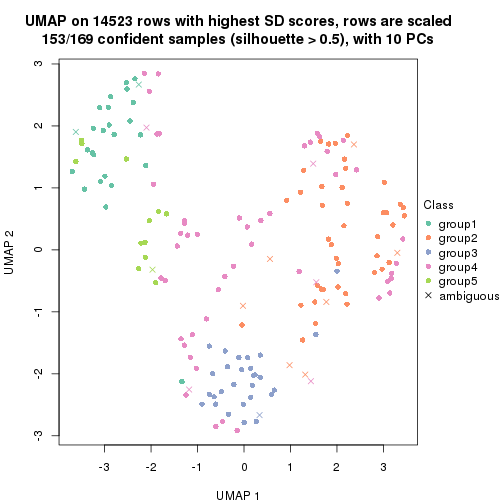</p>

</div>
<div id='tab-SD-mclust-dimension-reduction-5'>
<pre><code class="r">dimension_reduction(res, k = 6, method = &quot;UMAP&quot;)
</code></pre>

<p>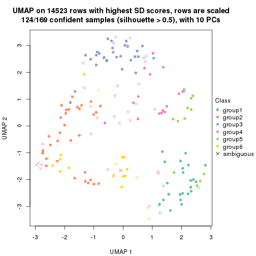</p>

</div>
</div>


Following heatmap shows how subgroups are split when increasing `k`:

```r
collect_classes(res)
```

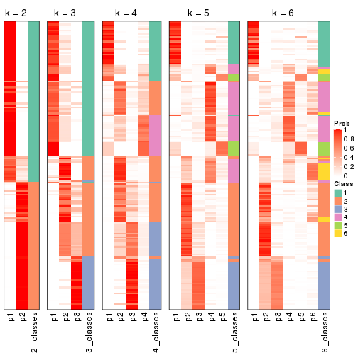


If matrix rows can be associated to genes, consider to use `GO_Enrichment(res,
...)` to perform function enrichment for the signature genes.


 

---------------------------------------------------


### SD:NMF


The object with results only for a single top-value method and a single partition method 
can be extracted as:

```r
res = res_list["SD", "NMF"]
# you can also extract it by
# res = res_list["SD:NMF"]
```

A summary of `res` and all the functions that can be applied to it:

```r
res
```

```
#> A 'ConsensusPartition' object with k = 2, 3, 4, 5, 6.
#>   On a matrix with 14523 rows and 169 columns.
#>   Top rows (1000, 2000, 3000, 4000, 5000) are extracted by 'SD' method.
#>   Subgroups are detected by 'NMF' method.
#>   Performed in total 1250 partitions by row resampling.
#>   Best k for subgroups seems to be 3.
#> 
#> Following methods can be applied to this 'ConsensusPartition' object:
#>  [1] "cola_report"             "collect_classes"         "collect_plots"          
#>  [4] "collect_stats"           "colnames"                "compare_signatures"     
#>  [7] "consensus_heatmap"       "dimension_reduction"     "functional_enrichment"  
#> [10] "get_anno_col"            "get_anno"                "get_classes"            
#> [13] "get_consensus"           "get_matrix"              "get_membership"         
#> [16] "get_param"               "get_signatures"          "get_stats"              
#> [19] "is_best_k"               "is_stable_k"             "membership_heatmap"     
#> [22] "ncol"                    "nrow"                    "plot_ecdf"              
#> [25] "rownames"                "select_partition_number" "show"                   
#> [28] "suggest_best_k"          "test_to_known_factors"
```

`collect_plots()` function collects all the plots made from `res` for all `k` (number of partitions)
into one single page to provide an easy and fast comparison between different `k`.

```r
collect_plots(res)
```

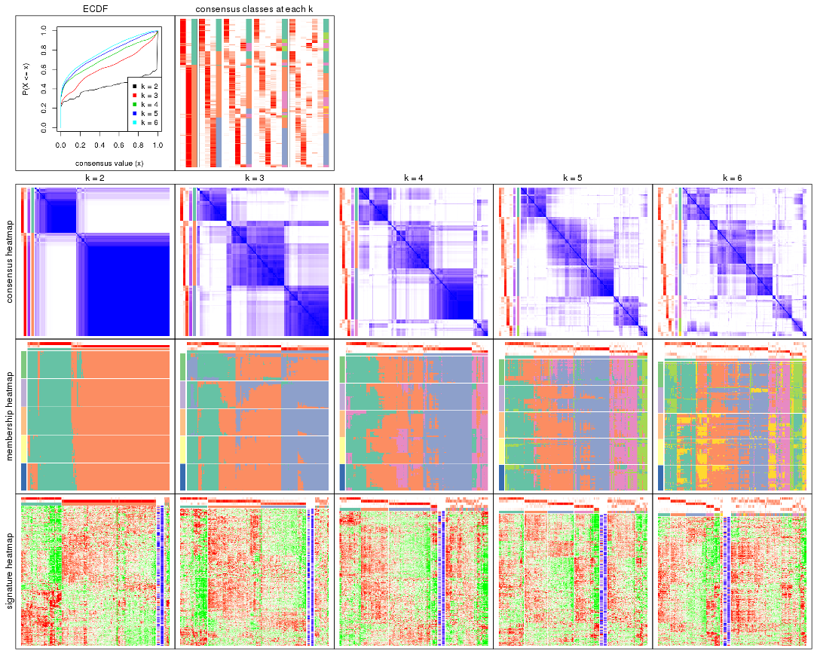

The plots are:

- The first row: a plot of the ECDF (Empirical cumulative distribution
  function) curves of the consensus matrix for each `k` and the heatmap of
  predicted classes for each `k`.
- The second row: heatmaps of the consensus matrix for each `k`.
- The third row: heatmaps of the membership matrix for each `k`.
- The fouth row: heatmaps of the signatures for each `k`.

All the plots in panels can be made by individual functions and they are
plotted later in this section.

`select_partition_number()` produces several plots showing different
statistics for choosing "optimized" `k`. There are following statistics:

- ECDF curves of the consensus matrix for each `k`;
- 1-PAC. [The PAC
  score](https://en.wikipedia.org/wiki/Consensus_clustering#Over-interpretation_potential_of_consensus_clustering)
  measures the proportion of the ambiguous subgrouping.
- Mean silhouette score.
- Concordance. The mean probability of fiting the consensus class ids in all
  partitions.
- Area increased. Denote $A_k$ as the area under the ECDF curve for current
  `k`, the area increased is defined as $A_k - A_{k-1}$.
- Rand index. The percent of pairs of samples that are both in a same cluster
  or both are not in a same cluster in the partition of k and k-1.
- Jaccard index. The ratio of pairs of samples are both in a same cluster in
  the partition of k and k-1 and the pairs of samples are both in a same
  cluster in the partition k or k-1.

The detailed explanations of these statistics can be found in [the cola
vignette](http://bioconductor.org/packages/devel/bioc/vignettes/cola/inst/doc/cola.html#toc_13).

Generally speaking, lower PAC score, higher mean silhouette score or higher
concordance corresponds to better partition. Rand index and Jaccard index
measure how similar the current partition is compared to partition with `k-1`.
If they are too similar, we won't accept `k` is better than `k-1`.

```r
select_partition_number(res)
```

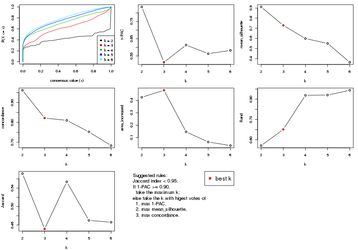

The numeric values for all these statistics can be obtained by `get_stats()`.

```r
get_stats(res)
```

```
#>   k 1-PAC mean_silhouette concordance area_increased  Rand Jaccard
#> 2 2 0.834           0.911       0.961         0.4247 0.571   0.571
#> 3 3 0.514           0.729       0.822         0.4812 0.651   0.451
#> 4 4 0.613           0.598       0.810         0.1463 0.819   0.554
#> 5 5 0.563           0.550       0.752         0.0645 0.820   0.470
#> 6 6 0.582           0.364       0.684         0.0354 0.843   0.466
```

`suggest_best_k()` suggests the best $k$ based on these statistics. The rules are as follows:

- All $k$ with Jaccard index larger than 0.95 are removed because the increase of
  the partition number does not provides enough extra information. If all $k$ are removed,
  the best $k$ is assigned by `NA`.
- For $k$ with 1-PAC larger than 0.9, the maximal $k$ is taken as the "best k". Other $k$ is called "optional k".
- If it does not fit the second rule. The $k$ with the highest vote of highest
  1-PAC, mean silhouette and concordance is taken as the "best k".

```r
suggest_best_k(res)
```

```
#> [1] 3
```


Following shows the table of the partitions (You need to click the **show/hide
code output** link to see it). The membership matrix (columns with name `p*`)
is inferred by
[`clue::cl_consensus()`](https://www.rdocumentation.org/link/cl_consensus?package=clue)
function with the `SE` method. Basically the value in the membership matrix
represents the probability to belong to a certain group. The finall class
label for an item is determined with the group with highest probability it
belongs to.

In `get_classes()` function, the entropy is calculated from the membership
matrix and the silhouette score is calculated from the consensus matrix.


<script>
$( function() {
	$( '#tabs-SD-NMF-get-classes' ).tabs();
} );
</script>
<div id='tabs-SD-NMF-get-classes'>
<ul>
<li><a href='#tab-SD-NMF-get-classes-1'>k = 2</a></li>
<li><a href='#tab-SD-NMF-get-classes-2'>k = 3</a></li>
<li><a href='#tab-SD-NMF-get-classes-3'>k = 4</a></li>
<li><a href='#tab-SD-NMF-get-classes-4'>k = 5</a></li>
<li><a href='#tab-SD-NMF-get-classes-5'>k = 6</a></li>
</ul>

<div id='tab-SD-NMF-get-classes-1'>
<p><a id='tab-SD-NMF-get-classes-1-a' style='color:#0366d6' href='#'>show/hide code output</a></p>
<pre><code class="r">cbind(get_classes(res, k = 2), get_membership(res, k = 2))
</code></pre>

<pre><code>#&gt;            class entropy silhouette    p1    p2
#&gt; SRR2052702     2  0.0000     0.9729 0.000 1.000
#&gt; SRR2052701     2  0.0000     0.9729 0.000 1.000
#&gt; SRR2052700     2  0.7299     0.7369 0.204 0.796
#&gt; SRR2052699     2  0.5842     0.8178 0.140 0.860
#&gt; SRR2052698     2  0.0000     0.9729 0.000 1.000
#&gt; SRR2052708     1  0.0000     0.9246 1.000 0.000
#&gt; SRR2052749     1  0.3733     0.8850 0.928 0.072
#&gt; SRR2052786     2  0.0000     0.9729 0.000 1.000
#&gt; SRR2052825     1  0.7219     0.7471 0.800 0.200
#&gt; SRR2052824     1  0.9815     0.3102 0.580 0.420
#&gt; SRR2052823     2  0.0000     0.9729 0.000 1.000
#&gt; SRR2052822     2  0.0000     0.9729 0.000 1.000
#&gt; SRR2052821     2  0.0000     0.9729 0.000 1.000
#&gt; SRR2052820     2  0.3584     0.9061 0.068 0.932
#&gt; SRR2052819     2  0.3114     0.9194 0.056 0.944
#&gt; SRR2052818     2  0.0000     0.9729 0.000 1.000
#&gt; SRR2052817     2  0.0000     0.9729 0.000 1.000
#&gt; SRR2052816     2  0.0376     0.9694 0.004 0.996
#&gt; SRR2052815     2  0.9970     0.0708 0.468 0.532
#&gt; SRR2052814     2  0.0000     0.9729 0.000 1.000
#&gt; SRR2052813     2  0.0000     0.9729 0.000 1.000
#&gt; SRR2052812     2  0.0000     0.9729 0.000 1.000
#&gt; SRR2052811     2  0.0000     0.9729 0.000 1.000
#&gt; SRR2052810     2  0.6247     0.7986 0.156 0.844
#&gt; SRR2052809     2  0.0000     0.9729 0.000 1.000
#&gt; SRR2052808     2  0.0000     0.9729 0.000 1.000
#&gt; SRR2052807     1  0.0000     0.9246 1.000 0.000
#&gt; SRR2052806     1  0.0000     0.9246 1.000 0.000
#&gt; SRR2052805     1  0.0000     0.9246 1.000 0.000
#&gt; SRR2052804     1  0.0938     0.9196 0.988 0.012
#&gt; SRR2052803     1  0.0000     0.9246 1.000 0.000
#&gt; SRR2052802     1  0.0000     0.9246 1.000 0.000
#&gt; SRR2052801     1  0.0000     0.9246 1.000 0.000
#&gt; SRR2052800     1  0.0000     0.9246 1.000 0.000
#&gt; SRR2052799     1  0.0000     0.9246 1.000 0.000
#&gt; SRR2052798     1  0.6148     0.8227 0.848 0.152
#&gt; SRR2052797     2  0.0000     0.9729 0.000 1.000
#&gt; SRR2052796     1  0.0000     0.9246 1.000 0.000
#&gt; SRR2052795     1  0.0000     0.9246 1.000 0.000
#&gt; SRR2052794     1  0.0000     0.9246 1.000 0.000
#&gt; SRR2052793     1  0.0000     0.9246 1.000 0.000
#&gt; SRR2052792     2  0.9866     0.2118 0.432 0.568
#&gt; SRR2052791     1  0.1843     0.9122 0.972 0.028
#&gt; SRR2052790     2  0.0000     0.9729 0.000 1.000
#&gt; SRR2052789     2  0.0000     0.9729 0.000 1.000
#&gt; SRR2052788     2  0.0000     0.9729 0.000 1.000
#&gt; SRR2052787     2  0.0000     0.9729 0.000 1.000
#&gt; SRR2052785     2  0.0000     0.9729 0.000 1.000
#&gt; SRR2052784     2  0.0000     0.9729 0.000 1.000
#&gt; SRR2052783     2  0.0000     0.9729 0.000 1.000
#&gt; SRR2052782     2  0.0000     0.9729 0.000 1.000
#&gt; SRR2052781     2  0.0000     0.9729 0.000 1.000
#&gt; SRR2052780     2  0.0000     0.9729 0.000 1.000
#&gt; SRR2052777     2  0.0000     0.9729 0.000 1.000
#&gt; SRR2052779     2  0.0000     0.9729 0.000 1.000
#&gt; SRR2052778     2  0.0000     0.9729 0.000 1.000
#&gt; SRR2052776     2  0.0000     0.9729 0.000 1.000
#&gt; SRR2052775     2  0.0000     0.9729 0.000 1.000
#&gt; SRR2052773     2  0.0000     0.9729 0.000 1.000
#&gt; SRR2052772     2  0.0000     0.9729 0.000 1.000
#&gt; SRR2052774     2  0.0000     0.9729 0.000 1.000
#&gt; SRR2052771     1  0.0000     0.9246 1.000 0.000
#&gt; SRR2052769     2  0.0000     0.9729 0.000 1.000
#&gt; SRR2052770     2  0.0000     0.9729 0.000 1.000
#&gt; SRR2052768     2  0.0000     0.9729 0.000 1.000
#&gt; SRR2052767     2  0.0000     0.9729 0.000 1.000
#&gt; SRR2052766     2  0.4022     0.8936 0.080 0.920
#&gt; SRR2052765     2  0.0000     0.9729 0.000 1.000
#&gt; SRR2052763     2  0.0000     0.9729 0.000 1.000
#&gt; SRR2052764     2  0.0000     0.9729 0.000 1.000
#&gt; SRR2052761     2  0.0000     0.9729 0.000 1.000
#&gt; SRR2052760     2  0.0000     0.9729 0.000 1.000
#&gt; SRR2052759     2  0.0000     0.9729 0.000 1.000
#&gt; SRR2052762     2  0.0000     0.9729 0.000 1.000
#&gt; SRR2052758     2  0.0000     0.9729 0.000 1.000
#&gt; SRR2052756     1  0.0000     0.9246 1.000 0.000
#&gt; SRR2052757     2  0.0000     0.9729 0.000 1.000
#&gt; SRR2052755     1  0.0376     0.9234 0.996 0.004
#&gt; SRR2052754     1  0.0000     0.9246 1.000 0.000
#&gt; SRR2052753     1  0.0000     0.9246 1.000 0.000
#&gt; SRR2052752     1  0.0000     0.9246 1.000 0.000
#&gt; SRR2052750     1  0.7219     0.7734 0.800 0.200
#&gt; SRR2052751     2  0.0000     0.9729 0.000 1.000
#&gt; SRR2052748     2  0.0000     0.9729 0.000 1.000
#&gt; SRR2052747     1  0.0000     0.9246 1.000 0.000
#&gt; SRR2052746     2  0.0000     0.9729 0.000 1.000
#&gt; SRR2052745     2  0.0000     0.9729 0.000 1.000
#&gt; SRR2052744     1  0.7299     0.7685 0.796 0.204
#&gt; SRR2052741     2  0.0000     0.9729 0.000 1.000
#&gt; SRR2052743     2  0.0000     0.9729 0.000 1.000
#&gt; SRR2052740     2  0.0000     0.9729 0.000 1.000
#&gt; SRR2052742     2  0.0000     0.9729 0.000 1.000
#&gt; SRR2052739     2  0.0000     0.9729 0.000 1.000
#&gt; SRR2052738     2  0.0000     0.9729 0.000 1.000
#&gt; SRR2052736     2  0.7139     0.7355 0.196 0.804
#&gt; SRR2052735     1  0.8713     0.6382 0.708 0.292
#&gt; SRR2052734     1  0.9358     0.5227 0.648 0.352
#&gt; SRR2052737     2  0.0000     0.9729 0.000 1.000
#&gt; SRR2052733     2  0.0000     0.9729 0.000 1.000
#&gt; SRR2052732     2  0.0000     0.9729 0.000 1.000
#&gt; SRR2052731     2  0.0000     0.9729 0.000 1.000
#&gt; SRR2052729     1  0.0000     0.9246 1.000 0.000
#&gt; SRR2052728     1  0.4161     0.8770 0.916 0.084
#&gt; SRR2052730     2  0.0000     0.9729 0.000 1.000
#&gt; SRR2052727     1  0.0376     0.9234 0.996 0.004
#&gt; SRR2052725     1  0.0672     0.9215 0.992 0.008
#&gt; SRR2052726     1  0.7745     0.7373 0.772 0.228
#&gt; SRR2052724     1  0.0000     0.9246 1.000 0.000
#&gt; SRR2052723     2  0.1633     0.9511 0.024 0.976
#&gt; SRR2052722     2  0.0000     0.9729 0.000 1.000
#&gt; SRR2052721     1  0.6048     0.8263 0.852 0.148
#&gt; SRR2052720     2  0.0000     0.9729 0.000 1.000
#&gt; SRR2052719     2  0.0000     0.9729 0.000 1.000
#&gt; SRR2052718     1  0.0938     0.9201 0.988 0.012
#&gt; SRR2052717     2  0.0000     0.9729 0.000 1.000
#&gt; SRR2052714     1  0.0000     0.9246 1.000 0.000
#&gt; SRR2052716     2  0.0000     0.9729 0.000 1.000
#&gt; SRR2052715     2  0.0000     0.9729 0.000 1.000
#&gt; SRR2052713     1  0.0000     0.9246 1.000 0.000
#&gt; SRR2052712     1  0.0000     0.9246 1.000 0.000
#&gt; SRR2052711     1  0.0938     0.9196 0.988 0.012
#&gt; SRR2052710     2  0.0000     0.9729 0.000 1.000
#&gt; SRR2052707     2  0.0000     0.9729 0.000 1.000
#&gt; SRR2052709     2  0.0000     0.9729 0.000 1.000
#&gt; SRR2052704     2  0.0000     0.9729 0.000 1.000
#&gt; SRR2052705     2  0.0000     0.9729 0.000 1.000
#&gt; SRR2052697     2  0.0000     0.9729 0.000 1.000
#&gt; SRR2052703     2  0.0000     0.9729 0.000 1.000
#&gt; SRR2052696     1  0.0000     0.9246 1.000 0.000
#&gt; SRR2052706     2  0.0000     0.9729 0.000 1.000
#&gt; SRR2052695     2  0.0000     0.9729 0.000 1.000
#&gt; SRR2052694     2  0.0000     0.9729 0.000 1.000
#&gt; SRR2052692     2  0.0000     0.9729 0.000 1.000
#&gt; SRR2052693     2  0.0000     0.9729 0.000 1.000
#&gt; SRR2052691     2  0.9661     0.2912 0.392 0.608
#&gt; SRR2052690     2  0.7219     0.7290 0.200 0.800
#&gt; SRR2052689     2  0.0000     0.9729 0.000 1.000
#&gt; SRR2052687     2  0.0000     0.9729 0.000 1.000
#&gt; SRR2052686     1  0.0000     0.9246 1.000 0.000
#&gt; SRR2052688     2  0.0000     0.9729 0.000 1.000
#&gt; SRR2052684     2  0.7453     0.7091 0.212 0.788
#&gt; SRR2052685     2  0.0000     0.9729 0.000 1.000
#&gt; SRR2052683     1  0.0000     0.9246 1.000 0.000
#&gt; SRR2052681     2  0.6887     0.7598 0.184 0.816
#&gt; SRR2052680     1  0.9954     0.1840 0.540 0.460
#&gt; SRR2052682     1  0.9552     0.4684 0.624 0.376
#&gt; SRR2052679     1  0.7056     0.7826 0.808 0.192
#&gt; SRR2052678     2  0.0000     0.9729 0.000 1.000
#&gt; SRR2052677     2  0.0000     0.9729 0.000 1.000
#&gt; SRR2052675     2  0.0000     0.9729 0.000 1.000
#&gt; SRR2052676     1  0.0000     0.9246 1.000 0.000
#&gt; SRR2052674     2  0.0000     0.9729 0.000 1.000
#&gt; SRR2052672     2  0.0000     0.9729 0.000 1.000
#&gt; SRR2052673     2  0.2948     0.9233 0.052 0.948
#&gt; SRR2052671     2  0.0000     0.9729 0.000 1.000
#&gt; SRR2052670     2  0.0000     0.9729 0.000 1.000
#&gt; SRR2052669     2  0.0000     0.9729 0.000 1.000
#&gt; SRR2052668     2  0.0000     0.9729 0.000 1.000
#&gt; SRR2052667     2  0.0000     0.9729 0.000 1.000
#&gt; SRR2052666     2  0.0000     0.9729 0.000 1.000
#&gt; SRR2052665     2  0.0000     0.9729 0.000 1.000
#&gt; SRR2052664     1  0.0000     0.9246 1.000 0.000
#&gt; SRR2052663     2  0.0000     0.9729 0.000 1.000
#&gt; SRR2052662     2  0.0000     0.9729 0.000 1.000
#&gt; SRR2052661     1  0.6973     0.7869 0.812 0.188
#&gt; SRR2052660     2  0.0000     0.9729 0.000 1.000
#&gt; SRR2052659     2  0.0000     0.9729 0.000 1.000
#&gt; SRR2052658     2  0.0000     0.9729 0.000 1.000
#&gt; SRR2052657     1  0.0000     0.9246 1.000 0.000
</code></pre>

<script>
$('#tab-SD-NMF-get-classes-1-a').parent().next().next().hide();
$('#tab-SD-NMF-get-classes-1-a').click(function(){
  $('#tab-SD-NMF-get-classes-1-a').parent().next().next().toggle();
  return(false);
});
</script>
</div>

<div id='tab-SD-NMF-get-classes-2'>
<p><a id='tab-SD-NMF-get-classes-2-a' style='color:#0366d6' href='#'>show/hide code output</a></p>
<pre><code class="r">cbind(get_classes(res, k = 3), get_membership(res, k = 3))
</code></pre>

<pre><code>#&gt;            class entropy silhouette    p1    p2    p3
#&gt; SRR2052702     2  0.0592    0.80792 0.000 0.988 0.012
#&gt; SRR2052701     2  0.0424    0.80798 0.000 0.992 0.008
#&gt; SRR2052700     2  0.4477    0.78808 0.068 0.864 0.068
#&gt; SRR2052699     2  0.3482    0.72143 0.128 0.872 0.000
#&gt; SRR2052698     3  0.3752    0.90444 0.000 0.144 0.856
#&gt; SRR2052708     1  0.0592    0.84657 0.988 0.012 0.000
#&gt; SRR2052749     1  0.0747    0.84537 0.984 0.016 0.000
#&gt; SRR2052786     2  0.2959    0.77392 0.000 0.900 0.100
#&gt; SRR2052825     1  0.4887    0.76850 0.772 0.000 0.228
#&gt; SRR2052824     1  0.6345    0.53296 0.596 0.004 0.400
#&gt; SRR2052823     2  0.0424    0.80798 0.000 0.992 0.008
#&gt; SRR2052822     3  0.4974    0.83754 0.000 0.236 0.764
#&gt; SRR2052821     2  0.6302   -0.15990 0.000 0.520 0.480
#&gt; SRR2052820     3  0.5505    0.83834 0.088 0.096 0.816
#&gt; SRR2052819     3  0.5276    0.87542 0.052 0.128 0.820
#&gt; SRR2052818     2  0.2066    0.79715 0.000 0.940 0.060
#&gt; SRR2052817     3  0.3482    0.89993 0.000 0.128 0.872
#&gt; SRR2052816     2  0.1482    0.80935 0.012 0.968 0.020
#&gt; SRR2052815     1  0.6410    0.49891 0.576 0.004 0.420
#&gt; SRR2052814     2  0.4702    0.65246 0.000 0.788 0.212
#&gt; SRR2052813     2  0.4702    0.65265 0.000 0.788 0.212
#&gt; SRR2052812     2  0.1643    0.80239 0.000 0.956 0.044
#&gt; SRR2052811     2  0.0747    0.80790 0.000 0.984 0.016
#&gt; SRR2052810     2  0.5378    0.61749 0.008 0.756 0.236
#&gt; SRR2052809     3  0.5363    0.77298 0.000 0.276 0.724
#&gt; SRR2052808     2  0.6309   -0.20097 0.000 0.504 0.496
#&gt; SRR2052807     1  0.4121    0.80410 0.832 0.000 0.168
#&gt; SRR2052806     1  0.0592    0.84666 0.988 0.012 0.000
#&gt; SRR2052805     1  0.0000    0.84827 1.000 0.000 0.000
#&gt; SRR2052804     1  0.5591    0.68938 0.696 0.000 0.304
#&gt; SRR2052803     1  0.0237    0.84777 0.996 0.004 0.000
#&gt; SRR2052802     1  0.4974    0.75762 0.764 0.000 0.236
#&gt; SRR2052801     1  0.2711    0.83154 0.912 0.000 0.088
#&gt; SRR2052800     1  0.4887    0.76457 0.772 0.000 0.228
#&gt; SRR2052799     1  0.3619    0.81623 0.864 0.000 0.136
#&gt; SRR2052798     1  0.4235    0.69817 0.824 0.176 0.000
#&gt; SRR2052797     2  0.6215    0.06791 0.000 0.572 0.428
#&gt; SRR2052796     1  0.1031    0.84647 0.976 0.000 0.024
#&gt; SRR2052795     1  0.0592    0.84657 0.988 0.012 0.000
#&gt; SRR2052794     1  0.3941    0.80921 0.844 0.000 0.156
#&gt; SRR2052793     1  0.0237    0.84845 0.996 0.000 0.004
#&gt; SRR2052792     3  0.2796    0.68128 0.092 0.000 0.908
#&gt; SRR2052791     1  0.4235    0.80282 0.824 0.000 0.176
#&gt; SRR2052790     3  0.4931    0.84372 0.000 0.232 0.768
#&gt; SRR2052789     3  0.4002    0.90283 0.000 0.160 0.840
#&gt; SRR2052788     3  0.3816    0.90492 0.000 0.148 0.852
#&gt; SRR2052787     2  0.3941    0.72399 0.000 0.844 0.156
#&gt; SRR2052785     3  0.3816    0.90492 0.000 0.148 0.852
#&gt; SRR2052784     3  0.5810    0.68604 0.000 0.336 0.664
#&gt; SRR2052783     3  0.6026    0.58790 0.000 0.376 0.624
#&gt; SRR2052782     2  0.6307   -0.19584 0.000 0.512 0.488
#&gt; SRR2052781     3  0.6095    0.54512 0.000 0.392 0.608
#&gt; SRR2052780     3  0.4291    0.89232 0.000 0.180 0.820
#&gt; SRR2052777     2  0.4702    0.65341 0.000 0.788 0.212
#&gt; SRR2052779     3  0.6260    0.40304 0.000 0.448 0.552
#&gt; SRR2052778     3  0.1753    0.84513 0.000 0.048 0.952
#&gt; SRR2052776     3  0.4605    0.87293 0.000 0.204 0.796
#&gt; SRR2052775     3  0.3879    0.90469 0.000 0.152 0.848
#&gt; SRR2052773     3  0.4605    0.87251 0.000 0.204 0.796
#&gt; SRR2052772     3  0.3816    0.90492 0.000 0.148 0.852
#&gt; SRR2052774     3  0.4178    0.89738 0.000 0.172 0.828
#&gt; SRR2052771     1  0.1031    0.84649 0.976 0.000 0.024
#&gt; SRR2052769     3  0.3941    0.90408 0.000 0.156 0.844
#&gt; SRR2052770     3  0.2959    0.88414 0.000 0.100 0.900
#&gt; SRR2052768     2  0.1643    0.80239 0.000 0.956 0.044
#&gt; SRR2052767     2  0.0747    0.80790 0.000 0.984 0.016
#&gt; SRR2052766     3  0.1289    0.76097 0.032 0.000 0.968
#&gt; SRR2052765     2  0.3752    0.73657 0.000 0.856 0.144
#&gt; SRR2052763     3  0.4178    0.89782 0.000 0.172 0.828
#&gt; SRR2052764     2  0.0424    0.80798 0.000 0.992 0.008
#&gt; SRR2052761     3  0.4291    0.89299 0.000 0.180 0.820
#&gt; SRR2052760     2  0.1289    0.80588 0.000 0.968 0.032
#&gt; SRR2052759     3  0.3752    0.90432 0.000 0.144 0.856
#&gt; SRR2052762     2  0.4346    0.68267 0.000 0.816 0.184
#&gt; SRR2052758     3  0.4291    0.89272 0.000 0.180 0.820
#&gt; SRR2052756     1  0.2356    0.81722 0.928 0.072 0.000
#&gt; SRR2052757     3  0.4002    0.90322 0.000 0.160 0.840
#&gt; SRR2052755     2  0.5327    0.57427 0.272 0.728 0.000
#&gt; SRR2052754     1  0.0424    0.84816 0.992 0.000 0.008
#&gt; SRR2052753     2  0.5529    0.53251 0.296 0.704 0.000
#&gt; SRR2052752     1  0.0000    0.84827 1.000 0.000 0.000
#&gt; SRR2052750     2  0.6140    0.35015 0.404 0.596 0.000
#&gt; SRR2052751     2  0.6252   -0.01804 0.000 0.556 0.444
#&gt; SRR2052748     3  0.0237    0.79080 0.004 0.000 0.996
#&gt; SRR2052747     1  0.1964    0.82245 0.944 0.056 0.000
#&gt; SRR2052746     3  0.3816    0.90492 0.000 0.148 0.852
#&gt; SRR2052745     3  0.3752    0.90432 0.000 0.144 0.856
#&gt; SRR2052744     2  0.5529    0.54708 0.296 0.704 0.000
#&gt; SRR2052741     2  0.0000    0.80642 0.000 1.000 0.000
#&gt; SRR2052743     2  0.0892    0.80743 0.000 0.980 0.020
#&gt; SRR2052740     2  0.0000    0.80642 0.000 1.000 0.000
#&gt; SRR2052742     2  0.4235    0.69777 0.000 0.824 0.176
#&gt; SRR2052739     2  0.2356    0.79117 0.000 0.928 0.072
#&gt; SRR2052738     3  0.2356    0.86411 0.000 0.072 0.928
#&gt; SRR2052736     2  0.4002    0.68873 0.160 0.840 0.000
#&gt; SRR2052735     2  0.4796    0.63684 0.220 0.780 0.000
#&gt; SRR2052734     2  0.4291    0.67194 0.180 0.820 0.000
#&gt; SRR2052737     2  0.4796    0.64069 0.000 0.780 0.220
#&gt; SRR2052733     3  0.3482    0.89993 0.000 0.128 0.872
#&gt; SRR2052732     2  0.0424    0.80798 0.000 0.992 0.008
#&gt; SRR2052731     3  0.4002    0.90287 0.000 0.160 0.840
#&gt; SRR2052729     1  0.6299   -0.00909 0.524 0.476 0.000
#&gt; SRR2052728     2  0.4887    0.62505 0.228 0.772 0.000
#&gt; SRR2052730     3  0.0592    0.78299 0.012 0.000 0.988
#&gt; SRR2052727     1  0.6192    0.18018 0.580 0.420 0.000
#&gt; SRR2052725     2  0.4235    0.67540 0.176 0.824 0.000
#&gt; SRR2052726     2  0.5098    0.60931 0.248 0.752 0.000
#&gt; SRR2052724     1  0.0747    0.84548 0.984 0.016 0.000
#&gt; SRR2052723     3  0.1411    0.75567 0.036 0.000 0.964
#&gt; SRR2052722     3  0.3412    0.89817 0.000 0.124 0.876
#&gt; SRR2052721     2  0.5835    0.47851 0.340 0.660 0.000
#&gt; SRR2052720     2  0.2625    0.78417 0.000 0.916 0.084
#&gt; SRR2052719     2  0.1289    0.80573 0.000 0.968 0.032
#&gt; SRR2052718     2  0.4887    0.62531 0.228 0.772 0.000
#&gt; SRR2052717     2  0.1860    0.80008 0.000 0.948 0.052
#&gt; SRR2052714     1  0.0475    0.84837 0.992 0.004 0.004
#&gt; SRR2052716     3  0.3412    0.89803 0.000 0.124 0.876
#&gt; SRR2052715     3  0.3816    0.90492 0.000 0.148 0.852
#&gt; SRR2052713     1  0.0747    0.84537 0.984 0.016 0.000
#&gt; SRR2052712     1  0.4452    0.78999 0.808 0.000 0.192
#&gt; SRR2052711     1  0.6168    0.32071 0.588 0.412 0.000
#&gt; SRR2052710     2  0.5968    0.45822 0.000 0.636 0.364
#&gt; SRR2052707     3  0.3482    0.89993 0.000 0.128 0.872
#&gt; SRR2052709     3  0.4002    0.90283 0.000 0.160 0.840
#&gt; SRR2052704     3  0.0892    0.81713 0.000 0.020 0.980
#&gt; SRR2052705     2  0.1163    0.80634 0.000 0.972 0.028
#&gt; SRR2052697     2  0.0237    0.80481 0.004 0.996 0.000
#&gt; SRR2052703     3  0.3879    0.90469 0.000 0.152 0.848
#&gt; SRR2052696     1  0.2711    0.79755 0.912 0.088 0.000
#&gt; SRR2052706     2  0.6267   -0.03652 0.000 0.548 0.452
#&gt; SRR2052695     2  0.3619    0.74360 0.000 0.864 0.136
#&gt; SRR2052694     2  0.2711    0.78174 0.000 0.912 0.088
#&gt; SRR2052692     3  0.4178    0.89765 0.000 0.172 0.828
#&gt; SRR2052693     3  0.3879    0.90469 0.000 0.152 0.848
#&gt; SRR2052691     2  0.4121    0.68274 0.168 0.832 0.000
#&gt; SRR2052690     2  0.4121    0.68274 0.168 0.832 0.000
#&gt; SRR2052689     3  0.0000    0.79527 0.000 0.000 1.000
#&gt; SRR2052687     3  0.3192    0.88884 0.000 0.112 0.888
#&gt; SRR2052686     2  0.5291    0.57174 0.268 0.732 0.000
#&gt; SRR2052688     2  0.3116    0.76789 0.000 0.892 0.108
#&gt; SRR2052684     3  0.2261    0.71581 0.068 0.000 0.932
#&gt; SRR2052685     2  0.0747    0.79932 0.016 0.984 0.000
#&gt; SRR2052683     1  0.0592    0.84657 0.988 0.012 0.000
#&gt; SRR2052681     2  0.4682    0.74808 0.004 0.804 0.192
#&gt; SRR2052680     1  0.6140    0.53782 0.596 0.000 0.404
#&gt; SRR2052682     2  0.4235    0.67540 0.176 0.824 0.000
#&gt; SRR2052679     2  0.6252    0.24845 0.444 0.556 0.000
#&gt; SRR2052678     3  0.4121    0.89945 0.000 0.168 0.832
#&gt; SRR2052677     3  0.6309    0.23260 0.000 0.496 0.504
#&gt; SRR2052675     2  0.0475    0.80663 0.004 0.992 0.004
#&gt; SRR2052676     1  0.6308   -0.08773 0.508 0.492 0.000
#&gt; SRR2052674     2  0.4605    0.66615 0.000 0.796 0.204
#&gt; SRR2052672     3  0.3816    0.90492 0.000 0.148 0.852
#&gt; SRR2052673     2  0.3340    0.72436 0.120 0.880 0.000
#&gt; SRR2052671     2  0.0747    0.80790 0.000 0.984 0.016
#&gt; SRR2052670     3  0.4062    0.90136 0.000 0.164 0.836
#&gt; SRR2052669     2  0.2959    0.77382 0.000 0.900 0.100
#&gt; SRR2052668     2  0.0424    0.80798 0.000 0.992 0.008
#&gt; SRR2052667     2  0.2261    0.79378 0.000 0.932 0.068
#&gt; SRR2052666     3  0.4605    0.87309 0.000 0.204 0.796
#&gt; SRR2052665     2  0.1753    0.80155 0.000 0.952 0.048
#&gt; SRR2052664     1  0.0661    0.84849 0.988 0.004 0.008
#&gt; SRR2052663     2  0.0747    0.79893 0.016 0.984 0.000
#&gt; SRR2052662     2  0.2066    0.79654 0.000 0.940 0.060
#&gt; SRR2052661     2  0.4291    0.67194 0.180 0.820 0.000
#&gt; SRR2052660     3  0.3879    0.90469 0.000 0.152 0.848
#&gt; SRR2052659     3  0.3412    0.89845 0.000 0.124 0.876
#&gt; SRR2052658     2  0.1031    0.80697 0.000 0.976 0.024
#&gt; SRR2052657     1  0.0592    0.84666 0.988 0.012 0.000
</code></pre>

<script>
$('#tab-SD-NMF-get-classes-2-a').parent().next().next().hide();
$('#tab-SD-NMF-get-classes-2-a').click(function(){
  $('#tab-SD-NMF-get-classes-2-a').parent().next().next().toggle();
  return(false);
});
</script>
</div>

<div id='tab-SD-NMF-get-classes-3'>
<p><a id='tab-SD-NMF-get-classes-3-a' style='color:#0366d6' href='#'>show/hide code output</a></p>
<pre><code class="r">cbind(get_classes(res, k = 4), get_membership(res, k = 4))
</code></pre>

<pre><code>#&gt;            class entropy silhouette    p1    p2    p3    p4
#&gt; SRR2052702     2  0.1716     0.7040 0.000 0.936 0.000 0.064
#&gt; SRR2052701     2  0.0000     0.7160 0.000 1.000 0.000 0.000
#&gt; SRR2052700     4  0.7484     0.0513 0.140 0.388 0.008 0.464
#&gt; SRR2052699     1  0.5685     0.3407 0.516 0.460 0.024 0.000
#&gt; SRR2052698     3  0.6618     0.4598 0.000 0.124 0.604 0.272
#&gt; SRR2052708     1  0.0707     0.6846 0.980 0.000 0.000 0.020
#&gt; SRR2052749     1  0.0592     0.6929 0.984 0.016 0.000 0.000
#&gt; SRR2052786     2  0.1677     0.7161 0.000 0.948 0.012 0.040
#&gt; SRR2052825     4  0.0336     0.6497 0.000 0.008 0.000 0.992
#&gt; SRR2052824     4  0.0336     0.6497 0.000 0.008 0.000 0.992
#&gt; SRR2052823     2  0.0000     0.7160 0.000 1.000 0.000 0.000
#&gt; SRR2052822     3  0.4855     0.4686 0.000 0.352 0.644 0.004
#&gt; SRR2052821     3  0.4134     0.6501 0.000 0.260 0.740 0.000
#&gt; SRR2052820     3  0.1637     0.8337 0.060 0.000 0.940 0.000
#&gt; SRR2052819     4  0.4228     0.5461 0.000 0.008 0.232 0.760
#&gt; SRR2052818     2  0.4933     0.2579 0.000 0.568 0.000 0.432
#&gt; SRR2052817     3  0.0376     0.8733 0.000 0.004 0.992 0.004
#&gt; SRR2052816     2  0.7100     0.4896 0.124 0.628 0.028 0.220
#&gt; SRR2052815     4  0.1022     0.6495 0.000 0.032 0.000 0.968
#&gt; SRR2052814     2  0.5989     0.2939 0.000 0.556 0.044 0.400
#&gt; SRR2052813     2  0.4925     0.2095 0.000 0.572 0.428 0.000
#&gt; SRR2052812     2  0.1004     0.7211 0.000 0.972 0.024 0.004
#&gt; SRR2052811     2  0.1302     0.7116 0.000 0.956 0.000 0.044
#&gt; SRR2052810     4  0.4888     0.1255 0.000 0.412 0.000 0.588
#&gt; SRR2052809     2  0.7563     0.1317 0.000 0.440 0.364 0.196
#&gt; SRR2052808     2  0.6483     0.2564 0.000 0.532 0.076 0.392
#&gt; SRR2052807     4  0.4843     0.3125 0.396 0.000 0.000 0.604
#&gt; SRR2052806     1  0.0592     0.6866 0.984 0.000 0.000 0.016
#&gt; SRR2052805     1  0.0707     0.6848 0.980 0.000 0.000 0.020
#&gt; SRR2052804     4  0.6299     0.3824 0.320 0.000 0.080 0.600
#&gt; SRR2052803     1  0.0188     0.6899 0.996 0.000 0.000 0.004
#&gt; SRR2052802     4  0.5231     0.3290 0.384 0.000 0.012 0.604
#&gt; SRR2052801     1  0.4713     0.2053 0.640 0.000 0.000 0.360
#&gt; SRR2052800     4  0.5024     0.3636 0.360 0.000 0.008 0.632
#&gt; SRR2052799     4  0.4996     0.1398 0.484 0.000 0.000 0.516
#&gt; SRR2052798     1  0.1792     0.6889 0.932 0.068 0.000 0.000
#&gt; SRR2052797     3  0.4730     0.4550 0.000 0.364 0.636 0.000
#&gt; SRR2052796     1  0.4250     0.3754 0.724 0.000 0.000 0.276
#&gt; SRR2052795     1  0.0000     0.6906 1.000 0.000 0.000 0.000
#&gt; SRR2052794     1  0.4998    -0.1375 0.512 0.000 0.000 0.488
#&gt; SRR2052793     1  0.1211     0.6722 0.960 0.000 0.000 0.040
#&gt; SRR2052792     3  0.5247     0.6115 0.100 0.000 0.752 0.148
#&gt; SRR2052791     1  0.5416     0.3231 0.692 0.000 0.260 0.048
#&gt; SRR2052790     3  0.0817     0.8660 0.000 0.024 0.976 0.000
#&gt; SRR2052789     3  0.0000     0.8738 0.000 0.000 1.000 0.000
#&gt; SRR2052788     3  0.0000     0.8738 0.000 0.000 1.000 0.000
#&gt; SRR2052787     2  0.3463     0.6874 0.000 0.864 0.040 0.096
#&gt; SRR2052785     3  0.0336     0.8730 0.000 0.008 0.992 0.000
#&gt; SRR2052784     3  0.2281     0.8251 0.000 0.096 0.904 0.000
#&gt; SRR2052783     3  0.4564     0.5194 0.000 0.328 0.672 0.000
#&gt; SRR2052782     3  0.4250     0.6232 0.000 0.276 0.724 0.000
#&gt; SRR2052781     3  0.5387     0.3346 0.000 0.400 0.584 0.016
#&gt; SRR2052780     3  0.0469     0.8722 0.000 0.012 0.988 0.000
#&gt; SRR2052777     2  0.4158     0.5911 0.000 0.768 0.224 0.008
#&gt; SRR2052779     3  0.3356     0.7561 0.000 0.176 0.824 0.000
#&gt; SRR2052778     3  0.1716     0.8411 0.000 0.000 0.936 0.064
#&gt; SRR2052776     3  0.3837     0.6951 0.000 0.224 0.776 0.000
#&gt; SRR2052775     3  0.0469     0.8720 0.000 0.012 0.988 0.000
#&gt; SRR2052773     3  0.3311     0.7578 0.000 0.172 0.828 0.000
#&gt; SRR2052772     3  0.0000     0.8738 0.000 0.000 1.000 0.000
#&gt; SRR2052774     3  0.0469     0.8722 0.000 0.012 0.988 0.000
#&gt; SRR2052771     1  0.1211     0.6711 0.960 0.000 0.000 0.040
#&gt; SRR2052769     3  0.2036     0.8466 0.000 0.032 0.936 0.032
#&gt; SRR2052770     3  0.0000     0.8738 0.000 0.000 1.000 0.000
#&gt; SRR2052768     2  0.0657     0.7196 0.000 0.984 0.012 0.004
#&gt; SRR2052767     2  0.1004     0.7170 0.000 0.972 0.004 0.024
#&gt; SRR2052766     3  0.5281     0.1554 0.008 0.000 0.528 0.464
#&gt; SRR2052765     2  0.5756     0.3069 0.000 0.568 0.032 0.400
#&gt; SRR2052763     3  0.0000     0.8738 0.000 0.000 1.000 0.000
#&gt; SRR2052764     2  0.4624     0.4106 0.000 0.660 0.000 0.340
#&gt; SRR2052761     3  0.0000     0.8738 0.000 0.000 1.000 0.000
#&gt; SRR2052760     2  0.1109     0.7211 0.000 0.968 0.028 0.004
#&gt; SRR2052759     3  0.0000     0.8738 0.000 0.000 1.000 0.000
#&gt; SRR2052762     3  0.3311     0.7453 0.000 0.172 0.828 0.000
#&gt; SRR2052758     3  0.0336     0.8730 0.000 0.008 0.992 0.000
#&gt; SRR2052756     1  0.1624     0.6892 0.952 0.028 0.000 0.020
#&gt; SRR2052757     3  0.1576     0.8532 0.000 0.048 0.948 0.004
#&gt; SRR2052755     1  0.4898     0.4670 0.584 0.416 0.000 0.000
#&gt; SRR2052754     1  0.3528     0.5075 0.808 0.000 0.000 0.192
#&gt; SRR2052753     1  0.4855     0.4932 0.600 0.400 0.000 0.000
#&gt; SRR2052752     1  0.0592     0.6867 0.984 0.000 0.000 0.016
#&gt; SRR2052750     1  0.4643     0.5558 0.656 0.344 0.000 0.000
#&gt; SRR2052751     3  0.4543     0.5206 0.000 0.324 0.676 0.000
#&gt; SRR2052748     3  0.0000     0.8738 0.000 0.000 1.000 0.000
#&gt; SRR2052747     1  0.1302     0.6926 0.956 0.044 0.000 0.000
#&gt; SRR2052746     3  0.0000     0.8738 0.000 0.000 1.000 0.000
#&gt; SRR2052745     3  0.0000     0.8738 0.000 0.000 1.000 0.000
#&gt; SRR2052744     1  0.4830     0.5003 0.608 0.392 0.000 0.000
#&gt; SRR2052741     2  0.3836     0.5899 0.168 0.816 0.016 0.000
#&gt; SRR2052743     2  0.2179     0.7108 0.012 0.924 0.064 0.000
#&gt; SRR2052740     2  0.1302     0.7063 0.044 0.956 0.000 0.000
#&gt; SRR2052742     3  0.5000     0.0148 0.000 0.496 0.504 0.000
#&gt; SRR2052739     2  0.4609     0.5803 0.000 0.752 0.024 0.224
#&gt; SRR2052738     3  0.0000     0.8738 0.000 0.000 1.000 0.000
#&gt; SRR2052736     2  0.1389     0.7046 0.048 0.952 0.000 0.000
#&gt; SRR2052735     2  0.4500     0.3009 0.316 0.684 0.000 0.000
#&gt; SRR2052734     2  0.4072     0.4495 0.252 0.748 0.000 0.000
#&gt; SRR2052737     2  0.4786     0.6404 0.000 0.788 0.108 0.104
#&gt; SRR2052733     3  0.0000     0.8738 0.000 0.000 1.000 0.000
#&gt; SRR2052732     2  0.4679     0.3947 0.000 0.648 0.000 0.352
#&gt; SRR2052731     3  0.0000     0.8738 0.000 0.000 1.000 0.000
#&gt; SRR2052729     1  0.4222     0.6266 0.728 0.272 0.000 0.000
#&gt; SRR2052728     1  0.4933     0.4373 0.568 0.432 0.000 0.000
#&gt; SRR2052730     4  0.4661     0.2889 0.000 0.000 0.348 0.652
#&gt; SRR2052727     1  0.3726     0.6473 0.788 0.212 0.000 0.000
#&gt; SRR2052725     2  0.4605     0.4168 0.000 0.664 0.000 0.336
#&gt; SRR2052726     2  0.4643     0.2203 0.344 0.656 0.000 0.000
#&gt; SRR2052724     1  0.0707     0.6846 0.980 0.000 0.000 0.020
#&gt; SRR2052723     3  0.0921     0.8562 0.028 0.000 0.972 0.000
#&gt; SRR2052722     3  0.0000     0.8738 0.000 0.000 1.000 0.000
#&gt; SRR2052721     1  0.4761     0.5248 0.628 0.372 0.000 0.000
#&gt; SRR2052720     2  0.1902     0.7135 0.000 0.932 0.064 0.004
#&gt; SRR2052719     2  0.1624     0.7186 0.000 0.952 0.020 0.028
#&gt; SRR2052718     2  0.4972    -0.1773 0.456 0.544 0.000 0.000
#&gt; SRR2052717     2  0.4989     0.0809 0.000 0.528 0.472 0.000
#&gt; SRR2052714     1  0.0817     0.6823 0.976 0.000 0.000 0.024
#&gt; SRR2052716     3  0.0000     0.8738 0.000 0.000 1.000 0.000
#&gt; SRR2052715     3  0.0000     0.8738 0.000 0.000 1.000 0.000
#&gt; SRR2052713     1  0.0000     0.6906 1.000 0.000 0.000 0.000
#&gt; SRR2052712     4  0.0817     0.6395 0.024 0.000 0.000 0.976
#&gt; SRR2052711     4  0.7008     0.0395 0.116 0.436 0.000 0.448
#&gt; SRR2052710     4  0.4761     0.2015 0.000 0.372 0.000 0.628
#&gt; SRR2052707     3  0.2466     0.8178 0.000 0.004 0.900 0.096
#&gt; SRR2052709     3  0.0188     0.8736 0.000 0.004 0.996 0.000
#&gt; SRR2052704     3  0.0336     0.8712 0.000 0.000 0.992 0.008
#&gt; SRR2052705     2  0.1557     0.7161 0.000 0.944 0.056 0.000
#&gt; SRR2052697     2  0.0921     0.7115 0.028 0.972 0.000 0.000
#&gt; SRR2052703     3  0.0336     0.8730 0.000 0.008 0.992 0.000
#&gt; SRR2052696     1  0.1389     0.6923 0.952 0.048 0.000 0.000
#&gt; SRR2052706     2  0.7894     0.0240 0.000 0.364 0.292 0.344
#&gt; SRR2052695     2  0.4387     0.6078 0.000 0.776 0.200 0.024
#&gt; SRR2052694     2  0.2868     0.6747 0.000 0.864 0.136 0.000
#&gt; SRR2052692     3  0.0000     0.8738 0.000 0.000 1.000 0.000
#&gt; SRR2052693     3  0.5031     0.7086 0.000 0.140 0.768 0.092
#&gt; SRR2052691     1  0.4981     0.3723 0.536 0.464 0.000 0.000
#&gt; SRR2052690     1  0.5229     0.4283 0.564 0.428 0.008 0.000
#&gt; SRR2052689     4  0.1677     0.6472 0.000 0.012 0.040 0.948
#&gt; SRR2052687     4  0.5000     0.5603 0.000 0.100 0.128 0.772
#&gt; SRR2052686     2  0.5013     0.4681 0.020 0.688 0.000 0.292
#&gt; SRR2052688     2  0.5127     0.4045 0.000 0.632 0.012 0.356
#&gt; SRR2052684     3  0.1211     0.8455 0.040 0.000 0.960 0.000
#&gt; SRR2052685     2  0.3032     0.6578 0.124 0.868 0.008 0.000
#&gt; SRR2052683     1  0.2530     0.6050 0.888 0.000 0.000 0.112
#&gt; SRR2052681     4  0.4304     0.4001 0.000 0.284 0.000 0.716
#&gt; SRR2052680     4  0.0592     0.6504 0.000 0.016 0.000 0.984
#&gt; SRR2052682     2  0.2973     0.6267 0.144 0.856 0.000 0.000
#&gt; SRR2052679     1  0.4543     0.5789 0.676 0.324 0.000 0.000
#&gt; SRR2052678     3  0.0000     0.8738 0.000 0.000 1.000 0.000
#&gt; SRR2052677     3  0.4967     0.2116 0.000 0.452 0.548 0.000
#&gt; SRR2052675     2  0.1302     0.7063 0.044 0.956 0.000 0.000
#&gt; SRR2052676     1  0.4522     0.5868 0.680 0.320 0.000 0.000
#&gt; SRR2052674     2  0.5244     0.2490 0.000 0.556 0.008 0.436
#&gt; SRR2052672     3  0.0000     0.8738 0.000 0.000 1.000 0.000
#&gt; SRR2052673     2  0.0817     0.7124 0.024 0.976 0.000 0.000
#&gt; SRR2052671     2  0.0524     0.7187 0.000 0.988 0.008 0.004
#&gt; SRR2052670     3  0.0336     0.8732 0.000 0.008 0.992 0.000
#&gt; SRR2052669     2  0.2760     0.6823 0.000 0.872 0.128 0.000
#&gt; SRR2052668     2  0.6295     0.4012 0.196 0.660 0.144 0.000
#&gt; SRR2052667     2  0.2149     0.6982 0.000 0.912 0.000 0.088
#&gt; SRR2052666     3  0.0469     0.8715 0.000 0.012 0.988 0.000
#&gt; SRR2052665     2  0.4164     0.5494 0.000 0.736 0.264 0.000
#&gt; SRR2052664     1  0.4697     0.2197 0.644 0.000 0.000 0.356
#&gt; SRR2052663     2  0.1118     0.7138 0.000 0.964 0.000 0.036
#&gt; SRR2052662     2  0.1211     0.7198 0.000 0.960 0.040 0.000
#&gt; SRR2052661     1  0.4989     0.3526 0.528 0.472 0.000 0.000
#&gt; SRR2052660     3  0.0000     0.8738 0.000 0.000 1.000 0.000
#&gt; SRR2052659     3  0.0188     0.8716 0.004 0.000 0.996 0.000
#&gt; SRR2052658     2  0.6538     0.4347 0.108 0.600 0.292 0.000
#&gt; SRR2052657     1  0.0469     0.6925 0.988 0.012 0.000 0.000
</code></pre>

<script>
$('#tab-SD-NMF-get-classes-3-a').parent().next().next().hide();
$('#tab-SD-NMF-get-classes-3-a').click(function(){
  $('#tab-SD-NMF-get-classes-3-a').parent().next().next().toggle();
  return(false);
});
</script>
</div>

<div id='tab-SD-NMF-get-classes-4'>
<p><a id='tab-SD-NMF-get-classes-4-a' style='color:#0366d6' href='#'>show/hide code output</a></p>
<pre><code class="r">cbind(get_classes(res, k = 5), get_membership(res, k = 5))
</code></pre>

<pre><code>#&gt;            class entropy silhouette    p1    p2    p3    p4    p5
#&gt; SRR2052702     4  0.4126    0.68432 0.032 0.140 0.000 0.800 0.028
#&gt; SRR2052701     2  0.2295    0.60099 0.008 0.900 0.000 0.088 0.004
#&gt; SRR2052700     4  0.3214    0.60318 0.104 0.008 0.000 0.856 0.032
#&gt; SRR2052699     1  0.5503    0.46858 0.516 0.432 0.004 0.004 0.044
#&gt; SRR2052698     2  0.6296    0.48681 0.000 0.584 0.200 0.012 0.204
#&gt; SRR2052708     1  0.1341    0.70523 0.944 0.000 0.000 0.000 0.056
#&gt; SRR2052749     1  0.1121    0.71060 0.956 0.000 0.000 0.000 0.044
#&gt; SRR2052786     2  0.3482    0.60043 0.000 0.812 0.012 0.168 0.008
#&gt; SRR2052825     4  0.3039    0.54705 0.000 0.000 0.000 0.808 0.192
#&gt; SRR2052824     4  0.4138    0.20637 0.000 0.000 0.000 0.616 0.384
#&gt; SRR2052823     4  0.5849    0.60519 0.112 0.164 0.000 0.680 0.044
#&gt; SRR2052822     2  0.5491    0.48895 0.000 0.600 0.312 0.088 0.000
#&gt; SRR2052821     4  0.6805    0.14744 0.028 0.044 0.416 0.468 0.044
#&gt; SRR2052820     3  0.2295    0.71168 0.088 0.004 0.900 0.000 0.008
#&gt; SRR2052819     4  0.6433    0.00613 0.000 0.004 0.160 0.480 0.356
#&gt; SRR2052818     4  0.0404    0.68872 0.000 0.012 0.000 0.988 0.000
#&gt; SRR2052817     3  0.2890    0.71021 0.000 0.160 0.836 0.004 0.000
#&gt; SRR2052816     4  0.4450    0.65266 0.088 0.048 0.008 0.808 0.048
#&gt; SRR2052815     4  0.1671    0.65178 0.000 0.000 0.000 0.924 0.076
#&gt; SRR2052814     4  0.3420    0.63035 0.000 0.036 0.004 0.836 0.124
#&gt; SRR2052813     2  0.5681    0.57233 0.000 0.644 0.240 0.104 0.012
#&gt; SRR2052812     4  0.6805    0.18445 0.044 0.416 0.028 0.468 0.044
#&gt; SRR2052811     4  0.4507    0.68143 0.048 0.120 0.000 0.788 0.044
#&gt; SRR2052810     4  0.0324    0.68589 0.000 0.004 0.000 0.992 0.004
#&gt; SRR2052809     2  0.5371    0.61093 0.000 0.700 0.184 0.020 0.096
#&gt; SRR2052808     4  0.4743    0.56520 0.000 0.020 0.120 0.764 0.096
#&gt; SRR2052807     5  0.2264    0.66975 0.060 0.024 0.000 0.004 0.912
#&gt; SRR2052806     1  0.1732    0.68710 0.920 0.000 0.000 0.000 0.080
#&gt; SRR2052805     1  0.1851    0.67934 0.912 0.000 0.000 0.000 0.088
#&gt; SRR2052804     5  0.7624    0.45121 0.212 0.000 0.316 0.060 0.412
#&gt; SRR2052803     1  0.1671    0.69063 0.924 0.000 0.000 0.000 0.076
#&gt; SRR2052802     5  0.1731    0.67332 0.060 0.000 0.004 0.004 0.932
#&gt; SRR2052801     5  0.4150    0.54510 0.388 0.000 0.000 0.000 0.612
#&gt; SRR2052800     5  0.1830    0.66895 0.052 0.000 0.004 0.012 0.932
#&gt; SRR2052799     5  0.4382    0.63303 0.288 0.024 0.000 0.000 0.688
#&gt; SRR2052798     1  0.3035    0.73921 0.856 0.112 0.000 0.000 0.032
#&gt; SRR2052797     3  0.6582    0.14836 0.000 0.164 0.464 0.364 0.008
#&gt; SRR2052796     5  0.4227    0.49567 0.420 0.000 0.000 0.000 0.580
#&gt; SRR2052795     1  0.1341    0.70490 0.944 0.000 0.000 0.000 0.056
#&gt; SRR2052794     5  0.4101    0.60493 0.332 0.004 0.000 0.000 0.664
#&gt; SRR2052793     1  0.2488    0.66010 0.872 0.004 0.000 0.000 0.124
#&gt; SRR2052792     3  0.3647    0.59158 0.132 0.000 0.816 0.000 0.052
#&gt; SRR2052791     1  0.5610    0.23123 0.640 0.000 0.180 0.000 0.180
#&gt; SRR2052790     3  0.4150    0.35336 0.000 0.388 0.612 0.000 0.000
#&gt; SRR2052789     3  0.3534    0.60211 0.000 0.256 0.744 0.000 0.000
#&gt; SRR2052788     3  0.2648    0.71640 0.000 0.152 0.848 0.000 0.000
#&gt; SRR2052787     2  0.4264    0.59204 0.000 0.744 0.044 0.212 0.000
#&gt; SRR2052785     3  0.4756    0.57595 0.000 0.240 0.704 0.052 0.004
#&gt; SRR2052784     2  0.5052    0.29548 0.000 0.552 0.412 0.036 0.000
#&gt; SRR2052783     2  0.4225    0.44706 0.000 0.632 0.364 0.004 0.000
#&gt; SRR2052782     2  0.4804    0.48713 0.000 0.636 0.328 0.036 0.000
#&gt; SRR2052781     2  0.5064    0.59376 0.000 0.680 0.232 0.088 0.000
#&gt; SRR2052780     3  0.4171    0.29332 0.000 0.396 0.604 0.000 0.000
#&gt; SRR2052777     2  0.4212    0.65584 0.000 0.776 0.144 0.080 0.000
#&gt; SRR2052779     2  0.4599    0.44875 0.000 0.624 0.356 0.020 0.000
#&gt; SRR2052778     3  0.1869    0.76515 0.000 0.016 0.936 0.012 0.036
#&gt; SRR2052776     3  0.5447   -0.01032 0.000 0.440 0.500 0.060 0.000
#&gt; SRR2052775     3  0.2179    0.74718 0.000 0.100 0.896 0.004 0.000
#&gt; SRR2052773     2  0.4298    0.45918 0.000 0.640 0.352 0.008 0.000
#&gt; SRR2052772     3  0.2561    0.72070 0.000 0.144 0.856 0.000 0.000
#&gt; SRR2052774     2  0.4278    0.21286 0.000 0.548 0.452 0.000 0.000
#&gt; SRR2052771     1  0.3814    0.54831 0.808 0.000 0.124 0.000 0.068
#&gt; SRR2052769     3  0.3992    0.56556 0.000 0.004 0.712 0.280 0.004
#&gt; SRR2052770     3  0.0290    0.77420 0.000 0.008 0.992 0.000 0.000
#&gt; SRR2052768     2  0.5162    0.50911 0.024 0.712 0.016 0.220 0.028
#&gt; SRR2052767     4  0.3910    0.62408 0.004 0.248 0.000 0.740 0.008
#&gt; SRR2052766     3  0.4397    0.25060 0.000 0.000 0.564 0.004 0.432
#&gt; SRR2052765     4  0.0703    0.69234 0.000 0.024 0.000 0.976 0.000
#&gt; SRR2052763     3  0.0324    0.77278 0.000 0.004 0.992 0.000 0.004
#&gt; SRR2052764     4  0.1557    0.70001 0.000 0.052 0.000 0.940 0.008
#&gt; SRR2052761     3  0.0162    0.77388 0.000 0.004 0.996 0.000 0.000
#&gt; SRR2052760     2  0.4057    0.53243 0.000 0.732 0.008 0.252 0.008
#&gt; SRR2052759     3  0.0162    0.77388 0.000 0.004 0.996 0.000 0.000
#&gt; SRR2052762     2  0.4627    0.21916 0.000 0.544 0.444 0.012 0.000
#&gt; SRR2052758     3  0.0794    0.77334 0.000 0.028 0.972 0.000 0.000
#&gt; SRR2052756     1  0.3795    0.55620 0.780 0.028 0.000 0.000 0.192
#&gt; SRR2052757     2  0.5047    0.12091 0.000 0.504 0.468 0.024 0.004
#&gt; SRR2052755     1  0.4532    0.64972 0.672 0.304 0.000 0.004 0.020
#&gt; SRR2052754     1  0.4150   -0.02991 0.612 0.000 0.000 0.000 0.388
#&gt; SRR2052753     1  0.4323    0.70931 0.728 0.240 0.000 0.004 0.028
#&gt; SRR2052752     1  0.1956    0.69841 0.916 0.008 0.000 0.000 0.076
#&gt; SRR2052750     1  0.3829    0.71667 0.776 0.196 0.000 0.000 0.028
#&gt; SRR2052751     2  0.3870    0.55579 0.000 0.732 0.260 0.004 0.004
#&gt; SRR2052748     3  0.0510    0.76662 0.000 0.000 0.984 0.000 0.016
#&gt; SRR2052747     1  0.2660    0.73784 0.864 0.128 0.000 0.000 0.008
#&gt; SRR2052746     3  0.0162    0.77388 0.000 0.004 0.996 0.000 0.000
#&gt; SRR2052745     3  0.0404    0.76855 0.000 0.000 0.988 0.000 0.012
#&gt; SRR2052744     1  0.4243    0.68414 0.712 0.264 0.000 0.000 0.024
#&gt; SRR2052741     2  0.2197    0.59820 0.064 0.916 0.012 0.004 0.004
#&gt; SRR2052743     2  0.3514    0.66015 0.012 0.840 0.120 0.024 0.004
#&gt; SRR2052740     2  0.1630    0.60619 0.016 0.944 0.000 0.036 0.004
#&gt; SRR2052742     2  0.2407    0.64562 0.012 0.896 0.088 0.004 0.000
#&gt; SRR2052739     4  0.4268    0.45331 0.000 0.344 0.008 0.648 0.000
#&gt; SRR2052738     3  0.0404    0.76872 0.000 0.000 0.988 0.000 0.012
#&gt; SRR2052736     2  0.2721    0.57217 0.068 0.892 0.000 0.028 0.012
#&gt; SRR2052735     2  0.4286    0.29697 0.260 0.716 0.000 0.004 0.020
#&gt; SRR2052734     2  0.4743    0.25958 0.268 0.692 0.000 0.016 0.024
#&gt; SRR2052737     2  0.4707    0.61089 0.000 0.708 0.228 0.064 0.000
#&gt; SRR2052733     3  0.0324    0.77278 0.000 0.004 0.992 0.000 0.004
#&gt; SRR2052732     4  0.2234    0.69905 0.032 0.036 0.000 0.920 0.012
#&gt; SRR2052731     3  0.0703    0.77387 0.000 0.024 0.976 0.000 0.000
#&gt; SRR2052729     1  0.3419    0.72492 0.804 0.180 0.000 0.000 0.016
#&gt; SRR2052728     1  0.4572    0.66213 0.684 0.280 0.000 0.000 0.036
#&gt; SRR2052730     3  0.6708    0.08919 0.000 0.020 0.532 0.192 0.256
#&gt; SRR2052727     1  0.1082    0.73394 0.964 0.028 0.000 0.000 0.008
#&gt; SRR2052725     4  0.4791    0.53464 0.008 0.336 0.000 0.636 0.020
#&gt; SRR2052726     2  0.4421    0.27172 0.268 0.704 0.000 0.004 0.024
#&gt; SRR2052724     1  0.1502    0.71016 0.940 0.004 0.000 0.000 0.056
#&gt; SRR2052723     3  0.3413    0.63039 0.124 0.000 0.832 0.000 0.044
#&gt; SRR2052722     3  0.4402    0.39365 0.000 0.352 0.636 0.000 0.012
#&gt; SRR2052721     1  0.3812    0.71828 0.780 0.196 0.000 0.004 0.020
#&gt; SRR2052720     2  0.4010    0.60412 0.000 0.784 0.032 0.176 0.008
#&gt; SRR2052719     4  0.4574    0.54102 0.004 0.300 0.004 0.676 0.016
#&gt; SRR2052718     1  0.4791    0.63253 0.652 0.316 0.000 0.008 0.024
#&gt; SRR2052717     2  0.4697    0.52615 0.000 0.660 0.304 0.036 0.000
#&gt; SRR2052714     1  0.2790    0.72436 0.880 0.052 0.000 0.000 0.068
#&gt; SRR2052716     3  0.0404    0.76860 0.000 0.000 0.988 0.000 0.012
#&gt; SRR2052715     3  0.1043    0.77031 0.000 0.040 0.960 0.000 0.000
#&gt; SRR2052713     1  0.2139    0.72283 0.916 0.032 0.000 0.000 0.052
#&gt; SRR2052712     5  0.4080    0.46881 0.000 0.020 0.000 0.252 0.728
#&gt; SRR2052711     4  0.6598    0.24902 0.060 0.084 0.000 0.560 0.296
#&gt; SRR2052710     5  0.5769    0.22417 0.000 0.340 0.000 0.104 0.556
#&gt; SRR2052707     3  0.5814    0.16932 0.000 0.400 0.528 0.020 0.052
#&gt; SRR2052709     3  0.4256    0.18837 0.000 0.436 0.564 0.000 0.000
#&gt; SRR2052704     3  0.0727    0.77459 0.000 0.012 0.980 0.004 0.004
#&gt; SRR2052705     2  0.4709    0.63246 0.004 0.756 0.076 0.156 0.008
#&gt; SRR2052697     2  0.6951   -0.28295 0.112 0.440 0.000 0.400 0.048
#&gt; SRR2052703     3  0.2561    0.72120 0.000 0.144 0.856 0.000 0.000
#&gt; SRR2052696     1  0.1800    0.73609 0.932 0.048 0.000 0.000 0.020
#&gt; SRR2052706     4  0.3153    0.69554 0.016 0.044 0.040 0.884 0.016
#&gt; SRR2052695     4  0.6037    0.05279 0.000 0.392 0.120 0.488 0.000
#&gt; SRR2052694     2  0.4986    0.63498 0.000 0.724 0.168 0.100 0.008
#&gt; SRR2052692     3  0.0162    0.77388 0.000 0.004 0.996 0.000 0.000
#&gt; SRR2052693     2  0.5858    0.17216 0.000 0.492 0.436 0.052 0.020
#&gt; SRR2052691     1  0.4927    0.55285 0.584 0.388 0.000 0.004 0.024
#&gt; SRR2052690     2  0.4382    0.27612 0.276 0.700 0.004 0.000 0.020
#&gt; SRR2052689     4  0.6841    0.13454 0.000 0.012 0.228 0.476 0.284
#&gt; SRR2052687     4  0.1780    0.67826 0.000 0.008 0.024 0.940 0.028
#&gt; SRR2052686     4  0.3374    0.63049 0.044 0.108 0.000 0.844 0.004
#&gt; SRR2052688     4  0.2732    0.68160 0.000 0.160 0.000 0.840 0.000
#&gt; SRR2052684     3  0.1750    0.73117 0.036 0.000 0.936 0.000 0.028
#&gt; SRR2052685     2  0.7867   -0.20127 0.308 0.344 0.008 0.296 0.044
#&gt; SRR2052683     1  0.3804    0.64089 0.796 0.044 0.000 0.000 0.160
#&gt; SRR2052681     5  0.4088    0.40180 0.000 0.008 0.000 0.304 0.688
#&gt; SRR2052680     4  0.4015    0.27542 0.000 0.000 0.000 0.652 0.348
#&gt; SRR2052682     2  0.5004    0.22611 0.284 0.668 0.000 0.028 0.020
#&gt; SRR2052679     1  0.3885    0.72048 0.784 0.176 0.000 0.000 0.040
#&gt; SRR2052678     3  0.3274    0.65242 0.000 0.220 0.780 0.000 0.000
#&gt; SRR2052677     2  0.5033    0.59440 0.000 0.692 0.236 0.064 0.008
#&gt; SRR2052675     2  0.3629    0.54529 0.076 0.848 0.000 0.036 0.040
#&gt; SRR2052676     1  0.4193    0.68495 0.720 0.256 0.000 0.000 0.024
#&gt; SRR2052674     4  0.0290    0.68793 0.000 0.008 0.000 0.992 0.000
#&gt; SRR2052672     3  0.3242    0.65428 0.000 0.216 0.784 0.000 0.000
#&gt; SRR2052673     2  0.5113    0.36346 0.084 0.724 0.000 0.172 0.020
#&gt; SRR2052671     4  0.5087    0.59942 0.036 0.244 0.000 0.692 0.028
#&gt; SRR2052670     3  0.4015    0.42326 0.000 0.348 0.652 0.000 0.000
#&gt; SRR2052669     2  0.4331    0.65658 0.000 0.780 0.140 0.072 0.008
#&gt; SRR2052668     2  0.2276    0.59141 0.076 0.908 0.008 0.004 0.004
#&gt; SRR2052667     2  0.3940    0.56430 0.000 0.756 0.000 0.220 0.024
#&gt; SRR2052666     3  0.4074    0.40490 0.000 0.364 0.636 0.000 0.000
#&gt; SRR2052665     2  0.4743    0.59664 0.004 0.700 0.248 0.048 0.000
#&gt; SRR2052664     5  0.5344    0.42342 0.448 0.000 0.000 0.052 0.500
#&gt; SRR2052663     4  0.4344    0.68598 0.056 0.096 0.000 0.804 0.044
#&gt; SRR2052662     2  0.3548    0.63922 0.000 0.836 0.044 0.112 0.008
#&gt; SRR2052661     1  0.4759    0.61459 0.636 0.336 0.000 0.004 0.024
#&gt; SRR2052660     3  0.0703    0.77380 0.000 0.024 0.976 0.000 0.000
#&gt; SRR2052659     3  0.0162    0.77388 0.000 0.004 0.996 0.000 0.000
#&gt; SRR2052658     2  0.5198    0.62399 0.036 0.708 0.208 0.048 0.000
#&gt; SRR2052657     1  0.4324    0.73202 0.760 0.184 0.000 0.004 0.052
</code></pre>

<script>
$('#tab-SD-NMF-get-classes-4-a').parent().next().next().hide();
$('#tab-SD-NMF-get-classes-4-a').click(function(){
  $('#tab-SD-NMF-get-classes-4-a').parent().next().next().toggle();
  return(false);
});
</script>
</div>

<div id='tab-SD-NMF-get-classes-5'>
<p><a id='tab-SD-NMF-get-classes-5-a' style='color:#0366d6' href='#'>show/hide code output</a></p>
<pre><code class="r">cbind(get_classes(res, k = 6), get_membership(res, k = 6))
</code></pre>

<pre><code>#&gt;            class entropy silhouette    p1    p2    p3    p4    p5    p6
#&gt; SRR2052702     4  0.6249    -0.5290 0.004 0.340 0.000 0.340 0.000 0.316
#&gt; SRR2052701     2  0.5564     0.1907 0.208 0.588 0.000 0.008 0.000 0.196
#&gt; SRR2052700     4  0.5068     0.4803 0.000 0.032 0.000 0.692 0.116 0.160
#&gt; SRR2052699     1  0.3066     0.5578 0.832 0.044 0.000 0.000 0.000 0.124
#&gt; SRR2052698     2  0.5781     0.4608 0.000 0.608 0.108 0.008 0.032 0.244
#&gt; SRR2052708     1  0.4408     0.0341 0.560 0.000 0.004 0.000 0.416 0.020
#&gt; SRR2052749     5  0.4881     0.2179 0.452 0.000 0.004 0.000 0.496 0.048
#&gt; SRR2052786     2  0.1807     0.5193 0.020 0.920 0.000 0.000 0.000 0.060
#&gt; SRR2052825     4  0.0000     0.5777 0.000 0.000 0.000 1.000 0.000 0.000
#&gt; SRR2052824     4  0.0000     0.5777 0.000 0.000 0.000 1.000 0.000 0.000
#&gt; SRR2052823     6  0.6984     0.3911 0.320 0.164 0.012 0.064 0.000 0.440
#&gt; SRR2052822     2  0.3000     0.5594 0.000 0.824 0.156 0.016 0.000 0.004
#&gt; SRR2052821     6  0.7206     0.4529 0.004 0.316 0.224 0.080 0.000 0.376
#&gt; SRR2052820     3  0.3560     0.6477 0.008 0.012 0.828 0.000 0.088 0.064
#&gt; SRR2052819     4  0.2145     0.5694 0.000 0.020 0.056 0.912 0.004 0.008
#&gt; SRR2052818     4  0.4814     0.2756 0.000 0.100 0.000 0.644 0.000 0.256
#&gt; SRR2052817     3  0.4439     0.3296 0.000 0.432 0.540 0.000 0.000 0.028
#&gt; SRR2052816     4  0.7781     0.2059 0.108 0.020 0.228 0.384 0.004 0.256
#&gt; SRR2052815     4  0.0458     0.5773 0.000 0.000 0.000 0.984 0.000 0.016
#&gt; SRR2052814     4  0.2688     0.5568 0.000 0.068 0.000 0.868 0.000 0.064
#&gt; SRR2052813     2  0.3797     0.0519 0.000 0.692 0.016 0.000 0.000 0.292
#&gt; SRR2052812     2  0.5589    -0.5164 0.084 0.492 0.000 0.020 0.000 0.404
#&gt; SRR2052811     6  0.6740     0.5304 0.036 0.332 0.000 0.272 0.000 0.360
#&gt; SRR2052810     4  0.2706     0.5216 0.000 0.008 0.000 0.832 0.000 0.160
#&gt; SRR2052809     2  0.0964     0.5536 0.000 0.968 0.012 0.004 0.000 0.016
#&gt; SRR2052808     4  0.6158     0.4297 0.056 0.044 0.084 0.636 0.000 0.180
#&gt; SRR2052807     5  0.3952     0.4145 0.000 0.000 0.000 0.020 0.672 0.308
#&gt; SRR2052806     5  0.4124     0.4844 0.332 0.000 0.000 0.000 0.644 0.024
#&gt; SRR2052805     5  0.4209     0.4053 0.384 0.000 0.000 0.000 0.596 0.020
#&gt; SRR2052804     4  0.5861     0.2083 0.000 0.000 0.412 0.448 0.124 0.016
#&gt; SRR2052803     5  0.4520     0.2529 0.448 0.000 0.000 0.000 0.520 0.032
#&gt; SRR2052802     5  0.5215     0.3502 0.000 0.000 0.020 0.064 0.584 0.332
#&gt; SRR2052801     5  0.2988     0.6398 0.084 0.000 0.000 0.060 0.852 0.004
#&gt; SRR2052800     5  0.6599     0.1602 0.000 0.000 0.036 0.272 0.440 0.252
#&gt; SRR2052799     5  0.1757     0.6181 0.008 0.000 0.000 0.012 0.928 0.052
#&gt; SRR2052798     1  0.3352     0.4888 0.792 0.000 0.000 0.000 0.176 0.032
#&gt; SRR2052797     2  0.6314    -0.3891 0.000 0.496 0.148 0.044 0.000 0.312
#&gt; SRR2052796     5  0.2600     0.6393 0.124 0.000 0.000 0.008 0.860 0.008
#&gt; SRR2052795     1  0.4323     0.1359 0.600 0.000 0.020 0.000 0.376 0.004
#&gt; SRR2052794     5  0.1036     0.6254 0.004 0.000 0.000 0.008 0.964 0.024
#&gt; SRR2052793     5  0.3398     0.5734 0.252 0.000 0.000 0.000 0.740 0.008
#&gt; SRR2052792     3  0.2214     0.6594 0.000 0.000 0.892 0.004 0.092 0.012
#&gt; SRR2052791     5  0.3577     0.6333 0.116 0.000 0.060 0.000 0.812 0.012
#&gt; SRR2052790     2  0.3883     0.2869 0.000 0.656 0.332 0.000 0.000 0.012
#&gt; SRR2052789     3  0.3860     0.2862 0.000 0.472 0.528 0.000 0.000 0.000
#&gt; SRR2052788     3  0.3989     0.2880 0.000 0.468 0.528 0.000 0.000 0.004
#&gt; SRR2052787     2  0.0922     0.5370 0.004 0.968 0.000 0.004 0.000 0.024
#&gt; SRR2052785     2  0.4289     0.2489 0.000 0.640 0.332 0.008 0.000 0.020
#&gt; SRR2052784     2  0.3699     0.4733 0.000 0.752 0.212 0.000 0.000 0.036
#&gt; SRR2052783     2  0.4414     0.3847 0.000 0.676 0.260 0.000 0.000 0.064
#&gt; SRR2052782     2  0.1989     0.5573 0.000 0.916 0.052 0.004 0.000 0.028
#&gt; SRR2052781     2  0.1226     0.5651 0.000 0.952 0.040 0.004 0.000 0.004
#&gt; SRR2052780     3  0.3955     0.4738 0.000 0.384 0.608 0.000 0.000 0.008
#&gt; SRR2052777     2  0.1757     0.5297 0.012 0.928 0.008 0.000 0.000 0.052
#&gt; SRR2052779     2  0.2170     0.5739 0.000 0.888 0.100 0.000 0.000 0.012
#&gt; SRR2052778     3  0.3463     0.7321 0.000 0.104 0.828 0.040 0.000 0.028
#&gt; SRR2052776     2  0.3969     0.2530 0.000 0.644 0.344 0.008 0.000 0.004
#&gt; SRR2052775     3  0.3672     0.5136 0.000 0.368 0.632 0.000 0.000 0.000
#&gt; SRR2052773     2  0.2805     0.5548 0.000 0.828 0.160 0.000 0.000 0.012
#&gt; SRR2052772     3  0.3601     0.5802 0.000 0.312 0.684 0.000 0.000 0.004
#&gt; SRR2052774     2  0.4228     0.0821 0.000 0.588 0.392 0.000 0.000 0.020
#&gt; SRR2052771     5  0.6440     0.4558 0.168 0.000 0.228 0.000 0.536 0.068
#&gt; SRR2052769     3  0.4624     0.3219 0.000 0.024 0.592 0.372 0.008 0.004
#&gt; SRR2052770     3  0.1765     0.7433 0.000 0.096 0.904 0.000 0.000 0.000
#&gt; SRR2052768     2  0.5036    -0.3202 0.088 0.568 0.000 0.000 0.000 0.344
#&gt; SRR2052767     2  0.5955    -0.5746 0.000 0.444 0.000 0.240 0.000 0.316
#&gt; SRR2052766     3  0.3185     0.6685 0.000 0.000 0.848 0.076 0.060 0.016
#&gt; SRR2052765     4  0.5708    -0.1043 0.000 0.216 0.000 0.520 0.000 0.264
#&gt; SRR2052763     3  0.1367     0.7425 0.000 0.044 0.944 0.000 0.000 0.012
#&gt; SRR2052764     4  0.6053    -0.4008 0.000 0.308 0.000 0.412 0.000 0.280
#&gt; SRR2052761     3  0.2318     0.7398 0.000 0.064 0.892 0.000 0.000 0.044
#&gt; SRR2052760     2  0.3463     0.1734 0.008 0.748 0.000 0.004 0.000 0.240
#&gt; SRR2052759     3  0.1204     0.7453 0.000 0.056 0.944 0.000 0.000 0.000
#&gt; SRR2052762     2  0.3982     0.4871 0.000 0.740 0.200 0.000 0.000 0.060
#&gt; SRR2052758     3  0.2092     0.7356 0.000 0.124 0.876 0.000 0.000 0.000
#&gt; SRR2052756     1  0.6539    -0.0984 0.440 0.000 0.000 0.208 0.316 0.036
#&gt; SRR2052757     2  0.2692     0.5698 0.000 0.840 0.148 0.000 0.000 0.012
#&gt; SRR2052755     1  0.1138     0.5828 0.960 0.004 0.000 0.000 0.012 0.024
#&gt; SRR2052754     5  0.4880     0.5684 0.232 0.000 0.000 0.096 0.664 0.008
#&gt; SRR2052753     1  0.2052     0.5741 0.912 0.000 0.000 0.004 0.056 0.028
#&gt; SRR2052752     1  0.4499    -0.0264 0.540 0.000 0.000 0.000 0.428 0.032
#&gt; SRR2052750     1  0.1686     0.5709 0.924 0.000 0.000 0.000 0.064 0.012
#&gt; SRR2052751     2  0.7199     0.2070 0.308 0.388 0.196 0.000 0.000 0.108
#&gt; SRR2052748     3  0.0000     0.7279 0.000 0.000 1.000 0.000 0.000 0.000
#&gt; SRR2052747     1  0.3671     0.4507 0.756 0.000 0.000 0.000 0.208 0.036
#&gt; SRR2052746     3  0.1843     0.7454 0.000 0.080 0.912 0.000 0.004 0.004
#&gt; SRR2052745     3  0.0665     0.7275 0.000 0.004 0.980 0.000 0.008 0.008
#&gt; SRR2052744     1  0.2643     0.5409 0.856 0.008 0.000 0.000 0.128 0.008
#&gt; SRR2052741     1  0.5105     0.0570 0.488 0.432 0.000 0.000 0.000 0.080
#&gt; SRR2052743     2  0.5022     0.4772 0.188 0.692 0.040 0.000 0.000 0.080
#&gt; SRR2052740     2  0.4968     0.2558 0.368 0.556 0.000 0.000 0.000 0.076
#&gt; SRR2052742     2  0.6062     0.2894 0.352 0.504 0.052 0.000 0.000 0.092
#&gt; SRR2052739     2  0.4793    -0.1998 0.000 0.628 0.000 0.084 0.000 0.288
#&gt; SRR2052738     3  0.2162     0.7461 0.000 0.088 0.896 0.000 0.004 0.012
#&gt; SRR2052736     1  0.5549     0.1496 0.536 0.296 0.000 0.000 0.000 0.168
#&gt; SRR2052735     1  0.3992     0.5162 0.760 0.136 0.000 0.000 0.000 0.104
#&gt; SRR2052734     1  0.4124     0.4920 0.748 0.120 0.000 0.000 0.000 0.132
#&gt; SRR2052737     2  0.2448     0.5454 0.000 0.884 0.052 0.000 0.000 0.064
#&gt; SRR2052733     3  0.0858     0.7393 0.000 0.028 0.968 0.000 0.000 0.004
#&gt; SRR2052732     4  0.6426    -0.0604 0.068 0.116 0.000 0.480 0.000 0.336
#&gt; SRR2052731     3  0.2482     0.7233 0.000 0.148 0.848 0.000 0.000 0.004
#&gt; SRR2052729     1  0.1714     0.5633 0.908 0.000 0.000 0.000 0.092 0.000
#&gt; SRR2052728     1  0.1313     0.5844 0.952 0.004 0.000 0.000 0.016 0.028
#&gt; SRR2052730     3  0.5161     0.1890 0.004 0.000 0.592 0.304 0.000 0.100
#&gt; SRR2052727     1  0.3934     0.1564 0.616 0.000 0.000 0.000 0.376 0.008
#&gt; SRR2052725     4  0.6726     0.1461 0.280 0.104 0.000 0.488 0.000 0.128
#&gt; SRR2052726     1  0.4164     0.4937 0.744 0.132 0.000 0.000 0.000 0.124
#&gt; SRR2052724     1  0.5068     0.0239 0.540 0.000 0.020 0.012 0.408 0.020
#&gt; SRR2052723     3  0.4253     0.4236 0.000 0.024 0.664 0.000 0.304 0.008
#&gt; SRR2052722     3  0.4080     0.3130 0.000 0.456 0.536 0.000 0.000 0.008
#&gt; SRR2052721     1  0.1267     0.5760 0.940 0.000 0.000 0.000 0.060 0.000
#&gt; SRR2052720     2  0.0777     0.5452 0.004 0.972 0.000 0.000 0.000 0.024
#&gt; SRR2052719     2  0.5547    -0.4759 0.000 0.516 0.000 0.152 0.000 0.332
#&gt; SRR2052718     1  0.1957     0.5774 0.912 0.008 0.000 0.000 0.008 0.072
#&gt; SRR2052717     2  0.3279     0.5758 0.004 0.828 0.108 0.000 0.000 0.060
#&gt; SRR2052714     1  0.3837     0.4276 0.744 0.000 0.016 0.000 0.224 0.016
#&gt; SRR2052716     3  0.1232     0.7313 0.000 0.016 0.956 0.000 0.004 0.024
#&gt; SRR2052715     3  0.3126     0.6510 0.000 0.248 0.752 0.000 0.000 0.000
#&gt; SRR2052713     1  0.3992     0.1973 0.624 0.000 0.000 0.000 0.364 0.012
#&gt; SRR2052712     4  0.3405     0.5292 0.000 0.000 0.000 0.812 0.076 0.112
#&gt; SRR2052711     4  0.4300     0.4732 0.192 0.008 0.000 0.744 0.016 0.040
#&gt; SRR2052710     2  0.5913     0.2194 0.000 0.520 0.000 0.064 0.064 0.352
#&gt; SRR2052707     3  0.5591     0.2282 0.000 0.444 0.456 0.012 0.004 0.084
#&gt; SRR2052709     2  0.4261     0.0315 0.000 0.572 0.408 0.000 0.000 0.020
#&gt; SRR2052704     3  0.2307     0.7434 0.000 0.048 0.904 0.032 0.000 0.016
#&gt; SRR2052705     2  0.4219     0.5487 0.084 0.800 0.044 0.020 0.000 0.052
#&gt; SRR2052697     1  0.5893    -0.0563 0.532 0.132 0.000 0.024 0.000 0.312
#&gt; SRR2052703     3  0.3659     0.5136 0.000 0.364 0.636 0.000 0.000 0.000
#&gt; SRR2052696     1  0.3950     0.3549 0.696 0.000 0.000 0.000 0.276 0.028
#&gt; SRR2052706     4  0.6532    -0.3483 0.000 0.260 0.024 0.400 0.000 0.316
#&gt; SRR2052695     2  0.3972     0.1770 0.000 0.732 0.016 0.020 0.000 0.232
#&gt; SRR2052694     2  0.1429     0.5222 0.004 0.940 0.004 0.000 0.000 0.052
#&gt; SRR2052692     3  0.1080     0.7406 0.000 0.032 0.960 0.000 0.004 0.004
#&gt; SRR2052693     2  0.5248     0.0499 0.000 0.536 0.392 0.040 0.000 0.032
#&gt; SRR2052691     1  0.1983     0.5707 0.908 0.020 0.000 0.000 0.000 0.072
#&gt; SRR2052690     1  0.5301     0.4347 0.628 0.268 0.000 0.000 0.040 0.064
#&gt; SRR2052689     4  0.5579     0.3155 0.000 0.004 0.352 0.512 0.000 0.132
#&gt; SRR2052687     4  0.3600     0.4929 0.000 0.020 0.012 0.776 0.000 0.192
#&gt; SRR2052686     4  0.3679     0.4985 0.176 0.000 0.000 0.772 0.000 0.052
#&gt; SRR2052688     2  0.6044    -0.6210 0.000 0.416 0.000 0.276 0.000 0.308
#&gt; SRR2052684     3  0.0909     0.7185 0.000 0.000 0.968 0.000 0.012 0.020
#&gt; SRR2052685     6  0.6273     0.5605 0.148 0.380 0.008 0.012 0.004 0.448
#&gt; SRR2052683     1  0.4464    -0.0260 0.544 0.000 0.000 0.012 0.432 0.012
#&gt; SRR2052681     4  0.4196     0.5069 0.000 0.028 0.000 0.756 0.044 0.172
#&gt; SRR2052680     4  0.0291     0.5777 0.000 0.004 0.000 0.992 0.000 0.004
#&gt; SRR2052682     1  0.6508    -0.0281 0.448 0.364 0.000 0.016 0.024 0.148
#&gt; SRR2052679     1  0.2740     0.5421 0.852 0.000 0.000 0.000 0.120 0.028
#&gt; SRR2052678     3  0.3997     0.2332 0.000 0.488 0.508 0.000 0.000 0.004
#&gt; SRR2052677     2  0.1408     0.5398 0.000 0.944 0.020 0.000 0.000 0.036
#&gt; SRR2052675     1  0.5882    -0.0836 0.476 0.280 0.000 0.000 0.000 0.244
#&gt; SRR2052676     1  0.2322     0.5770 0.896 0.008 0.000 0.000 0.024 0.072
#&gt; SRR2052674     4  0.4414     0.3540 0.000 0.064 0.000 0.676 0.000 0.260
#&gt; SRR2052672     2  0.4702    -0.1926 0.000 0.496 0.460 0.000 0.000 0.044
#&gt; SRR2052673     1  0.6318    -0.4310 0.360 0.288 0.000 0.008 0.000 0.344
#&gt; SRR2052671     2  0.5895    -0.5428 0.008 0.484 0.000 0.168 0.000 0.340
#&gt; SRR2052670     3  0.3872     0.4651 0.000 0.392 0.604 0.000 0.000 0.004
#&gt; SRR2052669     2  0.1787     0.5581 0.020 0.932 0.016 0.000 0.000 0.032
#&gt; SRR2052668     1  0.4821     0.2996 0.600 0.336 0.004 0.000 0.000 0.060
#&gt; SRR2052667     2  0.4925     0.4271 0.072 0.708 0.000 0.172 0.000 0.048
#&gt; SRR2052666     2  0.4806    -0.1803 0.000 0.488 0.460 0.000 0.000 0.052
#&gt; SRR2052665     2  0.6856     0.2694 0.228 0.472 0.232 0.004 0.000 0.064
#&gt; SRR2052664     4  0.6111    -0.3039 0.144 0.000 0.004 0.444 0.392 0.016
#&gt; SRR2052663     6  0.6742     0.5288 0.036 0.324 0.000 0.276 0.000 0.364
#&gt; SRR2052662     2  0.2030     0.5176 0.028 0.908 0.000 0.000 0.000 0.064
#&gt; SRR2052661     1  0.1409     0.5835 0.948 0.008 0.000 0.000 0.012 0.032
#&gt; SRR2052660     3  0.2048     0.7367 0.000 0.120 0.880 0.000 0.000 0.000
#&gt; SRR2052659     3  0.2390     0.7351 0.000 0.056 0.888 0.000 0.000 0.056
#&gt; SRR2052658     2  0.4230     0.5229 0.076 0.796 0.028 0.000 0.020 0.080
#&gt; SRR2052657     1  0.1204     0.5770 0.944 0.000 0.000 0.000 0.056 0.000
</code></pre>

<script>
$('#tab-SD-NMF-get-classes-5-a').parent().next().next().hide();
$('#tab-SD-NMF-get-classes-5-a').click(function(){
  $('#tab-SD-NMF-get-classes-5-a').parent().next().next().toggle();
  return(false);
});
</script>
</div>
</div>

Heatmaps for the consensus matrix. It visualizes the probability of two
samples to be in a same group.


<script>
$( function() {
	$( '#tabs-SD-NMF-consensus-heatmap' ).tabs();
} );
</script>
<div id='tabs-SD-NMF-consensus-heatmap'>
<ul>
<li><a href='#tab-SD-NMF-consensus-heatmap-1'>k = 2</a></li>
<li><a href='#tab-SD-NMF-consensus-heatmap-2'>k = 3</a></li>
<li><a href='#tab-SD-NMF-consensus-heatmap-3'>k = 4</a></li>
<li><a href='#tab-SD-NMF-consensus-heatmap-4'>k = 5</a></li>
<li><a href='#tab-SD-NMF-consensus-heatmap-5'>k = 6</a></li>
</ul>
<div id='tab-SD-NMF-consensus-heatmap-1'>
<pre><code class="r">consensus_heatmap(res, k = 2)
</code></pre>

<p>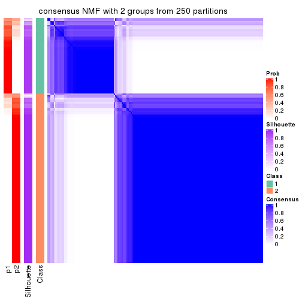</p>

</div>
<div id='tab-SD-NMF-consensus-heatmap-2'>
<pre><code class="r">consensus_heatmap(res, k = 3)
</code></pre>

<p>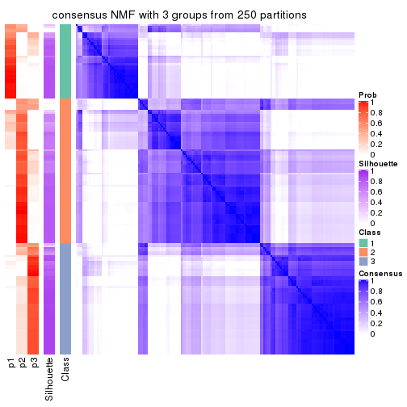</p>

</div>
<div id='tab-SD-NMF-consensus-heatmap-3'>
<pre><code class="r">consensus_heatmap(res, k = 4)
</code></pre>

<p>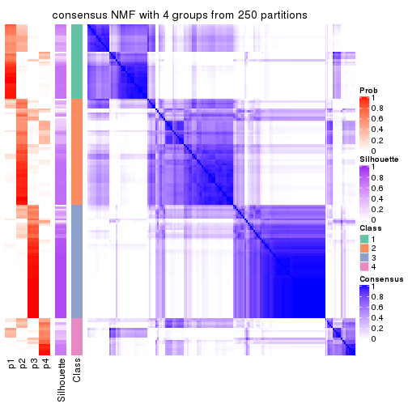</p>

</div>
<div id='tab-SD-NMF-consensus-heatmap-4'>
<pre><code class="r">consensus_heatmap(res, k = 5)
</code></pre>

<p>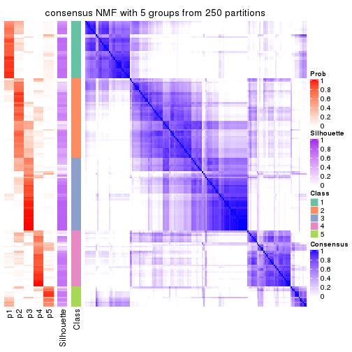</p>

</div>
<div id='tab-SD-NMF-consensus-heatmap-5'>
<pre><code class="r">consensus_heatmap(res, k = 6)
</code></pre>

<p>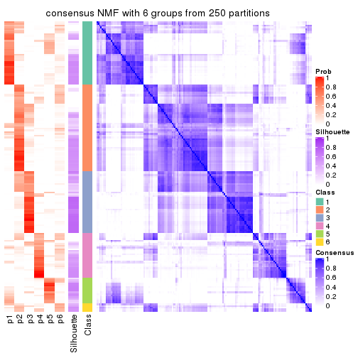</p>

</div>
</div>

Heatmaps for the membership of samples in all partitions to see how consistent they are:


<script>
$( function() {
	$( '#tabs-SD-NMF-membership-heatmap' ).tabs();
} );
</script>
<div id='tabs-SD-NMF-membership-heatmap'>
<ul>
<li><a href='#tab-SD-NMF-membership-heatmap-1'>k = 2</a></li>
<li><a href='#tab-SD-NMF-membership-heatmap-2'>k = 3</a></li>
<li><a href='#tab-SD-NMF-membership-heatmap-3'>k = 4</a></li>
<li><a href='#tab-SD-NMF-membership-heatmap-4'>k = 5</a></li>
<li><a href='#tab-SD-NMF-membership-heatmap-5'>k = 6</a></li>
</ul>
<div id='tab-SD-NMF-membership-heatmap-1'>
<pre><code class="r">membership_heatmap(res, k = 2)
</code></pre>

<p>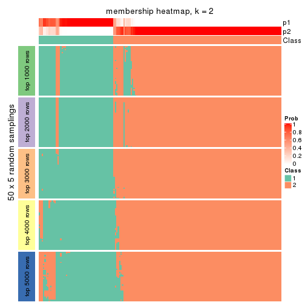</p>

</div>
<div id='tab-SD-NMF-membership-heatmap-2'>
<pre><code class="r">membership_heatmap(res, k = 3)
</code></pre>

<p>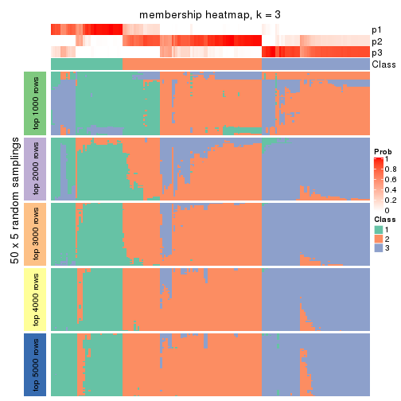</p>

</div>
<div id='tab-SD-NMF-membership-heatmap-3'>
<pre><code class="r">membership_heatmap(res, k = 4)
</code></pre>

<p>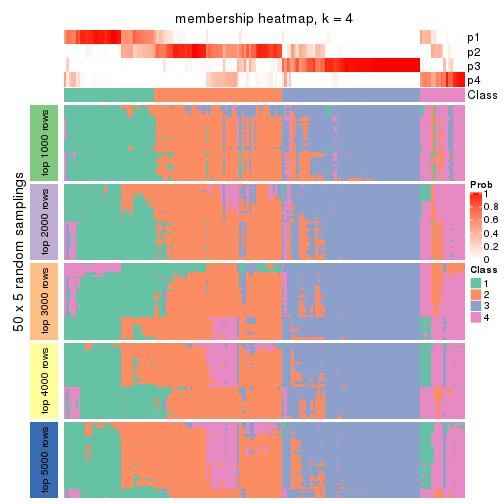</p>

</div>
<div id='tab-SD-NMF-membership-heatmap-4'>
<pre><code class="r">membership_heatmap(res, k = 5)
</code></pre>

<p>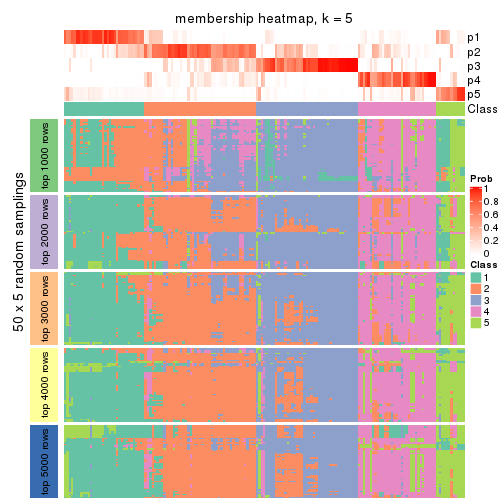</p>

</div>
<div id='tab-SD-NMF-membership-heatmap-5'>
<pre><code class="r">membership_heatmap(res, k = 6)
</code></pre>

<p>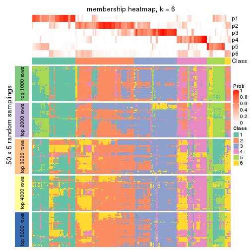</p>

</div>
</div>

As soon as we have had the classes for columns, we can look for signatures
which are significantly different between classes which can be candidate marks
for certain classes. Following are the heatmaps for signatures.


Signature heatmaps where rows are scaled:


<script>
$( function() {
	$( '#tabs-SD-NMF-get-signatures' ).tabs();
} );
</script>
<div id='tabs-SD-NMF-get-signatures'>
<ul>
<li><a href='#tab-SD-NMF-get-signatures-1'>k = 2</a></li>
<li><a href='#tab-SD-NMF-get-signatures-2'>k = 3</a></li>
<li><a href='#tab-SD-NMF-get-signatures-3'>k = 4</a></li>
<li><a href='#tab-SD-NMF-get-signatures-4'>k = 5</a></li>
<li><a href='#tab-SD-NMF-get-signatures-5'>k = 6</a></li>
</ul>
<div id='tab-SD-NMF-get-signatures-1'>
<pre><code class="r">get_signatures(res, k = 2)
</code></pre>

<p>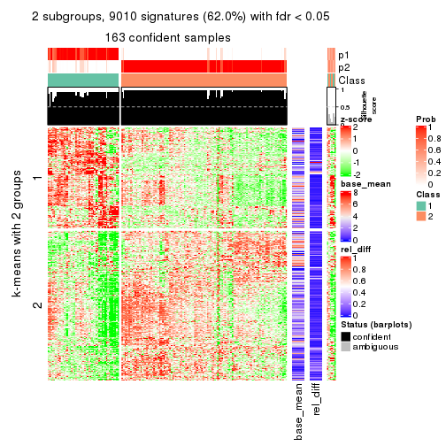</p>

</div>
<div id='tab-SD-NMF-get-signatures-2'>
<pre><code class="r">get_signatures(res, k = 3)
</code></pre>

<p>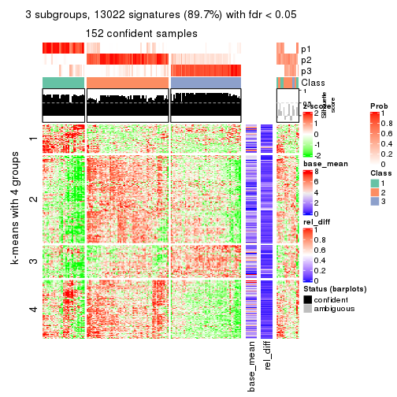</p>

</div>
<div id='tab-SD-NMF-get-signatures-3'>
<pre><code class="r">get_signatures(res, k = 4)
</code></pre>

<p>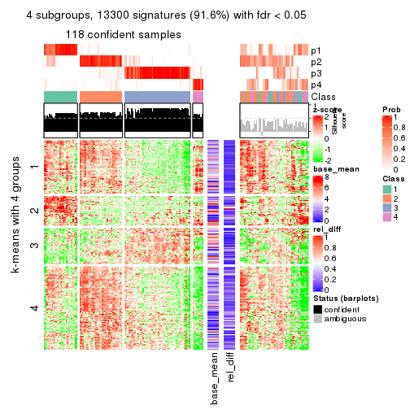</p>

</div>
<div id='tab-SD-NMF-get-signatures-4'>
<pre><code class="r">get_signatures(res, k = 5)
</code></pre>

<p>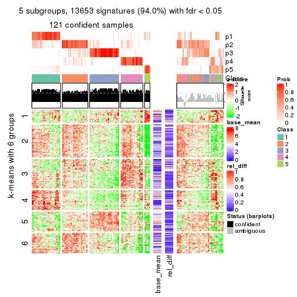</p>

</div>
<div id='tab-SD-NMF-get-signatures-5'>
<pre><code class="r">get_signatures(res, k = 6)
</code></pre>

<p>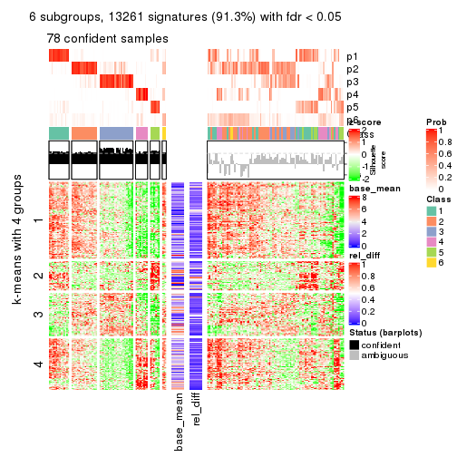</p>

</div>
</div>


Signature heatmaps where rows are not scaled:


<script>
$( function() {
	$( '#tabs-SD-NMF-get-signatures-no-scale' ).tabs();
} );
</script>
<div id='tabs-SD-NMF-get-signatures-no-scale'>
<ul>
<li><a href='#tab-SD-NMF-get-signatures-no-scale-1'>k = 2</a></li>
<li><a href='#tab-SD-NMF-get-signatures-no-scale-2'>k = 3</a></li>
<li><a href='#tab-SD-NMF-get-signatures-no-scale-3'>k = 4</a></li>
<li><a href='#tab-SD-NMF-get-signatures-no-scale-4'>k = 5</a></li>
<li><a href='#tab-SD-NMF-get-signatures-no-scale-5'>k = 6</a></li>
</ul>
<div id='tab-SD-NMF-get-signatures-no-scale-1'>
<pre><code class="r">get_signatures(res, k = 2, scale_rows = FALSE)
</code></pre>

<p>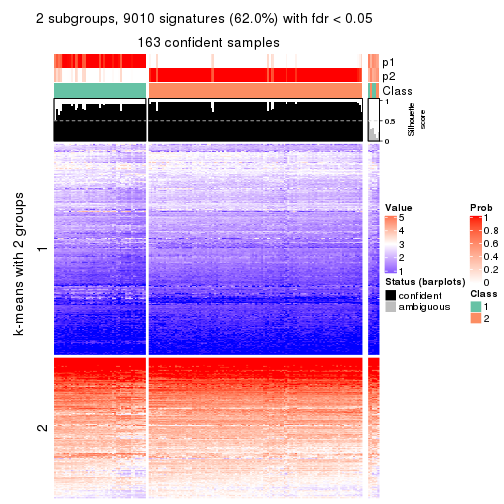</p>

</div>
<div id='tab-SD-NMF-get-signatures-no-scale-2'>
<pre><code class="r">get_signatures(res, k = 3, scale_rows = FALSE)
</code></pre>

<p>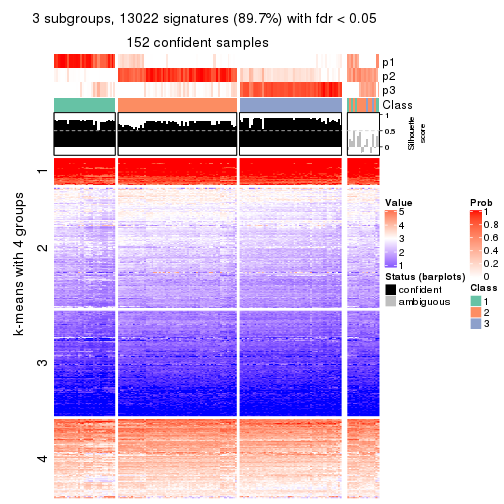</p>

</div>
<div id='tab-SD-NMF-get-signatures-no-scale-3'>
<pre><code class="r">get_signatures(res, k = 4, scale_rows = FALSE)
</code></pre>

<p>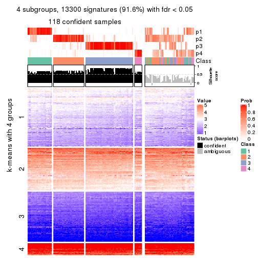</p>

</div>
<div id='tab-SD-NMF-get-signatures-no-scale-4'>
<pre><code class="r">get_signatures(res, k = 5, scale_rows = FALSE)
</code></pre>

<p>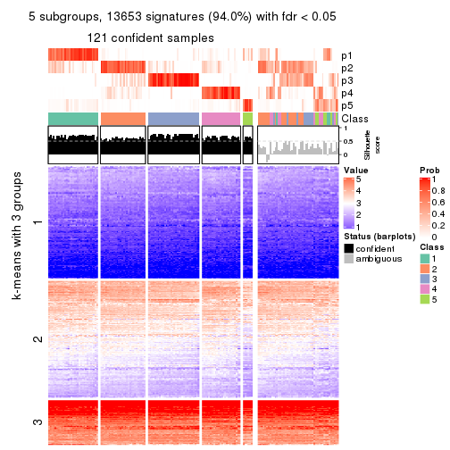</p>

</div>
<div id='tab-SD-NMF-get-signatures-no-scale-5'>
<pre><code class="r">get_signatures(res, k = 6, scale_rows = FALSE)
</code></pre>

<p>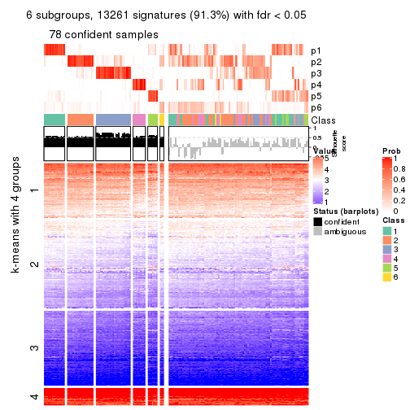</p>

</div>
</div>


Compare the overlap of signatures from different k:

```r
compare_signatures(res)
```

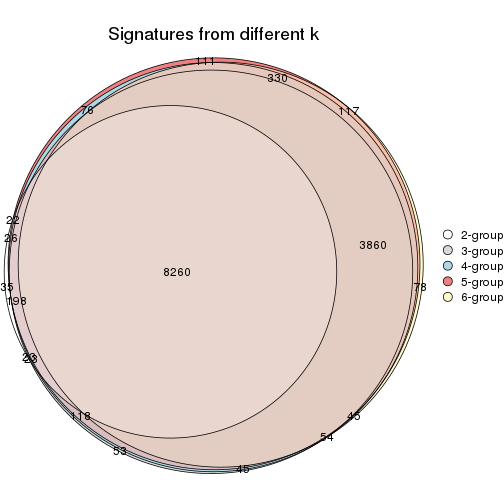

`get_signature()` returns a data frame invisibly. TO get the list of signatures, the function
call should be assigned to a variable explicitly. In following code, if `plot` argument is set
to `FALSE`, no heatmap is plotted while only the differential analysis is performed.

```r
# code only for demonstration
tb = get_signature(res, k = ..., plot = FALSE)
```

An example of the output of `tb` is:

```
#>   which_row         fdr    mean_1    mean_2 scaled_mean_1 scaled_mean_2 km
#> 1        38 0.042760348  8.373488  9.131774    -0.5533452     0.5164555  1
#> 2        40 0.018707592  7.106213  8.469186    -0.6173731     0.5762149  1
#> 3        55 0.019134737 10.221463 11.207825    -0.6159697     0.5749050  1
#> 4        59 0.006059896  5.921854  7.869574    -0.6899429     0.6439467  1
#> 5        60 0.018055526  8.928898 10.211722    -0.6204761     0.5791110  1
#> 6        98 0.009384629 15.714769 14.887706     0.6635654    -0.6193277  2
...
```

The columns in `tb` are:

1. `which_row`: row indices corresponding to the input matrix.
2. `fdr`: FDR for the differential test. 
3. `mean_x`: The mean value in group x.
4. `scaled_mean_x`: The mean value in group x after rows are scaled.
5. `km`: Row groups if k-means clustering is applied to rows.


UMAP plot which shows how samples are separated.


<script>
$( function() {
	$( '#tabs-SD-NMF-dimension-reduction' ).tabs();
} );
</script>
<div id='tabs-SD-NMF-dimension-reduction'>
<ul>
<li><a href='#tab-SD-NMF-dimension-reduction-1'>k = 2</a></li>
<li><a href='#tab-SD-NMF-dimension-reduction-2'>k = 3</a></li>
<li><a href='#tab-SD-NMF-dimension-reduction-3'>k = 4</a></li>
<li><a href='#tab-SD-NMF-dimension-reduction-4'>k = 5</a></li>
<li><a href='#tab-SD-NMF-dimension-reduction-5'>k = 6</a></li>
</ul>
<div id='tab-SD-NMF-dimension-reduction-1'>
<pre><code class="r">dimension_reduction(res, k = 2, method = &quot;UMAP&quot;)
</code></pre>

<p>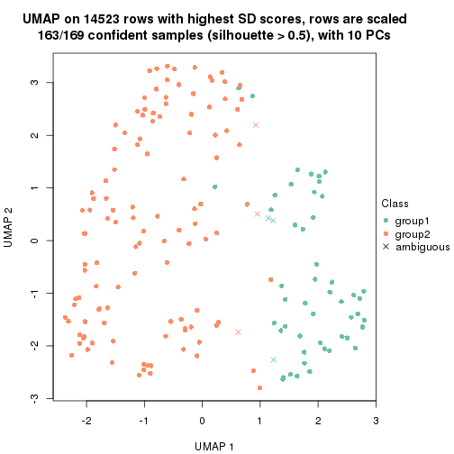</p>

</div>
<div id='tab-SD-NMF-dimension-reduction-2'>
<pre><code class="r">dimension_reduction(res, k = 3, method = &quot;UMAP&quot;)
</code></pre>

<p>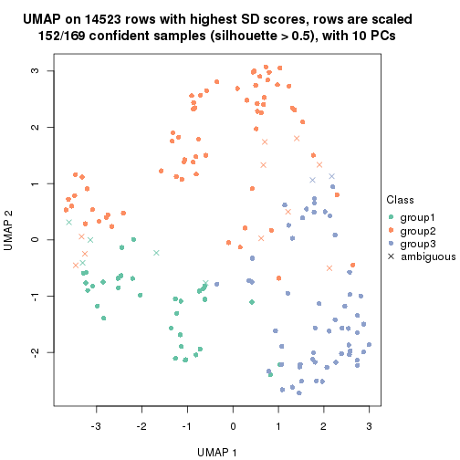</p>

</div>
<div id='tab-SD-NMF-dimension-reduction-3'>
<pre><code class="r">dimension_reduction(res, k = 4, method = &quot;UMAP&quot;)
</code></pre>

<p>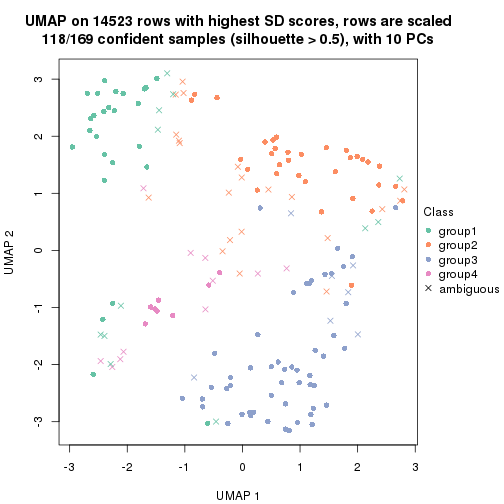</p>

</div>
<div id='tab-SD-NMF-dimension-reduction-4'>
<pre><code class="r">dimension_reduction(res, k = 5, method = &quot;UMAP&quot;)
</code></pre>

<p>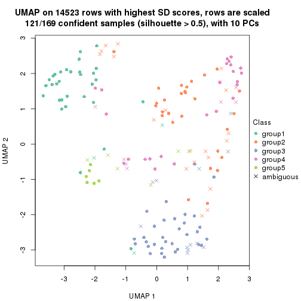</p>

</div>
<div id='tab-SD-NMF-dimension-reduction-5'>
<pre><code class="r">dimension_reduction(res, k = 6, method = &quot;UMAP&quot;)
</code></pre>

<p>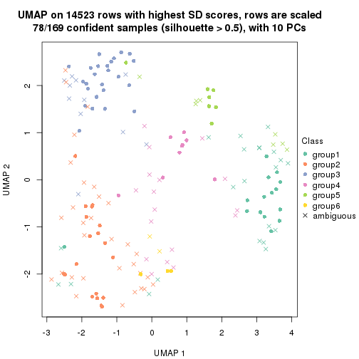</p>

</div>
</div>


Following heatmap shows how subgroups are split when increasing `k`:

```r
collect_classes(res)
```

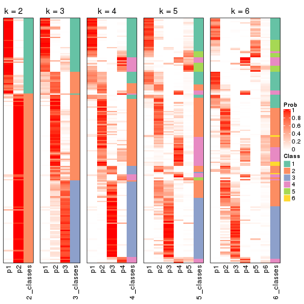


If matrix rows can be associated to genes, consider to use `GO_Enrichment(res,
...)` to perform function enrichment for the signature genes.


 

---------------------------------------------------


### CV:hclust


The object with results only for a single top-value method and a single partition method 
can be extracted as:

```r
res = res_list["CV", "hclust"]
# you can also extract it by
# res = res_list["CV:hclust"]
```

A summary of `res` and all the functions that can be applied to it:

```r
res
```

```
#> A 'ConsensusPartition' object with k = 2, 3, 4, 5, 6.
#>   On a matrix with 14523 rows and 169 columns.
#>   Top rows (1000, 2000, 3000, 4000, 5000) are extracted by 'CV' method.
#>   Subgroups are detected by 'hclust' method.
#>   Performed in total 1250 partitions by row resampling.
#>   Best k for subgroups seems to be 2.
#> 
#> Following methods can be applied to this 'ConsensusPartition' object:
#>  [1] "cola_report"             "collect_classes"         "collect_plots"          
#>  [4] "collect_stats"           "colnames"                "compare_signatures"     
#>  [7] "consensus_heatmap"       "dimension_reduction"     "functional_enrichment"  
#> [10] "get_anno_col"            "get_anno"                "get_classes"            
#> [13] "get_consensus"           "get_matrix"              "get_membership"         
#> [16] "get_param"               "get_signatures"          "get_stats"              
#> [19] "is_best_k"               "is_stable_k"             "membership_heatmap"     
#> [22] "ncol"                    "nrow"                    "plot_ecdf"              
#> [25] "rownames"                "select_partition_number" "show"                   
#> [28] "suggest_best_k"          "test_to_known_factors"
```

`collect_plots()` function collects all the plots made from `res` for all `k` (number of partitions)
into one single page to provide an easy and fast comparison between different `k`.

```r
collect_plots(res)
```

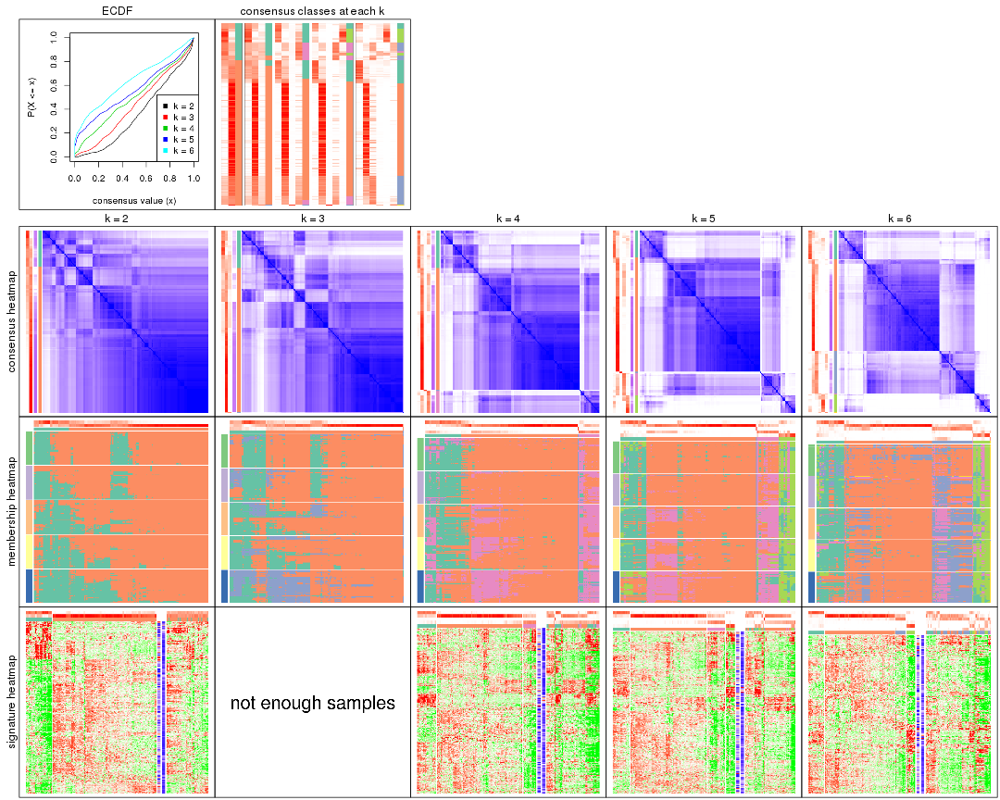

The plots are:

- The first row: a plot of the ECDF (Empirical cumulative distribution
  function) curves of the consensus matrix for each `k` and the heatmap of
  predicted classes for each `k`.
- The second row: heatmaps of the consensus matrix for each `k`.
- The third row: heatmaps of the membership matrix for each `k`.
- The fouth row: heatmaps of the signatures for each `k`.

All the plots in panels can be made by individual functions and they are
plotted later in this section.

`select_partition_number()` produces several plots showing different
statistics for choosing "optimized" `k`. There are following statistics:

- ECDF curves of the consensus matrix for each `k`;
- 1-PAC. [The PAC
  score](https://en.wikipedia.org/wiki/Consensus_clustering#Over-interpretation_potential_of_consensus_clustering)
  measures the proportion of the ambiguous subgrouping.
- Mean silhouette score.
- Concordance. The mean probability of fiting the consensus class ids in all
  partitions.
- Area increased. Denote $A_k$ as the area under the ECDF curve for current
  `k`, the area increased is defined as $A_k - A_{k-1}$.
- Rand index. The percent of pairs of samples that are both in a same cluster
  or both are not in a same cluster in the partition of k and k-1.
- Jaccard index. The ratio of pairs of samples are both in a same cluster in
  the partition of k and k-1 and the pairs of samples are both in a same
  cluster in the partition k or k-1.

The detailed explanations of these statistics can be found in [the cola
vignette](http://bioconductor.org/packages/devel/bioc/vignettes/cola/inst/doc/cola.html#toc_13).

Generally speaking, lower PAC score, higher mean silhouette score or higher
concordance corresponds to better partition. Rand index and Jaccard index
measure how similar the current partition is compared to partition with `k-1`.
If they are too similar, we won't accept `k` is better than `k-1`.

```r
select_partition_number(res)
```

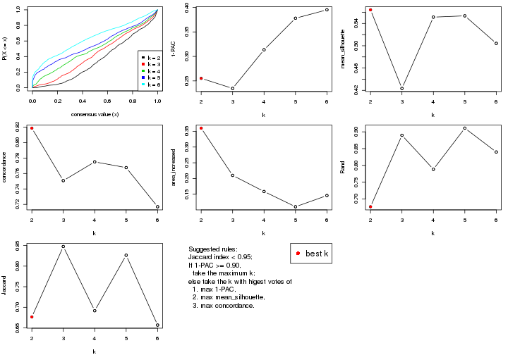

The numeric values for all these statistics can be obtained by `get_stats()`.

```r
get_stats(res)
```

```
#>   k 1-PAC mean_silhouette concordance area_increased  Rand Jaccard
#> 2 2 0.255           0.564       0.819          0.360 0.677   0.677
#> 3 3 0.235           0.423       0.751          0.210 0.890   0.848
#> 4 4 0.314           0.551       0.775          0.159 0.788   0.692
#> 5 5 0.378           0.554       0.768          0.110 0.911   0.827
#> 6 6 0.395           0.504       0.717          0.146 0.840   0.657
```

`suggest_best_k()` suggests the best $k$ based on these statistics. The rules are as follows:

- All $k$ with Jaccard index larger than 0.95 are removed because the increase of
  the partition number does not provides enough extra information. If all $k$ are removed,
  the best $k$ is assigned by `NA`.
- For $k$ with 1-PAC larger than 0.9, the maximal $k$ is taken as the "best k". Other $k$ is called "optional k".
- If it does not fit the second rule. The $k$ with the highest vote of highest
  1-PAC, mean silhouette and concordance is taken as the "best k".

```r
suggest_best_k(res)
```

```
#> [1] 2
```


Following shows the table of the partitions (You need to click the **show/hide
code output** link to see it). The membership matrix (columns with name `p*`)
is inferred by
[`clue::cl_consensus()`](https://www.rdocumentation.org/link/cl_consensus?package=clue)
function with the `SE` method. Basically the value in the membership matrix
represents the probability to belong to a certain group. The finall class
label for an item is determined with the group with highest probability it
belongs to.

In `get_classes()` function, the entropy is calculated from the membership
matrix and the silhouette score is calculated from the consensus matrix.


<script>
$( function() {
	$( '#tabs-CV-hclust-get-classes' ).tabs();
} );
</script>
<div id='tabs-CV-hclust-get-classes'>
<ul>
<li><a href='#tab-CV-hclust-get-classes-1'>k = 2</a></li>
<li><a href='#tab-CV-hclust-get-classes-2'>k = 3</a></li>
<li><a href='#tab-CV-hclust-get-classes-3'>k = 4</a></li>
<li><a href='#tab-CV-hclust-get-classes-4'>k = 5</a></li>
<li><a href='#tab-CV-hclust-get-classes-5'>k = 6</a></li>
</ul>

<div id='tab-CV-hclust-get-classes-1'>
<p><a id='tab-CV-hclust-get-classes-1-a' style='color:#0366d6' href='#'>show/hide code output</a></p>
<pre><code class="r">cbind(get_classes(res, k = 2), get_membership(res, k = 2))
</code></pre>

<pre><code>#&gt;            class entropy silhouette    p1    p2
#&gt; SRR2052702     2  0.0000     0.7640 0.000 1.000
#&gt; SRR2052701     2  0.0000     0.7640 0.000 1.000
#&gt; SRR2052700     2  0.4431     0.7352 0.092 0.908
#&gt; SRR2052699     2  0.2043     0.7651 0.032 0.968
#&gt; SRR2052698     2  0.1184     0.7650 0.016 0.984
#&gt; SRR2052708     2  0.9983    -0.1258 0.476 0.524
#&gt; SRR2052749     1  0.9998     0.1904 0.508 0.492
#&gt; SRR2052786     2  0.0000     0.7640 0.000 1.000
#&gt; SRR2052825     1  0.9209     0.6076 0.664 0.336
#&gt; SRR2052824     1  0.9491     0.5736 0.632 0.368
#&gt; SRR2052823     2  0.0000     0.7640 0.000 1.000
#&gt; SRR2052822     2  0.0938     0.7649 0.012 0.988
#&gt; SRR2052821     2  0.0376     0.7650 0.004 0.996
#&gt; SRR2052820     2  0.9129     0.3909 0.328 0.672
#&gt; SRR2052819     2  0.9922    -0.0389 0.448 0.552
#&gt; SRR2052818     2  0.0938     0.7656 0.012 0.988
#&gt; SRR2052817     2  0.4022     0.7394 0.080 0.920
#&gt; SRR2052816     1  0.9522     0.5680 0.628 0.372
#&gt; SRR2052815     1  0.9460     0.5765 0.636 0.364
#&gt; SRR2052814     2  0.5294     0.7105 0.120 0.880
#&gt; SRR2052813     2  0.0938     0.7649 0.012 0.988
#&gt; SRR2052812     2  0.0000     0.7640 0.000 1.000
#&gt; SRR2052811     2  0.0000     0.7640 0.000 1.000
#&gt; SRR2052810     2  0.9209     0.2722 0.336 0.664
#&gt; SRR2052809     2  0.0000     0.7640 0.000 1.000
#&gt; SRR2052808     2  0.2778     0.7596 0.048 0.952
#&gt; SRR2052807     1  0.7950     0.6531 0.760 0.240
#&gt; SRR2052806     1  0.8144     0.5916 0.748 0.252
#&gt; SRR2052805     1  0.9044     0.5217 0.680 0.320
#&gt; SRR2052804     1  0.9977     0.3006 0.528 0.472
#&gt; SRR2052803     1  0.9044     0.5217 0.680 0.320
#&gt; SRR2052802     1  0.8327     0.6438 0.736 0.264
#&gt; SRR2052801     1  0.2778     0.6312 0.952 0.048
#&gt; SRR2052800     1  0.8327     0.6438 0.736 0.264
#&gt; SRR2052799     1  0.2236     0.6241 0.964 0.036
#&gt; SRR2052798     2  0.9988    -0.1185 0.480 0.520
#&gt; SRR2052797     2  0.0376     0.7650 0.004 0.996
#&gt; SRR2052796     1  0.3114     0.6337 0.944 0.056
#&gt; SRR2052795     2  0.9983    -0.1072 0.476 0.524
#&gt; SRR2052794     1  0.2236     0.6241 0.964 0.036
#&gt; SRR2052793     1  0.3879     0.6393 0.924 0.076
#&gt; SRR2052792     1  0.8443     0.6364 0.728 0.272
#&gt; SRR2052791     1  0.6973     0.6264 0.812 0.188
#&gt; SRR2052790     2  0.0938     0.7649 0.012 0.988
#&gt; SRR2052789     2  0.4022     0.7397 0.080 0.920
#&gt; SRR2052788     2  0.6247     0.6762 0.156 0.844
#&gt; SRR2052787     2  0.0000     0.7640 0.000 1.000
#&gt; SRR2052785     2  0.1414     0.7644 0.020 0.980
#&gt; SRR2052784     2  0.2423     0.7578 0.040 0.960
#&gt; SRR2052783     2  0.3274     0.7502 0.060 0.940
#&gt; SRR2052782     2  0.0938     0.7649 0.012 0.988
#&gt; SRR2052781     2  0.1414     0.7648 0.020 0.980
#&gt; SRR2052780     2  0.7674     0.5977 0.224 0.776
#&gt; SRR2052777     2  0.0938     0.7649 0.012 0.988
#&gt; SRR2052779     2  0.0938     0.7649 0.012 0.988
#&gt; SRR2052778     2  0.9000     0.4217 0.316 0.684
#&gt; SRR2052776     2  0.1843     0.7636 0.028 0.972
#&gt; SRR2052775     2  0.7815     0.5849 0.232 0.768
#&gt; SRR2052773     2  0.3431     0.7479 0.064 0.936
#&gt; SRR2052772     2  0.6623     0.6596 0.172 0.828
#&gt; SRR2052774     2  0.3431     0.7479 0.064 0.936
#&gt; SRR2052771     1  0.8081     0.6616 0.752 0.248
#&gt; SRR2052769     2  0.7745     0.5939 0.228 0.772
#&gt; SRR2052770     2  0.8207     0.5467 0.256 0.744
#&gt; SRR2052768     2  0.0000     0.7640 0.000 1.000
#&gt; SRR2052767     2  0.0000     0.7640 0.000 1.000
#&gt; SRR2052766     2  0.9977    -0.1305 0.472 0.528
#&gt; SRR2052765     2  0.3431     0.7501 0.064 0.936
#&gt; SRR2052763     2  0.8443     0.5216 0.272 0.728
#&gt; SRR2052764     2  0.0000     0.7640 0.000 1.000
#&gt; SRR2052761     2  0.9170     0.3823 0.332 0.668
#&gt; SRR2052760     2  0.0000     0.7640 0.000 1.000
#&gt; SRR2052759     2  0.8443     0.5216 0.272 0.728
#&gt; SRR2052762     2  0.1414     0.7655 0.020 0.980
#&gt; SRR2052758     2  0.4562     0.7304 0.096 0.904
#&gt; SRR2052756     2  0.9909     0.0335 0.444 0.556
#&gt; SRR2052757     2  0.1184     0.7650 0.016 0.984
#&gt; SRR2052755     2  0.7299     0.5775 0.204 0.796
#&gt; SRR2052754     1  0.4815     0.6448 0.896 0.104
#&gt; SRR2052753     2  0.6973     0.6142 0.188 0.812
#&gt; SRR2052752     1  0.9977     0.2855 0.528 0.472
#&gt; SRR2052750     2  0.9580     0.1529 0.380 0.620
#&gt; SRR2052751     2  0.2236     0.7621 0.036 0.964
#&gt; SRR2052748     2  0.9661     0.2020 0.392 0.608
#&gt; SRR2052747     1  0.9988     0.2481 0.520 0.480
#&gt; SRR2052746     2  0.8443     0.5216 0.272 0.728
#&gt; SRR2052745     2  0.9552     0.2529 0.376 0.624
#&gt; SRR2052744     2  0.9522     0.1601 0.372 0.628
#&gt; SRR2052741     2  0.0672     0.7614 0.008 0.992
#&gt; SRR2052743     2  0.0672     0.7614 0.008 0.992
#&gt; SRR2052740     2  0.0672     0.7614 0.008 0.992
#&gt; SRR2052742     2  0.1843     0.7656 0.028 0.972
#&gt; SRR2052739     2  0.0000     0.7640 0.000 1.000
#&gt; SRR2052738     2  0.8499     0.5136 0.276 0.724
#&gt; SRR2052736     2  0.1843     0.7506 0.028 0.972
#&gt; SRR2052735     2  0.9000     0.2959 0.316 0.684
#&gt; SRR2052734     2  0.9460     0.1794 0.364 0.636
#&gt; SRR2052737     2  0.0672     0.7646 0.008 0.992
#&gt; SRR2052733     2  0.8443     0.5216 0.272 0.728
#&gt; SRR2052732     2  0.0000     0.7640 0.000 1.000
#&gt; SRR2052731     2  0.7056     0.6368 0.192 0.808
#&gt; SRR2052729     2  0.9732     0.0929 0.404 0.596
#&gt; SRR2052728     2  0.9460     0.1794 0.364 0.636
#&gt; SRR2052730     1  0.9491     0.5711 0.632 0.368
#&gt; SRR2052727     2  0.9710     0.0988 0.400 0.600
#&gt; SRR2052725     2  0.4431     0.7365 0.092 0.908
#&gt; SRR2052726     2  0.8955     0.3049 0.312 0.688
#&gt; SRR2052724     2  0.9795     0.0536 0.416 0.584
#&gt; SRR2052723     2  0.9710     0.1804 0.400 0.600
#&gt; SRR2052722     2  0.6247     0.6762 0.156 0.844
#&gt; SRR2052721     2  0.9732     0.0932 0.404 0.596
#&gt; SRR2052720     2  0.0000     0.7640 0.000 1.000
#&gt; SRR2052719     2  0.0000     0.7640 0.000 1.000
#&gt; SRR2052718     2  0.7299     0.5838 0.204 0.796
#&gt; SRR2052717     2  0.1414     0.7655 0.020 0.980
#&gt; SRR2052714     2  0.9833     0.0515 0.424 0.576
#&gt; SRR2052716     2  0.9170     0.3823 0.332 0.668
#&gt; SRR2052715     2  0.7674     0.5993 0.224 0.776
#&gt; SRR2052713     1  0.9909     0.3164 0.556 0.444
#&gt; SRR2052712     1  0.9248     0.6037 0.660 0.340
#&gt; SRR2052711     2  0.9815     0.0764 0.420 0.580
#&gt; SRR2052710     2  0.1184     0.7650 0.016 0.984
#&gt; SRR2052707     2  0.6801     0.6531 0.180 0.820
#&gt; SRR2052709     2  0.7528     0.6107 0.216 0.784
#&gt; SRR2052704     2  0.9248     0.3640 0.340 0.660
#&gt; SRR2052705     2  0.1184     0.7654 0.016 0.984
#&gt; SRR2052697     2  0.0000     0.7640 0.000 1.000
#&gt; SRR2052703     2  0.3584     0.7456 0.068 0.932
#&gt; SRR2052696     2  0.9988    -0.1185 0.480 0.520
#&gt; SRR2052706     2  0.0376     0.7650 0.004 0.996
#&gt; SRR2052695     2  0.0000     0.7640 0.000 1.000
#&gt; SRR2052694     2  0.0000     0.7640 0.000 1.000
#&gt; SRR2052692     2  0.7950     0.5770 0.240 0.760
#&gt; SRR2052693     2  0.8144     0.5635 0.252 0.748
#&gt; SRR2052691     2  0.6148     0.6494 0.152 0.848
#&gt; SRR2052690     2  0.0938     0.7633 0.012 0.988
#&gt; SRR2052689     1  0.9358     0.5916 0.648 0.352
#&gt; SRR2052687     1  0.9993     0.3435 0.516 0.484
#&gt; SRR2052686     2  0.9909     0.0335 0.444 0.556
#&gt; SRR2052688     2  0.0672     0.7646 0.008 0.992
#&gt; SRR2052684     1  0.9954     0.2843 0.540 0.460
#&gt; SRR2052685     2  0.3274     0.7343 0.060 0.940
#&gt; SRR2052683     1  0.5059     0.6456 0.888 0.112
#&gt; SRR2052681     2  1.0000    -0.3151 0.496 0.504
#&gt; SRR2052680     1  0.9732     0.5179 0.596 0.404
#&gt; SRR2052682     2  0.3584     0.7159 0.068 0.932
#&gt; SRR2052679     2  0.9661     0.1208 0.392 0.608
#&gt; SRR2052678     2  0.7453     0.6128 0.212 0.788
#&gt; SRR2052677     2  0.0000     0.7640 0.000 1.000
#&gt; SRR2052675     2  0.0376     0.7630 0.004 0.996
#&gt; SRR2052676     1  0.9988     0.2481 0.520 0.480
#&gt; SRR2052674     1  0.9580     0.5616 0.620 0.380
#&gt; SRR2052672     2  0.7453     0.6128 0.212 0.788
#&gt; SRR2052673     2  0.0376     0.7630 0.004 0.996
#&gt; SRR2052671     2  0.0672     0.7615 0.008 0.992
#&gt; SRR2052670     2  0.6438     0.6682 0.164 0.836
#&gt; SRR2052669     2  0.0000     0.7640 0.000 1.000
#&gt; SRR2052668     2  0.3274     0.7526 0.060 0.940
#&gt; SRR2052667     2  0.0938     0.7649 0.012 0.988
#&gt; SRR2052666     2  0.2043     0.7424 0.032 0.968
#&gt; SRR2052665     2  0.2236     0.7621 0.036 0.964
#&gt; SRR2052664     1  0.7299     0.6683 0.796 0.204
#&gt; SRR2052663     2  0.2948     0.7290 0.052 0.948
#&gt; SRR2052662     2  0.0000     0.7640 0.000 1.000
#&gt; SRR2052661     2  0.5059     0.6760 0.112 0.888
#&gt; SRR2052660     2  0.6048     0.6888 0.148 0.852
#&gt; SRR2052659     2  0.8661     0.4908 0.288 0.712
#&gt; SRR2052658     2  0.1633     0.7657 0.024 0.976
#&gt; SRR2052657     2  0.9944    -0.0451 0.456 0.544
</code></pre>

<script>
$('#tab-CV-hclust-get-classes-1-a').parent().next().next().hide();
$('#tab-CV-hclust-get-classes-1-a').click(function(){
  $('#tab-CV-hclust-get-classes-1-a').parent().next().next().toggle();
  return(false);
});
</script>
</div>

<div id='tab-CV-hclust-get-classes-2'>
<p><a id='tab-CV-hclust-get-classes-2-a' style='color:#0366d6' href='#'>show/hide code output</a></p>
<pre><code class="r">cbind(get_classes(res, k = 3), get_membership(res, k = 3))
</code></pre>

<pre><code>#&gt;            class entropy silhouette    p1    p2    p3
#&gt; SRR2052702     2  0.0661     0.6649 0.008 0.988 0.004
#&gt; SRR2052701     2  0.1015     0.6621 0.008 0.980 0.012
#&gt; SRR2052700     2  0.4179     0.6298 0.052 0.876 0.072
#&gt; SRR2052699     2  0.1919     0.6655 0.024 0.956 0.020
#&gt; SRR2052698     2  0.0475     0.6681 0.004 0.992 0.004
#&gt; SRR2052708     1  0.7453     0.1583 0.528 0.436 0.036
#&gt; SRR2052749     1  0.7207     0.2148 0.584 0.384 0.032
#&gt; SRR2052786     2  0.0661     0.6649 0.008 0.988 0.004
#&gt; SRR2052825     1  0.9900     0.2270 0.404 0.304 0.292
#&gt; SRR2052824     1  0.9906     0.2007 0.388 0.340 0.272
#&gt; SRR2052823     2  0.1015     0.6630 0.008 0.980 0.012
#&gt; SRR2052822     2  0.0237     0.6676 0.000 0.996 0.004
#&gt; SRR2052821     2  0.0829     0.6670 0.012 0.984 0.004
#&gt; SRR2052820     2  0.8649     0.3248 0.204 0.600 0.196
#&gt; SRR2052819     2  0.9528     0.0941 0.288 0.484 0.228
#&gt; SRR2052818     2  0.1129     0.6691 0.020 0.976 0.004
#&gt; SRR2052817     2  0.3253     0.6421 0.052 0.912 0.036
#&gt; SRR2052816     1  0.9897     0.1963 0.388 0.344 0.268
#&gt; SRR2052815     1  0.9892     0.2017 0.392 0.340 0.268
#&gt; SRR2052814     2  0.5138     0.5883 0.052 0.828 0.120
#&gt; SRR2052813     2  0.0237     0.6676 0.000 0.996 0.004
#&gt; SRR2052812     2  0.0661     0.6649 0.008 0.988 0.004
#&gt; SRR2052811     2  0.0661     0.6649 0.008 0.988 0.004
#&gt; SRR2052810     2  0.8156     0.2792 0.196 0.644 0.160
#&gt; SRR2052809     2  0.0424     0.6660 0.008 0.992 0.000
#&gt; SRR2052808     2  0.2550     0.6606 0.024 0.936 0.040
#&gt; SRR2052807     1  0.9161     0.2757 0.532 0.188 0.280
#&gt; SRR2052806     1  0.5355     0.3767 0.800 0.168 0.032
#&gt; SRR2052805     1  0.6099     0.3464 0.740 0.228 0.032
#&gt; SRR2052804     2  0.9891    -0.1482 0.316 0.404 0.280
#&gt; SRR2052803     1  0.6099     0.3464 0.740 0.228 0.032
#&gt; SRR2052802     1  0.9437     0.2542 0.492 0.208 0.300
#&gt; SRR2052801     1  0.4293     0.3624 0.832 0.004 0.164
#&gt; SRR2052800     1  0.9437     0.2542 0.492 0.208 0.300
#&gt; SRR2052799     1  0.3816     0.3687 0.852 0.000 0.148
#&gt; SRR2052798     1  0.7581     0.1737 0.548 0.408 0.044
#&gt; SRR2052797     2  0.0829     0.6670 0.012 0.984 0.004
#&gt; SRR2052796     1  0.4345     0.3841 0.848 0.016 0.136
#&gt; SRR2052795     1  0.7671     0.1712 0.544 0.408 0.048
#&gt; SRR2052794     1  0.3941     0.3634 0.844 0.000 0.156
#&gt; SRR2052793     1  0.4015     0.4014 0.876 0.028 0.096
#&gt; SRR2052792     1  0.9627     0.2198 0.428 0.208 0.364
#&gt; SRR2052791     1  0.5519     0.3908 0.812 0.120 0.068
#&gt; SRR2052790     2  0.0424     0.6673 0.000 0.992 0.008
#&gt; SRR2052789     2  0.3797     0.6294 0.052 0.892 0.056
#&gt; SRR2052788     2  0.5811     0.5623 0.092 0.800 0.108
#&gt; SRR2052787     2  0.0848     0.6634 0.008 0.984 0.008
#&gt; SRR2052785     2  0.0661     0.6678 0.004 0.988 0.008
#&gt; SRR2052784     2  0.2176     0.6539 0.020 0.948 0.032
#&gt; SRR2052783     2  0.2903     0.6450 0.028 0.924 0.048
#&gt; SRR2052782     2  0.0237     0.6676 0.000 0.996 0.004
#&gt; SRR2052781     2  0.0661     0.6683 0.004 0.988 0.008
#&gt; SRR2052780     2  0.7192     0.4898 0.120 0.716 0.164
#&gt; SRR2052777     2  0.0237     0.6676 0.000 0.996 0.004
#&gt; SRR2052779     2  0.0237     0.6676 0.000 0.996 0.004
#&gt; SRR2052778     2  0.8485     0.3512 0.192 0.616 0.192
#&gt; SRR2052776     2  0.1129     0.6666 0.004 0.976 0.020
#&gt; SRR2052775     2  0.7319     0.4791 0.128 0.708 0.164
#&gt; SRR2052773     2  0.3009     0.6427 0.028 0.920 0.052
#&gt; SRR2052772     2  0.6107     0.5482 0.100 0.784 0.116
#&gt; SRR2052774     2  0.3009     0.6427 0.028 0.920 0.052
#&gt; SRR2052771     1  0.7739     0.3693 0.676 0.188 0.136
#&gt; SRR2052769     2  0.6918     0.5085 0.128 0.736 0.136
#&gt; SRR2052770     2  0.7710     0.4483 0.144 0.680 0.176
#&gt; SRR2052768     2  0.1015     0.6630 0.008 0.980 0.012
#&gt; SRR2052767     2  0.0661     0.6649 0.008 0.988 0.004
#&gt; SRR2052766     2  0.9519     0.0767 0.292 0.484 0.224
#&gt; SRR2052765     2  0.2434     0.6566 0.036 0.940 0.024
#&gt; SRR2052763     2  0.7917     0.4290 0.152 0.664 0.184
#&gt; SRR2052764     2  0.0661     0.6649 0.008 0.988 0.004
#&gt; SRR2052761     2  0.8689     0.3194 0.204 0.596 0.200
#&gt; SRR2052760     2  0.0848     0.6634 0.008 0.984 0.008
#&gt; SRR2052759     2  0.7917     0.4290 0.152 0.664 0.184
#&gt; SRR2052762     2  0.1015     0.6674 0.012 0.980 0.008
#&gt; SRR2052758     2  0.4075     0.6334 0.048 0.880 0.072
#&gt; SRR2052756     2  0.9450     0.0857 0.296 0.492 0.212
#&gt; SRR2052757     2  0.0475     0.6681 0.004 0.992 0.004
#&gt; SRR2052755     2  0.6699     0.3221 0.256 0.700 0.044
#&gt; SRR2052754     1  0.3253     0.4010 0.912 0.036 0.052
#&gt; SRR2052753     2  0.6380     0.4114 0.224 0.732 0.044
#&gt; SRR2052752     1  0.8330     0.2267 0.552 0.356 0.092
#&gt; SRR2052750     2  0.7484    -0.1652 0.460 0.504 0.036
#&gt; SRR2052751     2  0.2031     0.6655 0.016 0.952 0.032
#&gt; SRR2052748     2  0.9175     0.2023 0.244 0.540 0.216
#&gt; SRR2052747     1  0.7050     0.2023 0.600 0.372 0.028
#&gt; SRR2052746     2  0.7917     0.4290 0.152 0.664 0.184
#&gt; SRR2052745     2  0.9017     0.2435 0.228 0.560 0.212
#&gt; SRR2052744     2  0.7566    -0.1579 0.448 0.512 0.040
#&gt; SRR2052741     2  0.1781     0.6491 0.020 0.960 0.020
#&gt; SRR2052743     2  0.1636     0.6520 0.020 0.964 0.016
#&gt; SRR2052740     2  0.1781     0.6491 0.020 0.960 0.020
#&gt; SRR2052742     2  0.1919     0.6656 0.020 0.956 0.024
#&gt; SRR2052739     2  0.0424     0.6660 0.008 0.992 0.000
#&gt; SRR2052738     2  0.7970     0.4230 0.156 0.660 0.184
#&gt; SRR2052736     2  0.2414     0.6305 0.040 0.940 0.020
#&gt; SRR2052735     2  0.7656    -0.0623 0.376 0.572 0.052
#&gt; SRR2052734     2  0.7814    -0.1582 0.436 0.512 0.052
#&gt; SRR2052737     2  0.0237     0.6667 0.000 0.996 0.004
#&gt; SRR2052733     2  0.7917     0.4290 0.152 0.664 0.184
#&gt; SRR2052732     2  0.1015     0.6630 0.008 0.980 0.012
#&gt; SRR2052731     2  0.6653     0.5205 0.112 0.752 0.136
#&gt; SRR2052729     2  0.7493    -0.2095 0.480 0.484 0.036
#&gt; SRR2052728     2  0.7814    -0.1582 0.436 0.512 0.052
#&gt; SRR2052730     1  0.9906     0.2015 0.388 0.340 0.272
#&gt; SRR2052727     2  0.7493    -0.2112 0.480 0.484 0.036
#&gt; SRR2052725     2  0.4563     0.5988 0.112 0.852 0.036
#&gt; SRR2052726     2  0.7640    -0.0552 0.372 0.576 0.052
#&gt; SRR2052724     2  0.7755    -0.1812 0.460 0.492 0.048
#&gt; SRR2052723     2  0.9298     0.1708 0.248 0.524 0.228
#&gt; SRR2052722     2  0.5811     0.5623 0.092 0.800 0.108
#&gt; SRR2052721     2  0.7585    -0.2132 0.476 0.484 0.040
#&gt; SRR2052720     2  0.0848     0.6634 0.008 0.984 0.008
#&gt; SRR2052719     2  0.0848     0.6634 0.008 0.984 0.008
#&gt; SRR2052718     2  0.6606     0.3665 0.236 0.716 0.048
#&gt; SRR2052717     2  0.1015     0.6674 0.012 0.980 0.008
#&gt; SRR2052714     2  0.8871    -0.1442 0.408 0.472 0.120
#&gt; SRR2052716     2  0.8689     0.3194 0.204 0.596 0.200
#&gt; SRR2052715     2  0.7192     0.4896 0.120 0.716 0.164
#&gt; SRR2052713     1  0.6404     0.2515 0.644 0.344 0.012
#&gt; SRR2052712     1  0.9910     0.2228 0.400 0.308 0.292
#&gt; SRR2052711     2  0.9351     0.1488 0.256 0.516 0.228
#&gt; SRR2052710     2  0.0475     0.6681 0.004 0.992 0.004
#&gt; SRR2052707     2  0.6234     0.5434 0.096 0.776 0.128
#&gt; SRR2052709     2  0.7082     0.4978 0.120 0.724 0.156
#&gt; SRR2052704     2  0.8805     0.3017 0.208 0.584 0.208
#&gt; SRR2052705     2  0.1170     0.6680 0.008 0.976 0.016
#&gt; SRR2052697     2  0.1015     0.6630 0.008 0.980 0.012
#&gt; SRR2052703     2  0.3112     0.6416 0.028 0.916 0.056
#&gt; SRR2052696     1  0.7581     0.1737 0.548 0.408 0.044
#&gt; SRR2052706     2  0.0829     0.6670 0.012 0.984 0.004
#&gt; SRR2052695     2  0.0848     0.6634 0.008 0.984 0.008
#&gt; SRR2052694     2  0.0848     0.6634 0.008 0.984 0.008
#&gt; SRR2052692     2  0.7474     0.4709 0.128 0.696 0.176
#&gt; SRR2052693     2  0.7620     0.4589 0.128 0.684 0.188
#&gt; SRR2052691     2  0.5850     0.4539 0.188 0.772 0.040
#&gt; SRR2052690     2  0.1453     0.6610 0.024 0.968 0.008
#&gt; SRR2052689     1  0.9914     0.2120 0.392 0.328 0.280
#&gt; SRR2052687     2  0.9663    -0.0964 0.308 0.456 0.236
#&gt; SRR2052686     2  0.9450     0.0857 0.296 0.492 0.212
#&gt; SRR2052688     2  0.0000     0.6671 0.000 1.000 0.000
#&gt; SRR2052684     2  0.9963    -0.2127 0.348 0.360 0.292
#&gt; SRR2052685     2  0.2793     0.6196 0.044 0.928 0.028
#&gt; SRR2052683     1  0.3481     0.4020 0.904 0.044 0.052
#&gt; SRR2052681     2  0.9613    -0.0874 0.284 0.472 0.244
#&gt; SRR2052680     2  0.9896    -0.2825 0.360 0.376 0.264
#&gt; SRR2052682     2  0.4137     0.5587 0.096 0.872 0.032
#&gt; SRR2052679     2  0.7583    -0.1910 0.468 0.492 0.040
#&gt; SRR2052678     2  0.6975     0.5051 0.124 0.732 0.144
#&gt; SRR2052677     2  0.0424     0.6660 0.008 0.992 0.000
#&gt; SRR2052675     2  0.1337     0.6579 0.012 0.972 0.016
#&gt; SRR2052676     1  0.7050     0.2023 0.600 0.372 0.028
#&gt; SRR2052674     1  0.9891     0.1895 0.384 0.352 0.264
#&gt; SRR2052672     2  0.6915     0.5085 0.124 0.736 0.140
#&gt; SRR2052673     2  0.1337     0.6579 0.012 0.972 0.016
#&gt; SRR2052671     2  0.1170     0.6597 0.016 0.976 0.008
#&gt; SRR2052670     2  0.5954     0.5567 0.092 0.792 0.116
#&gt; SRR2052669     2  0.0848     0.6634 0.008 0.984 0.008
#&gt; SRR2052668     2  0.3554     0.6254 0.064 0.900 0.036
#&gt; SRR2052667     2  0.0237     0.6676 0.000 0.996 0.004
#&gt; SRR2052666     3  0.6688     0.0000 0.012 0.408 0.580
#&gt; SRR2052665     2  0.1905     0.6666 0.016 0.956 0.028
#&gt; SRR2052664     1  0.7223     0.3851 0.716 0.144 0.140
#&gt; SRR2052663     2  0.2879     0.6077 0.052 0.924 0.024
#&gt; SRR2052662     2  0.1015     0.6620 0.008 0.980 0.012
#&gt; SRR2052661     2  0.5235     0.4762 0.152 0.812 0.036
#&gt; SRR2052660     2  0.5608     0.5789 0.072 0.808 0.120
#&gt; SRR2052659     2  0.8118     0.4032 0.164 0.648 0.188
#&gt; SRR2052658     2  0.1482     0.6680 0.020 0.968 0.012
#&gt; SRR2052657     1  0.7777     0.1489 0.532 0.416 0.052
</code></pre>

<script>
$('#tab-CV-hclust-get-classes-2-a').parent().next().next().hide();
$('#tab-CV-hclust-get-classes-2-a').click(function(){
  $('#tab-CV-hclust-get-classes-2-a').parent().next().next().toggle();
  return(false);
});
</script>
</div>

<div id='tab-CV-hclust-get-classes-3'>
<p><a id='tab-CV-hclust-get-classes-3-a' style='color:#0366d6' href='#'>show/hide code output</a></p>
<pre><code class="r">cbind(get_classes(res, k = 4), get_membership(res, k = 4))
</code></pre>

<pre><code>#&gt;            class entropy silhouette    p1    p2    p3    p4
#&gt; SRR2052702     2  0.0524     0.7716 0.008 0.988 0.004 0.000
#&gt; SRR2052701     2  0.1510     0.7640 0.028 0.956 0.016 0.000
#&gt; SRR2052700     2  0.3375     0.7201 0.012 0.864 0.008 0.116
#&gt; SRR2052699     2  0.2505     0.7545 0.040 0.920 0.004 0.036
#&gt; SRR2052698     2  0.0336     0.7729 0.000 0.992 0.000 0.008
#&gt; SRR2052708     1  0.6385     0.6095 0.652 0.232 0.004 0.112
#&gt; SRR2052749     1  0.5869     0.6197 0.704 0.196 0.004 0.096
#&gt; SRR2052786     2  0.0524     0.7716 0.008 0.988 0.004 0.000
#&gt; SRR2052825     4  0.6290     0.7016 0.024 0.292 0.044 0.640
#&gt; SRR2052824     4  0.6393     0.7146 0.020 0.332 0.044 0.604
#&gt; SRR2052823     2  0.1007     0.7701 0.008 0.976 0.008 0.008
#&gt; SRR2052822     2  0.0188     0.7726 0.000 0.996 0.000 0.004
#&gt; SRR2052821     2  0.0859     0.7731 0.008 0.980 0.008 0.004
#&gt; SRR2052820     2  0.5670     0.1182 0.008 0.584 0.016 0.392
#&gt; SRR2052819     4  0.5573     0.3574 0.004 0.476 0.012 0.508
#&gt; SRR2052818     2  0.0992     0.7741 0.008 0.976 0.004 0.012
#&gt; SRR2052817     2  0.2473     0.7384 0.000 0.908 0.012 0.080
#&gt; SRR2052816     4  0.6522     0.7097 0.024 0.340 0.044 0.592
#&gt; SRR2052815     4  0.6505     0.7138 0.024 0.336 0.044 0.596
#&gt; SRR2052814     2  0.3774     0.6528 0.004 0.820 0.008 0.168
#&gt; SRR2052813     2  0.0188     0.7726 0.000 0.996 0.000 0.004
#&gt; SRR2052812     2  0.0524     0.7716 0.008 0.988 0.004 0.000
#&gt; SRR2052811     2  0.0524     0.7716 0.008 0.988 0.004 0.000
#&gt; SRR2052810     2  0.5628     0.1696 0.004 0.644 0.032 0.320
#&gt; SRR2052809     2  0.0336     0.7724 0.008 0.992 0.000 0.000
#&gt; SRR2052808     2  0.2489     0.7527 0.020 0.912 0.000 0.068
#&gt; SRR2052807     4  0.6217    -0.0822 0.240 0.036 0.044 0.680
#&gt; SRR2052806     1  0.4919     0.4444 0.780 0.032 0.020 0.168
#&gt; SRR2052805     1  0.4615     0.4775 0.816 0.048 0.020 0.116
#&gt; SRR2052804     4  0.5956     0.6279 0.028 0.292 0.024 0.656
#&gt; SRR2052803     1  0.4615     0.4775 0.816 0.048 0.020 0.116
#&gt; SRR2052802     4  0.6118    -0.0256 0.208 0.048 0.040 0.704
#&gt; SRR2052801     1  0.5649     0.1749 0.580 0.000 0.028 0.392
#&gt; SRR2052800     4  0.6118    -0.0256 0.208 0.048 0.040 0.704
#&gt; SRR2052799     1  0.5600     0.2009 0.596 0.000 0.028 0.376
#&gt; SRR2052798     1  0.5153     0.6259 0.732 0.224 0.004 0.040
#&gt; SRR2052797     2  0.0712     0.7731 0.008 0.984 0.004 0.004
#&gt; SRR2052796     1  0.5558     0.2265 0.608 0.000 0.028 0.364
#&gt; SRR2052795     1  0.5056     0.6261 0.732 0.224 0.000 0.044
#&gt; SRR2052794     1  0.5613     0.1902 0.592 0.000 0.028 0.380
#&gt; SRR2052793     1  0.5573     0.2721 0.604 0.000 0.028 0.368
#&gt; SRR2052792     4  0.4923     0.0576 0.088 0.048 0.052 0.812
#&gt; SRR2052791     1  0.5634     0.3908 0.712 0.028 0.028 0.232
#&gt; SRR2052790     2  0.0524     0.7739 0.000 0.988 0.008 0.004
#&gt; SRR2052789     2  0.2924     0.7202 0.000 0.884 0.016 0.100
#&gt; SRR2052788     2  0.4204     0.6175 0.000 0.788 0.020 0.192
#&gt; SRR2052787     2  0.0672     0.7711 0.008 0.984 0.008 0.000
#&gt; SRR2052785     2  0.0469     0.7723 0.000 0.988 0.000 0.012
#&gt; SRR2052784     2  0.1722     0.7578 0.000 0.944 0.008 0.048
#&gt; SRR2052783     2  0.2329     0.7422 0.000 0.916 0.012 0.072
#&gt; SRR2052782     2  0.0188     0.7726 0.000 0.996 0.000 0.004
#&gt; SRR2052781     2  0.0592     0.7727 0.000 0.984 0.000 0.016
#&gt; SRR2052780     2  0.4804     0.4888 0.000 0.708 0.016 0.276
#&gt; SRR2052777     2  0.0188     0.7726 0.000 0.996 0.000 0.004
#&gt; SRR2052779     2  0.0188     0.7726 0.000 0.996 0.000 0.004
#&gt; SRR2052778     2  0.5500     0.1793 0.004 0.600 0.016 0.380
#&gt; SRR2052776     2  0.0895     0.7710 0.000 0.976 0.004 0.020
#&gt; SRR2052775     2  0.5114     0.4657 0.004 0.696 0.020 0.280
#&gt; SRR2052773     2  0.2402     0.7391 0.000 0.912 0.012 0.076
#&gt; SRR2052772     2  0.4253     0.5999 0.000 0.776 0.016 0.208
#&gt; SRR2052774     2  0.2402     0.7391 0.000 0.912 0.012 0.076
#&gt; SRR2052771     1  0.6729     0.2286 0.492 0.060 0.012 0.436
#&gt; SRR2052769     2  0.4839     0.5075 0.004 0.724 0.016 0.256
#&gt; SRR2052770     2  0.5306     0.3908 0.004 0.664 0.020 0.312
#&gt; SRR2052768     2  0.0859     0.7706 0.008 0.980 0.008 0.004
#&gt; SRR2052767     2  0.0524     0.7716 0.008 0.988 0.004 0.000
#&gt; SRR2052766     4  0.6177     0.4925 0.020 0.432 0.020 0.528
#&gt; SRR2052765     2  0.1824     0.7534 0.004 0.936 0.000 0.060
#&gt; SRR2052763     2  0.5389     0.3505 0.004 0.648 0.020 0.328
#&gt; SRR2052764     2  0.0524     0.7716 0.008 0.988 0.004 0.000
#&gt; SRR2052761     2  0.5670     0.1150 0.008 0.584 0.016 0.392
#&gt; SRR2052760     2  0.0672     0.7711 0.008 0.984 0.008 0.000
#&gt; SRR2052759     2  0.5389     0.3505 0.004 0.648 0.020 0.328
#&gt; SRR2052762     2  0.0992     0.7735 0.012 0.976 0.004 0.008
#&gt; SRR2052758     2  0.3403     0.7170 0.020 0.864 0.004 0.112
#&gt; SRR2052756     2  0.7368    -0.3342 0.112 0.444 0.012 0.432
#&gt; SRR2052757     2  0.0336     0.7729 0.000 0.992 0.000 0.008
#&gt; SRR2052755     2  0.6843    -0.0628 0.400 0.520 0.016 0.064
#&gt; SRR2052754     1  0.4963     0.3249 0.696 0.000 0.020 0.284
#&gt; SRR2052753     2  0.6908     0.1296 0.356 0.552 0.016 0.076
#&gt; SRR2052752     1  0.6897     0.5373 0.584 0.160 0.000 0.256
#&gt; SRR2052750     1  0.5889     0.5977 0.640 0.312 0.008 0.040
#&gt; SRR2052751     2  0.2002     0.7634 0.020 0.936 0.000 0.044
#&gt; SRR2052748     2  0.5889    -0.1959 0.008 0.516 0.020 0.456
#&gt; SRR2052747     1  0.5656     0.5807 0.736 0.184 0.020 0.060
#&gt; SRR2052746     2  0.5389     0.3505 0.004 0.648 0.020 0.328
#&gt; SRR2052745     2  0.5852    -0.0794 0.008 0.544 0.020 0.428
#&gt; SRR2052744     1  0.5441     0.5803 0.644 0.332 0.016 0.008
#&gt; SRR2052741     2  0.2392     0.7388 0.052 0.924 0.016 0.008
#&gt; SRR2052743     2  0.2140     0.7452 0.052 0.932 0.008 0.008
#&gt; SRR2052740     2  0.2392     0.7388 0.052 0.924 0.016 0.008
#&gt; SRR2052742     2  0.2674     0.7436 0.068 0.908 0.004 0.020
#&gt; SRR2052739     2  0.0336     0.7724 0.008 0.992 0.000 0.000
#&gt; SRR2052738     2  0.5427     0.3295 0.004 0.640 0.020 0.336
#&gt; SRR2052736     2  0.2365     0.7316 0.064 0.920 0.012 0.004
#&gt; SRR2052735     1  0.6274     0.4605 0.520 0.436 0.020 0.024
#&gt; SRR2052734     1  0.5266     0.5785 0.656 0.324 0.016 0.004
#&gt; SRR2052737     2  0.0188     0.7731 0.000 0.996 0.004 0.000
#&gt; SRR2052733     2  0.5389     0.3505 0.004 0.648 0.020 0.328
#&gt; SRR2052732     2  0.1007     0.7701 0.008 0.976 0.008 0.008
#&gt; SRR2052731     2  0.4535     0.5535 0.000 0.744 0.016 0.240
#&gt; SRR2052729     1  0.5666     0.6092 0.664 0.296 0.012 0.028
#&gt; SRR2052728     1  0.5266     0.5785 0.656 0.324 0.016 0.004
#&gt; SRR2052730     4  0.6435     0.7203 0.024 0.320 0.044 0.612
#&gt; SRR2052727     1  0.5634     0.6090 0.664 0.296 0.008 0.032
#&gt; SRR2052725     2  0.4739     0.6379 0.140 0.796 0.008 0.056
#&gt; SRR2052726     1  0.6279     0.4526 0.516 0.440 0.020 0.024
#&gt; SRR2052724     1  0.7026     0.5712 0.572 0.248 0.000 0.180
#&gt; SRR2052723     4  0.5899     0.3143 0.008 0.472 0.020 0.500
#&gt; SRR2052722     2  0.4204     0.6175 0.000 0.788 0.020 0.192
#&gt; SRR2052721     1  0.5408     0.6099 0.672 0.296 0.004 0.028
#&gt; SRR2052720     2  0.0672     0.7711 0.008 0.984 0.008 0.000
#&gt; SRR2052719     2  0.0672     0.7711 0.008 0.984 0.008 0.000
#&gt; SRR2052718     2  0.6979     0.0672 0.360 0.540 0.012 0.088
#&gt; SRR2052717     2  0.0992     0.7735 0.012 0.976 0.004 0.008
#&gt; SRR2052714     1  0.7837     0.4028 0.452 0.244 0.004 0.300
#&gt; SRR2052716     2  0.5670     0.1150 0.008 0.584 0.016 0.392
#&gt; SRR2052715     2  0.4804     0.4896 0.000 0.708 0.016 0.276
#&gt; SRR2052713     1  0.6074     0.5876 0.716 0.168 0.020 0.096
#&gt; SRR2052712     4  0.6358     0.6754 0.036 0.272 0.040 0.652
#&gt; SRR2052711     2  0.6268    -0.3314 0.032 0.480 0.012 0.476
#&gt; SRR2052710     2  0.0336     0.7729 0.000 0.992 0.000 0.008
#&gt; SRR2052707     2  0.4364     0.5859 0.000 0.764 0.016 0.220
#&gt; SRR2052709     2  0.4748     0.5053 0.000 0.716 0.016 0.268
#&gt; SRR2052704     2  0.5607     0.0153 0.004 0.560 0.016 0.420
#&gt; SRR2052705     2  0.1082     0.7730 0.004 0.972 0.004 0.020
#&gt; SRR2052697     2  0.0859     0.7706 0.008 0.980 0.008 0.004
#&gt; SRR2052703     2  0.2473     0.7367 0.000 0.908 0.012 0.080
#&gt; SRR2052696     1  0.5153     0.6259 0.732 0.224 0.004 0.040
#&gt; SRR2052706     2  0.0712     0.7731 0.008 0.984 0.004 0.004
#&gt; SRR2052695     2  0.0672     0.7711 0.008 0.984 0.008 0.000
#&gt; SRR2052694     2  0.0672     0.7711 0.008 0.984 0.008 0.000
#&gt; SRR2052692     2  0.5328     0.4381 0.008 0.680 0.020 0.292
#&gt; SRR2052693     2  0.5398     0.4140 0.008 0.668 0.020 0.304
#&gt; SRR2052691     2  0.6574     0.2285 0.332 0.592 0.016 0.060
#&gt; SRR2052690     2  0.2039     0.7552 0.036 0.940 0.008 0.016
#&gt; SRR2052689     4  0.6453     0.7182 0.024 0.324 0.044 0.608
#&gt; SRR2052687     4  0.6172     0.5391 0.012 0.448 0.028 0.512
#&gt; SRR2052686     2  0.7368    -0.3342 0.112 0.444 0.012 0.432
#&gt; SRR2052688     2  0.0000     0.7726 0.000 1.000 0.000 0.000
#&gt; SRR2052684     4  0.6700     0.5431 0.088 0.256 0.020 0.636
#&gt; SRR2052685     2  0.2246     0.7380 0.052 0.928 0.004 0.016
#&gt; SRR2052683     1  0.5114     0.3340 0.696 0.004 0.020 0.280
#&gt; SRR2052681     4  0.6006     0.5168 0.012 0.460 0.020 0.508
#&gt; SRR2052680     4  0.6339     0.6808 0.016 0.364 0.040 0.580
#&gt; SRR2052682     2  0.4043     0.6175 0.168 0.812 0.012 0.008
#&gt; SRR2052679     1  0.5497     0.6026 0.664 0.304 0.008 0.024
#&gt; SRR2052678     2  0.4946     0.5149 0.004 0.720 0.020 0.256
#&gt; SRR2052677     2  0.0524     0.7728 0.008 0.988 0.004 0.000
#&gt; SRR2052675     2  0.1674     0.7616 0.032 0.952 0.012 0.004
#&gt; SRR2052676     1  0.5656     0.5807 0.736 0.184 0.020 0.060
#&gt; SRR2052674     4  0.6553     0.7061 0.024 0.348 0.044 0.584
#&gt; SRR2052672     2  0.4916     0.5217 0.004 0.724 0.020 0.252
#&gt; SRR2052673     2  0.1674     0.7616 0.032 0.952 0.012 0.004
#&gt; SRR2052671     2  0.0927     0.7686 0.016 0.976 0.008 0.000
#&gt; SRR2052670     2  0.4175     0.6111 0.000 0.784 0.016 0.200
#&gt; SRR2052669     2  0.0804     0.7725 0.008 0.980 0.012 0.000
#&gt; SRR2052668     2  0.4767     0.5609 0.196 0.768 0.008 0.028
#&gt; SRR2052667     2  0.0376     0.7737 0.000 0.992 0.004 0.004
#&gt; SRR2052666     3  0.2565     0.0000 0.000 0.032 0.912 0.056
#&gt; SRR2052665     2  0.1913     0.7646 0.020 0.940 0.000 0.040
#&gt; SRR2052664     1  0.6506     0.1615 0.468 0.072 0.000 0.460
#&gt; SRR2052663     2  0.2302     0.7284 0.060 0.924 0.008 0.008
#&gt; SRR2052662     2  0.0859     0.7701 0.008 0.980 0.008 0.004
#&gt; SRR2052661     2  0.5764     0.3679 0.292 0.664 0.020 0.024
#&gt; SRR2052660     2  0.4402     0.6363 0.020 0.792 0.008 0.180
#&gt; SRR2052659     2  0.5339     0.2813 0.000 0.624 0.020 0.356
#&gt; SRR2052658     2  0.1510     0.7706 0.016 0.956 0.000 0.028
#&gt; SRR2052657     1  0.6276     0.6220 0.676 0.228 0.016 0.080
</code></pre>

<script>
$('#tab-CV-hclust-get-classes-3-a').parent().next().next().hide();
$('#tab-CV-hclust-get-classes-3-a').click(function(){
  $('#tab-CV-hclust-get-classes-3-a').parent().next().next().toggle();
  return(false);
});
</script>
</div>

<div id='tab-CV-hclust-get-classes-4'>
<p><a id='tab-CV-hclust-get-classes-4-a' style='color:#0366d6' href='#'>show/hide code output</a></p>
<pre><code class="r">cbind(get_classes(res, k = 5), get_membership(res, k = 5))
</code></pre>

<pre><code>#&gt;            class entropy silhouette    p1    p2    p3    p4    p5
#&gt; SRR2052702     2  0.0613     0.7583 0.008 0.984 0.004 0.004 0.000
#&gt; SRR2052701     2  0.1752     0.7377 0.052 0.936 0.004 0.004 0.004
#&gt; SRR2052700     2  0.3031     0.6935 0.020 0.856 0.004 0.120 0.000
#&gt; SRR2052699     2  0.2353     0.7324 0.060 0.908 0.000 0.028 0.004
#&gt; SRR2052698     2  0.0290     0.7601 0.000 0.992 0.000 0.008 0.000
#&gt; SRR2052708     1  0.5591     0.6022 0.712 0.120 0.000 0.052 0.116
#&gt; SRR2052749     1  0.5053     0.5636 0.728 0.092 0.000 0.016 0.164
#&gt; SRR2052786     2  0.0486     0.7584 0.004 0.988 0.004 0.004 0.000
#&gt; SRR2052825     4  0.5482     0.7007 0.032 0.240 0.008 0.680 0.040
#&gt; SRR2052824     4  0.5684     0.7529 0.032 0.288 0.008 0.636 0.036
#&gt; SRR2052823     2  0.1026     0.7534 0.024 0.968 0.004 0.004 0.000
#&gt; SRR2052822     2  0.0162     0.7599 0.000 0.996 0.000 0.004 0.000
#&gt; SRR2052821     2  0.0854     0.7609 0.008 0.976 0.004 0.012 0.000
#&gt; SRR2052820     2  0.5309    -0.1496 0.016 0.540 0.012 0.424 0.008
#&gt; SRR2052819     4  0.4670     0.5202 0.000 0.440 0.008 0.548 0.004
#&gt; SRR2052818     2  0.1365     0.7574 0.004 0.952 0.004 0.040 0.000
#&gt; SRR2052817     2  0.2361     0.7116 0.000 0.892 0.012 0.096 0.000
#&gt; SRR2052816     4  0.5951     0.7512 0.040 0.300 0.008 0.612 0.040
#&gt; SRR2052815     4  0.5754     0.7531 0.032 0.288 0.008 0.632 0.040
#&gt; SRR2052814     2  0.3231     0.5860 0.000 0.800 0.004 0.196 0.000
#&gt; SRR2052813     2  0.0162     0.7599 0.000 0.996 0.000 0.004 0.000
#&gt; SRR2052812     2  0.0486     0.7584 0.004 0.988 0.004 0.004 0.000
#&gt; SRR2052811     2  0.0613     0.7583 0.008 0.984 0.004 0.004 0.000
#&gt; SRR2052810     2  0.5117    -0.0250 0.020 0.612 0.008 0.352 0.008
#&gt; SRR2052809     2  0.0324     0.7594 0.004 0.992 0.000 0.004 0.000
#&gt; SRR2052808     2  0.2491     0.7245 0.036 0.896 0.000 0.068 0.000
#&gt; SRR2052807     5  0.5195     0.2591 0.048 0.000 0.000 0.388 0.564
#&gt; SRR2052806     5  0.4446     0.4975 0.400 0.008 0.000 0.000 0.592
#&gt; SRR2052805     5  0.4821     0.3512 0.464 0.020 0.000 0.000 0.516
#&gt; SRR2052804     4  0.5057     0.5720 0.024 0.212 0.000 0.712 0.052
#&gt; SRR2052803     5  0.4821     0.3512 0.464 0.020 0.000 0.000 0.516
#&gt; SRR2052802     5  0.5230     0.2012 0.044 0.000 0.000 0.452 0.504
#&gt; SRR2052801     5  0.1965     0.5831 0.052 0.000 0.000 0.024 0.924
#&gt; SRR2052800     5  0.5230     0.2012 0.044 0.000 0.000 0.452 0.504
#&gt; SRR2052799     5  0.1942     0.5925 0.068 0.000 0.000 0.012 0.920
#&gt; SRR2052798     1  0.4068     0.6368 0.808 0.100 0.004 0.004 0.084
#&gt; SRR2052797     2  0.0727     0.7607 0.004 0.980 0.004 0.012 0.000
#&gt; SRR2052796     5  0.2304     0.6035 0.100 0.000 0.000 0.008 0.892
#&gt; SRR2052795     1  0.3967     0.6386 0.808 0.100 0.000 0.004 0.088
#&gt; SRR2052794     5  0.1740     0.5877 0.056 0.000 0.000 0.012 0.932
#&gt; SRR2052793     5  0.2763     0.6128 0.148 0.000 0.000 0.004 0.848
#&gt; SRR2052792     4  0.5009    -0.3761 0.068 0.000 0.008 0.700 0.224
#&gt; SRR2052791     5  0.3968     0.5766 0.276 0.004 0.000 0.004 0.716
#&gt; SRR2052790     2  0.0486     0.7612 0.004 0.988 0.004 0.004 0.000
#&gt; SRR2052789     2  0.2723     0.6842 0.000 0.864 0.012 0.124 0.000
#&gt; SRR2052788     2  0.3759     0.5481 0.000 0.764 0.016 0.220 0.000
#&gt; SRR2052787     2  0.0613     0.7579 0.008 0.984 0.004 0.004 0.000
#&gt; SRR2052785     2  0.0703     0.7573 0.000 0.976 0.000 0.024 0.000
#&gt; SRR2052784     2  0.1764     0.7354 0.000 0.928 0.008 0.064 0.000
#&gt; SRR2052783     2  0.2305     0.7125 0.000 0.896 0.012 0.092 0.000
#&gt; SRR2052782     2  0.0162     0.7599 0.000 0.996 0.000 0.004 0.000
#&gt; SRR2052781     2  0.0865     0.7585 0.004 0.972 0.000 0.024 0.000
#&gt; SRR2052780     2  0.4251     0.3563 0.000 0.672 0.012 0.316 0.000
#&gt; SRR2052777     2  0.0162     0.7599 0.000 0.996 0.000 0.004 0.000
#&gt; SRR2052779     2  0.0162     0.7599 0.000 0.996 0.000 0.004 0.000
#&gt; SRR2052778     2  0.4597    -0.0514 0.000 0.564 0.012 0.424 0.000
#&gt; SRR2052776     2  0.0955     0.7573 0.000 0.968 0.004 0.028 0.000
#&gt; SRR2052775     2  0.4384     0.3266 0.000 0.660 0.016 0.324 0.000
#&gt; SRR2052773     2  0.2522     0.6983 0.000 0.880 0.012 0.108 0.000
#&gt; SRR2052772     2  0.3835     0.5132 0.000 0.744 0.012 0.244 0.000
#&gt; SRR2052774     2  0.2522     0.6983 0.000 0.880 0.012 0.108 0.000
#&gt; SRR2052771     5  0.6347     0.5240 0.212 0.008 0.000 0.216 0.564
#&gt; SRR2052769     2  0.4184     0.4005 0.000 0.700 0.016 0.284 0.000
#&gt; SRR2052770     2  0.4511     0.2282 0.000 0.628 0.016 0.356 0.000
#&gt; SRR2052768     2  0.0833     0.7563 0.016 0.976 0.004 0.004 0.000
#&gt; SRR2052767     2  0.0613     0.7583 0.008 0.984 0.004 0.004 0.000
#&gt; SRR2052766     4  0.5643     0.6428 0.020 0.376 0.000 0.560 0.044
#&gt; SRR2052765     2  0.1544     0.7376 0.000 0.932 0.000 0.068 0.000
#&gt; SRR2052763     2  0.4564     0.1726 0.000 0.612 0.016 0.372 0.000
#&gt; SRR2052764     2  0.0486     0.7584 0.004 0.988 0.004 0.004 0.000
#&gt; SRR2052761     2  0.5224    -0.1536 0.012 0.540 0.012 0.428 0.008
#&gt; SRR2052760     2  0.0613     0.7579 0.008 0.984 0.004 0.004 0.000
#&gt; SRR2052759     2  0.4564     0.1726 0.000 0.612 0.016 0.372 0.000
#&gt; SRR2052762     2  0.0898     0.7587 0.020 0.972 0.000 0.008 0.000
#&gt; SRR2052758     2  0.3115     0.6881 0.036 0.852 0.000 0.112 0.000
#&gt; SRR2052756     4  0.6589     0.5434 0.156 0.384 0.004 0.452 0.004
#&gt; SRR2052757     2  0.0290     0.7601 0.000 0.992 0.000 0.008 0.000
#&gt; SRR2052755     1  0.5184     0.3693 0.556 0.404 0.000 0.036 0.004
#&gt; SRR2052754     5  0.3661     0.6049 0.276 0.000 0.000 0.000 0.724
#&gt; SRR2052753     1  0.5425     0.2390 0.508 0.440 0.000 0.048 0.004
#&gt; SRR2052752     1  0.6951     0.3082 0.568 0.064 0.000 0.168 0.200
#&gt; SRR2052750     1  0.4114     0.6932 0.776 0.176 0.000 0.004 0.044
#&gt; SRR2052751     2  0.1997     0.7418 0.036 0.924 0.000 0.040 0.000
#&gt; SRR2052748     4  0.5269     0.3516 0.000 0.480 0.016 0.484 0.020
#&gt; SRR2052747     1  0.5941     0.3421 0.544 0.124 0.000 0.000 0.332
#&gt; SRR2052746     2  0.4564     0.1726 0.000 0.612 0.016 0.372 0.000
#&gt; SRR2052745     2  0.5260    -0.2861 0.000 0.508 0.016 0.456 0.020
#&gt; SRR2052744     1  0.4109     0.6805 0.768 0.192 0.004 0.000 0.036
#&gt; SRR2052741     2  0.2604     0.6852 0.108 0.880 0.004 0.004 0.004
#&gt; SRR2052743     2  0.2498     0.6942 0.100 0.888 0.004 0.004 0.004
#&gt; SRR2052740     2  0.2604     0.6852 0.108 0.880 0.004 0.004 0.004
#&gt; SRR2052742     2  0.3174     0.6592 0.132 0.844 0.000 0.020 0.004
#&gt; SRR2052739     2  0.0324     0.7594 0.004 0.992 0.000 0.004 0.000
#&gt; SRR2052738     2  0.4588     0.1434 0.000 0.604 0.016 0.380 0.000
#&gt; SRR2052736     2  0.2656     0.6756 0.112 0.876 0.004 0.004 0.004
#&gt; SRR2052735     1  0.4442     0.5879 0.676 0.304 0.000 0.004 0.016
#&gt; SRR2052734     1  0.4184     0.6700 0.772 0.176 0.004 0.000 0.048
#&gt; SRR2052737     2  0.0162     0.7602 0.004 0.996 0.000 0.000 0.000
#&gt; SRR2052733     2  0.4564     0.1726 0.000 0.612 0.016 0.372 0.000
#&gt; SRR2052732     2  0.1026     0.7534 0.024 0.968 0.004 0.004 0.000
#&gt; SRR2052731     2  0.4063     0.4437 0.000 0.708 0.012 0.280 0.000
#&gt; SRR2052729     1  0.3887     0.6933 0.796 0.160 0.004 0.000 0.040
#&gt; SRR2052728     1  0.4184     0.6700 0.772 0.176 0.004 0.000 0.048
#&gt; SRR2052730     4  0.5714     0.7525 0.032 0.280 0.008 0.640 0.040
#&gt; SRR2052727     1  0.4010     0.6915 0.784 0.160 0.000 0.000 0.056
#&gt; SRR2052725     2  0.4890     0.4610 0.224 0.708 0.000 0.060 0.008
#&gt; SRR2052726     1  0.4462     0.5839 0.672 0.308 0.000 0.004 0.016
#&gt; SRR2052724     1  0.6461     0.5549 0.644 0.128 0.000 0.128 0.100
#&gt; SRR2052723     4  0.5225     0.4897 0.000 0.432 0.012 0.532 0.024
#&gt; SRR2052722     2  0.3759     0.5481 0.000 0.764 0.016 0.220 0.000
#&gt; SRR2052721     1  0.3731     0.6931 0.800 0.160 0.000 0.000 0.040
#&gt; SRR2052720     2  0.0613     0.7579 0.008 0.984 0.004 0.004 0.000
#&gt; SRR2052719     2  0.0613     0.7579 0.008 0.984 0.004 0.004 0.000
#&gt; SRR2052718     1  0.5695     0.2608 0.500 0.432 0.000 0.060 0.008
#&gt; SRR2052717     2  0.0898     0.7587 0.020 0.972 0.000 0.008 0.000
#&gt; SRR2052714     1  0.7270     0.3782 0.520 0.144 0.000 0.256 0.080
#&gt; SRR2052716     2  0.5224    -0.1536 0.012 0.540 0.012 0.428 0.008
#&gt; SRR2052715     2  0.4251     0.3568 0.000 0.672 0.012 0.316 0.000
#&gt; SRR2052713     1  0.5836     0.2825 0.568 0.100 0.004 0.000 0.328
#&gt; SRR2052712     4  0.5690     0.6334 0.036 0.212 0.008 0.684 0.060
#&gt; SRR2052711     4  0.5624     0.5128 0.052 0.436 0.004 0.504 0.004
#&gt; SRR2052710     2  0.0290     0.7601 0.000 0.992 0.000 0.008 0.000
#&gt; SRR2052707     2  0.3916     0.4937 0.000 0.732 0.012 0.256 0.000
#&gt; SRR2052709     2  0.4213     0.3762 0.000 0.680 0.012 0.308 0.000
#&gt; SRR2052704     2  0.4650    -0.2410 0.000 0.520 0.012 0.468 0.000
#&gt; SRR2052705     2  0.1059     0.7604 0.008 0.968 0.004 0.020 0.000
#&gt; SRR2052697     2  0.0932     0.7547 0.020 0.972 0.004 0.004 0.000
#&gt; SRR2052703     2  0.2574     0.6948 0.000 0.876 0.012 0.112 0.000
#&gt; SRR2052696     1  0.4068     0.6368 0.808 0.100 0.004 0.004 0.084
#&gt; SRR2052706     2  0.0727     0.7607 0.004 0.980 0.004 0.012 0.000
#&gt; SRR2052695     2  0.0613     0.7579 0.008 0.984 0.004 0.004 0.000
#&gt; SRR2052694     2  0.0613     0.7579 0.008 0.984 0.004 0.004 0.000
#&gt; SRR2052692     2  0.4570     0.2918 0.004 0.648 0.016 0.332 0.000
#&gt; SRR2052693     2  0.4618     0.2566 0.004 0.636 0.016 0.344 0.000
#&gt; SRR2052691     2  0.5178    -0.2188 0.476 0.484 0.000 0.040 0.000
#&gt; SRR2052690     2  0.2326     0.7170 0.072 0.908 0.004 0.012 0.004
#&gt; SRR2052689     4  0.5693     0.7468 0.032 0.276 0.008 0.644 0.040
#&gt; SRR2052687     4  0.5550     0.6454 0.020 0.412 0.008 0.540 0.020
#&gt; SRR2052686     4  0.6589     0.5434 0.156 0.384 0.004 0.452 0.004
#&gt; SRR2052688     2  0.0000     0.7598 0.000 1.000 0.000 0.000 0.000
#&gt; SRR2052684     4  0.6018     0.5415 0.080 0.204 0.012 0.668 0.036
#&gt; SRR2052685     2  0.1830     0.7186 0.068 0.924 0.000 0.008 0.000
#&gt; SRR2052683     5  0.3730     0.6013 0.288 0.000 0.000 0.000 0.712
#&gt; SRR2052681     4  0.5099     0.6346 0.012 0.420 0.004 0.552 0.012
#&gt; SRR2052680     4  0.5620     0.7373 0.028 0.324 0.008 0.612 0.028
#&gt; SRR2052682     2  0.3957     0.4288 0.280 0.712 0.000 0.000 0.008
#&gt; SRR2052679     1  0.3804     0.6911 0.796 0.160 0.000 0.000 0.044
#&gt; SRR2052678     2  0.4249     0.4004 0.000 0.688 0.016 0.296 0.000
#&gt; SRR2052677     2  0.0451     0.7597 0.008 0.988 0.000 0.004 0.000
#&gt; SRR2052675     2  0.1948     0.7328 0.056 0.928 0.004 0.004 0.008
#&gt; SRR2052676     1  0.5941     0.3421 0.544 0.124 0.000 0.000 0.332
#&gt; SRR2052674     4  0.5810     0.7514 0.032 0.300 0.008 0.620 0.040
#&gt; SRR2052672     2  0.4227     0.4097 0.000 0.692 0.016 0.292 0.000
#&gt; SRR2052673     2  0.1948     0.7328 0.056 0.928 0.004 0.004 0.008
#&gt; SRR2052671     2  0.0833     0.7557 0.016 0.976 0.004 0.004 0.000
#&gt; SRR2052670     2  0.3690     0.5448 0.000 0.764 0.012 0.224 0.000
#&gt; SRR2052669     2  0.0740     0.7595 0.008 0.980 0.008 0.004 0.000
#&gt; SRR2052668     2  0.4512     0.3577 0.300 0.676 0.000 0.020 0.004
#&gt; SRR2052667     2  0.0324     0.7609 0.004 0.992 0.000 0.004 0.000
#&gt; SRR2052666     3  0.0613     0.0000 0.004 0.004 0.984 0.008 0.000
#&gt; SRR2052665     2  0.1918     0.7430 0.036 0.928 0.000 0.036 0.000
#&gt; SRR2052664     5  0.7356     0.3729 0.280 0.036 0.000 0.248 0.436
#&gt; SRR2052663     2  0.1864     0.7133 0.068 0.924 0.004 0.004 0.000
#&gt; SRR2052662     2  0.0727     0.7571 0.012 0.980 0.004 0.004 0.000
#&gt; SRR2052661     2  0.4764    -0.0323 0.436 0.548 0.000 0.012 0.004
#&gt; SRR2052660     2  0.3866     0.5856 0.024 0.780 0.004 0.192 0.000
#&gt; SRR2052659     2  0.4874     0.0801 0.000 0.588 0.016 0.388 0.008
#&gt; SRR2052658     2  0.1739     0.7507 0.032 0.940 0.000 0.024 0.004
#&gt; SRR2052657     1  0.3766     0.6482 0.828 0.104 0.000 0.012 0.056
</code></pre>

<script>
$('#tab-CV-hclust-get-classes-4-a').parent().next().next().hide();
$('#tab-CV-hclust-get-classes-4-a').click(function(){
  $('#tab-CV-hclust-get-classes-4-a').parent().next().next().toggle();
  return(false);
});
</script>
</div>

<div id='tab-CV-hclust-get-classes-5'>
<p><a id='tab-CV-hclust-get-classes-5-a' style='color:#0366d6' href='#'>show/hide code output</a></p>
<pre><code class="r">cbind(get_classes(res, k = 6), get_membership(res, k = 6))
</code></pre>

<pre><code>#&gt;            class entropy silhouette    p1    p2    p3    p4    p5    p6
#&gt; SRR2052702     2  0.0951     0.7825 0.008 0.968 0.020 0.004 0.000 0.000
#&gt; SRR2052701     2  0.1773     0.7690 0.036 0.932 0.016 0.016 0.000 0.000
#&gt; SRR2052700     2  0.4291     0.6227 0.016 0.756 0.160 0.004 0.000 0.064
#&gt; SRR2052699     2  0.3478     0.7266 0.064 0.820 0.108 0.004 0.000 0.004
#&gt; SRR2052698     2  0.1267     0.7792 0.000 0.940 0.060 0.000 0.000 0.000
#&gt; SRR2052708     1  0.5544     0.5449 0.708 0.040 0.060 0.044 0.140 0.008
#&gt; SRR2052749     1  0.4741     0.5306 0.724 0.040 0.012 0.036 0.188 0.000
#&gt; SRR2052786     2  0.0603     0.7903 0.004 0.980 0.016 0.000 0.000 0.000
#&gt; SRR2052825     3  0.5578    -0.1672 0.000 0.076 0.504 0.012 0.008 0.400
#&gt; SRR2052824     3  0.5573     0.0855 0.000 0.124 0.488 0.000 0.004 0.384
#&gt; SRR2052823     2  0.1377     0.7846 0.016 0.952 0.024 0.004 0.000 0.004
#&gt; SRR2052822     2  0.1075     0.7823 0.000 0.952 0.048 0.000 0.000 0.000
#&gt; SRR2052821     2  0.1750     0.7889 0.008 0.928 0.056 0.004 0.000 0.004
#&gt; SRR2052820     3  0.4438     0.5650 0.012 0.332 0.636 0.000 0.004 0.016
#&gt; SRR2052819     3  0.5395     0.5007 0.000 0.220 0.584 0.000 0.000 0.196
#&gt; SRR2052818     2  0.2990     0.7214 0.004 0.844 0.124 0.004 0.000 0.024
#&gt; SRR2052817     2  0.2854     0.6369 0.000 0.792 0.208 0.000 0.000 0.000
#&gt; SRR2052816     3  0.6157     0.1499 0.004 0.184 0.428 0.000 0.008 0.376
#&gt; SRR2052815     3  0.5619     0.0383 0.000 0.116 0.484 0.000 0.008 0.392
#&gt; SRR2052814     2  0.3360     0.4824 0.000 0.732 0.264 0.004 0.000 0.000
#&gt; SRR2052813     2  0.1007     0.7873 0.000 0.956 0.044 0.000 0.000 0.000
#&gt; SRR2052812     2  0.0508     0.7869 0.004 0.984 0.012 0.000 0.000 0.000
#&gt; SRR2052811     2  0.0862     0.7842 0.008 0.972 0.016 0.004 0.000 0.000
#&gt; SRR2052810     2  0.5805    -0.1340 0.000 0.488 0.300 0.000 0.000 0.212
#&gt; SRR2052809     2  0.1010     0.7880 0.004 0.960 0.036 0.000 0.000 0.000
#&gt; SRR2052808     2  0.4013     0.6250 0.040 0.740 0.212 0.000 0.000 0.008
#&gt; SRR2052807     5  0.6498    -0.2497 0.004 0.000 0.068 0.360 0.464 0.104
#&gt; SRR2052806     5  0.4843     0.5057 0.244 0.004 0.000 0.096 0.656 0.000
#&gt; SRR2052805     5  0.5094     0.3906 0.336 0.000 0.000 0.096 0.568 0.000
#&gt; SRR2052804     3  0.6833    -0.0929 0.004 0.076 0.572 0.200 0.036 0.112
#&gt; SRR2052803     5  0.5094     0.3906 0.336 0.000 0.000 0.096 0.568 0.000
#&gt; SRR2052802     5  0.6712    -0.3879 0.000 0.000 0.092 0.384 0.408 0.116
#&gt; SRR2052801     5  0.2163     0.5353 0.004 0.000 0.000 0.096 0.892 0.008
#&gt; SRR2052800     5  0.6712    -0.3879 0.000 0.000 0.092 0.384 0.408 0.116
#&gt; SRR2052799     5  0.2315     0.5508 0.016 0.000 0.000 0.084 0.892 0.008
#&gt; SRR2052798     1  0.4863     0.5933 0.760 0.048 0.040 0.060 0.092 0.000
#&gt; SRR2052797     2  0.1225     0.7918 0.004 0.956 0.032 0.004 0.000 0.004
#&gt; SRR2052796     5  0.2476     0.5662 0.032 0.000 0.000 0.072 0.888 0.008
#&gt; SRR2052795     1  0.4853     0.5950 0.760 0.048 0.040 0.056 0.096 0.000
#&gt; SRR2052794     5  0.2174     0.5426 0.008 0.000 0.000 0.088 0.896 0.008
#&gt; SRR2052793     5  0.2532     0.5827 0.060 0.000 0.000 0.052 0.884 0.004
#&gt; SRR2052792     4  0.7272     0.0000 0.000 0.000 0.208 0.416 0.132 0.244
#&gt; SRR2052791     5  0.4430     0.5432 0.132 0.000 0.016 0.108 0.744 0.000
#&gt; SRR2052790     2  0.0713     0.7908 0.000 0.972 0.028 0.000 0.000 0.000
#&gt; SRR2052789     2  0.3198     0.5502 0.000 0.740 0.260 0.000 0.000 0.000
#&gt; SRR2052788     2  0.3717     0.1991 0.000 0.616 0.384 0.000 0.000 0.000
#&gt; SRR2052787     2  0.0858     0.7910 0.004 0.968 0.028 0.000 0.000 0.000
#&gt; SRR2052785     2  0.1765     0.7607 0.000 0.904 0.096 0.000 0.000 0.000
#&gt; SRR2052784     2  0.2527     0.6951 0.000 0.832 0.168 0.000 0.000 0.000
#&gt; SRR2052783     2  0.2969     0.6184 0.000 0.776 0.224 0.000 0.000 0.000
#&gt; SRR2052782     2  0.0632     0.7903 0.000 0.976 0.024 0.000 0.000 0.000
#&gt; SRR2052781     2  0.1858     0.7651 0.000 0.904 0.092 0.000 0.000 0.004
#&gt; SRR2052780     3  0.3867     0.2855 0.000 0.488 0.512 0.000 0.000 0.000
#&gt; SRR2052777     2  0.0790     0.7879 0.000 0.968 0.032 0.000 0.000 0.000
#&gt; SRR2052779     2  0.0632     0.7903 0.000 0.976 0.024 0.000 0.000 0.000
#&gt; SRR2052778     3  0.3728     0.5584 0.000 0.344 0.652 0.000 0.000 0.004
#&gt; SRR2052776     2  0.1910     0.7561 0.000 0.892 0.108 0.000 0.000 0.000
#&gt; SRR2052775     3  0.3866     0.3268 0.000 0.484 0.516 0.000 0.000 0.000
#&gt; SRR2052773     2  0.3076     0.5866 0.000 0.760 0.240 0.000 0.000 0.000
#&gt; SRR2052772     2  0.3797     0.0657 0.000 0.580 0.420 0.000 0.000 0.000
#&gt; SRR2052774     2  0.3198     0.5545 0.000 0.740 0.260 0.000 0.000 0.000
#&gt; SRR2052771     5  0.6328     0.4215 0.100 0.000 0.080 0.184 0.612 0.024
#&gt; SRR2052769     2  0.5079    -0.1110 0.000 0.536 0.380 0.000 0.000 0.084
#&gt; SRR2052770     3  0.3804     0.4487 0.000 0.424 0.576 0.000 0.000 0.000
#&gt; SRR2052768     2  0.1088     0.7799 0.016 0.960 0.024 0.000 0.000 0.000
#&gt; SRR2052767     2  0.0951     0.7825 0.008 0.968 0.020 0.004 0.000 0.000
#&gt; SRR2052766     3  0.6462     0.4154 0.000 0.180 0.604 0.092 0.028 0.096
#&gt; SRR2052765     2  0.2772     0.7447 0.000 0.864 0.092 0.004 0.000 0.040
#&gt; SRR2052763     3  0.3774     0.4791 0.000 0.408 0.592 0.000 0.000 0.000
#&gt; SRR2052764     2  0.1429     0.7818 0.004 0.940 0.052 0.004 0.000 0.000
#&gt; SRR2052761     3  0.4421     0.5550 0.012 0.352 0.620 0.000 0.004 0.012
#&gt; SRR2052760     2  0.0405     0.7867 0.004 0.988 0.008 0.000 0.000 0.000
#&gt; SRR2052759     3  0.3765     0.4831 0.000 0.404 0.596 0.000 0.000 0.000
#&gt; SRR2052762     2  0.1370     0.7888 0.012 0.948 0.036 0.004 0.000 0.000
#&gt; SRR2052758     2  0.4013     0.5595 0.040 0.728 0.228 0.000 0.000 0.004
#&gt; SRR2052756     3  0.7318     0.3544 0.148 0.252 0.432 0.004 0.000 0.164
#&gt; SRR2052757     2  0.1267     0.7792 0.000 0.940 0.060 0.000 0.000 0.000
#&gt; SRR2052755     1  0.5825     0.4996 0.580 0.292 0.096 0.016 0.008 0.008
#&gt; SRR2052754     5  0.3517     0.5751 0.204 0.000 0.000 0.012 0.772 0.012
#&gt; SRR2052753     1  0.6143     0.4298 0.536 0.308 0.124 0.012 0.008 0.012
#&gt; SRR2052752     1  0.6967     0.2778 0.532 0.016 0.108 0.096 0.240 0.008
#&gt; SRR2052750     1  0.3069     0.6504 0.856 0.096 0.012 0.008 0.028 0.000
#&gt; SRR2052751     2  0.3527     0.6771 0.040 0.792 0.164 0.000 0.000 0.004
#&gt; SRR2052748     3  0.4626     0.5889 0.000 0.288 0.664 0.016 0.016 0.016
#&gt; SRR2052747     1  0.6750     0.1834 0.468 0.072 0.012 0.112 0.336 0.000
#&gt; SRR2052746     3  0.3765     0.4831 0.000 0.404 0.596 0.000 0.000 0.000
#&gt; SRR2052745     3  0.4113     0.5799 0.000 0.308 0.668 0.000 0.016 0.008
#&gt; SRR2052744     1  0.3315     0.6419 0.836 0.116 0.016 0.024 0.008 0.000
#&gt; SRR2052741     2  0.3269     0.7099 0.104 0.840 0.040 0.012 0.000 0.004
#&gt; SRR2052743     2  0.3174     0.7223 0.096 0.848 0.040 0.012 0.000 0.004
#&gt; SRR2052740     2  0.3269     0.7099 0.104 0.840 0.040 0.012 0.000 0.004
#&gt; SRR2052742     2  0.4104     0.6750 0.132 0.772 0.080 0.016 0.000 0.000
#&gt; SRR2052739     2  0.0291     0.7890 0.004 0.992 0.004 0.000 0.000 0.000
#&gt; SRR2052738     3  0.3890     0.4902 0.000 0.400 0.596 0.004 0.000 0.000
#&gt; SRR2052736     2  0.3150     0.7117 0.112 0.840 0.036 0.012 0.000 0.000
#&gt; SRR2052735     1  0.4780     0.5519 0.696 0.236 0.020 0.032 0.004 0.012
#&gt; SRR2052734     1  0.4612     0.6221 0.764 0.108 0.028 0.080 0.020 0.000
#&gt; SRR2052737     2  0.0632     0.7916 0.000 0.976 0.024 0.000 0.000 0.000
#&gt; SRR2052733     3  0.3774     0.4791 0.000 0.408 0.592 0.000 0.000 0.000
#&gt; SRR2052732     2  0.1534     0.7811 0.016 0.944 0.032 0.004 0.000 0.004
#&gt; SRR2052731     2  0.3847    -0.0985 0.000 0.544 0.456 0.000 0.000 0.000
#&gt; SRR2052729     1  0.2857     0.6481 0.872 0.084 0.012 0.012 0.020 0.000
#&gt; SRR2052728     1  0.4612     0.6221 0.764 0.108 0.028 0.080 0.020 0.000
#&gt; SRR2052730     3  0.5872     0.1341 0.000 0.136 0.480 0.004 0.008 0.372
#&gt; SRR2052727     1  0.2871     0.6435 0.868 0.080 0.008 0.004 0.040 0.000
#&gt; SRR2052725     2  0.5818     0.4043 0.232 0.624 0.092 0.024 0.000 0.028
#&gt; SRR2052726     1  0.4881     0.5473 0.688 0.240 0.024 0.032 0.004 0.012
#&gt; SRR2052724     1  0.6635     0.4964 0.628 0.044 0.088 0.096 0.132 0.012
#&gt; SRR2052723     3  0.5112     0.5774 0.000 0.244 0.668 0.048 0.020 0.020
#&gt; SRR2052722     2  0.3756     0.1549 0.000 0.600 0.400 0.000 0.000 0.000
#&gt; SRR2052721     1  0.2918     0.6504 0.868 0.084 0.012 0.008 0.028 0.000
#&gt; SRR2052720     2  0.0603     0.7893 0.004 0.980 0.016 0.000 0.000 0.000
#&gt; SRR2052719     2  0.0291     0.7877 0.004 0.992 0.004 0.000 0.000 0.000
#&gt; SRR2052718     1  0.6284     0.4401 0.536 0.288 0.140 0.016 0.008 0.012
#&gt; SRR2052717     2  0.1370     0.7888 0.012 0.948 0.036 0.004 0.000 0.000
#&gt; SRR2052714     1  0.7985     0.3425 0.496 0.060 0.176 0.128 0.112 0.028
#&gt; SRR2052716     3  0.4421     0.5550 0.012 0.352 0.620 0.000 0.004 0.012
#&gt; SRR2052715     3  0.3866     0.2954 0.000 0.484 0.516 0.000 0.000 0.000
#&gt; SRR2052713     1  0.5991     0.1975 0.508 0.056 0.008 0.056 0.372 0.000
#&gt; SRR2052712     3  0.6547    -0.2580 0.000 0.076 0.484 0.060 0.024 0.356
#&gt; SRR2052711     3  0.6526     0.4649 0.052 0.288 0.484 0.000 0.000 0.176
#&gt; SRR2052710     2  0.1204     0.7801 0.000 0.944 0.056 0.000 0.000 0.000
#&gt; SRR2052707     2  0.3843    -0.0649 0.000 0.548 0.452 0.000 0.000 0.000
#&gt; SRR2052709     3  0.3868     0.2560 0.000 0.496 0.504 0.000 0.000 0.000
#&gt; SRR2052704     3  0.3512     0.5949 0.000 0.272 0.720 0.000 0.000 0.008
#&gt; SRR2052705     2  0.2149     0.7631 0.004 0.888 0.104 0.000 0.000 0.004
#&gt; SRR2052697     2  0.1232     0.7858 0.016 0.956 0.024 0.004 0.000 0.000
#&gt; SRR2052703     2  0.3198     0.5547 0.000 0.740 0.260 0.000 0.000 0.000
#&gt; SRR2052696     1  0.4863     0.5933 0.760 0.048 0.040 0.060 0.092 0.000
#&gt; SRR2052706     2  0.1699     0.7791 0.004 0.928 0.060 0.004 0.000 0.004
#&gt; SRR2052695     2  0.0405     0.7893 0.004 0.988 0.008 0.000 0.000 0.000
#&gt; SRR2052694     2  0.0405     0.7867 0.004 0.988 0.008 0.000 0.000 0.000
#&gt; SRR2052692     3  0.3966     0.4046 0.004 0.444 0.552 0.000 0.000 0.000
#&gt; SRR2052693     3  0.3961     0.4172 0.004 0.440 0.556 0.000 0.000 0.000
#&gt; SRR2052691     1  0.5958     0.3664 0.508 0.352 0.116 0.012 0.000 0.012
#&gt; SRR2052690     2  0.3307     0.7353 0.076 0.840 0.072 0.008 0.000 0.004
#&gt; SRR2052689     3  0.5554     0.0035 0.000 0.108 0.492 0.000 0.008 0.392
#&gt; SRR2052687     3  0.6061     0.3469 0.000 0.284 0.408 0.000 0.000 0.308
#&gt; SRR2052686     3  0.7318     0.3544 0.148 0.252 0.432 0.004 0.000 0.164
#&gt; SRR2052688     2  0.0260     0.7893 0.000 0.992 0.008 0.000 0.000 0.000
#&gt; SRR2052684     3  0.6567     0.0765 0.076 0.068 0.636 0.156 0.032 0.032
#&gt; SRR2052685     2  0.2568     0.7442 0.036 0.888 0.060 0.016 0.000 0.000
#&gt; SRR2052683     5  0.3632     0.5692 0.220 0.000 0.000 0.012 0.756 0.012
#&gt; SRR2052681     3  0.6247     0.3044 0.004 0.248 0.472 0.004 0.004 0.268
#&gt; SRR2052680     3  0.5878     0.1968 0.000 0.160 0.492 0.004 0.004 0.340
#&gt; SRR2052682     2  0.5391     0.3851 0.272 0.628 0.056 0.036 0.000 0.008
#&gt; SRR2052679     1  0.2527     0.6474 0.880 0.084 0.004 0.000 0.032 0.000
#&gt; SRR2052678     2  0.3862    -0.1951 0.000 0.524 0.476 0.000 0.000 0.000
#&gt; SRR2052677     2  0.1542     0.7908 0.008 0.936 0.052 0.004 0.000 0.000
#&gt; SRR2052675     2  0.2183     0.7565 0.040 0.912 0.028 0.020 0.000 0.000
#&gt; SRR2052676     1  0.6750     0.1834 0.468 0.072 0.012 0.112 0.336 0.000
#&gt; SRR2052674     3  0.5765     0.1244 0.000 0.140 0.484 0.000 0.008 0.368
#&gt; SRR2052672     2  0.3866    -0.2074 0.000 0.516 0.484 0.000 0.000 0.000
#&gt; SRR2052673     2  0.2183     0.7565 0.040 0.912 0.028 0.020 0.000 0.000
#&gt; SRR2052671     2  0.0806     0.7857 0.008 0.972 0.020 0.000 0.000 0.000
#&gt; SRR2052670     2  0.3737     0.1775 0.000 0.608 0.392 0.000 0.000 0.000
#&gt; SRR2052669     2  0.0692     0.7908 0.004 0.976 0.020 0.000 0.000 0.000
#&gt; SRR2052668     2  0.5872     0.2183 0.320 0.540 0.116 0.016 0.000 0.008
#&gt; SRR2052667     2  0.1219     0.7843 0.004 0.948 0.048 0.000 0.000 0.000
#&gt; SRR2052666     6  0.4730     0.0000 0.040 0.000 0.008 0.364 0.000 0.588
#&gt; SRR2052665     2  0.3264     0.7006 0.040 0.820 0.136 0.000 0.000 0.004
#&gt; SRR2052664     5  0.7655     0.1674 0.236 0.000 0.148 0.076 0.464 0.076
#&gt; SRR2052663     2  0.2313     0.7385 0.036 0.904 0.044 0.016 0.000 0.000
#&gt; SRR2052662     2  0.0717     0.7853 0.008 0.976 0.016 0.000 0.000 0.000
#&gt; SRR2052661     1  0.5979     0.2855 0.468 0.412 0.084 0.024 0.000 0.012
#&gt; SRR2052660     2  0.4423     0.2073 0.028 0.608 0.360 0.000 0.000 0.004
#&gt; SRR2052659     3  0.4109     0.5057 0.000 0.392 0.596 0.008 0.004 0.000
#&gt; SRR2052658     2  0.3010     0.7468 0.032 0.848 0.112 0.004 0.000 0.004
#&gt; SRR2052657     1  0.4212     0.6138 0.804 0.052 0.024 0.028 0.088 0.004
</code></pre>

<script>
$('#tab-CV-hclust-get-classes-5-a').parent().next().next().hide();
$('#tab-CV-hclust-get-classes-5-a').click(function(){
  $('#tab-CV-hclust-get-classes-5-a').parent().next().next().toggle();
  return(false);
});
</script>
</div>
</div>

Heatmaps for the consensus matrix. It visualizes the probability of two
samples to be in a same group.


<script>
$( function() {
	$( '#tabs-CV-hclust-consensus-heatmap' ).tabs();
} );
</script>
<div id='tabs-CV-hclust-consensus-heatmap'>
<ul>
<li><a href='#tab-CV-hclust-consensus-heatmap-1'>k = 2</a></li>
<li><a href='#tab-CV-hclust-consensus-heatmap-2'>k = 3</a></li>
<li><a href='#tab-CV-hclust-consensus-heatmap-3'>k = 4</a></li>
<li><a href='#tab-CV-hclust-consensus-heatmap-4'>k = 5</a></li>
<li><a href='#tab-CV-hclust-consensus-heatmap-5'>k = 6</a></li>
</ul>
<div id='tab-CV-hclust-consensus-heatmap-1'>
<pre><code class="r">consensus_heatmap(res, k = 2)
</code></pre>

<p>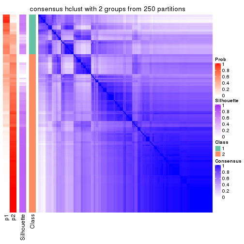</p>

</div>
<div id='tab-CV-hclust-consensus-heatmap-2'>
<pre><code class="r">consensus_heatmap(res, k = 3)
</code></pre>

<p>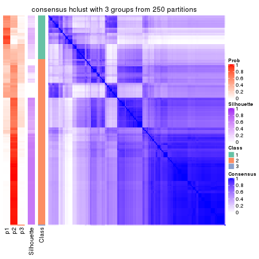</p>

</div>
<div id='tab-CV-hclust-consensus-heatmap-3'>
<pre><code class="r">consensus_heatmap(res, k = 4)
</code></pre>

<p>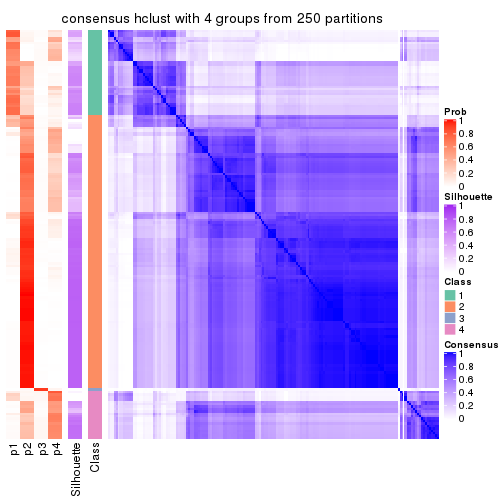</p>

</div>
<div id='tab-CV-hclust-consensus-heatmap-4'>
<pre><code class="r">consensus_heatmap(res, k = 5)
</code></pre>

<p>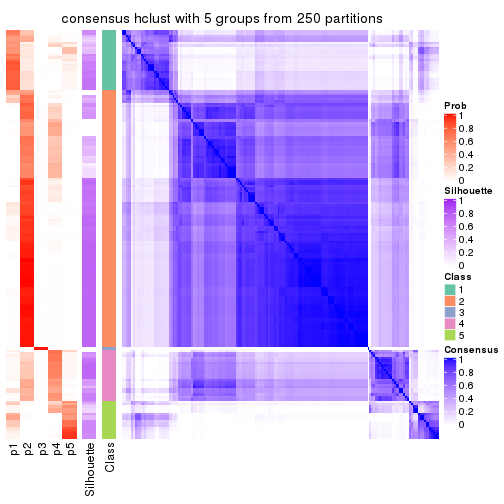</p>

</div>
<div id='tab-CV-hclust-consensus-heatmap-5'>
<pre><code class="r">consensus_heatmap(res, k = 6)
</code></pre>

<p>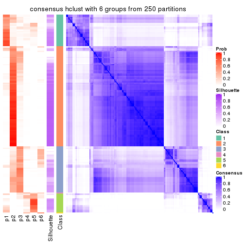</p>

</div>
</div>

Heatmaps for the membership of samples in all partitions to see how consistent they are:


<script>
$( function() {
	$( '#tabs-CV-hclust-membership-heatmap' ).tabs();
} );
</script>
<div id='tabs-CV-hclust-membership-heatmap'>
<ul>
<li><a href='#tab-CV-hclust-membership-heatmap-1'>k = 2</a></li>
<li><a href='#tab-CV-hclust-membership-heatmap-2'>k = 3</a></li>
<li><a href='#tab-CV-hclust-membership-heatmap-3'>k = 4</a></li>
<li><a href='#tab-CV-hclust-membership-heatmap-4'>k = 5</a></li>
<li><a href='#tab-CV-hclust-membership-heatmap-5'>k = 6</a></li>
</ul>
<div id='tab-CV-hclust-membership-heatmap-1'>
<pre><code class="r">membership_heatmap(res, k = 2)
</code></pre>

<p>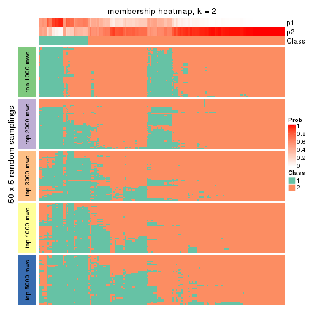</p>

</div>
<div id='tab-CV-hclust-membership-heatmap-2'>
<pre><code class="r">membership_heatmap(res, k = 3)
</code></pre>

<p>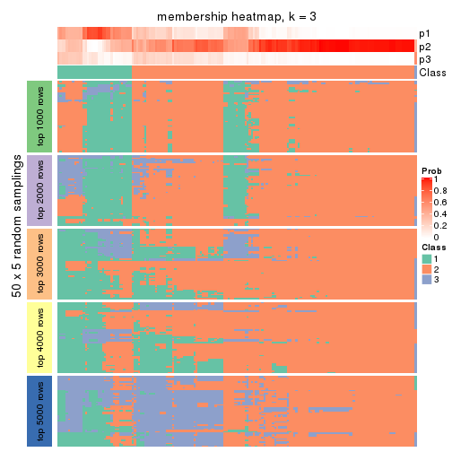</p>

</div>
<div id='tab-CV-hclust-membership-heatmap-3'>
<pre><code class="r">membership_heatmap(res, k = 4)
</code></pre>

<p>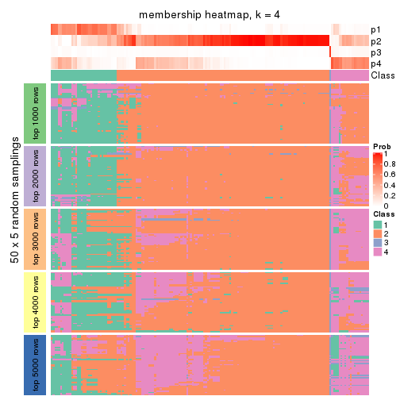</p>

</div>
<div id='tab-CV-hclust-membership-heatmap-4'>
<pre><code class="r">membership_heatmap(res, k = 5)
</code></pre>

<p>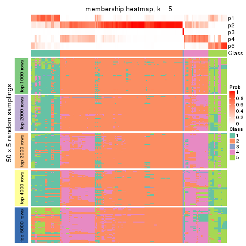</p>

</div>
<div id='tab-CV-hclust-membership-heatmap-5'>
<pre><code class="r">membership_heatmap(res, k = 6)
</code></pre>

<p>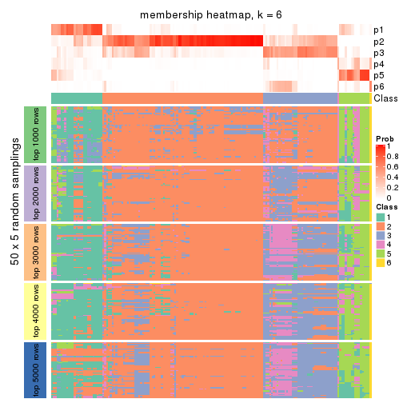</p>

</div>
</div>

As soon as we have had the classes for columns, we can look for signatures
which are significantly different between classes which can be candidate marks
for certain classes. Following are the heatmaps for signatures.


Signature heatmaps where rows are scaled:


<script>
$( function() {
	$( '#tabs-CV-hclust-get-signatures' ).tabs();
} );
</script>
<div id='tabs-CV-hclust-get-signatures'>
<ul>
<li><a href='#tab-CV-hclust-get-signatures-1'>k = 2</a></li>
<li><a href='#tab-CV-hclust-get-signatures-2'>k = 3</a></li>
<li><a href='#tab-CV-hclust-get-signatures-3'>k = 4</a></li>
<li><a href='#tab-CV-hclust-get-signatures-4'>k = 5</a></li>
<li><a href='#tab-CV-hclust-get-signatures-5'>k = 6</a></li>
</ul>
<div id='tab-CV-hclust-get-signatures-1'>
<pre><code class="r">get_signatures(res, k = 2)
</code></pre>

<p>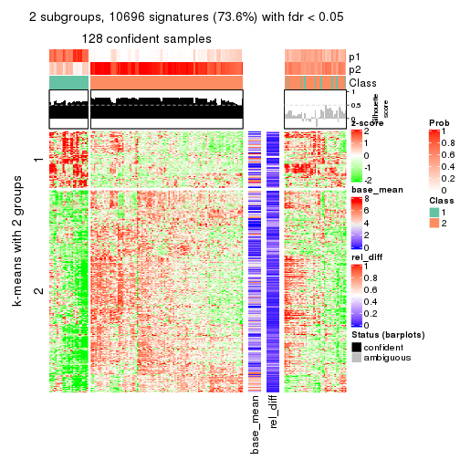</p>

</div>
<div id='tab-CV-hclust-get-signatures-2'>
<pre><code class="r">get_signatures(res, k = 3)
</code></pre>

<p></p>

</div>
<div id='tab-CV-hclust-get-signatures-3'>
<pre><code class="r">get_signatures(res, k = 4)
</code></pre>

<p>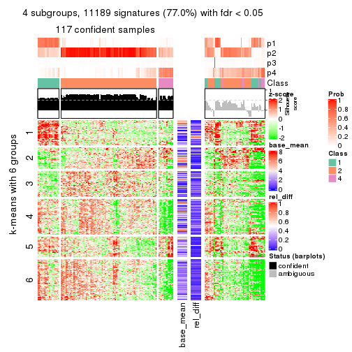</p>

</div>
<div id='tab-CV-hclust-get-signatures-4'>
<pre><code class="r">get_signatures(res, k = 5)
</code></pre>

<p>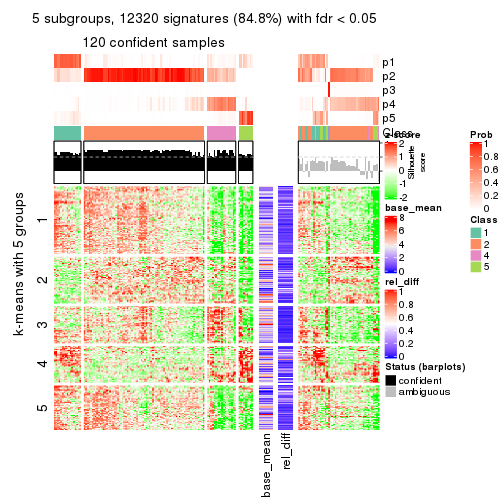</p>

</div>
<div id='tab-CV-hclust-get-signatures-5'>
<pre><code class="r">get_signatures(res, k = 6)
</code></pre>

<p>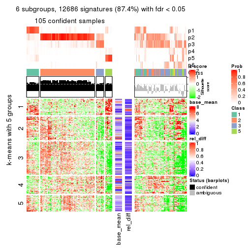</p>

</div>
</div>


Signature heatmaps where rows are not scaled:


<script>
$( function() {
	$( '#tabs-CV-hclust-get-signatures-no-scale' ).tabs();
} );
</script>
<div id='tabs-CV-hclust-get-signatures-no-scale'>
<ul>
<li><a href='#tab-CV-hclust-get-signatures-no-scale-1'>k = 2</a></li>
<li><a href='#tab-CV-hclust-get-signatures-no-scale-2'>k = 3</a></li>
<li><a href='#tab-CV-hclust-get-signatures-no-scale-3'>k = 4</a></li>
<li><a href='#tab-CV-hclust-get-signatures-no-scale-4'>k = 5</a></li>
<li><a href='#tab-CV-hclust-get-signatures-no-scale-5'>k = 6</a></li>
</ul>
<div id='tab-CV-hclust-get-signatures-no-scale-1'>
<pre><code class="r">get_signatures(res, k = 2, scale_rows = FALSE)
</code></pre>

<p>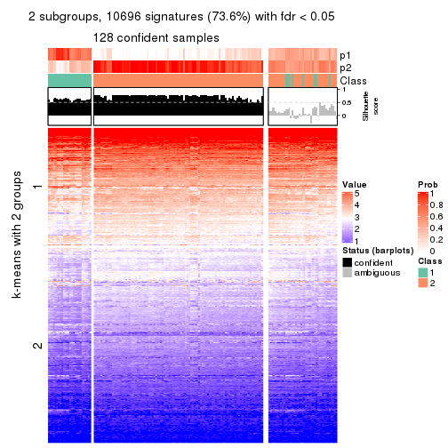</p>

</div>
<div id='tab-CV-hclust-get-signatures-no-scale-2'>
<pre><code class="r">get_signatures(res, k = 3, scale_rows = FALSE)
</code></pre>

<p></p>

</div>
<div id='tab-CV-hclust-get-signatures-no-scale-3'>
<pre><code class="r">get_signatures(res, k = 4, scale_rows = FALSE)
</code></pre>

<p>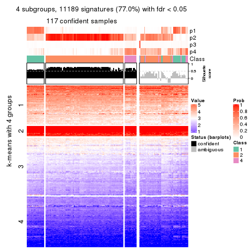</p>

</div>
<div id='tab-CV-hclust-get-signatures-no-scale-4'>
<pre><code class="r">get_signatures(res, k = 5, scale_rows = FALSE)
</code></pre>

<p>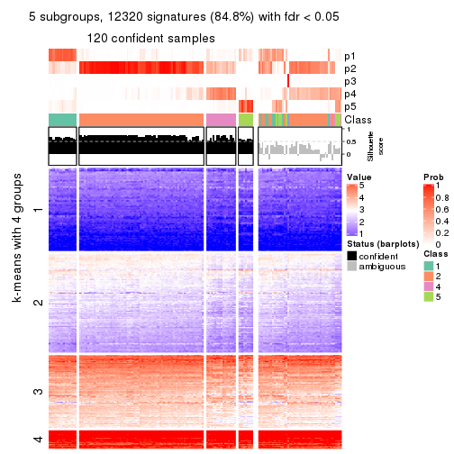</p>

</div>
<div id='tab-CV-hclust-get-signatures-no-scale-5'>
<pre><code class="r">get_signatures(res, k = 6, scale_rows = FALSE)
</code></pre>

<p>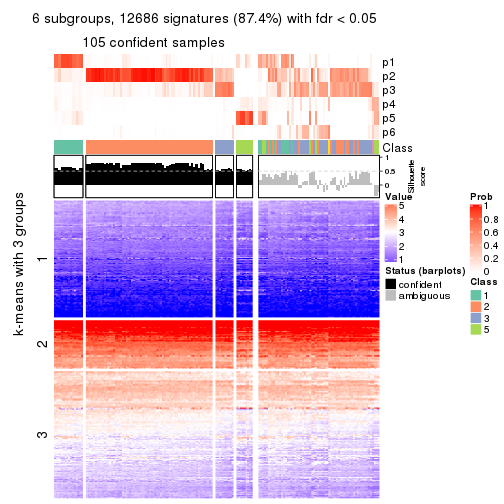</p>

</div>
</div>


Compare the overlap of signatures from different k:

```r
compare_signatures(res)
```

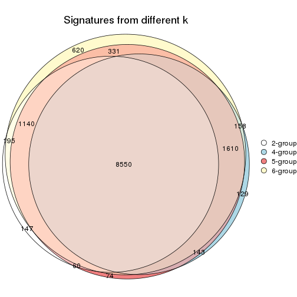

`get_signature()` returns a data frame invisibly. TO get the list of signatures, the function
call should be assigned to a variable explicitly. In following code, if `plot` argument is set
to `FALSE`, no heatmap is plotted while only the differential analysis is performed.

```r
# code only for demonstration
tb = get_signature(res, k = ..., plot = FALSE)
```

An example of the output of `tb` is:

```
#>   which_row         fdr    mean_1    mean_2 scaled_mean_1 scaled_mean_2 km
#> 1        38 0.042760348  8.373488  9.131774    -0.5533452     0.5164555  1
#> 2        40 0.018707592  7.106213  8.469186    -0.6173731     0.5762149  1
#> 3        55 0.019134737 10.221463 11.207825    -0.6159697     0.5749050  1
#> 4        59 0.006059896  5.921854  7.869574    -0.6899429     0.6439467  1
#> 5        60 0.018055526  8.928898 10.211722    -0.6204761     0.5791110  1
#> 6        98 0.009384629 15.714769 14.887706     0.6635654    -0.6193277  2
...
```

The columns in `tb` are:

1. `which_row`: row indices corresponding to the input matrix.
2. `fdr`: FDR for the differential test. 
3. `mean_x`: The mean value in group x.
4. `scaled_mean_x`: The mean value in group x after rows are scaled.
5. `km`: Row groups if k-means clustering is applied to rows.


UMAP plot which shows how samples are separated.


<script>
$( function() {
	$( '#tabs-CV-hclust-dimension-reduction' ).tabs();
} );
</script>
<div id='tabs-CV-hclust-dimension-reduction'>
<ul>
<li><a href='#tab-CV-hclust-dimension-reduction-1'>k = 2</a></li>
<li><a href='#tab-CV-hclust-dimension-reduction-2'>k = 3</a></li>
<li><a href='#tab-CV-hclust-dimension-reduction-3'>k = 4</a></li>
<li><a href='#tab-CV-hclust-dimension-reduction-4'>k = 5</a></li>
<li><a href='#tab-CV-hclust-dimension-reduction-5'>k = 6</a></li>
</ul>
<div id='tab-CV-hclust-dimension-reduction-1'>
<pre><code class="r">dimension_reduction(res, k = 2, method = &quot;UMAP&quot;)
</code></pre>

<p>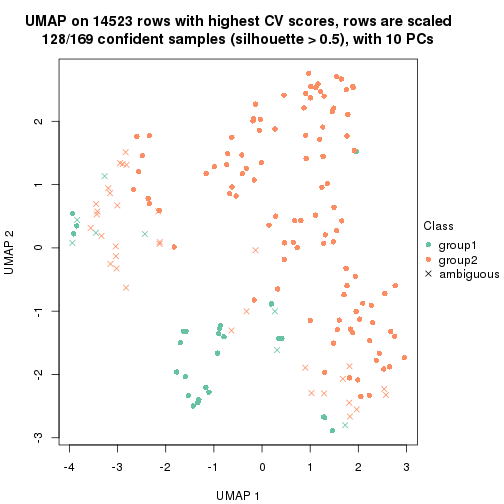</p>

</div>
<div id='tab-CV-hclust-dimension-reduction-2'>
<pre><code class="r">dimension_reduction(res, k = 3, method = &quot;UMAP&quot;)
</code></pre>

<p>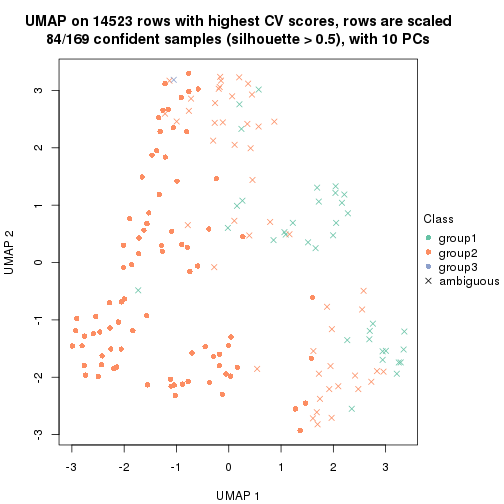</p>

</div>
<div id='tab-CV-hclust-dimension-reduction-3'>
<pre><code class="r">dimension_reduction(res, k = 4, method = &quot;UMAP&quot;)
</code></pre>

<p>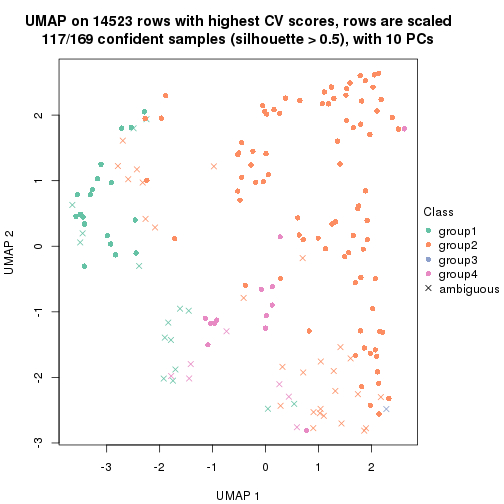</p>

</div>
<div id='tab-CV-hclust-dimension-reduction-4'>
<pre><code class="r">dimension_reduction(res, k = 5, method = &quot;UMAP&quot;)
</code></pre>

<p>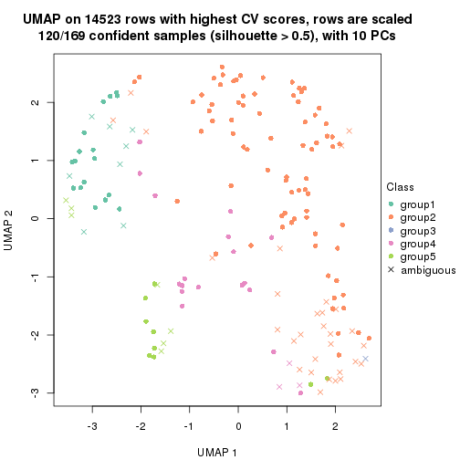</p>

</div>
<div id='tab-CV-hclust-dimension-reduction-5'>
<pre><code class="r">dimension_reduction(res, k = 6, method = &quot;UMAP&quot;)
</code></pre>

<p>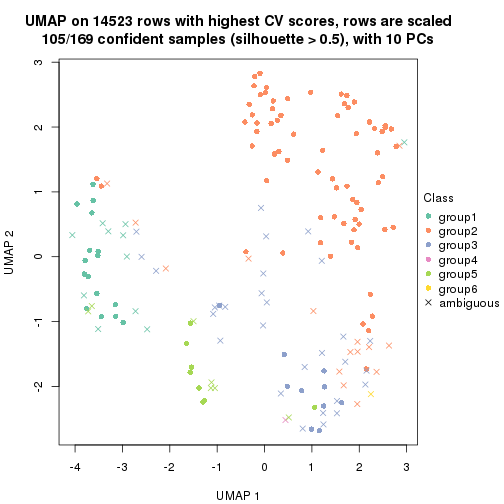</p>

</div>
</div>


Following heatmap shows how subgroups are split when increasing `k`:

```r
collect_classes(res)
```

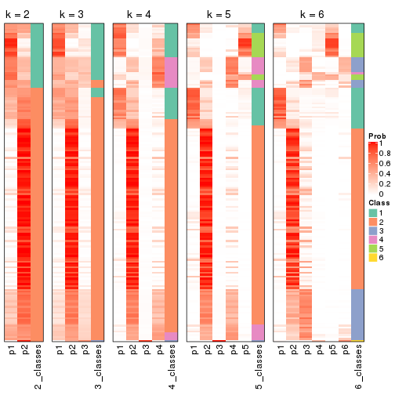


If matrix rows can be associated to genes, consider to use `GO_Enrichment(res,
...)` to perform function enrichment for the signature genes.


 

---------------------------------------------------


### CV:kmeans


The object with results only for a single top-value method and a single partition method 
can be extracted as:

```r
res = res_list["CV", "kmeans"]
# you can also extract it by
# res = res_list["CV:kmeans"]
```

A summary of `res` and all the functions that can be applied to it:

```r
res
```

```
#> A 'ConsensusPartition' object with k = 2, 3, 4, 5, 6.
#>   On a matrix with 14523 rows and 169 columns.
#>   Top rows (1000, 2000, 3000, 4000, 5000) are extracted by 'CV' method.
#>   Subgroups are detected by 'kmeans' method.
#>   Performed in total 1250 partitions by row resampling.
#>   Best k for subgroups seems to be 3.
#> 
#> Following methods can be applied to this 'ConsensusPartition' object:
#>  [1] "cola_report"             "collect_classes"         "collect_plots"          
#>  [4] "collect_stats"           "colnames"                "compare_signatures"     
#>  [7] "consensus_heatmap"       "dimension_reduction"     "functional_enrichment"  
#> [10] "get_anno_col"            "get_anno"                "get_classes"            
#> [13] "get_consensus"           "get_matrix"              "get_membership"         
#> [16] "get_param"               "get_signatures"          "get_stats"              
#> [19] "is_best_k"               "is_stable_k"             "membership_heatmap"     
#> [22] "ncol"                    "nrow"                    "plot_ecdf"              
#> [25] "rownames"                "select_partition_number" "show"                   
#> [28] "suggest_best_k"          "test_to_known_factors"
```

`collect_plots()` function collects all the plots made from `res` for all `k` (number of partitions)
into one single page to provide an easy and fast comparison between different `k`.

```r
collect_plots(res)
```

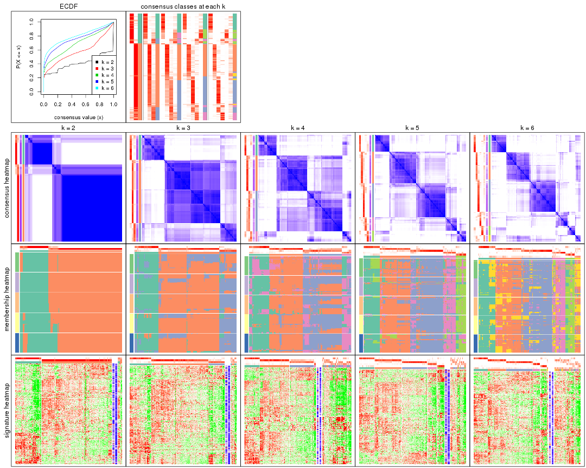

The plots are:

- The first row: a plot of the ECDF (Empirical cumulative distribution
  function) curves of the consensus matrix for each `k` and the heatmap of
  predicted classes for each `k`.
- The second row: heatmaps of the consensus matrix for each `k`.
- The third row: heatmaps of the membership matrix for each `k`.
- The fouth row: heatmaps of the signatures for each `k`.

All the plots in panels can be made by individual functions and they are
plotted later in this section.

`select_partition_number()` produces several plots showing different
statistics for choosing "optimized" `k`. There are following statistics:

- ECDF curves of the consensus matrix for each `k`;
- 1-PAC. [The PAC
  score](https://en.wikipedia.org/wiki/Consensus_clustering#Over-interpretation_potential_of_consensus_clustering)
  measures the proportion of the ambiguous subgrouping.
- Mean silhouette score.
- Concordance. The mean probability of fiting the consensus class ids in all
  partitions.
- Area increased. Denote $A_k$ as the area under the ECDF curve for current
  `k`, the area increased is defined as $A_k - A_{k-1}$.
- Rand index. The percent of pairs of samples that are both in a same cluster
  or both are not in a same cluster in the partition of k and k-1.
- Jaccard index. The ratio of pairs of samples are both in a same cluster in
  the partition of k and k-1 and the pairs of samples are both in a same
  cluster in the partition k or k-1.

The detailed explanations of these statistics can be found in [the cola
vignette](http://bioconductor.org/packages/devel/bioc/vignettes/cola/inst/doc/cola.html#toc_13).

Generally speaking, lower PAC score, higher mean silhouette score or higher
concordance corresponds to better partition. Rand index and Jaccard index
measure how similar the current partition is compared to partition with `k-1`.
If they are too similar, we won't accept `k` is better than `k-1`.

```r
select_partition_number(res)
```

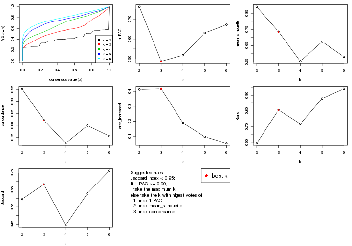

The numeric values for all these statistics can be obtained by `get_stats()`.

```r
get_stats(res)
```

```
#>   k 1-PAC mean_silhouette concordance area_increased  Rand Jaccard
#> 2 2 0.761           0.890       0.952         0.4120 0.596   0.596
#> 3 3 0.488           0.736       0.822         0.4164 0.807   0.684
#> 4 4 0.519           0.553       0.725         0.1881 0.719   0.443
#> 5 5 0.630           0.674       0.799         0.0966 0.879   0.630
#> 6 6 0.671           0.581       0.755         0.0531 0.940   0.763
```

`suggest_best_k()` suggests the best $k$ based on these statistics. The rules are as follows:

- All $k$ with Jaccard index larger than 0.95 are removed because the increase of
  the partition number does not provides enough extra information. If all $k$ are removed,
  the best $k$ is assigned by `NA`.
- For $k$ with 1-PAC larger than 0.9, the maximal $k$ is taken as the "best k". Other $k$ is called "optional k".
- If it does not fit the second rule. The $k$ with the highest vote of highest
  1-PAC, mean silhouette and concordance is taken as the "best k".

```r
suggest_best_k(res)
```

```
#> [1] 3
```


Following shows the table of the partitions (You need to click the **show/hide
code output** link to see it). The membership matrix (columns with name `p*`)
is inferred by
[`clue::cl_consensus()`](https://www.rdocumentation.org/link/cl_consensus?package=clue)
function with the `SE` method. Basically the value in the membership matrix
represents the probability to belong to a certain group. The finall class
label for an item is determined with the group with highest probability it
belongs to.

In `get_classes()` function, the entropy is calculated from the membership
matrix and the silhouette score is calculated from the consensus matrix.


<script>
$( function() {
	$( '#tabs-CV-kmeans-get-classes' ).tabs();
} );
</script>
<div id='tabs-CV-kmeans-get-classes'>
<ul>
<li><a href='#tab-CV-kmeans-get-classes-1'>k = 2</a></li>
<li><a href='#tab-CV-kmeans-get-classes-2'>k = 3</a></li>
<li><a href='#tab-CV-kmeans-get-classes-3'>k = 4</a></li>
<li><a href='#tab-CV-kmeans-get-classes-4'>k = 5</a></li>
<li><a href='#tab-CV-kmeans-get-classes-5'>k = 6</a></li>
</ul>

<div id='tab-CV-kmeans-get-classes-1'>
<p><a id='tab-CV-kmeans-get-classes-1-a' style='color:#0366d6' href='#'>show/hide code output</a></p>
<pre><code class="r">cbind(get_classes(res, k = 2), get_membership(res, k = 2))
</code></pre>

<pre><code>#&gt;            class entropy silhouette    p1    p2
#&gt; SRR2052702     2  0.0000      0.955 0.000 1.000
#&gt; SRR2052701     2  0.0000      0.955 0.000 1.000
#&gt; SRR2052700     2  0.0000      0.955 0.000 1.000
#&gt; SRR2052699     2  0.0000      0.955 0.000 1.000
#&gt; SRR2052698     2  0.0000      0.955 0.000 1.000
#&gt; SRR2052708     1  0.0000      0.925 1.000 0.000
#&gt; SRR2052749     1  0.0000      0.925 1.000 0.000
#&gt; SRR2052786     2  0.0000      0.955 0.000 1.000
#&gt; SRR2052825     2  0.9686      0.367 0.396 0.604
#&gt; SRR2052824     2  0.8661      0.604 0.288 0.712
#&gt; SRR2052823     2  0.0000      0.955 0.000 1.000
#&gt; SRR2052822     2  0.0000      0.955 0.000 1.000
#&gt; SRR2052821     2  0.0000      0.955 0.000 1.000
#&gt; SRR2052820     2  0.7219      0.737 0.200 0.800
#&gt; SRR2052819     2  0.0000      0.955 0.000 1.000
#&gt; SRR2052818     2  0.0000      0.955 0.000 1.000
#&gt; SRR2052817     2  0.0000      0.955 0.000 1.000
#&gt; SRR2052816     2  0.8661      0.604 0.288 0.712
#&gt; SRR2052815     2  0.8661      0.604 0.288 0.712
#&gt; SRR2052814     2  0.0000      0.955 0.000 1.000
#&gt; SRR2052813     2  0.0000      0.955 0.000 1.000
#&gt; SRR2052812     2  0.0000      0.955 0.000 1.000
#&gt; SRR2052811     2  0.0000      0.955 0.000 1.000
#&gt; SRR2052810     2  0.0000      0.955 0.000 1.000
#&gt; SRR2052809     2  0.0000      0.955 0.000 1.000
#&gt; SRR2052808     2  0.0000      0.955 0.000 1.000
#&gt; SRR2052807     1  0.0000      0.925 1.000 0.000
#&gt; SRR2052806     1  0.0000      0.925 1.000 0.000
#&gt; SRR2052805     1  0.0000      0.925 1.000 0.000
#&gt; SRR2052804     1  0.7219      0.744 0.800 0.200
#&gt; SRR2052803     1  0.0000      0.925 1.000 0.000
#&gt; SRR2052802     1  0.0000      0.925 1.000 0.000
#&gt; SRR2052801     1  0.0000      0.925 1.000 0.000
#&gt; SRR2052800     1  0.0000      0.925 1.000 0.000
#&gt; SRR2052799     1  0.0000      0.925 1.000 0.000
#&gt; SRR2052798     1  0.0000      0.925 1.000 0.000
#&gt; SRR2052797     2  0.0000      0.955 0.000 1.000
#&gt; SRR2052796     1  0.0000      0.925 1.000 0.000
#&gt; SRR2052795     1  0.0000      0.925 1.000 0.000
#&gt; SRR2052794     1  0.0000      0.925 1.000 0.000
#&gt; SRR2052793     1  0.0000      0.925 1.000 0.000
#&gt; SRR2052792     1  0.7219      0.744 0.800 0.200
#&gt; SRR2052791     1  0.0000      0.925 1.000 0.000
#&gt; SRR2052790     2  0.0000      0.955 0.000 1.000
#&gt; SRR2052789     2  0.0000      0.955 0.000 1.000
#&gt; SRR2052788     2  0.0000      0.955 0.000 1.000
#&gt; SRR2052787     2  0.0000      0.955 0.000 1.000
#&gt; SRR2052785     2  0.0000      0.955 0.000 1.000
#&gt; SRR2052784     2  0.0000      0.955 0.000 1.000
#&gt; SRR2052783     2  0.0000      0.955 0.000 1.000
#&gt; SRR2052782     2  0.0000      0.955 0.000 1.000
#&gt; SRR2052781     2  0.0000      0.955 0.000 1.000
#&gt; SRR2052780     2  0.0000      0.955 0.000 1.000
#&gt; SRR2052777     2  0.0000      0.955 0.000 1.000
#&gt; SRR2052779     2  0.0000      0.955 0.000 1.000
#&gt; SRR2052778     2  0.0000      0.955 0.000 1.000
#&gt; SRR2052776     2  0.0000      0.955 0.000 1.000
#&gt; SRR2052775     2  0.0000      0.955 0.000 1.000
#&gt; SRR2052773     2  0.0000      0.955 0.000 1.000
#&gt; SRR2052772     2  0.0000      0.955 0.000 1.000
#&gt; SRR2052774     2  0.0000      0.955 0.000 1.000
#&gt; SRR2052771     1  0.0000      0.925 1.000 0.000
#&gt; SRR2052769     2  0.0000      0.955 0.000 1.000
#&gt; SRR2052770     2  0.0000      0.955 0.000 1.000
#&gt; SRR2052768     2  0.0000      0.955 0.000 1.000
#&gt; SRR2052767     2  0.0000      0.955 0.000 1.000
#&gt; SRR2052766     2  0.9552      0.418 0.376 0.624
#&gt; SRR2052765     2  0.0000      0.955 0.000 1.000
#&gt; SRR2052763     2  0.0000      0.955 0.000 1.000
#&gt; SRR2052764     2  0.0000      0.955 0.000 1.000
#&gt; SRR2052761     2  0.0000      0.955 0.000 1.000
#&gt; SRR2052760     2  0.0000      0.955 0.000 1.000
#&gt; SRR2052759     2  0.0000      0.955 0.000 1.000
#&gt; SRR2052762     2  0.0000      0.955 0.000 1.000
#&gt; SRR2052758     2  0.0000      0.955 0.000 1.000
#&gt; SRR2052756     1  0.7219      0.744 0.800 0.200
#&gt; SRR2052757     2  0.0000      0.955 0.000 1.000
#&gt; SRR2052755     1  0.4939      0.848 0.892 0.108
#&gt; SRR2052754     1  0.0000      0.925 1.000 0.000
#&gt; SRR2052753     1  0.0000      0.925 1.000 0.000
#&gt; SRR2052752     1  0.0000      0.925 1.000 0.000
#&gt; SRR2052750     1  0.0376      0.923 0.996 0.004
#&gt; SRR2052751     2  0.0000      0.955 0.000 1.000
#&gt; SRR2052748     2  0.8813      0.582 0.300 0.700
#&gt; SRR2052747     1  0.0000      0.925 1.000 0.000
#&gt; SRR2052746     2  0.0000      0.955 0.000 1.000
#&gt; SRR2052745     2  0.7139      0.742 0.196 0.804
#&gt; SRR2052744     1  0.7299      0.752 0.796 0.204
#&gt; SRR2052741     2  0.0000      0.955 0.000 1.000
#&gt; SRR2052743     2  0.0000      0.955 0.000 1.000
#&gt; SRR2052740     2  0.0000      0.955 0.000 1.000
#&gt; SRR2052742     2  0.0000      0.955 0.000 1.000
#&gt; SRR2052739     2  0.0000      0.955 0.000 1.000
#&gt; SRR2052738     2  0.0000      0.955 0.000 1.000
#&gt; SRR2052736     2  0.0000      0.955 0.000 1.000
#&gt; SRR2052735     1  0.9460      0.496 0.636 0.364
#&gt; SRR2052734     1  0.9460      0.496 0.636 0.364
#&gt; SRR2052737     2  0.0000      0.955 0.000 1.000
#&gt; SRR2052733     2  0.0000      0.955 0.000 1.000
#&gt; SRR2052732     2  0.0000      0.955 0.000 1.000
#&gt; SRR2052731     2  0.0000      0.955 0.000 1.000
#&gt; SRR2052729     1  0.0000      0.925 1.000 0.000
#&gt; SRR2052728     1  0.7219      0.756 0.800 0.200
#&gt; SRR2052730     2  0.9998      0.053 0.492 0.508
#&gt; SRR2052727     1  0.0000      0.925 1.000 0.000
#&gt; SRR2052725     2  0.0000      0.955 0.000 1.000
#&gt; SRR2052726     1  0.9460      0.496 0.636 0.364
#&gt; SRR2052724     1  0.0000      0.925 1.000 0.000
#&gt; SRR2052723     2  0.9710      0.356 0.400 0.600
#&gt; SRR2052722     2  0.0000      0.955 0.000 1.000
#&gt; SRR2052721     1  0.0376      0.923 0.996 0.004
#&gt; SRR2052720     2  0.0000      0.955 0.000 1.000
#&gt; SRR2052719     2  0.0000      0.955 0.000 1.000
#&gt; SRR2052718     1  0.8499      0.656 0.724 0.276
#&gt; SRR2052717     2  0.0000      0.955 0.000 1.000
#&gt; SRR2052714     1  0.0000      0.925 1.000 0.000
#&gt; SRR2052716     2  0.8443      0.631 0.272 0.728
#&gt; SRR2052715     2  0.0000      0.955 0.000 1.000
#&gt; SRR2052713     1  0.0000      0.925 1.000 0.000
#&gt; SRR2052712     1  0.8443      0.627 0.728 0.272
#&gt; SRR2052711     2  0.8763      0.590 0.296 0.704
#&gt; SRR2052710     2  0.0000      0.955 0.000 1.000
#&gt; SRR2052707     2  0.0000      0.955 0.000 1.000
#&gt; SRR2052709     2  0.0000      0.955 0.000 1.000
#&gt; SRR2052704     2  0.7219      0.737 0.200 0.800
#&gt; SRR2052705     2  0.0000      0.955 0.000 1.000
#&gt; SRR2052697     2  0.0000      0.955 0.000 1.000
#&gt; SRR2052703     2  0.0000      0.955 0.000 1.000
#&gt; SRR2052696     1  0.0000      0.925 1.000 0.000
#&gt; SRR2052706     2  0.0000      0.955 0.000 1.000
#&gt; SRR2052695     2  0.0000      0.955 0.000 1.000
#&gt; SRR2052694     2  0.0000      0.955 0.000 1.000
#&gt; SRR2052692     2  0.0000      0.955 0.000 1.000
#&gt; SRR2052693     2  0.0000      0.955 0.000 1.000
#&gt; SRR2052691     2  0.2778      0.909 0.048 0.952
#&gt; SRR2052690     2  0.0000      0.955 0.000 1.000
#&gt; SRR2052689     2  0.8661      0.604 0.288 0.712
#&gt; SRR2052687     2  0.0000      0.955 0.000 1.000
#&gt; SRR2052686     2  0.4939      0.850 0.108 0.892
#&gt; SRR2052688     2  0.0000      0.955 0.000 1.000
#&gt; SRR2052684     1  0.7219      0.744 0.800 0.200
#&gt; SRR2052685     2  0.0000      0.955 0.000 1.000
#&gt; SRR2052683     1  0.0000      0.925 1.000 0.000
#&gt; SRR2052681     2  0.0000      0.955 0.000 1.000
#&gt; SRR2052680     2  0.8661      0.604 0.288 0.712
#&gt; SRR2052682     2  0.6712      0.747 0.176 0.824
#&gt; SRR2052679     1  0.0000      0.925 1.000 0.000
#&gt; SRR2052678     2  0.0000      0.955 0.000 1.000
#&gt; SRR2052677     2  0.0000      0.955 0.000 1.000
#&gt; SRR2052675     2  0.0000      0.955 0.000 1.000
#&gt; SRR2052676     1  0.0000      0.925 1.000 0.000
#&gt; SRR2052674     2  0.0000      0.955 0.000 1.000
#&gt; SRR2052672     2  0.0000      0.955 0.000 1.000
#&gt; SRR2052673     2  0.0000      0.955 0.000 1.000
#&gt; SRR2052671     2  0.0000      0.955 0.000 1.000
#&gt; SRR2052670     2  0.0000      0.955 0.000 1.000
#&gt; SRR2052669     2  0.0000      0.955 0.000 1.000
#&gt; SRR2052668     2  0.0000      0.955 0.000 1.000
#&gt; SRR2052667     2  0.0000      0.955 0.000 1.000
#&gt; SRR2052666     2  0.0000      0.955 0.000 1.000
#&gt; SRR2052665     2  0.0000      0.955 0.000 1.000
#&gt; SRR2052664     1  0.0000      0.925 1.000 0.000
#&gt; SRR2052663     2  0.0000      0.955 0.000 1.000
#&gt; SRR2052662     2  0.0000      0.955 0.000 1.000
#&gt; SRR2052661     1  0.7376      0.747 0.792 0.208
#&gt; SRR2052660     2  0.0000      0.955 0.000 1.000
#&gt; SRR2052659     2  0.0000      0.955 0.000 1.000
#&gt; SRR2052658     2  0.0000      0.955 0.000 1.000
#&gt; SRR2052657     1  0.0000      0.925 1.000 0.000
</code></pre>

<script>
$('#tab-CV-kmeans-get-classes-1-a').parent().next().next().hide();
$('#tab-CV-kmeans-get-classes-1-a').click(function(){
  $('#tab-CV-kmeans-get-classes-1-a').parent().next().next().toggle();
  return(false);
});
</script>
</div>

<div id='tab-CV-kmeans-get-classes-2'>
<p><a id='tab-CV-kmeans-get-classes-2-a' style='color:#0366d6' href='#'>show/hide code output</a></p>
<pre><code class="r">cbind(get_classes(res, k = 3), get_membership(res, k = 3))
</code></pre>

<pre><code>#&gt;            class entropy silhouette    p1    p2    p3
#&gt; SRR2052702     2  0.1877      0.813 0.012 0.956 0.032
#&gt; SRR2052701     2  0.2339      0.802 0.012 0.940 0.048
#&gt; SRR2052700     2  0.6079      0.362 0.000 0.612 0.388
#&gt; SRR2052699     2  0.5508      0.723 0.028 0.784 0.188
#&gt; SRR2052698     2  0.4842      0.755 0.000 0.776 0.224
#&gt; SRR2052708     1  0.1163      0.830 0.972 0.000 0.028
#&gt; SRR2052749     1  0.1163      0.830 0.972 0.000 0.028
#&gt; SRR2052786     2  0.1015      0.821 0.012 0.980 0.008
#&gt; SRR2052825     3  0.4349      0.786 0.020 0.128 0.852
#&gt; SRR2052824     3  0.4172      0.800 0.004 0.156 0.840
#&gt; SRR2052823     2  0.1999      0.811 0.012 0.952 0.036
#&gt; SRR2052822     2  0.1860      0.824 0.000 0.948 0.052
#&gt; SRR2052821     2  0.1643      0.825 0.000 0.956 0.044
#&gt; SRR2052820     3  0.5115      0.762 0.004 0.228 0.768
#&gt; SRR2052819     3  0.5431      0.706 0.000 0.284 0.716
#&gt; SRR2052818     2  0.2261      0.824 0.000 0.932 0.068
#&gt; SRR2052817     2  0.4796      0.758 0.000 0.780 0.220
#&gt; SRR2052816     3  0.5115      0.742 0.004 0.228 0.768
#&gt; SRR2052815     3  0.4575      0.797 0.004 0.184 0.812
#&gt; SRR2052814     2  0.3267      0.807 0.000 0.884 0.116
#&gt; SRR2052813     2  0.0747      0.825 0.000 0.984 0.016
#&gt; SRR2052812     2  0.1751      0.813 0.012 0.960 0.028
#&gt; SRR2052811     2  0.1877      0.813 0.012 0.956 0.032
#&gt; SRR2052810     3  0.5968      0.614 0.000 0.364 0.636
#&gt; SRR2052809     2  0.2796      0.815 0.000 0.908 0.092
#&gt; SRR2052808     2  0.6008      0.516 0.000 0.628 0.372
#&gt; SRR2052807     3  0.5591      0.232 0.304 0.000 0.696
#&gt; SRR2052806     1  0.2625      0.819 0.916 0.000 0.084
#&gt; SRR2052805     1  0.2625      0.819 0.916 0.000 0.084
#&gt; SRR2052804     3  0.5119      0.592 0.160 0.028 0.812
#&gt; SRR2052803     1  0.2625      0.819 0.916 0.000 0.084
#&gt; SRR2052802     3  0.4346      0.524 0.184 0.000 0.816
#&gt; SRR2052801     1  0.5988      0.535 0.632 0.000 0.368
#&gt; SRR2052800     3  0.4521      0.532 0.180 0.004 0.816
#&gt; SRR2052799     1  0.5254      0.684 0.736 0.000 0.264
#&gt; SRR2052798     1  0.0237      0.830 0.996 0.000 0.004
#&gt; SRR2052797     2  0.1289      0.826 0.000 0.968 0.032
#&gt; SRR2052796     1  0.4235      0.771 0.824 0.000 0.176
#&gt; SRR2052795     1  0.1163      0.830 0.972 0.000 0.028
#&gt; SRR2052794     1  0.6079      0.500 0.612 0.000 0.388
#&gt; SRR2052793     1  0.4178      0.774 0.828 0.000 0.172
#&gt; SRR2052792     3  0.5355      0.599 0.160 0.036 0.804
#&gt; SRR2052791     1  0.4178      0.773 0.828 0.000 0.172
#&gt; SRR2052790     2  0.1163      0.826 0.000 0.972 0.028
#&gt; SRR2052789     2  0.4605      0.769 0.000 0.796 0.204
#&gt; SRR2052788     2  0.4750      0.761 0.000 0.784 0.216
#&gt; SRR2052787     2  0.0848      0.824 0.008 0.984 0.008
#&gt; SRR2052785     2  0.4796      0.758 0.000 0.780 0.220
#&gt; SRR2052784     2  0.2711      0.815 0.000 0.912 0.088
#&gt; SRR2052783     2  0.4702      0.764 0.000 0.788 0.212
#&gt; SRR2052782     2  0.0892      0.826 0.000 0.980 0.020
#&gt; SRR2052781     2  0.4346      0.781 0.000 0.816 0.184
#&gt; SRR2052780     2  0.3551      0.802 0.000 0.868 0.132
#&gt; SRR2052777     2  0.0592      0.825 0.000 0.988 0.012
#&gt; SRR2052779     2  0.0892      0.826 0.000 0.980 0.020
#&gt; SRR2052778     3  0.5431      0.705 0.000 0.284 0.716
#&gt; SRR2052776     2  0.3192      0.808 0.000 0.888 0.112
#&gt; SRR2052775     2  0.4842      0.755 0.000 0.776 0.224
#&gt; SRR2052773     2  0.3551      0.803 0.000 0.868 0.132
#&gt; SRR2052772     2  0.4931      0.747 0.000 0.768 0.232
#&gt; SRR2052774     2  0.4750      0.761 0.000 0.784 0.216
#&gt; SRR2052771     1  0.6168      0.455 0.588 0.000 0.412
#&gt; SRR2052769     2  0.3941      0.796 0.000 0.844 0.156
#&gt; SRR2052770     3  0.5678      0.646 0.000 0.316 0.684
#&gt; SRR2052768     2  0.1751      0.813 0.012 0.960 0.028
#&gt; SRR2052767     2  0.1751      0.813 0.012 0.960 0.028
#&gt; SRR2052766     3  0.4033      0.790 0.008 0.136 0.856
#&gt; SRR2052765     2  0.2878      0.815 0.000 0.904 0.096
#&gt; SRR2052763     2  0.4178      0.786 0.000 0.828 0.172
#&gt; SRR2052764     2  0.1877      0.813 0.012 0.956 0.032
#&gt; SRR2052761     2  0.4346      0.788 0.000 0.816 0.184
#&gt; SRR2052760     2  0.1482      0.815 0.012 0.968 0.020
#&gt; SRR2052759     2  0.5058      0.734 0.000 0.756 0.244
#&gt; SRR2052762     2  0.1832      0.811 0.008 0.956 0.036
#&gt; SRR2052758     2  0.4750      0.762 0.000 0.784 0.216
#&gt; SRR2052756     1  0.8168      0.528 0.612 0.108 0.280
#&gt; SRR2052757     2  0.4796      0.759 0.000 0.780 0.220
#&gt; SRR2052755     1  0.5481      0.768 0.816 0.076 0.108
#&gt; SRR2052754     1  0.3619      0.795 0.864 0.000 0.136
#&gt; SRR2052753     1  0.5042      0.780 0.836 0.060 0.104
#&gt; SRR2052752     1  0.2711      0.819 0.912 0.000 0.088
#&gt; SRR2052750     1  0.5137      0.778 0.832 0.064 0.104
#&gt; SRR2052751     2  0.4291      0.793 0.000 0.820 0.180
#&gt; SRR2052748     3  0.4409      0.800 0.004 0.172 0.824
#&gt; SRR2052747     1  0.1163      0.830 0.972 0.000 0.028
#&gt; SRR2052746     2  0.4931      0.747 0.000 0.768 0.232
#&gt; SRR2052745     3  0.5754      0.690 0.004 0.296 0.700
#&gt; SRR2052744     1  0.4295      0.779 0.864 0.104 0.032
#&gt; SRR2052741     2  0.3310      0.776 0.028 0.908 0.064
#&gt; SRR2052743     2  0.2229      0.804 0.012 0.944 0.044
#&gt; SRR2052740     2  0.3310      0.776 0.028 0.908 0.064
#&gt; SRR2052742     2  0.3846      0.807 0.016 0.876 0.108
#&gt; SRR2052739     2  0.0829      0.824 0.004 0.984 0.012
#&gt; SRR2052738     2  0.5058      0.734 0.000 0.756 0.244
#&gt; SRR2052736     2  0.4094      0.745 0.028 0.872 0.100
#&gt; SRR2052735     1  0.6317      0.730 0.772 0.124 0.104
#&gt; SRR2052734     1  0.5138      0.755 0.828 0.120 0.052
#&gt; SRR2052737     2  0.0661      0.824 0.004 0.988 0.008
#&gt; SRR2052733     3  0.5591      0.672 0.000 0.304 0.696
#&gt; SRR2052732     2  0.1877      0.813 0.012 0.956 0.032
#&gt; SRR2052731     2  0.4796      0.758 0.000 0.780 0.220
#&gt; SRR2052729     1  0.1015      0.828 0.980 0.012 0.008
#&gt; SRR2052728     1  0.4295      0.779 0.864 0.104 0.032
#&gt; SRR2052730     3  0.4136      0.779 0.020 0.116 0.864
#&gt; SRR2052727     1  0.1337      0.826 0.972 0.012 0.016
#&gt; SRR2052725     2  0.5402      0.678 0.028 0.792 0.180
#&gt; SRR2052726     1  0.6460      0.725 0.764 0.124 0.112
#&gt; SRR2052724     1  0.3038      0.814 0.896 0.000 0.104
#&gt; SRR2052723     3  0.3896      0.787 0.008 0.128 0.864
#&gt; SRR2052722     2  0.4931      0.747 0.000 0.768 0.232
#&gt; SRR2052721     1  0.3337      0.804 0.908 0.060 0.032
#&gt; SRR2052720     2  0.0829      0.820 0.012 0.984 0.004
#&gt; SRR2052719     2  0.1337      0.820 0.012 0.972 0.016
#&gt; SRR2052718     1  0.6597      0.719 0.756 0.124 0.120
#&gt; SRR2052717     2  0.1999      0.809 0.012 0.952 0.036
#&gt; SRR2052714     3  0.6298      0.076 0.388 0.004 0.608
#&gt; SRR2052716     3  0.4883      0.781 0.004 0.208 0.788
#&gt; SRR2052715     2  0.5058      0.734 0.000 0.756 0.244
#&gt; SRR2052713     1  0.1163      0.830 0.972 0.000 0.028
#&gt; SRR2052712     3  0.5117      0.664 0.108 0.060 0.832
#&gt; SRR2052711     3  0.5728      0.698 0.032 0.196 0.772
#&gt; SRR2052710     2  0.4796      0.759 0.000 0.780 0.220
#&gt; SRR2052707     2  0.4931      0.747 0.000 0.768 0.232
#&gt; SRR2052709     2  0.4750      0.761 0.000 0.784 0.216
#&gt; SRR2052704     3  0.4978      0.781 0.004 0.216 0.780
#&gt; SRR2052705     2  0.1620      0.815 0.012 0.964 0.024
#&gt; SRR2052697     2  0.3499      0.772 0.028 0.900 0.072
#&gt; SRR2052703     2  0.4796      0.758 0.000 0.780 0.220
#&gt; SRR2052696     1  0.1163      0.830 0.972 0.000 0.028
#&gt; SRR2052706     2  0.3192      0.810 0.000 0.888 0.112
#&gt; SRR2052695     2  0.0424      0.825 0.000 0.992 0.008
#&gt; SRR2052694     2  0.0829      0.820 0.012 0.984 0.004
#&gt; SRR2052692     2  0.5016      0.738 0.000 0.760 0.240
#&gt; SRR2052693     2  0.4974      0.744 0.000 0.764 0.236
#&gt; SRR2052691     1  0.8830      0.249 0.468 0.416 0.116
#&gt; SRR2052690     2  0.4249      0.737 0.028 0.864 0.108
#&gt; SRR2052689     3  0.4733      0.791 0.004 0.196 0.800
#&gt; SRR2052687     3  0.5178      0.738 0.000 0.256 0.744
#&gt; SRR2052686     2  0.9999     -0.285 0.328 0.340 0.332
#&gt; SRR2052688     2  0.0829      0.824 0.004 0.984 0.012
#&gt; SRR2052684     3  0.5239      0.595 0.160 0.032 0.808
#&gt; SRR2052685     2  0.3530      0.771 0.032 0.900 0.068
#&gt; SRR2052683     1  0.2261      0.824 0.932 0.000 0.068
#&gt; SRR2052681     2  0.6307      0.156 0.000 0.512 0.488
#&gt; SRR2052680     3  0.4110      0.799 0.004 0.152 0.844
#&gt; SRR2052682     2  0.7044      0.541 0.168 0.724 0.108
#&gt; SRR2052679     1  0.0829      0.829 0.984 0.012 0.004
#&gt; SRR2052678     2  0.4796      0.758 0.000 0.780 0.220
#&gt; SRR2052677     2  0.0747      0.825 0.000 0.984 0.016
#&gt; SRR2052675     2  0.3406      0.774 0.028 0.904 0.068
#&gt; SRR2052676     1  0.1015      0.830 0.980 0.012 0.008
#&gt; SRR2052674     2  0.6305      0.123 0.000 0.516 0.484
#&gt; SRR2052672     2  0.4842      0.755 0.000 0.776 0.224
#&gt; SRR2052673     2  0.3406      0.774 0.028 0.904 0.068
#&gt; SRR2052671     2  0.2116      0.807 0.012 0.948 0.040
#&gt; SRR2052670     2  0.4750      0.761 0.000 0.784 0.216
#&gt; SRR2052669     2  0.0829      0.822 0.012 0.984 0.004
#&gt; SRR2052668     2  0.3678      0.768 0.028 0.892 0.080
#&gt; SRR2052667     2  0.1877      0.826 0.012 0.956 0.032
#&gt; SRR2052666     2  0.4796      0.765 0.000 0.780 0.220
#&gt; SRR2052665     2  0.2446      0.803 0.012 0.936 0.052
#&gt; SRR2052664     1  0.6307      0.278 0.512 0.000 0.488
#&gt; SRR2052663     2  0.3370      0.776 0.024 0.904 0.072
#&gt; SRR2052662     2  0.1620      0.814 0.012 0.964 0.024
#&gt; SRR2052661     1  0.6949      0.688 0.732 0.156 0.112
#&gt; SRR2052660     2  0.4931      0.747 0.000 0.768 0.232
#&gt; SRR2052659     2  0.5397      0.705 0.000 0.720 0.280
#&gt; SRR2052658     2  0.3120      0.810 0.012 0.908 0.080
#&gt; SRR2052657     1  0.1031      0.830 0.976 0.000 0.024
</code></pre>

<script>
$('#tab-CV-kmeans-get-classes-2-a').parent().next().next().hide();
$('#tab-CV-kmeans-get-classes-2-a').click(function(){
  $('#tab-CV-kmeans-get-classes-2-a').parent().next().next().toggle();
  return(false);
});
</script>
</div>

<div id='tab-CV-kmeans-get-classes-3'>
<p><a id='tab-CV-kmeans-get-classes-3-a' style='color:#0366d6' href='#'>show/hide code output</a></p>
<pre><code class="r">cbind(get_classes(res, k = 4), get_membership(res, k = 4))
</code></pre>

<pre><code>#&gt;            class entropy silhouette    p1    p2    p3    p4
#&gt; SRR2052702     2  0.1356     0.8125 0.000 0.960 0.032 0.008
#&gt; SRR2052701     2  0.2297     0.8078 0.024 0.932 0.012 0.032
#&gt; SRR2052700     3  0.6640     0.2771 0.000 0.352 0.552 0.096
#&gt; SRR2052699     3  0.8137     0.2898 0.040 0.340 0.476 0.144
#&gt; SRR2052698     3  0.4888     0.5464 0.000 0.412 0.588 0.000
#&gt; SRR2052708     1  0.1557     0.7299 0.944 0.000 0.000 0.056
#&gt; SRR2052749     1  0.1389     0.7282 0.952 0.000 0.000 0.048
#&gt; SRR2052786     2  0.1474     0.8172 0.000 0.948 0.052 0.000
#&gt; SRR2052825     3  0.4998    -0.3311 0.000 0.000 0.512 0.488
#&gt; SRR2052824     3  0.5097    -0.2141 0.000 0.004 0.568 0.428
#&gt; SRR2052823     2  0.1722     0.8051 0.000 0.944 0.048 0.008
#&gt; SRR2052822     2  0.4605     0.2617 0.000 0.664 0.336 0.000
#&gt; SRR2052821     2  0.1792     0.8028 0.000 0.932 0.068 0.000
#&gt; SRR2052820     3  0.2399     0.5121 0.000 0.048 0.920 0.032
#&gt; SRR2052819     3  0.4635     0.4689 0.000 0.080 0.796 0.124
#&gt; SRR2052818     2  0.3659     0.6998 0.000 0.840 0.136 0.024
#&gt; SRR2052817     3  0.4888     0.5464 0.000 0.412 0.588 0.000
#&gt; SRR2052816     3  0.5799     0.1325 0.000 0.068 0.668 0.264
#&gt; SRR2052815     3  0.5105    -0.2233 0.000 0.004 0.564 0.432
#&gt; SRR2052814     2  0.4830    -0.0175 0.000 0.608 0.392 0.000
#&gt; SRR2052813     2  0.1867     0.8046 0.000 0.928 0.072 0.000
#&gt; SRR2052812     2  0.0188     0.8233 0.000 0.996 0.004 0.000
#&gt; SRR2052811     2  0.1356     0.8125 0.000 0.960 0.032 0.008
#&gt; SRR2052810     3  0.6436     0.3324 0.000 0.292 0.608 0.100
#&gt; SRR2052809     2  0.3266     0.6841 0.000 0.832 0.168 0.000
#&gt; SRR2052808     3  0.4244     0.6139 0.000 0.168 0.800 0.032
#&gt; SRR2052807     4  0.3793     0.5516 0.044 0.000 0.112 0.844
#&gt; SRR2052806     1  0.4776     0.2364 0.624 0.000 0.000 0.376
#&gt; SRR2052805     1  0.4790     0.2262 0.620 0.000 0.000 0.380
#&gt; SRR2052804     4  0.5158     0.3525 0.004 0.000 0.472 0.524
#&gt; SRR2052803     1  0.4790     0.2262 0.620 0.000 0.000 0.380
#&gt; SRR2052802     4  0.3718     0.5547 0.012 0.000 0.168 0.820
#&gt; SRR2052801     4  0.4973     0.4638 0.348 0.000 0.008 0.644
#&gt; SRR2052800     4  0.4019     0.5516 0.012 0.000 0.196 0.792
#&gt; SRR2052799     4  0.4973     0.4638 0.348 0.000 0.008 0.644
#&gt; SRR2052798     1  0.0707     0.7411 0.980 0.000 0.000 0.020
#&gt; SRR2052797     2  0.1389     0.8116 0.000 0.952 0.048 0.000
#&gt; SRR2052796     4  0.4972     0.2800 0.456 0.000 0.000 0.544
#&gt; SRR2052795     1  0.1389     0.7282 0.952 0.000 0.000 0.048
#&gt; SRR2052794     4  0.4973     0.4638 0.348 0.000 0.008 0.644
#&gt; SRR2052793     4  0.4972     0.2800 0.456 0.000 0.000 0.544
#&gt; SRR2052792     4  0.5268     0.4609 0.012 0.000 0.396 0.592
#&gt; SRR2052791     4  0.4972     0.2800 0.456 0.000 0.000 0.544
#&gt; SRR2052790     2  0.2216     0.7866 0.000 0.908 0.092 0.000
#&gt; SRR2052789     3  0.4916     0.5299 0.000 0.424 0.576 0.000
#&gt; SRR2052788     3  0.4898     0.5420 0.000 0.416 0.584 0.000
#&gt; SRR2052787     2  0.1940     0.8025 0.000 0.924 0.076 0.000
#&gt; SRR2052785     3  0.4843     0.5688 0.000 0.396 0.604 0.000
#&gt; SRR2052784     2  0.4925    -0.1322 0.000 0.572 0.428 0.000
#&gt; SRR2052783     3  0.4907     0.5362 0.000 0.420 0.580 0.000
#&gt; SRR2052782     2  0.1867     0.8046 0.000 0.928 0.072 0.000
#&gt; SRR2052781     3  0.4933     0.5161 0.000 0.432 0.568 0.000
#&gt; SRR2052780     3  0.4994     0.4170 0.000 0.480 0.520 0.000
#&gt; SRR2052777     2  0.2011     0.7980 0.000 0.920 0.080 0.000
#&gt; SRR2052779     2  0.1867     0.8046 0.000 0.928 0.072 0.000
#&gt; SRR2052778     3  0.2773     0.5394 0.000 0.072 0.900 0.028
#&gt; SRR2052776     2  0.5000    -0.3617 0.000 0.504 0.496 0.000
#&gt; SRR2052775     3  0.4564     0.6228 0.000 0.328 0.672 0.000
#&gt; SRR2052773     3  0.4985     0.4393 0.000 0.468 0.532 0.000
#&gt; SRR2052772     3  0.4624     0.6168 0.000 0.340 0.660 0.000
#&gt; SRR2052774     3  0.4907     0.5362 0.000 0.420 0.580 0.000
#&gt; SRR2052771     4  0.5090     0.4791 0.324 0.000 0.016 0.660
#&gt; SRR2052769     3  0.4792     0.5762 0.000 0.312 0.680 0.008
#&gt; SRR2052770     3  0.2973     0.5678 0.000 0.096 0.884 0.020
#&gt; SRR2052768     2  0.0188     0.8233 0.000 0.996 0.004 0.000
#&gt; SRR2052767     2  0.0657     0.8214 0.000 0.984 0.012 0.004
#&gt; SRR2052766     3  0.5250    -0.2366 0.000 0.008 0.552 0.440
#&gt; SRR2052765     2  0.2179     0.8073 0.000 0.924 0.064 0.012
#&gt; SRR2052763     3  0.4605     0.6081 0.000 0.336 0.664 0.000
#&gt; SRR2052764     2  0.1356     0.8125 0.000 0.960 0.032 0.008
#&gt; SRR2052761     3  0.4360     0.6292 0.000 0.248 0.744 0.008
#&gt; SRR2052760     2  0.0817     0.8231 0.000 0.976 0.024 0.000
#&gt; SRR2052759     3  0.4222     0.6347 0.000 0.272 0.728 0.000
#&gt; SRR2052762     2  0.2198     0.8142 0.000 0.920 0.072 0.008
#&gt; SRR2052758     3  0.4661     0.6122 0.000 0.348 0.652 0.000
#&gt; SRR2052756     1  0.6035     0.6147 0.700 0.028 0.052 0.220
#&gt; SRR2052757     3  0.4888     0.5464 0.000 0.412 0.588 0.000
#&gt; SRR2052755     1  0.4931     0.6978 0.792 0.028 0.036 0.144
#&gt; SRR2052754     4  0.4981     0.2609 0.464 0.000 0.000 0.536
#&gt; SRR2052753     1  0.4830     0.7020 0.800 0.028 0.036 0.136
#&gt; SRR2052752     1  0.4103     0.4972 0.744 0.000 0.000 0.256
#&gt; SRR2052750     1  0.4830     0.7020 0.800 0.028 0.036 0.136
#&gt; SRR2052751     3  0.5600     0.5385 0.000 0.376 0.596 0.028
#&gt; SRR2052748     3  0.4706     0.2164 0.000 0.020 0.732 0.248
#&gt; SRR2052747     1  0.2011     0.7071 0.920 0.000 0.000 0.080
#&gt; SRR2052746     3  0.4477     0.6281 0.000 0.312 0.688 0.000
#&gt; SRR2052745     3  0.3367     0.5721 0.000 0.108 0.864 0.028
#&gt; SRR2052744     1  0.2060     0.7444 0.932 0.016 0.000 0.052
#&gt; SRR2052741     2  0.5223     0.7267 0.048 0.796 0.068 0.088
#&gt; SRR2052743     2  0.2335     0.8132 0.000 0.920 0.060 0.020
#&gt; SRR2052740     2  0.4844     0.7351 0.040 0.816 0.060 0.084
#&gt; SRR2052742     3  0.6480     0.4794 0.008 0.368 0.564 0.060
#&gt; SRR2052739     2  0.0707     0.8220 0.000 0.980 0.020 0.000
#&gt; SRR2052738     3  0.4431     0.6302 0.000 0.304 0.696 0.000
#&gt; SRR2052736     2  0.5570     0.7009 0.052 0.772 0.060 0.116
#&gt; SRR2052735     1  0.5501     0.6806 0.768 0.060 0.036 0.136
#&gt; SRR2052734     1  0.3567     0.7238 0.868 0.052 0.004 0.076
#&gt; SRR2052737     2  0.1474     0.8160 0.000 0.948 0.052 0.000
#&gt; SRR2052733     3  0.3099     0.5745 0.000 0.104 0.876 0.020
#&gt; SRR2052732     2  0.3211     0.7749 0.012 0.892 0.056 0.040
#&gt; SRR2052731     3  0.4830     0.5741 0.000 0.392 0.608 0.000
#&gt; SRR2052729     1  0.0188     0.7453 0.996 0.000 0.000 0.004
#&gt; SRR2052728     1  0.1610     0.7463 0.952 0.016 0.000 0.032
#&gt; SRR2052730     3  0.4992    -0.3047 0.000 0.000 0.524 0.476
#&gt; SRR2052727     1  0.0188     0.7453 0.996 0.000 0.000 0.004
#&gt; SRR2052725     2  0.7112     0.5568 0.052 0.660 0.140 0.148
#&gt; SRR2052726     1  0.5738     0.6671 0.748 0.060 0.036 0.156
#&gt; SRR2052724     1  0.4370     0.7126 0.800 0.000 0.044 0.156
#&gt; SRR2052723     3  0.5152     0.0948 0.000 0.020 0.664 0.316
#&gt; SRR2052722     3  0.4661     0.6117 0.000 0.348 0.652 0.000
#&gt; SRR2052721     1  0.1938     0.7452 0.936 0.012 0.000 0.052
#&gt; SRR2052720     2  0.1474     0.8160 0.000 0.948 0.052 0.000
#&gt; SRR2052719     2  0.0469     0.8229 0.000 0.988 0.012 0.000
#&gt; SRR2052718     1  0.5984     0.6531 0.732 0.064 0.040 0.164
#&gt; SRR2052717     2  0.2048     0.8152 0.000 0.928 0.064 0.008
#&gt; SRR2052714     1  0.7586    -0.0320 0.416 0.000 0.196 0.388
#&gt; SRR2052716     3  0.3399     0.4492 0.000 0.040 0.868 0.092
#&gt; SRR2052715     3  0.4222     0.6350 0.000 0.272 0.728 0.000
#&gt; SRR2052713     1  0.1637     0.7215 0.940 0.000 0.000 0.060
#&gt; SRR2052712     4  0.5163     0.3371 0.004 0.000 0.480 0.516
#&gt; SRR2052711     3  0.6462     0.2426 0.024 0.060 0.644 0.272
#&gt; SRR2052710     3  0.4866     0.5554 0.000 0.404 0.596 0.000
#&gt; SRR2052707     3  0.4679     0.6092 0.000 0.352 0.648 0.000
#&gt; SRR2052709     3  0.4907     0.5389 0.000 0.420 0.580 0.000
#&gt; SRR2052704     3  0.3205     0.4367 0.000 0.024 0.872 0.104
#&gt; SRR2052705     2  0.1118     0.8207 0.000 0.964 0.036 0.000
#&gt; SRR2052697     2  0.5064     0.6968 0.048 0.804 0.056 0.092
#&gt; SRR2052703     3  0.4697     0.6065 0.000 0.356 0.644 0.000
#&gt; SRR2052696     1  0.1389     0.7282 0.952 0.000 0.000 0.048
#&gt; SRR2052706     2  0.2255     0.8051 0.000 0.920 0.068 0.012
#&gt; SRR2052695     2  0.1557     0.8146 0.000 0.944 0.056 0.000
#&gt; SRR2052694     2  0.1302     0.8190 0.000 0.956 0.044 0.000
#&gt; SRR2052692     3  0.4222     0.6350 0.000 0.272 0.728 0.000
#&gt; SRR2052693     3  0.4431     0.6312 0.000 0.304 0.696 0.000
#&gt; SRR2052691     1  0.6791     0.5893 0.688 0.128 0.052 0.132
#&gt; SRR2052690     2  0.5017     0.7277 0.012 0.788 0.076 0.124
#&gt; SRR2052689     3  0.5080    -0.2008 0.000 0.004 0.576 0.420
#&gt; SRR2052687     3  0.3539     0.3300 0.000 0.004 0.820 0.176
#&gt; SRR2052686     1  0.8774     0.3825 0.512 0.140 0.132 0.216
#&gt; SRR2052688     2  0.0707     0.8223 0.000 0.980 0.020 0.000
#&gt; SRR2052684     4  0.5399     0.3640 0.012 0.000 0.468 0.520
#&gt; SRR2052685     2  0.3487     0.7631 0.016 0.880 0.040 0.064
#&gt; SRR2052683     1  0.4406     0.3989 0.700 0.000 0.000 0.300
#&gt; SRR2052681     3  0.6071     0.4839 0.000 0.144 0.684 0.172
#&gt; SRR2052680     3  0.4933    -0.2231 0.000 0.000 0.568 0.432
#&gt; SRR2052682     2  0.7329     0.3684 0.252 0.604 0.040 0.104
#&gt; SRR2052679     1  0.0188     0.7453 0.996 0.000 0.000 0.004
#&gt; SRR2052678     3  0.4817     0.5786 0.000 0.388 0.612 0.000
#&gt; SRR2052677     2  0.2281     0.7832 0.000 0.904 0.096 0.000
#&gt; SRR2052675     2  0.4213     0.7313 0.040 0.848 0.036 0.076
#&gt; SRR2052676     1  0.0707     0.7424 0.980 0.000 0.000 0.020
#&gt; SRR2052674     3  0.4673     0.5098 0.000 0.132 0.792 0.076
#&gt; SRR2052672     3  0.4746     0.5965 0.000 0.368 0.632 0.000
#&gt; SRR2052673     2  0.4640     0.7145 0.052 0.828 0.044 0.076
#&gt; SRR2052671     2  0.1388     0.8126 0.000 0.960 0.028 0.012
#&gt; SRR2052670     3  0.4888     0.5465 0.000 0.412 0.588 0.000
#&gt; SRR2052669     2  0.1716     0.8107 0.000 0.936 0.064 0.000
#&gt; SRR2052668     2  0.7797     0.1561 0.048 0.496 0.364 0.092
#&gt; SRR2052667     2  0.3873     0.5749 0.000 0.772 0.228 0.000
#&gt; SRR2052666     3  0.5548     0.5639 0.000 0.388 0.588 0.024
#&gt; SRR2052665     2  0.5552     0.5505 0.004 0.700 0.244 0.052
#&gt; SRR2052664     4  0.5742     0.3784 0.300 0.000 0.052 0.648
#&gt; SRR2052663     2  0.3781     0.7520 0.012 0.864 0.064 0.060
#&gt; SRR2052662     2  0.1022     0.8214 0.000 0.968 0.032 0.000
#&gt; SRR2052661     1  0.5450     0.6833 0.772 0.060 0.036 0.132
#&gt; SRR2052660     3  0.4605     0.6187 0.000 0.336 0.664 0.000
#&gt; SRR2052659     3  0.4277     0.6289 0.000 0.280 0.720 0.000
#&gt; SRR2052658     3  0.5931     0.3283 0.000 0.460 0.504 0.036
#&gt; SRR2052657     1  0.1211     0.7357 0.960 0.000 0.000 0.040
</code></pre>

<script>
$('#tab-CV-kmeans-get-classes-3-a').parent().next().next().hide();
$('#tab-CV-kmeans-get-classes-3-a').click(function(){
  $('#tab-CV-kmeans-get-classes-3-a').parent().next().next().toggle();
  return(false);
});
</script>
</div>

<div id='tab-CV-kmeans-get-classes-4'>
<p><a id='tab-CV-kmeans-get-classes-4-a' style='color:#0366d6' href='#'>show/hide code output</a></p>
<pre><code class="r">cbind(get_classes(res, k = 5), get_membership(res, k = 5))
</code></pre>

<pre><code>#&gt;            class entropy silhouette    p1    p2    p3    p4    p5
#&gt; SRR2052702     2  0.3120     0.7754 0.000 0.864 0.048 0.084 0.004
#&gt; SRR2052701     2  0.2901     0.7916 0.044 0.888 0.048 0.020 0.000
#&gt; SRR2052700     4  0.5247     0.5758 0.008 0.228 0.072 0.688 0.004
#&gt; SRR2052699     3  0.7612     0.3129 0.224 0.180 0.504 0.088 0.004
#&gt; SRR2052698     3  0.1710     0.8202 0.004 0.040 0.940 0.016 0.000
#&gt; SRR2052708     1  0.3427     0.7720 0.796 0.000 0.000 0.012 0.192
#&gt; SRR2052749     1  0.3388     0.7653 0.792 0.000 0.000 0.008 0.200
#&gt; SRR2052786     2  0.3461     0.7860 0.004 0.772 0.224 0.000 0.000
#&gt; SRR2052825     4  0.3905     0.6991 0.000 0.032 0.064 0.832 0.072
#&gt; SRR2052824     4  0.4461     0.7219 0.000 0.032 0.108 0.792 0.068
#&gt; SRR2052823     2  0.2952     0.7723 0.000 0.872 0.036 0.088 0.004
#&gt; SRR2052822     3  0.4165     0.4194 0.000 0.320 0.672 0.008 0.000
#&gt; SRR2052821     2  0.4234     0.7925 0.004 0.792 0.128 0.072 0.004
#&gt; SRR2052820     3  0.4766     0.4312 0.016 0.016 0.688 0.276 0.004
#&gt; SRR2052819     4  0.4856     0.4802 0.000 0.028 0.388 0.584 0.000
#&gt; SRR2052818     2  0.5085     0.4226 0.000 0.612 0.040 0.344 0.004
#&gt; SRR2052817     3  0.1331     0.8190 0.000 0.040 0.952 0.008 0.000
#&gt; SRR2052816     4  0.4726     0.6524 0.052 0.100 0.068 0.780 0.000
#&gt; SRR2052815     4  0.4360     0.7205 0.000 0.032 0.100 0.800 0.068
#&gt; SRR2052814     3  0.4597     0.1104 0.000 0.424 0.564 0.012 0.000
#&gt; SRR2052813     2  0.3388     0.7991 0.000 0.792 0.200 0.008 0.000
#&gt; SRR2052812     2  0.2608     0.8088 0.000 0.888 0.088 0.020 0.004
#&gt; SRR2052811     2  0.3120     0.7754 0.000 0.864 0.048 0.084 0.004
#&gt; SRR2052810     4  0.4995     0.5922 0.000 0.208 0.084 0.704 0.004
#&gt; SRR2052809     2  0.4313     0.6101 0.000 0.636 0.356 0.008 0.000
#&gt; SRR2052808     3  0.5255     0.1617 0.004 0.036 0.584 0.372 0.004
#&gt; SRR2052807     5  0.3975     0.5318 0.008 0.008 0.000 0.240 0.744
#&gt; SRR2052806     5  0.3689     0.5646 0.256 0.000 0.000 0.004 0.740
#&gt; SRR2052805     5  0.3689     0.5664 0.256 0.000 0.000 0.004 0.740
#&gt; SRR2052804     4  0.3971     0.6700 0.008 0.008 0.068 0.824 0.092
#&gt; SRR2052803     5  0.3766     0.5519 0.268 0.000 0.000 0.004 0.728
#&gt; SRR2052802     5  0.4546     0.4598 0.008 0.008 0.008 0.288 0.688
#&gt; SRR2052801     5  0.1568     0.7363 0.020 0.000 0.000 0.036 0.944
#&gt; SRR2052800     5  0.5046     0.1445 0.008 0.008 0.008 0.444 0.532
#&gt; SRR2052799     5  0.1399     0.7388 0.020 0.000 0.000 0.028 0.952
#&gt; SRR2052798     1  0.3209     0.7790 0.812 0.000 0.000 0.008 0.180
#&gt; SRR2052797     2  0.4106     0.7937 0.000 0.792 0.136 0.068 0.004
#&gt; SRR2052796     5  0.1357     0.7398 0.048 0.000 0.000 0.004 0.948
#&gt; SRR2052795     1  0.3388     0.7653 0.792 0.000 0.000 0.008 0.200
#&gt; SRR2052794     5  0.1568     0.7363 0.020 0.000 0.000 0.036 0.944
#&gt; SRR2052793     5  0.1410     0.7365 0.060 0.000 0.000 0.000 0.940
#&gt; SRR2052792     4  0.5668     0.2649 0.008 0.008 0.048 0.568 0.368
#&gt; SRR2052791     5  0.1502     0.7383 0.056 0.000 0.000 0.004 0.940
#&gt; SRR2052790     2  0.3906     0.7144 0.000 0.704 0.292 0.004 0.000
#&gt; SRR2052789     3  0.1043     0.8196 0.000 0.040 0.960 0.000 0.000
#&gt; SRR2052788     3  0.1043     0.8196 0.000 0.040 0.960 0.000 0.000
#&gt; SRR2052787     2  0.3944     0.7399 0.004 0.720 0.272 0.004 0.000
#&gt; SRR2052785     3  0.1522     0.8187 0.000 0.044 0.944 0.012 0.000
#&gt; SRR2052784     3  0.2930     0.7271 0.000 0.164 0.832 0.004 0.000
#&gt; SRR2052783     3  0.1704     0.8071 0.000 0.068 0.928 0.004 0.000
#&gt; SRR2052782     2  0.3612     0.7814 0.000 0.764 0.228 0.008 0.000
#&gt; SRR2052781     3  0.1956     0.8026 0.000 0.076 0.916 0.008 0.000
#&gt; SRR2052780     3  0.1704     0.8056 0.000 0.068 0.928 0.004 0.000
#&gt; SRR2052777     2  0.3662     0.7623 0.000 0.744 0.252 0.004 0.000
#&gt; SRR2052779     2  0.3612     0.7814 0.000 0.764 0.228 0.008 0.000
#&gt; SRR2052778     3  0.3585     0.5662 0.000 0.004 0.772 0.220 0.004
#&gt; SRR2052776     3  0.2886     0.7407 0.000 0.148 0.844 0.008 0.000
#&gt; SRR2052775     3  0.0693     0.8177 0.000 0.012 0.980 0.008 0.000
#&gt; SRR2052773     3  0.2124     0.7875 0.000 0.096 0.900 0.004 0.000
#&gt; SRR2052772     3  0.0324     0.8169 0.000 0.004 0.992 0.004 0.000
#&gt; SRR2052774     3  0.1043     0.8196 0.000 0.040 0.960 0.000 0.000
#&gt; SRR2052771     5  0.2141     0.7215 0.016 0.004 0.000 0.064 0.916
#&gt; SRR2052769     3  0.5789     0.4414 0.000 0.172 0.632 0.192 0.004
#&gt; SRR2052770     3  0.3280     0.6245 0.000 0.004 0.808 0.184 0.004
#&gt; SRR2052768     2  0.2484     0.8032 0.000 0.900 0.068 0.028 0.004
#&gt; SRR2052767     2  0.2519     0.8000 0.000 0.900 0.060 0.036 0.004
#&gt; SRR2052766     4  0.5104     0.6489 0.000 0.008 0.200 0.704 0.088
#&gt; SRR2052765     2  0.3359     0.7708 0.000 0.848 0.052 0.096 0.004
#&gt; SRR2052763     3  0.1547     0.8132 0.000 0.032 0.948 0.016 0.004
#&gt; SRR2052764     2  0.3234     0.7724 0.000 0.856 0.048 0.092 0.004
#&gt; SRR2052761     3  0.2255     0.7871 0.020 0.024 0.924 0.028 0.004
#&gt; SRR2052760     2  0.2124     0.8127 0.004 0.900 0.096 0.000 0.000
#&gt; SRR2052759     3  0.0955     0.8001 0.000 0.000 0.968 0.028 0.004
#&gt; SRR2052762     2  0.4592     0.7266 0.024 0.716 0.244 0.016 0.000
#&gt; SRR2052758     3  0.0833     0.8201 0.000 0.016 0.976 0.004 0.004
#&gt; SRR2052756     1  0.3465     0.6984 0.840 0.052 0.000 0.104 0.004
#&gt; SRR2052757     3  0.2206     0.8089 0.004 0.068 0.912 0.016 0.000
#&gt; SRR2052755     1  0.2153     0.7574 0.916 0.040 0.000 0.044 0.000
#&gt; SRR2052754     5  0.2124     0.7244 0.096 0.000 0.000 0.004 0.900
#&gt; SRR2052753     1  0.2313     0.7595 0.912 0.040 0.000 0.044 0.004
#&gt; SRR2052752     5  0.4650    -0.0242 0.468 0.000 0.000 0.012 0.520
#&gt; SRR2052750     1  0.2157     0.7628 0.920 0.040 0.000 0.036 0.004
#&gt; SRR2052751     3  0.2812     0.7869 0.020 0.052 0.896 0.028 0.004
#&gt; SRR2052748     3  0.5119     0.0921 0.000 0.008 0.576 0.388 0.028
#&gt; SRR2052747     1  0.3689     0.7063 0.740 0.000 0.000 0.004 0.256
#&gt; SRR2052746     3  0.0579     0.8159 0.000 0.008 0.984 0.008 0.000
#&gt; SRR2052745     3  0.3521     0.5495 0.000 0.000 0.764 0.232 0.004
#&gt; SRR2052744     1  0.2077     0.7950 0.908 0.008 0.000 0.000 0.084
#&gt; SRR2052741     2  0.6063     0.6577 0.188 0.664 0.100 0.044 0.004
#&gt; SRR2052743     2  0.4425     0.7863 0.036 0.764 0.180 0.020 0.000
#&gt; SRR2052740     2  0.4344     0.7491 0.112 0.796 0.068 0.024 0.000
#&gt; SRR2052742     3  0.4019     0.7303 0.072 0.072 0.828 0.024 0.004
#&gt; SRR2052739     2  0.2411     0.8119 0.000 0.884 0.108 0.008 0.000
#&gt; SRR2052738     3  0.0671     0.8091 0.000 0.000 0.980 0.016 0.004
#&gt; SRR2052736     2  0.5588     0.6581 0.200 0.688 0.068 0.044 0.000
#&gt; SRR2052735     1  0.2153     0.7557 0.916 0.040 0.000 0.044 0.000
#&gt; SRR2052734     1  0.2833     0.7862 0.888 0.024 0.000 0.020 0.068
#&gt; SRR2052737     2  0.3585     0.7866 0.004 0.772 0.220 0.004 0.000
#&gt; SRR2052733     3  0.3266     0.5999 0.000 0.000 0.796 0.200 0.004
#&gt; SRR2052732     2  0.4297     0.5810 0.004 0.724 0.016 0.252 0.004
#&gt; SRR2052731     3  0.0794     0.8209 0.000 0.028 0.972 0.000 0.000
#&gt; SRR2052729     1  0.3093     0.7841 0.824 0.000 0.000 0.008 0.168
#&gt; SRR2052728     1  0.2753     0.7903 0.856 0.008 0.000 0.000 0.136
#&gt; SRR2052730     4  0.3577     0.6992 0.000 0.004 0.084 0.836 0.076
#&gt; SRR2052727     1  0.3171     0.7809 0.816 0.000 0.000 0.008 0.176
#&gt; SRR2052725     2  0.6589     0.3370 0.204 0.532 0.012 0.252 0.000
#&gt; SRR2052726     1  0.2376     0.7485 0.904 0.044 0.000 0.052 0.000
#&gt; SRR2052724     1  0.3359     0.7699 0.860 0.016 0.000 0.060 0.064
#&gt; SRR2052723     4  0.5555     0.1970 0.008 0.008 0.472 0.480 0.032
#&gt; SRR2052722     3  0.0566     0.8197 0.000 0.012 0.984 0.004 0.000
#&gt; SRR2052721     1  0.2017     0.7949 0.912 0.008 0.000 0.000 0.080
#&gt; SRR2052720     2  0.3300     0.7969 0.004 0.792 0.204 0.000 0.000
#&gt; SRR2052719     2  0.2608     0.8086 0.000 0.888 0.088 0.020 0.004
#&gt; SRR2052718     1  0.2520     0.7430 0.896 0.048 0.000 0.056 0.000
#&gt; SRR2052717     2  0.3798     0.7999 0.024 0.804 0.160 0.012 0.000
#&gt; SRR2052714     1  0.6597     0.3250 0.564 0.036 0.016 0.312 0.072
#&gt; SRR2052716     3  0.5260     0.1463 0.020 0.016 0.588 0.372 0.004
#&gt; SRR2052715     3  0.0798     0.8121 0.000 0.008 0.976 0.016 0.000
#&gt; SRR2052713     1  0.3550     0.7318 0.760 0.000 0.000 0.004 0.236
#&gt; SRR2052712     4  0.3635     0.6831 0.000 0.008 0.068 0.836 0.088
#&gt; SRR2052711     4  0.6403     0.5523 0.176 0.080 0.092 0.648 0.004
#&gt; SRR2052710     3  0.2460     0.8043 0.004 0.072 0.900 0.024 0.000
#&gt; SRR2052707     3  0.0798     0.8205 0.000 0.016 0.976 0.008 0.000
#&gt; SRR2052709     3  0.1121     0.8185 0.000 0.044 0.956 0.000 0.000
#&gt; SRR2052704     3  0.3969     0.4136 0.000 0.000 0.692 0.304 0.004
#&gt; SRR2052705     2  0.3511     0.8008 0.004 0.800 0.184 0.012 0.000
#&gt; SRR2052697     2  0.3949     0.7292 0.064 0.824 0.012 0.096 0.004
#&gt; SRR2052703     3  0.0609     0.8212 0.000 0.020 0.980 0.000 0.000
#&gt; SRR2052696     1  0.3388     0.7653 0.792 0.000 0.000 0.008 0.200
#&gt; SRR2052706     2  0.4177     0.7090 0.000 0.776 0.052 0.168 0.004
#&gt; SRR2052695     2  0.3196     0.8025 0.000 0.804 0.192 0.004 0.000
#&gt; SRR2052694     2  0.3123     0.8062 0.004 0.812 0.184 0.000 0.000
#&gt; SRR2052692     3  0.1116     0.7986 0.004 0.000 0.964 0.028 0.004
#&gt; SRR2052693     3  0.0960     0.8156 0.004 0.008 0.972 0.016 0.000
#&gt; SRR2052691     1  0.3113     0.7227 0.872 0.064 0.004 0.056 0.004
#&gt; SRR2052690     2  0.6410     0.6521 0.180 0.636 0.132 0.048 0.004
#&gt; SRR2052689     4  0.4461     0.7219 0.000 0.032 0.108 0.792 0.068
#&gt; SRR2052687     4  0.3844     0.7040 0.004 0.028 0.180 0.788 0.000
#&gt; SRR2052686     4  0.5867     0.1007 0.404 0.100 0.000 0.496 0.000
#&gt; SRR2052688     2  0.3002     0.8024 0.000 0.872 0.076 0.048 0.004
#&gt; SRR2052684     4  0.6196     0.5283 0.008 0.008 0.168 0.616 0.200
#&gt; SRR2052685     2  0.3957     0.7580 0.068 0.832 0.024 0.072 0.004
#&gt; SRR2052683     5  0.4182     0.3884 0.352 0.000 0.000 0.004 0.644
#&gt; SRR2052681     4  0.5491     0.4977 0.008 0.056 0.356 0.580 0.000
#&gt; SRR2052680     4  0.4411     0.7211 0.000 0.032 0.104 0.796 0.068
#&gt; SRR2052682     2  0.5152     0.4373 0.344 0.608 0.004 0.044 0.000
#&gt; SRR2052679     1  0.3209     0.7790 0.812 0.000 0.000 0.008 0.180
#&gt; SRR2052678     3  0.0880     0.8208 0.000 0.032 0.968 0.000 0.000
#&gt; SRR2052677     2  0.3766     0.7461 0.000 0.728 0.268 0.004 0.000
#&gt; SRR2052675     2  0.2950     0.7664 0.056 0.888 0.016 0.036 0.004
#&gt; SRR2052676     1  0.3398     0.7538 0.780 0.000 0.000 0.004 0.216
#&gt; SRR2052674     4  0.5462     0.6405 0.004 0.100 0.224 0.668 0.004
#&gt; SRR2052672     3  0.0703     0.8211 0.000 0.024 0.976 0.000 0.000
#&gt; SRR2052673     2  0.2915     0.7618 0.060 0.888 0.012 0.036 0.004
#&gt; SRR2052671     2  0.2270     0.8045 0.020 0.916 0.052 0.012 0.000
#&gt; SRR2052670     3  0.1043     0.8196 0.000 0.040 0.960 0.000 0.000
#&gt; SRR2052669     2  0.3689     0.7588 0.004 0.740 0.256 0.000 0.000
#&gt; SRR2052668     3  0.7596     0.0295 0.188 0.344 0.412 0.052 0.004
#&gt; SRR2052667     2  0.5156     0.2810 0.008 0.504 0.464 0.024 0.000
#&gt; SRR2052666     3  0.1787     0.8193 0.000 0.032 0.940 0.016 0.012
#&gt; SRR2052665     3  0.6450    -0.0963 0.076 0.436 0.456 0.028 0.004
#&gt; SRR2052664     5  0.6889     0.1554 0.200 0.012 0.000 0.388 0.400
#&gt; SRR2052663     2  0.3070     0.7651 0.008 0.872 0.028 0.088 0.004
#&gt; SRR2052662     2  0.3160     0.8039 0.004 0.808 0.188 0.000 0.000
#&gt; SRR2052661     1  0.2592     0.7413 0.892 0.056 0.000 0.052 0.000
#&gt; SRR2052660     3  0.0727     0.8138 0.000 0.004 0.980 0.012 0.004
#&gt; SRR2052659     3  0.1121     0.8053 0.004 0.008 0.968 0.016 0.004
#&gt; SRR2052658     3  0.5742     0.5822 0.076 0.204 0.680 0.036 0.004
#&gt; SRR2052657     1  0.3209     0.7786 0.812 0.000 0.000 0.008 0.180
</code></pre>

<script>
$('#tab-CV-kmeans-get-classes-4-a').parent().next().next().hide();
$('#tab-CV-kmeans-get-classes-4-a').click(function(){
  $('#tab-CV-kmeans-get-classes-4-a').parent().next().next().toggle();
  return(false);
});
</script>
</div>

<div id='tab-CV-kmeans-get-classes-5'>
<p><a id='tab-CV-kmeans-get-classes-5-a' style='color:#0366d6' href='#'>show/hide code output</a></p>
<pre><code class="r">cbind(get_classes(res, k = 6), get_membership(res, k = 6))
</code></pre>

<pre><code>#&gt;            class entropy silhouette    p1    p2    p3    p4    p5    p6
#&gt; SRR2052702     2  0.2566    0.58334 0.000 0.868 0.012 0.000 0.008 0.112
#&gt; SRR2052701     2  0.3788    0.44172 0.004 0.704 0.012 0.000 0.000 0.280
#&gt; SRR2052700     4  0.4810    0.55107 0.000 0.136 0.004 0.704 0.008 0.148
#&gt; SRR2052699     6  0.6405    0.45117 0.044 0.088 0.304 0.028 0.000 0.536
#&gt; SRR2052698     3  0.2178    0.79040 0.000 0.012 0.912 0.008 0.012 0.056
#&gt; SRR2052708     1  0.0914    0.75145 0.968 0.000 0.000 0.000 0.016 0.016
#&gt; SRR2052749     1  0.0777    0.74365 0.972 0.000 0.000 0.000 0.024 0.004
#&gt; SRR2052786     2  0.4859    0.58873 0.000 0.692 0.128 0.000 0.012 0.168
#&gt; SRR2052825     4  0.0436    0.65247 0.000 0.004 0.004 0.988 0.004 0.000
#&gt; SRR2052824     4  0.0653    0.65531 0.000 0.004 0.012 0.980 0.004 0.000
#&gt; SRR2052823     2  0.2257    0.57574 0.000 0.876 0.000 0.000 0.008 0.116
#&gt; SRR2052822     3  0.5516    0.30838 0.000 0.216 0.604 0.000 0.012 0.168
#&gt; SRR2052821     2  0.3567    0.58171 0.000 0.804 0.068 0.000 0.004 0.124
#&gt; SRR2052820     3  0.4768    0.61865 0.000 0.012 0.704 0.136 0.000 0.148
#&gt; SRR2052819     4  0.4992    0.35363 0.000 0.012 0.356 0.584 0.004 0.044
#&gt; SRR2052818     4  0.5836    0.20215 0.000 0.420 0.008 0.452 0.008 0.112
#&gt; SRR2052817     3  0.1921    0.78842 0.000 0.012 0.920 0.000 0.012 0.056
#&gt; SRR2052816     4  0.4055    0.58982 0.000 0.048 0.004 0.748 0.004 0.196
#&gt; SRR2052815     4  0.0696    0.65482 0.000 0.004 0.008 0.980 0.004 0.004
#&gt; SRR2052814     3  0.5820    0.00470 0.000 0.376 0.484 0.004 0.008 0.128
#&gt; SRR2052813     2  0.4585    0.61099 0.000 0.724 0.096 0.000 0.016 0.164
#&gt; SRR2052812     2  0.0603    0.63282 0.000 0.980 0.016 0.000 0.004 0.000
#&gt; SRR2052811     2  0.2708    0.58261 0.000 0.864 0.012 0.004 0.008 0.112
#&gt; SRR2052810     4  0.4647    0.56086 0.000 0.144 0.008 0.728 0.008 0.112
#&gt; SRR2052809     2  0.5942    0.24645 0.000 0.492 0.332 0.000 0.012 0.164
#&gt; SRR2052808     4  0.5518    0.12651 0.000 0.008 0.432 0.460 0.000 0.100
#&gt; SRR2052807     5  0.4865    0.47161 0.004 0.000 0.000 0.196 0.672 0.128
#&gt; SRR2052806     5  0.4058    0.53050 0.372 0.000 0.000 0.004 0.616 0.008
#&gt; SRR2052805     5  0.3934    0.52914 0.376 0.000 0.000 0.000 0.616 0.008
#&gt; SRR2052804     4  0.4732    0.48689 0.004 0.000 0.012 0.696 0.072 0.216
#&gt; SRR2052803     5  0.3934    0.52914 0.376 0.000 0.000 0.000 0.616 0.008
#&gt; SRR2052802     5  0.5513    0.32243 0.004 0.000 0.000 0.280 0.564 0.152
#&gt; SRR2052801     5  0.1074    0.73585 0.028 0.000 0.000 0.012 0.960 0.000
#&gt; SRR2052800     5  0.5788    0.22749 0.004 0.000 0.004 0.324 0.516 0.152
#&gt; SRR2052799     5  0.1074    0.73585 0.028 0.000 0.000 0.012 0.960 0.000
#&gt; SRR2052798     1  0.0603    0.74795 0.980 0.000 0.000 0.000 0.016 0.004
#&gt; SRR2052797     2  0.3579    0.58109 0.000 0.804 0.072 0.000 0.004 0.120
#&gt; SRR2052796     5  0.1411    0.74213 0.060 0.000 0.000 0.000 0.936 0.004
#&gt; SRR2052795     1  0.0692    0.74600 0.976 0.000 0.000 0.000 0.020 0.004
#&gt; SRR2052794     5  0.1074    0.73585 0.028 0.000 0.000 0.012 0.960 0.000
#&gt; SRR2052793     5  0.2165    0.73735 0.108 0.000 0.000 0.000 0.884 0.008
#&gt; SRR2052792     4  0.6451   -0.01510 0.000 0.000 0.024 0.384 0.376 0.216
#&gt; SRR2052791     5  0.1387    0.74268 0.068 0.000 0.000 0.000 0.932 0.000
#&gt; SRR2052790     2  0.5390    0.49602 0.000 0.624 0.200 0.000 0.012 0.164
#&gt; SRR2052789     3  0.1921    0.78842 0.000 0.012 0.920 0.000 0.012 0.056
#&gt; SRR2052788     3  0.1757    0.79230 0.000 0.008 0.928 0.000 0.012 0.052
#&gt; SRR2052787     2  0.5469    0.48652 0.000 0.612 0.208 0.000 0.012 0.168
#&gt; SRR2052785     3  0.2799    0.73805 0.000 0.012 0.852 0.000 0.012 0.124
#&gt; SRR2052784     3  0.4761    0.54872 0.000 0.128 0.704 0.000 0.012 0.156
#&gt; SRR2052783     3  0.3339    0.70104 0.000 0.028 0.816 0.000 0.012 0.144
#&gt; SRR2052782     2  0.4757    0.59961 0.000 0.708 0.112 0.000 0.016 0.164
#&gt; SRR2052781     3  0.3525    0.68386 0.000 0.032 0.800 0.000 0.012 0.156
#&gt; SRR2052780     3  0.0935    0.80667 0.000 0.032 0.964 0.000 0.000 0.004
#&gt; SRR2052777     2  0.5073    0.56460 0.000 0.668 0.156 0.000 0.012 0.164
#&gt; SRR2052779     2  0.4715    0.60297 0.000 0.712 0.108 0.000 0.016 0.164
#&gt; SRR2052778     3  0.3172    0.73400 0.000 0.000 0.832 0.092 0.000 0.076
#&gt; SRR2052776     3  0.3971    0.65230 0.000 0.060 0.772 0.000 0.012 0.156
#&gt; SRR2052775     3  0.0653    0.80997 0.000 0.004 0.980 0.004 0.000 0.012
#&gt; SRR2052773     3  0.3364    0.70827 0.000 0.036 0.820 0.000 0.012 0.132
#&gt; SRR2052772     3  0.0405    0.80907 0.000 0.000 0.988 0.008 0.000 0.004
#&gt; SRR2052774     3  0.1793    0.79241 0.000 0.012 0.928 0.000 0.012 0.048
#&gt; SRR2052771     5  0.2137    0.71319 0.028 0.000 0.000 0.012 0.912 0.048
#&gt; SRR2052769     3  0.5867    0.54479 0.000 0.148 0.640 0.136 0.004 0.072
#&gt; SRR2052770     3  0.3020    0.74435 0.000 0.000 0.844 0.080 0.000 0.076
#&gt; SRR2052768     2  0.0984    0.62773 0.000 0.968 0.012 0.000 0.008 0.012
#&gt; SRR2052767     2  0.0984    0.62773 0.000 0.968 0.012 0.000 0.008 0.012
#&gt; SRR2052766     4  0.6069    0.41500 0.000 0.000 0.156 0.568 0.044 0.232
#&gt; SRR2052765     2  0.3795    0.57150 0.000 0.808 0.032 0.028 0.008 0.124
#&gt; SRR2052763     3  0.2463    0.79047 0.000 0.024 0.888 0.004 0.004 0.080
#&gt; SRR2052764     2  0.2820    0.58157 0.000 0.860 0.012 0.008 0.008 0.112
#&gt; SRR2052761     3  0.3053    0.74312 0.000 0.024 0.828 0.004 0.000 0.144
#&gt; SRR2052760     2  0.3260    0.63015 0.000 0.824 0.028 0.000 0.012 0.136
#&gt; SRR2052759     3  0.2044    0.79169 0.000 0.004 0.908 0.008 0.004 0.076
#&gt; SRR2052762     2  0.5125    0.39664 0.000 0.632 0.096 0.000 0.012 0.260
#&gt; SRR2052758     3  0.1511    0.80256 0.000 0.012 0.940 0.004 0.000 0.044
#&gt; SRR2052756     1  0.4786    0.46846 0.516 0.016 0.000 0.024 0.000 0.444
#&gt; SRR2052757     3  0.3441    0.70390 0.000 0.024 0.812 0.004 0.012 0.148
#&gt; SRR2052755     1  0.3652    0.67008 0.672 0.000 0.000 0.004 0.000 0.324
#&gt; SRR2052754     5  0.2848    0.71845 0.176 0.000 0.000 0.000 0.816 0.008
#&gt; SRR2052753     1  0.3528    0.69009 0.700 0.000 0.000 0.004 0.000 0.296
#&gt; SRR2052752     1  0.4101   -0.01446 0.580 0.000 0.000 0.000 0.408 0.012
#&gt; SRR2052750     1  0.3409    0.68964 0.700 0.000 0.000 0.000 0.000 0.300
#&gt; SRR2052751     3  0.3037    0.69493 0.000 0.016 0.808 0.000 0.000 0.176
#&gt; SRR2052748     3  0.5878    0.34120 0.000 0.000 0.564 0.224 0.020 0.192
#&gt; SRR2052747     1  0.2445    0.64569 0.868 0.000 0.000 0.004 0.120 0.008
#&gt; SRR2052746     3  0.1573    0.80118 0.000 0.004 0.936 0.004 0.004 0.052
#&gt; SRR2052745     3  0.3704    0.71669 0.000 0.004 0.804 0.088 0.004 0.100
#&gt; SRR2052744     1  0.2333    0.75115 0.872 0.000 0.000 0.004 0.004 0.120
#&gt; SRR2052741     6  0.4623    0.47098 0.008 0.400 0.028 0.000 0.000 0.564
#&gt; SRR2052743     2  0.5381    0.18811 0.000 0.548 0.088 0.000 0.012 0.352
#&gt; SRR2052740     2  0.4351   -0.00299 0.008 0.564 0.012 0.000 0.000 0.416
#&gt; SRR2052742     3  0.4054    0.47965 0.004 0.024 0.688 0.000 0.000 0.284
#&gt; SRR2052739     2  0.3441    0.63967 0.000 0.820 0.040 0.000 0.016 0.124
#&gt; SRR2052738     3  0.1750    0.79904 0.000 0.004 0.928 0.008 0.004 0.056
#&gt; SRR2052736     6  0.4344    0.45455 0.012 0.412 0.008 0.000 0.000 0.568
#&gt; SRR2052735     1  0.3592    0.65557 0.656 0.000 0.000 0.000 0.000 0.344
#&gt; SRR2052734     1  0.2913    0.73805 0.812 0.000 0.000 0.004 0.004 0.180
#&gt; SRR2052737     2  0.5038    0.56870 0.000 0.672 0.148 0.000 0.012 0.168
#&gt; SRR2052733     3  0.3356    0.73866 0.000 0.004 0.832 0.080 0.004 0.080
#&gt; SRR2052732     2  0.5566    0.04295 0.000 0.528 0.000 0.344 0.008 0.120
#&gt; SRR2052731     3  0.0436    0.80956 0.000 0.004 0.988 0.004 0.000 0.004
#&gt; SRR2052729     1  0.0405    0.75306 0.988 0.000 0.000 0.000 0.008 0.004
#&gt; SRR2052728     1  0.1946    0.75625 0.912 0.000 0.000 0.004 0.012 0.072
#&gt; SRR2052730     4  0.0862    0.65005 0.000 0.000 0.008 0.972 0.004 0.016
#&gt; SRR2052727     1  0.0458    0.74925 0.984 0.000 0.000 0.000 0.016 0.000
#&gt; SRR2052725     6  0.6031    0.46111 0.016 0.224 0.000 0.236 0.000 0.524
#&gt; SRR2052726     1  0.3892    0.64040 0.640 0.004 0.000 0.004 0.000 0.352
#&gt; SRR2052724     1  0.3296    0.72206 0.792 0.000 0.000 0.008 0.012 0.188
#&gt; SRR2052723     3  0.6444    0.07012 0.000 0.000 0.456 0.284 0.028 0.232
#&gt; SRR2052722     3  0.0291    0.80965 0.000 0.004 0.992 0.004 0.000 0.000
#&gt; SRR2052721     1  0.1471    0.75854 0.932 0.000 0.000 0.000 0.004 0.064
#&gt; SRR2052720     2  0.4617    0.60452 0.000 0.716 0.104 0.000 0.012 0.168
#&gt; SRR2052719     2  0.0777    0.63665 0.000 0.972 0.024 0.000 0.000 0.004
#&gt; SRR2052718     1  0.4076    0.54125 0.564 0.004 0.000 0.004 0.000 0.428
#&gt; SRR2052717     2  0.4599    0.46978 0.000 0.680 0.056 0.000 0.012 0.252
#&gt; SRR2052714     1  0.6251    0.38624 0.444 0.000 0.008 0.140 0.020 0.388
#&gt; SRR2052716     3  0.5270    0.55726 0.000 0.020 0.656 0.156 0.000 0.168
#&gt; SRR2052715     3  0.0508    0.80864 0.000 0.000 0.984 0.004 0.000 0.012
#&gt; SRR2052713     1  0.1333    0.72428 0.944 0.000 0.000 0.000 0.048 0.008
#&gt; SRR2052712     4  0.1194    0.64006 0.000 0.000 0.004 0.956 0.008 0.032
#&gt; SRR2052711     4  0.5655    0.11942 0.036 0.024 0.024 0.476 0.000 0.440
#&gt; SRR2052710     3  0.4339    0.66860 0.000 0.028 0.764 0.040 0.012 0.156
#&gt; SRR2052707     3  0.0436    0.80959 0.000 0.004 0.988 0.004 0.000 0.004
#&gt; SRR2052709     3  0.1334    0.80187 0.000 0.020 0.948 0.000 0.000 0.032
#&gt; SRR2052704     3  0.3667    0.69284 0.000 0.000 0.788 0.132 0.000 0.080
#&gt; SRR2052705     2  0.4858    0.44989 0.000 0.660 0.076 0.000 0.012 0.252
#&gt; SRR2052697     2  0.3584    0.31186 0.000 0.688 0.000 0.000 0.004 0.308
#&gt; SRR2052703     3  0.0146    0.80941 0.000 0.004 0.996 0.000 0.000 0.000
#&gt; SRR2052696     1  0.0891    0.74149 0.968 0.000 0.000 0.000 0.024 0.008
#&gt; SRR2052706     2  0.5039    0.44800 0.000 0.708 0.024 0.136 0.008 0.124
#&gt; SRR2052695     2  0.4307    0.61794 0.000 0.744 0.080 0.000 0.012 0.164
#&gt; SRR2052694     2  0.4238    0.61855 0.000 0.748 0.072 0.000 0.012 0.168
#&gt; SRR2052692     3  0.2044    0.79189 0.000 0.004 0.908 0.008 0.004 0.076
#&gt; SRR2052693     3  0.0508    0.81016 0.000 0.000 0.984 0.012 0.000 0.004
#&gt; SRR2052691     1  0.4374    0.48868 0.532 0.016 0.000 0.004 0.000 0.448
#&gt; SRR2052690     6  0.4870    0.50135 0.012 0.380 0.032 0.000 0.004 0.572
#&gt; SRR2052689     4  0.0748    0.65556 0.000 0.004 0.016 0.976 0.004 0.000
#&gt; SRR2052687     4  0.2866    0.64419 0.000 0.004 0.052 0.860 0.000 0.084
#&gt; SRR2052686     6  0.5785   -0.04889 0.072 0.048 0.000 0.344 0.000 0.536
#&gt; SRR2052688     2  0.2101    0.62622 0.000 0.912 0.028 0.000 0.008 0.052
#&gt; SRR2052684     4  0.7284    0.21329 0.000 0.000 0.128 0.404 0.204 0.264
#&gt; SRR2052685     2  0.2871    0.51111 0.000 0.804 0.000 0.000 0.004 0.192
#&gt; SRR2052683     5  0.4095    0.33255 0.480 0.000 0.000 0.000 0.512 0.008
#&gt; SRR2052681     4  0.5164    0.47072 0.004 0.004 0.176 0.652 0.000 0.164
#&gt; SRR2052680     4  0.0508    0.65457 0.000 0.000 0.012 0.984 0.004 0.000
#&gt; SRR2052682     6  0.5195    0.49777 0.100 0.360 0.000 0.000 0.000 0.540
#&gt; SRR2052679     1  0.0458    0.74925 0.984 0.000 0.000 0.000 0.016 0.000
#&gt; SRR2052678     3  0.0909    0.80769 0.000 0.012 0.968 0.000 0.000 0.020
#&gt; SRR2052677     2  0.5227    0.53589 0.000 0.648 0.176 0.000 0.012 0.164
#&gt; SRR2052675     2  0.2100    0.55362 0.000 0.884 0.000 0.000 0.004 0.112
#&gt; SRR2052676     1  0.1410    0.72776 0.944 0.000 0.000 0.004 0.044 0.008
#&gt; SRR2052674     4  0.5100    0.58526 0.000 0.076 0.072 0.716 0.004 0.132
#&gt; SRR2052672     3  0.0622    0.80828 0.000 0.008 0.980 0.000 0.000 0.012
#&gt; SRR2052673     2  0.2100    0.55362 0.000 0.884 0.000 0.000 0.004 0.112
#&gt; SRR2052671     2  0.1501    0.61468 0.000 0.924 0.000 0.000 0.000 0.076
#&gt; SRR2052670     3  0.0551    0.80901 0.000 0.004 0.984 0.000 0.004 0.008
#&gt; SRR2052669     2  0.5286    0.52395 0.000 0.640 0.180 0.000 0.012 0.168
#&gt; SRR2052668     6  0.5773    0.58186 0.016 0.244 0.172 0.000 0.000 0.568
#&gt; SRR2052667     3  0.7276   -0.32424 0.000 0.316 0.352 0.060 0.012 0.260
#&gt; SRR2052666     3  0.2401    0.80040 0.000 0.016 0.892 0.000 0.016 0.076
#&gt; SRR2052665     6  0.6253    0.42228 0.004 0.328 0.248 0.000 0.004 0.416
#&gt; SRR2052664     4  0.7432   -0.03866 0.160 0.000 0.000 0.372 0.280 0.188
#&gt; SRR2052663     2  0.2513    0.55912 0.000 0.852 0.000 0.000 0.008 0.140
#&gt; SRR2052662     2  0.4151    0.60661 0.000 0.756 0.068 0.000 0.012 0.164
#&gt; SRR2052661     1  0.4009    0.63307 0.632 0.008 0.000 0.004 0.000 0.356
#&gt; SRR2052660     3  0.1340    0.80434 0.000 0.000 0.948 0.008 0.004 0.040
#&gt; SRR2052659     3  0.2205    0.78794 0.000 0.008 0.896 0.004 0.004 0.088
#&gt; SRR2052658     6  0.6068    0.41830 0.000 0.200 0.344 0.000 0.008 0.448
#&gt; SRR2052657     1  0.0508    0.75095 0.984 0.000 0.000 0.000 0.012 0.004
</code></pre>

<script>
$('#tab-CV-kmeans-get-classes-5-a').parent().next().next().hide();
$('#tab-CV-kmeans-get-classes-5-a').click(function(){
  $('#tab-CV-kmeans-get-classes-5-a').parent().next().next().toggle();
  return(false);
});
</script>
</div>
</div>

Heatmaps for the consensus matrix. It visualizes the probability of two
samples to be in a same group.


<script>
$( function() {
	$( '#tabs-CV-kmeans-consensus-heatmap' ).tabs();
} );
</script>
<div id='tabs-CV-kmeans-consensus-heatmap'>
<ul>
<li><a href='#tab-CV-kmeans-consensus-heatmap-1'>k = 2</a></li>
<li><a href='#tab-CV-kmeans-consensus-heatmap-2'>k = 3</a></li>
<li><a href='#tab-CV-kmeans-consensus-heatmap-3'>k = 4</a></li>
<li><a href='#tab-CV-kmeans-consensus-heatmap-4'>k = 5</a></li>
<li><a href='#tab-CV-kmeans-consensus-heatmap-5'>k = 6</a></li>
</ul>
<div id='tab-CV-kmeans-consensus-heatmap-1'>
<pre><code class="r">consensus_heatmap(res, k = 2)
</code></pre>

<p>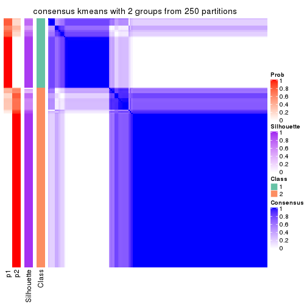</p>

</div>
<div id='tab-CV-kmeans-consensus-heatmap-2'>
<pre><code class="r">consensus_heatmap(res, k = 3)
</code></pre>

<p>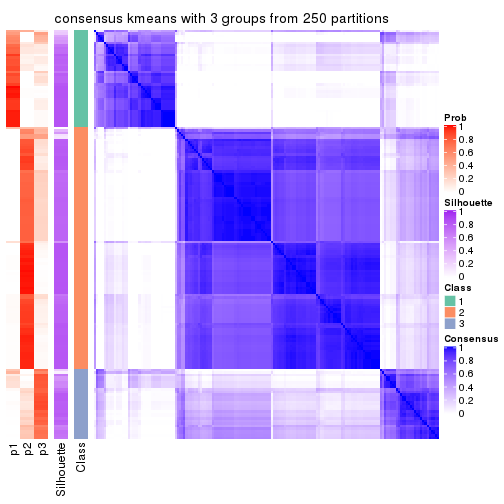</p>

</div>
<div id='tab-CV-kmeans-consensus-heatmap-3'>
<pre><code class="r">consensus_heatmap(res, k = 4)
</code></pre>

<p>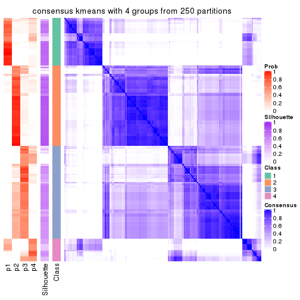</p>

</div>
<div id='tab-CV-kmeans-consensus-heatmap-4'>
<pre><code class="r">consensus_heatmap(res, k = 5)
</code></pre>

<p>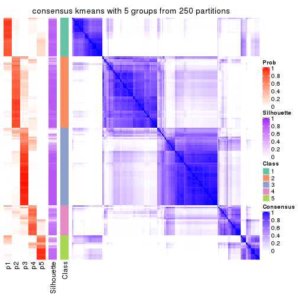</p>

</div>
<div id='tab-CV-kmeans-consensus-heatmap-5'>
<pre><code class="r">consensus_heatmap(res, k = 6)
</code></pre>

<p>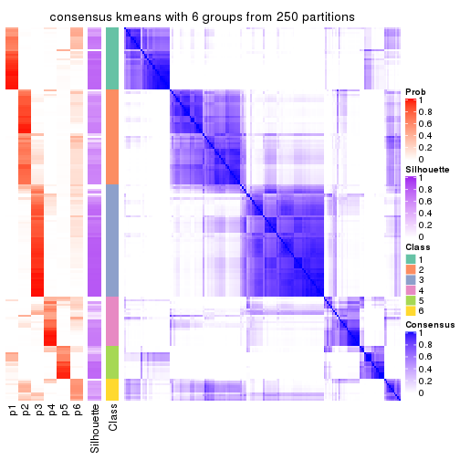</p>

</div>
</div>

Heatmaps for the membership of samples in all partitions to see how consistent they are:


<script>
$( function() {
	$( '#tabs-CV-kmeans-membership-heatmap' ).tabs();
} );
</script>
<div id='tabs-CV-kmeans-membership-heatmap'>
<ul>
<li><a href='#tab-CV-kmeans-membership-heatmap-1'>k = 2</a></li>
<li><a href='#tab-CV-kmeans-membership-heatmap-2'>k = 3</a></li>
<li><a href='#tab-CV-kmeans-membership-heatmap-3'>k = 4</a></li>
<li><a href='#tab-CV-kmeans-membership-heatmap-4'>k = 5</a></li>
<li><a href='#tab-CV-kmeans-membership-heatmap-5'>k = 6</a></li>
</ul>
<div id='tab-CV-kmeans-membership-heatmap-1'>
<pre><code class="r">membership_heatmap(res, k = 2)
</code></pre>

<p>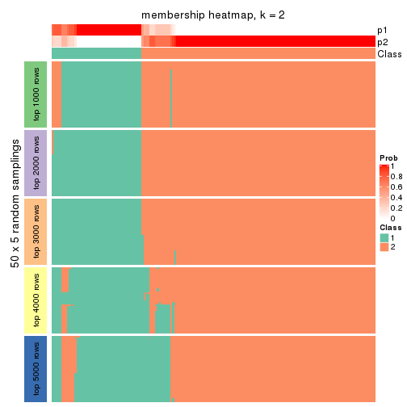</p>

</div>
<div id='tab-CV-kmeans-membership-heatmap-2'>
<pre><code class="r">membership_heatmap(res, k = 3)
</code></pre>

<p>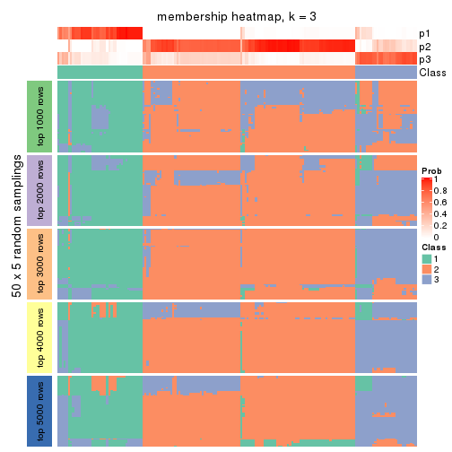</p>

</div>
<div id='tab-CV-kmeans-membership-heatmap-3'>
<pre><code class="r">membership_heatmap(res, k = 4)
</code></pre>

<p>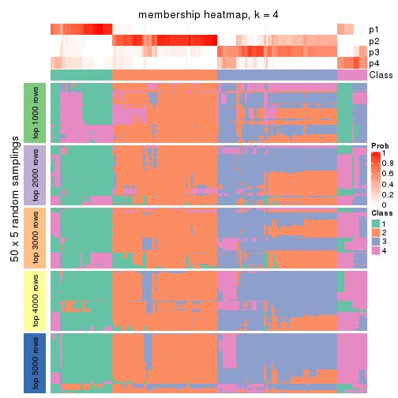</p>

</div>
<div id='tab-CV-kmeans-membership-heatmap-4'>
<pre><code class="r">membership_heatmap(res, k = 5)
</code></pre>

<p>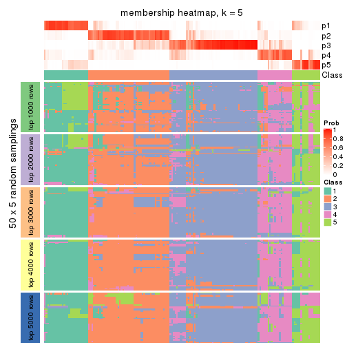</p>

</div>
<div id='tab-CV-kmeans-membership-heatmap-5'>
<pre><code class="r">membership_heatmap(res, k = 6)
</code></pre>

<p>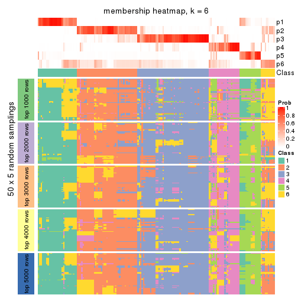</p>

</div>
</div>

As soon as we have had the classes for columns, we can look for signatures
which are significantly different between classes which can be candidate marks
for certain classes. Following are the heatmaps for signatures.


Signature heatmaps where rows are scaled:


<script>
$( function() {
	$( '#tabs-CV-kmeans-get-signatures' ).tabs();
} );
</script>
<div id='tabs-CV-kmeans-get-signatures'>
<ul>
<li><a href='#tab-CV-kmeans-get-signatures-1'>k = 2</a></li>
<li><a href='#tab-CV-kmeans-get-signatures-2'>k = 3</a></li>
<li><a href='#tab-CV-kmeans-get-signatures-3'>k = 4</a></li>
<li><a href='#tab-CV-kmeans-get-signatures-4'>k = 5</a></li>
<li><a href='#tab-CV-kmeans-get-signatures-5'>k = 6</a></li>
</ul>
<div id='tab-CV-kmeans-get-signatures-1'>
<pre><code class="r">get_signatures(res, k = 2)
</code></pre>

<p>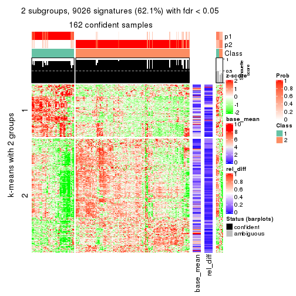</p>

</div>
<div id='tab-CV-kmeans-get-signatures-2'>
<pre><code class="r">get_signatures(res, k = 3)
</code></pre>

<p>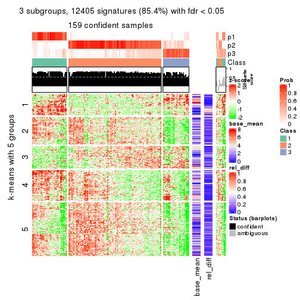</p>

</div>
<div id='tab-CV-kmeans-get-signatures-3'>
<pre><code class="r">get_signatures(res, k = 4)
</code></pre>

<p>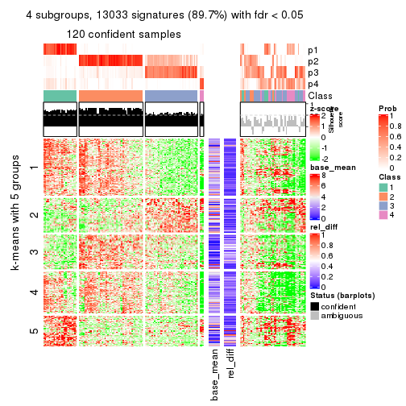</p>

</div>
<div id='tab-CV-kmeans-get-signatures-4'>
<pre><code class="r">get_signatures(res, k = 5)
</code></pre>

<p>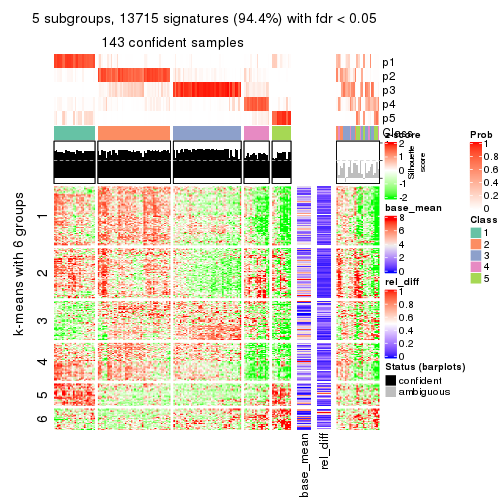</p>

</div>
<div id='tab-CV-kmeans-get-signatures-5'>
<pre><code class="r">get_signatures(res, k = 6)
</code></pre>

<p>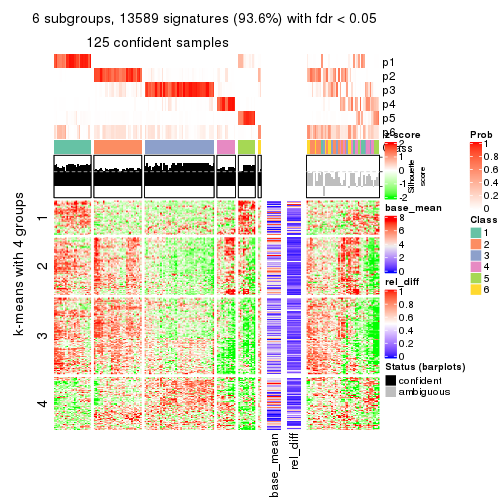</p>

</div>
</div>


Signature heatmaps where rows are not scaled:


<script>
$( function() {
	$( '#tabs-CV-kmeans-get-signatures-no-scale' ).tabs();
} );
</script>
<div id='tabs-CV-kmeans-get-signatures-no-scale'>
<ul>
<li><a href='#tab-CV-kmeans-get-signatures-no-scale-1'>k = 2</a></li>
<li><a href='#tab-CV-kmeans-get-signatures-no-scale-2'>k = 3</a></li>
<li><a href='#tab-CV-kmeans-get-signatures-no-scale-3'>k = 4</a></li>
<li><a href='#tab-CV-kmeans-get-signatures-no-scale-4'>k = 5</a></li>
<li><a href='#tab-CV-kmeans-get-signatures-no-scale-5'>k = 6</a></li>
</ul>
<div id='tab-CV-kmeans-get-signatures-no-scale-1'>
<pre><code class="r">get_signatures(res, k = 2, scale_rows = FALSE)
</code></pre>

<p>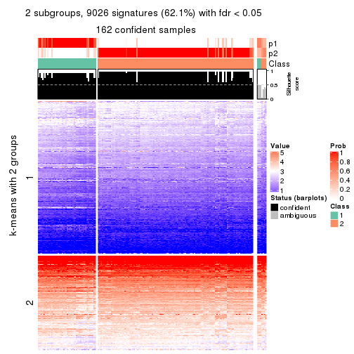</p>

</div>
<div id='tab-CV-kmeans-get-signatures-no-scale-2'>
<pre><code class="r">get_signatures(res, k = 3, scale_rows = FALSE)
</code></pre>

<p>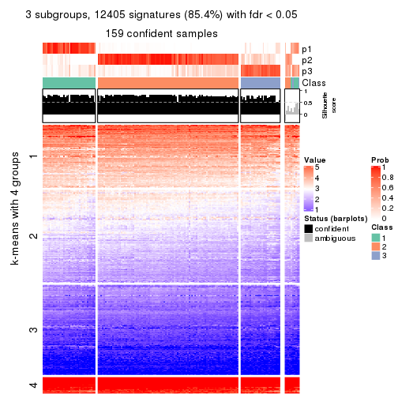</p>

</div>
<div id='tab-CV-kmeans-get-signatures-no-scale-3'>
<pre><code class="r">get_signatures(res, k = 4, scale_rows = FALSE)
</code></pre>

<p>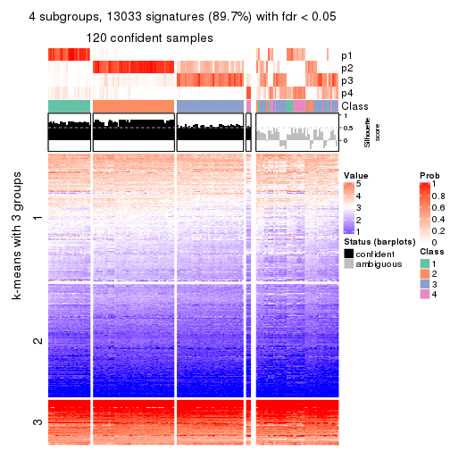</p>

</div>
<div id='tab-CV-kmeans-get-signatures-no-scale-4'>
<pre><code class="r">get_signatures(res, k = 5, scale_rows = FALSE)
</code></pre>

<p>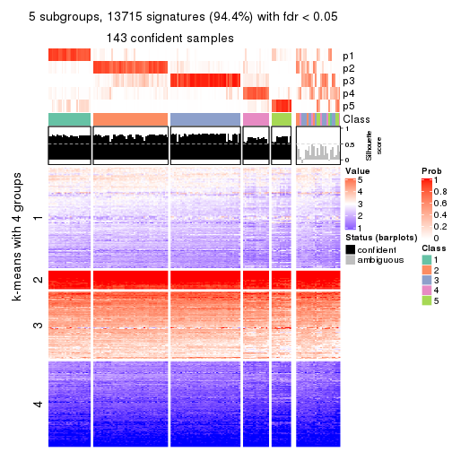</p>

</div>
<div id='tab-CV-kmeans-get-signatures-no-scale-5'>
<pre><code class="r">get_signatures(res, k = 6, scale_rows = FALSE)
</code></pre>

<p>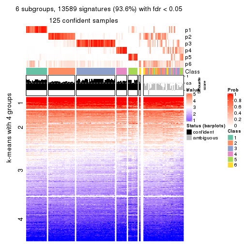</p>

</div>
</div>


Compare the overlap of signatures from different k:

```r
compare_signatures(res)
```

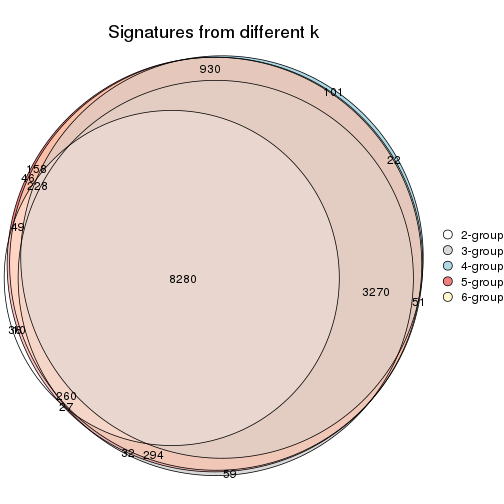

`get_signature()` returns a data frame invisibly. TO get the list of signatures, the function
call should be assigned to a variable explicitly. In following code, if `plot` argument is set
to `FALSE`, no heatmap is plotted while only the differential analysis is performed.

```r
# code only for demonstration
tb = get_signature(res, k = ..., plot = FALSE)
```

An example of the output of `tb` is:

```
#>   which_row         fdr    mean_1    mean_2 scaled_mean_1 scaled_mean_2 km
#> 1        38 0.042760348  8.373488  9.131774    -0.5533452     0.5164555  1
#> 2        40 0.018707592  7.106213  8.469186    -0.6173731     0.5762149  1
#> 3        55 0.019134737 10.221463 11.207825    -0.6159697     0.5749050  1
#> 4        59 0.006059896  5.921854  7.869574    -0.6899429     0.6439467  1
#> 5        60 0.018055526  8.928898 10.211722    -0.6204761     0.5791110  1
#> 6        98 0.009384629 15.714769 14.887706     0.6635654    -0.6193277  2
...
```

The columns in `tb` are:

1. `which_row`: row indices corresponding to the input matrix.
2. `fdr`: FDR for the differential test. 
3. `mean_x`: The mean value in group x.
4. `scaled_mean_x`: The mean value in group x after rows are scaled.
5. `km`: Row groups if k-means clustering is applied to rows.


UMAP plot which shows how samples are separated.


<script>
$( function() {
	$( '#tabs-CV-kmeans-dimension-reduction' ).tabs();
} );
</script>
<div id='tabs-CV-kmeans-dimension-reduction'>
<ul>
<li><a href='#tab-CV-kmeans-dimension-reduction-1'>k = 2</a></li>
<li><a href='#tab-CV-kmeans-dimension-reduction-2'>k = 3</a></li>
<li><a href='#tab-CV-kmeans-dimension-reduction-3'>k = 4</a></li>
<li><a href='#tab-CV-kmeans-dimension-reduction-4'>k = 5</a></li>
<li><a href='#tab-CV-kmeans-dimension-reduction-5'>k = 6</a></li>
</ul>
<div id='tab-CV-kmeans-dimension-reduction-1'>
<pre><code class="r">dimension_reduction(res, k = 2, method = &quot;UMAP&quot;)
</code></pre>

<p>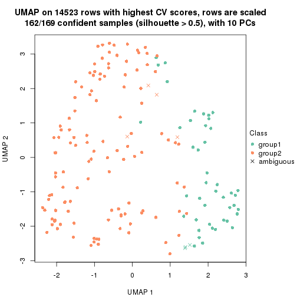</p>

</div>
<div id='tab-CV-kmeans-dimension-reduction-2'>
<pre><code class="r">dimension_reduction(res, k = 3, method = &quot;UMAP&quot;)
</code></pre>

<p>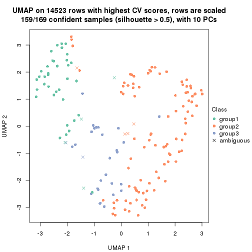</p>

</div>
<div id='tab-CV-kmeans-dimension-reduction-3'>
<pre><code class="r">dimension_reduction(res, k = 4, method = &quot;UMAP&quot;)
</code></pre>

<p>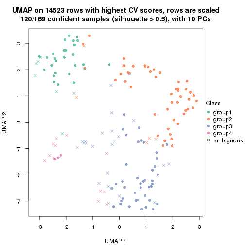</p>

</div>
<div id='tab-CV-kmeans-dimension-reduction-4'>
<pre><code class="r">dimension_reduction(res, k = 5, method = &quot;UMAP&quot;)
</code></pre>

<p>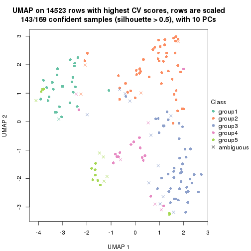</p>

</div>
<div id='tab-CV-kmeans-dimension-reduction-5'>
<pre><code class="r">dimension_reduction(res, k = 6, method = &quot;UMAP&quot;)
</code></pre>

<p>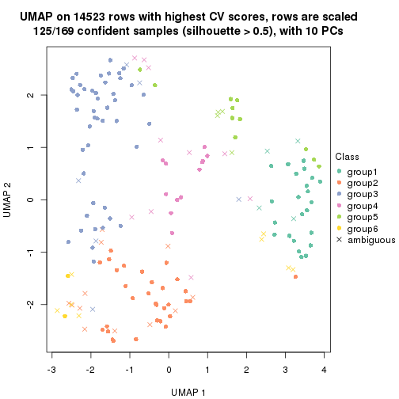</p>

</div>
</div>


Following heatmap shows how subgroups are split when increasing `k`:

```r
collect_classes(res)
```

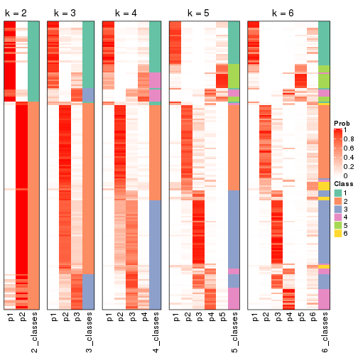


If matrix rows can be associated to genes, consider to use `GO_Enrichment(res,
...)` to perform function enrichment for the signature genes.


 

---------------------------------------------------


### CV:skmeans


The object with results only for a single top-value method and a single partition method 
can be extracted as:

```r
res = res_list["CV", "skmeans"]
# you can also extract it by
# res = res_list["CV:skmeans"]
```

A summary of `res` and all the functions that can be applied to it:

```r
res
```

```
#> A 'ConsensusPartition' object with k = 2, 3, 4, 5, 6.
#>   On a matrix with 14523 rows and 169 columns.
#>   Top rows (1000, 2000, 3000, 4000, 5000) are extracted by 'CV' method.
#>   Subgroups are detected by 'skmeans' method.
#>   Performed in total 1250 partitions by row resampling.
#>   Best k for subgroups seems to be 2.
#> 
#> Following methods can be applied to this 'ConsensusPartition' object:
#>  [1] "cola_report"             "collect_classes"         "collect_plots"          
#>  [4] "collect_stats"           "colnames"                "compare_signatures"     
#>  [7] "consensus_heatmap"       "dimension_reduction"     "functional_enrichment"  
#> [10] "get_anno_col"            "get_anno"                "get_classes"            
#> [13] "get_consensus"           "get_matrix"              "get_membership"         
#> [16] "get_param"               "get_signatures"          "get_stats"              
#> [19] "is_best_k"               "is_stable_k"             "membership_heatmap"     
#> [22] "ncol"                    "nrow"                    "plot_ecdf"              
#> [25] "rownames"                "select_partition_number" "show"                   
#> [28] "suggest_best_k"          "test_to_known_factors"
```

`collect_plots()` function collects all the plots made from `res` for all `k` (number of partitions)
into one single page to provide an easy and fast comparison between different `k`.

```r
collect_plots(res)
```

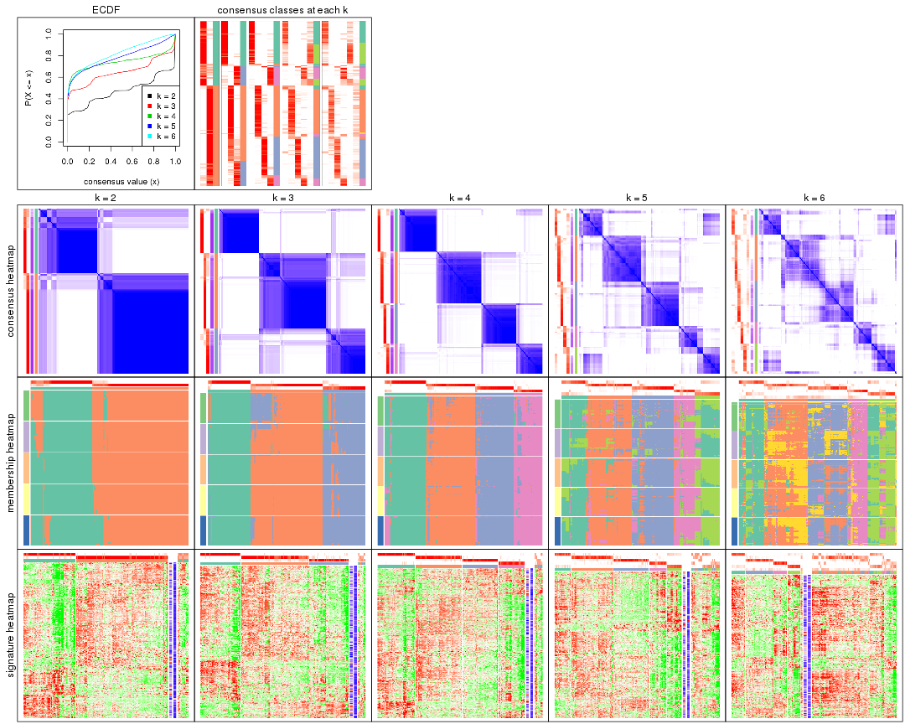

The plots are:

- The first row: a plot of the ECDF (Empirical cumulative distribution
  function) curves of the consensus matrix for each `k` and the heatmap of
  predicted classes for each `k`.
- The second row: heatmaps of the consensus matrix for each `k`.
- The third row: heatmaps of the membership matrix for each `k`.
- The fouth row: heatmaps of the signatures for each `k`.

All the plots in panels can be made by individual functions and they are
plotted later in this section.

`select_partition_number()` produces several plots showing different
statistics for choosing "optimized" `k`. There are following statistics:

- ECDF curves of the consensus matrix for each `k`;
- 1-PAC. [The PAC
  score](https://en.wikipedia.org/wiki/Consensus_clustering#Over-interpretation_potential_of_consensus_clustering)
  measures the proportion of the ambiguous subgrouping.
- Mean silhouette score.
- Concordance. The mean probability of fiting the consensus class ids in all
  partitions.
- Area increased. Denote $A_k$ as the area under the ECDF curve for current
  `k`, the area increased is defined as $A_k - A_{k-1}$.
- Rand index. The percent of pairs of samples that are both in a same cluster
  or both are not in a same cluster in the partition of k and k-1.
- Jaccard index. The ratio of pairs of samples are both in a same cluster in
  the partition of k and k-1 and the pairs of samples are both in a same
  cluster in the partition k or k-1.

The detailed explanations of these statistics can be found in [the cola
vignette](http://bioconductor.org/packages/devel/bioc/vignettes/cola/inst/doc/cola.html#toc_13).

Generally speaking, lower PAC score, higher mean silhouette score or higher
concordance corresponds to better partition. Rand index and Jaccard index
measure how similar the current partition is compared to partition with `k-1`.
If they are too similar, we won't accept `k` is better than `k-1`.

```r
select_partition_number(res)
```

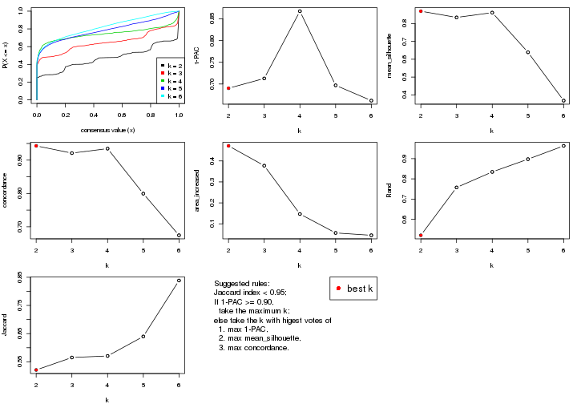

The numeric values for all these statistics can be obtained by `get_stats()`.

```r
get_stats(res)
```

```
#>   k 1-PAC mean_silhouette concordance area_increased  Rand Jaccard
#> 2 2 0.690           0.869       0.943         0.4720 0.521   0.521
#> 3 3 0.713           0.834       0.921         0.3774 0.758   0.565
#> 4 4 0.867           0.861       0.935         0.1468 0.834   0.571
#> 5 5 0.697           0.639       0.799         0.0566 0.897   0.640
#> 6 6 0.662           0.368       0.674         0.0453 0.963   0.838
```

`suggest_best_k()` suggests the best $k$ based on these statistics. The rules are as follows:

- All $k$ with Jaccard index larger than 0.95 are removed because the increase of
  the partition number does not provides enough extra information. If all $k$ are removed,
  the best $k$ is assigned by `NA`.
- For $k$ with 1-PAC larger than 0.9, the maximal $k$ is taken as the "best k". Other $k$ is called "optional k".
- If it does not fit the second rule. The $k$ with the highest vote of highest
  1-PAC, mean silhouette and concordance is taken as the "best k".

```r
suggest_best_k(res)
```

```
#> [1] 2
```


Following shows the table of the partitions (You need to click the **show/hide
code output** link to see it). The membership matrix (columns with name `p*`)
is inferred by
[`clue::cl_consensus()`](https://www.rdocumentation.org/link/cl_consensus?package=clue)
function with the `SE` method. Basically the value in the membership matrix
represents the probability to belong to a certain group. The finall class
label for an item is determined with the group with highest probability it
belongs to.

In `get_classes()` function, the entropy is calculated from the membership
matrix and the silhouette score is calculated from the consensus matrix.


<script>
$( function() {
	$( '#tabs-CV-skmeans-get-classes' ).tabs();
} );
</script>
<div id='tabs-CV-skmeans-get-classes'>
<ul>
<li><a href='#tab-CV-skmeans-get-classes-1'>k = 2</a></li>
<li><a href='#tab-CV-skmeans-get-classes-2'>k = 3</a></li>
<li><a href='#tab-CV-skmeans-get-classes-3'>k = 4</a></li>
<li><a href='#tab-CV-skmeans-get-classes-4'>k = 5</a></li>
<li><a href='#tab-CV-skmeans-get-classes-5'>k = 6</a></li>
</ul>

<div id='tab-CV-skmeans-get-classes-1'>
<p><a id='tab-CV-skmeans-get-classes-1-a' style='color:#0366d6' href='#'>show/hide code output</a></p>
<pre><code class="r">cbind(get_classes(res, k = 2), get_membership(res, k = 2))
</code></pre>

<pre><code>#&gt;            class entropy silhouette    p1    p2
#&gt; SRR2052702     2  0.0000      0.957 0.000 1.000
#&gt; SRR2052701     2  0.0000      0.957 0.000 1.000
#&gt; SRR2052700     2  0.7219      0.738 0.200 0.800
#&gt; SRR2052699     1  0.6343      0.779 0.840 0.160
#&gt; SRR2052698     2  0.0000      0.957 0.000 1.000
#&gt; SRR2052708     1  0.0000      0.902 1.000 0.000
#&gt; SRR2052749     1  0.0000      0.902 1.000 0.000
#&gt; SRR2052786     2  0.0000      0.957 0.000 1.000
#&gt; SRR2052825     1  0.7883      0.696 0.764 0.236
#&gt; SRR2052824     1  0.9754      0.376 0.592 0.408
#&gt; SRR2052823     2  0.0000      0.957 0.000 1.000
#&gt; SRR2052822     2  0.0000      0.957 0.000 1.000
#&gt; SRR2052821     2  0.0000      0.957 0.000 1.000
#&gt; SRR2052820     1  0.9686      0.407 0.604 0.396
#&gt; SRR2052819     2  0.7219      0.738 0.200 0.800
#&gt; SRR2052818     2  0.0000      0.957 0.000 1.000
#&gt; SRR2052817     2  0.0000      0.957 0.000 1.000
#&gt; SRR2052816     1  0.7219      0.739 0.800 0.200
#&gt; SRR2052815     1  0.9866      0.308 0.568 0.432
#&gt; SRR2052814     2  0.0000      0.957 0.000 1.000
#&gt; SRR2052813     2  0.0000      0.957 0.000 1.000
#&gt; SRR2052812     2  0.0000      0.957 0.000 1.000
#&gt; SRR2052811     2  0.0000      0.957 0.000 1.000
#&gt; SRR2052810     2  0.7219      0.738 0.200 0.800
#&gt; SRR2052809     2  0.0000      0.957 0.000 1.000
#&gt; SRR2052808     2  0.0000      0.957 0.000 1.000
#&gt; SRR2052807     1  0.0000      0.902 1.000 0.000
#&gt; SRR2052806     1  0.0000      0.902 1.000 0.000
#&gt; SRR2052805     1  0.0000      0.902 1.000 0.000
#&gt; SRR2052804     1  0.0000      0.902 1.000 0.000
#&gt; SRR2052803     1  0.0000      0.902 1.000 0.000
#&gt; SRR2052802     1  0.0000      0.902 1.000 0.000
#&gt; SRR2052801     1  0.0000      0.902 1.000 0.000
#&gt; SRR2052800     1  0.0000      0.902 1.000 0.000
#&gt; SRR2052799     1  0.0000      0.902 1.000 0.000
#&gt; SRR2052798     1  0.0000      0.902 1.000 0.000
#&gt; SRR2052797     2  0.0000      0.957 0.000 1.000
#&gt; SRR2052796     1  0.0000      0.902 1.000 0.000
#&gt; SRR2052795     1  0.0000      0.902 1.000 0.000
#&gt; SRR2052794     1  0.0000      0.902 1.000 0.000
#&gt; SRR2052793     1  0.0000      0.902 1.000 0.000
#&gt; SRR2052792     1  0.0000      0.902 1.000 0.000
#&gt; SRR2052791     1  0.0000      0.902 1.000 0.000
#&gt; SRR2052790     2  0.0000      0.957 0.000 1.000
#&gt; SRR2052789     2  0.0000      0.957 0.000 1.000
#&gt; SRR2052788     2  0.0000      0.957 0.000 1.000
#&gt; SRR2052787     2  0.0000      0.957 0.000 1.000
#&gt; SRR2052785     2  0.0000      0.957 0.000 1.000
#&gt; SRR2052784     2  0.0000      0.957 0.000 1.000
#&gt; SRR2052783     2  0.0000      0.957 0.000 1.000
#&gt; SRR2052782     2  0.0000      0.957 0.000 1.000
#&gt; SRR2052781     2  0.0000      0.957 0.000 1.000
#&gt; SRR2052780     2  0.0000      0.957 0.000 1.000
#&gt; SRR2052777     2  0.0000      0.957 0.000 1.000
#&gt; SRR2052779     2  0.0000      0.957 0.000 1.000
#&gt; SRR2052778     2  0.7139      0.743 0.196 0.804
#&gt; SRR2052776     2  0.0000      0.957 0.000 1.000
#&gt; SRR2052775     2  0.0000      0.957 0.000 1.000
#&gt; SRR2052773     2  0.0000      0.957 0.000 1.000
#&gt; SRR2052772     2  0.0000      0.957 0.000 1.000
#&gt; SRR2052774     2  0.0000      0.957 0.000 1.000
#&gt; SRR2052771     1  0.0000      0.902 1.000 0.000
#&gt; SRR2052769     2  0.0000      0.957 0.000 1.000
#&gt; SRR2052770     2  0.6973      0.754 0.188 0.812
#&gt; SRR2052768     2  0.0000      0.957 0.000 1.000
#&gt; SRR2052767     2  0.0000      0.957 0.000 1.000
#&gt; SRR2052766     1  0.8081      0.679 0.752 0.248
#&gt; SRR2052765     2  0.0000      0.957 0.000 1.000
#&gt; SRR2052763     2  0.0000      0.957 0.000 1.000
#&gt; SRR2052764     2  0.0000      0.957 0.000 1.000
#&gt; SRR2052761     2  0.7528      0.714 0.216 0.784
#&gt; SRR2052760     2  0.0000      0.957 0.000 1.000
#&gt; SRR2052759     2  0.0938      0.947 0.012 0.988
#&gt; SRR2052762     2  0.0000      0.957 0.000 1.000
#&gt; SRR2052758     2  0.0000      0.957 0.000 1.000
#&gt; SRR2052756     1  0.0000      0.902 1.000 0.000
#&gt; SRR2052757     2  0.0000      0.957 0.000 1.000
#&gt; SRR2052755     1  0.0000      0.902 1.000 0.000
#&gt; SRR2052754     1  0.0000      0.902 1.000 0.000
#&gt; SRR2052753     1  0.0000      0.902 1.000 0.000
#&gt; SRR2052752     1  0.0000      0.902 1.000 0.000
#&gt; SRR2052750     1  0.0000      0.902 1.000 0.000
#&gt; SRR2052751     2  0.0000      0.957 0.000 1.000
#&gt; SRR2052748     1  0.9686      0.407 0.604 0.396
#&gt; SRR2052747     1  0.0000      0.902 1.000 0.000
#&gt; SRR2052746     2  0.0000      0.957 0.000 1.000
#&gt; SRR2052745     2  0.9248      0.462 0.340 0.660
#&gt; SRR2052744     1  0.2043      0.883 0.968 0.032
#&gt; SRR2052741     2  0.0000      0.957 0.000 1.000
#&gt; SRR2052743     2  0.0000      0.957 0.000 1.000
#&gt; SRR2052740     2  0.0000      0.957 0.000 1.000
#&gt; SRR2052742     2  0.0000      0.957 0.000 1.000
#&gt; SRR2052739     2  0.0000      0.957 0.000 1.000
#&gt; SRR2052738     2  0.0938      0.947 0.012 0.988
#&gt; SRR2052736     2  0.6623      0.759 0.172 0.828
#&gt; SRR2052735     1  0.7219      0.735 0.800 0.200
#&gt; SRR2052734     1  0.7219      0.735 0.800 0.200
#&gt; SRR2052737     2  0.0000      0.957 0.000 1.000
#&gt; SRR2052733     2  0.6973      0.754 0.188 0.812
#&gt; SRR2052732     2  0.0000      0.957 0.000 1.000
#&gt; SRR2052731     2  0.0000      0.957 0.000 1.000
#&gt; SRR2052729     1  0.0000      0.902 1.000 0.000
#&gt; SRR2052728     1  0.2948      0.870 0.948 0.052
#&gt; SRR2052730     1  0.5842      0.801 0.860 0.140
#&gt; SRR2052727     1  0.0000      0.902 1.000 0.000
#&gt; SRR2052725     1  0.9608      0.483 0.616 0.384
#&gt; SRR2052726     1  0.6973      0.749 0.812 0.188
#&gt; SRR2052724     1  0.0000      0.902 1.000 0.000
#&gt; SRR2052723     1  0.0000      0.902 1.000 0.000
#&gt; SRR2052722     2  0.0000      0.957 0.000 1.000
#&gt; SRR2052721     1  0.0000      0.902 1.000 0.000
#&gt; SRR2052720     2  0.0000      0.957 0.000 1.000
#&gt; SRR2052719     2  0.0000      0.957 0.000 1.000
#&gt; SRR2052718     1  0.0000      0.902 1.000 0.000
#&gt; SRR2052717     2  0.0000      0.957 0.000 1.000
#&gt; SRR2052714     1  0.0000      0.902 1.000 0.000
#&gt; SRR2052716     1  0.9522      0.461 0.628 0.372
#&gt; SRR2052715     2  0.0000      0.957 0.000 1.000
#&gt; SRR2052713     1  0.0000      0.902 1.000 0.000
#&gt; SRR2052712     1  0.0000      0.902 1.000 0.000
#&gt; SRR2052711     1  0.7219      0.739 0.800 0.200
#&gt; SRR2052710     2  0.0000      0.957 0.000 1.000
#&gt; SRR2052707     2  0.0000      0.957 0.000 1.000
#&gt; SRR2052709     2  0.0000      0.957 0.000 1.000
#&gt; SRR2052704     2  0.9754      0.266 0.408 0.592
#&gt; SRR2052705     2  0.0000      0.957 0.000 1.000
#&gt; SRR2052697     2  0.0000      0.957 0.000 1.000
#&gt; SRR2052703     2  0.0000      0.957 0.000 1.000
#&gt; SRR2052696     1  0.0000      0.902 1.000 0.000
#&gt; SRR2052706     2  0.0000      0.957 0.000 1.000
#&gt; SRR2052695     2  0.0000      0.957 0.000 1.000
#&gt; SRR2052694     2  0.0000      0.957 0.000 1.000
#&gt; SRR2052692     2  0.2236      0.926 0.036 0.964
#&gt; SRR2052693     2  0.0000      0.957 0.000 1.000
#&gt; SRR2052691     1  0.6973      0.749 0.812 0.188
#&gt; SRR2052690     2  0.6531      0.764 0.168 0.832
#&gt; SRR2052689     1  0.9866      0.308 0.568 0.432
#&gt; SRR2052687     2  0.7602      0.708 0.220 0.780
#&gt; SRR2052686     1  0.0000      0.902 1.000 0.000
#&gt; SRR2052688     2  0.0000      0.957 0.000 1.000
#&gt; SRR2052684     1  0.0000      0.902 1.000 0.000
#&gt; SRR2052685     2  0.9087      0.471 0.324 0.676
#&gt; SRR2052683     1  0.0000      0.902 1.000 0.000
#&gt; SRR2052681     2  0.7745      0.696 0.228 0.772
#&gt; SRR2052680     1  0.9710      0.397 0.600 0.400
#&gt; SRR2052682     1  0.9815      0.332 0.580 0.420
#&gt; SRR2052679     1  0.0000      0.902 1.000 0.000
#&gt; SRR2052678     2  0.0000      0.957 0.000 1.000
#&gt; SRR2052677     2  0.0000      0.957 0.000 1.000
#&gt; SRR2052675     2  0.0000      0.957 0.000 1.000
#&gt; SRR2052676     1  0.0000      0.902 1.000 0.000
#&gt; SRR2052674     2  0.7219      0.738 0.200 0.800
#&gt; SRR2052672     2  0.0000      0.957 0.000 1.000
#&gt; SRR2052673     2  0.0000      0.957 0.000 1.000
#&gt; SRR2052671     2  0.0000      0.957 0.000 1.000
#&gt; SRR2052670     2  0.0000      0.957 0.000 1.000
#&gt; SRR2052669     2  0.0000      0.957 0.000 1.000
#&gt; SRR2052668     2  0.5178      0.836 0.116 0.884
#&gt; SRR2052667     2  0.0000      0.957 0.000 1.000
#&gt; SRR2052666     2  0.0000      0.957 0.000 1.000
#&gt; SRR2052665     2  0.0000      0.957 0.000 1.000
#&gt; SRR2052664     1  0.0000      0.902 1.000 0.000
#&gt; SRR2052663     2  0.6887      0.740 0.184 0.816
#&gt; SRR2052662     2  0.0000      0.957 0.000 1.000
#&gt; SRR2052661     1  0.0938      0.895 0.988 0.012
#&gt; SRR2052660     2  0.0000      0.957 0.000 1.000
#&gt; SRR2052659     1  0.6247      0.784 0.844 0.156
#&gt; SRR2052658     2  0.0000      0.957 0.000 1.000
#&gt; SRR2052657     1  0.0000      0.902 1.000 0.000
</code></pre>

<script>
$('#tab-CV-skmeans-get-classes-1-a').parent().next().next().hide();
$('#tab-CV-skmeans-get-classes-1-a').click(function(){
  $('#tab-CV-skmeans-get-classes-1-a').parent().next().next().toggle();
  return(false);
});
</script>
</div>

<div id='tab-CV-skmeans-get-classes-2'>
<p><a id='tab-CV-skmeans-get-classes-2-a' style='color:#0366d6' href='#'>show/hide code output</a></p>
<pre><code class="r">cbind(get_classes(res, k = 3), get_membership(res, k = 3))
</code></pre>

<pre><code>#&gt;            class entropy silhouette    p1    p2    p3
#&gt; SRR2052702     2  0.0000      0.895 0.000 1.000 0.000
#&gt; SRR2052701     2  0.0000      0.895 0.000 1.000 0.000
#&gt; SRR2052700     3  0.5397      0.641 0.000 0.280 0.720
#&gt; SRR2052699     1  0.0237      0.959 0.996 0.004 0.000
#&gt; SRR2052698     2  0.5058      0.746 0.000 0.756 0.244
#&gt; SRR2052708     1  0.0000      0.963 1.000 0.000 0.000
#&gt; SRR2052749     1  0.0000      0.963 1.000 0.000 0.000
#&gt; SRR2052786     2  0.0000      0.895 0.000 1.000 0.000
#&gt; SRR2052825     3  0.0237      0.877 0.004 0.000 0.996
#&gt; SRR2052824     3  0.0000      0.878 0.000 0.000 1.000
#&gt; SRR2052823     2  0.0000      0.895 0.000 1.000 0.000
#&gt; SRR2052822     2  0.3551      0.831 0.000 0.868 0.132
#&gt; SRR2052821     2  0.0000      0.895 0.000 1.000 0.000
#&gt; SRR2052820     3  0.0000      0.878 0.000 0.000 1.000
#&gt; SRR2052819     3  0.0000      0.878 0.000 0.000 1.000
#&gt; SRR2052818     2  0.1031      0.881 0.000 0.976 0.024
#&gt; SRR2052817     2  0.5016      0.748 0.000 0.760 0.240
#&gt; SRR2052816     3  0.5798      0.728 0.040 0.184 0.776
#&gt; SRR2052815     3  0.0000      0.878 0.000 0.000 1.000
#&gt; SRR2052814     2  0.4399      0.706 0.000 0.812 0.188
#&gt; SRR2052813     2  0.0000      0.895 0.000 1.000 0.000
#&gt; SRR2052812     2  0.0000      0.895 0.000 1.000 0.000
#&gt; SRR2052811     2  0.0000      0.895 0.000 1.000 0.000
#&gt; SRR2052810     3  0.4750      0.714 0.000 0.216 0.784
#&gt; SRR2052809     2  0.4121      0.806 0.000 0.832 0.168
#&gt; SRR2052808     3  0.0000      0.878 0.000 0.000 1.000
#&gt; SRR2052807     3  0.5859      0.452 0.344 0.000 0.656
#&gt; SRR2052806     1  0.0000      0.963 1.000 0.000 0.000
#&gt; SRR2052805     1  0.0000      0.963 1.000 0.000 0.000
#&gt; SRR2052804     3  0.4750      0.672 0.216 0.000 0.784
#&gt; SRR2052803     1  0.0000      0.963 1.000 0.000 0.000
#&gt; SRR2052802     3  0.4750      0.672 0.216 0.000 0.784
#&gt; SRR2052801     1  0.0424      0.957 0.992 0.000 0.008
#&gt; SRR2052800     3  0.4750      0.672 0.216 0.000 0.784
#&gt; SRR2052799     1  0.0424      0.957 0.992 0.000 0.008
#&gt; SRR2052798     1  0.0000      0.963 1.000 0.000 0.000
#&gt; SRR2052797     2  0.0237      0.894 0.000 0.996 0.004
#&gt; SRR2052796     1  0.0000      0.963 1.000 0.000 0.000
#&gt; SRR2052795     1  0.0000      0.963 1.000 0.000 0.000
#&gt; SRR2052794     1  0.5016      0.650 0.760 0.000 0.240
#&gt; SRR2052793     1  0.0000      0.963 1.000 0.000 0.000
#&gt; SRR2052792     3  0.0747      0.871 0.016 0.000 0.984
#&gt; SRR2052791     1  0.0000      0.963 1.000 0.000 0.000
#&gt; SRR2052790     2  0.0000      0.895 0.000 1.000 0.000
#&gt; SRR2052789     2  0.4887      0.758 0.000 0.772 0.228
#&gt; SRR2052788     2  0.4887      0.758 0.000 0.772 0.228
#&gt; SRR2052787     2  0.0000      0.895 0.000 1.000 0.000
#&gt; SRR2052785     2  0.5016      0.748 0.000 0.760 0.240
#&gt; SRR2052784     2  0.0592      0.891 0.000 0.988 0.012
#&gt; SRR2052783     2  0.4887      0.758 0.000 0.772 0.228
#&gt; SRR2052782     2  0.0000      0.895 0.000 1.000 0.000
#&gt; SRR2052781     2  0.4605      0.779 0.000 0.796 0.204
#&gt; SRR2052780     2  0.2448      0.863 0.000 0.924 0.076
#&gt; SRR2052777     2  0.0000      0.895 0.000 1.000 0.000
#&gt; SRR2052779     2  0.0000      0.895 0.000 1.000 0.000
#&gt; SRR2052778     3  0.0000      0.878 0.000 0.000 1.000
#&gt; SRR2052776     2  0.2878      0.852 0.000 0.904 0.096
#&gt; SRR2052775     3  0.5098      0.624 0.000 0.248 0.752
#&gt; SRR2052773     2  0.4702      0.773 0.000 0.788 0.212
#&gt; SRR2052772     3  0.5497      0.519 0.000 0.292 0.708
#&gt; SRR2052774     2  0.4887      0.758 0.000 0.772 0.228
#&gt; SRR2052771     1  0.5835      0.447 0.660 0.000 0.340
#&gt; SRR2052769     3  0.4931      0.715 0.000 0.232 0.768
#&gt; SRR2052770     3  0.0000      0.878 0.000 0.000 1.000
#&gt; SRR2052768     2  0.0000      0.895 0.000 1.000 0.000
#&gt; SRR2052767     2  0.0000      0.895 0.000 1.000 0.000
#&gt; SRR2052766     3  0.0000      0.878 0.000 0.000 1.000
#&gt; SRR2052765     2  0.0000      0.895 0.000 1.000 0.000
#&gt; SRR2052763     3  0.4702      0.743 0.000 0.212 0.788
#&gt; SRR2052764     2  0.0000      0.895 0.000 1.000 0.000
#&gt; SRR2052761     3  0.1411      0.870 0.000 0.036 0.964
#&gt; SRR2052760     2  0.0000      0.895 0.000 1.000 0.000
#&gt; SRR2052759     3  0.0892      0.874 0.000 0.020 0.980
#&gt; SRR2052762     2  0.0000      0.895 0.000 1.000 0.000
#&gt; SRR2052758     2  0.6308      0.188 0.000 0.508 0.492
#&gt; SRR2052756     1  0.0000      0.963 1.000 0.000 0.000
#&gt; SRR2052757     2  0.5058      0.746 0.000 0.756 0.244
#&gt; SRR2052755     1  0.0000      0.963 1.000 0.000 0.000
#&gt; SRR2052754     1  0.0000      0.963 1.000 0.000 0.000
#&gt; SRR2052753     1  0.0000      0.963 1.000 0.000 0.000
#&gt; SRR2052752     1  0.0000      0.963 1.000 0.000 0.000
#&gt; SRR2052750     1  0.0000      0.963 1.000 0.000 0.000
#&gt; SRR2052751     2  0.5431      0.690 0.000 0.716 0.284
#&gt; SRR2052748     3  0.0000      0.878 0.000 0.000 1.000
#&gt; SRR2052747     1  0.0000      0.963 1.000 0.000 0.000
#&gt; SRR2052746     3  0.4291      0.726 0.000 0.180 0.820
#&gt; SRR2052745     3  0.0747      0.875 0.000 0.016 0.984
#&gt; SRR2052744     1  0.0000      0.963 1.000 0.000 0.000
#&gt; SRR2052741     2  0.0000      0.895 0.000 1.000 0.000
#&gt; SRR2052743     2  0.0000      0.895 0.000 1.000 0.000
#&gt; SRR2052740     2  0.0000      0.895 0.000 1.000 0.000
#&gt; SRR2052742     2  0.4750      0.769 0.000 0.784 0.216
#&gt; SRR2052739     2  0.0000      0.895 0.000 1.000 0.000
#&gt; SRR2052738     3  0.1031      0.872 0.000 0.024 0.976
#&gt; SRR2052736     2  0.0592      0.889 0.012 0.988 0.000
#&gt; SRR2052735     1  0.0000      0.963 1.000 0.000 0.000
#&gt; SRR2052734     1  0.0000      0.963 1.000 0.000 0.000
#&gt; SRR2052737     2  0.0000      0.895 0.000 1.000 0.000
#&gt; SRR2052733     3  0.0237      0.877 0.000 0.004 0.996
#&gt; SRR2052732     2  0.0424      0.891 0.000 0.992 0.008
#&gt; SRR2052731     2  0.5988      0.533 0.000 0.632 0.368
#&gt; SRR2052729     1  0.0000      0.963 1.000 0.000 0.000
#&gt; SRR2052728     1  0.0000      0.963 1.000 0.000 0.000
#&gt; SRR2052730     3  0.0237      0.877 0.004 0.000 0.996
#&gt; SRR2052727     1  0.0000      0.963 1.000 0.000 0.000
#&gt; SRR2052725     1  0.5891      0.701 0.764 0.200 0.036
#&gt; SRR2052726     1  0.0000      0.963 1.000 0.000 0.000
#&gt; SRR2052724     1  0.0000      0.963 1.000 0.000 0.000
#&gt; SRR2052723     3  0.0424      0.875 0.008 0.000 0.992
#&gt; SRR2052722     3  0.6215      0.105 0.000 0.428 0.572
#&gt; SRR2052721     1  0.0000      0.963 1.000 0.000 0.000
#&gt; SRR2052720     2  0.0000      0.895 0.000 1.000 0.000
#&gt; SRR2052719     2  0.0000      0.895 0.000 1.000 0.000
#&gt; SRR2052718     1  0.0000      0.963 1.000 0.000 0.000
#&gt; SRR2052717     2  0.0000      0.895 0.000 1.000 0.000
#&gt; SRR2052714     1  0.0424      0.957 0.992 0.000 0.008
#&gt; SRR2052716     3  0.0000      0.878 0.000 0.000 1.000
#&gt; SRR2052715     3  0.1529      0.863 0.000 0.040 0.960
#&gt; SRR2052713     1  0.0000      0.963 1.000 0.000 0.000
#&gt; SRR2052712     3  0.4002      0.744 0.160 0.000 0.840
#&gt; SRR2052711     1  0.9417      0.098 0.456 0.180 0.364
#&gt; SRR2052710     2  0.5058      0.746 0.000 0.756 0.244
#&gt; SRR2052707     3  0.6140      0.192 0.000 0.404 0.596
#&gt; SRR2052709     2  0.4887      0.758 0.000 0.772 0.228
#&gt; SRR2052704     3  0.0000      0.878 0.000 0.000 1.000
#&gt; SRR2052705     2  0.0000      0.895 0.000 1.000 0.000
#&gt; SRR2052697     2  0.0000      0.895 0.000 1.000 0.000
#&gt; SRR2052703     2  0.6111      0.476 0.000 0.604 0.396
#&gt; SRR2052696     1  0.0000      0.963 1.000 0.000 0.000
#&gt; SRR2052706     2  0.0000      0.895 0.000 1.000 0.000
#&gt; SRR2052695     2  0.0000      0.895 0.000 1.000 0.000
#&gt; SRR2052694     2  0.0000      0.895 0.000 1.000 0.000
#&gt; SRR2052692     3  0.0747      0.875 0.000 0.016 0.984
#&gt; SRR2052693     3  0.3192      0.801 0.000 0.112 0.888
#&gt; SRR2052691     1  0.0000      0.963 1.000 0.000 0.000
#&gt; SRR2052690     2  0.0892      0.884 0.020 0.980 0.000
#&gt; SRR2052689     3  0.0000      0.878 0.000 0.000 1.000
#&gt; SRR2052687     3  0.0000      0.878 0.000 0.000 1.000
#&gt; SRR2052686     1  0.0000      0.963 1.000 0.000 0.000
#&gt; SRR2052688     2  0.0000      0.895 0.000 1.000 0.000
#&gt; SRR2052684     3  0.5058      0.633 0.244 0.000 0.756
#&gt; SRR2052685     2  0.5178      0.658 0.256 0.744 0.000
#&gt; SRR2052683     1  0.0000      0.963 1.000 0.000 0.000
#&gt; SRR2052681     3  0.1031      0.871 0.000 0.024 0.976
#&gt; SRR2052680     3  0.0000      0.878 0.000 0.000 1.000
#&gt; SRR2052682     1  0.4291      0.747 0.820 0.180 0.000
#&gt; SRR2052679     1  0.0000      0.963 1.000 0.000 0.000
#&gt; SRR2052678     2  0.5988      0.533 0.000 0.632 0.368
#&gt; SRR2052677     2  0.0000      0.895 0.000 1.000 0.000
#&gt; SRR2052675     2  0.0000      0.895 0.000 1.000 0.000
#&gt; SRR2052676     1  0.0000      0.963 1.000 0.000 0.000
#&gt; SRR2052674     3  0.0000      0.878 0.000 0.000 1.000
#&gt; SRR2052672     2  0.6244      0.355 0.000 0.560 0.440
#&gt; SRR2052673     2  0.0000      0.895 0.000 1.000 0.000
#&gt; SRR2052671     2  0.0000      0.895 0.000 1.000 0.000
#&gt; SRR2052670     2  0.4887      0.758 0.000 0.772 0.228
#&gt; SRR2052669     2  0.0000      0.895 0.000 1.000 0.000
#&gt; SRR2052668     2  0.3482      0.780 0.128 0.872 0.000
#&gt; SRR2052667     2  0.3482      0.837 0.000 0.872 0.128
#&gt; SRR2052666     2  0.4842      0.762 0.000 0.776 0.224
#&gt; SRR2052665     2  0.0000      0.895 0.000 1.000 0.000
#&gt; SRR2052664     1  0.0424      0.957 0.992 0.000 0.008
#&gt; SRR2052663     2  0.0237      0.893 0.004 0.996 0.000
#&gt; SRR2052662     2  0.0000      0.895 0.000 1.000 0.000
#&gt; SRR2052661     1  0.0000      0.963 1.000 0.000 0.000
#&gt; SRR2052660     3  0.4842      0.655 0.000 0.224 0.776
#&gt; SRR2052659     3  0.1751      0.868 0.028 0.012 0.960
#&gt; SRR2052658     2  0.1031      0.887 0.000 0.976 0.024
#&gt; SRR2052657     1  0.0000      0.963 1.000 0.000 0.000
</code></pre>

<script>
$('#tab-CV-skmeans-get-classes-2-a').parent().next().next().hide();
$('#tab-CV-skmeans-get-classes-2-a').click(function(){
  $('#tab-CV-skmeans-get-classes-2-a').parent().next().next().toggle();
  return(false);
});
</script>
</div>

<div id='tab-CV-skmeans-get-classes-3'>
<p><a id='tab-CV-skmeans-get-classes-3-a' style='color:#0366d6' href='#'>show/hide code output</a></p>
<pre><code class="r">cbind(get_classes(res, k = 4), get_membership(res, k = 4))
</code></pre>

<pre><code>#&gt;            class entropy silhouette    p1    p2    p3    p4
#&gt; SRR2052702     2  0.0188     0.9292 0.000 0.996 0.004 0.000
#&gt; SRR2052701     2  0.0000     0.9281 0.000 1.000 0.000 0.000
#&gt; SRR2052700     4  0.1940     0.8694 0.000 0.076 0.000 0.924
#&gt; SRR2052699     1  0.1059     0.9205 0.972 0.016 0.000 0.012
#&gt; SRR2052698     3  0.0469     0.9385 0.000 0.000 0.988 0.012
#&gt; SRR2052708     1  0.0000     0.9382 1.000 0.000 0.000 0.000
#&gt; SRR2052749     1  0.0000     0.9382 1.000 0.000 0.000 0.000
#&gt; SRR2052786     2  0.2011     0.9000 0.000 0.920 0.080 0.000
#&gt; SRR2052825     4  0.0188     0.9010 0.000 0.000 0.004 0.996
#&gt; SRR2052824     4  0.0336     0.9019 0.000 0.000 0.008 0.992
#&gt; SRR2052823     2  0.0188     0.9275 0.000 0.996 0.000 0.004
#&gt; SRR2052822     3  0.3257     0.7856 0.000 0.152 0.844 0.004
#&gt; SRR2052821     2  0.1302     0.9201 0.000 0.956 0.044 0.000
#&gt; SRR2052820     4  0.1743     0.8876 0.000 0.004 0.056 0.940
#&gt; SRR2052819     4  0.2216     0.8651 0.000 0.000 0.092 0.908
#&gt; SRR2052818     2  0.2737     0.8586 0.000 0.888 0.008 0.104
#&gt; SRR2052817     3  0.0000     0.9437 0.000 0.000 1.000 0.000
#&gt; SRR2052816     4  0.0707     0.8968 0.000 0.020 0.000 0.980
#&gt; SRR2052815     4  0.0336     0.9019 0.000 0.000 0.008 0.992
#&gt; SRR2052814     2  0.5244     0.3700 0.000 0.600 0.388 0.012
#&gt; SRR2052813     2  0.1211     0.9230 0.000 0.960 0.040 0.000
#&gt; SRR2052812     2  0.0188     0.9292 0.000 0.996 0.004 0.000
#&gt; SRR2052811     2  0.0188     0.9292 0.000 0.996 0.004 0.000
#&gt; SRR2052810     4  0.2053     0.8703 0.000 0.072 0.004 0.924
#&gt; SRR2052809     2  0.4522     0.5931 0.000 0.680 0.320 0.000
#&gt; SRR2052808     4  0.1637     0.8839 0.000 0.000 0.060 0.940
#&gt; SRR2052807     4  0.2589     0.8220 0.116 0.000 0.000 0.884
#&gt; SRR2052806     1  0.0000     0.9382 1.000 0.000 0.000 0.000
#&gt; SRR2052805     1  0.0000     0.9382 1.000 0.000 0.000 0.000
#&gt; SRR2052804     4  0.1022     0.8915 0.032 0.000 0.000 0.968
#&gt; SRR2052803     1  0.0000     0.9382 1.000 0.000 0.000 0.000
#&gt; SRR2052802     4  0.1022     0.8915 0.032 0.000 0.000 0.968
#&gt; SRR2052801     1  0.4040     0.6752 0.752 0.000 0.000 0.248
#&gt; SRR2052800     4  0.1022     0.8915 0.032 0.000 0.000 0.968
#&gt; SRR2052799     1  0.3801     0.7145 0.780 0.000 0.000 0.220
#&gt; SRR2052798     1  0.0000     0.9382 1.000 0.000 0.000 0.000
#&gt; SRR2052797     2  0.1557     0.9136 0.000 0.944 0.056 0.000
#&gt; SRR2052796     1  0.0469     0.9324 0.988 0.000 0.000 0.012
#&gt; SRR2052795     1  0.0000     0.9382 1.000 0.000 0.000 0.000
#&gt; SRR2052794     1  0.4643     0.4995 0.656 0.000 0.000 0.344
#&gt; SRR2052793     1  0.0336     0.9344 0.992 0.000 0.000 0.008
#&gt; SRR2052792     4  0.1059     0.9002 0.012 0.000 0.016 0.972
#&gt; SRR2052791     1  0.0469     0.9324 0.988 0.000 0.000 0.012
#&gt; SRR2052790     2  0.4605     0.5452 0.000 0.664 0.336 0.000
#&gt; SRR2052789     3  0.0000     0.9437 0.000 0.000 1.000 0.000
#&gt; SRR2052788     3  0.0000     0.9437 0.000 0.000 1.000 0.000
#&gt; SRR2052787     2  0.3528     0.7914 0.000 0.808 0.192 0.000
#&gt; SRR2052785     3  0.0000     0.9437 0.000 0.000 1.000 0.000
#&gt; SRR2052784     3  0.3764     0.7062 0.000 0.216 0.784 0.000
#&gt; SRR2052783     3  0.0336     0.9405 0.000 0.008 0.992 0.000
#&gt; SRR2052782     2  0.0817     0.9285 0.000 0.976 0.024 0.000
#&gt; SRR2052781     3  0.1209     0.9213 0.000 0.032 0.964 0.004
#&gt; SRR2052780     3  0.0817     0.9304 0.000 0.024 0.976 0.000
#&gt; SRR2052777     2  0.2081     0.8975 0.000 0.916 0.084 0.000
#&gt; SRR2052779     2  0.0817     0.9285 0.000 0.976 0.024 0.000
#&gt; SRR2052778     4  0.4985     0.2296 0.000 0.000 0.468 0.532
#&gt; SRR2052776     3  0.3751     0.7313 0.000 0.196 0.800 0.004
#&gt; SRR2052775     3  0.0000     0.9437 0.000 0.000 1.000 0.000
#&gt; SRR2052773     3  0.0188     0.9421 0.000 0.004 0.996 0.000
#&gt; SRR2052772     3  0.0000     0.9437 0.000 0.000 1.000 0.000
#&gt; SRR2052774     3  0.0000     0.9437 0.000 0.000 1.000 0.000
#&gt; SRR2052771     1  0.4804     0.4052 0.616 0.000 0.000 0.384
#&gt; SRR2052769     4  0.5995     0.6337 0.000 0.232 0.096 0.672
#&gt; SRR2052770     4  0.4994     0.1952 0.000 0.000 0.480 0.520
#&gt; SRR2052768     2  0.0188     0.9292 0.000 0.996 0.004 0.000
#&gt; SRR2052767     2  0.0188     0.9292 0.000 0.996 0.004 0.000
#&gt; SRR2052766     4  0.0707     0.9010 0.000 0.000 0.020 0.980
#&gt; SRR2052765     2  0.0469     0.9294 0.000 0.988 0.012 0.000
#&gt; SRR2052763     3  0.1256     0.9247 0.000 0.028 0.964 0.008
#&gt; SRR2052764     2  0.0188     0.9292 0.000 0.996 0.004 0.000
#&gt; SRR2052761     3  0.1733     0.9163 0.000 0.028 0.948 0.024
#&gt; SRR2052760     2  0.0188     0.9292 0.000 0.996 0.004 0.000
#&gt; SRR2052759     3  0.0336     0.9402 0.000 0.000 0.992 0.008
#&gt; SRR2052762     2  0.0469     0.9297 0.000 0.988 0.012 0.000
#&gt; SRR2052758     3  0.0000     0.9437 0.000 0.000 1.000 0.000
#&gt; SRR2052756     1  0.0188     0.9361 0.996 0.000 0.000 0.004
#&gt; SRR2052757     3  0.1284     0.9268 0.000 0.024 0.964 0.012
#&gt; SRR2052755     1  0.0000     0.9382 1.000 0.000 0.000 0.000
#&gt; SRR2052754     1  0.0336     0.9344 0.992 0.000 0.000 0.008
#&gt; SRR2052753     1  0.0000     0.9382 1.000 0.000 0.000 0.000
#&gt; SRR2052752     1  0.0000     0.9382 1.000 0.000 0.000 0.000
#&gt; SRR2052750     1  0.0000     0.9382 1.000 0.000 0.000 0.000
#&gt; SRR2052751     3  0.1004     0.9323 0.000 0.024 0.972 0.004
#&gt; SRR2052748     4  0.4331     0.6375 0.000 0.000 0.288 0.712
#&gt; SRR2052747     1  0.0000     0.9382 1.000 0.000 0.000 0.000
#&gt; SRR2052746     3  0.0000     0.9437 0.000 0.000 1.000 0.000
#&gt; SRR2052745     3  0.4981    -0.0409 0.000 0.000 0.536 0.464
#&gt; SRR2052744     1  0.0000     0.9382 1.000 0.000 0.000 0.000
#&gt; SRR2052741     2  0.0524     0.9290 0.000 0.988 0.008 0.004
#&gt; SRR2052743     2  0.0895     0.9291 0.000 0.976 0.020 0.004
#&gt; SRR2052740     2  0.0376     0.9286 0.000 0.992 0.004 0.004
#&gt; SRR2052742     3  0.0524     0.9395 0.000 0.008 0.988 0.004
#&gt; SRR2052739     2  0.0817     0.9278 0.000 0.976 0.024 0.000
#&gt; SRR2052738     3  0.0336     0.9400 0.000 0.000 0.992 0.008
#&gt; SRR2052736     2  0.1114     0.9244 0.016 0.972 0.008 0.004
#&gt; SRR2052735     1  0.0000     0.9382 1.000 0.000 0.000 0.000
#&gt; SRR2052734     1  0.0000     0.9382 1.000 0.000 0.000 0.000
#&gt; SRR2052737     2  0.1302     0.9216 0.000 0.956 0.044 0.000
#&gt; SRR2052733     3  0.4981    -0.0360 0.000 0.000 0.536 0.464
#&gt; SRR2052732     2  0.1211     0.9101 0.000 0.960 0.000 0.040
#&gt; SRR2052731     3  0.0000     0.9437 0.000 0.000 1.000 0.000
#&gt; SRR2052729     1  0.0000     0.9382 1.000 0.000 0.000 0.000
#&gt; SRR2052728     1  0.0000     0.9382 1.000 0.000 0.000 0.000
#&gt; SRR2052730     4  0.0188     0.9010 0.000 0.000 0.004 0.996
#&gt; SRR2052727     1  0.0000     0.9382 1.000 0.000 0.000 0.000
#&gt; SRR2052725     1  0.7980     0.1075 0.404 0.324 0.004 0.268
#&gt; SRR2052726     1  0.0000     0.9382 1.000 0.000 0.000 0.000
#&gt; SRR2052724     1  0.0336     0.9344 0.992 0.000 0.000 0.008
#&gt; SRR2052723     4  0.2999     0.8272 0.004 0.000 0.132 0.864
#&gt; SRR2052722     3  0.0000     0.9437 0.000 0.000 1.000 0.000
#&gt; SRR2052721     1  0.0000     0.9382 1.000 0.000 0.000 0.000
#&gt; SRR2052720     2  0.1022     0.9263 0.000 0.968 0.032 0.000
#&gt; SRR2052719     2  0.0188     0.9292 0.000 0.996 0.004 0.000
#&gt; SRR2052718     1  0.0000     0.9382 1.000 0.000 0.000 0.000
#&gt; SRR2052717     2  0.0336     0.9295 0.000 0.992 0.008 0.000
#&gt; SRR2052714     1  0.3975     0.6867 0.760 0.000 0.000 0.240
#&gt; SRR2052716     4  0.1118     0.8979 0.000 0.000 0.036 0.964
#&gt; SRR2052715     3  0.0188     0.9419 0.000 0.000 0.996 0.004
#&gt; SRR2052713     1  0.0000     0.9382 1.000 0.000 0.000 0.000
#&gt; SRR2052712     4  0.0188     0.9000 0.004 0.000 0.000 0.996
#&gt; SRR2052711     4  0.2411     0.8697 0.040 0.040 0.000 0.920
#&gt; SRR2052710     3  0.2413     0.8903 0.000 0.020 0.916 0.064
#&gt; SRR2052707     3  0.0000     0.9437 0.000 0.000 1.000 0.000
#&gt; SRR2052709     3  0.0000     0.9437 0.000 0.000 1.000 0.000
#&gt; SRR2052704     4  0.4454     0.6010 0.000 0.000 0.308 0.692
#&gt; SRR2052705     2  0.0188     0.9292 0.000 0.996 0.004 0.000
#&gt; SRR2052697     2  0.0188     0.9275 0.000 0.996 0.000 0.004
#&gt; SRR2052703     3  0.0000     0.9437 0.000 0.000 1.000 0.000
#&gt; SRR2052696     1  0.0000     0.9382 1.000 0.000 0.000 0.000
#&gt; SRR2052706     2  0.0469     0.9294 0.000 0.988 0.012 0.000
#&gt; SRR2052695     2  0.1118     0.9247 0.000 0.964 0.036 0.000
#&gt; SRR2052694     2  0.0707     0.9293 0.000 0.980 0.020 0.000
#&gt; SRR2052692     3  0.0817     0.9290 0.000 0.000 0.976 0.024
#&gt; SRR2052693     3  0.1022     0.9269 0.000 0.000 0.968 0.032
#&gt; SRR2052691     1  0.0376     0.9339 0.992 0.004 0.000 0.004
#&gt; SRR2052690     2  0.1543     0.9147 0.032 0.956 0.008 0.004
#&gt; SRR2052689     4  0.0336     0.9019 0.000 0.000 0.008 0.992
#&gt; SRR2052687     4  0.0336     0.9019 0.000 0.000 0.008 0.992
#&gt; SRR2052686     1  0.2281     0.8611 0.904 0.000 0.000 0.096
#&gt; SRR2052688     2  0.0336     0.9294 0.000 0.992 0.008 0.000
#&gt; SRR2052684     4  0.2760     0.8090 0.128 0.000 0.000 0.872
#&gt; SRR2052685     2  0.3266     0.7827 0.168 0.832 0.000 0.000
#&gt; SRR2052683     1  0.0000     0.9382 1.000 0.000 0.000 0.000
#&gt; SRR2052681     4  0.0336     0.9019 0.000 0.000 0.008 0.992
#&gt; SRR2052680     4  0.0336     0.9019 0.000 0.000 0.008 0.992
#&gt; SRR2052682     2  0.4977     0.1645 0.460 0.540 0.000 0.000
#&gt; SRR2052679     1  0.0000     0.9382 1.000 0.000 0.000 0.000
#&gt; SRR2052678     3  0.0188     0.9425 0.000 0.004 0.996 0.000
#&gt; SRR2052677     2  0.2530     0.8755 0.000 0.888 0.112 0.000
#&gt; SRR2052675     2  0.0188     0.9275 0.000 0.996 0.000 0.004
#&gt; SRR2052676     1  0.0000     0.9382 1.000 0.000 0.000 0.000
#&gt; SRR2052674     4  0.1151     0.8995 0.000 0.008 0.024 0.968
#&gt; SRR2052672     3  0.0000     0.9437 0.000 0.000 1.000 0.000
#&gt; SRR2052673     2  0.0188     0.9275 0.000 0.996 0.000 0.004
#&gt; SRR2052671     2  0.0000     0.9281 0.000 1.000 0.000 0.000
#&gt; SRR2052670     3  0.0000     0.9437 0.000 0.000 1.000 0.000
#&gt; SRR2052669     2  0.2530     0.8746 0.000 0.888 0.112 0.000
#&gt; SRR2052668     2  0.2384     0.8808 0.072 0.916 0.008 0.004
#&gt; SRR2052667     2  0.5489     0.6717 0.000 0.700 0.240 0.060
#&gt; SRR2052666     3  0.0000     0.9437 0.000 0.000 1.000 0.000
#&gt; SRR2052665     2  0.0895     0.9280 0.000 0.976 0.020 0.004
#&gt; SRR2052664     1  0.4356     0.6050 0.708 0.000 0.000 0.292
#&gt; SRR2052663     2  0.0000     0.9281 0.000 1.000 0.000 0.000
#&gt; SRR2052662     2  0.0469     0.9298 0.000 0.988 0.012 0.000
#&gt; SRR2052661     1  0.0376     0.9339 0.992 0.004 0.000 0.004
#&gt; SRR2052660     3  0.0188     0.9422 0.000 0.000 0.996 0.004
#&gt; SRR2052659     3  0.0524     0.9386 0.004 0.000 0.988 0.008
#&gt; SRR2052658     2  0.4018     0.7400 0.000 0.772 0.224 0.004
#&gt; SRR2052657     1  0.0000     0.9382 1.000 0.000 0.000 0.000
</code></pre>

<script>
$('#tab-CV-skmeans-get-classes-3-a').parent().next().next().hide();
$('#tab-CV-skmeans-get-classes-3-a').click(function(){
  $('#tab-CV-skmeans-get-classes-3-a').parent().next().next().toggle();
  return(false);
});
</script>
</div>

<div id='tab-CV-skmeans-get-classes-4'>
<p><a id='tab-CV-skmeans-get-classes-4-a' style='color:#0366d6' href='#'>show/hide code output</a></p>
<pre><code class="r">cbind(get_classes(res, k = 5), get_membership(res, k = 5))
</code></pre>

<pre><code>#&gt;            class entropy silhouette    p1    p2    p3    p4    p5
#&gt; SRR2052702     2  0.2061     0.8479 0.004 0.924 0.004 0.056 0.012
#&gt; SRR2052701     2  0.2612     0.8268 0.124 0.868 0.008 0.000 0.000
#&gt; SRR2052700     4  0.2635     0.7554 0.008 0.088 0.000 0.888 0.016
#&gt; SRR2052699     1  0.1571     0.6264 0.936 0.004 0.000 0.000 0.060
#&gt; SRR2052698     3  0.1082     0.8311 0.000 0.008 0.964 0.028 0.000
#&gt; SRR2052708     5  0.3983     0.4370 0.340 0.000 0.000 0.000 0.660
#&gt; SRR2052749     5  0.3999     0.4285 0.344 0.000 0.000 0.000 0.656
#&gt; SRR2052786     2  0.2124     0.8434 0.004 0.900 0.096 0.000 0.000
#&gt; SRR2052825     4  0.1341     0.8017 0.000 0.000 0.000 0.944 0.056
#&gt; SRR2052824     4  0.1502     0.8020 0.000 0.000 0.004 0.940 0.056
#&gt; SRR2052823     2  0.2275     0.8439 0.012 0.912 0.000 0.064 0.012
#&gt; SRR2052822     3  0.4718     0.1540 0.000 0.444 0.540 0.016 0.000
#&gt; SRR2052821     2  0.3572     0.8309 0.000 0.844 0.068 0.076 0.012
#&gt; SRR2052820     4  0.7033     0.5164 0.040 0.004 0.220 0.544 0.192
#&gt; SRR2052819     4  0.3858     0.7653 0.000 0.020 0.096 0.828 0.056
#&gt; SRR2052818     4  0.4416     0.3334 0.000 0.356 0.000 0.632 0.012
#&gt; SRR2052817     3  0.0579     0.8351 0.000 0.008 0.984 0.008 0.000
#&gt; SRR2052816     4  0.1717     0.7892 0.052 0.004 0.000 0.936 0.008
#&gt; SRR2052815     4  0.1357     0.8035 0.000 0.000 0.004 0.948 0.048
#&gt; SRR2052814     2  0.5546     0.5856 0.000 0.656 0.208 0.132 0.004
#&gt; SRR2052813     2  0.1121     0.8625 0.000 0.956 0.044 0.000 0.000
#&gt; SRR2052812     2  0.0727     0.8625 0.000 0.980 0.004 0.004 0.012
#&gt; SRR2052811     2  0.2130     0.8460 0.004 0.920 0.004 0.060 0.012
#&gt; SRR2052810     4  0.1877     0.7709 0.000 0.064 0.000 0.924 0.012
#&gt; SRR2052809     2  0.3715     0.6681 0.000 0.736 0.260 0.004 0.000
#&gt; SRR2052808     4  0.0794     0.7948 0.000 0.000 0.028 0.972 0.000
#&gt; SRR2052807     5  0.5162     0.3166 0.064 0.000 0.000 0.308 0.628
#&gt; SRR2052806     5  0.3796     0.5090 0.300 0.000 0.000 0.000 0.700
#&gt; SRR2052805     5  0.3730     0.5274 0.288 0.000 0.000 0.000 0.712
#&gt; SRR2052804     5  0.4138     0.0503 0.000 0.000 0.000 0.384 0.616
#&gt; SRR2052803     5  0.3730     0.5274 0.288 0.000 0.000 0.000 0.712
#&gt; SRR2052802     5  0.4088     0.0927 0.000 0.000 0.000 0.368 0.632
#&gt; SRR2052801     5  0.2329     0.6335 0.124 0.000 0.000 0.000 0.876
#&gt; SRR2052800     5  0.4126     0.0609 0.000 0.000 0.000 0.380 0.620
#&gt; SRR2052799     5  0.2471     0.6347 0.136 0.000 0.000 0.000 0.864
#&gt; SRR2052798     1  0.4227     0.3105 0.580 0.000 0.000 0.000 0.420
#&gt; SRR2052797     2  0.3383     0.8383 0.000 0.856 0.072 0.060 0.012
#&gt; SRR2052796     5  0.2773     0.6298 0.164 0.000 0.000 0.000 0.836
#&gt; SRR2052795     5  0.4138     0.3270 0.384 0.000 0.000 0.000 0.616
#&gt; SRR2052794     5  0.2230     0.6315 0.116 0.000 0.000 0.000 0.884
#&gt; SRR2052793     5  0.2966     0.6223 0.184 0.000 0.000 0.000 0.816
#&gt; SRR2052792     5  0.4576     0.0285 0.000 0.000 0.016 0.376 0.608
#&gt; SRR2052791     5  0.2813     0.6290 0.168 0.000 0.000 0.000 0.832
#&gt; SRR2052790     2  0.2852     0.7822 0.000 0.828 0.172 0.000 0.000
#&gt; SRR2052789     3  0.0290     0.8357 0.000 0.008 0.992 0.000 0.000
#&gt; SRR2052788     3  0.0290     0.8357 0.000 0.008 0.992 0.000 0.000
#&gt; SRR2052787     2  0.2773     0.7921 0.000 0.836 0.164 0.000 0.000
#&gt; SRR2052785     3  0.1549     0.8234 0.000 0.040 0.944 0.016 0.000
#&gt; SRR2052784     3  0.4305     0.0147 0.000 0.488 0.512 0.000 0.000
#&gt; SRR2052783     3  0.2230     0.7751 0.000 0.116 0.884 0.000 0.000
#&gt; SRR2052782     2  0.1043     0.8630 0.000 0.960 0.040 0.000 0.000
#&gt; SRR2052781     3  0.3642     0.6574 0.000 0.232 0.760 0.008 0.000
#&gt; SRR2052780     3  0.1270     0.8219 0.000 0.052 0.948 0.000 0.000
#&gt; SRR2052777     2  0.1965     0.8452 0.000 0.904 0.096 0.000 0.000
#&gt; SRR2052779     2  0.0963     0.8636 0.000 0.964 0.036 0.000 0.000
#&gt; SRR2052778     3  0.4907     0.5014 0.000 0.000 0.656 0.292 0.052
#&gt; SRR2052776     3  0.4644     0.0964 0.000 0.460 0.528 0.012 0.000
#&gt; SRR2052775     3  0.0324     0.8365 0.000 0.004 0.992 0.004 0.000
#&gt; SRR2052773     3  0.1410     0.8161 0.000 0.060 0.940 0.000 0.000
#&gt; SRR2052772     3  0.0162     0.8353 0.000 0.000 0.996 0.000 0.004
#&gt; SRR2052774     3  0.0162     0.8359 0.000 0.004 0.996 0.000 0.000
#&gt; SRR2052771     5  0.2020     0.6249 0.100 0.000 0.000 0.000 0.900
#&gt; SRR2052769     4  0.5147     0.6320 0.000 0.200 0.076 0.708 0.016
#&gt; SRR2052770     3  0.5009     0.5046 0.000 0.000 0.652 0.288 0.060
#&gt; SRR2052768     2  0.1130     0.8616 0.004 0.968 0.004 0.012 0.012
#&gt; SRR2052767     2  0.1130     0.8616 0.004 0.968 0.004 0.012 0.012
#&gt; SRR2052766     4  0.4817     0.4363 0.000 0.000 0.024 0.572 0.404
#&gt; SRR2052765     2  0.4189     0.6636 0.000 0.736 0.012 0.240 0.012
#&gt; SRR2052763     3  0.2910     0.8051 0.004 0.052 0.884 0.004 0.056
#&gt; SRR2052764     2  0.2197     0.8449 0.004 0.916 0.004 0.064 0.012
#&gt; SRR2052761     3  0.4502     0.7545 0.052 0.024 0.808 0.024 0.092
#&gt; SRR2052760     2  0.0324     0.8627 0.004 0.992 0.004 0.000 0.000
#&gt; SRR2052759     3  0.1768     0.8148 0.000 0.000 0.924 0.004 0.072
#&gt; SRR2052762     2  0.1410     0.8562 0.060 0.940 0.000 0.000 0.000
#&gt; SRR2052758     3  0.0968     0.8332 0.012 0.004 0.972 0.000 0.012
#&gt; SRR2052756     1  0.3003     0.6186 0.812 0.000 0.000 0.000 0.188
#&gt; SRR2052757     3  0.4104     0.6641 0.000 0.220 0.748 0.032 0.000
#&gt; SRR2052755     1  0.2471     0.6632 0.864 0.000 0.000 0.000 0.136
#&gt; SRR2052754     5  0.3305     0.5947 0.224 0.000 0.000 0.000 0.776
#&gt; SRR2052753     1  0.2773     0.6574 0.836 0.000 0.000 0.000 0.164
#&gt; SRR2052752     5  0.2929     0.6240 0.180 0.000 0.000 0.000 0.820
#&gt; SRR2052750     1  0.2773     0.6576 0.836 0.000 0.000 0.000 0.164
#&gt; SRR2052751     3  0.4453     0.6923 0.192 0.032 0.756 0.000 0.020
#&gt; SRR2052748     3  0.6406     0.1839 0.000 0.000 0.484 0.328 0.188
#&gt; SRR2052747     1  0.4268     0.2464 0.556 0.000 0.000 0.000 0.444
#&gt; SRR2052746     3  0.0671     0.8336 0.000 0.000 0.980 0.004 0.016
#&gt; SRR2052745     3  0.5312     0.5518 0.000 0.000 0.668 0.208 0.124
#&gt; SRR2052744     1  0.3336     0.6113 0.772 0.000 0.000 0.000 0.228
#&gt; SRR2052741     2  0.4297     0.3281 0.472 0.528 0.000 0.000 0.000
#&gt; SRR2052743     2  0.2971     0.8074 0.156 0.836 0.008 0.000 0.000
#&gt; SRR2052740     2  0.3274     0.7547 0.220 0.780 0.000 0.000 0.000
#&gt; SRR2052742     3  0.5333     0.4090 0.384 0.048 0.564 0.000 0.004
#&gt; SRR2052739     2  0.0963     0.8639 0.000 0.964 0.036 0.000 0.000
#&gt; SRR2052738     3  0.1768     0.8152 0.000 0.000 0.924 0.004 0.072
#&gt; SRR2052736     1  0.4440    -0.2029 0.528 0.468 0.004 0.000 0.000
#&gt; SRR2052735     1  0.1908     0.6635 0.908 0.000 0.000 0.000 0.092
#&gt; SRR2052734     1  0.1908     0.6635 0.908 0.000 0.000 0.000 0.092
#&gt; SRR2052737     2  0.1704     0.8578 0.000 0.928 0.068 0.000 0.004
#&gt; SRR2052733     3  0.4678     0.5936 0.000 0.000 0.712 0.224 0.064
#&gt; SRR2052732     4  0.4964     0.1038 0.012 0.428 0.000 0.548 0.012
#&gt; SRR2052731     3  0.0000     0.8356 0.000 0.000 1.000 0.000 0.000
#&gt; SRR2052729     1  0.3913     0.5031 0.676 0.000 0.000 0.000 0.324
#&gt; SRR2052728     1  0.2813     0.6565 0.832 0.000 0.000 0.000 0.168
#&gt; SRR2052730     4  0.2329     0.7700 0.000 0.000 0.000 0.876 0.124
#&gt; SRR2052727     1  0.3966     0.4835 0.664 0.000 0.000 0.000 0.336
#&gt; SRR2052725     1  0.5001     0.1688 0.616 0.020 0.004 0.352 0.008
#&gt; SRR2052726     1  0.1908     0.6635 0.908 0.000 0.000 0.000 0.092
#&gt; SRR2052724     5  0.3752     0.5186 0.292 0.000 0.000 0.000 0.708
#&gt; SRR2052723     5  0.5107     0.0128 0.000 0.000 0.048 0.356 0.596
#&gt; SRR2052722     3  0.0162     0.8353 0.000 0.000 0.996 0.000 0.004
#&gt; SRR2052721     1  0.2852     0.6541 0.828 0.000 0.000 0.000 0.172
#&gt; SRR2052720     2  0.1124     0.8634 0.004 0.960 0.036 0.000 0.000
#&gt; SRR2052719     2  0.0727     0.8625 0.000 0.980 0.004 0.004 0.012
#&gt; SRR2052718     1  0.2074     0.6649 0.896 0.000 0.000 0.000 0.104
#&gt; SRR2052717     2  0.1410     0.8562 0.060 0.940 0.000 0.000 0.000
#&gt; SRR2052714     5  0.2690     0.6232 0.156 0.000 0.000 0.000 0.844
#&gt; SRR2052716     4  0.6495     0.5552 0.036 0.004 0.104 0.584 0.272
#&gt; SRR2052715     3  0.0162     0.8358 0.000 0.000 0.996 0.004 0.000
#&gt; SRR2052713     1  0.4287     0.1936 0.540 0.000 0.000 0.000 0.460
#&gt; SRR2052712     4  0.2561     0.7555 0.000 0.000 0.000 0.856 0.144
#&gt; SRR2052711     4  0.5590     0.5634 0.308 0.008 0.000 0.608 0.076
#&gt; SRR2052710     3  0.5493     0.5421 0.000 0.256 0.632 0.112 0.000
#&gt; SRR2052707     3  0.0451     0.8356 0.000 0.004 0.988 0.008 0.000
#&gt; SRR2052709     3  0.0404     0.8357 0.000 0.012 0.988 0.000 0.000
#&gt; SRR2052704     3  0.5583     0.3341 0.000 0.000 0.564 0.352 0.084
#&gt; SRR2052705     2  0.0963     0.8624 0.036 0.964 0.000 0.000 0.000
#&gt; SRR2052697     2  0.5288     0.6719 0.260 0.664 0.000 0.064 0.012
#&gt; SRR2052703     3  0.0162     0.8353 0.000 0.000 0.996 0.000 0.004
#&gt; SRR2052696     1  0.4273     0.2341 0.552 0.000 0.000 0.000 0.448
#&gt; SRR2052706     2  0.4305     0.5681 0.000 0.688 0.004 0.296 0.012
#&gt; SRR2052695     2  0.1043     0.8632 0.000 0.960 0.040 0.000 0.000
#&gt; SRR2052694     2  0.0771     0.8641 0.004 0.976 0.020 0.000 0.000
#&gt; SRR2052692     3  0.2069     0.8093 0.000 0.000 0.912 0.012 0.076
#&gt; SRR2052693     3  0.1808     0.8242 0.000 0.012 0.936 0.044 0.008
#&gt; SRR2052691     1  0.0794     0.6377 0.972 0.000 0.000 0.000 0.028
#&gt; SRR2052690     1  0.4446    -0.2351 0.520 0.476 0.000 0.000 0.004
#&gt; SRR2052689     4  0.1410     0.8010 0.000 0.000 0.000 0.940 0.060
#&gt; SRR2052687     4  0.1197     0.8037 0.000 0.000 0.000 0.952 0.048
#&gt; SRR2052686     1  0.5274     0.3095 0.600 0.000 0.000 0.336 0.064
#&gt; SRR2052688     2  0.1869     0.8586 0.000 0.936 0.016 0.036 0.012
#&gt; SRR2052684     5  0.4135     0.1461 0.000 0.000 0.004 0.340 0.656
#&gt; SRR2052685     2  0.5134     0.7182 0.160 0.736 0.000 0.052 0.052
#&gt; SRR2052683     5  0.3816     0.5077 0.304 0.000 0.000 0.000 0.696
#&gt; SRR2052681     4  0.1518     0.8039 0.000 0.004 0.004 0.944 0.048
#&gt; SRR2052680     4  0.1341     0.8017 0.000 0.000 0.000 0.944 0.056
#&gt; SRR2052682     1  0.3359     0.6006 0.844 0.084 0.000 0.000 0.072
#&gt; SRR2052679     1  0.3913     0.5031 0.676 0.000 0.000 0.000 0.324
#&gt; SRR2052678     3  0.0404     0.8354 0.000 0.012 0.988 0.000 0.000
#&gt; SRR2052677     2  0.2230     0.8318 0.000 0.884 0.116 0.000 0.000
#&gt; SRR2052675     2  0.3277     0.8081 0.148 0.832 0.000 0.008 0.012
#&gt; SRR2052676     1  0.3876     0.5139 0.684 0.000 0.000 0.000 0.316
#&gt; SRR2052674     4  0.1612     0.7874 0.000 0.016 0.024 0.948 0.012
#&gt; SRR2052672     3  0.0162     0.8359 0.000 0.004 0.996 0.000 0.000
#&gt; SRR2052673     2  0.3320     0.8054 0.152 0.828 0.000 0.008 0.012
#&gt; SRR2052671     2  0.1153     0.8629 0.024 0.964 0.000 0.008 0.004
#&gt; SRR2052670     3  0.0324     0.8361 0.000 0.004 0.992 0.000 0.004
#&gt; SRR2052669     2  0.2286     0.8369 0.004 0.888 0.108 0.000 0.000
#&gt; SRR2052668     1  0.3838     0.3460 0.716 0.280 0.004 0.000 0.000
#&gt; SRR2052667     2  0.5854     0.6142 0.020 0.652 0.200 0.128 0.000
#&gt; SRR2052666     3  0.1604     0.8251 0.004 0.004 0.944 0.004 0.044
#&gt; SRR2052665     2  0.4088     0.6493 0.304 0.688 0.008 0.000 0.000
#&gt; SRR2052664     5  0.2629     0.6349 0.136 0.000 0.000 0.004 0.860
#&gt; SRR2052663     2  0.2656     0.8417 0.028 0.896 0.000 0.064 0.012
#&gt; SRR2052662     2  0.0798     0.8635 0.016 0.976 0.008 0.000 0.000
#&gt; SRR2052661     1  0.0880     0.6399 0.968 0.000 0.000 0.000 0.032
#&gt; SRR2052660     3  0.1591     0.8222 0.000 0.004 0.940 0.004 0.052
#&gt; SRR2052659     3  0.2976     0.7776 0.012 0.000 0.852 0.004 0.132
#&gt; SRR2052658     2  0.6298     0.6035 0.232 0.612 0.120 0.000 0.036
#&gt; SRR2052657     5  0.4305    -0.0724 0.488 0.000 0.000 0.000 0.512
</code></pre>

<script>
$('#tab-CV-skmeans-get-classes-4-a').parent().next().next().hide();
$('#tab-CV-skmeans-get-classes-4-a').click(function(){
  $('#tab-CV-skmeans-get-classes-4-a').parent().next().next().toggle();
  return(false);
});
</script>
</div>

<div id='tab-CV-skmeans-get-classes-5'>
<p><a id='tab-CV-skmeans-get-classes-5-a' style='color:#0366d6' href='#'>show/hide code output</a></p>
<pre><code class="r">cbind(get_classes(res, k = 6), get_membership(res, k = 6))
</code></pre>

<pre><code>#&gt;            class entropy silhouette    p1    p2    p3    p4    p5    p6
#&gt; SRR2052702     2  0.4010  -0.464071 0.000 0.584 0.000 0.008 0.000 0.408
#&gt; SRR2052701     2  0.5081  -0.187058 0.124 0.660 0.012 0.000 0.000 0.204
#&gt; SRR2052700     4  0.3473   0.678344 0.004 0.024 0.000 0.780 0.000 0.192
#&gt; SRR2052699     1  0.2968   0.598100 0.852 0.004 0.000 0.000 0.052 0.092
#&gt; SRR2052698     3  0.4875   0.576277 0.004 0.172 0.704 0.016 0.000 0.104
#&gt; SRR2052708     5  0.3390   0.446986 0.296 0.000 0.000 0.000 0.704 0.000
#&gt; SRR2052749     5  0.3288   0.475521 0.276 0.000 0.000 0.000 0.724 0.000
#&gt; SRR2052786     2  0.2740   0.412790 0.000 0.852 0.120 0.000 0.000 0.028
#&gt; SRR2052825     4  0.0260   0.766051 0.000 0.000 0.000 0.992 0.008 0.000
#&gt; SRR2052824     4  0.0508   0.764687 0.000 0.000 0.000 0.984 0.012 0.004
#&gt; SRR2052823     2  0.4344  -0.491741 0.008 0.568 0.000 0.012 0.000 0.412
#&gt; SRR2052822     2  0.5404   0.018946 0.000 0.488 0.408 0.004 0.000 0.100
#&gt; SRR2052821     2  0.5127  -0.357850 0.000 0.528 0.044 0.020 0.000 0.408
#&gt; SRR2052820     4  0.7620   0.257874 0.044 0.000 0.176 0.384 0.072 0.324
#&gt; SRR2052819     4  0.3660   0.729342 0.000 0.032 0.044 0.832 0.012 0.080
#&gt; SRR2052818     4  0.5230   0.242551 0.000 0.108 0.000 0.548 0.000 0.344
#&gt; SRR2052817     3  0.4396   0.553698 0.000 0.208 0.704 0.000 0.000 0.088
#&gt; SRR2052816     4  0.2765   0.741559 0.024 0.004 0.000 0.864 0.004 0.104
#&gt; SRR2052815     4  0.0260   0.766051 0.000 0.000 0.000 0.992 0.008 0.000
#&gt; SRR2052814     2  0.6142   0.228314 0.000 0.592 0.200 0.120 0.000 0.088
#&gt; SRR2052813     2  0.1745   0.405729 0.000 0.924 0.056 0.000 0.000 0.020
#&gt; SRR2052812     2  0.3756  -0.278120 0.004 0.676 0.004 0.000 0.000 0.316
#&gt; SRR2052811     2  0.4093  -0.459517 0.000 0.584 0.000 0.012 0.000 0.404
#&gt; SRR2052810     4  0.3023   0.695085 0.000 0.032 0.000 0.828 0.000 0.140
#&gt; SRR2052809     2  0.4970   0.252627 0.000 0.580 0.336 0.000 0.000 0.084
#&gt; SRR2052808     4  0.2225   0.747953 0.008 0.000 0.008 0.892 0.000 0.092
#&gt; SRR2052807     5  0.4466   0.341389 0.000 0.000 0.000 0.260 0.672 0.068
#&gt; SRR2052806     5  0.2912   0.543490 0.216 0.000 0.000 0.000 0.784 0.000
#&gt; SRR2052805     5  0.2883   0.546984 0.212 0.000 0.000 0.000 0.788 0.000
#&gt; SRR2052804     5  0.5471   0.101628 0.000 0.000 0.000 0.336 0.524 0.140
#&gt; SRR2052803     5  0.2912   0.543647 0.216 0.000 0.000 0.000 0.784 0.000
#&gt; SRR2052802     5  0.5273   0.212263 0.000 0.000 0.000 0.284 0.580 0.136
#&gt; SRR2052801     5  0.1851   0.614344 0.036 0.000 0.000 0.024 0.928 0.012
#&gt; SRR2052800     5  0.5364   0.177486 0.000 0.000 0.000 0.300 0.560 0.140
#&gt; SRR2052799     5  0.1820   0.616499 0.044 0.000 0.000 0.016 0.928 0.012
#&gt; SRR2052798     1  0.3789   0.306652 0.584 0.000 0.000 0.000 0.416 0.000
#&gt; SRR2052797     2  0.4835  -0.332927 0.000 0.584 0.048 0.008 0.000 0.360
#&gt; SRR2052796     5  0.1531   0.614908 0.068 0.000 0.000 0.000 0.928 0.004
#&gt; SRR2052795     5  0.3563   0.368992 0.336 0.000 0.000 0.000 0.664 0.000
#&gt; SRR2052794     5  0.1882   0.608859 0.024 0.000 0.000 0.028 0.928 0.020
#&gt; SRR2052793     5  0.2100   0.605121 0.112 0.000 0.000 0.000 0.884 0.004
#&gt; SRR2052792     5  0.6146   0.000128 0.000 0.000 0.004 0.272 0.424 0.300
#&gt; SRR2052791     5  0.1398   0.616383 0.052 0.000 0.000 0.000 0.940 0.008
#&gt; SRR2052790     2  0.3248   0.404808 0.000 0.804 0.164 0.000 0.000 0.032
#&gt; SRR2052789     3  0.3551   0.631800 0.000 0.148 0.792 0.000 0.000 0.060
#&gt; SRR2052788     3  0.2595   0.685290 0.000 0.084 0.872 0.000 0.000 0.044
#&gt; SRR2052787     2  0.4067   0.381433 0.000 0.728 0.212 0.000 0.000 0.060
#&gt; SRR2052785     3  0.5292   0.361856 0.000 0.324 0.572 0.008 0.000 0.096
#&gt; SRR2052784     2  0.4886   0.133402 0.000 0.540 0.396 0.000 0.000 0.064
#&gt; SRR2052783     3  0.4532   0.434924 0.000 0.308 0.636 0.000 0.000 0.056
#&gt; SRR2052782     2  0.1926   0.412267 0.000 0.912 0.068 0.000 0.000 0.020
#&gt; SRR2052781     3  0.5246   0.164390 0.000 0.416 0.488 0.000 0.000 0.096
#&gt; SRR2052780     3  0.2311   0.695701 0.000 0.104 0.880 0.000 0.000 0.016
#&gt; SRR2052777     2  0.2988   0.415198 0.000 0.824 0.152 0.000 0.000 0.024
#&gt; SRR2052779     2  0.1616   0.402744 0.000 0.932 0.048 0.000 0.000 0.020
#&gt; SRR2052778     3  0.5941   0.499609 0.000 0.004 0.588 0.176 0.028 0.204
#&gt; SRR2052776     2  0.5045   0.065356 0.000 0.512 0.412 0.000 0.000 0.076
#&gt; SRR2052775     3  0.2586   0.723339 0.000 0.032 0.868 0.000 0.000 0.100
#&gt; SRR2052773     3  0.4249   0.512197 0.000 0.260 0.688 0.000 0.000 0.052
#&gt; SRR2052772     3  0.0713   0.719496 0.000 0.000 0.972 0.000 0.000 0.028
#&gt; SRR2052774     3  0.3107   0.660803 0.000 0.116 0.832 0.000 0.000 0.052
#&gt; SRR2052771     5  0.2042   0.606486 0.024 0.000 0.000 0.032 0.920 0.024
#&gt; SRR2052769     4  0.6293   0.379175 0.000 0.208 0.060 0.556 0.000 0.176
#&gt; SRR2052770     3  0.6008   0.498992 0.000 0.004 0.580 0.160 0.032 0.224
#&gt; SRR2052768     2  0.3592  -0.337231 0.000 0.656 0.000 0.000 0.000 0.344
#&gt; SRR2052767     2  0.3578  -0.326814 0.000 0.660 0.000 0.000 0.000 0.340
#&gt; SRR2052766     4  0.6514   0.302897 0.000 0.000 0.028 0.432 0.244 0.296
#&gt; SRR2052765     2  0.5694  -0.411752 0.000 0.496 0.004 0.148 0.000 0.352
#&gt; SRR2052763     3  0.5050   0.603756 0.000 0.048 0.644 0.012 0.016 0.280
#&gt; SRR2052764     2  0.4159  -0.445097 0.000 0.588 0.000 0.016 0.000 0.396
#&gt; SRR2052761     3  0.5480   0.521595 0.052 0.000 0.552 0.016 0.016 0.364
#&gt; SRR2052760     2  0.1901   0.301505 0.004 0.912 0.008 0.000 0.000 0.076
#&gt; SRR2052759     3  0.3555   0.638911 0.000 0.000 0.712 0.000 0.008 0.280
#&gt; SRR2052762     2  0.3339   0.265699 0.048 0.824 0.008 0.000 0.000 0.120
#&gt; SRR2052758     3  0.3354   0.682018 0.016 0.000 0.792 0.008 0.000 0.184
#&gt; SRR2052756     1  0.3877   0.563327 0.748 0.000 0.000 0.004 0.208 0.040
#&gt; SRR2052757     3  0.5683   0.299225 0.000 0.348 0.528 0.020 0.000 0.104
#&gt; SRR2052755     1  0.2416   0.639679 0.844 0.000 0.000 0.000 0.156 0.000
#&gt; SRR2052754     5  0.2562   0.574645 0.172 0.000 0.000 0.000 0.828 0.000
#&gt; SRR2052753     1  0.2730   0.624069 0.808 0.000 0.000 0.000 0.192 0.000
#&gt; SRR2052752     5  0.2006   0.607684 0.104 0.000 0.000 0.000 0.892 0.004
#&gt; SRR2052750     1  0.2631   0.630586 0.820 0.000 0.000 0.000 0.180 0.000
#&gt; SRR2052751     3  0.6434   0.508052 0.172 0.048 0.560 0.012 0.000 0.208
#&gt; SRR2052748     3  0.6567   0.372190 0.000 0.000 0.468 0.164 0.056 0.312
#&gt; SRR2052747     1  0.3868   0.064774 0.504 0.000 0.000 0.000 0.496 0.000
#&gt; SRR2052746     3  0.3398   0.674559 0.000 0.012 0.768 0.000 0.004 0.216
#&gt; SRR2052745     3  0.5703   0.494702 0.000 0.000 0.552 0.108 0.024 0.316
#&gt; SRR2052744     1  0.2969   0.594214 0.776 0.000 0.000 0.000 0.224 0.000
#&gt; SRR2052741     1  0.5701  -0.270757 0.460 0.376 0.000 0.000 0.000 0.164
#&gt; SRR2052743     2  0.5085   0.223860 0.132 0.688 0.028 0.000 0.000 0.152
#&gt; SRR2052740     2  0.5364  -0.092783 0.276 0.572 0.000 0.000 0.000 0.152
#&gt; SRR2052742     3  0.6282   0.311307 0.348 0.060 0.496 0.004 0.000 0.092
#&gt; SRR2052739     2  0.2445   0.269133 0.000 0.872 0.020 0.000 0.000 0.108
#&gt; SRR2052738     3  0.2980   0.685534 0.000 0.000 0.800 0.000 0.008 0.192
#&gt; SRR2052736     1  0.5547  -0.142525 0.516 0.332 0.000 0.000 0.000 0.152
#&gt; SRR2052735     1  0.1958   0.647306 0.896 0.000 0.000 0.000 0.100 0.004
#&gt; SRR2052734     1  0.2006   0.647498 0.892 0.000 0.000 0.000 0.104 0.004
#&gt; SRR2052737     2  0.2887   0.416282 0.000 0.844 0.120 0.000 0.000 0.036
#&gt; SRR2052733     3  0.5799   0.520483 0.000 0.004 0.584 0.116 0.028 0.268
#&gt; SRR2052732     4  0.5925  -0.189048 0.000 0.212 0.000 0.416 0.000 0.372
#&gt; SRR2052731     3  0.0865   0.719090 0.000 0.000 0.964 0.000 0.000 0.036
#&gt; SRR2052729     1  0.3659   0.415673 0.636 0.000 0.000 0.000 0.364 0.000
#&gt; SRR2052728     1  0.2562   0.634846 0.828 0.000 0.000 0.000 0.172 0.000
#&gt; SRR2052730     4  0.2263   0.734178 0.000 0.000 0.000 0.896 0.056 0.048
#&gt; SRR2052727     1  0.3695   0.394454 0.624 0.000 0.000 0.000 0.376 0.000
#&gt; SRR2052725     1  0.4840   0.045179 0.552 0.012 0.000 0.400 0.000 0.036
#&gt; SRR2052726     1  0.1958   0.647306 0.896 0.000 0.000 0.000 0.100 0.004
#&gt; SRR2052724     5  0.3244   0.487824 0.268 0.000 0.000 0.000 0.732 0.000
#&gt; SRR2052723     5  0.6787  -0.007509 0.000 0.000 0.048 0.240 0.408 0.304
#&gt; SRR2052722     3  0.1003   0.719515 0.000 0.020 0.964 0.000 0.000 0.016
#&gt; SRR2052721     1  0.2697   0.626444 0.812 0.000 0.000 0.000 0.188 0.000
#&gt; SRR2052720     2  0.2308   0.417412 0.000 0.892 0.068 0.000 0.000 0.040
#&gt; SRR2052719     2  0.3351  -0.215919 0.000 0.712 0.000 0.000 0.000 0.288
#&gt; SRR2052718     1  0.2346   0.646475 0.868 0.000 0.000 0.000 0.124 0.008
#&gt; SRR2052717     2  0.3066   0.247413 0.044 0.832 0.000 0.000 0.000 0.124
#&gt; SRR2052714     5  0.3129   0.605693 0.088 0.000 0.000 0.028 0.852 0.032
#&gt; SRR2052716     4  0.7204   0.347344 0.032 0.000 0.128 0.436 0.072 0.332
#&gt; SRR2052715     3  0.1364   0.721363 0.000 0.004 0.944 0.000 0.004 0.048
#&gt; SRR2052713     5  0.3862  -0.034284 0.476 0.000 0.000 0.000 0.524 0.000
#&gt; SRR2052712     4  0.2537   0.719077 0.000 0.000 0.000 0.872 0.096 0.032
#&gt; SRR2052711     4  0.5499   0.450867 0.308 0.004 0.000 0.584 0.020 0.084
#&gt; SRR2052710     3  0.6379   0.190781 0.004 0.372 0.464 0.056 0.000 0.104
#&gt; SRR2052707     3  0.1649   0.715035 0.000 0.032 0.932 0.000 0.000 0.036
#&gt; SRR2052709     3  0.1625   0.709049 0.000 0.060 0.928 0.000 0.000 0.012
#&gt; SRR2052704     3  0.6078   0.466238 0.000 0.000 0.560 0.184 0.036 0.220
#&gt; SRR2052705     2  0.3098   0.153879 0.024 0.812 0.000 0.000 0.000 0.164
#&gt; SRR2052697     6  0.5731   0.620688 0.128 0.428 0.000 0.008 0.000 0.436
#&gt; SRR2052703     3  0.0632   0.720726 0.000 0.000 0.976 0.000 0.000 0.024
#&gt; SRR2052696     5  0.3869  -0.116528 0.500 0.000 0.000 0.000 0.500 0.000
#&gt; SRR2052706     2  0.5837  -0.419232 0.000 0.452 0.000 0.196 0.000 0.352
#&gt; SRR2052695     2  0.1720   0.386508 0.000 0.928 0.040 0.000 0.000 0.032
#&gt; SRR2052694     2  0.1053   0.376680 0.004 0.964 0.020 0.000 0.000 0.012
#&gt; SRR2052692     3  0.3921   0.627275 0.000 0.000 0.676 0.004 0.012 0.308
#&gt; SRR2052693     3  0.4249   0.677610 0.000 0.056 0.780 0.064 0.000 0.100
#&gt; SRR2052691     1  0.1865   0.619275 0.920 0.000 0.000 0.000 0.040 0.040
#&gt; SRR2052690     1  0.5772  -0.192092 0.468 0.348 0.000 0.000 0.000 0.184
#&gt; SRR2052689     4  0.1092   0.759260 0.000 0.000 0.000 0.960 0.020 0.020
#&gt; SRR2052687     4  0.0622   0.767016 0.000 0.000 0.000 0.980 0.008 0.012
#&gt; SRR2052686     1  0.5857   0.065576 0.472 0.000 0.000 0.412 0.064 0.052
#&gt; SRR2052688     2  0.3940  -0.318135 0.000 0.652 0.008 0.004 0.000 0.336
#&gt; SRR2052684     5  0.6361   0.056325 0.000 0.000 0.020 0.232 0.444 0.304
#&gt; SRR2052685     6  0.6283   0.631029 0.124 0.408 0.000 0.000 0.044 0.424
#&gt; SRR2052683     5  0.3244   0.487001 0.268 0.000 0.000 0.000 0.732 0.000
#&gt; SRR2052681     4  0.0982   0.767041 0.004 0.004 0.000 0.968 0.004 0.020
#&gt; SRR2052680     4  0.0363   0.765303 0.000 0.000 0.000 0.988 0.012 0.000
#&gt; SRR2052682     1  0.3858   0.611690 0.808 0.048 0.000 0.000 0.092 0.052
#&gt; SRR2052679     1  0.3672   0.409201 0.632 0.000 0.000 0.000 0.368 0.000
#&gt; SRR2052678     3  0.2554   0.704296 0.000 0.076 0.876 0.000 0.000 0.048
#&gt; SRR2052677     2  0.3717   0.402868 0.000 0.780 0.148 0.000 0.000 0.072
#&gt; SRR2052675     2  0.5509  -0.537983 0.164 0.544 0.000 0.000 0.000 0.292
#&gt; SRR2052676     1  0.3684   0.401562 0.628 0.000 0.000 0.000 0.372 0.000
#&gt; SRR2052674     4  0.2632   0.695873 0.000 0.004 0.000 0.832 0.000 0.164
#&gt; SRR2052672     3  0.1564   0.718902 0.000 0.040 0.936 0.000 0.000 0.024
#&gt; SRR2052673     2  0.5573  -0.536910 0.176 0.536 0.000 0.000 0.000 0.288
#&gt; SRR2052671     2  0.4117  -0.275779 0.032 0.672 0.000 0.000 0.000 0.296
#&gt; SRR2052670     3  0.0820   0.720621 0.000 0.012 0.972 0.000 0.000 0.016
#&gt; SRR2052669     2  0.3473   0.410622 0.004 0.804 0.144 0.000 0.000 0.048
#&gt; SRR2052668     1  0.4753   0.334907 0.708 0.116 0.008 0.004 0.000 0.164
#&gt; SRR2052667     2  0.6419   0.303729 0.012 0.564 0.244 0.072 0.000 0.108
#&gt; SRR2052666     3  0.2669   0.700895 0.000 0.008 0.836 0.000 0.000 0.156
#&gt; SRR2052665     2  0.6703  -0.179425 0.268 0.444 0.036 0.004 0.000 0.248
#&gt; SRR2052664     5  0.3139   0.600020 0.056 0.000 0.000 0.084 0.848 0.012
#&gt; SRR2052663     2  0.4370  -0.525019 0.012 0.552 0.000 0.008 0.000 0.428
#&gt; SRR2052662     2  0.2375   0.345208 0.020 0.896 0.016 0.000 0.000 0.068
#&gt; SRR2052661     1  0.1865   0.620457 0.920 0.000 0.000 0.000 0.040 0.040
#&gt; SRR2052660     3  0.3076   0.664841 0.000 0.000 0.760 0.000 0.000 0.240
#&gt; SRR2052659     3  0.4153   0.588279 0.000 0.000 0.636 0.000 0.024 0.340
#&gt; SRR2052658     2  0.6464   0.202021 0.140 0.552 0.076 0.000 0.004 0.228
#&gt; SRR2052657     5  0.3828   0.088109 0.440 0.000 0.000 0.000 0.560 0.000
</code></pre>

<script>
$('#tab-CV-skmeans-get-classes-5-a').parent().next().next().hide();
$('#tab-CV-skmeans-get-classes-5-a').click(function(){
  $('#tab-CV-skmeans-get-classes-5-a').parent().next().next().toggle();
  return(false);
});
</script>
</div>
</div>

Heatmaps for the consensus matrix. It visualizes the probability of two
samples to be in a same group.


<script>
$( function() {
	$( '#tabs-CV-skmeans-consensus-heatmap' ).tabs();
} );
</script>
<div id='tabs-CV-skmeans-consensus-heatmap'>
<ul>
<li><a href='#tab-CV-skmeans-consensus-heatmap-1'>k = 2</a></li>
<li><a href='#tab-CV-skmeans-consensus-heatmap-2'>k = 3</a></li>
<li><a href='#tab-CV-skmeans-consensus-heatmap-3'>k = 4</a></li>
<li><a href='#tab-CV-skmeans-consensus-heatmap-4'>k = 5</a></li>
<li><a href='#tab-CV-skmeans-consensus-heatmap-5'>k = 6</a></li>
</ul>
<div id='tab-CV-skmeans-consensus-heatmap-1'>
<pre><code class="r">consensus_heatmap(res, k = 2)
</code></pre>

<p>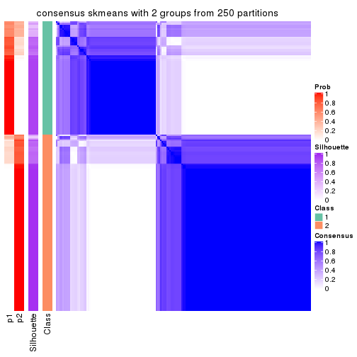</p>

</div>
<div id='tab-CV-skmeans-consensus-heatmap-2'>
<pre><code class="r">consensus_heatmap(res, k = 3)
</code></pre>

<p>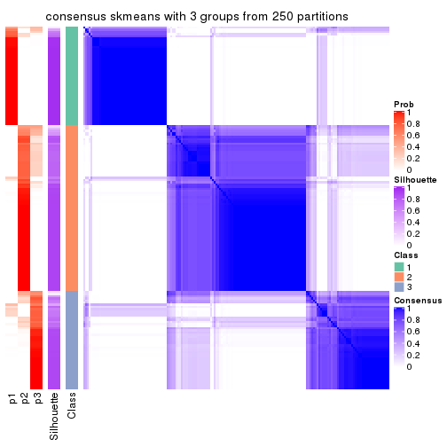</p>

</div>
<div id='tab-CV-skmeans-consensus-heatmap-3'>
<pre><code class="r">consensus_heatmap(res, k = 4)
</code></pre>

<p>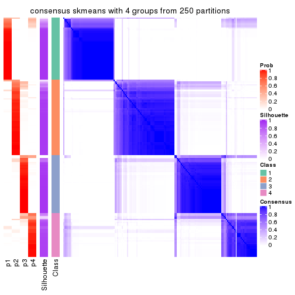</p>

</div>
<div id='tab-CV-skmeans-consensus-heatmap-4'>
<pre><code class="r">consensus_heatmap(res, k = 5)
</code></pre>

<p>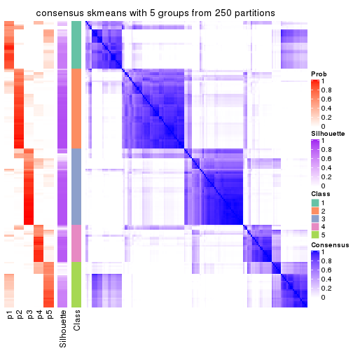</p>

</div>
<div id='tab-CV-skmeans-consensus-heatmap-5'>
<pre><code class="r">consensus_heatmap(res, k = 6)
</code></pre>

<p>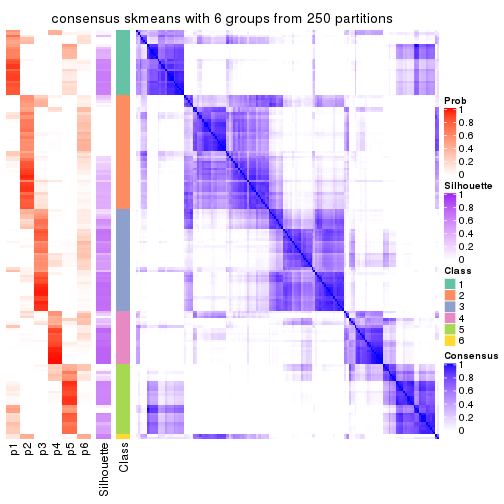</p>

</div>
</div>

Heatmaps for the membership of samples in all partitions to see how consistent they are:


<script>
$( function() {
	$( '#tabs-CV-skmeans-membership-heatmap' ).tabs();
} );
</script>
<div id='tabs-CV-skmeans-membership-heatmap'>
<ul>
<li><a href='#tab-CV-skmeans-membership-heatmap-1'>k = 2</a></li>
<li><a href='#tab-CV-skmeans-membership-heatmap-2'>k = 3</a></li>
<li><a href='#tab-CV-skmeans-membership-heatmap-3'>k = 4</a></li>
<li><a href='#tab-CV-skmeans-membership-heatmap-4'>k = 5</a></li>
<li><a href='#tab-CV-skmeans-membership-heatmap-5'>k = 6</a></li>
</ul>
<div id='tab-CV-skmeans-membership-heatmap-1'>
<pre><code class="r">membership_heatmap(res, k = 2)
</code></pre>

<p>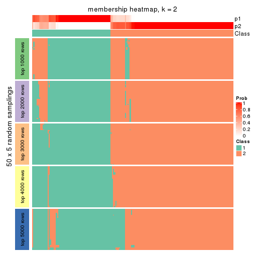</p>

</div>
<div id='tab-CV-skmeans-membership-heatmap-2'>
<pre><code class="r">membership_heatmap(res, k = 3)
</code></pre>

<p>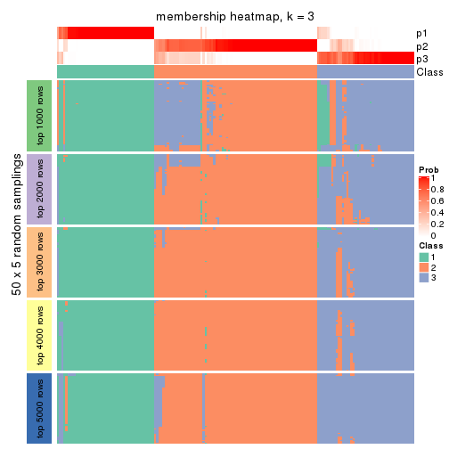</p>

</div>
<div id='tab-CV-skmeans-membership-heatmap-3'>
<pre><code class="r">membership_heatmap(res, k = 4)
</code></pre>

<p>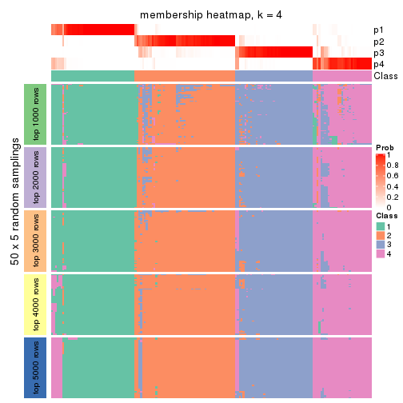</p>

</div>
<div id='tab-CV-skmeans-membership-heatmap-4'>
<pre><code class="r">membership_heatmap(res, k = 5)
</code></pre>

<p>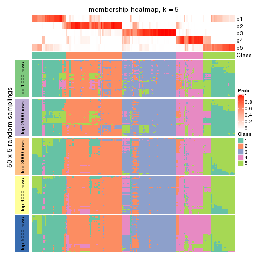</p>

</div>
<div id='tab-CV-skmeans-membership-heatmap-5'>
<pre><code class="r">membership_heatmap(res, k = 6)
</code></pre>

<p>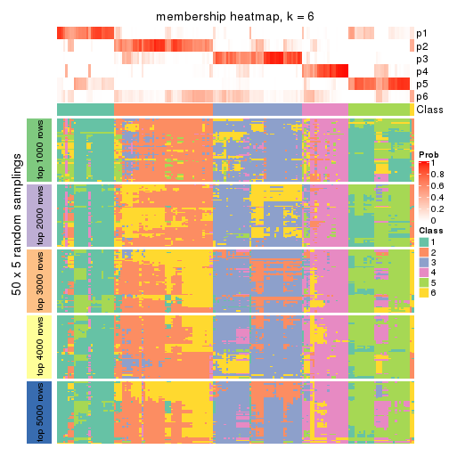</p>

</div>
</div>

As soon as we have had the classes for columns, we can look for signatures
which are significantly different between classes which can be candidate marks
for certain classes. Following are the heatmaps for signatures.


Signature heatmaps where rows are scaled:


<script>
$( function() {
	$( '#tabs-CV-skmeans-get-signatures' ).tabs();
} );
</script>
<div id='tabs-CV-skmeans-get-signatures'>
<ul>
<li><a href='#tab-CV-skmeans-get-signatures-1'>k = 2</a></li>
<li><a href='#tab-CV-skmeans-get-signatures-2'>k = 3</a></li>
<li><a href='#tab-CV-skmeans-get-signatures-3'>k = 4</a></li>
<li><a href='#tab-CV-skmeans-get-signatures-4'>k = 5</a></li>
<li><a href='#tab-CV-skmeans-get-signatures-5'>k = 6</a></li>
</ul>
<div id='tab-CV-skmeans-get-signatures-1'>
<pre><code class="r">get_signatures(res, k = 2)
</code></pre>

<p>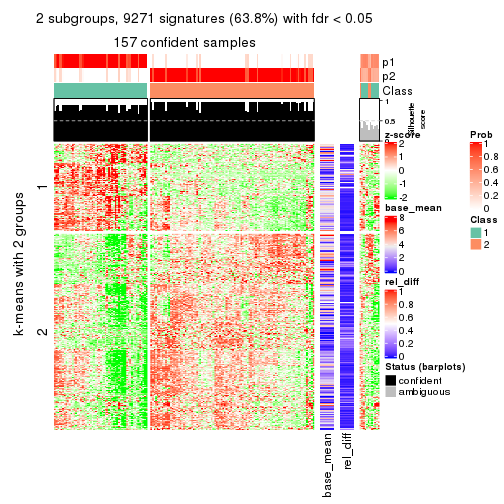</p>

</div>
<div id='tab-CV-skmeans-get-signatures-2'>
<pre><code class="r">get_signatures(res, k = 3)
</code></pre>

<p>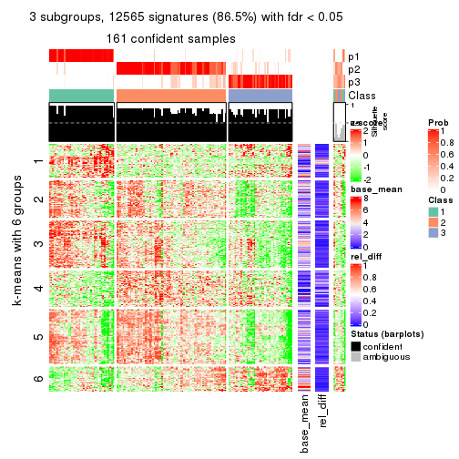</p>

</div>
<div id='tab-CV-skmeans-get-signatures-3'>
<pre><code class="r">get_signatures(res, k = 4)
</code></pre>

<p>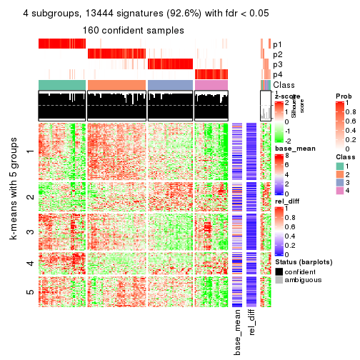</p>

</div>
<div id='tab-CV-skmeans-get-signatures-4'>
<pre><code class="r">get_signatures(res, k = 5)
</code></pre>

<p>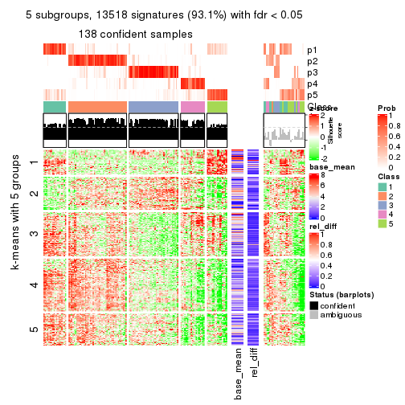</p>

</div>
<div id='tab-CV-skmeans-get-signatures-5'>
<pre><code class="r">get_signatures(res, k = 6)
</code></pre>

<p>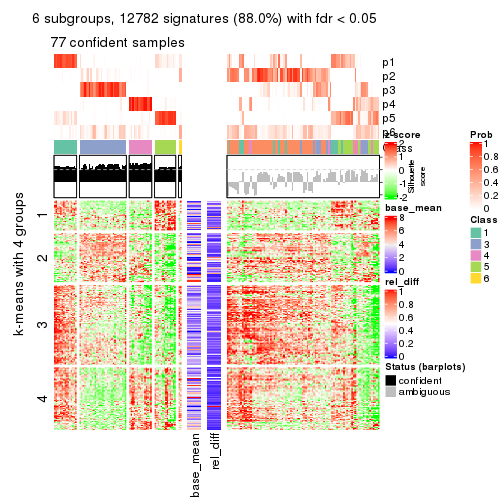</p>

</div>
</div>


Signature heatmaps where rows are not scaled:


<script>
$( function() {
	$( '#tabs-CV-skmeans-get-signatures-no-scale' ).tabs();
} );
</script>
<div id='tabs-CV-skmeans-get-signatures-no-scale'>
<ul>
<li><a href='#tab-CV-skmeans-get-signatures-no-scale-1'>k = 2</a></li>
<li><a href='#tab-CV-skmeans-get-signatures-no-scale-2'>k = 3</a></li>
<li><a href='#tab-CV-skmeans-get-signatures-no-scale-3'>k = 4</a></li>
<li><a href='#tab-CV-skmeans-get-signatures-no-scale-4'>k = 5</a></li>
<li><a href='#tab-CV-skmeans-get-signatures-no-scale-5'>k = 6</a></li>
</ul>
<div id='tab-CV-skmeans-get-signatures-no-scale-1'>
<pre><code class="r">get_signatures(res, k = 2, scale_rows = FALSE)
</code></pre>

<p>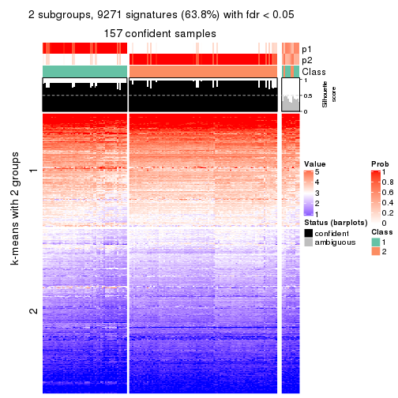</p>

</div>
<div id='tab-CV-skmeans-get-signatures-no-scale-2'>
<pre><code class="r">get_signatures(res, k = 3, scale_rows = FALSE)
</code></pre>

<p>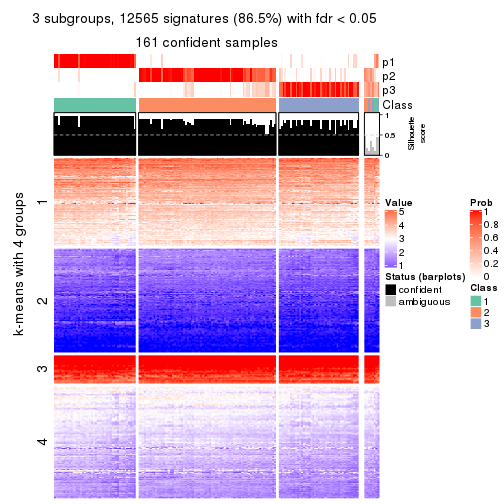</p>

</div>
<div id='tab-CV-skmeans-get-signatures-no-scale-3'>
<pre><code class="r">get_signatures(res, k = 4, scale_rows = FALSE)
</code></pre>

<p>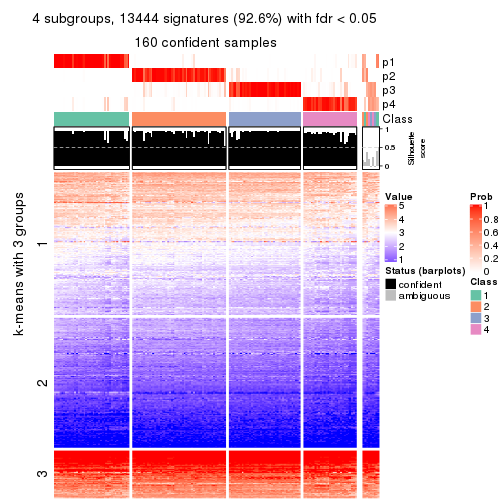</p>

</div>
<div id='tab-CV-skmeans-get-signatures-no-scale-4'>
<pre><code class="r">get_signatures(res, k = 5, scale_rows = FALSE)
</code></pre>

<p>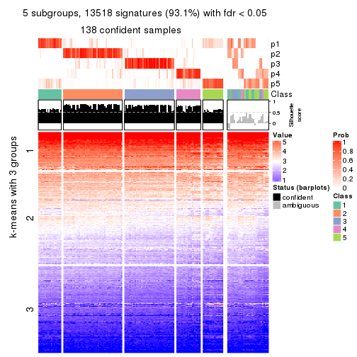</p>

</div>
<div id='tab-CV-skmeans-get-signatures-no-scale-5'>
<pre><code class="r">get_signatures(res, k = 6, scale_rows = FALSE)
</code></pre>

<p>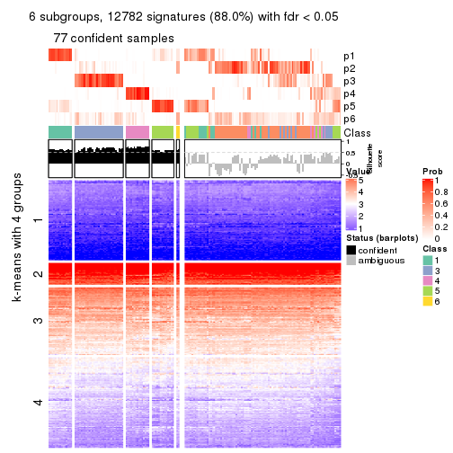</p>

</div>
</div>


Compare the overlap of signatures from different k:

```r
compare_signatures(res)
```

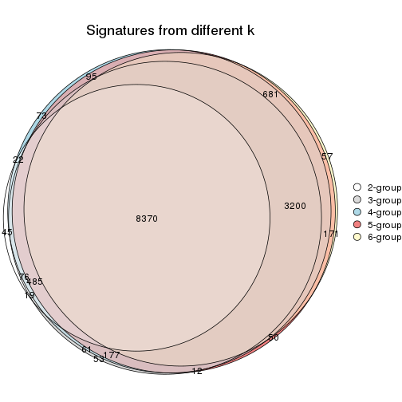

`get_signature()` returns a data frame invisibly. TO get the list of signatures, the function
call should be assigned to a variable explicitly. In following code, if `plot` argument is set
to `FALSE`, no heatmap is plotted while only the differential analysis is performed.

```r
# code only for demonstration
tb = get_signature(res, k = ..., plot = FALSE)
```

An example of the output of `tb` is:

```
#>   which_row         fdr    mean_1    mean_2 scaled_mean_1 scaled_mean_2 km
#> 1        38 0.042760348  8.373488  9.131774    -0.5533452     0.5164555  1
#> 2        40 0.018707592  7.106213  8.469186    -0.6173731     0.5762149  1
#> 3        55 0.019134737 10.221463 11.207825    -0.6159697     0.5749050  1
#> 4        59 0.006059896  5.921854  7.869574    -0.6899429     0.6439467  1
#> 5        60 0.018055526  8.928898 10.211722    -0.6204761     0.5791110  1
#> 6        98 0.009384629 15.714769 14.887706     0.6635654    -0.6193277  2
...
```

The columns in `tb` are:

1. `which_row`: row indices corresponding to the input matrix.
2. `fdr`: FDR for the differential test. 
3. `mean_x`: The mean value in group x.
4. `scaled_mean_x`: The mean value in group x after rows are scaled.
5. `km`: Row groups if k-means clustering is applied to rows.


UMAP plot which shows how samples are separated.


<script>
$( function() {
	$( '#tabs-CV-skmeans-dimension-reduction' ).tabs();
} );
</script>
<div id='tabs-CV-skmeans-dimension-reduction'>
<ul>
<li><a href='#tab-CV-skmeans-dimension-reduction-1'>k = 2</a></li>
<li><a href='#tab-CV-skmeans-dimension-reduction-2'>k = 3</a></li>
<li><a href='#tab-CV-skmeans-dimension-reduction-3'>k = 4</a></li>
<li><a href='#tab-CV-skmeans-dimension-reduction-4'>k = 5</a></li>
<li><a href='#tab-CV-skmeans-dimension-reduction-5'>k = 6</a></li>
</ul>
<div id='tab-CV-skmeans-dimension-reduction-1'>
<pre><code class="r">dimension_reduction(res, k = 2, method = &quot;UMAP&quot;)
</code></pre>

<p>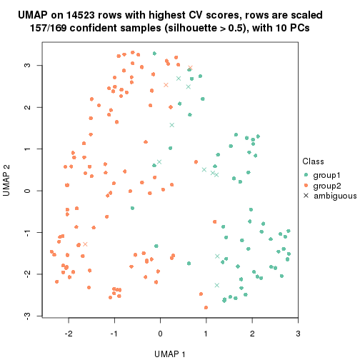</p>

</div>
<div id='tab-CV-skmeans-dimension-reduction-2'>
<pre><code class="r">dimension_reduction(res, k = 3, method = &quot;UMAP&quot;)
</code></pre>

<p>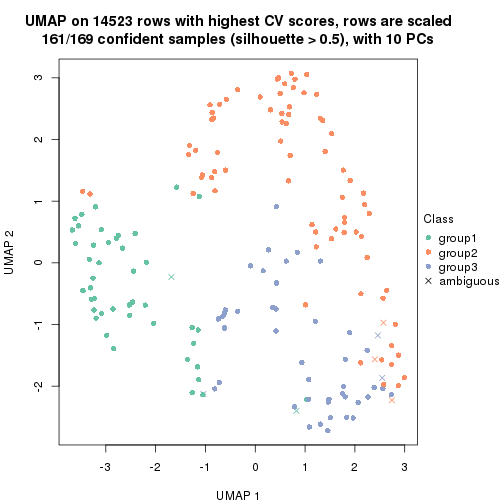</p>

</div>
<div id='tab-CV-skmeans-dimension-reduction-3'>
<pre><code class="r">dimension_reduction(res, k = 4, method = &quot;UMAP&quot;)
</code></pre>

<p>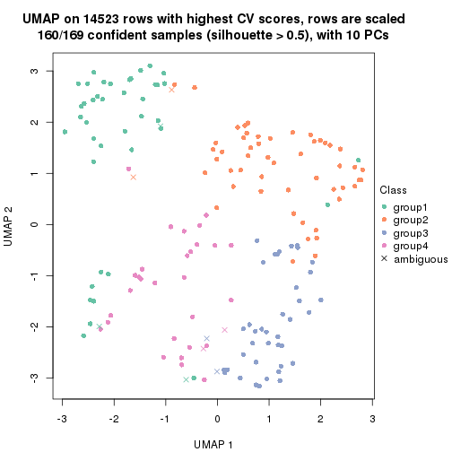</p>

</div>
<div id='tab-CV-skmeans-dimension-reduction-4'>
<pre><code class="r">dimension_reduction(res, k = 5, method = &quot;UMAP&quot;)
</code></pre>

<p>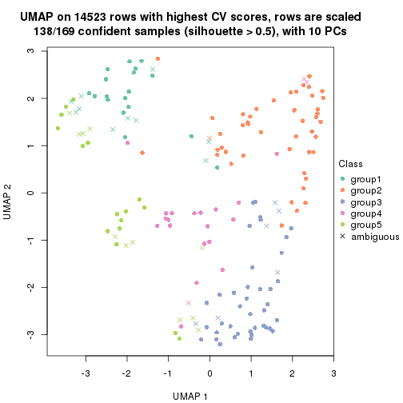</p>

</div>
<div id='tab-CV-skmeans-dimension-reduction-5'>
<pre><code class="r">dimension_reduction(res, k = 6, method = &quot;UMAP&quot;)
</code></pre>

<p>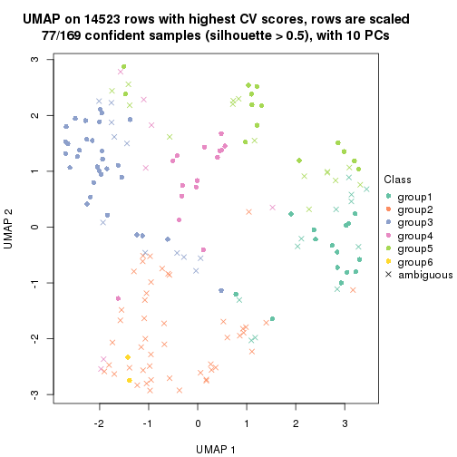</p>

</div>
</div>


Following heatmap shows how subgroups are split when increasing `k`:

```r
collect_classes(res)
```

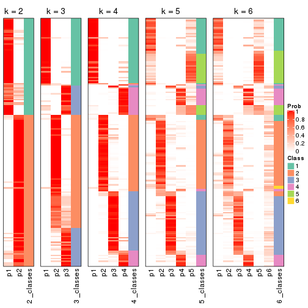


If matrix rows can be associated to genes, consider to use `GO_Enrichment(res,
...)` to perform function enrichment for the signature genes.


 

---------------------------------------------------


### CV:pam


The object with results only for a single top-value method and a single partition method 
can be extracted as:

```r
res = res_list["CV", "pam"]
# you can also extract it by
# res = res_list["CV:pam"]
```

A summary of `res` and all the functions that can be applied to it:

```r
res
```

```
#> A 'ConsensusPartition' object with k = 2, 3, 4, 5, 6.
#>   On a matrix with 14523 rows and 169 columns.
#>   Top rows (1000, 2000, 3000, 4000, 5000) are extracted by 'CV' method.
#>   Subgroups are detected by 'pam' method.
#>   Performed in total 1250 partitions by row resampling.
#>   Best k for subgroups seems to be 5.
#> 
#> Following methods can be applied to this 'ConsensusPartition' object:
#>  [1] "cola_report"             "collect_classes"         "collect_plots"          
#>  [4] "collect_stats"           "colnames"                "compare_signatures"     
#>  [7] "consensus_heatmap"       "dimension_reduction"     "functional_enrichment"  
#> [10] "get_anno_col"            "get_anno"                "get_classes"            
#> [13] "get_consensus"           "get_matrix"              "get_membership"         
#> [16] "get_param"               "get_signatures"          "get_stats"              
#> [19] "is_best_k"               "is_stable_k"             "membership_heatmap"     
#> [22] "ncol"                    "nrow"                    "plot_ecdf"              
#> [25] "rownames"                "select_partition_number" "show"                   
#> [28] "suggest_best_k"          "test_to_known_factors"
```

`collect_plots()` function collects all the plots made from `res` for all `k` (number of partitions)
into one single page to provide an easy and fast comparison between different `k`.

```r
collect_plots(res)
```

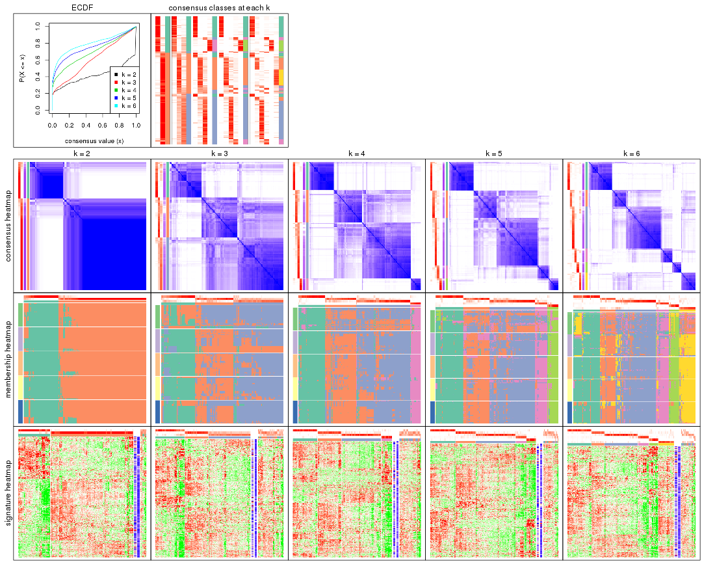

The plots are:

- The first row: a plot of the ECDF (Empirical cumulative distribution
  function) curves of the consensus matrix for each `k` and the heatmap of
  predicted classes for each `k`.
- The second row: heatmaps of the consensus matrix for each `k`.
- The third row: heatmaps of the membership matrix for each `k`.
- The fouth row: heatmaps of the signatures for each `k`.

All the plots in panels can be made by individual functions and they are
plotted later in this section.

`select_partition_number()` produces several plots showing different
statistics for choosing "optimized" `k`. There are following statistics:

- ECDF curves of the consensus matrix for each `k`;
- 1-PAC. [The PAC
  score](https://en.wikipedia.org/wiki/Consensus_clustering#Over-interpretation_potential_of_consensus_clustering)
  measures the proportion of the ambiguous subgrouping.
- Mean silhouette score.
- Concordance. The mean probability of fiting the consensus class ids in all
  partitions.
- Area increased. Denote $A_k$ as the area under the ECDF curve for current
  `k`, the area increased is defined as $A_k - A_{k-1}$.
- Rand index. The percent of pairs of samples that are both in a same cluster
  or both are not in a same cluster in the partition of k and k-1.
- Jaccard index. The ratio of pairs of samples are both in a same cluster in
  the partition of k and k-1 and the pairs of samples are both in a same
  cluster in the partition k or k-1.

The detailed explanations of these statistics can be found in [the cola
vignette](http://bioconductor.org/packages/devel/bioc/vignettes/cola/inst/doc/cola.html#toc_13).

Generally speaking, lower PAC score, higher mean silhouette score or higher
concordance corresponds to better partition. Rand index and Jaccard index
measure how similar the current partition is compared to partition with `k-1`.
If they are too similar, we won't accept `k` is better than `k-1`.

```r
select_partition_number(res)
```

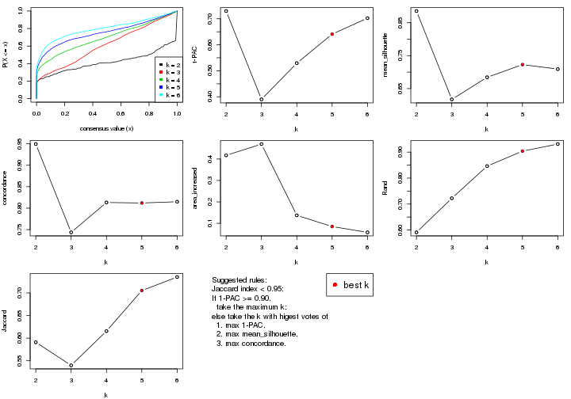

The numeric values for all these statistics can be obtained by `get_stats()`.

```r
get_stats(res)
```

```
#>   k 1-PAC mean_silhouette concordance area_increased  Rand Jaccard
#> 2 2 0.730           0.885       0.949         0.4171 0.591   0.591
#> 3 3 0.390           0.617       0.744         0.4698 0.722   0.540
#> 4 4 0.529           0.684       0.813         0.1373 0.846   0.616
#> 5 5 0.641           0.723       0.812         0.0850 0.904   0.705
#> 6 6 0.702           0.709       0.815         0.0578 0.931   0.735
```

`suggest_best_k()` suggests the best $k$ based on these statistics. The rules are as follows:

- All $k$ with Jaccard index larger than 0.95 are removed because the increase of
  the partition number does not provides enough extra information. If all $k$ are removed,
  the best $k$ is assigned by `NA`.
- For $k$ with 1-PAC larger than 0.9, the maximal $k$ is taken as the "best k". Other $k$ is called "optional k".
- If it does not fit the second rule. The $k$ with the highest vote of highest
  1-PAC, mean silhouette and concordance is taken as the "best k".

```r
suggest_best_k(res)
```

```
#> [1] 5
```


Following shows the table of the partitions (You need to click the **show/hide
code output** link to see it). The membership matrix (columns with name `p*`)
is inferred by
[`clue::cl_consensus()`](https://www.rdocumentation.org/link/cl_consensus?package=clue)
function with the `SE` method. Basically the value in the membership matrix
represents the probability to belong to a certain group. The finall class
label for an item is determined with the group with highest probability it
belongs to.

In `get_classes()` function, the entropy is calculated from the membership
matrix and the silhouette score is calculated from the consensus matrix.


<script>
$( function() {
	$( '#tabs-CV-pam-get-classes' ).tabs();
} );
</script>
<div id='tabs-CV-pam-get-classes'>
<ul>
<li><a href='#tab-CV-pam-get-classes-1'>k = 2</a></li>
<li><a href='#tab-CV-pam-get-classes-2'>k = 3</a></li>
<li><a href='#tab-CV-pam-get-classes-3'>k = 4</a></li>
<li><a href='#tab-CV-pam-get-classes-4'>k = 5</a></li>
<li><a href='#tab-CV-pam-get-classes-5'>k = 6</a></li>
</ul>

<div id='tab-CV-pam-get-classes-1'>
<p><a id='tab-CV-pam-get-classes-1-a' style='color:#0366d6' href='#'>show/hide code output</a></p>
<pre><code class="r">cbind(get_classes(res, k = 2), get_membership(res, k = 2))
</code></pre>

<pre><code>#&gt;            class entropy silhouette    p1    p2
#&gt; SRR2052702     2  0.0000    0.95285 0.000 1.000
#&gt; SRR2052701     2  0.3584    0.90072 0.068 0.932
#&gt; SRR2052700     2  0.0000    0.95285 0.000 1.000
#&gt; SRR2052699     2  0.6247    0.81366 0.156 0.844
#&gt; SRR2052698     2  0.0000    0.95285 0.000 1.000
#&gt; SRR2052708     1  0.0000    0.92251 1.000 0.000
#&gt; SRR2052749     1  0.0000    0.92251 1.000 0.000
#&gt; SRR2052786     2  0.0000    0.95285 0.000 1.000
#&gt; SRR2052825     2  0.7453    0.70252 0.212 0.788
#&gt; SRR2052824     2  0.0000    0.95285 0.000 1.000
#&gt; SRR2052823     2  0.0000    0.95285 0.000 1.000
#&gt; SRR2052822     2  0.0000    0.95285 0.000 1.000
#&gt; SRR2052821     2  0.0000    0.95285 0.000 1.000
#&gt; SRR2052820     2  0.6247    0.79273 0.156 0.844
#&gt; SRR2052819     2  0.0000    0.95285 0.000 1.000
#&gt; SRR2052818     2  0.0000    0.95285 0.000 1.000
#&gt; SRR2052817     2  0.0000    0.95285 0.000 1.000
#&gt; SRR2052816     2  0.6973    0.76790 0.188 0.812
#&gt; SRR2052815     2  0.0000    0.95285 0.000 1.000
#&gt; SRR2052814     2  0.0000    0.95285 0.000 1.000
#&gt; SRR2052813     2  0.0000    0.95285 0.000 1.000
#&gt; SRR2052812     2  0.0000    0.95285 0.000 1.000
#&gt; SRR2052811     2  0.0000    0.95285 0.000 1.000
#&gt; SRR2052810     2  0.0000    0.95285 0.000 1.000
#&gt; SRR2052809     2  0.0000    0.95285 0.000 1.000
#&gt; SRR2052808     2  0.0000    0.95285 0.000 1.000
#&gt; SRR2052807     1  0.4690    0.85935 0.900 0.100
#&gt; SRR2052806     1  0.0000    0.92251 1.000 0.000
#&gt; SRR2052805     1  0.0000    0.92251 1.000 0.000
#&gt; SRR2052804     1  0.9087    0.58016 0.676 0.324
#&gt; SRR2052803     1  0.0000    0.92251 1.000 0.000
#&gt; SRR2052802     1  0.9000    0.59917 0.684 0.316
#&gt; SRR2052801     1  0.0000    0.92251 1.000 0.000
#&gt; SRR2052800     1  0.8713    0.63653 0.708 0.292
#&gt; SRR2052799     1  0.0376    0.92097 0.996 0.004
#&gt; SRR2052798     1  0.0000    0.92251 1.000 0.000
#&gt; SRR2052797     2  0.0000    0.95285 0.000 1.000
#&gt; SRR2052796     1  0.0000    0.92251 1.000 0.000
#&gt; SRR2052795     1  0.0000    0.92251 1.000 0.000
#&gt; SRR2052794     1  0.3274    0.88792 0.940 0.060
#&gt; SRR2052793     1  0.0000    0.92251 1.000 0.000
#&gt; SRR2052792     1  0.9608    0.46558 0.616 0.384
#&gt; SRR2052791     1  0.5178    0.84618 0.884 0.116
#&gt; SRR2052790     2  0.0000    0.95285 0.000 1.000
#&gt; SRR2052789     2  0.0000    0.95285 0.000 1.000
#&gt; SRR2052788     2  0.0000    0.95285 0.000 1.000
#&gt; SRR2052787     2  0.0000    0.95285 0.000 1.000
#&gt; SRR2052785     2  0.0000    0.95285 0.000 1.000
#&gt; SRR2052784     2  0.0000    0.95285 0.000 1.000
#&gt; SRR2052783     2  0.0000    0.95285 0.000 1.000
#&gt; SRR2052782     2  0.0000    0.95285 0.000 1.000
#&gt; SRR2052781     2  0.0000    0.95285 0.000 1.000
#&gt; SRR2052780     2  0.0000    0.95285 0.000 1.000
#&gt; SRR2052777     2  0.0000    0.95285 0.000 1.000
#&gt; SRR2052779     2  0.0000    0.95285 0.000 1.000
#&gt; SRR2052778     2  0.0000    0.95285 0.000 1.000
#&gt; SRR2052776     2  0.0000    0.95285 0.000 1.000
#&gt; SRR2052775     2  0.0000    0.95285 0.000 1.000
#&gt; SRR2052773     2  0.0000    0.95285 0.000 1.000
#&gt; SRR2052772     2  0.0000    0.95285 0.000 1.000
#&gt; SRR2052774     2  0.0000    0.95285 0.000 1.000
#&gt; SRR2052771     1  0.2948    0.89327 0.948 0.052
#&gt; SRR2052769     2  0.0000    0.95285 0.000 1.000
#&gt; SRR2052770     2  0.0000    0.95285 0.000 1.000
#&gt; SRR2052768     2  0.0000    0.95285 0.000 1.000
#&gt; SRR2052767     2  0.0000    0.95285 0.000 1.000
#&gt; SRR2052766     2  0.9635    0.28719 0.388 0.612
#&gt; SRR2052765     2  0.0000    0.95285 0.000 1.000
#&gt; SRR2052763     2  0.0000    0.95285 0.000 1.000
#&gt; SRR2052764     2  0.0000    0.95285 0.000 1.000
#&gt; SRR2052761     2  0.0000    0.95285 0.000 1.000
#&gt; SRR2052760     2  0.0000    0.95285 0.000 1.000
#&gt; SRR2052759     2  0.0000    0.95285 0.000 1.000
#&gt; SRR2052762     2  0.0000    0.95285 0.000 1.000
#&gt; SRR2052758     2  0.0000    0.95285 0.000 1.000
#&gt; SRR2052756     1  0.1184    0.91554 0.984 0.016
#&gt; SRR2052757     2  0.0000    0.95285 0.000 1.000
#&gt; SRR2052755     1  0.0000    0.92251 1.000 0.000
#&gt; SRR2052754     1  0.0000    0.92251 1.000 0.000
#&gt; SRR2052753     1  0.0000    0.92251 1.000 0.000
#&gt; SRR2052752     1  0.0000    0.92251 1.000 0.000
#&gt; SRR2052750     1  0.0000    0.92251 1.000 0.000
#&gt; SRR2052751     2  0.0000    0.95285 0.000 1.000
#&gt; SRR2052748     2  0.9963    0.00397 0.464 0.536
#&gt; SRR2052747     1  0.0000    0.92251 1.000 0.000
#&gt; SRR2052746     2  0.0000    0.95285 0.000 1.000
#&gt; SRR2052745     2  0.0000    0.95285 0.000 1.000
#&gt; SRR2052744     1  0.0000    0.92251 1.000 0.000
#&gt; SRR2052741     2  0.5178    0.85701 0.116 0.884
#&gt; SRR2052743     2  0.3584    0.90020 0.068 0.932
#&gt; SRR2052740     2  0.4431    0.87983 0.092 0.908
#&gt; SRR2052742     2  0.2778    0.91865 0.048 0.952
#&gt; SRR2052739     2  0.0000    0.95285 0.000 1.000
#&gt; SRR2052738     2  0.0000    0.95285 0.000 1.000
#&gt; SRR2052736     2  0.7299    0.75266 0.204 0.796
#&gt; SRR2052735     1  0.5946    0.80230 0.856 0.144
#&gt; SRR2052734     1  0.7453    0.71240 0.788 0.212
#&gt; SRR2052737     2  0.0000    0.95285 0.000 1.000
#&gt; SRR2052733     2  0.0000    0.95285 0.000 1.000
#&gt; SRR2052732     2  0.1184    0.94195 0.016 0.984
#&gt; SRR2052731     2  0.0000    0.95285 0.000 1.000
#&gt; SRR2052729     1  0.0000    0.92251 1.000 0.000
#&gt; SRR2052728     1  0.0000    0.92251 1.000 0.000
#&gt; SRR2052730     1  0.9909    0.30103 0.556 0.444
#&gt; SRR2052727     1  0.0000    0.92251 1.000 0.000
#&gt; SRR2052725     2  0.6247    0.81565 0.156 0.844
#&gt; SRR2052726     1  0.1843    0.90892 0.972 0.028
#&gt; SRR2052724     1  0.0000    0.92251 1.000 0.000
#&gt; SRR2052723     1  0.9850    0.35645 0.572 0.428
#&gt; SRR2052722     2  0.0000    0.95285 0.000 1.000
#&gt; SRR2052721     1  0.0000    0.92251 1.000 0.000
#&gt; SRR2052720     2  0.0000    0.95285 0.000 1.000
#&gt; SRR2052719     2  0.0000    0.95285 0.000 1.000
#&gt; SRR2052718     2  0.9710    0.36023 0.400 0.600
#&gt; SRR2052717     2  0.0000    0.95285 0.000 1.000
#&gt; SRR2052714     1  0.0672    0.91924 0.992 0.008
#&gt; SRR2052716     2  0.0000    0.95285 0.000 1.000
#&gt; SRR2052715     2  0.0000    0.95285 0.000 1.000
#&gt; SRR2052713     1  0.0000    0.92251 1.000 0.000
#&gt; SRR2052712     1  0.9044    0.59063 0.680 0.320
#&gt; SRR2052711     2  0.6712    0.79082 0.176 0.824
#&gt; SRR2052710     2  0.0000    0.95285 0.000 1.000
#&gt; SRR2052707     2  0.0000    0.95285 0.000 1.000
#&gt; SRR2052709     2  0.0000    0.95285 0.000 1.000
#&gt; SRR2052704     2  0.0000    0.95285 0.000 1.000
#&gt; SRR2052705     2  0.0000    0.95285 0.000 1.000
#&gt; SRR2052697     2  0.5294    0.85410 0.120 0.880
#&gt; SRR2052703     2  0.0000    0.95285 0.000 1.000
#&gt; SRR2052696     1  0.0000    0.92251 1.000 0.000
#&gt; SRR2052706     2  0.0000    0.95285 0.000 1.000
#&gt; SRR2052695     2  0.0000    0.95285 0.000 1.000
#&gt; SRR2052694     2  0.0000    0.95285 0.000 1.000
#&gt; SRR2052692     2  0.0000    0.95285 0.000 1.000
#&gt; SRR2052693     2  0.0000    0.95285 0.000 1.000
#&gt; SRR2052691     2  0.9286    0.49820 0.344 0.656
#&gt; SRR2052690     2  0.6531    0.80046 0.168 0.832
#&gt; SRR2052689     2  0.0000    0.95285 0.000 1.000
#&gt; SRR2052687     2  0.0000    0.95285 0.000 1.000
#&gt; SRR2052686     2  0.8207    0.67210 0.256 0.744
#&gt; SRR2052688     2  0.0000    0.95285 0.000 1.000
#&gt; SRR2052684     1  0.6623    0.79428 0.828 0.172
#&gt; SRR2052685     2  0.5629    0.83861 0.132 0.868
#&gt; SRR2052683     1  0.0000    0.92251 1.000 0.000
#&gt; SRR2052681     2  0.0000    0.95285 0.000 1.000
#&gt; SRR2052680     2  0.0000    0.95285 0.000 1.000
#&gt; SRR2052682     2  0.9833    0.29240 0.424 0.576
#&gt; SRR2052679     1  0.0000    0.92251 1.000 0.000
#&gt; SRR2052678     2  0.0000    0.95285 0.000 1.000
#&gt; SRR2052677     2  0.0000    0.95285 0.000 1.000
#&gt; SRR2052675     2  0.4431    0.87973 0.092 0.908
#&gt; SRR2052676     1  0.0000    0.92251 1.000 0.000
#&gt; SRR2052674     2  0.0000    0.95285 0.000 1.000
#&gt; SRR2052672     2  0.0000    0.95285 0.000 1.000
#&gt; SRR2052673     2  0.5946    0.82841 0.144 0.856
#&gt; SRR2052671     2  0.0000    0.95285 0.000 1.000
#&gt; SRR2052670     2  0.0000    0.95285 0.000 1.000
#&gt; SRR2052669     2  0.0000    0.95285 0.000 1.000
#&gt; SRR2052668     2  0.4690    0.87283 0.100 0.900
#&gt; SRR2052667     2  0.0000    0.95285 0.000 1.000
#&gt; SRR2052666     2  0.0000    0.95285 0.000 1.000
#&gt; SRR2052665     2  0.0376    0.95007 0.004 0.996
#&gt; SRR2052664     1  0.0000    0.92251 1.000 0.000
#&gt; SRR2052663     2  0.5408    0.84628 0.124 0.876
#&gt; SRR2052662     2  0.0000    0.95285 0.000 1.000
#&gt; SRR2052661     1  0.1184    0.91553 0.984 0.016
#&gt; SRR2052660     2  0.0000    0.95285 0.000 1.000
#&gt; SRR2052659     2  0.8661    0.55666 0.288 0.712
#&gt; SRR2052658     2  0.2423    0.92336 0.040 0.960
#&gt; SRR2052657     1  0.0000    0.92251 1.000 0.000
</code></pre>

<script>
$('#tab-CV-pam-get-classes-1-a').parent().next().next().hide();
$('#tab-CV-pam-get-classes-1-a').click(function(){
  $('#tab-CV-pam-get-classes-1-a').parent().next().next().toggle();
  return(false);
});
</script>
</div>

<div id='tab-CV-pam-get-classes-2'>
<p><a id='tab-CV-pam-get-classes-2-a' style='color:#0366d6' href='#'>show/hide code output</a></p>
<pre><code class="r">cbind(get_classes(res, k = 3), get_membership(res, k = 3))
</code></pre>

<pre><code>#&gt;            class entropy silhouette    p1    p2    p3
#&gt; SRR2052702     2  0.1529     0.6886 0.000 0.960 0.040
#&gt; SRR2052701     2  0.6083     0.5919 0.060 0.772 0.168
#&gt; SRR2052700     2  0.5254     0.3662 0.000 0.736 0.264
#&gt; SRR2052699     3  0.8525     0.2937 0.252 0.148 0.600
#&gt; SRR2052698     3  0.6045     0.6862 0.000 0.380 0.620
#&gt; SRR2052708     1  0.0661     0.8233 0.988 0.008 0.004
#&gt; SRR2052749     1  0.0000     0.8246 1.000 0.000 0.000
#&gt; SRR2052786     2  0.5835     0.2543 0.000 0.660 0.340
#&gt; SRR2052825     2  0.7232    -0.1491 0.028 0.544 0.428
#&gt; SRR2052824     3  0.6062     0.6215 0.000 0.384 0.616
#&gt; SRR2052823     2  0.2066     0.6867 0.000 0.940 0.060
#&gt; SRR2052822     3  0.6095     0.6527 0.000 0.392 0.608
#&gt; SRR2052821     2  0.4504     0.5277 0.000 0.804 0.196
#&gt; SRR2052820     3  0.9460     0.2569 0.180 0.396 0.424
#&gt; SRR2052819     3  0.6111     0.6474 0.000 0.396 0.604
#&gt; SRR2052818     2  0.1411     0.6826 0.000 0.964 0.036
#&gt; SRR2052817     3  0.5291     0.7905 0.000 0.268 0.732
#&gt; SRR2052816     2  0.8048     0.4922 0.108 0.628 0.264
#&gt; SRR2052815     2  0.6126     0.0417 0.000 0.600 0.400
#&gt; SRR2052814     2  0.5733     0.2640 0.000 0.676 0.324
#&gt; SRR2052813     2  0.2356     0.6832 0.000 0.928 0.072
#&gt; SRR2052812     2  0.4062     0.6085 0.000 0.836 0.164
#&gt; SRR2052811     2  0.1289     0.6871 0.000 0.968 0.032
#&gt; SRR2052810     2  0.4555     0.5798 0.000 0.800 0.200
#&gt; SRR2052809     3  0.6280     0.5850 0.000 0.460 0.540
#&gt; SRR2052808     3  0.5968     0.6873 0.000 0.364 0.636
#&gt; SRR2052807     1  0.7044     0.7046 0.620 0.032 0.348
#&gt; SRR2052806     1  0.4654     0.7886 0.792 0.000 0.208
#&gt; SRR2052805     1  0.4654     0.7886 0.792 0.000 0.208
#&gt; SRR2052804     1  0.8628     0.3902 0.544 0.116 0.340
#&gt; SRR2052803     1  0.4750     0.7883 0.784 0.000 0.216
#&gt; SRR2052802     1  0.7394     0.5495 0.496 0.032 0.472
#&gt; SRR2052801     1  0.4974     0.7827 0.764 0.000 0.236
#&gt; SRR2052800     1  0.7453     0.6023 0.528 0.036 0.436
#&gt; SRR2052799     1  0.5138     0.7751 0.748 0.000 0.252
#&gt; SRR2052798     1  0.0000     0.8246 1.000 0.000 0.000
#&gt; SRR2052797     2  0.2537     0.6833 0.000 0.920 0.080
#&gt; SRR2052796     1  0.4887     0.7835 0.772 0.000 0.228
#&gt; SRR2052795     1  0.1643     0.8253 0.956 0.000 0.044
#&gt; SRR2052794     1  0.5650     0.7430 0.688 0.000 0.312
#&gt; SRR2052793     1  0.4887     0.7835 0.772 0.000 0.228
#&gt; SRR2052792     1  0.8865     0.3346 0.476 0.120 0.404
#&gt; SRR2052791     1  0.6081     0.7177 0.652 0.004 0.344
#&gt; SRR2052790     3  0.6291     0.5856 0.000 0.468 0.532
#&gt; SRR2052789     3  0.5397     0.7849 0.000 0.280 0.720
#&gt; SRR2052788     3  0.5363     0.7860 0.000 0.276 0.724
#&gt; SRR2052787     3  0.6308     0.5338 0.000 0.492 0.508
#&gt; SRR2052785     3  0.6140     0.6523 0.000 0.404 0.596
#&gt; SRR2052784     3  0.6225     0.5773 0.000 0.432 0.568
#&gt; SRR2052783     3  0.5650     0.7650 0.000 0.312 0.688
#&gt; SRR2052782     2  0.2878     0.6663 0.000 0.904 0.096
#&gt; SRR2052781     3  0.6225     0.6340 0.000 0.432 0.568
#&gt; SRR2052780     3  0.5178     0.7893 0.000 0.256 0.744
#&gt; SRR2052777     2  0.3340     0.6642 0.000 0.880 0.120
#&gt; SRR2052779     2  0.2959     0.6634 0.000 0.900 0.100
#&gt; SRR2052778     3  0.5016     0.7861 0.000 0.240 0.760
#&gt; SRR2052776     3  0.6286     0.4838 0.000 0.464 0.536
#&gt; SRR2052775     3  0.5254     0.7878 0.000 0.264 0.736
#&gt; SRR2052773     3  0.5497     0.7748 0.000 0.292 0.708
#&gt; SRR2052772     3  0.5098     0.7880 0.000 0.248 0.752
#&gt; SRR2052774     3  0.5529     0.7758 0.000 0.296 0.704
#&gt; SRR2052771     1  0.5061     0.7928 0.784 0.008 0.208
#&gt; SRR2052769     2  0.6244    -0.1688 0.000 0.560 0.440
#&gt; SRR2052770     3  0.5968     0.6875 0.000 0.364 0.636
#&gt; SRR2052768     2  0.1643     0.6895 0.000 0.956 0.044
#&gt; SRR2052767     2  0.1643     0.6890 0.000 0.956 0.044
#&gt; SRR2052766     3  0.5874     0.7460 0.032 0.208 0.760
#&gt; SRR2052765     2  0.3116     0.6607 0.000 0.892 0.108
#&gt; SRR2052763     3  0.5016     0.7861 0.000 0.240 0.760
#&gt; SRR2052764     2  0.0237     0.6834 0.000 0.996 0.004
#&gt; SRR2052761     3  0.5621     0.7613 0.000 0.308 0.692
#&gt; SRR2052760     2  0.1860     0.6878 0.000 0.948 0.052
#&gt; SRR2052759     3  0.5098     0.7883 0.000 0.248 0.752
#&gt; SRR2052762     3  0.5948     0.7277 0.000 0.360 0.640
#&gt; SRR2052758     3  0.5254     0.7855 0.000 0.264 0.736
#&gt; SRR2052756     1  0.3213     0.7982 0.912 0.060 0.028
#&gt; SRR2052757     3  0.5926     0.7157 0.000 0.356 0.644
#&gt; SRR2052755     1  0.1877     0.8162 0.956 0.032 0.012
#&gt; SRR2052754     1  0.4931     0.7820 0.768 0.000 0.232
#&gt; SRR2052753     1  0.1525     0.8175 0.964 0.032 0.004
#&gt; SRR2052752     1  0.0848     0.8231 0.984 0.008 0.008
#&gt; SRR2052750     1  0.1877     0.8162 0.956 0.032 0.012
#&gt; SRR2052751     3  0.5835     0.7248 0.000 0.340 0.660
#&gt; SRR2052748     3  0.5551     0.7607 0.020 0.212 0.768
#&gt; SRR2052747     1  0.1529     0.8235 0.960 0.000 0.040
#&gt; SRR2052746     3  0.5327     0.7888 0.000 0.272 0.728
#&gt; SRR2052745     3  0.4974     0.7768 0.000 0.236 0.764
#&gt; SRR2052744     1  0.0000     0.8246 1.000 0.000 0.000
#&gt; SRR2052741     2  0.7692     0.5368 0.108 0.668 0.224
#&gt; SRR2052743     2  0.7012     0.4417 0.040 0.652 0.308
#&gt; SRR2052740     2  0.5371     0.6065 0.048 0.812 0.140
#&gt; SRR2052742     3  0.7190     0.6872 0.044 0.320 0.636
#&gt; SRR2052739     2  0.2356     0.6791 0.000 0.928 0.072
#&gt; SRR2052738     3  0.5016     0.7861 0.000 0.240 0.760
#&gt; SRR2052736     2  0.9150     0.3712 0.272 0.536 0.192
#&gt; SRR2052735     1  0.6662     0.5761 0.716 0.052 0.232
#&gt; SRR2052734     1  0.7368     0.3517 0.604 0.352 0.044
#&gt; SRR2052737     2  0.4887     0.4788 0.000 0.772 0.228
#&gt; SRR2052733     3  0.5098     0.7880 0.000 0.248 0.752
#&gt; SRR2052732     2  0.3715     0.6609 0.004 0.868 0.128
#&gt; SRR2052731     3  0.5098     0.7880 0.000 0.248 0.752
#&gt; SRR2052729     1  0.0000     0.8246 1.000 0.000 0.000
#&gt; SRR2052728     1  0.5610     0.6693 0.776 0.196 0.028
#&gt; SRR2052730     3  0.9596     0.2382 0.336 0.212 0.452
#&gt; SRR2052727     1  0.0000     0.8246 1.000 0.000 0.000
#&gt; SRR2052725     2  0.8399     0.4956 0.220 0.620 0.160
#&gt; SRR2052726     1  0.5036     0.7333 0.832 0.048 0.120
#&gt; SRR2052724     1  0.1877     0.8162 0.956 0.032 0.012
#&gt; SRR2052723     3  0.9601     0.3051 0.312 0.224 0.464
#&gt; SRR2052722     3  0.5016     0.7861 0.000 0.240 0.760
#&gt; SRR2052721     1  0.0000     0.8246 1.000 0.000 0.000
#&gt; SRR2052720     2  0.2878     0.6714 0.000 0.904 0.096
#&gt; SRR2052719     2  0.1289     0.6871 0.000 0.968 0.032
#&gt; SRR2052718     1  0.9713     0.0400 0.444 0.240 0.316
#&gt; SRR2052717     2  0.6215    -0.1079 0.000 0.572 0.428
#&gt; SRR2052714     1  0.3237     0.8034 0.912 0.032 0.056
#&gt; SRR2052716     3  0.5763     0.7439 0.016 0.244 0.740
#&gt; SRR2052715     3  0.5760     0.7415 0.000 0.328 0.672
#&gt; SRR2052713     1  0.1529     0.8235 0.960 0.000 0.040
#&gt; SRR2052712     1  0.8862     0.4453 0.564 0.164 0.272
#&gt; SRR2052711     3  0.8462     0.2738 0.288 0.124 0.588
#&gt; SRR2052710     3  0.6168     0.6519 0.000 0.412 0.588
#&gt; SRR2052707     3  0.5138     0.7884 0.000 0.252 0.748
#&gt; SRR2052709     3  0.5397     0.7879 0.000 0.280 0.720
#&gt; SRR2052704     3  0.4974     0.7851 0.000 0.236 0.764
#&gt; SRR2052705     2  0.6302    -0.3166 0.000 0.520 0.480
#&gt; SRR2052697     2  0.7585     0.5686 0.132 0.688 0.180
#&gt; SRR2052703     3  0.5016     0.7861 0.000 0.240 0.760
#&gt; SRR2052696     1  0.1163     0.8239 0.972 0.000 0.028
#&gt; SRR2052706     2  0.2711     0.6751 0.000 0.912 0.088
#&gt; SRR2052695     2  0.5016     0.4140 0.000 0.760 0.240
#&gt; SRR2052694     2  0.5988     0.0391 0.000 0.632 0.368
#&gt; SRR2052692     3  0.5138     0.7896 0.000 0.252 0.748
#&gt; SRR2052693     3  0.5397     0.7848 0.000 0.280 0.720
#&gt; SRR2052691     3  0.9649    -0.0743 0.388 0.208 0.404
#&gt; SRR2052690     2  0.9201     0.2872 0.160 0.488 0.352
#&gt; SRR2052689     3  0.6111     0.5959 0.000 0.396 0.604
#&gt; SRR2052687     3  0.5968     0.6576 0.000 0.364 0.636
#&gt; SRR2052686     2  0.7138     0.3104 0.312 0.644 0.044
#&gt; SRR2052688     2  0.1289     0.6871 0.000 0.968 0.032
#&gt; SRR2052684     1  0.7453     0.5620 0.644 0.064 0.292
#&gt; SRR2052685     2  0.5746     0.5466 0.180 0.780 0.040
#&gt; SRR2052683     1  0.3482     0.8112 0.872 0.000 0.128
#&gt; SRR2052681     3  0.6180     0.6732 0.000 0.416 0.584
#&gt; SRR2052680     3  0.6062     0.6219 0.000 0.384 0.616
#&gt; SRR2052682     2  0.6205     0.2645 0.336 0.656 0.008
#&gt; SRR2052679     1  0.0000     0.8246 1.000 0.000 0.000
#&gt; SRR2052678     3  0.5363     0.7856 0.000 0.276 0.724
#&gt; SRR2052677     2  0.6267    -0.3863 0.000 0.548 0.452
#&gt; SRR2052675     2  0.5174     0.6317 0.048 0.824 0.128
#&gt; SRR2052676     1  0.1529     0.8235 0.960 0.000 0.040
#&gt; SRR2052674     2  0.6079     0.1163 0.000 0.612 0.388
#&gt; SRR2052672     3  0.5098     0.7880 0.000 0.248 0.752
#&gt; SRR2052673     2  0.3425     0.6179 0.112 0.884 0.004
#&gt; SRR2052671     2  0.0424     0.6850 0.000 0.992 0.008
#&gt; SRR2052670     3  0.5327     0.7858 0.000 0.272 0.728
#&gt; SRR2052669     3  0.5905     0.7282 0.000 0.352 0.648
#&gt; SRR2052668     3  0.8602     0.2696 0.100 0.408 0.492
#&gt; SRR2052667     3  0.6168     0.6478 0.000 0.412 0.588
#&gt; SRR2052666     3  0.5497     0.7791 0.000 0.292 0.708
#&gt; SRR2052665     3  0.6813     0.4507 0.012 0.468 0.520
#&gt; SRR2052664     1  0.3337     0.8197 0.908 0.032 0.060
#&gt; SRR2052663     2  0.2945     0.6296 0.088 0.908 0.004
#&gt; SRR2052662     2  0.3686     0.6280 0.000 0.860 0.140
#&gt; SRR2052661     1  0.8693     0.1803 0.496 0.396 0.108
#&gt; SRR2052660     3  0.5098     0.7881 0.000 0.248 0.752
#&gt; SRR2052659     3  0.9045     0.4984 0.208 0.236 0.556
#&gt; SRR2052658     3  0.7421     0.6722 0.084 0.240 0.676
#&gt; SRR2052657     1  0.0237     0.8243 0.996 0.000 0.004
</code></pre>

<script>
$('#tab-CV-pam-get-classes-2-a').parent().next().next().hide();
$('#tab-CV-pam-get-classes-2-a').click(function(){
  $('#tab-CV-pam-get-classes-2-a').parent().next().next().toggle();
  return(false);
});
</script>
</div>

<div id='tab-CV-pam-get-classes-3'>
<p><a id='tab-CV-pam-get-classes-3-a' style='color:#0366d6' href='#'>show/hide code output</a></p>
<pre><code class="r">cbind(get_classes(res, k = 4), get_membership(res, k = 4))
</code></pre>

<pre><code>#&gt;            class entropy silhouette    p1    p2    p3    p4
#&gt; SRR2052702     2  0.1557    0.76219 0.000 0.944 0.056 0.000
#&gt; SRR2052701     2  0.4595    0.72044 0.044 0.780 0.176 0.000
#&gt; SRR2052700     2  0.5055    0.35330 0.008 0.624 0.368 0.000
#&gt; SRR2052699     1  0.2773    0.80136 0.880 0.004 0.116 0.000
#&gt; SRR2052698     3  0.2814    0.72918 0.000 0.132 0.868 0.000
#&gt; SRR2052708     1  0.0188    0.92406 0.996 0.000 0.000 0.004
#&gt; SRR2052749     1  0.0779    0.92231 0.980 0.004 0.000 0.016
#&gt; SRR2052786     2  0.4250    0.62196 0.000 0.724 0.276 0.000
#&gt; SRR2052825     3  0.5820    0.36233 0.008 0.352 0.612 0.028
#&gt; SRR2052824     3  0.4381    0.67465 0.008 0.160 0.804 0.028
#&gt; SRR2052823     2  0.2530    0.75791 0.000 0.888 0.112 0.000
#&gt; SRR2052822     3  0.4661    0.41471 0.000 0.348 0.652 0.000
#&gt; SRR2052821     2  0.4250    0.58303 0.000 0.724 0.276 0.000
#&gt; SRR2052820     3  0.4726    0.64659 0.048 0.164 0.784 0.004
#&gt; SRR2052819     3  0.3528    0.66524 0.000 0.192 0.808 0.000
#&gt; SRR2052818     2  0.2973    0.68060 0.000 0.856 0.144 0.000
#&gt; SRR2052817     3  0.3311    0.69753 0.000 0.172 0.828 0.000
#&gt; SRR2052816     2  0.7576    0.26307 0.132 0.492 0.360 0.016
#&gt; SRR2052815     2  0.6075    0.01495 0.008 0.488 0.476 0.028
#&gt; SRR2052814     3  0.5000   -0.13586 0.000 0.500 0.500 0.000
#&gt; SRR2052813     2  0.2647    0.76293 0.000 0.880 0.120 0.000
#&gt; SRR2052812     2  0.3610    0.71115 0.000 0.800 0.200 0.000
#&gt; SRR2052811     2  0.1557    0.76256 0.000 0.944 0.056 0.000
#&gt; SRR2052810     2  0.4790    0.34494 0.000 0.620 0.380 0.000
#&gt; SRR2052809     3  0.4817    0.39993 0.000 0.388 0.612 0.000
#&gt; SRR2052808     3  0.3157    0.69770 0.000 0.144 0.852 0.004
#&gt; SRR2052807     4  0.2684    0.89831 0.060 0.012 0.016 0.912
#&gt; SRR2052806     4  0.1305    0.91814 0.036 0.004 0.000 0.960
#&gt; SRR2052805     4  0.1305    0.91814 0.036 0.004 0.000 0.960
#&gt; SRR2052804     3  0.6472    0.36516 0.344 0.036 0.592 0.028
#&gt; SRR2052803     4  0.2831    0.85565 0.120 0.004 0.000 0.876
#&gt; SRR2052802     4  0.3025    0.87448 0.024 0.016 0.060 0.900
#&gt; SRR2052801     4  0.0188    0.92679 0.004 0.000 0.000 0.996
#&gt; SRR2052800     4  0.3960    0.87117 0.072 0.036 0.032 0.860
#&gt; SRR2052799     4  0.0000    0.92641 0.000 0.000 0.000 1.000
#&gt; SRR2052798     1  0.0779    0.92231 0.980 0.004 0.000 0.016
#&gt; SRR2052797     2  0.3356    0.73620 0.000 0.824 0.176 0.000
#&gt; SRR2052796     4  0.0336    0.92763 0.008 0.000 0.000 0.992
#&gt; SRR2052795     1  0.2345    0.87866 0.900 0.000 0.000 0.100
#&gt; SRR2052794     4  0.0000    0.92641 0.000 0.000 0.000 1.000
#&gt; SRR2052793     4  0.0376    0.92730 0.004 0.004 0.000 0.992
#&gt; SRR2052792     3  0.6071    0.09867 0.004 0.036 0.528 0.432
#&gt; SRR2052791     4  0.0469    0.92376 0.000 0.000 0.012 0.988
#&gt; SRR2052790     3  0.4955    0.30035 0.000 0.444 0.556 0.000
#&gt; SRR2052789     3  0.3764    0.63330 0.000 0.216 0.784 0.000
#&gt; SRR2052788     3  0.3569    0.65062 0.000 0.196 0.804 0.000
#&gt; SRR2052787     3  0.4948    0.30904 0.000 0.440 0.560 0.000
#&gt; SRR2052785     3  0.3649    0.68431 0.000 0.204 0.796 0.000
#&gt; SRR2052784     3  0.4999    0.00262 0.000 0.492 0.508 0.000
#&gt; SRR2052783     3  0.4193    0.58264 0.000 0.268 0.732 0.000
#&gt; SRR2052782     2  0.2704    0.75062 0.000 0.876 0.124 0.000
#&gt; SRR2052781     3  0.4277    0.59559 0.000 0.280 0.720 0.000
#&gt; SRR2052780     3  0.1302    0.75258 0.000 0.044 0.956 0.000
#&gt; SRR2052777     2  0.4222    0.65540 0.000 0.728 0.272 0.000
#&gt; SRR2052779     2  0.2973    0.74654 0.000 0.856 0.144 0.000
#&gt; SRR2052778     3  0.0707    0.74301 0.000 0.020 0.980 0.000
#&gt; SRR2052776     3  0.4999   -0.09602 0.000 0.492 0.508 0.000
#&gt; SRR2052775     3  0.1557    0.75136 0.000 0.056 0.944 0.000
#&gt; SRR2052773     3  0.3726    0.63168 0.000 0.212 0.788 0.000
#&gt; SRR2052772     3  0.0188    0.74837 0.000 0.004 0.996 0.000
#&gt; SRR2052774     3  0.3801    0.62831 0.000 0.220 0.780 0.000
#&gt; SRR2052771     4  0.2814    0.85433 0.132 0.000 0.000 0.868
#&gt; SRR2052769     3  0.4933    0.05427 0.000 0.432 0.568 0.000
#&gt; SRR2052770     3  0.2408    0.71999 0.000 0.104 0.896 0.000
#&gt; SRR2052768     2  0.2469    0.76206 0.000 0.892 0.108 0.000
#&gt; SRR2052767     2  0.2081    0.76314 0.000 0.916 0.084 0.000
#&gt; SRR2052766     3  0.2400    0.72603 0.004 0.044 0.924 0.028
#&gt; SRR2052765     2  0.3569    0.68623 0.000 0.804 0.196 0.000
#&gt; SRR2052763     3  0.0817    0.75206 0.000 0.024 0.976 0.000
#&gt; SRR2052764     2  0.1211    0.75878 0.000 0.960 0.040 0.000
#&gt; SRR2052761     3  0.2081    0.73936 0.000 0.084 0.916 0.000
#&gt; SRR2052760     2  0.1792    0.76609 0.000 0.932 0.068 0.000
#&gt; SRR2052759     3  0.0336    0.75013 0.000 0.008 0.992 0.000
#&gt; SRR2052762     3  0.4967    0.18163 0.000 0.452 0.548 0.000
#&gt; SRR2052758     3  0.0592    0.75100 0.000 0.016 0.984 0.000
#&gt; SRR2052756     1  0.0000    0.92382 1.000 0.000 0.000 0.000
#&gt; SRR2052757     3  0.2704    0.73231 0.000 0.124 0.876 0.000
#&gt; SRR2052755     1  0.0000    0.92382 1.000 0.000 0.000 0.000
#&gt; SRR2052754     4  0.0657    0.92721 0.012 0.004 0.000 0.984
#&gt; SRR2052753     1  0.0000    0.92382 1.000 0.000 0.000 0.000
#&gt; SRR2052752     1  0.0188    0.92406 0.996 0.000 0.000 0.004
#&gt; SRR2052750     1  0.0000    0.92382 1.000 0.000 0.000 0.000
#&gt; SRR2052751     3  0.2814    0.71864 0.000 0.132 0.868 0.000
#&gt; SRR2052748     3  0.1929    0.72890 0.000 0.036 0.940 0.024
#&gt; SRR2052747     1  0.2714    0.86195 0.884 0.004 0.000 0.112
#&gt; SRR2052746     3  0.1637    0.74949 0.000 0.060 0.940 0.000
#&gt; SRR2052745     3  0.1792    0.74962 0.000 0.068 0.932 0.000
#&gt; SRR2052744     1  0.0779    0.92231 0.980 0.004 0.000 0.016
#&gt; SRR2052741     2  0.7558    0.34160 0.360 0.444 0.196 0.000
#&gt; SRR2052743     2  0.4907    0.41640 0.000 0.580 0.420 0.000
#&gt; SRR2052740     2  0.2888    0.74860 0.004 0.872 0.124 0.000
#&gt; SRR2052742     3  0.6477    0.41995 0.264 0.116 0.620 0.000
#&gt; SRR2052739     2  0.2589    0.75442 0.000 0.884 0.116 0.000
#&gt; SRR2052738     3  0.0188    0.74837 0.000 0.004 0.996 0.000
#&gt; SRR2052736     1  0.2412    0.84831 0.908 0.084 0.008 0.000
#&gt; SRR2052735     1  0.0000    0.92382 1.000 0.000 0.000 0.000
#&gt; SRR2052734     1  0.0779    0.92231 0.980 0.004 0.000 0.016
#&gt; SRR2052737     2  0.4933    0.21555 0.000 0.568 0.432 0.000
#&gt; SRR2052733     3  0.0921    0.75128 0.000 0.028 0.972 0.000
#&gt; SRR2052732     2  0.3842    0.74014 0.036 0.836 0.128 0.000
#&gt; SRR2052731     3  0.1302    0.75173 0.000 0.044 0.956 0.000
#&gt; SRR2052729     1  0.0469    0.92354 0.988 0.000 0.000 0.012
#&gt; SRR2052728     1  0.2125    0.88986 0.920 0.004 0.000 0.076
#&gt; SRR2052730     3  0.3823    0.68975 0.012 0.108 0.852 0.028
#&gt; SRR2052727     1  0.0469    0.92354 0.988 0.000 0.000 0.012
#&gt; SRR2052725     1  0.4440    0.73924 0.804 0.136 0.060 0.000
#&gt; SRR2052726     1  0.0000    0.92382 1.000 0.000 0.000 0.000
#&gt; SRR2052724     1  0.0000    0.92382 1.000 0.000 0.000 0.000
#&gt; SRR2052723     3  0.2089    0.74486 0.012 0.020 0.940 0.028
#&gt; SRR2052722     3  0.0336    0.74989 0.000 0.008 0.992 0.000
#&gt; SRR2052721     1  0.0469    0.92354 0.988 0.000 0.000 0.012
#&gt; SRR2052720     2  0.2868    0.74990 0.000 0.864 0.136 0.000
#&gt; SRR2052719     2  0.1211    0.75835 0.000 0.960 0.040 0.000
#&gt; SRR2052718     1  0.0188    0.92275 0.996 0.000 0.004 0.000
#&gt; SRR2052717     2  0.4776    0.42575 0.000 0.624 0.376 0.000
#&gt; SRR2052714     1  0.1022    0.90397 0.968 0.000 0.032 0.000
#&gt; SRR2052716     3  0.2825    0.72859 0.012 0.056 0.908 0.024
#&gt; SRR2052715     3  0.1211    0.74782 0.000 0.040 0.960 0.000
#&gt; SRR2052713     1  0.2593    0.86904 0.892 0.004 0.000 0.104
#&gt; SRR2052712     3  0.6589    0.56276 0.128 0.128 0.700 0.044
#&gt; SRR2052711     1  0.1890    0.87745 0.936 0.008 0.056 0.000
#&gt; SRR2052710     3  0.3801    0.66132 0.000 0.220 0.780 0.000
#&gt; SRR2052707     3  0.0592    0.75042 0.000 0.016 0.984 0.000
#&gt; SRR2052709     3  0.2081    0.73950 0.000 0.084 0.916 0.000
#&gt; SRR2052704     3  0.1118    0.73649 0.000 0.036 0.964 0.000
#&gt; SRR2052705     2  0.4888    0.33254 0.000 0.588 0.412 0.000
#&gt; SRR2052697     2  0.6756    0.52909 0.252 0.600 0.148 0.000
#&gt; SRR2052703     3  0.0188    0.74837 0.000 0.004 0.996 0.000
#&gt; SRR2052696     1  0.2125    0.88986 0.920 0.004 0.000 0.076
#&gt; SRR2052706     2  0.4406    0.49753 0.000 0.700 0.300 0.000
#&gt; SRR2052695     2  0.3311    0.72370 0.000 0.828 0.172 0.000
#&gt; SRR2052694     2  0.4564    0.50815 0.000 0.672 0.328 0.000
#&gt; SRR2052692     3  0.1302    0.75048 0.000 0.044 0.956 0.000
#&gt; SRR2052693     3  0.2345    0.74133 0.000 0.100 0.900 0.000
#&gt; SRR2052691     1  0.0336    0.92109 0.992 0.000 0.008 0.000
#&gt; SRR2052690     1  0.6323    0.47676 0.640 0.248 0.112 0.000
#&gt; SRR2052689     3  0.4446    0.63616 0.000 0.196 0.776 0.028
#&gt; SRR2052687     3  0.4186    0.67210 0.004 0.164 0.808 0.024
#&gt; SRR2052686     1  0.0921    0.91090 0.972 0.028 0.000 0.000
#&gt; SRR2052688     2  0.1557    0.76360 0.000 0.944 0.056 0.000
#&gt; SRR2052684     3  0.4562    0.65766 0.116 0.036 0.820 0.028
#&gt; SRR2052685     2  0.3160    0.71944 0.108 0.872 0.020 0.000
#&gt; SRR2052683     4  0.4632    0.55547 0.308 0.004 0.000 0.688
#&gt; SRR2052681     3  0.3853    0.68688 0.020 0.160 0.820 0.000
#&gt; SRR2052680     3  0.4188    0.67713 0.008 0.144 0.820 0.028
#&gt; SRR2052682     1  0.0921    0.91243 0.972 0.028 0.000 0.000
#&gt; SRR2052679     1  0.0707    0.92215 0.980 0.000 0.000 0.020
#&gt; SRR2052678     3  0.2149    0.74201 0.000 0.088 0.912 0.000
#&gt; SRR2052677     3  0.4992    0.15220 0.000 0.476 0.524 0.000
#&gt; SRR2052675     2  0.2675    0.75796 0.008 0.892 0.100 0.000
#&gt; SRR2052676     1  0.2593    0.86904 0.892 0.004 0.000 0.104
#&gt; SRR2052674     3  0.4994    0.00488 0.000 0.480 0.520 0.000
#&gt; SRR2052672     3  0.0921    0.75269 0.000 0.028 0.972 0.000
#&gt; SRR2052673     2  0.2892    0.74416 0.068 0.896 0.036 0.000
#&gt; SRR2052671     2  0.1970    0.76549 0.008 0.932 0.060 0.000
#&gt; SRR2052670     3  0.2081    0.73455 0.000 0.084 0.916 0.000
#&gt; SRR2052669     3  0.4746    0.40694 0.000 0.368 0.632 0.000
#&gt; SRR2052668     1  0.6796    0.37311 0.596 0.152 0.252 0.000
#&gt; SRR2052667     3  0.4905    0.40486 0.004 0.364 0.632 0.000
#&gt; SRR2052666     3  0.4222    0.57245 0.000 0.272 0.728 0.000
#&gt; SRR2052665     3  0.7121    0.25379 0.164 0.292 0.544 0.000
#&gt; SRR2052664     1  0.3610    0.72414 0.800 0.000 0.000 0.200
#&gt; SRR2052663     2  0.1174    0.74734 0.012 0.968 0.020 0.000
#&gt; SRR2052662     2  0.4103    0.64268 0.000 0.744 0.256 0.000
#&gt; SRR2052661     1  0.0000    0.92382 1.000 0.000 0.000 0.000
#&gt; SRR2052660     3  0.0469    0.75023 0.000 0.012 0.988 0.000
#&gt; SRR2052659     3  0.1174    0.75265 0.012 0.020 0.968 0.000
#&gt; SRR2052658     3  0.5798    0.58841 0.112 0.184 0.704 0.000
#&gt; SRR2052657     1  0.0336    0.92385 0.992 0.000 0.000 0.008
</code></pre>

<script>
$('#tab-CV-pam-get-classes-3-a').parent().next().next().hide();
$('#tab-CV-pam-get-classes-3-a').click(function(){
  $('#tab-CV-pam-get-classes-3-a').parent().next().next().toggle();
  return(false);
});
</script>
</div>

<div id='tab-CV-pam-get-classes-4'>
<p><a id='tab-CV-pam-get-classes-4-a' style='color:#0366d6' href='#'>show/hide code output</a></p>
<pre><code class="r">cbind(get_classes(res, k = 5), get_membership(res, k = 5))
</code></pre>

<pre><code>#&gt;            class entropy silhouette    p1    p2    p3    p4    p5
#&gt; SRR2052702     2  0.1493     0.7361 0.000 0.948 0.028 0.024 0.000
#&gt; SRR2052701     2  0.5794     0.6597 0.100 0.704 0.100 0.096 0.000
#&gt; SRR2052700     2  0.5114     0.3313 0.008 0.600 0.032 0.360 0.000
#&gt; SRR2052699     1  0.2067     0.8835 0.924 0.004 0.044 0.028 0.000
#&gt; SRR2052698     3  0.1195     0.8136 0.000 0.012 0.960 0.028 0.000
#&gt; SRR2052708     1  0.0880     0.9074 0.968 0.000 0.000 0.032 0.000
#&gt; SRR2052749     1  0.1444     0.9052 0.948 0.000 0.000 0.040 0.012
#&gt; SRR2052786     2  0.4104     0.7087 0.000 0.788 0.124 0.088 0.000
#&gt; SRR2052825     4  0.3319     0.8221 0.008 0.040 0.100 0.852 0.000
#&gt; SRR2052824     4  0.3124     0.8346 0.008 0.008 0.144 0.840 0.000
#&gt; SRR2052823     2  0.3134     0.6988 0.000 0.848 0.120 0.032 0.000
#&gt; SRR2052822     3  0.3242     0.7708 0.000 0.072 0.852 0.076 0.000
#&gt; SRR2052821     2  0.4104     0.6372 0.000 0.748 0.220 0.032 0.000
#&gt; SRR2052820     3  0.6421     0.1827 0.008 0.328 0.512 0.152 0.000
#&gt; SRR2052819     3  0.4317     0.7427 0.000 0.116 0.772 0.112 0.000
#&gt; SRR2052818     2  0.3519     0.5843 0.000 0.776 0.008 0.216 0.000
#&gt; SRR2052817     3  0.1082     0.8152 0.000 0.008 0.964 0.028 0.000
#&gt; SRR2052816     4  0.4400     0.6702 0.032 0.176 0.024 0.768 0.000
#&gt; SRR2052815     4  0.3463     0.7926 0.008 0.072 0.072 0.848 0.000
#&gt; SRR2052814     3  0.4599     0.5701 0.000 0.272 0.688 0.040 0.000
#&gt; SRR2052813     2  0.4718     0.6764 0.000 0.728 0.180 0.092 0.000
#&gt; SRR2052812     2  0.2358     0.7245 0.000 0.888 0.104 0.008 0.000
#&gt; SRR2052811     2  0.1403     0.7359 0.000 0.952 0.024 0.024 0.000
#&gt; SRR2052810     4  0.4385     0.7203 0.000 0.180 0.068 0.752 0.000
#&gt; SRR2052809     3  0.3697     0.7651 0.000 0.080 0.820 0.100 0.000
#&gt; SRR2052808     3  0.4880     0.3576 0.000 0.348 0.616 0.036 0.000
#&gt; SRR2052807     5  0.2193     0.8170 0.008 0.000 0.000 0.092 0.900
#&gt; SRR2052806     5  0.0703     0.8641 0.000 0.000 0.000 0.024 0.976
#&gt; SRR2052805     5  0.0162     0.8696 0.000 0.000 0.000 0.004 0.996
#&gt; SRR2052804     4  0.3159     0.7809 0.056 0.000 0.088 0.856 0.000
#&gt; SRR2052803     5  0.3946     0.7557 0.120 0.000 0.000 0.080 0.800
#&gt; SRR2052802     5  0.2763     0.7800 0.004 0.000 0.000 0.148 0.848
#&gt; SRR2052801     5  0.0404     0.8649 0.000 0.000 0.000 0.012 0.988
#&gt; SRR2052800     5  0.4884     0.4073 0.008 0.000 0.016 0.392 0.584
#&gt; SRR2052799     5  0.0000     0.8698 0.000 0.000 0.000 0.000 1.000
#&gt; SRR2052798     1  0.1195     0.9047 0.960 0.000 0.000 0.028 0.012
#&gt; SRR2052797     2  0.4193     0.6574 0.000 0.748 0.212 0.040 0.000
#&gt; SRR2052796     5  0.0000     0.8698 0.000 0.000 0.000 0.000 1.000
#&gt; SRR2052795     1  0.2797     0.8614 0.880 0.000 0.000 0.060 0.060
#&gt; SRR2052794     5  0.0000     0.8698 0.000 0.000 0.000 0.000 1.000
#&gt; SRR2052793     5  0.0162     0.8696 0.000 0.000 0.000 0.004 0.996
#&gt; SRR2052792     4  0.3309     0.8132 0.000 0.000 0.128 0.836 0.036
#&gt; SRR2052791     5  0.0000     0.8698 0.000 0.000 0.000 0.000 1.000
#&gt; SRR2052790     3  0.4982     0.6263 0.000 0.220 0.692 0.088 0.000
#&gt; SRR2052789     3  0.2221     0.8076 0.000 0.036 0.912 0.052 0.000
#&gt; SRR2052788     3  0.0798     0.8134 0.000 0.008 0.976 0.016 0.000
#&gt; SRR2052787     3  0.4982     0.6228 0.000 0.220 0.692 0.088 0.000
#&gt; SRR2052785     3  0.1300     0.8144 0.000 0.016 0.956 0.028 0.000
#&gt; SRR2052784     3  0.4558     0.6580 0.000 0.216 0.724 0.060 0.000
#&gt; SRR2052783     3  0.1956     0.8061 0.000 0.076 0.916 0.008 0.000
#&gt; SRR2052782     2  0.5843     0.2328 0.000 0.512 0.388 0.100 0.000
#&gt; SRR2052781     3  0.1493     0.8148 0.000 0.024 0.948 0.028 0.000
#&gt; SRR2052780     3  0.3003     0.8017 0.000 0.092 0.864 0.044 0.000
#&gt; SRR2052777     3  0.5302     0.3053 0.000 0.344 0.592 0.064 0.000
#&gt; SRR2052779     2  0.5766     0.2532 0.000 0.516 0.392 0.092 0.000
#&gt; SRR2052778     3  0.2732     0.7353 0.000 0.000 0.840 0.160 0.000
#&gt; SRR2052776     3  0.3596     0.6845 0.000 0.212 0.776 0.012 0.000
#&gt; SRR2052775     3  0.2514     0.8088 0.000 0.060 0.896 0.044 0.000
#&gt; SRR2052773     3  0.1117     0.8147 0.000 0.016 0.964 0.020 0.000
#&gt; SRR2052772     3  0.0609     0.8073 0.000 0.000 0.980 0.020 0.000
#&gt; SRR2052774     3  0.0912     0.8136 0.000 0.012 0.972 0.016 0.000
#&gt; SRR2052771     5  0.6127     0.2350 0.128 0.000 0.000 0.416 0.456
#&gt; SRR2052769     3  0.5527     0.1685 0.000 0.388 0.540 0.072 0.000
#&gt; SRR2052770     3  0.3487     0.6816 0.000 0.008 0.780 0.212 0.000
#&gt; SRR2052768     2  0.2595     0.7328 0.000 0.888 0.080 0.032 0.000
#&gt; SRR2052767     2  0.2423     0.7236 0.000 0.896 0.080 0.024 0.000
#&gt; SRR2052766     4  0.2852     0.8251 0.000 0.000 0.172 0.828 0.000
#&gt; SRR2052765     2  0.4364     0.6647 0.000 0.768 0.120 0.112 0.000
#&gt; SRR2052763     3  0.1626     0.8081 0.000 0.016 0.940 0.044 0.000
#&gt; SRR2052764     2  0.0703     0.7330 0.000 0.976 0.000 0.024 0.000
#&gt; SRR2052761     3  0.3940     0.6063 0.000 0.220 0.756 0.024 0.000
#&gt; SRR2052760     2  0.2712     0.7262 0.000 0.880 0.032 0.088 0.000
#&gt; SRR2052759     3  0.1701     0.8062 0.000 0.016 0.936 0.048 0.000
#&gt; SRR2052762     3  0.5422     0.4957 0.000 0.296 0.616 0.088 0.000
#&gt; SRR2052758     3  0.0671     0.8097 0.000 0.004 0.980 0.016 0.000
#&gt; SRR2052756     1  0.0771     0.9094 0.976 0.004 0.000 0.020 0.000
#&gt; SRR2052757     3  0.1168     0.8129 0.000 0.008 0.960 0.032 0.000
#&gt; SRR2052755     1  0.0510     0.9102 0.984 0.000 0.000 0.016 0.000
#&gt; SRR2052754     5  0.1399     0.8553 0.020 0.000 0.000 0.028 0.952
#&gt; SRR2052753     1  0.0404     0.9107 0.988 0.000 0.000 0.012 0.000
#&gt; SRR2052752     1  0.0000     0.9107 1.000 0.000 0.000 0.000 0.000
#&gt; SRR2052750     1  0.0290     0.9104 0.992 0.000 0.000 0.008 0.000
#&gt; SRR2052751     3  0.2390     0.7932 0.000 0.084 0.896 0.020 0.000
#&gt; SRR2052748     4  0.4219     0.4891 0.000 0.000 0.416 0.584 0.000
#&gt; SRR2052747     1  0.2951     0.8414 0.860 0.000 0.000 0.028 0.112
#&gt; SRR2052746     3  0.4238     0.7587 0.000 0.136 0.776 0.088 0.000
#&gt; SRR2052745     3  0.4199     0.7263 0.000 0.068 0.772 0.160 0.000
#&gt; SRR2052744     1  0.1195     0.9047 0.960 0.000 0.000 0.028 0.012
#&gt; SRR2052741     1  0.6677     0.3482 0.540 0.244 0.196 0.020 0.000
#&gt; SRR2052743     3  0.5086     0.1498 0.000 0.396 0.564 0.040 0.000
#&gt; SRR2052740     2  0.2189     0.7302 0.000 0.904 0.012 0.084 0.000
#&gt; SRR2052742     3  0.2171     0.7890 0.064 0.024 0.912 0.000 0.000
#&gt; SRR2052739     2  0.5472     0.5278 0.000 0.632 0.260 0.108 0.000
#&gt; SRR2052738     3  0.0510     0.8097 0.000 0.000 0.984 0.016 0.000
#&gt; SRR2052736     1  0.2359     0.8705 0.904 0.036 0.000 0.060 0.000
#&gt; SRR2052735     1  0.0609     0.9102 0.980 0.000 0.000 0.020 0.000
#&gt; SRR2052734     1  0.1195     0.9047 0.960 0.000 0.000 0.028 0.012
#&gt; SRR2052737     3  0.3876     0.7035 0.000 0.192 0.776 0.032 0.000
#&gt; SRR2052733     3  0.2516     0.7558 0.000 0.000 0.860 0.140 0.000
#&gt; SRR2052732     2  0.3647     0.6546 0.000 0.816 0.052 0.132 0.000
#&gt; SRR2052731     3  0.0451     0.8098 0.000 0.004 0.988 0.008 0.000
#&gt; SRR2052729     1  0.0290     0.9104 0.992 0.000 0.000 0.000 0.008
#&gt; SRR2052728     1  0.2193     0.8811 0.912 0.000 0.000 0.028 0.060
#&gt; SRR2052730     4  0.3196     0.8192 0.000 0.004 0.192 0.804 0.000
#&gt; SRR2052727     1  0.0290     0.9104 0.992 0.000 0.000 0.000 0.008
#&gt; SRR2052725     1  0.3532     0.8250 0.848 0.092 0.024 0.036 0.000
#&gt; SRR2052726     1  0.0609     0.9102 0.980 0.000 0.000 0.020 0.000
#&gt; SRR2052724     1  0.0963     0.9057 0.964 0.000 0.000 0.036 0.000
#&gt; SRR2052723     3  0.4015     0.5746 0.004 0.004 0.708 0.284 0.000
#&gt; SRR2052722     3  0.0510     0.8087 0.000 0.000 0.984 0.016 0.000
#&gt; SRR2052721     1  0.0290     0.9104 0.992 0.000 0.000 0.000 0.008
#&gt; SRR2052720     2  0.5507     0.4446 0.000 0.596 0.316 0.088 0.000
#&gt; SRR2052719     2  0.2293     0.7274 0.000 0.900 0.016 0.084 0.000
#&gt; SRR2052718     1  0.0794     0.9085 0.972 0.000 0.000 0.028 0.000
#&gt; SRR2052717     2  0.5736     0.0164 0.000 0.468 0.448 0.084 0.000
#&gt; SRR2052714     1  0.1478     0.9014 0.936 0.000 0.000 0.064 0.000
#&gt; SRR2052716     4  0.4892     0.2635 0.004 0.016 0.484 0.496 0.000
#&gt; SRR2052715     3  0.1410     0.8018 0.000 0.000 0.940 0.060 0.000
#&gt; SRR2052713     1  0.2900     0.8450 0.864 0.000 0.000 0.028 0.108
#&gt; SRR2052712     4  0.2824     0.8255 0.020 0.000 0.116 0.864 0.000
#&gt; SRR2052711     1  0.1948     0.8911 0.932 0.008 0.036 0.024 0.000
#&gt; SRR2052710     3  0.0992     0.8141 0.000 0.008 0.968 0.024 0.000
#&gt; SRR2052707     3  0.1205     0.8032 0.000 0.004 0.956 0.040 0.000
#&gt; SRR2052709     3  0.0912     0.8134 0.000 0.012 0.972 0.016 0.000
#&gt; SRR2052704     3  0.2424     0.7495 0.000 0.000 0.868 0.132 0.000
#&gt; SRR2052705     2  0.4321     0.3356 0.000 0.600 0.396 0.004 0.000
#&gt; SRR2052697     2  0.3919     0.6709 0.076 0.816 0.100 0.008 0.000
#&gt; SRR2052703     3  0.0510     0.8079 0.000 0.000 0.984 0.016 0.000
#&gt; SRR2052696     1  0.2193     0.8811 0.912 0.000 0.000 0.028 0.060
#&gt; SRR2052706     2  0.3612     0.6355 0.000 0.800 0.028 0.172 0.000
#&gt; SRR2052695     2  0.4832     0.6521 0.000 0.712 0.200 0.088 0.000
#&gt; SRR2052694     2  0.5491     0.4412 0.000 0.600 0.312 0.088 0.000
#&gt; SRR2052692     3  0.2450     0.8067 0.000 0.052 0.900 0.048 0.000
#&gt; SRR2052693     3  0.4010     0.7676 0.000 0.088 0.796 0.116 0.000
#&gt; SRR2052691     1  0.1243     0.9053 0.960 0.004 0.008 0.028 0.000
#&gt; SRR2052690     1  0.5710     0.2575 0.536 0.400 0.040 0.024 0.000
#&gt; SRR2052689     4  0.3053     0.8314 0.000 0.008 0.164 0.828 0.000
#&gt; SRR2052687     4  0.3128     0.8300 0.004 0.004 0.168 0.824 0.000
#&gt; SRR2052686     1  0.1195     0.9046 0.960 0.012 0.000 0.028 0.000
#&gt; SRR2052688     2  0.1915     0.7417 0.000 0.928 0.040 0.032 0.000
#&gt; SRR2052684     4  0.3764     0.8018 0.044 0.000 0.156 0.800 0.000
#&gt; SRR2052685     2  0.2434     0.7182 0.048 0.908 0.008 0.036 0.000
#&gt; SRR2052683     5  0.4276     0.5935 0.256 0.000 0.000 0.028 0.716
#&gt; SRR2052681     3  0.5771     0.5264 0.028 0.100 0.664 0.208 0.000
#&gt; SRR2052680     4  0.3035     0.8337 0.008 0.008 0.136 0.848 0.000
#&gt; SRR2052682     1  0.0865     0.9091 0.972 0.004 0.000 0.024 0.000
#&gt; SRR2052679     1  0.0807     0.9089 0.976 0.000 0.000 0.012 0.012
#&gt; SRR2052678     3  0.3184     0.7961 0.000 0.100 0.852 0.048 0.000
#&gt; SRR2052677     3  0.5010     0.6227 0.000 0.224 0.688 0.088 0.000
#&gt; SRR2052675     2  0.0451     0.7357 0.000 0.988 0.008 0.004 0.000
#&gt; SRR2052676     1  0.2900     0.8450 0.864 0.000 0.000 0.028 0.108
#&gt; SRR2052674     4  0.4901     0.6697 0.000 0.216 0.084 0.700 0.000
#&gt; SRR2052672     3  0.0880     0.8059 0.000 0.000 0.968 0.032 0.000
#&gt; SRR2052673     2  0.0451     0.7336 0.008 0.988 0.000 0.004 0.000
#&gt; SRR2052671     2  0.2932     0.7249 0.004 0.864 0.020 0.112 0.000
#&gt; SRR2052670     3  0.0510     0.8086 0.000 0.000 0.984 0.016 0.000
#&gt; SRR2052669     3  0.5142     0.5853 0.000 0.244 0.668 0.088 0.000
#&gt; SRR2052668     1  0.5566     0.5821 0.672 0.092 0.216 0.020 0.000
#&gt; SRR2052667     3  0.4583     0.6663 0.004 0.192 0.740 0.064 0.000
#&gt; SRR2052666     3  0.3798     0.7462 0.000 0.128 0.808 0.064 0.000
#&gt; SRR2052665     3  0.5284     0.0793 0.040 0.424 0.532 0.004 0.000
#&gt; SRR2052664     1  0.4357     0.7255 0.768 0.000 0.000 0.104 0.128
#&gt; SRR2052663     2  0.1502     0.7360 0.004 0.940 0.000 0.056 0.000
#&gt; SRR2052662     2  0.5552     0.4354 0.000 0.584 0.328 0.088 0.000
#&gt; SRR2052661     1  0.0703     0.9092 0.976 0.000 0.000 0.024 0.000
#&gt; SRR2052660     3  0.0510     0.8086 0.000 0.000 0.984 0.016 0.000
#&gt; SRR2052659     3  0.1569     0.8080 0.004 0.008 0.944 0.044 0.000
#&gt; SRR2052658     3  0.5380     0.6922 0.032 0.152 0.716 0.100 0.000
#&gt; SRR2052657     1  0.0290     0.9104 0.992 0.000 0.000 0.000 0.008
</code></pre>

<script>
$('#tab-CV-pam-get-classes-4-a').parent().next().next().hide();
$('#tab-CV-pam-get-classes-4-a').click(function(){
  $('#tab-CV-pam-get-classes-4-a').parent().next().next().toggle();
  return(false);
});
</script>
</div>

<div id='tab-CV-pam-get-classes-5'>
<p><a id='tab-CV-pam-get-classes-5-a' style='color:#0366d6' href='#'>show/hide code output</a></p>
<pre><code class="r">cbind(get_classes(res, k = 6), get_membership(res, k = 6))
</code></pre>

<pre><code>#&gt;            class entropy silhouette    p1    p2    p3    p4    p5    p6
#&gt; SRR2052702     6  0.1528     0.8177 0.000 0.048 0.016 0.000 0.000 0.936
#&gt; SRR2052701     2  0.4591     0.7424 0.008 0.724 0.068 0.012 0.000 0.188
#&gt; SRR2052700     6  0.4360     0.6073 0.004 0.028 0.016 0.248 0.000 0.704
#&gt; SRR2052699     1  0.2629     0.8151 0.892 0.040 0.040 0.024 0.000 0.004
#&gt; SRR2052698     3  0.0508     0.8187 0.000 0.012 0.984 0.000 0.000 0.004
#&gt; SRR2052708     1  0.2136     0.8419 0.904 0.048 0.000 0.048 0.000 0.000
#&gt; SRR2052749     1  0.3939     0.8034 0.796 0.112 0.000 0.060 0.000 0.032
#&gt; SRR2052786     2  0.3276     0.7751 0.000 0.816 0.052 0.000 0.000 0.132
#&gt; SRR2052825     4  0.2321     0.7931 0.004 0.008 0.032 0.904 0.000 0.052
#&gt; SRR2052824     4  0.2154     0.8050 0.004 0.004 0.064 0.908 0.000 0.020
#&gt; SRR2052823     6  0.1411     0.8142 0.000 0.000 0.060 0.004 0.000 0.936
#&gt; SRR2052822     3  0.2743     0.7388 0.000 0.164 0.828 0.000 0.000 0.008
#&gt; SRR2052821     6  0.3907     0.7338 0.000 0.088 0.132 0.004 0.000 0.776
#&gt; SRR2052820     3  0.6320     0.1260 0.004 0.056 0.464 0.096 0.000 0.380
#&gt; SRR2052819     3  0.4788     0.7078 0.000 0.084 0.740 0.080 0.000 0.096
#&gt; SRR2052818     6  0.2340     0.7480 0.000 0.000 0.000 0.148 0.000 0.852
#&gt; SRR2052817     3  0.1176     0.8216 0.000 0.020 0.956 0.024 0.000 0.000
#&gt; SRR2052816     4  0.3608     0.6752 0.012 0.008 0.008 0.776 0.000 0.196
#&gt; SRR2052815     4  0.2245     0.7908 0.004 0.008 0.028 0.908 0.000 0.052
#&gt; SRR2052814     3  0.4418     0.4272 0.000 0.012 0.604 0.016 0.000 0.368
#&gt; SRR2052813     2  0.5015     0.5275 0.000 0.564 0.084 0.000 0.000 0.352
#&gt; SRR2052812     6  0.3916     0.7125 0.000 0.184 0.064 0.000 0.000 0.752
#&gt; SRR2052811     6  0.1528     0.8182 0.000 0.048 0.016 0.000 0.000 0.936
#&gt; SRR2052810     4  0.3409     0.7066 0.000 0.000 0.028 0.780 0.000 0.192
#&gt; SRR2052809     3  0.4242     0.1426 0.000 0.412 0.572 0.004 0.000 0.012
#&gt; SRR2052808     3  0.5369     0.2976 0.000 0.040 0.552 0.044 0.000 0.364
#&gt; SRR2052807     5  0.0865     0.8346 0.000 0.000 0.000 0.036 0.964 0.000
#&gt; SRR2052806     5  0.3369     0.8176 0.000 0.108 0.000 0.028 0.832 0.032
#&gt; SRR2052805     5  0.2570     0.8382 0.000 0.064 0.000 0.024 0.888 0.024
#&gt; SRR2052804     4  0.1542     0.7816 0.016 0.016 0.024 0.944 0.000 0.000
#&gt; SRR2052803     5  0.6935     0.6485 0.116 0.132 0.000 0.104 0.584 0.064
#&gt; SRR2052802     5  0.1814     0.7986 0.000 0.000 0.000 0.100 0.900 0.000
#&gt; SRR2052801     5  0.0000     0.8497 0.000 0.000 0.000 0.000 1.000 0.000
#&gt; SRR2052800     5  0.4339     0.2097 0.004 0.004 0.008 0.452 0.532 0.000
#&gt; SRR2052799     5  0.0000     0.8497 0.000 0.000 0.000 0.000 1.000 0.000
#&gt; SRR2052798     1  0.4300     0.7753 0.768 0.128 0.000 0.040 0.000 0.064
#&gt; SRR2052797     6  0.4666     0.6694 0.000 0.128 0.156 0.008 0.000 0.708
#&gt; SRR2052796     5  0.0000     0.8497 0.000 0.000 0.000 0.000 1.000 0.000
#&gt; SRR2052795     1  0.4272     0.7873 0.788 0.088 0.000 0.084 0.024 0.016
#&gt; SRR2052794     5  0.0000     0.8497 0.000 0.000 0.000 0.000 1.000 0.000
#&gt; SRR2052793     5  0.1644     0.8472 0.000 0.052 0.000 0.004 0.932 0.012
#&gt; SRR2052792     4  0.1757     0.7937 0.000 0.012 0.052 0.928 0.008 0.000
#&gt; SRR2052791     5  0.1007     0.8487 0.000 0.044 0.000 0.000 0.956 0.000
#&gt; SRR2052790     2  0.3065     0.7634 0.000 0.820 0.152 0.000 0.000 0.028
#&gt; SRR2052789     3  0.1349     0.8118 0.000 0.056 0.940 0.004 0.000 0.000
#&gt; SRR2052788     3  0.0508     0.8188 0.000 0.012 0.984 0.004 0.000 0.000
#&gt; SRR2052787     2  0.2912     0.7518 0.000 0.816 0.172 0.000 0.000 0.012
#&gt; SRR2052785     3  0.1332     0.8194 0.000 0.028 0.952 0.008 0.000 0.012
#&gt; SRR2052784     3  0.3825     0.6836 0.000 0.160 0.768 0.000 0.000 0.072
#&gt; SRR2052783     3  0.1863     0.7873 0.000 0.104 0.896 0.000 0.000 0.000
#&gt; SRR2052782     2  0.5788     0.4782 0.000 0.484 0.316 0.000 0.000 0.200
#&gt; SRR2052781     3  0.1528     0.8196 0.000 0.028 0.944 0.012 0.000 0.016
#&gt; SRR2052780     3  0.2505     0.7953 0.000 0.092 0.880 0.020 0.000 0.008
#&gt; SRR2052777     3  0.5571     0.2658 0.000 0.220 0.552 0.000 0.000 0.228
#&gt; SRR2052779     2  0.6040     0.4056 0.000 0.420 0.288 0.000 0.000 0.292
#&gt; SRR2052778     3  0.2902     0.7104 0.000 0.004 0.800 0.196 0.000 0.000
#&gt; SRR2052776     3  0.4008     0.5436 0.000 0.016 0.672 0.004 0.000 0.308
#&gt; SRR2052775     3  0.2405     0.8052 0.000 0.100 0.880 0.016 0.000 0.004
#&gt; SRR2052773     3  0.0777     0.8200 0.000 0.024 0.972 0.000 0.000 0.004
#&gt; SRR2052772     3  0.0458     0.8186 0.000 0.016 0.984 0.000 0.000 0.000
#&gt; SRR2052774     3  0.0713     0.8174 0.000 0.028 0.972 0.000 0.000 0.000
#&gt; SRR2052771     4  0.5773    -0.1340 0.112 0.016 0.000 0.456 0.416 0.000
#&gt; SRR2052769     6  0.4576     0.1025 0.000 0.004 0.436 0.028 0.000 0.532
#&gt; SRR2052770     3  0.3541     0.6212 0.000 0.000 0.728 0.260 0.000 0.012
#&gt; SRR2052768     6  0.1933     0.8233 0.000 0.032 0.044 0.004 0.000 0.920
#&gt; SRR2052767     6  0.1549     0.8205 0.000 0.020 0.044 0.000 0.000 0.936
#&gt; SRR2052766     4  0.2006     0.7993 0.000 0.016 0.080 0.904 0.000 0.000
#&gt; SRR2052765     6  0.3103     0.7936 0.000 0.020 0.064 0.060 0.000 0.856
#&gt; SRR2052763     3  0.2287     0.8132 0.000 0.048 0.904 0.036 0.000 0.012
#&gt; SRR2052764     6  0.1501     0.8079 0.000 0.076 0.000 0.000 0.000 0.924
#&gt; SRR2052761     3  0.4244     0.6493 0.000 0.040 0.740 0.024 0.000 0.196
#&gt; SRR2052760     2  0.3053     0.7588 0.000 0.812 0.020 0.000 0.000 0.168
#&gt; SRR2052759     3  0.0993     0.8219 0.000 0.024 0.964 0.012 0.000 0.000
#&gt; SRR2052762     2  0.3660     0.7672 0.000 0.800 0.100 0.004 0.000 0.096
#&gt; SRR2052758     3  0.1155     0.8144 0.000 0.036 0.956 0.004 0.000 0.004
#&gt; SRR2052756     1  0.0692     0.8554 0.976 0.004 0.000 0.020 0.000 0.000
#&gt; SRR2052757     3  0.1151     0.8223 0.000 0.032 0.956 0.012 0.000 0.000
#&gt; SRR2052755     1  0.0603     0.8563 0.980 0.004 0.000 0.016 0.000 0.000
#&gt; SRR2052754     5  0.4119     0.7920 0.016 0.084 0.000 0.036 0.804 0.060
#&gt; SRR2052753     1  0.0603     0.8563 0.980 0.004 0.000 0.016 0.000 0.000
#&gt; SRR2052752     1  0.1219     0.8502 0.948 0.048 0.000 0.000 0.004 0.000
#&gt; SRR2052750     1  0.0291     0.8570 0.992 0.004 0.000 0.004 0.000 0.000
#&gt; SRR2052751     3  0.2174     0.8095 0.000 0.036 0.912 0.016 0.000 0.036
#&gt; SRR2052748     4  0.4305     0.2419 0.000 0.020 0.436 0.544 0.000 0.000
#&gt; SRR2052747     1  0.5216     0.7406 0.724 0.132 0.000 0.040 0.040 0.064
#&gt; SRR2052746     3  0.3670     0.6448 0.000 0.240 0.736 0.024 0.000 0.000
#&gt; SRR2052745     3  0.4572     0.6894 0.000 0.116 0.708 0.172 0.000 0.004
#&gt; SRR2052744     1  0.3805     0.7954 0.812 0.084 0.000 0.040 0.000 0.064
#&gt; SRR2052741     1  0.7624    -0.0276 0.372 0.236 0.180 0.004 0.000 0.208
#&gt; SRR2052743     2  0.5835     0.4608 0.000 0.484 0.336 0.004 0.000 0.176
#&gt; SRR2052740     2  0.3266     0.6757 0.000 0.728 0.000 0.000 0.000 0.272
#&gt; SRR2052742     3  0.1950     0.8083 0.032 0.028 0.924 0.000 0.000 0.016
#&gt; SRR2052739     2  0.3432     0.7806 0.000 0.800 0.052 0.000 0.000 0.148
#&gt; SRR2052738     3  0.0520     0.8203 0.000 0.008 0.984 0.008 0.000 0.000
#&gt; SRR2052736     1  0.4335     0.0882 0.508 0.472 0.000 0.020 0.000 0.000
#&gt; SRR2052735     1  0.0508     0.8567 0.984 0.004 0.000 0.012 0.000 0.000
#&gt; SRR2052734     1  0.3737     0.7974 0.816 0.084 0.000 0.036 0.000 0.064
#&gt; SRR2052737     3  0.3377     0.7165 0.000 0.028 0.784 0.000 0.000 0.188
#&gt; SRR2052733     3  0.3424     0.6945 0.000 0.024 0.772 0.204 0.000 0.000
#&gt; SRR2052732     6  0.1633     0.8151 0.000 0.000 0.024 0.044 0.000 0.932
#&gt; SRR2052731     3  0.0146     0.8191 0.000 0.004 0.996 0.000 0.000 0.000
#&gt; SRR2052729     1  0.0146     0.8566 0.996 0.004 0.000 0.000 0.000 0.000
#&gt; SRR2052728     1  0.4409     0.7807 0.788 0.084 0.000 0.040 0.024 0.064
#&gt; SRR2052730     4  0.2121     0.8020 0.000 0.000 0.096 0.892 0.000 0.012
#&gt; SRR2052727     1  0.1075     0.8507 0.952 0.048 0.000 0.000 0.000 0.000
#&gt; SRR2052725     1  0.3268     0.7965 0.848 0.012 0.020 0.024 0.000 0.096
#&gt; SRR2052726     1  0.0508     0.8567 0.984 0.004 0.000 0.012 0.000 0.000
#&gt; SRR2052724     1  0.2119     0.8386 0.904 0.036 0.000 0.060 0.000 0.000
#&gt; SRR2052723     3  0.4253     0.5629 0.004 0.032 0.668 0.296 0.000 0.000
#&gt; SRR2052722     3  0.0291     0.8190 0.000 0.004 0.992 0.004 0.000 0.000
#&gt; SRR2052721     1  0.0146     0.8566 0.996 0.004 0.000 0.000 0.000 0.000
#&gt; SRR2052720     2  0.3325     0.7863 0.000 0.820 0.084 0.000 0.000 0.096
#&gt; SRR2052719     2  0.3360     0.6872 0.000 0.732 0.004 0.000 0.000 0.264
#&gt; SRR2052718     1  0.0692     0.8554 0.976 0.004 0.000 0.020 0.000 0.000
#&gt; SRR2052717     2  0.3108     0.7753 0.000 0.828 0.044 0.000 0.000 0.128
#&gt; SRR2052714     1  0.1858     0.8377 0.912 0.012 0.000 0.076 0.000 0.000
#&gt; SRR2052716     4  0.5288     0.0746 0.000 0.048 0.452 0.476 0.000 0.024
#&gt; SRR2052715     3  0.1340     0.8178 0.000 0.004 0.948 0.040 0.000 0.008
#&gt; SRR2052713     1  0.4839     0.7640 0.760 0.096 0.000 0.040 0.040 0.064
#&gt; SRR2052712     4  0.1686     0.8005 0.004 0.004 0.052 0.932 0.000 0.008
#&gt; SRR2052711     1  0.1760     0.8459 0.936 0.012 0.028 0.020 0.000 0.004
#&gt; SRR2052710     3  0.1148     0.8218 0.000 0.016 0.960 0.020 0.000 0.004
#&gt; SRR2052707     3  0.0806     0.8196 0.000 0.008 0.972 0.020 0.000 0.000
#&gt; SRR2052709     3  0.0363     0.8198 0.000 0.012 0.988 0.000 0.000 0.000
#&gt; SRR2052704     3  0.3017     0.7364 0.000 0.020 0.816 0.164 0.000 0.000
#&gt; SRR2052705     6  0.3773     0.6544 0.000 0.044 0.204 0.000 0.000 0.752
#&gt; SRR2052697     6  0.1801     0.8155 0.016 0.004 0.056 0.000 0.000 0.924
#&gt; SRR2052703     3  0.0000     0.8185 0.000 0.000 1.000 0.000 0.000 0.000
#&gt; SRR2052696     1  0.4935     0.7544 0.740 0.132 0.000 0.040 0.024 0.064
#&gt; SRR2052706     6  0.2220     0.8169 0.000 0.020 0.020 0.052 0.000 0.908
#&gt; SRR2052695     2  0.3372     0.7858 0.000 0.816 0.084 0.000 0.000 0.100
#&gt; SRR2052694     2  0.3202     0.7760 0.000 0.816 0.040 0.000 0.000 0.144
#&gt; SRR2052692     3  0.2199     0.8090 0.000 0.088 0.892 0.020 0.000 0.000
#&gt; SRR2052693     3  0.4527     0.6564 0.000 0.236 0.680 0.084 0.000 0.000
#&gt; SRR2052691     1  0.0806     0.8549 0.972 0.008 0.000 0.020 0.000 0.000
#&gt; SRR2052690     6  0.6007     0.5193 0.240 0.140 0.020 0.016 0.000 0.584
#&gt; SRR2052689     4  0.2170     0.7989 0.000 0.000 0.100 0.888 0.000 0.012
#&gt; SRR2052687     4  0.2400     0.7857 0.000 0.008 0.116 0.872 0.000 0.004
#&gt; SRR2052686     1  0.1148     0.8518 0.960 0.004 0.000 0.020 0.000 0.016
#&gt; SRR2052688     6  0.2605     0.7947 0.000 0.108 0.028 0.000 0.000 0.864
#&gt; SRR2052684     4  0.3023     0.7690 0.036 0.036 0.064 0.864 0.000 0.000
#&gt; SRR2052685     6  0.3633     0.7704 0.048 0.124 0.008 0.008 0.000 0.812
#&gt; SRR2052683     5  0.6791     0.5452 0.200 0.132 0.000 0.040 0.564 0.064
#&gt; SRR2052681     3  0.6213     0.4889 0.040 0.036 0.596 0.240 0.000 0.088
#&gt; SRR2052680     4  0.2058     0.8035 0.004 0.008 0.056 0.916 0.000 0.016
#&gt; SRR2052682     1  0.0951     0.8541 0.968 0.004 0.000 0.020 0.000 0.008
#&gt; SRR2052679     1  0.2883     0.8298 0.868 0.076 0.000 0.020 0.000 0.036
#&gt; SRR2052678     3  0.2833     0.7535 0.000 0.148 0.836 0.012 0.000 0.004
#&gt; SRR2052677     2  0.2738     0.7464 0.000 0.820 0.176 0.000 0.000 0.004
#&gt; SRR2052675     6  0.1588     0.8085 0.000 0.072 0.004 0.000 0.000 0.924
#&gt; SRR2052676     1  0.5177     0.7435 0.728 0.128 0.000 0.040 0.040 0.064
#&gt; SRR2052674     4  0.4199     0.6090 0.000 0.004 0.044 0.704 0.000 0.248
#&gt; SRR2052672     3  0.0363     0.8199 0.000 0.000 0.988 0.012 0.000 0.000
#&gt; SRR2052673     6  0.2902     0.6845 0.004 0.196 0.000 0.000 0.000 0.800
#&gt; SRR2052671     2  0.3206     0.7679 0.000 0.816 0.028 0.004 0.000 0.152
#&gt; SRR2052670     3  0.0405     0.8195 0.000 0.008 0.988 0.004 0.000 0.000
#&gt; SRR2052669     2  0.3065     0.7635 0.000 0.820 0.152 0.000 0.000 0.028
#&gt; SRR2052668     1  0.6217     0.4826 0.596 0.044 0.216 0.020 0.000 0.124
#&gt; SRR2052667     3  0.5510    -0.1639 0.004 0.436 0.472 0.012 0.000 0.076
#&gt; SRR2052666     3  0.3273     0.7128 0.000 0.212 0.776 0.008 0.000 0.004
#&gt; SRR2052665     3  0.4866     0.1734 0.012 0.036 0.536 0.000 0.000 0.416
#&gt; SRR2052664     1  0.4697     0.6508 0.712 0.012 0.000 0.136 0.140 0.000
#&gt; SRR2052663     6  0.2300     0.7581 0.000 0.144 0.000 0.000 0.000 0.856
#&gt; SRR2052662     2  0.3652     0.7587 0.000 0.768 0.044 0.000 0.000 0.188
#&gt; SRR2052661     1  0.0603     0.8563 0.980 0.004 0.000 0.016 0.000 0.000
#&gt; SRR2052660     3  0.1010     0.8143 0.000 0.036 0.960 0.004 0.000 0.000
#&gt; SRR2052659     3  0.2290     0.8075 0.004 0.044 0.904 0.044 0.000 0.004
#&gt; SRR2052658     2  0.4444    -0.1372 0.004 0.492 0.488 0.012 0.000 0.004
#&gt; SRR2052657     1  0.0146     0.8566 0.996 0.004 0.000 0.000 0.000 0.000
</code></pre>

<script>
$('#tab-CV-pam-get-classes-5-a').parent().next().next().hide();
$('#tab-CV-pam-get-classes-5-a').click(function(){
  $('#tab-CV-pam-get-classes-5-a').parent().next().next().toggle();
  return(false);
});
</script>
</div>
</div>

Heatmaps for the consensus matrix. It visualizes the probability of two
samples to be in a same group.


<script>
$( function() {
	$( '#tabs-CV-pam-consensus-heatmap' ).tabs();
} );
</script>
<div id='tabs-CV-pam-consensus-heatmap'>
<ul>
<li><a href='#tab-CV-pam-consensus-heatmap-1'>k = 2</a></li>
<li><a href='#tab-CV-pam-consensus-heatmap-2'>k = 3</a></li>
<li><a href='#tab-CV-pam-consensus-heatmap-3'>k = 4</a></li>
<li><a href='#tab-CV-pam-consensus-heatmap-4'>k = 5</a></li>
<li><a href='#tab-CV-pam-consensus-heatmap-5'>k = 6</a></li>
</ul>
<div id='tab-CV-pam-consensus-heatmap-1'>
<pre><code class="r">consensus_heatmap(res, k = 2)
</code></pre>

<p>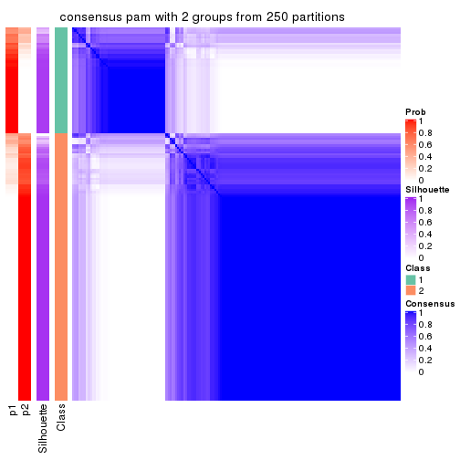</p>

</div>
<div id='tab-CV-pam-consensus-heatmap-2'>
<pre><code class="r">consensus_heatmap(res, k = 3)
</code></pre>

<p>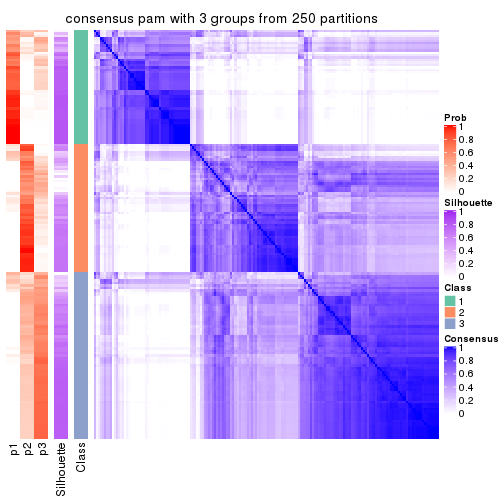</p>

</div>
<div id='tab-CV-pam-consensus-heatmap-3'>
<pre><code class="r">consensus_heatmap(res, k = 4)
</code></pre>

<p>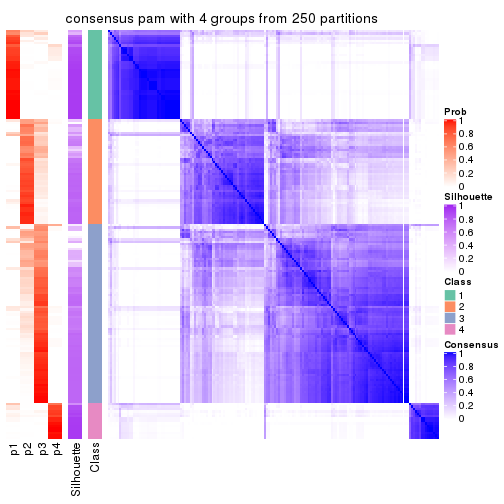</p>

</div>
<div id='tab-CV-pam-consensus-heatmap-4'>
<pre><code class="r">consensus_heatmap(res, k = 5)
</code></pre>

<p>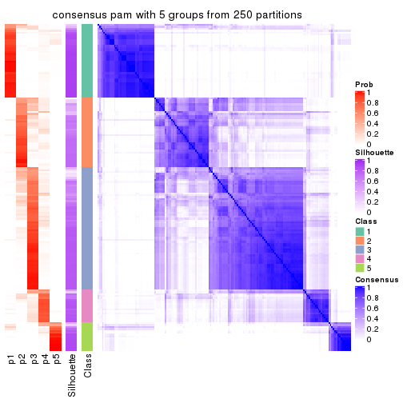</p>

</div>
<div id='tab-CV-pam-consensus-heatmap-5'>
<pre><code class="r">consensus_heatmap(res, k = 6)
</code></pre>

<p>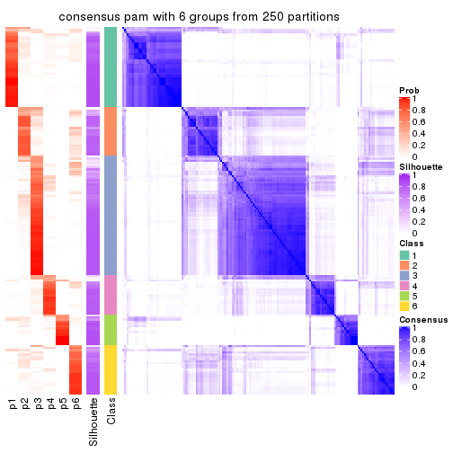</p>

</div>
</div>

Heatmaps for the membership of samples in all partitions to see how consistent they are:


<script>
$( function() {
	$( '#tabs-CV-pam-membership-heatmap' ).tabs();
} );
</script>
<div id='tabs-CV-pam-membership-heatmap'>
<ul>
<li><a href='#tab-CV-pam-membership-heatmap-1'>k = 2</a></li>
<li><a href='#tab-CV-pam-membership-heatmap-2'>k = 3</a></li>
<li><a href='#tab-CV-pam-membership-heatmap-3'>k = 4</a></li>
<li><a href='#tab-CV-pam-membership-heatmap-4'>k = 5</a></li>
<li><a href='#tab-CV-pam-membership-heatmap-5'>k = 6</a></li>
</ul>
<div id='tab-CV-pam-membership-heatmap-1'>
<pre><code class="r">membership_heatmap(res, k = 2)
</code></pre>

<p>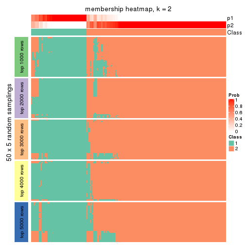</p>

</div>
<div id='tab-CV-pam-membership-heatmap-2'>
<pre><code class="r">membership_heatmap(res, k = 3)
</code></pre>

<p>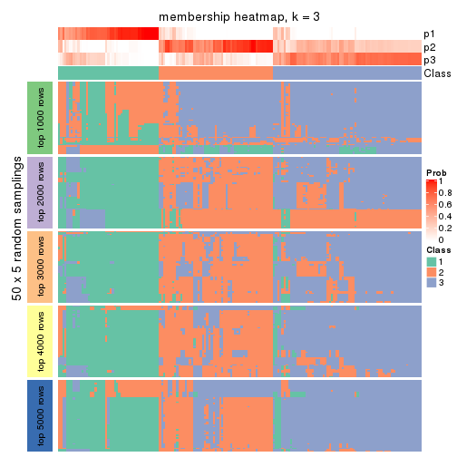</p>

</div>
<div id='tab-CV-pam-membership-heatmap-3'>
<pre><code class="r">membership_heatmap(res, k = 4)
</code></pre>

<p>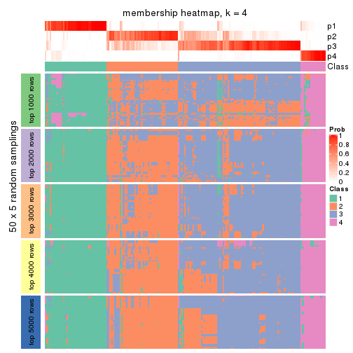</p>

</div>
<div id='tab-CV-pam-membership-heatmap-4'>
<pre><code class="r">membership_heatmap(res, k = 5)
</code></pre>

<p>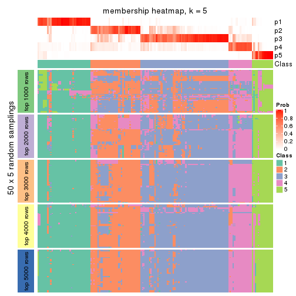</p>

</div>
<div id='tab-CV-pam-membership-heatmap-5'>
<pre><code class="r">membership_heatmap(res, k = 6)
</code></pre>

<p>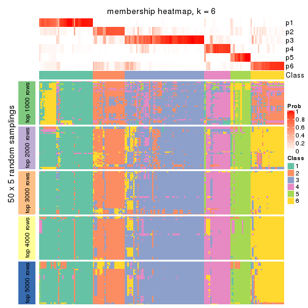</p>

</div>
</div>

As soon as we have had the classes for columns, we can look for signatures
which are significantly different between classes which can be candidate marks
for certain classes. Following are the heatmaps for signatures.


Signature heatmaps where rows are scaled:


<script>
$( function() {
	$( '#tabs-CV-pam-get-signatures' ).tabs();
} );
</script>
<div id='tabs-CV-pam-get-signatures'>
<ul>
<li><a href='#tab-CV-pam-get-signatures-1'>k = 2</a></li>
<li><a href='#tab-CV-pam-get-signatures-2'>k = 3</a></li>
<li><a href='#tab-CV-pam-get-signatures-3'>k = 4</a></li>
<li><a href='#tab-CV-pam-get-signatures-4'>k = 5</a></li>
<li><a href='#tab-CV-pam-get-signatures-5'>k = 6</a></li>
</ul>
<div id='tab-CV-pam-get-signatures-1'>
<pre><code class="r">get_signatures(res, k = 2)
</code></pre>

<p>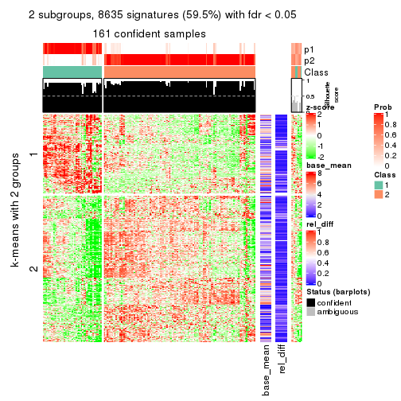</p>

</div>
<div id='tab-CV-pam-get-signatures-2'>
<pre><code class="r">get_signatures(res, k = 3)
</code></pre>

<p>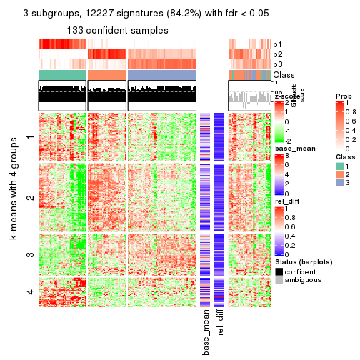</p>

</div>
<div id='tab-CV-pam-get-signatures-3'>
<pre><code class="r">get_signatures(res, k = 4)
</code></pre>

<p>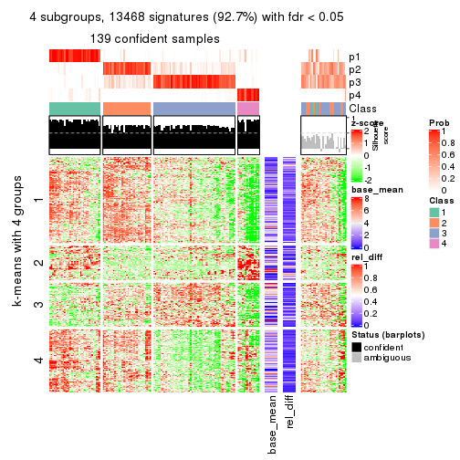</p>

</div>
<div id='tab-CV-pam-get-signatures-4'>
<pre><code class="r">get_signatures(res, k = 5)
</code></pre>

<p>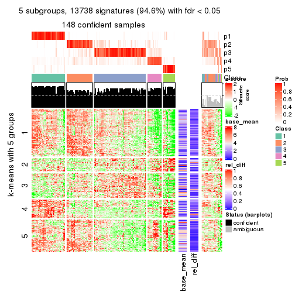</p>

</div>
<div id='tab-CV-pam-get-signatures-5'>
<pre><code class="r">get_signatures(res, k = 6)
</code></pre>

<p>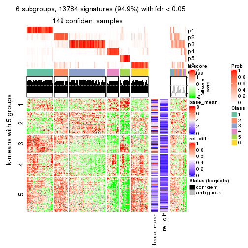</p>

</div>
</div>


Signature heatmaps where rows are not scaled:


<script>
$( function() {
	$( '#tabs-CV-pam-get-signatures-no-scale' ).tabs();
} );
</script>
<div id='tabs-CV-pam-get-signatures-no-scale'>
<ul>
<li><a href='#tab-CV-pam-get-signatures-no-scale-1'>k = 2</a></li>
<li><a href='#tab-CV-pam-get-signatures-no-scale-2'>k = 3</a></li>
<li><a href='#tab-CV-pam-get-signatures-no-scale-3'>k = 4</a></li>
<li><a href='#tab-CV-pam-get-signatures-no-scale-4'>k = 5</a></li>
<li><a href='#tab-CV-pam-get-signatures-no-scale-5'>k = 6</a></li>
</ul>
<div id='tab-CV-pam-get-signatures-no-scale-1'>
<pre><code class="r">get_signatures(res, k = 2, scale_rows = FALSE)
</code></pre>

<p>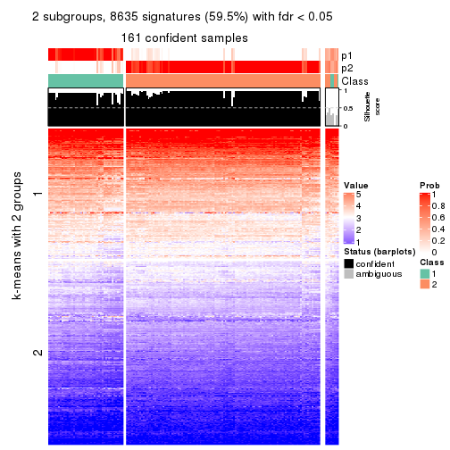</p>

</div>
<div id='tab-CV-pam-get-signatures-no-scale-2'>
<pre><code class="r">get_signatures(res, k = 3, scale_rows = FALSE)
</code></pre>

<p>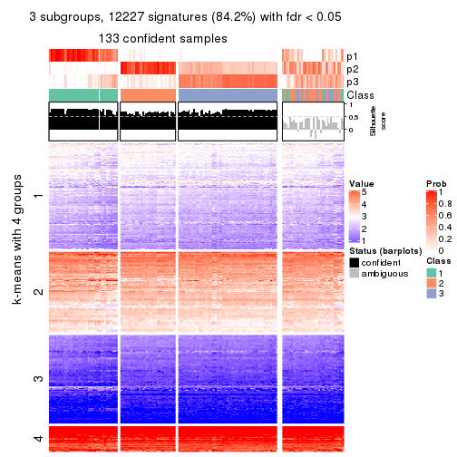</p>

</div>
<div id='tab-CV-pam-get-signatures-no-scale-3'>
<pre><code class="r">get_signatures(res, k = 4, scale_rows = FALSE)
</code></pre>

<p>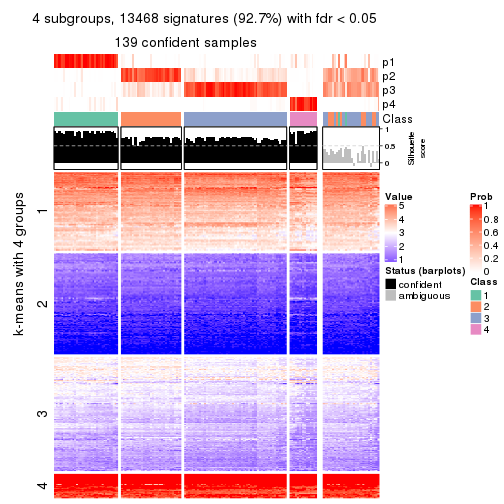</p>

</div>
<div id='tab-CV-pam-get-signatures-no-scale-4'>
<pre><code class="r">get_signatures(res, k = 5, scale_rows = FALSE)
</code></pre>

<p>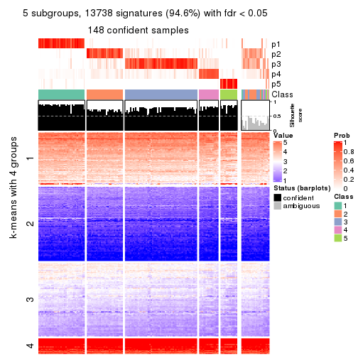</p>

</div>
<div id='tab-CV-pam-get-signatures-no-scale-5'>
<pre><code class="r">get_signatures(res, k = 6, scale_rows = FALSE)
</code></pre>

<p>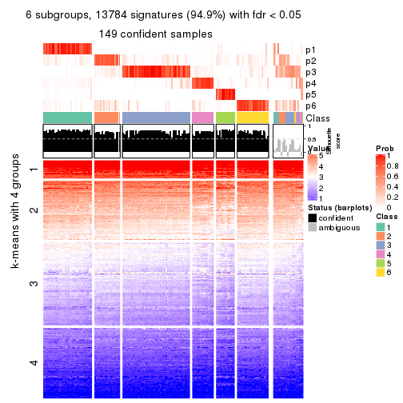</p>

</div>
</div>


Compare the overlap of signatures from different k:

```r
compare_signatures(res)
```

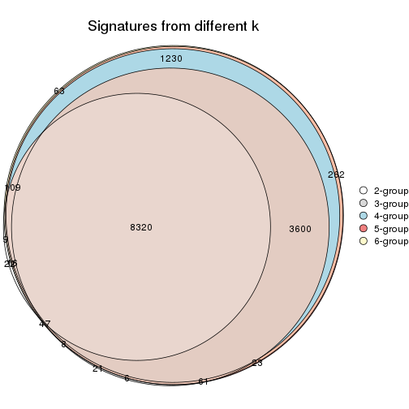

`get_signature()` returns a data frame invisibly. TO get the list of signatures, the function
call should be assigned to a variable explicitly. In following code, if `plot` argument is set
to `FALSE`, no heatmap is plotted while only the differential analysis is performed.

```r
# code only for demonstration
tb = get_signature(res, k = ..., plot = FALSE)
```

An example of the output of `tb` is:

```
#>   which_row         fdr    mean_1    mean_2 scaled_mean_1 scaled_mean_2 km
#> 1        38 0.042760348  8.373488  9.131774    -0.5533452     0.5164555  1
#> 2        40 0.018707592  7.106213  8.469186    -0.6173731     0.5762149  1
#> 3        55 0.019134737 10.221463 11.207825    -0.6159697     0.5749050  1
#> 4        59 0.006059896  5.921854  7.869574    -0.6899429     0.6439467  1
#> 5        60 0.018055526  8.928898 10.211722    -0.6204761     0.5791110  1
#> 6        98 0.009384629 15.714769 14.887706     0.6635654    -0.6193277  2
...
```

The columns in `tb` are:

1. `which_row`: row indices corresponding to the input matrix.
2. `fdr`: FDR for the differential test. 
3. `mean_x`: The mean value in group x.
4. `scaled_mean_x`: The mean value in group x after rows are scaled.
5. `km`: Row groups if k-means clustering is applied to rows.


UMAP plot which shows how samples are separated.


<script>
$( function() {
	$( '#tabs-CV-pam-dimension-reduction' ).tabs();
} );
</script>
<div id='tabs-CV-pam-dimension-reduction'>
<ul>
<li><a href='#tab-CV-pam-dimension-reduction-1'>k = 2</a></li>
<li><a href='#tab-CV-pam-dimension-reduction-2'>k = 3</a></li>
<li><a href='#tab-CV-pam-dimension-reduction-3'>k = 4</a></li>
<li><a href='#tab-CV-pam-dimension-reduction-4'>k = 5</a></li>
<li><a href='#tab-CV-pam-dimension-reduction-5'>k = 6</a></li>
</ul>
<div id='tab-CV-pam-dimension-reduction-1'>
<pre><code class="r">dimension_reduction(res, k = 2, method = &quot;UMAP&quot;)
</code></pre>

<p>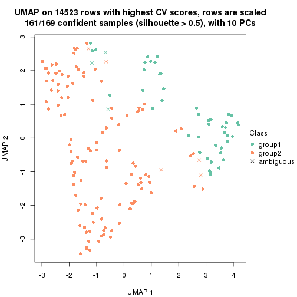</p>

</div>
<div id='tab-CV-pam-dimension-reduction-2'>
<pre><code class="r">dimension_reduction(res, k = 3, method = &quot;UMAP&quot;)
</code></pre>

<p>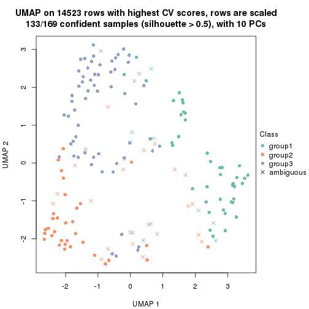</p>

</div>
<div id='tab-CV-pam-dimension-reduction-3'>
<pre><code class="r">dimension_reduction(res, k = 4, method = &quot;UMAP&quot;)
</code></pre>

<p>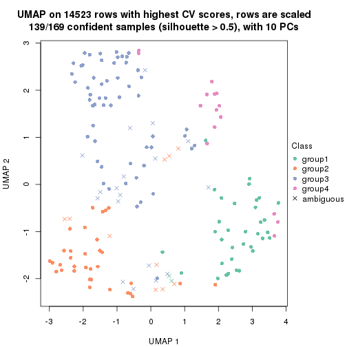</p>

</div>
<div id='tab-CV-pam-dimension-reduction-4'>
<pre><code class="r">dimension_reduction(res, k = 5, method = &quot;UMAP&quot;)
</code></pre>

<p>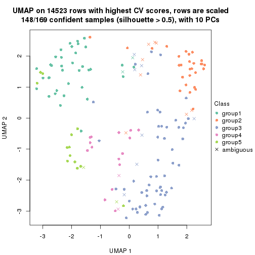</p>

</div>
<div id='tab-CV-pam-dimension-reduction-5'>
<pre><code class="r">dimension_reduction(res, k = 6, method = &quot;UMAP&quot;)
</code></pre>

<p>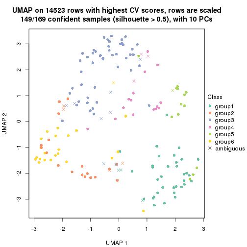</p>

</div>
</div>


Following heatmap shows how subgroups are split when increasing `k`:

```r
collect_classes(res)
```

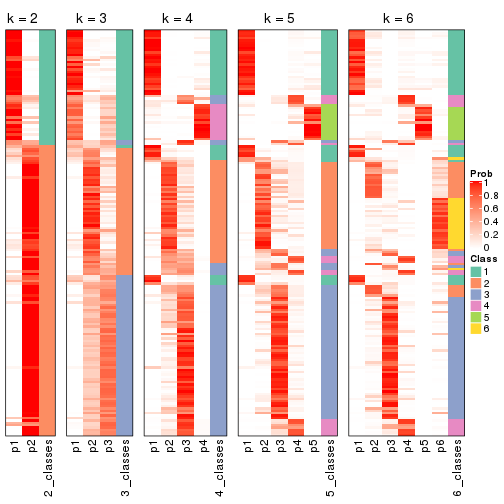


If matrix rows can be associated to genes, consider to use `GO_Enrichment(res,
...)` to perform function enrichment for the signature genes.


 

---------------------------------------------------


### CV:mclust


The object with results only for a single top-value method and a single partition method 
can be extracted as:

```r
res = res_list["CV", "mclust"]
# you can also extract it by
# res = res_list["CV:mclust"]
```

A summary of `res` and all the functions that can be applied to it:

```r
res
```

```
#> A 'ConsensusPartition' object with k = 2, 3, 4, 5, 6.
#>   On a matrix with 14523 rows and 169 columns.
#>   Top rows (1000, 2000, 3000, 4000, 5000) are extracted by 'CV' method.
#>   Subgroups are detected by 'mclust' method.
#>   Performed in total 1250 partitions by row resampling.
#>   Best k for subgroups seems to be 2.
#> 
#> Following methods can be applied to this 'ConsensusPartition' object:
#>  [1] "cola_report"             "collect_classes"         "collect_plots"          
#>  [4] "collect_stats"           "colnames"                "compare_signatures"     
#>  [7] "consensus_heatmap"       "dimension_reduction"     "functional_enrichment"  
#> [10] "get_anno_col"            "get_anno"                "get_classes"            
#> [13] "get_consensus"           "get_matrix"              "get_membership"         
#> [16] "get_param"               "get_signatures"          "get_stats"              
#> [19] "is_best_k"               "is_stable_k"             "membership_heatmap"     
#> [22] "ncol"                    "nrow"                    "plot_ecdf"              
#> [25] "rownames"                "select_partition_number" "show"                   
#> [28] "suggest_best_k"          "test_to_known_factors"
```

`collect_plots()` function collects all the plots made from `res` for all `k` (number of partitions)
into one single page to provide an easy and fast comparison between different `k`.

```r
collect_plots(res)
```

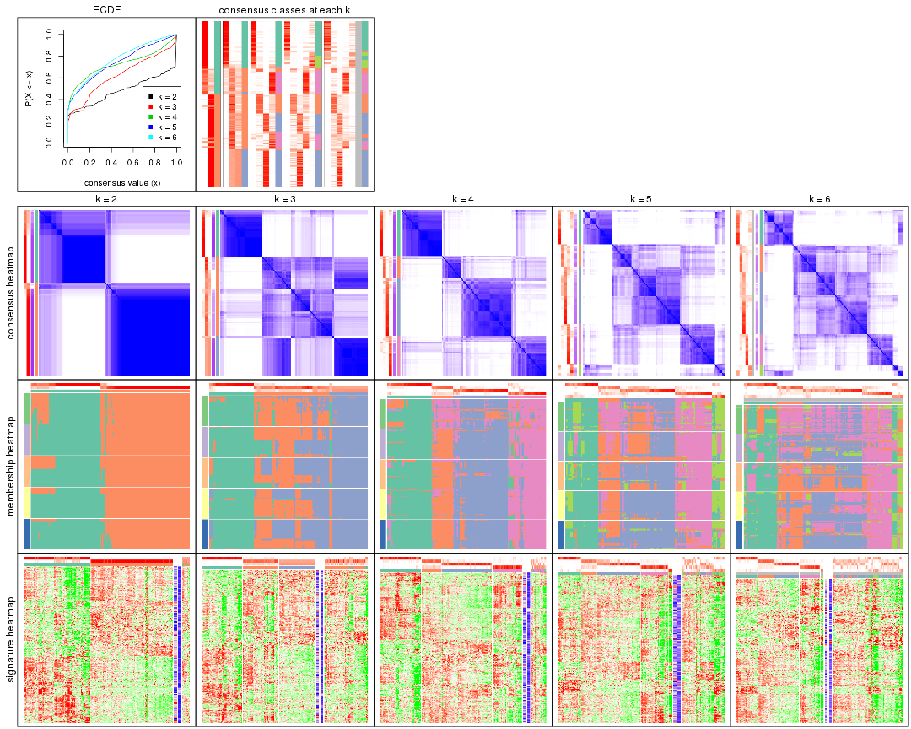

The plots are:

- The first row: a plot of the ECDF (Empirical cumulative distribution
  function) curves of the consensus matrix for each `k` and the heatmap of
  predicted classes for each `k`.
- The second row: heatmaps of the consensus matrix for each `k`.
- The third row: heatmaps of the membership matrix for each `k`.
- The fouth row: heatmaps of the signatures for each `k`.

All the plots in panels can be made by individual functions and they are
plotted later in this section.

`select_partition_number()` produces several plots showing different
statistics for choosing "optimized" `k`. There are following statistics:

- ECDF curves of the consensus matrix for each `k`;
- 1-PAC. [The PAC
  score](https://en.wikipedia.org/wiki/Consensus_clustering#Over-interpretation_potential_of_consensus_clustering)
  measures the proportion of the ambiguous subgrouping.
- Mean silhouette score.
- Concordance. The mean probability of fiting the consensus class ids in all
  partitions.
- Area increased. Denote $A_k$ as the area under the ECDF curve for current
  `k`, the area increased is defined as $A_k - A_{k-1}$.
- Rand index. The percent of pairs of samples that are both in a same cluster
  or both are not in a same cluster in the partition of k and k-1.
- Jaccard index. The ratio of pairs of samples are both in a same cluster in
  the partition of k and k-1 and the pairs of samples are both in a same
  cluster in the partition k or k-1.

The detailed explanations of these statistics can be found in [the cola
vignette](http://bioconductor.org/packages/devel/bioc/vignettes/cola/inst/doc/cola.html#toc_13).

Generally speaking, lower PAC score, higher mean silhouette score or higher
concordance corresponds to better partition. Rand index and Jaccard index
measure how similar the current partition is compared to partition with `k-1`.
If they are too similar, we won't accept `k` is better than `k-1`.

```r
select_partition_number(res)
```

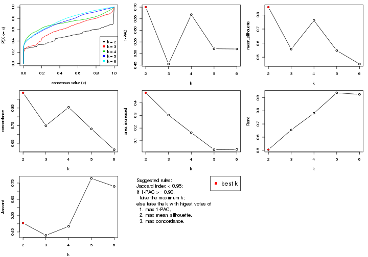

The numeric values for all these statistics can be obtained by `get_stats()`.

```r
get_stats(res)
```

```
#>   k 1-PAC mean_silhouette concordance area_increased  Rand Jaccard
#> 2 2 0.700           0.856       0.936         0.4799 0.505   0.505
#> 3 3 0.455           0.557       0.750         0.3033 0.655   0.429
#> 4 4 0.668           0.761       0.854         0.1634 0.782   0.484
#> 5 5 0.520           0.547       0.732         0.0286 0.937   0.778
#> 6 6 0.519           0.452       0.614         0.0302 0.925   0.730
```

`suggest_best_k()` suggests the best $k$ based on these statistics. The rules are as follows:

- All $k$ with Jaccard index larger than 0.95 are removed because the increase of
  the partition number does not provides enough extra information. If all $k$ are removed,
  the best $k$ is assigned by `NA`.
- For $k$ with 1-PAC larger than 0.9, the maximal $k$ is taken as the "best k". Other $k$ is called "optional k".
- If it does not fit the second rule. The $k$ with the highest vote of highest
  1-PAC, mean silhouette and concordance is taken as the "best k".

```r
suggest_best_k(res)
```

```
#> [1] 2
```


Following shows the table of the partitions (You need to click the **show/hide
code output** link to see it). The membership matrix (columns with name `p*`)
is inferred by
[`clue::cl_consensus()`](https://www.rdocumentation.org/link/cl_consensus?package=clue)
function with the `SE` method. Basically the value in the membership matrix
represents the probability to belong to a certain group. The finall class
label for an item is determined with the group with highest probability it
belongs to.

In `get_classes()` function, the entropy is calculated from the membership
matrix and the silhouette score is calculated from the consensus matrix.


<script>
$( function() {
	$( '#tabs-CV-mclust-get-classes' ).tabs();
} );
</script>
<div id='tabs-CV-mclust-get-classes'>
<ul>
<li><a href='#tab-CV-mclust-get-classes-1'>k = 2</a></li>
<li><a href='#tab-CV-mclust-get-classes-2'>k = 3</a></li>
<li><a href='#tab-CV-mclust-get-classes-3'>k = 4</a></li>
<li><a href='#tab-CV-mclust-get-classes-4'>k = 5</a></li>
<li><a href='#tab-CV-mclust-get-classes-5'>k = 6</a></li>
</ul>

<div id='tab-CV-mclust-get-classes-1'>
<p><a id='tab-CV-mclust-get-classes-1-a' style='color:#0366d6' href='#'>show/hide code output</a></p>
<pre><code class="r">cbind(get_classes(res, k = 2), get_membership(res, k = 2))
</code></pre>

<pre><code>#&gt;            class entropy silhouette    p1    p2
#&gt; SRR2052702     2  0.9998    -0.1793 0.492 0.508
#&gt; SRR2052701     2  0.3431     0.8942 0.064 0.936
#&gt; SRR2052700     1  0.9358     0.5790 0.648 0.352
#&gt; SRR2052699     1  0.6148     0.8127 0.848 0.152
#&gt; SRR2052698     2  0.0000     0.9567 0.000 1.000
#&gt; SRR2052708     1  0.0000     0.8920 1.000 0.000
#&gt; SRR2052749     1  0.0000     0.8920 1.000 0.000
#&gt; SRR2052786     2  0.0000     0.9567 0.000 1.000
#&gt; SRR2052825     1  0.8081     0.7261 0.752 0.248
#&gt; SRR2052824     1  0.8443     0.6982 0.728 0.272
#&gt; SRR2052823     2  0.9815     0.1254 0.420 0.580
#&gt; SRR2052822     2  0.0000     0.9567 0.000 1.000
#&gt; SRR2052821     2  0.0000     0.9567 0.000 1.000
#&gt; SRR2052820     2  0.0000     0.9567 0.000 1.000
#&gt; SRR2052819     2  0.2948     0.9083 0.052 0.948
#&gt; SRR2052818     1  0.9087     0.6264 0.676 0.324
#&gt; SRR2052817     2  0.0000     0.9567 0.000 1.000
#&gt; SRR2052816     1  0.8081     0.7261 0.752 0.248
#&gt; SRR2052815     1  0.8144     0.7216 0.748 0.252
#&gt; SRR2052814     2  0.0000     0.9567 0.000 1.000
#&gt; SRR2052813     2  0.0000     0.9567 0.000 1.000
#&gt; SRR2052812     2  0.0000     0.9567 0.000 1.000
#&gt; SRR2052811     1  0.9580     0.5227 0.620 0.380
#&gt; SRR2052810     1  0.8499     0.6932 0.724 0.276
#&gt; SRR2052809     2  0.0000     0.9567 0.000 1.000
#&gt; SRR2052808     2  0.0938     0.9466 0.012 0.988
#&gt; SRR2052807     1  0.0000     0.8920 1.000 0.000
#&gt; SRR2052806     1  0.0000     0.8920 1.000 0.000
#&gt; SRR2052805     1  0.0000     0.8920 1.000 0.000
#&gt; SRR2052804     1  0.0376     0.8904 0.996 0.004
#&gt; SRR2052803     1  0.0000     0.8920 1.000 0.000
#&gt; SRR2052802     1  0.0000     0.8920 1.000 0.000
#&gt; SRR2052801     1  0.0000     0.8920 1.000 0.000
#&gt; SRR2052800     1  0.0000     0.8920 1.000 0.000
#&gt; SRR2052799     1  0.0000     0.8920 1.000 0.000
#&gt; SRR2052798     1  0.0000     0.8920 1.000 0.000
#&gt; SRR2052797     2  0.0000     0.9567 0.000 1.000
#&gt; SRR2052796     1  0.0000     0.8920 1.000 0.000
#&gt; SRR2052795     1  0.0000     0.8920 1.000 0.000
#&gt; SRR2052794     1  0.0000     0.8920 1.000 0.000
#&gt; SRR2052793     1  0.0000     0.8920 1.000 0.000
#&gt; SRR2052792     1  0.0000     0.8920 1.000 0.000
#&gt; SRR2052791     1  0.0000     0.8920 1.000 0.000
#&gt; SRR2052790     2  0.0000     0.9567 0.000 1.000
#&gt; SRR2052789     2  0.0000     0.9567 0.000 1.000
#&gt; SRR2052788     2  0.0000     0.9567 0.000 1.000
#&gt; SRR2052787     2  0.0000     0.9567 0.000 1.000
#&gt; SRR2052785     2  0.0000     0.9567 0.000 1.000
#&gt; SRR2052784     2  0.0000     0.9567 0.000 1.000
#&gt; SRR2052783     2  0.0000     0.9567 0.000 1.000
#&gt; SRR2052782     2  0.0000     0.9567 0.000 1.000
#&gt; SRR2052781     2  0.0000     0.9567 0.000 1.000
#&gt; SRR2052780     2  0.0000     0.9567 0.000 1.000
#&gt; SRR2052777     2  0.0000     0.9567 0.000 1.000
#&gt; SRR2052779     2  0.0000     0.9567 0.000 1.000
#&gt; SRR2052778     2  0.0000     0.9567 0.000 1.000
#&gt; SRR2052776     2  0.0000     0.9567 0.000 1.000
#&gt; SRR2052775     2  0.0000     0.9567 0.000 1.000
#&gt; SRR2052773     2  0.0000     0.9567 0.000 1.000
#&gt; SRR2052772     2  0.0000     0.9567 0.000 1.000
#&gt; SRR2052774     2  0.0000     0.9567 0.000 1.000
#&gt; SRR2052771     1  0.0000     0.8920 1.000 0.000
#&gt; SRR2052769     2  0.0000     0.9567 0.000 1.000
#&gt; SRR2052770     2  0.0000     0.9567 0.000 1.000
#&gt; SRR2052768     2  0.0000     0.9567 0.000 1.000
#&gt; SRR2052767     2  0.0672     0.9500 0.008 0.992
#&gt; SRR2052766     2  0.9993    -0.0494 0.484 0.516
#&gt; SRR2052765     2  0.9323     0.3541 0.348 0.652
#&gt; SRR2052763     2  0.0000     0.9567 0.000 1.000
#&gt; SRR2052764     1  0.9323     0.5867 0.652 0.348
#&gt; SRR2052761     2  0.0000     0.9567 0.000 1.000
#&gt; SRR2052760     2  0.0000     0.9567 0.000 1.000
#&gt; SRR2052759     2  0.0000     0.9567 0.000 1.000
#&gt; SRR2052762     2  0.0000     0.9567 0.000 1.000
#&gt; SRR2052758     2  0.0000     0.9567 0.000 1.000
#&gt; SRR2052756     1  0.0000     0.8920 1.000 0.000
#&gt; SRR2052757     2  0.0000     0.9567 0.000 1.000
#&gt; SRR2052755     1  0.0000     0.8920 1.000 0.000
#&gt; SRR2052754     1  0.0000     0.8920 1.000 0.000
#&gt; SRR2052753     1  0.0000     0.8920 1.000 0.000
#&gt; SRR2052752     1  0.0000     0.8920 1.000 0.000
#&gt; SRR2052750     1  0.0000     0.8920 1.000 0.000
#&gt; SRR2052751     2  0.0000     0.9567 0.000 1.000
#&gt; SRR2052748     2  0.0000     0.9567 0.000 1.000
#&gt; SRR2052747     1  0.0000     0.8920 1.000 0.000
#&gt; SRR2052746     2  0.0000     0.9567 0.000 1.000
#&gt; SRR2052745     2  0.0000     0.9567 0.000 1.000
#&gt; SRR2052744     1  0.0000     0.8920 1.000 0.000
#&gt; SRR2052741     2  0.4815     0.8501 0.104 0.896
#&gt; SRR2052743     2  0.0000     0.9567 0.000 1.000
#&gt; SRR2052740     2  0.1414     0.9392 0.020 0.980
#&gt; SRR2052742     2  0.0672     0.9500 0.008 0.992
#&gt; SRR2052739     2  0.0000     0.9567 0.000 1.000
#&gt; SRR2052738     2  0.0000     0.9567 0.000 1.000
#&gt; SRR2052736     1  0.9866     0.3443 0.568 0.432
#&gt; SRR2052735     1  0.0000     0.8920 1.000 0.000
#&gt; SRR2052734     1  0.0000     0.8920 1.000 0.000
#&gt; SRR2052737     2  0.0000     0.9567 0.000 1.000
#&gt; SRR2052733     2  0.0000     0.9567 0.000 1.000
#&gt; SRR2052732     1  0.9323     0.5867 0.652 0.348
#&gt; SRR2052731     2  0.0000     0.9567 0.000 1.000
#&gt; SRR2052729     1  0.0000     0.8920 1.000 0.000
#&gt; SRR2052728     1  0.0000     0.8920 1.000 0.000
#&gt; SRR2052730     1  0.6048     0.8140 0.852 0.148
#&gt; SRR2052727     1  0.0000     0.8920 1.000 0.000
#&gt; SRR2052725     1  0.9044     0.6327 0.680 0.320
#&gt; SRR2052726     1  0.0000     0.8920 1.000 0.000
#&gt; SRR2052724     1  0.0000     0.8920 1.000 0.000
#&gt; SRR2052723     2  0.8386     0.6028 0.268 0.732
#&gt; SRR2052722     2  0.0000     0.9567 0.000 1.000
#&gt; SRR2052721     1  0.0000     0.8920 1.000 0.000
#&gt; SRR2052720     2  0.0000     0.9567 0.000 1.000
#&gt; SRR2052719     2  0.0000     0.9567 0.000 1.000
#&gt; SRR2052718     1  0.0000     0.8920 1.000 0.000
#&gt; SRR2052717     2  0.0000     0.9567 0.000 1.000
#&gt; SRR2052714     1  0.0000     0.8920 1.000 0.000
#&gt; SRR2052716     2  0.4298     0.8669 0.088 0.912
#&gt; SRR2052715     2  0.0000     0.9567 0.000 1.000
#&gt; SRR2052713     1  0.0000     0.8920 1.000 0.000
#&gt; SRR2052712     1  0.6048     0.8140 0.852 0.148
#&gt; SRR2052711     1  0.7745     0.7462 0.772 0.228
#&gt; SRR2052710     2  0.0000     0.9567 0.000 1.000
#&gt; SRR2052707     2  0.0000     0.9567 0.000 1.000
#&gt; SRR2052709     2  0.0000     0.9567 0.000 1.000
#&gt; SRR2052704     2  0.0000     0.9567 0.000 1.000
#&gt; SRR2052705     2  0.0000     0.9567 0.000 1.000
#&gt; SRR2052697     1  0.9286     0.5938 0.656 0.344
#&gt; SRR2052703     2  0.0000     0.9567 0.000 1.000
#&gt; SRR2052696     1  0.0000     0.8920 1.000 0.000
#&gt; SRR2052706     1  0.9954     0.3090 0.540 0.460
#&gt; SRR2052695     2  0.0000     0.9567 0.000 1.000
#&gt; SRR2052694     2  0.0000     0.9567 0.000 1.000
#&gt; SRR2052692     2  0.0000     0.9567 0.000 1.000
#&gt; SRR2052693     2  0.0000     0.9567 0.000 1.000
#&gt; SRR2052691     1  0.0000     0.8920 1.000 0.000
#&gt; SRR2052690     2  0.5178     0.8390 0.116 0.884
#&gt; SRR2052689     1  0.9286     0.5939 0.656 0.344
#&gt; SRR2052687     2  0.9963    -0.0502 0.464 0.536
#&gt; SRR2052686     1  0.6048     0.8140 0.852 0.148
#&gt; SRR2052688     2  0.0000     0.9567 0.000 1.000
#&gt; SRR2052684     1  0.1184     0.8854 0.984 0.016
#&gt; SRR2052685     1  0.6048     0.8140 0.852 0.148
#&gt; SRR2052683     1  0.0000     0.8920 1.000 0.000
#&gt; SRR2052681     1  0.9286     0.5940 0.656 0.344
#&gt; SRR2052680     1  0.8955     0.6444 0.688 0.312
#&gt; SRR2052682     1  0.0000     0.8920 1.000 0.000
#&gt; SRR2052679     1  0.0000     0.8920 1.000 0.000
#&gt; SRR2052678     2  0.0000     0.9567 0.000 1.000
#&gt; SRR2052677     2  0.0000     0.9567 0.000 1.000
#&gt; SRR2052675     2  0.9552     0.2867 0.376 0.624
#&gt; SRR2052676     1  0.0000     0.8920 1.000 0.000
#&gt; SRR2052674     1  0.9323     0.5867 0.652 0.348
#&gt; SRR2052672     2  0.0000     0.9567 0.000 1.000
#&gt; SRR2052673     1  0.6531     0.7990 0.832 0.168
#&gt; SRR2052671     2  0.0000     0.9567 0.000 1.000
#&gt; SRR2052670     2  0.0000     0.9567 0.000 1.000
#&gt; SRR2052669     2  0.0000     0.9567 0.000 1.000
#&gt; SRR2052668     2  0.5178     0.8345 0.116 0.884
#&gt; SRR2052667     2  0.0000     0.9567 0.000 1.000
#&gt; SRR2052666     2  0.0000     0.9567 0.000 1.000
#&gt; SRR2052665     2  0.0000     0.9567 0.000 1.000
#&gt; SRR2052664     1  0.0000     0.8920 1.000 0.000
#&gt; SRR2052663     1  0.6048     0.8140 0.852 0.148
#&gt; SRR2052662     2  0.0000     0.9567 0.000 1.000
#&gt; SRR2052661     1  0.0000     0.8920 1.000 0.000
#&gt; SRR2052660     2  0.0000     0.9567 0.000 1.000
#&gt; SRR2052659     2  0.3274     0.8981 0.060 0.940
#&gt; SRR2052658     2  0.0000     0.9567 0.000 1.000
#&gt; SRR2052657     1  0.0000     0.8920 1.000 0.000
</code></pre>

<script>
$('#tab-CV-mclust-get-classes-1-a').parent().next().next().hide();
$('#tab-CV-mclust-get-classes-1-a').click(function(){
  $('#tab-CV-mclust-get-classes-1-a').parent().next().next().toggle();
  return(false);
});
</script>
</div>

<div id='tab-CV-mclust-get-classes-2'>
<p><a id='tab-CV-mclust-get-classes-2-a' style='color:#0366d6' href='#'>show/hide code output</a></p>
<pre><code class="r">cbind(get_classes(res, k = 3), get_membership(res, k = 3))
</code></pre>

<pre><code>#&gt;            class entropy silhouette    p1    p2    p3
#&gt; SRR2052702     2  0.5860     0.5014 0.024 0.748 0.228
#&gt; SRR2052701     2  0.5775     0.5480 0.012 0.728 0.260
#&gt; SRR2052700     2  0.7756     0.5284 0.128 0.672 0.200
#&gt; SRR2052699     2  0.9513     0.3741 0.256 0.492 0.252
#&gt; SRR2052698     2  0.6252    -0.7056 0.000 0.556 0.444
#&gt; SRR2052708     1  0.0237     0.9386 0.996 0.000 0.004
#&gt; SRR2052749     1  0.0000     0.9395 1.000 0.000 0.000
#&gt; SRR2052786     3  0.6274     0.8907 0.000 0.456 0.544
#&gt; SRR2052825     2  0.8643     0.5030 0.188 0.600 0.212
#&gt; SRR2052824     2  0.8231     0.5192 0.156 0.636 0.208
#&gt; SRR2052823     2  0.6208     0.5283 0.052 0.756 0.192
#&gt; SRR2052822     3  0.6280     0.9000 0.000 0.460 0.540
#&gt; SRR2052821     2  0.6308    -0.8225 0.000 0.508 0.492
#&gt; SRR2052820     2  0.3637     0.5199 0.024 0.892 0.084
#&gt; SRR2052819     2  0.6423     0.0289 0.044 0.728 0.228
#&gt; SRR2052818     2  0.8231     0.5191 0.156 0.636 0.208
#&gt; SRR2052817     3  0.6305     0.8621 0.000 0.484 0.516
#&gt; SRR2052816     2  0.9412     0.4040 0.188 0.476 0.336
#&gt; SRR2052815     2  0.8331     0.5162 0.164 0.628 0.208
#&gt; SRR2052814     2  0.6095    -0.6072 0.000 0.608 0.392
#&gt; SRR2052813     3  0.6280     0.9000 0.000 0.460 0.540
#&gt; SRR2052812     2  0.5058    -0.0139 0.000 0.756 0.244
#&gt; SRR2052811     2  0.6606     0.5098 0.048 0.716 0.236
#&gt; SRR2052810     2  0.8190     0.5199 0.156 0.640 0.204
#&gt; SRR2052809     3  0.6274     0.8984 0.000 0.456 0.544
#&gt; SRR2052808     2  0.1315     0.4604 0.020 0.972 0.008
#&gt; SRR2052807     1  0.0983     0.9352 0.980 0.004 0.016
#&gt; SRR2052806     1  0.0000     0.9395 1.000 0.000 0.000
#&gt; SRR2052805     1  0.0000     0.9395 1.000 0.000 0.000
#&gt; SRR2052804     1  0.9091     0.1686 0.504 0.344 0.152
#&gt; SRR2052803     1  0.0000     0.9395 1.000 0.000 0.000
#&gt; SRR2052802     1  0.8052     0.5074 0.652 0.196 0.152
#&gt; SRR2052801     1  0.0592     0.9363 0.988 0.000 0.012
#&gt; SRR2052800     1  0.8138     0.4983 0.644 0.204 0.152
#&gt; SRR2052799     1  0.0592     0.9363 0.988 0.000 0.012
#&gt; SRR2052798     1  0.0000     0.9395 1.000 0.000 0.000
#&gt; SRR2052797     3  0.6286     0.8975 0.000 0.464 0.536
#&gt; SRR2052796     1  0.0424     0.9377 0.992 0.000 0.008
#&gt; SRR2052795     1  0.0000     0.9395 1.000 0.000 0.000
#&gt; SRR2052794     1  0.0592     0.9363 0.988 0.000 0.012
#&gt; SRR2052793     1  0.0592     0.9363 0.988 0.000 0.012
#&gt; SRR2052792     1  0.8298     0.4753 0.628 0.220 0.152
#&gt; SRR2052791     1  0.0237     0.9386 0.996 0.004 0.000
#&gt; SRR2052790     3  0.6286     0.8975 0.000 0.464 0.536
#&gt; SRR2052789     3  0.6280     0.8967 0.000 0.460 0.540
#&gt; SRR2052788     2  0.5948    -0.4898 0.000 0.640 0.360
#&gt; SRR2052787     3  0.6280     0.9000 0.000 0.460 0.540
#&gt; SRR2052785     3  0.6274     0.8984 0.000 0.456 0.544
#&gt; SRR2052784     3  0.6280     0.9000 0.000 0.460 0.540
#&gt; SRR2052783     3  0.6280     0.9000 0.000 0.460 0.540
#&gt; SRR2052782     3  0.6286     0.8975 0.000 0.464 0.536
#&gt; SRR2052781     3  0.6308     0.8459 0.000 0.492 0.508
#&gt; SRR2052780     3  0.6280     0.9000 0.000 0.460 0.540
#&gt; SRR2052777     3  0.6274     0.8971 0.000 0.456 0.544
#&gt; SRR2052779     3  0.6286     0.8975 0.000 0.464 0.536
#&gt; SRR2052778     2  0.6008    -0.5400 0.000 0.628 0.372
#&gt; SRR2052776     2  0.6309    -0.8508 0.000 0.500 0.500
#&gt; SRR2052775     3  0.6280     0.9000 0.000 0.460 0.540
#&gt; SRR2052773     3  0.6280     0.9000 0.000 0.460 0.540
#&gt; SRR2052772     3  0.6274     0.8984 0.000 0.456 0.544
#&gt; SRR2052774     3  0.6274     0.8984 0.000 0.456 0.544
#&gt; SRR2052771     1  0.0592     0.9363 0.988 0.000 0.012
#&gt; SRR2052769     2  0.3412     0.2857 0.000 0.876 0.124
#&gt; SRR2052770     2  0.6180    -0.6378 0.000 0.584 0.416
#&gt; SRR2052768     2  0.2878     0.4405 0.000 0.904 0.096
#&gt; SRR2052767     2  0.2165     0.3930 0.000 0.936 0.064
#&gt; SRR2052766     2  0.4418     0.5149 0.132 0.848 0.020
#&gt; SRR2052765     2  0.6294     0.4532 0.020 0.692 0.288
#&gt; SRR2052763     3  0.6280     0.9000 0.000 0.460 0.540
#&gt; SRR2052764     2  0.7821     0.5240 0.116 0.660 0.224
#&gt; SRR2052761     2  0.4733     0.5492 0.004 0.800 0.196
#&gt; SRR2052760     3  0.6111     0.6938 0.000 0.396 0.604
#&gt; SRR2052759     2  0.6126    -0.5997 0.000 0.600 0.400
#&gt; SRR2052762     2  0.5580     0.5488 0.008 0.736 0.256
#&gt; SRR2052758     2  0.5882    -0.4729 0.000 0.652 0.348
#&gt; SRR2052756     1  0.1877     0.9183 0.956 0.032 0.012
#&gt; SRR2052757     2  0.6008    -0.5165 0.000 0.628 0.372
#&gt; SRR2052755     1  0.1182     0.9317 0.976 0.012 0.012
#&gt; SRR2052754     1  0.0592     0.9363 0.988 0.000 0.012
#&gt; SRR2052753     1  0.0829     0.9357 0.984 0.004 0.012
#&gt; SRR2052752     1  0.0000     0.9395 1.000 0.000 0.000
#&gt; SRR2052750     1  0.1015     0.9338 0.980 0.008 0.012
#&gt; SRR2052751     2  0.5659     0.5502 0.012 0.740 0.248
#&gt; SRR2052748     2  0.3038     0.3343 0.000 0.896 0.104
#&gt; SRR2052747     1  0.0000     0.9395 1.000 0.000 0.000
#&gt; SRR2052746     3  0.6274     0.8984 0.000 0.456 0.544
#&gt; SRR2052745     2  0.5905    -0.4596 0.000 0.648 0.352
#&gt; SRR2052744     1  0.0000     0.9395 1.000 0.000 0.000
#&gt; SRR2052741     2  0.5659     0.5495 0.012 0.740 0.248
#&gt; SRR2052743     2  0.5502     0.5506 0.008 0.744 0.248
#&gt; SRR2052740     2  0.5619     0.5507 0.012 0.744 0.244
#&gt; SRR2052742     2  0.5775     0.5479 0.012 0.728 0.260
#&gt; SRR2052739     2  0.6305    -0.8202 0.000 0.516 0.484
#&gt; SRR2052738     2  0.5291    -0.1934 0.000 0.732 0.268
#&gt; SRR2052736     2  0.7814     0.5152 0.104 0.652 0.244
#&gt; SRR2052735     1  0.0829     0.9356 0.984 0.004 0.012
#&gt; SRR2052734     1  0.0000     0.9395 1.000 0.000 0.000
#&gt; SRR2052737     2  0.6267    -0.7359 0.000 0.548 0.452
#&gt; SRR2052733     3  0.6280     0.8964 0.000 0.460 0.540
#&gt; SRR2052732     2  0.7932     0.5259 0.140 0.660 0.200
#&gt; SRR2052731     3  0.6280     0.9000 0.000 0.460 0.540
#&gt; SRR2052729     1  0.0000     0.9395 1.000 0.000 0.000
#&gt; SRR2052728     1  0.0000     0.9395 1.000 0.000 0.000
#&gt; SRR2052730     2  0.9642     0.3561 0.216 0.440 0.344
#&gt; SRR2052727     1  0.0000     0.9395 1.000 0.000 0.000
#&gt; SRR2052725     2  0.8842     0.4802 0.144 0.548 0.308
#&gt; SRR2052726     1  0.1877     0.9183 0.956 0.032 0.012
#&gt; SRR2052724     1  0.0829     0.9355 0.984 0.004 0.012
#&gt; SRR2052723     2  0.8052     0.4864 0.196 0.652 0.152
#&gt; SRR2052722     3  0.6307     0.8582 0.000 0.488 0.512
#&gt; SRR2052721     1  0.0000     0.9395 1.000 0.000 0.000
#&gt; SRR2052720     3  0.6299     0.8845 0.000 0.476 0.524
#&gt; SRR2052719     2  0.6168    -0.6278 0.000 0.588 0.412
#&gt; SRR2052718     1  0.1905     0.9205 0.956 0.028 0.016
#&gt; SRR2052717     2  0.5461     0.5513 0.008 0.748 0.244
#&gt; SRR2052714     1  0.1877     0.9183 0.956 0.032 0.012
#&gt; SRR2052716     2  0.3370     0.5183 0.024 0.904 0.072
#&gt; SRR2052715     3  0.6274     0.8984 0.000 0.456 0.544
#&gt; SRR2052713     1  0.0000     0.9395 1.000 0.000 0.000
#&gt; SRR2052712     3  0.9994    -0.4212 0.316 0.340 0.344
#&gt; SRR2052711     2  0.8042     0.5264 0.200 0.652 0.148
#&gt; SRR2052710     2  0.6252    -0.7056 0.000 0.556 0.444
#&gt; SRR2052707     3  0.6295     0.8815 0.000 0.472 0.528
#&gt; SRR2052709     3  0.6280     0.9000 0.000 0.460 0.540
#&gt; SRR2052704     2  0.5497    -0.2839 0.000 0.708 0.292
#&gt; SRR2052705     2  0.0237     0.4564 0.000 0.996 0.004
#&gt; SRR2052697     2  0.8858     0.4625 0.136 0.532 0.332
#&gt; SRR2052703     3  0.6274     0.8984 0.000 0.456 0.544
#&gt; SRR2052696     1  0.0000     0.9395 1.000 0.000 0.000
#&gt; SRR2052706     2  0.6905     0.4789 0.044 0.676 0.280
#&gt; SRR2052695     3  0.6299     0.8846 0.000 0.476 0.524
#&gt; SRR2052694     3  0.6225     0.8533 0.000 0.432 0.568
#&gt; SRR2052692     2  0.2261     0.3891 0.000 0.932 0.068
#&gt; SRR2052693     2  0.6235    -0.6879 0.000 0.564 0.436
#&gt; SRR2052691     1  0.4519     0.8369 0.852 0.032 0.116
#&gt; SRR2052690     2  0.5843     0.5482 0.016 0.732 0.252
#&gt; SRR2052689     2  0.8190     0.5199 0.156 0.640 0.204
#&gt; SRR2052687     2  0.6183     0.5056 0.032 0.732 0.236
#&gt; SRR2052686     3  0.9996    -0.4189 0.320 0.336 0.344
#&gt; SRR2052688     2  0.3686     0.2564 0.000 0.860 0.140
#&gt; SRR2052684     1  0.8776     0.3057 0.560 0.296 0.144
#&gt; SRR2052685     2  0.8926     0.4787 0.192 0.568 0.240
#&gt; SRR2052683     1  0.0829     0.9361 0.984 0.004 0.012
#&gt; SRR2052681     2  0.6144     0.5547 0.132 0.780 0.088
#&gt; SRR2052680     2  0.8148     0.5204 0.156 0.644 0.200
#&gt; SRR2052682     1  0.4892     0.8264 0.840 0.048 0.112
#&gt; SRR2052679     1  0.0000     0.9395 1.000 0.000 0.000
#&gt; SRR2052678     3  0.6280     0.9000 0.000 0.460 0.540
#&gt; SRR2052677     3  0.6280     0.9000 0.000 0.460 0.540
#&gt; SRR2052675     2  0.5578     0.5512 0.012 0.748 0.240
#&gt; SRR2052676     1  0.0000     0.9395 1.000 0.000 0.000
#&gt; SRR2052674     2  0.7344     0.5298 0.100 0.696 0.204
#&gt; SRR2052672     3  0.6274     0.8984 0.000 0.456 0.544
#&gt; SRR2052673     2  0.7562     0.5494 0.148 0.692 0.160
#&gt; SRR2052671     2  0.4504     0.5412 0.000 0.804 0.196
#&gt; SRR2052670     3  0.6305     0.8666 0.000 0.484 0.516
#&gt; SRR2052669     3  0.6291     0.8947 0.000 0.468 0.532
#&gt; SRR2052668     2  0.5619     0.5505 0.012 0.744 0.244
#&gt; SRR2052667     2  0.2537     0.3731 0.000 0.920 0.080
#&gt; SRR2052666     2  0.1860     0.4108 0.000 0.948 0.052
#&gt; SRR2052665     2  0.4963     0.5517 0.008 0.792 0.200
#&gt; SRR2052664     1  0.1267     0.9335 0.972 0.004 0.024
#&gt; SRR2052663     2  0.9887     0.2556 0.268 0.396 0.336
#&gt; SRR2052662     2  0.5728     0.5443 0.008 0.720 0.272
#&gt; SRR2052661     1  0.1620     0.9239 0.964 0.024 0.012
#&gt; SRR2052660     2  0.3038     0.3324 0.000 0.896 0.104
#&gt; SRR2052659     2  0.4615     0.5480 0.020 0.836 0.144
#&gt; SRR2052658     2  0.5578     0.5512 0.012 0.748 0.240
#&gt; SRR2052657     1  0.0000     0.9395 1.000 0.000 0.000
</code></pre>

<script>
$('#tab-CV-mclust-get-classes-2-a').parent().next().next().hide();
$('#tab-CV-mclust-get-classes-2-a').click(function(){
  $('#tab-CV-mclust-get-classes-2-a').parent().next().next().toggle();
  return(false);
});
</script>
</div>

<div id='tab-CV-mclust-get-classes-3'>
<p><a id='tab-CV-mclust-get-classes-3-a' style='color:#0366d6' href='#'>show/hide code output</a></p>
<pre><code class="r">cbind(get_classes(res, k = 4), get_membership(res, k = 4))
</code></pre>

<pre><code>#&gt;            class entropy silhouette    p1    p2    p3    p4
#&gt; SRR2052702     4  0.2329     0.7417 0.000 0.072 0.012 0.916
#&gt; SRR2052701     2  0.4228     0.8228 0.000 0.760 0.008 0.232
#&gt; SRR2052700     4  0.0336     0.7603 0.000 0.008 0.000 0.992
#&gt; SRR2052699     2  0.7733     0.2518 0.304 0.440 0.000 0.256
#&gt; SRR2052698     3  0.2111     0.8648 0.000 0.024 0.932 0.044
#&gt; SRR2052708     1  0.1118     0.9161 0.964 0.036 0.000 0.000
#&gt; SRR2052749     1  0.0000     0.9178 1.000 0.000 0.000 0.000
#&gt; SRR2052786     3  0.4624     0.5741 0.000 0.340 0.660 0.000
#&gt; SRR2052825     4  0.1398     0.7598 0.004 0.040 0.000 0.956
#&gt; SRR2052824     4  0.0657     0.7644 0.000 0.012 0.004 0.984
#&gt; SRR2052823     4  0.0921     0.7540 0.000 0.028 0.000 0.972
#&gt; SRR2052822     3  0.2011     0.8724 0.000 0.080 0.920 0.000
#&gt; SRR2052821     3  0.5021     0.7348 0.000 0.180 0.756 0.064
#&gt; SRR2052820     4  0.4865     0.6169 0.184 0.032 0.012 0.772
#&gt; SRR2052819     4  0.5408    -0.1089 0.000 0.012 0.488 0.500
#&gt; SRR2052818     4  0.1284     0.7595 0.000 0.024 0.012 0.964
#&gt; SRR2052817     3  0.1406     0.8703 0.000 0.024 0.960 0.016
#&gt; SRR2052816     4  0.1888     0.7600 0.016 0.044 0.000 0.940
#&gt; SRR2052815     4  0.0967     0.7651 0.004 0.016 0.004 0.976
#&gt; SRR2052814     3  0.4636     0.7894 0.000 0.068 0.792 0.140
#&gt; SRR2052813     3  0.2216     0.8695 0.000 0.092 0.908 0.000
#&gt; SRR2052812     2  0.6084     0.6248 0.000 0.676 0.204 0.120
#&gt; SRR2052811     4  0.2179     0.7455 0.000 0.064 0.012 0.924
#&gt; SRR2052810     4  0.0188     0.7620 0.000 0.000 0.004 0.996
#&gt; SRR2052809     3  0.1474     0.8785 0.000 0.052 0.948 0.000
#&gt; SRR2052808     4  0.0657     0.7615 0.000 0.004 0.012 0.984
#&gt; SRR2052807     1  0.4072     0.8639 0.828 0.120 0.000 0.052
#&gt; SRR2052806     1  0.0188     0.9179 0.996 0.004 0.000 0.000
#&gt; SRR2052805     1  0.0188     0.9178 0.996 0.004 0.000 0.000
#&gt; SRR2052804     4  0.6785     0.0686 0.420 0.096 0.000 0.484
#&gt; SRR2052803     1  0.0469     0.9173 0.988 0.012 0.000 0.000
#&gt; SRR2052802     1  0.5823     0.7039 0.704 0.120 0.000 0.176
#&gt; SRR2052801     1  0.0592     0.9169 0.984 0.016 0.000 0.000
#&gt; SRR2052800     1  0.6216     0.6303 0.660 0.120 0.000 0.220
#&gt; SRR2052799     1  0.0592     0.9169 0.984 0.016 0.000 0.000
#&gt; SRR2052798     1  0.0188     0.9177 0.996 0.004 0.000 0.000
#&gt; SRR2052797     3  0.2402     0.8731 0.000 0.076 0.912 0.012
#&gt; SRR2052796     1  0.0592     0.9169 0.984 0.016 0.000 0.000
#&gt; SRR2052795     1  0.0000     0.9178 1.000 0.000 0.000 0.000
#&gt; SRR2052794     1  0.0592     0.9169 0.984 0.016 0.000 0.000
#&gt; SRR2052793     1  0.0592     0.9169 0.984 0.016 0.000 0.000
#&gt; SRR2052792     1  0.6785     0.3211 0.540 0.108 0.000 0.352
#&gt; SRR2052791     1  0.1297     0.9125 0.964 0.020 0.000 0.016
#&gt; SRR2052790     3  0.2149     0.8707 0.000 0.088 0.912 0.000
#&gt; SRR2052789     3  0.0336     0.8770 0.000 0.008 0.992 0.000
#&gt; SRR2052788     3  0.4057     0.7784 0.000 0.028 0.812 0.160
#&gt; SRR2052787     3  0.2469     0.8638 0.000 0.108 0.892 0.000
#&gt; SRR2052785     3  0.0707     0.8726 0.000 0.020 0.980 0.000
#&gt; SRR2052784     3  0.2101     0.8764 0.000 0.060 0.928 0.012
#&gt; SRR2052783     3  0.0336     0.8765 0.000 0.008 0.992 0.000
#&gt; SRR2052782     3  0.2281     0.8691 0.000 0.096 0.904 0.000
#&gt; SRR2052781     3  0.0937     0.8766 0.000 0.012 0.976 0.012
#&gt; SRR2052780     3  0.1302     0.8757 0.000 0.044 0.956 0.000
#&gt; SRR2052777     3  0.3801     0.7600 0.000 0.220 0.780 0.000
#&gt; SRR2052779     3  0.2216     0.8695 0.000 0.092 0.908 0.000
#&gt; SRR2052778     3  0.3907     0.7225 0.000 0.000 0.768 0.232
#&gt; SRR2052776     3  0.3037     0.8660 0.000 0.076 0.888 0.036
#&gt; SRR2052775     3  0.0469     0.8759 0.000 0.012 0.988 0.000
#&gt; SRR2052773     3  0.1557     0.8753 0.000 0.056 0.944 0.000
#&gt; SRR2052772     3  0.0817     0.8716 0.000 0.024 0.976 0.000
#&gt; SRR2052774     3  0.0000     0.8760 0.000 0.000 1.000 0.000
#&gt; SRR2052771     1  0.2412     0.9031 0.908 0.084 0.000 0.008
#&gt; SRR2052769     3  0.5257     0.2851 0.000 0.008 0.548 0.444
#&gt; SRR2052770     3  0.3384     0.8278 0.000 0.024 0.860 0.116
#&gt; SRR2052768     2  0.5646     0.7547 0.000 0.708 0.088 0.204
#&gt; SRR2052767     4  0.6084     0.4074 0.000 0.244 0.096 0.660
#&gt; SRR2052766     4  0.5100     0.6149 0.192 0.052 0.004 0.752
#&gt; SRR2052765     4  0.3611     0.6988 0.000 0.060 0.080 0.860
#&gt; SRR2052763     3  0.1820     0.8786 0.000 0.036 0.944 0.020
#&gt; SRR2052764     4  0.1545     0.7578 0.000 0.040 0.008 0.952
#&gt; SRR2052761     4  0.6498     0.3656 0.068 0.272 0.020 0.640
#&gt; SRR2052760     2  0.5861    -0.1556 0.000 0.488 0.480 0.032
#&gt; SRR2052759     3  0.2662     0.8530 0.000 0.016 0.900 0.084
#&gt; SRR2052762     2  0.3925     0.8339 0.000 0.808 0.016 0.176
#&gt; SRR2052758     3  0.5874     0.6517 0.000 0.124 0.700 0.176
#&gt; SRR2052756     1  0.4181     0.8583 0.820 0.128 0.000 0.052
#&gt; SRR2052757     3  0.2909     0.8429 0.000 0.020 0.888 0.092
#&gt; SRR2052755     1  0.3160     0.8860 0.872 0.108 0.000 0.020
#&gt; SRR2052754     1  0.0592     0.9169 0.984 0.016 0.000 0.000
#&gt; SRR2052753     1  0.2928     0.8901 0.880 0.108 0.000 0.012
#&gt; SRR2052752     1  0.1118     0.9147 0.964 0.036 0.000 0.000
#&gt; SRR2052750     1  0.2805     0.8927 0.888 0.100 0.000 0.012
#&gt; SRR2052751     2  0.4319     0.8257 0.000 0.760 0.012 0.228
#&gt; SRR2052748     4  0.5885     0.0642 0.008 0.020 0.452 0.520
#&gt; SRR2052747     1  0.0188     0.9177 0.996 0.004 0.000 0.000
#&gt; SRR2052746     3  0.0336     0.8751 0.000 0.008 0.992 0.000
#&gt; SRR2052745     3  0.3047     0.8356 0.000 0.012 0.872 0.116
#&gt; SRR2052744     1  0.0188     0.9177 0.996 0.004 0.000 0.000
#&gt; SRR2052741     2  0.3528     0.8341 0.000 0.808 0.000 0.192
#&gt; SRR2052743     2  0.3725     0.8332 0.000 0.812 0.008 0.180
#&gt; SRR2052740     2  0.3569     0.8347 0.000 0.804 0.000 0.196
#&gt; SRR2052742     2  0.4535     0.8333 0.016 0.788 0.016 0.180
#&gt; SRR2052739     3  0.4250     0.7018 0.000 0.276 0.724 0.000
#&gt; SRR2052738     3  0.4831     0.6263 0.000 0.016 0.704 0.280
#&gt; SRR2052736     2  0.5327     0.8005 0.056 0.732 0.004 0.208
#&gt; SRR2052735     1  0.2675     0.8941 0.892 0.100 0.000 0.008
#&gt; SRR2052734     1  0.0188     0.9177 0.996 0.004 0.000 0.000
#&gt; SRR2052737     3  0.5000     0.1443 0.000 0.496 0.504 0.000
#&gt; SRR2052733     3  0.1913     0.8706 0.000 0.020 0.940 0.040
#&gt; SRR2052732     4  0.0592     0.7602 0.000 0.016 0.000 0.984
#&gt; SRR2052731     3  0.1302     0.8768 0.000 0.044 0.956 0.000
#&gt; SRR2052729     1  0.0188     0.9177 0.996 0.004 0.000 0.000
#&gt; SRR2052728     1  0.0188     0.9177 0.996 0.004 0.000 0.000
#&gt; SRR2052730     4  0.2060     0.7558 0.016 0.052 0.000 0.932
#&gt; SRR2052727     1  0.0188     0.9177 0.996 0.004 0.000 0.000
#&gt; SRR2052725     4  0.1706     0.7549 0.016 0.036 0.000 0.948
#&gt; SRR2052726     1  0.3266     0.8837 0.868 0.108 0.000 0.024
#&gt; SRR2052724     1  0.2988     0.8867 0.876 0.112 0.000 0.012
#&gt; SRR2052723     4  0.6708     0.3552 0.352 0.088 0.004 0.556
#&gt; SRR2052722     3  0.1406     0.8693 0.000 0.024 0.960 0.016
#&gt; SRR2052721     1  0.0188     0.9177 0.996 0.004 0.000 0.000
#&gt; SRR2052720     3  0.2469     0.8649 0.000 0.108 0.892 0.000
#&gt; SRR2052719     3  0.5848     0.5320 0.000 0.336 0.616 0.048
#&gt; SRR2052718     1  0.4673     0.8395 0.792 0.132 0.000 0.076
#&gt; SRR2052717     2  0.3852     0.8357 0.000 0.808 0.012 0.180
#&gt; SRR2052714     1  0.3842     0.8704 0.836 0.128 0.000 0.036
#&gt; SRR2052716     4  0.3945     0.6692 0.144 0.024 0.004 0.828
#&gt; SRR2052715     3  0.0817     0.8716 0.000 0.024 0.976 0.000
#&gt; SRR2052713     1  0.0000     0.9178 1.000 0.000 0.000 0.000
#&gt; SRR2052712     4  0.3810     0.6969 0.092 0.060 0.000 0.848
#&gt; SRR2052711     4  0.2578     0.7525 0.036 0.052 0.000 0.912
#&gt; SRR2052710     3  0.3286     0.8505 0.000 0.044 0.876 0.080
#&gt; SRR2052707     3  0.1004     0.8712 0.000 0.024 0.972 0.004
#&gt; SRR2052709     3  0.1118     0.8772 0.000 0.036 0.964 0.000
#&gt; SRR2052704     3  0.4304     0.6470 0.000 0.000 0.716 0.284
#&gt; SRR2052705     2  0.5511     0.7052 0.000 0.636 0.032 0.332
#&gt; SRR2052697     4  0.3390     0.6621 0.016 0.132 0.000 0.852
#&gt; SRR2052703     3  0.0336     0.8748 0.000 0.008 0.992 0.000
#&gt; SRR2052696     1  0.0188     0.9177 0.996 0.004 0.000 0.000
#&gt; SRR2052706     4  0.2521     0.7380 0.000 0.064 0.024 0.912
#&gt; SRR2052695     3  0.2408     0.8665 0.000 0.104 0.896 0.000
#&gt; SRR2052694     3  0.3610     0.7939 0.000 0.200 0.800 0.000
#&gt; SRR2052692     4  0.7721     0.3946 0.052 0.152 0.200 0.596
#&gt; SRR2052693     3  0.2214     0.8656 0.000 0.028 0.928 0.044
#&gt; SRR2052691     1  0.3856     0.8636 0.832 0.136 0.000 0.032
#&gt; SRR2052690     2  0.3649     0.8308 0.000 0.796 0.000 0.204
#&gt; SRR2052689     4  0.0188     0.7620 0.000 0.000 0.004 0.996
#&gt; SRR2052687     4  0.1297     0.7604 0.000 0.016 0.020 0.964
#&gt; SRR2052686     4  0.5280     0.6264 0.128 0.120 0.000 0.752
#&gt; SRR2052688     4  0.7534     0.1228 0.000 0.240 0.268 0.492
#&gt; SRR2052684     1  0.6946     0.2267 0.504 0.116 0.000 0.380
#&gt; SRR2052685     2  0.5820     0.5669 0.108 0.700 0.000 0.192
#&gt; SRR2052683     1  0.0927     0.9157 0.976 0.016 0.000 0.008
#&gt; SRR2052681     4  0.0336     0.7610 0.000 0.008 0.000 0.992
#&gt; SRR2052680     4  0.0188     0.7628 0.000 0.004 0.000 0.996
#&gt; SRR2052682     1  0.5473     0.7631 0.724 0.192 0.000 0.084
#&gt; SRR2052679     1  0.0188     0.9177 0.996 0.004 0.000 0.000
#&gt; SRR2052678     3  0.0707     0.8771 0.000 0.020 0.980 0.000
#&gt; SRR2052677     3  0.2081     0.8704 0.000 0.084 0.916 0.000
#&gt; SRR2052675     2  0.4134     0.8013 0.000 0.740 0.000 0.260
#&gt; SRR2052676     1  0.0188     0.9177 0.996 0.004 0.000 0.000
#&gt; SRR2052674     4  0.0188     0.7620 0.000 0.000 0.004 0.996
#&gt; SRR2052672     3  0.0592     0.8775 0.000 0.016 0.984 0.000
#&gt; SRR2052673     4  0.4322     0.6499 0.152 0.044 0.000 0.804
#&gt; SRR2052671     2  0.4642     0.8145 0.000 0.740 0.020 0.240
#&gt; SRR2052670     3  0.0188     0.8769 0.000 0.000 0.996 0.004
#&gt; SRR2052669     3  0.2469     0.8622 0.000 0.108 0.892 0.000
#&gt; SRR2052668     2  0.4579     0.8159 0.032 0.768 0.000 0.200
#&gt; SRR2052667     2  0.6634     0.6472 0.000 0.580 0.108 0.312
#&gt; SRR2052666     4  0.5473     0.3940 0.000 0.032 0.324 0.644
#&gt; SRR2052665     2  0.3972     0.8336 0.000 0.788 0.008 0.204
#&gt; SRR2052664     1  0.3876     0.8711 0.836 0.124 0.000 0.040
#&gt; SRR2052663     4  0.4805     0.6452 0.132 0.084 0.000 0.784
#&gt; SRR2052662     2  0.4257     0.8123 0.000 0.812 0.048 0.140
#&gt; SRR2052661     1  0.3266     0.8837 0.868 0.108 0.000 0.024
#&gt; SRR2052660     3  0.5901     0.1423 0.000 0.036 0.532 0.432
#&gt; SRR2052659     4  0.6219     0.5157 0.224 0.104 0.004 0.668
#&gt; SRR2052658     2  0.3945     0.8304 0.000 0.780 0.004 0.216
#&gt; SRR2052657     1  0.0000     0.9178 1.000 0.000 0.000 0.000
</code></pre>

<script>
$('#tab-CV-mclust-get-classes-3-a').parent().next().next().hide();
$('#tab-CV-mclust-get-classes-3-a').click(function(){
  $('#tab-CV-mclust-get-classes-3-a').parent().next().next().toggle();
  return(false);
});
</script>
</div>

<div id='tab-CV-mclust-get-classes-4'>
<p><a id='tab-CV-mclust-get-classes-4-a' style='color:#0366d6' href='#'>show/hide code output</a></p>
<pre><code class="r">cbind(get_classes(res, k = 5), get_membership(res, k = 5))
</code></pre>

<pre><code>#&gt;            class entropy silhouette    p1    p2    p3    p4    p5
#&gt; SRR2052702     4  0.3642     0.7098 0.000 0.124 0.048 0.824 0.004
#&gt; SRR2052701     2  0.5500     0.6364 0.000 0.668 0.056 0.244 0.032
#&gt; SRR2052700     4  0.0963     0.7446 0.000 0.036 0.000 0.964 0.000
#&gt; SRR2052699     2  0.7364     0.2867 0.020 0.428 0.080 0.408 0.064
#&gt; SRR2052698     3  0.2450     0.6860 0.000 0.048 0.900 0.052 0.000
#&gt; SRR2052708     1  0.3863     0.5429 0.740 0.012 0.000 0.000 0.248
#&gt; SRR2052749     1  0.0290     0.7187 0.992 0.000 0.000 0.000 0.008
#&gt; SRR2052786     3  0.4953     0.4900 0.000 0.440 0.532 0.000 0.028
#&gt; SRR2052825     4  0.1408     0.7296 0.000 0.008 0.000 0.948 0.044
#&gt; SRR2052824     4  0.0693     0.7440 0.000 0.008 0.000 0.980 0.012
#&gt; SRR2052823     4  0.3400     0.7154 0.000 0.116 0.040 0.840 0.004
#&gt; SRR2052822     3  0.4654     0.6134 0.000 0.348 0.628 0.000 0.024
#&gt; SRR2052821     3  0.5099     0.5763 0.000 0.368 0.596 0.016 0.020
#&gt; SRR2052820     4  0.6047     0.4371 0.000 0.120 0.136 0.676 0.068
#&gt; SRR2052819     4  0.5831    -0.0509 0.000 0.084 0.396 0.516 0.004
#&gt; SRR2052818     4  0.0771     0.7463 0.000 0.020 0.000 0.976 0.004
#&gt; SRR2052817     3  0.0865     0.6950 0.000 0.024 0.972 0.004 0.000
#&gt; SRR2052816     4  0.0880     0.7423 0.000 0.000 0.000 0.968 0.032
#&gt; SRR2052815     4  0.0854     0.7436 0.000 0.008 0.004 0.976 0.012
#&gt; SRR2052814     3  0.6043     0.4092 0.000 0.320 0.540 0.140 0.000
#&gt; SRR2052813     3  0.4761     0.6052 0.000 0.356 0.616 0.000 0.028
#&gt; SRR2052812     2  0.6049     0.5005 0.000 0.596 0.212 0.188 0.004
#&gt; SRR2052811     4  0.3299     0.7202 0.000 0.108 0.040 0.848 0.004
#&gt; SRR2052810     4  0.0740     0.7444 0.000 0.008 0.004 0.980 0.008
#&gt; SRR2052809     3  0.3561     0.6545 0.000 0.260 0.740 0.000 0.000
#&gt; SRR2052808     4  0.4378     0.6766 0.000 0.120 0.064 0.792 0.024
#&gt; SRR2052807     5  0.3134     0.5281 0.120 0.000 0.000 0.032 0.848
#&gt; SRR2052806     1  0.3616     0.5972 0.804 0.032 0.000 0.000 0.164
#&gt; SRR2052805     1  0.3452     0.6282 0.820 0.032 0.000 0.000 0.148
#&gt; SRR2052804     5  0.3949     0.4134 0.004 0.000 0.000 0.300 0.696
#&gt; SRR2052803     1  0.4623     0.4176 0.664 0.032 0.000 0.000 0.304
#&gt; SRR2052802     5  0.1408     0.5638 0.008 0.000 0.000 0.044 0.948
#&gt; SRR2052801     1  0.5049     0.0178 0.484 0.032 0.000 0.000 0.484
#&gt; SRR2052800     5  0.1408     0.5638 0.008 0.000 0.000 0.044 0.948
#&gt; SRR2052799     5  0.5048    -0.0989 0.476 0.032 0.000 0.000 0.492
#&gt; SRR2052798     1  0.0290     0.7174 0.992 0.008 0.000 0.000 0.000
#&gt; SRR2052797     3  0.4654     0.6124 0.000 0.348 0.628 0.000 0.024
#&gt; SRR2052796     1  0.4808     0.3445 0.620 0.032 0.000 0.000 0.348
#&gt; SRR2052795     1  0.0162     0.7183 0.996 0.000 0.000 0.000 0.004
#&gt; SRR2052794     5  0.5024    -0.0060 0.440 0.032 0.000 0.000 0.528
#&gt; SRR2052793     1  0.4836     0.3249 0.612 0.032 0.000 0.000 0.356
#&gt; SRR2052792     5  0.1430     0.5640 0.004 0.000 0.000 0.052 0.944
#&gt; SRR2052791     1  0.4086     0.5057 0.704 0.012 0.000 0.000 0.284
#&gt; SRR2052790     3  0.4326     0.6513 0.000 0.264 0.708 0.000 0.028
#&gt; SRR2052789     3  0.0960     0.7015 0.000 0.016 0.972 0.008 0.004
#&gt; SRR2052788     3  0.5998     0.4147 0.000 0.028 0.616 0.268 0.088
#&gt; SRR2052787     3  0.4703     0.6162 0.000 0.340 0.632 0.000 0.028
#&gt; SRR2052785     3  0.1281     0.7080 0.000 0.032 0.956 0.012 0.000
#&gt; SRR2052784     3  0.4834     0.6327 0.000 0.308 0.656 0.008 0.028
#&gt; SRR2052783     3  0.1281     0.7094 0.000 0.032 0.956 0.012 0.000
#&gt; SRR2052782     3  0.4774     0.6015 0.000 0.360 0.612 0.000 0.028
#&gt; SRR2052781     3  0.2124     0.7056 0.000 0.056 0.916 0.028 0.000
#&gt; SRR2052780     3  0.2900     0.7020 0.000 0.108 0.864 0.000 0.028
#&gt; SRR2052777     3  0.4902     0.5374 0.000 0.408 0.564 0.000 0.028
#&gt; SRR2052779     3  0.4787     0.5981 0.000 0.364 0.608 0.000 0.028
#&gt; SRR2052778     3  0.5170     0.3761 0.000 0.052 0.628 0.316 0.004
#&gt; SRR2052776     3  0.5545     0.5090 0.000 0.340 0.584 0.072 0.004
#&gt; SRR2052775     3  0.0290     0.7019 0.000 0.008 0.992 0.000 0.000
#&gt; SRR2052773     3  0.2740     0.7019 0.000 0.096 0.876 0.000 0.028
#&gt; SRR2052772     3  0.0703     0.6941 0.000 0.024 0.976 0.000 0.000
#&gt; SRR2052774     3  0.0000     0.7013 0.000 0.000 1.000 0.000 0.000
#&gt; SRR2052771     5  0.3999     0.2582 0.344 0.000 0.000 0.000 0.656
#&gt; SRR2052769     4  0.6118     0.0798 0.000 0.164 0.288 0.548 0.000
#&gt; SRR2052770     3  0.4959     0.4861 0.000 0.076 0.684 0.240 0.000
#&gt; SRR2052768     2  0.6181     0.4490 0.000 0.524 0.132 0.340 0.004
#&gt; SRR2052767     4  0.5206     0.4934 0.000 0.216 0.096 0.684 0.004
#&gt; SRR2052766     4  0.5848     0.5298 0.004 0.012 0.140 0.656 0.188
#&gt; SRR2052765     4  0.2929     0.7233 0.000 0.076 0.044 0.876 0.004
#&gt; SRR2052763     3  0.3126     0.7075 0.000 0.060 0.876 0.040 0.024
#&gt; SRR2052764     4  0.1443     0.7406 0.000 0.044 0.004 0.948 0.004
#&gt; SRR2052761     4  0.6837     0.2351 0.000 0.216 0.148 0.576 0.060
#&gt; SRR2052760     2  0.5782    -0.2506 0.000 0.488 0.444 0.052 0.016
#&gt; SRR2052759     3  0.4727     0.6043 0.000 0.028 0.764 0.144 0.064
#&gt; SRR2052762     2  0.5303     0.7114 0.000 0.728 0.104 0.132 0.036
#&gt; SRR2052758     3  0.5673     0.5104 0.000 0.204 0.652 0.136 0.008
#&gt; SRR2052756     5  0.7408     0.4048 0.272 0.036 0.000 0.272 0.420
#&gt; SRR2052757     3  0.4038     0.6629 0.000 0.128 0.792 0.080 0.000
#&gt; SRR2052755     1  0.4237     0.5707 0.784 0.020 0.000 0.036 0.160
#&gt; SRR2052754     1  0.5036     0.1140 0.516 0.032 0.000 0.000 0.452
#&gt; SRR2052753     1  0.4543     0.5208 0.732 0.020 0.000 0.024 0.224
#&gt; SRR2052752     1  0.2690     0.6608 0.844 0.000 0.000 0.000 0.156
#&gt; SRR2052750     1  0.4037     0.5861 0.800 0.020 0.000 0.032 0.148
#&gt; SRR2052751     2  0.6102     0.6916 0.000 0.632 0.104 0.228 0.036
#&gt; SRR2052748     3  0.6696     0.0521 0.000 0.012 0.444 0.380 0.164
#&gt; SRR2052747     1  0.1041     0.7124 0.964 0.032 0.000 0.000 0.004
#&gt; SRR2052746     3  0.0162     0.7021 0.000 0.004 0.996 0.000 0.000
#&gt; SRR2052745     3  0.2733     0.6610 0.000 0.012 0.872 0.112 0.004
#&gt; SRR2052744     1  0.0671     0.7145 0.980 0.016 0.000 0.000 0.004
#&gt; SRR2052741     2  0.5864     0.7052 0.000 0.664 0.100 0.200 0.036
#&gt; SRR2052743     2  0.5260     0.7083 0.000 0.732 0.104 0.128 0.036
#&gt; SRR2052740     2  0.5806     0.7089 0.000 0.668 0.104 0.196 0.032
#&gt; SRR2052742     2  0.6199     0.6670 0.000 0.616 0.104 0.244 0.036
#&gt; SRR2052739     3  0.4769     0.5268 0.000 0.440 0.544 0.004 0.012
#&gt; SRR2052738     3  0.6629     0.2771 0.000 0.028 0.536 0.300 0.136
#&gt; SRR2052736     2  0.6290     0.5325 0.004 0.576 0.072 0.312 0.036
#&gt; SRR2052735     1  0.4106     0.5836 0.800 0.020 0.000 0.040 0.140
#&gt; SRR2052734     1  0.1300     0.7053 0.956 0.016 0.000 0.000 0.028
#&gt; SRR2052737     2  0.5167    -0.3142 0.000 0.516 0.452 0.012 0.020
#&gt; SRR2052733     3  0.2390     0.6817 0.000 0.020 0.896 0.084 0.000
#&gt; SRR2052732     4  0.1124     0.7397 0.000 0.036 0.000 0.960 0.004
#&gt; SRR2052731     3  0.1914     0.7058 0.000 0.060 0.924 0.000 0.016
#&gt; SRR2052729     1  0.0290     0.7184 0.992 0.000 0.000 0.000 0.008
#&gt; SRR2052728     1  0.0290     0.7174 0.992 0.008 0.000 0.000 0.000
#&gt; SRR2052730     4  0.2020     0.7274 0.000 0.000 0.000 0.900 0.100
#&gt; SRR2052727     1  0.0162     0.7183 0.996 0.000 0.000 0.000 0.004
#&gt; SRR2052725     4  0.3704     0.7176 0.000 0.092 0.000 0.820 0.088
#&gt; SRR2052726     1  0.5603     0.3846 0.684 0.020 0.000 0.132 0.164
#&gt; SRR2052724     1  0.5977     0.3009 0.612 0.020 0.000 0.100 0.268
#&gt; SRR2052723     4  0.6314     0.4745 0.004 0.008 0.136 0.560 0.292
#&gt; SRR2052722     3  0.1082     0.6935 0.000 0.028 0.964 0.008 0.000
#&gt; SRR2052721     1  0.0162     0.7183 0.996 0.000 0.000 0.000 0.004
#&gt; SRR2052720     3  0.5075     0.5890 0.000 0.360 0.604 0.016 0.020
#&gt; SRR2052719     3  0.5418     0.4547 0.000 0.452 0.504 0.020 0.024
#&gt; SRR2052718     5  0.7393     0.4163 0.272 0.040 0.000 0.248 0.440
#&gt; SRR2052717     2  0.5426     0.7115 0.000 0.716 0.104 0.144 0.036
#&gt; SRR2052714     5  0.7058     0.3709 0.316 0.020 0.000 0.220 0.444
#&gt; SRR2052716     4  0.6071     0.4289 0.000 0.124 0.140 0.672 0.064
#&gt; SRR2052715     3  0.0693     0.7018 0.000 0.012 0.980 0.008 0.000
#&gt; SRR2052713     1  0.0880     0.7130 0.968 0.032 0.000 0.000 0.000
#&gt; SRR2052712     4  0.2891     0.6272 0.000 0.000 0.000 0.824 0.176
#&gt; SRR2052711     4  0.3297     0.7205 0.000 0.068 0.000 0.848 0.084
#&gt; SRR2052710     3  0.4334     0.6448 0.000 0.156 0.764 0.080 0.000
#&gt; SRR2052707     3  0.0955     0.6962 0.000 0.028 0.968 0.004 0.000
#&gt; SRR2052709     3  0.1205     0.7069 0.000 0.040 0.956 0.000 0.004
#&gt; SRR2052704     3  0.5935     0.3490 0.000 0.024 0.588 0.316 0.072
#&gt; SRR2052705     2  0.6138     0.5983 0.000 0.556 0.144 0.296 0.004
#&gt; SRR2052697     4  0.3551     0.7150 0.000 0.136 0.000 0.820 0.044
#&gt; SRR2052703     3  0.0693     0.7057 0.000 0.012 0.980 0.008 0.000
#&gt; SRR2052696     1  0.0609     0.7146 0.980 0.020 0.000 0.000 0.000
#&gt; SRR2052706     4  0.2853     0.7239 0.000 0.076 0.040 0.880 0.004
#&gt; SRR2052695     3  0.4812     0.5900 0.000 0.372 0.600 0.000 0.028
#&gt; SRR2052694     3  0.4900     0.5390 0.000 0.412 0.564 0.004 0.020
#&gt; SRR2052692     3  0.6476    -0.1830 0.000 0.052 0.468 0.420 0.060
#&gt; SRR2052693     3  0.3309     0.6860 0.000 0.128 0.836 0.036 0.000
#&gt; SRR2052691     1  0.7727    -0.0382 0.488 0.124 0.000 0.212 0.176
#&gt; SRR2052690     2  0.6147     0.6972 0.004 0.644 0.104 0.212 0.036
#&gt; SRR2052689     4  0.0451     0.7463 0.000 0.000 0.004 0.988 0.008
#&gt; SRR2052687     4  0.2381     0.7391 0.000 0.036 0.052 0.908 0.004
#&gt; SRR2052686     4  0.4850     0.5449 0.000 0.072 0.000 0.696 0.232
#&gt; SRR2052688     4  0.6244     0.0281 0.000 0.352 0.136 0.508 0.004
#&gt; SRR2052684     5  0.5836    -0.0952 0.036 0.004 0.024 0.432 0.504
#&gt; SRR2052685     4  0.7022     0.3771 0.012 0.264 0.020 0.524 0.180
#&gt; SRR2052683     1  0.5036     0.1081 0.516 0.032 0.000 0.000 0.452
#&gt; SRR2052681     4  0.2791     0.7420 0.000 0.056 0.016 0.892 0.036
#&gt; SRR2052680     4  0.0404     0.7460 0.000 0.000 0.000 0.988 0.012
#&gt; SRR2052682     1  0.8403    -0.2100 0.356 0.248 0.000 0.220 0.176
#&gt; SRR2052679     1  0.0000     0.7179 1.000 0.000 0.000 0.000 0.000
#&gt; SRR2052678     3  0.0703     0.7054 0.000 0.024 0.976 0.000 0.000
#&gt; SRR2052677     3  0.4718     0.6131 0.000 0.344 0.628 0.000 0.028
#&gt; SRR2052675     2  0.6021     0.2947 0.004 0.512 0.040 0.412 0.032
#&gt; SRR2052676     1  0.0880     0.7130 0.968 0.032 0.000 0.000 0.000
#&gt; SRR2052674     4  0.1197     0.7405 0.000 0.048 0.000 0.952 0.000
#&gt; SRR2052672     3  0.0451     0.7041 0.000 0.008 0.988 0.004 0.000
#&gt; SRR2052673     4  0.5391     0.6574 0.004 0.140 0.036 0.728 0.092
#&gt; SRR2052671     2  0.6253     0.4866 0.000 0.544 0.084 0.344 0.028
#&gt; SRR2052670     3  0.0451     0.6999 0.000 0.008 0.988 0.000 0.004
#&gt; SRR2052669     3  0.4800     0.5942 0.000 0.368 0.604 0.000 0.028
#&gt; SRR2052668     2  0.6304     0.5802 0.000 0.580 0.092 0.292 0.036
#&gt; SRR2052667     2  0.6101     0.6173 0.000 0.580 0.164 0.252 0.004
#&gt; SRR2052666     4  0.6136     0.4603 0.000 0.016 0.184 0.616 0.184
#&gt; SRR2052665     2  0.5260     0.7083 0.000 0.732 0.104 0.128 0.036
#&gt; SRR2052664     5  0.5387     0.4589 0.228 0.020 0.000 0.072 0.680
#&gt; SRR2052663     4  0.2866     0.7160 0.004 0.024 0.000 0.872 0.100
#&gt; SRR2052662     2  0.5351     0.7115 0.000 0.724 0.108 0.132 0.036
#&gt; SRR2052661     1  0.4676     0.5323 0.760 0.020 0.000 0.064 0.156
#&gt; SRR2052660     3  0.5706     0.1191 0.000 0.020 0.588 0.336 0.056
#&gt; SRR2052659     4  0.6207     0.5156 0.000 0.052 0.104 0.640 0.204
#&gt; SRR2052658     2  0.6468     0.5814 0.000 0.560 0.104 0.300 0.036
#&gt; SRR2052657     1  0.0609     0.7187 0.980 0.000 0.000 0.000 0.020
</code></pre>

<script>
$('#tab-CV-mclust-get-classes-4-a').parent().next().next().hide();
$('#tab-CV-mclust-get-classes-4-a').click(function(){
  $('#tab-CV-mclust-get-classes-4-a').parent().next().next().toggle();
  return(false);
});
</script>
</div>

<div id='tab-CV-mclust-get-classes-5'>
<p><a id='tab-CV-mclust-get-classes-5-a' style='color:#0366d6' href='#'>show/hide code output</a></p>
<pre><code class="r">cbind(get_classes(res, k = 6), get_membership(res, k = 6))
</code></pre>

<pre><code>#&gt;            class entropy silhouette    p1    p2    p3    p4    p5 p6
#&gt; SRR2052702     4  0.6365    0.47456 0.000 0.220 0.092 0.560 0.000 NA
#&gt; SRR2052701     2  0.4819    0.67448 0.000 0.728 0.116 0.128 0.016 NA
#&gt; SRR2052700     4  0.1901    0.70184 0.000 0.076 0.008 0.912 0.000 NA
#&gt; SRR2052699     2  0.5774    0.59023 0.000 0.680 0.080 0.144 0.044 NA
#&gt; SRR2052698     3  0.4439    0.57635 0.000 0.084 0.760 0.040 0.000 NA
#&gt; SRR2052708     1  0.1708    0.65451 0.932 0.024 0.000 0.000 0.040 NA
#&gt; SRR2052749     1  0.0632    0.66034 0.976 0.000 0.000 0.000 0.024 NA
#&gt; SRR2052786     3  0.6100    0.29748 0.000 0.304 0.384 0.000 0.000 NA
#&gt; SRR2052825     4  0.2078    0.67414 0.000 0.004 0.000 0.912 0.040 NA
#&gt; SRR2052824     4  0.0717    0.69404 0.000 0.000 0.008 0.976 0.000 NA
#&gt; SRR2052823     4  0.5510    0.59177 0.000 0.188 0.052 0.652 0.000 NA
#&gt; SRR2052822     3  0.5764    0.46909 0.000 0.160 0.488 0.004 0.000 NA
#&gt; SRR2052821     3  0.7203    0.28662 0.000 0.276 0.404 0.084 0.004 NA
#&gt; SRR2052820     2  0.8067    0.19741 0.000 0.312 0.288 0.236 0.128 NA
#&gt; SRR2052819     4  0.6379    0.00112 0.000 0.156 0.296 0.508 0.008 NA
#&gt; SRR2052818     4  0.3788    0.70113 0.000 0.036 0.020 0.828 0.040 NA
#&gt; SRR2052817     3  0.1464    0.58656 0.000 0.016 0.944 0.004 0.000 NA
#&gt; SRR2052816     4  0.1857    0.70485 0.000 0.044 0.004 0.924 0.000 NA
#&gt; SRR2052815     4  0.2190    0.67552 0.000 0.000 0.008 0.908 0.040 NA
#&gt; SRR2052814     3  0.7487   -0.01612 0.000 0.320 0.328 0.168 0.000 NA
#&gt; SRR2052813     3  0.5847    0.42621 0.000 0.196 0.444 0.000 0.000 NA
#&gt; SRR2052812     2  0.6507    0.10303 0.000 0.440 0.264 0.028 0.000 NA
#&gt; SRR2052811     4  0.5926    0.59101 0.000 0.148 0.092 0.628 0.000 NA
#&gt; SRR2052810     4  0.2245    0.68621 0.000 0.000 0.016 0.908 0.040 NA
#&gt; SRR2052809     3  0.5246    0.51416 0.000 0.148 0.596 0.000 0.000 NA
#&gt; SRR2052808     4  0.6459    0.18429 0.000 0.220 0.180 0.544 0.008 NA
#&gt; SRR2052807     5  0.6179    0.50018 0.036 0.096 0.000 0.044 0.616 NA
#&gt; SRR2052806     1  0.3531    0.46973 0.672 0.000 0.000 0.000 0.328 NA
#&gt; SRR2052805     1  0.3647    0.42476 0.640 0.000 0.000 0.000 0.360 NA
#&gt; SRR2052804     5  0.7202    0.29259 0.004 0.100 0.000 0.268 0.428 NA
#&gt; SRR2052803     1  0.3647    0.42562 0.640 0.000 0.000 0.000 0.360 NA
#&gt; SRR2052802     5  0.5402    0.50653 0.000 0.096 0.000 0.044 0.652 NA
#&gt; SRR2052801     5  0.4169   -0.04606 0.456 0.000 0.000 0.000 0.532 NA
#&gt; SRR2052800     5  0.5518    0.50528 0.000 0.096 0.000 0.052 0.644 NA
#&gt; SRR2052799     5  0.3854   -0.06358 0.464 0.000 0.000 0.000 0.536 NA
#&gt; SRR2052798     1  0.1531    0.65307 0.928 0.000 0.000 0.000 0.068 NA
#&gt; SRR2052797     3  0.6988    0.32344 0.000 0.272 0.396 0.052 0.004 NA
#&gt; SRR2052796     1  0.3706    0.39752 0.620 0.000 0.000 0.000 0.380 NA
#&gt; SRR2052795     1  0.0547    0.66084 0.980 0.000 0.000 0.000 0.020 NA
#&gt; SRR2052794     5  0.4165   -0.03492 0.452 0.000 0.000 0.000 0.536 NA
#&gt; SRR2052793     1  0.3684    0.40620 0.628 0.000 0.000 0.000 0.372 NA
#&gt; SRR2052792     5  0.5693    0.49864 0.000 0.100 0.000 0.060 0.628 NA
#&gt; SRR2052791     1  0.4407    0.50023 0.720 0.036 0.000 0.020 0.220 NA
#&gt; SRR2052790     3  0.4220    0.57509 0.000 0.096 0.732 0.000 0.000 NA
#&gt; SRR2052789     3  0.0458    0.58485 0.000 0.000 0.984 0.000 0.000 NA
#&gt; SRR2052788     3  0.7125    0.36603 0.000 0.088 0.568 0.124 0.092 NA
#&gt; SRR2052787     3  0.5598    0.47201 0.000 0.152 0.492 0.000 0.000 NA
#&gt; SRR2052785     3  0.2794    0.60120 0.000 0.060 0.860 0.000 0.000 NA
#&gt; SRR2052784     3  0.5422    0.51503 0.000 0.160 0.564 0.000 0.000 NA
#&gt; SRR2052783     3  0.3395    0.59505 0.000 0.060 0.808 0.000 0.000 NA
#&gt; SRR2052782     3  0.5883    0.41693 0.000 0.204 0.436 0.000 0.000 NA
#&gt; SRR2052781     3  0.4802    0.55132 0.000 0.152 0.700 0.012 0.000 NA
#&gt; SRR2052780     3  0.2740    0.59483 0.000 0.028 0.852 0.000 0.000 NA
#&gt; SRR2052777     3  0.5956    0.39316 0.000 0.224 0.420 0.000 0.000 NA
#&gt; SRR2052779     3  0.5956    0.39300 0.000 0.224 0.420 0.000 0.000 NA
#&gt; SRR2052778     3  0.5865    0.42295 0.000 0.132 0.620 0.196 0.004 NA
#&gt; SRR2052776     3  0.6670    0.29314 0.000 0.280 0.388 0.032 0.000 NA
#&gt; SRR2052775     3  0.1341    0.59530 0.000 0.028 0.948 0.000 0.000 NA
#&gt; SRR2052773     3  0.2218    0.59458 0.000 0.012 0.884 0.000 0.000 NA
#&gt; SRR2052772     3  0.0713    0.57833 0.000 0.000 0.972 0.000 0.000 NA
#&gt; SRR2052774     3  0.0508    0.58733 0.000 0.004 0.984 0.000 0.000 NA
#&gt; SRR2052771     1  0.6896   -0.06288 0.456 0.076 0.000 0.008 0.316 NA
#&gt; SRR2052769     4  0.7274   -0.24249 0.000 0.244 0.300 0.356 0.000 NA
#&gt; SRR2052770     3  0.5511    0.48126 0.000 0.196 0.660 0.076 0.004 NA
#&gt; SRR2052768     2  0.7064    0.22670 0.000 0.432 0.264 0.096 0.000 NA
#&gt; SRR2052767     4  0.6857    0.04508 0.000 0.252 0.244 0.440 0.000 NA
#&gt; SRR2052766     3  0.8478   -0.08558 0.000 0.172 0.292 0.248 0.224 NA
#&gt; SRR2052765     4  0.4211    0.65028 0.000 0.124 0.076 0.772 0.000 NA
#&gt; SRR2052763     3  0.2637    0.59640 0.000 0.024 0.876 0.012 0.000 NA
#&gt; SRR2052764     4  0.5686    0.65900 0.000 0.112 0.036 0.676 0.032 NA
#&gt; SRR2052761     2  0.7585    0.31367 0.000 0.416 0.304 0.132 0.112 NA
#&gt; SRR2052760     2  0.6700   -0.12128 0.000 0.372 0.344 0.036 0.000 NA
#&gt; SRR2052759     3  0.5503    0.49127 0.000 0.060 0.712 0.060 0.056 NA
#&gt; SRR2052762     2  0.4006    0.67953 0.000 0.772 0.136 0.084 0.000 NA
#&gt; SRR2052758     3  0.5189    0.45614 0.000 0.208 0.668 0.088 0.000 NA
#&gt; SRR2052756     1  0.8452   -0.02243 0.312 0.288 0.000 0.132 0.092 NA
#&gt; SRR2052757     3  0.6540    0.41667 0.000 0.196 0.516 0.064 0.000 NA
#&gt; SRR2052755     1  0.4567    0.56347 0.756 0.128 0.000 0.004 0.048 NA
#&gt; SRR2052754     5  0.3862   -0.09944 0.476 0.000 0.000 0.000 0.524 NA
#&gt; SRR2052753     1  0.4567    0.56347 0.756 0.128 0.000 0.004 0.048 NA
#&gt; SRR2052752     1  0.2416    0.60174 0.844 0.000 0.000 0.000 0.156 NA
#&gt; SRR2052750     1  0.4527    0.56566 0.760 0.124 0.000 0.004 0.048 NA
#&gt; SRR2052751     2  0.4499    0.66754 0.000 0.724 0.160 0.108 0.000 NA
#&gt; SRR2052748     3  0.8179    0.17211 0.000 0.096 0.412 0.164 0.212 NA
#&gt; SRR2052747     1  0.3288    0.51908 0.724 0.000 0.000 0.000 0.276 NA
#&gt; SRR2052746     3  0.0000    0.58709 0.000 0.000 1.000 0.000 0.000 NA
#&gt; SRR2052745     3  0.3430    0.56455 0.000 0.036 0.844 0.064 0.004 NA
#&gt; SRR2052744     1  0.0692    0.65604 0.976 0.020 0.000 0.000 0.000 NA
#&gt; SRR2052741     2  0.3450    0.66381 0.000 0.824 0.072 0.096 0.004 NA
#&gt; SRR2052743     2  0.4225    0.67411 0.000 0.752 0.144 0.096 0.000 NA
#&gt; SRR2052740     2  0.3578    0.67688 0.000 0.812 0.088 0.092 0.000 NA
#&gt; SRR2052742     2  0.4380    0.68112 0.000 0.744 0.136 0.108 0.000 NA
#&gt; SRR2052739     3  0.7332    0.23425 0.000 0.288 0.356 0.088 0.004 NA
#&gt; SRR2052738     3  0.8144    0.19921 0.000 0.100 0.428 0.144 0.196 NA
#&gt; SRR2052736     2  0.4372    0.64320 0.000 0.768 0.072 0.128 0.024 NA
#&gt; SRR2052735     1  0.4424    0.56910 0.768 0.120 0.000 0.004 0.044 NA
#&gt; SRR2052734     1  0.1003    0.65613 0.964 0.028 0.000 0.000 0.004 NA
#&gt; SRR2052737     3  0.6113    0.27481 0.000 0.312 0.372 0.000 0.000 NA
#&gt; SRR2052733     3  0.3302    0.58262 0.000 0.044 0.856 0.040 0.008 NA
#&gt; SRR2052732     4  0.4401    0.66986 0.000 0.112 0.008 0.736 0.000 NA
#&gt; SRR2052731     3  0.1444    0.59429 0.000 0.000 0.928 0.000 0.000 NA
#&gt; SRR2052729     1  0.1471    0.65740 0.932 0.004 0.000 0.000 0.064 NA
#&gt; SRR2052728     1  0.1663    0.64989 0.912 0.000 0.000 0.000 0.088 NA
#&gt; SRR2052730     4  0.3078    0.67393 0.000 0.048 0.000 0.860 0.064 NA
#&gt; SRR2052727     1  0.0632    0.66064 0.976 0.000 0.000 0.000 0.024 NA
#&gt; SRR2052725     4  0.6132    0.47655 0.000 0.304 0.004 0.528 0.032 NA
#&gt; SRR2052726     1  0.5097    0.54742 0.732 0.128 0.000 0.028 0.048 NA
#&gt; SRR2052724     1  0.5658    0.47041 0.672 0.164 0.000 0.016 0.084 NA
#&gt; SRR2052723     3  0.8472    0.04058 0.000 0.148 0.340 0.148 0.260 NA
#&gt; SRR2052722     3  0.1937    0.57079 0.000 0.036 0.924 0.004 0.004 NA
#&gt; SRR2052721     1  0.0713    0.66032 0.972 0.000 0.000 0.000 0.028 NA
#&gt; SRR2052720     3  0.5936    0.39905 0.000 0.256 0.460 0.000 0.000 NA
#&gt; SRR2052719     3  0.7273    0.17979 0.000 0.320 0.344 0.080 0.004 NA
#&gt; SRR2052718     1  0.8259    0.02807 0.352 0.264 0.000 0.120 0.072 NA
#&gt; SRR2052717     2  0.3826    0.68602 0.000 0.784 0.124 0.088 0.000 NA
#&gt; SRR2052714     1  0.7266    0.23563 0.520 0.164 0.000 0.084 0.184 NA
#&gt; SRR2052716     3  0.8112   -0.20258 0.000 0.296 0.300 0.228 0.140 NA
#&gt; SRR2052715     3  0.2344    0.59432 0.000 0.048 0.896 0.000 0.004 NA
#&gt; SRR2052713     1  0.3244    0.53274 0.732 0.000 0.000 0.000 0.268 NA
#&gt; SRR2052712     4  0.4267    0.54717 0.000 0.052 0.000 0.776 0.112 NA
#&gt; SRR2052711     4  0.4553    0.57467 0.000 0.224 0.008 0.712 0.028 NA
#&gt; SRR2052710     3  0.6005    0.41776 0.000 0.240 0.516 0.012 0.000 NA
#&gt; SRR2052707     3  0.1168    0.58787 0.000 0.016 0.956 0.000 0.000 NA
#&gt; SRR2052709     3  0.1152    0.59438 0.000 0.004 0.952 0.000 0.000 NA
#&gt; SRR2052704     3  0.6152    0.44107 0.000 0.076 0.636 0.184 0.056 NA
#&gt; SRR2052705     2  0.7028    0.35422 0.000 0.472 0.208 0.124 0.000 NA
#&gt; SRR2052697     4  0.5916    0.53423 0.000 0.280 0.004 0.560 0.024 NA
#&gt; SRR2052703     3  0.0914    0.59003 0.000 0.016 0.968 0.000 0.000 NA
#&gt; SRR2052696     1  0.2762    0.57891 0.804 0.000 0.000 0.000 0.196 NA
#&gt; SRR2052706     4  0.4195    0.65833 0.000 0.132 0.064 0.776 0.004 NA
#&gt; SRR2052695     3  0.6007    0.36806 0.000 0.240 0.404 0.000 0.000 NA
#&gt; SRR2052694     3  0.6077    0.31040 0.000 0.304 0.400 0.000 0.000 NA
#&gt; SRR2052692     3  0.5468    0.42505 0.000 0.176 0.680 0.084 0.016 NA
#&gt; SRR2052693     3  0.5791    0.45972 0.000 0.216 0.560 0.012 0.000 NA
#&gt; SRR2052691     1  0.6774    0.22717 0.480 0.344 0.000 0.040 0.068 NA
#&gt; SRR2052690     2  0.3520    0.66611 0.000 0.816 0.076 0.100 0.000 NA
#&gt; SRR2052689     4  0.1078    0.70102 0.000 0.016 0.008 0.964 0.000 NA
#&gt; SRR2052687     4  0.2361    0.69426 0.000 0.032 0.064 0.896 0.000 NA
#&gt; SRR2052686     4  0.6815    0.39224 0.000 0.288 0.000 0.456 0.076 NA
#&gt; SRR2052688     4  0.7590   -0.25048 0.000 0.296 0.264 0.308 0.004 NA
#&gt; SRR2052684     5  0.8326    0.41937 0.060 0.140 0.044 0.092 0.448 NA
#&gt; SRR2052685     2  0.6839    0.21400 0.008 0.588 0.036 0.144 0.072 NA
#&gt; SRR2052683     5  0.3862   -0.09720 0.476 0.000 0.000 0.000 0.524 NA
#&gt; SRR2052681     4  0.3040    0.69741 0.000 0.080 0.012 0.864 0.012 NA
#&gt; SRR2052680     4  0.0909    0.70028 0.000 0.020 0.000 0.968 0.000 NA
#&gt; SRR2052682     2  0.7541   -0.23260 0.300 0.452 0.004 0.076 0.068 NA
#&gt; SRR2052679     1  0.1204    0.65551 0.944 0.000 0.000 0.000 0.056 NA
#&gt; SRR2052678     3  0.1333    0.59538 0.000 0.008 0.944 0.000 0.000 NA
#&gt; SRR2052677     3  0.5769    0.44305 0.000 0.180 0.460 0.000 0.000 NA
#&gt; SRR2052675     2  0.4333    0.63895 0.000 0.768 0.072 0.132 0.020 NA
#&gt; SRR2052676     1  0.2883    0.56972 0.788 0.000 0.000 0.000 0.212 NA
#&gt; SRR2052674     4  0.1801    0.70492 0.000 0.056 0.016 0.924 0.000 NA
#&gt; SRR2052672     3  0.0547    0.59002 0.000 0.000 0.980 0.000 0.000 NA
#&gt; SRR2052673     2  0.5859    0.12954 0.000 0.548 0.044 0.344 0.044 NA
#&gt; SRR2052671     2  0.6049    0.61814 0.000 0.632 0.140 0.148 0.012 NA
#&gt; SRR2052670     3  0.2791    0.57036 0.000 0.052 0.872 0.004 0.004 NA
#&gt; SRR2052669     3  0.5816    0.44908 0.000 0.212 0.484 0.000 0.000 NA
#&gt; SRR2052668     2  0.3558    0.65744 0.000 0.812 0.072 0.108 0.000 NA
#&gt; SRR2052667     2  0.6997    0.33902 0.000 0.464 0.212 0.104 0.000 NA
#&gt; SRR2052666     3  0.8559    0.08613 0.000 0.120 0.344 0.168 0.228 NA
#&gt; SRR2052665     2  0.4492    0.66899 0.000 0.736 0.148 0.100 0.000 NA
#&gt; SRR2052664     5  0.7966    0.11625 0.340 0.132 0.000 0.064 0.348 NA
#&gt; SRR2052663     4  0.5814    0.60834 0.000 0.208 0.000 0.596 0.032 NA
#&gt; SRR2052662     2  0.4103    0.67894 0.000 0.768 0.136 0.084 0.000 NA
#&gt; SRR2052661     1  0.4676    0.56050 0.752 0.128 0.000 0.008 0.048 NA
#&gt; SRR2052660     3  0.4634    0.48104 0.000 0.108 0.764 0.072 0.016 NA
#&gt; SRR2052659     2  0.8807    0.17095 0.000 0.240 0.232 0.188 0.228 NA
#&gt; SRR2052658     2  0.4334    0.67602 0.000 0.736 0.144 0.116 0.000 NA
#&gt; SRR2052657     1  0.1444    0.65389 0.928 0.000 0.000 0.000 0.072 NA
</code></pre>

<script>
$('#tab-CV-mclust-get-classes-5-a').parent().next().next().hide();
$('#tab-CV-mclust-get-classes-5-a').click(function(){
  $('#tab-CV-mclust-get-classes-5-a').parent().next().next().toggle();
  return(false);
});
</script>
</div>
</div>

Heatmaps for the consensus matrix. It visualizes the probability of two
samples to be in a same group.


<script>
$( function() {
	$( '#tabs-CV-mclust-consensus-heatmap' ).tabs();
} );
</script>
<div id='tabs-CV-mclust-consensus-heatmap'>
<ul>
<li><a href='#tab-CV-mclust-consensus-heatmap-1'>k = 2</a></li>
<li><a href='#tab-CV-mclust-consensus-heatmap-2'>k = 3</a></li>
<li><a href='#tab-CV-mclust-consensus-heatmap-3'>k = 4</a></li>
<li><a href='#tab-CV-mclust-consensus-heatmap-4'>k = 5</a></li>
<li><a href='#tab-CV-mclust-consensus-heatmap-5'>k = 6</a></li>
</ul>
<div id='tab-CV-mclust-consensus-heatmap-1'>
<pre><code class="r">consensus_heatmap(res, k = 2)
</code></pre>

<p>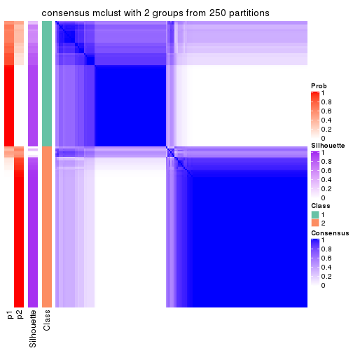</p>

</div>
<div id='tab-CV-mclust-consensus-heatmap-2'>
<pre><code class="r">consensus_heatmap(res, k = 3)
</code></pre>

<p>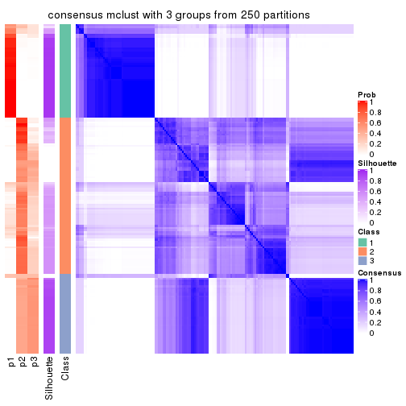</p>

</div>
<div id='tab-CV-mclust-consensus-heatmap-3'>
<pre><code class="r">consensus_heatmap(res, k = 4)
</code></pre>

<p>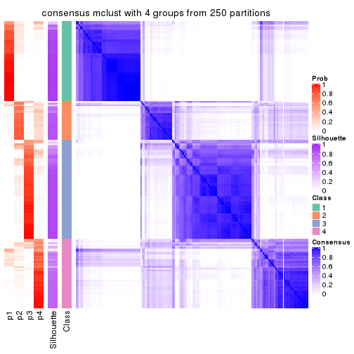</p>

</div>
<div id='tab-CV-mclust-consensus-heatmap-4'>
<pre><code class="r">consensus_heatmap(res, k = 5)
</code></pre>

<p>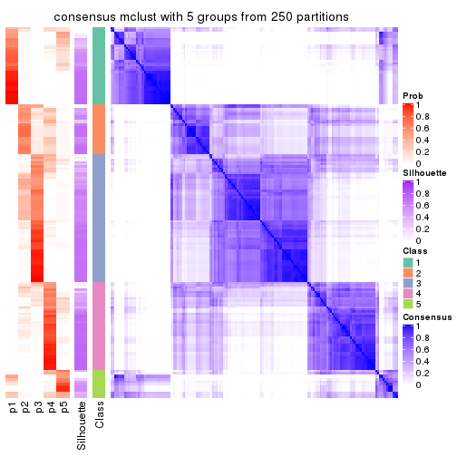</p>

</div>
<div id='tab-CV-mclust-consensus-heatmap-5'>
<pre><code class="r">consensus_heatmap(res, k = 6)
</code></pre>

<p>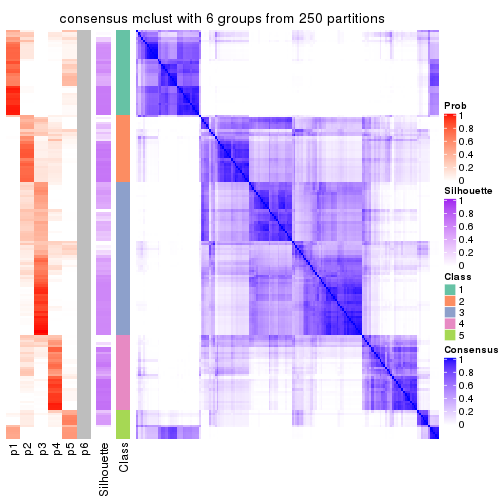</p>

</div>
</div>

Heatmaps for the membership of samples in all partitions to see how consistent they are:


<script>
$( function() {
	$( '#tabs-CV-mclust-membership-heatmap' ).tabs();
} );
</script>
<div id='tabs-CV-mclust-membership-heatmap'>
<ul>
<li><a href='#tab-CV-mclust-membership-heatmap-1'>k = 2</a></li>
<li><a href='#tab-CV-mclust-membership-heatmap-2'>k = 3</a></li>
<li><a href='#tab-CV-mclust-membership-heatmap-3'>k = 4</a></li>
<li><a href='#tab-CV-mclust-membership-heatmap-4'>k = 5</a></li>
<li><a href='#tab-CV-mclust-membership-heatmap-5'>k = 6</a></li>
</ul>
<div id='tab-CV-mclust-membership-heatmap-1'>
<pre><code class="r">membership_heatmap(res, k = 2)
</code></pre>

<p>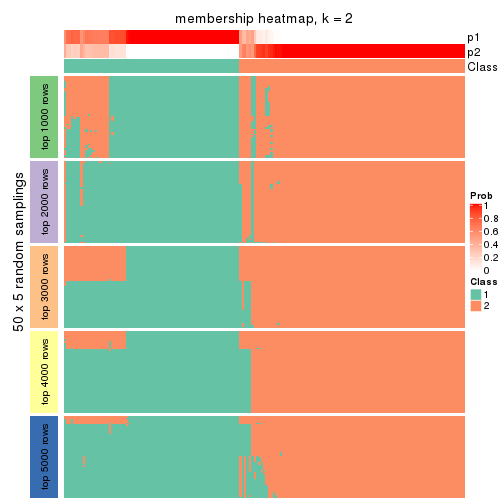</p>

</div>
<div id='tab-CV-mclust-membership-heatmap-2'>
<pre><code class="r">membership_heatmap(res, k = 3)
</code></pre>

<p>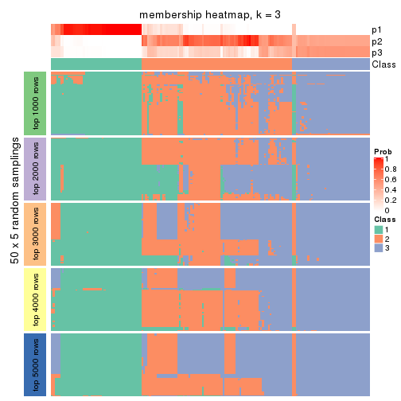</p>

</div>
<div id='tab-CV-mclust-membership-heatmap-3'>
<pre><code class="r">membership_heatmap(res, k = 4)
</code></pre>

<p>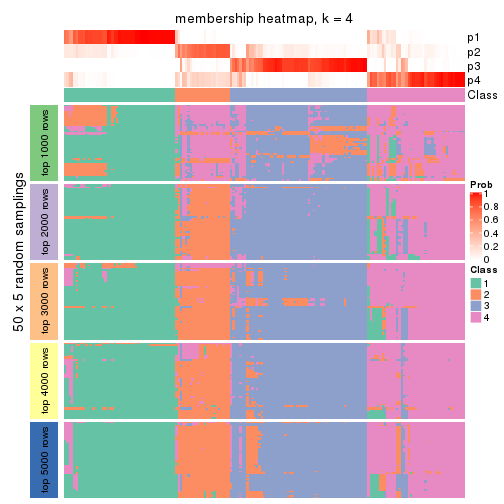</p>

</div>
<div id='tab-CV-mclust-membership-heatmap-4'>
<pre><code class="r">membership_heatmap(res, k = 5)
</code></pre>

<p>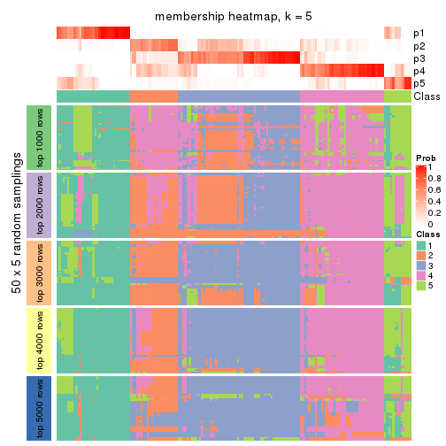</p>

</div>
<div id='tab-CV-mclust-membership-heatmap-5'>
<pre><code class="r">membership_heatmap(res, k = 6)
</code></pre>

<p>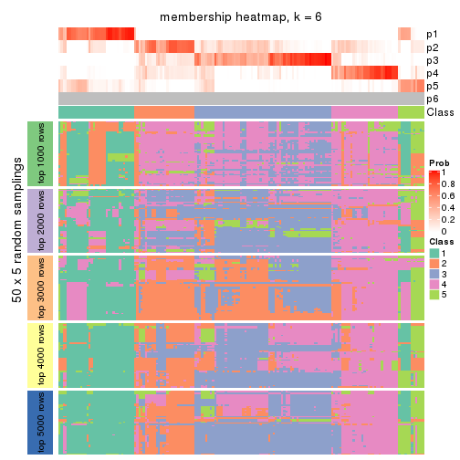</p>

</div>
</div>

As soon as we have had the classes for columns, we can look for signatures
which are significantly different between classes which can be candidate marks
for certain classes. Following are the heatmaps for signatures.


Signature heatmaps where rows are scaled:


<script>
$( function() {
	$( '#tabs-CV-mclust-get-signatures' ).tabs();
} );
</script>
<div id='tabs-CV-mclust-get-signatures'>
<ul>
<li><a href='#tab-CV-mclust-get-signatures-1'>k = 2</a></li>
<li><a href='#tab-CV-mclust-get-signatures-2'>k = 3</a></li>
<li><a href='#tab-CV-mclust-get-signatures-3'>k = 4</a></li>
<li><a href='#tab-CV-mclust-get-signatures-4'>k = 5</a></li>
<li><a href='#tab-CV-mclust-get-signatures-5'>k = 6</a></li>
</ul>
<div id='tab-CV-mclust-get-signatures-1'>
<pre><code class="r">get_signatures(res, k = 2)
</code></pre>

<p>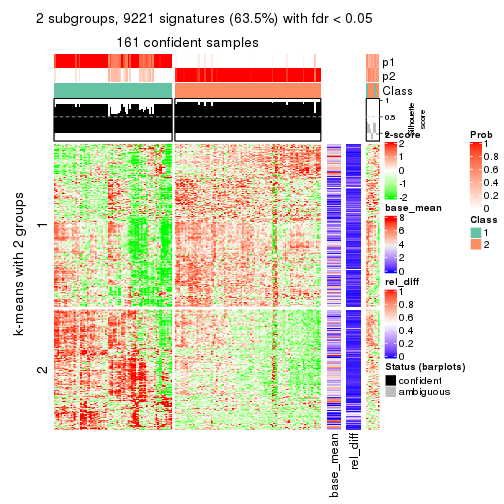</p>

</div>
<div id='tab-CV-mclust-get-signatures-2'>
<pre><code class="r">get_signatures(res, k = 3)
</code></pre>

<p>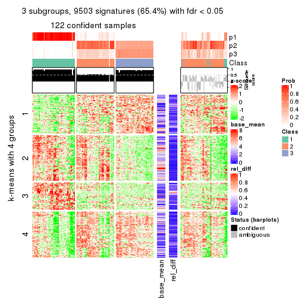</p>

</div>
<div id='tab-CV-mclust-get-signatures-3'>
<pre><code class="r">get_signatures(res, k = 4)
</code></pre>

<p>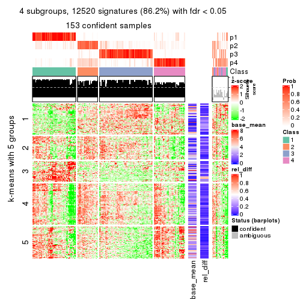</p>

</div>
<div id='tab-CV-mclust-get-signatures-4'>
<pre><code class="r">get_signatures(res, k = 5)
</code></pre>

<p>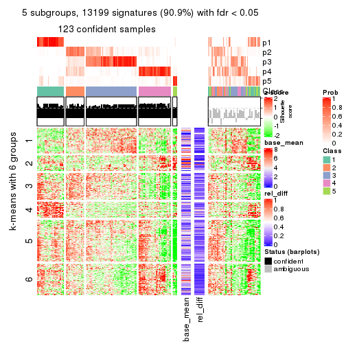</p>

</div>
<div id='tab-CV-mclust-get-signatures-5'>
<pre><code class="r">get_signatures(res, k = 6)
</code></pre>

<p>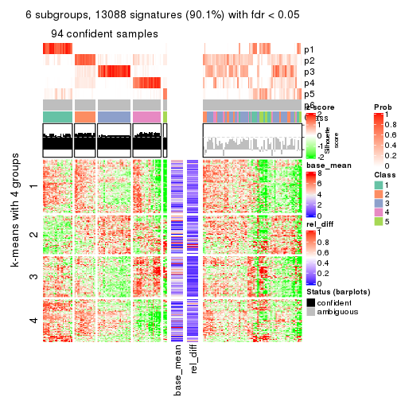</p>

</div>
</div>


Signature heatmaps where rows are not scaled:


<script>
$( function() {
	$( '#tabs-CV-mclust-get-signatures-no-scale' ).tabs();
} );
</script>
<div id='tabs-CV-mclust-get-signatures-no-scale'>
<ul>
<li><a href='#tab-CV-mclust-get-signatures-no-scale-1'>k = 2</a></li>
<li><a href='#tab-CV-mclust-get-signatures-no-scale-2'>k = 3</a></li>
<li><a href='#tab-CV-mclust-get-signatures-no-scale-3'>k = 4</a></li>
<li><a href='#tab-CV-mclust-get-signatures-no-scale-4'>k = 5</a></li>
<li><a href='#tab-CV-mclust-get-signatures-no-scale-5'>k = 6</a></li>
</ul>
<div id='tab-CV-mclust-get-signatures-no-scale-1'>
<pre><code class="r">get_signatures(res, k = 2, scale_rows = FALSE)
</code></pre>

<p>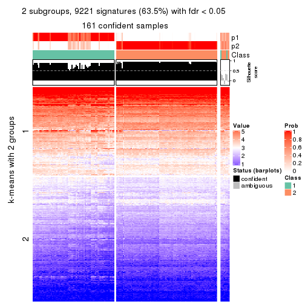</p>

</div>
<div id='tab-CV-mclust-get-signatures-no-scale-2'>
<pre><code class="r">get_signatures(res, k = 3, scale_rows = FALSE)
</code></pre>

<p>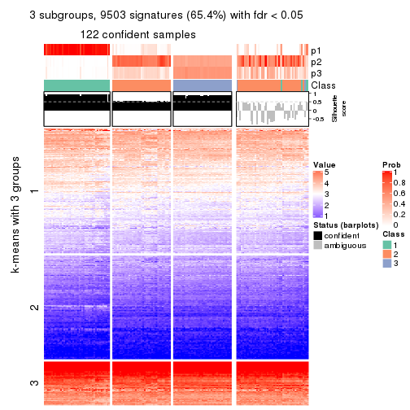</p>

</div>
<div id='tab-CV-mclust-get-signatures-no-scale-3'>
<pre><code class="r">get_signatures(res, k = 4, scale_rows = FALSE)
</code></pre>

<p>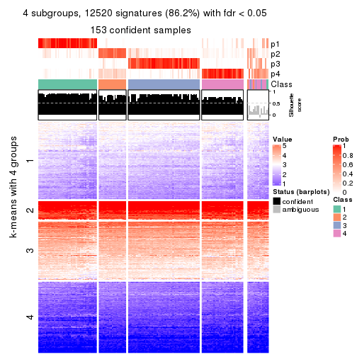</p>

</div>
<div id='tab-CV-mclust-get-signatures-no-scale-4'>
<pre><code class="r">get_signatures(res, k = 5, scale_rows = FALSE)
</code></pre>

<p>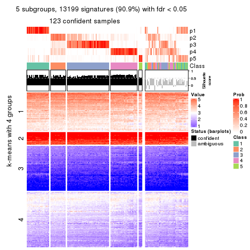</p>

</div>
<div id='tab-CV-mclust-get-signatures-no-scale-5'>
<pre><code class="r">get_signatures(res, k = 6, scale_rows = FALSE)
</code></pre>

<p>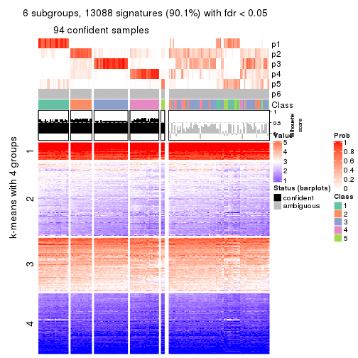</p>

</div>
</div>


Compare the overlap of signatures from different k:

```r
compare_signatures(res)
```

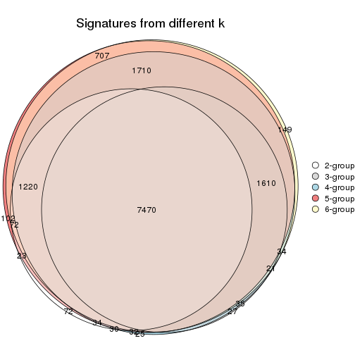

`get_signature()` returns a data frame invisibly. TO get the list of signatures, the function
call should be assigned to a variable explicitly. In following code, if `plot` argument is set
to `FALSE`, no heatmap is plotted while only the differential analysis is performed.

```r
# code only for demonstration
tb = get_signature(res, k = ..., plot = FALSE)
```

An example of the output of `tb` is:

```
#>   which_row         fdr    mean_1    mean_2 scaled_mean_1 scaled_mean_2 km
#> 1        38 0.042760348  8.373488  9.131774    -0.5533452     0.5164555  1
#> 2        40 0.018707592  7.106213  8.469186    -0.6173731     0.5762149  1
#> 3        55 0.019134737 10.221463 11.207825    -0.6159697     0.5749050  1
#> 4        59 0.006059896  5.921854  7.869574    -0.6899429     0.6439467  1
#> 5        60 0.018055526  8.928898 10.211722    -0.6204761     0.5791110  1
#> 6        98 0.009384629 15.714769 14.887706     0.6635654    -0.6193277  2
...
```

The columns in `tb` are:

1. `which_row`: row indices corresponding to the input matrix.
2. `fdr`: FDR for the differential test. 
3. `mean_x`: The mean value in group x.
4. `scaled_mean_x`: The mean value in group x after rows are scaled.
5. `km`: Row groups if k-means clustering is applied to rows.


UMAP plot which shows how samples are separated.


<script>
$( function() {
	$( '#tabs-CV-mclust-dimension-reduction' ).tabs();
} );
</script>
<div id='tabs-CV-mclust-dimension-reduction'>
<ul>
<li><a href='#tab-CV-mclust-dimension-reduction-1'>k = 2</a></li>
<li><a href='#tab-CV-mclust-dimension-reduction-2'>k = 3</a></li>
<li><a href='#tab-CV-mclust-dimension-reduction-3'>k = 4</a></li>
<li><a href='#tab-CV-mclust-dimension-reduction-4'>k = 5</a></li>
<li><a href='#tab-CV-mclust-dimension-reduction-5'>k = 6</a></li>
</ul>
<div id='tab-CV-mclust-dimension-reduction-1'>
<pre><code class="r">dimension_reduction(res, k = 2, method = &quot;UMAP&quot;)
</code></pre>

<p>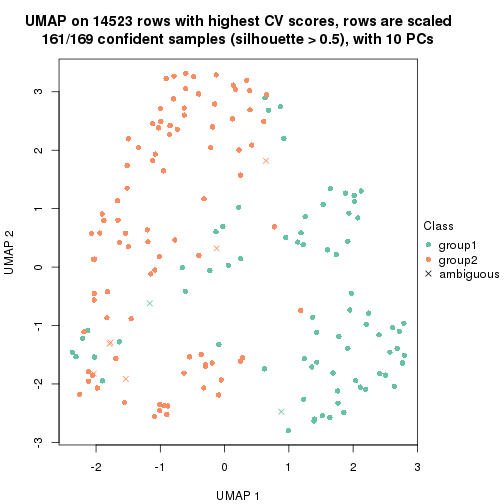</p>

</div>
<div id='tab-CV-mclust-dimension-reduction-2'>
<pre><code class="r">dimension_reduction(res, k = 3, method = &quot;UMAP&quot;)
</code></pre>

<p>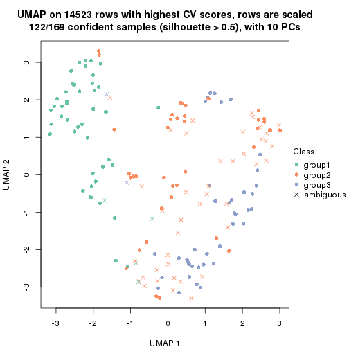</p>

</div>
<div id='tab-CV-mclust-dimension-reduction-3'>
<pre><code class="r">dimension_reduction(res, k = 4, method = &quot;UMAP&quot;)
</code></pre>

<p>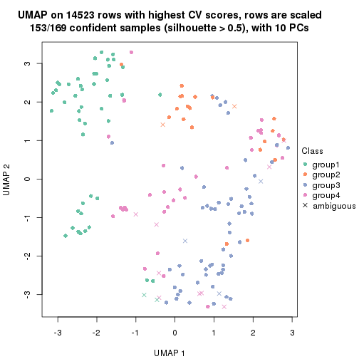</p>

</div>
<div id='tab-CV-mclust-dimension-reduction-4'>
<pre><code class="r">dimension_reduction(res, k = 5, method = &quot;UMAP&quot;)
</code></pre>

<p>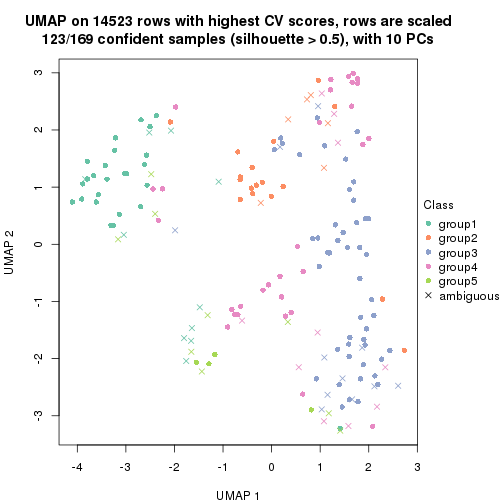</p>

</div>
<div id='tab-CV-mclust-dimension-reduction-5'>
<pre><code class="r">dimension_reduction(res, k = 6, method = &quot;UMAP&quot;)
</code></pre>

<p>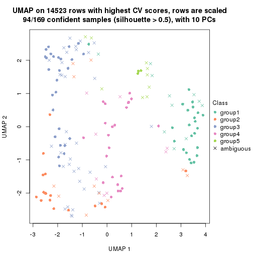</p>

</div>
</div>


Following heatmap shows how subgroups are split when increasing `k`:

```r
collect_classes(res)
```

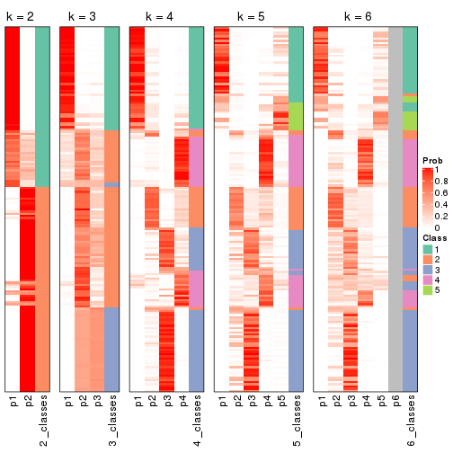


If matrix rows can be associated to genes, consider to use `GO_Enrichment(res,
...)` to perform function enrichment for the signature genes.


 

---------------------------------------------------


### CV:NMF**


The object with results only for a single top-value method and a single partition method 
can be extracted as:

```r
res = res_list["CV", "NMF"]
# you can also extract it by
# res = res_list["CV:NMF"]
```

A summary of `res` and all the functions that can be applied to it:

```r
res
```

```
#> A 'ConsensusPartition' object with k = 2, 3, 4, 5, 6.
#>   On a matrix with 14523 rows and 169 columns.
#>   Top rows (1000, 2000, 3000, 4000, 5000) are extracted by 'CV' method.
#>   Subgroups are detected by 'NMF' method.
#>   Performed in total 1250 partitions by row resampling.
#>   Best k for subgroups seems to be 2.
#> 
#> Following methods can be applied to this 'ConsensusPartition' object:
#>  [1] "cola_report"             "collect_classes"         "collect_plots"          
#>  [4] "collect_stats"           "colnames"                "compare_signatures"     
#>  [7] "consensus_heatmap"       "dimension_reduction"     "functional_enrichment"  
#> [10] "get_anno_col"            "get_anno"                "get_classes"            
#> [13] "get_consensus"           "get_matrix"              "get_membership"         
#> [16] "get_param"               "get_signatures"          "get_stats"              
#> [19] "is_best_k"               "is_stable_k"             "membership_heatmap"     
#> [22] "ncol"                    "nrow"                    "plot_ecdf"              
#> [25] "rownames"                "select_partition_number" "show"                   
#> [28] "suggest_best_k"          "test_to_known_factors"
```

`collect_plots()` function collects all the plots made from `res` for all `k` (number of partitions)
into one single page to provide an easy and fast comparison between different `k`.

```r
collect_plots(res)
```

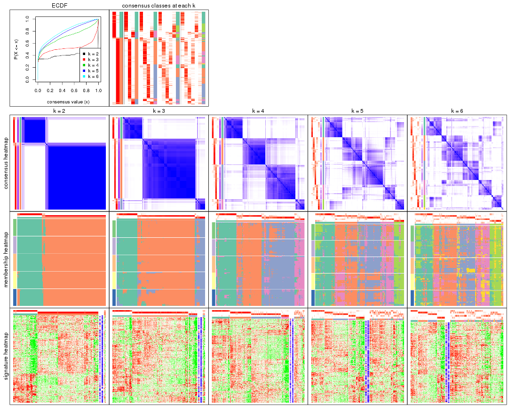

The plots are:

- The first row: a plot of the ECDF (Empirical cumulative distribution
  function) curves of the consensus matrix for each `k` and the heatmap of
  predicted classes for each `k`.
- The second row: heatmaps of the consensus matrix for each `k`.
- The third row: heatmaps of the membership matrix for each `k`.
- The fouth row: heatmaps of the signatures for each `k`.

All the plots in panels can be made by individual functions and they are
plotted later in this section.

`select_partition_number()` produces several plots showing different
statistics for choosing "optimized" `k`. There are following statistics:

- ECDF curves of the consensus matrix for each `k`;
- 1-PAC. [The PAC
  score](https://en.wikipedia.org/wiki/Consensus_clustering#Over-interpretation_potential_of_consensus_clustering)
  measures the proportion of the ambiguous subgrouping.
- Mean silhouette score.
- Concordance. The mean probability of fiting the consensus class ids in all
  partitions.
- Area increased. Denote $A_k$ as the area under the ECDF curve for current
  `k`, the area increased is defined as $A_k - A_{k-1}$.
- Rand index. The percent of pairs of samples that are both in a same cluster
  or both are not in a same cluster in the partition of k and k-1.
- Jaccard index. The ratio of pairs of samples are both in a same cluster in
  the partition of k and k-1 and the pairs of samples are both in a same
  cluster in the partition k or k-1.

The detailed explanations of these statistics can be found in [the cola
vignette](http://bioconductor.org/packages/devel/bioc/vignettes/cola/inst/doc/cola.html#toc_13).

Generally speaking, lower PAC score, higher mean silhouette score or higher
concordance corresponds to better partition. Rand index and Jaccard index
measure how similar the current partition is compared to partition with `k-1`.
If they are too similar, we won't accept `k` is better than `k-1`.

```r
select_partition_number(res)
```

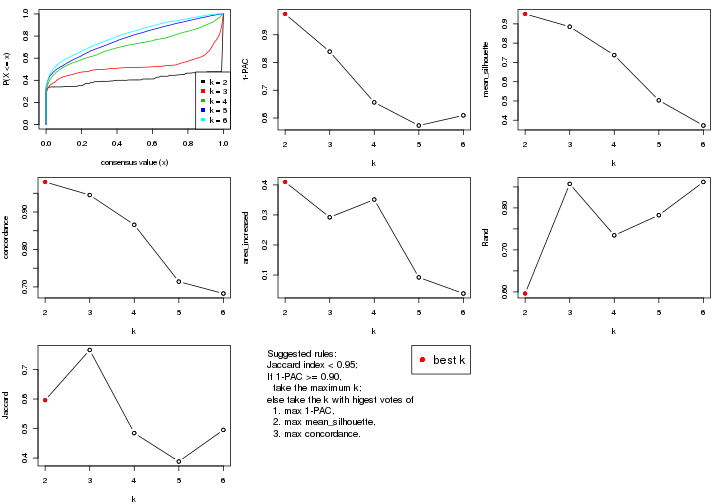

The numeric values for all these statistics can be obtained by `get_stats()`.

```r
get_stats(res)
```

```
#>   k 1-PAC mean_silhouette concordance area_increased  Rand Jaccard
#> 2 2 0.975           0.951       0.980         0.4097 0.596   0.596
#> 3 3 0.839           0.885       0.945         0.2921 0.857   0.766
#> 4 4 0.656           0.738       0.866         0.3512 0.735   0.485
#> 5 5 0.573           0.503       0.714         0.0921 0.783   0.388
#> 6 6 0.610           0.372       0.682         0.0385 0.862   0.495
```

`suggest_best_k()` suggests the best $k$ based on these statistics. The rules are as follows:

- All $k$ with Jaccard index larger than 0.95 are removed because the increase of
  the partition number does not provides enough extra information. If all $k$ are removed,
  the best $k$ is assigned by `NA`.
- For $k$ with 1-PAC larger than 0.9, the maximal $k$ is taken as the "best k". Other $k$ is called "optional k".
- If it does not fit the second rule. The $k$ with the highest vote of highest
  1-PAC, mean silhouette and concordance is taken as the "best k".

```r
suggest_best_k(res)
```

```
#> [1] 2
```


Following shows the table of the partitions (You need to click the **show/hide
code output** link to see it). The membership matrix (columns with name `p*`)
is inferred by
[`clue::cl_consensus()`](https://www.rdocumentation.org/link/cl_consensus?package=clue)
function with the `SE` method. Basically the value in the membership matrix
represents the probability to belong to a certain group. The finall class
label for an item is determined with the group with highest probability it
belongs to.

In `get_classes()` function, the entropy is calculated from the membership
matrix and the silhouette score is calculated from the consensus matrix.


<script>
$( function() {
	$( '#tabs-CV-NMF-get-classes' ).tabs();
} );
</script>
<div id='tabs-CV-NMF-get-classes'>
<ul>
<li><a href='#tab-CV-NMF-get-classes-1'>k = 2</a></li>
<li><a href='#tab-CV-NMF-get-classes-2'>k = 3</a></li>
<li><a href='#tab-CV-NMF-get-classes-3'>k = 4</a></li>
<li><a href='#tab-CV-NMF-get-classes-4'>k = 5</a></li>
<li><a href='#tab-CV-NMF-get-classes-5'>k = 6</a></li>
</ul>

<div id='tab-CV-NMF-get-classes-1'>
<p><a id='tab-CV-NMF-get-classes-1-a' style='color:#0366d6' href='#'>show/hide code output</a></p>
<pre><code class="r">cbind(get_classes(res, k = 2), get_membership(res, k = 2))
</code></pre>

<pre><code>#&gt;            class entropy silhouette    p1    p2
#&gt; SRR2052702     2  0.0000      0.981 0.000 1.000
#&gt; SRR2052701     2  0.0000      0.981 0.000 1.000
#&gt; SRR2052700     2  0.0000      0.981 0.000 1.000
#&gt; SRR2052699     2  0.0000      0.981 0.000 1.000
#&gt; SRR2052698     2  0.0000      0.981 0.000 1.000
#&gt; SRR2052708     1  0.0000      0.974 1.000 0.000
#&gt; SRR2052749     1  0.0000      0.974 1.000 0.000
#&gt; SRR2052786     2  0.0000      0.981 0.000 1.000
#&gt; SRR2052825     2  0.0000      0.981 0.000 1.000
#&gt; SRR2052824     2  0.0000      0.981 0.000 1.000
#&gt; SRR2052823     2  0.0000      0.981 0.000 1.000
#&gt; SRR2052822     2  0.0000      0.981 0.000 1.000
#&gt; SRR2052821     2  0.0000      0.981 0.000 1.000
#&gt; SRR2052820     2  0.0000      0.981 0.000 1.000
#&gt; SRR2052819     2  0.0000      0.981 0.000 1.000
#&gt; SRR2052818     2  0.0000      0.981 0.000 1.000
#&gt; SRR2052817     2  0.0000      0.981 0.000 1.000
#&gt; SRR2052816     2  0.0000      0.981 0.000 1.000
#&gt; SRR2052815     2  0.0000      0.981 0.000 1.000
#&gt; SRR2052814     2  0.0000      0.981 0.000 1.000
#&gt; SRR2052813     2  0.0000      0.981 0.000 1.000
#&gt; SRR2052812     2  0.0000      0.981 0.000 1.000
#&gt; SRR2052811     2  0.0000      0.981 0.000 1.000
#&gt; SRR2052810     2  0.0000      0.981 0.000 1.000
#&gt; SRR2052809     2  0.0000      0.981 0.000 1.000
#&gt; SRR2052808     2  0.0000      0.981 0.000 1.000
#&gt; SRR2052807     1  0.0000      0.974 1.000 0.000
#&gt; SRR2052806     1  0.0000      0.974 1.000 0.000
#&gt; SRR2052805     1  0.0000      0.974 1.000 0.000
#&gt; SRR2052804     1  0.0000      0.974 1.000 0.000
#&gt; SRR2052803     1  0.0000      0.974 1.000 0.000
#&gt; SRR2052802     1  0.0000      0.974 1.000 0.000
#&gt; SRR2052801     1  0.0000      0.974 1.000 0.000
#&gt; SRR2052800     1  0.0000      0.974 1.000 0.000
#&gt; SRR2052799     1  0.0000      0.974 1.000 0.000
#&gt; SRR2052798     1  0.0000      0.974 1.000 0.000
#&gt; SRR2052797     2  0.0000      0.981 0.000 1.000
#&gt; SRR2052796     1  0.0000      0.974 1.000 0.000
#&gt; SRR2052795     1  0.0000      0.974 1.000 0.000
#&gt; SRR2052794     1  0.0000      0.974 1.000 0.000
#&gt; SRR2052793     1  0.0000      0.974 1.000 0.000
#&gt; SRR2052792     1  0.0000      0.974 1.000 0.000
#&gt; SRR2052791     1  0.0000      0.974 1.000 0.000
#&gt; SRR2052790     2  0.0000      0.981 0.000 1.000
#&gt; SRR2052789     2  0.0000      0.981 0.000 1.000
#&gt; SRR2052788     2  0.0000      0.981 0.000 1.000
#&gt; SRR2052787     2  0.0000      0.981 0.000 1.000
#&gt; SRR2052785     2  0.0000      0.981 0.000 1.000
#&gt; SRR2052784     2  0.0000      0.981 0.000 1.000
#&gt; SRR2052783     2  0.0000      0.981 0.000 1.000
#&gt; SRR2052782     2  0.0000      0.981 0.000 1.000
#&gt; SRR2052781     2  0.0000      0.981 0.000 1.000
#&gt; SRR2052780     2  0.0000      0.981 0.000 1.000
#&gt; SRR2052777     2  0.0000      0.981 0.000 1.000
#&gt; SRR2052779     2  0.0000      0.981 0.000 1.000
#&gt; SRR2052778     2  0.0000      0.981 0.000 1.000
#&gt; SRR2052776     2  0.0000      0.981 0.000 1.000
#&gt; SRR2052775     2  0.0000      0.981 0.000 1.000
#&gt; SRR2052773     2  0.0000      0.981 0.000 1.000
#&gt; SRR2052772     2  0.0000      0.981 0.000 1.000
#&gt; SRR2052774     2  0.0000      0.981 0.000 1.000
#&gt; SRR2052771     1  0.0000      0.974 1.000 0.000
#&gt; SRR2052769     2  0.0000      0.981 0.000 1.000
#&gt; SRR2052770     2  0.0000      0.981 0.000 1.000
#&gt; SRR2052768     2  0.0000      0.981 0.000 1.000
#&gt; SRR2052767     2  0.0000      0.981 0.000 1.000
#&gt; SRR2052766     2  0.7528      0.716 0.216 0.784
#&gt; SRR2052765     2  0.0000      0.981 0.000 1.000
#&gt; SRR2052763     2  0.0000      0.981 0.000 1.000
#&gt; SRR2052764     2  0.0000      0.981 0.000 1.000
#&gt; SRR2052761     2  0.0000      0.981 0.000 1.000
#&gt; SRR2052760     2  0.0000      0.981 0.000 1.000
#&gt; SRR2052759     2  0.0000      0.981 0.000 1.000
#&gt; SRR2052762     2  0.0000      0.981 0.000 1.000
#&gt; SRR2052758     2  0.0000      0.981 0.000 1.000
#&gt; SRR2052756     1  0.0000      0.974 1.000 0.000
#&gt; SRR2052757     2  0.0000      0.981 0.000 1.000
#&gt; SRR2052755     1  0.0000      0.974 1.000 0.000
#&gt; SRR2052754     1  0.0000      0.974 1.000 0.000
#&gt; SRR2052753     1  0.0000      0.974 1.000 0.000
#&gt; SRR2052752     1  0.0000      0.974 1.000 0.000
#&gt; SRR2052750     1  0.0376      0.971 0.996 0.004
#&gt; SRR2052751     2  0.0000      0.981 0.000 1.000
#&gt; SRR2052748     2  0.0000      0.981 0.000 1.000
#&gt; SRR2052747     1  0.0000      0.974 1.000 0.000
#&gt; SRR2052746     2  0.0000      0.981 0.000 1.000
#&gt; SRR2052745     2  0.0000      0.981 0.000 1.000
#&gt; SRR2052744     1  0.1414      0.958 0.980 0.020
#&gt; SRR2052741     2  0.0000      0.981 0.000 1.000
#&gt; SRR2052743     2  0.0000      0.981 0.000 1.000
#&gt; SRR2052740     2  0.0000      0.981 0.000 1.000
#&gt; SRR2052742     2  0.0000      0.981 0.000 1.000
#&gt; SRR2052739     2  0.0000      0.981 0.000 1.000
#&gt; SRR2052738     2  0.0000      0.981 0.000 1.000
#&gt; SRR2052736     2  0.0000      0.981 0.000 1.000
#&gt; SRR2052735     1  0.8016      0.694 0.756 0.244
#&gt; SRR2052734     1  0.8327      0.659 0.736 0.264
#&gt; SRR2052737     2  0.0000      0.981 0.000 1.000
#&gt; SRR2052733     2  0.0000      0.981 0.000 1.000
#&gt; SRR2052732     2  0.0000      0.981 0.000 1.000
#&gt; SRR2052731     2  0.0000      0.981 0.000 1.000
#&gt; SRR2052729     1  0.0000      0.974 1.000 0.000
#&gt; SRR2052728     1  0.0000      0.974 1.000 0.000
#&gt; SRR2052730     2  0.9963      0.131 0.464 0.536
#&gt; SRR2052727     1  0.0000      0.974 1.000 0.000
#&gt; SRR2052725     2  0.0000      0.981 0.000 1.000
#&gt; SRR2052726     1  0.7376      0.749 0.792 0.208
#&gt; SRR2052724     1  0.0000      0.974 1.000 0.000
#&gt; SRR2052723     2  0.9427      0.439 0.360 0.640
#&gt; SRR2052722     2  0.0000      0.981 0.000 1.000
#&gt; SRR2052721     1  0.0000      0.974 1.000 0.000
#&gt; SRR2052720     2  0.0000      0.981 0.000 1.000
#&gt; SRR2052719     2  0.0000      0.981 0.000 1.000
#&gt; SRR2052718     1  0.7602      0.732 0.780 0.220
#&gt; SRR2052717     2  0.0000      0.981 0.000 1.000
#&gt; SRR2052714     1  0.0000      0.974 1.000 0.000
#&gt; SRR2052716     2  0.0000      0.981 0.000 1.000
#&gt; SRR2052715     2  0.0000      0.981 0.000 1.000
#&gt; SRR2052713     1  0.0000      0.974 1.000 0.000
#&gt; SRR2052712     1  0.0000      0.974 1.000 0.000
#&gt; SRR2052711     2  0.0000      0.981 0.000 1.000
#&gt; SRR2052710     2  0.0000      0.981 0.000 1.000
#&gt; SRR2052707     2  0.0000      0.981 0.000 1.000
#&gt; SRR2052709     2  0.0000      0.981 0.000 1.000
#&gt; SRR2052704     2  0.0000      0.981 0.000 1.000
#&gt; SRR2052705     2  0.0000      0.981 0.000 1.000
#&gt; SRR2052697     2  0.0000      0.981 0.000 1.000
#&gt; SRR2052703     2  0.0000      0.981 0.000 1.000
#&gt; SRR2052696     1  0.0000      0.974 1.000 0.000
#&gt; SRR2052706     2  0.0000      0.981 0.000 1.000
#&gt; SRR2052695     2  0.0000      0.981 0.000 1.000
#&gt; SRR2052694     2  0.0000      0.981 0.000 1.000
#&gt; SRR2052692     2  0.0000      0.981 0.000 1.000
#&gt; SRR2052693     2  0.0000      0.981 0.000 1.000
#&gt; SRR2052691     2  0.9635      0.352 0.388 0.612
#&gt; SRR2052690     2  0.0000      0.981 0.000 1.000
#&gt; SRR2052689     2  0.0000      0.981 0.000 1.000
#&gt; SRR2052687     2  0.0000      0.981 0.000 1.000
#&gt; SRR2052686     2  0.9580      0.373 0.380 0.620
#&gt; SRR2052688     2  0.0000      0.981 0.000 1.000
#&gt; SRR2052684     1  0.0000      0.974 1.000 0.000
#&gt; SRR2052685     2  0.4431      0.884 0.092 0.908
#&gt; SRR2052683     1  0.0000      0.974 1.000 0.000
#&gt; SRR2052681     2  0.0000      0.981 0.000 1.000
#&gt; SRR2052680     2  0.0000      0.981 0.000 1.000
#&gt; SRR2052682     2  0.8909      0.543 0.308 0.692
#&gt; SRR2052679     1  0.0000      0.974 1.000 0.000
#&gt; SRR2052678     2  0.0000      0.981 0.000 1.000
#&gt; SRR2052677     2  0.0000      0.981 0.000 1.000
#&gt; SRR2052675     2  0.0000      0.981 0.000 1.000
#&gt; SRR2052676     1  0.0000      0.974 1.000 0.000
#&gt; SRR2052674     2  0.0000      0.981 0.000 1.000
#&gt; SRR2052672     2  0.0000      0.981 0.000 1.000
#&gt; SRR2052673     2  0.0000      0.981 0.000 1.000
#&gt; SRR2052671     2  0.0000      0.981 0.000 1.000
#&gt; SRR2052670     2  0.0000      0.981 0.000 1.000
#&gt; SRR2052669     2  0.0000      0.981 0.000 1.000
#&gt; SRR2052668     2  0.0000      0.981 0.000 1.000
#&gt; SRR2052667     2  0.0000      0.981 0.000 1.000
#&gt; SRR2052666     2  0.0000      0.981 0.000 1.000
#&gt; SRR2052665     2  0.0000      0.981 0.000 1.000
#&gt; SRR2052664     1  0.0000      0.974 1.000 0.000
#&gt; SRR2052663     2  0.0376      0.977 0.004 0.996
#&gt; SRR2052662     2  0.0000      0.981 0.000 1.000
#&gt; SRR2052661     1  0.6712      0.792 0.824 0.176
#&gt; SRR2052660     2  0.0000      0.981 0.000 1.000
#&gt; SRR2052659     2  0.0000      0.981 0.000 1.000
#&gt; SRR2052658     2  0.0000      0.981 0.000 1.000
#&gt; SRR2052657     1  0.0000      0.974 1.000 0.000
</code></pre>

<script>
$('#tab-CV-NMF-get-classes-1-a').parent().next().next().hide();
$('#tab-CV-NMF-get-classes-1-a').click(function(){
  $('#tab-CV-NMF-get-classes-1-a').parent().next().next().toggle();
  return(false);
});
</script>
</div>

<div id='tab-CV-NMF-get-classes-2'>
<p><a id='tab-CV-NMF-get-classes-2-a' style='color:#0366d6' href='#'>show/hide code output</a></p>
<pre><code class="r">cbind(get_classes(res, k = 3), get_membership(res, k = 3))
</code></pre>

<pre><code>#&gt;            class entropy silhouette    p1    p2    p3
#&gt; SRR2052702     2  0.0237      0.955 0.004 0.996 0.000
#&gt; SRR2052701     2  0.0892      0.948 0.020 0.980 0.000
#&gt; SRR2052700     2  0.0237      0.956 0.000 0.996 0.004
#&gt; SRR2052699     2  0.2356      0.907 0.072 0.928 0.000
#&gt; SRR2052698     2  0.2711      0.910 0.000 0.912 0.088
#&gt; SRR2052708     1  0.0424      0.926 0.992 0.000 0.008
#&gt; SRR2052749     1  0.0592      0.925 0.988 0.000 0.012
#&gt; SRR2052786     2  0.0237      0.955 0.004 0.996 0.000
#&gt; SRR2052825     3  0.3412      0.768 0.000 0.124 0.876
#&gt; SRR2052824     3  0.5882      0.486 0.000 0.348 0.652
#&gt; SRR2052823     2  0.0424      0.954 0.008 0.992 0.000
#&gt; SRR2052822     2  0.0237      0.956 0.000 0.996 0.004
#&gt; SRR2052821     2  0.0000      0.956 0.000 1.000 0.000
#&gt; SRR2052820     2  0.2165      0.925 0.000 0.936 0.064
#&gt; SRR2052819     2  0.3412      0.870 0.000 0.876 0.124
#&gt; SRR2052818     2  0.0237      0.955 0.004 0.996 0.000
#&gt; SRR2052817     2  0.0592      0.954 0.000 0.988 0.012
#&gt; SRR2052816     2  0.1031      0.946 0.024 0.976 0.000
#&gt; SRR2052815     2  0.5178      0.683 0.000 0.744 0.256
#&gt; SRR2052814     2  0.0747      0.953 0.000 0.984 0.016
#&gt; SRR2052813     2  0.0000      0.956 0.000 1.000 0.000
#&gt; SRR2052812     2  0.0237      0.955 0.004 0.996 0.000
#&gt; SRR2052811     2  0.0424      0.954 0.008 0.992 0.000
#&gt; SRR2052810     2  0.0592      0.954 0.000 0.988 0.012
#&gt; SRR2052809     2  0.0237      0.956 0.000 0.996 0.004
#&gt; SRR2052808     2  0.0424      0.955 0.000 0.992 0.008
#&gt; SRR2052807     3  0.1964      0.784 0.056 0.000 0.944
#&gt; SRR2052806     1  0.0747      0.924 0.984 0.000 0.016
#&gt; SRR2052805     1  0.1289      0.916 0.968 0.000 0.032
#&gt; SRR2052804     3  0.0237      0.824 0.004 0.000 0.996
#&gt; SRR2052803     1  0.1289      0.916 0.968 0.000 0.032
#&gt; SRR2052802     3  0.0237      0.824 0.004 0.000 0.996
#&gt; SRR2052801     3  0.6140      0.214 0.404 0.000 0.596
#&gt; SRR2052800     3  0.0237      0.824 0.004 0.000 0.996
#&gt; SRR2052799     1  0.6095      0.403 0.608 0.000 0.392
#&gt; SRR2052798     1  0.0237      0.926 0.996 0.000 0.004
#&gt; SRR2052797     2  0.0000      0.956 0.000 1.000 0.000
#&gt; SRR2052796     1  0.5098      0.689 0.752 0.000 0.248
#&gt; SRR2052795     1  0.1031      0.920 0.976 0.000 0.024
#&gt; SRR2052794     3  0.3879      0.694 0.152 0.000 0.848
#&gt; SRR2052793     1  0.3192      0.854 0.888 0.000 0.112
#&gt; SRR2052792     3  0.0237      0.824 0.004 0.000 0.996
#&gt; SRR2052791     3  0.6244      0.100 0.440 0.000 0.560
#&gt; SRR2052790     2  0.0237      0.956 0.000 0.996 0.004
#&gt; SRR2052789     2  0.0747      0.953 0.000 0.984 0.016
#&gt; SRR2052788     2  0.2261      0.923 0.000 0.932 0.068
#&gt; SRR2052787     2  0.0000      0.956 0.000 1.000 0.000
#&gt; SRR2052785     2  0.2165      0.925 0.000 0.936 0.064
#&gt; SRR2052784     2  0.0237      0.956 0.000 0.996 0.004
#&gt; SRR2052783     2  0.0424      0.955 0.000 0.992 0.008
#&gt; SRR2052782     2  0.0000      0.956 0.000 1.000 0.000
#&gt; SRR2052781     2  0.0237      0.956 0.000 0.996 0.004
#&gt; SRR2052780     2  0.0237      0.956 0.000 0.996 0.004
#&gt; SRR2052777     2  0.0000      0.956 0.000 1.000 0.000
#&gt; SRR2052779     2  0.0000      0.956 0.000 1.000 0.000
#&gt; SRR2052778     2  0.4452      0.787 0.000 0.808 0.192
#&gt; SRR2052776     2  0.0237      0.956 0.000 0.996 0.004
#&gt; SRR2052775     2  0.2066      0.928 0.000 0.940 0.060
#&gt; SRR2052773     2  0.0237      0.956 0.000 0.996 0.004
#&gt; SRR2052772     2  0.2066      0.929 0.000 0.940 0.060
#&gt; SRR2052774     2  0.0892      0.951 0.000 0.980 0.020
#&gt; SRR2052771     1  0.6192      0.329 0.580 0.000 0.420
#&gt; SRR2052769     2  0.1031      0.949 0.000 0.976 0.024
#&gt; SRR2052770     2  0.3116      0.887 0.000 0.892 0.108
#&gt; SRR2052768     2  0.0237      0.955 0.004 0.996 0.000
#&gt; SRR2052767     2  0.0237      0.955 0.004 0.996 0.000
#&gt; SRR2052766     3  0.0237      0.824 0.000 0.004 0.996
#&gt; SRR2052765     2  0.0237      0.956 0.000 0.996 0.004
#&gt; SRR2052763     2  0.1860      0.933 0.000 0.948 0.052
#&gt; SRR2052764     2  0.0237      0.955 0.004 0.996 0.000
#&gt; SRR2052761     2  0.0424      0.955 0.000 0.992 0.008
#&gt; SRR2052760     2  0.0237      0.955 0.004 0.996 0.000
#&gt; SRR2052759     2  0.4887      0.735 0.000 0.772 0.228
#&gt; SRR2052762     2  0.0237      0.955 0.004 0.996 0.000
#&gt; SRR2052758     2  0.0237      0.956 0.000 0.996 0.004
#&gt; SRR2052756     1  0.0237      0.926 0.996 0.000 0.004
#&gt; SRR2052757     2  0.1163      0.950 0.000 0.972 0.028
#&gt; SRR2052755     1  0.0237      0.925 0.996 0.004 0.000
#&gt; SRR2052754     1  0.3038      0.862 0.896 0.000 0.104
#&gt; SRR2052753     1  0.0237      0.925 0.996 0.004 0.000
#&gt; SRR2052752     1  0.2066      0.898 0.940 0.000 0.060
#&gt; SRR2052750     1  0.0237      0.925 0.996 0.004 0.000
#&gt; SRR2052751     2  0.0424      0.954 0.008 0.992 0.000
#&gt; SRR2052748     3  0.0892      0.820 0.000 0.020 0.980
#&gt; SRR2052747     1  0.0237      0.926 0.996 0.000 0.004
#&gt; SRR2052746     2  0.2261      0.922 0.000 0.932 0.068
#&gt; SRR2052745     2  0.4121      0.818 0.000 0.832 0.168
#&gt; SRR2052744     1  0.0424      0.923 0.992 0.008 0.000
#&gt; SRR2052741     2  0.1964      0.921 0.056 0.944 0.000
#&gt; SRR2052743     2  0.0424      0.954 0.008 0.992 0.000
#&gt; SRR2052740     2  0.1289      0.940 0.032 0.968 0.000
#&gt; SRR2052742     2  0.0424      0.954 0.008 0.992 0.000
#&gt; SRR2052739     2  0.0237      0.955 0.004 0.996 0.000
#&gt; SRR2052738     3  0.5178      0.648 0.000 0.256 0.744
#&gt; SRR2052736     2  0.3038      0.872 0.104 0.896 0.000
#&gt; SRR2052735     1  0.1753      0.891 0.952 0.048 0.000
#&gt; SRR2052734     1  0.2165      0.872 0.936 0.064 0.000
#&gt; SRR2052737     2  0.0000      0.956 0.000 1.000 0.000
#&gt; SRR2052733     2  0.3879      0.838 0.000 0.848 0.152
#&gt; SRR2052732     2  0.0747      0.950 0.016 0.984 0.000
#&gt; SRR2052731     2  0.1529      0.941 0.000 0.960 0.040
#&gt; SRR2052729     1  0.0000      0.926 1.000 0.000 0.000
#&gt; SRR2052728     1  0.0592      0.921 0.988 0.012 0.000
#&gt; SRR2052730     3  0.0000      0.824 0.000 0.000 1.000
#&gt; SRR2052727     1  0.0237      0.926 0.996 0.000 0.004
#&gt; SRR2052725     2  0.2356      0.906 0.072 0.928 0.000
#&gt; SRR2052726     1  0.0892      0.915 0.980 0.020 0.000
#&gt; SRR2052724     1  0.0592      0.925 0.988 0.000 0.012
#&gt; SRR2052723     3  0.0237      0.824 0.000 0.004 0.996
#&gt; SRR2052722     2  0.2711      0.907 0.000 0.912 0.088
#&gt; SRR2052721     1  0.0237      0.925 0.996 0.004 0.000
#&gt; SRR2052720     2  0.0237      0.955 0.004 0.996 0.000
#&gt; SRR2052719     2  0.0237      0.955 0.004 0.996 0.000
#&gt; SRR2052718     1  0.1753      0.890 0.952 0.048 0.000
#&gt; SRR2052717     2  0.0237      0.955 0.004 0.996 0.000
#&gt; SRR2052714     1  0.1031      0.920 0.976 0.000 0.024
#&gt; SRR2052716     2  0.5810      0.514 0.000 0.664 0.336
#&gt; SRR2052715     2  0.2878      0.899 0.000 0.904 0.096
#&gt; SRR2052713     1  0.0237      0.926 0.996 0.000 0.004
#&gt; SRR2052712     3  0.0424      0.822 0.008 0.000 0.992
#&gt; SRR2052711     2  0.2261      0.910 0.068 0.932 0.000
#&gt; SRR2052710     2  0.1163      0.948 0.000 0.972 0.028
#&gt; SRR2052707     2  0.1964      0.931 0.000 0.944 0.056
#&gt; SRR2052709     2  0.0892      0.951 0.000 0.980 0.020
#&gt; SRR2052704     3  0.4062      0.737 0.000 0.164 0.836
#&gt; SRR2052705     2  0.0237      0.955 0.004 0.996 0.000
#&gt; SRR2052697     2  0.2711      0.890 0.088 0.912 0.000
#&gt; SRR2052703     2  0.1529      0.941 0.000 0.960 0.040
#&gt; SRR2052696     1  0.0237      0.926 0.996 0.000 0.004
#&gt; SRR2052706     2  0.0000      0.956 0.000 1.000 0.000
#&gt; SRR2052695     2  0.0000      0.956 0.000 1.000 0.000
#&gt; SRR2052694     2  0.0237      0.955 0.004 0.996 0.000
#&gt; SRR2052692     2  0.0892      0.951 0.000 0.980 0.020
#&gt; SRR2052693     2  0.1289      0.947 0.000 0.968 0.032
#&gt; SRR2052691     1  0.2448      0.856 0.924 0.076 0.000
#&gt; SRR2052690     2  0.1163      0.943 0.028 0.972 0.000
#&gt; SRR2052689     3  0.5098      0.658 0.000 0.248 0.752
#&gt; SRR2052687     2  0.5216      0.683 0.000 0.740 0.260
#&gt; SRR2052686     1  0.2796      0.833 0.908 0.092 0.000
#&gt; SRR2052688     2  0.0237      0.955 0.004 0.996 0.000
#&gt; SRR2052684     3  0.0237      0.824 0.004 0.000 0.996
#&gt; SRR2052685     2  0.5016      0.667 0.240 0.760 0.000
#&gt; SRR2052683     1  0.1031      0.921 0.976 0.000 0.024
#&gt; SRR2052681     2  0.0237      0.956 0.000 0.996 0.004
#&gt; SRR2052680     3  0.3752      0.755 0.000 0.144 0.856
#&gt; SRR2052682     1  0.4291      0.677 0.820 0.180 0.000
#&gt; SRR2052679     1  0.0000      0.926 1.000 0.000 0.000
#&gt; SRR2052678     2  0.1031      0.949 0.000 0.976 0.024
#&gt; SRR2052677     2  0.0000      0.956 0.000 1.000 0.000
#&gt; SRR2052675     2  0.1860      0.924 0.052 0.948 0.000
#&gt; SRR2052676     1  0.0000      0.926 1.000 0.000 0.000
#&gt; SRR2052674     2  0.0424      0.955 0.000 0.992 0.008
#&gt; SRR2052672     2  0.2165      0.925 0.000 0.936 0.064
#&gt; SRR2052673     2  0.2878      0.881 0.096 0.904 0.000
#&gt; SRR2052671     2  0.0424      0.954 0.008 0.992 0.000
#&gt; SRR2052670     2  0.0424      0.955 0.000 0.992 0.008
#&gt; SRR2052669     2  0.0237      0.955 0.004 0.996 0.000
#&gt; SRR2052668     2  0.1163      0.943 0.028 0.972 0.000
#&gt; SRR2052667     2  0.0000      0.956 0.000 1.000 0.000
#&gt; SRR2052666     2  0.0000      0.956 0.000 1.000 0.000
#&gt; SRR2052665     2  0.0237      0.955 0.004 0.996 0.000
#&gt; SRR2052664     1  0.4654      0.745 0.792 0.000 0.208
#&gt; SRR2052663     2  0.4452      0.752 0.192 0.808 0.000
#&gt; SRR2052662     2  0.0237      0.955 0.004 0.996 0.000
#&gt; SRR2052661     1  0.2066      0.877 0.940 0.060 0.000
#&gt; SRR2052660     2  0.0747      0.953 0.000 0.984 0.016
#&gt; SRR2052659     2  0.2261      0.924 0.000 0.932 0.068
#&gt; SRR2052658     2  0.0424      0.954 0.008 0.992 0.000
#&gt; SRR2052657     1  0.0424      0.926 0.992 0.000 0.008
</code></pre>

<script>
$('#tab-CV-NMF-get-classes-2-a').parent().next().next().hide();
$('#tab-CV-NMF-get-classes-2-a').click(function(){
  $('#tab-CV-NMF-get-classes-2-a').parent().next().next().toggle();
  return(false);
});
</script>
</div>

<div id='tab-CV-NMF-get-classes-3'>
<p><a id='tab-CV-NMF-get-classes-3-a' style='color:#0366d6' href='#'>show/hide code output</a></p>
<pre><code class="r">cbind(get_classes(res, k = 4), get_membership(res, k = 4))
</code></pre>

<pre><code>#&gt;            class entropy silhouette    p1    p2    p3    p4
#&gt; SRR2052702     2  0.0469   0.851827 0.000 0.988 0.012 0.000
#&gt; SRR2052701     2  0.6782   0.198883 0.068 0.528 0.392 0.012
#&gt; SRR2052700     2  0.0000   0.851505 0.000 1.000 0.000 0.000
#&gt; SRR2052699     1  0.5973   0.474887 0.676 0.056 0.256 0.012
#&gt; SRR2052698     3  0.7901   0.087517 0.000 0.296 0.356 0.348
#&gt; SRR2052708     1  0.1022   0.877103 0.968 0.000 0.000 0.032
#&gt; SRR2052749     1  0.0707   0.882924 0.980 0.000 0.000 0.020
#&gt; SRR2052786     2  0.4843   0.297611 0.000 0.604 0.396 0.000
#&gt; SRR2052825     2  0.0469   0.847248 0.000 0.988 0.000 0.012
#&gt; SRR2052824     2  0.0817   0.844844 0.000 0.976 0.000 0.024
#&gt; SRR2052823     2  0.0376   0.852175 0.004 0.992 0.004 0.000
#&gt; SRR2052822     3  0.4477   0.629804 0.000 0.312 0.688 0.000
#&gt; SRR2052821     2  0.0469   0.851827 0.000 0.988 0.012 0.000
#&gt; SRR2052820     3  0.4010   0.809219 0.000 0.100 0.836 0.064
#&gt; SRR2052819     2  0.5058   0.690895 0.000 0.768 0.104 0.128
#&gt; SRR2052818     2  0.0000   0.851505 0.000 1.000 0.000 0.000
#&gt; SRR2052817     3  0.3266   0.834068 0.000 0.084 0.876 0.040
#&gt; SRR2052816     2  0.0336   0.848839 0.000 0.992 0.008 0.000
#&gt; SRR2052815     2  0.0336   0.848590 0.000 0.992 0.000 0.008
#&gt; SRR2052814     2  0.1398   0.841186 0.000 0.956 0.040 0.004
#&gt; SRR2052813     3  0.4454   0.634131 0.000 0.308 0.692 0.000
#&gt; SRR2052812     2  0.2081   0.817969 0.000 0.916 0.084 0.000
#&gt; SRR2052811     2  0.0000   0.851505 0.000 1.000 0.000 0.000
#&gt; SRR2052810     2  0.0000   0.851505 0.000 1.000 0.000 0.000
#&gt; SRR2052809     3  0.4500   0.619543 0.000 0.316 0.684 0.000
#&gt; SRR2052808     2  0.0469   0.847350 0.000 0.988 0.000 0.012
#&gt; SRR2052807     4  0.1302   0.787266 0.044 0.000 0.000 0.956
#&gt; SRR2052806     1  0.2408   0.824554 0.896 0.000 0.000 0.104
#&gt; SRR2052805     1  0.2589   0.813306 0.884 0.000 0.000 0.116
#&gt; SRR2052804     4  0.0804   0.797239 0.008 0.000 0.012 0.980
#&gt; SRR2052803     1  0.2530   0.816943 0.888 0.000 0.000 0.112
#&gt; SRR2052802     4  0.0469   0.798251 0.000 0.000 0.012 0.988
#&gt; SRR2052801     4  0.3311   0.707417 0.172 0.000 0.000 0.828
#&gt; SRR2052800     4  0.0469   0.798251 0.000 0.000 0.012 0.988
#&gt; SRR2052799     4  0.4431   0.537747 0.304 0.000 0.000 0.696
#&gt; SRR2052798     1  0.0336   0.885098 0.992 0.000 0.008 0.000
#&gt; SRR2052797     2  0.1389   0.838376 0.000 0.952 0.048 0.000
#&gt; SRR2052796     4  0.4992   0.090562 0.476 0.000 0.000 0.524
#&gt; SRR2052795     1  0.1118   0.874916 0.964 0.000 0.000 0.036
#&gt; SRR2052794     4  0.2216   0.765997 0.092 0.000 0.000 0.908
#&gt; SRR2052793     1  0.3942   0.656028 0.764 0.000 0.000 0.236
#&gt; SRR2052792     4  0.0592   0.797941 0.000 0.000 0.016 0.984
#&gt; SRR2052791     4  0.3764   0.666077 0.216 0.000 0.000 0.784
#&gt; SRR2052790     3  0.1637   0.838781 0.000 0.060 0.940 0.000
#&gt; SRR2052789     3  0.1388   0.835864 0.000 0.028 0.960 0.012
#&gt; SRR2052788     3  0.1256   0.826292 0.000 0.008 0.964 0.028
#&gt; SRR2052787     3  0.3688   0.761843 0.000 0.208 0.792 0.000
#&gt; SRR2052785     3  0.6362   0.605102 0.000 0.288 0.616 0.096
#&gt; SRR2052784     3  0.1109   0.835136 0.000 0.028 0.968 0.004
#&gt; SRR2052783     3  0.2610   0.836607 0.000 0.088 0.900 0.012
#&gt; SRR2052782     3  0.3400   0.786497 0.000 0.180 0.820 0.000
#&gt; SRR2052781     3  0.4220   0.717688 0.000 0.248 0.748 0.004
#&gt; SRR2052780     3  0.2271   0.836822 0.000 0.076 0.916 0.008
#&gt; SRR2052777     3  0.3649   0.767269 0.000 0.204 0.796 0.000
#&gt; SRR2052779     3  0.4454   0.630837 0.000 0.308 0.692 0.000
#&gt; SRR2052778     3  0.7714   0.318209 0.000 0.244 0.440 0.316
#&gt; SRR2052776     2  0.4454   0.511466 0.000 0.692 0.308 0.000
#&gt; SRR2052775     3  0.3421   0.830964 0.000 0.088 0.868 0.044
#&gt; SRR2052773     3  0.1474   0.839394 0.000 0.052 0.948 0.000
#&gt; SRR2052772     3  0.1022   0.824568 0.000 0.000 0.968 0.032
#&gt; SRR2052774     3  0.0927   0.829073 0.000 0.008 0.976 0.016
#&gt; SRR2052771     4  0.4585   0.488299 0.332 0.000 0.000 0.668
#&gt; SRR2052769     2  0.0188   0.851724 0.000 0.996 0.000 0.004
#&gt; SRR2052770     3  0.7763   0.277125 0.000 0.332 0.420 0.248
#&gt; SRR2052768     2  0.0779   0.851549 0.004 0.980 0.016 0.000
#&gt; SRR2052767     2  0.0592   0.851191 0.000 0.984 0.016 0.000
#&gt; SRR2052766     4  0.0817   0.796738 0.000 0.000 0.024 0.976
#&gt; SRR2052765     2  0.0000   0.851505 0.000 1.000 0.000 0.000
#&gt; SRR2052763     3  0.1256   0.825859 0.000 0.008 0.964 0.028
#&gt; SRR2052764     2  0.0000   0.851505 0.000 1.000 0.000 0.000
#&gt; SRR2052761     3  0.0336   0.830136 0.000 0.008 0.992 0.000
#&gt; SRR2052760     3  0.4855   0.405670 0.000 0.400 0.600 0.000
#&gt; SRR2052759     3  0.2704   0.768719 0.000 0.000 0.876 0.124
#&gt; SRR2052762     3  0.3651   0.812423 0.008 0.136 0.844 0.012
#&gt; SRR2052758     3  0.1174   0.834725 0.000 0.020 0.968 0.012
#&gt; SRR2052756     1  0.0336   0.885098 0.992 0.000 0.008 0.000
#&gt; SRR2052757     2  0.7062   0.445781 0.000 0.564 0.260 0.176
#&gt; SRR2052755     1  0.0937   0.880556 0.976 0.000 0.012 0.012
#&gt; SRR2052754     1  0.4008   0.642148 0.756 0.000 0.000 0.244
#&gt; SRR2052753     1  0.0336   0.885098 0.992 0.000 0.008 0.000
#&gt; SRR2052752     1  0.2868   0.791330 0.864 0.000 0.000 0.136
#&gt; SRR2052750     1  0.1059   0.878824 0.972 0.000 0.016 0.012
#&gt; SRR2052751     3  0.1124   0.826432 0.012 0.004 0.972 0.012
#&gt; SRR2052748     4  0.4277   0.574758 0.000 0.000 0.280 0.720
#&gt; SRR2052747     1  0.0336   0.885017 0.992 0.000 0.000 0.008
#&gt; SRR2052746     3  0.1677   0.822119 0.000 0.012 0.948 0.040
#&gt; SRR2052745     3  0.3161   0.762543 0.000 0.012 0.864 0.124
#&gt; SRR2052744     1  0.0336   0.885066 0.992 0.000 0.008 0.000
#&gt; SRR2052741     3  0.4129   0.770775 0.116 0.036 0.836 0.012
#&gt; SRR2052743     3  0.2552   0.832964 0.020 0.048 0.920 0.012
#&gt; SRR2052740     3  0.6868   0.611439 0.168 0.184 0.636 0.012
#&gt; SRR2052742     3  0.1059   0.823638 0.016 0.000 0.972 0.012
#&gt; SRR2052739     2  0.0817   0.849259 0.000 0.976 0.024 0.000
#&gt; SRR2052738     3  0.4155   0.621936 0.000 0.004 0.756 0.240
#&gt; SRR2052736     3  0.7385   0.247921 0.400 0.116 0.472 0.012
#&gt; SRR2052735     1  0.1677   0.862890 0.948 0.000 0.040 0.012
#&gt; SRR2052734     1  0.2021   0.847507 0.932 0.000 0.056 0.012
#&gt; SRR2052737     2  0.4477   0.509355 0.000 0.688 0.312 0.000
#&gt; SRR2052733     3  0.3881   0.714216 0.000 0.016 0.812 0.172
#&gt; SRR2052732     2  0.0000   0.851505 0.000 1.000 0.000 0.000
#&gt; SRR2052731     3  0.1059   0.829523 0.000 0.012 0.972 0.016
#&gt; SRR2052729     1  0.0188   0.885397 0.996 0.000 0.000 0.004
#&gt; SRR2052728     1  0.0804   0.881408 0.980 0.000 0.008 0.012
#&gt; SRR2052730     4  0.4319   0.641041 0.000 0.228 0.012 0.760
#&gt; SRR2052727     1  0.0376   0.885688 0.992 0.000 0.004 0.004
#&gt; SRR2052725     2  0.1792   0.819582 0.068 0.932 0.000 0.000
#&gt; SRR2052726     1  0.1388   0.872481 0.960 0.000 0.028 0.012
#&gt; SRR2052724     1  0.0921   0.879486 0.972 0.000 0.000 0.028
#&gt; SRR2052723     4  0.1940   0.774422 0.000 0.000 0.076 0.924
#&gt; SRR2052722     3  0.2216   0.793944 0.000 0.000 0.908 0.092
#&gt; SRR2052721     1  0.1059   0.878824 0.972 0.000 0.016 0.012
#&gt; SRR2052720     3  0.3266   0.795833 0.000 0.168 0.832 0.000
#&gt; SRR2052719     2  0.1022   0.846560 0.000 0.968 0.032 0.000
#&gt; SRR2052718     1  0.0336   0.885098 0.992 0.000 0.008 0.000
#&gt; SRR2052717     3  0.3981   0.819718 0.040 0.100 0.848 0.012
#&gt; SRR2052714     1  0.1488   0.879913 0.956 0.000 0.012 0.032
#&gt; SRR2052716     4  0.7081   0.224614 0.000 0.136 0.352 0.512
#&gt; SRR2052715     3  0.5950   0.726198 0.000 0.148 0.696 0.156
#&gt; SRR2052713     1  0.0707   0.882037 0.980 0.000 0.000 0.020
#&gt; SRR2052712     4  0.3015   0.764475 0.024 0.092 0.000 0.884
#&gt; SRR2052711     1  0.7848  -0.031295 0.440 0.372 0.176 0.012
#&gt; SRR2052710     2  0.1389   0.835002 0.000 0.952 0.000 0.048
#&gt; SRR2052707     3  0.3679   0.827778 0.000 0.084 0.856 0.060
#&gt; SRR2052709     3  0.1059   0.829523 0.000 0.012 0.972 0.016
#&gt; SRR2052704     4  0.5206   0.437579 0.000 0.024 0.308 0.668
#&gt; SRR2052705     2  0.5296  -0.104106 0.008 0.496 0.496 0.000
#&gt; SRR2052697     2  0.3366   0.781995 0.096 0.872 0.028 0.004
#&gt; SRR2052703     3  0.2363   0.839310 0.000 0.056 0.920 0.024
#&gt; SRR2052696     1  0.0336   0.885156 0.992 0.000 0.000 0.008
#&gt; SRR2052706     2  0.0000   0.851505 0.000 1.000 0.000 0.000
#&gt; SRR2052695     2  0.4277   0.567380 0.000 0.720 0.280 0.000
#&gt; SRR2052694     3  0.2999   0.819479 0.000 0.132 0.864 0.004
#&gt; SRR2052692     3  0.0921   0.825679 0.000 0.000 0.972 0.028
#&gt; SRR2052693     2  0.6544   0.445595 0.000 0.604 0.284 0.112
#&gt; SRR2052691     1  0.2805   0.795172 0.888 0.000 0.100 0.012
#&gt; SRR2052690     3  0.5007   0.680973 0.208 0.028 0.752 0.012
#&gt; SRR2052689     2  0.0707   0.845625 0.000 0.980 0.000 0.020
#&gt; SRR2052687     2  0.1302   0.824980 0.000 0.956 0.000 0.044
#&gt; SRR2052686     2  0.5244   0.350920 0.372 0.616 0.008 0.004
#&gt; SRR2052688     2  0.0336   0.852220 0.000 0.992 0.008 0.000
#&gt; SRR2052684     4  0.1302   0.790754 0.000 0.000 0.044 0.956
#&gt; SRR2052685     1  0.5119   0.230585 0.556 0.440 0.000 0.004
#&gt; SRR2052683     1  0.1716   0.856491 0.936 0.000 0.000 0.064
#&gt; SRR2052681     2  0.0469   0.847350 0.000 0.988 0.000 0.012
#&gt; SRR2052680     2  0.1211   0.832880 0.000 0.960 0.000 0.040
#&gt; SRR2052682     1  0.1388   0.869821 0.960 0.000 0.028 0.012
#&gt; SRR2052679     1  0.0000   0.885519 1.000 0.000 0.000 0.000
#&gt; SRR2052678     3  0.1059   0.829523 0.000 0.012 0.972 0.016
#&gt; SRR2052677     3  0.3569   0.773419 0.000 0.196 0.804 0.000
#&gt; SRR2052675     2  0.8036   0.000586 0.208 0.396 0.384 0.012
#&gt; SRR2052676     1  0.0188   0.885397 0.996 0.000 0.000 0.004
#&gt; SRR2052674     2  0.0188   0.850410 0.000 0.996 0.000 0.004
#&gt; SRR2052672     3  0.1545   0.822089 0.000 0.008 0.952 0.040
#&gt; SRR2052673     2  0.5654   0.657002 0.192 0.728 0.068 0.012
#&gt; SRR2052671     2  0.1209   0.846084 0.004 0.964 0.032 0.000
#&gt; SRR2052670     3  0.0376   0.829684 0.000 0.004 0.992 0.004
#&gt; SRR2052669     3  0.1863   0.837820 0.004 0.040 0.944 0.012
#&gt; SRR2052668     3  0.5774   0.729245 0.132 0.120 0.736 0.012
#&gt; SRR2052667     2  0.4594   0.575342 0.000 0.712 0.280 0.008
#&gt; SRR2052666     3  0.0804   0.829605 0.000 0.008 0.980 0.012
#&gt; SRR2052665     3  0.2797   0.832510 0.020 0.060 0.908 0.012
#&gt; SRR2052664     1  0.4761   0.366391 0.628 0.000 0.000 0.372
#&gt; SRR2052663     2  0.2345   0.783402 0.100 0.900 0.000 0.000
#&gt; SRR2052662     3  0.4700   0.750366 0.016 0.208 0.764 0.012
#&gt; SRR2052661     1  0.1854   0.856664 0.940 0.000 0.048 0.012
#&gt; SRR2052660     3  0.0469   0.828550 0.000 0.000 0.988 0.012
#&gt; SRR2052659     3  0.0707   0.826551 0.000 0.000 0.980 0.020
#&gt; SRR2052658     3  0.1526   0.831202 0.012 0.016 0.960 0.012
#&gt; SRR2052657     1  0.1256   0.882936 0.964 0.000 0.008 0.028
</code></pre>

<script>
$('#tab-CV-NMF-get-classes-3-a').parent().next().next().hide();
$('#tab-CV-NMF-get-classes-3-a').click(function(){
  $('#tab-CV-NMF-get-classes-3-a').parent().next().next().toggle();
  return(false);
});
</script>
</div>

<div id='tab-CV-NMF-get-classes-4'>
<p><a id='tab-CV-NMF-get-classes-4-a' style='color:#0366d6' href='#'>show/hide code output</a></p>
<pre><code class="r">cbind(get_classes(res, k = 5), get_membership(res, k = 5))
</code></pre>

<pre><code>#&gt;            class entropy silhouette    p1    p2    p3    p4    p5
#&gt; SRR2052702     2  0.3752     0.3303 0.000 0.708 0.000 0.292 0.000
#&gt; SRR2052701     2  0.5678     0.4222 0.228 0.668 0.048 0.056 0.000
#&gt; SRR2052700     2  0.4273    -0.0538 0.000 0.552 0.000 0.448 0.000
#&gt; SRR2052699     1  0.1932     0.7140 0.936 0.020 0.008 0.032 0.004
#&gt; SRR2052698     3  0.7893     0.2128 0.000 0.316 0.332 0.284 0.068
#&gt; SRR2052708     1  0.4074     0.3945 0.636 0.000 0.000 0.000 0.364
#&gt; SRR2052749     5  0.3932     0.5194 0.328 0.000 0.000 0.000 0.672
#&gt; SRR2052786     2  0.3936     0.5883 0.004 0.800 0.144 0.052 0.000
#&gt; SRR2052825     4  0.2929     0.6177 0.000 0.180 0.000 0.820 0.000
#&gt; SRR2052824     4  0.1518     0.6412 0.004 0.048 0.000 0.944 0.004
#&gt; SRR2052823     2  0.4297    -0.1312 0.000 0.528 0.000 0.472 0.000
#&gt; SRR2052822     2  0.5694    -0.1808 0.000 0.464 0.456 0.080 0.000
#&gt; SRR2052821     2  0.3305     0.4256 0.000 0.776 0.000 0.224 0.000
#&gt; SRR2052820     3  0.6100     0.2662 0.100 0.000 0.568 0.316 0.016
#&gt; SRR2052819     4  0.5273     0.5736 0.004 0.164 0.140 0.692 0.000
#&gt; SRR2052818     4  0.4291     0.2495 0.000 0.464 0.000 0.536 0.000
#&gt; SRR2052817     3  0.5431     0.1868 0.000 0.472 0.480 0.040 0.008
#&gt; SRR2052816     4  0.4777     0.5420 0.052 0.268 0.000 0.680 0.000
#&gt; SRR2052815     4  0.3039     0.6110 0.000 0.192 0.000 0.808 0.000
#&gt; SRR2052814     2  0.6000    -0.1100 0.004 0.456 0.096 0.444 0.000
#&gt; SRR2052813     2  0.3093     0.5750 0.000 0.824 0.168 0.008 0.000
#&gt; SRR2052812     2  0.2723     0.5240 0.000 0.864 0.012 0.124 0.000
#&gt; SRR2052811     2  0.3949     0.2447 0.000 0.668 0.000 0.332 0.000
#&gt; SRR2052810     4  0.4074     0.4451 0.000 0.364 0.000 0.636 0.000
#&gt; SRR2052809     2  0.4167     0.4706 0.000 0.724 0.252 0.024 0.000
#&gt; SRR2052808     4  0.2234     0.6394 0.036 0.032 0.012 0.920 0.000
#&gt; SRR2052807     5  0.3075     0.7286 0.012 0.004 0.012 0.108 0.864
#&gt; SRR2052806     5  0.2338     0.7849 0.112 0.004 0.000 0.000 0.884
#&gt; SRR2052805     5  0.2891     0.7425 0.176 0.000 0.000 0.000 0.824
#&gt; SRR2052804     4  0.6402     0.1259 0.000 0.000 0.216 0.508 0.276
#&gt; SRR2052803     5  0.3452     0.6703 0.244 0.000 0.000 0.000 0.756
#&gt; SRR2052802     5  0.4254     0.5683 0.000 0.000 0.040 0.220 0.740
#&gt; SRR2052801     5  0.0703     0.7987 0.024 0.000 0.000 0.000 0.976
#&gt; SRR2052800     5  0.4777     0.4936 0.000 0.000 0.052 0.268 0.680
#&gt; SRR2052799     5  0.0880     0.8001 0.032 0.000 0.000 0.000 0.968
#&gt; SRR2052798     1  0.2329     0.6957 0.876 0.000 0.000 0.000 0.124
#&gt; SRR2052797     2  0.2824     0.5436 0.000 0.864 0.020 0.116 0.000
#&gt; SRR2052796     5  0.1121     0.8008 0.044 0.000 0.000 0.000 0.956
#&gt; SRR2052795     1  0.4305     0.0185 0.512 0.000 0.000 0.000 0.488
#&gt; SRR2052794     5  0.0324     0.7925 0.004 0.004 0.000 0.000 0.992
#&gt; SRR2052793     5  0.1792     0.7944 0.084 0.000 0.000 0.000 0.916
#&gt; SRR2052792     5  0.6712     0.1346 0.000 0.000 0.356 0.248 0.396
#&gt; SRR2052791     5  0.0290     0.7940 0.008 0.000 0.000 0.000 0.992
#&gt; SRR2052790     2  0.4126     0.2246 0.000 0.620 0.380 0.000 0.000
#&gt; SRR2052789     3  0.3906     0.5923 0.004 0.292 0.704 0.000 0.000
#&gt; SRR2052788     3  0.2852     0.6997 0.000 0.172 0.828 0.000 0.000
#&gt; SRR2052787     2  0.3586     0.4703 0.000 0.736 0.264 0.000 0.000
#&gt; SRR2052785     3  0.5058     0.4285 0.000 0.384 0.576 0.040 0.000
#&gt; SRR2052784     3  0.4147     0.5542 0.008 0.316 0.676 0.000 0.000
#&gt; SRR2052783     3  0.3196     0.6931 0.004 0.192 0.804 0.000 0.000
#&gt; SRR2052782     2  0.3366     0.5136 0.000 0.768 0.232 0.000 0.000
#&gt; SRR2052781     2  0.4893     0.0713 0.000 0.568 0.404 0.028 0.000
#&gt; SRR2052780     3  0.4288     0.4595 0.004 0.384 0.612 0.000 0.000
#&gt; SRR2052777     2  0.3508     0.4868 0.000 0.748 0.252 0.000 0.000
#&gt; SRR2052779     2  0.3109     0.5451 0.000 0.800 0.200 0.000 0.000
#&gt; SRR2052778     3  0.5182     0.0419 0.000 0.016 0.504 0.464 0.016
#&gt; SRR2052776     4  0.6952    -0.0482 0.004 0.316 0.324 0.356 0.000
#&gt; SRR2052775     3  0.3480     0.6482 0.000 0.248 0.752 0.000 0.000
#&gt; SRR2052773     3  0.3884     0.6007 0.004 0.288 0.708 0.000 0.000
#&gt; SRR2052772     3  0.1952     0.7255 0.000 0.084 0.912 0.000 0.004
#&gt; SRR2052774     3  0.2890     0.7055 0.004 0.160 0.836 0.000 0.000
#&gt; SRR2052771     5  0.1205     0.7997 0.040 0.000 0.004 0.000 0.956
#&gt; SRR2052769     4  0.4242     0.3147 0.000 0.428 0.000 0.572 0.000
#&gt; SRR2052770     3  0.5563     0.5104 0.000 0.208 0.672 0.104 0.016
#&gt; SRR2052768     2  0.2471     0.5196 0.000 0.864 0.000 0.136 0.000
#&gt; SRR2052767     2  0.3074     0.4616 0.000 0.804 0.000 0.196 0.000
#&gt; SRR2052766     4  0.6257     0.0962 0.000 0.000 0.392 0.460 0.148
#&gt; SRR2052765     2  0.4171     0.0968 0.000 0.604 0.000 0.396 0.000
#&gt; SRR2052763     3  0.1205     0.7214 0.004 0.040 0.956 0.000 0.000
#&gt; SRR2052764     2  0.3661     0.3566 0.000 0.724 0.000 0.276 0.000
#&gt; SRR2052761     3  0.1235     0.7172 0.004 0.016 0.964 0.004 0.012
#&gt; SRR2052760     2  0.2286     0.6071 0.000 0.888 0.108 0.004 0.000
#&gt; SRR2052759     3  0.0451     0.7158 0.000 0.004 0.988 0.000 0.008
#&gt; SRR2052762     2  0.4437    -0.0664 0.004 0.532 0.464 0.000 0.000
#&gt; SRR2052758     3  0.2234     0.7149 0.036 0.012 0.920 0.032 0.000
#&gt; SRR2052756     1  0.2006     0.7129 0.916 0.000 0.000 0.012 0.072
#&gt; SRR2052757     2  0.5310     0.5245 0.000 0.704 0.204 0.048 0.044
#&gt; SRR2052755     1  0.0404     0.7331 0.988 0.000 0.000 0.000 0.012
#&gt; SRR2052754     5  0.2329     0.7784 0.124 0.000 0.000 0.000 0.876
#&gt; SRR2052753     1  0.0290     0.7331 0.992 0.000 0.000 0.000 0.008
#&gt; SRR2052752     5  0.3424     0.6772 0.240 0.000 0.000 0.000 0.760
#&gt; SRR2052750     1  0.0566     0.7332 0.984 0.004 0.000 0.000 0.012
#&gt; SRR2052751     1  0.5760     0.0646 0.512 0.052 0.420 0.016 0.000
#&gt; SRR2052748     3  0.4134     0.4933 0.000 0.000 0.760 0.196 0.044
#&gt; SRR2052747     1  0.4264     0.3696 0.620 0.004 0.000 0.000 0.376
#&gt; SRR2052746     3  0.2127     0.7201 0.000 0.108 0.892 0.000 0.000
#&gt; SRR2052745     3  0.1117     0.7154 0.000 0.016 0.964 0.000 0.020
#&gt; SRR2052744     1  0.4101     0.4609 0.664 0.004 0.000 0.000 0.332
#&gt; SRR2052741     1  0.4679     0.5635 0.740 0.136 0.124 0.000 0.000
#&gt; SRR2052743     3  0.6458     0.4106 0.200 0.276 0.520 0.004 0.000
#&gt; SRR2052740     1  0.5410     0.3009 0.584 0.344 0.072 0.000 0.000
#&gt; SRR2052742     3  0.6161     0.2025 0.424 0.132 0.444 0.000 0.000
#&gt; SRR2052739     2  0.1830     0.5633 0.000 0.924 0.008 0.068 0.000
#&gt; SRR2052738     3  0.1106     0.7123 0.000 0.012 0.964 0.000 0.024
#&gt; SRR2052736     1  0.4402     0.4088 0.636 0.352 0.012 0.000 0.000
#&gt; SRR2052735     1  0.0955     0.7298 0.968 0.028 0.000 0.000 0.004
#&gt; SRR2052734     1  0.2012     0.7286 0.920 0.020 0.000 0.000 0.060
#&gt; SRR2052737     2  0.2625     0.6063 0.000 0.876 0.108 0.016 0.000
#&gt; SRR2052733     3  0.1074     0.7158 0.000 0.012 0.968 0.016 0.004
#&gt; SRR2052732     4  0.4101     0.4343 0.000 0.372 0.000 0.628 0.000
#&gt; SRR2052731     3  0.1124     0.7231 0.004 0.036 0.960 0.000 0.000
#&gt; SRR2052729     1  0.1851     0.7145 0.912 0.000 0.000 0.000 0.088
#&gt; SRR2052728     1  0.2389     0.7013 0.880 0.004 0.000 0.000 0.116
#&gt; SRR2052730     4  0.2585     0.5885 0.000 0.008 0.072 0.896 0.024
#&gt; SRR2052727     1  0.3177     0.6276 0.792 0.000 0.000 0.000 0.208
#&gt; SRR2052725     4  0.4731     0.4238 0.328 0.032 0.000 0.640 0.000
#&gt; SRR2052726     1  0.0798     0.7311 0.976 0.016 0.000 0.000 0.008
#&gt; SRR2052724     1  0.3774     0.5157 0.704 0.000 0.000 0.000 0.296
#&gt; SRR2052723     3  0.5697     0.3228 0.000 0.000 0.596 0.116 0.288
#&gt; SRR2052722     3  0.2828     0.7241 0.000 0.104 0.872 0.020 0.004
#&gt; SRR2052721     1  0.1043     0.7310 0.960 0.000 0.000 0.000 0.040
#&gt; SRR2052720     2  0.3661     0.4517 0.000 0.724 0.276 0.000 0.000
#&gt; SRR2052719     2  0.2719     0.5189 0.000 0.852 0.004 0.144 0.000
#&gt; SRR2052718     1  0.0771     0.7336 0.976 0.000 0.000 0.004 0.020
#&gt; SRR2052717     2  0.4135     0.3194 0.004 0.656 0.340 0.000 0.000
#&gt; SRR2052714     1  0.0404     0.7333 0.988 0.000 0.000 0.000 0.012
#&gt; SRR2052716     3  0.5212     0.0797 0.000 0.016 0.548 0.416 0.020
#&gt; SRR2052715     3  0.4404     0.6730 0.000 0.152 0.760 0.088 0.000
#&gt; SRR2052713     1  0.4249     0.2360 0.568 0.000 0.000 0.000 0.432
#&gt; SRR2052712     4  0.2674     0.5331 0.000 0.004 0.000 0.856 0.140
#&gt; SRR2052711     1  0.5431     0.4584 0.656 0.044 0.008 0.276 0.016
#&gt; SRR2052710     4  0.4592     0.5223 0.000 0.224 0.012 0.728 0.036
#&gt; SRR2052707     3  0.5683     0.6362 0.000 0.140 0.652 0.200 0.008
#&gt; SRR2052709     3  0.3336     0.6623 0.000 0.228 0.772 0.000 0.000
#&gt; SRR2052704     4  0.5123    -0.0276 0.000 0.004 0.476 0.492 0.028
#&gt; SRR2052705     2  0.8046     0.0878 0.100 0.384 0.236 0.280 0.000
#&gt; SRR2052697     1  0.4525     0.5126 0.724 0.056 0.000 0.220 0.000
#&gt; SRR2052703     3  0.1830     0.7192 0.000 0.028 0.932 0.040 0.000
#&gt; SRR2052696     1  0.3661     0.5488 0.724 0.000 0.000 0.000 0.276
#&gt; SRR2052706     2  0.3966     0.2466 0.000 0.664 0.000 0.336 0.000
#&gt; SRR2052695     2  0.2669     0.6068 0.000 0.876 0.104 0.020 0.000
#&gt; SRR2052694     2  0.3508     0.4891 0.000 0.748 0.252 0.000 0.000
#&gt; SRR2052692     3  0.0727     0.7192 0.004 0.012 0.980 0.000 0.004
#&gt; SRR2052693     4  0.5971     0.1444 0.000 0.076 0.364 0.544 0.016
#&gt; SRR2052691     1  0.0865     0.7277 0.972 0.024 0.004 0.000 0.000
#&gt; SRR2052690     1  0.4408     0.6081 0.784 0.104 0.100 0.012 0.000
#&gt; SRR2052689     4  0.2798     0.6313 0.000 0.140 0.000 0.852 0.008
#&gt; SRR2052687     4  0.4800     0.5486 0.000 0.272 0.000 0.676 0.052
#&gt; SRR2052686     4  0.4965     0.2698 0.404 0.024 0.000 0.568 0.004
#&gt; SRR2052688     2  0.3837     0.3078 0.000 0.692 0.000 0.308 0.000
#&gt; SRR2052684     3  0.5953     0.1276 0.000 0.000 0.540 0.124 0.336
#&gt; SRR2052685     2  0.6386     0.3156 0.152 0.648 0.000 0.104 0.096
#&gt; SRR2052683     5  0.3707     0.5903 0.284 0.000 0.000 0.000 0.716
#&gt; SRR2052681     4  0.1444     0.6409 0.012 0.040 0.000 0.948 0.000
#&gt; SRR2052680     4  0.2052     0.6417 0.004 0.080 0.000 0.912 0.004
#&gt; SRR2052682     1  0.6308     0.2988 0.456 0.388 0.000 0.000 0.156
#&gt; SRR2052679     1  0.2773     0.6672 0.836 0.000 0.000 0.000 0.164
#&gt; SRR2052678     3  0.3177     0.6782 0.000 0.208 0.792 0.000 0.000
#&gt; SRR2052677     2  0.3521     0.5168 0.000 0.764 0.232 0.004 0.000
#&gt; SRR2052675     2  0.4567     0.0638 0.448 0.544 0.004 0.004 0.000
#&gt; SRR2052676     1  0.3861     0.5390 0.712 0.004 0.000 0.000 0.284
#&gt; SRR2052674     4  0.3274     0.5951 0.000 0.220 0.000 0.780 0.000
#&gt; SRR2052672     3  0.2732     0.7050 0.000 0.160 0.840 0.000 0.000
#&gt; SRR2052673     2  0.4044     0.4337 0.252 0.732 0.004 0.012 0.000
#&gt; SRR2052671     2  0.2798     0.5247 0.000 0.852 0.008 0.140 0.000
#&gt; SRR2052670     3  0.2563     0.7179 0.008 0.120 0.872 0.000 0.000
#&gt; SRR2052669     3  0.4555     0.2180 0.008 0.472 0.520 0.000 0.000
#&gt; SRR2052668     1  0.3969     0.6468 0.828 0.048 0.084 0.040 0.000
#&gt; SRR2052667     4  0.5938     0.4088 0.048 0.224 0.076 0.652 0.000
#&gt; SRR2052666     3  0.3496     0.6800 0.012 0.200 0.788 0.000 0.000
#&gt; SRR2052665     1  0.6808     0.3830 0.584 0.064 0.208 0.144 0.000
#&gt; SRR2052664     5  0.3527     0.7784 0.116 0.000 0.000 0.056 0.828
#&gt; SRR2052663     2  0.3530     0.4454 0.000 0.784 0.000 0.204 0.012
#&gt; SRR2052662     2  0.3333     0.5351 0.004 0.788 0.208 0.000 0.000
#&gt; SRR2052661     1  0.0290     0.7322 0.992 0.008 0.000 0.000 0.000
#&gt; SRR2052660     3  0.0486     0.7184 0.004 0.004 0.988 0.004 0.000
#&gt; SRR2052659     3  0.0912     0.7142 0.000 0.012 0.972 0.000 0.016
#&gt; SRR2052658     3  0.4547     0.3861 0.012 0.400 0.588 0.000 0.000
#&gt; SRR2052657     1  0.1043     0.7316 0.960 0.000 0.000 0.000 0.040
</code></pre>

<script>
$('#tab-CV-NMF-get-classes-4-a').parent().next().next().hide();
$('#tab-CV-NMF-get-classes-4-a').click(function(){
  $('#tab-CV-NMF-get-classes-4-a').parent().next().next().toggle();
  return(false);
});
</script>
</div>

<div id='tab-CV-NMF-get-classes-5'>
<p><a id='tab-CV-NMF-get-classes-5-a' style='color:#0366d6' href='#'>show/hide code output</a></p>
<pre><code class="r">cbind(get_classes(res, k = 6), get_membership(res, k = 6))
</code></pre>

<pre><code>#&gt;            class entropy silhouette    p1    p2    p3    p4    p5    p6
#&gt; SRR2052702     4  0.4072    0.13819 0.000 0.448 0.000 0.544 0.000 0.008
#&gt; SRR2052701     2  0.6387   -0.00140 0.336 0.488 0.020 0.020 0.000 0.136
#&gt; SRR2052700     4  0.3717    0.40991 0.000 0.276 0.000 0.708 0.000 0.016
#&gt; SRR2052699     1  0.3123    0.59915 0.868 0.000 0.028 0.060 0.024 0.020
#&gt; SRR2052698     6  0.6504    0.17084 0.000 0.416 0.084 0.072 0.008 0.420
#&gt; SRR2052708     5  0.4439    0.07725 0.468 0.000 0.004 0.004 0.512 0.012
#&gt; SRR2052749     5  0.3629    0.51614 0.260 0.000 0.000 0.000 0.724 0.016
#&gt; SRR2052786     2  0.3245    0.55803 0.036 0.864 0.024 0.048 0.000 0.028
#&gt; SRR2052825     4  0.3093    0.43842 0.000 0.012 0.008 0.816 0.000 0.164
#&gt; SRR2052824     4  0.3967    0.29903 0.000 0.008 0.008 0.668 0.000 0.316
#&gt; SRR2052823     4  0.3972    0.42724 0.016 0.232 0.000 0.732 0.000 0.020
#&gt; SRR2052822     2  0.5275    0.43212 0.012 0.696 0.156 0.100 0.000 0.036
#&gt; SRR2052821     2  0.4471   -0.00316 0.000 0.500 0.000 0.472 0.000 0.028
#&gt; SRR2052820     3  0.5510    0.37555 0.072 0.012 0.680 0.168 0.000 0.068
#&gt; SRR2052819     4  0.5805    0.12437 0.000 0.040 0.080 0.516 0.000 0.364
#&gt; SRR2052818     4  0.2793    0.45686 0.000 0.200 0.000 0.800 0.000 0.000
#&gt; SRR2052817     2  0.2958    0.55174 0.004 0.864 0.088 0.020 0.000 0.024
#&gt; SRR2052816     4  0.3282    0.44135 0.096 0.020 0.000 0.844 0.004 0.036
#&gt; SRR2052815     4  0.3082    0.45723 0.000 0.020 0.008 0.828 0.000 0.144
#&gt; SRR2052814     4  0.6533   -0.10876 0.000 0.268 0.024 0.404 0.000 0.304
#&gt; SRR2052813     2  0.2420    0.55407 0.000 0.876 0.008 0.108 0.000 0.008
#&gt; SRR2052812     2  0.5298    0.25364 0.044 0.560 0.012 0.368 0.000 0.016
#&gt; SRR2052811     4  0.4136    0.18257 0.000 0.428 0.000 0.560 0.000 0.012
#&gt; SRR2052810     4  0.1983    0.50017 0.000 0.072 0.000 0.908 0.000 0.020
#&gt; SRR2052809     2  0.2296    0.56455 0.008 0.908 0.020 0.012 0.000 0.052
#&gt; SRR2052808     4  0.4260    0.38762 0.044 0.004 0.040 0.772 0.000 0.140
#&gt; SRR2052807     5  0.3937    0.30971 0.000 0.000 0.004 0.000 0.572 0.424
#&gt; SRR2052806     5  0.0837    0.71187 0.020 0.000 0.000 0.004 0.972 0.004
#&gt; SRR2052805     5  0.1444    0.69767 0.072 0.000 0.000 0.000 0.928 0.000
#&gt; SRR2052804     3  0.7505   -0.21861 0.000 0.000 0.352 0.284 0.172 0.192
#&gt; SRR2052803     5  0.2631    0.64950 0.152 0.000 0.000 0.000 0.840 0.008
#&gt; SRR2052802     5  0.4446    0.25037 0.000 0.000 0.020 0.004 0.532 0.444
#&gt; SRR2052801     5  0.1988    0.70102 0.008 0.000 0.004 0.004 0.912 0.072
#&gt; SRR2052800     5  0.5498    0.16773 0.000 0.000 0.088 0.012 0.464 0.436
#&gt; SRR2052799     5  0.1584    0.70543 0.008 0.000 0.000 0.000 0.928 0.064
#&gt; SRR2052798     1  0.4093    0.18568 0.584 0.000 0.000 0.000 0.404 0.012
#&gt; SRR2052797     2  0.3738    0.40100 0.000 0.704 0.000 0.280 0.000 0.016
#&gt; SRR2052796     5  0.1542    0.70825 0.008 0.000 0.000 0.004 0.936 0.052
#&gt; SRR2052795     5  0.4084    0.25464 0.400 0.000 0.000 0.000 0.588 0.012
#&gt; SRR2052794     5  0.2504    0.65052 0.000 0.000 0.004 0.004 0.856 0.136
#&gt; SRR2052793     5  0.0972    0.71179 0.028 0.000 0.000 0.000 0.964 0.008
#&gt; SRR2052792     3  0.4852    0.38125 0.000 0.000 0.696 0.016 0.112 0.176
#&gt; SRR2052791     5  0.1477    0.70630 0.000 0.000 0.008 0.004 0.940 0.048
#&gt; SRR2052790     2  0.1686    0.57417 0.000 0.924 0.064 0.012 0.000 0.000
#&gt; SRR2052789     2  0.4315    0.39074 0.012 0.704 0.244 0.000 0.000 0.040
#&gt; SRR2052788     3  0.4665    0.39043 0.012 0.412 0.552 0.000 0.000 0.024
#&gt; SRR2052787     2  0.1938    0.56345 0.008 0.920 0.020 0.000 0.000 0.052
#&gt; SRR2052785     2  0.5139    0.43172 0.000 0.704 0.136 0.092 0.000 0.068
#&gt; SRR2052784     2  0.5239   -0.12231 0.012 0.504 0.420 0.000 0.000 0.064
#&gt; SRR2052783     3  0.5999    0.25882 0.024 0.412 0.440 0.000 0.000 0.124
#&gt; SRR2052782     2  0.1297    0.57904 0.000 0.948 0.012 0.040 0.000 0.000
#&gt; SRR2052781     2  0.4500    0.49982 0.024 0.784 0.072 0.052 0.000 0.068
#&gt; SRR2052780     2  0.4918    0.27031 0.012 0.636 0.284 0.000 0.000 0.068
#&gt; SRR2052777     2  0.1448    0.57882 0.016 0.948 0.024 0.012 0.000 0.000
#&gt; SRR2052779     2  0.1462    0.57492 0.000 0.936 0.008 0.056 0.000 0.000
#&gt; SRR2052778     3  0.6406    0.07977 0.000 0.036 0.484 0.196 0.000 0.284
#&gt; SRR2052776     4  0.6205   -0.01823 0.008 0.360 0.112 0.488 0.000 0.032
#&gt; SRR2052775     3  0.4787    0.29823 0.004 0.456 0.504 0.004 0.000 0.032
#&gt; SRR2052773     2  0.4695    0.39444 0.028 0.696 0.224 0.000 0.000 0.052
#&gt; SRR2052772     3  0.4123    0.57839 0.016 0.272 0.696 0.000 0.000 0.016
#&gt; SRR2052774     3  0.5446    0.38317 0.016 0.384 0.520 0.000 0.000 0.080
#&gt; SRR2052771     5  0.1655    0.71152 0.012 0.000 0.012 0.004 0.940 0.032
#&gt; SRR2052769     4  0.4004    0.47254 0.000 0.120 0.000 0.760 0.000 0.120
#&gt; SRR2052770     3  0.4594    0.45093 0.000 0.236 0.692 0.056 0.000 0.016
#&gt; SRR2052768     2  0.3912    0.31966 0.000 0.648 0.000 0.340 0.000 0.012
#&gt; SRR2052767     2  0.3847    0.09195 0.000 0.544 0.000 0.456 0.000 0.000
#&gt; SRR2052766     3  0.5669   -0.01633 0.000 0.000 0.448 0.108 0.012 0.432
#&gt; SRR2052765     4  0.4032    0.20862 0.000 0.420 0.000 0.572 0.000 0.008
#&gt; SRR2052763     3  0.1801    0.64809 0.000 0.056 0.924 0.004 0.000 0.016
#&gt; SRR2052764     2  0.4089    0.02306 0.000 0.524 0.000 0.468 0.000 0.008
#&gt; SRR2052761     3  0.1838    0.64443 0.012 0.040 0.928 0.000 0.000 0.020
#&gt; SRR2052760     2  0.2243    0.55248 0.000 0.880 0.004 0.112 0.000 0.004
#&gt; SRR2052759     3  0.1500    0.64821 0.000 0.052 0.936 0.000 0.000 0.012
#&gt; SRR2052762     2  0.6426    0.28015 0.020 0.564 0.200 0.036 0.000 0.180
#&gt; SRR2052758     3  0.4926    0.60361 0.068 0.136 0.732 0.008 0.000 0.056
#&gt; SRR2052756     1  0.6624    0.31408 0.516 0.000 0.008 0.104 0.088 0.284
#&gt; SRR2052757     2  0.2810    0.56305 0.000 0.876 0.016 0.080 0.012 0.016
#&gt; SRR2052755     1  0.1793    0.61011 0.928 0.004 0.000 0.000 0.036 0.032
#&gt; SRR2052754     5  0.1080    0.71182 0.032 0.000 0.000 0.004 0.960 0.004
#&gt; SRR2052753     1  0.3265    0.59436 0.836 0.000 0.000 0.008 0.088 0.068
#&gt; SRR2052752     5  0.2946    0.65359 0.160 0.000 0.000 0.004 0.824 0.012
#&gt; SRR2052750     1  0.1531    0.60200 0.928 0.004 0.000 0.000 0.068 0.000
#&gt; SRR2052751     1  0.5510    0.31095 0.668 0.056 0.204 0.020 0.000 0.052
#&gt; SRR2052748     3  0.1413    0.60832 0.000 0.008 0.948 0.004 0.004 0.036
#&gt; SRR2052747     5  0.4264   -0.00275 0.492 0.000 0.000 0.000 0.492 0.016
#&gt; SRR2052746     3  0.2768    0.64467 0.000 0.156 0.832 0.000 0.000 0.012
#&gt; SRR2052745     3  0.1528    0.64586 0.000 0.048 0.936 0.000 0.000 0.016
#&gt; SRR2052744     1  0.4181    0.00361 0.512 0.000 0.000 0.000 0.476 0.012
#&gt; SRR2052741     1  0.6141    0.20712 0.596 0.188 0.048 0.008 0.000 0.160
#&gt; SRR2052743     2  0.7375   -0.08633 0.340 0.384 0.124 0.012 0.000 0.140
#&gt; SRR2052740     1  0.5833   -0.11237 0.448 0.416 0.016 0.000 0.000 0.120
#&gt; SRR2052742     1  0.6299    0.11677 0.576 0.188 0.148 0.000 0.000 0.088
#&gt; SRR2052739     2  0.2340    0.53056 0.000 0.852 0.000 0.148 0.000 0.000
#&gt; SRR2052738     3  0.1890    0.64885 0.000 0.060 0.916 0.000 0.000 0.024
#&gt; SRR2052736     1  0.5408    0.06531 0.560 0.344 0.012 0.000 0.004 0.080
#&gt; SRR2052735     1  0.2411    0.60668 0.900 0.024 0.000 0.000 0.032 0.044
#&gt; SRR2052734     1  0.1913    0.60424 0.920 0.004 0.000 0.004 0.060 0.012
#&gt; SRR2052737     2  0.2701    0.56989 0.028 0.892 0.012 0.040 0.000 0.028
#&gt; SRR2052733     3  0.2030    0.65034 0.000 0.064 0.908 0.000 0.000 0.028
#&gt; SRR2052732     4  0.2890    0.48625 0.016 0.108 0.000 0.856 0.000 0.020
#&gt; SRR2052731     3  0.2572    0.64811 0.012 0.136 0.852 0.000 0.000 0.000
#&gt; SRR2052729     1  0.3606    0.40885 0.708 0.000 0.000 0.004 0.284 0.004
#&gt; SRR2052728     1  0.4009    0.29034 0.632 0.000 0.000 0.004 0.356 0.008
#&gt; SRR2052730     4  0.4985    0.27156 0.028 0.000 0.068 0.668 0.000 0.236
#&gt; SRR2052727     1  0.4147    0.10906 0.552 0.000 0.000 0.000 0.436 0.012
#&gt; SRR2052725     1  0.6410   -0.28837 0.392 0.016 0.000 0.256 0.000 0.336
#&gt; SRR2052726     1  0.1370    0.60053 0.948 0.004 0.000 0.012 0.000 0.036
#&gt; SRR2052724     1  0.5393    0.03341 0.484 0.000 0.008 0.008 0.436 0.064
#&gt; SRR2052723     3  0.5923    0.38106 0.000 0.044 0.584 0.000 0.132 0.240
#&gt; SRR2052722     3  0.5148    0.54078 0.016 0.256 0.636 0.000 0.000 0.092
#&gt; SRR2052721     1  0.2278    0.57266 0.868 0.000 0.000 0.000 0.128 0.004
#&gt; SRR2052720     2  0.1957    0.56406 0.008 0.920 0.024 0.000 0.000 0.048
#&gt; SRR2052719     2  0.3789    0.33938 0.000 0.660 0.000 0.332 0.000 0.008
#&gt; SRR2052718     1  0.2973    0.59842 0.864 0.004 0.000 0.016 0.084 0.032
#&gt; SRR2052717     2  0.4517    0.50241 0.008 0.764 0.104 0.032 0.000 0.092
#&gt; SRR2052714     1  0.4572    0.54906 0.748 0.000 0.008 0.020 0.136 0.088
#&gt; SRR2052716     3  0.4056    0.37769 0.012 0.000 0.732 0.224 0.000 0.032
#&gt; SRR2052715     3  0.5271    0.49060 0.004 0.328 0.580 0.008 0.000 0.080
#&gt; SRR2052713     5  0.4355    0.17781 0.420 0.000 0.000 0.000 0.556 0.024
#&gt; SRR2052712     4  0.5448    0.05734 0.000 0.000 0.036 0.504 0.048 0.412
#&gt; SRR2052711     6  0.6658    0.03018 0.224 0.004 0.020 0.364 0.004 0.384
#&gt; SRR2052710     6  0.5997    0.34673 0.000 0.184 0.020 0.196 0.012 0.588
#&gt; SRR2052707     2  0.7261   -0.21728 0.028 0.348 0.252 0.036 0.000 0.336
#&gt; SRR2052709     2  0.5365   -0.04507 0.012 0.524 0.384 0.000 0.000 0.080
#&gt; SRR2052704     3  0.5568    0.12384 0.000 0.000 0.492 0.124 0.004 0.380
#&gt; SRR2052705     4  0.7553   -0.27405 0.100 0.316 0.032 0.404 0.000 0.148
#&gt; SRR2052697     1  0.4495    0.20741 0.624 0.020 0.000 0.340 0.000 0.016
#&gt; SRR2052703     3  0.3685    0.63263 0.012 0.160 0.796 0.016 0.000 0.016
#&gt; SRR2052696     1  0.4331    0.01538 0.516 0.000 0.000 0.000 0.464 0.020
#&gt; SRR2052706     4  0.4076    0.25174 0.000 0.396 0.000 0.592 0.000 0.012
#&gt; SRR2052695     2  0.2573    0.54762 0.000 0.856 0.008 0.132 0.000 0.004
#&gt; SRR2052694     2  0.0909    0.58027 0.000 0.968 0.020 0.012 0.000 0.000
#&gt; SRR2052692     3  0.1926    0.65262 0.000 0.068 0.912 0.000 0.000 0.020
#&gt; SRR2052693     4  0.7508   -0.26077 0.000 0.140 0.252 0.324 0.000 0.284
#&gt; SRR2052691     1  0.1003    0.60374 0.964 0.004 0.000 0.004 0.000 0.028
#&gt; SRR2052690     1  0.5313    0.39029 0.700 0.136 0.044 0.012 0.000 0.108
#&gt; SRR2052689     4  0.3451    0.46294 0.000 0.024 0.044 0.836 0.004 0.092
#&gt; SRR2052687     4  0.2271    0.49729 0.000 0.056 0.012 0.908 0.008 0.016
#&gt; SRR2052686     4  0.5485    0.08569 0.236 0.000 0.000 0.584 0.004 0.176
#&gt; SRR2052688     2  0.3847    0.08221 0.000 0.544 0.000 0.456 0.000 0.000
#&gt; SRR2052684     3  0.2823    0.55036 0.000 0.000 0.872 0.016 0.068 0.044
#&gt; SRR2052685     2  0.7640   -0.01508 0.080 0.352 0.000 0.316 0.224 0.028
#&gt; SRR2052683     5  0.2743    0.63992 0.164 0.000 0.000 0.000 0.828 0.008
#&gt; SRR2052681     4  0.4370    0.21453 0.020 0.008 0.000 0.616 0.000 0.356
#&gt; SRR2052680     4  0.3916    0.34351 0.000 0.008 0.008 0.704 0.004 0.276
#&gt; SRR2052682     2  0.6295    0.11315 0.188 0.540 0.000 0.048 0.224 0.000
#&gt; SRR2052679     1  0.3992    0.26983 0.624 0.000 0.000 0.000 0.364 0.012
#&gt; SRR2052678     3  0.5217    0.32453 0.004 0.412 0.504 0.000 0.000 0.080
#&gt; SRR2052677     2  0.1672    0.57724 0.000 0.932 0.016 0.048 0.000 0.004
#&gt; SRR2052675     1  0.5212    0.02621 0.548 0.380 0.004 0.056 0.000 0.012
#&gt; SRR2052676     1  0.4057    0.22180 0.600 0.000 0.000 0.000 0.388 0.012
#&gt; SRR2052674     4  0.2478    0.48088 0.000 0.024 0.012 0.888 0.000 0.076
#&gt; SRR2052672     3  0.5713    0.40717 0.004 0.336 0.504 0.000 0.000 0.156
#&gt; SRR2052673     2  0.5401    0.18750 0.332 0.548 0.000 0.116 0.000 0.004
#&gt; SRR2052671     2  0.3835    0.35266 0.000 0.668 0.000 0.320 0.000 0.012
#&gt; SRR2052670     3  0.4564    0.57070 0.028 0.268 0.676 0.000 0.000 0.028
#&gt; SRR2052669     2  0.4284    0.47018 0.032 0.768 0.124 0.000 0.000 0.076
#&gt; SRR2052668     1  0.2973    0.55009 0.872 0.048 0.012 0.012 0.000 0.056
#&gt; SRR2052667     6  0.7647    0.31011 0.124 0.212 0.012 0.304 0.000 0.348
#&gt; SRR2052666     3  0.5239    0.47131 0.008 0.320 0.580 0.000 0.000 0.092
#&gt; SRR2052665     1  0.6040    0.31929 0.652 0.068 0.028 0.112 0.000 0.140
#&gt; SRR2052664     5  0.5350    0.54769 0.052 0.000 0.016 0.032 0.648 0.252
#&gt; SRR2052663     2  0.4727    0.16072 0.000 0.560 0.000 0.400 0.024 0.016
#&gt; SRR2052662     2  0.1533    0.57755 0.016 0.948 0.008 0.016 0.000 0.012
#&gt; SRR2052661     1  0.1636    0.61029 0.936 0.004 0.000 0.000 0.024 0.036
#&gt; SRR2052660     3  0.2110    0.65272 0.012 0.084 0.900 0.000 0.000 0.004
#&gt; SRR2052659     3  0.1707    0.65117 0.004 0.056 0.928 0.000 0.000 0.012
#&gt; SRR2052658     2  0.6302    0.19323 0.036 0.552 0.244 0.004 0.004 0.160
#&gt; SRR2052657     1  0.2572    0.56371 0.852 0.000 0.000 0.000 0.136 0.012
</code></pre>

<script>
$('#tab-CV-NMF-get-classes-5-a').parent().next().next().hide();
$('#tab-CV-NMF-get-classes-5-a').click(function(){
  $('#tab-CV-NMF-get-classes-5-a').parent().next().next().toggle();
  return(false);
});
</script>
</div>
</div>

Heatmaps for the consensus matrix. It visualizes the probability of two
samples to be in a same group.


<script>
$( function() {
	$( '#tabs-CV-NMF-consensus-heatmap' ).tabs();
} );
</script>
<div id='tabs-CV-NMF-consensus-heatmap'>
<ul>
<li><a href='#tab-CV-NMF-consensus-heatmap-1'>k = 2</a></li>
<li><a href='#tab-CV-NMF-consensus-heatmap-2'>k = 3</a></li>
<li><a href='#tab-CV-NMF-consensus-heatmap-3'>k = 4</a></li>
<li><a href='#tab-CV-NMF-consensus-heatmap-4'>k = 5</a></li>
<li><a href='#tab-CV-NMF-consensus-heatmap-5'>k = 6</a></li>
</ul>
<div id='tab-CV-NMF-consensus-heatmap-1'>
<pre><code class="r">consensus_heatmap(res, k = 2)
</code></pre>

<p>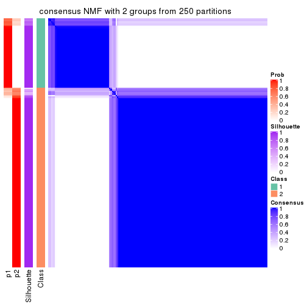</p>

</div>
<div id='tab-CV-NMF-consensus-heatmap-2'>
<pre><code class="r">consensus_heatmap(res, k = 3)
</code></pre>

<p>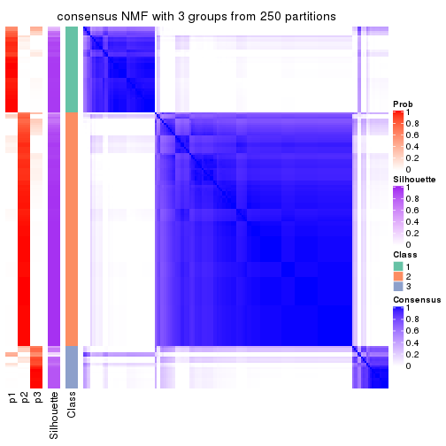</p>

</div>
<div id='tab-CV-NMF-consensus-heatmap-3'>
<pre><code class="r">consensus_heatmap(res, k = 4)
</code></pre>

<p>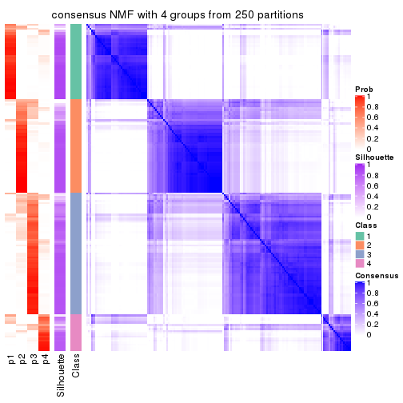</p>

</div>
<div id='tab-CV-NMF-consensus-heatmap-4'>
<pre><code class="r">consensus_heatmap(res, k = 5)
</code></pre>

<p>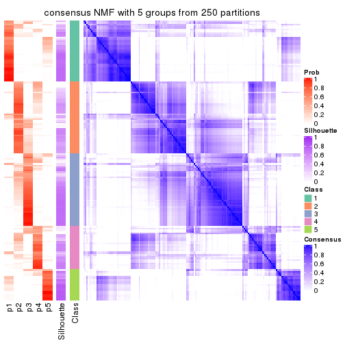</p>

</div>
<div id='tab-CV-NMF-consensus-heatmap-5'>
<pre><code class="r">consensus_heatmap(res, k = 6)
</code></pre>

<p>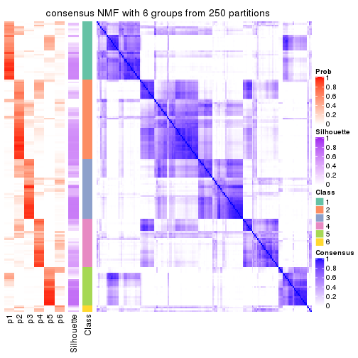</p>

</div>
</div>

Heatmaps for the membership of samples in all partitions to see how consistent they are:


<script>
$( function() {
	$( '#tabs-CV-NMF-membership-heatmap' ).tabs();
} );
</script>
<div id='tabs-CV-NMF-membership-heatmap'>
<ul>
<li><a href='#tab-CV-NMF-membership-heatmap-1'>k = 2</a></li>
<li><a href='#tab-CV-NMF-membership-heatmap-2'>k = 3</a></li>
<li><a href='#tab-CV-NMF-membership-heatmap-3'>k = 4</a></li>
<li><a href='#tab-CV-NMF-membership-heatmap-4'>k = 5</a></li>
<li><a href='#tab-CV-NMF-membership-heatmap-5'>k = 6</a></li>
</ul>
<div id='tab-CV-NMF-membership-heatmap-1'>
<pre><code class="r">membership_heatmap(res, k = 2)
</code></pre>

<p>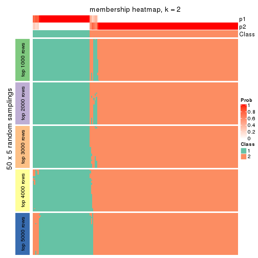</p>

</div>
<div id='tab-CV-NMF-membership-heatmap-2'>
<pre><code class="r">membership_heatmap(res, k = 3)
</code></pre>

<p>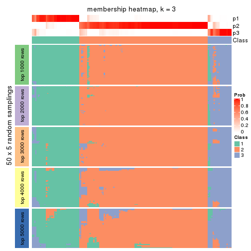</p>

</div>
<div id='tab-CV-NMF-membership-heatmap-3'>
<pre><code class="r">membership_heatmap(res, k = 4)
</code></pre>

<p>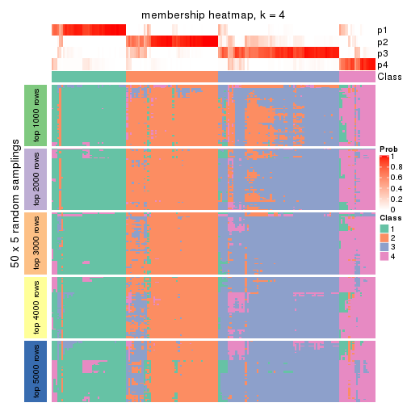</p>

</div>
<div id='tab-CV-NMF-membership-heatmap-4'>
<pre><code class="r">membership_heatmap(res, k = 5)
</code></pre>

<p>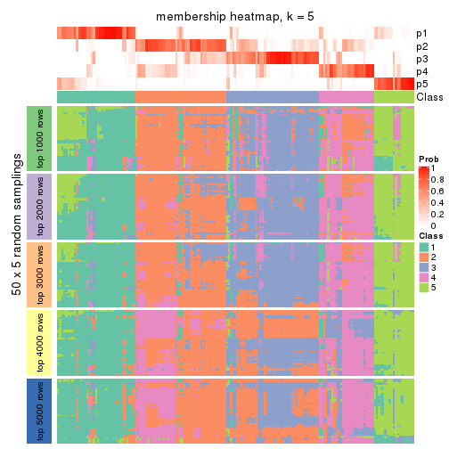</p>

</div>
<div id='tab-CV-NMF-membership-heatmap-5'>
<pre><code class="r">membership_heatmap(res, k = 6)
</code></pre>

<p>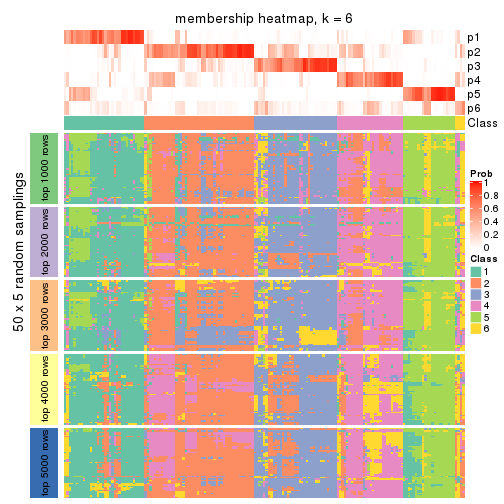</p>

</div>
</div>

As soon as we have had the classes for columns, we can look for signatures
which are significantly different between classes which can be candidate marks
for certain classes. Following are the heatmaps for signatures.


Signature heatmaps where rows are scaled:


<script>
$( function() {
	$( '#tabs-CV-NMF-get-signatures' ).tabs();
} );
</script>
<div id='tabs-CV-NMF-get-signatures'>
<ul>
<li><a href='#tab-CV-NMF-get-signatures-1'>k = 2</a></li>
<li><a href='#tab-CV-NMF-get-signatures-2'>k = 3</a></li>
<li><a href='#tab-CV-NMF-get-signatures-3'>k = 4</a></li>
<li><a href='#tab-CV-NMF-get-signatures-4'>k = 5</a></li>
<li><a href='#tab-CV-NMF-get-signatures-5'>k = 6</a></li>
</ul>
<div id='tab-CV-NMF-get-signatures-1'>
<pre><code class="r">get_signatures(res, k = 2)
</code></pre>

<p>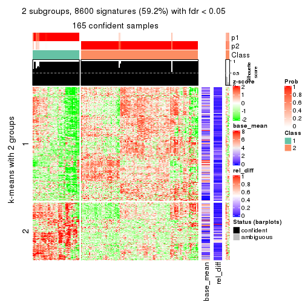</p>

</div>
<div id='tab-CV-NMF-get-signatures-2'>
<pre><code class="r">get_signatures(res, k = 3)
</code></pre>

<p>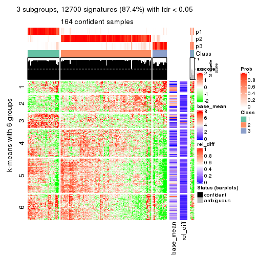</p>

</div>
<div id='tab-CV-NMF-get-signatures-3'>
<pre><code class="r">get_signatures(res, k = 4)
</code></pre>

<p>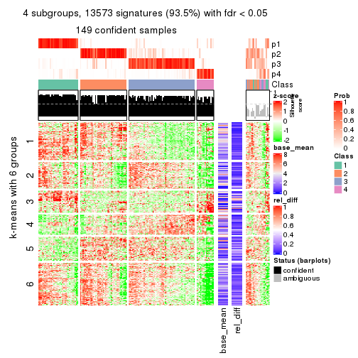</p>

</div>
<div id='tab-CV-NMF-get-signatures-4'>
<pre><code class="r">get_signatures(res, k = 5)
</code></pre>

<p>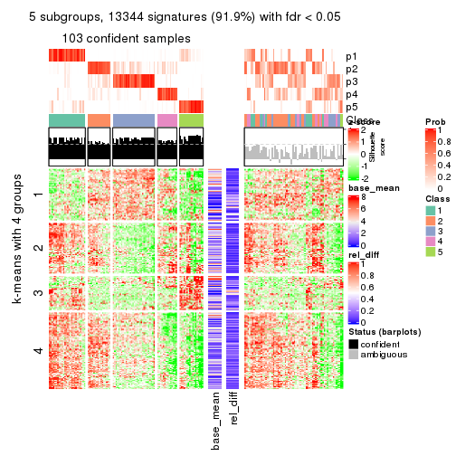</p>

</div>
<div id='tab-CV-NMF-get-signatures-5'>
<pre><code class="r">get_signatures(res, k = 6)
</code></pre>

<p>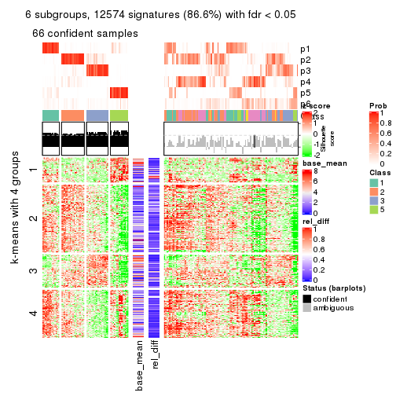</p>

</div>
</div>


Signature heatmaps where rows are not scaled:


<script>
$( function() {
	$( '#tabs-CV-NMF-get-signatures-no-scale' ).tabs();
} );
</script>
<div id='tabs-CV-NMF-get-signatures-no-scale'>
<ul>
<li><a href='#tab-CV-NMF-get-signatures-no-scale-1'>k = 2</a></li>
<li><a href='#tab-CV-NMF-get-signatures-no-scale-2'>k = 3</a></li>
<li><a href='#tab-CV-NMF-get-signatures-no-scale-3'>k = 4</a></li>
<li><a href='#tab-CV-NMF-get-signatures-no-scale-4'>k = 5</a></li>
<li><a href='#tab-CV-NMF-get-signatures-no-scale-5'>k = 6</a></li>
</ul>
<div id='tab-CV-NMF-get-signatures-no-scale-1'>
<pre><code class="r">get_signatures(res, k = 2, scale_rows = FALSE)
</code></pre>

<p>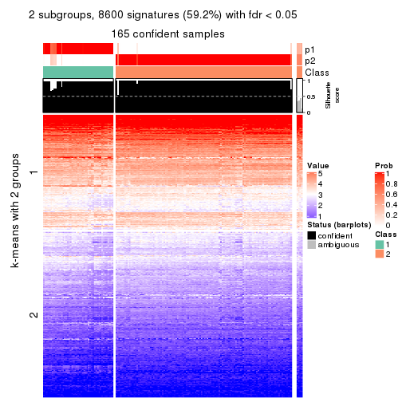</p>

</div>
<div id='tab-CV-NMF-get-signatures-no-scale-2'>
<pre><code class="r">get_signatures(res, k = 3, scale_rows = FALSE)
</code></pre>

<p>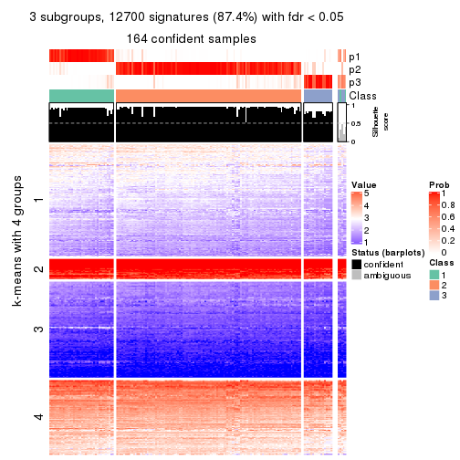</p>

</div>
<div id='tab-CV-NMF-get-signatures-no-scale-3'>
<pre><code class="r">get_signatures(res, k = 4, scale_rows = FALSE)
</code></pre>

<p>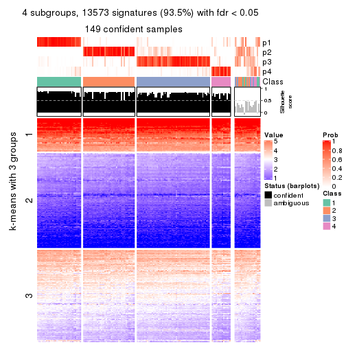</p>

</div>
<div id='tab-CV-NMF-get-signatures-no-scale-4'>
<pre><code class="r">get_signatures(res, k = 5, scale_rows = FALSE)
</code></pre>

<p>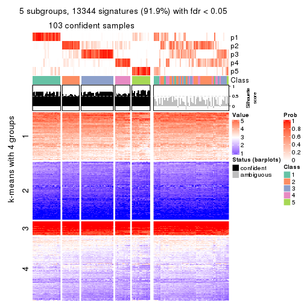</p>

</div>
<div id='tab-CV-NMF-get-signatures-no-scale-5'>
<pre><code class="r">get_signatures(res, k = 6, scale_rows = FALSE)
</code></pre>

<p>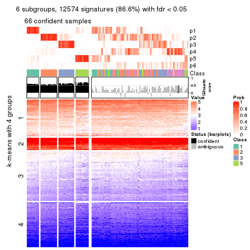</p>

</div>
</div>


Compare the overlap of signatures from different k:

```r
compare_signatures(res)
```

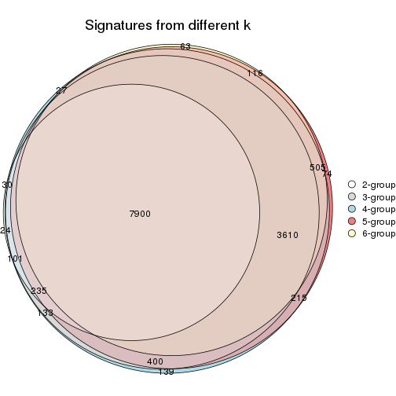

`get_signature()` returns a data frame invisibly. TO get the list of signatures, the function
call should be assigned to a variable explicitly. In following code, if `plot` argument is set
to `FALSE`, no heatmap is plotted while only the differential analysis is performed.

```r
# code only for demonstration
tb = get_signature(res, k = ..., plot = FALSE)
```

An example of the output of `tb` is:

```
#>   which_row         fdr    mean_1    mean_2 scaled_mean_1 scaled_mean_2 km
#> 1        38 0.042760348  8.373488  9.131774    -0.5533452     0.5164555  1
#> 2        40 0.018707592  7.106213  8.469186    -0.6173731     0.5762149  1
#> 3        55 0.019134737 10.221463 11.207825    -0.6159697     0.5749050  1
#> 4        59 0.006059896  5.921854  7.869574    -0.6899429     0.6439467  1
#> 5        60 0.018055526  8.928898 10.211722    -0.6204761     0.5791110  1
#> 6        98 0.009384629 15.714769 14.887706     0.6635654    -0.6193277  2
...
```

The columns in `tb` are:

1. `which_row`: row indices corresponding to the input matrix.
2. `fdr`: FDR for the differential test. 
3. `mean_x`: The mean value in group x.
4. `scaled_mean_x`: The mean value in group x after rows are scaled.
5. `km`: Row groups if k-means clustering is applied to rows.


UMAP plot which shows how samples are separated.


<script>
$( function() {
	$( '#tabs-CV-NMF-dimension-reduction' ).tabs();
} );
</script>
<div id='tabs-CV-NMF-dimension-reduction'>
<ul>
<li><a href='#tab-CV-NMF-dimension-reduction-1'>k = 2</a></li>
<li><a href='#tab-CV-NMF-dimension-reduction-2'>k = 3</a></li>
<li><a href='#tab-CV-NMF-dimension-reduction-3'>k = 4</a></li>
<li><a href='#tab-CV-NMF-dimension-reduction-4'>k = 5</a></li>
<li><a href='#tab-CV-NMF-dimension-reduction-5'>k = 6</a></li>
</ul>
<div id='tab-CV-NMF-dimension-reduction-1'>
<pre><code class="r">dimension_reduction(res, k = 2, method = &quot;UMAP&quot;)
</code></pre>

<p>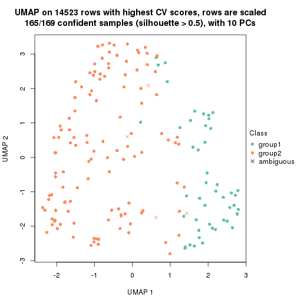</p>

</div>
<div id='tab-CV-NMF-dimension-reduction-2'>
<pre><code class="r">dimension_reduction(res, k = 3, method = &quot;UMAP&quot;)
</code></pre>

<p>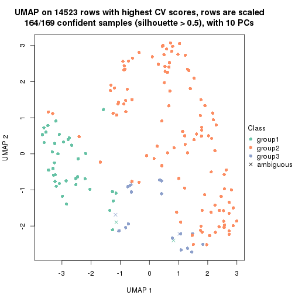</p>

</div>
<div id='tab-CV-NMF-dimension-reduction-3'>
<pre><code class="r">dimension_reduction(res, k = 4, method = &quot;UMAP&quot;)
</code></pre>

<p>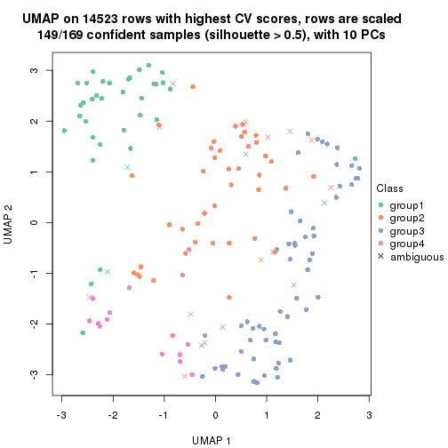</p>

</div>
<div id='tab-CV-NMF-dimension-reduction-4'>
<pre><code class="r">dimension_reduction(res, k = 5, method = &quot;UMAP&quot;)
</code></pre>

<p>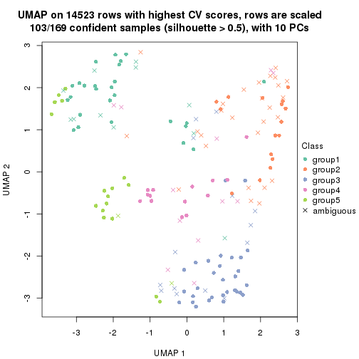</p>

</div>
<div id='tab-CV-NMF-dimension-reduction-5'>
<pre><code class="r">dimension_reduction(res, k = 6, method = &quot;UMAP&quot;)
</code></pre>

<p>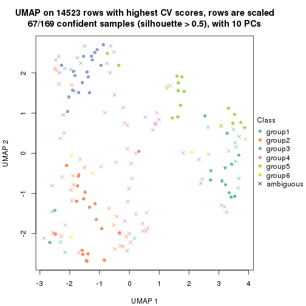</p>

</div>
</div>


Following heatmap shows how subgroups are split when increasing `k`:

```r
collect_classes(res)
```

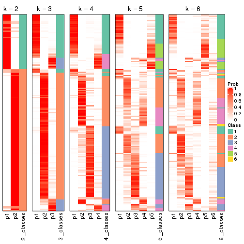


If matrix rows can be associated to genes, consider to use `GO_Enrichment(res,
...)` to perform function enrichment for the signature genes.


 

---------------------------------------------------


### MAD:hclust


The object with results only for a single top-value method and a single partition method 
can be extracted as:

```r
res = res_list["MAD", "hclust"]
# you can also extract it by
# res = res_list["MAD:hclust"]
```

A summary of `res` and all the functions that can be applied to it:

```r
res
```

```
#> A 'ConsensusPartition' object with k = 2, 3, 4, 5, 6.
#>   On a matrix with 14523 rows and 169 columns.
#>   Top rows (1000, 2000, 3000, 4000, 5000) are extracted by 'MAD' method.
#>   Subgroups are detected by 'hclust' method.
#>   Performed in total 1250 partitions by row resampling.
#>   Best k for subgroups seems to be 2.
#> 
#> Following methods can be applied to this 'ConsensusPartition' object:
#>  [1] "cola_report"             "collect_classes"         "collect_plots"          
#>  [4] "collect_stats"           "colnames"                "compare_signatures"     
#>  [7] "consensus_heatmap"       "dimension_reduction"     "functional_enrichment"  
#> [10] "get_anno_col"            "get_anno"                "get_classes"            
#> [13] "get_consensus"           "get_matrix"              "get_membership"         
#> [16] "get_param"               "get_signatures"          "get_stats"              
#> [19] "is_best_k"               "is_stable_k"             "membership_heatmap"     
#> [22] "ncol"                    "nrow"                    "plot_ecdf"              
#> [25] "rownames"                "select_partition_number" "show"                   
#> [28] "suggest_best_k"          "test_to_known_factors"
```

`collect_plots()` function collects all the plots made from `res` for all `k` (number of partitions)
into one single page to provide an easy and fast comparison between different `k`.

```r
collect_plots(res)
```

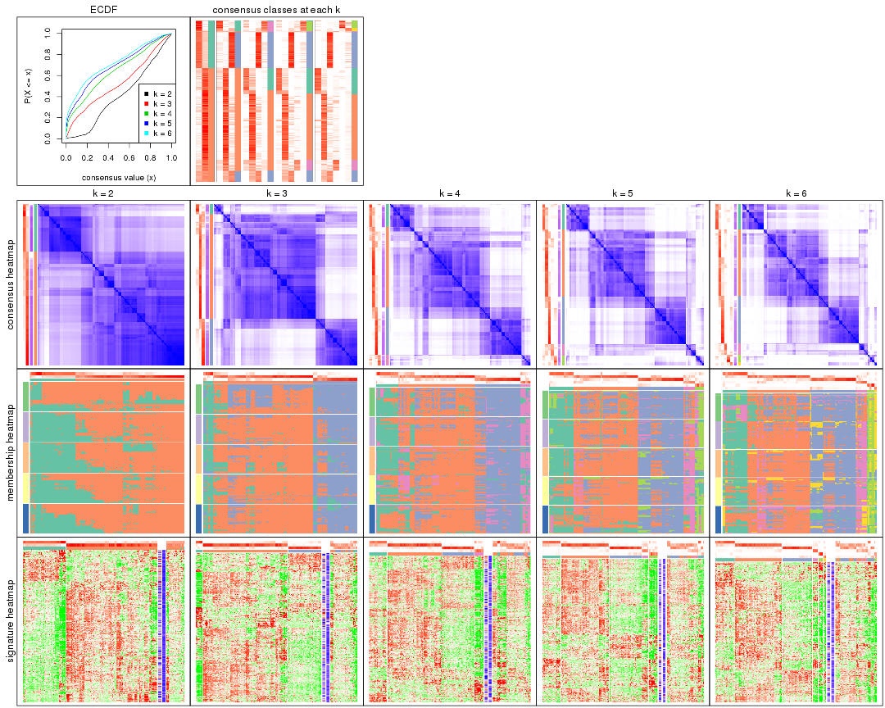

The plots are:

- The first row: a plot of the ECDF (Empirical cumulative distribution
  function) curves of the consensus matrix for each `k` and the heatmap of
  predicted classes for each `k`.
- The second row: heatmaps of the consensus matrix for each `k`.
- The third row: heatmaps of the membership matrix for each `k`.
- The fouth row: heatmaps of the signatures for each `k`.

All the plots in panels can be made by individual functions and they are
plotted later in this section.

`select_partition_number()` produces several plots showing different
statistics for choosing "optimized" `k`. There are following statistics:

- ECDF curves of the consensus matrix for each `k`;
- 1-PAC. [The PAC
  score](https://en.wikipedia.org/wiki/Consensus_clustering#Over-interpretation_potential_of_consensus_clustering)
  measures the proportion of the ambiguous subgrouping.
- Mean silhouette score.
- Concordance. The mean probability of fiting the consensus class ids in all
  partitions.
- Area increased. Denote $A_k$ as the area under the ECDF curve for current
  `k`, the area increased is defined as $A_k - A_{k-1}$.
- Rand index. The percent of pairs of samples that are both in a same cluster
  or both are not in a same cluster in the partition of k and k-1.
- Jaccard index. The ratio of pairs of samples are both in a same cluster in
  the partition of k and k-1 and the pairs of samples are both in a same
  cluster in the partition k or k-1.

The detailed explanations of these statistics can be found in [the cola
vignette](http://bioconductor.org/packages/devel/bioc/vignettes/cola/inst/doc/cola.html#toc_13).

Generally speaking, lower PAC score, higher mean silhouette score or higher
concordance corresponds to better partition. Rand index and Jaccard index
measure how similar the current partition is compared to partition with `k-1`.
If they are too similar, we won't accept `k` is better than `k-1`.

```r
select_partition_number(res)
```

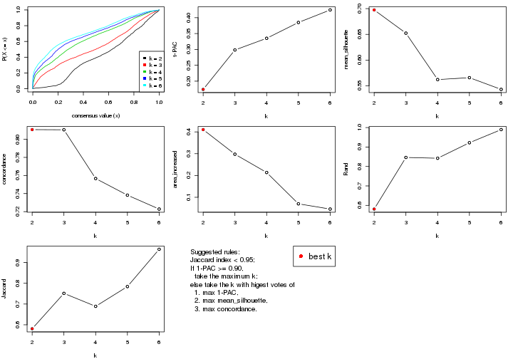

The numeric values for all these statistics can be obtained by `get_stats()`.

```r
get_stats(res)
```

```
#>   k 1-PAC mean_silhouette concordance area_increased  Rand Jaccard
#> 2 2 0.174           0.697       0.811         0.4105 0.581   0.581
#> 3 3 0.298           0.652       0.811         0.2977 0.846   0.751
#> 4 4 0.335           0.562       0.757         0.2137 0.842   0.689
#> 5 5 0.385           0.566       0.738         0.0700 0.922   0.784
#> 6 6 0.424           0.543       0.723         0.0459 0.990   0.964
```

`suggest_best_k()` suggests the best $k$ based on these statistics. The rules are as follows:

- All $k$ with Jaccard index larger than 0.95 are removed because the increase of
  the partition number does not provides enough extra information. If all $k$ are removed,
  the best $k$ is assigned by `NA`.
- For $k$ with 1-PAC larger than 0.9, the maximal $k$ is taken as the "best k". Other $k$ is called "optional k".
- If it does not fit the second rule. The $k$ with the highest vote of highest
  1-PAC, mean silhouette and concordance is taken as the "best k".

```r
suggest_best_k(res)
```

```
#> [1] 2
```


Following shows the table of the partitions (You need to click the **show/hide
code output** link to see it). The membership matrix (columns with name `p*`)
is inferred by
[`clue::cl_consensus()`](https://www.rdocumentation.org/link/cl_consensus?package=clue)
function with the `SE` method. Basically the value in the membership matrix
represents the probability to belong to a certain group. The finall class
label for an item is determined with the group with highest probability it
belongs to.

In `get_classes()` function, the entropy is calculated from the membership
matrix and the silhouette score is calculated from the consensus matrix.


<script>
$( function() {
	$( '#tabs-MAD-hclust-get-classes' ).tabs();
} );
</script>
<div id='tabs-MAD-hclust-get-classes'>
<ul>
<li><a href='#tab-MAD-hclust-get-classes-1'>k = 2</a></li>
<li><a href='#tab-MAD-hclust-get-classes-2'>k = 3</a></li>
<li><a href='#tab-MAD-hclust-get-classes-3'>k = 4</a></li>
<li><a href='#tab-MAD-hclust-get-classes-4'>k = 5</a></li>
<li><a href='#tab-MAD-hclust-get-classes-5'>k = 6</a></li>
</ul>

<div id='tab-MAD-hclust-get-classes-1'>
<p><a id='tab-MAD-hclust-get-classes-1-a' style='color:#0366d6' href='#'>show/hide code output</a></p>
<pre><code class="r">cbind(get_classes(res, k = 2), get_membership(res, k = 2))
</code></pre>

<pre><code>#&gt;            class entropy silhouette    p1    p2
#&gt; SRR2052702     2  0.0672     0.7926 0.008 0.992
#&gt; SRR2052701     2  0.0000     0.7904 0.000 1.000
#&gt; SRR2052700     2  0.3114     0.7973 0.056 0.944
#&gt; SRR2052699     2  0.5059     0.7701 0.112 0.888
#&gt; SRR2052698     2  0.9996    -0.2129 0.488 0.512
#&gt; SRR2052708     2  0.7139     0.7081 0.196 0.804
#&gt; SRR2052749     2  0.7139     0.7081 0.196 0.804
#&gt; SRR2052786     2  0.5629     0.7644 0.132 0.868
#&gt; SRR2052825     2  0.7815     0.6608 0.232 0.768
#&gt; SRR2052824     2  0.8081     0.6552 0.248 0.752
#&gt; SRR2052823     2  0.0938     0.7941 0.012 0.988
#&gt; SRR2052822     2  0.9358     0.3723 0.352 0.648
#&gt; SRR2052821     2  0.5178     0.7848 0.116 0.884
#&gt; SRR2052820     1  0.7745     0.8543 0.772 0.228
#&gt; SRR2052819     2  0.8813     0.6158 0.300 0.700
#&gt; SRR2052818     2  0.0000     0.7904 0.000 1.000
#&gt; SRR2052817     2  0.9954    -0.0782 0.460 0.540
#&gt; SRR2052816     2  0.5178     0.7747 0.116 0.884
#&gt; SRR2052815     2  0.7815     0.6608 0.232 0.768
#&gt; SRR2052814     2  0.4022     0.7923 0.080 0.920
#&gt; SRR2052813     2  0.8499     0.5642 0.276 0.724
#&gt; SRR2052812     2  0.0376     0.7914 0.004 0.996
#&gt; SRR2052811     2  0.0376     0.7914 0.004 0.996
#&gt; SRR2052810     2  0.4690     0.7746 0.100 0.900
#&gt; SRR2052809     2  0.9087     0.4561 0.324 0.676
#&gt; SRR2052808     2  0.8443     0.6402 0.272 0.728
#&gt; SRR2052807     1  0.0376     0.6896 0.996 0.004
#&gt; SRR2052806     2  0.8955     0.5896 0.312 0.688
#&gt; SRR2052805     2  0.8763     0.6112 0.296 0.704
#&gt; SRR2052804     1  0.9944     0.0285 0.544 0.456
#&gt; SRR2052803     2  0.8763     0.6112 0.296 0.704
#&gt; SRR2052802     1  0.0672     0.6982 0.992 0.008
#&gt; SRR2052801     1  0.6887     0.6194 0.816 0.184
#&gt; SRR2052800     1  0.0672     0.6982 0.992 0.008
#&gt; SRR2052799     1  0.0376     0.6896 0.996 0.004
#&gt; SRR2052798     2  0.7139     0.7081 0.196 0.804
#&gt; SRR2052797     2  0.6343     0.7407 0.160 0.840
#&gt; SRR2052796     1  0.6887     0.6194 0.816 0.184
#&gt; SRR2052795     2  0.7139     0.7081 0.196 0.804
#&gt; SRR2052794     1  0.0000     0.6903 1.000 0.000
#&gt; SRR2052793     1  0.8763     0.4620 0.704 0.296
#&gt; SRR2052792     1  0.1633     0.7119 0.976 0.024
#&gt; SRR2052791     1  0.6048     0.7419 0.852 0.148
#&gt; SRR2052790     2  0.9963    -0.0793 0.464 0.536
#&gt; SRR2052789     1  0.8327     0.8462 0.736 0.264
#&gt; SRR2052788     1  0.8327     0.8462 0.736 0.264
#&gt; SRR2052787     2  0.5842     0.7574 0.140 0.860
#&gt; SRR2052785     2  0.9866     0.0694 0.432 0.568
#&gt; SRR2052784     2  0.9358     0.3688 0.352 0.648
#&gt; SRR2052783     2  0.9661     0.2354 0.392 0.608
#&gt; SRR2052782     2  0.8499     0.5642 0.276 0.724
#&gt; SRR2052781     2  0.9635     0.2520 0.388 0.612
#&gt; SRR2052780     1  0.8144     0.8522 0.748 0.252
#&gt; SRR2052777     2  0.7745     0.6497 0.228 0.772
#&gt; SRR2052779     2  0.8499     0.5642 0.276 0.724
#&gt; SRR2052778     1  0.8016     0.8559 0.756 0.244
#&gt; SRR2052776     2  0.9933    -0.0359 0.452 0.548
#&gt; SRR2052775     1  0.8555     0.8318 0.720 0.280
#&gt; SRR2052773     1  0.9000     0.7817 0.684 0.316
#&gt; SRR2052772     1  0.8144     0.8531 0.748 0.252
#&gt; SRR2052774     1  0.9000     0.7817 0.684 0.316
#&gt; SRR2052771     1  0.6048     0.7419 0.852 0.148
#&gt; SRR2052769     1  0.8661     0.8216 0.712 0.288
#&gt; SRR2052770     1  0.8081     0.8546 0.752 0.248
#&gt; SRR2052768     2  0.3114     0.7958 0.056 0.944
#&gt; SRR2052767     2  0.0672     0.7926 0.008 0.992
#&gt; SRR2052766     1  0.7056     0.8368 0.808 0.192
#&gt; SRR2052765     2  0.4161     0.7880 0.084 0.916
#&gt; SRR2052763     1  0.7745     0.8565 0.772 0.228
#&gt; SRR2052764     2  0.0000     0.7904 0.000 1.000
#&gt; SRR2052761     1  0.7745     0.8543 0.772 0.228
#&gt; SRR2052760     2  0.4431     0.7855 0.092 0.908
#&gt; SRR2052759     1  0.7745     0.8565 0.772 0.228
#&gt; SRR2052762     2  0.6801     0.7104 0.180 0.820
#&gt; SRR2052758     1  0.8861     0.8020 0.696 0.304
#&gt; SRR2052756     2  0.1843     0.7964 0.028 0.972
#&gt; SRR2052757     2  0.9970    -0.1245 0.468 0.532
#&gt; SRR2052755     2  0.3733     0.7794 0.072 0.928
#&gt; SRR2052754     2  0.9580     0.4499 0.380 0.620
#&gt; SRR2052753     2  0.3431     0.7823 0.064 0.936
#&gt; SRR2052752     2  0.8861     0.6022 0.304 0.696
#&gt; SRR2052750     2  0.2603     0.7832 0.044 0.956
#&gt; SRR2052751     2  0.8555     0.5566 0.280 0.720
#&gt; SRR2052748     1  0.7056     0.8396 0.808 0.192
#&gt; SRR2052747     2  0.7139     0.7091 0.196 0.804
#&gt; SRR2052746     1  0.7745     0.8565 0.772 0.228
#&gt; SRR2052745     1  0.7745     0.8565 0.772 0.228
#&gt; SRR2052744     2  0.1414     0.7921 0.020 0.980
#&gt; SRR2052741     2  0.4298     0.7797 0.088 0.912
#&gt; SRR2052743     2  0.5408     0.7639 0.124 0.876
#&gt; SRR2052740     2  0.4298     0.7797 0.088 0.912
#&gt; SRR2052742     2  0.8661     0.5356 0.288 0.712
#&gt; SRR2052739     2  0.4161     0.7880 0.084 0.916
#&gt; SRR2052738     1  0.7745     0.8565 0.772 0.228
#&gt; SRR2052736     2  0.0376     0.7899 0.004 0.996
#&gt; SRR2052735     2  0.0376     0.7899 0.004 0.996
#&gt; SRR2052734     2  0.0000     0.7904 0.000 1.000
#&gt; SRR2052737     2  0.4815     0.7810 0.104 0.896
#&gt; SRR2052733     1  0.8081     0.8546 0.752 0.248
#&gt; SRR2052732     2  0.0000     0.7904 0.000 1.000
#&gt; SRR2052731     1  0.8267     0.8487 0.740 0.260
#&gt; SRR2052729     2  0.3879     0.7777 0.076 0.924
#&gt; SRR2052728     2  0.1414     0.7880 0.020 0.980
#&gt; SRR2052730     2  0.9552     0.4392 0.376 0.624
#&gt; SRR2052727     2  0.5059     0.7576 0.112 0.888
#&gt; SRR2052725     2  0.0376     0.7899 0.004 0.996
#&gt; SRR2052726     2  0.0376     0.7899 0.004 0.996
#&gt; SRR2052724     2  0.7139     0.7081 0.196 0.804
#&gt; SRR2052723     1  0.6973     0.8368 0.812 0.188
#&gt; SRR2052722     1  0.8861     0.8001 0.696 0.304
#&gt; SRR2052721     2  0.3431     0.7811 0.064 0.936
#&gt; SRR2052720     2  0.5737     0.7608 0.136 0.864
#&gt; SRR2052719     2  0.2948     0.7949 0.052 0.948
#&gt; SRR2052718     2  0.0672     0.7893 0.008 0.992
#&gt; SRR2052717     2  0.6801     0.7104 0.180 0.820
#&gt; SRR2052714     2  0.7219     0.7077 0.200 0.800
#&gt; SRR2052716     1  0.7745     0.8543 0.772 0.228
#&gt; SRR2052715     1  0.8207     0.8511 0.744 0.256
#&gt; SRR2052713     2  0.4562     0.7687 0.096 0.904
#&gt; SRR2052712     2  0.7528     0.6855 0.216 0.784
#&gt; SRR2052711     2  0.1843     0.7964 0.028 0.972
#&gt; SRR2052710     2  0.4431     0.7888 0.092 0.908
#&gt; SRR2052707     1  0.8144     0.8541 0.748 0.252
#&gt; SRR2052709     1  0.8207     0.8511 0.744 0.256
#&gt; SRR2052704     1  0.7139     0.8401 0.804 0.196
#&gt; SRR2052705     2  0.5629     0.7578 0.132 0.868
#&gt; SRR2052697     2  0.0376     0.7914 0.004 0.996
#&gt; SRR2052703     1  0.9000     0.7817 0.684 0.316
#&gt; SRR2052696     2  0.5519     0.7499 0.128 0.872
#&gt; SRR2052706     2  0.5059     0.7868 0.112 0.888
#&gt; SRR2052695     2  0.5059     0.7785 0.112 0.888
#&gt; SRR2052694     2  0.4431     0.7855 0.092 0.908
#&gt; SRR2052692     1  0.8861     0.8020 0.696 0.304
#&gt; SRR2052693     2  1.0000    -0.2490 0.496 0.504
#&gt; SRR2052691     2  0.5059     0.7755 0.112 0.888
#&gt; SRR2052690     2  0.4562     0.7762 0.096 0.904
#&gt; SRR2052689     2  0.9522     0.4511 0.372 0.628
#&gt; SRR2052687     2  0.8608     0.6100 0.284 0.716
#&gt; SRR2052686     2  0.0000     0.7904 0.000 1.000
#&gt; SRR2052688     2  0.4815     0.7810 0.104 0.896
#&gt; SRR2052684     1  0.4562     0.7694 0.904 0.096
#&gt; SRR2052685     2  0.2778     0.7965 0.048 0.952
#&gt; SRR2052683     2  0.9850     0.3685 0.428 0.572
#&gt; SRR2052681     2  0.2603     0.7968 0.044 0.956
#&gt; SRR2052680     2  0.7815     0.6608 0.232 0.768
#&gt; SRR2052682     2  0.0000     0.7904 0.000 1.000
#&gt; SRR2052679     2  0.5059     0.7576 0.112 0.888
#&gt; SRR2052678     1  0.8499     0.8352 0.724 0.276
#&gt; SRR2052677     2  0.9248     0.4094 0.340 0.660
#&gt; SRR2052675     2  0.0376     0.7914 0.004 0.996
#&gt; SRR2052676     2  0.2603     0.7861 0.044 0.956
#&gt; SRR2052674     2  0.6148     0.7570 0.152 0.848
#&gt; SRR2052672     1  0.8386     0.8428 0.732 0.268
#&gt; SRR2052673     2  0.0000     0.7904 0.000 1.000
#&gt; SRR2052671     2  0.2603     0.7956 0.044 0.956
#&gt; SRR2052670     1  0.8267     0.8487 0.740 0.260
#&gt; SRR2052669     2  0.5519     0.7667 0.128 0.872
#&gt; SRR2052668     2  0.5178     0.7735 0.116 0.884
#&gt; SRR2052667     2  0.5059     0.7792 0.112 0.888
#&gt; SRR2052666     1  0.8608     0.8249 0.716 0.284
#&gt; SRR2052665     2  0.5946     0.7526 0.144 0.856
#&gt; SRR2052664     2  0.9580     0.4499 0.380 0.620
#&gt; SRR2052663     2  0.0000     0.7904 0.000 1.000
#&gt; SRR2052662     2  0.5519     0.7672 0.128 0.872
#&gt; SRR2052661     2  0.1414     0.7880 0.020 0.980
#&gt; SRR2052660     1  0.8861     0.8020 0.696 0.304
#&gt; SRR2052659     1  0.7745     0.8563 0.772 0.228
#&gt; SRR2052658     2  0.5178     0.7689 0.116 0.884
#&gt; SRR2052657     2  0.6973     0.7158 0.188 0.812
</code></pre>

<script>
$('#tab-MAD-hclust-get-classes-1-a').parent().next().next().hide();
$('#tab-MAD-hclust-get-classes-1-a').click(function(){
  $('#tab-MAD-hclust-get-classes-1-a').parent().next().next().toggle();
  return(false);
});
</script>
</div>

<div id='tab-MAD-hclust-get-classes-2'>
<p><a id='tab-MAD-hclust-get-classes-2-a' style='color:#0366d6' href='#'>show/hide code output</a></p>
<pre><code class="r">cbind(get_classes(res, k = 3), get_membership(res, k = 3))
</code></pre>

<pre><code>#&gt;            class entropy silhouette    p1    p2    p3
#&gt; SRR2052702     2  0.2165     0.7987 0.000 0.936 0.064
#&gt; SRR2052701     2  0.1031     0.7943 0.000 0.976 0.024
#&gt; SRR2052700     2  0.3499     0.7986 0.028 0.900 0.072
#&gt; SRR2052699     2  0.4782     0.7564 0.016 0.820 0.164
#&gt; SRR2052698     3  0.6422     0.4654 0.016 0.324 0.660
#&gt; SRR2052708     2  0.5092     0.6852 0.176 0.804 0.020
#&gt; SRR2052749     2  0.5092     0.6852 0.176 0.804 0.020
#&gt; SRR2052786     2  0.5201     0.7106 0.004 0.760 0.236
#&gt; SRR2052825     2  0.6276     0.6563 0.224 0.736 0.040
#&gt; SRR2052824     2  0.6853     0.6505 0.224 0.712 0.064
#&gt; SRR2052823     2  0.2165     0.7993 0.000 0.936 0.064
#&gt; SRR2052822     3  0.6950    -0.0463 0.016 0.476 0.508
#&gt; SRR2052821     2  0.5305     0.7506 0.020 0.788 0.192
#&gt; SRR2052820     3  0.5119     0.6404 0.152 0.032 0.816
#&gt; SRR2052819     2  0.8532     0.5892 0.224 0.608 0.168
#&gt; SRR2052818     2  0.1267     0.7943 0.004 0.972 0.024
#&gt; SRR2052817     3  0.6473     0.4420 0.016 0.332 0.652
#&gt; SRR2052816     2  0.4925     0.7742 0.080 0.844 0.076
#&gt; SRR2052815     2  0.6276     0.6563 0.224 0.736 0.040
#&gt; SRR2052814     2  0.4473     0.7681 0.008 0.828 0.164
#&gt; SRR2052813     2  0.6859     0.3446 0.016 0.564 0.420
#&gt; SRR2052812     2  0.1964     0.7981 0.000 0.944 0.056
#&gt; SRR2052811     2  0.1964     0.7981 0.000 0.944 0.056
#&gt; SRR2052810     2  0.4045     0.7698 0.104 0.872 0.024
#&gt; SRR2052809     2  0.6944     0.1857 0.016 0.516 0.468
#&gt; SRR2052808     2  0.7851     0.6114 0.100 0.644 0.256
#&gt; SRR2052807     1  0.1765     0.7317 0.956 0.004 0.040
#&gt; SRR2052806     2  0.5958     0.5590 0.300 0.692 0.008
#&gt; SRR2052805     2  0.5986     0.5774 0.284 0.704 0.012
#&gt; SRR2052804     2  0.9853    -0.1191 0.344 0.400 0.256
#&gt; SRR2052803     2  0.5986     0.5774 0.284 0.704 0.012
#&gt; SRR2052802     1  0.4178     0.7030 0.828 0.000 0.172
#&gt; SRR2052801     1  0.5455     0.6654 0.788 0.184 0.028
#&gt; SRR2052800     1  0.4178     0.7030 0.828 0.000 0.172
#&gt; SRR2052799     1  0.1765     0.7317 0.956 0.004 0.040
#&gt; SRR2052798     2  0.5092     0.6852 0.176 0.804 0.020
#&gt; SRR2052797     2  0.5580     0.6887 0.008 0.736 0.256
#&gt; SRR2052796     1  0.5455     0.6654 0.788 0.184 0.028
#&gt; SRR2052795     2  0.5092     0.6852 0.176 0.804 0.020
#&gt; SRR2052794     1  0.1411     0.7300 0.964 0.000 0.036
#&gt; SRR2052793     1  0.6852     0.4923 0.664 0.300 0.036
#&gt; SRR2052792     1  0.6140     0.4260 0.596 0.000 0.404
#&gt; SRR2052791     1  0.8608     0.4251 0.512 0.104 0.384
#&gt; SRR2052790     3  0.6448     0.3889 0.012 0.352 0.636
#&gt; SRR2052789     3  0.1877     0.7355 0.012 0.032 0.956
#&gt; SRR2052788     3  0.1877     0.7355 0.012 0.032 0.956
#&gt; SRR2052787     2  0.5285     0.7022 0.004 0.752 0.244
#&gt; SRR2052785     3  0.6704     0.3198 0.016 0.376 0.608
#&gt; SRR2052784     3  0.6952    -0.0549 0.016 0.480 0.504
#&gt; SRR2052783     3  0.6888     0.1404 0.016 0.432 0.552
#&gt; SRR2052782     2  0.6859     0.3446 0.016 0.564 0.420
#&gt; SRR2052781     3  0.6919     0.0756 0.016 0.448 0.536
#&gt; SRR2052780     3  0.1620     0.7320 0.012 0.024 0.964
#&gt; SRR2052777     2  0.6548     0.4747 0.012 0.616 0.372
#&gt; SRR2052779     2  0.6859     0.3446 0.016 0.564 0.420
#&gt; SRR2052778     3  0.3370     0.7108 0.072 0.024 0.904
#&gt; SRR2052776     3  0.6667     0.3495 0.016 0.368 0.616
#&gt; SRR2052775     3  0.2446     0.7368 0.012 0.052 0.936
#&gt; SRR2052773     3  0.3771     0.7024 0.012 0.112 0.876
#&gt; SRR2052772     3  0.2793     0.7272 0.044 0.028 0.928
#&gt; SRR2052774     3  0.3771     0.7024 0.012 0.112 0.876
#&gt; SRR2052771     1  0.8608     0.4251 0.512 0.104 0.384
#&gt; SRR2052769     3  0.3742     0.7250 0.036 0.072 0.892
#&gt; SRR2052770     3  0.2793     0.7271 0.044 0.028 0.928
#&gt; SRR2052768     2  0.3551     0.7864 0.000 0.868 0.132
#&gt; SRR2052767     2  0.2165     0.7987 0.000 0.936 0.064
#&gt; SRR2052766     3  0.5763     0.5074 0.244 0.016 0.740
#&gt; SRR2052765     2  0.4291     0.7579 0.000 0.820 0.180
#&gt; SRR2052763     3  0.3445     0.6969 0.088 0.016 0.896
#&gt; SRR2052764     2  0.1267     0.7943 0.004 0.972 0.024
#&gt; SRR2052761     3  0.5119     0.6404 0.152 0.032 0.816
#&gt; SRR2052760     2  0.4399     0.7527 0.000 0.812 0.188
#&gt; SRR2052759     3  0.3445     0.6969 0.088 0.016 0.896
#&gt; SRR2052762     2  0.6062     0.6396 0.016 0.708 0.276
#&gt; SRR2052758     3  0.2866     0.7248 0.008 0.076 0.916
#&gt; SRR2052756     2  0.1999     0.7985 0.012 0.952 0.036
#&gt; SRR2052757     3  0.6521     0.4248 0.016 0.340 0.644
#&gt; SRR2052755     2  0.2261     0.7628 0.068 0.932 0.000
#&gt; SRR2052754     2  0.6629     0.4218 0.360 0.624 0.016
#&gt; SRR2052753     2  0.2066     0.7662 0.060 0.940 0.000
#&gt; SRR2052752     2  0.6161     0.5700 0.288 0.696 0.016
#&gt; SRR2052750     2  0.1647     0.7753 0.036 0.960 0.004
#&gt; SRR2052751     2  0.6704     0.4388 0.016 0.608 0.376
#&gt; SRR2052748     3  0.5171     0.5696 0.204 0.012 0.784
#&gt; SRR2052747     2  0.4808     0.6805 0.188 0.804 0.008
#&gt; SRR2052746     3  0.3445     0.6969 0.088 0.016 0.896
#&gt; SRR2052745     3  0.3445     0.6969 0.088 0.016 0.896
#&gt; SRR2052744     2  0.1337     0.7934 0.012 0.972 0.016
#&gt; SRR2052741     2  0.4209     0.7746 0.016 0.856 0.128
#&gt; SRR2052743     2  0.5269     0.7346 0.016 0.784 0.200
#&gt; SRR2052740     2  0.4209     0.7746 0.016 0.856 0.128
#&gt; SRR2052742     2  0.6769     0.4003 0.016 0.592 0.392
#&gt; SRR2052739     2  0.4291     0.7579 0.000 0.820 0.180
#&gt; SRR2052738     3  0.3769     0.6856 0.104 0.016 0.880
#&gt; SRR2052736     2  0.0747     0.7923 0.000 0.984 0.016
#&gt; SRR2052735     2  0.0747     0.7923 0.000 0.984 0.016
#&gt; SRR2052734     2  0.0892     0.7934 0.000 0.980 0.020
#&gt; SRR2052737     2  0.4555     0.7450 0.000 0.800 0.200
#&gt; SRR2052733     3  0.2793     0.7271 0.044 0.028 0.928
#&gt; SRR2052732     2  0.1267     0.7943 0.004 0.972 0.024
#&gt; SRR2052731     3  0.1751     0.7336 0.012 0.028 0.960
#&gt; SRR2052729     2  0.2356     0.7606 0.072 0.928 0.000
#&gt; SRR2052728     2  0.1182     0.7841 0.012 0.976 0.012
#&gt; SRR2052730     2  0.9173     0.3670 0.176 0.520 0.304
#&gt; SRR2052727     2  0.3272     0.7403 0.104 0.892 0.004
#&gt; SRR2052725     2  0.0592     0.7913 0.000 0.988 0.012
#&gt; SRR2052726     2  0.0747     0.7923 0.000 0.984 0.016
#&gt; SRR2052724     2  0.5092     0.6852 0.176 0.804 0.020
#&gt; SRR2052723     3  0.5268     0.5527 0.212 0.012 0.776
#&gt; SRR2052722     3  0.3295     0.7153 0.008 0.096 0.896
#&gt; SRR2052721     2  0.2200     0.7658 0.056 0.940 0.004
#&gt; SRR2052720     2  0.5244     0.7061 0.004 0.756 0.240
#&gt; SRR2052719     2  0.3816     0.7749 0.000 0.852 0.148
#&gt; SRR2052718     2  0.0983     0.7929 0.004 0.980 0.016
#&gt; SRR2052717     2  0.6062     0.6396 0.016 0.708 0.276
#&gt; SRR2052714     2  0.5223     0.6868 0.176 0.800 0.024
#&gt; SRR2052716     3  0.5119     0.6404 0.152 0.032 0.816
#&gt; SRR2052715     3  0.1751     0.7339 0.012 0.028 0.960
#&gt; SRR2052713     2  0.2945     0.7494 0.088 0.908 0.004
#&gt; SRR2052712     2  0.6154     0.6791 0.204 0.752 0.044
#&gt; SRR2052711     2  0.2116     0.7988 0.012 0.948 0.040
#&gt; SRR2052710     2  0.4346     0.7599 0.000 0.816 0.184
#&gt; SRR2052707     3  0.3213     0.7240 0.060 0.028 0.912
#&gt; SRR2052709     3  0.1751     0.7339 0.012 0.028 0.960
#&gt; SRR2052704     3  0.5147     0.6088 0.180 0.020 0.800
#&gt; SRR2052705     2  0.5414     0.7235 0.016 0.772 0.212
#&gt; SRR2052697     2  0.1289     0.7952 0.000 0.968 0.032
#&gt; SRR2052703     3  0.3695     0.7054 0.012 0.108 0.880
#&gt; SRR2052696     2  0.3755     0.7280 0.120 0.872 0.008
#&gt; SRR2052706     2  0.5253     0.7540 0.020 0.792 0.188
#&gt; SRR2052695     2  0.4654     0.7403 0.000 0.792 0.208
#&gt; SRR2052694     2  0.4399     0.7527 0.000 0.812 0.188
#&gt; SRR2052692     3  0.2866     0.7248 0.008 0.076 0.916
#&gt; SRR2052693     3  0.6313     0.4979 0.016 0.308 0.676
#&gt; SRR2052691     2  0.4663     0.7609 0.016 0.828 0.156
#&gt; SRR2052690     2  0.4539     0.7641 0.016 0.836 0.148
#&gt; SRR2052689     2  0.9171     0.3611 0.172 0.516 0.312
#&gt; SRR2052687     2  0.8094     0.5573 0.100 0.612 0.288
#&gt; SRR2052686     2  0.0892     0.7936 0.000 0.980 0.020
#&gt; SRR2052688     2  0.4555     0.7450 0.000 0.800 0.200
#&gt; SRR2052684     3  0.5621     0.2809 0.308 0.000 0.692
#&gt; SRR2052685     2  0.3116     0.7949 0.000 0.892 0.108
#&gt; SRR2052683     2  0.6701     0.3308 0.412 0.576 0.012
#&gt; SRR2052681     2  0.2590     0.8007 0.004 0.924 0.072
#&gt; SRR2052680     2  0.6276     0.6563 0.224 0.736 0.040
#&gt; SRR2052682     2  0.1031     0.7941 0.000 0.976 0.024
#&gt; SRR2052679     2  0.3272     0.7403 0.104 0.892 0.004
#&gt; SRR2052678     3  0.2446     0.7372 0.012 0.052 0.936
#&gt; SRR2052677     2  0.6955     0.1032 0.016 0.496 0.488
#&gt; SRR2052675     2  0.1289     0.7952 0.000 0.968 0.032
#&gt; SRR2052676     2  0.1832     0.7789 0.036 0.956 0.008
#&gt; SRR2052674     2  0.5393     0.7571 0.072 0.820 0.108
#&gt; SRR2052672     3  0.2116     0.7370 0.012 0.040 0.948
#&gt; SRR2052673     2  0.0892     0.7934 0.000 0.980 0.020
#&gt; SRR2052671     2  0.3267     0.7898 0.000 0.884 0.116
#&gt; SRR2052670     3  0.1751     0.7336 0.012 0.028 0.960
#&gt; SRR2052669     2  0.5158     0.7142 0.004 0.764 0.232
#&gt; SRR2052668     2  0.4723     0.7587 0.016 0.824 0.160
#&gt; SRR2052667     2  0.4931     0.7361 0.004 0.784 0.212
#&gt; SRR2052666     3  0.2903     0.7194 0.028 0.048 0.924
#&gt; SRR2052665     2  0.5551     0.7149 0.016 0.760 0.224
#&gt; SRR2052664     2  0.6629     0.4218 0.360 0.624 0.016
#&gt; SRR2052663     2  0.1267     0.7943 0.004 0.972 0.024
#&gt; SRR2052662     2  0.5115     0.7192 0.004 0.768 0.228
#&gt; SRR2052661     2  0.1182     0.7841 0.012 0.976 0.012
#&gt; SRR2052660     3  0.3031     0.7249 0.012 0.076 0.912
#&gt; SRR2052659     3  0.4551     0.6532 0.140 0.020 0.840
#&gt; SRR2052658     2  0.4953     0.7505 0.016 0.808 0.176
#&gt; SRR2052657     2  0.4979     0.6938 0.168 0.812 0.020
</code></pre>

<script>
$('#tab-MAD-hclust-get-classes-2-a').parent().next().next().hide();
$('#tab-MAD-hclust-get-classes-2-a').click(function(){
  $('#tab-MAD-hclust-get-classes-2-a').parent().next().next().toggle();
  return(false);
});
</script>
</div>

<div id='tab-MAD-hclust-get-classes-3'>
<p><a id='tab-MAD-hclust-get-classes-3-a' style='color:#0366d6' href='#'>show/hide code output</a></p>
<pre><code class="r">cbind(get_classes(res, k = 4), get_membership(res, k = 4))
</code></pre>

<pre><code>#&gt;            class entropy silhouette    p1    p2    p3    p4
#&gt; SRR2052702     2  0.1488     0.6922 0.012 0.956 0.032 0.000
#&gt; SRR2052701     2  0.1635     0.6670 0.044 0.948 0.008 0.000
#&gt; SRR2052700     2  0.4994     0.6377 0.088 0.808 0.044 0.060
#&gt; SRR2052699     2  0.4278     0.6928 0.016 0.824 0.132 0.028
#&gt; SRR2052698     3  0.5322     0.4264 0.000 0.312 0.660 0.028
#&gt; SRR2052708     1  0.4631     0.7900 0.728 0.260 0.008 0.004
#&gt; SRR2052749     1  0.4631     0.7900 0.728 0.260 0.008 0.004
#&gt; SRR2052786     2  0.4323     0.6888 0.000 0.776 0.204 0.020
#&gt; SRR2052825     2  0.7393     0.1135 0.352 0.492 0.004 0.152
#&gt; SRR2052824     2  0.8081     0.1167 0.352 0.464 0.032 0.152
#&gt; SRR2052823     2  0.1796     0.6930 0.016 0.948 0.032 0.004
#&gt; SRR2052822     3  0.5856    -0.0545 0.000 0.464 0.504 0.032
#&gt; SRR2052821     2  0.6687     0.6432 0.080 0.684 0.184 0.052
#&gt; SRR2052820     3  0.4035     0.6293 0.000 0.020 0.804 0.176
#&gt; SRR2052819     2  0.9450     0.1306 0.336 0.356 0.160 0.148
#&gt; SRR2052818     2  0.3421     0.6370 0.088 0.868 0.000 0.044
#&gt; SRR2052817     3  0.5384     0.3992 0.000 0.324 0.648 0.028
#&gt; SRR2052816     2  0.6353     0.5276 0.144 0.716 0.044 0.096
#&gt; SRR2052815     2  0.7393     0.1135 0.352 0.492 0.004 0.152
#&gt; SRR2052814     2  0.5819     0.6805 0.084 0.748 0.136 0.032
#&gt; SRR2052813     2  0.5691     0.3481 0.000 0.564 0.408 0.028
#&gt; SRR2052812     2  0.1284     0.6879 0.012 0.964 0.024 0.000
#&gt; SRR2052811     2  0.1284     0.6879 0.012 0.964 0.024 0.000
#&gt; SRR2052810     2  0.5839     0.4331 0.200 0.696 0.000 0.104
#&gt; SRR2052809     2  0.5853     0.1905 0.000 0.508 0.460 0.032
#&gt; SRR2052808     2  0.8784     0.4007 0.144 0.504 0.232 0.120
#&gt; SRR2052807     4  0.4840     0.6924 0.240 0.000 0.028 0.732
#&gt; SRR2052806     1  0.5977     0.7095 0.680 0.216 0.000 0.104
#&gt; SRR2052805     1  0.5589     0.7086 0.724 0.192 0.004 0.080
#&gt; SRR2052804     4  0.9762     0.2304 0.184 0.232 0.224 0.360
#&gt; SRR2052803     1  0.5589     0.7086 0.724 0.192 0.004 0.080
#&gt; SRR2052802     4  0.4235     0.7104 0.092 0.000 0.084 0.824
#&gt; SRR2052801     4  0.6012     0.5500 0.472 0.012 0.020 0.496
#&gt; SRR2052800     4  0.4235     0.7104 0.092 0.000 0.084 0.824
#&gt; SRR2052799     4  0.4840     0.6924 0.240 0.000 0.028 0.732
#&gt; SRR2052798     1  0.4631     0.7900 0.728 0.260 0.008 0.004
#&gt; SRR2052797     2  0.6566     0.6385 0.060 0.664 0.236 0.040
#&gt; SRR2052796     4  0.6012     0.5500 0.472 0.012 0.020 0.496
#&gt; SRR2052795     1  0.4631     0.7900 0.728 0.260 0.008 0.004
#&gt; SRR2052794     4  0.4964     0.6866 0.256 0.000 0.028 0.716
#&gt; SRR2052793     1  0.6207    -0.2521 0.552 0.016 0.028 0.404
#&gt; SRR2052792     4  0.5161     0.5303 0.024 0.000 0.300 0.676
#&gt; SRR2052791     4  0.7923     0.5749 0.180 0.024 0.284 0.512
#&gt; SRR2052790     3  0.5386     0.3485 0.000 0.344 0.632 0.024
#&gt; SRR2052789     3  0.0927     0.7295 0.000 0.016 0.976 0.008
#&gt; SRR2052788     3  0.0927     0.7295 0.000 0.016 0.976 0.008
#&gt; SRR2052787     2  0.4399     0.6848 0.000 0.768 0.212 0.020
#&gt; SRR2052785     3  0.5527     0.3124 0.000 0.356 0.616 0.028
#&gt; SRR2052784     3  0.5856    -0.0557 0.000 0.464 0.504 0.032
#&gt; SRR2052783     3  0.5716     0.1205 0.000 0.420 0.552 0.028
#&gt; SRR2052782     2  0.5691     0.3481 0.000 0.564 0.408 0.028
#&gt; SRR2052781     3  0.5827     0.0554 0.000 0.436 0.532 0.032
#&gt; SRR2052780     3  0.0804     0.7253 0.000 0.008 0.980 0.012
#&gt; SRR2052777     2  0.5403     0.4850 0.000 0.628 0.348 0.024
#&gt; SRR2052779     2  0.5691     0.3481 0.000 0.564 0.408 0.028
#&gt; SRR2052778     3  0.2402     0.7063 0.000 0.012 0.912 0.076
#&gt; SRR2052776     3  0.5511     0.3254 0.000 0.352 0.620 0.028
#&gt; SRR2052775     3  0.1584     0.7320 0.000 0.036 0.952 0.012
#&gt; SRR2052773     3  0.2675     0.7020 0.000 0.100 0.892 0.008
#&gt; SRR2052772     3  0.1584     0.7222 0.000 0.012 0.952 0.036
#&gt; SRR2052774     3  0.2675     0.7020 0.000 0.100 0.892 0.008
#&gt; SRR2052771     4  0.7923     0.5749 0.180 0.024 0.284 0.512
#&gt; SRR2052769     3  0.3160     0.7212 0.008 0.060 0.892 0.040
#&gt; SRR2052770     3  0.2076     0.7193 0.004 0.008 0.932 0.056
#&gt; SRR2052768     2  0.3134     0.7104 0.008 0.880 0.100 0.012
#&gt; SRR2052767     2  0.1488     0.6922 0.012 0.956 0.032 0.000
#&gt; SRR2052766     3  0.4687     0.4713 0.004 0.004 0.704 0.288
#&gt; SRR2052765     2  0.3534     0.7038 0.004 0.840 0.148 0.008
#&gt; SRR2052763     3  0.2469     0.6816 0.000 0.000 0.892 0.108
#&gt; SRR2052764     2  0.1833     0.6658 0.032 0.944 0.000 0.024
#&gt; SRR2052761     3  0.4035     0.6293 0.000 0.020 0.804 0.176
#&gt; SRR2052760     2  0.3760     0.7037 0.004 0.828 0.156 0.012
#&gt; SRR2052759     3  0.2469     0.6816 0.000 0.000 0.892 0.108
#&gt; SRR2052762     2  0.5313     0.6364 0.012 0.716 0.244 0.028
#&gt; SRR2052758     3  0.2101     0.7225 0.000 0.060 0.928 0.012
#&gt; SRR2052756     2  0.3997     0.6414 0.120 0.840 0.012 0.028
#&gt; SRR2052757     3  0.5384     0.3996 0.000 0.324 0.648 0.028
#&gt; SRR2052755     1  0.4898     0.6594 0.584 0.416 0.000 0.000
#&gt; SRR2052754     1  0.2319     0.3978 0.924 0.036 0.000 0.040
#&gt; SRR2052753     1  0.4981     0.5930 0.536 0.464 0.000 0.000
#&gt; SRR2052752     1  0.5828     0.7075 0.712 0.196 0.008 0.084
#&gt; SRR2052750     2  0.5000    -0.4742 0.496 0.504 0.000 0.000
#&gt; SRR2052751     2  0.6063     0.4461 0.016 0.600 0.356 0.028
#&gt; SRR2052748     3  0.3873     0.5597 0.000 0.000 0.772 0.228
#&gt; SRR2052747     1  0.4869     0.7819 0.720 0.260 0.004 0.016
#&gt; SRR2052746     3  0.2469     0.6816 0.000 0.000 0.892 0.108
#&gt; SRR2052745     3  0.2469     0.6816 0.000 0.000 0.892 0.108
#&gt; SRR2052744     2  0.4655     0.2084 0.312 0.684 0.004 0.000
#&gt; SRR2052741     2  0.3720     0.6965 0.016 0.860 0.100 0.024
#&gt; SRR2052743     2  0.4599     0.6892 0.012 0.792 0.168 0.028
#&gt; SRR2052740     2  0.3720     0.6965 0.016 0.860 0.100 0.024
#&gt; SRR2052742     2  0.6132     0.4046 0.016 0.580 0.376 0.028
#&gt; SRR2052739     2  0.3534     0.7038 0.004 0.840 0.148 0.008
#&gt; SRR2052738     3  0.2704     0.6697 0.000 0.000 0.876 0.124
#&gt; SRR2052736     2  0.2530     0.6305 0.100 0.896 0.004 0.000
#&gt; SRR2052735     2  0.3052     0.5841 0.136 0.860 0.004 0.000
#&gt; SRR2052734     2  0.1824     0.6554 0.060 0.936 0.004 0.000
#&gt; SRR2052737     2  0.3946     0.6990 0.004 0.812 0.172 0.012
#&gt; SRR2052733     3  0.2076     0.7193 0.004 0.008 0.932 0.056
#&gt; SRR2052732     2  0.2227     0.6658 0.036 0.928 0.000 0.036
#&gt; SRR2052731     3  0.0937     0.7273 0.000 0.012 0.976 0.012
#&gt; SRR2052729     1  0.4888     0.6675 0.588 0.412 0.000 0.000
#&gt; SRR2052728     2  0.4978    -0.0934 0.384 0.612 0.004 0.000
#&gt; SRR2052730     2  0.9672     0.0829 0.168 0.352 0.292 0.188
#&gt; SRR2052727     1  0.4697     0.7507 0.644 0.356 0.000 0.000
#&gt; SRR2052725     2  0.2281     0.6329 0.096 0.904 0.000 0.000
#&gt; SRR2052726     2  0.3052     0.5841 0.136 0.860 0.004 0.000
#&gt; SRR2052724     1  0.4631     0.7900 0.728 0.260 0.008 0.004
#&gt; SRR2052723     3  0.4155     0.5433 0.000 0.004 0.756 0.240
#&gt; SRR2052722     3  0.2266     0.7134 0.000 0.084 0.912 0.004
#&gt; SRR2052721     1  0.4996     0.5018 0.516 0.484 0.000 0.000
#&gt; SRR2052720     2  0.4361     0.6864 0.000 0.772 0.208 0.020
#&gt; SRR2052719     2  0.3289     0.7058 0.012 0.864 0.120 0.004
#&gt; SRR2052718     2  0.2281     0.6367 0.096 0.904 0.000 0.000
#&gt; SRR2052717     2  0.5313     0.6364 0.012 0.716 0.244 0.028
#&gt; SRR2052714     1  0.4952     0.7866 0.712 0.268 0.012 0.008
#&gt; SRR2052716     3  0.4035     0.6293 0.000 0.020 0.804 0.176
#&gt; SRR2052715     3  0.0937     0.7276 0.000 0.012 0.976 0.012
#&gt; SRR2052713     1  0.4790     0.7158 0.620 0.380 0.000 0.000
#&gt; SRR2052712     2  0.7381     0.2033 0.276 0.548 0.008 0.168
#&gt; SRR2052711     2  0.3823     0.6482 0.108 0.852 0.012 0.028
#&gt; SRR2052710     2  0.4359     0.7032 0.016 0.804 0.164 0.016
#&gt; SRR2052707     3  0.2300     0.7185 0.000 0.016 0.920 0.064
#&gt; SRR2052709     3  0.0937     0.7276 0.000 0.012 0.976 0.012
#&gt; SRR2052704     3  0.4059     0.5973 0.000 0.012 0.788 0.200
#&gt; SRR2052705     2  0.4813     0.6836 0.012 0.772 0.188 0.028
#&gt; SRR2052697     2  0.1151     0.6740 0.024 0.968 0.008 0.000
#&gt; SRR2052703     3  0.2546     0.7065 0.000 0.092 0.900 0.008
#&gt; SRR2052696     1  0.4741     0.7743 0.668 0.328 0.004 0.000
#&gt; SRR2052706     2  0.6649     0.6461 0.080 0.688 0.180 0.052
#&gt; SRR2052695     2  0.3990     0.7022 0.004 0.808 0.176 0.012
#&gt; SRR2052694     2  0.3760     0.7037 0.004 0.828 0.156 0.012
#&gt; SRR2052692     3  0.2101     0.7225 0.000 0.060 0.928 0.012
#&gt; SRR2052693     3  0.5207     0.4662 0.000 0.292 0.680 0.028
#&gt; SRR2052691     2  0.5194     0.6782 0.056 0.780 0.140 0.024
#&gt; SRR2052690     2  0.4126     0.6930 0.020 0.836 0.120 0.024
#&gt; SRR2052689     2  0.9645     0.0926 0.168 0.352 0.300 0.180
#&gt; SRR2052687     2  0.9011     0.3569 0.144 0.460 0.272 0.124
#&gt; SRR2052686     2  0.1940     0.6478 0.076 0.924 0.000 0.000
#&gt; SRR2052688     2  0.3946     0.6990 0.004 0.812 0.172 0.012
#&gt; SRR2052684     3  0.5349     0.2641 0.024 0.000 0.640 0.336
#&gt; SRR2052685     2  0.2587     0.7075 0.012 0.908 0.076 0.004
#&gt; SRR2052683     1  0.3037     0.3147 0.880 0.020 0.000 0.100
#&gt; SRR2052681     2  0.2418     0.6971 0.016 0.928 0.032 0.024
#&gt; SRR2052680     2  0.7393     0.1135 0.352 0.492 0.004 0.152
#&gt; SRR2052682     2  0.2125     0.6485 0.076 0.920 0.004 0.000
#&gt; SRR2052679     1  0.4697     0.7507 0.644 0.356 0.000 0.000
#&gt; SRR2052678     3  0.1584     0.7325 0.000 0.036 0.952 0.012
#&gt; SRR2052677     3  0.5862    -0.1344 0.000 0.484 0.484 0.032
#&gt; SRR2052675     2  0.1151     0.6740 0.024 0.968 0.008 0.000
#&gt; SRR2052676     2  0.5070    -0.1878 0.416 0.580 0.004 0.000
#&gt; SRR2052674     2  0.6801     0.5031 0.144 0.692 0.072 0.092
#&gt; SRR2052672     3  0.1284     0.7314 0.000 0.024 0.964 0.012
#&gt; SRR2052673     2  0.1824     0.6554 0.060 0.936 0.004 0.000
#&gt; SRR2052671     2  0.2542     0.7068 0.012 0.904 0.084 0.000
#&gt; SRR2052670     3  0.0804     0.7278 0.000 0.012 0.980 0.008
#&gt; SRR2052669     2  0.4175     0.6899 0.000 0.784 0.200 0.016
#&gt; SRR2052668     2  0.4691     0.6900 0.032 0.804 0.140 0.024
#&gt; SRR2052667     2  0.4527     0.6961 0.008 0.780 0.192 0.020
#&gt; SRR2052666     3  0.2124     0.7082 0.000 0.008 0.924 0.068
#&gt; SRR2052665     2  0.5047     0.6777 0.016 0.756 0.200 0.028
#&gt; SRR2052664     1  0.2319     0.3978 0.924 0.036 0.000 0.040
#&gt; SRR2052663     2  0.1833     0.6658 0.032 0.944 0.000 0.024
#&gt; SRR2052662     2  0.4175     0.6909 0.000 0.784 0.200 0.016
#&gt; SRR2052661     2  0.5028    -0.1496 0.400 0.596 0.004 0.000
#&gt; SRR2052660     3  0.2300     0.7217 0.000 0.064 0.920 0.016
#&gt; SRR2052659     3  0.3355     0.6373 0.000 0.004 0.836 0.160
#&gt; SRR2052658     2  0.4264     0.6942 0.012 0.820 0.140 0.028
#&gt; SRR2052657     1  0.4690     0.7898 0.720 0.268 0.008 0.004
</code></pre>

<script>
$('#tab-MAD-hclust-get-classes-3-a').parent().next().next().hide();
$('#tab-MAD-hclust-get-classes-3-a').click(function(){
  $('#tab-MAD-hclust-get-classes-3-a').parent().next().next().toggle();
  return(false);
});
</script>
</div>

<div id='tab-MAD-hclust-get-classes-4'>
<p><a id='tab-MAD-hclust-get-classes-4-a' style='color:#0366d6' href='#'>show/hide code output</a></p>
<pre><code class="r">cbind(get_classes(res, k = 5), get_membership(res, k = 5))
</code></pre>

<pre><code>#&gt;            class entropy silhouette    p1    p2    p3    p4    p5
#&gt; SRR2052702     2  0.1997     0.6838 0.024 0.932 0.028 0.016 0.000
#&gt; SRR2052701     2  0.2061     0.6574 0.056 0.924 0.004 0.012 0.004
#&gt; SRR2052700     2  0.5545     0.2451 0.036 0.648 0.044 0.272 0.000
#&gt; SRR2052699     2  0.3896     0.6774 0.024 0.820 0.128 0.004 0.024
#&gt; SRR2052698     3  0.4985     0.4229 0.000 0.296 0.660 0.020 0.024
#&gt; SRR2052708     1  0.4047     0.7614 0.788 0.176 0.008 0.012 0.016
#&gt; SRR2052749     1  0.4047     0.7614 0.788 0.176 0.008 0.012 0.016
#&gt; SRR2052786     2  0.3967     0.6705 0.000 0.772 0.200 0.020 0.008
#&gt; SRR2052825     4  0.5426     0.6116 0.084 0.276 0.004 0.636 0.000
#&gt; SRR2052824     4  0.5914     0.6166 0.084 0.248 0.032 0.636 0.000
#&gt; SRR2052823     2  0.2444     0.6773 0.036 0.912 0.028 0.024 0.000
#&gt; SRR2052822     3  0.5493    -0.0745 0.000 0.448 0.504 0.024 0.024
#&gt; SRR2052821     2  0.6754     0.3177 0.028 0.544 0.184 0.244 0.000
#&gt; SRR2052820     3  0.4000     0.6382 0.000 0.012 0.788 0.028 0.172
#&gt; SRR2052819     4  0.6716     0.5608 0.084 0.144 0.160 0.612 0.000
#&gt; SRR2052818     2  0.4428     0.3172 0.032 0.700 0.000 0.268 0.000
#&gt; SRR2052817     3  0.5043     0.3894 0.000 0.308 0.648 0.020 0.024
#&gt; SRR2052816     2  0.6191    -0.2074 0.036 0.540 0.044 0.372 0.008
#&gt; SRR2052815     4  0.5426     0.6116 0.084 0.276 0.004 0.636 0.000
#&gt; SRR2052814     2  0.5779     0.5460 0.020 0.664 0.136 0.180 0.000
#&gt; SRR2052813     2  0.5363     0.3693 0.000 0.548 0.408 0.024 0.020
#&gt; SRR2052812     2  0.1904     0.6797 0.028 0.936 0.020 0.016 0.000
#&gt; SRR2052811     2  0.1904     0.6797 0.028 0.936 0.020 0.016 0.000
#&gt; SRR2052810     4  0.5049     0.3644 0.032 0.484 0.000 0.484 0.000
#&gt; SRR2052809     2  0.5500     0.2136 0.000 0.492 0.460 0.024 0.024
#&gt; SRR2052808     4  0.7821     0.4499 0.032 0.320 0.232 0.396 0.020
#&gt; SRR2052807     5  0.5986     0.6976 0.148 0.000 0.020 0.192 0.640
#&gt; SRR2052806     1  0.5582     0.6845 0.708 0.152 0.000 0.052 0.088
#&gt; SRR2052805     1  0.5364     0.6802 0.736 0.136 0.004 0.056 0.068
#&gt; SRR2052804     4  0.8329     0.1781 0.032 0.072 0.204 0.424 0.268
#&gt; SRR2052803     1  0.5364     0.6802 0.736 0.136 0.004 0.056 0.068
#&gt; SRR2052802     5  0.3279     0.6714 0.040 0.000 0.064 0.028 0.868
#&gt; SRR2052801     5  0.7150     0.5860 0.308 0.000 0.016 0.276 0.400
#&gt; SRR2052800     5  0.3279     0.6714 0.040 0.000 0.064 0.028 0.868
#&gt; SRR2052799     5  0.5986     0.6976 0.148 0.000 0.020 0.192 0.640
#&gt; SRR2052798     1  0.4047     0.7614 0.788 0.176 0.008 0.012 0.016
#&gt; SRR2052797     2  0.6972     0.3848 0.028 0.544 0.236 0.184 0.008
#&gt; SRR2052796     5  0.7150     0.5860 0.308 0.000 0.016 0.276 0.400
#&gt; SRR2052795     1  0.4047     0.7614 0.788 0.176 0.008 0.012 0.016
#&gt; SRR2052794     5  0.6115     0.6942 0.156 0.000 0.020 0.200 0.624
#&gt; SRR2052793     1  0.6243    -0.2300 0.504 0.000 0.020 0.088 0.388
#&gt; SRR2052792     5  0.5201     0.5265 0.008 0.000 0.220 0.084 0.688
#&gt; SRR2052791     5  0.7661     0.5175 0.152 0.024 0.228 0.068 0.528
#&gt; SRR2052790     3  0.4895     0.3350 0.000 0.336 0.632 0.012 0.020
#&gt; SRR2052789     3  0.0798     0.7337 0.000 0.016 0.976 0.000 0.008
#&gt; SRR2052788     3  0.0798     0.7337 0.000 0.016 0.976 0.000 0.008
#&gt; SRR2052787     2  0.4033     0.6657 0.000 0.764 0.208 0.020 0.008
#&gt; SRR2052785     3  0.5023     0.2886 0.000 0.348 0.616 0.012 0.024
#&gt; SRR2052784     3  0.5418    -0.0785 0.000 0.452 0.504 0.020 0.024
#&gt; SRR2052783     3  0.5278     0.0995 0.000 0.408 0.552 0.016 0.024
#&gt; SRR2052782     2  0.5363     0.3693 0.000 0.548 0.408 0.024 0.020
#&gt; SRR2052781     3  0.5462     0.0387 0.000 0.420 0.532 0.024 0.024
#&gt; SRR2052780     3  0.0798     0.7318 0.000 0.008 0.976 0.000 0.016
#&gt; SRR2052777     2  0.5117     0.4970 0.000 0.612 0.348 0.024 0.016
#&gt; SRR2052779     2  0.5363     0.3693 0.000 0.548 0.408 0.024 0.020
#&gt; SRR2052778     3  0.2521     0.7145 0.000 0.008 0.900 0.024 0.068
#&gt; SRR2052776     3  0.5008     0.3065 0.000 0.344 0.620 0.012 0.024
#&gt; SRR2052775     3  0.1469     0.7337 0.000 0.036 0.948 0.000 0.016
#&gt; SRR2052773     3  0.2477     0.6914 0.000 0.092 0.892 0.008 0.008
#&gt; SRR2052772     3  0.1492     0.7293 0.000 0.008 0.948 0.004 0.040
#&gt; SRR2052774     3  0.2477     0.6914 0.000 0.092 0.892 0.008 0.008
#&gt; SRR2052771     5  0.7661     0.5175 0.152 0.024 0.228 0.068 0.528
#&gt; SRR2052769     3  0.2956     0.7220 0.000 0.060 0.884 0.020 0.036
#&gt; SRR2052770     3  0.2069     0.7279 0.000 0.012 0.924 0.012 0.052
#&gt; SRR2052768     2  0.3095     0.7019 0.008 0.868 0.096 0.024 0.004
#&gt; SRR2052767     2  0.1997     0.6838 0.024 0.932 0.028 0.016 0.000
#&gt; SRR2052766     3  0.4541     0.4832 0.000 0.000 0.680 0.032 0.288
#&gt; SRR2052765     2  0.3484     0.6901 0.004 0.824 0.144 0.028 0.000
#&gt; SRR2052763     3  0.2677     0.6881 0.000 0.000 0.872 0.016 0.112
#&gt; SRR2052764     2  0.2843     0.6313 0.048 0.876 0.000 0.076 0.000
#&gt; SRR2052761     3  0.4000     0.6382 0.000 0.012 0.788 0.028 0.172
#&gt; SRR2052760     2  0.3551     0.6909 0.004 0.820 0.152 0.020 0.004
#&gt; SRR2052759     3  0.2677     0.6881 0.000 0.000 0.872 0.016 0.112
#&gt; SRR2052762     2  0.4847     0.6069 0.012 0.712 0.240 0.012 0.024
#&gt; SRR2052758     3  0.2234     0.7204 0.004 0.060 0.916 0.004 0.016
#&gt; SRR2052756     2  0.4636     0.5179 0.064 0.752 0.012 0.172 0.000
#&gt; SRR2052757     3  0.4895     0.3824 0.000 0.316 0.648 0.012 0.024
#&gt; SRR2052755     1  0.4339     0.7197 0.684 0.296 0.000 0.020 0.000
#&gt; SRR2052754     1  0.3846     0.3731 0.800 0.000 0.000 0.144 0.056
#&gt; SRR2052753     1  0.4675     0.6525 0.600 0.380 0.000 0.020 0.000
#&gt; SRR2052752     1  0.5583     0.6784 0.724 0.140 0.008 0.056 0.072
#&gt; SRR2052750     1  0.4576     0.6114 0.608 0.376 0.000 0.016 0.000
#&gt; SRR2052751     2  0.5510     0.4226 0.016 0.592 0.356 0.012 0.024
#&gt; SRR2052748     3  0.4029     0.5603 0.000 0.000 0.744 0.024 0.232
#&gt; SRR2052747     1  0.4019     0.7560 0.788 0.176 0.004 0.020 0.012
#&gt; SRR2052746     3  0.2677     0.6881 0.000 0.000 0.872 0.016 0.112
#&gt; SRR2052745     3  0.2677     0.6881 0.000 0.000 0.872 0.016 0.112
#&gt; SRR2052744     2  0.4585     0.0121 0.396 0.592 0.004 0.008 0.000
#&gt; SRR2052741     2  0.3729     0.6837 0.024 0.844 0.096 0.012 0.024
#&gt; SRR2052743     2  0.4116     0.6719 0.012 0.792 0.164 0.008 0.024
#&gt; SRR2052740     2  0.3729     0.6837 0.024 0.844 0.096 0.012 0.024
#&gt; SRR2052742     2  0.5568     0.4005 0.016 0.572 0.376 0.012 0.024
#&gt; SRR2052739     2  0.3484     0.6901 0.004 0.824 0.144 0.028 0.000
#&gt; SRR2052738     3  0.2873     0.6764 0.000 0.000 0.856 0.016 0.128
#&gt; SRR2052736     2  0.3611     0.5925 0.156 0.812 0.000 0.028 0.004
#&gt; SRR2052735     2  0.4116     0.5127 0.212 0.756 0.000 0.028 0.004
#&gt; SRR2052734     2  0.2582     0.6365 0.080 0.892 0.000 0.024 0.004
#&gt; SRR2052737     2  0.3802     0.6835 0.004 0.800 0.168 0.024 0.004
#&gt; SRR2052733     3  0.2173     0.7271 0.000 0.012 0.920 0.016 0.052
#&gt; SRR2052732     2  0.3317     0.6086 0.044 0.840 0.000 0.116 0.000
#&gt; SRR2052731     3  0.0912     0.7331 0.000 0.012 0.972 0.000 0.016
#&gt; SRR2052729     1  0.4206     0.7227 0.696 0.288 0.000 0.016 0.000
#&gt; SRR2052728     2  0.5051    -0.3329 0.480 0.492 0.000 0.024 0.004
#&gt; SRR2052730     4  0.7957     0.4999 0.028 0.156 0.288 0.464 0.064
#&gt; SRR2052727     1  0.3819     0.7525 0.756 0.228 0.000 0.016 0.000
#&gt; SRR2052725     2  0.3546     0.6210 0.116 0.832 0.000 0.048 0.004
#&gt; SRR2052726     2  0.4116     0.5127 0.212 0.756 0.000 0.028 0.004
#&gt; SRR2052724     1  0.4047     0.7614 0.788 0.176 0.008 0.012 0.016
#&gt; SRR2052723     3  0.4114     0.5474 0.000 0.000 0.732 0.024 0.244
#&gt; SRR2052722     3  0.2052     0.7061 0.000 0.080 0.912 0.004 0.004
#&gt; SRR2052721     1  0.4511     0.6474 0.628 0.356 0.000 0.016 0.000
#&gt; SRR2052720     2  0.4001     0.6678 0.000 0.768 0.204 0.020 0.008
#&gt; SRR2052719     2  0.3595     0.6943 0.024 0.836 0.116 0.024 0.000
#&gt; SRR2052718     2  0.3449     0.6271 0.120 0.836 0.000 0.040 0.004
#&gt; SRR2052717     2  0.4847     0.6069 0.012 0.712 0.240 0.012 0.024
#&gt; SRR2052714     1  0.4386     0.7589 0.772 0.180 0.012 0.016 0.020
#&gt; SRR2052716     3  0.4000     0.6382 0.000 0.012 0.788 0.028 0.172
#&gt; SRR2052715     3  0.0798     0.7325 0.000 0.008 0.976 0.000 0.016
#&gt; SRR2052713     1  0.4065     0.7373 0.720 0.264 0.000 0.016 0.000
#&gt; SRR2052712     4  0.5834     0.6230 0.068 0.304 0.008 0.608 0.012
#&gt; SRR2052711     2  0.4306     0.5247 0.044 0.772 0.012 0.172 0.000
#&gt; SRR2052710     2  0.4510     0.6672 0.004 0.756 0.164 0.076 0.000
#&gt; SRR2052707     3  0.2409     0.7255 0.000 0.012 0.908 0.020 0.060
#&gt; SRR2052709     3  0.0798     0.7325 0.000 0.008 0.976 0.000 0.016
#&gt; SRR2052704     3  0.4056     0.6046 0.000 0.008 0.768 0.024 0.200
#&gt; SRR2052705     2  0.4303     0.6646 0.012 0.772 0.184 0.008 0.024
#&gt; SRR2052697     2  0.1787     0.6643 0.044 0.936 0.004 0.016 0.000
#&gt; SRR2052703     3  0.2295     0.6968 0.000 0.088 0.900 0.004 0.008
#&gt; SRR2052696     1  0.3786     0.7596 0.776 0.204 0.004 0.016 0.000
#&gt; SRR2052706     2  0.6726     0.3253 0.028 0.548 0.180 0.244 0.000
#&gt; SRR2052695     2  0.3751     0.6869 0.004 0.800 0.172 0.020 0.004
#&gt; SRR2052694     2  0.3551     0.6909 0.004 0.820 0.152 0.020 0.004
#&gt; SRR2052692     3  0.2234     0.7204 0.004 0.060 0.916 0.004 0.016
#&gt; SRR2052693     3  0.4811     0.4577 0.000 0.280 0.680 0.016 0.024
#&gt; SRR2052691     2  0.4943     0.6615 0.064 0.764 0.136 0.012 0.024
#&gt; SRR2052690     2  0.4001     0.6781 0.036 0.820 0.116 0.004 0.024
#&gt; SRR2052689     4  0.7930     0.5026 0.028 0.156 0.296 0.460 0.060
#&gt; SRR2052687     4  0.7713     0.4935 0.028 0.280 0.268 0.408 0.016
#&gt; SRR2052686     2  0.3117     0.6368 0.100 0.860 0.000 0.036 0.004
#&gt; SRR2052688     2  0.3802     0.6835 0.004 0.800 0.168 0.024 0.004
#&gt; SRR2052684     3  0.5489     0.1707 0.004 0.000 0.576 0.064 0.356
#&gt; SRR2052685     2  0.2707     0.7006 0.028 0.892 0.072 0.004 0.004
#&gt; SRR2052683     1  0.4612     0.2880 0.736 0.000 0.000 0.180 0.084
#&gt; SRR2052681     2  0.3387     0.6374 0.004 0.836 0.032 0.128 0.000
#&gt; SRR2052680     4  0.5426     0.6116 0.084 0.276 0.004 0.636 0.000
#&gt; SRR2052682     2  0.3122     0.6225 0.120 0.852 0.000 0.024 0.004
#&gt; SRR2052679     1  0.3819     0.7525 0.756 0.228 0.000 0.016 0.000
#&gt; SRR2052678     3  0.1364     0.7332 0.000 0.036 0.952 0.000 0.012
#&gt; SRR2052677     3  0.5574    -0.1489 0.000 0.464 0.484 0.028 0.024
#&gt; SRR2052675     2  0.1787     0.6643 0.044 0.936 0.004 0.016 0.000
#&gt; SRR2052676     1  0.4794     0.3686 0.520 0.464 0.000 0.012 0.004
#&gt; SRR2052674     2  0.6188    -0.2759 0.028 0.524 0.072 0.376 0.000
#&gt; SRR2052672     3  0.1106     0.7340 0.000 0.024 0.964 0.000 0.012
#&gt; SRR2052673     2  0.2582     0.6365 0.080 0.892 0.000 0.024 0.004
#&gt; SRR2052671     2  0.3018     0.6995 0.024 0.876 0.080 0.020 0.000
#&gt; SRR2052670     3  0.0807     0.7334 0.000 0.012 0.976 0.000 0.012
#&gt; SRR2052669     2  0.3812     0.6731 0.000 0.780 0.196 0.020 0.004
#&gt; SRR2052668     2  0.4538     0.6731 0.040 0.788 0.136 0.012 0.024
#&gt; SRR2052667     2  0.4203     0.6683 0.000 0.760 0.188 0.052 0.000
#&gt; SRR2052666     3  0.2381     0.7068 0.008 0.008 0.912 0.012 0.060
#&gt; SRR2052665     2  0.4599     0.6568 0.020 0.752 0.196 0.008 0.024
#&gt; SRR2052664     1  0.3846     0.3731 0.800 0.000 0.000 0.144 0.056
#&gt; SRR2052663     2  0.2843     0.6313 0.048 0.876 0.000 0.076 0.000
#&gt; SRR2052662     2  0.3901     0.6724 0.000 0.776 0.196 0.024 0.004
#&gt; SRR2052661     1  0.5050     0.3479 0.496 0.476 0.000 0.024 0.004
#&gt; SRR2052660     3  0.2398     0.7190 0.004 0.064 0.908 0.004 0.020
#&gt; SRR2052659     3  0.3409     0.6439 0.000 0.000 0.816 0.024 0.160
#&gt; SRR2052658     2  0.3896     0.6779 0.020 0.816 0.136 0.004 0.024
#&gt; SRR2052657     1  0.4184     0.7609 0.780 0.180 0.008 0.016 0.016
</code></pre>

<script>
$('#tab-MAD-hclust-get-classes-4-a').parent().next().next().hide();
$('#tab-MAD-hclust-get-classes-4-a').click(function(){
  $('#tab-MAD-hclust-get-classes-4-a').parent().next().next().toggle();
  return(false);
});
</script>
</div>

<div id='tab-MAD-hclust-get-classes-5'>
<p><a id='tab-MAD-hclust-get-classes-5-a' style='color:#0366d6' href='#'>show/hide code output</a></p>
<pre><code class="r">cbind(get_classes(res, k = 6), get_membership(res, k = 6))
</code></pre>

<pre><code>#&gt;            class entropy silhouette    p1    p2    p3    p4    p5    p6
#&gt; SRR2052702     2  0.2215     0.6863 0.008 0.916 0.024 0.020 0.000 0.032
#&gt; SRR2052701     2  0.3083     0.6424 0.024 0.864 0.004 0.048 0.000 0.060
#&gt; SRR2052700     2  0.5541     0.2997 0.024 0.604 0.044 0.300 0.000 0.028
#&gt; SRR2052699     2  0.3967     0.6816 0.020 0.804 0.112 0.016 0.000 0.048
#&gt; SRR2052698     3  0.5000     0.4057 0.000 0.280 0.640 0.028 0.000 0.052
#&gt; SRR2052708     1  0.3087     0.7380 0.844 0.120 0.008 0.020 0.000 0.008
#&gt; SRR2052749     1  0.3087     0.7380 0.844 0.120 0.008 0.020 0.000 0.008
#&gt; SRR2052786     2  0.3961     0.6800 0.004 0.764 0.188 0.024 0.000 0.020
#&gt; SRR2052825     4  0.4282     0.5674 0.064 0.152 0.004 0.764 0.008 0.008
#&gt; SRR2052824     4  0.4528     0.5678 0.064 0.120 0.024 0.772 0.008 0.012
#&gt; SRR2052823     2  0.3041     0.6760 0.024 0.876 0.028 0.036 0.000 0.036
#&gt; SRR2052822     3  0.5459    -0.0745 0.000 0.436 0.480 0.032 0.000 0.052
#&gt; SRR2052821     2  0.6454     0.3834 0.012 0.524 0.176 0.256 0.000 0.032
#&gt; SRR2052820     3  0.3836     0.5522 0.000 0.004 0.760 0.016 0.016 0.204
#&gt; SRR2052819     4  0.5133     0.5180 0.064 0.048 0.140 0.728 0.008 0.012
#&gt; SRR2052818     2  0.4538     0.3302 0.016 0.644 0.000 0.312 0.000 0.028
#&gt; SRR2052817     3  0.4963     0.3734 0.000 0.296 0.632 0.032 0.000 0.040
#&gt; SRR2052816     2  0.5858    -0.1341 0.020 0.496 0.040 0.404 0.000 0.040
#&gt; SRR2052815     4  0.4282     0.5674 0.064 0.152 0.004 0.764 0.008 0.008
#&gt; SRR2052814     2  0.5502     0.5721 0.000 0.648 0.132 0.180 0.000 0.040
#&gt; SRR2052813     2  0.5337     0.3697 0.000 0.540 0.380 0.032 0.000 0.048
#&gt; SRR2052812     2  0.2312     0.6799 0.016 0.912 0.016 0.020 0.000 0.036
#&gt; SRR2052811     2  0.2312     0.6799 0.016 0.912 0.016 0.020 0.000 0.036
#&gt; SRR2052810     4  0.4693     0.3233 0.016 0.424 0.000 0.540 0.000 0.020
#&gt; SRR2052809     2  0.5518     0.2103 0.000 0.476 0.436 0.036 0.000 0.052
#&gt; SRR2052808     4  0.6990     0.4715 0.012 0.244 0.216 0.468 0.000 0.060
#&gt; SRR2052807     5  0.1092     0.6008 0.000 0.000 0.000 0.020 0.960 0.020
#&gt; SRR2052806     1  0.4388     0.6480 0.748 0.084 0.000 0.000 0.148 0.020
#&gt; SRR2052805     1  0.3708     0.6422 0.808 0.064 0.004 0.004 0.116 0.004
#&gt; SRR2052804     4  0.7609     0.1229 0.012 0.048 0.180 0.436 0.044 0.280
#&gt; SRR2052803     1  0.3708     0.6422 0.808 0.064 0.004 0.004 0.116 0.004
#&gt; SRR2052802     5  0.5333    -0.1758 0.000 0.000 0.064 0.016 0.480 0.440
#&gt; SRR2052801     5  0.4064     0.5556 0.132 0.000 0.000 0.084 0.772 0.012
#&gt; SRR2052800     5  0.5333    -0.1758 0.000 0.000 0.064 0.016 0.480 0.440
#&gt; SRR2052799     5  0.1092     0.6008 0.000 0.000 0.000 0.020 0.960 0.020
#&gt; SRR2052798     1  0.3087     0.7380 0.844 0.120 0.008 0.020 0.000 0.008
#&gt; SRR2052797     2  0.6546     0.4417 0.012 0.528 0.228 0.192 0.000 0.040
#&gt; SRR2052796     5  0.4064     0.5556 0.132 0.000 0.000 0.084 0.772 0.012
#&gt; SRR2052795     1  0.3087     0.7380 0.844 0.120 0.008 0.020 0.000 0.008
#&gt; SRR2052794     5  0.0146     0.6008 0.000 0.000 0.000 0.000 0.996 0.004
#&gt; SRR2052793     5  0.4118     0.2428 0.396 0.000 0.000 0.004 0.592 0.008
#&gt; SRR2052792     6  0.4286     0.6166 0.000 0.000 0.108 0.000 0.164 0.728
#&gt; SRR2052791     6  0.6457     0.8206 0.160 0.000 0.136 0.004 0.120 0.580
#&gt; SRR2052790     3  0.5031     0.3125 0.000 0.332 0.600 0.028 0.000 0.040
#&gt; SRR2052789     3  0.1078     0.6932 0.000 0.016 0.964 0.012 0.000 0.008
#&gt; SRR2052788     3  0.1078     0.6932 0.000 0.016 0.964 0.012 0.000 0.008
#&gt; SRR2052787     2  0.3913     0.6771 0.004 0.764 0.192 0.020 0.000 0.020
#&gt; SRR2052785     3  0.5042     0.2649 0.000 0.344 0.588 0.020 0.000 0.048
#&gt; SRR2052784     3  0.5353    -0.0933 0.000 0.452 0.472 0.028 0.000 0.048
#&gt; SRR2052783     3  0.5176     0.0814 0.000 0.404 0.528 0.020 0.000 0.048
#&gt; SRR2052782     2  0.5337     0.3697 0.000 0.540 0.380 0.032 0.000 0.048
#&gt; SRR2052781     3  0.5387     0.0282 0.000 0.412 0.508 0.032 0.000 0.048
#&gt; SRR2052780     3  0.0862     0.6894 0.000 0.004 0.972 0.008 0.000 0.016
#&gt; SRR2052777     2  0.5063     0.5000 0.000 0.604 0.324 0.028 0.000 0.044
#&gt; SRR2052779     2  0.5337     0.3697 0.000 0.540 0.380 0.032 0.000 0.048
#&gt; SRR2052778     3  0.2320     0.6602 0.000 0.000 0.892 0.024 0.004 0.080
#&gt; SRR2052776     3  0.4867     0.2826 0.000 0.340 0.600 0.012 0.000 0.048
#&gt; SRR2052775     3  0.1605     0.6976 0.000 0.032 0.940 0.012 0.000 0.016
#&gt; SRR2052773     3  0.2586     0.6706 0.000 0.080 0.880 0.008 0.000 0.032
#&gt; SRR2052772     3  0.1464     0.6819 0.000 0.000 0.944 0.016 0.004 0.036
#&gt; SRR2052774     3  0.2586     0.6706 0.000 0.080 0.880 0.008 0.000 0.032
#&gt; SRR2052771     6  0.6457     0.8206 0.160 0.000 0.136 0.004 0.120 0.580
#&gt; SRR2052769     3  0.2775     0.6882 0.000 0.056 0.876 0.016 0.000 0.052
#&gt; SRR2052770     3  0.2026     0.6809 0.000 0.008 0.916 0.012 0.004 0.060
#&gt; SRR2052768     2  0.3272     0.7049 0.008 0.848 0.092 0.032 0.000 0.020
#&gt; SRR2052767     2  0.2215     0.6863 0.008 0.916 0.024 0.020 0.000 0.032
#&gt; SRR2052766     3  0.4513     0.3401 0.000 0.000 0.636 0.016 0.024 0.324
#&gt; SRR2052765     2  0.3695     0.6941 0.008 0.804 0.140 0.036 0.000 0.012
#&gt; SRR2052763     3  0.3416     0.5998 0.000 0.004 0.816 0.032 0.008 0.140
#&gt; SRR2052764     2  0.3663     0.6234 0.024 0.816 0.000 0.096 0.000 0.064
#&gt; SRR2052761     3  0.3836     0.5522 0.000 0.004 0.760 0.016 0.016 0.204
#&gt; SRR2052760     2  0.3628     0.6950 0.008 0.804 0.148 0.028 0.000 0.012
#&gt; SRR2052759     3  0.3416     0.5998 0.000 0.004 0.816 0.032 0.008 0.140
#&gt; SRR2052762     2  0.4629     0.6284 0.012 0.708 0.220 0.012 0.000 0.048
#&gt; SRR2052758     3  0.2341     0.6905 0.000 0.056 0.900 0.012 0.000 0.032
#&gt; SRR2052756     2  0.4733     0.5554 0.036 0.728 0.016 0.184 0.000 0.036
#&gt; SRR2052757     3  0.4853     0.3564 0.000 0.312 0.624 0.016 0.000 0.048
#&gt; SRR2052755     1  0.4877     0.7032 0.684 0.224 0.000 0.060 0.000 0.032
#&gt; SRR2052754     1  0.4931     0.3229 0.700 0.000 0.000 0.120 0.156 0.024
#&gt; SRR2052753     1  0.5277     0.6513 0.604 0.304 0.000 0.060 0.000 0.032
#&gt; SRR2052752     1  0.4121     0.6427 0.784 0.076 0.004 0.004 0.120 0.012
#&gt; SRR2052750     1  0.5209     0.6333 0.616 0.296 0.000 0.048 0.000 0.040
#&gt; SRR2052751     2  0.5548     0.4326 0.008 0.564 0.344 0.036 0.000 0.048
#&gt; SRR2052748     3  0.4471     0.4214 0.000 0.000 0.684 0.028 0.024 0.264
#&gt; SRR2052747     1  0.3049     0.7241 0.856 0.100 0.004 0.004 0.028 0.008
#&gt; SRR2052746     3  0.3416     0.5998 0.000 0.004 0.816 0.032 0.008 0.140
#&gt; SRR2052745     3  0.3416     0.5998 0.000 0.004 0.816 0.032 0.008 0.140
#&gt; SRR2052744     2  0.5678    -0.1479 0.404 0.500 0.004 0.052 0.000 0.040
#&gt; SRR2052741     2  0.3716     0.6882 0.016 0.828 0.084 0.024 0.000 0.048
#&gt; SRR2052743     2  0.3892     0.6787 0.012 0.792 0.140 0.008 0.000 0.048
#&gt; SRR2052740     2  0.3716     0.6882 0.016 0.828 0.084 0.024 0.000 0.048
#&gt; SRR2052742     2  0.5598     0.3943 0.008 0.544 0.364 0.036 0.000 0.048
#&gt; SRR2052739     2  0.3695     0.6941 0.008 0.804 0.140 0.036 0.000 0.012
#&gt; SRR2052738     3  0.3377     0.5914 0.000 0.000 0.812 0.028 0.012 0.148
#&gt; SRR2052736     2  0.5062     0.5279 0.100 0.716 0.000 0.080 0.000 0.104
#&gt; SRR2052735     2  0.5742     0.3841 0.176 0.640 0.000 0.080 0.000 0.104
#&gt; SRR2052734     2  0.3999     0.5925 0.040 0.796 0.000 0.064 0.000 0.100
#&gt; SRR2052737     2  0.3936     0.6887 0.008 0.780 0.164 0.032 0.000 0.016
#&gt; SRR2052733     3  0.2545     0.6711 0.000 0.012 0.892 0.032 0.004 0.060
#&gt; SRR2052732     2  0.4235     0.5790 0.020 0.756 0.000 0.160 0.000 0.064
#&gt; SRR2052731     3  0.1180     0.6904 0.000 0.012 0.960 0.012 0.000 0.016
#&gt; SRR2052729     1  0.4781     0.7077 0.696 0.216 0.000 0.052 0.000 0.036
#&gt; SRR2052728     1  0.6310     0.4302 0.452 0.384 0.000 0.060 0.000 0.104
#&gt; SRR2052730     4  0.6898     0.4350 0.012 0.080 0.268 0.532 0.020 0.088
#&gt; SRR2052727     1  0.4137     0.7342 0.756 0.176 0.000 0.048 0.000 0.020
#&gt; SRR2052725     2  0.4613     0.5877 0.076 0.752 0.000 0.108 0.000 0.064
#&gt; SRR2052726     2  0.5742     0.3841 0.176 0.640 0.000 0.080 0.000 0.104
#&gt; SRR2052724     1  0.3087     0.7380 0.844 0.120 0.008 0.020 0.000 0.008
#&gt; SRR2052723     3  0.4215     0.4314 0.000 0.000 0.688 0.012 0.024 0.276
#&gt; SRR2052722     3  0.2285     0.6802 0.000 0.064 0.900 0.008 0.000 0.028
#&gt; SRR2052721     1  0.5257     0.6490 0.624 0.280 0.000 0.052 0.000 0.044
#&gt; SRR2052720     2  0.3882     0.6788 0.004 0.768 0.188 0.020 0.000 0.020
#&gt; SRR2052719     2  0.3766     0.6970 0.008 0.816 0.108 0.032 0.000 0.036
#&gt; SRR2052718     2  0.4581     0.5949 0.088 0.756 0.000 0.092 0.000 0.064
#&gt; SRR2052717     2  0.4629     0.6284 0.012 0.708 0.220 0.012 0.000 0.048
#&gt; SRR2052714     1  0.3534     0.7329 0.828 0.116 0.008 0.028 0.004 0.016
#&gt; SRR2052716     3  0.3836     0.5522 0.000 0.004 0.760 0.016 0.016 0.204
#&gt; SRR2052715     3  0.0862     0.6910 0.000 0.004 0.972 0.008 0.000 0.016
#&gt; SRR2052713     1  0.4348     0.7227 0.732 0.200 0.000 0.040 0.000 0.028
#&gt; SRR2052712     4  0.4206     0.5851 0.040 0.180 0.008 0.756 0.016 0.000
#&gt; SRR2052711     2  0.4357     0.5615 0.016 0.748 0.016 0.184 0.000 0.036
#&gt; SRR2052710     2  0.5104     0.6522 0.016 0.696 0.160 0.116 0.000 0.012
#&gt; SRR2052707     3  0.2296     0.6744 0.000 0.004 0.900 0.024 0.004 0.068
#&gt; SRR2052709     3  0.0862     0.6910 0.000 0.004 0.972 0.008 0.000 0.016
#&gt; SRR2052704     3  0.4180     0.5109 0.000 0.000 0.732 0.028 0.024 0.216
#&gt; SRR2052705     2  0.4077     0.6738 0.012 0.772 0.160 0.008 0.000 0.048
#&gt; SRR2052697     2  0.2488     0.6629 0.024 0.900 0.004 0.036 0.000 0.036
#&gt; SRR2052703     3  0.2632     0.6746 0.000 0.076 0.880 0.012 0.000 0.032
#&gt; SRR2052696     1  0.3821     0.7377 0.792 0.144 0.004 0.048 0.000 0.012
#&gt; SRR2052706     2  0.6430     0.3895 0.012 0.528 0.172 0.256 0.000 0.032
#&gt; SRR2052695     2  0.3808     0.6919 0.008 0.784 0.168 0.028 0.000 0.012
#&gt; SRR2052694     2  0.3628     0.6950 0.008 0.804 0.148 0.028 0.000 0.012
#&gt; SRR2052692     3  0.2341     0.6905 0.000 0.056 0.900 0.012 0.000 0.032
#&gt; SRR2052693     3  0.4777     0.4311 0.000 0.276 0.656 0.020 0.000 0.048
#&gt; SRR2052691     2  0.5054     0.6649 0.048 0.740 0.120 0.040 0.000 0.052
#&gt; SRR2052690     2  0.4050     0.6818 0.028 0.804 0.100 0.016 0.000 0.052
#&gt; SRR2052689     4  0.6758     0.4333 0.012 0.072 0.276 0.540 0.020 0.080
#&gt; SRR2052687     4  0.6884     0.4764 0.012 0.200 0.248 0.484 0.000 0.056
#&gt; SRR2052686     2  0.4282     0.6040 0.072 0.780 0.000 0.084 0.000 0.064
#&gt; SRR2052688     2  0.3936     0.6887 0.008 0.780 0.164 0.032 0.000 0.016
#&gt; SRR2052684     3  0.4393    -0.1168 0.000 0.000 0.524 0.000 0.024 0.452
#&gt; SRR2052685     2  0.2792     0.7030 0.016 0.880 0.068 0.008 0.000 0.028
#&gt; SRR2052683     1  0.5229     0.2136 0.636 0.000 0.000 0.108 0.240 0.016
#&gt; SRR2052681     2  0.4233     0.6025 0.016 0.748 0.036 0.192 0.000 0.008
#&gt; SRR2052680     4  0.4282     0.5674 0.064 0.152 0.004 0.764 0.008 0.008
#&gt; SRR2052682     2  0.4623     0.5684 0.076 0.752 0.000 0.068 0.000 0.104
#&gt; SRR2052679     1  0.4074     0.7350 0.760 0.176 0.000 0.044 0.000 0.020
#&gt; SRR2052678     3  0.1861     0.6945 0.000 0.036 0.928 0.020 0.000 0.016
#&gt; SRR2052677     3  0.5465    -0.1553 0.000 0.456 0.460 0.032 0.000 0.052
#&gt; SRR2052675     2  0.2488     0.6629 0.024 0.900 0.004 0.036 0.000 0.036
#&gt; SRR2052676     1  0.5801     0.5015 0.516 0.356 0.000 0.028 0.000 0.100
#&gt; SRR2052674     2  0.5953    -0.2679 0.012 0.456 0.068 0.432 0.000 0.032
#&gt; SRR2052672     3  0.1630     0.6925 0.000 0.024 0.940 0.020 0.000 0.016
#&gt; SRR2052673     2  0.3999     0.5925 0.040 0.796 0.000 0.064 0.000 0.100
#&gt; SRR2052671     2  0.3147     0.7011 0.008 0.860 0.076 0.024 0.000 0.032
#&gt; SRR2052670     3  0.0984     0.6907 0.000 0.008 0.968 0.012 0.000 0.012
#&gt; SRR2052669     2  0.3733     0.6832 0.004 0.780 0.180 0.020 0.000 0.016
#&gt; SRR2052668     2  0.4644     0.6757 0.024 0.764 0.120 0.040 0.000 0.052
#&gt; SRR2052667     2  0.4496     0.6642 0.004 0.728 0.176 0.084 0.000 0.008
#&gt; SRR2052666     3  0.3421     0.6424 0.012 0.020 0.840 0.032 0.000 0.096
#&gt; SRR2052665     2  0.4365     0.6671 0.016 0.752 0.172 0.012 0.000 0.048
#&gt; SRR2052664     1  0.4931     0.3229 0.700 0.000 0.000 0.120 0.156 0.024
#&gt; SRR2052663     2  0.3663     0.6234 0.024 0.816 0.000 0.096 0.000 0.064
#&gt; SRR2052662     2  0.3889     0.6816 0.004 0.772 0.180 0.028 0.000 0.016
#&gt; SRR2052661     1  0.6292     0.4701 0.468 0.368 0.000 0.060 0.000 0.104
#&gt; SRR2052660     3  0.2507     0.6895 0.000 0.056 0.892 0.016 0.000 0.036
#&gt; SRR2052659     3  0.3457     0.5631 0.000 0.000 0.780 0.012 0.012 0.196
#&gt; SRR2052658     2  0.3712     0.6831 0.020 0.812 0.116 0.004 0.000 0.048
#&gt; SRR2052657     1  0.3237     0.7354 0.836 0.116 0.008 0.036 0.000 0.004
</code></pre>

<script>
$('#tab-MAD-hclust-get-classes-5-a').parent().next().next().hide();
$('#tab-MAD-hclust-get-classes-5-a').click(function(){
  $('#tab-MAD-hclust-get-classes-5-a').parent().next().next().toggle();
  return(false);
});
</script>
</div>
</div>

Heatmaps for the consensus matrix. It visualizes the probability of two
samples to be in a same group.


<script>
$( function() {
	$( '#tabs-MAD-hclust-consensus-heatmap' ).tabs();
} );
</script>
<div id='tabs-MAD-hclust-consensus-heatmap'>
<ul>
<li><a href='#tab-MAD-hclust-consensus-heatmap-1'>k = 2</a></li>
<li><a href='#tab-MAD-hclust-consensus-heatmap-2'>k = 3</a></li>
<li><a href='#tab-MAD-hclust-consensus-heatmap-3'>k = 4</a></li>
<li><a href='#tab-MAD-hclust-consensus-heatmap-4'>k = 5</a></li>
<li><a href='#tab-MAD-hclust-consensus-heatmap-5'>k = 6</a></li>
</ul>
<div id='tab-MAD-hclust-consensus-heatmap-1'>
<pre><code class="r">consensus_heatmap(res, k = 2)
</code></pre>

<p>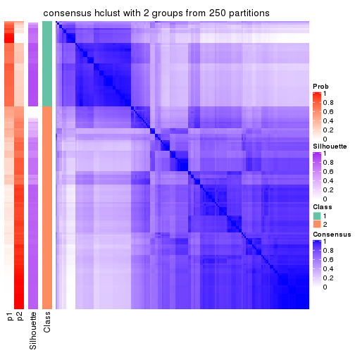</p>

</div>
<div id='tab-MAD-hclust-consensus-heatmap-2'>
<pre><code class="r">consensus_heatmap(res, k = 3)
</code></pre>

<p>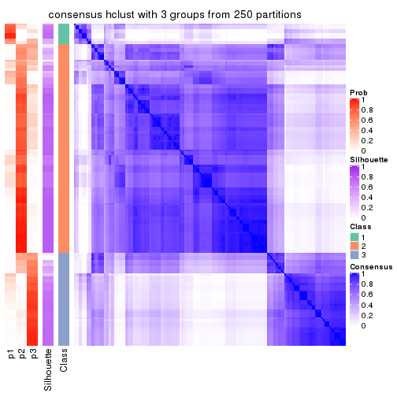</p>

</div>
<div id='tab-MAD-hclust-consensus-heatmap-3'>
<pre><code class="r">consensus_heatmap(res, k = 4)
</code></pre>

<p>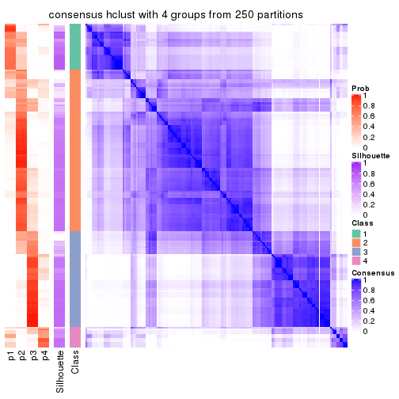</p>

</div>
<div id='tab-MAD-hclust-consensus-heatmap-4'>
<pre><code class="r">consensus_heatmap(res, k = 5)
</code></pre>

<p>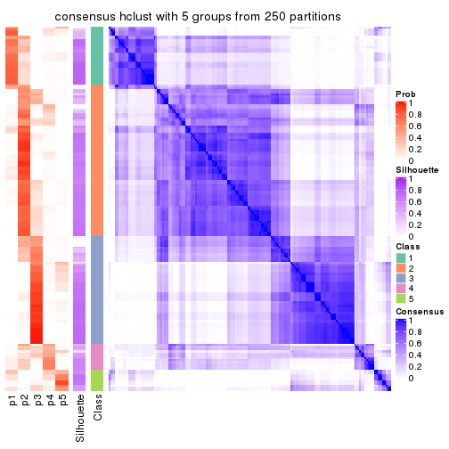</p>

</div>
<div id='tab-MAD-hclust-consensus-heatmap-5'>
<pre><code class="r">consensus_heatmap(res, k = 6)
</code></pre>

<p>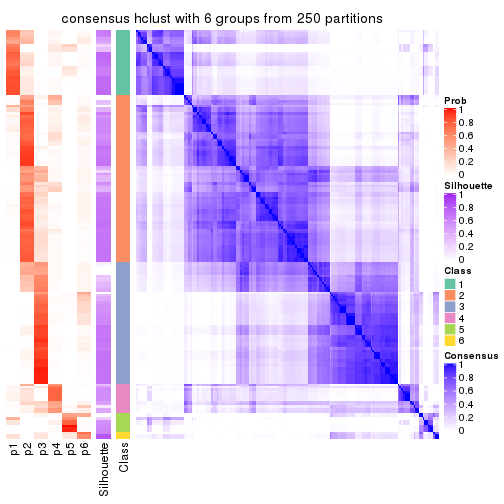</p>

</div>
</div>

Heatmaps for the membership of samples in all partitions to see how consistent they are:


<script>
$( function() {
	$( '#tabs-MAD-hclust-membership-heatmap' ).tabs();
} );
</script>
<div id='tabs-MAD-hclust-membership-heatmap'>
<ul>
<li><a href='#tab-MAD-hclust-membership-heatmap-1'>k = 2</a></li>
<li><a href='#tab-MAD-hclust-membership-heatmap-2'>k = 3</a></li>
<li><a href='#tab-MAD-hclust-membership-heatmap-3'>k = 4</a></li>
<li><a href='#tab-MAD-hclust-membership-heatmap-4'>k = 5</a></li>
<li><a href='#tab-MAD-hclust-membership-heatmap-5'>k = 6</a></li>
</ul>
<div id='tab-MAD-hclust-membership-heatmap-1'>
<pre><code class="r">membership_heatmap(res, k = 2)
</code></pre>

<p>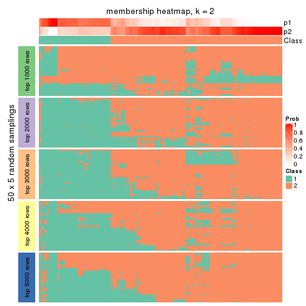</p>

</div>
<div id='tab-MAD-hclust-membership-heatmap-2'>
<pre><code class="r">membership_heatmap(res, k = 3)
</code></pre>

<p>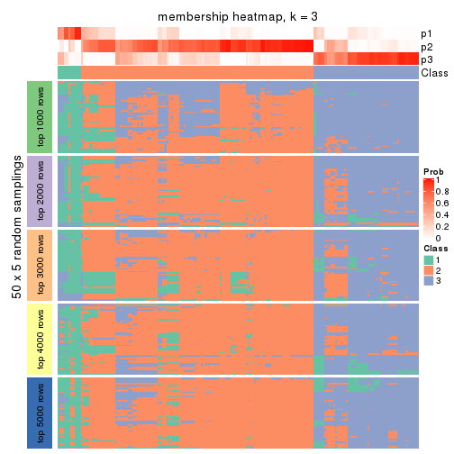</p>

</div>
<div id='tab-MAD-hclust-membership-heatmap-3'>
<pre><code class="r">membership_heatmap(res, k = 4)
</code></pre>

<p>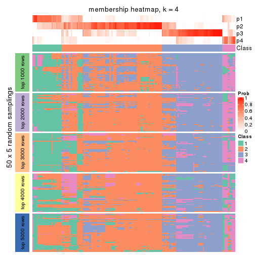</p>

</div>
<div id='tab-MAD-hclust-membership-heatmap-4'>
<pre><code class="r">membership_heatmap(res, k = 5)
</code></pre>

<p>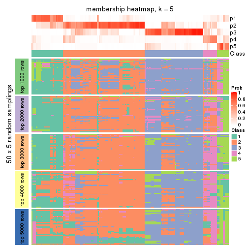</p>

</div>
<div id='tab-MAD-hclust-membership-heatmap-5'>
<pre><code class="r">membership_heatmap(res, k = 6)
</code></pre>

<p>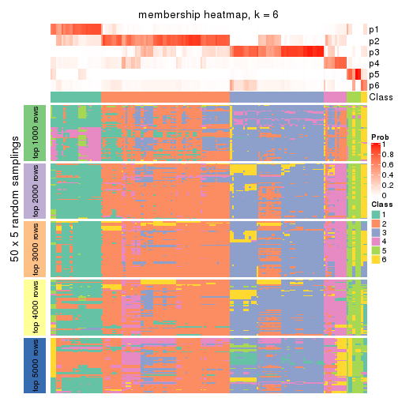</p>

</div>
</div>

As soon as we have had the classes for columns, we can look for signatures
which are significantly different between classes which can be candidate marks
for certain classes. Following are the heatmaps for signatures.


Signature heatmaps where rows are scaled:


<script>
$( function() {
	$( '#tabs-MAD-hclust-get-signatures' ).tabs();
} );
</script>
<div id='tabs-MAD-hclust-get-signatures'>
<ul>
<li><a href='#tab-MAD-hclust-get-signatures-1'>k = 2</a></li>
<li><a href='#tab-MAD-hclust-get-signatures-2'>k = 3</a></li>
<li><a href='#tab-MAD-hclust-get-signatures-3'>k = 4</a></li>
<li><a href='#tab-MAD-hclust-get-signatures-4'>k = 5</a></li>
<li><a href='#tab-MAD-hclust-get-signatures-5'>k = 6</a></li>
</ul>
<div id='tab-MAD-hclust-get-signatures-1'>
<pre><code class="r">get_signatures(res, k = 2)
</code></pre>

<p>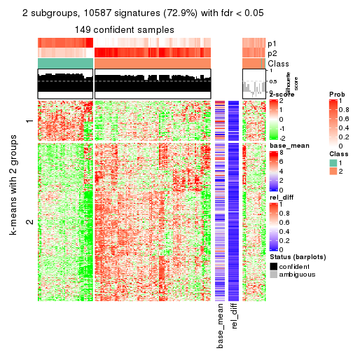</p>

</div>
<div id='tab-MAD-hclust-get-signatures-2'>
<pre><code class="r">get_signatures(res, k = 3)
</code></pre>

<p>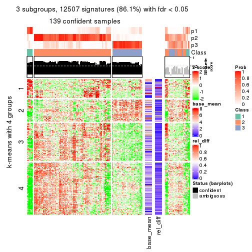</p>

</div>
<div id='tab-MAD-hclust-get-signatures-3'>
<pre><code class="r">get_signatures(res, k = 4)
</code></pre>

<p>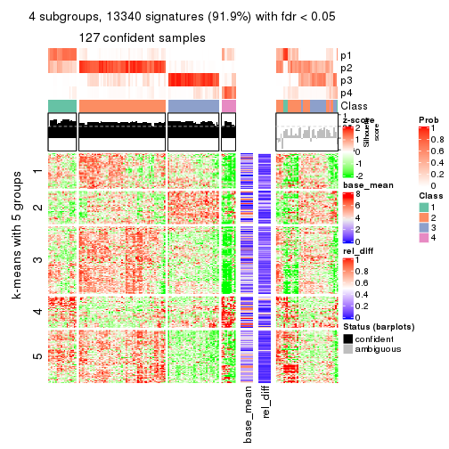</p>

</div>
<div id='tab-MAD-hclust-get-signatures-4'>
<pre><code class="r">get_signatures(res, k = 5)
</code></pre>

<p>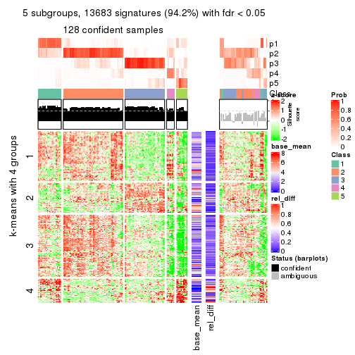</p>

</div>
<div id='tab-MAD-hclust-get-signatures-5'>
<pre><code class="r">get_signatures(res, k = 6)
</code></pre>

<p>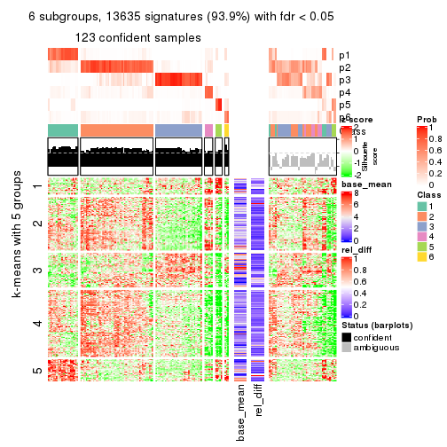</p>

</div>
</div>


Signature heatmaps where rows are not scaled:


<script>
$( function() {
	$( '#tabs-MAD-hclust-get-signatures-no-scale' ).tabs();
} );
</script>
<div id='tabs-MAD-hclust-get-signatures-no-scale'>
<ul>
<li><a href='#tab-MAD-hclust-get-signatures-no-scale-1'>k = 2</a></li>
<li><a href='#tab-MAD-hclust-get-signatures-no-scale-2'>k = 3</a></li>
<li><a href='#tab-MAD-hclust-get-signatures-no-scale-3'>k = 4</a></li>
<li><a href='#tab-MAD-hclust-get-signatures-no-scale-4'>k = 5</a></li>
<li><a href='#tab-MAD-hclust-get-signatures-no-scale-5'>k = 6</a></li>
</ul>
<div id='tab-MAD-hclust-get-signatures-no-scale-1'>
<pre><code class="r">get_signatures(res, k = 2, scale_rows = FALSE)
</code></pre>

<p>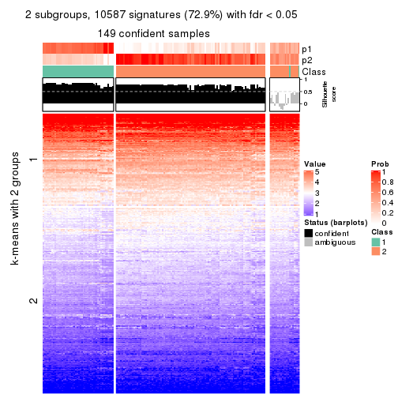</p>

</div>
<div id='tab-MAD-hclust-get-signatures-no-scale-2'>
<pre><code class="r">get_signatures(res, k = 3, scale_rows = FALSE)
</code></pre>

<p>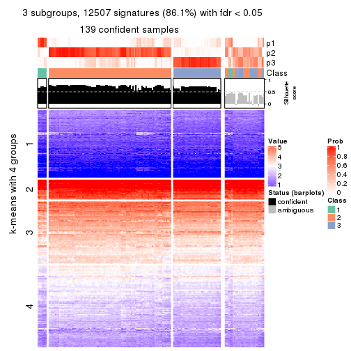</p>

</div>
<div id='tab-MAD-hclust-get-signatures-no-scale-3'>
<pre><code class="r">get_signatures(res, k = 4, scale_rows = FALSE)
</code></pre>

<p>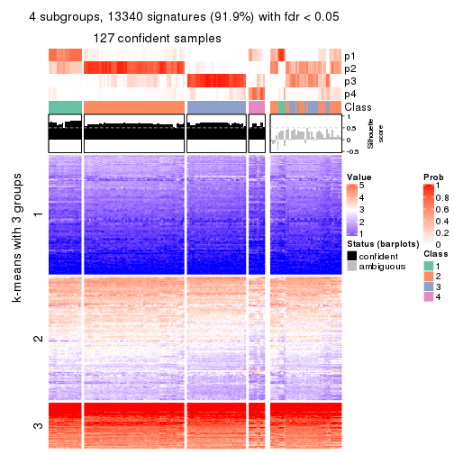</p>

</div>
<div id='tab-MAD-hclust-get-signatures-no-scale-4'>
<pre><code class="r">get_signatures(res, k = 5, scale_rows = FALSE)
</code></pre>

<p>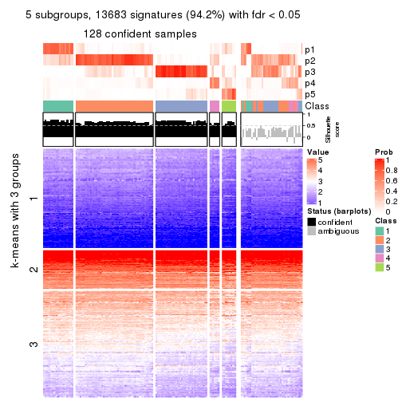</p>

</div>
<div id='tab-MAD-hclust-get-signatures-no-scale-5'>
<pre><code class="r">get_signatures(res, k = 6, scale_rows = FALSE)
</code></pre>

<p>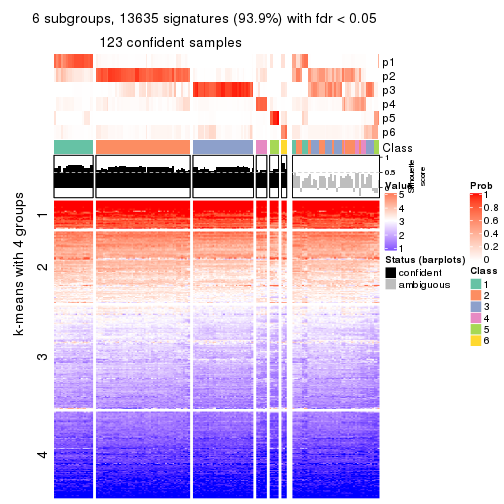</p>

</div>
</div>


Compare the overlap of signatures from different k:

```r
compare_signatures(res)
```

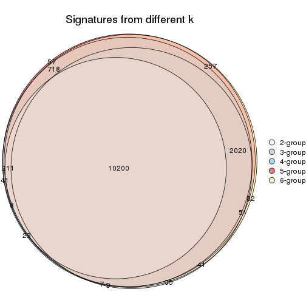

`get_signature()` returns a data frame invisibly. TO get the list of signatures, the function
call should be assigned to a variable explicitly. In following code, if `plot` argument is set
to `FALSE`, no heatmap is plotted while only the differential analysis is performed.

```r
# code only for demonstration
tb = get_signature(res, k = ..., plot = FALSE)
```

An example of the output of `tb` is:

```
#>   which_row         fdr    mean_1    mean_2 scaled_mean_1 scaled_mean_2 km
#> 1        38 0.042760348  8.373488  9.131774    -0.5533452     0.5164555  1
#> 2        40 0.018707592  7.106213  8.469186    -0.6173731     0.5762149  1
#> 3        55 0.019134737 10.221463 11.207825    -0.6159697     0.5749050  1
#> 4        59 0.006059896  5.921854  7.869574    -0.6899429     0.6439467  1
#> 5        60 0.018055526  8.928898 10.211722    -0.6204761     0.5791110  1
#> 6        98 0.009384629 15.714769 14.887706     0.6635654    -0.6193277  2
...
```

The columns in `tb` are:

1. `which_row`: row indices corresponding to the input matrix.
2. `fdr`: FDR for the differential test. 
3. `mean_x`: The mean value in group x.
4. `scaled_mean_x`: The mean value in group x after rows are scaled.
5. `km`: Row groups if k-means clustering is applied to rows.


UMAP plot which shows how samples are separated.


<script>
$( function() {
	$( '#tabs-MAD-hclust-dimension-reduction' ).tabs();
} );
</script>
<div id='tabs-MAD-hclust-dimension-reduction'>
<ul>
<li><a href='#tab-MAD-hclust-dimension-reduction-1'>k = 2</a></li>
<li><a href='#tab-MAD-hclust-dimension-reduction-2'>k = 3</a></li>
<li><a href='#tab-MAD-hclust-dimension-reduction-3'>k = 4</a></li>
<li><a href='#tab-MAD-hclust-dimension-reduction-4'>k = 5</a></li>
<li><a href='#tab-MAD-hclust-dimension-reduction-5'>k = 6</a></li>
</ul>
<div id='tab-MAD-hclust-dimension-reduction-1'>
<pre><code class="r">dimension_reduction(res, k = 2, method = &quot;UMAP&quot;)
</code></pre>

<p>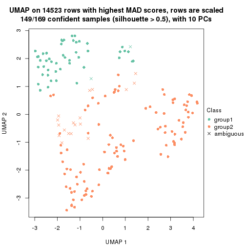</p>

</div>
<div id='tab-MAD-hclust-dimension-reduction-2'>
<pre><code class="r">dimension_reduction(res, k = 3, method = &quot;UMAP&quot;)
</code></pre>

<p>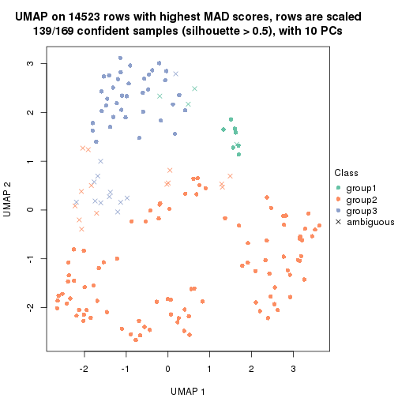</p>

</div>
<div id='tab-MAD-hclust-dimension-reduction-3'>
<pre><code class="r">dimension_reduction(res, k = 4, method = &quot;UMAP&quot;)
</code></pre>

<p>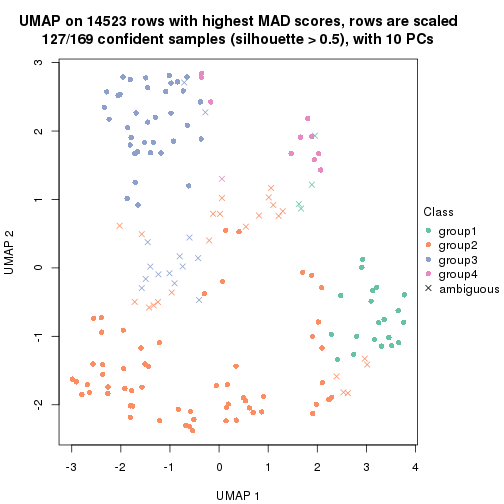</p>

</div>
<div id='tab-MAD-hclust-dimension-reduction-4'>
<pre><code class="r">dimension_reduction(res, k = 5, method = &quot;UMAP&quot;)
</code></pre>

<p>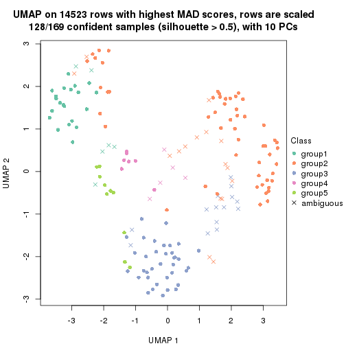</p>

</div>
<div id='tab-MAD-hclust-dimension-reduction-5'>
<pre><code class="r">dimension_reduction(res, k = 6, method = &quot;UMAP&quot;)
</code></pre>

<p>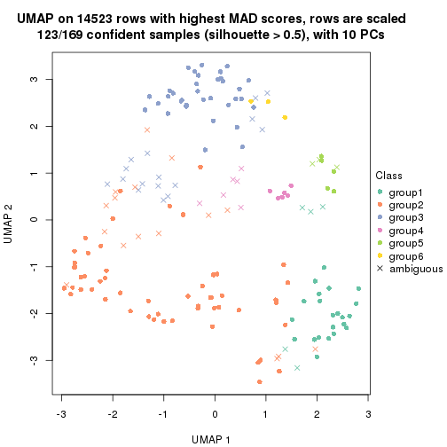</p>

</div>
</div>


Following heatmap shows how subgroups are split when increasing `k`:

```r
collect_classes(res)
```

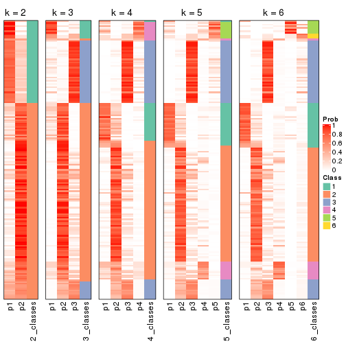


If matrix rows can be associated to genes, consider to use `GO_Enrichment(res,
...)` to perform function enrichment for the signature genes.


 

---------------------------------------------------


### MAD:kmeans


The object with results only for a single top-value method and a single partition method 
can be extracted as:

```r
res = res_list["MAD", "kmeans"]
# you can also extract it by
# res = res_list["MAD:kmeans"]
```

A summary of `res` and all the functions that can be applied to it:

```r
res
```

```
#> A 'ConsensusPartition' object with k = 2, 3, 4, 5, 6.
#>   On a matrix with 14523 rows and 169 columns.
#>   Top rows (1000, 2000, 3000, 4000, 5000) are extracted by 'MAD' method.
#>   Subgroups are detected by 'kmeans' method.
#>   Performed in total 1250 partitions by row resampling.
#>   Best k for subgroups seems to be 2.
#> 
#> Following methods can be applied to this 'ConsensusPartition' object:
#>  [1] "cola_report"             "collect_classes"         "collect_plots"          
#>  [4] "collect_stats"           "colnames"                "compare_signatures"     
#>  [7] "consensus_heatmap"       "dimension_reduction"     "functional_enrichment"  
#> [10] "get_anno_col"            "get_anno"                "get_classes"            
#> [13] "get_consensus"           "get_matrix"              "get_membership"         
#> [16] "get_param"               "get_signatures"          "get_stats"              
#> [19] "is_best_k"               "is_stable_k"             "membership_heatmap"     
#> [22] "ncol"                    "nrow"                    "plot_ecdf"              
#> [25] "rownames"                "select_partition_number" "show"                   
#> [28] "suggest_best_k"          "test_to_known_factors"
```

`collect_plots()` function collects all the plots made from `res` for all `k` (number of partitions)
into one single page to provide an easy and fast comparison between different `k`.

```r
collect_plots(res)
```

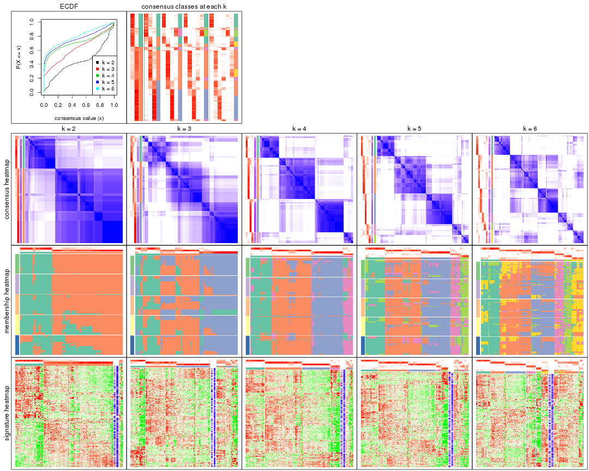

The plots are:

- The first row: a plot of the ECDF (Empirical cumulative distribution
  function) curves of the consensus matrix for each `k` and the heatmap of
  predicted classes for each `k`.
- The second row: heatmaps of the consensus matrix for each `k`.
- The third row: heatmaps of the membership matrix for each `k`.
- The fouth row: heatmaps of the signatures for each `k`.

All the plots in panels can be made by individual functions and they are
plotted later in this section.

`select_partition_number()` produces several plots showing different
statistics for choosing "optimized" `k`. There are following statistics:

- ECDF curves of the consensus matrix for each `k`;
- 1-PAC. [The PAC
  score](https://en.wikipedia.org/wiki/Consensus_clustering#Over-interpretation_potential_of_consensus_clustering)
  measures the proportion of the ambiguous subgrouping.
- Mean silhouette score.
- Concordance. The mean probability of fiting the consensus class ids in all
  partitions.
- Area increased. Denote $A_k$ as the area under the ECDF curve for current
  `k`, the area increased is defined as $A_k - A_{k-1}$.
- Rand index. The percent of pairs of samples that are both in a same cluster
  or both are not in a same cluster in the partition of k and k-1.
- Jaccard index. The ratio of pairs of samples are both in a same cluster in
  the partition of k and k-1 and the pairs of samples are both in a same
  cluster in the partition k or k-1.

The detailed explanations of these statistics can be found in [the cola
vignette](http://bioconductor.org/packages/devel/bioc/vignettes/cola/inst/doc/cola.html#toc_13).

Generally speaking, lower PAC score, higher mean silhouette score or higher
concordance corresponds to better partition. Rand index and Jaccard index
measure how similar the current partition is compared to partition with `k-1`.
If they are too similar, we won't accept `k` is better than `k-1`.

```r
select_partition_number(res)
```

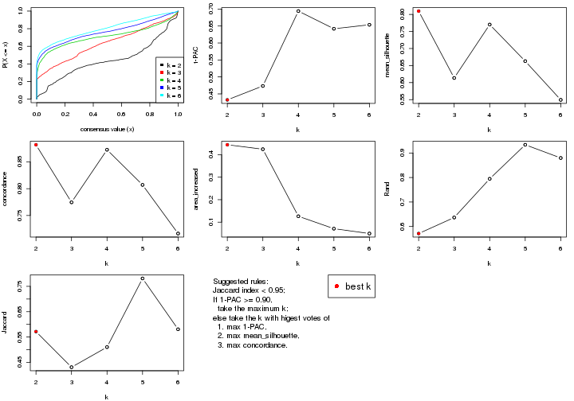

The numeric values for all these statistics can be obtained by `get_stats()`.

```r
get_stats(res)
```

```
#>   k 1-PAC mean_silhouette concordance area_increased  Rand Jaccard
#> 2 2 0.432           0.810       0.882         0.4442 0.571   0.571
#> 3 3 0.473           0.613       0.775         0.4245 0.637   0.431
#> 4 4 0.694           0.770       0.873         0.1262 0.795   0.510
#> 5 5 0.642           0.663       0.807         0.0710 0.934   0.781
#> 6 6 0.654           0.549       0.716         0.0493 0.880   0.581
```

`suggest_best_k()` suggests the best $k$ based on these statistics. The rules are as follows:

- All $k$ with Jaccard index larger than 0.95 are removed because the increase of
  the partition number does not provides enough extra information. If all $k$ are removed,
  the best $k$ is assigned by `NA`.
- For $k$ with 1-PAC larger than 0.9, the maximal $k$ is taken as the "best k". Other $k$ is called "optional k".
- If it does not fit the second rule. The $k$ with the highest vote of highest
  1-PAC, mean silhouette and concordance is taken as the "best k".

```r
suggest_best_k(res)
```

```
#> [1] 2
```


Following shows the table of the partitions (You need to click the **show/hide
code output** link to see it). The membership matrix (columns with name `p*`)
is inferred by
[`clue::cl_consensus()`](https://www.rdocumentation.org/link/cl_consensus?package=clue)
function with the `SE` method. Basically the value in the membership matrix
represents the probability to belong to a certain group. The finall class
label for an item is determined with the group with highest probability it
belongs to.

In `get_classes()` function, the entropy is calculated from the membership
matrix and the silhouette score is calculated from the consensus matrix.


<script>
$( function() {
	$( '#tabs-MAD-kmeans-get-classes' ).tabs();
} );
</script>
<div id='tabs-MAD-kmeans-get-classes'>
<ul>
<li><a href='#tab-MAD-kmeans-get-classes-1'>k = 2</a></li>
<li><a href='#tab-MAD-kmeans-get-classes-2'>k = 3</a></li>
<li><a href='#tab-MAD-kmeans-get-classes-3'>k = 4</a></li>
<li><a href='#tab-MAD-kmeans-get-classes-4'>k = 5</a></li>
<li><a href='#tab-MAD-kmeans-get-classes-5'>k = 6</a></li>
</ul>

<div id='tab-MAD-kmeans-get-classes-1'>
<p><a id='tab-MAD-kmeans-get-classes-1-a' style='color:#0366d6' href='#'>show/hide code output</a></p>
<pre><code class="r">cbind(get_classes(res, k = 2), get_membership(res, k = 2))
</code></pre>

<pre><code>#&gt;            class entropy silhouette    p1    p2
#&gt; SRR2052702     2  0.7815      0.793 0.232 0.768
#&gt; SRR2052701     2  0.8555      0.740 0.280 0.720
#&gt; SRR2052700     2  0.9635      0.623 0.388 0.612
#&gt; SRR2052699     2  0.8327      0.761 0.264 0.736
#&gt; SRR2052698     2  0.0000      0.861 0.000 1.000
#&gt; SRR2052708     1  0.0376      0.869 0.996 0.004
#&gt; SRR2052749     1  0.1414      0.873 0.980 0.020
#&gt; SRR2052786     2  0.6801      0.833 0.180 0.820
#&gt; SRR2052825     1  0.9896      0.203 0.560 0.440
#&gt; SRR2052824     2  0.8713      0.658 0.292 0.708
#&gt; SRR2052823     2  0.8144      0.773 0.252 0.748
#&gt; SRR2052822     2  0.3584      0.864 0.068 0.932
#&gt; SRR2052821     2  0.4431      0.862 0.092 0.908
#&gt; SRR2052820     2  0.3733      0.818 0.072 0.928
#&gt; SRR2052819     2  0.3733      0.818 0.072 0.928
#&gt; SRR2052818     2  0.8813      0.714 0.300 0.700
#&gt; SRR2052817     2  0.0000      0.861 0.000 1.000
#&gt; SRR2052816     2  0.8955      0.726 0.312 0.688
#&gt; SRR2052815     2  0.8713      0.658 0.292 0.708
#&gt; SRR2052814     2  0.5178      0.859 0.116 0.884
#&gt; SRR2052813     2  0.5408      0.855 0.124 0.876
#&gt; SRR2052812     2  0.6973      0.828 0.188 0.812
#&gt; SRR2052811     2  0.8144      0.773 0.252 0.748
#&gt; SRR2052810     2  0.8499      0.771 0.276 0.724
#&gt; SRR2052809     2  0.3879      0.864 0.076 0.924
#&gt; SRR2052808     2  0.5408      0.856 0.124 0.876
#&gt; SRR2052807     1  0.7299      0.748 0.796 0.204
#&gt; SRR2052806     1  0.0000      0.869 1.000 0.000
#&gt; SRR2052805     1  0.2043      0.863 0.968 0.032
#&gt; SRR2052804     2  0.8661      0.534 0.288 0.712
#&gt; SRR2052803     1  0.0000      0.869 1.000 0.000
#&gt; SRR2052802     1  0.9993      0.251 0.516 0.484
#&gt; SRR2052801     1  0.5059      0.823 0.888 0.112
#&gt; SRR2052800     1  0.9988      0.261 0.520 0.480
#&gt; SRR2052799     1  0.5059      0.823 0.888 0.112
#&gt; SRR2052798     1  0.1414      0.873 0.980 0.020
#&gt; SRR2052797     2  0.4298      0.863 0.088 0.912
#&gt; SRR2052796     1  0.3431      0.850 0.936 0.064
#&gt; SRR2052795     1  0.2603      0.858 0.956 0.044
#&gt; SRR2052794     1  0.7376      0.745 0.792 0.208
#&gt; SRR2052793     1  0.5059      0.823 0.888 0.112
#&gt; SRR2052792     2  0.6148      0.746 0.152 0.848
#&gt; SRR2052791     1  0.9710      0.483 0.600 0.400
#&gt; SRR2052790     2  0.0000      0.861 0.000 1.000
#&gt; SRR2052789     2  0.0000      0.861 0.000 1.000
#&gt; SRR2052788     2  0.0000      0.861 0.000 1.000
#&gt; SRR2052787     2  0.6801      0.833 0.180 0.820
#&gt; SRR2052785     2  0.0000      0.861 0.000 1.000
#&gt; SRR2052784     2  0.3733      0.864 0.072 0.928
#&gt; SRR2052783     2  0.4298      0.863 0.088 0.912
#&gt; SRR2052782     2  0.4022      0.863 0.080 0.920
#&gt; SRR2052781     2  0.3584      0.864 0.068 0.932
#&gt; SRR2052780     2  0.0000      0.861 0.000 1.000
#&gt; SRR2052777     2  0.4298      0.863 0.088 0.912
#&gt; SRR2052779     2  0.4022      0.863 0.080 0.920
#&gt; SRR2052778     2  0.3584      0.821 0.068 0.932
#&gt; SRR2052776     2  0.0000      0.861 0.000 1.000
#&gt; SRR2052775     2  0.0000      0.861 0.000 1.000
#&gt; SRR2052773     2  0.0000      0.861 0.000 1.000
#&gt; SRR2052772     2  0.0000      0.861 0.000 1.000
#&gt; SRR2052774     2  0.0000      0.861 0.000 1.000
#&gt; SRR2052771     1  0.7376      0.745 0.792 0.208
#&gt; SRR2052769     2  0.0000      0.861 0.000 1.000
#&gt; SRR2052770     2  0.0000      0.861 0.000 1.000
#&gt; SRR2052768     2  0.6973      0.828 0.188 0.812
#&gt; SRR2052767     2  0.7453      0.810 0.212 0.788
#&gt; SRR2052766     2  0.3879      0.815 0.076 0.924
#&gt; SRR2052765     2  0.6801      0.834 0.180 0.820
#&gt; SRR2052763     2  0.0000      0.861 0.000 1.000
#&gt; SRR2052764     2  0.9286      0.642 0.344 0.656
#&gt; SRR2052761     2  0.0000      0.861 0.000 1.000
#&gt; SRR2052760     2  0.6973      0.828 0.188 0.812
#&gt; SRR2052759     2  0.0000      0.861 0.000 1.000
#&gt; SRR2052762     2  0.4298      0.863 0.088 0.912
#&gt; SRR2052758     2  0.0000      0.861 0.000 1.000
#&gt; SRR2052756     1  0.0672      0.871 0.992 0.008
#&gt; SRR2052757     2  0.0000      0.861 0.000 1.000
#&gt; SRR2052755     1  0.3733      0.868 0.928 0.072
#&gt; SRR2052754     1  0.3431      0.850 0.936 0.064
#&gt; SRR2052753     1  0.3733      0.868 0.928 0.072
#&gt; SRR2052752     1  0.5059      0.823 0.888 0.112
#&gt; SRR2052750     1  0.3733      0.868 0.928 0.072
#&gt; SRR2052751     2  0.3431      0.864 0.064 0.936
#&gt; SRR2052748     2  0.3733      0.818 0.072 0.928
#&gt; SRR2052747     1  0.1184      0.872 0.984 0.016
#&gt; SRR2052746     2  0.0000      0.861 0.000 1.000
#&gt; SRR2052745     2  0.3733      0.818 0.072 0.928
#&gt; SRR2052744     1  0.3733      0.868 0.928 0.072
#&gt; SRR2052741     2  0.7453      0.809 0.212 0.788
#&gt; SRR2052743     2  0.6973      0.828 0.188 0.812
#&gt; SRR2052740     2  0.8081      0.776 0.248 0.752
#&gt; SRR2052742     2  0.3733      0.864 0.072 0.928
#&gt; SRR2052739     2  0.6973      0.828 0.188 0.812
#&gt; SRR2052738     2  0.0000      0.861 0.000 1.000
#&gt; SRR2052736     1  0.6623      0.762 0.828 0.172
#&gt; SRR2052735     1  0.3879      0.865 0.924 0.076
#&gt; SRR2052734     1  0.3879      0.865 0.924 0.076
#&gt; SRR2052737     2  0.6148      0.846 0.152 0.848
#&gt; SRR2052733     2  0.3733      0.818 0.072 0.928
#&gt; SRR2052732     2  0.9286      0.642 0.344 0.656
#&gt; SRR2052731     2  0.0000      0.861 0.000 1.000
#&gt; SRR2052729     1  0.3733      0.868 0.928 0.072
#&gt; SRR2052728     1  0.3733      0.868 0.928 0.072
#&gt; SRR2052730     2  0.3879      0.815 0.076 0.924
#&gt; SRR2052727     1  0.3733      0.868 0.928 0.072
#&gt; SRR2052725     1  0.4815      0.844 0.896 0.104
#&gt; SRR2052726     1  0.3733      0.868 0.928 0.072
#&gt; SRR2052724     1  0.3431      0.850 0.936 0.064
#&gt; SRR2052723     2  0.3879      0.815 0.076 0.924
#&gt; SRR2052722     2  0.0000      0.861 0.000 1.000
#&gt; SRR2052721     1  0.3733      0.868 0.928 0.072
#&gt; SRR2052720     2  0.6712      0.835 0.176 0.824
#&gt; SRR2052719     2  0.6973      0.828 0.188 0.812
#&gt; SRR2052718     1  0.3733      0.868 0.928 0.072
#&gt; SRR2052717     2  0.5842      0.850 0.140 0.860
#&gt; SRR2052714     1  0.6438      0.783 0.836 0.164
#&gt; SRR2052716     2  0.3733      0.818 0.072 0.928
#&gt; SRR2052715     2  0.0000      0.861 0.000 1.000
#&gt; SRR2052713     1  0.0000      0.869 1.000 0.000
#&gt; SRR2052712     1  0.9635      0.472 0.612 0.388
#&gt; SRR2052711     1  0.0672      0.870 0.992 0.008
#&gt; SRR2052710     2  0.5629      0.853 0.132 0.868
#&gt; SRR2052707     2  0.0000      0.861 0.000 1.000
#&gt; SRR2052709     2  0.0000      0.861 0.000 1.000
#&gt; SRR2052704     2  0.3733      0.818 0.072 0.928
#&gt; SRR2052705     2  0.6801      0.833 0.180 0.820
#&gt; SRR2052697     2  0.9209      0.656 0.336 0.664
#&gt; SRR2052703     2  0.0000      0.861 0.000 1.000
#&gt; SRR2052696     1  0.1184      0.872 0.984 0.016
#&gt; SRR2052706     2  0.4298      0.863 0.088 0.912
#&gt; SRR2052695     2  0.6247      0.844 0.156 0.844
#&gt; SRR2052694     2  0.6712      0.835 0.176 0.824
#&gt; SRR2052692     2  0.0000      0.861 0.000 1.000
#&gt; SRR2052693     2  0.0000      0.861 0.000 1.000
#&gt; SRR2052691     1  0.5629      0.812 0.868 0.132
#&gt; SRR2052690     2  0.9833      0.444 0.424 0.576
#&gt; SRR2052689     2  0.3733      0.818 0.072 0.928
#&gt; SRR2052687     2  0.3733      0.818 0.072 0.928
#&gt; SRR2052686     1  0.3733      0.868 0.928 0.072
#&gt; SRR2052688     2  0.6887      0.830 0.184 0.816
#&gt; SRR2052684     2  0.5737      0.766 0.136 0.864
#&gt; SRR2052685     2  0.8144      0.773 0.252 0.748
#&gt; SRR2052683     1  0.0000      0.869 1.000 0.000
#&gt; SRR2052681     2  0.8861      0.710 0.304 0.696
#&gt; SRR2052680     2  0.8713      0.658 0.292 0.708
#&gt; SRR2052682     1  0.4431      0.853 0.908 0.092
#&gt; SRR2052679     1  0.3733      0.868 0.928 0.072
#&gt; SRR2052678     2  0.0000      0.861 0.000 1.000
#&gt; SRR2052677     2  0.4022      0.863 0.080 0.920
#&gt; SRR2052675     2  0.8081      0.776 0.248 0.752
#&gt; SRR2052676     1  0.3733      0.868 0.928 0.072
#&gt; SRR2052674     2  0.6048      0.850 0.148 0.852
#&gt; SRR2052672     2  0.0000      0.861 0.000 1.000
#&gt; SRR2052673     1  0.7528      0.694 0.784 0.216
#&gt; SRR2052671     2  0.8144      0.773 0.252 0.748
#&gt; SRR2052670     2  0.0000      0.861 0.000 1.000
#&gt; SRR2052669     2  0.6048      0.847 0.148 0.852
#&gt; SRR2052668     2  0.7056      0.825 0.192 0.808
#&gt; SRR2052667     2  0.6973      0.828 0.188 0.812
#&gt; SRR2052666     2  0.0000      0.861 0.000 1.000
#&gt; SRR2052665     2  0.6712      0.835 0.176 0.824
#&gt; SRR2052664     1  0.3274      0.851 0.940 0.060
#&gt; SRR2052663     2  0.9286      0.642 0.344 0.656
#&gt; SRR2052662     2  0.6801      0.833 0.180 0.820
#&gt; SRR2052661     1  0.3733      0.868 0.928 0.072
#&gt; SRR2052660     2  0.0000      0.861 0.000 1.000
#&gt; SRR2052659     2  0.0000      0.861 0.000 1.000
#&gt; SRR2052658     2  0.7139      0.822 0.196 0.804
#&gt; SRR2052657     1  0.1184      0.872 0.984 0.016
</code></pre>

<script>
$('#tab-MAD-kmeans-get-classes-1-a').parent().next().next().hide();
$('#tab-MAD-kmeans-get-classes-1-a').click(function(){
  $('#tab-MAD-kmeans-get-classes-1-a').parent().next().next().toggle();
  return(false);
});
</script>
</div>

<div id='tab-MAD-kmeans-get-classes-2'>
<p><a id='tab-MAD-kmeans-get-classes-2-a' style='color:#0366d6' href='#'>show/hide code output</a></p>
<pre><code class="r">cbind(get_classes(res, k = 3), get_membership(res, k = 3))
</code></pre>

<pre><code>#&gt;            class entropy silhouette    p1    p2    p3
#&gt; SRR2052702     2  0.3192    0.72778 0.000 0.888 0.112
#&gt; SRR2052701     2  0.2066    0.70463 0.000 0.940 0.060
#&gt; SRR2052700     2  0.5744    0.70217 0.072 0.800 0.128
#&gt; SRR2052699     2  0.2261    0.70926 0.000 0.932 0.068
#&gt; SRR2052698     3  0.1289    0.85304 0.000 0.032 0.968
#&gt; SRR2052708     1  0.4452    0.68253 0.808 0.192 0.000
#&gt; SRR2052749     1  0.5397    0.63746 0.720 0.280 0.000
#&gt; SRR2052786     2  0.5431    0.66969 0.000 0.716 0.284
#&gt; SRR2052825     1  0.7979   -0.00202 0.500 0.440 0.060
#&gt; SRR2052824     1  0.9311   -0.07571 0.452 0.384 0.164
#&gt; SRR2052823     2  0.2448    0.71308 0.000 0.924 0.076
#&gt; SRR2052822     3  0.5178    0.61389 0.000 0.256 0.744
#&gt; SRR2052821     3  0.5785    0.46661 0.000 0.332 0.668
#&gt; SRR2052820     3  0.0747    0.85048 0.016 0.000 0.984
#&gt; SRR2052819     3  0.4605    0.66000 0.204 0.000 0.796
#&gt; SRR2052818     2  0.4062    0.73219 0.000 0.836 0.164
#&gt; SRR2052817     3  0.0424    0.86268 0.000 0.008 0.992
#&gt; SRR2052816     2  0.5179    0.67196 0.080 0.832 0.088
#&gt; SRR2052815     1  0.9280   -0.08062 0.452 0.388 0.160
#&gt; SRR2052814     2  0.6192    0.38864 0.000 0.580 0.420
#&gt; SRR2052813     2  0.6154    0.42667 0.000 0.592 0.408
#&gt; SRR2052812     2  0.5397    0.67361 0.000 0.720 0.280
#&gt; SRR2052811     2  0.3192    0.72778 0.000 0.888 0.112
#&gt; SRR2052810     2  0.8716    0.55288 0.172 0.588 0.240
#&gt; SRR2052809     3  0.5254    0.60154 0.000 0.264 0.736
#&gt; SRR2052808     2  0.6307    0.16134 0.000 0.512 0.488
#&gt; SRR2052807     1  0.2261    0.67204 0.932 0.000 0.068
#&gt; SRR2052806     1  0.3551    0.69607 0.868 0.132 0.000
#&gt; SRR2052805     1  0.2625    0.70127 0.916 0.084 0.000
#&gt; SRR2052804     1  0.6095    0.28841 0.608 0.000 0.392
#&gt; SRR2052803     1  0.3192    0.69897 0.888 0.112 0.000
#&gt; SRR2052802     1  0.5988    0.33925 0.632 0.000 0.368
#&gt; SRR2052801     1  0.0237    0.69332 0.996 0.004 0.000
#&gt; SRR2052800     1  0.5988    0.33925 0.632 0.000 0.368
#&gt; SRR2052799     1  0.0000    0.69225 1.000 0.000 0.000
#&gt; SRR2052798     1  0.5497    0.62934 0.708 0.292 0.000
#&gt; SRR2052797     3  0.5733    0.48616 0.000 0.324 0.676
#&gt; SRR2052796     1  0.0747    0.69580 0.984 0.016 0.000
#&gt; SRR2052795     1  0.4605    0.67799 0.796 0.204 0.000
#&gt; SRR2052794     1  0.2711    0.66463 0.912 0.000 0.088
#&gt; SRR2052793     1  0.0747    0.69580 0.984 0.016 0.000
#&gt; SRR2052792     1  0.6295    0.08670 0.528 0.000 0.472
#&gt; SRR2052791     1  0.5760    0.41067 0.672 0.000 0.328
#&gt; SRR2052790     3  0.1964    0.83826 0.000 0.056 0.944
#&gt; SRR2052789     3  0.0424    0.86268 0.000 0.008 0.992
#&gt; SRR2052788     3  0.0424    0.86268 0.000 0.008 0.992
#&gt; SRR2052787     2  0.5465    0.66466 0.000 0.712 0.288
#&gt; SRR2052785     3  0.1163    0.85491 0.000 0.028 0.972
#&gt; SRR2052784     3  0.5678    0.50308 0.000 0.316 0.684
#&gt; SRR2052783     3  0.5327    0.58832 0.000 0.272 0.728
#&gt; SRR2052782     3  0.5810    0.45844 0.000 0.336 0.664
#&gt; SRR2052781     3  0.5327    0.58827 0.000 0.272 0.728
#&gt; SRR2052780     3  0.0424    0.86268 0.000 0.008 0.992
#&gt; SRR2052777     3  0.6260    0.09615 0.000 0.448 0.552
#&gt; SRR2052779     3  0.5785    0.46787 0.000 0.332 0.668
#&gt; SRR2052778     3  0.0424    0.85557 0.008 0.000 0.992
#&gt; SRR2052776     3  0.2878    0.80770 0.000 0.096 0.904
#&gt; SRR2052775     3  0.0424    0.86268 0.000 0.008 0.992
#&gt; SRR2052773     3  0.1529    0.84910 0.000 0.040 0.960
#&gt; SRR2052772     3  0.0424    0.86268 0.000 0.008 0.992
#&gt; SRR2052774     3  0.0424    0.86268 0.000 0.008 0.992
#&gt; SRR2052771     1  0.2945    0.66631 0.908 0.004 0.088
#&gt; SRR2052769     3  0.1411    0.85093 0.000 0.036 0.964
#&gt; SRR2052770     3  0.0000    0.85994 0.000 0.000 1.000
#&gt; SRR2052768     2  0.5431    0.66969 0.000 0.716 0.284
#&gt; SRR2052767     2  0.3192    0.72778 0.000 0.888 0.112
#&gt; SRR2052766     3  0.4178    0.69404 0.172 0.000 0.828
#&gt; SRR2052765     2  0.5431    0.66969 0.000 0.716 0.284
#&gt; SRR2052763     3  0.0237    0.86152 0.000 0.004 0.996
#&gt; SRR2052764     2  0.2066    0.70463 0.000 0.940 0.060
#&gt; SRR2052761     3  0.0237    0.86152 0.000 0.004 0.996
#&gt; SRR2052760     2  0.5397    0.67361 0.000 0.720 0.280
#&gt; SRR2052759     3  0.0000    0.85994 0.000 0.000 1.000
#&gt; SRR2052762     3  0.6026    0.35007 0.000 0.376 0.624
#&gt; SRR2052758     3  0.0424    0.86268 0.000 0.008 0.992
#&gt; SRR2052756     1  0.6291    0.42599 0.532 0.468 0.000
#&gt; SRR2052757     3  0.2625    0.81712 0.000 0.084 0.916
#&gt; SRR2052755     2  0.6215   -0.22845 0.428 0.572 0.000
#&gt; SRR2052754     1  0.0747    0.69580 0.984 0.016 0.000
#&gt; SRR2052753     2  0.6244   -0.26021 0.440 0.560 0.000
#&gt; SRR2052752     1  0.2537    0.70131 0.920 0.080 0.000
#&gt; SRR2052750     1  0.6307    0.37310 0.512 0.488 0.000
#&gt; SRR2052751     3  0.3412    0.78214 0.000 0.124 0.876
#&gt; SRR2052748     3  0.2625    0.78577 0.084 0.000 0.916
#&gt; SRR2052747     1  0.5465    0.63206 0.712 0.288 0.000
#&gt; SRR2052746     3  0.0237    0.86152 0.000 0.004 0.996
#&gt; SRR2052745     3  0.0237    0.85796 0.004 0.000 0.996
#&gt; SRR2052744     2  0.6180   -0.19590 0.416 0.584 0.000
#&gt; SRR2052741     2  0.2537    0.71507 0.000 0.920 0.080
#&gt; SRR2052743     2  0.4346    0.73048 0.000 0.816 0.184
#&gt; SRR2052740     2  0.1031    0.67861 0.000 0.976 0.024
#&gt; SRR2052742     3  0.4931    0.65141 0.000 0.232 0.768
#&gt; SRR2052739     2  0.5431    0.66969 0.000 0.716 0.284
#&gt; SRR2052738     3  0.0000    0.85994 0.000 0.000 1.000
#&gt; SRR2052736     2  0.0424    0.64521 0.008 0.992 0.000
#&gt; SRR2052735     2  0.5560    0.12897 0.300 0.700 0.000
#&gt; SRR2052734     2  0.2959    0.53431 0.100 0.900 0.000
#&gt; SRR2052737     2  0.5529    0.65387 0.000 0.704 0.296
#&gt; SRR2052733     3  0.0237    0.85796 0.004 0.000 0.996
#&gt; SRR2052732     2  0.1031    0.67861 0.000 0.976 0.024
#&gt; SRR2052731     3  0.0424    0.86268 0.000 0.008 0.992
#&gt; SRR2052729     1  0.6307    0.37310 0.512 0.488 0.000
#&gt; SRR2052728     2  0.6180   -0.19590 0.416 0.584 0.000
#&gt; SRR2052730     3  0.5560    0.50080 0.300 0.000 0.700
#&gt; SRR2052727     1  0.6307    0.37310 0.512 0.488 0.000
#&gt; SRR2052725     2  0.0592    0.64163 0.012 0.988 0.000
#&gt; SRR2052726     2  0.5859    0.00810 0.344 0.656 0.000
#&gt; SRR2052724     1  0.4452    0.68285 0.808 0.192 0.000
#&gt; SRR2052723     3  0.3752    0.71720 0.144 0.000 0.856
#&gt; SRR2052722     3  0.0424    0.86268 0.000 0.008 0.992
#&gt; SRR2052721     1  0.6307    0.37310 0.512 0.488 0.000
#&gt; SRR2052720     2  0.5465    0.66466 0.000 0.712 0.288
#&gt; SRR2052719     2  0.5178    0.69209 0.000 0.744 0.256
#&gt; SRR2052718     2  0.5621    0.10816 0.308 0.692 0.000
#&gt; SRR2052717     2  0.5948    0.53566 0.000 0.640 0.360
#&gt; SRR2052714     1  0.3116    0.70011 0.892 0.108 0.000
#&gt; SRR2052716     3  0.0892    0.84741 0.020 0.000 0.980
#&gt; SRR2052715     3  0.0424    0.86268 0.000 0.008 0.992
#&gt; SRR2052713     1  0.5363    0.64128 0.724 0.276 0.000
#&gt; SRR2052712     1  0.5891    0.57098 0.764 0.036 0.200
#&gt; SRR2052711     2  0.5363    0.26090 0.276 0.724 0.000
#&gt; SRR2052710     2  0.5678    0.62861 0.000 0.684 0.316
#&gt; SRR2052707     3  0.0424    0.86268 0.000 0.008 0.992
#&gt; SRR2052709     3  0.0424    0.86268 0.000 0.008 0.992
#&gt; SRR2052704     3  0.0747    0.85009 0.016 0.000 0.984
#&gt; SRR2052705     2  0.4796    0.71337 0.000 0.780 0.220
#&gt; SRR2052697     2  0.0892    0.67460 0.000 0.980 0.020
#&gt; SRR2052703     3  0.0424    0.86268 0.000 0.008 0.992
#&gt; SRR2052696     1  0.5465    0.63206 0.712 0.288 0.000
#&gt; SRR2052706     3  0.6140    0.26083 0.000 0.404 0.596
#&gt; SRR2052695     2  0.5497    0.65894 0.000 0.708 0.292
#&gt; SRR2052694     2  0.5465    0.66466 0.000 0.712 0.288
#&gt; SRR2052692     3  0.0424    0.86268 0.000 0.008 0.992
#&gt; SRR2052693     3  0.1289    0.85304 0.000 0.032 0.968
#&gt; SRR2052691     2  0.5529    0.13977 0.296 0.704 0.000
#&gt; SRR2052690     2  0.1643    0.69368 0.000 0.956 0.044
#&gt; SRR2052689     3  0.4452    0.67485 0.192 0.000 0.808
#&gt; SRR2052687     3  0.6470    0.69591 0.092 0.148 0.760
#&gt; SRR2052686     2  0.3038    0.52888 0.104 0.896 0.000
#&gt; SRR2052688     2  0.5431    0.66969 0.000 0.716 0.284
#&gt; SRR2052684     3  0.5178    0.53660 0.256 0.000 0.744
#&gt; SRR2052685     2  0.3192    0.72778 0.000 0.888 0.112
#&gt; SRR2052683     1  0.2711    0.70109 0.912 0.088 0.000
#&gt; SRR2052681     2  0.4750    0.71773 0.000 0.784 0.216
#&gt; SRR2052680     1  0.9280   -0.08062 0.452 0.388 0.160
#&gt; SRR2052682     2  0.0424    0.64521 0.008 0.992 0.000
#&gt; SRR2052679     1  0.6305    0.37846 0.516 0.484 0.000
#&gt; SRR2052678     3  0.0424    0.86268 0.000 0.008 0.992
#&gt; SRR2052677     3  0.5529    0.54363 0.000 0.296 0.704
#&gt; SRR2052675     2  0.1031    0.67861 0.000 0.976 0.024
#&gt; SRR2052676     1  0.6305    0.37846 0.516 0.484 0.000
#&gt; SRR2052674     2  0.5465    0.66488 0.000 0.712 0.288
#&gt; SRR2052672     3  0.0424    0.86268 0.000 0.008 0.992
#&gt; SRR2052673     2  0.0424    0.64521 0.008 0.992 0.000
#&gt; SRR2052671     2  0.3192    0.72778 0.000 0.888 0.112
#&gt; SRR2052670     3  0.0424    0.86268 0.000 0.008 0.992
#&gt; SRR2052669     2  0.5465    0.66466 0.000 0.712 0.288
#&gt; SRR2052668     2  0.3192    0.72567 0.000 0.888 0.112
#&gt; SRR2052667     2  0.5098    0.69800 0.000 0.752 0.248
#&gt; SRR2052666     3  0.0424    0.86268 0.000 0.008 0.992
#&gt; SRR2052665     2  0.4887    0.70933 0.000 0.772 0.228
#&gt; SRR2052664     1  0.0424    0.69425 0.992 0.008 0.000
#&gt; SRR2052663     2  0.1031    0.67861 0.000 0.976 0.024
#&gt; SRR2052662     2  0.5431    0.66969 0.000 0.716 0.284
#&gt; SRR2052661     2  0.5968   -0.05381 0.364 0.636 0.000
#&gt; SRR2052660     3  0.0424    0.86268 0.000 0.008 0.992
#&gt; SRR2052659     3  0.0237    0.85807 0.004 0.000 0.996
#&gt; SRR2052658     2  0.3752    0.73112 0.000 0.856 0.144
#&gt; SRR2052657     1  0.5327    0.64226 0.728 0.272 0.000
</code></pre>

<script>
$('#tab-MAD-kmeans-get-classes-2-a').parent().next().next().hide();
$('#tab-MAD-kmeans-get-classes-2-a').click(function(){
  $('#tab-MAD-kmeans-get-classes-2-a').parent().next().next().toggle();
  return(false);
});
</script>
</div>

<div id='tab-MAD-kmeans-get-classes-3'>
<p><a id='tab-MAD-kmeans-get-classes-3-a' style='color:#0366d6' href='#'>show/hide code output</a></p>
<pre><code class="r">cbind(get_classes(res, k = 4), get_membership(res, k = 4))
</code></pre>

<pre><code>#&gt;            class entropy silhouette    p1    p2    p3    p4
#&gt; SRR2052702     2  0.0927     0.8386 0.008 0.976 0.000 0.016
#&gt; SRR2052701     2  0.1406     0.8334 0.016 0.960 0.000 0.024
#&gt; SRR2052700     2  0.3684     0.7737 0.020 0.844 0.004 0.132
#&gt; SRR2052699     2  0.3812     0.7517 0.116 0.848 0.008 0.028
#&gt; SRR2052698     3  0.1209     0.9024 0.000 0.032 0.964 0.004
#&gt; SRR2052708     1  0.0804     0.8033 0.980 0.008 0.000 0.012
#&gt; SRR2052749     1  0.0937     0.8062 0.976 0.012 0.000 0.012
#&gt; SRR2052786     2  0.1557     0.8489 0.000 0.944 0.056 0.000
#&gt; SRR2052825     4  0.4351     0.6835 0.020 0.164 0.012 0.804
#&gt; SRR2052824     4  0.4996     0.6430 0.020 0.216 0.016 0.748
#&gt; SRR2052823     2  0.1545     0.8302 0.008 0.952 0.000 0.040
#&gt; SRR2052822     2  0.5132     0.3693 0.000 0.548 0.448 0.004
#&gt; SRR2052821     2  0.4560     0.6696 0.000 0.700 0.296 0.004
#&gt; SRR2052820     3  0.1398     0.8982 0.004 0.000 0.956 0.040
#&gt; SRR2052819     3  0.6370     0.0352 0.016 0.032 0.476 0.476
#&gt; SRR2052818     2  0.3432     0.7901 0.008 0.860 0.012 0.120
#&gt; SRR2052817     3  0.0336     0.9176 0.000 0.008 0.992 0.000
#&gt; SRR2052816     2  0.4036     0.7639 0.020 0.816 0.004 0.160
#&gt; SRR2052815     4  0.4952     0.6373 0.020 0.224 0.012 0.744
#&gt; SRR2052814     2  0.2751     0.8373 0.000 0.904 0.056 0.040
#&gt; SRR2052813     2  0.3355     0.7953 0.000 0.836 0.160 0.004
#&gt; SRR2052812     2  0.1211     0.8500 0.000 0.960 0.040 0.000
#&gt; SRR2052811     2  0.0927     0.8386 0.008 0.976 0.000 0.016
#&gt; SRR2052810     2  0.4768     0.7220 0.020 0.772 0.016 0.192
#&gt; SRR2052809     2  0.4991     0.5179 0.000 0.608 0.388 0.004
#&gt; SRR2052808     2  0.4224     0.8001 0.000 0.824 0.100 0.076
#&gt; SRR2052807     4  0.2466     0.7532 0.096 0.000 0.004 0.900
#&gt; SRR2052806     1  0.2868     0.6887 0.864 0.000 0.000 0.136
#&gt; SRR2052805     1  0.3266     0.6490 0.832 0.000 0.000 0.168
#&gt; SRR2052804     4  0.3099     0.7123 0.020 0.000 0.104 0.876
#&gt; SRR2052803     1  0.2704     0.7000 0.876 0.000 0.000 0.124
#&gt; SRR2052802     4  0.2500     0.7492 0.040 0.000 0.044 0.916
#&gt; SRR2052801     4  0.4222     0.7047 0.272 0.000 0.000 0.728
#&gt; SRR2052800     4  0.2500     0.7492 0.040 0.000 0.044 0.916
#&gt; SRR2052799     4  0.4072     0.7178 0.252 0.000 0.000 0.748
#&gt; SRR2052798     1  0.1059     0.8082 0.972 0.016 0.000 0.012
#&gt; SRR2052797     2  0.4535     0.6749 0.000 0.704 0.292 0.004
#&gt; SRR2052796     4  0.4356     0.6889 0.292 0.000 0.000 0.708
#&gt; SRR2052795     1  0.0804     0.8033 0.980 0.008 0.000 0.012
#&gt; SRR2052794     4  0.4155     0.7227 0.240 0.000 0.004 0.756
#&gt; SRR2052793     4  0.4331     0.6897 0.288 0.000 0.000 0.712
#&gt; SRR2052792     3  0.5950     0.2336 0.040 0.000 0.544 0.416
#&gt; SRR2052791     3  0.7302     0.0725 0.168 0.000 0.500 0.332
#&gt; SRR2052790     3  0.1637     0.8818 0.000 0.060 0.940 0.000
#&gt; SRR2052789     3  0.0336     0.9176 0.000 0.008 0.992 0.000
#&gt; SRR2052788     3  0.0188     0.9184 0.000 0.004 0.996 0.000
#&gt; SRR2052787     2  0.1792     0.8471 0.000 0.932 0.068 0.000
#&gt; SRR2052785     3  0.1398     0.8967 0.000 0.040 0.956 0.004
#&gt; SRR2052784     2  0.5050     0.4663 0.000 0.588 0.408 0.004
#&gt; SRR2052783     2  0.4855     0.5877 0.000 0.644 0.352 0.004
#&gt; SRR2052782     2  0.4741     0.6265 0.000 0.668 0.328 0.004
#&gt; SRR2052781     2  0.4950     0.5411 0.000 0.620 0.376 0.004
#&gt; SRR2052780     3  0.0336     0.9176 0.000 0.008 0.992 0.000
#&gt; SRR2052777     2  0.3583     0.7794 0.000 0.816 0.180 0.004
#&gt; SRR2052779     2  0.4781     0.6136 0.000 0.660 0.336 0.004
#&gt; SRR2052778     3  0.0921     0.9079 0.000 0.000 0.972 0.028
#&gt; SRR2052776     3  0.2266     0.8535 0.000 0.084 0.912 0.004
#&gt; SRR2052775     3  0.0188     0.9184 0.000 0.004 0.996 0.000
#&gt; SRR2052773     3  0.1637     0.8817 0.000 0.060 0.940 0.000
#&gt; SRR2052772     3  0.0188     0.9184 0.000 0.004 0.996 0.000
#&gt; SRR2052774     3  0.0469     0.9159 0.000 0.012 0.988 0.000
#&gt; SRR2052771     4  0.7421     0.4169 0.372 0.000 0.172 0.456
#&gt; SRR2052769     3  0.1545     0.8961 0.000 0.040 0.952 0.008
#&gt; SRR2052770     3  0.0469     0.9155 0.000 0.000 0.988 0.012
#&gt; SRR2052768     2  0.1211     0.8500 0.000 0.960 0.040 0.000
#&gt; SRR2052767     2  0.0657     0.8403 0.004 0.984 0.000 0.012
#&gt; SRR2052766     3  0.2999     0.8210 0.004 0.000 0.864 0.132
#&gt; SRR2052765     2  0.2589     0.8391 0.000 0.912 0.044 0.044
#&gt; SRR2052763     3  0.0524     0.9174 0.000 0.004 0.988 0.008
#&gt; SRR2052764     2  0.1042     0.8362 0.008 0.972 0.000 0.020
#&gt; SRR2052761     3  0.0779     0.9155 0.000 0.004 0.980 0.016
#&gt; SRR2052760     2  0.1211     0.8500 0.000 0.960 0.040 0.000
#&gt; SRR2052759     3  0.0592     0.9139 0.000 0.000 0.984 0.016
#&gt; SRR2052762     2  0.4193     0.6995 0.000 0.732 0.268 0.000
#&gt; SRR2052758     3  0.0188     0.9184 0.000 0.004 0.996 0.000
#&gt; SRR2052756     1  0.2623     0.8151 0.908 0.064 0.000 0.028
#&gt; SRR2052757     3  0.3539     0.7223 0.000 0.176 0.820 0.004
#&gt; SRR2052755     1  0.3149     0.8084 0.880 0.088 0.000 0.032
#&gt; SRR2052754     4  0.4661     0.6329 0.348 0.000 0.000 0.652
#&gt; SRR2052753     1  0.3372     0.8021 0.868 0.096 0.000 0.036
#&gt; SRR2052752     1  0.2704     0.6960 0.876 0.000 0.000 0.124
#&gt; SRR2052750     1  0.1637     0.8226 0.940 0.060 0.000 0.000
#&gt; SRR2052751     3  0.1557     0.8852 0.000 0.056 0.944 0.000
#&gt; SRR2052748     3  0.1661     0.8892 0.004 0.000 0.944 0.052
#&gt; SRR2052747     1  0.1059     0.8082 0.972 0.016 0.000 0.012
#&gt; SRR2052746     3  0.0524     0.9174 0.000 0.004 0.988 0.008
#&gt; SRR2052745     3  0.0921     0.9081 0.000 0.000 0.972 0.028
#&gt; SRR2052744     1  0.3149     0.8084 0.880 0.088 0.000 0.032
#&gt; SRR2052741     2  0.1917     0.8324 0.012 0.944 0.008 0.036
#&gt; SRR2052743     2  0.0895     0.8477 0.000 0.976 0.020 0.004
#&gt; SRR2052740     2  0.1584     0.8301 0.012 0.952 0.000 0.036
#&gt; SRR2052742     3  0.3219     0.7587 0.000 0.164 0.836 0.000
#&gt; SRR2052739     2  0.1489     0.8498 0.000 0.952 0.044 0.004
#&gt; SRR2052738     3  0.0779     0.9155 0.000 0.004 0.980 0.016
#&gt; SRR2052736     2  0.3333     0.7690 0.088 0.872 0.000 0.040
#&gt; SRR2052735     1  0.4423     0.7474 0.792 0.168 0.000 0.040
#&gt; SRR2052734     1  0.5008     0.6781 0.732 0.228 0.000 0.040
#&gt; SRR2052737     2  0.2654     0.8287 0.000 0.888 0.108 0.004
#&gt; SRR2052733     3  0.0921     0.9081 0.000 0.000 0.972 0.028
#&gt; SRR2052732     2  0.1635     0.8271 0.008 0.948 0.000 0.044
#&gt; SRR2052731     3  0.0188     0.9184 0.000 0.004 0.996 0.000
#&gt; SRR2052729     1  0.1637     0.8226 0.940 0.060 0.000 0.000
#&gt; SRR2052728     1  0.3082     0.8100 0.884 0.084 0.000 0.032
#&gt; SRR2052730     3  0.5496     0.4774 0.016 0.008 0.632 0.344
#&gt; SRR2052727     1  0.1824     0.8222 0.936 0.060 0.000 0.004
#&gt; SRR2052725     2  0.2214     0.8177 0.028 0.928 0.000 0.044
#&gt; SRR2052726     1  0.4285     0.7579 0.804 0.156 0.000 0.040
#&gt; SRR2052724     1  0.0804     0.8033 0.980 0.008 0.000 0.012
#&gt; SRR2052723     3  0.2053     0.8746 0.004 0.000 0.924 0.072
#&gt; SRR2052722     3  0.0657     0.9167 0.000 0.004 0.984 0.012
#&gt; SRR2052721     1  0.1824     0.8223 0.936 0.060 0.000 0.004
#&gt; SRR2052720     2  0.1716     0.8480 0.000 0.936 0.064 0.000
#&gt; SRR2052719     2  0.1022     0.8496 0.000 0.968 0.032 0.000
#&gt; SRR2052718     1  0.4511     0.7405 0.784 0.176 0.000 0.040
#&gt; SRR2052717     2  0.1792     0.8475 0.000 0.932 0.068 0.000
#&gt; SRR2052714     1  0.1913     0.7648 0.940 0.000 0.040 0.020
#&gt; SRR2052716     3  0.1398     0.8982 0.004 0.000 0.956 0.040
#&gt; SRR2052715     3  0.0188     0.9184 0.000 0.004 0.996 0.000
#&gt; SRR2052713     1  0.0937     0.8057 0.976 0.012 0.000 0.012
#&gt; SRR2052712     4  0.2519     0.7403 0.020 0.020 0.036 0.924
#&gt; SRR2052711     1  0.7816     0.1108 0.412 0.272 0.000 0.316
#&gt; SRR2052710     2  0.3796     0.8177 0.000 0.848 0.096 0.056
#&gt; SRR2052707     3  0.0188     0.9184 0.000 0.004 0.996 0.000
#&gt; SRR2052709     3  0.0336     0.9176 0.000 0.008 0.992 0.000
#&gt; SRR2052704     3  0.1302     0.8981 0.000 0.000 0.956 0.044
#&gt; SRR2052705     2  0.1004     0.8488 0.000 0.972 0.024 0.004
#&gt; SRR2052697     2  0.1913     0.8242 0.020 0.940 0.000 0.040
#&gt; SRR2052703     3  0.0336     0.9176 0.000 0.008 0.992 0.000
#&gt; SRR2052696     1  0.1059     0.8082 0.972 0.016 0.000 0.012
#&gt; SRR2052706     2  0.4387     0.7840 0.000 0.804 0.144 0.052
#&gt; SRR2052695     2  0.1902     0.8475 0.000 0.932 0.064 0.004
#&gt; SRR2052694     2  0.1716     0.8480 0.000 0.936 0.064 0.000
#&gt; SRR2052692     3  0.0524     0.9174 0.000 0.004 0.988 0.008
#&gt; SRR2052693     3  0.1209     0.9024 0.000 0.032 0.964 0.004
#&gt; SRR2052691     1  0.4466     0.7412 0.784 0.180 0.000 0.036
#&gt; SRR2052690     1  0.6256     0.4210 0.552 0.400 0.012 0.036
#&gt; SRR2052689     3  0.5283     0.4872 0.008 0.008 0.636 0.348
#&gt; SRR2052687     2  0.7544     0.4880 0.016 0.560 0.236 0.188
#&gt; SRR2052686     1  0.5807     0.5127 0.612 0.344 0.000 0.044
#&gt; SRR2052688     2  0.1722     0.8496 0.000 0.944 0.048 0.008
#&gt; SRR2052684     3  0.2737     0.8417 0.008 0.000 0.888 0.104
#&gt; SRR2052685     2  0.0376     0.8419 0.004 0.992 0.000 0.004
#&gt; SRR2052683     1  0.4989    -0.2482 0.528 0.000 0.000 0.472
#&gt; SRR2052681     2  0.4205     0.7507 0.016 0.804 0.008 0.172
#&gt; SRR2052680     4  0.4952     0.6373 0.020 0.224 0.012 0.744
#&gt; SRR2052682     2  0.5008     0.5552 0.228 0.732 0.000 0.040
#&gt; SRR2052679     1  0.1824     0.8222 0.936 0.060 0.000 0.004
#&gt; SRR2052678     3  0.0336     0.9176 0.000 0.008 0.992 0.000
#&gt; SRR2052677     2  0.4872     0.5796 0.000 0.640 0.356 0.004
#&gt; SRR2052675     2  0.1706     0.8276 0.016 0.948 0.000 0.036
#&gt; SRR2052676     1  0.1637     0.8226 0.940 0.060 0.000 0.000
#&gt; SRR2052674     2  0.4278     0.7640 0.020 0.816 0.016 0.148
#&gt; SRR2052672     3  0.0188     0.9184 0.000 0.004 0.996 0.000
#&gt; SRR2052673     2  0.2214     0.8177 0.028 0.928 0.000 0.044
#&gt; SRR2052671     2  0.0657     0.8403 0.004 0.984 0.000 0.012
#&gt; SRR2052670     3  0.0336     0.9176 0.000 0.008 0.992 0.000
#&gt; SRR2052669     2  0.1716     0.8480 0.000 0.936 0.064 0.000
#&gt; SRR2052668     2  0.3396     0.7985 0.064 0.884 0.016 0.036
#&gt; SRR2052667     2  0.0779     0.8469 0.000 0.980 0.016 0.004
#&gt; SRR2052666     3  0.0524     0.9180 0.000 0.008 0.988 0.004
#&gt; SRR2052665     2  0.1109     0.8493 0.000 0.968 0.028 0.004
#&gt; SRR2052664     4  0.4699     0.6618 0.320 0.004 0.000 0.676
#&gt; SRR2052663     2  0.1174     0.8357 0.012 0.968 0.000 0.020
#&gt; SRR2052662     2  0.1637     0.8485 0.000 0.940 0.060 0.000
#&gt; SRR2052661     1  0.4197     0.7607 0.808 0.156 0.000 0.036
#&gt; SRR2052660     3  0.0779     0.9155 0.000 0.004 0.980 0.016
#&gt; SRR2052659     3  0.0779     0.9155 0.000 0.004 0.980 0.016
#&gt; SRR2052658     2  0.0895     0.8477 0.000 0.976 0.020 0.004
#&gt; SRR2052657     1  0.1059     0.8082 0.972 0.016 0.000 0.012
</code></pre>

<script>
$('#tab-MAD-kmeans-get-classes-3-a').parent().next().next().hide();
$('#tab-MAD-kmeans-get-classes-3-a').click(function(){
  $('#tab-MAD-kmeans-get-classes-3-a').parent().next().next().toggle();
  return(false);
});
</script>
</div>

<div id='tab-MAD-kmeans-get-classes-4'>
<p><a id='tab-MAD-kmeans-get-classes-4-a' style='color:#0366d6' href='#'>show/hide code output</a></p>
<pre><code class="r">cbind(get_classes(res, k = 5), get_membership(res, k = 5))
</code></pre>

<pre><code>#&gt;            class entropy silhouette    p1    p2    p3    p4    p5
#&gt; SRR2052702     2  0.3439     0.6796 0.008 0.800 0.000 0.188 0.004
#&gt; SRR2052701     2  0.5191     0.5780 0.080 0.672 0.000 0.244 0.004
#&gt; SRR2052700     4  0.4302     0.4477 0.004 0.344 0.000 0.648 0.004
#&gt; SRR2052699     2  0.5309     0.5278 0.248 0.676 0.012 0.060 0.004
#&gt; SRR2052698     3  0.3835     0.6631 0.000 0.260 0.732 0.008 0.000
#&gt; SRR2052708     1  0.2753     0.7766 0.856 0.000 0.000 0.008 0.136
#&gt; SRR2052749     1  0.2753     0.7766 0.856 0.000 0.000 0.008 0.136
#&gt; SRR2052786     2  0.1282     0.7324 0.000 0.952 0.044 0.004 0.000
#&gt; SRR2052825     4  0.5247     0.4953 0.000 0.072 0.004 0.652 0.272
#&gt; SRR2052824     4  0.5564     0.5080 0.000 0.056 0.028 0.648 0.268
#&gt; SRR2052823     2  0.3795     0.6779 0.024 0.788 0.000 0.184 0.004
#&gt; SRR2052822     2  0.4283     0.4065 0.000 0.644 0.348 0.008 0.000
#&gt; SRR2052821     2  0.3944     0.6771 0.000 0.788 0.160 0.052 0.000
#&gt; SRR2052820     3  0.2669     0.7867 0.000 0.000 0.876 0.104 0.020
#&gt; SRR2052819     4  0.6997     0.4292 0.000 0.048 0.232 0.540 0.180
#&gt; SRR2052818     4  0.4009     0.5046 0.000 0.312 0.000 0.684 0.004
#&gt; SRR2052817     3  0.2462     0.7997 0.000 0.112 0.880 0.008 0.000
#&gt; SRR2052816     4  0.4442     0.4597 0.016 0.304 0.000 0.676 0.004
#&gt; SRR2052815     4  0.5564     0.5080 0.000 0.056 0.028 0.648 0.268
#&gt; SRR2052814     2  0.1300     0.7338 0.000 0.956 0.028 0.016 0.000
#&gt; SRR2052813     2  0.1768     0.7241 0.000 0.924 0.072 0.004 0.000
#&gt; SRR2052812     2  0.2497     0.7137 0.000 0.880 0.004 0.112 0.004
#&gt; SRR2052811     2  0.3439     0.6796 0.008 0.800 0.000 0.188 0.004
#&gt; SRR2052810     4  0.4505     0.5877 0.000 0.220 0.016 0.736 0.028
#&gt; SRR2052809     2  0.3885     0.5504 0.000 0.724 0.268 0.008 0.000
#&gt; SRR2052808     2  0.5429     0.1250 0.000 0.564 0.068 0.368 0.000
#&gt; SRR2052807     5  0.2648     0.6263 0.000 0.000 0.000 0.152 0.848
#&gt; SRR2052806     1  0.4150     0.4151 0.612 0.000 0.000 0.000 0.388
#&gt; SRR2052805     1  0.4341     0.3812 0.592 0.000 0.000 0.004 0.404
#&gt; SRR2052804     4  0.5171     0.3288 0.000 0.000 0.076 0.648 0.276
#&gt; SRR2052803     1  0.4101     0.5267 0.664 0.000 0.000 0.004 0.332
#&gt; SRR2052802     5  0.3266     0.5915 0.000 0.000 0.004 0.200 0.796
#&gt; SRR2052801     5  0.1661     0.7374 0.036 0.000 0.000 0.024 0.940
#&gt; SRR2052800     5  0.3300     0.5894 0.000 0.000 0.004 0.204 0.792
#&gt; SRR2052799     5  0.1300     0.7321 0.016 0.000 0.000 0.028 0.956
#&gt; SRR2052798     1  0.2660     0.7814 0.864 0.000 0.000 0.008 0.128
#&gt; SRR2052797     2  0.2806     0.6751 0.000 0.844 0.152 0.004 0.000
#&gt; SRR2052796     5  0.1732     0.7352 0.080 0.000 0.000 0.000 0.920
#&gt; SRR2052795     1  0.2753     0.7766 0.856 0.000 0.000 0.008 0.136
#&gt; SRR2052794     5  0.1364     0.7317 0.012 0.000 0.000 0.036 0.952
#&gt; SRR2052793     5  0.2513     0.7220 0.116 0.000 0.000 0.008 0.876
#&gt; SRR2052792     3  0.6056     0.2139 0.000 0.000 0.536 0.140 0.324
#&gt; SRR2052791     5  0.6141     0.5195 0.064 0.000 0.172 0.104 0.660
#&gt; SRR2052790     3  0.3837     0.6234 0.000 0.308 0.692 0.000 0.000
#&gt; SRR2052789     3  0.1121     0.8466 0.000 0.044 0.956 0.000 0.000
#&gt; SRR2052788     3  0.1043     0.8475 0.000 0.040 0.960 0.000 0.000
#&gt; SRR2052787     2  0.1341     0.7299 0.000 0.944 0.056 0.000 0.000
#&gt; SRR2052785     3  0.3885     0.6577 0.000 0.268 0.724 0.008 0.000
#&gt; SRR2052784     2  0.3684     0.5324 0.000 0.720 0.280 0.000 0.000
#&gt; SRR2052783     2  0.3861     0.5563 0.000 0.728 0.264 0.008 0.000
#&gt; SRR2052782     2  0.2966     0.6485 0.000 0.816 0.184 0.000 0.000
#&gt; SRR2052781     2  0.3885     0.5495 0.000 0.724 0.268 0.008 0.000
#&gt; SRR2052780     3  0.1121     0.8468 0.000 0.044 0.956 0.000 0.000
#&gt; SRR2052777     2  0.2377     0.6948 0.000 0.872 0.128 0.000 0.000
#&gt; SRR2052779     2  0.3003     0.6447 0.000 0.812 0.188 0.000 0.000
#&gt; SRR2052778     3  0.1651     0.8370 0.000 0.012 0.944 0.036 0.008
#&gt; SRR2052776     3  0.4201     0.5794 0.000 0.328 0.664 0.008 0.000
#&gt; SRR2052775     3  0.1205     0.8470 0.000 0.040 0.956 0.004 0.000
#&gt; SRR2052773     3  0.4025     0.6312 0.000 0.292 0.700 0.008 0.000
#&gt; SRR2052772     3  0.0794     0.8480 0.000 0.028 0.972 0.000 0.000
#&gt; SRR2052774     3  0.2763     0.7764 0.000 0.148 0.848 0.004 0.000
#&gt; SRR2052771     5  0.6314     0.5790 0.160 0.000 0.100 0.088 0.652
#&gt; SRR2052769     3  0.3857     0.6038 0.000 0.312 0.688 0.000 0.000
#&gt; SRR2052770     3  0.0693     0.8457 0.000 0.012 0.980 0.008 0.000
#&gt; SRR2052768     2  0.2681     0.7182 0.000 0.876 0.012 0.108 0.004
#&gt; SRR2052767     2  0.3402     0.6813 0.008 0.804 0.000 0.184 0.004
#&gt; SRR2052766     3  0.3532     0.7407 0.000 0.000 0.824 0.128 0.048
#&gt; SRR2052765     2  0.3236     0.6966 0.000 0.828 0.020 0.152 0.000
#&gt; SRR2052763     3  0.1924     0.8224 0.000 0.004 0.924 0.064 0.008
#&gt; SRR2052764     2  0.4930     0.5768 0.052 0.676 0.000 0.268 0.004
#&gt; SRR2052761     3  0.1830     0.8191 0.000 0.000 0.924 0.068 0.008
#&gt; SRR2052760     2  0.1202     0.7352 0.000 0.960 0.004 0.032 0.004
#&gt; SRR2052759     3  0.1670     0.8237 0.000 0.000 0.936 0.052 0.012
#&gt; SRR2052762     2  0.2674     0.6885 0.000 0.856 0.140 0.004 0.000
#&gt; SRR2052758     3  0.0880     0.8480 0.000 0.032 0.968 0.000 0.000
#&gt; SRR2052756     1  0.1704     0.7894 0.928 0.000 0.000 0.068 0.004
#&gt; SRR2052757     3  0.4201     0.5713 0.000 0.328 0.664 0.008 0.000
#&gt; SRR2052755     1  0.1894     0.7844 0.920 0.008 0.000 0.072 0.000
#&gt; SRR2052754     5  0.2338     0.7249 0.112 0.000 0.000 0.004 0.884
#&gt; SRR2052753     1  0.1892     0.7830 0.916 0.004 0.000 0.080 0.000
#&gt; SRR2052752     1  0.4046     0.5821 0.696 0.000 0.000 0.008 0.296
#&gt; SRR2052750     1  0.0963     0.8038 0.964 0.000 0.000 0.000 0.036
#&gt; SRR2052751     3  0.3861     0.6590 0.000 0.264 0.728 0.008 0.000
#&gt; SRR2052748     3  0.2761     0.7830 0.000 0.000 0.872 0.104 0.024
#&gt; SRR2052747     1  0.2424     0.7829 0.868 0.000 0.000 0.000 0.132
#&gt; SRR2052746     3  0.0932     0.8403 0.000 0.004 0.972 0.020 0.004
#&gt; SRR2052745     3  0.2332     0.8111 0.000 0.004 0.904 0.076 0.016
#&gt; SRR2052744     1  0.2017     0.7815 0.912 0.008 0.000 0.080 0.000
#&gt; SRR2052741     2  0.4019     0.6915 0.072 0.820 0.012 0.092 0.004
#&gt; SRR2052743     2  0.1990     0.7326 0.004 0.928 0.012 0.052 0.004
#&gt; SRR2052740     2  0.4801     0.6185 0.092 0.732 0.000 0.172 0.004
#&gt; SRR2052742     3  0.4356     0.5316 0.000 0.340 0.648 0.012 0.000
#&gt; SRR2052739     2  0.2722     0.7168 0.000 0.872 0.020 0.108 0.000
#&gt; SRR2052738     3  0.2006     0.8134 0.000 0.000 0.916 0.072 0.012
#&gt; SRR2052736     2  0.6529     0.3644 0.256 0.512 0.000 0.228 0.004
#&gt; SRR2052735     1  0.3264     0.7335 0.840 0.024 0.000 0.132 0.004
#&gt; SRR2052734     1  0.4332     0.6575 0.768 0.064 0.000 0.164 0.004
#&gt; SRR2052737     2  0.1952     0.7183 0.000 0.912 0.084 0.004 0.000
#&gt; SRR2052733     3  0.1740     0.8221 0.000 0.000 0.932 0.056 0.012
#&gt; SRR2052732     2  0.5409     0.4985 0.064 0.600 0.000 0.332 0.004
#&gt; SRR2052731     3  0.0290     0.8462 0.000 0.008 0.992 0.000 0.000
#&gt; SRR2052729     1  0.1579     0.8034 0.944 0.000 0.000 0.024 0.032
#&gt; SRR2052728     1  0.2077     0.7800 0.908 0.008 0.000 0.084 0.000
#&gt; SRR2052730     4  0.4526     0.3750 0.000 0.000 0.300 0.672 0.028
#&gt; SRR2052727     1  0.1410     0.8019 0.940 0.000 0.000 0.000 0.060
#&gt; SRR2052725     2  0.6717     0.2587 0.216 0.440 0.000 0.340 0.004
#&gt; SRR2052726     1  0.2818     0.7511 0.860 0.008 0.000 0.128 0.004
#&gt; SRR2052724     1  0.2753     0.7766 0.856 0.000 0.000 0.008 0.136
#&gt; SRR2052723     3  0.3090     0.7695 0.000 0.000 0.856 0.104 0.040
#&gt; SRR2052722     3  0.1043     0.8472 0.000 0.040 0.960 0.000 0.000
#&gt; SRR2052721     1  0.1668     0.8031 0.940 0.000 0.000 0.028 0.032
#&gt; SRR2052720     2  0.1197     0.7318 0.000 0.952 0.048 0.000 0.000
#&gt; SRR2052719     2  0.2488     0.7071 0.000 0.872 0.000 0.124 0.004
#&gt; SRR2052718     1  0.3527     0.7151 0.820 0.028 0.000 0.148 0.004
#&gt; SRR2052717     2  0.1697     0.7321 0.000 0.932 0.060 0.008 0.000
#&gt; SRR2052714     1  0.4151     0.7311 0.800 0.000 0.040 0.024 0.136
#&gt; SRR2052716     3  0.2519     0.7924 0.000 0.000 0.884 0.100 0.016
#&gt; SRR2052715     3  0.1043     0.8475 0.000 0.040 0.960 0.000 0.000
#&gt; SRR2052713     1  0.2439     0.7878 0.876 0.000 0.000 0.004 0.120
#&gt; SRR2052712     4  0.4473     0.3960 0.000 0.000 0.020 0.656 0.324
#&gt; SRR2052711     4  0.7411     0.1094 0.352 0.060 0.000 0.428 0.160
#&gt; SRR2052710     2  0.4373     0.6092 0.000 0.760 0.080 0.160 0.000
#&gt; SRR2052707     3  0.1331     0.8451 0.000 0.040 0.952 0.008 0.000
#&gt; SRR2052709     3  0.1121     0.8466 0.000 0.044 0.956 0.000 0.000
#&gt; SRR2052704     3  0.1697     0.8228 0.000 0.000 0.932 0.060 0.008
#&gt; SRR2052705     2  0.1843     0.7334 0.004 0.936 0.012 0.044 0.004
#&gt; SRR2052697     2  0.5509     0.5537 0.104 0.644 0.000 0.248 0.004
#&gt; SRR2052703     3  0.1205     0.8464 0.000 0.040 0.956 0.004 0.000
#&gt; SRR2052696     1  0.2536     0.7826 0.868 0.000 0.000 0.004 0.128
#&gt; SRR2052706     2  0.5114     0.3854 0.000 0.608 0.052 0.340 0.000
#&gt; SRR2052695     2  0.1357     0.7314 0.000 0.948 0.048 0.004 0.000
#&gt; SRR2052694     2  0.1197     0.7318 0.000 0.952 0.048 0.000 0.000
#&gt; SRR2052692     3  0.0854     0.8453 0.000 0.012 0.976 0.008 0.004
#&gt; SRR2052693     3  0.3861     0.6590 0.000 0.264 0.728 0.008 0.000
#&gt; SRR2052691     1  0.2972     0.7508 0.864 0.024 0.000 0.108 0.004
#&gt; SRR2052690     2  0.6127     0.2122 0.424 0.484 0.012 0.076 0.004
#&gt; SRR2052689     4  0.4679     0.3711 0.000 0.000 0.316 0.652 0.032
#&gt; SRR2052687     4  0.5487     0.5547 0.000 0.200 0.132 0.664 0.004
#&gt; SRR2052686     1  0.5929     0.3777 0.572 0.116 0.000 0.308 0.004
#&gt; SRR2052688     2  0.2773     0.7162 0.000 0.868 0.020 0.112 0.000
#&gt; SRR2052684     3  0.3216     0.7628 0.000 0.000 0.848 0.108 0.044
#&gt; SRR2052685     2  0.3128     0.6927 0.004 0.824 0.000 0.168 0.004
#&gt; SRR2052683     5  0.4242     0.0789 0.428 0.000 0.000 0.000 0.572
#&gt; SRR2052681     4  0.4944     0.5733 0.000 0.288 0.024 0.668 0.020
#&gt; SRR2052680     4  0.5564     0.5080 0.000 0.056 0.028 0.648 0.268
#&gt; SRR2052682     2  0.6635     0.3169 0.284 0.484 0.000 0.228 0.004
#&gt; SRR2052679     1  0.1410     0.8019 0.940 0.000 0.000 0.000 0.060
#&gt; SRR2052678     3  0.1270     0.8440 0.000 0.052 0.948 0.000 0.000
#&gt; SRR2052677     2  0.3612     0.5969 0.000 0.764 0.228 0.008 0.000
#&gt; SRR2052675     2  0.5509     0.5537 0.104 0.644 0.000 0.248 0.004
#&gt; SRR2052676     1  0.2519     0.7985 0.900 0.004 0.000 0.060 0.036
#&gt; SRR2052674     4  0.4425     0.5266 0.000 0.296 0.024 0.680 0.000
#&gt; SRR2052672     3  0.1043     0.8475 0.000 0.040 0.960 0.000 0.000
#&gt; SRR2052673     2  0.5976     0.4913 0.144 0.592 0.000 0.260 0.004
#&gt; SRR2052671     2  0.3439     0.6796 0.008 0.800 0.000 0.188 0.004
#&gt; SRR2052670     3  0.0963     0.8477 0.000 0.036 0.964 0.000 0.000
#&gt; SRR2052669     2  0.1608     0.7252 0.000 0.928 0.072 0.000 0.000
#&gt; SRR2052668     2  0.4853     0.6740 0.092 0.776 0.040 0.088 0.004
#&gt; SRR2052667     2  0.2670     0.7170 0.000 0.888 0.028 0.080 0.004
#&gt; SRR2052666     3  0.1471     0.8453 0.000 0.024 0.952 0.020 0.004
#&gt; SRR2052665     2  0.2386     0.7346 0.004 0.912 0.032 0.048 0.004
#&gt; SRR2052664     5  0.6366     0.3423 0.204 0.000 0.000 0.284 0.512
#&gt; SRR2052663     2  0.4820     0.6019 0.056 0.700 0.000 0.240 0.004
#&gt; SRR2052662     2  0.1121     0.7324 0.000 0.956 0.044 0.000 0.000
#&gt; SRR2052661     1  0.3080     0.7431 0.852 0.020 0.000 0.124 0.004
#&gt; SRR2052660     3  0.1074     0.8439 0.000 0.012 0.968 0.016 0.004
#&gt; SRR2052659     3  0.2448     0.7974 0.000 0.000 0.892 0.088 0.020
#&gt; SRR2052658     2  0.1990     0.7326 0.004 0.928 0.012 0.052 0.004
#&gt; SRR2052657     1  0.2583     0.7805 0.864 0.000 0.000 0.004 0.132
</code></pre>

<script>
$('#tab-MAD-kmeans-get-classes-4-a').parent().next().next().hide();
$('#tab-MAD-kmeans-get-classes-4-a').click(function(){
  $('#tab-MAD-kmeans-get-classes-4-a').parent().next().next().toggle();
  return(false);
});
</script>
</div>

<div id='tab-MAD-kmeans-get-classes-5'>
<p><a id='tab-MAD-kmeans-get-classes-5-a' style='color:#0366d6' href='#'>show/hide code output</a></p>
<pre><code class="r">cbind(get_classes(res, k = 6), get_membership(res, k = 6))
</code></pre>

<pre><code>#&gt;            class entropy silhouette    p1    p2    p3    p4    p5    p6
#&gt; SRR2052702     6  0.4855   0.480203 0.000 0.380 0.000 0.064 0.000 0.556
#&gt; SRR2052701     6  0.3534   0.629239 0.000 0.276 0.000 0.008 0.000 0.716
#&gt; SRR2052700     4  0.5107   0.593308 0.004 0.144 0.000 0.668 0.008 0.176
#&gt; SRR2052699     2  0.6164   0.218488 0.200 0.560 0.000 0.020 0.012 0.208
#&gt; SRR2052698     2  0.4076   0.066618 0.000 0.564 0.428 0.004 0.004 0.000
#&gt; SRR2052708     1  0.2100   0.718868 0.916 0.000 0.000 0.016 0.036 0.032
#&gt; SRR2052749     1  0.2188   0.717561 0.912 0.000 0.000 0.020 0.032 0.036
#&gt; SRR2052786     2  0.2809   0.509972 0.000 0.824 0.004 0.000 0.004 0.168
#&gt; SRR2052825     4  0.3402   0.690318 0.000 0.020 0.000 0.800 0.168 0.012
#&gt; SRR2052824     4  0.3367   0.693973 0.000 0.020 0.000 0.804 0.164 0.012
#&gt; SRR2052823     6  0.5395   0.309332 0.000 0.404 0.000 0.080 0.012 0.504
#&gt; SRR2052822     2  0.3134   0.541418 0.000 0.784 0.208 0.004 0.004 0.000
#&gt; SRR2052821     2  0.4282   0.555332 0.000 0.780 0.084 0.072 0.000 0.064
#&gt; SRR2052820     3  0.5029   0.568598 0.008 0.008 0.740 0.100 0.048 0.096
#&gt; SRR2052819     4  0.6072   0.547620 0.000 0.088 0.176 0.624 0.104 0.008
#&gt; SRR2052818     4  0.4295   0.647415 0.000 0.112 0.000 0.728 0.000 0.160
#&gt; SRR2052817     3  0.3892   0.566273 0.000 0.352 0.640 0.004 0.004 0.000
#&gt; SRR2052816     4  0.5046   0.576596 0.004 0.088 0.000 0.660 0.012 0.236
#&gt; SRR2052815     4  0.3331   0.695806 0.000 0.020 0.000 0.808 0.160 0.012
#&gt; SRR2052814     2  0.3290   0.524193 0.000 0.820 0.004 0.044 0.000 0.132
#&gt; SRR2052813     2  0.2573   0.556335 0.000 0.864 0.024 0.000 0.000 0.112
#&gt; SRR2052812     2  0.4806   0.096176 0.000 0.592 0.004 0.056 0.000 0.348
#&gt; SRR2052811     6  0.4876   0.498335 0.000 0.368 0.000 0.068 0.000 0.564
#&gt; SRR2052810     4  0.3674   0.711517 0.000 0.096 0.000 0.808 0.012 0.084
#&gt; SRR2052809     2  0.3011   0.558728 0.000 0.800 0.192 0.004 0.004 0.000
#&gt; SRR2052808     2  0.5317   0.201498 0.000 0.556 0.028 0.372 0.008 0.036
#&gt; SRR2052807     5  0.2278   0.680081 0.000 0.000 0.000 0.128 0.868 0.004
#&gt; SRR2052806     1  0.3221   0.485416 0.736 0.000 0.000 0.000 0.264 0.000
#&gt; SRR2052805     1  0.3330   0.452524 0.716 0.000 0.000 0.000 0.284 0.000
#&gt; SRR2052804     4  0.4675   0.537944 0.000 0.000 0.064 0.748 0.092 0.096
#&gt; SRR2052803     1  0.2941   0.559676 0.780 0.000 0.000 0.000 0.220 0.000
#&gt; SRR2052802     5  0.3561   0.647238 0.000 0.000 0.012 0.160 0.796 0.032
#&gt; SRR2052801     5  0.1866   0.761815 0.084 0.000 0.000 0.008 0.908 0.000
#&gt; SRR2052800     5  0.3525   0.647280 0.000 0.000 0.012 0.156 0.800 0.032
#&gt; SRR2052799     5  0.1838   0.759070 0.068 0.000 0.000 0.016 0.916 0.000
#&gt; SRR2052798     1  0.2024   0.721034 0.920 0.000 0.000 0.016 0.028 0.036
#&gt; SRR2052797     2  0.2163   0.597652 0.000 0.892 0.096 0.004 0.000 0.008
#&gt; SRR2052796     5  0.2118   0.761223 0.104 0.000 0.000 0.008 0.888 0.000
#&gt; SRR2052795     1  0.2259   0.716342 0.908 0.000 0.000 0.020 0.032 0.040
#&gt; SRR2052794     5  0.2697   0.749328 0.068 0.000 0.000 0.048 0.876 0.008
#&gt; SRR2052793     5  0.2896   0.736050 0.160 0.000 0.000 0.016 0.824 0.000
#&gt; SRR2052792     3  0.6432   0.205049 0.000 0.000 0.548 0.124 0.232 0.096
#&gt; SRR2052791     5  0.8121   0.318445 0.120 0.000 0.272 0.120 0.392 0.096
#&gt; SRR2052790     2  0.3547   0.341660 0.000 0.668 0.332 0.000 0.000 0.000
#&gt; SRR2052789     3  0.2883   0.789946 0.000 0.212 0.788 0.000 0.000 0.000
#&gt; SRR2052788     3  0.2793   0.797281 0.000 0.200 0.800 0.000 0.000 0.000
#&gt; SRR2052787     2  0.2700   0.520119 0.000 0.836 0.004 0.000 0.004 0.156
#&gt; SRR2052785     2  0.3986   0.193844 0.000 0.608 0.384 0.004 0.004 0.000
#&gt; SRR2052784     2  0.2234   0.596037 0.000 0.872 0.124 0.004 0.000 0.000
#&gt; SRR2052783     2  0.2809   0.581771 0.000 0.824 0.168 0.004 0.004 0.000
#&gt; SRR2052782     2  0.2135   0.595255 0.000 0.872 0.128 0.000 0.000 0.000
#&gt; SRR2052781     2  0.3104   0.544974 0.000 0.788 0.204 0.004 0.004 0.000
#&gt; SRR2052780     3  0.2823   0.795440 0.000 0.204 0.796 0.000 0.000 0.000
#&gt; SRR2052777     2  0.1806   0.597672 0.000 0.908 0.088 0.000 0.004 0.000
#&gt; SRR2052779     2  0.2178   0.594558 0.000 0.868 0.132 0.000 0.000 0.000
#&gt; SRR2052778     3  0.2350   0.790173 0.000 0.100 0.880 0.020 0.000 0.000
#&gt; SRR2052776     2  0.3684   0.393387 0.000 0.692 0.300 0.004 0.004 0.000
#&gt; SRR2052775     3  0.3023   0.788146 0.000 0.212 0.784 0.000 0.004 0.000
#&gt; SRR2052773     2  0.3918   0.271862 0.000 0.632 0.360 0.004 0.004 0.000
#&gt; SRR2052772     3  0.2793   0.797281 0.000 0.200 0.800 0.000 0.000 0.000
#&gt; SRR2052774     3  0.3899   0.452161 0.000 0.404 0.592 0.000 0.004 0.000
#&gt; SRR2052771     1  0.8375  -0.334582 0.328 0.000 0.176 0.104 0.288 0.104
#&gt; SRR2052769     2  0.3874   0.286651 0.000 0.636 0.356 0.008 0.000 0.000
#&gt; SRR2052770     3  0.2697   0.800399 0.000 0.188 0.812 0.000 0.000 0.000
#&gt; SRR2052768     2  0.4134   0.199827 0.000 0.640 0.004 0.016 0.000 0.340
#&gt; SRR2052767     6  0.4872   0.472411 0.000 0.388 0.000 0.064 0.000 0.548
#&gt; SRR2052766     3  0.4569   0.575293 0.000 0.000 0.756 0.104 0.064 0.076
#&gt; SRR2052765     2  0.5446   0.008543 0.000 0.540 0.004 0.120 0.000 0.336
#&gt; SRR2052763     3  0.1777   0.741846 0.000 0.012 0.932 0.024 0.032 0.000
#&gt; SRR2052764     6  0.4934   0.600962 0.000 0.264 0.000 0.108 0.000 0.628
#&gt; SRR2052761     3  0.4398   0.678024 0.004 0.036 0.800 0.056 0.044 0.060
#&gt; SRR2052760     2  0.3741   0.257843 0.000 0.672 0.000 0.008 0.000 0.320
#&gt; SRR2052759     3  0.1718   0.752236 0.000 0.020 0.936 0.020 0.024 0.000
#&gt; SRR2052762     2  0.3180   0.584196 0.000 0.852 0.072 0.004 0.012 0.060
#&gt; SRR2052758     3  0.2730   0.798942 0.000 0.192 0.808 0.000 0.000 0.000
#&gt; SRR2052756     1  0.3583   0.670954 0.728 0.000 0.000 0.004 0.008 0.260
#&gt; SRR2052757     2  0.3864   0.305380 0.000 0.648 0.344 0.004 0.004 0.000
#&gt; SRR2052755     1  0.3665   0.651904 0.696 0.000 0.000 0.004 0.004 0.296
#&gt; SRR2052754     5  0.3250   0.720663 0.196 0.000 0.000 0.012 0.788 0.004
#&gt; SRR2052753     1  0.3646   0.653835 0.700 0.000 0.000 0.004 0.004 0.292
#&gt; SRR2052752     1  0.2847   0.665568 0.852 0.000 0.000 0.012 0.120 0.016
#&gt; SRR2052750     1  0.0790   0.742352 0.968 0.000 0.000 0.000 0.000 0.032
#&gt; SRR2052751     2  0.4840   0.240921 0.004 0.600 0.356 0.008 0.016 0.016
#&gt; SRR2052748     3  0.4008   0.621854 0.000 0.000 0.796 0.096 0.040 0.068
#&gt; SRR2052747     1  0.1082   0.734308 0.956 0.000 0.000 0.000 0.040 0.004
#&gt; SRR2052746     3  0.2492   0.792494 0.000 0.100 0.876 0.004 0.020 0.000
#&gt; SRR2052745     3  0.3116   0.686212 0.000 0.004 0.864 0.056 0.040 0.036
#&gt; SRR2052744     1  0.3646   0.654668 0.700 0.000 0.000 0.004 0.004 0.292
#&gt; SRR2052741     2  0.4150   0.291933 0.000 0.612 0.000 0.004 0.012 0.372
#&gt; SRR2052743     2  0.3764   0.418396 0.000 0.724 0.000 0.008 0.012 0.256
#&gt; SRR2052740     6  0.3746   0.577283 0.000 0.272 0.000 0.004 0.012 0.712
#&gt; SRR2052742     2  0.4551   0.373343 0.000 0.656 0.300 0.004 0.016 0.024
#&gt; SRR2052739     2  0.4884   0.081956 0.000 0.592 0.004 0.064 0.000 0.340
#&gt; SRR2052738     3  0.1592   0.729465 0.000 0.000 0.940 0.020 0.032 0.008
#&gt; SRR2052736     6  0.3579   0.621740 0.068 0.112 0.000 0.004 0.004 0.812
#&gt; SRR2052735     1  0.4235   0.448050 0.540 0.004 0.000 0.004 0.004 0.448
#&gt; SRR2052734     6  0.4151   0.272583 0.276 0.024 0.000 0.004 0.004 0.692
#&gt; SRR2052737     2  0.3121   0.563491 0.000 0.836 0.044 0.000 0.004 0.116
#&gt; SRR2052733     3  0.2042   0.757234 0.000 0.032 0.920 0.024 0.024 0.000
#&gt; SRR2052732     6  0.4792   0.557962 0.000 0.132 0.000 0.200 0.000 0.668
#&gt; SRR2052731     3  0.2491   0.803631 0.000 0.164 0.836 0.000 0.000 0.000
#&gt; SRR2052729     1  0.1910   0.730022 0.892 0.000 0.000 0.000 0.000 0.108
#&gt; SRR2052728     1  0.3830   0.571467 0.620 0.000 0.000 0.000 0.004 0.376
#&gt; SRR2052730     4  0.3350   0.619602 0.000 0.008 0.120 0.828 0.004 0.040
#&gt; SRR2052727     1  0.0692   0.742669 0.976 0.000 0.000 0.000 0.004 0.020
#&gt; SRR2052725     6  0.3900   0.565852 0.048 0.052 0.000 0.084 0.004 0.812
#&gt; SRR2052726     1  0.4230   0.455760 0.544 0.004 0.000 0.004 0.004 0.444
#&gt; SRR2052724     1  0.2259   0.716342 0.908 0.000 0.000 0.020 0.032 0.040
#&gt; SRR2052723     3  0.4798   0.552507 0.000 0.000 0.736 0.108 0.060 0.096
#&gt; SRR2052722     3  0.2854   0.792880 0.000 0.208 0.792 0.000 0.000 0.000
#&gt; SRR2052721     1  0.1957   0.729180 0.888 0.000 0.000 0.000 0.000 0.112
#&gt; SRR2052720     2  0.2845   0.505955 0.000 0.820 0.004 0.000 0.004 0.172
#&gt; SRR2052719     2  0.4864  -0.041022 0.000 0.552 0.000 0.064 0.000 0.384
#&gt; SRR2052718     6  0.4242  -0.302386 0.456 0.004 0.000 0.004 0.004 0.532
#&gt; SRR2052717     2  0.3100   0.559487 0.000 0.848 0.028 0.004 0.012 0.108
#&gt; SRR2052714     1  0.2993   0.691746 0.876 0.000 0.012 0.032 0.036 0.044
#&gt; SRR2052716     3  0.4875   0.579504 0.004 0.008 0.748 0.100 0.048 0.092
#&gt; SRR2052715     3  0.2823   0.795440 0.000 0.204 0.796 0.000 0.000 0.000
#&gt; SRR2052713     1  0.1225   0.737812 0.952 0.000 0.000 0.000 0.036 0.012
#&gt; SRR2052712     4  0.3121   0.653013 0.000 0.004 0.000 0.796 0.192 0.008
#&gt; SRR2052711     6  0.7611  -0.167016 0.212 0.020 0.000 0.316 0.096 0.356
#&gt; SRR2052710     2  0.5097   0.489445 0.000 0.688 0.028 0.188 0.004 0.092
#&gt; SRR2052707     3  0.3023   0.787268 0.000 0.212 0.784 0.000 0.004 0.000
#&gt; SRR2052709     3  0.2883   0.789946 0.000 0.212 0.788 0.000 0.000 0.000
#&gt; SRR2052704     3  0.2574   0.758830 0.000 0.048 0.896 0.020 0.008 0.028
#&gt; SRR2052705     2  0.3642   0.438782 0.000 0.744 0.000 0.008 0.012 0.236
#&gt; SRR2052697     6  0.3776   0.650655 0.000 0.196 0.000 0.048 0.000 0.756
#&gt; SRR2052703     3  0.2994   0.790794 0.000 0.208 0.788 0.000 0.004 0.000
#&gt; SRR2052696     1  0.0790   0.735122 0.968 0.000 0.000 0.000 0.032 0.000
#&gt; SRR2052706     2  0.5885   0.000745 0.000 0.472 0.020 0.388 0.000 0.120
#&gt; SRR2052695     2  0.2738   0.501595 0.000 0.820 0.004 0.000 0.000 0.176
#&gt; SRR2052694     2  0.2738   0.501595 0.000 0.820 0.004 0.000 0.000 0.176
#&gt; SRR2052692     3  0.2632   0.803464 0.000 0.164 0.832 0.000 0.004 0.000
#&gt; SRR2052693     2  0.3996   0.187392 0.000 0.604 0.388 0.004 0.004 0.000
#&gt; SRR2052691     1  0.4214   0.621788 0.656 0.008 0.000 0.004 0.012 0.320
#&gt; SRR2052690     2  0.6616   0.069782 0.272 0.476 0.008 0.012 0.012 0.220
#&gt; SRR2052689     4  0.3264   0.618773 0.000 0.004 0.136 0.820 0.000 0.040
#&gt; SRR2052687     4  0.4559   0.689781 0.000 0.088 0.088 0.764 0.004 0.056
#&gt; SRR2052686     6  0.4268   0.469533 0.148 0.020 0.000 0.064 0.004 0.764
#&gt; SRR2052688     2  0.4867   0.142126 0.000 0.608 0.004 0.068 0.000 0.320
#&gt; SRR2052684     3  0.5129   0.527105 0.004 0.000 0.716 0.116 0.068 0.096
#&gt; SRR2052685     2  0.5291  -0.151229 0.000 0.492 0.000 0.068 0.012 0.428
#&gt; SRR2052683     5  0.4321   0.375455 0.400 0.000 0.000 0.012 0.580 0.008
#&gt; SRR2052681     4  0.3450   0.672818 0.000 0.188 0.000 0.780 0.000 0.032
#&gt; SRR2052680     4  0.3367   0.693973 0.000 0.020 0.000 0.804 0.164 0.012
#&gt; SRR2052682     6  0.3607   0.613307 0.084 0.096 0.000 0.004 0.004 0.812
#&gt; SRR2052679     1  0.0692   0.742669 0.976 0.000 0.000 0.000 0.004 0.020
#&gt; SRR2052678     3  0.2883   0.787806 0.000 0.212 0.788 0.000 0.000 0.000
#&gt; SRR2052677     2  0.2662   0.589238 0.000 0.840 0.152 0.004 0.004 0.000
#&gt; SRR2052675     6  0.3394   0.641225 0.000 0.236 0.000 0.012 0.000 0.752
#&gt; SRR2052676     1  0.2838   0.704016 0.808 0.000 0.000 0.000 0.004 0.188
#&gt; SRR2052674     4  0.4240   0.686818 0.000 0.112 0.004 0.756 0.004 0.124
#&gt; SRR2052672     3  0.2793   0.796239 0.000 0.200 0.800 0.000 0.000 0.000
#&gt; SRR2052673     6  0.3121   0.634592 0.044 0.116 0.000 0.000 0.004 0.836
#&gt; SRR2052671     6  0.4872   0.472411 0.000 0.388 0.000 0.064 0.000 0.548
#&gt; SRR2052670     3  0.2793   0.797281 0.000 0.200 0.800 0.000 0.000 0.000
#&gt; SRR2052669     2  0.3122   0.528888 0.000 0.816 0.020 0.000 0.004 0.160
#&gt; SRR2052668     2  0.4465   0.414034 0.012 0.680 0.012 0.004 0.012 0.280
#&gt; SRR2052667     2  0.4856   0.459090 0.000 0.696 0.008 0.120 0.004 0.172
#&gt; SRR2052666     3  0.3053   0.802238 0.000 0.168 0.812 0.000 0.020 0.000
#&gt; SRR2052665     2  0.3766   0.518509 0.000 0.784 0.024 0.008 0.012 0.172
#&gt; SRR2052664     5  0.5919   0.462183 0.264 0.000 0.000 0.212 0.516 0.008
#&gt; SRR2052663     6  0.4738   0.602929 0.000 0.276 0.000 0.084 0.000 0.640
#&gt; SRR2052662     2  0.2879   0.503999 0.000 0.816 0.004 0.000 0.004 0.176
#&gt; SRR2052661     1  0.4070   0.496946 0.568 0.000 0.000 0.004 0.004 0.424
#&gt; SRR2052660     3  0.2454   0.803451 0.000 0.160 0.840 0.000 0.000 0.000
#&gt; SRR2052659     3  0.3924   0.639106 0.004 0.008 0.820 0.056 0.040 0.072
#&gt; SRR2052658     2  0.4040   0.428613 0.004 0.716 0.004 0.008 0.012 0.256
#&gt; SRR2052657     1  0.0790   0.735122 0.968 0.000 0.000 0.000 0.032 0.000
</code></pre>

<script>
$('#tab-MAD-kmeans-get-classes-5-a').parent().next().next().hide();
$('#tab-MAD-kmeans-get-classes-5-a').click(function(){
  $('#tab-MAD-kmeans-get-classes-5-a').parent().next().next().toggle();
  return(false);
});
</script>
</div>
</div>

Heatmaps for the consensus matrix. It visualizes the probability of two
samples to be in a same group.


<script>
$( function() {
	$( '#tabs-MAD-kmeans-consensus-heatmap' ).tabs();
} );
</script>
<div id='tabs-MAD-kmeans-consensus-heatmap'>
<ul>
<li><a href='#tab-MAD-kmeans-consensus-heatmap-1'>k = 2</a></li>
<li><a href='#tab-MAD-kmeans-consensus-heatmap-2'>k = 3</a></li>
<li><a href='#tab-MAD-kmeans-consensus-heatmap-3'>k = 4</a></li>
<li><a href='#tab-MAD-kmeans-consensus-heatmap-4'>k = 5</a></li>
<li><a href='#tab-MAD-kmeans-consensus-heatmap-5'>k = 6</a></li>
</ul>
<div id='tab-MAD-kmeans-consensus-heatmap-1'>
<pre><code class="r">consensus_heatmap(res, k = 2)
</code></pre>

<p>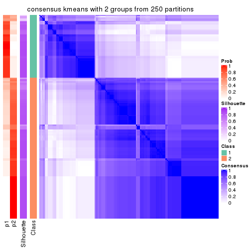</p>

</div>
<div id='tab-MAD-kmeans-consensus-heatmap-2'>
<pre><code class="r">consensus_heatmap(res, k = 3)
</code></pre>

<p>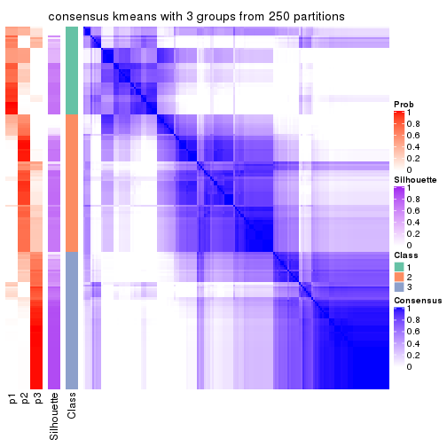</p>

</div>
<div id='tab-MAD-kmeans-consensus-heatmap-3'>
<pre><code class="r">consensus_heatmap(res, k = 4)
</code></pre>

<p>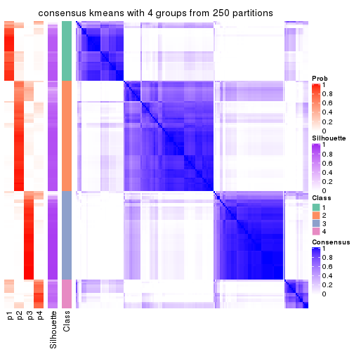</p>

</div>
<div id='tab-MAD-kmeans-consensus-heatmap-4'>
<pre><code class="r">consensus_heatmap(res, k = 5)
</code></pre>

<p>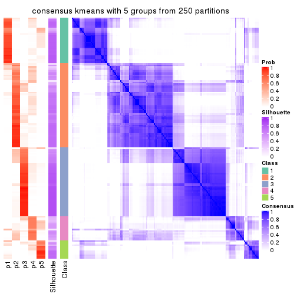</p>

</div>
<div id='tab-MAD-kmeans-consensus-heatmap-5'>
<pre><code class="r">consensus_heatmap(res, k = 6)
</code></pre>

<p>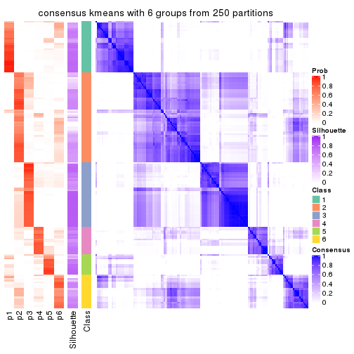</p>

</div>
</div>

Heatmaps for the membership of samples in all partitions to see how consistent they are:


<script>
$( function() {
	$( '#tabs-MAD-kmeans-membership-heatmap' ).tabs();
} );
</script>
<div id='tabs-MAD-kmeans-membership-heatmap'>
<ul>
<li><a href='#tab-MAD-kmeans-membership-heatmap-1'>k = 2</a></li>
<li><a href='#tab-MAD-kmeans-membership-heatmap-2'>k = 3</a></li>
<li><a href='#tab-MAD-kmeans-membership-heatmap-3'>k = 4</a></li>
<li><a href='#tab-MAD-kmeans-membership-heatmap-4'>k = 5</a></li>
<li><a href='#tab-MAD-kmeans-membership-heatmap-5'>k = 6</a></li>
</ul>
<div id='tab-MAD-kmeans-membership-heatmap-1'>
<pre><code class="r">membership_heatmap(res, k = 2)
</code></pre>

<p>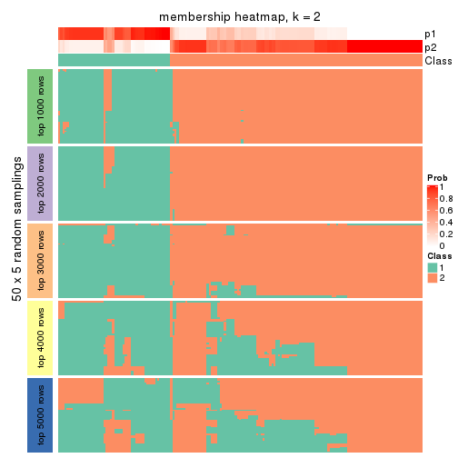</p>

</div>
<div id='tab-MAD-kmeans-membership-heatmap-2'>
<pre><code class="r">membership_heatmap(res, k = 3)
</code></pre>

<p>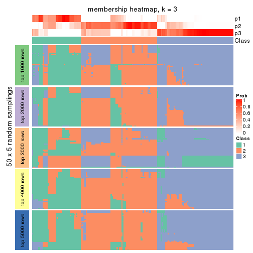</p>

</div>
<div id='tab-MAD-kmeans-membership-heatmap-3'>
<pre><code class="r">membership_heatmap(res, k = 4)
</code></pre>

<p>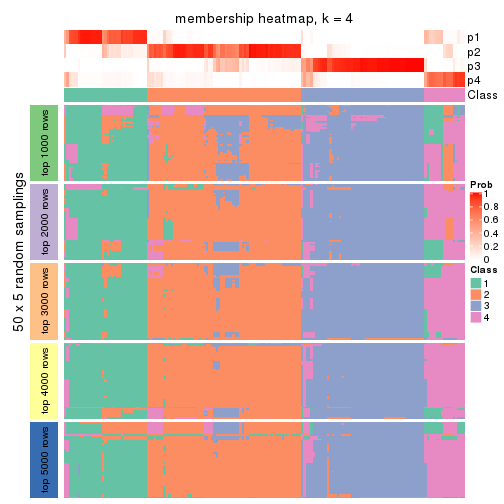</p>

</div>
<div id='tab-MAD-kmeans-membership-heatmap-4'>
<pre><code class="r">membership_heatmap(res, k = 5)
</code></pre>

<p>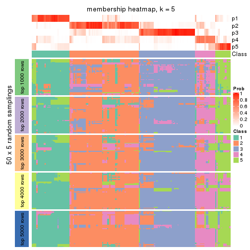</p>

</div>
<div id='tab-MAD-kmeans-membership-heatmap-5'>
<pre><code class="r">membership_heatmap(res, k = 6)
</code></pre>

<p>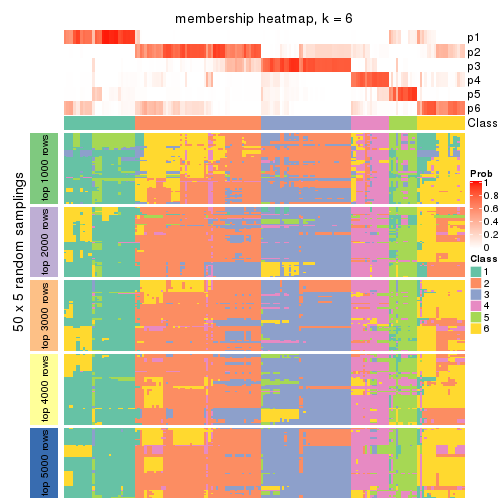</p>

</div>
</div>

As soon as we have had the classes for columns, we can look for signatures
which are significantly different between classes which can be candidate marks
for certain classes. Following are the heatmaps for signatures.


Signature heatmaps where rows are scaled:


<script>
$( function() {
	$( '#tabs-MAD-kmeans-get-signatures' ).tabs();
} );
</script>
<div id='tabs-MAD-kmeans-get-signatures'>
<ul>
<li><a href='#tab-MAD-kmeans-get-signatures-1'>k = 2</a></li>
<li><a href='#tab-MAD-kmeans-get-signatures-2'>k = 3</a></li>
<li><a href='#tab-MAD-kmeans-get-signatures-3'>k = 4</a></li>
<li><a href='#tab-MAD-kmeans-get-signatures-4'>k = 5</a></li>
<li><a href='#tab-MAD-kmeans-get-signatures-5'>k = 6</a></li>
</ul>
<div id='tab-MAD-kmeans-get-signatures-1'>
<pre><code class="r">get_signatures(res, k = 2)
</code></pre>

<p>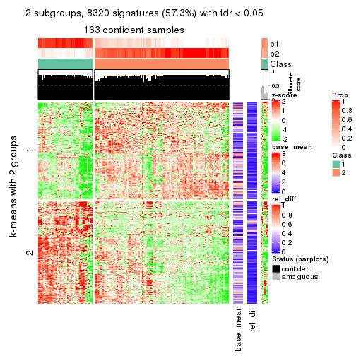</p>

</div>
<div id='tab-MAD-kmeans-get-signatures-2'>
<pre><code class="r">get_signatures(res, k = 3)
</code></pre>

<p>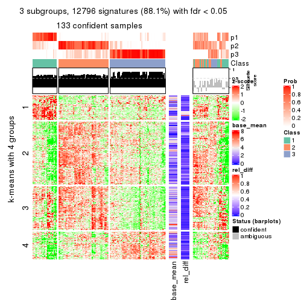</p>

</div>
<div id='tab-MAD-kmeans-get-signatures-3'>
<pre><code class="r">get_signatures(res, k = 4)
</code></pre>

<p>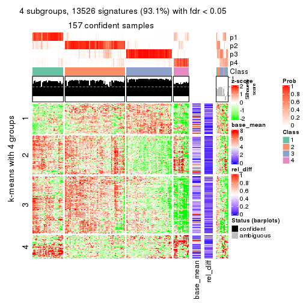</p>

</div>
<div id='tab-MAD-kmeans-get-signatures-4'>
<pre><code class="r">get_signatures(res, k = 5)
</code></pre>

<p>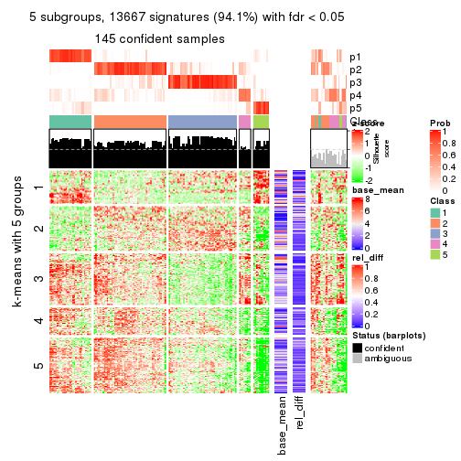</p>

</div>
<div id='tab-MAD-kmeans-get-signatures-5'>
<pre><code class="r">get_signatures(res, k = 6)
</code></pre>

<p>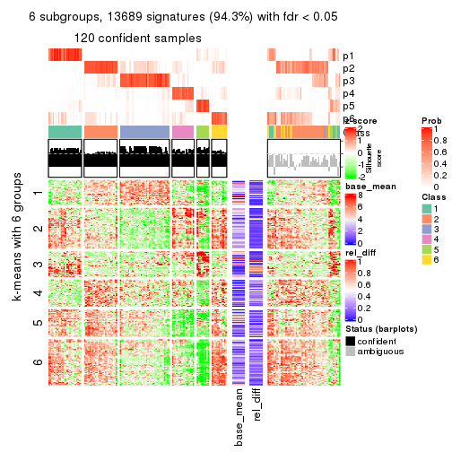</p>

</div>
</div>


Signature heatmaps where rows are not scaled:


<script>
$( function() {
	$( '#tabs-MAD-kmeans-get-signatures-no-scale' ).tabs();
} );
</script>
<div id='tabs-MAD-kmeans-get-signatures-no-scale'>
<ul>
<li><a href='#tab-MAD-kmeans-get-signatures-no-scale-1'>k = 2</a></li>
<li><a href='#tab-MAD-kmeans-get-signatures-no-scale-2'>k = 3</a></li>
<li><a href='#tab-MAD-kmeans-get-signatures-no-scale-3'>k = 4</a></li>
<li><a href='#tab-MAD-kmeans-get-signatures-no-scale-4'>k = 5</a></li>
<li><a href='#tab-MAD-kmeans-get-signatures-no-scale-5'>k = 6</a></li>
</ul>
<div id='tab-MAD-kmeans-get-signatures-no-scale-1'>
<pre><code class="r">get_signatures(res, k = 2, scale_rows = FALSE)
</code></pre>

<p>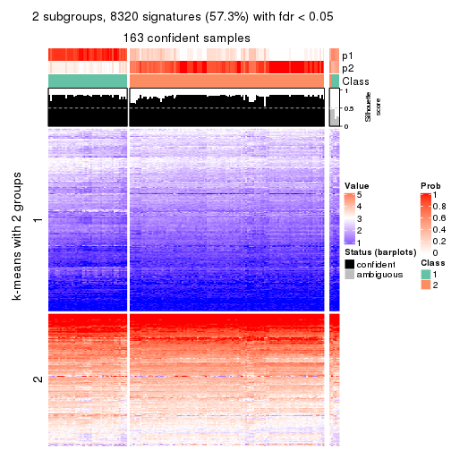</p>

</div>
<div id='tab-MAD-kmeans-get-signatures-no-scale-2'>
<pre><code class="r">get_signatures(res, k = 3, scale_rows = FALSE)
</code></pre>

<p>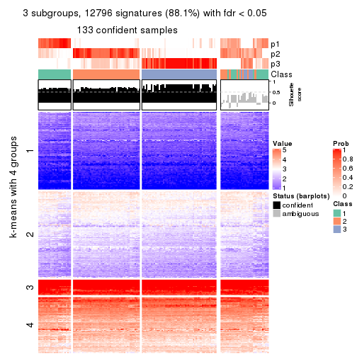</p>

</div>
<div id='tab-MAD-kmeans-get-signatures-no-scale-3'>
<pre><code class="r">get_signatures(res, k = 4, scale_rows = FALSE)
</code></pre>

<p>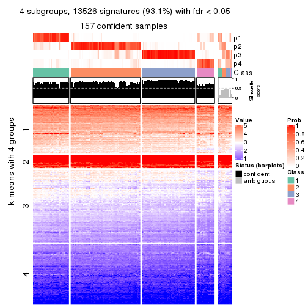</p>

</div>
<div id='tab-MAD-kmeans-get-signatures-no-scale-4'>
<pre><code class="r">get_signatures(res, k = 5, scale_rows = FALSE)
</code></pre>

<p>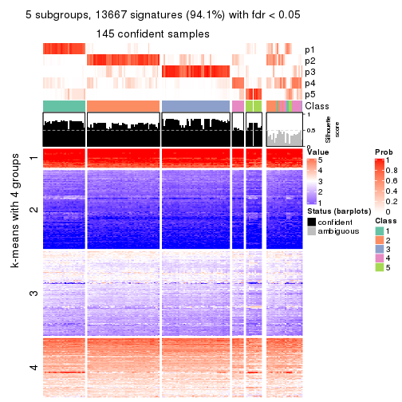</p>

</div>
<div id='tab-MAD-kmeans-get-signatures-no-scale-5'>
<pre><code class="r">get_signatures(res, k = 6, scale_rows = FALSE)
</code></pre>

<p>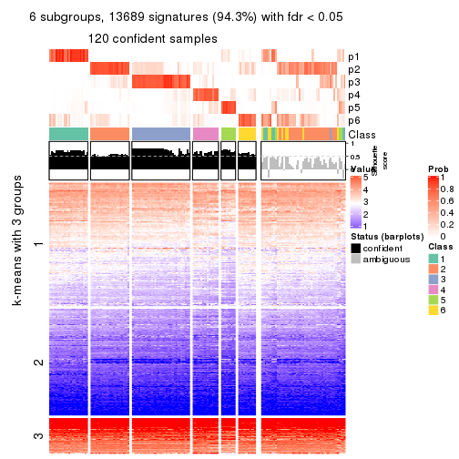</p>

</div>
</div>


Compare the overlap of signatures from different k:

```r
compare_signatures(res)
```

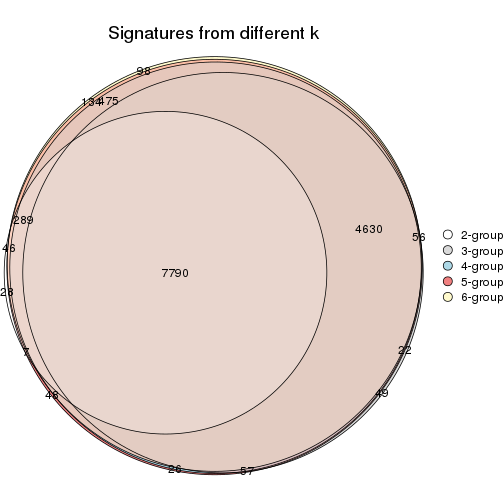

`get_signature()` returns a data frame invisibly. TO get the list of signatures, the function
call should be assigned to a variable explicitly. In following code, if `plot` argument is set
to `FALSE`, no heatmap is plotted while only the differential analysis is performed.

```r
# code only for demonstration
tb = get_signature(res, k = ..., plot = FALSE)
```

An example of the output of `tb` is:

```
#>   which_row         fdr    mean_1    mean_2 scaled_mean_1 scaled_mean_2 km
#> 1        38 0.042760348  8.373488  9.131774    -0.5533452     0.5164555  1
#> 2        40 0.018707592  7.106213  8.469186    -0.6173731     0.5762149  1
#> 3        55 0.019134737 10.221463 11.207825    -0.6159697     0.5749050  1
#> 4        59 0.006059896  5.921854  7.869574    -0.6899429     0.6439467  1
#> 5        60 0.018055526  8.928898 10.211722    -0.6204761     0.5791110  1
#> 6        98 0.009384629 15.714769 14.887706     0.6635654    -0.6193277  2
...
```

The columns in `tb` are:

1. `which_row`: row indices corresponding to the input matrix.
2. `fdr`: FDR for the differential test. 
3. `mean_x`: The mean value in group x.
4. `scaled_mean_x`: The mean value in group x after rows are scaled.
5. `km`: Row groups if k-means clustering is applied to rows.


UMAP plot which shows how samples are separated.


<script>
$( function() {
	$( '#tabs-MAD-kmeans-dimension-reduction' ).tabs();
} );
</script>
<div id='tabs-MAD-kmeans-dimension-reduction'>
<ul>
<li><a href='#tab-MAD-kmeans-dimension-reduction-1'>k = 2</a></li>
<li><a href='#tab-MAD-kmeans-dimension-reduction-2'>k = 3</a></li>
<li><a href='#tab-MAD-kmeans-dimension-reduction-3'>k = 4</a></li>
<li><a href='#tab-MAD-kmeans-dimension-reduction-4'>k = 5</a></li>
<li><a href='#tab-MAD-kmeans-dimension-reduction-5'>k = 6</a></li>
</ul>
<div id='tab-MAD-kmeans-dimension-reduction-1'>
<pre><code class="r">dimension_reduction(res, k = 2, method = &quot;UMAP&quot;)
</code></pre>

<p>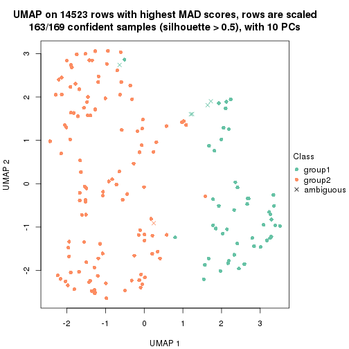</p>

</div>
<div id='tab-MAD-kmeans-dimension-reduction-2'>
<pre><code class="r">dimension_reduction(res, k = 3, method = &quot;UMAP&quot;)
</code></pre>

<p>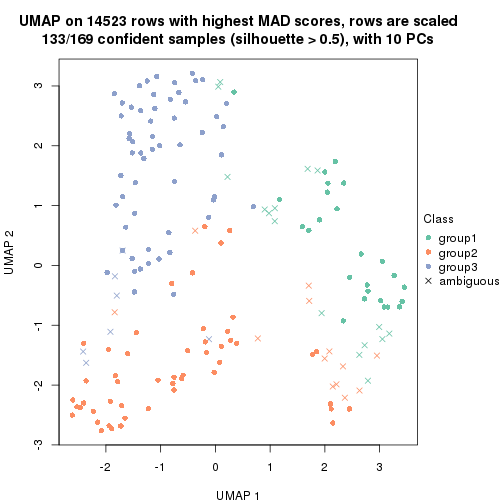</p>

</div>
<div id='tab-MAD-kmeans-dimension-reduction-3'>
<pre><code class="r">dimension_reduction(res, k = 4, method = &quot;UMAP&quot;)
</code></pre>

<p>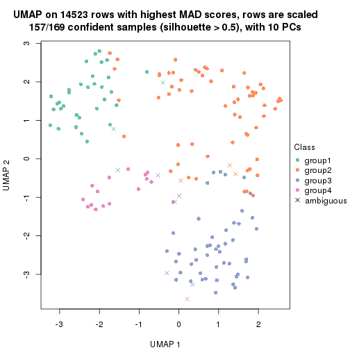</p>

</div>
<div id='tab-MAD-kmeans-dimension-reduction-4'>
<pre><code class="r">dimension_reduction(res, k = 5, method = &quot;UMAP&quot;)
</code></pre>

<p>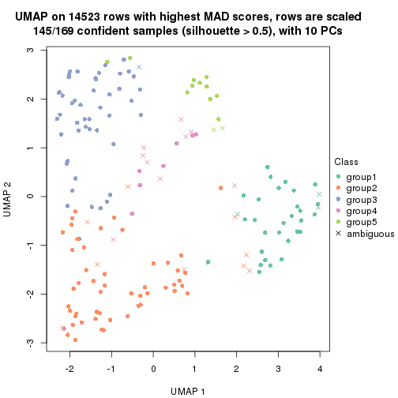</p>

</div>
<div id='tab-MAD-kmeans-dimension-reduction-5'>
<pre><code class="r">dimension_reduction(res, k = 6, method = &quot;UMAP&quot;)
</code></pre>

<p>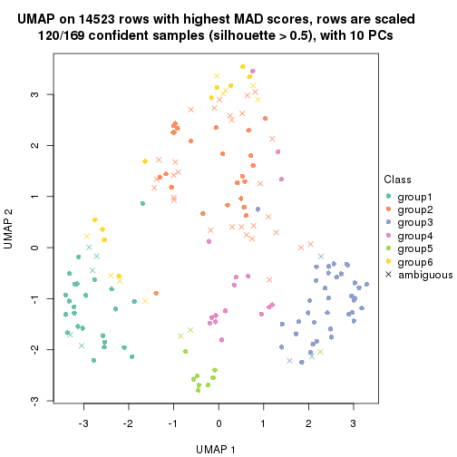</p>

</div>
</div>


Following heatmap shows how subgroups are split when increasing `k`:

```r
collect_classes(res)
```

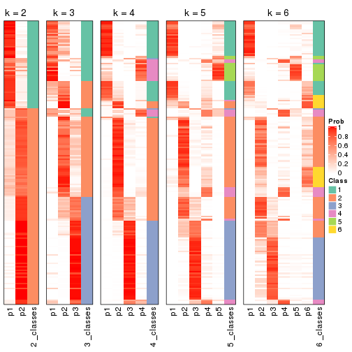


If matrix rows can be associated to genes, consider to use `GO_Enrichment(res,
...)` to perform function enrichment for the signature genes.


 

---------------------------------------------------


### MAD:skmeans


The object with results only for a single top-value method and a single partition method 
can be extracted as:

```r
res = res_list["MAD", "skmeans"]
# you can also extract it by
# res = res_list["MAD:skmeans"]
```

A summary of `res` and all the functions that can be applied to it:

```r
res
```

```
#> A 'ConsensusPartition' object with k = 2, 3, 4, 5, 6.
#>   On a matrix with 14523 rows and 169 columns.
#>   Top rows (1000, 2000, 3000, 4000, 5000) are extracted by 'MAD' method.
#>   Subgroups are detected by 'skmeans' method.
#>   Performed in total 1250 partitions by row resampling.
#>   Best k for subgroups seems to be 4.
#> 
#> Following methods can be applied to this 'ConsensusPartition' object:
#>  [1] "cola_report"             "collect_classes"         "collect_plots"          
#>  [4] "collect_stats"           "colnames"                "compare_signatures"     
#>  [7] "consensus_heatmap"       "dimension_reduction"     "functional_enrichment"  
#> [10] "get_anno_col"            "get_anno"                "get_classes"            
#> [13] "get_consensus"           "get_matrix"              "get_membership"         
#> [16] "get_param"               "get_signatures"          "get_stats"              
#> [19] "is_best_k"               "is_stable_k"             "membership_heatmap"     
#> [22] "ncol"                    "nrow"                    "plot_ecdf"              
#> [25] "rownames"                "select_partition_number" "show"                   
#> [28] "suggest_best_k"          "test_to_known_factors"
```

`collect_plots()` function collects all the plots made from `res` for all `k` (number of partitions)
into one single page to provide an easy and fast comparison between different `k`.

```r
collect_plots(res)
```

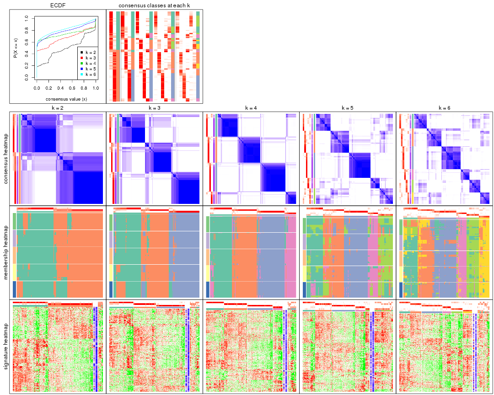

The plots are:

- The first row: a plot of the ECDF (Empirical cumulative distribution
  function) curves of the consensus matrix for each `k` and the heatmap of
  predicted classes for each `k`.
- The second row: heatmaps of the consensus matrix for each `k`.
- The third row: heatmaps of the membership matrix for each `k`.
- The fouth row: heatmaps of the signatures for each `k`.

All the plots in panels can be made by individual functions and they are
plotted later in this section.

`select_partition_number()` produces several plots showing different
statistics for choosing "optimized" `k`. There are following statistics:

- ECDF curves of the consensus matrix for each `k`;
- 1-PAC. [The PAC
  score](https://en.wikipedia.org/wiki/Consensus_clustering#Over-interpretation_potential_of_consensus_clustering)
  measures the proportion of the ambiguous subgrouping.
- Mean silhouette score.
- Concordance. The mean probability of fiting the consensus class ids in all
  partitions.
- Area increased. Denote $A_k$ as the area under the ECDF curve for current
  `k`, the area increased is defined as $A_k - A_{k-1}$.
- Rand index. The percent of pairs of samples that are both in a same cluster
  or both are not in a same cluster in the partition of k and k-1.
- Jaccard index. The ratio of pairs of samples are both in a same cluster in
  the partition of k and k-1 and the pairs of samples are both in a same
  cluster in the partition k or k-1.

The detailed explanations of these statistics can be found in [the cola
vignette](http://bioconductor.org/packages/devel/bioc/vignettes/cola/inst/doc/cola.html#toc_13).

Generally speaking, lower PAC score, higher mean silhouette score or higher
concordance corresponds to better partition. Rand index and Jaccard index
measure how similar the current partition is compared to partition with `k-1`.
If they are too similar, we won't accept `k` is better than `k-1`.

```r
select_partition_number(res)
```

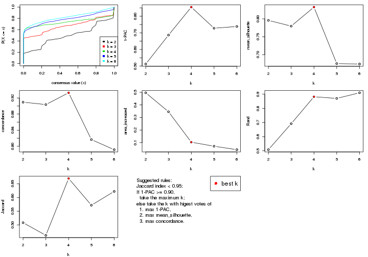

The numeric values for all these statistics can be obtained by `get_stats()`.

```r
get_stats(res)
```

```
#>   k 1-PAC mean_silhouette concordance area_increased  Rand Jaccard
#> 2 2 0.513           0.796       0.910         0.4963 0.508   0.508
#> 3 3 0.687           0.780       0.904         0.3458 0.692   0.462
#> 4 4 0.855           0.833       0.933         0.1038 0.882   0.669
#> 5 5 0.728           0.675       0.817         0.0716 0.870   0.572
#> 6 6 0.738           0.674       0.792         0.0444 0.910   0.622
```

`suggest_best_k()` suggests the best $k$ based on these statistics. The rules are as follows:

- All $k$ with Jaccard index larger than 0.95 are removed because the increase of
  the partition number does not provides enough extra information. If all $k$ are removed,
  the best $k$ is assigned by `NA`.
- For $k$ with 1-PAC larger than 0.9, the maximal $k$ is taken as the "best k". Other $k$ is called "optional k".
- If it does not fit the second rule. The $k$ with the highest vote of highest
  1-PAC, mean silhouette and concordance is taken as the "best k".

```r
suggest_best_k(res)
```

```
#> [1] 4
```


Following shows the table of the partitions (You need to click the **show/hide
code output** link to see it). The membership matrix (columns with name `p*`)
is inferred by
[`clue::cl_consensus()`](https://www.rdocumentation.org/link/cl_consensus?package=clue)
function with the `SE` method. Basically the value in the membership matrix
represents the probability to belong to a certain group. The finall class
label for an item is determined with the group with highest probability it
belongs to.

In `get_classes()` function, the entropy is calculated from the membership
matrix and the silhouette score is calculated from the consensus matrix.


<script>
$( function() {
	$( '#tabs-MAD-skmeans-get-classes' ).tabs();
} );
</script>
<div id='tabs-MAD-skmeans-get-classes'>
<ul>
<li><a href='#tab-MAD-skmeans-get-classes-1'>k = 2</a></li>
<li><a href='#tab-MAD-skmeans-get-classes-2'>k = 3</a></li>
<li><a href='#tab-MAD-skmeans-get-classes-3'>k = 4</a></li>
<li><a href='#tab-MAD-skmeans-get-classes-4'>k = 5</a></li>
<li><a href='#tab-MAD-skmeans-get-classes-5'>k = 6</a></li>
</ul>

<div id='tab-MAD-skmeans-get-classes-1'>
<p><a id='tab-MAD-skmeans-get-classes-1-a' style='color:#0366d6' href='#'>show/hide code output</a></p>
<pre><code class="r">cbind(get_classes(res, k = 2), get_membership(res, k = 2))
</code></pre>

<pre><code>#&gt;            class entropy silhouette    p1    p2
#&gt; SRR2052702     1  0.8267     0.6267 0.740 0.260
#&gt; SRR2052701     1  0.7219     0.7213 0.800 0.200
#&gt; SRR2052700     1  0.0000     0.9017 1.000 0.000
#&gt; SRR2052699     1  0.0000     0.9017 1.000 0.000
#&gt; SRR2052698     2  0.0000     0.8815 0.000 1.000
#&gt; SRR2052708     1  0.0000     0.9017 1.000 0.000
#&gt; SRR2052749     1  0.0000     0.9017 1.000 0.000
#&gt; SRR2052786     2  0.7745     0.7157 0.228 0.772
#&gt; SRR2052825     1  0.7674     0.7176 0.776 0.224
#&gt; SRR2052824     2  0.9977    -0.0233 0.472 0.528
#&gt; SRR2052823     1  0.0000     0.9017 1.000 0.000
#&gt; SRR2052822     2  0.0000     0.8815 0.000 1.000
#&gt; SRR2052821     2  0.0000     0.8815 0.000 1.000
#&gt; SRR2052820     2  0.7602     0.6666 0.220 0.780
#&gt; SRR2052819     2  0.0000     0.8815 0.000 1.000
#&gt; SRR2052818     1  0.8443     0.6045 0.728 0.272
#&gt; SRR2052817     2  0.0000     0.8815 0.000 1.000
#&gt; SRR2052816     1  0.5946     0.7916 0.856 0.144
#&gt; SRR2052815     2  0.9933     0.0601 0.452 0.548
#&gt; SRR2052814     2  0.0000     0.8815 0.000 1.000
#&gt; SRR2052813     2  0.7056     0.7497 0.192 0.808
#&gt; SRR2052812     2  0.8016     0.6980 0.244 0.756
#&gt; SRR2052811     1  0.8207     0.6339 0.744 0.256
#&gt; SRR2052810     2  0.9866     0.1769 0.432 0.568
#&gt; SRR2052809     2  0.0000     0.8815 0.000 1.000
#&gt; SRR2052808     2  0.0000     0.8815 0.000 1.000
#&gt; SRR2052807     1  0.7950     0.6809 0.760 0.240
#&gt; SRR2052806     1  0.0000     0.9017 1.000 0.000
#&gt; SRR2052805     1  0.0000     0.9017 1.000 0.000
#&gt; SRR2052804     1  0.9775     0.3363 0.588 0.412
#&gt; SRR2052803     1  0.0000     0.9017 1.000 0.000
#&gt; SRR2052802     2  0.9087     0.4928 0.324 0.676
#&gt; SRR2052801     1  0.7056     0.7405 0.808 0.192
#&gt; SRR2052800     1  0.9896     0.2522 0.560 0.440
#&gt; SRR2052799     1  0.7056     0.7405 0.808 0.192
#&gt; SRR2052798     1  0.0000     0.9017 1.000 0.000
#&gt; SRR2052797     2  0.0000     0.8815 0.000 1.000
#&gt; SRR2052796     1  0.0000     0.9017 1.000 0.000
#&gt; SRR2052795     1  0.0000     0.9017 1.000 0.000
#&gt; SRR2052794     1  0.8016     0.6754 0.756 0.244
#&gt; SRR2052793     1  0.7056     0.7405 0.808 0.192
#&gt; SRR2052792     2  0.6973     0.7090 0.188 0.812
#&gt; SRR2052791     2  0.9970     0.0736 0.468 0.532
#&gt; SRR2052790     2  0.0000     0.8815 0.000 1.000
#&gt; SRR2052789     2  0.0000     0.8815 0.000 1.000
#&gt; SRR2052788     2  0.0000     0.8815 0.000 1.000
#&gt; SRR2052787     2  0.7674     0.7199 0.224 0.776
#&gt; SRR2052785     2  0.0000     0.8815 0.000 1.000
#&gt; SRR2052784     2  0.0000     0.8815 0.000 1.000
#&gt; SRR2052783     2  0.0000     0.8815 0.000 1.000
#&gt; SRR2052782     2  0.0000     0.8815 0.000 1.000
#&gt; SRR2052781     2  0.0000     0.8815 0.000 1.000
#&gt; SRR2052780     2  0.0000     0.8815 0.000 1.000
#&gt; SRR2052777     2  0.0000     0.8815 0.000 1.000
#&gt; SRR2052779     2  0.0000     0.8815 0.000 1.000
#&gt; SRR2052778     2  0.0000     0.8815 0.000 1.000
#&gt; SRR2052776     2  0.0000     0.8815 0.000 1.000
#&gt; SRR2052775     2  0.0000     0.8815 0.000 1.000
#&gt; SRR2052773     2  0.0000     0.8815 0.000 1.000
#&gt; SRR2052772     2  0.0000     0.8815 0.000 1.000
#&gt; SRR2052774     2  0.0000     0.8815 0.000 1.000
#&gt; SRR2052771     1  0.8016     0.6754 0.756 0.244
#&gt; SRR2052769     2  0.0000     0.8815 0.000 1.000
#&gt; SRR2052770     2  0.0000     0.8815 0.000 1.000
#&gt; SRR2052768     2  0.8016     0.6980 0.244 0.756
#&gt; SRR2052767     2  0.9922     0.2692 0.448 0.552
#&gt; SRR2052766     2  0.0000     0.8815 0.000 1.000
#&gt; SRR2052765     2  0.8016     0.6980 0.244 0.756
#&gt; SRR2052763     2  0.0000     0.8815 0.000 1.000
#&gt; SRR2052764     1  0.7219     0.7213 0.800 0.200
#&gt; SRR2052761     2  0.0938     0.8743 0.012 0.988
#&gt; SRR2052760     2  0.8016     0.6980 0.244 0.756
#&gt; SRR2052759     2  0.0000     0.8815 0.000 1.000
#&gt; SRR2052762     2  0.0000     0.8815 0.000 1.000
#&gt; SRR2052758     2  0.0000     0.8815 0.000 1.000
#&gt; SRR2052756     1  0.0000     0.9017 1.000 0.000
#&gt; SRR2052757     2  0.0000     0.8815 0.000 1.000
#&gt; SRR2052755     1  0.0000     0.9017 1.000 0.000
#&gt; SRR2052754     1  0.0000     0.9017 1.000 0.000
#&gt; SRR2052753     1  0.0000     0.9017 1.000 0.000
#&gt; SRR2052752     1  0.1633     0.8886 0.976 0.024
#&gt; SRR2052750     1  0.0000     0.9017 1.000 0.000
#&gt; SRR2052751     2  0.0000     0.8815 0.000 1.000
#&gt; SRR2052748     2  0.0000     0.8815 0.000 1.000
#&gt; SRR2052747     1  0.0000     0.9017 1.000 0.000
#&gt; SRR2052746     2  0.0000     0.8815 0.000 1.000
#&gt; SRR2052745     2  0.0000     0.8815 0.000 1.000
#&gt; SRR2052744     1  0.0000     0.9017 1.000 0.000
#&gt; SRR2052741     1  0.3733     0.8540 0.928 0.072
#&gt; SRR2052743     2  0.8144     0.6875 0.252 0.748
#&gt; SRR2052740     1  0.7602     0.7005 0.780 0.220
#&gt; SRR2052742     2  0.0000     0.8815 0.000 1.000
#&gt; SRR2052739     2  0.8016     0.6980 0.244 0.756
#&gt; SRR2052738     2  0.0000     0.8815 0.000 1.000
#&gt; SRR2052736     1  0.0000     0.9017 1.000 0.000
#&gt; SRR2052735     1  0.0000     0.9017 1.000 0.000
#&gt; SRR2052734     1  0.0000     0.9017 1.000 0.000
#&gt; SRR2052737     2  0.7219     0.7431 0.200 0.800
#&gt; SRR2052733     2  0.0000     0.8815 0.000 1.000
#&gt; SRR2052732     1  0.7056     0.7322 0.808 0.192
#&gt; SRR2052731     2  0.0000     0.8815 0.000 1.000
#&gt; SRR2052729     1  0.0000     0.9017 1.000 0.000
#&gt; SRR2052728     1  0.0000     0.9017 1.000 0.000
#&gt; SRR2052730     2  0.7745     0.6662 0.228 0.772
#&gt; SRR2052727     1  0.0000     0.9017 1.000 0.000
#&gt; SRR2052725     1  0.0000     0.9017 1.000 0.000
#&gt; SRR2052726     1  0.0000     0.9017 1.000 0.000
#&gt; SRR2052724     1  0.0000     0.9017 1.000 0.000
#&gt; SRR2052723     2  0.7219     0.6937 0.200 0.800
#&gt; SRR2052722     2  0.0000     0.8815 0.000 1.000
#&gt; SRR2052721     1  0.0000     0.9017 1.000 0.000
#&gt; SRR2052720     2  0.7376     0.7355 0.208 0.792
#&gt; SRR2052719     2  0.8016     0.6980 0.244 0.756
#&gt; SRR2052718     1  0.0000     0.9017 1.000 0.000
#&gt; SRR2052717     2  0.7056     0.7497 0.192 0.808
#&gt; SRR2052714     1  0.7219     0.7313 0.800 0.200
#&gt; SRR2052716     2  0.4022     0.8238 0.080 0.920
#&gt; SRR2052715     2  0.0000     0.8815 0.000 1.000
#&gt; SRR2052713     1  0.0000     0.9017 1.000 0.000
#&gt; SRR2052712     1  0.7376     0.7215 0.792 0.208
#&gt; SRR2052711     1  0.0000     0.9017 1.000 0.000
#&gt; SRR2052710     2  0.2043     0.8653 0.032 0.968
#&gt; SRR2052707     2  0.0000     0.8815 0.000 1.000
#&gt; SRR2052709     2  0.0000     0.8815 0.000 1.000
#&gt; SRR2052704     2  0.0000     0.8815 0.000 1.000
#&gt; SRR2052705     2  0.8016     0.6980 0.244 0.756
#&gt; SRR2052697     1  0.0000     0.9017 1.000 0.000
#&gt; SRR2052703     2  0.0000     0.8815 0.000 1.000
#&gt; SRR2052696     1  0.0000     0.9017 1.000 0.000
#&gt; SRR2052706     2  0.0000     0.8815 0.000 1.000
#&gt; SRR2052695     2  0.7219     0.7431 0.200 0.800
#&gt; SRR2052694     2  0.7299     0.7394 0.204 0.796
#&gt; SRR2052692     2  0.0000     0.8815 0.000 1.000
#&gt; SRR2052693     2  0.0000     0.8815 0.000 1.000
#&gt; SRR2052691     1  0.0000     0.9017 1.000 0.000
#&gt; SRR2052690     1  0.2948     0.8694 0.948 0.052
#&gt; SRR2052689     2  0.0000     0.8815 0.000 1.000
#&gt; SRR2052687     2  0.0000     0.8815 0.000 1.000
#&gt; SRR2052686     1  0.0000     0.9017 1.000 0.000
#&gt; SRR2052688     2  0.8016     0.6980 0.244 0.756
#&gt; SRR2052684     2  0.7219     0.6937 0.200 0.800
#&gt; SRR2052685     1  0.4298     0.8432 0.912 0.088
#&gt; SRR2052683     1  0.0000     0.9017 1.000 0.000
#&gt; SRR2052681     1  0.7139     0.7270 0.804 0.196
#&gt; SRR2052680     2  0.9963     0.0108 0.464 0.536
#&gt; SRR2052682     1  0.0000     0.9017 1.000 0.000
#&gt; SRR2052679     1  0.0000     0.9017 1.000 0.000
#&gt; SRR2052678     2  0.0000     0.8815 0.000 1.000
#&gt; SRR2052677     2  0.0000     0.8815 0.000 1.000
#&gt; SRR2052675     1  0.4939     0.8253 0.892 0.108
#&gt; SRR2052676     1  0.0000     0.9017 1.000 0.000
#&gt; SRR2052674     2  0.7883     0.6664 0.236 0.764
#&gt; SRR2052672     2  0.0000     0.8815 0.000 1.000
#&gt; SRR2052673     1  0.0000     0.9017 1.000 0.000
#&gt; SRR2052671     1  0.8081     0.6478 0.752 0.248
#&gt; SRR2052670     2  0.0000     0.8815 0.000 1.000
#&gt; SRR2052669     2  0.7139     0.7465 0.196 0.804
#&gt; SRR2052668     1  0.5737     0.7895 0.864 0.136
#&gt; SRR2052667     2  0.9815     0.3522 0.420 0.580
#&gt; SRR2052666     2  0.0000     0.8815 0.000 1.000
#&gt; SRR2052665     2  0.7376     0.7355 0.208 0.792
#&gt; SRR2052664     1  0.0000     0.9017 1.000 0.000
#&gt; SRR2052663     1  0.7056     0.7322 0.808 0.192
#&gt; SRR2052662     2  0.7883     0.7070 0.236 0.764
#&gt; SRR2052661     1  0.0000     0.9017 1.000 0.000
#&gt; SRR2052660     2  0.0000     0.8815 0.000 1.000
#&gt; SRR2052659     2  0.7219     0.6937 0.200 0.800
#&gt; SRR2052658     1  0.3733     0.8540 0.928 0.072
#&gt; SRR2052657     1  0.0000     0.9017 1.000 0.000
</code></pre>

<script>
$('#tab-MAD-skmeans-get-classes-1-a').parent().next().next().hide();
$('#tab-MAD-skmeans-get-classes-1-a').click(function(){
  $('#tab-MAD-skmeans-get-classes-1-a').parent().next().next().toggle();
  return(false);
});
</script>
</div>

<div id='tab-MAD-skmeans-get-classes-2'>
<p><a id='tab-MAD-skmeans-get-classes-2-a' style='color:#0366d6' href='#'>show/hide code output</a></p>
<pre><code class="r">cbind(get_classes(res, k = 3), get_membership(res, k = 3))
</code></pre>

<pre><code>#&gt;            class entropy silhouette    p1    p2    p3
#&gt; SRR2052702     2  0.0000     0.8747 0.000 1.000 0.000
#&gt; SRR2052701     2  0.0000     0.8747 0.000 1.000 0.000
#&gt; SRR2052700     1  0.5098     0.5904 0.752 0.248 0.000
#&gt; SRR2052699     1  0.4654     0.7383 0.792 0.208 0.000
#&gt; SRR2052698     3  0.0000     0.9353 0.000 0.000 1.000
#&gt; SRR2052708     1  0.0000     0.8352 1.000 0.000 0.000
#&gt; SRR2052749     1  0.0000     0.8352 1.000 0.000 0.000
#&gt; SRR2052786     2  0.0000     0.8747 0.000 1.000 0.000
#&gt; SRR2052825     1  0.3816     0.7280 0.852 0.148 0.000
#&gt; SRR2052824     1  0.7850     0.3933 0.608 0.076 0.316
#&gt; SRR2052823     2  0.0000     0.8747 0.000 1.000 0.000
#&gt; SRR2052822     3  0.1860     0.8935 0.000 0.052 0.948
#&gt; SRR2052821     2  0.6008     0.4213 0.000 0.628 0.372
#&gt; SRR2052820     3  0.4002     0.7636 0.160 0.000 0.840
#&gt; SRR2052819     3  0.4605     0.7331 0.204 0.000 0.796
#&gt; SRR2052818     2  0.0000     0.8747 0.000 1.000 0.000
#&gt; SRR2052817     3  0.0000     0.9353 0.000 0.000 1.000
#&gt; SRR2052816     1  0.0000     0.8352 1.000 0.000 0.000
#&gt; SRR2052815     1  0.9066     0.3253 0.540 0.284 0.176
#&gt; SRR2052814     2  0.4605     0.6973 0.000 0.796 0.204
#&gt; SRR2052813     2  0.0000     0.8747 0.000 1.000 0.000
#&gt; SRR2052812     2  0.0000     0.8747 0.000 1.000 0.000
#&gt; SRR2052811     2  0.0000     0.8747 0.000 1.000 0.000
#&gt; SRR2052810     2  0.4605     0.6710 0.204 0.796 0.000
#&gt; SRR2052809     3  0.6215     0.1694 0.000 0.428 0.572
#&gt; SRR2052808     3  0.3889     0.8493 0.084 0.032 0.884
#&gt; SRR2052807     1  0.0000     0.8352 1.000 0.000 0.000
#&gt; SRR2052806     1  0.0000     0.8352 1.000 0.000 0.000
#&gt; SRR2052805     1  0.0000     0.8352 1.000 0.000 0.000
#&gt; SRR2052804     1  0.6274     0.0892 0.544 0.000 0.456
#&gt; SRR2052803     1  0.0000     0.8352 1.000 0.000 0.000
#&gt; SRR2052802     3  0.5905     0.4714 0.352 0.000 0.648
#&gt; SRR2052801     1  0.0000     0.8352 1.000 0.000 0.000
#&gt; SRR2052800     1  0.6267     0.1028 0.548 0.000 0.452
#&gt; SRR2052799     1  0.0000     0.8352 1.000 0.000 0.000
#&gt; SRR2052798     1  0.0000     0.8352 1.000 0.000 0.000
#&gt; SRR2052797     2  0.5882     0.4697 0.000 0.652 0.348
#&gt; SRR2052796     1  0.0000     0.8352 1.000 0.000 0.000
#&gt; SRR2052795     1  0.0000     0.8352 1.000 0.000 0.000
#&gt; SRR2052794     1  0.0000     0.8352 1.000 0.000 0.000
#&gt; SRR2052793     1  0.0000     0.8352 1.000 0.000 0.000
#&gt; SRR2052792     3  0.4605     0.7331 0.204 0.000 0.796
#&gt; SRR2052791     1  0.6126     0.2560 0.600 0.000 0.400
#&gt; SRR2052790     3  0.3482     0.8125 0.000 0.128 0.872
#&gt; SRR2052789     3  0.0000     0.9353 0.000 0.000 1.000
#&gt; SRR2052788     3  0.0000     0.9353 0.000 0.000 1.000
#&gt; SRR2052787     2  0.0000     0.8747 0.000 1.000 0.000
#&gt; SRR2052785     3  0.0000     0.9353 0.000 0.000 1.000
#&gt; SRR2052784     3  0.5291     0.6055 0.000 0.268 0.732
#&gt; SRR2052783     3  0.5216     0.6058 0.000 0.260 0.740
#&gt; SRR2052782     2  0.5882     0.4697 0.000 0.652 0.348
#&gt; SRR2052781     3  0.2878     0.8492 0.000 0.096 0.904
#&gt; SRR2052780     3  0.0000     0.9353 0.000 0.000 1.000
#&gt; SRR2052777     2  0.4887     0.6670 0.000 0.772 0.228
#&gt; SRR2052779     2  0.5882     0.4697 0.000 0.652 0.348
#&gt; SRR2052778     3  0.0000     0.9353 0.000 0.000 1.000
#&gt; SRR2052776     3  0.0000     0.9353 0.000 0.000 1.000
#&gt; SRR2052775     3  0.0000     0.9353 0.000 0.000 1.000
#&gt; SRR2052773     3  0.0000     0.9353 0.000 0.000 1.000
#&gt; SRR2052772     3  0.0000     0.9353 0.000 0.000 1.000
#&gt; SRR2052774     3  0.0000     0.9353 0.000 0.000 1.000
#&gt; SRR2052771     1  0.0000     0.8352 1.000 0.000 0.000
#&gt; SRR2052769     3  0.0000     0.9353 0.000 0.000 1.000
#&gt; SRR2052770     3  0.0000     0.9353 0.000 0.000 1.000
#&gt; SRR2052768     2  0.0000     0.8747 0.000 1.000 0.000
#&gt; SRR2052767     2  0.0000     0.8747 0.000 1.000 0.000
#&gt; SRR2052766     3  0.0000     0.9353 0.000 0.000 1.000
#&gt; SRR2052765     2  0.0000     0.8747 0.000 1.000 0.000
#&gt; SRR2052763     3  0.0000     0.9353 0.000 0.000 1.000
#&gt; SRR2052764     2  0.0000     0.8747 0.000 1.000 0.000
#&gt; SRR2052761     3  0.0000     0.9353 0.000 0.000 1.000
#&gt; SRR2052760     2  0.0000     0.8747 0.000 1.000 0.000
#&gt; SRR2052759     3  0.0000     0.9353 0.000 0.000 1.000
#&gt; SRR2052762     3  0.6274     0.1128 0.000 0.456 0.544
#&gt; SRR2052758     3  0.0000     0.9353 0.000 0.000 1.000
#&gt; SRR2052756     1  0.0000     0.8352 1.000 0.000 0.000
#&gt; SRR2052757     3  0.0000     0.9353 0.000 0.000 1.000
#&gt; SRR2052755     1  0.4605     0.7417 0.796 0.204 0.000
#&gt; SRR2052754     1  0.0000     0.8352 1.000 0.000 0.000
#&gt; SRR2052753     1  0.4605     0.7417 0.796 0.204 0.000
#&gt; SRR2052752     1  0.0000     0.8352 1.000 0.000 0.000
#&gt; SRR2052750     1  0.4605     0.7417 0.796 0.204 0.000
#&gt; SRR2052751     3  0.0000     0.9353 0.000 0.000 1.000
#&gt; SRR2052748     3  0.0000     0.9353 0.000 0.000 1.000
#&gt; SRR2052747     1  0.0000     0.8352 1.000 0.000 0.000
#&gt; SRR2052746     3  0.0000     0.9353 0.000 0.000 1.000
#&gt; SRR2052745     3  0.0000     0.9353 0.000 0.000 1.000
#&gt; SRR2052744     1  0.4605     0.7417 0.796 0.204 0.000
#&gt; SRR2052741     2  0.0000     0.8747 0.000 1.000 0.000
#&gt; SRR2052743     2  0.0000     0.8747 0.000 1.000 0.000
#&gt; SRR2052740     2  0.0000     0.8747 0.000 1.000 0.000
#&gt; SRR2052742     3  0.0892     0.9210 0.000 0.020 0.980
#&gt; SRR2052739     2  0.0000     0.8747 0.000 1.000 0.000
#&gt; SRR2052738     3  0.0000     0.9353 0.000 0.000 1.000
#&gt; SRR2052736     2  0.4399     0.6665 0.188 0.812 0.000
#&gt; SRR2052735     1  0.5591     0.6309 0.696 0.304 0.000
#&gt; SRR2052734     2  0.6154     0.1653 0.408 0.592 0.000
#&gt; SRR2052737     2  0.0000     0.8747 0.000 1.000 0.000
#&gt; SRR2052733     3  0.0000     0.9353 0.000 0.000 1.000
#&gt; SRR2052732     2  0.0000     0.8747 0.000 1.000 0.000
#&gt; SRR2052731     3  0.0000     0.9353 0.000 0.000 1.000
#&gt; SRR2052729     1  0.4605     0.7417 0.796 0.204 0.000
#&gt; SRR2052728     1  0.5497     0.6489 0.708 0.292 0.000
#&gt; SRR2052730     3  0.5291     0.6361 0.268 0.000 0.732
#&gt; SRR2052727     1  0.4605     0.7417 0.796 0.204 0.000
#&gt; SRR2052725     2  0.5678     0.4222 0.316 0.684 0.000
#&gt; SRR2052726     1  0.5529     0.6431 0.704 0.296 0.000
#&gt; SRR2052724     1  0.0000     0.8352 1.000 0.000 0.000
#&gt; SRR2052723     3  0.0000     0.9353 0.000 0.000 1.000
#&gt; SRR2052722     3  0.0000     0.9353 0.000 0.000 1.000
#&gt; SRR2052721     1  0.4605     0.7417 0.796 0.204 0.000
#&gt; SRR2052720     2  0.0000     0.8747 0.000 1.000 0.000
#&gt; SRR2052719     2  0.0000     0.8747 0.000 1.000 0.000
#&gt; SRR2052718     1  0.5497     0.6489 0.708 0.292 0.000
#&gt; SRR2052717     2  0.0000     0.8747 0.000 1.000 0.000
#&gt; SRR2052714     1  0.0000     0.8352 1.000 0.000 0.000
#&gt; SRR2052716     3  0.0000     0.9353 0.000 0.000 1.000
#&gt; SRR2052715     3  0.0000     0.9353 0.000 0.000 1.000
#&gt; SRR2052713     1  0.0000     0.8352 1.000 0.000 0.000
#&gt; SRR2052712     1  0.0424     0.8305 0.992 0.000 0.008
#&gt; SRR2052711     1  0.0000     0.8352 1.000 0.000 0.000
#&gt; SRR2052710     2  0.4555     0.6912 0.000 0.800 0.200
#&gt; SRR2052707     3  0.0000     0.9353 0.000 0.000 1.000
#&gt; SRR2052709     3  0.0000     0.9353 0.000 0.000 1.000
#&gt; SRR2052704     3  0.0000     0.9353 0.000 0.000 1.000
#&gt; SRR2052705     2  0.0000     0.8747 0.000 1.000 0.000
#&gt; SRR2052697     2  0.0000     0.8747 0.000 1.000 0.000
#&gt; SRR2052703     3  0.0000     0.9353 0.000 0.000 1.000
#&gt; SRR2052696     1  0.0000     0.8352 1.000 0.000 0.000
#&gt; SRR2052706     2  0.5465     0.5766 0.000 0.712 0.288
#&gt; SRR2052695     2  0.0000     0.8747 0.000 1.000 0.000
#&gt; SRR2052694     2  0.0000     0.8747 0.000 1.000 0.000
#&gt; SRR2052692     3  0.0000     0.9353 0.000 0.000 1.000
#&gt; SRR2052693     3  0.0000     0.9353 0.000 0.000 1.000
#&gt; SRR2052691     1  0.5497     0.6489 0.708 0.292 0.000
#&gt; SRR2052690     1  0.5948     0.5305 0.640 0.360 0.000
#&gt; SRR2052689     3  0.4605     0.7331 0.204 0.000 0.796
#&gt; SRR2052687     3  0.4605     0.7331 0.204 0.000 0.796
#&gt; SRR2052686     1  0.5497     0.6489 0.708 0.292 0.000
#&gt; SRR2052688     2  0.0000     0.8747 0.000 1.000 0.000
#&gt; SRR2052684     3  0.0000     0.9353 0.000 0.000 1.000
#&gt; SRR2052685     2  0.0000     0.8747 0.000 1.000 0.000
#&gt; SRR2052683     1  0.0000     0.8352 1.000 0.000 0.000
#&gt; SRR2052681     2  0.7777     0.2131 0.416 0.532 0.052
#&gt; SRR2052680     1  0.9119     0.3722 0.548 0.228 0.224
#&gt; SRR2052682     2  0.5591     0.4514 0.304 0.696 0.000
#&gt; SRR2052679     1  0.4605     0.7417 0.796 0.204 0.000
#&gt; SRR2052678     3  0.0000     0.9353 0.000 0.000 1.000
#&gt; SRR2052677     2  0.6168     0.3278 0.000 0.588 0.412
#&gt; SRR2052675     2  0.0000     0.8747 0.000 1.000 0.000
#&gt; SRR2052676     1  0.4605     0.7417 0.796 0.204 0.000
#&gt; SRR2052674     2  0.4605     0.6710 0.204 0.796 0.000
#&gt; SRR2052672     3  0.0000     0.9353 0.000 0.000 1.000
#&gt; SRR2052673     2  0.0000     0.8747 0.000 1.000 0.000
#&gt; SRR2052671     2  0.0000     0.8747 0.000 1.000 0.000
#&gt; SRR2052670     3  0.0000     0.9353 0.000 0.000 1.000
#&gt; SRR2052669     2  0.0000     0.8747 0.000 1.000 0.000
#&gt; SRR2052668     2  0.6192     0.1276 0.420 0.580 0.000
#&gt; SRR2052667     2  0.0000     0.8747 0.000 1.000 0.000
#&gt; SRR2052666     3  0.0000     0.9353 0.000 0.000 1.000
#&gt; SRR2052665     2  0.0000     0.8747 0.000 1.000 0.000
#&gt; SRR2052664     1  0.0000     0.8352 1.000 0.000 0.000
#&gt; SRR2052663     2  0.0000     0.8747 0.000 1.000 0.000
#&gt; SRR2052662     2  0.0000     0.8747 0.000 1.000 0.000
#&gt; SRR2052661     1  0.5497     0.6489 0.708 0.292 0.000
#&gt; SRR2052660     3  0.0000     0.9353 0.000 0.000 1.000
#&gt; SRR2052659     3  0.0000     0.9353 0.000 0.000 1.000
#&gt; SRR2052658     2  0.3482     0.7492 0.128 0.872 0.000
#&gt; SRR2052657     1  0.0000     0.8352 1.000 0.000 0.000
</code></pre>

<script>
$('#tab-MAD-skmeans-get-classes-2-a').parent().next().next().hide();
$('#tab-MAD-skmeans-get-classes-2-a').click(function(){
  $('#tab-MAD-skmeans-get-classes-2-a').parent().next().next().toggle();
  return(false);
});
</script>
</div>

<div id='tab-MAD-skmeans-get-classes-3'>
<p><a id='tab-MAD-skmeans-get-classes-3-a' style='color:#0366d6' href='#'>show/hide code output</a></p>
<pre><code class="r">cbind(get_classes(res, k = 4), get_membership(res, k = 4))
</code></pre>

<pre><code>#&gt;            class entropy silhouette    p1    p2    p3    p4
#&gt; SRR2052702     2  0.0000     0.9247 0.000 1.000 0.000 0.000
#&gt; SRR2052701     2  0.0000     0.9247 0.000 1.000 0.000 0.000
#&gt; SRR2052700     4  0.2401     0.8133 0.092 0.004 0.000 0.904
#&gt; SRR2052699     1  0.0000     0.9076 1.000 0.000 0.000 0.000
#&gt; SRR2052698     3  0.0188     0.9441 0.000 0.000 0.996 0.004
#&gt; SRR2052708     1  0.0336     0.9058 0.992 0.000 0.000 0.008
#&gt; SRR2052749     1  0.0336     0.9058 0.992 0.000 0.000 0.008
#&gt; SRR2052786     2  0.0188     0.9246 0.000 0.996 0.000 0.004
#&gt; SRR2052825     4  0.0188     0.8790 0.000 0.004 0.000 0.996
#&gt; SRR2052824     4  0.0188     0.8790 0.000 0.004 0.000 0.996
#&gt; SRR2052823     2  0.0188     0.9235 0.004 0.996 0.000 0.000
#&gt; SRR2052822     3  0.0524     0.9386 0.000 0.008 0.988 0.004
#&gt; SRR2052821     2  0.4018     0.6990 0.000 0.772 0.224 0.004
#&gt; SRR2052820     3  0.3910     0.7493 0.156 0.000 0.820 0.024
#&gt; SRR2052819     4  0.3569     0.7077 0.000 0.000 0.196 0.804
#&gt; SRR2052818     4  0.4985    -0.0283 0.000 0.468 0.000 0.532
#&gt; SRR2052817     3  0.0000     0.9459 0.000 0.000 1.000 0.000
#&gt; SRR2052816     4  0.3751     0.6967 0.196 0.004 0.000 0.800
#&gt; SRR2052815     4  0.0188     0.8790 0.000 0.004 0.000 0.996
#&gt; SRR2052814     2  0.3610     0.6998 0.000 0.800 0.000 0.200
#&gt; SRR2052813     2  0.0376     0.9234 0.000 0.992 0.004 0.004
#&gt; SRR2052812     2  0.0188     0.9246 0.000 0.996 0.000 0.004
#&gt; SRR2052811     2  0.0000     0.9247 0.000 1.000 0.000 0.000
#&gt; SRR2052810     4  0.1118     0.8621 0.000 0.036 0.000 0.964
#&gt; SRR2052809     2  0.5112     0.2662 0.000 0.560 0.436 0.004
#&gt; SRR2052808     4  0.1004     0.8680 0.000 0.004 0.024 0.972
#&gt; SRR2052807     4  0.0188     0.8780 0.004 0.000 0.000 0.996
#&gt; SRR2052806     1  0.0336     0.9058 0.992 0.000 0.000 0.008
#&gt; SRR2052805     1  0.0336     0.9058 0.992 0.000 0.000 0.008
#&gt; SRR2052804     4  0.0188     0.8788 0.000 0.000 0.004 0.996
#&gt; SRR2052803     1  0.0336     0.9058 0.992 0.000 0.000 0.008
#&gt; SRR2052802     4  0.0188     0.8788 0.000 0.000 0.004 0.996
#&gt; SRR2052801     1  0.5000     0.0205 0.504 0.000 0.000 0.496
#&gt; SRR2052800     4  0.0188     0.8788 0.000 0.000 0.004 0.996
#&gt; SRR2052799     4  0.4746     0.3806 0.368 0.000 0.000 0.632
#&gt; SRR2052798     1  0.0188     0.9069 0.996 0.000 0.000 0.004
#&gt; SRR2052797     2  0.2530     0.8402 0.000 0.896 0.100 0.004
#&gt; SRR2052796     1  0.4661     0.4641 0.652 0.000 0.000 0.348
#&gt; SRR2052795     1  0.0336     0.9058 0.992 0.000 0.000 0.008
#&gt; SRR2052794     4  0.4761     0.3710 0.372 0.000 0.000 0.628
#&gt; SRR2052793     1  0.4661     0.4641 0.652 0.000 0.000 0.348
#&gt; SRR2052792     3  0.4331     0.5922 0.000 0.000 0.712 0.288
#&gt; SRR2052791     3  0.7685     0.0469 0.256 0.000 0.456 0.288
#&gt; SRR2052790     3  0.0188     0.9441 0.000 0.000 0.996 0.004
#&gt; SRR2052789     3  0.0000     0.9459 0.000 0.000 1.000 0.000
#&gt; SRR2052788     3  0.0000     0.9459 0.000 0.000 1.000 0.000
#&gt; SRR2052787     2  0.0188     0.9246 0.000 0.996 0.000 0.004
#&gt; SRR2052785     3  0.0188     0.9441 0.000 0.000 0.996 0.004
#&gt; SRR2052784     3  0.3791     0.7236 0.000 0.200 0.796 0.004
#&gt; SRR2052783     3  0.5163    -0.0186 0.000 0.480 0.516 0.004
#&gt; SRR2052782     2  0.2714     0.8271 0.000 0.884 0.112 0.004
#&gt; SRR2052781     3  0.1004     0.9245 0.000 0.024 0.972 0.004
#&gt; SRR2052780     3  0.0000     0.9459 0.000 0.000 1.000 0.000
#&gt; SRR2052777     2  0.0524     0.9211 0.000 0.988 0.008 0.004
#&gt; SRR2052779     2  0.3105     0.7978 0.000 0.856 0.140 0.004
#&gt; SRR2052778     3  0.0000     0.9459 0.000 0.000 1.000 0.000
#&gt; SRR2052776     3  0.0188     0.9441 0.000 0.000 0.996 0.004
#&gt; SRR2052775     3  0.0000     0.9459 0.000 0.000 1.000 0.000
#&gt; SRR2052773     3  0.0188     0.9441 0.000 0.000 0.996 0.004
#&gt; SRR2052772     3  0.0000     0.9459 0.000 0.000 1.000 0.000
#&gt; SRR2052774     3  0.0000     0.9459 0.000 0.000 1.000 0.000
#&gt; SRR2052771     1  0.4992     0.0961 0.524 0.000 0.000 0.476
#&gt; SRR2052769     3  0.1557     0.9007 0.000 0.000 0.944 0.056
#&gt; SRR2052770     3  0.0000     0.9459 0.000 0.000 1.000 0.000
#&gt; SRR2052768     2  0.0188     0.9246 0.000 0.996 0.000 0.004
#&gt; SRR2052767     2  0.0000     0.9247 0.000 1.000 0.000 0.000
#&gt; SRR2052766     3  0.3444     0.7596 0.000 0.000 0.816 0.184
#&gt; SRR2052765     2  0.0188     0.9246 0.000 0.996 0.000 0.004
#&gt; SRR2052763     3  0.0000     0.9459 0.000 0.000 1.000 0.000
#&gt; SRR2052764     2  0.0000     0.9247 0.000 1.000 0.000 0.000
#&gt; SRR2052761     3  0.0000     0.9459 0.000 0.000 1.000 0.000
#&gt; SRR2052760     2  0.0188     0.9246 0.000 0.996 0.000 0.004
#&gt; SRR2052759     3  0.0000     0.9459 0.000 0.000 1.000 0.000
#&gt; SRR2052762     3  0.4925     0.2552 0.000 0.428 0.572 0.000
#&gt; SRR2052758     3  0.0000     0.9459 0.000 0.000 1.000 0.000
#&gt; SRR2052756     1  0.0000     0.9076 1.000 0.000 0.000 0.000
#&gt; SRR2052757     3  0.0188     0.9441 0.000 0.000 0.996 0.004
#&gt; SRR2052755     1  0.0000     0.9076 1.000 0.000 0.000 0.000
#&gt; SRR2052754     1  0.4679     0.4553 0.648 0.000 0.000 0.352
#&gt; SRR2052753     1  0.0000     0.9076 1.000 0.000 0.000 0.000
#&gt; SRR2052752     1  0.0336     0.9058 0.992 0.000 0.000 0.008
#&gt; SRR2052750     1  0.0000     0.9076 1.000 0.000 0.000 0.000
#&gt; SRR2052751     3  0.0000     0.9459 0.000 0.000 1.000 0.000
#&gt; SRR2052748     3  0.0000     0.9459 0.000 0.000 1.000 0.000
#&gt; SRR2052747     1  0.0188     0.9069 0.996 0.000 0.000 0.004
#&gt; SRR2052746     3  0.0000     0.9459 0.000 0.000 1.000 0.000
#&gt; SRR2052745     3  0.0000     0.9459 0.000 0.000 1.000 0.000
#&gt; SRR2052744     1  0.0000     0.9076 1.000 0.000 0.000 0.000
#&gt; SRR2052741     2  0.0469     0.9193 0.012 0.988 0.000 0.000
#&gt; SRR2052743     2  0.0000     0.9247 0.000 1.000 0.000 0.000
#&gt; SRR2052740     2  0.0336     0.9217 0.008 0.992 0.000 0.000
#&gt; SRR2052742     3  0.0524     0.9388 0.004 0.008 0.988 0.000
#&gt; SRR2052739     2  0.0188     0.9246 0.000 0.996 0.000 0.004
#&gt; SRR2052738     3  0.0000     0.9459 0.000 0.000 1.000 0.000
#&gt; SRR2052736     2  0.3400     0.7385 0.180 0.820 0.000 0.000
#&gt; SRR2052735     1  0.0000     0.9076 1.000 0.000 0.000 0.000
#&gt; SRR2052734     1  0.2469     0.7980 0.892 0.108 0.000 0.000
#&gt; SRR2052737     2  0.0524     0.9211 0.000 0.988 0.008 0.004
#&gt; SRR2052733     3  0.0000     0.9459 0.000 0.000 1.000 0.000
#&gt; SRR2052732     2  0.0000     0.9247 0.000 1.000 0.000 0.000
#&gt; SRR2052731     3  0.0000     0.9459 0.000 0.000 1.000 0.000
#&gt; SRR2052729     1  0.0000     0.9076 1.000 0.000 0.000 0.000
#&gt; SRR2052728     1  0.0000     0.9076 1.000 0.000 0.000 0.000
#&gt; SRR2052730     4  0.0188     0.8788 0.000 0.000 0.004 0.996
#&gt; SRR2052727     1  0.0000     0.9076 1.000 0.000 0.000 0.000
#&gt; SRR2052725     2  0.7307     0.0487 0.404 0.444 0.000 0.152
#&gt; SRR2052726     1  0.0000     0.9076 1.000 0.000 0.000 0.000
#&gt; SRR2052724     1  0.0336     0.9058 0.992 0.000 0.000 0.008
#&gt; SRR2052723     3  0.1211     0.9187 0.000 0.000 0.960 0.040
#&gt; SRR2052722     3  0.0000     0.9459 0.000 0.000 1.000 0.000
#&gt; SRR2052721     1  0.0000     0.9076 1.000 0.000 0.000 0.000
#&gt; SRR2052720     2  0.0188     0.9246 0.000 0.996 0.000 0.004
#&gt; SRR2052719     2  0.0000     0.9247 0.000 1.000 0.000 0.000
#&gt; SRR2052718     1  0.0000     0.9076 1.000 0.000 0.000 0.000
#&gt; SRR2052717     2  0.0000     0.9247 0.000 1.000 0.000 0.000
#&gt; SRR2052714     1  0.0817     0.8949 0.976 0.000 0.000 0.024
#&gt; SRR2052716     3  0.1637     0.9013 0.000 0.000 0.940 0.060
#&gt; SRR2052715     3  0.0000     0.9459 0.000 0.000 1.000 0.000
#&gt; SRR2052713     1  0.0188     0.9069 0.996 0.000 0.000 0.004
#&gt; SRR2052712     4  0.0188     0.8780 0.004 0.000 0.000 0.996
#&gt; SRR2052711     1  0.4741     0.4993 0.668 0.004 0.000 0.328
#&gt; SRR2052710     2  0.5268     0.3867 0.000 0.592 0.012 0.396
#&gt; SRR2052707     3  0.0000     0.9459 0.000 0.000 1.000 0.000
#&gt; SRR2052709     3  0.0000     0.9459 0.000 0.000 1.000 0.000
#&gt; SRR2052704     3  0.0000     0.9459 0.000 0.000 1.000 0.000
#&gt; SRR2052705     2  0.0000     0.9247 0.000 1.000 0.000 0.000
#&gt; SRR2052697     2  0.0336     0.9217 0.008 0.992 0.000 0.000
#&gt; SRR2052703     3  0.0000     0.9459 0.000 0.000 1.000 0.000
#&gt; SRR2052696     1  0.0188     0.9069 0.996 0.000 0.000 0.004
#&gt; SRR2052706     2  0.1510     0.9016 0.000 0.956 0.016 0.028
#&gt; SRR2052695     2  0.0188     0.9246 0.000 0.996 0.000 0.004
#&gt; SRR2052694     2  0.0188     0.9246 0.000 0.996 0.000 0.004
#&gt; SRR2052692     3  0.0000     0.9459 0.000 0.000 1.000 0.000
#&gt; SRR2052693     3  0.0188     0.9441 0.000 0.000 0.996 0.004
#&gt; SRR2052691     1  0.0000     0.9076 1.000 0.000 0.000 0.000
#&gt; SRR2052690     1  0.0000     0.9076 1.000 0.000 0.000 0.000
#&gt; SRR2052689     4  0.0469     0.8763 0.000 0.000 0.012 0.988
#&gt; SRR2052687     4  0.0336     0.8774 0.000 0.000 0.008 0.992
#&gt; SRR2052686     1  0.0188     0.9052 0.996 0.004 0.000 0.000
#&gt; SRR2052688     2  0.0188     0.9246 0.000 0.996 0.000 0.004
#&gt; SRR2052684     3  0.1118     0.9218 0.000 0.000 0.964 0.036
#&gt; SRR2052685     2  0.0188     0.9235 0.004 0.996 0.000 0.000
#&gt; SRR2052683     1  0.3837     0.6778 0.776 0.000 0.000 0.224
#&gt; SRR2052681     4  0.0188     0.8790 0.000 0.004 0.000 0.996
#&gt; SRR2052680     4  0.0188     0.8790 0.000 0.004 0.000 0.996
#&gt; SRR2052682     1  0.4877     0.3008 0.592 0.408 0.000 0.000
#&gt; SRR2052679     1  0.0000     0.9076 1.000 0.000 0.000 0.000
#&gt; SRR2052678     3  0.0000     0.9459 0.000 0.000 1.000 0.000
#&gt; SRR2052677     2  0.4741     0.5369 0.000 0.668 0.328 0.004
#&gt; SRR2052675     2  0.0336     0.9217 0.008 0.992 0.000 0.000
#&gt; SRR2052676     1  0.0000     0.9076 1.000 0.000 0.000 0.000
#&gt; SRR2052674     4  0.1302     0.8564 0.000 0.044 0.000 0.956
#&gt; SRR2052672     3  0.0000     0.9459 0.000 0.000 1.000 0.000
#&gt; SRR2052673     2  0.0336     0.9217 0.008 0.992 0.000 0.000
#&gt; SRR2052671     2  0.0000     0.9247 0.000 1.000 0.000 0.000
#&gt; SRR2052670     3  0.0000     0.9459 0.000 0.000 1.000 0.000
#&gt; SRR2052669     2  0.0188     0.9246 0.000 0.996 0.000 0.004
#&gt; SRR2052668     1  0.2530     0.7929 0.888 0.112 0.000 0.000
#&gt; SRR2052667     2  0.3219     0.7845 0.000 0.836 0.000 0.164
#&gt; SRR2052666     3  0.0000     0.9459 0.000 0.000 1.000 0.000
#&gt; SRR2052665     2  0.0000     0.9247 0.000 1.000 0.000 0.000
#&gt; SRR2052664     4  0.4817     0.3291 0.388 0.000 0.000 0.612
#&gt; SRR2052663     2  0.0000     0.9247 0.000 1.000 0.000 0.000
#&gt; SRR2052662     2  0.0188     0.9246 0.000 0.996 0.000 0.004
#&gt; SRR2052661     1  0.0188     0.9052 0.996 0.004 0.000 0.000
#&gt; SRR2052660     3  0.0000     0.9459 0.000 0.000 1.000 0.000
#&gt; SRR2052659     3  0.0188     0.9434 0.000 0.000 0.996 0.004
#&gt; SRR2052658     2  0.2704     0.8089 0.124 0.876 0.000 0.000
#&gt; SRR2052657     1  0.0188     0.9069 0.996 0.000 0.000 0.004
</code></pre>

<script>
$('#tab-MAD-skmeans-get-classes-3-a').parent().next().next().hide();
$('#tab-MAD-skmeans-get-classes-3-a').click(function(){
  $('#tab-MAD-skmeans-get-classes-3-a').parent().next().next().toggle();
  return(false);
});
</script>
</div>

<div id='tab-MAD-skmeans-get-classes-4'>
<p><a id='tab-MAD-skmeans-get-classes-4-a' style='color:#0366d6' href='#'>show/hide code output</a></p>
<pre><code class="r">cbind(get_classes(res, k = 5), get_membership(res, k = 5))
</code></pre>

<pre><code>#&gt;            class entropy silhouette    p1    p2    p3    p4    p5
#&gt; SRR2052702     2  0.4306    0.27538 0.000 0.508 0.000 0.000 0.492
#&gt; SRR2052701     5  0.3932    0.22671 0.000 0.328 0.000 0.000 0.672
#&gt; SRR2052700     4  0.4451    0.73392 0.036 0.004 0.000 0.724 0.236
#&gt; SRR2052699     5  0.4304    0.00541 0.484 0.000 0.000 0.000 0.516
#&gt; SRR2052698     3  0.0671    0.94433 0.000 0.016 0.980 0.004 0.000
#&gt; SRR2052708     1  0.0609    0.74278 0.980 0.000 0.000 0.000 0.020
#&gt; SRR2052749     1  0.0290    0.74380 0.992 0.000 0.000 0.000 0.008
#&gt; SRR2052786     2  0.0000    0.76392 0.000 1.000 0.000 0.000 0.000
#&gt; SRR2052825     4  0.0000    0.85879 0.000 0.000 0.000 1.000 0.000
#&gt; SRR2052824     4  0.0000    0.85879 0.000 0.000 0.000 1.000 0.000
#&gt; SRR2052823     5  0.4404    0.32136 0.000 0.264 0.000 0.032 0.704
#&gt; SRR2052822     2  0.3424    0.59554 0.000 0.760 0.240 0.000 0.000
#&gt; SRR2052821     2  0.5155    0.65562 0.000 0.700 0.068 0.016 0.216
#&gt; SRR2052820     3  0.3810    0.76903 0.168 0.000 0.792 0.000 0.040
#&gt; SRR2052819     4  0.3242    0.71179 0.000 0.012 0.172 0.816 0.000
#&gt; SRR2052818     4  0.3242    0.70899 0.000 0.000 0.000 0.784 0.216
#&gt; SRR2052817     3  0.0162    0.95204 0.000 0.004 0.996 0.000 0.000
#&gt; SRR2052816     4  0.4734    0.59930 0.036 0.000 0.000 0.652 0.312
#&gt; SRR2052815     4  0.0000    0.85879 0.000 0.000 0.000 1.000 0.000
#&gt; SRR2052814     2  0.3266    0.66280 0.000 0.796 0.000 0.200 0.004
#&gt; SRR2052813     2  0.0000    0.76392 0.000 1.000 0.000 0.000 0.000
#&gt; SRR2052812     2  0.3561    0.64423 0.000 0.740 0.000 0.000 0.260
#&gt; SRR2052811     2  0.4451    0.26911 0.000 0.504 0.000 0.004 0.492
#&gt; SRR2052810     4  0.2424    0.78870 0.000 0.000 0.000 0.868 0.132
#&gt; SRR2052809     2  0.2648    0.68385 0.000 0.848 0.152 0.000 0.000
#&gt; SRR2052808     4  0.2813    0.76063 0.000 0.000 0.000 0.832 0.168
#&gt; SRR2052807     4  0.4119    0.69165 0.212 0.000 0.000 0.752 0.036
#&gt; SRR2052806     1  0.0404    0.74393 0.988 0.000 0.000 0.000 0.012
#&gt; SRR2052805     1  0.0000    0.74259 1.000 0.000 0.000 0.000 0.000
#&gt; SRR2052804     4  0.3919    0.71854 0.188 0.000 0.000 0.776 0.036
#&gt; SRR2052803     1  0.0290    0.74381 0.992 0.000 0.000 0.000 0.008
#&gt; SRR2052802     4  0.4119    0.69165 0.212 0.000 0.000 0.752 0.036
#&gt; SRR2052801     1  0.4073    0.58600 0.752 0.000 0.000 0.216 0.032
#&gt; SRR2052800     4  0.3988    0.71030 0.196 0.000 0.000 0.768 0.036
#&gt; SRR2052799     1  0.4180    0.57521 0.744 0.000 0.000 0.220 0.036
#&gt; SRR2052798     1  0.2377    0.70328 0.872 0.000 0.000 0.000 0.128
#&gt; SRR2052797     2  0.3134    0.73404 0.000 0.848 0.032 0.000 0.120
#&gt; SRR2052796     1  0.2966    0.65651 0.816 0.000 0.000 0.184 0.000
#&gt; SRR2052795     1  0.0290    0.74381 0.992 0.000 0.000 0.000 0.008
#&gt; SRR2052794     1  0.4150    0.58105 0.748 0.000 0.000 0.216 0.036
#&gt; SRR2052793     1  0.2966    0.65651 0.816 0.000 0.000 0.184 0.000
#&gt; SRR2052792     3  0.5475    0.66016 0.124 0.000 0.716 0.120 0.040
#&gt; SRR2052791     1  0.5183    0.57231 0.740 0.000 0.092 0.128 0.040
#&gt; SRR2052790     2  0.3999    0.43966 0.000 0.656 0.344 0.000 0.000
#&gt; SRR2052789     3  0.0162    0.95204 0.000 0.004 0.996 0.000 0.000
#&gt; SRR2052788     3  0.0162    0.95204 0.000 0.004 0.996 0.000 0.000
#&gt; SRR2052787     2  0.0162    0.76379 0.000 0.996 0.004 0.000 0.000
#&gt; SRR2052785     3  0.1478    0.90896 0.000 0.064 0.936 0.000 0.000
#&gt; SRR2052784     2  0.2852    0.65714 0.000 0.828 0.172 0.000 0.000
#&gt; SRR2052783     2  0.2690    0.68047 0.000 0.844 0.156 0.000 0.000
#&gt; SRR2052782     2  0.0290    0.76373 0.000 0.992 0.008 0.000 0.000
#&gt; SRR2052781     2  0.3424    0.59566 0.000 0.760 0.240 0.000 0.000
#&gt; SRR2052780     3  0.0162    0.95204 0.000 0.004 0.996 0.000 0.000
#&gt; SRR2052777     2  0.0510    0.76284 0.000 0.984 0.016 0.000 0.000
#&gt; SRR2052779     2  0.0703    0.76084 0.000 0.976 0.024 0.000 0.000
#&gt; SRR2052778     3  0.0162    0.95204 0.000 0.004 0.996 0.000 0.000
#&gt; SRR2052776     3  0.3109    0.74436 0.000 0.200 0.800 0.000 0.000
#&gt; SRR2052775     3  0.0162    0.95204 0.000 0.004 0.996 0.000 0.000
#&gt; SRR2052773     3  0.3109    0.74368 0.000 0.200 0.800 0.000 0.000
#&gt; SRR2052772     3  0.0162    0.95204 0.000 0.004 0.996 0.000 0.000
#&gt; SRR2052774     3  0.0162    0.95204 0.000 0.004 0.996 0.000 0.000
#&gt; SRR2052771     1  0.3919    0.61742 0.776 0.000 0.000 0.188 0.036
#&gt; SRR2052769     3  0.3752    0.73655 0.000 0.016 0.780 0.200 0.004
#&gt; SRR2052770     3  0.0162    0.95204 0.000 0.004 0.996 0.000 0.000
#&gt; SRR2052768     2  0.3508    0.64991 0.000 0.748 0.000 0.000 0.252
#&gt; SRR2052767     2  0.4242    0.41373 0.000 0.572 0.000 0.000 0.428
#&gt; SRR2052766     3  0.3191    0.85696 0.016 0.000 0.868 0.076 0.040
#&gt; SRR2052765     2  0.5149    0.60852 0.000 0.680 0.000 0.104 0.216
#&gt; SRR2052763     3  0.0162    0.95070 0.000 0.000 0.996 0.000 0.004
#&gt; SRR2052764     5  0.5071   -0.11545 0.000 0.424 0.000 0.036 0.540
#&gt; SRR2052761     3  0.1205    0.92735 0.004 0.000 0.956 0.000 0.040
#&gt; SRR2052760     2  0.0290    0.76272 0.000 0.992 0.000 0.000 0.008
#&gt; SRR2052759     3  0.0162    0.95070 0.000 0.000 0.996 0.000 0.004
#&gt; SRR2052762     2  0.1704    0.74114 0.000 0.928 0.068 0.000 0.004
#&gt; SRR2052758     3  0.0000    0.95138 0.000 0.000 1.000 0.000 0.000
#&gt; SRR2052756     1  0.4030    0.43525 0.648 0.000 0.000 0.000 0.352
#&gt; SRR2052757     3  0.2773    0.79985 0.000 0.164 0.836 0.000 0.000
#&gt; SRR2052755     5  0.4283    0.09975 0.456 0.000 0.000 0.000 0.544
#&gt; SRR2052754     1  0.3246    0.66180 0.808 0.000 0.000 0.184 0.008
#&gt; SRR2052753     5  0.4300    0.03082 0.476 0.000 0.000 0.000 0.524
#&gt; SRR2052752     1  0.0000    0.74259 1.000 0.000 0.000 0.000 0.000
#&gt; SRR2052750     1  0.3932    0.47783 0.672 0.000 0.000 0.000 0.328
#&gt; SRR2052751     3  0.0162    0.95204 0.000 0.004 0.996 0.000 0.000
#&gt; SRR2052748     3  0.0290    0.94915 0.000 0.000 0.992 0.000 0.008
#&gt; SRR2052747     1  0.2377    0.70328 0.872 0.000 0.000 0.000 0.128
#&gt; SRR2052746     3  0.0162    0.95070 0.000 0.000 0.996 0.000 0.004
#&gt; SRR2052745     3  0.0162    0.95070 0.000 0.000 0.996 0.000 0.004
#&gt; SRR2052744     1  0.4297    0.10462 0.528 0.000 0.000 0.000 0.472
#&gt; SRR2052741     5  0.3932    0.44804 0.000 0.328 0.000 0.000 0.672
#&gt; SRR2052743     2  0.3480    0.55604 0.000 0.752 0.000 0.000 0.248
#&gt; SRR2052740     5  0.4138    0.36172 0.000 0.384 0.000 0.000 0.616
#&gt; SRR2052742     3  0.1251    0.92793 0.000 0.008 0.956 0.000 0.036
#&gt; SRR2052739     2  0.3210    0.67509 0.000 0.788 0.000 0.000 0.212
#&gt; SRR2052738     3  0.0162    0.95070 0.000 0.000 0.996 0.000 0.004
#&gt; SRR2052736     5  0.3236    0.57224 0.152 0.020 0.000 0.000 0.828
#&gt; SRR2052735     5  0.3895    0.43829 0.320 0.000 0.000 0.000 0.680
#&gt; SRR2052734     5  0.3143    0.54594 0.204 0.000 0.000 0.000 0.796
#&gt; SRR2052737     2  0.0609    0.76196 0.000 0.980 0.020 0.000 0.000
#&gt; SRR2052733     3  0.0162    0.95070 0.000 0.000 0.996 0.000 0.004
#&gt; SRR2052732     5  0.5141    0.34431 0.000 0.092 0.000 0.236 0.672
#&gt; SRR2052731     3  0.0162    0.95204 0.000 0.004 0.996 0.000 0.000
#&gt; SRR2052729     1  0.4030    0.43478 0.648 0.000 0.000 0.000 0.352
#&gt; SRR2052728     5  0.3983    0.40682 0.340 0.000 0.000 0.000 0.660
#&gt; SRR2052730     4  0.0000    0.85879 0.000 0.000 0.000 1.000 0.000
#&gt; SRR2052727     1  0.3612    0.56554 0.732 0.000 0.000 0.000 0.268
#&gt; SRR2052725     5  0.1831    0.57132 0.004 0.000 0.000 0.076 0.920
#&gt; SRR2052726     5  0.3932    0.42660 0.328 0.000 0.000 0.000 0.672
#&gt; SRR2052724     1  0.0794    0.74120 0.972 0.000 0.000 0.000 0.028
#&gt; SRR2052723     3  0.2694    0.86911 0.076 0.000 0.884 0.000 0.040
#&gt; SRR2052722     3  0.0162    0.95204 0.000 0.004 0.996 0.000 0.000
#&gt; SRR2052721     1  0.4138    0.36476 0.616 0.000 0.000 0.000 0.384
#&gt; SRR2052720     2  0.0000    0.76392 0.000 1.000 0.000 0.000 0.000
#&gt; SRR2052719     2  0.3395    0.66214 0.000 0.764 0.000 0.000 0.236
#&gt; SRR2052718     5  0.3707    0.47708 0.284 0.000 0.000 0.000 0.716
#&gt; SRR2052717     2  0.0290    0.76189 0.000 0.992 0.000 0.000 0.008
#&gt; SRR2052714     1  0.2848    0.72267 0.868 0.000 0.000 0.104 0.028
#&gt; SRR2052716     3  0.1915    0.90783 0.032 0.000 0.928 0.000 0.040
#&gt; SRR2052715     3  0.0162    0.95204 0.000 0.004 0.996 0.000 0.000
#&gt; SRR2052713     1  0.2377    0.70328 0.872 0.000 0.000 0.000 0.128
#&gt; SRR2052712     4  0.0000    0.85879 0.000 0.000 0.000 1.000 0.000
#&gt; SRR2052711     5  0.5364    0.22104 0.064 0.000 0.000 0.364 0.572
#&gt; SRR2052710     2  0.3999    0.44925 0.000 0.656 0.000 0.344 0.000
#&gt; SRR2052707     3  0.0162    0.95204 0.000 0.004 0.996 0.000 0.000
#&gt; SRR2052709     3  0.0162    0.95204 0.000 0.004 0.996 0.000 0.000
#&gt; SRR2052704     3  0.0000    0.95138 0.000 0.000 1.000 0.000 0.000
#&gt; SRR2052705     2  0.3039    0.62605 0.000 0.808 0.000 0.000 0.192
#&gt; SRR2052697     5  0.2605    0.51901 0.000 0.148 0.000 0.000 0.852
#&gt; SRR2052703     3  0.0162    0.95204 0.000 0.004 0.996 0.000 0.000
#&gt; SRR2052696     1  0.2377    0.70328 0.872 0.000 0.000 0.000 0.128
#&gt; SRR2052706     2  0.5896    0.52367 0.000 0.600 0.000 0.184 0.216
#&gt; SRR2052695     2  0.0000    0.76392 0.000 1.000 0.000 0.000 0.000
#&gt; SRR2052694     2  0.0000    0.76392 0.000 1.000 0.000 0.000 0.000
#&gt; SRR2052692     3  0.0162    0.95070 0.000 0.000 0.996 0.000 0.004
#&gt; SRR2052693     3  0.0579    0.94750 0.000 0.008 0.984 0.008 0.000
#&gt; SRR2052691     5  0.3966    0.41412 0.336 0.000 0.000 0.000 0.664
#&gt; SRR2052690     5  0.4511    0.36382 0.356 0.016 0.000 0.000 0.628
#&gt; SRR2052689     4  0.0000    0.85879 0.000 0.000 0.000 1.000 0.000
#&gt; SRR2052687     4  0.0162    0.85720 0.000 0.000 0.004 0.996 0.000
#&gt; SRR2052686     5  0.1478    0.58171 0.064 0.000 0.000 0.000 0.936
#&gt; SRR2052688     2  0.3242    0.67296 0.000 0.784 0.000 0.000 0.216
#&gt; SRR2052684     3  0.3192    0.83329 0.112 0.000 0.848 0.000 0.040
#&gt; SRR2052685     5  0.4262   -0.11429 0.000 0.440 0.000 0.000 0.560
#&gt; SRR2052683     1  0.4017    0.70896 0.788 0.000 0.000 0.148 0.064
#&gt; SRR2052681     4  0.0000    0.85879 0.000 0.000 0.000 1.000 0.000
#&gt; SRR2052680     4  0.0000    0.85879 0.000 0.000 0.000 1.000 0.000
#&gt; SRR2052682     5  0.2813    0.56375 0.168 0.000 0.000 0.000 0.832
#&gt; SRR2052679     1  0.3612    0.56554 0.732 0.000 0.000 0.000 0.268
#&gt; SRR2052678     3  0.0162    0.95204 0.000 0.004 0.996 0.000 0.000
#&gt; SRR2052677     2  0.1908    0.72718 0.000 0.908 0.092 0.000 0.000
#&gt; SRR2052675     5  0.3177    0.45492 0.000 0.208 0.000 0.000 0.792
#&gt; SRR2052676     1  0.4161    0.34504 0.608 0.000 0.000 0.000 0.392
#&gt; SRR2052674     4  0.2852    0.75682 0.000 0.000 0.000 0.828 0.172
#&gt; SRR2052672     3  0.0162    0.95204 0.000 0.004 0.996 0.000 0.000
#&gt; SRR2052673     5  0.2605    0.52205 0.000 0.148 0.000 0.000 0.852
#&gt; SRR2052671     2  0.4305    0.27954 0.000 0.512 0.000 0.000 0.488
#&gt; SRR2052670     3  0.0162    0.95204 0.000 0.004 0.996 0.000 0.000
#&gt; SRR2052669     2  0.0000    0.76392 0.000 1.000 0.000 0.000 0.000
#&gt; SRR2052668     5  0.4400    0.55180 0.060 0.196 0.000 0.000 0.744
#&gt; SRR2052667     2  0.5668    0.47566 0.000 0.632 0.000 0.196 0.172
#&gt; SRR2052666     3  0.0162    0.95070 0.000 0.000 0.996 0.000 0.004
#&gt; SRR2052665     2  0.3949    0.40662 0.000 0.668 0.000 0.000 0.332
#&gt; SRR2052664     1  0.4415    0.33289 0.604 0.000 0.000 0.388 0.008
#&gt; SRR2052663     5  0.5028   -0.03669 0.000 0.400 0.000 0.036 0.564
#&gt; SRR2052662     2  0.0000    0.76392 0.000 1.000 0.000 0.000 0.000
#&gt; SRR2052661     5  0.3612    0.49747 0.268 0.000 0.000 0.000 0.732
#&gt; SRR2052660     3  0.0162    0.95070 0.000 0.000 0.996 0.000 0.004
#&gt; SRR2052659     3  0.2077    0.90176 0.040 0.000 0.920 0.000 0.040
#&gt; SRR2052658     5  0.4949    0.32085 0.032 0.396 0.000 0.000 0.572
#&gt; SRR2052657     1  0.1965    0.71867 0.904 0.000 0.000 0.000 0.096
</code></pre>

<script>
$('#tab-MAD-skmeans-get-classes-4-a').parent().next().next().hide();
$('#tab-MAD-skmeans-get-classes-4-a').click(function(){
  $('#tab-MAD-skmeans-get-classes-4-a').parent().next().next().toggle();
  return(false);
});
</script>
</div>

<div id='tab-MAD-skmeans-get-classes-5'>
<p><a id='tab-MAD-skmeans-get-classes-5-a' style='color:#0366d6' href='#'>show/hide code output</a></p>
<pre><code class="r">cbind(get_classes(res, k = 6), get_membership(res, k = 6))
</code></pre>

<pre><code>#&gt;            class entropy silhouette    p1    p2    p3    p4    p5    p6
#&gt; SRR2052702     6  0.1918     0.7931 0.008 0.088 0.000 0.000 0.000 0.904
#&gt; SRR2052701     6  0.3189     0.6813 0.184 0.020 0.000 0.000 0.000 0.796
#&gt; SRR2052700     4  0.4019     0.7675 0.036 0.008 0.000 0.804 0.056 0.096
#&gt; SRR2052699     1  0.0922     0.7328 0.968 0.004 0.000 0.000 0.024 0.004
#&gt; SRR2052698     3  0.3428     0.6369 0.000 0.304 0.696 0.000 0.000 0.000
#&gt; SRR2052708     5  0.3244     0.7840 0.268 0.000 0.000 0.000 0.732 0.000
#&gt; SRR2052749     5  0.3151     0.7945 0.252 0.000 0.000 0.000 0.748 0.000
#&gt; SRR2052786     2  0.2558     0.6542 0.004 0.840 0.000 0.000 0.000 0.156
#&gt; SRR2052825     4  0.0405     0.8334 0.000 0.000 0.000 0.988 0.008 0.004
#&gt; SRR2052824     4  0.0405     0.8334 0.000 0.000 0.000 0.988 0.008 0.004
#&gt; SRR2052823     6  0.2333     0.7311 0.120 0.004 0.000 0.004 0.000 0.872
#&gt; SRR2052822     2  0.2003     0.6549 0.000 0.884 0.116 0.000 0.000 0.000
#&gt; SRR2052821     6  0.4404     0.4094 0.000 0.400 0.008 0.016 0.000 0.576
#&gt; SRR2052820     3  0.4549     0.6720 0.000 0.004 0.708 0.004 0.204 0.080
#&gt; SRR2052819     4  0.3223     0.7263 0.000 0.020 0.144 0.824 0.008 0.004
#&gt; SRR2052818     4  0.3923     0.2253 0.000 0.004 0.000 0.580 0.000 0.416
#&gt; SRR2052817     3  0.2454     0.8291 0.000 0.160 0.840 0.000 0.000 0.000
#&gt; SRR2052816     4  0.5047     0.6056 0.104 0.004 0.000 0.672 0.012 0.208
#&gt; SRR2052815     4  0.0146     0.8320 0.000 0.000 0.000 0.996 0.000 0.004
#&gt; SRR2052814     2  0.5587     0.3461 0.000 0.564 0.000 0.252 0.004 0.180
#&gt; SRR2052813     2  0.2219     0.6673 0.000 0.864 0.000 0.000 0.000 0.136
#&gt; SRR2052812     6  0.2793     0.7331 0.000 0.200 0.000 0.000 0.000 0.800
#&gt; SRR2052811     6  0.1913     0.7937 0.012 0.080 0.000 0.000 0.000 0.908
#&gt; SRR2052810     4  0.0937     0.8194 0.000 0.000 0.000 0.960 0.000 0.040
#&gt; SRR2052809     2  0.2003     0.6551 0.000 0.884 0.116 0.000 0.000 0.000
#&gt; SRR2052808     4  0.1714     0.7884 0.000 0.000 0.000 0.908 0.000 0.092
#&gt; SRR2052807     4  0.4666     0.4607 0.000 0.000 0.000 0.536 0.420 0.044
#&gt; SRR2052806     5  0.2793     0.8124 0.200 0.000 0.000 0.000 0.800 0.000
#&gt; SRR2052805     5  0.2762     0.8130 0.196 0.000 0.000 0.000 0.804 0.000
#&gt; SRR2052804     4  0.4709     0.5657 0.000 0.000 0.004 0.596 0.352 0.048
#&gt; SRR2052803     5  0.2854     0.8109 0.208 0.000 0.000 0.000 0.792 0.000
#&gt; SRR2052802     4  0.4841     0.4692 0.000 0.000 0.004 0.536 0.412 0.048
#&gt; SRR2052801     5  0.1794     0.7492 0.040 0.000 0.000 0.036 0.924 0.000
#&gt; SRR2052800     4  0.4753     0.5387 0.000 0.000 0.004 0.580 0.368 0.048
#&gt; SRR2052799     5  0.1938     0.7118 0.020 0.000 0.000 0.052 0.920 0.008
#&gt; SRR2052798     5  0.3756     0.6270 0.400 0.000 0.000 0.000 0.600 0.000
#&gt; SRR2052797     2  0.3975    -0.0672 0.000 0.544 0.004 0.000 0.000 0.452
#&gt; SRR2052796     5  0.2214     0.7954 0.096 0.000 0.000 0.016 0.888 0.000
#&gt; SRR2052795     5  0.3221     0.7871 0.264 0.000 0.000 0.000 0.736 0.000
#&gt; SRR2052794     5  0.2164     0.6825 0.016 0.000 0.000 0.028 0.912 0.044
#&gt; SRR2052793     5  0.1908     0.7952 0.096 0.000 0.000 0.004 0.900 0.000
#&gt; SRR2052792     3  0.5277     0.5727 0.000 0.004 0.636 0.024 0.260 0.076
#&gt; SRR2052791     5  0.2520     0.6167 0.000 0.004 0.024 0.008 0.888 0.076
#&gt; SRR2052790     2  0.1549     0.6916 0.000 0.936 0.044 0.000 0.000 0.020
#&gt; SRR2052789     3  0.2135     0.8494 0.000 0.128 0.872 0.000 0.000 0.000
#&gt; SRR2052788     3  0.2135     0.8494 0.000 0.128 0.872 0.000 0.000 0.000
#&gt; SRR2052787     2  0.2402     0.6658 0.004 0.856 0.000 0.000 0.000 0.140
#&gt; SRR2052785     2  0.3774     0.1826 0.000 0.592 0.408 0.000 0.000 0.000
#&gt; SRR2052784     2  0.1245     0.6973 0.000 0.952 0.016 0.000 0.000 0.032
#&gt; SRR2052783     2  0.2135     0.6480 0.000 0.872 0.128 0.000 0.000 0.000
#&gt; SRR2052782     2  0.1049     0.6963 0.000 0.960 0.008 0.000 0.000 0.032
#&gt; SRR2052781     2  0.2219     0.6427 0.000 0.864 0.136 0.000 0.000 0.000
#&gt; SRR2052780     3  0.2048     0.8527 0.000 0.120 0.880 0.000 0.000 0.000
#&gt; SRR2052777     2  0.0405     0.6941 0.000 0.988 0.008 0.000 0.000 0.004
#&gt; SRR2052779     2  0.1049     0.6963 0.000 0.960 0.008 0.000 0.000 0.032
#&gt; SRR2052778     3  0.1075     0.8622 0.000 0.048 0.952 0.000 0.000 0.000
#&gt; SRR2052776     2  0.3737     0.2212 0.000 0.608 0.392 0.000 0.000 0.000
#&gt; SRR2052775     3  0.1814     0.8578 0.000 0.100 0.900 0.000 0.000 0.000
#&gt; SRR2052773     2  0.3864    -0.0890 0.000 0.520 0.480 0.000 0.000 0.000
#&gt; SRR2052772     3  0.1814     0.8576 0.000 0.100 0.900 0.000 0.000 0.000
#&gt; SRR2052774     3  0.3076     0.7374 0.000 0.240 0.760 0.000 0.000 0.000
#&gt; SRR2052771     5  0.1718     0.6995 0.016 0.000 0.000 0.008 0.932 0.044
#&gt; SRR2052769     3  0.5027     0.3852 0.000 0.024 0.608 0.332 0.012 0.024
#&gt; SRR2052770     3  0.1141     0.8620 0.000 0.052 0.948 0.000 0.000 0.000
#&gt; SRR2052768     6  0.2854     0.7289 0.000 0.208 0.000 0.000 0.000 0.792
#&gt; SRR2052767     6  0.2053     0.7869 0.004 0.108 0.000 0.000 0.000 0.888
#&gt; SRR2052766     3  0.4848     0.6730 0.000 0.004 0.712 0.028 0.180 0.076
#&gt; SRR2052765     6  0.4880     0.5667 0.000 0.288 0.000 0.092 0.000 0.620
#&gt; SRR2052763     3  0.1426     0.8484 0.000 0.008 0.948 0.000 0.016 0.028
#&gt; SRR2052764     6  0.1951     0.7937 0.016 0.076 0.000 0.000 0.000 0.908
#&gt; SRR2052761     3  0.3107     0.7882 0.000 0.004 0.844 0.000 0.072 0.080
#&gt; SRR2052760     2  0.3971     0.0489 0.004 0.548 0.000 0.000 0.000 0.448
#&gt; SRR2052759     3  0.0909     0.8519 0.000 0.000 0.968 0.000 0.012 0.020
#&gt; SRR2052762     2  0.2890     0.6718 0.024 0.844 0.004 0.000 0.000 0.128
#&gt; SRR2052758     3  0.0547     0.8606 0.000 0.020 0.980 0.000 0.000 0.000
#&gt; SRR2052756     1  0.2006     0.6818 0.892 0.000 0.000 0.004 0.104 0.000
#&gt; SRR2052757     2  0.3684     0.2902 0.000 0.628 0.372 0.000 0.000 0.000
#&gt; SRR2052755     1  0.1219     0.7240 0.948 0.000 0.000 0.000 0.048 0.004
#&gt; SRR2052754     5  0.2536     0.8025 0.116 0.000 0.000 0.020 0.864 0.000
#&gt; SRR2052753     1  0.1204     0.7194 0.944 0.000 0.000 0.000 0.056 0.000
#&gt; SRR2052752     5  0.2378     0.8114 0.152 0.000 0.000 0.000 0.848 0.000
#&gt; SRR2052750     1  0.2762     0.5528 0.804 0.000 0.000 0.000 0.196 0.000
#&gt; SRR2052751     3  0.2652     0.8522 0.020 0.104 0.868 0.000 0.000 0.008
#&gt; SRR2052748     3  0.2451     0.8161 0.000 0.004 0.888 0.000 0.040 0.068
#&gt; SRR2052747     5  0.3765     0.6216 0.404 0.000 0.000 0.000 0.596 0.000
#&gt; SRR2052746     3  0.1053     0.8526 0.000 0.004 0.964 0.000 0.012 0.020
#&gt; SRR2052745     3  0.1478     0.8440 0.000 0.004 0.944 0.000 0.020 0.032
#&gt; SRR2052744     1  0.1387     0.7112 0.932 0.000 0.000 0.000 0.068 0.000
#&gt; SRR2052741     1  0.5394     0.3810 0.568 0.156 0.000 0.000 0.000 0.276
#&gt; SRR2052743     2  0.5127     0.3070 0.092 0.544 0.000 0.000 0.000 0.364
#&gt; SRR2052740     1  0.5595     0.0998 0.464 0.144 0.000 0.000 0.000 0.392
#&gt; SRR2052742     3  0.3433     0.8301 0.040 0.132 0.816 0.000 0.000 0.012
#&gt; SRR2052739     6  0.3578     0.5588 0.000 0.340 0.000 0.000 0.000 0.660
#&gt; SRR2052738     3  0.1390     0.8453 0.000 0.004 0.948 0.000 0.016 0.032
#&gt; SRR2052736     1  0.3266     0.6074 0.728 0.000 0.000 0.000 0.000 0.272
#&gt; SRR2052735     1  0.1657     0.7438 0.928 0.000 0.000 0.000 0.016 0.056
#&gt; SRR2052734     1  0.3126     0.6384 0.752 0.000 0.000 0.000 0.000 0.248
#&gt; SRR2052737     2  0.1757     0.6916 0.000 0.916 0.008 0.000 0.000 0.076
#&gt; SRR2052733     3  0.0909     0.8519 0.000 0.000 0.968 0.000 0.012 0.020
#&gt; SRR2052732     6  0.3123     0.7189 0.088 0.000 0.000 0.076 0.000 0.836
#&gt; SRR2052731     3  0.0790     0.8614 0.000 0.032 0.968 0.000 0.000 0.000
#&gt; SRR2052729     1  0.2378     0.6234 0.848 0.000 0.000 0.000 0.152 0.000
#&gt; SRR2052728     1  0.1088     0.7362 0.960 0.000 0.000 0.000 0.024 0.016
#&gt; SRR2052730     4  0.0777     0.8297 0.000 0.000 0.004 0.972 0.024 0.000
#&gt; SRR2052727     1  0.3371     0.3310 0.708 0.000 0.000 0.000 0.292 0.000
#&gt; SRR2052725     1  0.4291     0.5435 0.664 0.000 0.000 0.044 0.000 0.292
#&gt; SRR2052726     1  0.1829     0.7436 0.920 0.000 0.000 0.000 0.024 0.056
#&gt; SRR2052724     5  0.3050     0.8012 0.236 0.000 0.000 0.000 0.764 0.000
#&gt; SRR2052723     3  0.4499     0.6740 0.000 0.004 0.712 0.004 0.204 0.076
#&gt; SRR2052722     3  0.1957     0.8554 0.000 0.112 0.888 0.000 0.000 0.000
#&gt; SRR2052721     1  0.2219     0.6444 0.864 0.000 0.000 0.000 0.136 0.000
#&gt; SRR2052720     2  0.2482     0.6596 0.004 0.848 0.000 0.000 0.000 0.148
#&gt; SRR2052719     6  0.2883     0.7253 0.000 0.212 0.000 0.000 0.000 0.788
#&gt; SRR2052718     1  0.1866     0.7403 0.908 0.000 0.000 0.000 0.008 0.084
#&gt; SRR2052717     2  0.3168     0.6416 0.024 0.804 0.000 0.000 0.000 0.172
#&gt; SRR2052714     5  0.2631     0.8124 0.180 0.000 0.000 0.000 0.820 0.000
#&gt; SRR2052716     3  0.4241     0.7095 0.000 0.004 0.748 0.004 0.164 0.080
#&gt; SRR2052715     3  0.2048     0.8528 0.000 0.120 0.880 0.000 0.000 0.000
#&gt; SRR2052713     5  0.3810     0.5741 0.428 0.000 0.000 0.000 0.572 0.000
#&gt; SRR2052712     4  0.0260     0.8330 0.000 0.000 0.000 0.992 0.008 0.000
#&gt; SRR2052711     1  0.5817     0.3705 0.564 0.004 0.000 0.304 0.032 0.096
#&gt; SRR2052710     2  0.3163     0.5760 0.000 0.764 0.004 0.232 0.000 0.000
#&gt; SRR2052707     3  0.2178     0.8476 0.000 0.132 0.868 0.000 0.000 0.000
#&gt; SRR2052709     3  0.2135     0.8494 0.000 0.128 0.872 0.000 0.000 0.000
#&gt; SRR2052704     3  0.0632     0.8610 0.000 0.024 0.976 0.000 0.000 0.000
#&gt; SRR2052705     2  0.4565     0.2148 0.036 0.532 0.000 0.000 0.000 0.432
#&gt; SRR2052697     6  0.2320     0.7282 0.132 0.004 0.000 0.000 0.000 0.864
#&gt; SRR2052703     3  0.2135     0.8494 0.000 0.128 0.872 0.000 0.000 0.000
#&gt; SRR2052696     5  0.3747     0.6337 0.396 0.000 0.000 0.000 0.604 0.000
#&gt; SRR2052706     6  0.5667     0.4600 0.000 0.288 0.000 0.192 0.000 0.520
#&gt; SRR2052695     2  0.2527     0.6468 0.000 0.832 0.000 0.000 0.000 0.168
#&gt; SRR2052694     2  0.2520     0.6581 0.004 0.844 0.000 0.000 0.000 0.152
#&gt; SRR2052692     3  0.0909     0.8519 0.000 0.000 0.968 0.000 0.012 0.020
#&gt; SRR2052693     3  0.2527     0.8222 0.000 0.168 0.832 0.000 0.000 0.000
#&gt; SRR2052691     1  0.0520     0.7384 0.984 0.000 0.000 0.000 0.008 0.008
#&gt; SRR2052690     1  0.1036     0.7370 0.964 0.024 0.000 0.000 0.004 0.008
#&gt; SRR2052689     4  0.0603     0.8308 0.000 0.000 0.004 0.980 0.016 0.000
#&gt; SRR2052687     4  0.0291     0.8325 0.000 0.000 0.004 0.992 0.000 0.004
#&gt; SRR2052686     1  0.3290     0.6350 0.744 0.000 0.000 0.004 0.000 0.252
#&gt; SRR2052688     6  0.3499     0.5907 0.000 0.320 0.000 0.000 0.000 0.680
#&gt; SRR2052684     3  0.4499     0.6740 0.000 0.004 0.712 0.004 0.204 0.076
#&gt; SRR2052685     6  0.2106     0.7880 0.032 0.064 0.000 0.000 0.000 0.904
#&gt; SRR2052683     5  0.3284     0.8088 0.196 0.000 0.000 0.020 0.784 0.000
#&gt; SRR2052681     4  0.0405     0.8334 0.000 0.000 0.000 0.988 0.008 0.004
#&gt; SRR2052680     4  0.0405     0.8334 0.000 0.000 0.000 0.988 0.008 0.004
#&gt; SRR2052682     1  0.3221     0.6196 0.736 0.000 0.000 0.000 0.000 0.264
#&gt; SRR2052679     1  0.3221     0.4078 0.736 0.000 0.000 0.000 0.264 0.000
#&gt; SRR2052678     3  0.2219     0.8449 0.000 0.136 0.864 0.000 0.000 0.000
#&gt; SRR2052677     2  0.0865     0.6878 0.000 0.964 0.036 0.000 0.000 0.000
#&gt; SRR2052675     6  0.3201     0.6472 0.208 0.012 0.000 0.000 0.000 0.780
#&gt; SRR2052676     1  0.2219     0.6444 0.864 0.000 0.000 0.000 0.136 0.000
#&gt; SRR2052674     4  0.2135     0.7585 0.000 0.000 0.000 0.872 0.000 0.128
#&gt; SRR2052672     3  0.2003     0.8542 0.000 0.116 0.884 0.000 0.000 0.000
#&gt; SRR2052673     6  0.3489     0.5010 0.288 0.004 0.000 0.000 0.000 0.708
#&gt; SRR2052671     6  0.2070     0.7917 0.012 0.092 0.000 0.000 0.000 0.896
#&gt; SRR2052670     3  0.2048     0.8527 0.000 0.120 0.880 0.000 0.000 0.000
#&gt; SRR2052669     2  0.2362     0.6666 0.004 0.860 0.000 0.000 0.000 0.136
#&gt; SRR2052668     1  0.3532     0.6782 0.796 0.064 0.000 0.000 0.000 0.140
#&gt; SRR2052667     2  0.5916     0.4799 0.036 0.588 0.000 0.196 0.000 0.180
#&gt; SRR2052666     3  0.1700     0.8575 0.000 0.028 0.936 0.000 0.012 0.024
#&gt; SRR2052665     2  0.5383     0.1582 0.112 0.472 0.000 0.000 0.000 0.416
#&gt; SRR2052664     5  0.5324     0.3649 0.120 0.000 0.000 0.340 0.540 0.000
#&gt; SRR2052663     6  0.1951     0.7937 0.016 0.076 0.000 0.000 0.000 0.908
#&gt; SRR2052662     2  0.2520     0.6570 0.004 0.844 0.000 0.000 0.000 0.152
#&gt; SRR2052661     1  0.1967     0.7388 0.904 0.000 0.000 0.000 0.012 0.084
#&gt; SRR2052660     3  0.0909     0.8519 0.000 0.000 0.968 0.000 0.012 0.020
#&gt; SRR2052659     3  0.3410     0.7710 0.000 0.004 0.820 0.000 0.100 0.076
#&gt; SRR2052658     1  0.5846     0.2277 0.488 0.248 0.000 0.000 0.000 0.264
#&gt; SRR2052657     5  0.3620     0.6971 0.352 0.000 0.000 0.000 0.648 0.000
</code></pre>

<script>
$('#tab-MAD-skmeans-get-classes-5-a').parent().next().next().hide();
$('#tab-MAD-skmeans-get-classes-5-a').click(function(){
  $('#tab-MAD-skmeans-get-classes-5-a').parent().next().next().toggle();
  return(false);
});
</script>
</div>
</div>

Heatmaps for the consensus matrix. It visualizes the probability of two
samples to be in a same group.


<script>
$( function() {
	$( '#tabs-MAD-skmeans-consensus-heatmap' ).tabs();
} );
</script>
<div id='tabs-MAD-skmeans-consensus-heatmap'>
<ul>
<li><a href='#tab-MAD-skmeans-consensus-heatmap-1'>k = 2</a></li>
<li><a href='#tab-MAD-skmeans-consensus-heatmap-2'>k = 3</a></li>
<li><a href='#tab-MAD-skmeans-consensus-heatmap-3'>k = 4</a></li>
<li><a href='#tab-MAD-skmeans-consensus-heatmap-4'>k = 5</a></li>
<li><a href='#tab-MAD-skmeans-consensus-heatmap-5'>k = 6</a></li>
</ul>
<div id='tab-MAD-skmeans-consensus-heatmap-1'>
<pre><code class="r">consensus_heatmap(res, k = 2)
</code></pre>

<p>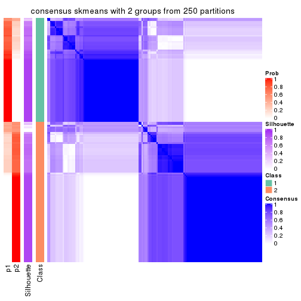</p>

</div>
<div id='tab-MAD-skmeans-consensus-heatmap-2'>
<pre><code class="r">consensus_heatmap(res, k = 3)
</code></pre>

<p>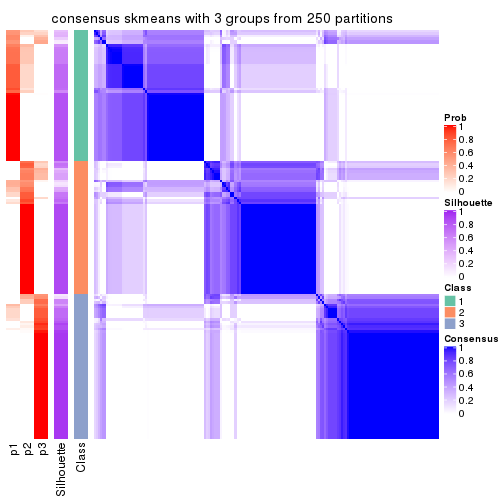</p>

</div>
<div id='tab-MAD-skmeans-consensus-heatmap-3'>
<pre><code class="r">consensus_heatmap(res, k = 4)
</code></pre>

<p>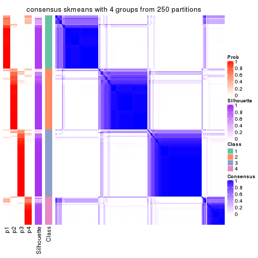</p>

</div>
<div id='tab-MAD-skmeans-consensus-heatmap-4'>
<pre><code class="r">consensus_heatmap(res, k = 5)
</code></pre>

<p>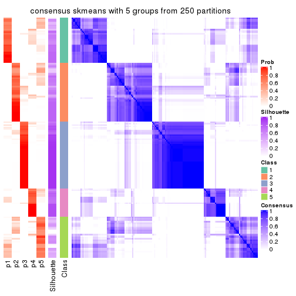</p>

</div>
<div id='tab-MAD-skmeans-consensus-heatmap-5'>
<pre><code class="r">consensus_heatmap(res, k = 6)
</code></pre>

<p></p>

</div>
</div>

Heatmaps for the membership of samples in all partitions to see how consistent they are:


<script>
$( function() {
	$( '#tabs-MAD-skmeans-membership-heatmap' ).tabs();
} );
</script>
<div id='tabs-MAD-skmeans-membership-heatmap'>
<ul>
<li><a href='#tab-MAD-skmeans-membership-heatmap-1'>k = 2</a></li>
<li><a href='#tab-MAD-skmeans-membership-heatmap-2'>k = 3</a></li>
<li><a href='#tab-MAD-skmeans-membership-heatmap-3'>k = 4</a></li>
<li><a href='#tab-MAD-skmeans-membership-heatmap-4'>k = 5</a></li>
<li><a href='#tab-MAD-skmeans-membership-heatmap-5'>k = 6</a></li>
</ul>
<div id='tab-MAD-skmeans-membership-heatmap-1'>
<pre><code class="r">membership_heatmap(res, k = 2)
</code></pre>

<p>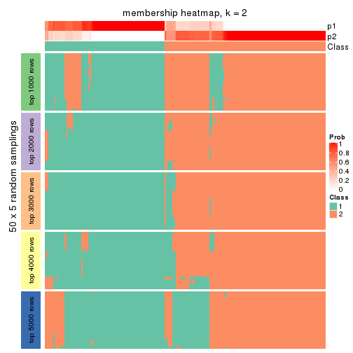</p>

</div>
<div id='tab-MAD-skmeans-membership-heatmap-2'>
<pre><code class="r">membership_heatmap(res, k = 3)
</code></pre>

<p>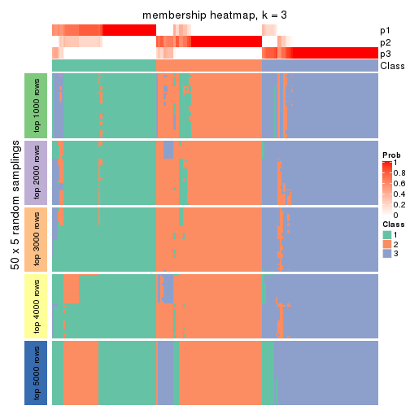</p>

</div>
<div id='tab-MAD-skmeans-membership-heatmap-3'>
<pre><code class="r">membership_heatmap(res, k = 4)
</code></pre>

<p>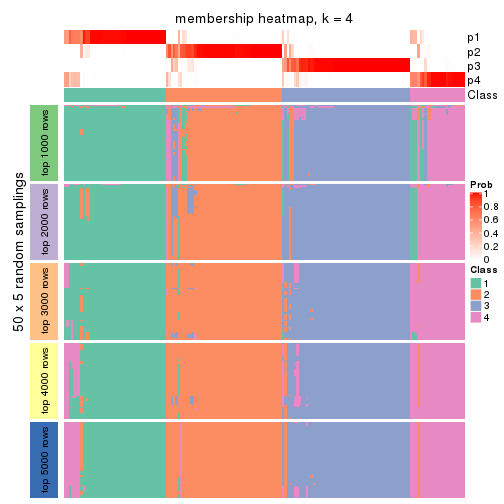</p>

</div>
<div id='tab-MAD-skmeans-membership-heatmap-4'>
<pre><code class="r">membership_heatmap(res, k = 5)
</code></pre>

<p>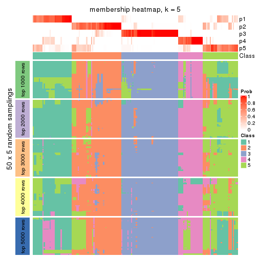</p>

</div>
<div id='tab-MAD-skmeans-membership-heatmap-5'>
<pre><code class="r">membership_heatmap(res, k = 6)
</code></pre>

<p>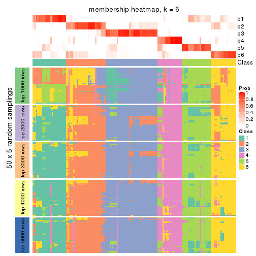</p>

</div>
</div>

As soon as we have had the classes for columns, we can look for signatures
which are significantly different between classes which can be candidate marks
for certain classes. Following are the heatmaps for signatures.


Signature heatmaps where rows are scaled:


<script>
$( function() {
	$( '#tabs-MAD-skmeans-get-signatures' ).tabs();
} );
</script>
<div id='tabs-MAD-skmeans-get-signatures'>
<ul>
<li><a href='#tab-MAD-skmeans-get-signatures-1'>k = 2</a></li>
<li><a href='#tab-MAD-skmeans-get-signatures-2'>k = 3</a></li>
<li><a href='#tab-MAD-skmeans-get-signatures-3'>k = 4</a></li>
<li><a href='#tab-MAD-skmeans-get-signatures-4'>k = 5</a></li>
<li><a href='#tab-MAD-skmeans-get-signatures-5'>k = 6</a></li>
</ul>
<div id='tab-MAD-skmeans-get-signatures-1'>
<pre><code class="r">get_signatures(res, k = 2)
</code></pre>

<p>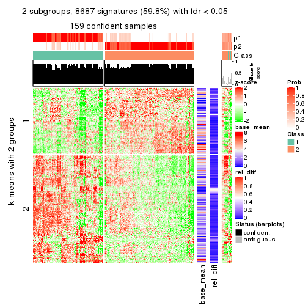</p>

</div>
<div id='tab-MAD-skmeans-get-signatures-2'>
<pre><code class="r">get_signatures(res, k = 3)
</code></pre>

<p>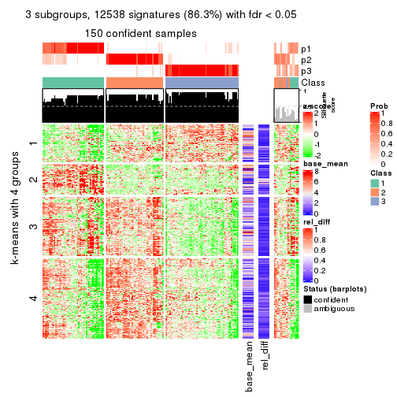</p>

</div>
<div id='tab-MAD-skmeans-get-signatures-3'>
<pre><code class="r">get_signatures(res, k = 4)
</code></pre>

<p>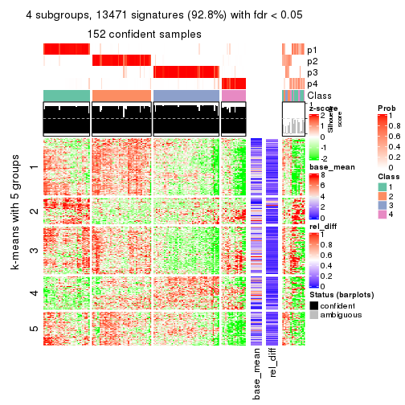</p>

</div>
<div id='tab-MAD-skmeans-get-signatures-4'>
<pre><code class="r">get_signatures(res, k = 5)
</code></pre>

<p>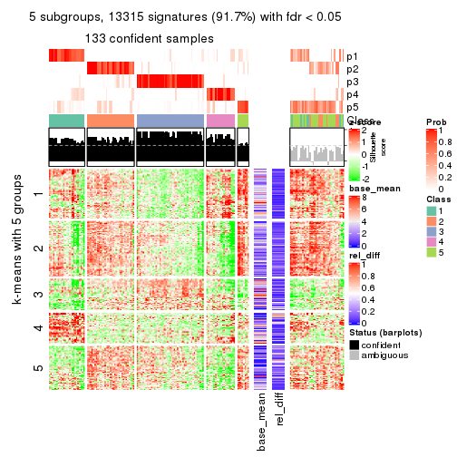</p>

</div>
<div id='tab-MAD-skmeans-get-signatures-5'>
<pre><code class="r">get_signatures(res, k = 6)
</code></pre>

<p>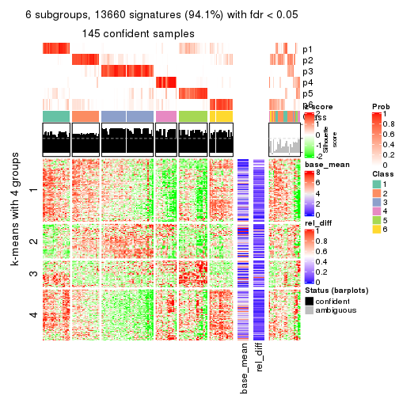</p>

</div>
</div>


Signature heatmaps where rows are not scaled:


<script>
$( function() {
	$( '#tabs-MAD-skmeans-get-signatures-no-scale' ).tabs();
} );
</script>
<div id='tabs-MAD-skmeans-get-signatures-no-scale'>
<ul>
<li><a href='#tab-MAD-skmeans-get-signatures-no-scale-1'>k = 2</a></li>
<li><a href='#tab-MAD-skmeans-get-signatures-no-scale-2'>k = 3</a></li>
<li><a href='#tab-MAD-skmeans-get-signatures-no-scale-3'>k = 4</a></li>
<li><a href='#tab-MAD-skmeans-get-signatures-no-scale-4'>k = 5</a></li>
<li><a href='#tab-MAD-skmeans-get-signatures-no-scale-5'>k = 6</a></li>
</ul>
<div id='tab-MAD-skmeans-get-signatures-no-scale-1'>
<pre><code class="r">get_signatures(res, k = 2, scale_rows = FALSE)
</code></pre>

<p>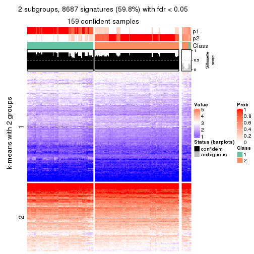</p>

</div>
<div id='tab-MAD-skmeans-get-signatures-no-scale-2'>
<pre><code class="r">get_signatures(res, k = 3, scale_rows = FALSE)
</code></pre>

<p>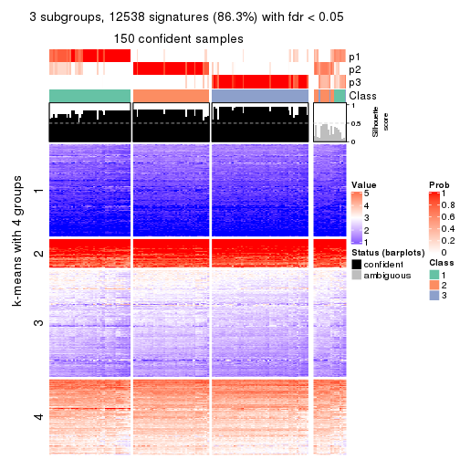</p>

</div>
<div id='tab-MAD-skmeans-get-signatures-no-scale-3'>
<pre><code class="r">get_signatures(res, k = 4, scale_rows = FALSE)
</code></pre>

<p>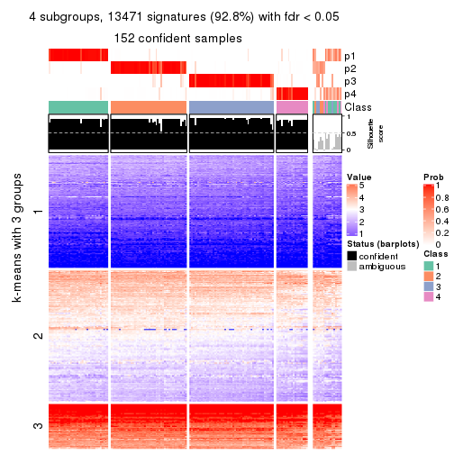</p>

</div>
<div id='tab-MAD-skmeans-get-signatures-no-scale-4'>
<pre><code class="r">get_signatures(res, k = 5, scale_rows = FALSE)
</code></pre>

<p>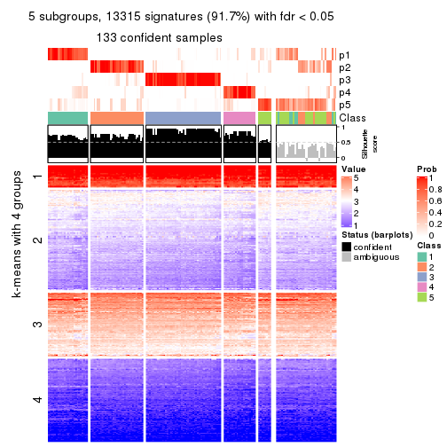</p>

</div>
<div id='tab-MAD-skmeans-get-signatures-no-scale-5'>
<pre><code class="r">get_signatures(res, k = 6, scale_rows = FALSE)
</code></pre>

<p>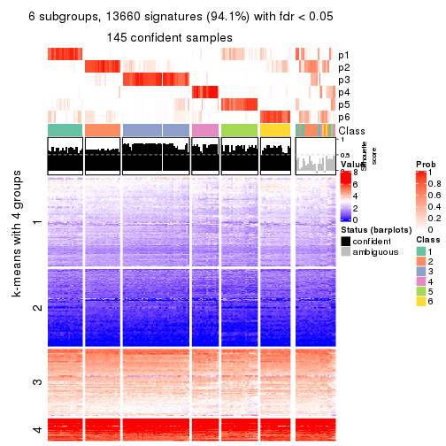</p>

</div>
</div>


Compare the overlap of signatures from different k:

```r
compare_signatures(res)
```

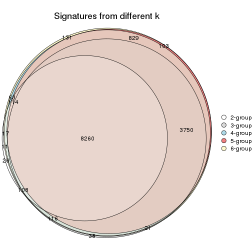

`get_signature()` returns a data frame invisibly. TO get the list of signatures, the function
call should be assigned to a variable explicitly. In following code, if `plot` argument is set
to `FALSE`, no heatmap is plotted while only the differential analysis is performed.

```r
# code only for demonstration
tb = get_signature(res, k = ..., plot = FALSE)
```

An example of the output of `tb` is:

```
#>   which_row         fdr    mean_1    mean_2 scaled_mean_1 scaled_mean_2 km
#> 1        38 0.042760348  8.373488  9.131774    -0.5533452     0.5164555  1
#> 2        40 0.018707592  7.106213  8.469186    -0.6173731     0.5762149  1
#> 3        55 0.019134737 10.221463 11.207825    -0.6159697     0.5749050  1
#> 4        59 0.006059896  5.921854  7.869574    -0.6899429     0.6439467  1
#> 5        60 0.018055526  8.928898 10.211722    -0.6204761     0.5791110  1
#> 6        98 0.009384629 15.714769 14.887706     0.6635654    -0.6193277  2
...
```

The columns in `tb` are:

1. `which_row`: row indices corresponding to the input matrix.
2. `fdr`: FDR for the differential test. 
3. `mean_x`: The mean value in group x.
4. `scaled_mean_x`: The mean value in group x after rows are scaled.
5. `km`: Row groups if k-means clustering is applied to rows.


UMAP plot which shows how samples are separated.


<script>
$( function() {
	$( '#tabs-MAD-skmeans-dimension-reduction' ).tabs();
} );
</script>
<div id='tabs-MAD-skmeans-dimension-reduction'>
<ul>
<li><a href='#tab-MAD-skmeans-dimension-reduction-1'>k = 2</a></li>
<li><a href='#tab-MAD-skmeans-dimension-reduction-2'>k = 3</a></li>
<li><a href='#tab-MAD-skmeans-dimension-reduction-3'>k = 4</a></li>
<li><a href='#tab-MAD-skmeans-dimension-reduction-4'>k = 5</a></li>
<li><a href='#tab-MAD-skmeans-dimension-reduction-5'>k = 6</a></li>
</ul>
<div id='tab-MAD-skmeans-dimension-reduction-1'>
<pre><code class="r">dimension_reduction(res, k = 2, method = &quot;UMAP&quot;)
</code></pre>

<p>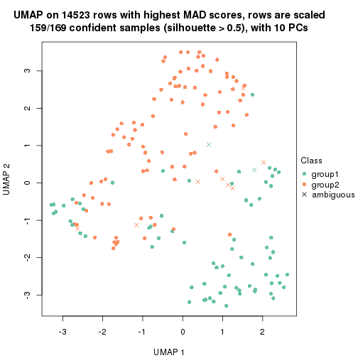</p>

</div>
<div id='tab-MAD-skmeans-dimension-reduction-2'>
<pre><code class="r">dimension_reduction(res, k = 3, method = &quot;UMAP&quot;)
</code></pre>

<p>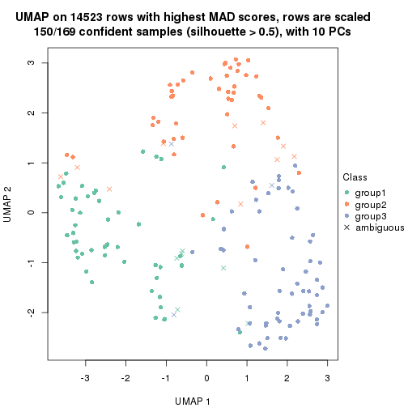</p>

</div>
<div id='tab-MAD-skmeans-dimension-reduction-3'>
<pre><code class="r">dimension_reduction(res, k = 4, method = &quot;UMAP&quot;)
</code></pre>

<p>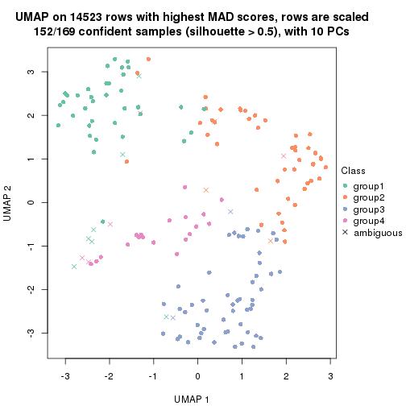</p>

</div>
<div id='tab-MAD-skmeans-dimension-reduction-4'>
<pre><code class="r">dimension_reduction(res, k = 5, method = &quot;UMAP&quot;)
</code></pre>

<p>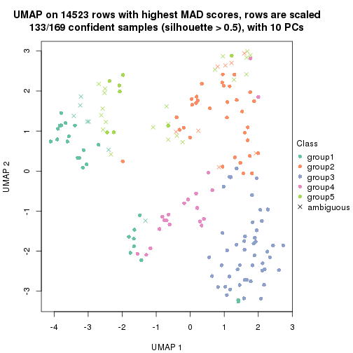</p>

</div>
<div id='tab-MAD-skmeans-dimension-reduction-5'>
<pre><code class="r">dimension_reduction(res, k = 6, method = &quot;UMAP&quot;)
</code></pre>

<p>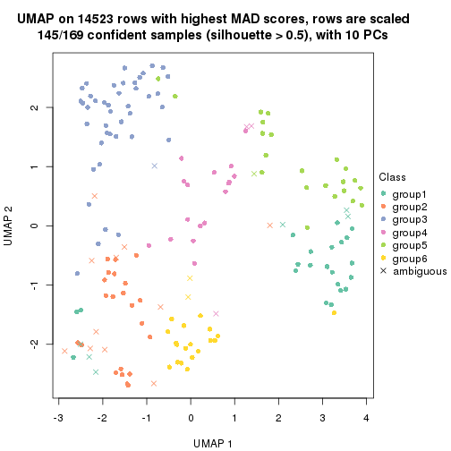</p>

</div>
</div>


Following heatmap shows how subgroups are split when increasing `k`:

```r
collect_classes(res)
```

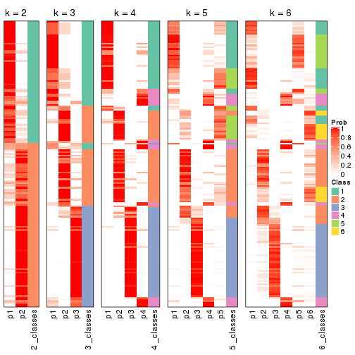


If matrix rows can be associated to genes, consider to use `GO_Enrichment(res,
...)` to perform function enrichment for the signature genes.


 

---------------------------------------------------


### MAD:pam


The object with results only for a single top-value method and a single partition method 
can be extracted as:

```r
res = res_list["MAD", "pam"]
# you can also extract it by
# res = res_list["MAD:pam"]
```

A summary of `res` and all the functions that can be applied to it:

```r
res
```

```
#> A 'ConsensusPartition' object with k = 2, 3, 4, 5, 6.
#>   On a matrix with 14523 rows and 169 columns.
#>   Top rows (1000, 2000, 3000, 4000, 5000) are extracted by 'MAD' method.
#>   Subgroups are detected by 'pam' method.
#>   Performed in total 1250 partitions by row resampling.
#>   Best k for subgroups seems to be 3.
#> 
#> Following methods can be applied to this 'ConsensusPartition' object:
#>  [1] "cola_report"             "collect_classes"         "collect_plots"          
#>  [4] "collect_stats"           "colnames"                "compare_signatures"     
#>  [7] "consensus_heatmap"       "dimension_reduction"     "functional_enrichment"  
#> [10] "get_anno_col"            "get_anno"                "get_classes"            
#> [13] "get_consensus"           "get_matrix"              "get_membership"         
#> [16] "get_param"               "get_signatures"          "get_stats"              
#> [19] "is_best_k"               "is_stable_k"             "membership_heatmap"     
#> [22] "ncol"                    "nrow"                    "plot_ecdf"              
#> [25] "rownames"                "select_partition_number" "show"                   
#> [28] "suggest_best_k"          "test_to_known_factors"
```

`collect_plots()` function collects all the plots made from `res` for all `k` (number of partitions)
into one single page to provide an easy and fast comparison between different `k`.

```r
collect_plots(res)
```

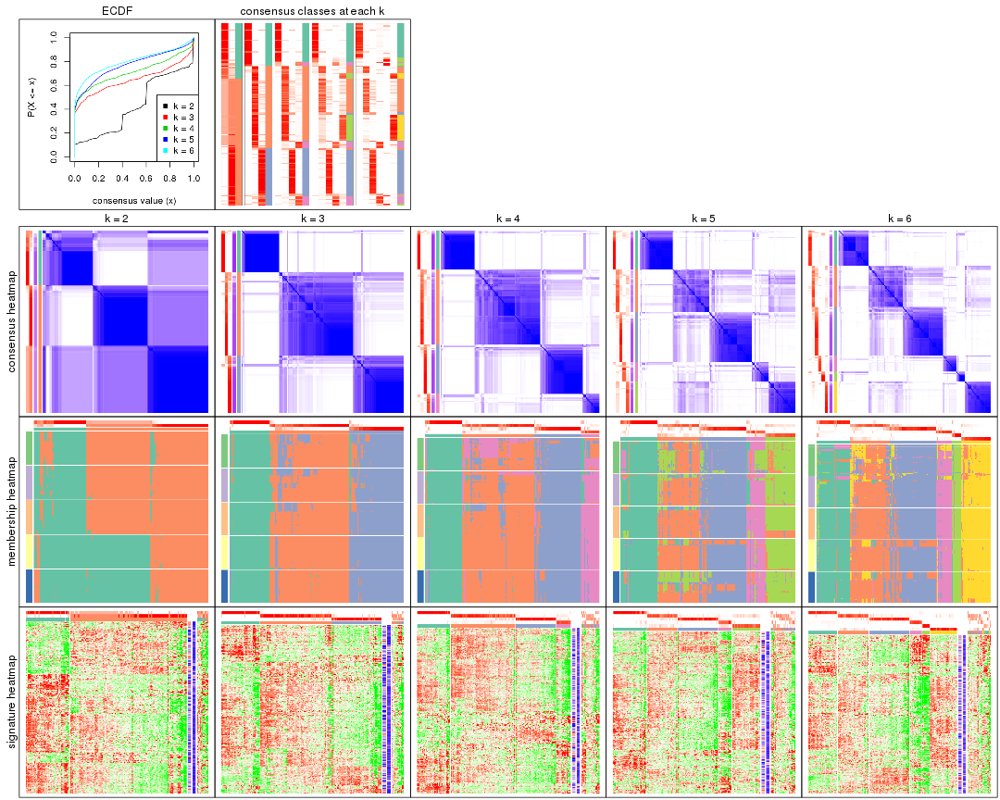

The plots are:

- The first row: a plot of the ECDF (Empirical cumulative distribution
  function) curves of the consensus matrix for each `k` and the heatmap of
  predicted classes for each `k`.
- The second row: heatmaps of the consensus matrix for each `k`.
- The third row: heatmaps of the membership matrix for each `k`.
- The fouth row: heatmaps of the signatures for each `k`.

All the plots in panels can be made by individual functions and they are
plotted later in this section.

`select_partition_number()` produces several plots showing different
statistics for choosing "optimized" `k`. There are following statistics:

- ECDF curves of the consensus matrix for each `k`;
- 1-PAC. [The PAC
  score](https://en.wikipedia.org/wiki/Consensus_clustering#Over-interpretation_potential_of_consensus_clustering)
  measures the proportion of the ambiguous subgrouping.
- Mean silhouette score.
- Concordance. The mean probability of fiting the consensus class ids in all
  partitions.
- Area increased. Denote $A_k$ as the area under the ECDF curve for current
  `k`, the area increased is defined as $A_k - A_{k-1}$.
- Rand index. The percent of pairs of samples that are both in a same cluster
  or both are not in a same cluster in the partition of k and k-1.
- Jaccard index. The ratio of pairs of samples are both in a same cluster in
  the partition of k and k-1 and the pairs of samples are both in a same
  cluster in the partition k or k-1.

The detailed explanations of these statistics can be found in [the cola
vignette](http://bioconductor.org/packages/devel/bioc/vignettes/cola/inst/doc/cola.html#toc_13).

Generally speaking, lower PAC score, higher mean silhouette score or higher
concordance corresponds to better partition. Rand index and Jaccard index
measure how similar the current partition is compared to partition with `k-1`.
If they are too similar, we won't accept `k` is better than `k-1`.

```r
select_partition_number(res)
```

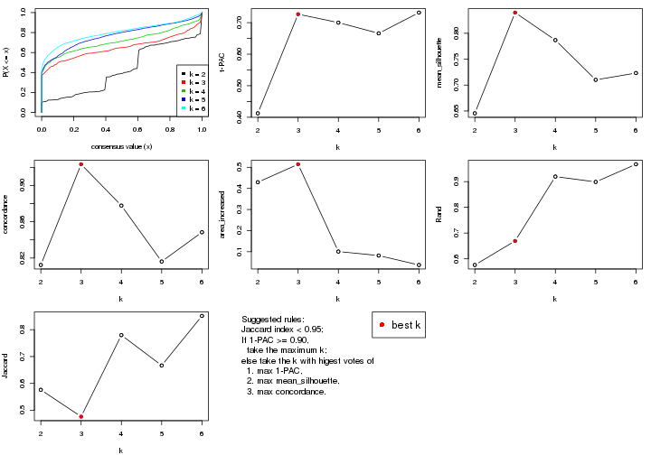

The numeric values for all these statistics can be obtained by `get_stats()`.

```r
get_stats(res)
```

```
#>   k 1-PAC mean_silhouette concordance area_increased  Rand Jaccard
#> 2 2 0.412           0.645       0.812         0.4291 0.576   0.576
#> 3 3 0.727           0.840       0.923         0.5144 0.669   0.476
#> 4 4 0.700           0.787       0.878         0.1007 0.919   0.780
#> 5 5 0.666           0.710       0.816         0.0817 0.899   0.667
#> 6 6 0.732           0.723       0.848         0.0371 0.967   0.851
```

`suggest_best_k()` suggests the best $k$ based on these statistics. The rules are as follows:

- All $k$ with Jaccard index larger than 0.95 are removed because the increase of
  the partition number does not provides enough extra information. If all $k$ are removed,
  the best $k$ is assigned by `NA`.
- For $k$ with 1-PAC larger than 0.9, the maximal $k$ is taken as the "best k". Other $k$ is called "optional k".
- If it does not fit the second rule. The $k$ with the highest vote of highest
  1-PAC, mean silhouette and concordance is taken as the "best k".

```r
suggest_best_k(res)
```

```
#> [1] 3
```


Following shows the table of the partitions (You need to click the **show/hide
code output** link to see it). The membership matrix (columns with name `p*`)
is inferred by
[`clue::cl_consensus()`](https://www.rdocumentation.org/link/cl_consensus?package=clue)
function with the `SE` method. Basically the value in the membership matrix
represents the probability to belong to a certain group. The finall class
label for an item is determined with the group with highest probability it
belongs to.

In `get_classes()` function, the entropy is calculated from the membership
matrix and the silhouette score is calculated from the consensus matrix.


<script>
$( function() {
	$( '#tabs-MAD-pam-get-classes' ).tabs();
} );
</script>
<div id='tabs-MAD-pam-get-classes'>
<ul>
<li><a href='#tab-MAD-pam-get-classes-1'>k = 2</a></li>
<li><a href='#tab-MAD-pam-get-classes-2'>k = 3</a></li>
<li><a href='#tab-MAD-pam-get-classes-3'>k = 4</a></li>
<li><a href='#tab-MAD-pam-get-classes-4'>k = 5</a></li>
<li><a href='#tab-MAD-pam-get-classes-5'>k = 6</a></li>
</ul>

<div id='tab-MAD-pam-get-classes-1'>
<p><a id='tab-MAD-pam-get-classes-1-a' style='color:#0366d6' href='#'>show/hide code output</a></p>
<pre><code class="r">cbind(get_classes(res, k = 2), get_membership(res, k = 2))
</code></pre>

<pre><code>#&gt;            class entropy silhouette    p1    p2
#&gt; SRR2052702     2  0.9710      0.630 0.400 0.600
#&gt; SRR2052701     2  0.9896      0.554 0.440 0.560
#&gt; SRR2052700     2  0.9710      0.630 0.400 0.600
#&gt; SRR2052699     2  0.9710      0.630 0.400 0.600
#&gt; SRR2052698     2  0.0000      0.672 0.000 1.000
#&gt; SRR2052708     1  0.0000      0.838 1.000 0.000
#&gt; SRR2052749     1  0.0000      0.838 1.000 0.000
#&gt; SRR2052786     2  0.9710      0.630 0.400 0.600
#&gt; SRR2052825     2  0.0000      0.672 0.000 1.000
#&gt; SRR2052824     2  0.9710      0.630 0.400 0.600
#&gt; SRR2052823     2  0.9866      0.572 0.432 0.568
#&gt; SRR2052822     2  0.9710      0.630 0.400 0.600
#&gt; SRR2052821     2  0.9710      0.630 0.400 0.600
#&gt; SRR2052820     2  0.9248      0.630 0.340 0.660
#&gt; SRR2052819     2  0.0000      0.672 0.000 1.000
#&gt; SRR2052818     2  0.9710      0.630 0.400 0.600
#&gt; SRR2052817     2  0.0000      0.672 0.000 1.000
#&gt; SRR2052816     2  0.9732      0.623 0.404 0.596
#&gt; SRR2052815     2  0.0000      0.672 0.000 1.000
#&gt; SRR2052814     2  0.9661      0.630 0.392 0.608
#&gt; SRR2052813     2  0.9710      0.630 0.400 0.600
#&gt; SRR2052812     2  0.9710      0.630 0.400 0.600
#&gt; SRR2052811     2  0.9710      0.630 0.400 0.600
#&gt; SRR2052810     2  0.0376      0.672 0.004 0.996
#&gt; SRR2052809     2  0.9608      0.631 0.384 0.616
#&gt; SRR2052808     2  0.9710      0.630 0.400 0.600
#&gt; SRR2052807     2  0.7745      0.369 0.228 0.772
#&gt; SRR2052806     1  0.0000      0.838 1.000 0.000
#&gt; SRR2052805     1  0.0000      0.838 1.000 0.000
#&gt; SRR2052804     2  0.0000      0.672 0.000 1.000
#&gt; SRR2052803     1  0.0000      0.838 1.000 0.000
#&gt; SRR2052802     2  0.2043      0.643 0.032 0.968
#&gt; SRR2052801     1  0.9710      0.365 0.600 0.400
#&gt; SRR2052800     2  0.5519      0.530 0.128 0.872
#&gt; SRR2052799     1  0.9710      0.365 0.600 0.400
#&gt; SRR2052798     1  0.0000      0.838 1.000 0.000
#&gt; SRR2052797     2  0.9710      0.630 0.400 0.600
#&gt; SRR2052796     1  0.7056      0.635 0.808 0.192
#&gt; SRR2052795     1  0.0000      0.838 1.000 0.000
#&gt; SRR2052794     2  0.9998     -0.233 0.492 0.508
#&gt; SRR2052793     1  0.8608      0.515 0.716 0.284
#&gt; SRR2052792     2  0.0000      0.672 0.000 1.000
#&gt; SRR2052791     2  0.7528      0.391 0.216 0.784
#&gt; SRR2052790     2  0.4939      0.661 0.108 0.892
#&gt; SRR2052789     2  0.0000      0.672 0.000 1.000
#&gt; SRR2052788     2  0.0000      0.672 0.000 1.000
#&gt; SRR2052787     2  0.9710      0.630 0.400 0.600
#&gt; SRR2052785     2  0.3733      0.666 0.072 0.928
#&gt; SRR2052784     2  0.9710      0.630 0.400 0.600
#&gt; SRR2052783     2  0.9710      0.630 0.400 0.600
#&gt; SRR2052782     2  0.9710      0.630 0.400 0.600
#&gt; SRR2052781     2  0.9710      0.630 0.400 0.600
#&gt; SRR2052780     2  0.0000      0.672 0.000 1.000
#&gt; SRR2052777     2  0.9710      0.630 0.400 0.600
#&gt; SRR2052779     2  0.9710      0.630 0.400 0.600
#&gt; SRR2052778     2  0.0000      0.672 0.000 1.000
#&gt; SRR2052776     2  0.9710      0.630 0.400 0.600
#&gt; SRR2052775     2  0.0000      0.672 0.000 1.000
#&gt; SRR2052773     2  0.9710      0.630 0.400 0.600
#&gt; SRR2052772     2  0.0000      0.672 0.000 1.000
#&gt; SRR2052774     2  0.9686      0.630 0.396 0.604
#&gt; SRR2052771     1  0.9881      0.323 0.564 0.436
#&gt; SRR2052769     2  0.0000      0.672 0.000 1.000
#&gt; SRR2052770     2  0.0000      0.672 0.000 1.000
#&gt; SRR2052768     2  0.9710      0.630 0.400 0.600
#&gt; SRR2052767     2  0.9710      0.630 0.400 0.600
#&gt; SRR2052766     2  0.0000      0.672 0.000 1.000
#&gt; SRR2052765     2  0.9710      0.630 0.400 0.600
#&gt; SRR2052763     2  0.0000      0.672 0.000 1.000
#&gt; SRR2052764     2  0.9896      0.554 0.440 0.560
#&gt; SRR2052761     2  0.9710      0.630 0.400 0.600
#&gt; SRR2052760     2  0.9710      0.630 0.400 0.600
#&gt; SRR2052759     2  0.0000      0.672 0.000 1.000
#&gt; SRR2052762     2  0.9710      0.630 0.400 0.600
#&gt; SRR2052758     2  0.0000      0.672 0.000 1.000
#&gt; SRR2052756     1  0.0000      0.838 1.000 0.000
#&gt; SRR2052757     2  0.0376      0.672 0.004 0.996
#&gt; SRR2052755     1  0.0000      0.838 1.000 0.000
#&gt; SRR2052754     1  0.1843      0.814 0.972 0.028
#&gt; SRR2052753     1  0.0000      0.838 1.000 0.000
#&gt; SRR2052752     1  0.0000      0.838 1.000 0.000
#&gt; SRR2052750     1  0.0000      0.838 1.000 0.000
#&gt; SRR2052751     2  0.9710      0.630 0.400 0.600
#&gt; SRR2052748     2  0.0000      0.672 0.000 1.000
#&gt; SRR2052747     1  0.0000      0.838 1.000 0.000
#&gt; SRR2052746     2  0.0000      0.672 0.000 1.000
#&gt; SRR2052745     2  0.0000      0.672 0.000 1.000
#&gt; SRR2052744     1  0.0000      0.838 1.000 0.000
#&gt; SRR2052741     1  0.9963     -0.310 0.536 0.464
#&gt; SRR2052743     2  0.9710      0.630 0.400 0.600
#&gt; SRR2052740     1  0.9996     -0.385 0.512 0.488
#&gt; SRR2052742     2  0.9710      0.630 0.400 0.600
#&gt; SRR2052739     2  0.9710      0.630 0.400 0.600
#&gt; SRR2052738     2  0.0000      0.672 0.000 1.000
#&gt; SRR2052736     1  0.6148      0.677 0.848 0.152
#&gt; SRR2052735     1  0.0000      0.838 1.000 0.000
#&gt; SRR2052734     1  0.4939      0.735 0.892 0.108
#&gt; SRR2052737     2  0.9710      0.630 0.400 0.600
#&gt; SRR2052733     2  0.0000      0.672 0.000 1.000
#&gt; SRR2052732     2  0.9896      0.554 0.440 0.560
#&gt; SRR2052731     2  0.0000      0.672 0.000 1.000
#&gt; SRR2052729     1  0.0000      0.838 1.000 0.000
#&gt; SRR2052728     1  0.0000      0.838 1.000 0.000
#&gt; SRR2052730     2  0.0000      0.672 0.000 1.000
#&gt; SRR2052727     1  0.0000      0.838 1.000 0.000
#&gt; SRR2052725     1  0.7950      0.513 0.760 0.240
#&gt; SRR2052726     1  0.0000      0.838 1.000 0.000
#&gt; SRR2052724     1  0.0000      0.838 1.000 0.000
#&gt; SRR2052723     2  0.0000      0.672 0.000 1.000
#&gt; SRR2052722     2  0.0000      0.672 0.000 1.000
#&gt; SRR2052721     1  0.0000      0.838 1.000 0.000
#&gt; SRR2052720     2  0.9710      0.630 0.400 0.600
#&gt; SRR2052719     2  0.9710      0.630 0.400 0.600
#&gt; SRR2052718     1  0.0000      0.838 1.000 0.000
#&gt; SRR2052717     2  0.9710      0.630 0.400 0.600
#&gt; SRR2052714     1  0.7219      0.625 0.800 0.200
#&gt; SRR2052716     2  0.2423      0.669 0.040 0.960
#&gt; SRR2052715     2  0.0000      0.672 0.000 1.000
#&gt; SRR2052713     1  0.0000      0.838 1.000 0.000
#&gt; SRR2052712     2  0.0000      0.672 0.000 1.000
#&gt; SRR2052711     1  0.8207      0.472 0.744 0.256
#&gt; SRR2052710     2  0.9710      0.630 0.400 0.600
#&gt; SRR2052707     2  0.0000      0.672 0.000 1.000
#&gt; SRR2052709     2  0.0000      0.672 0.000 1.000
#&gt; SRR2052704     2  0.0000      0.672 0.000 1.000
#&gt; SRR2052705     2  0.9710      0.630 0.400 0.600
#&gt; SRR2052697     1  0.8016      0.502 0.756 0.244
#&gt; SRR2052703     2  0.0000      0.672 0.000 1.000
#&gt; SRR2052696     1  0.0000      0.838 1.000 0.000
#&gt; SRR2052706     2  0.2043      0.671 0.032 0.968
#&gt; SRR2052695     2  0.9710      0.630 0.400 0.600
#&gt; SRR2052694     2  0.9710      0.630 0.400 0.600
#&gt; SRR2052692     2  0.0000      0.672 0.000 1.000
#&gt; SRR2052693     2  0.9710      0.630 0.400 0.600
#&gt; SRR2052691     1  0.0000      0.838 1.000 0.000
#&gt; SRR2052690     1  0.7299      0.578 0.796 0.204
#&gt; SRR2052689     2  0.0000      0.672 0.000 1.000
#&gt; SRR2052687     2  0.0000      0.672 0.000 1.000
#&gt; SRR2052686     1  0.5629      0.705 0.868 0.132
#&gt; SRR2052688     2  0.9710      0.630 0.400 0.600
#&gt; SRR2052684     2  0.5946      0.507 0.144 0.856
#&gt; SRR2052685     2  0.9710      0.630 0.400 0.600
#&gt; SRR2052683     1  0.0000      0.838 1.000 0.000
#&gt; SRR2052681     2  0.9710      0.630 0.400 0.600
#&gt; SRR2052680     2  0.1414      0.671 0.020 0.980
#&gt; SRR2052682     1  0.6887      0.625 0.816 0.184
#&gt; SRR2052679     1  0.0000      0.838 1.000 0.000
#&gt; SRR2052678     2  0.0000      0.672 0.000 1.000
#&gt; SRR2052677     2  0.9710      0.630 0.400 0.600
#&gt; SRR2052675     1  0.9866     -0.198 0.568 0.432
#&gt; SRR2052676     1  0.0000      0.838 1.000 0.000
#&gt; SRR2052674     2  0.9710      0.630 0.400 0.600
#&gt; SRR2052672     2  0.0000      0.672 0.000 1.000
#&gt; SRR2052673     1  0.7376      0.580 0.792 0.208
#&gt; SRR2052671     2  0.9710      0.630 0.400 0.600
#&gt; SRR2052670     2  0.0000      0.672 0.000 1.000
#&gt; SRR2052669     2  0.9710      0.630 0.400 0.600
#&gt; SRR2052668     2  0.9732      0.623 0.404 0.596
#&gt; SRR2052667     2  0.9710      0.630 0.400 0.600
#&gt; SRR2052666     2  0.0000      0.672 0.000 1.000
#&gt; SRR2052665     2  0.9710      0.630 0.400 0.600
#&gt; SRR2052664     1  0.0000      0.838 1.000 0.000
#&gt; SRR2052663     1  0.8443      0.428 0.728 0.272
#&gt; SRR2052662     2  0.9710      0.630 0.400 0.600
#&gt; SRR2052661     1  0.0000      0.838 1.000 0.000
#&gt; SRR2052660     2  0.0000      0.672 0.000 1.000
#&gt; SRR2052659     2  0.0000      0.672 0.000 1.000
#&gt; SRR2052658     2  0.9710      0.630 0.400 0.600
#&gt; SRR2052657     1  0.0000      0.838 1.000 0.000
</code></pre>

<script>
$('#tab-MAD-pam-get-classes-1-a').parent().next().next().hide();
$('#tab-MAD-pam-get-classes-1-a').click(function(){
  $('#tab-MAD-pam-get-classes-1-a').parent().next().next().toggle();
  return(false);
});
</script>
</div>

<div id='tab-MAD-pam-get-classes-2'>
<p><a id='tab-MAD-pam-get-classes-2-a' style='color:#0366d6' href='#'>show/hide code output</a></p>
<pre><code class="r">cbind(get_classes(res, k = 3), get_membership(res, k = 3))
</code></pre>

<pre><code>#&gt;            class entropy silhouette    p1    p2    p3
#&gt; SRR2052702     2  0.0000     0.8858 0.000 1.000 0.000
#&gt; SRR2052701     2  0.0000     0.8858 0.000 1.000 0.000
#&gt; SRR2052700     2  0.1529     0.8802 0.000 0.960 0.040
#&gt; SRR2052699     2  0.1643     0.8800 0.000 0.956 0.044
#&gt; SRR2052698     3  0.1031     0.9094 0.000 0.024 0.976
#&gt; SRR2052708     1  0.0000     0.9703 1.000 0.000 0.000
#&gt; SRR2052749     1  0.0000     0.9703 1.000 0.000 0.000
#&gt; SRR2052786     2  0.2356     0.8682 0.000 0.928 0.072
#&gt; SRR2052825     3  0.6168     0.3161 0.000 0.412 0.588
#&gt; SRR2052824     2  0.2959     0.8553 0.000 0.900 0.100
#&gt; SRR2052823     2  0.0000     0.8858 0.000 1.000 0.000
#&gt; SRR2052822     2  0.5733     0.6320 0.000 0.676 0.324
#&gt; SRR2052821     2  0.4702     0.7700 0.000 0.788 0.212
#&gt; SRR2052820     2  0.6225     0.3681 0.000 0.568 0.432
#&gt; SRR2052819     3  0.4931     0.6986 0.000 0.232 0.768
#&gt; SRR2052818     2  0.0237     0.8859 0.000 0.996 0.004
#&gt; SRR2052817     3  0.0000     0.9207 0.000 0.000 1.000
#&gt; SRR2052816     2  0.1163     0.8834 0.000 0.972 0.028
#&gt; SRR2052815     3  0.5926     0.4613 0.000 0.356 0.644
#&gt; SRR2052814     2  0.2066     0.8730 0.000 0.940 0.060
#&gt; SRR2052813     2  0.0000     0.8858 0.000 1.000 0.000
#&gt; SRR2052812     2  0.0000     0.8858 0.000 1.000 0.000
#&gt; SRR2052811     2  0.0000     0.8858 0.000 1.000 0.000
#&gt; SRR2052810     2  0.6235     0.1453 0.000 0.564 0.436
#&gt; SRR2052809     2  0.5327     0.6635 0.000 0.728 0.272
#&gt; SRR2052808     2  0.4452     0.7908 0.000 0.808 0.192
#&gt; SRR2052807     3  0.6045     0.3938 0.380 0.000 0.620
#&gt; SRR2052806     1  0.0000     0.9703 1.000 0.000 0.000
#&gt; SRR2052805     1  0.0000     0.9703 1.000 0.000 0.000
#&gt; SRR2052804     3  0.1529     0.8995 0.000 0.040 0.960
#&gt; SRR2052803     1  0.0000     0.9703 1.000 0.000 0.000
#&gt; SRR2052802     3  0.0000     0.9207 0.000 0.000 1.000
#&gt; SRR2052801     1  0.0000     0.9703 1.000 0.000 0.000
#&gt; SRR2052800     3  0.1163     0.9047 0.028 0.000 0.972
#&gt; SRR2052799     1  0.2796     0.8726 0.908 0.000 0.092
#&gt; SRR2052798     1  0.0000     0.9703 1.000 0.000 0.000
#&gt; SRR2052797     2  0.3116     0.8457 0.000 0.892 0.108
#&gt; SRR2052796     1  0.0000     0.9703 1.000 0.000 0.000
#&gt; SRR2052795     1  0.0000     0.9703 1.000 0.000 0.000
#&gt; SRR2052794     3  0.6244     0.2283 0.440 0.000 0.560
#&gt; SRR2052793     1  0.0000     0.9703 1.000 0.000 0.000
#&gt; SRR2052792     3  0.0000     0.9207 0.000 0.000 1.000
#&gt; SRR2052791     3  0.1643     0.8930 0.044 0.000 0.956
#&gt; SRR2052790     3  0.5178     0.6645 0.000 0.256 0.744
#&gt; SRR2052789     3  0.0000     0.9207 0.000 0.000 1.000
#&gt; SRR2052788     3  0.0000     0.9207 0.000 0.000 1.000
#&gt; SRR2052787     2  0.1643     0.8784 0.000 0.956 0.044
#&gt; SRR2052785     3  0.3816     0.7992 0.000 0.148 0.852
#&gt; SRR2052784     2  0.2448     0.8654 0.000 0.924 0.076
#&gt; SRR2052783     2  0.4062     0.8122 0.000 0.836 0.164
#&gt; SRR2052782     2  0.0237     0.8859 0.000 0.996 0.004
#&gt; SRR2052781     2  0.3038     0.8546 0.000 0.896 0.104
#&gt; SRR2052780     3  0.1031     0.9093 0.000 0.024 0.976
#&gt; SRR2052777     2  0.0747     0.8863 0.000 0.984 0.016
#&gt; SRR2052779     2  0.1753     0.8775 0.000 0.952 0.048
#&gt; SRR2052778     3  0.0000     0.9207 0.000 0.000 1.000
#&gt; SRR2052776     2  0.4002     0.8240 0.000 0.840 0.160
#&gt; SRR2052775     3  0.0000     0.9207 0.000 0.000 1.000
#&gt; SRR2052773     2  0.4796     0.7631 0.000 0.780 0.220
#&gt; SRR2052772     3  0.0000     0.9207 0.000 0.000 1.000
#&gt; SRR2052774     2  0.6280     0.3455 0.000 0.540 0.460
#&gt; SRR2052771     1  0.6848     0.2047 0.568 0.016 0.416
#&gt; SRR2052769     3  0.4346     0.7584 0.000 0.184 0.816
#&gt; SRR2052770     3  0.0000     0.9207 0.000 0.000 1.000
#&gt; SRR2052768     2  0.0000     0.8858 0.000 1.000 0.000
#&gt; SRR2052767     2  0.0000     0.8858 0.000 1.000 0.000
#&gt; SRR2052766     3  0.0000     0.9207 0.000 0.000 1.000
#&gt; SRR2052765     2  0.1411     0.8802 0.000 0.964 0.036
#&gt; SRR2052763     3  0.1643     0.8942 0.000 0.044 0.956
#&gt; SRR2052764     2  0.0000     0.8858 0.000 1.000 0.000
#&gt; SRR2052761     2  0.5988     0.5172 0.000 0.632 0.368
#&gt; SRR2052760     2  0.0000     0.8858 0.000 1.000 0.000
#&gt; SRR2052759     3  0.0000     0.9207 0.000 0.000 1.000
#&gt; SRR2052762     2  0.2959     0.8508 0.000 0.900 0.100
#&gt; SRR2052758     3  0.1529     0.8974 0.000 0.040 0.960
#&gt; SRR2052756     1  0.0000     0.9703 1.000 0.000 0.000
#&gt; SRR2052757     3  0.0747     0.9145 0.000 0.016 0.984
#&gt; SRR2052755     1  0.0000     0.9703 1.000 0.000 0.000
#&gt; SRR2052754     1  0.0000     0.9703 1.000 0.000 0.000
#&gt; SRR2052753     1  0.0000     0.9703 1.000 0.000 0.000
#&gt; SRR2052752     1  0.0000     0.9703 1.000 0.000 0.000
#&gt; SRR2052750     1  0.0000     0.9703 1.000 0.000 0.000
#&gt; SRR2052751     2  0.5138     0.7216 0.000 0.748 0.252
#&gt; SRR2052748     3  0.0000     0.9207 0.000 0.000 1.000
#&gt; SRR2052747     1  0.0000     0.9703 1.000 0.000 0.000
#&gt; SRR2052746     3  0.0000     0.9207 0.000 0.000 1.000
#&gt; SRR2052745     3  0.1163     0.9058 0.000 0.028 0.972
#&gt; SRR2052744     1  0.0000     0.9703 1.000 0.000 0.000
#&gt; SRR2052741     2  0.0000     0.8858 0.000 1.000 0.000
#&gt; SRR2052743     2  0.0000     0.8858 0.000 1.000 0.000
#&gt; SRR2052740     2  0.0000     0.8858 0.000 1.000 0.000
#&gt; SRR2052742     2  0.4654     0.7651 0.000 0.792 0.208
#&gt; SRR2052739     2  0.0000     0.8858 0.000 1.000 0.000
#&gt; SRR2052738     3  0.0000     0.9207 0.000 0.000 1.000
#&gt; SRR2052736     2  0.2356     0.8561 0.072 0.928 0.000
#&gt; SRR2052735     1  0.0000     0.9703 1.000 0.000 0.000
#&gt; SRR2052734     1  0.5138     0.6617 0.748 0.252 0.000
#&gt; SRR2052737     2  0.0592     0.8863 0.000 0.988 0.012
#&gt; SRR2052733     3  0.0000     0.9207 0.000 0.000 1.000
#&gt; SRR2052732     2  0.0000     0.8858 0.000 1.000 0.000
#&gt; SRR2052731     3  0.0000     0.9207 0.000 0.000 1.000
#&gt; SRR2052729     1  0.0000     0.9703 1.000 0.000 0.000
#&gt; SRR2052728     1  0.0000     0.9703 1.000 0.000 0.000
#&gt; SRR2052730     3  0.0592     0.9165 0.000 0.012 0.988
#&gt; SRR2052727     1  0.0000     0.9703 1.000 0.000 0.000
#&gt; SRR2052725     2  0.1163     0.8774 0.028 0.972 0.000
#&gt; SRR2052726     1  0.0000     0.9703 1.000 0.000 0.000
#&gt; SRR2052724     1  0.0000     0.9703 1.000 0.000 0.000
#&gt; SRR2052723     3  0.0000     0.9207 0.000 0.000 1.000
#&gt; SRR2052722     3  0.0000     0.9207 0.000 0.000 1.000
#&gt; SRR2052721     1  0.0000     0.9703 1.000 0.000 0.000
#&gt; SRR2052720     2  0.0424     0.8858 0.000 0.992 0.008
#&gt; SRR2052719     2  0.0000     0.8858 0.000 1.000 0.000
#&gt; SRR2052718     1  0.0000     0.9703 1.000 0.000 0.000
#&gt; SRR2052717     2  0.2356     0.8655 0.000 0.928 0.072
#&gt; SRR2052714     1  0.0000     0.9703 1.000 0.000 0.000
#&gt; SRR2052716     3  0.5397     0.5739 0.000 0.280 0.720
#&gt; SRR2052715     3  0.0000     0.9207 0.000 0.000 1.000
#&gt; SRR2052713     1  0.0000     0.9703 1.000 0.000 0.000
#&gt; SRR2052712     3  0.5465     0.6002 0.000 0.288 0.712
#&gt; SRR2052711     2  0.5244     0.6786 0.240 0.756 0.004
#&gt; SRR2052710     2  0.3116     0.8522 0.000 0.892 0.108
#&gt; SRR2052707     3  0.0000     0.9207 0.000 0.000 1.000
#&gt; SRR2052709     3  0.0000     0.9207 0.000 0.000 1.000
#&gt; SRR2052704     3  0.0000     0.9207 0.000 0.000 1.000
#&gt; SRR2052705     2  0.0000     0.8858 0.000 1.000 0.000
#&gt; SRR2052697     2  0.0000     0.8858 0.000 1.000 0.000
#&gt; SRR2052703     3  0.0000     0.9207 0.000 0.000 1.000
#&gt; SRR2052696     1  0.0000     0.9703 1.000 0.000 0.000
#&gt; SRR2052706     2  0.6267     0.0499 0.000 0.548 0.452
#&gt; SRR2052695     2  0.0424     0.8860 0.000 0.992 0.008
#&gt; SRR2052694     2  0.1411     0.8800 0.000 0.964 0.036
#&gt; SRR2052692     3  0.0000     0.9207 0.000 0.000 1.000
#&gt; SRR2052693     2  0.6260     0.3756 0.000 0.552 0.448
#&gt; SRR2052691     2  0.6215     0.2932 0.428 0.572 0.000
#&gt; SRR2052690     2  0.5743     0.7605 0.172 0.784 0.044
#&gt; SRR2052689     3  0.3267     0.8306 0.000 0.116 0.884
#&gt; SRR2052687     3  0.4842     0.7043 0.000 0.224 0.776
#&gt; SRR2052686     1  0.5216     0.6381 0.740 0.260 0.000
#&gt; SRR2052688     2  0.0000     0.8858 0.000 1.000 0.000
#&gt; SRR2052684     3  0.0000     0.9207 0.000 0.000 1.000
#&gt; SRR2052685     2  0.0000     0.8858 0.000 1.000 0.000
#&gt; SRR2052683     1  0.0000     0.9703 1.000 0.000 0.000
#&gt; SRR2052681     2  0.2878     0.8573 0.000 0.904 0.096
#&gt; SRR2052680     2  0.6291     0.1185 0.000 0.532 0.468
#&gt; SRR2052682     2  0.2711     0.8461 0.088 0.912 0.000
#&gt; SRR2052679     1  0.0000     0.9703 1.000 0.000 0.000
#&gt; SRR2052678     3  0.0000     0.9207 0.000 0.000 1.000
#&gt; SRR2052677     2  0.4555     0.7893 0.000 0.800 0.200
#&gt; SRR2052675     2  0.0000     0.8858 0.000 1.000 0.000
#&gt; SRR2052676     1  0.0000     0.9703 1.000 0.000 0.000
#&gt; SRR2052674     2  0.2878     0.8579 0.000 0.904 0.096
#&gt; SRR2052672     3  0.0000     0.9207 0.000 0.000 1.000
#&gt; SRR2052673     2  0.2448     0.8492 0.076 0.924 0.000
#&gt; SRR2052671     2  0.0000     0.8858 0.000 1.000 0.000
#&gt; SRR2052670     3  0.0000     0.9207 0.000 0.000 1.000
#&gt; SRR2052669     2  0.1643     0.8782 0.000 0.956 0.044
#&gt; SRR2052668     2  0.3695     0.8468 0.012 0.880 0.108
#&gt; SRR2052667     2  0.2878     0.8573 0.000 0.904 0.096
#&gt; SRR2052666     3  0.1753     0.8913 0.000 0.048 0.952
#&gt; SRR2052665     2  0.4121     0.7936 0.000 0.832 0.168
#&gt; SRR2052664     1  0.0000     0.9703 1.000 0.000 0.000
#&gt; SRR2052663     2  0.0000     0.8858 0.000 1.000 0.000
#&gt; SRR2052662     2  0.0000     0.8858 0.000 1.000 0.000
#&gt; SRR2052661     1  0.0000     0.9703 1.000 0.000 0.000
#&gt; SRR2052660     3  0.0000     0.9207 0.000 0.000 1.000
#&gt; SRR2052659     3  0.1860     0.8879 0.000 0.052 0.948
#&gt; SRR2052658     2  0.1289     0.8842 0.000 0.968 0.032
#&gt; SRR2052657     1  0.0000     0.9703 1.000 0.000 0.000
</code></pre>

<script>
$('#tab-MAD-pam-get-classes-2-a').parent().next().next().hide();
$('#tab-MAD-pam-get-classes-2-a').click(function(){
  $('#tab-MAD-pam-get-classes-2-a').parent().next().next().toggle();
  return(false);
});
</script>
</div>

<div id='tab-MAD-pam-get-classes-3'>
<p><a id='tab-MAD-pam-get-classes-3-a' style='color:#0366d6' href='#'>show/hide code output</a></p>
<pre><code class="r">cbind(get_classes(res, k = 4), get_membership(res, k = 4))
</code></pre>

<pre><code>#&gt;            class entropy silhouette    p1    p2    p3    p4
#&gt; SRR2052702     2  0.1022     0.8315 0.000 0.968 0.000 0.032
#&gt; SRR2052701     2  0.0817     0.8325 0.000 0.976 0.000 0.024
#&gt; SRR2052700     4  0.1637     0.7582 0.000 0.060 0.000 0.940
#&gt; SRR2052699     2  0.3716     0.8214 0.000 0.852 0.052 0.096
#&gt; SRR2052698     3  0.2101     0.8428 0.000 0.060 0.928 0.012
#&gt; SRR2052708     1  0.0000     0.9471 1.000 0.000 0.000 0.000
#&gt; SRR2052749     1  0.0000     0.9471 1.000 0.000 0.000 0.000
#&gt; SRR2052786     2  0.1624     0.8315 0.000 0.952 0.028 0.020
#&gt; SRR2052825     4  0.3099     0.8250 0.000 0.104 0.020 0.876
#&gt; SRR2052824     4  0.3099     0.8250 0.000 0.104 0.020 0.876
#&gt; SRR2052823     2  0.2281     0.8239 0.000 0.904 0.000 0.096
#&gt; SRR2052822     2  0.5659     0.5398 0.000 0.600 0.368 0.032
#&gt; SRR2052821     2  0.3803     0.8089 0.000 0.836 0.132 0.032
#&gt; SRR2052820     2  0.6262     0.6285 0.000 0.628 0.280 0.092
#&gt; SRR2052819     4  0.3421     0.8212 0.000 0.088 0.044 0.868
#&gt; SRR2052818     4  0.3074     0.8031 0.000 0.152 0.000 0.848
#&gt; SRR2052817     3  0.1557     0.8559 0.000 0.056 0.944 0.000
#&gt; SRR2052816     2  0.2281     0.8239 0.000 0.904 0.000 0.096
#&gt; SRR2052815     4  0.3099     0.8250 0.000 0.104 0.020 0.876
#&gt; SRR2052814     2  0.1209     0.8380 0.000 0.964 0.004 0.032
#&gt; SRR2052813     2  0.1211     0.8319 0.000 0.960 0.000 0.040
#&gt; SRR2052812     2  0.0592     0.8326 0.000 0.984 0.000 0.016
#&gt; SRR2052811     2  0.0817     0.8325 0.000 0.976 0.000 0.024
#&gt; SRR2052810     4  0.2921     0.8077 0.000 0.140 0.000 0.860
#&gt; SRR2052809     2  0.5607     0.2015 0.000 0.496 0.484 0.020
#&gt; SRR2052808     2  0.4019     0.7693 0.000 0.792 0.196 0.012
#&gt; SRR2052807     4  0.2814     0.7373 0.132 0.000 0.000 0.868
#&gt; SRR2052806     1  0.0469     0.9394 0.988 0.000 0.000 0.012
#&gt; SRR2052805     1  0.0336     0.9421 0.992 0.000 0.000 0.008
#&gt; SRR2052804     4  0.5163     0.0853 0.000 0.004 0.480 0.516
#&gt; SRR2052803     1  0.0000     0.9471 1.000 0.000 0.000 0.000
#&gt; SRR2052802     4  0.3837     0.6798 0.000 0.000 0.224 0.776
#&gt; SRR2052801     4  0.4866     0.3419 0.404 0.000 0.000 0.596
#&gt; SRR2052800     4  0.2814     0.7634 0.000 0.000 0.132 0.868
#&gt; SRR2052799     4  0.4661     0.4678 0.348 0.000 0.000 0.652
#&gt; SRR2052798     1  0.0000     0.9471 1.000 0.000 0.000 0.000
#&gt; SRR2052797     2  0.4888     0.6696 0.000 0.740 0.224 0.036
#&gt; SRR2052796     1  0.0469     0.9394 0.988 0.000 0.000 0.012
#&gt; SRR2052795     1  0.0000     0.9471 1.000 0.000 0.000 0.000
#&gt; SRR2052794     3  0.7483    -0.0197 0.360 0.000 0.456 0.184
#&gt; SRR2052793     1  0.0469     0.9394 0.988 0.000 0.000 0.012
#&gt; SRR2052792     3  0.0000     0.9031 0.000 0.000 1.000 0.000
#&gt; SRR2052791     3  0.1059     0.8881 0.016 0.000 0.972 0.012
#&gt; SRR2052790     3  0.3392     0.7785 0.000 0.124 0.856 0.020
#&gt; SRR2052789     3  0.0000     0.9031 0.000 0.000 1.000 0.000
#&gt; SRR2052788     3  0.0592     0.8993 0.000 0.000 0.984 0.016
#&gt; SRR2052787     2  0.1929     0.8304 0.000 0.940 0.024 0.036
#&gt; SRR2052785     3  0.4105     0.7185 0.000 0.156 0.812 0.032
#&gt; SRR2052784     2  0.4171     0.8109 0.000 0.824 0.116 0.060
#&gt; SRR2052783     2  0.3450     0.7903 0.000 0.836 0.156 0.008
#&gt; SRR2052782     2  0.4590     0.7197 0.000 0.772 0.192 0.036
#&gt; SRR2052781     2  0.3577     0.7905 0.000 0.832 0.156 0.012
#&gt; SRR2052780     3  0.0779     0.8981 0.000 0.004 0.980 0.016
#&gt; SRR2052777     2  0.4904     0.7242 0.000 0.744 0.216 0.040
#&gt; SRR2052779     2  0.5052     0.6741 0.000 0.720 0.244 0.036
#&gt; SRR2052778     3  0.0000     0.9031 0.000 0.000 1.000 0.000
#&gt; SRR2052776     2  0.3401     0.7897 0.000 0.840 0.152 0.008
#&gt; SRR2052775     3  0.0000     0.9031 0.000 0.000 1.000 0.000
#&gt; SRR2052773     2  0.5860     0.4668 0.000 0.580 0.380 0.040
#&gt; SRR2052772     3  0.0000     0.9031 0.000 0.000 1.000 0.000
#&gt; SRR2052774     3  0.5300     0.0679 0.000 0.408 0.580 0.012
#&gt; SRR2052771     1  0.5582     0.2769 0.576 0.024 0.400 0.000
#&gt; SRR2052769     3  0.5289     0.4438 0.000 0.344 0.636 0.020
#&gt; SRR2052770     3  0.0000     0.9031 0.000 0.000 1.000 0.000
#&gt; SRR2052768     2  0.1118     0.8310 0.000 0.964 0.000 0.036
#&gt; SRR2052767     2  0.0707     0.8352 0.000 0.980 0.000 0.020
#&gt; SRR2052766     3  0.1022     0.8792 0.000 0.000 0.968 0.032
#&gt; SRR2052765     2  0.1118     0.8310 0.000 0.964 0.000 0.036
#&gt; SRR2052763     3  0.0707     0.8976 0.000 0.000 0.980 0.020
#&gt; SRR2052764     2  0.1022     0.8306 0.000 0.968 0.000 0.032
#&gt; SRR2052761     2  0.5998     0.6861 0.000 0.668 0.240 0.092
#&gt; SRR2052760     2  0.1118     0.8310 0.000 0.964 0.000 0.036
#&gt; SRR2052759     3  0.0000     0.9031 0.000 0.000 1.000 0.000
#&gt; SRR2052762     2  0.3570     0.8214 0.000 0.860 0.048 0.092
#&gt; SRR2052758     3  0.1388     0.8795 0.000 0.012 0.960 0.028
#&gt; SRR2052756     1  0.0000     0.9471 1.000 0.000 0.000 0.000
#&gt; SRR2052757     3  0.2011     0.8315 0.000 0.080 0.920 0.000
#&gt; SRR2052755     1  0.0000     0.9471 1.000 0.000 0.000 0.000
#&gt; SRR2052754     1  0.3486     0.7177 0.812 0.000 0.000 0.188
#&gt; SRR2052753     1  0.0000     0.9471 1.000 0.000 0.000 0.000
#&gt; SRR2052752     1  0.0000     0.9471 1.000 0.000 0.000 0.000
#&gt; SRR2052750     1  0.0000     0.9471 1.000 0.000 0.000 0.000
#&gt; SRR2052751     2  0.4675     0.7182 0.000 0.736 0.244 0.020
#&gt; SRR2052748     3  0.0000     0.9031 0.000 0.000 1.000 0.000
#&gt; SRR2052747     1  0.0000     0.9471 1.000 0.000 0.000 0.000
#&gt; SRR2052746     3  0.0592     0.8993 0.000 0.000 0.984 0.016
#&gt; SRR2052745     3  0.0707     0.8976 0.000 0.000 0.980 0.020
#&gt; SRR2052744     1  0.0000     0.9471 1.000 0.000 0.000 0.000
#&gt; SRR2052741     2  0.2466     0.8245 0.000 0.900 0.004 0.096
#&gt; SRR2052743     2  0.2281     0.8239 0.000 0.904 0.000 0.096
#&gt; SRR2052740     2  0.2281     0.8239 0.000 0.904 0.000 0.096
#&gt; SRR2052742     2  0.5742     0.6271 0.000 0.648 0.300 0.052
#&gt; SRR2052739     2  0.1118     0.8310 0.000 0.964 0.000 0.036
#&gt; SRR2052738     3  0.0336     0.9017 0.000 0.000 0.992 0.008
#&gt; SRR2052736     2  0.3716     0.8066 0.052 0.852 0.000 0.096
#&gt; SRR2052735     1  0.0000     0.9471 1.000 0.000 0.000 0.000
#&gt; SRR2052734     1  0.5964     0.4890 0.676 0.228 0.000 0.096
#&gt; SRR2052737     2  0.2892     0.8202 0.000 0.896 0.068 0.036
#&gt; SRR2052733     3  0.0000     0.9031 0.000 0.000 1.000 0.000
#&gt; SRR2052732     2  0.0707     0.8315 0.000 0.980 0.000 0.020
#&gt; SRR2052731     3  0.0592     0.8993 0.000 0.000 0.984 0.016
#&gt; SRR2052729     1  0.0000     0.9471 1.000 0.000 0.000 0.000
#&gt; SRR2052728     1  0.0000     0.9471 1.000 0.000 0.000 0.000
#&gt; SRR2052730     3  0.3893     0.6668 0.000 0.196 0.796 0.008
#&gt; SRR2052727     1  0.0000     0.9471 1.000 0.000 0.000 0.000
#&gt; SRR2052725     2  0.5423     0.4594 0.028 0.640 0.000 0.332
#&gt; SRR2052726     1  0.0000     0.9471 1.000 0.000 0.000 0.000
#&gt; SRR2052724     1  0.0000     0.9471 1.000 0.000 0.000 0.000
#&gt; SRR2052723     3  0.0000     0.9031 0.000 0.000 1.000 0.000
#&gt; SRR2052722     3  0.0000     0.9031 0.000 0.000 1.000 0.000
#&gt; SRR2052721     1  0.0000     0.9471 1.000 0.000 0.000 0.000
#&gt; SRR2052720     2  0.1452     0.8310 0.000 0.956 0.008 0.036
#&gt; SRR2052719     2  0.1022     0.8314 0.000 0.968 0.000 0.032
#&gt; SRR2052718     1  0.0000     0.9471 1.000 0.000 0.000 0.000
#&gt; SRR2052717     2  0.2401     0.8253 0.000 0.904 0.004 0.092
#&gt; SRR2052714     1  0.1637     0.8786 0.940 0.000 0.060 0.000
#&gt; SRR2052716     3  0.6635     0.0865 0.000 0.388 0.524 0.088
#&gt; SRR2052715     3  0.0000     0.9031 0.000 0.000 1.000 0.000
#&gt; SRR2052713     1  0.0000     0.9471 1.000 0.000 0.000 0.000
#&gt; SRR2052712     4  0.3215     0.8241 0.000 0.092 0.032 0.876
#&gt; SRR2052711     2  0.5353     0.4199 0.012 0.556 0.000 0.432
#&gt; SRR2052710     2  0.5905     0.5240 0.000 0.636 0.060 0.304
#&gt; SRR2052707     3  0.0000     0.9031 0.000 0.000 1.000 0.000
#&gt; SRR2052709     3  0.0592     0.8993 0.000 0.000 0.984 0.016
#&gt; SRR2052704     3  0.0000     0.9031 0.000 0.000 1.000 0.000
#&gt; SRR2052705     2  0.2546     0.8265 0.000 0.900 0.008 0.092
#&gt; SRR2052697     2  0.2216     0.8243 0.000 0.908 0.000 0.092
#&gt; SRR2052703     3  0.0000     0.9031 0.000 0.000 1.000 0.000
#&gt; SRR2052696     1  0.0000     0.9471 1.000 0.000 0.000 0.000
#&gt; SRR2052706     2  0.5698     0.3402 0.000 0.608 0.356 0.036
#&gt; SRR2052695     2  0.2805     0.8387 0.000 0.888 0.012 0.100
#&gt; SRR2052694     2  0.1118     0.8310 0.000 0.964 0.000 0.036
#&gt; SRR2052692     3  0.0000     0.9031 0.000 0.000 1.000 0.000
#&gt; SRR2052693     2  0.5167     0.2648 0.000 0.508 0.488 0.004
#&gt; SRR2052691     2  0.6084     0.6153 0.244 0.660 0.000 0.096
#&gt; SRR2052690     2  0.5313     0.7476 0.132 0.764 0.008 0.096
#&gt; SRR2052689     3  0.6179     0.1005 0.000 0.056 0.552 0.392
#&gt; SRR2052687     4  0.5624     0.5918 0.000 0.052 0.280 0.668
#&gt; SRR2052686     1  0.6714     0.4015 0.616 0.208 0.000 0.176
#&gt; SRR2052688     2  0.1022     0.8314 0.000 0.968 0.000 0.032
#&gt; SRR2052684     3  0.0000     0.9031 0.000 0.000 1.000 0.000
#&gt; SRR2052685     2  0.2281     0.8239 0.000 0.904 0.000 0.096
#&gt; SRR2052683     1  0.0336     0.9412 0.992 0.000 0.000 0.008
#&gt; SRR2052681     4  0.3099     0.8250 0.000 0.104 0.020 0.876
#&gt; SRR2052680     4  0.3099     0.8250 0.000 0.104 0.020 0.876
#&gt; SRR2052682     2  0.4093     0.7947 0.072 0.832 0.000 0.096
#&gt; SRR2052679     1  0.0000     0.9471 1.000 0.000 0.000 0.000
#&gt; SRR2052678     3  0.0336     0.9018 0.000 0.000 0.992 0.008
#&gt; SRR2052677     2  0.4903     0.7083 0.000 0.724 0.248 0.028
#&gt; SRR2052675     2  0.2216     0.8243 0.000 0.908 0.000 0.092
#&gt; SRR2052676     1  0.0000     0.9471 1.000 0.000 0.000 0.000
#&gt; SRR2052674     2  0.2500     0.8250 0.000 0.916 0.040 0.044
#&gt; SRR2052672     3  0.0592     0.8993 0.000 0.000 0.984 0.016
#&gt; SRR2052673     2  0.2563     0.8004 0.072 0.908 0.000 0.020
#&gt; SRR2052671     2  0.2149     0.8253 0.000 0.912 0.000 0.088
#&gt; SRR2052670     3  0.0000     0.9031 0.000 0.000 1.000 0.000
#&gt; SRR2052669     2  0.1929     0.8320 0.000 0.940 0.036 0.024
#&gt; SRR2052668     2  0.4549     0.7993 0.000 0.804 0.100 0.096
#&gt; SRR2052667     2  0.3279     0.8242 0.000 0.872 0.032 0.096
#&gt; SRR2052666     3  0.0779     0.8973 0.000 0.004 0.980 0.016
#&gt; SRR2052665     2  0.4163     0.8100 0.000 0.828 0.076 0.096
#&gt; SRR2052664     4  0.4713     0.4541 0.360 0.000 0.000 0.640
#&gt; SRR2052663     2  0.1792     0.8342 0.000 0.932 0.000 0.068
#&gt; SRR2052662     2  0.1820     0.8340 0.000 0.944 0.020 0.036
#&gt; SRR2052661     1  0.0336     0.9406 0.992 0.000 0.000 0.008
#&gt; SRR2052660     3  0.0000     0.9031 0.000 0.000 1.000 0.000
#&gt; SRR2052659     3  0.0779     0.8975 0.000 0.004 0.980 0.016
#&gt; SRR2052658     2  0.2466     0.8242 0.000 0.900 0.004 0.096
#&gt; SRR2052657     1  0.0000     0.9471 1.000 0.000 0.000 0.000
</code></pre>

<script>
$('#tab-MAD-pam-get-classes-3-a').parent().next().next().hide();
$('#tab-MAD-pam-get-classes-3-a').click(function(){
  $('#tab-MAD-pam-get-classes-3-a').parent().next().next().toggle();
  return(false);
});
</script>
</div>

<div id='tab-MAD-pam-get-classes-4'>
<p><a id='tab-MAD-pam-get-classes-4-a' style='color:#0366d6' href='#'>show/hide code output</a></p>
<pre><code class="r">cbind(get_classes(res, k = 5), get_membership(res, k = 5))
</code></pre>

<pre><code>#&gt;            class entropy silhouette    p1    p2    p3    p4    p5
#&gt; SRR2052702     5  0.2516     0.8767 0.000 0.140 0.000 0.000 0.860
#&gt; SRR2052701     5  0.2648     0.8766 0.000 0.152 0.000 0.000 0.848
#&gt; SRR2052700     4  0.4062     0.6717 0.000 0.196 0.000 0.764 0.040
#&gt; SRR2052699     2  0.3146     0.6857 0.040 0.876 0.056 0.000 0.028
#&gt; SRR2052698     3  0.2249     0.8218 0.000 0.096 0.896 0.000 0.008
#&gt; SRR2052708     1  0.0162     0.9120 0.996 0.004 0.000 0.000 0.000
#&gt; SRR2052749     1  0.0162     0.9120 0.996 0.004 0.000 0.000 0.000
#&gt; SRR2052786     5  0.4329     0.6007 0.000 0.312 0.016 0.000 0.672
#&gt; SRR2052825     4  0.4255     0.7556 0.000 0.032 0.016 0.772 0.180
#&gt; SRR2052824     4  0.4255     0.7556 0.000 0.032 0.016 0.772 0.180
#&gt; SRR2052823     2  0.2813     0.6063 0.000 0.832 0.000 0.000 0.168
#&gt; SRR2052822     2  0.4161     0.4386 0.000 0.608 0.392 0.000 0.000
#&gt; SRR2052821     2  0.5854     0.0986 0.000 0.468 0.096 0.000 0.436
#&gt; SRR2052820     2  0.3003     0.6521 0.000 0.812 0.188 0.000 0.000
#&gt; SRR2052819     4  0.4564     0.7578 0.000 0.040 0.036 0.772 0.152
#&gt; SRR2052818     4  0.5296     0.2951 0.000 0.048 0.000 0.484 0.468
#&gt; SRR2052817     3  0.1908     0.8310 0.000 0.092 0.908 0.000 0.000
#&gt; SRR2052816     2  0.3037     0.6377 0.000 0.860 0.040 0.000 0.100
#&gt; SRR2052815     4  0.4255     0.7556 0.000 0.032 0.016 0.772 0.180
#&gt; SRR2052814     5  0.5201     0.1609 0.000 0.424 0.044 0.000 0.532
#&gt; SRR2052813     2  0.3999     0.4685 0.000 0.656 0.000 0.000 0.344
#&gt; SRR2052812     5  0.2732     0.8763 0.000 0.160 0.000 0.000 0.840
#&gt; SRR2052811     5  0.2732     0.8764 0.000 0.160 0.000 0.000 0.840
#&gt; SRR2052810     4  0.4136     0.7438 0.000 0.048 0.000 0.764 0.188
#&gt; SRR2052809     3  0.6154    -0.0383 0.000 0.348 0.508 0.000 0.144
#&gt; SRR2052808     2  0.5592     0.6302 0.000 0.636 0.220 0.000 0.144
#&gt; SRR2052807     4  0.3058     0.6721 0.000 0.044 0.000 0.860 0.096
#&gt; SRR2052806     1  0.5029     0.7089 0.744 0.048 0.000 0.156 0.052
#&gt; SRR2052805     1  0.3427     0.7954 0.836 0.028 0.000 0.128 0.008
#&gt; SRR2052804     4  0.7152     0.2391 0.000 0.156 0.392 0.412 0.040
#&gt; SRR2052803     1  0.0324     0.9106 0.992 0.004 0.000 0.004 0.000
#&gt; SRR2052802     4  0.2740     0.6961 0.000 0.004 0.064 0.888 0.044
#&gt; SRR2052801     4  0.6188     0.4116 0.224 0.048 0.000 0.632 0.096
#&gt; SRR2052800     4  0.0000     0.7158 0.000 0.000 0.000 1.000 0.000
#&gt; SRR2052799     4  0.6080     0.4386 0.208 0.048 0.000 0.648 0.096
#&gt; SRR2052798     1  0.0162     0.9113 0.996 0.004 0.000 0.000 0.000
#&gt; SRR2052797     5  0.3812     0.7708 0.000 0.096 0.092 0.000 0.812
#&gt; SRR2052796     1  0.6188     0.5738 0.632 0.048 0.000 0.224 0.096
#&gt; SRR2052795     1  0.0162     0.9120 0.996 0.004 0.000 0.000 0.000
#&gt; SRR2052794     3  0.9152    -0.2105 0.208 0.076 0.324 0.296 0.096
#&gt; SRR2052793     1  0.6188     0.5738 0.632 0.048 0.000 0.224 0.096
#&gt; SRR2052792     3  0.1731     0.8219 0.000 0.060 0.932 0.004 0.004
#&gt; SRR2052791     3  0.4723     0.6686 0.004 0.084 0.764 0.136 0.012
#&gt; SRR2052790     3  0.4022     0.7424 0.000 0.104 0.796 0.000 0.100
#&gt; SRR2052789     3  0.1121     0.8638 0.000 0.044 0.956 0.000 0.000
#&gt; SRR2052788     3  0.1549     0.8626 0.000 0.040 0.944 0.000 0.016
#&gt; SRR2052787     5  0.2953     0.8685 0.000 0.144 0.012 0.000 0.844
#&gt; SRR2052785     3  0.4947     0.6574 0.000 0.160 0.744 0.028 0.068
#&gt; SRR2052784     2  0.4364     0.6879 0.000 0.768 0.120 0.000 0.112
#&gt; SRR2052783     2  0.4630     0.6739 0.000 0.744 0.140 0.000 0.116
#&gt; SRR2052782     2  0.6354     0.5113 0.000 0.520 0.216 0.000 0.264
#&gt; SRR2052781     2  0.4636     0.6731 0.000 0.744 0.132 0.000 0.124
#&gt; SRR2052780     3  0.1741     0.8608 0.000 0.040 0.936 0.000 0.024
#&gt; SRR2052777     2  0.5784     0.6066 0.000 0.616 0.208 0.000 0.176
#&gt; SRR2052779     2  0.6689     0.3415 0.000 0.412 0.244 0.000 0.344
#&gt; SRR2052778     3  0.0000     0.8647 0.000 0.000 1.000 0.000 0.000
#&gt; SRR2052776     2  0.4971     0.6575 0.000 0.712 0.144 0.000 0.144
#&gt; SRR2052775     3  0.1043     0.8646 0.000 0.040 0.960 0.000 0.000
#&gt; SRR2052773     2  0.6247     0.2791 0.000 0.436 0.420 0.000 0.144
#&gt; SRR2052772     3  0.1043     0.8646 0.000 0.040 0.960 0.000 0.000
#&gt; SRR2052774     3  0.4430     0.2942 0.000 0.360 0.628 0.000 0.012
#&gt; SRR2052771     1  0.6913     0.2517 0.524 0.104 0.308 0.000 0.064
#&gt; SRR2052769     3  0.6269     0.2381 0.000 0.284 0.528 0.000 0.188
#&gt; SRR2052770     3  0.0000     0.8647 0.000 0.000 1.000 0.000 0.000
#&gt; SRR2052768     5  0.2471     0.8754 0.000 0.136 0.000 0.000 0.864
#&gt; SRR2052767     5  0.2966     0.8659 0.000 0.184 0.000 0.000 0.816
#&gt; SRR2052766     3  0.2353     0.8033 0.000 0.060 0.908 0.028 0.004
#&gt; SRR2052765     5  0.1965     0.8485 0.000 0.096 0.000 0.000 0.904
#&gt; SRR2052763     3  0.0510     0.8638 0.000 0.000 0.984 0.000 0.016
#&gt; SRR2052764     5  0.2648     0.8766 0.000 0.152 0.000 0.000 0.848
#&gt; SRR2052761     2  0.3074     0.6540 0.000 0.804 0.196 0.000 0.000
#&gt; SRR2052760     5  0.2516     0.8763 0.000 0.140 0.000 0.000 0.860
#&gt; SRR2052759     3  0.0000     0.8647 0.000 0.000 1.000 0.000 0.000
#&gt; SRR2052762     2  0.2793     0.6937 0.000 0.876 0.088 0.000 0.036
#&gt; SRR2052758     3  0.1270     0.8629 0.000 0.052 0.948 0.000 0.000
#&gt; SRR2052756     1  0.0162     0.9115 0.996 0.004 0.000 0.000 0.000
#&gt; SRR2052757     3  0.2124     0.8105 0.000 0.096 0.900 0.000 0.004
#&gt; SRR2052755     1  0.0162     0.9115 0.996 0.004 0.000 0.000 0.000
#&gt; SRR2052754     1  0.5832     0.6070 0.676 0.044 0.000 0.184 0.096
#&gt; SRR2052753     1  0.0162     0.9115 0.996 0.004 0.000 0.000 0.000
#&gt; SRR2052752     1  0.0162     0.9120 0.996 0.004 0.000 0.000 0.000
#&gt; SRR2052750     1  0.0000     0.9127 1.000 0.000 0.000 0.000 0.000
#&gt; SRR2052751     2  0.4371     0.5355 0.000 0.644 0.344 0.000 0.012
#&gt; SRR2052748     3  0.0794     0.8520 0.000 0.028 0.972 0.000 0.000
#&gt; SRR2052747     1  0.0162     0.9120 0.996 0.004 0.000 0.000 0.000
#&gt; SRR2052746     3  0.0510     0.8638 0.000 0.000 0.984 0.000 0.016
#&gt; SRR2052745     3  0.1300     0.8512 0.000 0.028 0.956 0.000 0.016
#&gt; SRR2052744     1  0.0000     0.9127 1.000 0.000 0.000 0.000 0.000
#&gt; SRR2052741     2  0.2843     0.6784 0.000 0.876 0.048 0.000 0.076
#&gt; SRR2052743     2  0.2690     0.6130 0.000 0.844 0.000 0.000 0.156
#&gt; SRR2052740     2  0.2732     0.6094 0.000 0.840 0.000 0.000 0.160
#&gt; SRR2052742     2  0.4331     0.4087 0.000 0.596 0.400 0.000 0.004
#&gt; SRR2052739     5  0.2471     0.8754 0.000 0.136 0.000 0.000 0.864
#&gt; SRR2052738     3  0.1251     0.8659 0.000 0.036 0.956 0.000 0.008
#&gt; SRR2052736     2  0.2997     0.6220 0.148 0.840 0.000 0.000 0.012
#&gt; SRR2052735     1  0.0000     0.9127 1.000 0.000 0.000 0.000 0.000
#&gt; SRR2052734     1  0.4138     0.6822 0.780 0.072 0.000 0.000 0.148
#&gt; SRR2052737     5  0.3732     0.8363 0.000 0.176 0.032 0.000 0.792
#&gt; SRR2052733     3  0.0880     0.8502 0.000 0.032 0.968 0.000 0.000
#&gt; SRR2052732     5  0.2471     0.8632 0.000 0.136 0.000 0.000 0.864
#&gt; SRR2052731     3  0.1549     0.8626 0.000 0.040 0.944 0.000 0.016
#&gt; SRR2052729     1  0.0000     0.9127 1.000 0.000 0.000 0.000 0.000
#&gt; SRR2052728     1  0.0000     0.9127 1.000 0.000 0.000 0.000 0.000
#&gt; SRR2052730     3  0.4461     0.6095 0.000 0.220 0.728 0.000 0.052
#&gt; SRR2052727     1  0.0000     0.9127 1.000 0.000 0.000 0.000 0.000
#&gt; SRR2052725     5  0.6069     0.5846 0.020 0.128 0.000 0.232 0.620
#&gt; SRR2052726     1  0.0000     0.9127 1.000 0.000 0.000 0.000 0.000
#&gt; SRR2052724     1  0.0794     0.8944 0.972 0.028 0.000 0.000 0.000
#&gt; SRR2052723     3  0.0794     0.8520 0.000 0.028 0.972 0.000 0.000
#&gt; SRR2052722     3  0.1043     0.8646 0.000 0.040 0.960 0.000 0.000
#&gt; SRR2052721     1  0.0000     0.9127 1.000 0.000 0.000 0.000 0.000
#&gt; SRR2052720     5  0.2605     0.8727 0.000 0.148 0.000 0.000 0.852
#&gt; SRR2052719     5  0.2561     0.8776 0.000 0.144 0.000 0.000 0.856
#&gt; SRR2052718     1  0.0162     0.9115 0.996 0.004 0.000 0.000 0.000
#&gt; SRR2052717     2  0.2927     0.6859 0.000 0.872 0.060 0.000 0.068
#&gt; SRR2052714     1  0.2124     0.8452 0.916 0.028 0.056 0.000 0.000
#&gt; SRR2052716     2  0.4354     0.3393 0.000 0.624 0.368 0.000 0.008
#&gt; SRR2052715     3  0.0000     0.8647 0.000 0.000 1.000 0.000 0.000
#&gt; SRR2052713     1  0.0000     0.9127 1.000 0.000 0.000 0.000 0.000
#&gt; SRR2052712     4  0.4371     0.7581 0.000 0.032 0.028 0.776 0.164
#&gt; SRR2052711     2  0.3909     0.5364 0.024 0.760 0.000 0.216 0.000
#&gt; SRR2052710     2  0.7511     0.4068 0.000 0.484 0.092 0.276 0.148
#&gt; SRR2052707     3  0.0000     0.8647 0.000 0.000 1.000 0.000 0.000
#&gt; SRR2052709     3  0.1701     0.8600 0.000 0.048 0.936 0.000 0.016
#&gt; SRR2052704     3  0.0000     0.8647 0.000 0.000 1.000 0.000 0.000
#&gt; SRR2052705     2  0.2732     0.6126 0.000 0.840 0.000 0.000 0.160
#&gt; SRR2052697     5  0.3774     0.7445 0.000 0.296 0.000 0.000 0.704
#&gt; SRR2052703     3  0.1043     0.8646 0.000 0.040 0.960 0.000 0.000
#&gt; SRR2052696     1  0.0162     0.9120 0.996 0.004 0.000 0.000 0.000
#&gt; SRR2052706     5  0.2761     0.7969 0.000 0.104 0.024 0.000 0.872
#&gt; SRR2052695     5  0.3395     0.8190 0.000 0.236 0.000 0.000 0.764
#&gt; SRR2052694     5  0.2605     0.8748 0.000 0.148 0.000 0.000 0.852
#&gt; SRR2052692     3  0.0162     0.8654 0.000 0.004 0.996 0.000 0.000
#&gt; SRR2052693     3  0.4449    -0.1244 0.000 0.484 0.512 0.000 0.004
#&gt; SRR2052691     2  0.4138     0.3883 0.384 0.616 0.000 0.000 0.000
#&gt; SRR2052690     2  0.2605     0.6231 0.148 0.852 0.000 0.000 0.000
#&gt; SRR2052689     3  0.7258    -0.1291 0.000 0.060 0.460 0.340 0.140
#&gt; SRR2052687     4  0.6329     0.6408 0.000 0.032 0.212 0.612 0.144
#&gt; SRR2052686     1  0.4735     0.4069 0.608 0.372 0.000 0.012 0.008
#&gt; SRR2052688     5  0.2966     0.8601 0.000 0.184 0.000 0.000 0.816
#&gt; SRR2052684     3  0.0880     0.8508 0.000 0.032 0.968 0.000 0.000
#&gt; SRR2052685     5  0.4101     0.6448 0.000 0.372 0.000 0.000 0.628
#&gt; SRR2052683     1  0.2900     0.8394 0.884 0.040 0.000 0.012 0.064
#&gt; SRR2052681     4  0.4540     0.7228 0.000 0.072 0.016 0.772 0.140
#&gt; SRR2052680     4  0.4255     0.7556 0.000 0.032 0.016 0.772 0.180
#&gt; SRR2052682     2  0.3197     0.6232 0.140 0.836 0.000 0.000 0.024
#&gt; SRR2052679     1  0.0000     0.9127 1.000 0.000 0.000 0.000 0.000
#&gt; SRR2052678     3  0.1331     0.8644 0.000 0.040 0.952 0.000 0.008
#&gt; SRR2052677     2  0.5581     0.6186 0.000 0.636 0.224 0.000 0.140
#&gt; SRR2052675     5  0.3752     0.7505 0.000 0.292 0.000 0.000 0.708
#&gt; SRR2052676     1  0.0000     0.9127 1.000 0.000 0.000 0.000 0.000
#&gt; SRR2052674     2  0.4834     0.5336 0.000 0.656 0.028 0.008 0.308
#&gt; SRR2052672     3  0.0510     0.8638 0.000 0.000 0.984 0.000 0.016
#&gt; SRR2052673     5  0.3055     0.8710 0.016 0.144 0.000 0.000 0.840
#&gt; SRR2052671     5  0.3796     0.7407 0.000 0.300 0.000 0.000 0.700
#&gt; SRR2052670     3  0.1043     0.8646 0.000 0.040 0.960 0.000 0.000
#&gt; SRR2052669     2  0.5510     0.3509 0.000 0.548 0.072 0.000 0.380
#&gt; SRR2052668     2  0.2233     0.6922 0.000 0.892 0.104 0.000 0.004
#&gt; SRR2052667     2  0.4953     0.5799 0.000 0.708 0.020 0.044 0.228
#&gt; SRR2052666     3  0.1626     0.8622 0.000 0.044 0.940 0.000 0.016
#&gt; SRR2052665     2  0.2505     0.6932 0.000 0.888 0.092 0.000 0.020
#&gt; SRR2052664     4  0.5725     0.3594 0.372 0.028 0.000 0.560 0.040
#&gt; SRR2052663     5  0.3305     0.8303 0.000 0.224 0.000 0.000 0.776
#&gt; SRR2052662     2  0.4232     0.5127 0.000 0.676 0.012 0.000 0.312
#&gt; SRR2052661     1  0.0290     0.9094 0.992 0.008 0.000 0.000 0.000
#&gt; SRR2052660     3  0.1043     0.8646 0.000 0.040 0.960 0.000 0.000
#&gt; SRR2052659     3  0.1522     0.8630 0.000 0.044 0.944 0.000 0.012
#&gt; SRR2052658     2  0.2648     0.6153 0.000 0.848 0.000 0.000 0.152
#&gt; SRR2052657     1  0.0000     0.9127 1.000 0.000 0.000 0.000 0.000
</code></pre>

<script>
$('#tab-MAD-pam-get-classes-4-a').parent().next().next().hide();
$('#tab-MAD-pam-get-classes-4-a').click(function(){
  $('#tab-MAD-pam-get-classes-4-a').parent().next().next().toggle();
  return(false);
});
</script>
</div>

<div id='tab-MAD-pam-get-classes-5'>
<p><a id='tab-MAD-pam-get-classes-5-a' style='color:#0366d6' href='#'>show/hide code output</a></p>
<pre><code class="r">cbind(get_classes(res, k = 6), get_membership(res, k = 6))
</code></pre>

<pre><code>#&gt;            class entropy silhouette    p1    p2    p3    p4    p5    p6
#&gt; SRR2052702     6  0.0146    0.89458 0.000 0.004 0.000 0.000 0.000 0.996
#&gt; SRR2052701     6  0.0363    0.89481 0.000 0.012 0.000 0.000 0.000 0.988
#&gt; SRR2052700     4  0.1908    0.72375 0.000 0.096 0.000 0.900 0.000 0.004
#&gt; SRR2052699     2  0.1972    0.72341 0.056 0.916 0.024 0.000 0.000 0.004
#&gt; SRR2052698     3  0.2994    0.77254 0.000 0.164 0.820 0.008 0.000 0.008
#&gt; SRR2052708     1  0.2449    0.84394 0.896 0.024 0.000 0.056 0.024 0.000
#&gt; SRR2052749     1  0.2449    0.84394 0.896 0.024 0.000 0.056 0.024 0.000
#&gt; SRR2052786     6  0.3724    0.51675 0.000 0.268 0.012 0.004 0.000 0.716
#&gt; SRR2052825     4  0.1531    0.79114 0.000 0.004 0.000 0.928 0.000 0.068
#&gt; SRR2052824     4  0.1787    0.79510 0.000 0.004 0.008 0.920 0.000 0.068
#&gt; SRR2052823     2  0.2491    0.70124 0.000 0.836 0.000 0.000 0.000 0.164
#&gt; SRR2052822     2  0.3923    0.41269 0.000 0.620 0.372 0.008 0.000 0.000
#&gt; SRR2052821     2  0.5601    0.22724 0.000 0.464 0.064 0.032 0.000 0.440
#&gt; SRR2052820     2  0.2730    0.65179 0.000 0.808 0.192 0.000 0.000 0.000
#&gt; SRR2052819     4  0.1857    0.78299 0.000 0.012 0.032 0.928 0.000 0.028
#&gt; SRR2052818     4  0.4177    0.17308 0.000 0.012 0.000 0.520 0.000 0.468
#&gt; SRR2052817     3  0.2558    0.78914 0.000 0.156 0.840 0.004 0.000 0.000
#&gt; SRR2052816     2  0.2895    0.70550 0.004 0.876 0.052 0.024 0.000 0.044
#&gt; SRR2052815     4  0.1787    0.79510 0.000 0.004 0.008 0.920 0.000 0.068
#&gt; SRR2052814     6  0.4735    0.11869 0.000 0.384 0.044 0.004 0.000 0.568
#&gt; SRR2052813     2  0.3266    0.65333 0.000 0.728 0.000 0.000 0.000 0.272
#&gt; SRR2052812     6  0.0632    0.89544 0.000 0.024 0.000 0.000 0.000 0.976
#&gt; SRR2052811     6  0.0458    0.89501 0.000 0.016 0.000 0.000 0.000 0.984
#&gt; SRR2052810     4  0.2312    0.76045 0.000 0.012 0.000 0.876 0.000 0.112
#&gt; SRR2052809     3  0.5277    0.26527 0.000 0.340 0.556 0.004 0.000 0.100
#&gt; SRR2052808     2  0.5269    0.68724 0.000 0.648 0.232 0.032 0.000 0.088
#&gt; SRR2052807     5  0.0632    0.80959 0.000 0.000 0.000 0.024 0.976 0.000
#&gt; SRR2052806     5  0.4808    0.09578 0.408 0.000 0.000 0.056 0.536 0.000
#&gt; SRR2052805     1  0.3934    0.39799 0.616 0.000 0.000 0.008 0.376 0.000
#&gt; SRR2052804     4  0.4655    0.48466 0.000 0.068 0.300 0.632 0.000 0.000
#&gt; SRR2052803     1  0.2765    0.82580 0.872 0.008 0.000 0.056 0.064 0.000
#&gt; SRR2052802     5  0.3823    0.08217 0.000 0.000 0.000 0.436 0.564 0.000
#&gt; SRR2052801     5  0.0146    0.82842 0.004 0.000 0.000 0.000 0.996 0.000
#&gt; SRR2052800     4  0.1863    0.71289 0.000 0.000 0.000 0.896 0.104 0.000
#&gt; SRR2052799     5  0.0146    0.82842 0.004 0.000 0.000 0.000 0.996 0.000
#&gt; SRR2052798     1  0.1801    0.85508 0.924 0.016 0.000 0.056 0.004 0.000
#&gt; SRR2052797     6  0.2134    0.84186 0.000 0.044 0.052 0.000 0.000 0.904
#&gt; SRR2052796     5  0.0146    0.82842 0.004 0.000 0.000 0.000 0.996 0.000
#&gt; SRR2052795     1  0.2449    0.84394 0.896 0.024 0.000 0.056 0.024 0.000
#&gt; SRR2052794     5  0.0146    0.82842 0.004 0.000 0.000 0.000 0.996 0.000
#&gt; SRR2052793     5  0.0146    0.82842 0.004 0.000 0.000 0.000 0.996 0.000
#&gt; SRR2052792     3  0.1909    0.81970 0.000 0.052 0.920 0.024 0.004 0.000
#&gt; SRR2052791     3  0.4906    0.49740 0.000 0.056 0.656 0.024 0.264 0.000
#&gt; SRR2052790     3  0.3962    0.72960 0.000 0.116 0.764 0.000 0.000 0.120
#&gt; SRR2052789     3  0.1267    0.86550 0.000 0.060 0.940 0.000 0.000 0.000
#&gt; SRR2052788     3  0.1398    0.86655 0.000 0.052 0.940 0.000 0.000 0.008
#&gt; SRR2052787     6  0.1391    0.87494 0.000 0.040 0.016 0.000 0.000 0.944
#&gt; SRR2052785     3  0.4619    0.66161 0.000 0.204 0.712 0.056 0.000 0.028
#&gt; SRR2052784     2  0.2962    0.75034 0.000 0.848 0.084 0.000 0.000 0.068
#&gt; SRR2052783     2  0.3718    0.73097 0.000 0.784 0.132 0.000 0.000 0.084
#&gt; SRR2052782     2  0.5725    0.46733 0.000 0.512 0.280 0.000 0.000 0.208
#&gt; SRR2052781     2  0.3427    0.74048 0.000 0.824 0.088 0.008 0.000 0.080
#&gt; SRR2052780     3  0.1462    0.86637 0.000 0.056 0.936 0.000 0.000 0.008
#&gt; SRR2052777     2  0.4860    0.64307 0.000 0.656 0.216 0.000 0.000 0.128
#&gt; SRR2052779     2  0.6097    0.31893 0.000 0.384 0.296 0.000 0.000 0.320
#&gt; SRR2052778     3  0.0146    0.86446 0.000 0.000 0.996 0.004 0.000 0.000
#&gt; SRR2052776     2  0.3782    0.72794 0.000 0.780 0.124 0.000 0.000 0.096
#&gt; SRR2052775     3  0.1285    0.86726 0.000 0.052 0.944 0.004 0.000 0.000
#&gt; SRR2052773     3  0.5347   -0.00915 0.000 0.412 0.480 0.000 0.000 0.108
#&gt; SRR2052772     3  0.1141    0.86700 0.000 0.052 0.948 0.000 0.000 0.000
#&gt; SRR2052774     3  0.3615    0.55620 0.000 0.292 0.700 0.000 0.000 0.008
#&gt; SRR2052771     1  0.7824    0.04987 0.388 0.072 0.316 0.080 0.144 0.000
#&gt; SRR2052769     3  0.5890    0.04803 0.000 0.396 0.476 0.032 0.000 0.096
#&gt; SRR2052770     3  0.0146    0.86446 0.000 0.000 0.996 0.004 0.000 0.000
#&gt; SRR2052768     6  0.0146    0.89399 0.000 0.004 0.000 0.000 0.000 0.996
#&gt; SRR2052767     6  0.1007    0.88677 0.000 0.044 0.000 0.000 0.000 0.956
#&gt; SRR2052766     3  0.2179    0.80544 0.000 0.036 0.900 0.064 0.000 0.000
#&gt; SRR2052765     6  0.0260    0.89310 0.000 0.008 0.000 0.000 0.000 0.992
#&gt; SRR2052763     3  0.0405    0.86472 0.000 0.004 0.988 0.000 0.000 0.008
#&gt; SRR2052764     6  0.0405    0.89383 0.000 0.004 0.000 0.008 0.000 0.988
#&gt; SRR2052761     2  0.2969    0.63097 0.000 0.776 0.224 0.000 0.000 0.000
#&gt; SRR2052760     6  0.0000    0.89408 0.000 0.000 0.000 0.000 0.000 1.000
#&gt; SRR2052759     3  0.0000    0.86465 0.000 0.000 1.000 0.000 0.000 0.000
#&gt; SRR2052762     2  0.2058    0.75046 0.000 0.908 0.036 0.000 0.000 0.056
#&gt; SRR2052758     3  0.1444    0.86409 0.000 0.072 0.928 0.000 0.000 0.000
#&gt; SRR2052756     1  0.0914    0.85820 0.968 0.016 0.000 0.016 0.000 0.000
#&gt; SRR2052757     3  0.2695    0.76844 0.000 0.144 0.844 0.008 0.000 0.004
#&gt; SRR2052755     1  0.0914    0.85820 0.968 0.016 0.000 0.016 0.000 0.000
#&gt; SRR2052754     5  0.3419    0.70403 0.116 0.008 0.000 0.056 0.820 0.000
#&gt; SRR2052753     1  0.0914    0.85820 0.968 0.016 0.000 0.016 0.000 0.000
#&gt; SRR2052752     1  0.2001    0.85820 0.920 0.016 0.000 0.044 0.020 0.000
#&gt; SRR2052750     1  0.1204    0.85932 0.944 0.000 0.000 0.056 0.000 0.000
#&gt; SRR2052751     2  0.3819    0.55116 0.000 0.672 0.316 0.000 0.000 0.012
#&gt; SRR2052748     3  0.0865    0.84603 0.000 0.036 0.964 0.000 0.000 0.000
#&gt; SRR2052747     1  0.1745    0.85356 0.924 0.000 0.000 0.056 0.020 0.000
#&gt; SRR2052746     3  0.0508    0.86451 0.000 0.004 0.984 0.000 0.000 0.012
#&gt; SRR2052745     3  0.1196    0.84588 0.000 0.040 0.952 0.000 0.000 0.008
#&gt; SRR2052744     1  0.0914    0.85820 0.968 0.016 0.000 0.016 0.000 0.000
#&gt; SRR2052741     2  0.1856    0.74843 0.000 0.920 0.032 0.000 0.000 0.048
#&gt; SRR2052743     2  0.2135    0.72074 0.000 0.872 0.000 0.000 0.000 0.128
#&gt; SRR2052740     2  0.2454    0.70418 0.000 0.840 0.000 0.000 0.000 0.160
#&gt; SRR2052742     2  0.3915    0.31458 0.000 0.584 0.412 0.000 0.000 0.004
#&gt; SRR2052739     6  0.0146    0.89369 0.000 0.004 0.000 0.000 0.000 0.996
#&gt; SRR2052738     3  0.1082    0.86938 0.000 0.040 0.956 0.000 0.000 0.004
#&gt; SRR2052736     2  0.3309    0.62846 0.192 0.788 0.000 0.016 0.000 0.004
#&gt; SRR2052735     1  0.0914    0.85820 0.968 0.016 0.000 0.016 0.000 0.000
#&gt; SRR2052734     1  0.1426    0.84913 0.948 0.028 0.000 0.016 0.000 0.008
#&gt; SRR2052737     6  0.2752    0.82113 0.000 0.108 0.036 0.000 0.000 0.856
#&gt; SRR2052733     3  0.1010    0.84568 0.000 0.036 0.960 0.004 0.000 0.000
#&gt; SRR2052732     6  0.0806    0.89349 0.000 0.020 0.000 0.008 0.000 0.972
#&gt; SRR2052731     3  0.1398    0.86655 0.000 0.052 0.940 0.000 0.000 0.008
#&gt; SRR2052729     1  0.0622    0.85980 0.980 0.012 0.000 0.008 0.000 0.000
#&gt; SRR2052728     1  0.1204    0.85932 0.944 0.000 0.000 0.056 0.000 0.000
#&gt; SRR2052730     3  0.4289    0.51113 0.000 0.268 0.688 0.036 0.000 0.008
#&gt; SRR2052727     1  0.1707    0.85627 0.928 0.012 0.000 0.056 0.004 0.000
#&gt; SRR2052725     6  0.4918    0.43774 0.068 0.012 0.000 0.284 0.000 0.636
#&gt; SRR2052726     1  0.0914    0.85820 0.968 0.016 0.000 0.016 0.000 0.000
#&gt; SRR2052724     1  0.2533    0.83520 0.884 0.056 0.000 0.056 0.004 0.000
#&gt; SRR2052723     3  0.1340    0.84112 0.000 0.040 0.948 0.008 0.004 0.000
#&gt; SRR2052722     3  0.1285    0.86716 0.000 0.052 0.944 0.004 0.000 0.000
#&gt; SRR2052721     1  0.1204    0.85932 0.944 0.000 0.000 0.056 0.000 0.000
#&gt; SRR2052720     6  0.1075    0.87844 0.000 0.048 0.000 0.000 0.000 0.952
#&gt; SRR2052719     6  0.0000    0.89408 0.000 0.000 0.000 0.000 0.000 1.000
#&gt; SRR2052718     1  0.1059    0.85646 0.964 0.016 0.000 0.016 0.000 0.004
#&gt; SRR2052717     2  0.2119    0.75082 0.000 0.904 0.036 0.000 0.000 0.060
#&gt; SRR2052714     1  0.3533    0.71693 0.816 0.060 0.112 0.012 0.000 0.000
#&gt; SRR2052716     2  0.3954    0.43512 0.000 0.636 0.352 0.012 0.000 0.000
#&gt; SRR2052715     3  0.0000    0.86465 0.000 0.000 1.000 0.000 0.000 0.000
#&gt; SRR2052713     1  0.0363    0.86097 0.988 0.012 0.000 0.000 0.000 0.000
#&gt; SRR2052712     4  0.1657    0.79434 0.000 0.000 0.016 0.928 0.000 0.056
#&gt; SRR2052711     2  0.4296    0.52567 0.052 0.700 0.000 0.244 0.000 0.004
#&gt; SRR2052710     2  0.5759    0.31557 0.000 0.516 0.052 0.372 0.000 0.060
#&gt; SRR2052707     3  0.0508    0.86748 0.000 0.012 0.984 0.004 0.000 0.000
#&gt; SRR2052709     3  0.1866    0.85111 0.000 0.084 0.908 0.000 0.000 0.008
#&gt; SRR2052704     3  0.0000    0.86465 0.000 0.000 1.000 0.000 0.000 0.000
#&gt; SRR2052705     2  0.2135    0.72098 0.000 0.872 0.000 0.000 0.000 0.128
#&gt; SRR2052697     6  0.2048    0.82868 0.000 0.120 0.000 0.000 0.000 0.880
#&gt; SRR2052703     3  0.1141    0.86700 0.000 0.052 0.948 0.000 0.000 0.000
#&gt; SRR2052696     1  0.2279    0.84700 0.904 0.016 0.000 0.056 0.024 0.000
#&gt; SRR2052706     6  0.0993    0.88527 0.000 0.012 0.000 0.024 0.000 0.964
#&gt; SRR2052695     6  0.1814    0.86640 0.000 0.100 0.000 0.000 0.000 0.900
#&gt; SRR2052694     6  0.0937    0.88382 0.000 0.040 0.000 0.000 0.000 0.960
#&gt; SRR2052692     3  0.0806    0.86859 0.000 0.020 0.972 0.008 0.000 0.000
#&gt; SRR2052693     3  0.4238    0.09238 0.000 0.444 0.540 0.016 0.000 0.000
#&gt; SRR2052691     1  0.4062    0.09466 0.552 0.440 0.000 0.008 0.000 0.000
#&gt; SRR2052690     2  0.2100    0.69114 0.112 0.884 0.004 0.000 0.000 0.000
#&gt; SRR2052689     4  0.5108    0.43109 0.000 0.036 0.356 0.576 0.000 0.032
#&gt; SRR2052687     4  0.3387    0.68870 0.000 0.000 0.164 0.796 0.000 0.040
#&gt; SRR2052686     1  0.4505    0.51136 0.676 0.272 0.000 0.020 0.000 0.032
#&gt; SRR2052688     6  0.1556    0.86867 0.000 0.080 0.000 0.000 0.000 0.920
#&gt; SRR2052684     3  0.1429    0.83373 0.004 0.052 0.940 0.000 0.004 0.000
#&gt; SRR2052685     6  0.2969    0.73426 0.000 0.224 0.000 0.000 0.000 0.776
#&gt; SRR2052683     1  0.4566    0.04783 0.520 0.012 0.000 0.016 0.452 0.000
#&gt; SRR2052681     4  0.2344    0.78325 0.000 0.028 0.008 0.896 0.000 0.068
#&gt; SRR2052680     4  0.1668    0.79513 0.000 0.004 0.008 0.928 0.000 0.060
#&gt; SRR2052682     2  0.3757    0.64346 0.164 0.784 0.000 0.016 0.000 0.036
#&gt; SRR2052679     1  0.1349    0.85863 0.940 0.004 0.000 0.056 0.000 0.000
#&gt; SRR2052678     3  0.1267    0.86717 0.000 0.060 0.940 0.000 0.000 0.000
#&gt; SRR2052677     2  0.4747    0.66931 0.000 0.688 0.204 0.008 0.000 0.100
#&gt; SRR2052675     6  0.2003    0.83260 0.000 0.116 0.000 0.000 0.000 0.884
#&gt; SRR2052676     1  0.0622    0.85980 0.980 0.012 0.000 0.008 0.000 0.000
#&gt; SRR2052674     2  0.4815    0.66534 0.000 0.676 0.028 0.052 0.000 0.244
#&gt; SRR2052672     3  0.0520    0.86471 0.000 0.008 0.984 0.000 0.000 0.008
#&gt; SRR2052673     6  0.0870    0.89112 0.004 0.012 0.000 0.012 0.000 0.972
#&gt; SRR2052671     6  0.2048    0.82724 0.000 0.120 0.000 0.000 0.000 0.880
#&gt; SRR2052670     3  0.1141    0.86700 0.000 0.052 0.948 0.000 0.000 0.000
#&gt; SRR2052669     2  0.4696    0.50769 0.000 0.588 0.056 0.000 0.000 0.356
#&gt; SRR2052668     2  0.1719    0.74472 0.000 0.924 0.060 0.000 0.000 0.016
#&gt; SRR2052667     2  0.4467    0.69654 0.000 0.724 0.012 0.080 0.000 0.184
#&gt; SRR2052666     3  0.1462    0.86627 0.000 0.056 0.936 0.000 0.000 0.008
#&gt; SRR2052665     2  0.1856    0.74665 0.000 0.920 0.048 0.000 0.000 0.032
#&gt; SRR2052664     4  0.2869    0.56215 0.148 0.020 0.000 0.832 0.000 0.000
#&gt; SRR2052663     6  0.1265    0.88035 0.000 0.044 0.000 0.008 0.000 0.948
#&gt; SRR2052662     2  0.3394    0.68256 0.000 0.752 0.012 0.000 0.000 0.236
#&gt; SRR2052661     1  0.0914    0.85820 0.968 0.016 0.000 0.016 0.000 0.000
#&gt; SRR2052660     3  0.1285    0.86726 0.000 0.052 0.944 0.004 0.000 0.000
#&gt; SRR2052659     3  0.1606    0.86701 0.000 0.056 0.932 0.000 0.004 0.008
#&gt; SRR2052658     2  0.2092    0.72174 0.000 0.876 0.000 0.000 0.000 0.124
#&gt; SRR2052657     1  0.0891    0.86058 0.968 0.024 0.000 0.008 0.000 0.000
</code></pre>

<script>
$('#tab-MAD-pam-get-classes-5-a').parent().next().next().hide();
$('#tab-MAD-pam-get-classes-5-a').click(function(){
  $('#tab-MAD-pam-get-classes-5-a').parent().next().next().toggle();
  return(false);
});
</script>
</div>
</div>

Heatmaps for the consensus matrix. It visualizes the probability of two
samples to be in a same group.


<script>
$( function() {
	$( '#tabs-MAD-pam-consensus-heatmap' ).tabs();
} );
</script>
<div id='tabs-MAD-pam-consensus-heatmap'>
<ul>
<li><a href='#tab-MAD-pam-consensus-heatmap-1'>k = 2</a></li>
<li><a href='#tab-MAD-pam-consensus-heatmap-2'>k = 3</a></li>
<li><a href='#tab-MAD-pam-consensus-heatmap-3'>k = 4</a></li>
<li><a href='#tab-MAD-pam-consensus-heatmap-4'>k = 5</a></li>
<li><a href='#tab-MAD-pam-consensus-heatmap-5'>k = 6</a></li>
</ul>
<div id='tab-MAD-pam-consensus-heatmap-1'>
<pre><code class="r">consensus_heatmap(res, k = 2)
</code></pre>

<p>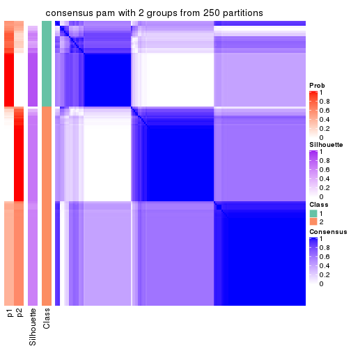</p>

</div>
<div id='tab-MAD-pam-consensus-heatmap-2'>
<pre><code class="r">consensus_heatmap(res, k = 3)
</code></pre>

<p>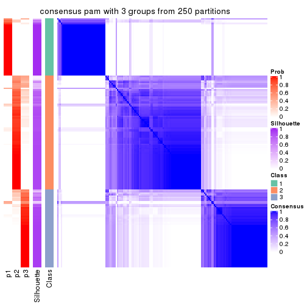</p>

</div>
<div id='tab-MAD-pam-consensus-heatmap-3'>
<pre><code class="r">consensus_heatmap(res, k = 4)
</code></pre>

<p>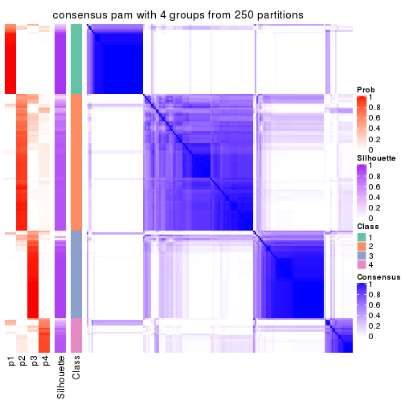</p>

</div>
<div id='tab-MAD-pam-consensus-heatmap-4'>
<pre><code class="r">consensus_heatmap(res, k = 5)
</code></pre>

<p>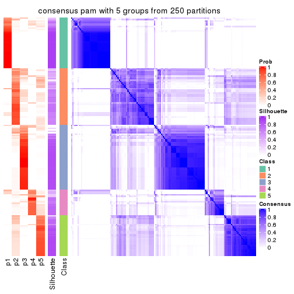</p>

</div>
<div id='tab-MAD-pam-consensus-heatmap-5'>
<pre><code class="r">consensus_heatmap(res, k = 6)
</code></pre>

<p>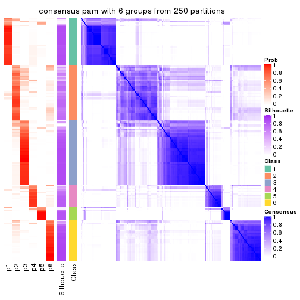</p>

</div>
</div>

Heatmaps for the membership of samples in all partitions to see how consistent they are:


<script>
$( function() {
	$( '#tabs-MAD-pam-membership-heatmap' ).tabs();
} );
</script>
<div id='tabs-MAD-pam-membership-heatmap'>
<ul>
<li><a href='#tab-MAD-pam-membership-heatmap-1'>k = 2</a></li>
<li><a href='#tab-MAD-pam-membership-heatmap-2'>k = 3</a></li>
<li><a href='#tab-MAD-pam-membership-heatmap-3'>k = 4</a></li>
<li><a href='#tab-MAD-pam-membership-heatmap-4'>k = 5</a></li>
<li><a href='#tab-MAD-pam-membership-heatmap-5'>k = 6</a></li>
</ul>
<div id='tab-MAD-pam-membership-heatmap-1'>
<pre><code class="r">membership_heatmap(res, k = 2)
</code></pre>

<p>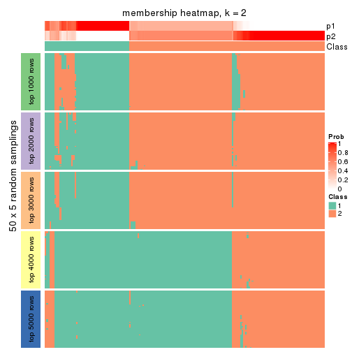</p>

</div>
<div id='tab-MAD-pam-membership-heatmap-2'>
<pre><code class="r">membership_heatmap(res, k = 3)
</code></pre>

<p>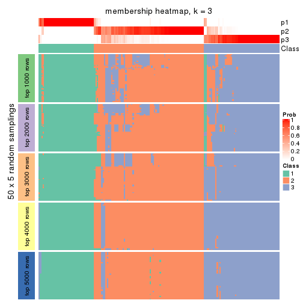</p>

</div>
<div id='tab-MAD-pam-membership-heatmap-3'>
<pre><code class="r">membership_heatmap(res, k = 4)
</code></pre>

<p>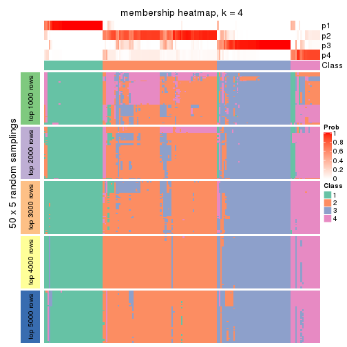</p>

</div>
<div id='tab-MAD-pam-membership-heatmap-4'>
<pre><code class="r">membership_heatmap(res, k = 5)
</code></pre>

<p>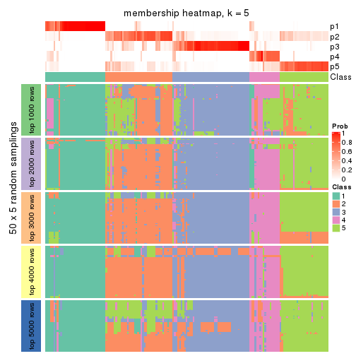</p>

</div>
<div id='tab-MAD-pam-membership-heatmap-5'>
<pre><code class="r">membership_heatmap(res, k = 6)
</code></pre>

<p>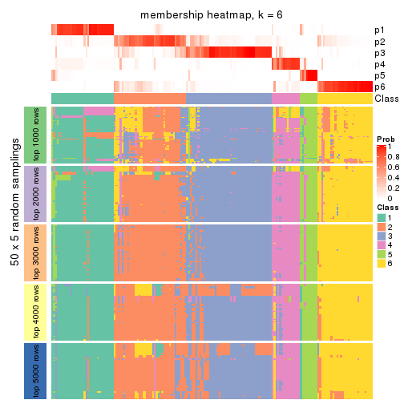</p>

</div>
</div>

As soon as we have had the classes for columns, we can look for signatures
which are significantly different between classes which can be candidate marks
for certain classes. Following are the heatmaps for signatures.


Signature heatmaps where rows are scaled:


<script>
$( function() {
	$( '#tabs-MAD-pam-get-signatures' ).tabs();
} );
</script>
<div id='tabs-MAD-pam-get-signatures'>
<ul>
<li><a href='#tab-MAD-pam-get-signatures-1'>k = 2</a></li>
<li><a href='#tab-MAD-pam-get-signatures-2'>k = 3</a></li>
<li><a href='#tab-MAD-pam-get-signatures-3'>k = 4</a></li>
<li><a href='#tab-MAD-pam-get-signatures-4'>k = 5</a></li>
<li><a href='#tab-MAD-pam-get-signatures-5'>k = 6</a></li>
</ul>
<div id='tab-MAD-pam-get-signatures-1'>
<pre><code class="r">get_signatures(res, k = 2)
</code></pre>

<p>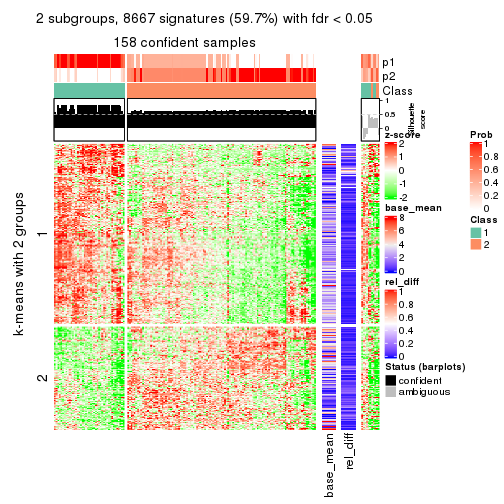</p>

</div>
<div id='tab-MAD-pam-get-signatures-2'>
<pre><code class="r">get_signatures(res, k = 3)
</code></pre>

<p>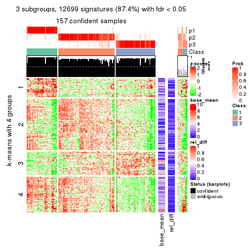</p>

</div>
<div id='tab-MAD-pam-get-signatures-3'>
<pre><code class="r">get_signatures(res, k = 4)
</code></pre>

<p>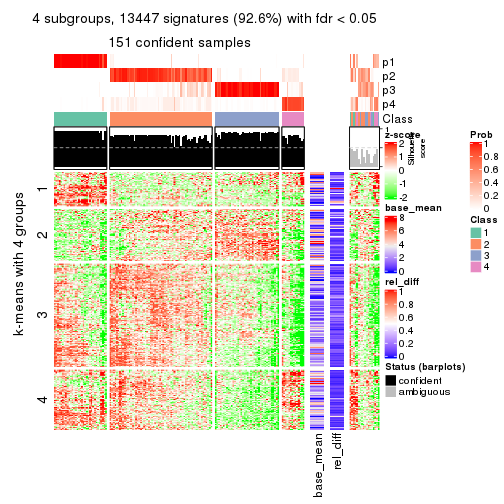</p>

</div>
<div id='tab-MAD-pam-get-signatures-4'>
<pre><code class="r">get_signatures(res, k = 5)
</code></pre>

<p>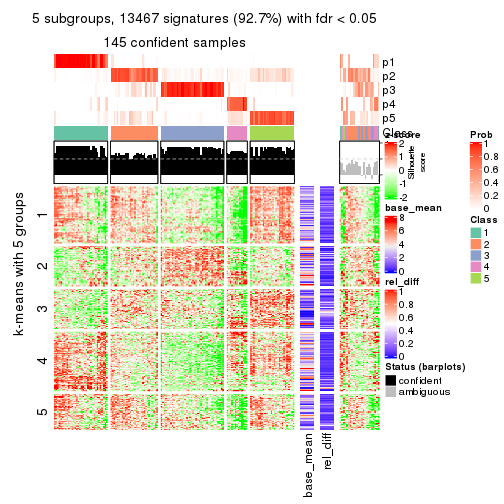</p>

</div>
<div id='tab-MAD-pam-get-signatures-5'>
<pre><code class="r">get_signatures(res, k = 6)
</code></pre>

<p>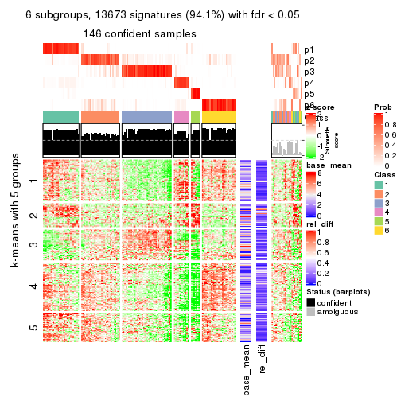</p>

</div>
</div>


Signature heatmaps where rows are not scaled:


<script>
$( function() {
	$( '#tabs-MAD-pam-get-signatures-no-scale' ).tabs();
} );
</script>
<div id='tabs-MAD-pam-get-signatures-no-scale'>
<ul>
<li><a href='#tab-MAD-pam-get-signatures-no-scale-1'>k = 2</a></li>
<li><a href='#tab-MAD-pam-get-signatures-no-scale-2'>k = 3</a></li>
<li><a href='#tab-MAD-pam-get-signatures-no-scale-3'>k = 4</a></li>
<li><a href='#tab-MAD-pam-get-signatures-no-scale-4'>k = 5</a></li>
<li><a href='#tab-MAD-pam-get-signatures-no-scale-5'>k = 6</a></li>
</ul>
<div id='tab-MAD-pam-get-signatures-no-scale-1'>
<pre><code class="r">get_signatures(res, k = 2, scale_rows = FALSE)
</code></pre>

<p>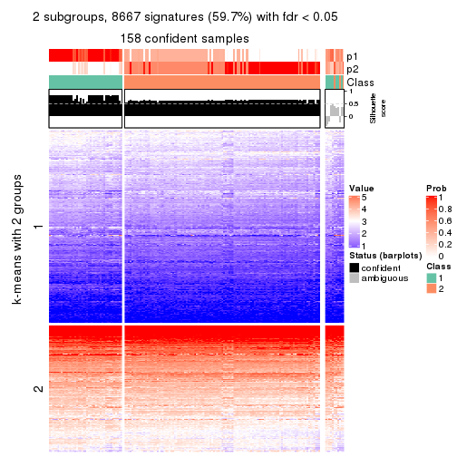</p>

</div>
<div id='tab-MAD-pam-get-signatures-no-scale-2'>
<pre><code class="r">get_signatures(res, k = 3, scale_rows = FALSE)
</code></pre>

<p>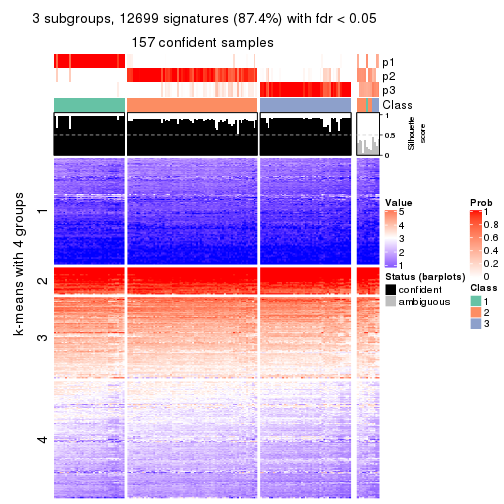</p>

</div>
<div id='tab-MAD-pam-get-signatures-no-scale-3'>
<pre><code class="r">get_signatures(res, k = 4, scale_rows = FALSE)
</code></pre>

<p>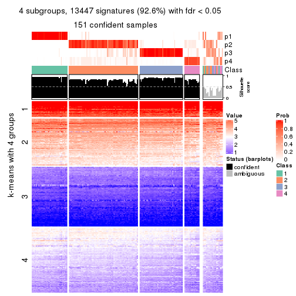</p>

</div>
<div id='tab-MAD-pam-get-signatures-no-scale-4'>
<pre><code class="r">get_signatures(res, k = 5, scale_rows = FALSE)
</code></pre>

<p>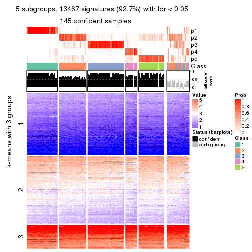</p>

</div>
<div id='tab-MAD-pam-get-signatures-no-scale-5'>
<pre><code class="r">get_signatures(res, k = 6, scale_rows = FALSE)
</code></pre>

<p>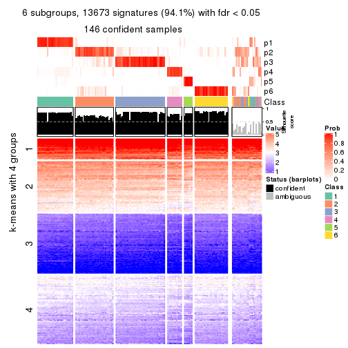</p>

</div>
</div>


Compare the overlap of signatures from different k:

```r
compare_signatures(res)
```

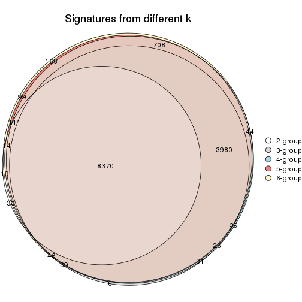

`get_signature()` returns a data frame invisibly. TO get the list of signatures, the function
call should be assigned to a variable explicitly. In following code, if `plot` argument is set
to `FALSE`, no heatmap is plotted while only the differential analysis is performed.

```r
# code only for demonstration
tb = get_signature(res, k = ..., plot = FALSE)
```

An example of the output of `tb` is:

```
#>   which_row         fdr    mean_1    mean_2 scaled_mean_1 scaled_mean_2 km
#> 1        38 0.042760348  8.373488  9.131774    -0.5533452     0.5164555  1
#> 2        40 0.018707592  7.106213  8.469186    -0.6173731     0.5762149  1
#> 3        55 0.019134737 10.221463 11.207825    -0.6159697     0.5749050  1
#> 4        59 0.006059896  5.921854  7.869574    -0.6899429     0.6439467  1
#> 5        60 0.018055526  8.928898 10.211722    -0.6204761     0.5791110  1
#> 6        98 0.009384629 15.714769 14.887706     0.6635654    -0.6193277  2
...
```

The columns in `tb` are:

1. `which_row`: row indices corresponding to the input matrix.
2. `fdr`: FDR for the differential test. 
3. `mean_x`: The mean value in group x.
4. `scaled_mean_x`: The mean value in group x after rows are scaled.
5. `km`: Row groups if k-means clustering is applied to rows.


UMAP plot which shows how samples are separated.


<script>
$( function() {
	$( '#tabs-MAD-pam-dimension-reduction' ).tabs();
} );
</script>
<div id='tabs-MAD-pam-dimension-reduction'>
<ul>
<li><a href='#tab-MAD-pam-dimension-reduction-1'>k = 2</a></li>
<li><a href='#tab-MAD-pam-dimension-reduction-2'>k = 3</a></li>
<li><a href='#tab-MAD-pam-dimension-reduction-3'>k = 4</a></li>
<li><a href='#tab-MAD-pam-dimension-reduction-4'>k = 5</a></li>
<li><a href='#tab-MAD-pam-dimension-reduction-5'>k = 6</a></li>
</ul>
<div id='tab-MAD-pam-dimension-reduction-1'>
<pre><code class="r">dimension_reduction(res, k = 2, method = &quot;UMAP&quot;)
</code></pre>

<p>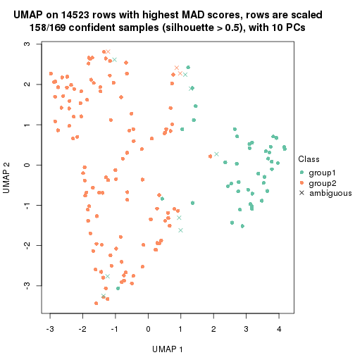</p>

</div>
<div id='tab-MAD-pam-dimension-reduction-2'>
<pre><code class="r">dimension_reduction(res, k = 3, method = &quot;UMAP&quot;)
</code></pre>

<p>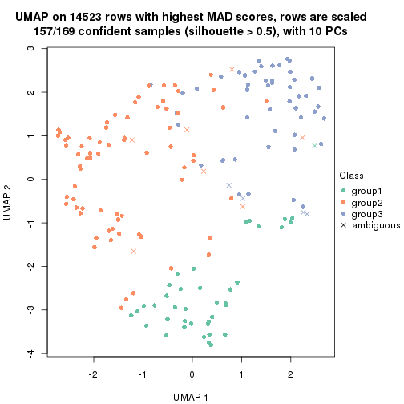</p>

</div>
<div id='tab-MAD-pam-dimension-reduction-3'>
<pre><code class="r">dimension_reduction(res, k = 4, method = &quot;UMAP&quot;)
</code></pre>

<p>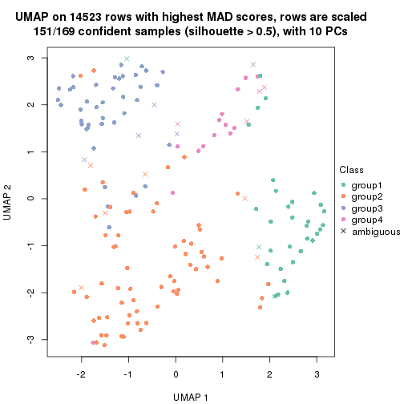</p>

</div>
<div id='tab-MAD-pam-dimension-reduction-4'>
<pre><code class="r">dimension_reduction(res, k = 5, method = &quot;UMAP&quot;)
</code></pre>

<p>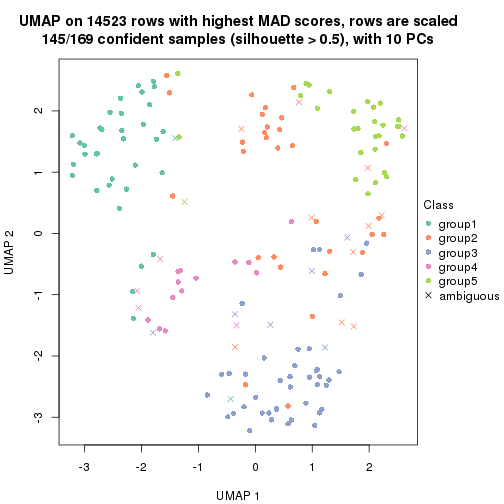</p>

</div>
<div id='tab-MAD-pam-dimension-reduction-5'>
<pre><code class="r">dimension_reduction(res, k = 6, method = &quot;UMAP&quot;)
</code></pre>

<p>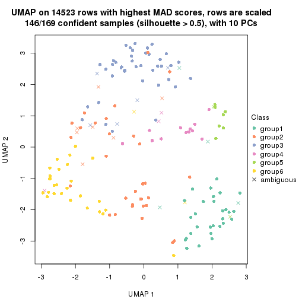</p>

</div>
</div>


Following heatmap shows how subgroups are split when increasing `k`:

```r
collect_classes(res)
```

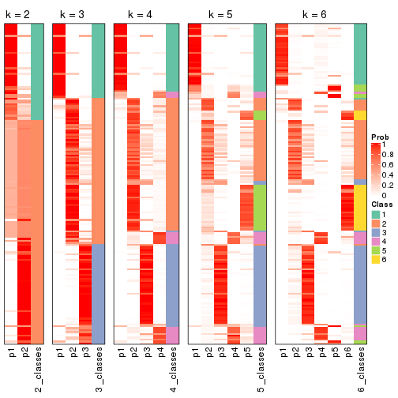


If matrix rows can be associated to genes, consider to use `GO_Enrichment(res,
...)` to perform function enrichment for the signature genes.


 

---------------------------------------------------


### MAD:mclust


The object with results only for a single top-value method and a single partition method 
can be extracted as:

```r
res = res_list["MAD", "mclust"]
# you can also extract it by
# res = res_list["MAD:mclust"]
```

A summary of `res` and all the functions that can be applied to it:

```r
res
```

```
#> A 'ConsensusPartition' object with k = 2, 3, 4, 5, 6.
#>   On a matrix with 14523 rows and 169 columns.
#>   Top rows (1000, 2000, 3000, 4000, 5000) are extracted by 'MAD' method.
#>   Subgroups are detected by 'mclust' method.
#>   Performed in total 1250 partitions by row resampling.
#>   Best k for subgroups seems to be 2.
#> 
#> Following methods can be applied to this 'ConsensusPartition' object:
#>  [1] "cola_report"             "collect_classes"         "collect_plots"          
#>  [4] "collect_stats"           "colnames"                "compare_signatures"     
#>  [7] "consensus_heatmap"       "dimension_reduction"     "functional_enrichment"  
#> [10] "get_anno_col"            "get_anno"                "get_classes"            
#> [13] "get_consensus"           "get_matrix"              "get_membership"         
#> [16] "get_param"               "get_signatures"          "get_stats"              
#> [19] "is_best_k"               "is_stable_k"             "membership_heatmap"     
#> [22] "ncol"                    "nrow"                    "plot_ecdf"              
#> [25] "rownames"                "select_partition_number" "show"                   
#> [28] "suggest_best_k"          "test_to_known_factors"
```

`collect_plots()` function collects all the plots made from `res` for all `k` (number of partitions)
into one single page to provide an easy and fast comparison between different `k`.

```r
collect_plots(res)
```

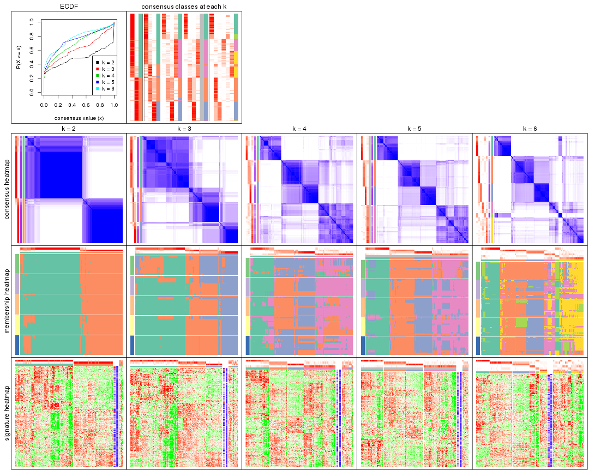

The plots are:

- The first row: a plot of the ECDF (Empirical cumulative distribution
  function) curves of the consensus matrix for each `k` and the heatmap of
  predicted classes for each `k`.
- The second row: heatmaps of the consensus matrix for each `k`.
- The third row: heatmaps of the membership matrix for each `k`.
- The fouth row: heatmaps of the signatures for each `k`.

All the plots in panels can be made by individual functions and they are
plotted later in this section.

`select_partition_number()` produces several plots showing different
statistics for choosing "optimized" `k`. There are following statistics:

- ECDF curves of the consensus matrix for each `k`;
- 1-PAC. [The PAC
  score](https://en.wikipedia.org/wiki/Consensus_clustering#Over-interpretation_potential_of_consensus_clustering)
  measures the proportion of the ambiguous subgrouping.
- Mean silhouette score.
- Concordance. The mean probability of fiting the consensus class ids in all
  partitions.
- Area increased. Denote $A_k$ as the area under the ECDF curve for current
  `k`, the area increased is defined as $A_k - A_{k-1}$.
- Rand index. The percent of pairs of samples that are both in a same cluster
  or both are not in a same cluster in the partition of k and k-1.
- Jaccard index. The ratio of pairs of samples are both in a same cluster in
  the partition of k and k-1 and the pairs of samples are both in a same
  cluster in the partition k or k-1.

The detailed explanations of these statistics can be found in [the cola
vignette](http://bioconductor.org/packages/devel/bioc/vignettes/cola/inst/doc/cola.html#toc_13).

Generally speaking, lower PAC score, higher mean silhouette score or higher
concordance corresponds to better partition. Rand index and Jaccard index
measure how similar the current partition is compared to partition with `k-1`.
If they are too similar, we won't accept `k` is better than `k-1`.

```r
select_partition_number(res)
```

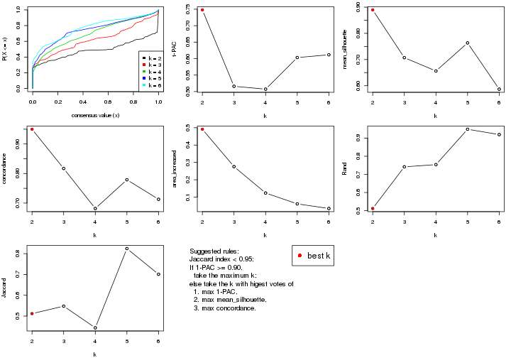

The numeric values for all these statistics can be obtained by `get_stats()`.

```r
get_stats(res)
```

```
#>   k 1-PAC mean_silhouette concordance area_increased  Rand Jaccard
#> 2 2 0.748           0.889       0.950         0.4912 0.512   0.512
#> 3 3 0.516           0.707       0.817         0.2758 0.742   0.548
#> 4 4 0.507           0.656       0.682         0.1237 0.754   0.444
#> 5 5 0.603           0.763       0.779         0.0610 0.949   0.824
#> 6 6 0.612           0.587       0.713         0.0344 0.920   0.701
```

`suggest_best_k()` suggests the best $k$ based on these statistics. The rules are as follows:

- All $k$ with Jaccard index larger than 0.95 are removed because the increase of
  the partition number does not provides enough extra information. If all $k$ are removed,
  the best $k$ is assigned by `NA`.
- For $k$ with 1-PAC larger than 0.9, the maximal $k$ is taken as the "best k". Other $k$ is called "optional k".
- If it does not fit the second rule. The $k$ with the highest vote of highest
  1-PAC, mean silhouette and concordance is taken as the "best k".

```r
suggest_best_k(res)
```

```
#> [1] 2
```


Following shows the table of the partitions (You need to click the **show/hide
code output** link to see it). The membership matrix (columns with name `p*`)
is inferred by
[`clue::cl_consensus()`](https://www.rdocumentation.org/link/cl_consensus?package=clue)
function with the `SE` method. Basically the value in the membership matrix
represents the probability to belong to a certain group. The finall class
label for an item is determined with the group with highest probability it
belongs to.

In `get_classes()` function, the entropy is calculated from the membership
matrix and the silhouette score is calculated from the consensus matrix.


<script>
$( function() {
	$( '#tabs-MAD-mclust-get-classes' ).tabs();
} );
</script>
<div id='tabs-MAD-mclust-get-classes'>
<ul>
<li><a href='#tab-MAD-mclust-get-classes-1'>k = 2</a></li>
<li><a href='#tab-MAD-mclust-get-classes-2'>k = 3</a></li>
<li><a href='#tab-MAD-mclust-get-classes-3'>k = 4</a></li>
<li><a href='#tab-MAD-mclust-get-classes-4'>k = 5</a></li>
<li><a href='#tab-MAD-mclust-get-classes-5'>k = 6</a></li>
</ul>

<div id='tab-MAD-mclust-get-classes-1'>
<p><a id='tab-MAD-mclust-get-classes-1-a' style='color:#0366d6' href='#'>show/hide code output</a></p>
<pre><code class="r">cbind(get_classes(res, k = 2), get_membership(res, k = 2))
</code></pre>

<pre><code>#&gt;            class entropy silhouette    p1    p2
#&gt; SRR2052702     2  0.9393      0.478 0.356 0.644
#&gt; SRR2052701     1  0.5294      0.851 0.880 0.120
#&gt; SRR2052700     1  0.0000      0.941 1.000 0.000
#&gt; SRR2052699     1  0.0000      0.941 1.000 0.000
#&gt; SRR2052698     2  0.0000      0.951 0.000 1.000
#&gt; SRR2052708     1  0.0000      0.941 1.000 0.000
#&gt; SRR2052749     1  0.0000      0.941 1.000 0.000
#&gt; SRR2052786     2  0.0000      0.951 0.000 1.000
#&gt; SRR2052825     1  0.0000      0.941 1.000 0.000
#&gt; SRR2052824     1  0.0000      0.941 1.000 0.000
#&gt; SRR2052823     1  0.5178      0.854 0.884 0.116
#&gt; SRR2052822     2  0.0000      0.951 0.000 1.000
#&gt; SRR2052821     2  0.0000      0.951 0.000 1.000
#&gt; SRR2052820     1  0.0000      0.941 1.000 0.000
#&gt; SRR2052819     1  0.7376      0.728 0.792 0.208
#&gt; SRR2052818     1  0.0376      0.939 0.996 0.004
#&gt; SRR2052817     2  0.0000      0.951 0.000 1.000
#&gt; SRR2052816     1  0.0000      0.941 1.000 0.000
#&gt; SRR2052815     1  0.0000      0.941 1.000 0.000
#&gt; SRR2052814     2  0.9427      0.470 0.360 0.640
#&gt; SRR2052813     2  0.0000      0.951 0.000 1.000
#&gt; SRR2052812     2  0.0000      0.951 0.000 1.000
#&gt; SRR2052811     2  0.9209      0.521 0.336 0.664
#&gt; SRR2052810     1  0.4161      0.876 0.916 0.084
#&gt; SRR2052809     2  0.0000      0.951 0.000 1.000
#&gt; SRR2052808     1  0.0000      0.941 1.000 0.000
#&gt; SRR2052807     1  0.0000      0.941 1.000 0.000
#&gt; SRR2052806     1  0.0000      0.941 1.000 0.000
#&gt; SRR2052805     1  0.0000      0.941 1.000 0.000
#&gt; SRR2052804     1  0.0000      0.941 1.000 0.000
#&gt; SRR2052803     1  0.0000      0.941 1.000 0.000
#&gt; SRR2052802     1  0.0000      0.941 1.000 0.000
#&gt; SRR2052801     1  0.0000      0.941 1.000 0.000
#&gt; SRR2052800     1  0.0000      0.941 1.000 0.000
#&gt; SRR2052799     1  0.0000      0.941 1.000 0.000
#&gt; SRR2052798     1  0.0000      0.941 1.000 0.000
#&gt; SRR2052797     2  0.0000      0.951 0.000 1.000
#&gt; SRR2052796     1  0.0000      0.941 1.000 0.000
#&gt; SRR2052795     1  0.0000      0.941 1.000 0.000
#&gt; SRR2052794     1  0.0000      0.941 1.000 0.000
#&gt; SRR2052793     1  0.0000      0.941 1.000 0.000
#&gt; SRR2052792     1  0.0000      0.941 1.000 0.000
#&gt; SRR2052791     1  0.0000      0.941 1.000 0.000
#&gt; SRR2052790     2  0.1184      0.940 0.016 0.984
#&gt; SRR2052789     2  0.0000      0.951 0.000 1.000
#&gt; SRR2052788     2  0.0000      0.951 0.000 1.000
#&gt; SRR2052787     2  0.0000      0.951 0.000 1.000
#&gt; SRR2052785     2  0.0000      0.951 0.000 1.000
#&gt; SRR2052784     2  0.0000      0.951 0.000 1.000
#&gt; SRR2052783     2  0.0000      0.951 0.000 1.000
#&gt; SRR2052782     2  0.0000      0.951 0.000 1.000
#&gt; SRR2052781     2  0.0000      0.951 0.000 1.000
#&gt; SRR2052780     2  0.0000      0.951 0.000 1.000
#&gt; SRR2052777     2  0.0000      0.951 0.000 1.000
#&gt; SRR2052779     2  0.0000      0.951 0.000 1.000
#&gt; SRR2052778     2  0.0000      0.951 0.000 1.000
#&gt; SRR2052776     2  0.0000      0.951 0.000 1.000
#&gt; SRR2052775     2  0.0000      0.951 0.000 1.000
#&gt; SRR2052773     2  0.0000      0.951 0.000 1.000
#&gt; SRR2052772     2  0.0000      0.951 0.000 1.000
#&gt; SRR2052774     2  0.0000      0.951 0.000 1.000
#&gt; SRR2052771     1  0.0000      0.941 1.000 0.000
#&gt; SRR2052769     2  0.7528      0.722 0.216 0.784
#&gt; SRR2052770     2  0.0000      0.951 0.000 1.000
#&gt; SRR2052768     2  0.0000      0.951 0.000 1.000
#&gt; SRR2052767     2  0.1633      0.934 0.024 0.976
#&gt; SRR2052766     1  0.0000      0.941 1.000 0.000
#&gt; SRR2052765     1  0.9393      0.434 0.644 0.356
#&gt; SRR2052763     2  0.1843      0.930 0.028 0.972
#&gt; SRR2052764     1  0.0000      0.941 1.000 0.000
#&gt; SRR2052761     1  0.7674      0.729 0.776 0.224
#&gt; SRR2052760     2  0.0000      0.951 0.000 1.000
#&gt; SRR2052759     2  0.0000      0.951 0.000 1.000
#&gt; SRR2052762     2  0.3114      0.906 0.056 0.944
#&gt; SRR2052758     2  0.0000      0.951 0.000 1.000
#&gt; SRR2052756     1  0.0000      0.941 1.000 0.000
#&gt; SRR2052757     2  0.0000      0.951 0.000 1.000
#&gt; SRR2052755     1  0.0000      0.941 1.000 0.000
#&gt; SRR2052754     1  0.0000      0.941 1.000 0.000
#&gt; SRR2052753     1  0.0000      0.941 1.000 0.000
#&gt; SRR2052752     1  0.0000      0.941 1.000 0.000
#&gt; SRR2052750     1  0.0000      0.941 1.000 0.000
#&gt; SRR2052751     1  0.8499      0.657 0.724 0.276
#&gt; SRR2052748     2  0.9754      0.347 0.408 0.592
#&gt; SRR2052747     1  0.0000      0.941 1.000 0.000
#&gt; SRR2052746     2  0.0000      0.951 0.000 1.000
#&gt; SRR2052745     2  0.5737      0.817 0.136 0.864
#&gt; SRR2052744     1  0.0000      0.941 1.000 0.000
#&gt; SRR2052741     1  0.8327      0.676 0.736 0.264
#&gt; SRR2052743     1  0.9000      0.587 0.684 0.316
#&gt; SRR2052740     1  0.8499      0.657 0.724 0.276
#&gt; SRR2052742     1  0.8386      0.670 0.732 0.268
#&gt; SRR2052739     2  0.6973      0.758 0.188 0.812
#&gt; SRR2052738     2  0.0000      0.951 0.000 1.000
#&gt; SRR2052736     1  0.3879      0.887 0.924 0.076
#&gt; SRR2052735     1  0.0000      0.941 1.000 0.000
#&gt; SRR2052734     1  0.0000      0.941 1.000 0.000
#&gt; SRR2052737     2  0.0000      0.951 0.000 1.000
#&gt; SRR2052733     2  0.0000      0.951 0.000 1.000
#&gt; SRR2052732     1  0.0000      0.941 1.000 0.000
#&gt; SRR2052731     2  0.0000      0.951 0.000 1.000
#&gt; SRR2052729     1  0.0000      0.941 1.000 0.000
#&gt; SRR2052728     1  0.0000      0.941 1.000 0.000
#&gt; SRR2052730     1  0.0000      0.941 1.000 0.000
#&gt; SRR2052727     1  0.0000      0.941 1.000 0.000
#&gt; SRR2052725     1  0.0000      0.941 1.000 0.000
#&gt; SRR2052726     1  0.0000      0.941 1.000 0.000
#&gt; SRR2052724     1  0.0000      0.941 1.000 0.000
#&gt; SRR2052723     1  0.0000      0.941 1.000 0.000
#&gt; SRR2052722     2  0.0000      0.951 0.000 1.000
#&gt; SRR2052721     1  0.0000      0.941 1.000 0.000
#&gt; SRR2052720     2  0.0000      0.951 0.000 1.000
#&gt; SRR2052719     2  0.0000      0.951 0.000 1.000
#&gt; SRR2052718     1  0.0000      0.941 1.000 0.000
#&gt; SRR2052717     2  0.3431      0.899 0.064 0.936
#&gt; SRR2052714     1  0.0000      0.941 1.000 0.000
#&gt; SRR2052716     1  0.0000      0.941 1.000 0.000
#&gt; SRR2052715     2  0.0000      0.951 0.000 1.000
#&gt; SRR2052713     1  0.0000      0.941 1.000 0.000
#&gt; SRR2052712     1  0.0000      0.941 1.000 0.000
#&gt; SRR2052711     1  0.0000      0.941 1.000 0.000
#&gt; SRR2052710     1  0.1843      0.922 0.972 0.028
#&gt; SRR2052707     2  0.0000      0.951 0.000 1.000
#&gt; SRR2052709     2  0.0000      0.951 0.000 1.000
#&gt; SRR2052704     2  0.3584      0.894 0.068 0.932
#&gt; SRR2052705     1  0.9427      0.495 0.640 0.360
#&gt; SRR2052697     1  0.4298      0.878 0.912 0.088
#&gt; SRR2052703     2  0.0000      0.951 0.000 1.000
#&gt; SRR2052696     1  0.0000      0.941 1.000 0.000
#&gt; SRR2052706     2  0.9170      0.522 0.332 0.668
#&gt; SRR2052695     2  0.0000      0.951 0.000 1.000
#&gt; SRR2052694     2  0.0000      0.951 0.000 1.000
#&gt; SRR2052692     2  0.0000      0.951 0.000 1.000
#&gt; SRR2052693     2  0.0000      0.951 0.000 1.000
#&gt; SRR2052691     1  0.0000      0.941 1.000 0.000
#&gt; SRR2052690     1  0.0000      0.941 1.000 0.000
#&gt; SRR2052689     1  0.7139      0.746 0.804 0.196
#&gt; SRR2052687     1  0.7139      0.746 0.804 0.196
#&gt; SRR2052686     1  0.0000      0.941 1.000 0.000
#&gt; SRR2052688     2  0.6712      0.773 0.176 0.824
#&gt; SRR2052684     1  0.0000      0.941 1.000 0.000
#&gt; SRR2052685     1  0.4815      0.865 0.896 0.104
#&gt; SRR2052683     1  0.0000      0.941 1.000 0.000
#&gt; SRR2052681     1  0.0000      0.941 1.000 0.000
#&gt; SRR2052680     1  0.0000      0.941 1.000 0.000
#&gt; SRR2052682     1  0.0000      0.941 1.000 0.000
#&gt; SRR2052679     1  0.0000      0.941 1.000 0.000
#&gt; SRR2052678     2  0.0000      0.951 0.000 1.000
#&gt; SRR2052677     2  0.0000      0.951 0.000 1.000
#&gt; SRR2052675     1  0.8443      0.664 0.728 0.272
#&gt; SRR2052676     1  0.0000      0.941 1.000 0.000
#&gt; SRR2052674     1  0.5294      0.840 0.880 0.120
#&gt; SRR2052672     2  0.0000      0.951 0.000 1.000
#&gt; SRR2052673     1  0.3114      0.903 0.944 0.056
#&gt; SRR2052671     1  0.9087      0.567 0.676 0.324
#&gt; SRR2052670     2  0.0000      0.951 0.000 1.000
#&gt; SRR2052669     2  0.0000      0.951 0.000 1.000
#&gt; SRR2052668     1  0.5059      0.858 0.888 0.112
#&gt; SRR2052667     1  0.8813      0.617 0.700 0.300
#&gt; SRR2052666     1  0.0376      0.939 0.996 0.004
#&gt; SRR2052665     1  0.9427      0.500 0.640 0.360
#&gt; SRR2052664     1  0.0000      0.941 1.000 0.000
#&gt; SRR2052663     1  0.0000      0.941 1.000 0.000
#&gt; SRR2052662     2  0.1843      0.930 0.028 0.972
#&gt; SRR2052661     1  0.0000      0.941 1.000 0.000
#&gt; SRR2052660     2  0.9286      0.431 0.344 0.656
#&gt; SRR2052659     1  0.0000      0.941 1.000 0.000
#&gt; SRR2052658     1  0.7745      0.727 0.772 0.228
#&gt; SRR2052657     1  0.0000      0.941 1.000 0.000
</code></pre>

<script>
$('#tab-MAD-mclust-get-classes-1-a').parent().next().next().hide();
$('#tab-MAD-mclust-get-classes-1-a').click(function(){
  $('#tab-MAD-mclust-get-classes-1-a').parent().next().next().toggle();
  return(false);
});
</script>
</div>

<div id='tab-MAD-mclust-get-classes-2'>
<p><a id='tab-MAD-mclust-get-classes-2-a' style='color:#0366d6' href='#'>show/hide code output</a></p>
<pre><code class="r">cbind(get_classes(res, k = 3), get_membership(res, k = 3))
</code></pre>

<pre><code>#&gt;            class entropy silhouette    p1    p2    p3
#&gt; SRR2052702     2  0.3412     0.6372 0.000 0.876 0.124
#&gt; SRR2052701     2  0.5497     0.1462 0.292 0.708 0.000
#&gt; SRR2052700     1  0.4605     0.8426 0.796 0.204 0.000
#&gt; SRR2052699     1  0.5968     0.7632 0.636 0.364 0.000
#&gt; SRR2052698     3  0.6291    -0.3177 0.000 0.468 0.532
#&gt; SRR2052708     1  0.1964     0.8427 0.944 0.056 0.000
#&gt; SRR2052749     1  0.3412     0.8233 0.876 0.124 0.000
#&gt; SRR2052786     2  0.5810     0.6772 0.000 0.664 0.336
#&gt; SRR2052825     1  0.4399     0.8461 0.812 0.188 0.000
#&gt; SRR2052824     1  0.5298     0.8404 0.804 0.164 0.032
#&gt; SRR2052823     2  0.1163     0.5873 0.028 0.972 0.000
#&gt; SRR2052822     2  0.5810     0.6772 0.000 0.664 0.336
#&gt; SRR2052821     2  0.5810     0.6772 0.000 0.664 0.336
#&gt; SRR2052820     1  0.4504     0.8449 0.804 0.196 0.000
#&gt; SRR2052819     1  0.5109     0.7132 0.780 0.008 0.212
#&gt; SRR2052818     1  0.5791     0.8293 0.792 0.148 0.060
#&gt; SRR2052817     3  0.0000     0.8428 0.000 0.000 1.000
#&gt; SRR2052816     1  0.4750     0.8393 0.784 0.216 0.000
#&gt; SRR2052815     1  0.5618     0.8342 0.796 0.156 0.048
#&gt; SRR2052814     2  0.9509     0.4071 0.200 0.464 0.336
#&gt; SRR2052813     2  0.5785     0.6771 0.000 0.668 0.332
#&gt; SRR2052812     2  0.5291     0.6709 0.000 0.732 0.268
#&gt; SRR2052811     2  0.6063     0.5996 0.084 0.784 0.132
#&gt; SRR2052810     1  0.6157     0.7826 0.780 0.092 0.128
#&gt; SRR2052809     2  0.5810     0.6772 0.000 0.664 0.336
#&gt; SRR2052808     2  0.5267     0.5830 0.140 0.816 0.044
#&gt; SRR2052807     1  0.3412     0.8567 0.876 0.124 0.000
#&gt; SRR2052806     1  0.0000     0.8438 1.000 0.000 0.000
#&gt; SRR2052805     1  0.0000     0.8438 1.000 0.000 0.000
#&gt; SRR2052804     1  0.4399     0.8461 0.812 0.188 0.000
#&gt; SRR2052803     1  0.0000     0.8438 1.000 0.000 0.000
#&gt; SRR2052802     1  0.4399     0.8461 0.812 0.188 0.000
#&gt; SRR2052801     1  0.0000     0.8438 1.000 0.000 0.000
#&gt; SRR2052800     1  0.4399     0.8461 0.812 0.188 0.000
#&gt; SRR2052799     1  0.0000     0.8438 1.000 0.000 0.000
#&gt; SRR2052798     1  0.3412     0.8233 0.876 0.124 0.000
#&gt; SRR2052797     2  0.5810     0.6772 0.000 0.664 0.336
#&gt; SRR2052796     1  0.0000     0.8438 1.000 0.000 0.000
#&gt; SRR2052795     1  0.1964     0.8427 0.944 0.056 0.000
#&gt; SRR2052794     1  0.0000     0.8438 1.000 0.000 0.000
#&gt; SRR2052793     1  0.0000     0.8438 1.000 0.000 0.000
#&gt; SRR2052792     1  0.4504     0.8449 0.804 0.196 0.000
#&gt; SRR2052791     1  0.4002     0.8535 0.840 0.160 0.000
#&gt; SRR2052790     3  0.5254     0.3915 0.000 0.264 0.736
#&gt; SRR2052789     3  0.0000     0.8428 0.000 0.000 1.000
#&gt; SRR2052788     3  0.0000     0.8428 0.000 0.000 1.000
#&gt; SRR2052787     2  0.5810     0.6772 0.000 0.664 0.336
#&gt; SRR2052785     3  0.6008     0.0120 0.000 0.372 0.628
#&gt; SRR2052784     2  0.5810     0.6772 0.000 0.664 0.336
#&gt; SRR2052783     2  0.5835     0.6729 0.000 0.660 0.340
#&gt; SRR2052782     2  0.5810     0.6772 0.000 0.664 0.336
#&gt; SRR2052781     2  0.5810     0.6772 0.000 0.664 0.336
#&gt; SRR2052780     3  0.0000     0.8428 0.000 0.000 1.000
#&gt; SRR2052777     2  0.5810     0.6772 0.000 0.664 0.336
#&gt; SRR2052779     2  0.5810     0.6772 0.000 0.664 0.336
#&gt; SRR2052778     3  0.0000     0.8428 0.000 0.000 1.000
#&gt; SRR2052776     2  0.5810     0.6772 0.000 0.664 0.336
#&gt; SRR2052775     3  0.0000     0.8428 0.000 0.000 1.000
#&gt; SRR2052773     3  0.5905     0.1584 0.000 0.352 0.648
#&gt; SRR2052772     3  0.0000     0.8428 0.000 0.000 1.000
#&gt; SRR2052774     3  0.0000     0.8428 0.000 0.000 1.000
#&gt; SRR2052771     1  0.0424     0.8447 0.992 0.008 0.000
#&gt; SRR2052769     1  0.9235     0.0500 0.460 0.156 0.384
#&gt; SRR2052770     3  0.0000     0.8428 0.000 0.000 1.000
#&gt; SRR2052768     2  0.5529     0.6760 0.000 0.704 0.296
#&gt; SRR2052767     2  0.3816     0.6455 0.000 0.852 0.148
#&gt; SRR2052766     1  0.4808     0.8445 0.804 0.188 0.008
#&gt; SRR2052765     1  0.9653    -0.0462 0.448 0.224 0.328
#&gt; SRR2052763     3  0.3682     0.7243 0.008 0.116 0.876
#&gt; SRR2052764     1  0.4897     0.8455 0.812 0.172 0.016
#&gt; SRR2052761     3  0.9638     0.0860 0.232 0.308 0.460
#&gt; SRR2052760     2  0.5760     0.6773 0.000 0.672 0.328
#&gt; SRR2052759     3  0.0000     0.8428 0.000 0.000 1.000
#&gt; SRR2052762     2  0.3412     0.6428 0.000 0.876 0.124
#&gt; SRR2052758     3  0.0237     0.8402 0.000 0.004 0.996
#&gt; SRR2052756     1  0.0747     0.8450 0.984 0.016 0.000
#&gt; SRR2052757     2  0.6111     0.5951 0.000 0.604 0.396
#&gt; SRR2052755     1  0.3267     0.8239 0.884 0.116 0.000
#&gt; SRR2052754     1  0.0000     0.8438 1.000 0.000 0.000
#&gt; SRR2052753     1  0.2261     0.8388 0.932 0.068 0.000
#&gt; SRR2052752     1  0.0000     0.8438 1.000 0.000 0.000
#&gt; SRR2052750     1  0.3412     0.8233 0.876 0.124 0.000
#&gt; SRR2052751     2  0.0424     0.6002 0.008 0.992 0.000
#&gt; SRR2052748     1  0.6158     0.8255 0.760 0.188 0.052
#&gt; SRR2052747     1  0.3267     0.8239 0.884 0.116 0.000
#&gt; SRR2052746     3  0.0000     0.8428 0.000 0.000 1.000
#&gt; SRR2052745     3  0.4164     0.6884 0.008 0.144 0.848
#&gt; SRR2052744     1  0.3267     0.8239 0.884 0.116 0.000
#&gt; SRR2052741     2  0.5497     0.1430 0.292 0.708 0.000
#&gt; SRR2052743     2  0.0000     0.6036 0.000 1.000 0.000
#&gt; SRR2052740     2  0.5529     0.1297 0.296 0.704 0.000
#&gt; SRR2052742     2  0.4887     0.3203 0.228 0.772 0.000
#&gt; SRR2052739     2  0.5810     0.6772 0.000 0.664 0.336
#&gt; SRR2052738     3  0.3349     0.7361 0.004 0.108 0.888
#&gt; SRR2052736     1  0.5591     0.8120 0.696 0.304 0.000
#&gt; SRR2052735     1  0.4887     0.8309 0.772 0.228 0.000
#&gt; SRR2052734     1  0.5138     0.8279 0.748 0.252 0.000
#&gt; SRR2052737     2  0.5810     0.6772 0.000 0.664 0.336
#&gt; SRR2052733     3  0.1753     0.7951 0.048 0.000 0.952
#&gt; SRR2052732     1  0.4399     0.8461 0.812 0.188 0.000
#&gt; SRR2052731     3  0.0000     0.8428 0.000 0.000 1.000
#&gt; SRR2052729     1  0.3267     0.8239 0.884 0.116 0.000
#&gt; SRR2052728     1  0.3267     0.8239 0.884 0.116 0.000
#&gt; SRR2052730     1  0.4399     0.8461 0.812 0.188 0.000
#&gt; SRR2052727     1  0.3412     0.8233 0.876 0.124 0.000
#&gt; SRR2052725     1  0.4399     0.8461 0.812 0.188 0.000
#&gt; SRR2052726     1  0.4796     0.8313 0.780 0.220 0.000
#&gt; SRR2052724     1  0.1964     0.8427 0.944 0.056 0.000
#&gt; SRR2052723     1  0.4504     0.8449 0.804 0.196 0.000
#&gt; SRR2052722     3  0.0000     0.8428 0.000 0.000 1.000
#&gt; SRR2052721     1  0.3412     0.8233 0.876 0.124 0.000
#&gt; SRR2052720     2  0.5810     0.6772 0.000 0.664 0.336
#&gt; SRR2052719     2  0.5678     0.6762 0.000 0.684 0.316
#&gt; SRR2052718     1  0.3482     0.8581 0.872 0.128 0.000
#&gt; SRR2052717     2  0.2261     0.6265 0.000 0.932 0.068
#&gt; SRR2052714     1  0.1529     0.8446 0.960 0.040 0.000
#&gt; SRR2052716     1  0.4504     0.8449 0.804 0.196 0.000
#&gt; SRR2052715     3  0.0000     0.8428 0.000 0.000 1.000
#&gt; SRR2052713     1  0.0000     0.8438 1.000 0.000 0.000
#&gt; SRR2052712     1  0.4399     0.8461 0.812 0.188 0.000
#&gt; SRR2052711     1  0.4504     0.8449 0.804 0.196 0.000
#&gt; SRR2052710     2  0.7605     0.5253 0.192 0.684 0.124
#&gt; SRR2052707     3  0.0000     0.8428 0.000 0.000 1.000
#&gt; SRR2052709     3  0.0000     0.8428 0.000 0.000 1.000
#&gt; SRR2052704     3  0.6308    -0.1124 0.492 0.000 0.508
#&gt; SRR2052705     2  0.0000     0.6036 0.000 1.000 0.000
#&gt; SRR2052697     2  0.5560     0.1156 0.300 0.700 0.000
#&gt; SRR2052703     3  0.0000     0.8428 0.000 0.000 1.000
#&gt; SRR2052696     1  0.3412     0.8233 0.876 0.124 0.000
#&gt; SRR2052706     2  0.5810     0.6772 0.000 0.664 0.336
#&gt; SRR2052695     2  0.5810     0.6772 0.000 0.664 0.336
#&gt; SRR2052694     2  0.5810     0.6772 0.000 0.664 0.336
#&gt; SRR2052692     3  0.3482     0.7255 0.000 0.128 0.872
#&gt; SRR2052693     2  0.5988     0.6378 0.000 0.632 0.368
#&gt; SRR2052691     1  0.5560     0.8137 0.700 0.300 0.000
#&gt; SRR2052690     1  0.5760     0.7987 0.672 0.328 0.000
#&gt; SRR2052689     1  0.5816     0.7680 0.788 0.056 0.156
#&gt; SRR2052687     1  0.5689     0.7424 0.780 0.036 0.184
#&gt; SRR2052686     1  0.4346     0.8475 0.816 0.184 0.000
#&gt; SRR2052688     2  0.5810     0.6772 0.000 0.664 0.336
#&gt; SRR2052684     1  0.4504     0.8449 0.804 0.196 0.000
#&gt; SRR2052685     2  0.0747     0.5951 0.016 0.984 0.000
#&gt; SRR2052683     1  0.0000     0.8438 1.000 0.000 0.000
#&gt; SRR2052681     1  0.4399     0.8461 0.812 0.188 0.000
#&gt; SRR2052680     1  0.5466     0.8373 0.800 0.160 0.040
#&gt; SRR2052682     1  0.5650     0.8085 0.688 0.312 0.000
#&gt; SRR2052679     1  0.3412     0.8233 0.876 0.124 0.000
#&gt; SRR2052678     3  0.0000     0.8428 0.000 0.000 1.000
#&gt; SRR2052677     2  0.5810     0.6772 0.000 0.664 0.336
#&gt; SRR2052675     2  0.5560     0.1191 0.300 0.700 0.000
#&gt; SRR2052676     1  0.3267     0.8239 0.884 0.116 0.000
#&gt; SRR2052674     1  0.7595     0.6562 0.688 0.176 0.136
#&gt; SRR2052672     3  0.0000     0.8428 0.000 0.000 1.000
#&gt; SRR2052673     1  0.5621     0.8104 0.692 0.308 0.000
#&gt; SRR2052671     2  0.0000     0.6036 0.000 1.000 0.000
#&gt; SRR2052670     3  0.0237     0.8402 0.000 0.004 0.996
#&gt; SRR2052669     2  0.5785     0.6771 0.000 0.668 0.332
#&gt; SRR2052668     2  0.6111    -0.2540 0.396 0.604 0.000
#&gt; SRR2052667     2  0.4479     0.6075 0.096 0.860 0.044
#&gt; SRR2052666     1  0.5875     0.8308 0.784 0.160 0.056
#&gt; SRR2052665     2  0.0000     0.6036 0.000 1.000 0.000
#&gt; SRR2052664     1  0.0000     0.8438 1.000 0.000 0.000
#&gt; SRR2052663     1  0.5216     0.8328 0.740 0.260 0.000
#&gt; SRR2052662     2  0.5058     0.6645 0.000 0.756 0.244
#&gt; SRR2052661     1  0.3412     0.8233 0.876 0.124 0.000
#&gt; SRR2052660     3  0.4968     0.6391 0.012 0.188 0.800
#&gt; SRR2052659     1  0.4555     0.8451 0.800 0.200 0.000
#&gt; SRR2052658     2  0.1411     0.5816 0.036 0.964 0.000
#&gt; SRR2052657     1  0.3192     0.8257 0.888 0.112 0.000
</code></pre>

<script>
$('#tab-MAD-mclust-get-classes-2-a').parent().next().next().hide();
$('#tab-MAD-mclust-get-classes-2-a').click(function(){
  $('#tab-MAD-mclust-get-classes-2-a').parent().next().next().toggle();
  return(false);
});
</script>
</div>

<div id='tab-MAD-mclust-get-classes-3'>
<p><a id='tab-MAD-mclust-get-classes-3-a' style='color:#0366d6' href='#'>show/hide code output</a></p>
<pre><code class="r">cbind(get_classes(res, k = 4), get_membership(res, k = 4))
</code></pre>

<pre><code>#&gt;            class entropy silhouette    p1    p2    p3    p4
#&gt; SRR2052702     4  0.7766     0.4063 0.016 0.284 0.184 0.516
#&gt; SRR2052701     4  0.7461     0.5927 0.040 0.284 0.100 0.576
#&gt; SRR2052700     4  0.1247     0.6979 0.012 0.016 0.004 0.968
#&gt; SRR2052699     4  0.5930     0.7044 0.040 0.196 0.044 0.720
#&gt; SRR2052698     3  0.5158    -0.7516 0.004 0.472 0.524 0.000
#&gt; SRR2052708     1  0.3718     0.7964 0.820 0.012 0.000 0.168
#&gt; SRR2052749     1  0.1940     0.8044 0.924 0.000 0.000 0.076
#&gt; SRR2052786     2  0.4972     0.8136 0.000 0.544 0.456 0.000
#&gt; SRR2052825     4  0.5033     0.6647 0.020 0.124 0.064 0.792
#&gt; SRR2052824     4  0.3687     0.7111 0.012 0.048 0.072 0.868
#&gt; SRR2052823     4  0.5755     0.5909 0.000 0.332 0.044 0.624
#&gt; SRR2052822     2  0.5167     0.8088 0.004 0.508 0.488 0.000
#&gt; SRR2052821     2  0.5167     0.8088 0.004 0.508 0.488 0.000
#&gt; SRR2052820     4  0.2807     0.7106 0.032 0.016 0.040 0.912
#&gt; SRR2052819     4  0.3649     0.6738 0.000 0.000 0.204 0.796
#&gt; SRR2052818     4  0.3367     0.7171 0.000 0.028 0.108 0.864
#&gt; SRR2052817     3  0.0000     0.8118 0.000 0.000 1.000 0.000
#&gt; SRR2052816     4  0.1968     0.7026 0.008 0.044 0.008 0.940
#&gt; SRR2052815     4  0.3758     0.7116 0.012 0.048 0.076 0.864
#&gt; SRR2052814     2  0.7526     0.6185 0.000 0.468 0.332 0.200
#&gt; SRR2052813     2  0.4992     0.8183 0.000 0.524 0.476 0.000
#&gt; SRR2052812     2  0.5070     0.7379 0.000 0.620 0.372 0.008
#&gt; SRR2052811     4  0.7685     0.4674 0.020 0.280 0.164 0.536
#&gt; SRR2052810     4  0.3653     0.7147 0.000 0.028 0.128 0.844
#&gt; SRR2052809     2  0.5168     0.7981 0.004 0.500 0.496 0.000
#&gt; SRR2052808     4  0.6690     0.5275 0.000 0.248 0.144 0.608
#&gt; SRR2052807     4  0.6654     0.3178 0.116 0.296 0.000 0.588
#&gt; SRR2052806     1  0.5923     0.7679 0.696 0.176 0.000 0.128
#&gt; SRR2052805     1  0.6690     0.7336 0.620 0.192 0.000 0.188
#&gt; SRR2052804     4  0.4204     0.5898 0.020 0.192 0.000 0.788
#&gt; SRR2052803     1  0.6058     0.7636 0.684 0.136 0.000 0.180
#&gt; SRR2052802     4  0.4993     0.5550 0.028 0.260 0.000 0.712
#&gt; SRR2052801     1  0.7636     0.6281 0.468 0.248 0.000 0.284
#&gt; SRR2052800     4  0.4993     0.5550 0.028 0.260 0.000 0.712
#&gt; SRR2052799     1  0.7636     0.6281 0.468 0.248 0.000 0.284
#&gt; SRR2052798     1  0.2011     0.8040 0.920 0.000 0.000 0.080
#&gt; SRR2052797     2  0.5165     0.8122 0.004 0.512 0.484 0.000
#&gt; SRR2052796     1  0.7636     0.6281 0.468 0.248 0.000 0.284
#&gt; SRR2052795     1  0.3351     0.8005 0.844 0.008 0.000 0.148
#&gt; SRR2052794     1  0.7636     0.6281 0.468 0.248 0.000 0.284
#&gt; SRR2052793     1  0.7618     0.6307 0.472 0.244 0.000 0.284
#&gt; SRR2052792     4  0.5279     0.5670 0.072 0.192 0.000 0.736
#&gt; SRR2052791     4  0.5855     0.4647 0.208 0.100 0.000 0.692
#&gt; SRR2052790     3  0.2859     0.6913 0.008 0.112 0.880 0.000
#&gt; SRR2052789     3  0.0000     0.8118 0.000 0.000 1.000 0.000
#&gt; SRR2052788     3  0.0336     0.8104 0.008 0.000 0.992 0.000
#&gt; SRR2052787     2  0.4992     0.8183 0.000 0.524 0.476 0.000
#&gt; SRR2052785     3  0.4661    -0.3970 0.000 0.348 0.652 0.000
#&gt; SRR2052784     2  0.5163     0.8141 0.004 0.516 0.480 0.000
#&gt; SRR2052783     2  0.5168     0.8036 0.004 0.504 0.492 0.000
#&gt; SRR2052782     2  0.5165     0.8122 0.004 0.512 0.484 0.000
#&gt; SRR2052781     2  0.5669     0.8136 0.004 0.516 0.464 0.016
#&gt; SRR2052780     3  0.0336     0.8104 0.008 0.000 0.992 0.000
#&gt; SRR2052777     2  0.5317     0.8166 0.004 0.532 0.460 0.004
#&gt; SRR2052779     2  0.5165     0.8122 0.004 0.512 0.484 0.000
#&gt; SRR2052778     3  0.0188     0.8096 0.000 0.000 0.996 0.004
#&gt; SRR2052776     2  0.5168     0.8031 0.004 0.504 0.492 0.000
#&gt; SRR2052775     3  0.0000     0.8118 0.000 0.000 1.000 0.000
#&gt; SRR2052773     3  0.3908     0.3363 0.004 0.212 0.784 0.000
#&gt; SRR2052772     3  0.0000     0.8118 0.000 0.000 1.000 0.000
#&gt; SRR2052774     3  0.0000     0.8118 0.000 0.000 1.000 0.000
#&gt; SRR2052771     1  0.6726     0.6762 0.584 0.124 0.000 0.292
#&gt; SRR2052769     2  0.7429     0.6568 0.004 0.496 0.340 0.160
#&gt; SRR2052770     3  0.0000     0.8118 0.000 0.000 1.000 0.000
#&gt; SRR2052768     2  0.5244     0.7575 0.000 0.600 0.388 0.012
#&gt; SRR2052767     2  0.8148     0.4715 0.016 0.416 0.352 0.216
#&gt; SRR2052766     4  0.4287     0.7204 0.024 0.036 0.104 0.836
#&gt; SRR2052765     4  0.8093    -0.2281 0.008 0.312 0.272 0.408
#&gt; SRR2052763     3  0.3000     0.7326 0.008 0.052 0.900 0.040
#&gt; SRR2052764     4  0.3852     0.7176 0.040 0.024 0.072 0.864
#&gt; SRR2052761     4  0.5459     0.6991 0.024 0.060 0.156 0.760
#&gt; SRR2052760     2  0.4981     0.8172 0.000 0.536 0.464 0.000
#&gt; SRR2052759     3  0.1256     0.7943 0.008 0.028 0.964 0.000
#&gt; SRR2052762     2  0.7738     0.1993 0.000 0.424 0.240 0.336
#&gt; SRR2052758     3  0.1377     0.7950 0.008 0.020 0.964 0.008
#&gt; SRR2052756     1  0.5484     0.7781 0.732 0.104 0.000 0.164
#&gt; SRR2052757     3  0.5168    -0.7980 0.004 0.492 0.504 0.000
#&gt; SRR2052755     1  0.1022     0.8029 0.968 0.000 0.000 0.032
#&gt; SRR2052754     1  0.7636     0.6281 0.468 0.248 0.000 0.284
#&gt; SRR2052753     1  0.1118     0.8025 0.964 0.000 0.000 0.036
#&gt; SRR2052752     1  0.3539     0.7961 0.820 0.004 0.000 0.176
#&gt; SRR2052750     1  0.1118     0.7994 0.964 0.000 0.000 0.036
#&gt; SRR2052751     4  0.6840     0.5636 0.008 0.324 0.096 0.572
#&gt; SRR2052748     4  0.5226     0.6073 0.008 0.020 0.276 0.696
#&gt; SRR2052747     1  0.2399     0.8024 0.920 0.048 0.000 0.032
#&gt; SRR2052746     3  0.1256     0.7943 0.008 0.028 0.964 0.000
#&gt; SRR2052745     3  0.3000     0.7326 0.008 0.052 0.900 0.040
#&gt; SRR2052744     1  0.1302     0.8018 0.956 0.000 0.000 0.044
#&gt; SRR2052741     4  0.6175     0.6833 0.040 0.224 0.044 0.692
#&gt; SRR2052743     4  0.5898     0.5764 0.000 0.348 0.048 0.604
#&gt; SRR2052740     4  0.6646     0.6313 0.044 0.280 0.044 0.632
#&gt; SRR2052742     4  0.5968     0.6148 0.008 0.312 0.044 0.636
#&gt; SRR2052739     2  0.6292     0.7758 0.000 0.524 0.416 0.060
#&gt; SRR2052738     3  0.2353     0.7621 0.008 0.040 0.928 0.024
#&gt; SRR2052736     4  0.6274     0.6961 0.104 0.128 0.044 0.724
#&gt; SRR2052735     1  0.3545     0.7303 0.828 0.008 0.000 0.164
#&gt; SRR2052734     1  0.5632     0.5433 0.620 0.008 0.020 0.352
#&gt; SRR2052737     2  0.5454     0.8197 0.004 0.520 0.468 0.008
#&gt; SRR2052733     3  0.1042     0.7981 0.008 0.000 0.972 0.020
#&gt; SRR2052732     4  0.3959     0.7187 0.052 0.024 0.064 0.860
#&gt; SRR2052731     3  0.1151     0.7974 0.008 0.024 0.968 0.000
#&gt; SRR2052729     1  0.1022     0.8029 0.968 0.000 0.000 0.032
#&gt; SRR2052728     1  0.1302     0.8028 0.956 0.000 0.000 0.044
#&gt; SRR2052730     4  0.2317     0.7124 0.012 0.012 0.048 0.928
#&gt; SRR2052727     1  0.1118     0.7994 0.964 0.000 0.000 0.036
#&gt; SRR2052725     4  0.2722     0.6797 0.064 0.032 0.000 0.904
#&gt; SRR2052726     1  0.3032     0.7553 0.868 0.008 0.000 0.124
#&gt; SRR2052724     1  0.4011     0.7833 0.784 0.008 0.000 0.208
#&gt; SRR2052723     4  0.4010     0.6939 0.044 0.076 0.024 0.856
#&gt; SRR2052722     3  0.0524     0.8063 0.000 0.008 0.988 0.004
#&gt; SRR2052721     1  0.1118     0.7994 0.964 0.000 0.000 0.036
#&gt; SRR2052720     2  0.4992     0.8183 0.000 0.524 0.476 0.000
#&gt; SRR2052719     2  0.4961     0.8096 0.000 0.552 0.448 0.000
#&gt; SRR2052718     1  0.5253     0.6124 0.624 0.016 0.000 0.360
#&gt; SRR2052717     2  0.7588     0.2561 0.000 0.464 0.216 0.320
#&gt; SRR2052714     1  0.4697     0.7255 0.696 0.008 0.000 0.296
#&gt; SRR2052716     4  0.2573     0.7168 0.024 0.012 0.044 0.920
#&gt; SRR2052715     3  0.0000     0.8118 0.000 0.000 1.000 0.000
#&gt; SRR2052713     1  0.4591     0.7984 0.800 0.084 0.000 0.116
#&gt; SRR2052712     4  0.5053     0.6137 0.020 0.172 0.036 0.772
#&gt; SRR2052711     4  0.3108     0.6384 0.016 0.112 0.000 0.872
#&gt; SRR2052710     4  0.7641    -0.0148 0.000 0.376 0.208 0.416
#&gt; SRR2052707     3  0.0188     0.8092 0.000 0.004 0.996 0.000
#&gt; SRR2052709     3  0.0000     0.8118 0.000 0.000 1.000 0.000
#&gt; SRR2052704     3  0.2408     0.6724 0.000 0.000 0.896 0.104
#&gt; SRR2052705     4  0.6819     0.5147 0.000 0.348 0.112 0.540
#&gt; SRR2052697     4  0.6561     0.6621 0.052 0.244 0.044 0.660
#&gt; SRR2052703     3  0.0000     0.8118 0.000 0.000 1.000 0.000
#&gt; SRR2052696     1  0.1118     0.7994 0.964 0.000 0.000 0.036
#&gt; SRR2052706     2  0.7405     0.6556 0.004 0.516 0.312 0.168
#&gt; SRR2052695     2  0.4992     0.8183 0.000 0.524 0.476 0.000
#&gt; SRR2052694     2  0.4992     0.8183 0.000 0.524 0.476 0.000
#&gt; SRR2052692     3  0.4419     0.6023 0.008 0.072 0.824 0.096
#&gt; SRR2052693     3  0.5336    -0.8026 0.004 0.492 0.500 0.004
#&gt; SRR2052691     4  0.6843     0.4374 0.336 0.040 0.044 0.580
#&gt; SRR2052690     4  0.5948     0.7021 0.076 0.136 0.044 0.744
#&gt; SRR2052689     4  0.3498     0.7032 0.000 0.008 0.160 0.832
#&gt; SRR2052687     4  0.3853     0.7015 0.000 0.020 0.160 0.820
#&gt; SRR2052686     4  0.5883     0.4305 0.172 0.128 0.000 0.700
#&gt; SRR2052688     2  0.6941     0.7089 0.000 0.520 0.360 0.120
#&gt; SRR2052684     4  0.5352     0.5964 0.060 0.176 0.012 0.752
#&gt; SRR2052685     4  0.5773     0.5855 0.000 0.336 0.044 0.620
#&gt; SRR2052683     1  0.7636     0.6281 0.468 0.248 0.000 0.284
#&gt; SRR2052681     4  0.3257     0.7142 0.012 0.032 0.068 0.888
#&gt; SRR2052680     4  0.3515     0.7136 0.012 0.040 0.072 0.876
#&gt; SRR2052682     4  0.6590     0.5754 0.220 0.064 0.044 0.672
#&gt; SRR2052679     1  0.1022     0.8002 0.968 0.000 0.000 0.032
#&gt; SRR2052678     3  0.0336     0.8104 0.008 0.000 0.992 0.000
#&gt; SRR2052677     2  0.5167     0.8088 0.004 0.508 0.488 0.000
#&gt; SRR2052675     4  0.6190     0.6849 0.044 0.216 0.044 0.696
#&gt; SRR2052676     1  0.1488     0.8040 0.956 0.012 0.000 0.032
#&gt; SRR2052674     4  0.5382     0.6611 0.000 0.124 0.132 0.744
#&gt; SRR2052672     3  0.0188     0.8113 0.004 0.000 0.996 0.000
#&gt; SRR2052673     4  0.5141     0.7012 0.088 0.068 0.044 0.800
#&gt; SRR2052671     4  0.7194     0.5457 0.016 0.332 0.104 0.548
#&gt; SRR2052670     3  0.0000     0.8118 0.000 0.000 1.000 0.000
#&gt; SRR2052669     2  0.4977     0.8161 0.000 0.540 0.460 0.000
#&gt; SRR2052668     4  0.6161     0.7039 0.060 0.180 0.044 0.716
#&gt; SRR2052667     4  0.7098     0.4647 0.000 0.312 0.152 0.536
#&gt; SRR2052666     4  0.5002     0.7152 0.016 0.052 0.148 0.784
#&gt; SRR2052665     4  0.6979     0.4837 0.000 0.344 0.128 0.528
#&gt; SRR2052664     1  0.7636     0.6281 0.468 0.248 0.000 0.284
#&gt; SRR2052663     4  0.3716     0.7158 0.044 0.060 0.024 0.872
#&gt; SRR2052662     2  0.6477     0.6618 0.000 0.600 0.300 0.100
#&gt; SRR2052661     1  0.1118     0.8026 0.964 0.000 0.000 0.036
#&gt; SRR2052660     3  0.6699     0.0365 0.008 0.076 0.556 0.360
#&gt; SRR2052659     4  0.4580     0.7224 0.024 0.112 0.044 0.820
#&gt; SRR2052658     4  0.6064     0.5899 0.008 0.332 0.044 0.616
#&gt; SRR2052657     1  0.1867     0.8089 0.928 0.000 0.000 0.072
</code></pre>

<script>
$('#tab-MAD-mclust-get-classes-3-a').parent().next().next().hide();
$('#tab-MAD-mclust-get-classes-3-a').click(function(){
  $('#tab-MAD-mclust-get-classes-3-a').parent().next().next().toggle();
  return(false);
});
</script>
</div>

<div id='tab-MAD-mclust-get-classes-4'>
<p><a id='tab-MAD-mclust-get-classes-4-a' style='color:#0366d6' href='#'>show/hide code output</a></p>
<pre><code class="r">cbind(get_classes(res, k = 5), get_membership(res, k = 5))
</code></pre>

<pre><code>#&gt;            class entropy silhouette    p1    p2    p3    p4 p5
#&gt; SRR2052702     2  0.6732      0.694 0.000 0.600 0.184 0.068 NA
#&gt; SRR2052701     4  0.5987      0.661 0.000 0.068 0.092 0.676 NA
#&gt; SRR2052700     4  0.2095      0.721 0.000 0.008 0.012 0.920 NA
#&gt; SRR2052699     4  0.6649      0.609 0.008 0.088 0.052 0.588 NA
#&gt; SRR2052698     2  0.5365      0.829 0.000 0.628 0.284 0.000 NA
#&gt; SRR2052708     1  0.0703      0.887 0.976 0.000 0.000 0.024 NA
#&gt; SRR2052749     1  0.0404      0.887 0.988 0.000 0.000 0.012 NA
#&gt; SRR2052786     2  0.3779      0.864 0.000 0.752 0.236 0.000 NA
#&gt; SRR2052825     4  0.6148      0.618 0.000 0.044 0.096 0.632 NA
#&gt; SRR2052824     4  0.6148      0.614 0.000 0.044 0.096 0.632 NA
#&gt; SRR2052823     4  0.6475      0.582 0.000 0.108 0.040 0.576 NA
#&gt; SRR2052822     2  0.5116      0.860 0.000 0.668 0.248 0.000 NA
#&gt; SRR2052821     2  0.5116      0.860 0.000 0.668 0.248 0.000 NA
#&gt; SRR2052820     4  0.3291      0.727 0.008 0.044 0.044 0.876 NA
#&gt; SRR2052819     4  0.6526      0.523 0.000 0.024 0.188 0.576 NA
#&gt; SRR2052818     4  0.6234      0.563 0.000 0.016 0.156 0.596 NA
#&gt; SRR2052817     3  0.1082      0.950 0.000 0.028 0.964 0.000 NA
#&gt; SRR2052816     4  0.1602      0.728 0.008 0.012 0.012 0.952 NA
#&gt; SRR2052815     4  0.6497      0.580 0.000 0.040 0.136 0.596 NA
#&gt; SRR2052814     2  0.4438      0.849 0.000 0.732 0.224 0.040 NA
#&gt; SRR2052813     2  0.4904      0.865 0.000 0.688 0.240 0.000 NA
#&gt; SRR2052812     2  0.4141      0.858 0.000 0.736 0.236 0.000 NA
#&gt; SRR2052811     2  0.7869      0.496 0.000 0.476 0.188 0.176 NA
#&gt; SRR2052810     4  0.6380      0.557 0.000 0.024 0.156 0.592 NA
#&gt; SRR2052809     2  0.5066      0.863 0.000 0.676 0.240 0.000 NA
#&gt; SRR2052808     4  0.5872      0.540 0.000 0.184 0.152 0.648 NA
#&gt; SRR2052807     4  0.4918      0.682 0.008 0.072 0.000 0.716 NA
#&gt; SRR2052806     1  0.4264      0.836 0.760 0.008 0.000 0.036 NA
#&gt; SRR2052805     1  0.4952      0.816 0.708 0.008 0.000 0.068 NA
#&gt; SRR2052804     4  0.4661      0.706 0.012 0.148 0.012 0.772 NA
#&gt; SRR2052803     1  0.4297      0.836 0.756 0.008 0.000 0.036 NA
#&gt; SRR2052802     4  0.4937      0.687 0.004 0.100 0.000 0.720 NA
#&gt; SRR2052801     1  0.5405      0.779 0.640 0.004 0.000 0.084 NA
#&gt; SRR2052800     4  0.4972      0.686 0.004 0.100 0.000 0.716 NA
#&gt; SRR2052799     1  0.5405      0.779 0.640 0.004 0.000 0.084 NA
#&gt; SRR2052798     1  0.0404      0.887 0.988 0.000 0.000 0.012 NA
#&gt; SRR2052797     2  0.5116      0.860 0.000 0.668 0.248 0.000 NA
#&gt; SRR2052796     1  0.5405      0.779 0.640 0.004 0.000 0.084 NA
#&gt; SRR2052795     1  0.1043      0.884 0.960 0.000 0.000 0.040 NA
#&gt; SRR2052794     1  0.5405      0.779 0.640 0.004 0.000 0.084 NA
#&gt; SRR2052793     1  0.5332      0.785 0.648 0.004 0.000 0.080 NA
#&gt; SRR2052792     4  0.4137      0.702 0.028 0.176 0.000 0.780 NA
#&gt; SRR2052791     4  0.4848      0.646 0.132 0.144 0.000 0.724 NA
#&gt; SRR2052790     3  0.1830      0.881 0.000 0.068 0.924 0.000 NA
#&gt; SRR2052789     3  0.0510      0.953 0.000 0.016 0.984 0.000 NA
#&gt; SRR2052788     3  0.0510      0.953 0.000 0.016 0.984 0.000 NA
#&gt; SRR2052787     2  0.3395      0.867 0.000 0.764 0.236 0.000 NA
#&gt; SRR2052785     2  0.5848      0.739 0.000 0.560 0.352 0.012 NA
#&gt; SRR2052784     2  0.5091      0.860 0.000 0.672 0.244 0.000 NA
#&gt; SRR2052783     2  0.4815      0.866 0.000 0.692 0.244 0.000 NA
#&gt; SRR2052782     2  0.5091      0.860 0.000 0.672 0.244 0.000 NA
#&gt; SRR2052781     2  0.3779      0.868 0.000 0.752 0.236 0.000 NA
#&gt; SRR2052780     3  0.0510      0.953 0.000 0.016 0.984 0.000 NA
#&gt; SRR2052777     2  0.4575      0.869 0.000 0.712 0.236 0.000 NA
#&gt; SRR2052779     2  0.5116      0.860 0.000 0.668 0.248 0.000 NA
#&gt; SRR2052778     3  0.1018      0.952 0.000 0.016 0.968 0.000 NA
#&gt; SRR2052776     2  0.5116      0.860 0.000 0.668 0.248 0.000 NA
#&gt; SRR2052775     3  0.0771      0.954 0.000 0.020 0.976 0.000 NA
#&gt; SRR2052773     3  0.4593      0.567 0.000 0.184 0.736 0.000 NA
#&gt; SRR2052772     3  0.0609      0.953 0.000 0.020 0.980 0.000 NA
#&gt; SRR2052774     3  0.0771      0.953 0.000 0.020 0.976 0.000 NA
#&gt; SRR2052771     1  0.1792      0.870 0.916 0.000 0.000 0.084 NA
#&gt; SRR2052769     2  0.3962      0.866 0.000 0.744 0.240 0.012 NA
#&gt; SRR2052770     3  0.1117      0.952 0.000 0.020 0.964 0.000 NA
#&gt; SRR2052768     2  0.4441      0.850 0.000 0.720 0.236 0.000 NA
#&gt; SRR2052767     2  0.6070      0.766 0.000 0.624 0.220 0.020 NA
#&gt; SRR2052766     4  0.4865      0.676 0.008 0.048 0.148 0.764 NA
#&gt; SRR2052765     2  0.8513      0.261 0.000 0.324 0.216 0.252 NA
#&gt; SRR2052763     3  0.0960      0.930 0.000 0.016 0.972 0.004 NA
#&gt; SRR2052764     4  0.5655      0.624 0.000 0.016 0.084 0.640 NA
#&gt; SRR2052761     4  0.3525      0.714 0.000 0.012 0.120 0.836 NA
#&gt; SRR2052760     2  0.3878      0.864 0.000 0.748 0.236 0.000 NA
#&gt; SRR2052759     3  0.0451      0.943 0.000 0.008 0.988 0.000 NA
#&gt; SRR2052762     2  0.8024      0.271 0.000 0.368 0.224 0.312 NA
#&gt; SRR2052758     3  0.0794      0.951 0.000 0.028 0.972 0.000 NA
#&gt; SRR2052756     1  0.1124      0.885 0.960 0.000 0.000 0.036 NA
#&gt; SRR2052757     2  0.5215      0.854 0.000 0.656 0.256 0.000 NA
#&gt; SRR2052755     1  0.0162      0.885 0.996 0.000 0.000 0.000 NA
#&gt; SRR2052754     1  0.5433      0.786 0.652 0.008 0.000 0.084 NA
#&gt; SRR2052753     1  0.0162      0.885 0.996 0.000 0.000 0.000 NA
#&gt; SRR2052752     1  0.1357      0.883 0.948 0.004 0.000 0.048 NA
#&gt; SRR2052750     1  0.0000      0.885 1.000 0.000 0.000 0.000 NA
#&gt; SRR2052751     4  0.6912      0.584 0.000 0.084 0.092 0.548 NA
#&gt; SRR2052748     4  0.5453      0.659 0.008 0.044 0.180 0.716 NA
#&gt; SRR2052747     1  0.2719      0.862 0.852 0.004 0.000 0.000 NA
#&gt; SRR2052746     3  0.0404      0.940 0.000 0.012 0.988 0.000 NA
#&gt; SRR2052745     3  0.1179      0.929 0.000 0.016 0.964 0.004 NA
#&gt; SRR2052744     1  0.0162      0.885 0.996 0.000 0.000 0.000 NA
#&gt; SRR2052741     4  0.6408      0.588 0.000 0.100 0.040 0.580 NA
#&gt; SRR2052743     4  0.6704      0.577 0.000 0.112 0.052 0.560 NA
#&gt; SRR2052740     4  0.6157      0.600 0.000 0.068 0.040 0.580 NA
#&gt; SRR2052742     4  0.6638      0.604 0.008 0.076 0.056 0.580 NA
#&gt; SRR2052739     2  0.4169      0.860 0.000 0.732 0.240 0.000 NA
#&gt; SRR2052738     3  0.0968      0.934 0.000 0.012 0.972 0.004 NA
#&gt; SRR2052736     4  0.4088      0.712 0.008 0.060 0.040 0.832 NA
#&gt; SRR2052735     1  0.2846      0.817 0.864 0.008 0.000 0.120 NA
#&gt; SRR2052734     1  0.4389      0.733 0.772 0.004 0.012 0.172 NA
#&gt; SRR2052737     2  0.3395      0.867 0.000 0.764 0.236 0.000 NA
#&gt; SRR2052733     3  0.1904      0.932 0.000 0.020 0.936 0.016 NA
#&gt; SRR2052732     4  0.4412      0.702 0.000 0.012 0.076 0.780 NA
#&gt; SRR2052731     3  0.0162      0.946 0.000 0.000 0.996 0.000 NA
#&gt; SRR2052729     1  0.0000      0.885 1.000 0.000 0.000 0.000 NA
#&gt; SRR2052728     1  0.0162      0.885 0.996 0.000 0.000 0.000 NA
#&gt; SRR2052730     4  0.3152      0.721 0.008 0.032 0.072 0.876 NA
#&gt; SRR2052727     1  0.0000      0.885 1.000 0.000 0.000 0.000 NA
#&gt; SRR2052725     4  0.2720      0.717 0.004 0.020 0.000 0.880 NA
#&gt; SRR2052726     1  0.2392      0.831 0.888 0.004 0.000 0.104 NA
#&gt; SRR2052724     1  0.1197      0.882 0.952 0.000 0.000 0.048 NA
#&gt; SRR2052723     4  0.4616      0.714 0.012 0.176 0.020 0.764 NA
#&gt; SRR2052722     3  0.0865      0.953 0.000 0.024 0.972 0.000 NA
#&gt; SRR2052721     1  0.0000      0.885 1.000 0.000 0.000 0.000 NA
#&gt; SRR2052720     2  0.3395      0.867 0.000 0.764 0.236 0.000 NA
#&gt; SRR2052719     2  0.3779      0.864 0.000 0.752 0.236 0.000 NA
#&gt; SRR2052718     1  0.4935      0.428 0.616 0.000 0.000 0.344 NA
#&gt; SRR2052717     2  0.8152      0.305 0.000 0.392 0.212 0.268 NA
#&gt; SRR2052714     1  0.1478      0.878 0.936 0.000 0.000 0.064 NA
#&gt; SRR2052716     4  0.2807      0.726 0.008 0.028 0.040 0.900 NA
#&gt; SRR2052715     3  0.1282      0.930 0.000 0.044 0.952 0.000 NA
#&gt; SRR2052713     1  0.3211      0.854 0.824 0.008 0.000 0.004 NA
#&gt; SRR2052712     4  0.4557      0.694 0.004 0.104 0.000 0.760 NA
#&gt; SRR2052711     4  0.1808      0.719 0.012 0.008 0.000 0.936 NA
#&gt; SRR2052710     2  0.6421      0.573 0.000 0.560 0.184 0.244 NA
#&gt; SRR2052707     3  0.0771      0.953 0.000 0.020 0.976 0.000 NA
#&gt; SRR2052709     3  0.0865      0.953 0.000 0.024 0.972 0.000 NA
#&gt; SRR2052704     3  0.2653      0.888 0.000 0.020 0.900 0.052 NA
#&gt; SRR2052705     4  0.7576      0.515 0.000 0.136 0.108 0.480 NA
#&gt; SRR2052697     4  0.6141      0.603 0.000 0.068 0.040 0.584 NA
#&gt; SRR2052703     3  0.0865      0.953 0.000 0.024 0.972 0.000 NA
#&gt; SRR2052696     1  0.0162      0.886 0.996 0.000 0.000 0.004 NA
#&gt; SRR2052706     2  0.5706      0.826 0.000 0.656 0.244 0.040 NA
#&gt; SRR2052695     2  0.4398      0.869 0.000 0.720 0.240 0.000 NA
#&gt; SRR2052694     2  0.3579      0.868 0.000 0.756 0.240 0.000 NA
#&gt; SRR2052692     3  0.3767      0.704 0.000 0.024 0.800 0.168 NA
#&gt; SRR2052693     2  0.4948      0.863 0.000 0.676 0.256 0.000 NA
#&gt; SRR2052691     4  0.5277      0.212 0.436 0.008 0.032 0.524 NA
#&gt; SRR2052690     4  0.4795      0.697 0.008 0.032 0.044 0.768 NA
#&gt; SRR2052689     4  0.6590      0.525 0.000 0.032 0.176 0.580 NA
#&gt; SRR2052687     4  0.6844      0.510 0.000 0.064 0.172 0.584 NA
#&gt; SRR2052686     4  0.5176      0.615 0.172 0.016 0.000 0.716 NA
#&gt; SRR2052688     2  0.3807      0.865 0.000 0.748 0.240 0.000 NA
#&gt; SRR2052684     4  0.4659      0.711 0.020 0.172 0.012 0.764 NA
#&gt; SRR2052685     4  0.6540      0.582 0.000 0.108 0.044 0.572 NA
#&gt; SRR2052683     1  0.5339      0.786 0.652 0.004 0.000 0.084 NA
#&gt; SRR2052681     4  0.4024      0.696 0.000 0.024 0.092 0.820 NA
#&gt; SRR2052680     4  0.6148      0.614 0.000 0.044 0.096 0.632 NA
#&gt; SRR2052682     4  0.4525      0.706 0.088 0.020 0.032 0.808 NA
#&gt; SRR2052679     1  0.0000      0.885 1.000 0.000 0.000 0.000 NA
#&gt; SRR2052678     3  0.0771      0.953 0.000 0.020 0.976 0.000 NA
#&gt; SRR2052677     2  0.5140      0.858 0.000 0.664 0.252 0.000 NA
#&gt; SRR2052675     4  0.6157      0.600 0.000 0.068 0.040 0.580 NA
#&gt; SRR2052676     1  0.2068      0.874 0.904 0.004 0.000 0.000 NA
#&gt; SRR2052674     4  0.7381      0.425 0.000 0.156 0.168 0.544 NA
#&gt; SRR2052672     3  0.0771      0.954 0.000 0.020 0.976 0.000 NA
#&gt; SRR2052673     4  0.3245      0.723 0.016 0.020 0.036 0.880 NA
#&gt; SRR2052671     4  0.6530      0.631 0.000 0.084 0.128 0.632 NA
#&gt; SRR2052670     3  0.0912      0.952 0.000 0.016 0.972 0.000 NA
#&gt; SRR2052669     2  0.3395      0.867 0.000 0.764 0.236 0.000 NA
#&gt; SRR2052668     4  0.6438      0.606 0.008 0.080 0.040 0.592 NA
#&gt; SRR2052667     4  0.8023      0.255 0.000 0.296 0.140 0.408 NA
#&gt; SRR2052666     4  0.5055      0.632 0.008 0.020 0.224 0.712 NA
#&gt; SRR2052665     4  0.7923      0.442 0.000 0.112 0.184 0.428 NA
#&gt; SRR2052664     1  0.5008      0.810 0.724 0.008 0.000 0.108 NA
#&gt; SRR2052663     4  0.2856      0.726 0.000 0.008 0.016 0.872 NA
#&gt; SRR2052662     2  0.6374      0.736 0.000 0.608 0.236 0.112 NA
#&gt; SRR2052661     1  0.0451      0.884 0.988 0.000 0.000 0.008 NA
#&gt; SRR2052660     4  0.5480      0.397 0.000 0.036 0.400 0.548 NA
#&gt; SRR2052659     4  0.4696      0.722 0.012 0.136 0.044 0.780 NA
#&gt; SRR2052658     4  0.6663      0.580 0.000 0.108 0.052 0.564 NA
#&gt; SRR2052657     1  0.0566      0.887 0.984 0.004 0.000 0.012 NA
</code></pre>

<script>
$('#tab-MAD-mclust-get-classes-4-a').parent().next().next().hide();
$('#tab-MAD-mclust-get-classes-4-a').click(function(){
  $('#tab-MAD-mclust-get-classes-4-a').parent().next().next().toggle();
  return(false);
});
</script>
</div>

<div id='tab-MAD-mclust-get-classes-5'>
<p><a id='tab-MAD-mclust-get-classes-5-a' style='color:#0366d6' href='#'>show/hide code output</a></p>
<pre><code class="r">cbind(get_classes(res, k = 6), get_membership(res, k = 6))
</code></pre>

<pre><code>#&gt;            class entropy silhouette    p1    p2    p3    p4    p5    p6
#&gt; SRR2052702     2  0.3857     0.6314 0.000 0.772 0.004 0.064 0.000 0.160
#&gt; SRR2052701     6  0.4431     0.4415 0.000 0.096 0.004 0.164 0.004 0.732
#&gt; SRR2052700     6  0.3789     0.1156 0.000 0.000 0.000 0.416 0.000 0.584
#&gt; SRR2052699     6  0.2465     0.5185 0.000 0.064 0.004 0.036 0.004 0.892
#&gt; SRR2052698     2  0.4093     0.7216 0.000 0.764 0.088 0.008 0.140 0.000
#&gt; SRR2052708     1  0.0000     0.7530 1.000 0.000 0.000 0.000 0.000 0.000
#&gt; SRR2052749     1  0.0000     0.7530 1.000 0.000 0.000 0.000 0.000 0.000
#&gt; SRR2052786     2  0.0603     0.7988 0.000 0.980 0.000 0.004 0.000 0.016
#&gt; SRR2052825     4  0.4412     0.5522 0.000 0.040 0.056 0.780 0.016 0.108
#&gt; SRR2052824     4  0.4153     0.5553 0.000 0.040 0.048 0.800 0.016 0.096
#&gt; SRR2052823     6  0.3862     0.5095 0.000 0.072 0.012 0.008 0.104 0.804
#&gt; SRR2052822     2  0.3293     0.7660 0.000 0.812 0.048 0.000 0.140 0.000
#&gt; SRR2052821     2  0.2402     0.7887 0.000 0.856 0.004 0.000 0.140 0.000
#&gt; SRR2052820     6  0.6867     0.3580 0.000 0.016 0.132 0.156 0.144 0.552
#&gt; SRR2052819     4  0.4374     0.5118 0.000 0.224 0.012 0.712 0.000 0.052
#&gt; SRR2052818     4  0.3982     0.5602 0.000 0.156 0.000 0.764 0.004 0.076
#&gt; SRR2052817     3  0.3921     0.9651 0.000 0.308 0.676 0.004 0.012 0.000
#&gt; SRR2052816     6  0.4170     0.2648 0.000 0.020 0.000 0.328 0.004 0.648
#&gt; SRR2052815     4  0.4218     0.5650 0.000 0.072 0.048 0.800 0.016 0.064
#&gt; SRR2052814     2  0.1261     0.7896 0.000 0.952 0.000 0.024 0.000 0.024
#&gt; SRR2052813     2  0.2513     0.7872 0.000 0.852 0.008 0.000 0.140 0.000
#&gt; SRR2052812     2  0.0692     0.7981 0.000 0.976 0.000 0.004 0.000 0.020
#&gt; SRR2052811     2  0.4490     0.5644 0.000 0.720 0.004 0.128 0.000 0.148
#&gt; SRR2052810     4  0.4024     0.5504 0.000 0.180 0.000 0.752 0.004 0.064
#&gt; SRR2052809     2  0.3013     0.7831 0.000 0.832 0.024 0.004 0.140 0.000
#&gt; SRR2052808     2  0.5461     0.0227 0.000 0.520 0.000 0.136 0.000 0.344
#&gt; SRR2052807     4  0.6955     0.2902 0.032 0.000 0.068 0.512 0.124 0.264
#&gt; SRR2052806     1  0.3810    -0.7211 0.572 0.000 0.000 0.000 0.428 0.000
#&gt; SRR2052805     1  0.3851    -0.8132 0.540 0.000 0.000 0.000 0.460 0.000
#&gt; SRR2052804     4  0.5897     0.1575 0.000 0.000 0.136 0.484 0.016 0.364
#&gt; SRR2052803     1  0.3843    -0.7912 0.548 0.000 0.000 0.000 0.452 0.000
#&gt; SRR2052802     4  0.6358     0.2922 0.000 0.000 0.092 0.540 0.104 0.264
#&gt; SRR2052801     5  0.3857     0.9901 0.468 0.000 0.000 0.000 0.532 0.000
#&gt; SRR2052800     4  0.6358     0.2922 0.000 0.000 0.092 0.540 0.104 0.264
#&gt; SRR2052799     5  0.3860     0.9854 0.472 0.000 0.000 0.000 0.528 0.000
#&gt; SRR2052798     1  0.0146     0.7518 0.996 0.000 0.000 0.000 0.004 0.000
#&gt; SRR2052797     2  0.2613     0.7857 0.000 0.848 0.012 0.000 0.140 0.000
#&gt; SRR2052796     5  0.3860     0.9872 0.472 0.000 0.000 0.000 0.528 0.000
#&gt; SRR2052795     1  0.0000     0.7530 1.000 0.000 0.000 0.000 0.000 0.000
#&gt; SRR2052794     5  0.3857     0.9901 0.468 0.000 0.000 0.000 0.532 0.000
#&gt; SRR2052793     5  0.3862     0.9842 0.476 0.000 0.000 0.000 0.524 0.000
#&gt; SRR2052792     6  0.7377     0.0442 0.004 0.000 0.160 0.284 0.148 0.404
#&gt; SRR2052791     6  0.7840     0.1537 0.240 0.000 0.156 0.176 0.028 0.400
#&gt; SRR2052790     3  0.3668     0.9514 0.000 0.328 0.668 0.004 0.000 0.000
#&gt; SRR2052789     3  0.3428     0.9701 0.000 0.304 0.696 0.000 0.000 0.000
#&gt; SRR2052788     3  0.3547     0.9681 0.000 0.300 0.696 0.004 0.000 0.000
#&gt; SRR2052787     2  0.0508     0.7994 0.000 0.984 0.000 0.004 0.000 0.012
#&gt; SRR2052785     2  0.4243     0.6882 0.000 0.744 0.104 0.004 0.148 0.000
#&gt; SRR2052784     2  0.3023     0.7739 0.000 0.828 0.032 0.000 0.140 0.000
#&gt; SRR2052783     2  0.2402     0.7885 0.000 0.856 0.004 0.000 0.140 0.000
#&gt; SRR2052782     2  0.2872     0.7806 0.000 0.836 0.024 0.000 0.140 0.000
#&gt; SRR2052781     2  0.0551     0.8006 0.000 0.984 0.008 0.000 0.004 0.004
#&gt; SRR2052780     3  0.3428     0.9690 0.000 0.304 0.696 0.000 0.000 0.000
#&gt; SRR2052777     2  0.2257     0.7950 0.000 0.876 0.008 0.000 0.116 0.000
#&gt; SRR2052779     2  0.3416     0.7536 0.000 0.804 0.056 0.000 0.140 0.000
#&gt; SRR2052778     3  0.3964     0.9667 0.000 0.308 0.676 0.004 0.008 0.004
#&gt; SRR2052776     2  0.3356     0.7617 0.000 0.808 0.052 0.000 0.140 0.000
#&gt; SRR2052775     3  0.3827     0.9671 0.000 0.308 0.680 0.004 0.008 0.000
#&gt; SRR2052773     3  0.5568     0.5936 0.000 0.392 0.468 0.000 0.140 0.000
#&gt; SRR2052772     3  0.3428     0.9701 0.000 0.304 0.696 0.000 0.000 0.000
#&gt; SRR2052774     3  0.3428     0.9701 0.000 0.304 0.696 0.000 0.000 0.000
#&gt; SRR2052771     1  0.0291     0.7489 0.992 0.000 0.000 0.000 0.004 0.004
#&gt; SRR2052769     2  0.1862     0.7897 0.000 0.932 0.032 0.012 0.008 0.016
#&gt; SRR2052770     3  0.3964     0.9667 0.000 0.308 0.676 0.004 0.008 0.004
#&gt; SRR2052768     2  0.1010     0.7934 0.000 0.960 0.000 0.004 0.000 0.036
#&gt; SRR2052767     2  0.1983     0.7675 0.000 0.908 0.000 0.020 0.000 0.072
#&gt; SRR2052766     6  0.7761    -0.0157 0.000 0.200 0.024 0.216 0.148 0.412
#&gt; SRR2052765     2  0.4084     0.3164 0.000 0.588 0.000 0.400 0.000 0.012
#&gt; SRR2052763     3  0.3791     0.9639 0.000 0.300 0.688 0.008 0.004 0.000
#&gt; SRR2052764     4  0.4199     0.5055 0.000 0.052 0.008 0.728 0.000 0.212
#&gt; SRR2052761     6  0.6578     0.4114 0.000 0.088 0.040 0.120 0.144 0.608
#&gt; SRR2052760     2  0.0547     0.7987 0.000 0.980 0.000 0.000 0.000 0.020
#&gt; SRR2052759     3  0.3547     0.9681 0.000 0.300 0.696 0.004 0.000 0.000
#&gt; SRR2052762     2  0.6043     0.1309 0.000 0.476 0.032 0.008 0.088 0.396
#&gt; SRR2052758     3  0.3464     0.9638 0.000 0.312 0.688 0.000 0.000 0.000
#&gt; SRR2052756     1  0.0767     0.7417 0.976 0.000 0.008 0.000 0.012 0.004
#&gt; SRR2052757     2  0.3434     0.7642 0.000 0.808 0.048 0.004 0.140 0.000
#&gt; SRR2052755     1  0.0972     0.7329 0.964 0.000 0.008 0.000 0.028 0.000
#&gt; SRR2052754     5  0.3860     0.9905 0.472 0.000 0.000 0.000 0.528 0.000
#&gt; SRR2052753     1  0.1606     0.7071 0.932 0.000 0.008 0.004 0.056 0.000
#&gt; SRR2052752     1  0.0000     0.7530 1.000 0.000 0.000 0.000 0.000 0.000
#&gt; SRR2052750     1  0.0000     0.7530 1.000 0.000 0.000 0.000 0.000 0.000
#&gt; SRR2052751     6  0.4520     0.5003 0.000 0.052 0.048 0.020 0.104 0.776
#&gt; SRR2052748     6  0.7799     0.1115 0.000 0.268 0.040 0.136 0.144 0.412
#&gt; SRR2052747     1  0.3288    -0.0440 0.724 0.000 0.000 0.000 0.276 0.000
#&gt; SRR2052746     3  0.3547     0.9681 0.000 0.300 0.696 0.004 0.000 0.000
#&gt; SRR2052745     3  0.3928     0.9628 0.000 0.300 0.684 0.008 0.004 0.004
#&gt; SRR2052744     1  0.1606     0.7070 0.932 0.000 0.008 0.004 0.056 0.000
#&gt; SRR2052741     6  0.3653     0.5106 0.000 0.060 0.024 0.000 0.100 0.816
#&gt; SRR2052743     6  0.4387     0.4970 0.000 0.092 0.020 0.012 0.104 0.772
#&gt; SRR2052740     6  0.3517     0.5108 0.000 0.072 0.012 0.000 0.096 0.820
#&gt; SRR2052742     6  0.3880     0.5041 0.000 0.036 0.048 0.004 0.104 0.808
#&gt; SRR2052739     2  0.0820     0.7967 0.000 0.972 0.000 0.012 0.000 0.016
#&gt; SRR2052738     3  0.3791     0.9639 0.000 0.300 0.688 0.008 0.004 0.000
#&gt; SRR2052736     6  0.5512     0.4662 0.024 0.064 0.052 0.128 0.016 0.716
#&gt; SRR2052735     1  0.4205     0.5445 0.796 0.000 0.056 0.008 0.064 0.076
#&gt; SRR2052734     1  0.4800     0.4995 0.768 0.012 0.056 0.012 0.064 0.088
#&gt; SRR2052737     2  0.0363     0.7990 0.000 0.988 0.000 0.000 0.000 0.012
#&gt; SRR2052733     3  0.3721     0.9688 0.000 0.308 0.684 0.004 0.000 0.004
#&gt; SRR2052732     4  0.4848     0.0925 0.000 0.032 0.012 0.488 0.000 0.468
#&gt; SRR2052731     3  0.3684     0.9679 0.000 0.300 0.692 0.004 0.000 0.004
#&gt; SRR2052729     1  0.0146     0.7518 0.996 0.000 0.000 0.000 0.004 0.000
#&gt; SRR2052728     1  0.0291     0.7520 0.992 0.000 0.004 0.000 0.004 0.000
#&gt; SRR2052730     6  0.4647     0.0867 0.000 0.008 0.012 0.400 0.012 0.568
#&gt; SRR2052727     1  0.0146     0.7518 0.996 0.000 0.000 0.000 0.004 0.000
#&gt; SRR2052725     6  0.5437     0.0696 0.012 0.000 0.056 0.400 0.012 0.520
#&gt; SRR2052726     1  0.3367     0.6170 0.848 0.000 0.036 0.004 0.064 0.048
#&gt; SRR2052724     1  0.0000     0.7530 1.000 0.000 0.000 0.000 0.000 0.000
#&gt; SRR2052723     6  0.7100     0.2435 0.000 0.008 0.164 0.184 0.144 0.500
#&gt; SRR2052722     3  0.3921     0.9651 0.000 0.308 0.676 0.004 0.012 0.000
#&gt; SRR2052721     1  0.0146     0.7518 0.996 0.000 0.000 0.000 0.004 0.000
#&gt; SRR2052720     2  0.0912     0.8003 0.000 0.972 0.008 0.004 0.004 0.012
#&gt; SRR2052719     2  0.0547     0.7987 0.000 0.980 0.000 0.000 0.000 0.020
#&gt; SRR2052718     1  0.5801     0.1715 0.580 0.000 0.052 0.020 0.040 0.308
#&gt; SRR2052717     2  0.5690     0.2121 0.000 0.508 0.016 0.004 0.092 0.380
#&gt; SRR2052714     1  0.0146     0.7507 0.996 0.000 0.000 0.000 0.004 0.000
#&gt; SRR2052716     6  0.5996     0.3921 0.000 0.024 0.044 0.148 0.144 0.640
#&gt; SRR2052715     3  0.3964     0.9667 0.000 0.308 0.676 0.004 0.008 0.004
#&gt; SRR2052713     1  0.3634    -0.4693 0.644 0.000 0.000 0.000 0.356 0.000
#&gt; SRR2052712     4  0.5317     0.3276 0.000 0.000 0.088 0.620 0.024 0.268
#&gt; SRR2052711     6  0.5459     0.1276 0.012 0.000 0.056 0.368 0.016 0.548
#&gt; SRR2052710     2  0.4278     0.5316 0.000 0.712 0.000 0.212 0.000 0.076
#&gt; SRR2052707     3  0.3921     0.9651 0.000 0.308 0.676 0.004 0.012 0.000
#&gt; SRR2052709     3  0.3446     0.9693 0.000 0.308 0.692 0.000 0.000 0.000
#&gt; SRR2052704     3  0.3672     0.9683 0.000 0.304 0.688 0.000 0.000 0.008
#&gt; SRR2052705     6  0.4753     0.4608 0.000 0.144 0.012 0.012 0.104 0.728
#&gt; SRR2052697     6  0.4122     0.5115 0.000 0.072 0.012 0.024 0.096 0.796
#&gt; SRR2052703     3  0.3827     0.9671 0.000 0.308 0.680 0.004 0.008 0.000
#&gt; SRR2052696     1  0.0146     0.7518 0.996 0.000 0.000 0.000 0.004 0.000
#&gt; SRR2052706     2  0.2093     0.7861 0.000 0.900 0.004 0.088 0.004 0.004
#&gt; SRR2052695     2  0.1814     0.8006 0.000 0.900 0.000 0.000 0.100 0.000
#&gt; SRR2052694     2  0.1668     0.8037 0.000 0.928 0.008 0.000 0.060 0.004
#&gt; SRR2052692     3  0.5216     0.8297 0.000 0.300 0.604 0.008 0.004 0.084
#&gt; SRR2052693     2  0.3434     0.7648 0.000 0.808 0.048 0.004 0.140 0.000
#&gt; SRR2052691     6  0.6445     0.2352 0.344 0.020 0.044 0.052 0.020 0.520
#&gt; SRR2052690     6  0.3430     0.5069 0.000 0.028 0.060 0.076 0.000 0.836
#&gt; SRR2052689     4  0.4713     0.5152 0.000 0.220 0.008 0.692 0.004 0.076
#&gt; SRR2052687     4  0.5275     0.4403 0.000 0.304 0.004 0.580 0.000 0.112
#&gt; SRR2052686     6  0.7189    -0.0252 0.140 0.000 0.056 0.348 0.036 0.420
#&gt; SRR2052688     2  0.1003     0.7945 0.000 0.964 0.000 0.016 0.000 0.020
#&gt; SRR2052684     6  0.6978     0.2467 0.000 0.004 0.164 0.180 0.144 0.508
#&gt; SRR2052685     6  0.3752     0.5091 0.000 0.072 0.012 0.004 0.104 0.808
#&gt; SRR2052683     5  0.3860     0.9905 0.472 0.000 0.000 0.000 0.528 0.000
#&gt; SRR2052681     4  0.4619     0.2511 0.000 0.044 0.000 0.564 0.000 0.392
#&gt; SRR2052680     4  0.4089     0.5560 0.000 0.040 0.044 0.804 0.016 0.096
#&gt; SRR2052682     6  0.6936     0.3741 0.144 0.052 0.056 0.120 0.024 0.604
#&gt; SRR2052679     1  0.0146     0.7518 0.996 0.000 0.000 0.000 0.004 0.000
#&gt; SRR2052678     3  0.3584     0.9694 0.000 0.308 0.688 0.004 0.000 0.000
#&gt; SRR2052677     2  0.3293     0.7632 0.000 0.812 0.048 0.000 0.140 0.000
#&gt; SRR2052675     6  0.3517     0.5108 0.000 0.072 0.012 0.000 0.096 0.820
#&gt; SRR2052676     1  0.2597     0.4081 0.824 0.000 0.000 0.000 0.176 0.000
#&gt; SRR2052674     4  0.5533     0.3301 0.000 0.420 0.000 0.448 0.000 0.132
#&gt; SRR2052672     3  0.3565     0.9697 0.000 0.304 0.692 0.004 0.000 0.000
#&gt; SRR2052673     6  0.6034     0.3671 0.020 0.060 0.040 0.228 0.020 0.632
#&gt; SRR2052671     6  0.6046     0.0806 0.000 0.396 0.004 0.160 0.008 0.432
#&gt; SRR2052670     3  0.3547     0.9686 0.000 0.300 0.696 0.000 0.000 0.004
#&gt; SRR2052669     2  0.1483     0.8052 0.000 0.944 0.008 0.000 0.036 0.012
#&gt; SRR2052668     6  0.2847     0.5209 0.000 0.036 0.048 0.004 0.032 0.880
#&gt; SRR2052667     2  0.5029     0.2560 0.000 0.580 0.000 0.092 0.000 0.328
#&gt; SRR2052666     6  0.7764     0.1261 0.000 0.288 0.036 0.132 0.144 0.400
#&gt; SRR2052665     6  0.5602     0.3306 0.000 0.248 0.020 0.012 0.100 0.620
#&gt; SRR2052664     1  0.4928    -0.4513 0.572 0.000 0.000 0.000 0.352 0.076
#&gt; SRR2052663     6  0.4450     0.2621 0.000 0.036 0.004 0.328 0.000 0.632
#&gt; SRR2052662     2  0.2207     0.7813 0.000 0.908 0.008 0.004 0.020 0.060
#&gt; SRR2052661     1  0.1799     0.7049 0.928 0.000 0.008 0.004 0.052 0.008
#&gt; SRR2052660     6  0.7926     0.1148 0.000 0.296 0.108 0.072 0.128 0.396
#&gt; SRR2052659     6  0.7513     0.3206 0.000 0.032 0.184 0.160 0.144 0.480
#&gt; SRR2052658     6  0.3611     0.5096 0.000 0.072 0.012 0.000 0.104 0.812
#&gt; SRR2052657     1  0.0000     0.7530 1.000 0.000 0.000 0.000 0.000 0.000
</code></pre>

<script>
$('#tab-MAD-mclust-get-classes-5-a').parent().next().next().hide();
$('#tab-MAD-mclust-get-classes-5-a').click(function(){
  $('#tab-MAD-mclust-get-classes-5-a').parent().next().next().toggle();
  return(false);
});
</script>
</div>
</div>

Heatmaps for the consensus matrix. It visualizes the probability of two
samples to be in a same group.


<script>
$( function() {
	$( '#tabs-MAD-mclust-consensus-heatmap' ).tabs();
} );
</script>
<div id='tabs-MAD-mclust-consensus-heatmap'>
<ul>
<li><a href='#tab-MAD-mclust-consensus-heatmap-1'>k = 2</a></li>
<li><a href='#tab-MAD-mclust-consensus-heatmap-2'>k = 3</a></li>
<li><a href='#tab-MAD-mclust-consensus-heatmap-3'>k = 4</a></li>
<li><a href='#tab-MAD-mclust-consensus-heatmap-4'>k = 5</a></li>
<li><a href='#tab-MAD-mclust-consensus-heatmap-5'>k = 6</a></li>
</ul>
<div id='tab-MAD-mclust-consensus-heatmap-1'>
<pre><code class="r">consensus_heatmap(res, k = 2)
</code></pre>

<p>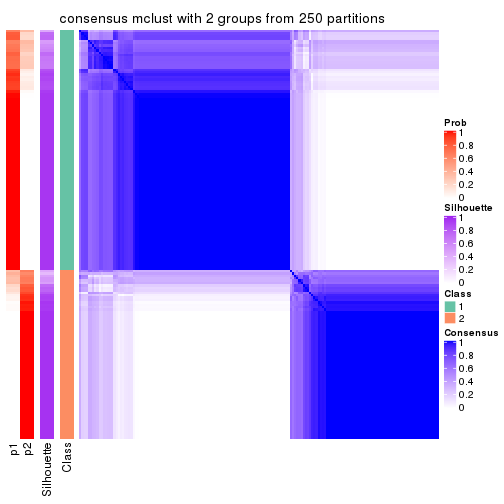</p>

</div>
<div id='tab-MAD-mclust-consensus-heatmap-2'>
<pre><code class="r">consensus_heatmap(res, k = 3)
</code></pre>

<p>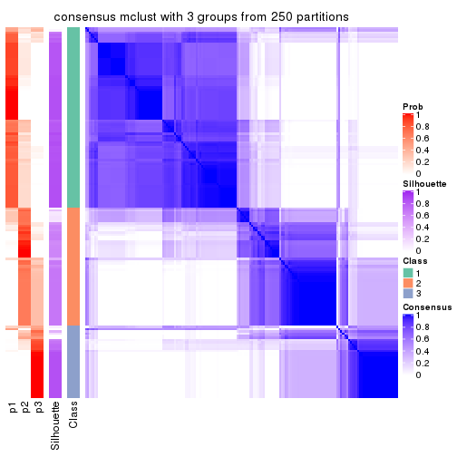</p>

</div>
<div id='tab-MAD-mclust-consensus-heatmap-3'>
<pre><code class="r">consensus_heatmap(res, k = 4)
</code></pre>

<p>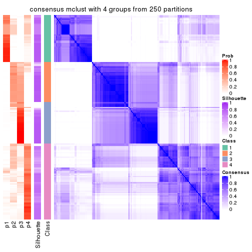</p>

</div>
<div id='tab-MAD-mclust-consensus-heatmap-4'>
<pre><code class="r">consensus_heatmap(res, k = 5)
</code></pre>

<p>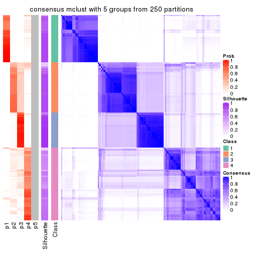</p>

</div>
<div id='tab-MAD-mclust-consensus-heatmap-5'>
<pre><code class="r">consensus_heatmap(res, k = 6)
</code></pre>

<p>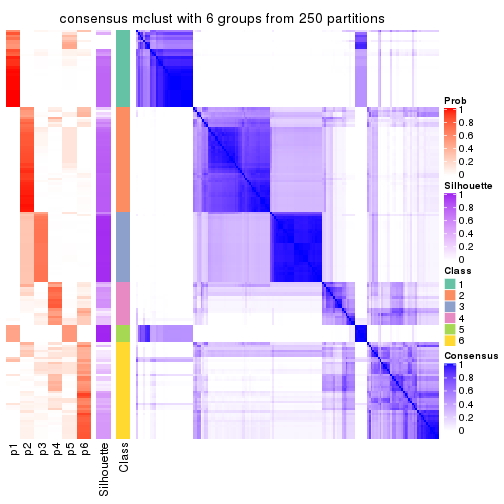</p>

</div>
</div>

Heatmaps for the membership of samples in all partitions to see how consistent they are:


<script>
$( function() {
	$( '#tabs-MAD-mclust-membership-heatmap' ).tabs();
} );
</script>
<div id='tabs-MAD-mclust-membership-heatmap'>
<ul>
<li><a href='#tab-MAD-mclust-membership-heatmap-1'>k = 2</a></li>
<li><a href='#tab-MAD-mclust-membership-heatmap-2'>k = 3</a></li>
<li><a href='#tab-MAD-mclust-membership-heatmap-3'>k = 4</a></li>
<li><a href='#tab-MAD-mclust-membership-heatmap-4'>k = 5</a></li>
<li><a href='#tab-MAD-mclust-membership-heatmap-5'>k = 6</a></li>
</ul>
<div id='tab-MAD-mclust-membership-heatmap-1'>
<pre><code class="r">membership_heatmap(res, k = 2)
</code></pre>

<p>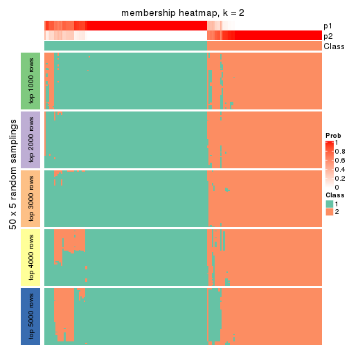</p>

</div>
<div id='tab-MAD-mclust-membership-heatmap-2'>
<pre><code class="r">membership_heatmap(res, k = 3)
</code></pre>

<p>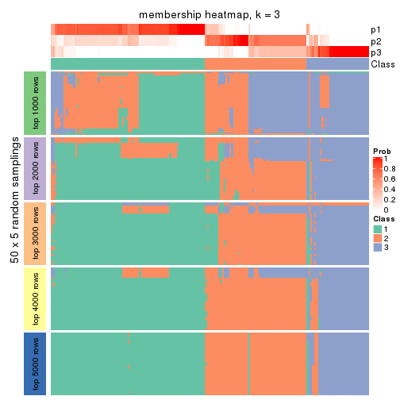</p>

</div>
<div id='tab-MAD-mclust-membership-heatmap-3'>
<pre><code class="r">membership_heatmap(res, k = 4)
</code></pre>

<p>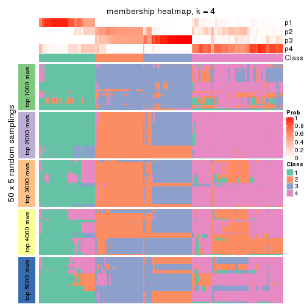</p>

</div>
<div id='tab-MAD-mclust-membership-heatmap-4'>
<pre><code class="r">membership_heatmap(res, k = 5)
</code></pre>

<p>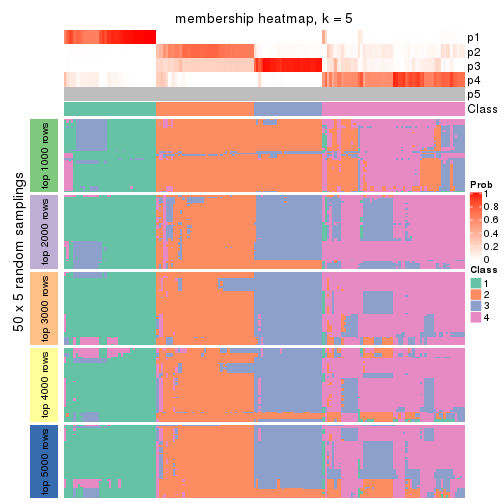</p>

</div>
<div id='tab-MAD-mclust-membership-heatmap-5'>
<pre><code class="r">membership_heatmap(res, k = 6)
</code></pre>

<p>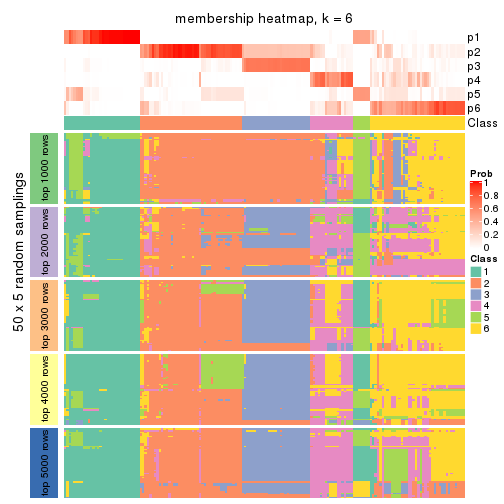</p>

</div>
</div>

As soon as we have had the classes for columns, we can look for signatures
which are significantly different between classes which can be candidate marks
for certain classes. Following are the heatmaps for signatures.


Signature heatmaps where rows are scaled:


<script>
$( function() {
	$( '#tabs-MAD-mclust-get-signatures' ).tabs();
} );
</script>
<div id='tabs-MAD-mclust-get-signatures'>
<ul>
<li><a href='#tab-MAD-mclust-get-signatures-1'>k = 2</a></li>
<li><a href='#tab-MAD-mclust-get-signatures-2'>k = 3</a></li>
<li><a href='#tab-MAD-mclust-get-signatures-3'>k = 4</a></li>
<li><a href='#tab-MAD-mclust-get-signatures-4'>k = 5</a></li>
<li><a href='#tab-MAD-mclust-get-signatures-5'>k = 6</a></li>
</ul>
<div id='tab-MAD-mclust-get-signatures-1'>
<pre><code class="r">get_signatures(res, k = 2)
</code></pre>

<p>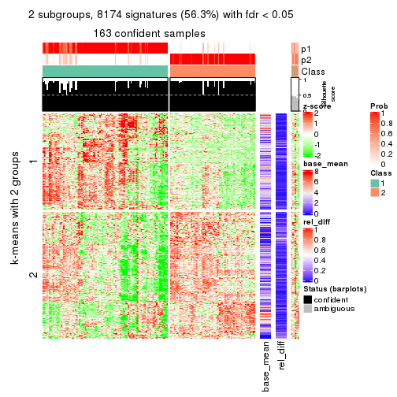</p>

</div>
<div id='tab-MAD-mclust-get-signatures-2'>
<pre><code class="r">get_signatures(res, k = 3)
</code></pre>

<p>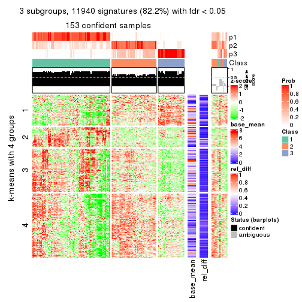</p>

</div>
<div id='tab-MAD-mclust-get-signatures-3'>
<pre><code class="r">get_signatures(res, k = 4)
</code></pre>

<p>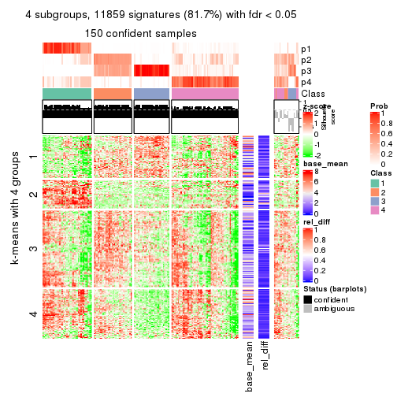</p>

</div>
<div id='tab-MAD-mclust-get-signatures-4'>
<pre><code class="r">get_signatures(res, k = 5)
</code></pre>

<p>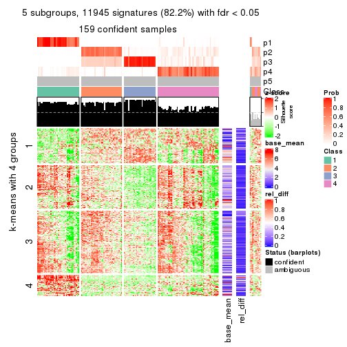</p>

</div>
<div id='tab-MAD-mclust-get-signatures-5'>
<pre><code class="r">get_signatures(res, k = 6)
</code></pre>

<p>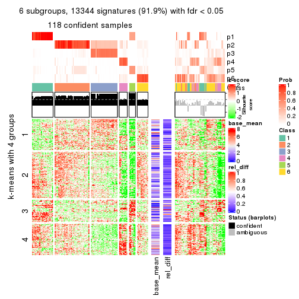</p>

</div>
</div>


Signature heatmaps where rows are not scaled:


<script>
$( function() {
	$( '#tabs-MAD-mclust-get-signatures-no-scale' ).tabs();
} );
</script>
<div id='tabs-MAD-mclust-get-signatures-no-scale'>
<ul>
<li><a href='#tab-MAD-mclust-get-signatures-no-scale-1'>k = 2</a></li>
<li><a href='#tab-MAD-mclust-get-signatures-no-scale-2'>k = 3</a></li>
<li><a href='#tab-MAD-mclust-get-signatures-no-scale-3'>k = 4</a></li>
<li><a href='#tab-MAD-mclust-get-signatures-no-scale-4'>k = 5</a></li>
<li><a href='#tab-MAD-mclust-get-signatures-no-scale-5'>k = 6</a></li>
</ul>
<div id='tab-MAD-mclust-get-signatures-no-scale-1'>
<pre><code class="r">get_signatures(res, k = 2, scale_rows = FALSE)
</code></pre>

<p>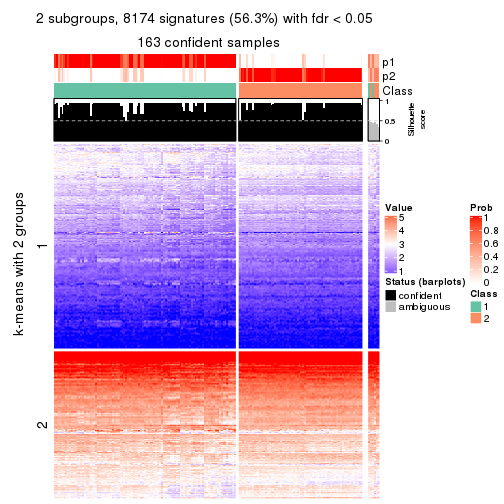</p>

</div>
<div id='tab-MAD-mclust-get-signatures-no-scale-2'>
<pre><code class="r">get_signatures(res, k = 3, scale_rows = FALSE)
</code></pre>

<p>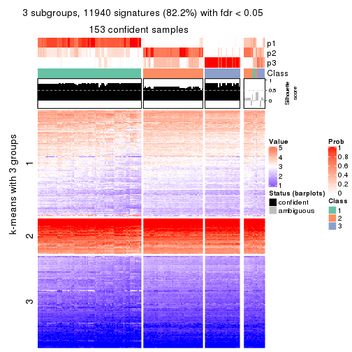</p>

</div>
<div id='tab-MAD-mclust-get-signatures-no-scale-3'>
<pre><code class="r">get_signatures(res, k = 4, scale_rows = FALSE)
</code></pre>

<p>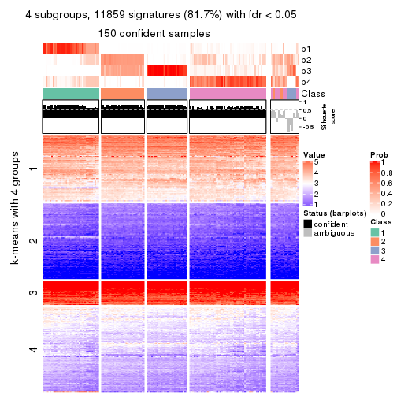</p>

</div>
<div id='tab-MAD-mclust-get-signatures-no-scale-4'>
<pre><code class="r">get_signatures(res, k = 5, scale_rows = FALSE)
</code></pre>

<p>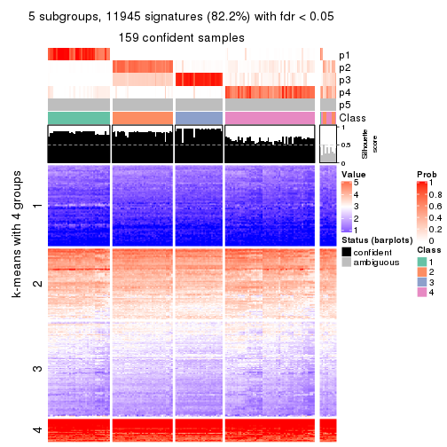</p>

</div>
<div id='tab-MAD-mclust-get-signatures-no-scale-5'>
<pre><code class="r">get_signatures(res, k = 6, scale_rows = FALSE)
</code></pre>

<p>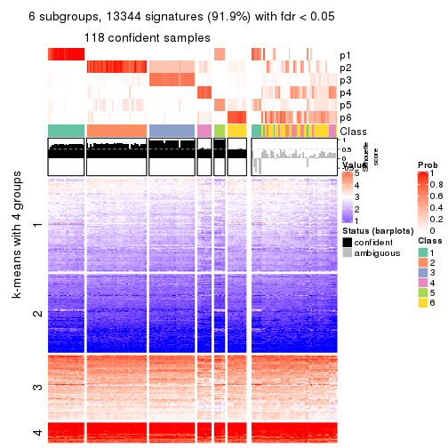</p>

</div>
</div>


Compare the overlap of signatures from different k:

```r
compare_signatures(res)
```

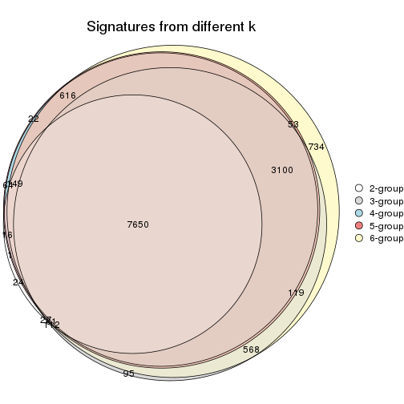

`get_signature()` returns a data frame invisibly. TO get the list of signatures, the function
call should be assigned to a variable explicitly. In following code, if `plot` argument is set
to `FALSE`, no heatmap is plotted while only the differential analysis is performed.

```r
# code only for demonstration
tb = get_signature(res, k = ..., plot = FALSE)
```

An example of the output of `tb` is:

```
#>   which_row         fdr    mean_1    mean_2 scaled_mean_1 scaled_mean_2 km
#> 1        38 0.042760348  8.373488  9.131774    -0.5533452     0.5164555  1
#> 2        40 0.018707592  7.106213  8.469186    -0.6173731     0.5762149  1
#> 3        55 0.019134737 10.221463 11.207825    -0.6159697     0.5749050  1
#> 4        59 0.006059896  5.921854  7.869574    -0.6899429     0.6439467  1
#> 5        60 0.018055526  8.928898 10.211722    -0.6204761     0.5791110  1
#> 6        98 0.009384629 15.714769 14.887706     0.6635654    -0.6193277  2
...
```

The columns in `tb` are:

1. `which_row`: row indices corresponding to the input matrix.
2. `fdr`: FDR for the differential test. 
3. `mean_x`: The mean value in group x.
4. `scaled_mean_x`: The mean value in group x after rows are scaled.
5. `km`: Row groups if k-means clustering is applied to rows.


UMAP plot which shows how samples are separated.


<script>
$( function() {
	$( '#tabs-MAD-mclust-dimension-reduction' ).tabs();
} );
</script>
<div id='tabs-MAD-mclust-dimension-reduction'>
<ul>
<li><a href='#tab-MAD-mclust-dimension-reduction-1'>k = 2</a></li>
<li><a href='#tab-MAD-mclust-dimension-reduction-2'>k = 3</a></li>
<li><a href='#tab-MAD-mclust-dimension-reduction-3'>k = 4</a></li>
<li><a href='#tab-MAD-mclust-dimension-reduction-4'>k = 5</a></li>
<li><a href='#tab-MAD-mclust-dimension-reduction-5'>k = 6</a></li>
</ul>
<div id='tab-MAD-mclust-dimension-reduction-1'>
<pre><code class="r">dimension_reduction(res, k = 2, method = &quot;UMAP&quot;)
</code></pre>

<p>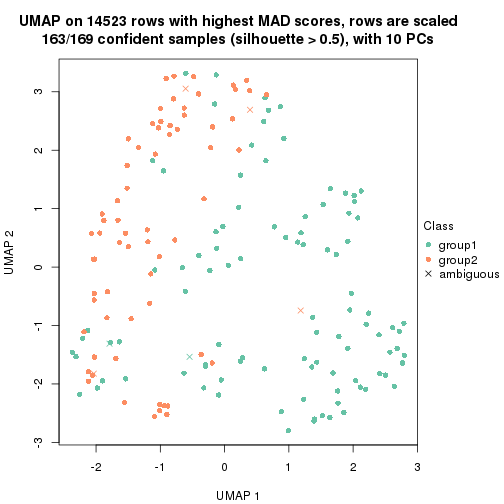</p>

</div>
<div id='tab-MAD-mclust-dimension-reduction-2'>
<pre><code class="r">dimension_reduction(res, k = 3, method = &quot;UMAP&quot;)
</code></pre>

<p>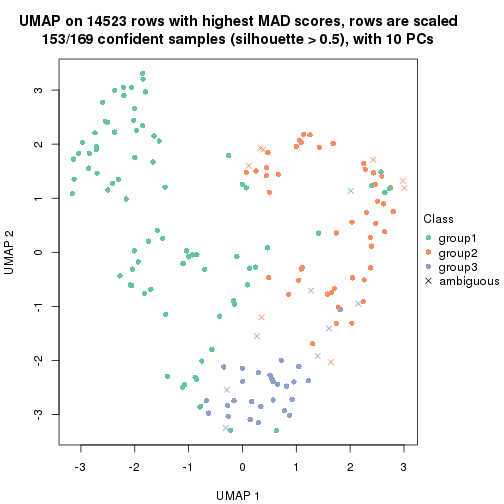</p>

</div>
<div id='tab-MAD-mclust-dimension-reduction-3'>
<pre><code class="r">dimension_reduction(res, k = 4, method = &quot;UMAP&quot;)
</code></pre>

<p>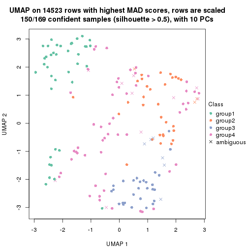</p>

</div>
<div id='tab-MAD-mclust-dimension-reduction-4'>
<pre><code class="r">dimension_reduction(res, k = 5, method = &quot;UMAP&quot;)
</code></pre>

<p>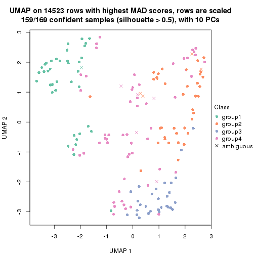</p>

</div>
<div id='tab-MAD-mclust-dimension-reduction-5'>
<pre><code class="r">dimension_reduction(res, k = 6, method = &quot;UMAP&quot;)
</code></pre>

<p>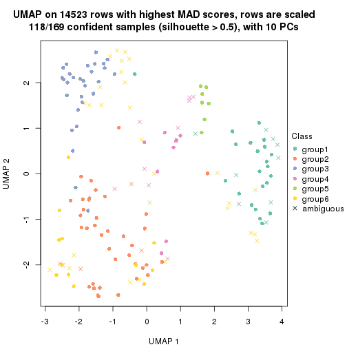</p>

</div>
</div>


Following heatmap shows how subgroups are split when increasing `k`:

```r
collect_classes(res)
```


If matrix rows can be associated to genes, consider to use `GO_Enrichment(res,
...)` to perform function enrichment for the signature genes.


 

---------------------------------------------------


### MAD:NMF


The object with results only for a single top-value method and a single partition method 
can be extracted as:

```r
res = res_list["MAD", "NMF"]
# you can also extract it by
# res = res_list["MAD:NMF"]
```

A summary of `res` and all the functions that can be applied to it:

```r
res
```

```
#> A 'ConsensusPartition' object with k = 2, 3, 4, 5, 6.
#>   On a matrix with 14523 rows and 169 columns.
#>   Top rows (1000, 2000, 3000, 4000, 5000) are extracted by 'MAD' method.
#>   Subgroups are detected by 'NMF' method.
#>   Performed in total 1250 partitions by row resampling.
#>   Best k for subgroups seems to be 2.
#> 
#> Following methods can be applied to this 'ConsensusPartition' object:
#>  [1] "cola_report"             "collect_classes"         "collect_plots"          
#>  [4] "collect_stats"           "colnames"                "compare_signatures"     
#>  [7] "consensus_heatmap"       "dimension_reduction"     "functional_enrichment"  
#> [10] "get_anno_col"            "get_anno"                "get_classes"            
#> [13] "get_consensus"           "get_matrix"              "get_membership"         
#> [16] "get_param"               "get_signatures"          "get_stats"              
#> [19] "is_best_k"               "is_stable_k"             "membership_heatmap"     
#> [22] "ncol"                    "nrow"                    "plot_ecdf"              
#> [25] "rownames"                "select_partition_number" "show"                   
#> [28] "suggest_best_k"          "test_to_known_factors"
```

`collect_plots()` function collects all the plots made from `res` for all `k` (number of partitions)
into one single page to provide an easy and fast comparison between different `k`.

```r
collect_plots(res)
```

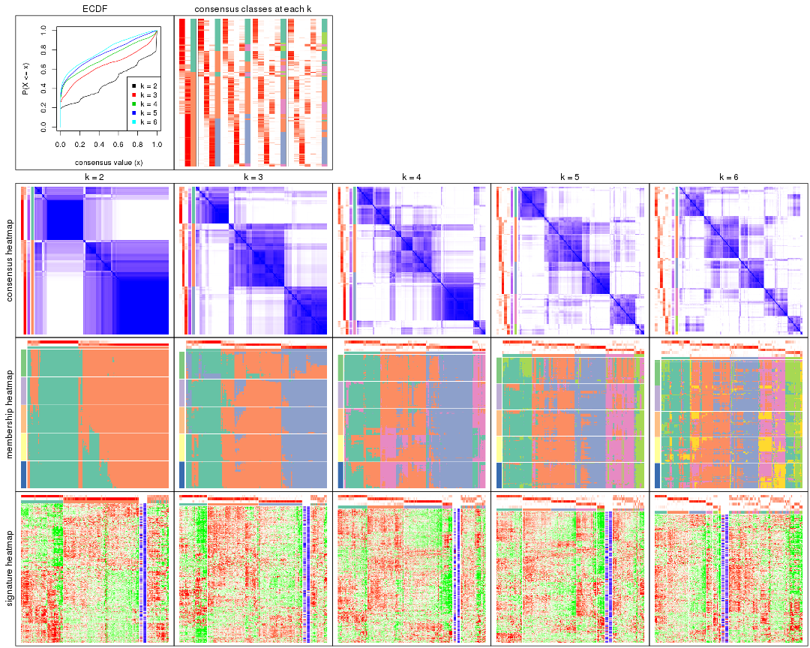

The plots are:

- The first row: a plot of the ECDF (Empirical cumulative distribution
  function) curves of the consensus matrix for each `k` and the heatmap of
  predicted classes for each `k`.
- The second row: heatmaps of the consensus matrix for each `k`.
- The third row: heatmaps of the membership matrix for each `k`.
- The fouth row: heatmaps of the signatures for each `k`.

All the plots in panels can be made by individual functions and they are
plotted later in this section.

`select_partition_number()` produces several plots showing different
statistics for choosing "optimized" `k`. There are following statistics:

- ECDF curves of the consensus matrix for each `k`;
- 1-PAC. [The PAC
  score](https://en.wikipedia.org/wiki/Consensus_clustering#Over-interpretation_potential_of_consensus_clustering)
  measures the proportion of the ambiguous subgrouping.
- Mean silhouette score.
- Concordance. The mean probability of fiting the consensus class ids in all
  partitions.
- Area increased. Denote $A_k$ as the area under the ECDF curve for current
  `k`, the area increased is defined as $A_k - A_{k-1}$.
- Rand index. The percent of pairs of samples that are both in a same cluster
  or both are not in a same cluster in the partition of k and k-1.
- Jaccard index. The ratio of pairs of samples are both in a same cluster in
  the partition of k and k-1 and the pairs of samples are both in a same
  cluster in the partition k or k-1.

The detailed explanations of these statistics can be found in [the cola
vignette](http://bioconductor.org/packages/devel/bioc/vignettes/cola/inst/doc/cola.html#toc_13).

Generally speaking, lower PAC score, higher mean silhouette score or higher
concordance corresponds to better partition. Rand index and Jaccard index
measure how similar the current partition is compared to partition with `k-1`.
If they are too similar, we won't accept `k` is better than `k-1`.

```r
select_partition_number(res)
```

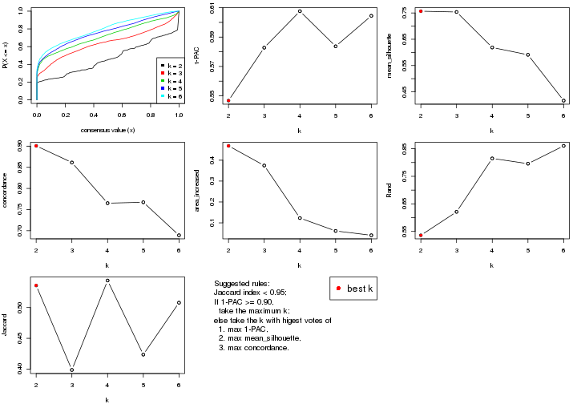

The numeric values for all these statistics can be obtained by `get_stats()`.

```r
get_stats(res)
```

```
#>   k 1-PAC mean_silhouette concordance area_increased  Rand Jaccard
#> 2 2 0.547           0.757       0.901         0.4687 0.536   0.536
#> 3 3 0.583           0.754       0.861         0.3745 0.621   0.399
#> 4 4 0.608           0.619       0.765         0.1229 0.815   0.544
#> 5 5 0.584           0.591       0.767         0.0613 0.796   0.424
#> 6 6 0.604           0.417       0.689         0.0405 0.861   0.508
```

`suggest_best_k()` suggests the best $k$ based on these statistics. The rules are as follows:

- All $k$ with Jaccard index larger than 0.95 are removed because the increase of
  the partition number does not provides enough extra information. If all $k$ are removed,
  the best $k$ is assigned by `NA`.
- For $k$ with 1-PAC larger than 0.9, the maximal $k$ is taken as the "best k". Other $k$ is called "optional k".
- If it does not fit the second rule. The $k$ with the highest vote of highest
  1-PAC, mean silhouette and concordance is taken as the "best k".

```r
suggest_best_k(res)
```

```
#> [1] 2
```


Following shows the table of the partitions (You need to click the **show/hide
code output** link to see it). The membership matrix (columns with name `p*`)
is inferred by
[`clue::cl_consensus()`](https://www.rdocumentation.org/link/cl_consensus?package=clue)
function with the `SE` method. Basically the value in the membership matrix
represents the probability to belong to a certain group. The finall class
label for an item is determined with the group with highest probability it
belongs to.

In `get_classes()` function, the entropy is calculated from the membership
matrix and the silhouette score is calculated from the consensus matrix.


<script>
$( function() {
	$( '#tabs-MAD-NMF-get-classes' ).tabs();
} );
</script>
<div id='tabs-MAD-NMF-get-classes'>
<ul>
<li><a href='#tab-MAD-NMF-get-classes-1'>k = 2</a></li>
<li><a href='#tab-MAD-NMF-get-classes-2'>k = 3</a></li>
<li><a href='#tab-MAD-NMF-get-classes-3'>k = 4</a></li>
<li><a href='#tab-MAD-NMF-get-classes-4'>k = 5</a></li>
<li><a href='#tab-MAD-NMF-get-classes-5'>k = 6</a></li>
</ul>

<div id='tab-MAD-NMF-get-classes-1'>
<p><a id='tab-MAD-NMF-get-classes-1-a' style='color:#0366d6' href='#'>show/hide code output</a></p>
<pre><code class="r">cbind(get_classes(res, k = 2), get_membership(res, k = 2))
</code></pre>

<pre><code>#&gt;            class entropy silhouette    p1    p2
#&gt; SRR2052702     2  0.9710     0.4063 0.400 0.600
#&gt; SRR2052701     1  0.9993    -0.0453 0.516 0.484
#&gt; SRR2052700     1  0.9833     0.1857 0.576 0.424
#&gt; SRR2052699     1  0.7745     0.6346 0.772 0.228
#&gt; SRR2052698     2  0.0000     0.8719 0.000 1.000
#&gt; SRR2052708     1  0.0000     0.8896 1.000 0.000
#&gt; SRR2052749     1  0.0000     0.8896 1.000 0.000
#&gt; SRR2052786     2  0.6973     0.7437 0.188 0.812
#&gt; SRR2052825     1  0.7219     0.6763 0.800 0.200
#&gt; SRR2052824     1  0.9983    -0.0122 0.524 0.476
#&gt; SRR2052823     2  0.9881     0.3089 0.436 0.564
#&gt; SRR2052822     2  0.0000     0.8719 0.000 1.000
#&gt; SRR2052821     2  0.0000     0.8719 0.000 1.000
#&gt; SRR2052820     2  0.6438     0.7132 0.164 0.836
#&gt; SRR2052819     2  0.0000     0.8719 0.000 1.000
#&gt; SRR2052818     2  0.9833     0.3436 0.424 0.576
#&gt; SRR2052817     2  0.0000     0.8719 0.000 1.000
#&gt; SRR2052816     1  0.9323     0.3934 0.652 0.348
#&gt; SRR2052815     2  0.9710     0.4063 0.400 0.600
#&gt; SRR2052814     2  0.5842     0.7862 0.140 0.860
#&gt; SRR2052813     2  0.0000     0.8719 0.000 1.000
#&gt; SRR2052812     2  0.7376     0.7231 0.208 0.792
#&gt; SRR2052811     2  0.9710     0.4063 0.400 0.600
#&gt; SRR2052810     2  0.9710     0.4063 0.400 0.600
#&gt; SRR2052809     2  0.0000     0.8719 0.000 1.000
#&gt; SRR2052808     2  0.4690     0.8163 0.100 0.900
#&gt; SRR2052807     1  0.0000     0.8896 1.000 0.000
#&gt; SRR2052806     1  0.0000     0.8896 1.000 0.000
#&gt; SRR2052805     1  0.0000     0.8896 1.000 0.000
#&gt; SRR2052804     2  0.9427     0.3505 0.360 0.640
#&gt; SRR2052803     1  0.0000     0.8896 1.000 0.000
#&gt; SRR2052802     2  0.9866     0.1540 0.432 0.568
#&gt; SRR2052801     1  0.0000     0.8896 1.000 0.000
#&gt; SRR2052800     1  0.9795     0.2799 0.584 0.416
#&gt; SRR2052799     1  0.0000     0.8896 1.000 0.000
#&gt; SRR2052798     1  0.0000     0.8896 1.000 0.000
#&gt; SRR2052797     2  0.0000     0.8719 0.000 1.000
#&gt; SRR2052796     1  0.0000     0.8896 1.000 0.000
#&gt; SRR2052795     1  0.0000     0.8896 1.000 0.000
#&gt; SRR2052794     1  0.7299     0.6661 0.796 0.204
#&gt; SRR2052793     1  0.0000     0.8896 1.000 0.000
#&gt; SRR2052792     2  0.2603     0.8414 0.044 0.956
#&gt; SRR2052791     2  1.0000    -0.0538 0.496 0.504
#&gt; SRR2052790     2  0.0000     0.8719 0.000 1.000
#&gt; SRR2052789     2  0.0000     0.8719 0.000 1.000
#&gt; SRR2052788     2  0.0000     0.8719 0.000 1.000
#&gt; SRR2052787     2  0.7056     0.7398 0.192 0.808
#&gt; SRR2052785     2  0.0000     0.8719 0.000 1.000
#&gt; SRR2052784     2  0.0000     0.8719 0.000 1.000
#&gt; SRR2052783     2  0.0000     0.8719 0.000 1.000
#&gt; SRR2052782     2  0.0000     0.8719 0.000 1.000
#&gt; SRR2052781     2  0.0000     0.8719 0.000 1.000
#&gt; SRR2052780     2  0.0000     0.8719 0.000 1.000
#&gt; SRR2052777     2  0.0000     0.8719 0.000 1.000
#&gt; SRR2052779     2  0.0000     0.8719 0.000 1.000
#&gt; SRR2052778     2  0.0000     0.8719 0.000 1.000
#&gt; SRR2052776     2  0.0000     0.8719 0.000 1.000
#&gt; SRR2052775     2  0.0000     0.8719 0.000 1.000
#&gt; SRR2052773     2  0.0000     0.8719 0.000 1.000
#&gt; SRR2052772     2  0.0000     0.8719 0.000 1.000
#&gt; SRR2052774     2  0.0000     0.8719 0.000 1.000
#&gt; SRR2052771     1  0.7745     0.6340 0.772 0.228
#&gt; SRR2052769     2  0.0000     0.8719 0.000 1.000
#&gt; SRR2052770     2  0.0000     0.8719 0.000 1.000
#&gt; SRR2052768     2  0.7299     0.7274 0.204 0.796
#&gt; SRR2052767     2  0.9686     0.4155 0.396 0.604
#&gt; SRR2052766     2  0.0000     0.8719 0.000 1.000
#&gt; SRR2052765     2  0.8327     0.6542 0.264 0.736
#&gt; SRR2052763     2  0.0000     0.8719 0.000 1.000
#&gt; SRR2052764     1  0.9710     0.2621 0.600 0.400
#&gt; SRR2052761     2  0.0000     0.8719 0.000 1.000
#&gt; SRR2052760     2  0.7453     0.7186 0.212 0.788
#&gt; SRR2052759     2  0.0000     0.8719 0.000 1.000
#&gt; SRR2052762     2  0.0000     0.8719 0.000 1.000
#&gt; SRR2052758     2  0.0000     0.8719 0.000 1.000
#&gt; SRR2052756     1  0.0000     0.8896 1.000 0.000
#&gt; SRR2052757     2  0.0000     0.8719 0.000 1.000
#&gt; SRR2052755     1  0.0000     0.8896 1.000 0.000
#&gt; SRR2052754     1  0.0000     0.8896 1.000 0.000
#&gt; SRR2052753     1  0.0000     0.8896 1.000 0.000
#&gt; SRR2052752     1  0.0000     0.8896 1.000 0.000
#&gt; SRR2052750     1  0.0000     0.8896 1.000 0.000
#&gt; SRR2052751     2  0.0000     0.8719 0.000 1.000
#&gt; SRR2052748     2  0.0000     0.8719 0.000 1.000
#&gt; SRR2052747     1  0.0000     0.8896 1.000 0.000
#&gt; SRR2052746     2  0.0000     0.8719 0.000 1.000
#&gt; SRR2052745     2  0.0000     0.8719 0.000 1.000
#&gt; SRR2052744     1  0.0000     0.8896 1.000 0.000
#&gt; SRR2052741     2  0.8909     0.5881 0.308 0.692
#&gt; SRR2052743     2  0.7299     0.7275 0.204 0.796
#&gt; SRR2052740     2  0.9775     0.3761 0.412 0.588
#&gt; SRR2052742     2  0.0000     0.8719 0.000 1.000
#&gt; SRR2052739     2  0.8955     0.5817 0.312 0.688
#&gt; SRR2052738     2  0.0000     0.8719 0.000 1.000
#&gt; SRR2052736     1  0.0000     0.8896 1.000 0.000
#&gt; SRR2052735     1  0.0000     0.8896 1.000 0.000
#&gt; SRR2052734     1  0.0000     0.8896 1.000 0.000
#&gt; SRR2052737     2  0.3733     0.8348 0.072 0.928
#&gt; SRR2052733     2  0.0000     0.8719 0.000 1.000
#&gt; SRR2052732     1  0.9635     0.2963 0.612 0.388
#&gt; SRR2052731     2  0.0000     0.8719 0.000 1.000
#&gt; SRR2052729     1  0.0000     0.8896 1.000 0.000
#&gt; SRR2052728     1  0.0000     0.8896 1.000 0.000
#&gt; SRR2052730     2  0.0000     0.8719 0.000 1.000
#&gt; SRR2052727     1  0.0000     0.8896 1.000 0.000
#&gt; SRR2052725     1  0.0000     0.8896 1.000 0.000
#&gt; SRR2052726     1  0.0000     0.8896 1.000 0.000
#&gt; SRR2052724     1  0.0000     0.8896 1.000 0.000
#&gt; SRR2052723     2  0.1843     0.8538 0.028 0.972
#&gt; SRR2052722     2  0.0000     0.8719 0.000 1.000
#&gt; SRR2052721     1  0.0000     0.8896 1.000 0.000
#&gt; SRR2052720     2  0.2603     0.8513 0.044 0.956
#&gt; SRR2052719     2  0.8499     0.6373 0.276 0.724
#&gt; SRR2052718     1  0.0000     0.8896 1.000 0.000
#&gt; SRR2052717     2  0.0000     0.8719 0.000 1.000
#&gt; SRR2052714     1  0.0376     0.8863 0.996 0.004
#&gt; SRR2052716     2  0.0000     0.8719 0.000 1.000
#&gt; SRR2052715     2  0.0000     0.8719 0.000 1.000
#&gt; SRR2052713     1  0.0000     0.8896 1.000 0.000
#&gt; SRR2052712     1  0.0000     0.8896 1.000 0.000
#&gt; SRR2052711     1  0.0000     0.8896 1.000 0.000
#&gt; SRR2052710     2  0.7056     0.7398 0.192 0.808
#&gt; SRR2052707     2  0.0000     0.8719 0.000 1.000
#&gt; SRR2052709     2  0.0000     0.8719 0.000 1.000
#&gt; SRR2052704     2  0.0000     0.8719 0.000 1.000
#&gt; SRR2052705     2  0.6973     0.7437 0.188 0.812
#&gt; SRR2052697     1  0.9795     0.2129 0.584 0.416
#&gt; SRR2052703     2  0.0000     0.8719 0.000 1.000
#&gt; SRR2052696     1  0.0000     0.8896 1.000 0.000
#&gt; SRR2052706     2  0.0376     0.8704 0.004 0.996
#&gt; SRR2052695     2  0.2236     0.8555 0.036 0.964
#&gt; SRR2052694     2  0.0938     0.8671 0.012 0.988
#&gt; SRR2052692     2  0.0000     0.8719 0.000 1.000
#&gt; SRR2052693     2  0.0000     0.8719 0.000 1.000
#&gt; SRR2052691     1  0.0000     0.8896 1.000 0.000
#&gt; SRR2052690     1  0.7674     0.6498 0.776 0.224
#&gt; SRR2052689     2  0.0000     0.8719 0.000 1.000
#&gt; SRR2052687     2  0.3114     0.8446 0.056 0.944
#&gt; SRR2052686     1  0.0000     0.8896 1.000 0.000
#&gt; SRR2052688     2  0.8081     0.6753 0.248 0.752
#&gt; SRR2052684     2  0.7219     0.6619 0.200 0.800
#&gt; SRR2052685     2  0.9775     0.3761 0.412 0.588
#&gt; SRR2052683     1  0.0000     0.8896 1.000 0.000
#&gt; SRR2052681     1  0.9922     0.1017 0.552 0.448
#&gt; SRR2052680     2  0.9866     0.3211 0.432 0.568
#&gt; SRR2052682     1  0.0000     0.8896 1.000 0.000
#&gt; SRR2052679     1  0.0000     0.8896 1.000 0.000
#&gt; SRR2052678     2  0.0000     0.8719 0.000 1.000
#&gt; SRR2052677     2  0.0000     0.8719 0.000 1.000
#&gt; SRR2052675     2  0.9963     0.2195 0.464 0.536
#&gt; SRR2052676     1  0.0000     0.8896 1.000 0.000
#&gt; SRR2052674     2  0.8661     0.6198 0.288 0.712
#&gt; SRR2052672     2  0.0000     0.8719 0.000 1.000
#&gt; SRR2052673     1  0.4022     0.8207 0.920 0.080
#&gt; SRR2052671     2  0.9710     0.4063 0.400 0.600
#&gt; SRR2052670     2  0.0000     0.8719 0.000 1.000
#&gt; SRR2052669     2  0.0000     0.8719 0.000 1.000
#&gt; SRR2052668     2  0.5178     0.8112 0.116 0.884
#&gt; SRR2052667     2  0.9427     0.4926 0.360 0.640
#&gt; SRR2052666     2  0.0000     0.8719 0.000 1.000
#&gt; SRR2052665     2  0.1184     0.8653 0.016 0.984
#&gt; SRR2052664     1  0.0000     0.8896 1.000 0.000
#&gt; SRR2052663     1  0.9710     0.2621 0.600 0.400
#&gt; SRR2052662     2  0.6247     0.7729 0.156 0.844
#&gt; SRR2052661     1  0.0000     0.8896 1.000 0.000
#&gt; SRR2052660     2  0.0000     0.8719 0.000 1.000
#&gt; SRR2052659     2  0.0672     0.8673 0.008 0.992
#&gt; SRR2052658     2  0.8909     0.5884 0.308 0.692
#&gt; SRR2052657     1  0.0000     0.8896 1.000 0.000
</code></pre>

<script>
$('#tab-MAD-NMF-get-classes-1-a').parent().next().next().hide();
$('#tab-MAD-NMF-get-classes-1-a').click(function(){
  $('#tab-MAD-NMF-get-classes-1-a').parent().next().next().toggle();
  return(false);
});
</script>
</div>

<div id='tab-MAD-NMF-get-classes-2'>
<p><a id='tab-MAD-NMF-get-classes-2-a' style='color:#0366d6' href='#'>show/hide code output</a></p>
<pre><code class="r">cbind(get_classes(res, k = 3), get_membership(res, k = 3))
</code></pre>

<pre><code>#&gt;            class entropy silhouette    p1    p2    p3
#&gt; SRR2052702     2  0.0237     0.8303 0.000 0.996 0.004
#&gt; SRR2052701     2  0.0424     0.8318 0.000 0.992 0.008
#&gt; SRR2052700     2  0.3572     0.8231 0.060 0.900 0.040
#&gt; SRR2052699     2  0.4121     0.7027 0.168 0.832 0.000
#&gt; SRR2052698     3  0.1964     0.9137 0.000 0.056 0.944
#&gt; SRR2052708     1  0.0000     0.8370 1.000 0.000 0.000
#&gt; SRR2052749     1  0.0000     0.8370 1.000 0.000 0.000
#&gt; SRR2052786     2  0.2448     0.8334 0.000 0.924 0.076
#&gt; SRR2052825     1  0.5573     0.7405 0.796 0.044 0.160
#&gt; SRR2052824     1  0.6881     0.3936 0.592 0.020 0.388
#&gt; SRR2052823     2  0.0424     0.8245 0.008 0.992 0.000
#&gt; SRR2052822     3  0.5016     0.7465 0.000 0.240 0.760
#&gt; SRR2052821     2  0.5835     0.4955 0.000 0.660 0.340
#&gt; SRR2052820     3  0.3192     0.7998 0.112 0.000 0.888
#&gt; SRR2052819     3  0.2066     0.9146 0.000 0.060 0.940
#&gt; SRR2052818     2  0.1529     0.8379 0.000 0.960 0.040
#&gt; SRR2052817     3  0.1031     0.9053 0.000 0.024 0.976
#&gt; SRR2052816     2  0.3192     0.7528 0.112 0.888 0.000
#&gt; SRR2052815     1  0.9840     0.1796 0.416 0.264 0.320
#&gt; SRR2052814     2  0.2711     0.8291 0.000 0.912 0.088
#&gt; SRR2052813     2  0.3941     0.7761 0.000 0.844 0.156
#&gt; SRR2052812     2  0.1860     0.8377 0.000 0.948 0.052
#&gt; SRR2052811     2  0.0747     0.8341 0.000 0.984 0.016
#&gt; SRR2052810     2  0.2261     0.8358 0.000 0.932 0.068
#&gt; SRR2052809     3  0.5397     0.6637 0.000 0.280 0.720
#&gt; SRR2052808     2  0.5859     0.4982 0.000 0.656 0.344
#&gt; SRR2052807     1  0.3482     0.7791 0.872 0.000 0.128
#&gt; SRR2052806     1  0.0000     0.8370 1.000 0.000 0.000
#&gt; SRR2052805     1  0.0000     0.8370 1.000 0.000 0.000
#&gt; SRR2052804     1  0.5560     0.5966 0.700 0.000 0.300
#&gt; SRR2052803     1  0.0000     0.8370 1.000 0.000 0.000
#&gt; SRR2052802     1  0.5706     0.5660 0.680 0.000 0.320
#&gt; SRR2052801     1  0.0592     0.8344 0.988 0.000 0.012
#&gt; SRR2052800     1  0.5363     0.6302 0.724 0.000 0.276
#&gt; SRR2052799     1  0.1860     0.8213 0.948 0.000 0.052
#&gt; SRR2052798     1  0.0892     0.8303 0.980 0.020 0.000
#&gt; SRR2052797     2  0.5138     0.6575 0.000 0.748 0.252
#&gt; SRR2052796     1  0.0237     0.8363 0.996 0.000 0.004
#&gt; SRR2052795     1  0.0000     0.8370 1.000 0.000 0.000
#&gt; SRR2052794     1  0.3116     0.7945 0.892 0.000 0.108
#&gt; SRR2052793     1  0.0000     0.8370 1.000 0.000 0.000
#&gt; SRR2052792     3  0.2711     0.8064 0.088 0.000 0.912
#&gt; SRR2052791     1  0.5497     0.6129 0.708 0.000 0.292
#&gt; SRR2052790     3  0.4796     0.7751 0.000 0.220 0.780
#&gt; SRR2052789     3  0.2165     0.9145 0.000 0.064 0.936
#&gt; SRR2052788     3  0.1860     0.9137 0.000 0.052 0.948
#&gt; SRR2052787     2  0.2625     0.8306 0.000 0.916 0.084
#&gt; SRR2052785     3  0.2165     0.9145 0.000 0.064 0.936
#&gt; SRR2052784     3  0.6008     0.4828 0.000 0.372 0.628
#&gt; SRR2052783     2  0.6309    -0.0298 0.000 0.504 0.496
#&gt; SRR2052782     2  0.5529     0.5820 0.000 0.704 0.296
#&gt; SRR2052781     3  0.6126     0.3777 0.000 0.400 0.600
#&gt; SRR2052780     3  0.3192     0.8900 0.000 0.112 0.888
#&gt; SRR2052777     2  0.4346     0.7460 0.000 0.816 0.184
#&gt; SRR2052779     2  0.6026     0.3997 0.000 0.624 0.376
#&gt; SRR2052778     3  0.0237     0.8941 0.000 0.004 0.996
#&gt; SRR2052776     3  0.4605     0.7962 0.000 0.204 0.796
#&gt; SRR2052775     3  0.2165     0.9145 0.000 0.064 0.936
#&gt; SRR2052773     3  0.4452     0.8105 0.000 0.192 0.808
#&gt; SRR2052772     3  0.1411     0.9099 0.000 0.036 0.964
#&gt; SRR2052774     3  0.3038     0.8958 0.000 0.104 0.896
#&gt; SRR2052771     1  0.1031     0.8316 0.976 0.000 0.024
#&gt; SRR2052769     3  0.3192     0.8901 0.000 0.112 0.888
#&gt; SRR2052770     3  0.0592     0.8990 0.000 0.012 0.988
#&gt; SRR2052768     2  0.1860     0.8377 0.000 0.948 0.052
#&gt; SRR2052767     2  0.0592     0.8330 0.000 0.988 0.012
#&gt; SRR2052766     3  0.0892     0.8767 0.020 0.000 0.980
#&gt; SRR2052765     2  0.2261     0.8358 0.000 0.932 0.068
#&gt; SRR2052763     3  0.2261     0.9137 0.000 0.068 0.932
#&gt; SRR2052764     2  0.0237     0.8303 0.000 0.996 0.004
#&gt; SRR2052761     3  0.2165     0.9145 0.000 0.064 0.936
#&gt; SRR2052760     2  0.1860     0.8377 0.000 0.948 0.052
#&gt; SRR2052759     3  0.1031     0.9053 0.000 0.024 0.976
#&gt; SRR2052762     2  0.5138     0.6542 0.000 0.748 0.252
#&gt; SRR2052758     3  0.3412     0.8798 0.000 0.124 0.876
#&gt; SRR2052756     1  0.2796     0.7917 0.908 0.092 0.000
#&gt; SRR2052757     3  0.2625     0.9077 0.000 0.084 0.916
#&gt; SRR2052755     2  0.6309    -0.0507 0.500 0.500 0.000
#&gt; SRR2052754     1  0.0000     0.8370 1.000 0.000 0.000
#&gt; SRR2052753     1  0.6291     0.1438 0.532 0.468 0.000
#&gt; SRR2052752     1  0.0000     0.8370 1.000 0.000 0.000
#&gt; SRR2052750     1  0.5882     0.4438 0.652 0.348 0.000
#&gt; SRR2052751     3  0.5560     0.6420 0.000 0.300 0.700
#&gt; SRR2052748     3  0.0237     0.8882 0.004 0.000 0.996
#&gt; SRR2052747     1  0.0237     0.8362 0.996 0.004 0.000
#&gt; SRR2052746     3  0.2066     0.9146 0.000 0.060 0.940
#&gt; SRR2052745     3  0.1411     0.9099 0.000 0.036 0.964
#&gt; SRR2052744     1  0.6307     0.0555 0.512 0.488 0.000
#&gt; SRR2052741     2  0.0237     0.8267 0.004 0.996 0.000
#&gt; SRR2052743     2  0.1163     0.8365 0.000 0.972 0.028
#&gt; SRR2052740     2  0.0000     0.8285 0.000 1.000 0.000
#&gt; SRR2052742     2  0.5926     0.4503 0.000 0.644 0.356
#&gt; SRR2052739     2  0.2066     0.8371 0.000 0.940 0.060
#&gt; SRR2052738     3  0.0000     0.8912 0.000 0.000 1.000
#&gt; SRR2052736     2  0.3686     0.7249 0.140 0.860 0.000
#&gt; SRR2052735     2  0.5216     0.5778 0.260 0.740 0.000
#&gt; SRR2052734     2  0.4062     0.7016 0.164 0.836 0.000
#&gt; SRR2052737     2  0.3551     0.7988 0.000 0.868 0.132
#&gt; SRR2052733     3  0.0424     0.8966 0.000 0.008 0.992
#&gt; SRR2052732     2  0.0237     0.8303 0.000 0.996 0.004
#&gt; SRR2052731     3  0.2066     0.9146 0.000 0.060 0.940
#&gt; SRR2052729     1  0.5016     0.6345 0.760 0.240 0.000
#&gt; SRR2052728     2  0.5621     0.4971 0.308 0.692 0.000
#&gt; SRR2052730     3  0.2625     0.8282 0.084 0.000 0.916
#&gt; SRR2052727     1  0.4235     0.7152 0.824 0.176 0.000
#&gt; SRR2052725     2  0.4346     0.6792 0.184 0.816 0.000
#&gt; SRR2052726     2  0.5810     0.4505 0.336 0.664 0.000
#&gt; SRR2052724     1  0.0237     0.8362 0.996 0.004 0.000
#&gt; SRR2052723     3  0.1753     0.8476 0.048 0.000 0.952
#&gt; SRR2052722     3  0.1163     0.9070 0.000 0.028 0.972
#&gt; SRR2052721     1  0.6180     0.2862 0.584 0.416 0.000
#&gt; SRR2052720     2  0.2625     0.8305 0.000 0.916 0.084
#&gt; SRR2052719     2  0.1529     0.8379 0.000 0.960 0.040
#&gt; SRR2052718     2  0.5560     0.5108 0.300 0.700 0.000
#&gt; SRR2052717     2  0.2711     0.8289 0.000 0.912 0.088
#&gt; SRR2052714     1  0.0000     0.8370 1.000 0.000 0.000
#&gt; SRR2052716     3  0.0237     0.8942 0.000 0.004 0.996
#&gt; SRR2052715     3  0.2066     0.9147 0.000 0.060 0.940
#&gt; SRR2052713     1  0.0237     0.8362 0.996 0.004 0.000
#&gt; SRR2052712     1  0.3752     0.7667 0.856 0.000 0.144
#&gt; SRR2052711     2  0.6308    -0.0829 0.492 0.508 0.000
#&gt; SRR2052710     2  0.5216     0.6740 0.000 0.740 0.260
#&gt; SRR2052707     3  0.1163     0.9070 0.000 0.028 0.972
#&gt; SRR2052709     3  0.2356     0.9124 0.000 0.072 0.928
#&gt; SRR2052704     3  0.0000     0.8912 0.000 0.000 1.000
#&gt; SRR2052705     2  0.1411     0.8376 0.000 0.964 0.036
#&gt; SRR2052697     2  0.0000     0.8285 0.000 1.000 0.000
#&gt; SRR2052703     3  0.2165     0.9145 0.000 0.064 0.936
#&gt; SRR2052696     1  0.0892     0.8303 0.980 0.020 0.000
#&gt; SRR2052706     2  0.4842     0.6981 0.000 0.776 0.224
#&gt; SRR2052695     2  0.2796     0.8270 0.000 0.908 0.092
#&gt; SRR2052694     2  0.2711     0.8288 0.000 0.912 0.088
#&gt; SRR2052692     3  0.2448     0.9109 0.000 0.076 0.924
#&gt; SRR2052693     3  0.2448     0.9110 0.000 0.076 0.924
#&gt; SRR2052691     2  0.4750     0.6401 0.216 0.784 0.000
#&gt; SRR2052690     2  0.4291     0.6870 0.180 0.820 0.000
#&gt; SRR2052689     3  0.0000     0.8912 0.000 0.000 1.000
#&gt; SRR2052687     3  0.4121     0.7943 0.000 0.168 0.832
#&gt; SRR2052686     2  0.5529     0.5155 0.296 0.704 0.000
#&gt; SRR2052688     2  0.2261     0.8358 0.000 0.932 0.068
#&gt; SRR2052684     3  0.2448     0.8171 0.076 0.000 0.924
#&gt; SRR2052685     2  0.0424     0.8318 0.000 0.992 0.008
#&gt; SRR2052683     1  0.0237     0.8362 0.996 0.004 0.000
#&gt; SRR2052681     2  0.2301     0.8381 0.004 0.936 0.060
#&gt; SRR2052680     1  0.9130     0.2965 0.492 0.152 0.356
#&gt; SRR2052682     2  0.4121     0.6974 0.168 0.832 0.000
#&gt; SRR2052679     1  0.5254     0.5909 0.736 0.264 0.000
#&gt; SRR2052678     3  0.2537     0.9093 0.000 0.080 0.920
#&gt; SRR2052677     2  0.5988     0.4251 0.000 0.632 0.368
#&gt; SRR2052675     2  0.0000     0.8285 0.000 1.000 0.000
#&gt; SRR2052676     1  0.5968     0.4049 0.636 0.364 0.000
#&gt; SRR2052674     2  0.2796     0.8273 0.000 0.908 0.092
#&gt; SRR2052672     3  0.2165     0.9145 0.000 0.064 0.936
#&gt; SRR2052673     2  0.1643     0.7997 0.044 0.956 0.000
#&gt; SRR2052671     2  0.0747     0.8341 0.000 0.984 0.016
#&gt; SRR2052670     3  0.2165     0.9145 0.000 0.064 0.936
#&gt; SRR2052669     2  0.2878     0.8249 0.000 0.904 0.096
#&gt; SRR2052668     2  0.0747     0.8197 0.016 0.984 0.000
#&gt; SRR2052667     2  0.2066     0.8371 0.000 0.940 0.060
#&gt; SRR2052666     3  0.3619     0.8689 0.000 0.136 0.864
#&gt; SRR2052665     2  0.2066     0.8375 0.000 0.940 0.060
#&gt; SRR2052664     1  0.0000     0.8370 1.000 0.000 0.000
#&gt; SRR2052663     2  0.0000     0.8285 0.000 1.000 0.000
#&gt; SRR2052662     2  0.2356     0.8346 0.000 0.928 0.072
#&gt; SRR2052661     2  0.4887     0.6234 0.228 0.772 0.000
#&gt; SRR2052660     3  0.1753     0.9129 0.000 0.048 0.952
#&gt; SRR2052659     3  0.1163     0.8681 0.028 0.000 0.972
#&gt; SRR2052658     2  0.1525     0.8372 0.004 0.964 0.032
#&gt; SRR2052657     1  0.0000     0.8370 1.000 0.000 0.000
</code></pre>

<script>
$('#tab-MAD-NMF-get-classes-2-a').parent().next().next().hide();
$('#tab-MAD-NMF-get-classes-2-a').click(function(){
  $('#tab-MAD-NMF-get-classes-2-a').parent().next().next().toggle();
  return(false);
});
</script>
</div>

<div id='tab-MAD-NMF-get-classes-3'>
<p><a id='tab-MAD-NMF-get-classes-3-a' style='color:#0366d6' href='#'>show/hide code output</a></p>
<pre><code class="r">cbind(get_classes(res, k = 4), get_membership(res, k = 4))
</code></pre>

<pre><code>#&gt;            class entropy silhouette    p1    p2    p3    p4
#&gt; SRR2052702     2  0.2647    0.69550 0.000 0.880 0.000 0.120
#&gt; SRR2052701     2  0.1716    0.69388 0.064 0.936 0.000 0.000
#&gt; SRR2052700     2  0.5473    0.52286 0.032 0.644 0.000 0.324
#&gt; SRR2052699     1  0.4647    0.65488 0.704 0.288 0.008 0.000
#&gt; SRR2052698     3  0.6229    0.57964 0.000 0.204 0.664 0.132
#&gt; SRR2052708     1  0.2281    0.66173 0.904 0.000 0.000 0.096
#&gt; SRR2052749     1  0.1302    0.68909 0.956 0.000 0.000 0.044
#&gt; SRR2052786     2  0.1639    0.71631 0.004 0.952 0.036 0.008
#&gt; SRR2052825     4  0.2868    0.62171 0.000 0.136 0.000 0.864
#&gt; SRR2052824     4  0.2704    0.63101 0.000 0.124 0.000 0.876
#&gt; SRR2052823     2  0.2198    0.69203 0.072 0.920 0.000 0.008
#&gt; SRR2052822     3  0.4888    0.26203 0.000 0.412 0.588 0.000
#&gt; SRR2052821     3  0.5938   -0.03642 0.000 0.476 0.488 0.036
#&gt; SRR2052820     3  0.1004    0.84208 0.024 0.000 0.972 0.004
#&gt; SRR2052819     4  0.6751    0.42337 0.000 0.136 0.272 0.592
#&gt; SRR2052818     2  0.4331    0.59145 0.000 0.712 0.000 0.288
#&gt; SRR2052817     3  0.0469    0.85582 0.000 0.012 0.988 0.000
#&gt; SRR2052816     1  0.7735    0.08854 0.444 0.280 0.000 0.276
#&gt; SRR2052815     4  0.3569    0.54611 0.000 0.196 0.000 0.804
#&gt; SRR2052814     2  0.4594    0.60144 0.000 0.712 0.008 0.280
#&gt; SRR2052813     2  0.4222    0.56778 0.000 0.728 0.272 0.000
#&gt; SRR2052812     2  0.1118    0.71671 0.000 0.964 0.036 0.000
#&gt; SRR2052811     2  0.2760    0.69234 0.000 0.872 0.000 0.128
#&gt; SRR2052810     2  0.4781    0.53502 0.000 0.660 0.004 0.336
#&gt; SRR2052809     2  0.5127    0.43180 0.000 0.632 0.356 0.012
#&gt; SRR2052808     2  0.4690    0.60357 0.000 0.712 0.012 0.276
#&gt; SRR2052807     4  0.4343    0.58770 0.264 0.000 0.004 0.732
#&gt; SRR2052806     1  0.2530    0.64992 0.888 0.000 0.000 0.112
#&gt; SRR2052805     1  0.2704    0.63906 0.876 0.000 0.000 0.124
#&gt; SRR2052804     4  0.5109    0.61749 0.212 0.000 0.052 0.736
#&gt; SRR2052803     1  0.2081    0.66952 0.916 0.000 0.000 0.084
#&gt; SRR2052802     4  0.5235    0.60172 0.236 0.000 0.048 0.716
#&gt; SRR2052801     4  0.4992    0.19063 0.476 0.000 0.000 0.524
#&gt; SRR2052800     4  0.4833    0.61353 0.228 0.000 0.032 0.740
#&gt; SRR2052799     4  0.4406    0.55014 0.300 0.000 0.000 0.700
#&gt; SRR2052798     1  0.1022    0.70750 0.968 0.032 0.000 0.000
#&gt; SRR2052797     2  0.5807    0.44511 0.000 0.612 0.344 0.044
#&gt; SRR2052796     1  0.4955   -0.01500 0.556 0.000 0.000 0.444
#&gt; SRR2052795     1  0.1792    0.67821 0.932 0.000 0.000 0.068
#&gt; SRR2052794     4  0.4770    0.56387 0.288 0.000 0.012 0.700
#&gt; SRR2052793     1  0.3356    0.58384 0.824 0.000 0.000 0.176
#&gt; SRR2052792     3  0.4136    0.63222 0.016 0.000 0.788 0.196
#&gt; SRR2052791     3  0.7506   -0.03817 0.308 0.000 0.484 0.208
#&gt; SRR2052790     3  0.1389    0.83819 0.000 0.048 0.952 0.000
#&gt; SRR2052789     3  0.0469    0.85562 0.000 0.012 0.988 0.000
#&gt; SRR2052788     3  0.0188    0.85612 0.000 0.004 0.996 0.000
#&gt; SRR2052787     2  0.2255    0.71328 0.000 0.920 0.012 0.068
#&gt; SRR2052785     3  0.1545    0.84517 0.000 0.040 0.952 0.008
#&gt; SRR2052784     3  0.4222    0.59800 0.000 0.272 0.728 0.000
#&gt; SRR2052783     2  0.4948    0.23817 0.000 0.560 0.440 0.000
#&gt; SRR2052782     3  0.4977    0.14102 0.000 0.460 0.540 0.000
#&gt; SRR2052781     2  0.5105    0.24621 0.000 0.564 0.432 0.004
#&gt; SRR2052780     3  0.0592    0.85479 0.000 0.016 0.984 0.000
#&gt; SRR2052777     2  0.4103    0.59115 0.000 0.744 0.256 0.000
#&gt; SRR2052779     3  0.4697    0.44205 0.000 0.356 0.644 0.000
#&gt; SRR2052778     3  0.0336    0.85297 0.000 0.000 0.992 0.008
#&gt; SRR2052776     3  0.4406    0.53696 0.000 0.300 0.700 0.000
#&gt; SRR2052775     3  0.0707    0.85312 0.000 0.020 0.980 0.000
#&gt; SRR2052773     3  0.4040    0.63215 0.000 0.248 0.752 0.000
#&gt; SRR2052772     3  0.0188    0.85612 0.000 0.004 0.996 0.000
#&gt; SRR2052774     3  0.1211    0.84435 0.000 0.040 0.960 0.000
#&gt; SRR2052771     1  0.3751    0.55219 0.800 0.000 0.004 0.196
#&gt; SRR2052769     3  0.4636    0.69373 0.000 0.140 0.792 0.068
#&gt; SRR2052770     3  0.0336    0.85297 0.000 0.000 0.992 0.008
#&gt; SRR2052768     2  0.1209    0.71544 0.004 0.964 0.032 0.000
#&gt; SRR2052767     2  0.1474    0.71190 0.000 0.948 0.000 0.052
#&gt; SRR2052766     3  0.5039    0.24266 0.004 0.000 0.592 0.404
#&gt; SRR2052765     2  0.4621    0.59725 0.000 0.708 0.008 0.284
#&gt; SRR2052763     3  0.0000    0.85522 0.000 0.000 1.000 0.000
#&gt; SRR2052764     2  0.4277    0.59935 0.000 0.720 0.000 0.280
#&gt; SRR2052761     3  0.0000    0.85522 0.000 0.000 1.000 0.000
#&gt; SRR2052760     2  0.0804    0.71164 0.012 0.980 0.008 0.000
#&gt; SRR2052759     3  0.0188    0.85426 0.000 0.000 0.996 0.004
#&gt; SRR2052762     3  0.4222    0.60760 0.000 0.272 0.728 0.000
#&gt; SRR2052758     3  0.0188    0.85612 0.000 0.004 0.996 0.000
#&gt; SRR2052756     1  0.1767    0.69376 0.944 0.012 0.000 0.044
#&gt; SRR2052757     3  0.3545    0.74532 0.000 0.164 0.828 0.008
#&gt; SRR2052755     1  0.3873    0.69868 0.772 0.228 0.000 0.000
#&gt; SRR2052754     1  0.4477    0.35615 0.688 0.000 0.000 0.312
#&gt; SRR2052753     1  0.3400    0.71449 0.820 0.180 0.000 0.000
#&gt; SRR2052752     1  0.2530    0.65009 0.888 0.000 0.000 0.112
#&gt; SRR2052750     1  0.3486    0.71207 0.812 0.188 0.000 0.000
#&gt; SRR2052751     3  0.4697    0.46184 0.000 0.356 0.644 0.000
#&gt; SRR2052748     3  0.0469    0.85078 0.000 0.000 0.988 0.012
#&gt; SRR2052747     1  0.0657    0.70324 0.984 0.012 0.000 0.004
#&gt; SRR2052746     3  0.0000    0.85522 0.000 0.000 1.000 0.000
#&gt; SRR2052745     3  0.0188    0.85426 0.000 0.000 0.996 0.004
#&gt; SRR2052744     1  0.3837    0.70039 0.776 0.224 0.000 0.000
#&gt; SRR2052741     1  0.5586    0.34816 0.528 0.452 0.020 0.000
#&gt; SRR2052743     2  0.4931    0.63535 0.092 0.776 0.132 0.000
#&gt; SRR2052740     2  0.3768    0.59560 0.184 0.808 0.008 0.000
#&gt; SRR2052742     3  0.5392    0.16592 0.012 0.460 0.528 0.000
#&gt; SRR2052739     2  0.3852    0.66332 0.000 0.800 0.008 0.192
#&gt; SRR2052738     3  0.0188    0.85426 0.000 0.000 0.996 0.004
#&gt; SRR2052736     2  0.3444    0.59834 0.184 0.816 0.000 0.000
#&gt; SRR2052735     1  0.4522    0.63299 0.680 0.320 0.000 0.000
#&gt; SRR2052734     1  0.4981    0.35598 0.536 0.464 0.000 0.000
#&gt; SRR2052737     2  0.3372    0.70710 0.000 0.868 0.036 0.096
#&gt; SRR2052733     3  0.0336    0.85297 0.000 0.000 0.992 0.008
#&gt; SRR2052732     2  0.4304    0.59548 0.000 0.716 0.000 0.284
#&gt; SRR2052731     3  0.0188    0.85612 0.000 0.004 0.996 0.000
#&gt; SRR2052729     1  0.2814    0.71741 0.868 0.132 0.000 0.000
#&gt; SRR2052728     1  0.4072    0.68674 0.748 0.252 0.000 0.000
#&gt; SRR2052730     4  0.4560    0.44683 0.004 0.000 0.296 0.700
#&gt; SRR2052727     1  0.2704    0.71729 0.876 0.124 0.000 0.000
#&gt; SRR2052725     2  0.4304    0.59444 0.000 0.716 0.000 0.284
#&gt; SRR2052726     1  0.4222    0.67520 0.728 0.272 0.000 0.000
#&gt; SRR2052724     1  0.2149    0.66758 0.912 0.000 0.000 0.088
#&gt; SRR2052723     3  0.2021    0.80786 0.012 0.000 0.932 0.056
#&gt; SRR2052722     3  0.0376    0.85575 0.000 0.004 0.992 0.004
#&gt; SRR2052721     1  0.3569    0.70974 0.804 0.196 0.000 0.000
#&gt; SRR2052720     2  0.2140    0.71353 0.008 0.932 0.052 0.008
#&gt; SRR2052719     2  0.2198    0.71121 0.000 0.920 0.008 0.072
#&gt; SRR2052718     1  0.4103    0.68475 0.744 0.256 0.000 0.000
#&gt; SRR2052717     2  0.5406   -0.02992 0.012 0.508 0.480 0.000
#&gt; SRR2052714     1  0.2704    0.63937 0.876 0.000 0.000 0.124
#&gt; SRR2052716     3  0.0592    0.84855 0.000 0.000 0.984 0.016
#&gt; SRR2052715     3  0.0376    0.85557 0.000 0.004 0.992 0.004
#&gt; SRR2052713     1  0.1557    0.68414 0.944 0.000 0.000 0.056
#&gt; SRR2052712     4  0.0779    0.66581 0.016 0.004 0.000 0.980
#&gt; SRR2052711     1  0.7392    0.13935 0.472 0.172 0.000 0.356
#&gt; SRR2052710     2  0.4661    0.52622 0.000 0.652 0.000 0.348
#&gt; SRR2052707     3  0.2413    0.82167 0.000 0.020 0.916 0.064
#&gt; SRR2052709     3  0.0592    0.85461 0.000 0.016 0.984 0.000
#&gt; SRR2052704     3  0.0336    0.85297 0.000 0.000 0.992 0.008
#&gt; SRR2052705     2  0.3734    0.67984 0.044 0.848 0.108 0.000
#&gt; SRR2052697     2  0.3074    0.63394 0.152 0.848 0.000 0.000
#&gt; SRR2052703     3  0.0469    0.85563 0.000 0.012 0.988 0.000
#&gt; SRR2052696     1  0.0657    0.70324 0.984 0.012 0.000 0.004
#&gt; SRR2052706     2  0.5810    0.56820 0.000 0.660 0.064 0.276
#&gt; SRR2052695     2  0.3400    0.71243 0.000 0.872 0.064 0.064
#&gt; SRR2052694     2  0.2473    0.70617 0.012 0.908 0.080 0.000
#&gt; SRR2052692     3  0.0188    0.85612 0.000 0.004 0.996 0.000
#&gt; SRR2052693     3  0.4844    0.53921 0.000 0.300 0.688 0.012
#&gt; SRR2052691     1  0.4250    0.67159 0.724 0.276 0.000 0.000
#&gt; SRR2052690     1  0.4621    0.65818 0.708 0.284 0.008 0.000
#&gt; SRR2052689     4  0.3149    0.65736 0.000 0.088 0.032 0.880
#&gt; SRR2052687     4  0.5793    0.06812 0.000 0.384 0.036 0.580
#&gt; SRR2052686     2  0.6522    0.47872 0.112 0.608 0.000 0.280
#&gt; SRR2052688     2  0.4482    0.61426 0.000 0.728 0.008 0.264
#&gt; SRR2052684     3  0.1284    0.83406 0.012 0.000 0.964 0.024
#&gt; SRR2052685     2  0.3790    0.62489 0.164 0.820 0.016 0.000
#&gt; SRR2052683     1  0.3444    0.57331 0.816 0.000 0.000 0.184
#&gt; SRR2052681     2  0.4955    0.34504 0.000 0.556 0.000 0.444
#&gt; SRR2052680     4  0.2868    0.62092 0.000 0.136 0.000 0.864
#&gt; SRR2052682     2  0.4331    0.41411 0.288 0.712 0.000 0.000
#&gt; SRR2052679     1  0.3172    0.71630 0.840 0.160 0.000 0.000
#&gt; SRR2052678     3  0.0336    0.85599 0.000 0.008 0.992 0.000
#&gt; SRR2052677     2  0.4898    0.27126 0.000 0.584 0.416 0.000
#&gt; SRR2052675     2  0.3810    0.59007 0.188 0.804 0.008 0.000
#&gt; SRR2052676     1  0.3356    0.71504 0.824 0.176 0.000 0.000
#&gt; SRR2052674     2  0.4509    0.59267 0.000 0.708 0.004 0.288
#&gt; SRR2052672     3  0.0188    0.85612 0.000 0.004 0.996 0.000
#&gt; SRR2052673     2  0.2704    0.66070 0.124 0.876 0.000 0.000
#&gt; SRR2052671     2  0.0937    0.71092 0.012 0.976 0.000 0.012
#&gt; SRR2052670     3  0.0336    0.85599 0.000 0.008 0.992 0.000
#&gt; SRR2052669     2  0.3681    0.65422 0.008 0.816 0.176 0.000
#&gt; SRR2052668     1  0.5649    0.56221 0.620 0.344 0.036 0.000
#&gt; SRR2052667     2  0.1211    0.71397 0.000 0.960 0.000 0.040
#&gt; SRR2052666     3  0.0817    0.85082 0.000 0.024 0.976 0.000
#&gt; SRR2052665     2  0.5833    0.08932 0.032 0.528 0.440 0.000
#&gt; SRR2052664     1  0.5000   -0.18470 0.500 0.000 0.000 0.500
#&gt; SRR2052663     2  0.2976    0.69585 0.008 0.872 0.000 0.120
#&gt; SRR2052662     2  0.3279    0.69122 0.032 0.872 0.096 0.000
#&gt; SRR2052661     1  0.4222    0.67489 0.728 0.272 0.000 0.000
#&gt; SRR2052660     3  0.0188    0.85612 0.000 0.004 0.996 0.000
#&gt; SRR2052659     3  0.0188    0.85383 0.004 0.000 0.996 0.000
#&gt; SRR2052658     2  0.7261    0.00596 0.368 0.480 0.152 0.000
#&gt; SRR2052657     1  0.1211    0.69080 0.960 0.000 0.000 0.040
</code></pre>

<script>
$('#tab-MAD-NMF-get-classes-3-a').parent().next().next().hide();
$('#tab-MAD-NMF-get-classes-3-a').click(function(){
  $('#tab-MAD-NMF-get-classes-3-a').parent().next().next().toggle();
  return(false);
});
</script>
</div>

<div id='tab-MAD-NMF-get-classes-4'>
<p><a id='tab-MAD-NMF-get-classes-4-a' style='color:#0366d6' href='#'>show/hide code output</a></p>
<pre><code class="r">cbind(get_classes(res, k = 5), get_membership(res, k = 5))
</code></pre>

<pre><code>#&gt;            class entropy silhouette    p1    p2    p3    p4    p5
#&gt; SRR2052702     4  0.3796    0.69452 0.000 0.300 0.000 0.700 0.000
#&gt; SRR2052701     2  0.2863    0.62777 0.060 0.876 0.000 0.064 0.000
#&gt; SRR2052700     4  0.3858    0.56464 0.024 0.016 0.000 0.804 0.156
#&gt; SRR2052699     1  0.2677    0.77191 0.872 0.112 0.000 0.016 0.000
#&gt; SRR2052698     2  0.6100    0.60230 0.000 0.660 0.144 0.148 0.048
#&gt; SRR2052708     1  0.2690    0.76881 0.844 0.000 0.000 0.000 0.156
#&gt; SRR2052749     1  0.2773    0.76350 0.836 0.000 0.000 0.000 0.164
#&gt; SRR2052786     2  0.1628    0.65815 0.000 0.936 0.008 0.056 0.000
#&gt; SRR2052825     4  0.2426    0.59936 0.000 0.036 0.000 0.900 0.064
#&gt; SRR2052824     4  0.4955    0.11946 0.000 0.036 0.004 0.632 0.328
#&gt; SRR2052823     4  0.5654    0.60870 0.224 0.148 0.000 0.628 0.000
#&gt; SRR2052822     2  0.2891    0.67337 0.000 0.824 0.176 0.000 0.000
#&gt; SRR2052821     4  0.6434    0.51693 0.012 0.172 0.264 0.552 0.000
#&gt; SRR2052820     3  0.2819    0.70716 0.032 0.008 0.884 0.000 0.076
#&gt; SRR2052819     4  0.7183    0.26786 0.000 0.136 0.060 0.484 0.320
#&gt; SRR2052818     4  0.2930    0.71039 0.000 0.164 0.000 0.832 0.004
#&gt; SRR2052817     3  0.3715    0.62176 0.000 0.260 0.736 0.004 0.000
#&gt; SRR2052816     4  0.3789    0.56787 0.224 0.016 0.000 0.760 0.000
#&gt; SRR2052815     4  0.1997    0.61736 0.000 0.036 0.000 0.924 0.040
#&gt; SRR2052814     4  0.4147    0.70414 0.004 0.172 0.000 0.776 0.048
#&gt; SRR2052813     2  0.3791    0.66987 0.000 0.812 0.112 0.076 0.000
#&gt; SRR2052812     2  0.4855   -0.29822 0.016 0.544 0.004 0.436 0.000
#&gt; SRR2052811     4  0.3910    0.70868 0.008 0.272 0.000 0.720 0.000
#&gt; SRR2052810     4  0.2929    0.70837 0.000 0.152 0.000 0.840 0.008
#&gt; SRR2052809     2  0.2907    0.70180 0.000 0.864 0.116 0.012 0.008
#&gt; SRR2052808     4  0.2708    0.58139 0.000 0.016 0.072 0.892 0.020
#&gt; SRR2052807     5  0.3005    0.69948 0.008 0.012 0.000 0.124 0.856
#&gt; SRR2052806     1  0.3074    0.74593 0.804 0.000 0.000 0.000 0.196
#&gt; SRR2052805     1  0.3074    0.74580 0.804 0.000 0.000 0.000 0.196
#&gt; SRR2052804     5  0.7741    0.42168 0.080 0.000 0.356 0.180 0.384
#&gt; SRR2052803     1  0.2732    0.76659 0.840 0.000 0.000 0.000 0.160
#&gt; SRR2052802     5  0.2853    0.69895 0.004 0.004 0.004 0.128 0.860
#&gt; SRR2052801     5  0.2561    0.67469 0.144 0.000 0.000 0.000 0.856
#&gt; SRR2052800     5  0.2753    0.69496 0.000 0.000 0.008 0.136 0.856
#&gt; SRR2052799     5  0.2054    0.71308 0.072 0.008 0.000 0.004 0.916
#&gt; SRR2052798     1  0.0865    0.80551 0.972 0.004 0.000 0.000 0.024
#&gt; SRR2052797     4  0.6299    0.34216 0.000 0.380 0.156 0.464 0.000
#&gt; SRR2052796     5  0.2891    0.64340 0.176 0.000 0.000 0.000 0.824
#&gt; SRR2052795     1  0.2773    0.76836 0.836 0.000 0.000 0.000 0.164
#&gt; SRR2052794     5  0.2127    0.69934 0.108 0.000 0.000 0.000 0.892
#&gt; SRR2052793     1  0.4314    0.63443 0.700 0.004 0.000 0.016 0.280
#&gt; SRR2052792     3  0.2844    0.66616 0.028 0.000 0.876 0.004 0.092
#&gt; SRR2052791     5  0.6849    0.29407 0.248 0.000 0.352 0.004 0.396
#&gt; SRR2052790     2  0.4304    0.04712 0.000 0.516 0.484 0.000 0.000
#&gt; SRR2052789     3  0.4310    0.33166 0.000 0.392 0.604 0.000 0.004
#&gt; SRR2052788     3  0.3766    0.59532 0.000 0.268 0.728 0.000 0.004
#&gt; SRR2052787     2  0.2074    0.63228 0.000 0.896 0.000 0.104 0.000
#&gt; SRR2052785     3  0.4630    0.30571 0.000 0.416 0.572 0.004 0.008
#&gt; SRR2052784     2  0.3730    0.54128 0.000 0.712 0.288 0.000 0.000
#&gt; SRR2052783     2  0.3838    0.57477 0.000 0.716 0.280 0.000 0.004
#&gt; SRR2052782     2  0.2605    0.68924 0.000 0.852 0.148 0.000 0.000
#&gt; SRR2052781     2  0.2548    0.70013 0.000 0.876 0.116 0.004 0.004
#&gt; SRR2052780     2  0.4307    0.02944 0.000 0.500 0.500 0.000 0.000
#&gt; SRR2052777     2  0.2020    0.70600 0.000 0.900 0.100 0.000 0.000
#&gt; SRR2052779     2  0.2648    0.68732 0.000 0.848 0.152 0.000 0.000
#&gt; SRR2052778     3  0.2278    0.78985 0.000 0.044 0.916 0.032 0.008
#&gt; SRR2052776     2  0.3906    0.55162 0.000 0.704 0.292 0.004 0.000
#&gt; SRR2052775     3  0.2488    0.75828 0.000 0.124 0.872 0.000 0.004
#&gt; SRR2052773     2  0.3333    0.65100 0.000 0.788 0.208 0.000 0.004
#&gt; SRR2052772     3  0.3550    0.64174 0.000 0.236 0.760 0.000 0.004
#&gt; SRR2052774     2  0.4288    0.38753 0.000 0.612 0.384 0.000 0.004
#&gt; SRR2052771     1  0.5410    0.56478 0.676 0.000 0.140 0.004 0.180
#&gt; SRR2052769     3  0.4921    0.42235 0.000 0.036 0.640 0.320 0.004
#&gt; SRR2052770     3  0.0955    0.79566 0.000 0.028 0.968 0.000 0.004
#&gt; SRR2052768     2  0.2230    0.60214 0.000 0.884 0.000 0.116 0.000
#&gt; SRR2052767     4  0.4114    0.61512 0.000 0.376 0.000 0.624 0.000
#&gt; SRR2052766     3  0.4114    0.50432 0.000 0.000 0.712 0.016 0.272
#&gt; SRR2052765     4  0.3231    0.71520 0.000 0.196 0.000 0.800 0.004
#&gt; SRR2052763     3  0.0404    0.79050 0.000 0.012 0.988 0.000 0.000
#&gt; SRR2052764     4  0.3305    0.71739 0.000 0.224 0.000 0.776 0.000
#&gt; SRR2052761     3  0.0609    0.79396 0.000 0.020 0.980 0.000 0.000
#&gt; SRR2052760     2  0.2377    0.60464 0.000 0.872 0.000 0.128 0.000
#&gt; SRR2052759     3  0.0510    0.79258 0.000 0.016 0.984 0.000 0.000
#&gt; SRR2052762     2  0.4015    0.42640 0.000 0.652 0.348 0.000 0.000
#&gt; SRR2052758     3  0.1341    0.79594 0.000 0.056 0.944 0.000 0.000
#&gt; SRR2052756     1  0.3815    0.73738 0.764 0.012 0.000 0.004 0.220
#&gt; SRR2052757     2  0.4499    0.52297 0.000 0.684 0.292 0.016 0.008
#&gt; SRR2052755     1  0.2519    0.77623 0.884 0.100 0.000 0.016 0.000
#&gt; SRR2052754     1  0.4307    0.13619 0.504 0.000 0.000 0.000 0.496
#&gt; SRR2052753     1  0.2289    0.78928 0.904 0.080 0.000 0.012 0.004
#&gt; SRR2052752     1  0.3003    0.75273 0.812 0.000 0.000 0.000 0.188
#&gt; SRR2052750     1  0.1768    0.79605 0.924 0.072 0.000 0.004 0.000
#&gt; SRR2052751     2  0.5556    0.48102 0.076 0.616 0.300 0.008 0.000
#&gt; SRR2052748     3  0.0451    0.77838 0.000 0.000 0.988 0.004 0.008
#&gt; SRR2052747     1  0.2260    0.80633 0.908 0.028 0.000 0.000 0.064
#&gt; SRR2052746     3  0.0609    0.79396 0.000 0.020 0.980 0.000 0.000
#&gt; SRR2052745     3  0.0162    0.78117 0.000 0.000 0.996 0.004 0.000
#&gt; SRR2052744     1  0.2972    0.80387 0.872 0.084 0.000 0.004 0.040
#&gt; SRR2052741     2  0.3421    0.58986 0.204 0.788 0.000 0.008 0.000
#&gt; SRR2052743     2  0.2251    0.69492 0.024 0.916 0.052 0.008 0.000
#&gt; SRR2052740     2  0.3327    0.61137 0.144 0.828 0.000 0.028 0.000
#&gt; SRR2052742     2  0.4275    0.64752 0.120 0.792 0.076 0.012 0.000
#&gt; SRR2052739     4  0.4420    0.49364 0.000 0.448 0.000 0.548 0.004
#&gt; SRR2052738     3  0.0727    0.78985 0.000 0.012 0.980 0.004 0.004
#&gt; SRR2052736     2  0.3929    0.55738 0.208 0.764 0.000 0.028 0.000
#&gt; SRR2052735     2  0.4650    0.02904 0.468 0.520 0.000 0.012 0.000
#&gt; SRR2052734     2  0.4743    0.00469 0.472 0.512 0.000 0.016 0.000
#&gt; SRR2052737     2  0.2989    0.68280 0.000 0.868 0.072 0.060 0.000
#&gt; SRR2052733     3  0.0566    0.79068 0.000 0.012 0.984 0.000 0.004
#&gt; SRR2052732     4  0.3445    0.71205 0.036 0.140 0.000 0.824 0.000
#&gt; SRR2052731     3  0.1410    0.79543 0.000 0.060 0.940 0.000 0.000
#&gt; SRR2052729     1  0.1731    0.79926 0.932 0.060 0.000 0.004 0.004
#&gt; SRR2052728     1  0.2361    0.78218 0.892 0.096 0.000 0.012 0.000
#&gt; SRR2052730     3  0.5370    0.32983 0.004 0.008 0.664 0.256 0.068
#&gt; SRR2052727     1  0.2727    0.79097 0.868 0.016 0.000 0.000 0.116
#&gt; SRR2052725     4  0.5769    0.61737 0.124 0.220 0.000 0.644 0.012
#&gt; SRR2052726     1  0.4551    0.41589 0.616 0.368 0.000 0.016 0.000
#&gt; SRR2052724     1  0.2852    0.76322 0.828 0.000 0.000 0.000 0.172
#&gt; SRR2052723     3  0.3340    0.62676 0.016 0.004 0.824 0.000 0.156
#&gt; SRR2052722     3  0.4449   -0.02533 0.000 0.484 0.512 0.000 0.004
#&gt; SRR2052721     1  0.1768    0.79547 0.924 0.072 0.000 0.004 0.000
#&gt; SRR2052720     2  0.1740    0.66204 0.000 0.932 0.012 0.056 0.000
#&gt; SRR2052719     4  0.4192    0.57980 0.000 0.404 0.000 0.596 0.000
#&gt; SRR2052718     1  0.2616    0.77419 0.880 0.100 0.000 0.020 0.000
#&gt; SRR2052717     2  0.2773    0.68185 0.000 0.836 0.164 0.000 0.000
#&gt; SRR2052714     1  0.2179    0.79018 0.888 0.000 0.000 0.000 0.112
#&gt; SRR2052716     3  0.0324    0.77987 0.000 0.000 0.992 0.004 0.004
#&gt; SRR2052715     3  0.1768    0.79046 0.000 0.072 0.924 0.000 0.004
#&gt; SRR2052713     1  0.3304    0.77493 0.816 0.016 0.000 0.000 0.168
#&gt; SRR2052712     5  0.4505    0.51470 0.000 0.012 0.000 0.384 0.604
#&gt; SRR2052711     4  0.7396   -0.13206 0.228 0.036 0.000 0.396 0.340
#&gt; SRR2052710     2  0.6394    0.14404 0.000 0.476 0.000 0.180 0.344
#&gt; SRR2052707     2  0.5894    0.12231 0.000 0.488 0.432 0.068 0.012
#&gt; SRR2052709     2  0.4443    0.12013 0.000 0.524 0.472 0.000 0.004
#&gt; SRR2052704     3  0.1356    0.79502 0.000 0.028 0.956 0.012 0.004
#&gt; SRR2052705     2  0.2605    0.67838 0.004 0.896 0.044 0.056 0.000
#&gt; SRR2052697     4  0.6581    0.42045 0.240 0.296 0.000 0.464 0.000
#&gt; SRR2052703     3  0.3010    0.71450 0.000 0.172 0.824 0.000 0.004
#&gt; SRR2052696     1  0.1892    0.79917 0.916 0.004 0.000 0.000 0.080
#&gt; SRR2052706     4  0.3318    0.71328 0.000 0.180 0.012 0.808 0.000
#&gt; SRR2052695     2  0.4610   -0.20939 0.000 0.556 0.012 0.432 0.000
#&gt; SRR2052694     2  0.2388    0.69230 0.000 0.900 0.072 0.028 0.000
#&gt; SRR2052692     3  0.0703    0.79504 0.000 0.024 0.976 0.000 0.000
#&gt; SRR2052693     2  0.5602    0.46067 0.000 0.608 0.316 0.060 0.016
#&gt; SRR2052691     1  0.2727    0.76637 0.868 0.116 0.000 0.016 0.000
#&gt; SRR2052690     1  0.5145    0.49992 0.612 0.332 0.000 0.000 0.056
#&gt; SRR2052689     4  0.4993    0.30075 0.000 0.012 0.180 0.724 0.084
#&gt; SRR2052687     4  0.3732    0.70201 0.000 0.144 0.016 0.816 0.024
#&gt; SRR2052686     4  0.3801    0.62776 0.140 0.040 0.000 0.812 0.008
#&gt; SRR2052688     4  0.4166    0.65043 0.000 0.348 0.000 0.648 0.004
#&gt; SRR2052684     3  0.1630    0.73956 0.016 0.000 0.944 0.004 0.036
#&gt; SRR2052685     4  0.6864    0.45918 0.196 0.372 0.012 0.420 0.000
#&gt; SRR2052683     1  0.3086    0.74521 0.816 0.000 0.000 0.004 0.180
#&gt; SRR2052681     5  0.4637    0.38262 0.000 0.012 0.000 0.452 0.536
#&gt; SRR2052680     4  0.5546    0.21898 0.000 0.084 0.000 0.576 0.340
#&gt; SRR2052682     2  0.4761    0.19054 0.356 0.616 0.000 0.028 0.000
#&gt; SRR2052679     1  0.1872    0.80540 0.928 0.052 0.000 0.000 0.020
#&gt; SRR2052678     3  0.3816    0.53743 0.000 0.304 0.696 0.000 0.000
#&gt; SRR2052677     2  0.2674    0.69279 0.000 0.856 0.140 0.004 0.000
#&gt; SRR2052675     2  0.3977    0.56323 0.204 0.764 0.000 0.032 0.000
#&gt; SRR2052676     1  0.2352    0.78616 0.896 0.092 0.000 0.008 0.004
#&gt; SRR2052674     4  0.2074    0.68970 0.000 0.104 0.000 0.896 0.000
#&gt; SRR2052672     3  0.3990    0.52896 0.000 0.308 0.688 0.000 0.004
#&gt; SRR2052673     2  0.6131    0.06319 0.168 0.548 0.000 0.284 0.000
#&gt; SRR2052671     4  0.4276    0.61523 0.004 0.380 0.000 0.616 0.000
#&gt; SRR2052670     3  0.4242    0.20648 0.000 0.428 0.572 0.000 0.000
#&gt; SRR2052669     2  0.2017    0.70161 0.000 0.912 0.080 0.008 0.000
#&gt; SRR2052668     2  0.4323    0.42129 0.332 0.656 0.000 0.012 0.000
#&gt; SRR2052667     2  0.2612    0.64102 0.008 0.868 0.000 0.124 0.000
#&gt; SRR2052666     3  0.4235    0.24290 0.000 0.424 0.576 0.000 0.000
#&gt; SRR2052665     2  0.5101    0.54802 0.032 0.672 0.272 0.024 0.000
#&gt; SRR2052664     5  0.5303    0.55859 0.232 0.000 0.000 0.108 0.660
#&gt; SRR2052663     4  0.4054    0.71512 0.020 0.248 0.000 0.732 0.000
#&gt; SRR2052662     2  0.1399    0.68225 0.000 0.952 0.028 0.020 0.000
#&gt; SRR2052661     1  0.2519    0.77623 0.884 0.100 0.000 0.016 0.000
#&gt; SRR2052660     3  0.1341    0.79594 0.000 0.056 0.944 0.000 0.000
#&gt; SRR2052659     3  0.0451    0.78839 0.004 0.008 0.988 0.000 0.000
#&gt; SRR2052658     2  0.3886    0.68447 0.084 0.828 0.068 0.000 0.020
#&gt; SRR2052657     1  0.2562    0.79970 0.900 0.060 0.000 0.008 0.032
</code></pre>

<script>
$('#tab-MAD-NMF-get-classes-4-a').parent().next().next().hide();
$('#tab-MAD-NMF-get-classes-4-a').click(function(){
  $('#tab-MAD-NMF-get-classes-4-a').parent().next().next().toggle();
  return(false);
});
</script>
</div>

<div id='tab-MAD-NMF-get-classes-5'>
<p><a id='tab-MAD-NMF-get-classes-5-a' style='color:#0366d6' href='#'>show/hide code output</a></p>
<pre><code class="r">cbind(get_classes(res, k = 6), get_membership(res, k = 6))
</code></pre>

<pre><code>#&gt;            class entropy silhouette    p1    p2    p3    p4    p5    p6
#&gt; SRR2052702     4  0.3703   0.484679 0.004 0.304 0.000 0.688 0.000 0.004
#&gt; SRR2052701     2  0.4994   0.465278 0.180 0.660 0.000 0.156 0.000 0.004
#&gt; SRR2052700     4  0.4510   0.476665 0.000 0.016 0.000 0.728 0.084 0.172
#&gt; SRR2052699     1  0.2200   0.535958 0.900 0.004 0.004 0.000 0.080 0.012
#&gt; SRR2052698     2  0.6417   0.510545 0.012 0.572 0.088 0.064 0.008 0.256
#&gt; SRR2052708     5  0.4282   0.417076 0.420 0.000 0.000 0.000 0.560 0.020
#&gt; SRR2052749     5  0.4167   0.533475 0.344 0.000 0.000 0.000 0.632 0.024
#&gt; SRR2052786     2  0.1820   0.651639 0.012 0.924 0.000 0.056 0.000 0.008
#&gt; SRR2052825     4  0.3221   0.463729 0.000 0.000 0.000 0.736 0.000 0.264
#&gt; SRR2052824     4  0.3555   0.447406 0.000 0.000 0.008 0.712 0.000 0.280
#&gt; SRR2052823     4  0.7058   0.099199 0.404 0.072 0.012 0.416 0.044 0.052
#&gt; SRR2052822     2  0.2695   0.628090 0.000 0.844 0.144 0.004 0.000 0.008
#&gt; SRR2052821     4  0.6997   0.264271 0.024 0.120 0.304 0.492 0.012 0.048
#&gt; SRR2052820     3  0.3979   0.446677 0.004 0.000 0.720 0.000 0.244 0.032
#&gt; SRR2052819     4  0.4577   0.435748 0.000 0.008 0.028 0.680 0.016 0.268
#&gt; SRR2052818     4  0.1461   0.545041 0.000 0.044 0.000 0.940 0.000 0.016
#&gt; SRR2052817     3  0.4264   0.032549 0.000 0.492 0.492 0.000 0.000 0.016
#&gt; SRR2052816     4  0.6381   0.384344 0.080 0.004 0.156 0.636 0.048 0.076
#&gt; SRR2052815     4  0.3314   0.473481 0.000 0.004 0.000 0.740 0.000 0.256
#&gt; SRR2052814     4  0.4663   0.463626 0.012 0.064 0.000 0.680 0.000 0.244
#&gt; SRR2052813     2  0.3986   0.435682 0.012 0.720 0.008 0.252 0.000 0.008
#&gt; SRR2052812     2  0.6350   0.001813 0.152 0.476 0.012 0.340 0.000 0.020
#&gt; SRR2052811     4  0.4201   0.502384 0.036 0.236 0.000 0.716 0.000 0.012
#&gt; SRR2052810     4  0.2482   0.522493 0.000 0.004 0.000 0.848 0.000 0.148
#&gt; SRR2052809     2  0.0909   0.681687 0.000 0.968 0.012 0.000 0.000 0.020
#&gt; SRR2052808     4  0.6323   0.361580 0.072 0.004 0.168 0.580 0.000 0.176
#&gt; SRR2052807     6  0.4072   0.754197 0.000 0.000 0.000 0.008 0.448 0.544
#&gt; SRR2052806     5  0.3342   0.616207 0.228 0.000 0.000 0.000 0.760 0.012
#&gt; SRR2052805     5  0.3337   0.613502 0.260 0.000 0.000 0.000 0.736 0.004
#&gt; SRR2052804     3  0.6985  -0.228895 0.000 0.000 0.372 0.288 0.060 0.280
#&gt; SRR2052803     5  0.3953   0.557332 0.328 0.000 0.000 0.000 0.656 0.016
#&gt; SRR2052802     6  0.4403   0.794480 0.000 0.000 0.012 0.012 0.396 0.580
#&gt; SRR2052801     5  0.2915   0.301693 0.024 0.000 0.000 0.008 0.848 0.120
#&gt; SRR2052800     6  0.4759   0.673202 0.000 0.000 0.024 0.060 0.228 0.688
#&gt; SRR2052799     5  0.2805  -0.019662 0.000 0.000 0.000 0.004 0.812 0.184
#&gt; SRR2052798     1  0.3468   0.409139 0.728 0.000 0.000 0.000 0.264 0.008
#&gt; SRR2052797     2  0.5470  -0.034432 0.008 0.484 0.096 0.412 0.000 0.000
#&gt; SRR2052796     5  0.2772   0.346378 0.040 0.000 0.000 0.004 0.864 0.092
#&gt; SRR2052795     1  0.4627  -0.318759 0.512 0.000 0.024 0.008 0.456 0.000
#&gt; SRR2052794     5  0.2632   0.008543 0.000 0.000 0.000 0.004 0.832 0.164
#&gt; SRR2052793     5  0.4392   0.392245 0.136 0.000 0.000 0.000 0.720 0.144
#&gt; SRR2052792     3  0.2182   0.658289 0.000 0.000 0.904 0.008 0.068 0.020
#&gt; SRR2052791     5  0.2213   0.353285 0.012 0.000 0.048 0.000 0.908 0.032
#&gt; SRR2052790     2  0.2632   0.632386 0.000 0.832 0.164 0.000 0.000 0.004
#&gt; SRR2052789     2  0.3993   0.009510 0.000 0.520 0.476 0.000 0.000 0.004
#&gt; SRR2052788     2  0.4083   0.067871 0.000 0.532 0.460 0.000 0.000 0.008
#&gt; SRR2052787     2  0.0713   0.669667 0.000 0.972 0.000 0.028 0.000 0.000
#&gt; SRR2052785     2  0.3645   0.522843 0.000 0.740 0.236 0.000 0.000 0.024
#&gt; SRR2052784     2  0.3202   0.586982 0.000 0.800 0.176 0.000 0.000 0.024
#&gt; SRR2052783     2  0.3925   0.501755 0.000 0.724 0.236 0.000 0.000 0.040
#&gt; SRR2052782     2  0.1616   0.671298 0.000 0.932 0.020 0.048 0.000 0.000
#&gt; SRR2052781     2  0.0508   0.679910 0.000 0.984 0.012 0.004 0.000 0.000
#&gt; SRR2052780     3  0.3995   0.083595 0.000 0.480 0.516 0.000 0.000 0.004
#&gt; SRR2052777     2  0.1639   0.667730 0.008 0.940 0.008 0.036 0.000 0.008
#&gt; SRR2052779     2  0.1442   0.678370 0.000 0.944 0.040 0.012 0.000 0.004
#&gt; SRR2052778     3  0.3285   0.704830 0.000 0.116 0.820 0.000 0.000 0.064
#&gt; SRR2052776     2  0.4348   0.261175 0.000 0.600 0.376 0.016 0.000 0.008
#&gt; SRR2052775     3  0.3898   0.447938 0.000 0.336 0.652 0.000 0.000 0.012
#&gt; SRR2052773     2  0.2760   0.640920 0.004 0.856 0.116 0.000 0.000 0.024
#&gt; SRR2052772     3  0.4039   0.414026 0.000 0.352 0.632 0.000 0.000 0.016
#&gt; SRR2052774     2  0.4178   0.270930 0.000 0.608 0.372 0.000 0.000 0.020
#&gt; SRR2052771     5  0.5517   0.381519 0.116 0.000 0.204 0.000 0.640 0.040
#&gt; SRR2052769     3  0.6176   0.189495 0.000 0.040 0.504 0.324 0.000 0.132
#&gt; SRR2052770     3  0.1141   0.736452 0.000 0.052 0.948 0.000 0.000 0.000
#&gt; SRR2052768     2  0.5322   0.302358 0.120 0.624 0.004 0.244 0.000 0.008
#&gt; SRR2052767     4  0.4063   0.295188 0.004 0.420 0.000 0.572 0.000 0.004
#&gt; SRR2052766     3  0.2445   0.678643 0.000 0.000 0.892 0.008 0.040 0.060
#&gt; SRR2052765     4  0.2946   0.533602 0.000 0.176 0.000 0.812 0.000 0.012
#&gt; SRR2052763     3  0.1082   0.734530 0.000 0.040 0.956 0.000 0.000 0.004
#&gt; SRR2052764     4  0.3547   0.489263 0.000 0.300 0.000 0.696 0.000 0.004
#&gt; SRR2052761     3  0.1933   0.727186 0.004 0.044 0.920 0.000 0.000 0.032
#&gt; SRR2052760     2  0.3536   0.439019 0.008 0.736 0.000 0.252 0.000 0.004
#&gt; SRR2052759     3  0.0458   0.728484 0.000 0.016 0.984 0.000 0.000 0.000
#&gt; SRR2052762     2  0.3933   0.522850 0.000 0.716 0.248 0.000 0.000 0.036
#&gt; SRR2052758     3  0.1958   0.723485 0.000 0.100 0.896 0.000 0.000 0.004
#&gt; SRR2052756     5  0.5905   0.358462 0.404 0.000 0.000 0.024 0.460 0.112
#&gt; SRR2052757     2  0.2326   0.663018 0.000 0.888 0.092 0.012 0.000 0.008
#&gt; SRR2052755     1  0.1714   0.540558 0.908 0.000 0.000 0.000 0.092 0.000
#&gt; SRR2052754     5  0.5038   0.546660 0.208 0.000 0.000 0.016 0.668 0.108
#&gt; SRR2052753     1  0.2048   0.523256 0.880 0.000 0.000 0.000 0.120 0.000
#&gt; SRR2052752     5  0.3684   0.557410 0.332 0.000 0.000 0.000 0.664 0.004
#&gt; SRR2052750     1  0.2955   0.502492 0.816 0.004 0.000 0.000 0.172 0.008
#&gt; SRR2052751     1  0.6762  -0.150435 0.388 0.332 0.236 0.000 0.000 0.044
#&gt; SRR2052748     3  0.0508   0.717571 0.000 0.000 0.984 0.000 0.004 0.012
#&gt; SRR2052747     1  0.3710   0.347464 0.696 0.000 0.000 0.000 0.292 0.012
#&gt; SRR2052746     3  0.1007   0.735855 0.000 0.044 0.956 0.000 0.000 0.000
#&gt; SRR2052745     3  0.0603   0.718471 0.000 0.004 0.980 0.000 0.000 0.016
#&gt; SRR2052744     1  0.3684   0.300906 0.692 0.004 0.000 0.000 0.300 0.004
#&gt; SRR2052741     1  0.4601   0.030433 0.496 0.472 0.004 0.000 0.000 0.028
#&gt; SRR2052743     2  0.3600   0.640433 0.088 0.824 0.056 0.000 0.000 0.032
#&gt; SRR2052740     2  0.4536   0.172673 0.408 0.560 0.000 0.004 0.000 0.028
#&gt; SRR2052742     2  0.5619   0.232745 0.392 0.508 0.064 0.000 0.000 0.036
#&gt; SRR2052739     2  0.4015   0.133388 0.004 0.596 0.000 0.396 0.000 0.004
#&gt; SRR2052738     3  0.1745   0.735764 0.000 0.056 0.924 0.000 0.000 0.020
#&gt; SRR2052736     1  0.5207   0.315478 0.588 0.324 0.000 0.072 0.000 0.016
#&gt; SRR2052735     1  0.1818   0.545178 0.920 0.068 0.000 0.004 0.004 0.004
#&gt; SRR2052734     1  0.1957   0.538640 0.912 0.072 0.000 0.008 0.000 0.008
#&gt; SRR2052737     2  0.2456   0.626328 0.004 0.880 0.012 0.100 0.000 0.004
#&gt; SRR2052733     3  0.0405   0.721115 0.000 0.004 0.988 0.000 0.000 0.008
#&gt; SRR2052732     4  0.2883   0.531754 0.068 0.060 0.000 0.864 0.000 0.008
#&gt; SRR2052731     3  0.2092   0.708773 0.000 0.124 0.876 0.000 0.000 0.000
#&gt; SRR2052729     1  0.2260   0.516053 0.860 0.000 0.000 0.000 0.140 0.000
#&gt; SRR2052728     1  0.0935   0.555412 0.964 0.004 0.000 0.000 0.032 0.000
#&gt; SRR2052730     3  0.5016   0.491305 0.012 0.000 0.724 0.096 0.036 0.132
#&gt; SRR2052727     5  0.3866   0.262077 0.484 0.000 0.000 0.000 0.516 0.000
#&gt; SRR2052725     4  0.6530   0.251637 0.368 0.060 0.000 0.436 0.000 0.136
#&gt; SRR2052726     1  0.1945   0.544467 0.920 0.056 0.000 0.004 0.004 0.016
#&gt; SRR2052724     5  0.3979   0.380582 0.456 0.000 0.000 0.000 0.540 0.004
#&gt; SRR2052723     3  0.4550   0.043718 0.000 0.008 0.524 0.000 0.448 0.020
#&gt; SRR2052722     3  0.4592   0.103157 0.000 0.468 0.496 0.000 0.000 0.036
#&gt; SRR2052721     1  0.2092   0.526449 0.876 0.000 0.000 0.000 0.124 0.000
#&gt; SRR2052720     2  0.0436   0.677244 0.000 0.988 0.004 0.004 0.000 0.004
#&gt; SRR2052719     4  0.4127   0.159001 0.004 0.484 0.000 0.508 0.000 0.004
#&gt; SRR2052718     1  0.1196   0.555332 0.952 0.008 0.000 0.000 0.040 0.000
#&gt; SRR2052717     2  0.2728   0.658299 0.000 0.864 0.100 0.004 0.000 0.032
#&gt; SRR2052714     1  0.3482   0.230882 0.684 0.000 0.000 0.000 0.316 0.000
#&gt; SRR2052716     3  0.1363   0.712414 0.000 0.004 0.952 0.004 0.028 0.012
#&gt; SRR2052715     3  0.3582   0.572654 0.000 0.252 0.732 0.000 0.000 0.016
#&gt; SRR2052713     1  0.3817  -0.180855 0.568 0.000 0.000 0.000 0.432 0.000
#&gt; SRR2052712     4  0.4314   0.179622 0.000 0.000 0.004 0.500 0.012 0.484
#&gt; SRR2052711     4  0.7183   0.138249 0.196 0.004 0.000 0.440 0.104 0.256
#&gt; SRR2052710     2  0.4535   0.281926 0.000 0.548 0.000 0.012 0.016 0.424
#&gt; SRR2052707     2  0.5249   0.002232 0.000 0.484 0.420 0.000 0.000 0.096
#&gt; SRR2052709     2  0.4312   0.267486 0.000 0.604 0.368 0.000 0.000 0.028
#&gt; SRR2052704     3  0.1972   0.723645 0.000 0.024 0.916 0.000 0.004 0.056
#&gt; SRR2052705     2  0.3602   0.668373 0.052 0.844 0.040 0.036 0.000 0.028
#&gt; SRR2052697     1  0.5207   0.321620 0.640 0.096 0.000 0.244 0.000 0.020
#&gt; SRR2052703     3  0.4015   0.376393 0.000 0.372 0.616 0.000 0.000 0.012
#&gt; SRR2052696     1  0.4045  -0.026805 0.564 0.000 0.000 0.000 0.428 0.008
#&gt; SRR2052706     4  0.3777   0.516408 0.000 0.208 0.008 0.756 0.000 0.028
#&gt; SRR2052695     2  0.3390   0.376230 0.000 0.704 0.000 0.296 0.000 0.000
#&gt; SRR2052694     2  0.1429   0.655817 0.004 0.940 0.000 0.052 0.000 0.004
#&gt; SRR2052692     3  0.0806   0.729286 0.000 0.020 0.972 0.000 0.000 0.008
#&gt; SRR2052693     3  0.5258   0.053144 0.000 0.448 0.472 0.008 0.000 0.072
#&gt; SRR2052691     1  0.0260   0.553226 0.992 0.008 0.000 0.000 0.000 0.000
#&gt; SRR2052690     1  0.5672   0.282191 0.580 0.220 0.000 0.000 0.188 0.012
#&gt; SRR2052689     4  0.5334   0.183261 0.000 0.000 0.376 0.512 0.000 0.112
#&gt; SRR2052687     4  0.3060   0.516469 0.000 0.000 0.020 0.836 0.012 0.132
#&gt; SRR2052686     4  0.4887   0.420424 0.156 0.000 0.000 0.660 0.000 0.184
#&gt; SRR2052688     4  0.3976   0.380528 0.004 0.380 0.000 0.612 0.000 0.004
#&gt; SRR2052684     3  0.1418   0.697147 0.000 0.000 0.944 0.000 0.032 0.024
#&gt; SRR2052685     2  0.7188  -0.049274 0.160 0.444 0.000 0.308 0.056 0.032
#&gt; SRR2052683     1  0.4497  -0.025706 0.600 0.000 0.000 0.012 0.368 0.020
#&gt; SRR2052681     4  0.4437   0.260100 0.004 0.012 0.000 0.516 0.004 0.464
#&gt; SRR2052680     4  0.3288   0.455690 0.000 0.000 0.000 0.724 0.000 0.276
#&gt; SRR2052682     1  0.5243   0.084598 0.464 0.452 0.000 0.080 0.000 0.004
#&gt; SRR2052679     1  0.3398   0.425439 0.740 0.000 0.000 0.000 0.252 0.008
#&gt; SRR2052678     2  0.4045   0.160241 0.000 0.564 0.428 0.000 0.000 0.008
#&gt; SRR2052677     2  0.0725   0.678190 0.000 0.976 0.012 0.012 0.000 0.000
#&gt; SRR2052675     1  0.6052   0.251797 0.548 0.248 0.000 0.180 0.004 0.020
#&gt; SRR2052676     1  0.1226   0.553488 0.952 0.004 0.000 0.000 0.040 0.004
#&gt; SRR2052674     4  0.2680   0.539148 0.004 0.028 0.016 0.884 0.000 0.068
#&gt; SRR2052672     2  0.4739   0.044599 0.000 0.516 0.436 0.000 0.000 0.048
#&gt; SRR2052673     1  0.6190  -0.003745 0.440 0.296 0.000 0.256 0.000 0.008
#&gt; SRR2052671     4  0.4381   0.218656 0.016 0.456 0.000 0.524 0.000 0.004
#&gt; SRR2052670     3  0.4250   0.164150 0.000 0.456 0.528 0.000 0.000 0.016
#&gt; SRR2052669     2  0.0951   0.679484 0.004 0.968 0.008 0.000 0.000 0.020
#&gt; SRR2052668     1  0.4140   0.411710 0.688 0.280 0.008 0.000 0.000 0.024
#&gt; SRR2052667     2  0.4272   0.574759 0.020 0.756 0.000 0.152 0.000 0.072
#&gt; SRR2052666     2  0.4517   0.076832 0.000 0.524 0.444 0.000 0.000 0.032
#&gt; SRR2052665     1  0.7030  -0.186558 0.356 0.340 0.256 0.016 0.000 0.032
#&gt; SRR2052664     5  0.6791   0.000751 0.068 0.000 0.000 0.196 0.456 0.280
#&gt; SRR2052663     4  0.4391   0.470187 0.020 0.312 0.000 0.652 0.000 0.016
#&gt; SRR2052662     2  0.1680   0.663309 0.016 0.936 0.004 0.040 0.000 0.004
#&gt; SRR2052661     1  0.1897   0.545525 0.908 0.004 0.000 0.000 0.084 0.004
#&gt; SRR2052660     3  0.1327   0.736671 0.000 0.064 0.936 0.000 0.000 0.000
#&gt; SRR2052659     3  0.2699   0.716367 0.000 0.048 0.884 0.000 0.040 0.028
#&gt; SRR2052658     2  0.3943   0.624942 0.088 0.820 0.004 0.024 0.040 0.024
#&gt; SRR2052657     1  0.2048   0.535762 0.880 0.000 0.000 0.000 0.120 0.000
</code></pre>

<script>
$('#tab-MAD-NMF-get-classes-5-a').parent().next().next().hide();
$('#tab-MAD-NMF-get-classes-5-a').click(function(){
  $('#tab-MAD-NMF-get-classes-5-a').parent().next().next().toggle();
  return(false);
});
</script>
</div>
</div>

Heatmaps for the consensus matrix. It visualizes the probability of two
samples to be in a same group.


<script>
$( function() {
	$( '#tabs-MAD-NMF-consensus-heatmap' ).tabs();
} );
</script>
<div id='tabs-MAD-NMF-consensus-heatmap'>
<ul>
<li><a href='#tab-MAD-NMF-consensus-heatmap-1'>k = 2</a></li>
<li><a href='#tab-MAD-NMF-consensus-heatmap-2'>k = 3</a></li>
<li><a href='#tab-MAD-NMF-consensus-heatmap-3'>k = 4</a></li>
<li><a href='#tab-MAD-NMF-consensus-heatmap-4'>k = 5</a></li>
<li><a href='#tab-MAD-NMF-consensus-heatmap-5'>k = 6</a></li>
</ul>
<div id='tab-MAD-NMF-consensus-heatmap-1'>
<pre><code class="r">consensus_heatmap(res, k = 2)
</code></pre>

<p>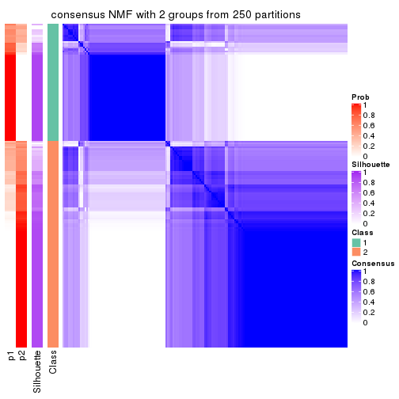</p>

</div>
<div id='tab-MAD-NMF-consensus-heatmap-2'>
<pre><code class="r">consensus_heatmap(res, k = 3)
</code></pre>

<p>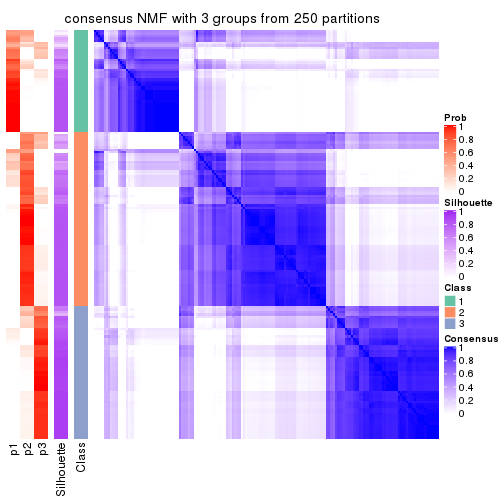</p>

</div>
<div id='tab-MAD-NMF-consensus-heatmap-3'>
<pre><code class="r">consensus_heatmap(res, k = 4)
</code></pre>

<p>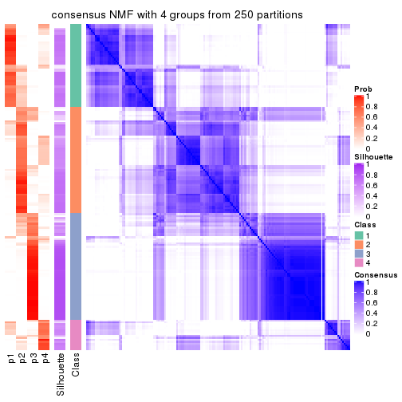</p>

</div>
<div id='tab-MAD-NMF-consensus-heatmap-4'>
<pre><code class="r">consensus_heatmap(res, k = 5)
</code></pre>

<p>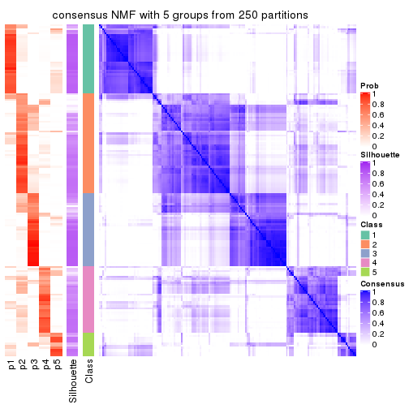</p>

</div>
<div id='tab-MAD-NMF-consensus-heatmap-5'>
<pre><code class="r">consensus_heatmap(res, k = 6)
</code></pre>

<p>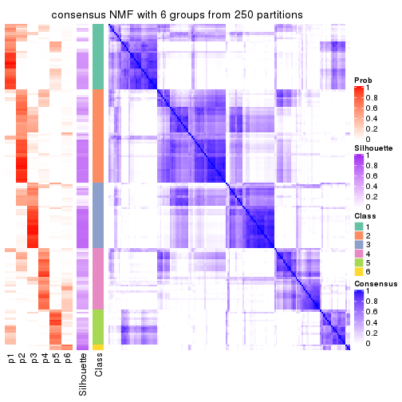</p>

</div>
</div>

Heatmaps for the membership of samples in all partitions to see how consistent they are:


<script>
$( function() {
	$( '#tabs-MAD-NMF-membership-heatmap' ).tabs();
} );
</script>
<div id='tabs-MAD-NMF-membership-heatmap'>
<ul>
<li><a href='#tab-MAD-NMF-membership-heatmap-1'>k = 2</a></li>
<li><a href='#tab-MAD-NMF-membership-heatmap-2'>k = 3</a></li>
<li><a href='#tab-MAD-NMF-membership-heatmap-3'>k = 4</a></li>
<li><a href='#tab-MAD-NMF-membership-heatmap-4'>k = 5</a></li>
<li><a href='#tab-MAD-NMF-membership-heatmap-5'>k = 6</a></li>
</ul>
<div id='tab-MAD-NMF-membership-heatmap-1'>
<pre><code class="r">membership_heatmap(res, k = 2)
</code></pre>

<p>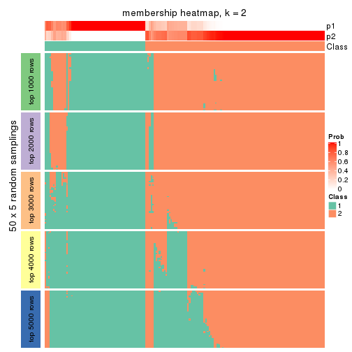</p>

</div>
<div id='tab-MAD-NMF-membership-heatmap-2'>
<pre><code class="r">membership_heatmap(res, k = 3)
</code></pre>

<p>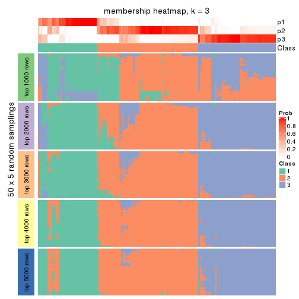</p>

</div>
<div id='tab-MAD-NMF-membership-heatmap-3'>
<pre><code class="r">membership_heatmap(res, k = 4)
</code></pre>

<p>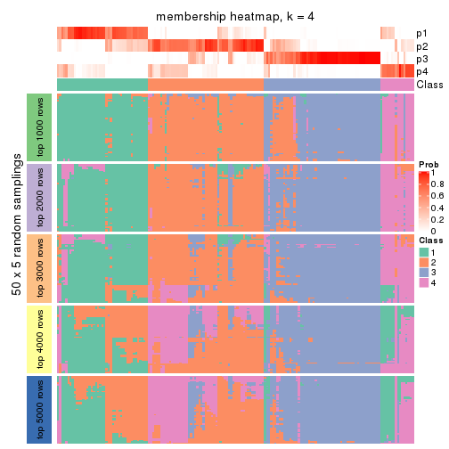</p>

</div>
<div id='tab-MAD-NMF-membership-heatmap-4'>
<pre><code class="r">membership_heatmap(res, k = 5)
</code></pre>

<p>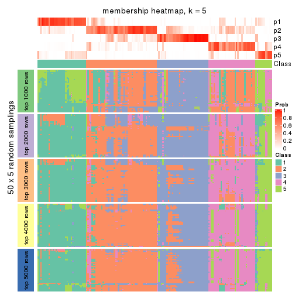</p>

</div>
<div id='tab-MAD-NMF-membership-heatmap-5'>
<pre><code class="r">membership_heatmap(res, k = 6)
</code></pre>

<p>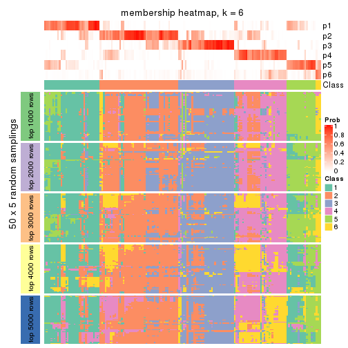</p>

</div>
</div>

As soon as we have had the classes for columns, we can look for signatures
which are significantly different between classes which can be candidate marks
for certain classes. Following are the heatmaps for signatures.


Signature heatmaps where rows are scaled:


<script>
$( function() {
	$( '#tabs-MAD-NMF-get-signatures' ).tabs();
} );
</script>
<div id='tabs-MAD-NMF-get-signatures'>
<ul>
<li><a href='#tab-MAD-NMF-get-signatures-1'>k = 2</a></li>
<li><a href='#tab-MAD-NMF-get-signatures-2'>k = 3</a></li>
<li><a href='#tab-MAD-NMF-get-signatures-3'>k = 4</a></li>
<li><a href='#tab-MAD-NMF-get-signatures-4'>k = 5</a></li>
<li><a href='#tab-MAD-NMF-get-signatures-5'>k = 6</a></li>
</ul>
<div id='tab-MAD-NMF-get-signatures-1'>
<pre><code class="r">get_signatures(res, k = 2)
</code></pre>

<p>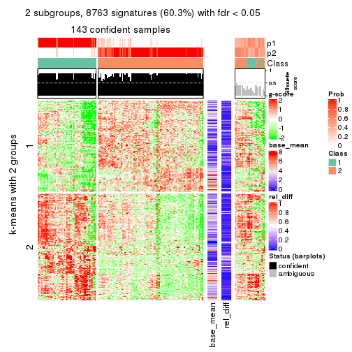</p>

</div>
<div id='tab-MAD-NMF-get-signatures-2'>
<pre><code class="r">get_signatures(res, k = 3)
</code></pre>

<p>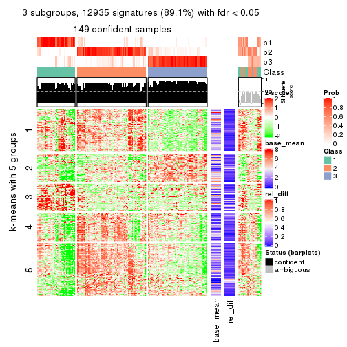</p>

</div>
<div id='tab-MAD-NMF-get-signatures-3'>
<pre><code class="r">get_signatures(res, k = 4)
</code></pre>

<p>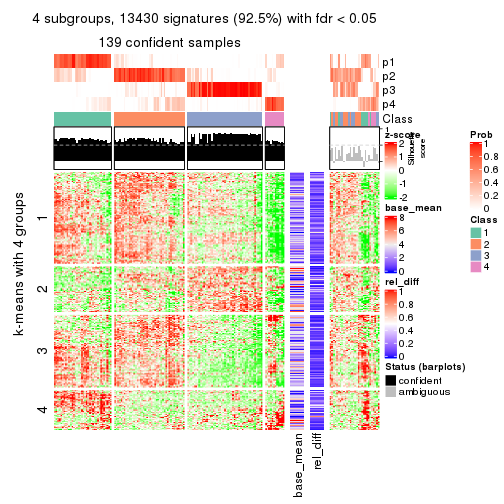</p>

</div>
<div id='tab-MAD-NMF-get-signatures-4'>
<pre><code class="r">get_signatures(res, k = 5)
</code></pre>

<p>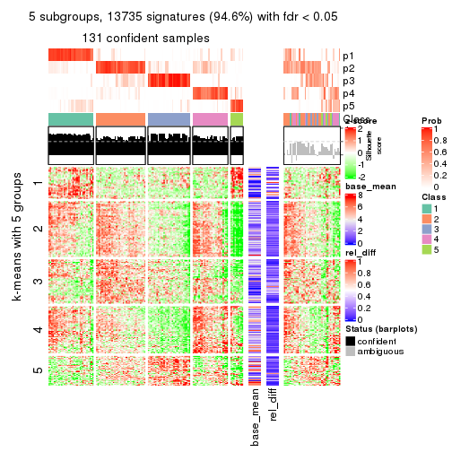</p>

</div>
<div id='tab-MAD-NMF-get-signatures-5'>
<pre><code class="r">get_signatures(res, k = 6)
</code></pre>

<p>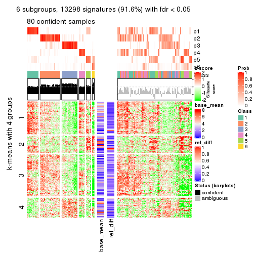</p>

</div>
</div>


Signature heatmaps where rows are not scaled:


<script>
$( function() {
	$( '#tabs-MAD-NMF-get-signatures-no-scale' ).tabs();
} );
</script>
<div id='tabs-MAD-NMF-get-signatures-no-scale'>
<ul>
<li><a href='#tab-MAD-NMF-get-signatures-no-scale-1'>k = 2</a></li>
<li><a href='#tab-MAD-NMF-get-signatures-no-scale-2'>k = 3</a></li>
<li><a href='#tab-MAD-NMF-get-signatures-no-scale-3'>k = 4</a></li>
<li><a href='#tab-MAD-NMF-get-signatures-no-scale-4'>k = 5</a></li>
<li><a href='#tab-MAD-NMF-get-signatures-no-scale-5'>k = 6</a></li>
</ul>
<div id='tab-MAD-NMF-get-signatures-no-scale-1'>
<pre><code class="r">get_signatures(res, k = 2, scale_rows = FALSE)
</code></pre>

<p>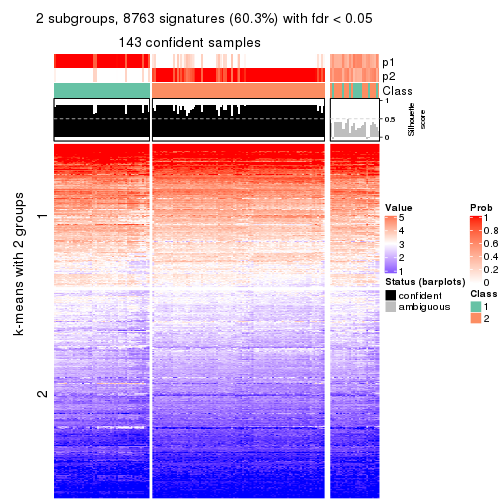</p>

</div>
<div id='tab-MAD-NMF-get-signatures-no-scale-2'>
<pre><code class="r">get_signatures(res, k = 3, scale_rows = FALSE)
</code></pre>

<p>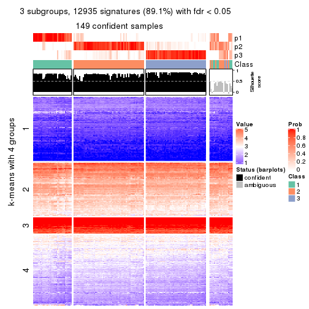</p>

</div>
<div id='tab-MAD-NMF-get-signatures-no-scale-3'>
<pre><code class="r">get_signatures(res, k = 4, scale_rows = FALSE)
</code></pre>

<p>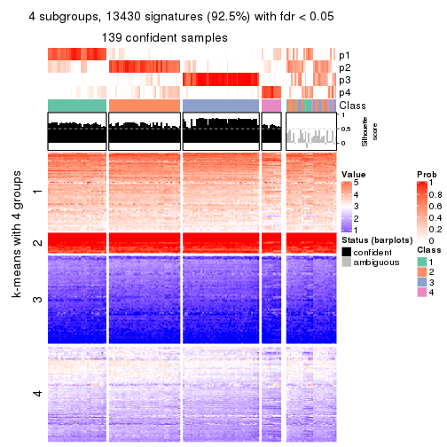</p>

</div>
<div id='tab-MAD-NMF-get-signatures-no-scale-4'>
<pre><code class="r">get_signatures(res, k = 5, scale_rows = FALSE)
</code></pre>

<p>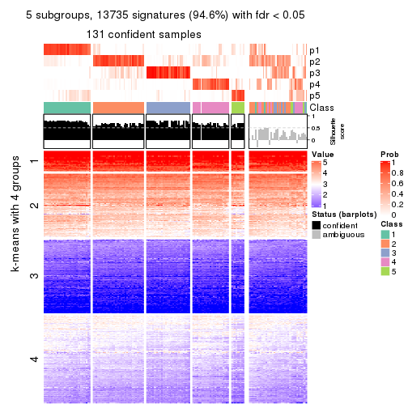</p>

</div>
<div id='tab-MAD-NMF-get-signatures-no-scale-5'>
<pre><code class="r">get_signatures(res, k = 6, scale_rows = FALSE)
</code></pre>

<p>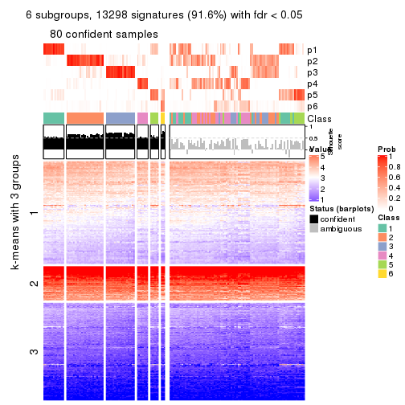</p>

</div>
</div>


Compare the overlap of signatures from different k:

```r
compare_signatures(res)
```

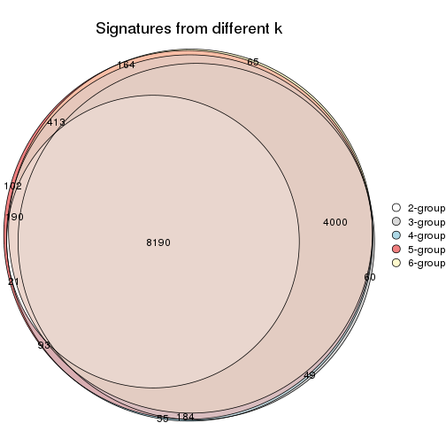

`get_signature()` returns a data frame invisibly. TO get the list of signatures, the function
call should be assigned to a variable explicitly. In following code, if `plot` argument is set
to `FALSE`, no heatmap is plotted while only the differential analysis is performed.

```r
# code only for demonstration
tb = get_signature(res, k = ..., plot = FALSE)
```

An example of the output of `tb` is:

```
#>   which_row         fdr    mean_1    mean_2 scaled_mean_1 scaled_mean_2 km
#> 1        38 0.042760348  8.373488  9.131774    -0.5533452     0.5164555  1
#> 2        40 0.018707592  7.106213  8.469186    -0.6173731     0.5762149  1
#> 3        55 0.019134737 10.221463 11.207825    -0.6159697     0.5749050  1
#> 4        59 0.006059896  5.921854  7.869574    -0.6899429     0.6439467  1
#> 5        60 0.018055526  8.928898 10.211722    -0.6204761     0.5791110  1
#> 6        98 0.009384629 15.714769 14.887706     0.6635654    -0.6193277  2
...
```

The columns in `tb` are:

1. `which_row`: row indices corresponding to the input matrix.
2. `fdr`: FDR for the differential test. 
3. `mean_x`: The mean value in group x.
4. `scaled_mean_x`: The mean value in group x after rows are scaled.
5. `km`: Row groups if k-means clustering is applied to rows.


UMAP plot which shows how samples are separated.


<script>
$( function() {
	$( '#tabs-MAD-NMF-dimension-reduction' ).tabs();
} );
</script>
<div id='tabs-MAD-NMF-dimension-reduction'>
<ul>
<li><a href='#tab-MAD-NMF-dimension-reduction-1'>k = 2</a></li>
<li><a href='#tab-MAD-NMF-dimension-reduction-2'>k = 3</a></li>
<li><a href='#tab-MAD-NMF-dimension-reduction-3'>k = 4</a></li>
<li><a href='#tab-MAD-NMF-dimension-reduction-4'>k = 5</a></li>
<li><a href='#tab-MAD-NMF-dimension-reduction-5'>k = 6</a></li>
</ul>
<div id='tab-MAD-NMF-dimension-reduction-1'>
<pre><code class="r">dimension_reduction(res, k = 2, method = &quot;UMAP&quot;)
</code></pre>

<p>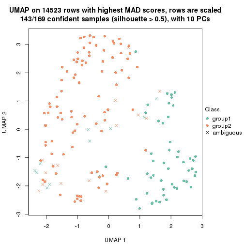</p>

</div>
<div id='tab-MAD-NMF-dimension-reduction-2'>
<pre><code class="r">dimension_reduction(res, k = 3, method = &quot;UMAP&quot;)
</code></pre>

<p>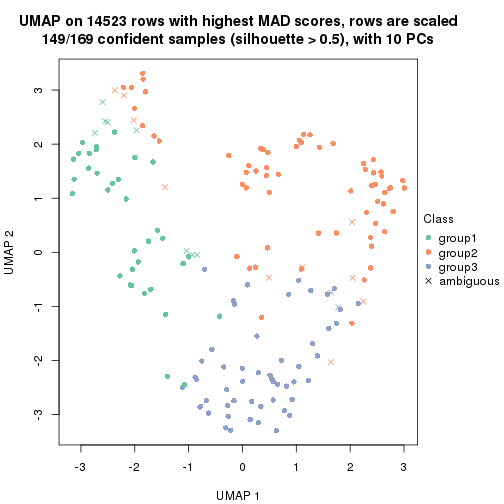</p>

</div>
<div id='tab-MAD-NMF-dimension-reduction-3'>
<pre><code class="r">dimension_reduction(res, k = 4, method = &quot;UMAP&quot;)
</code></pre>

<p>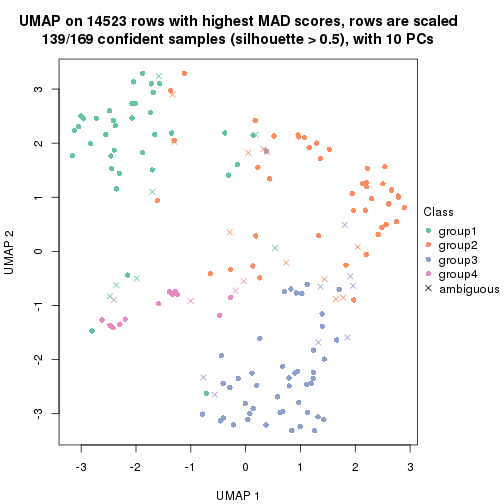</p>

</div>
<div id='tab-MAD-NMF-dimension-reduction-4'>
<pre><code class="r">dimension_reduction(res, k = 5, method = &quot;UMAP&quot;)
</code></pre>

<p>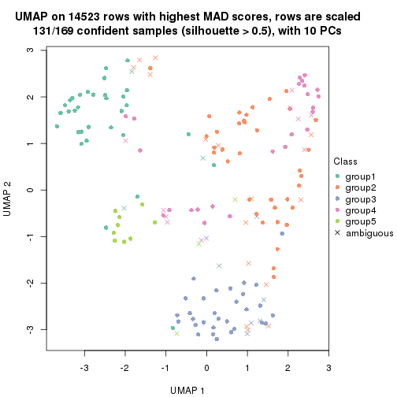</p>

</div>
<div id='tab-MAD-NMF-dimension-reduction-5'>
<pre><code class="r">dimension_reduction(res, k = 6, method = &quot;UMAP&quot;)
</code></pre>

<p>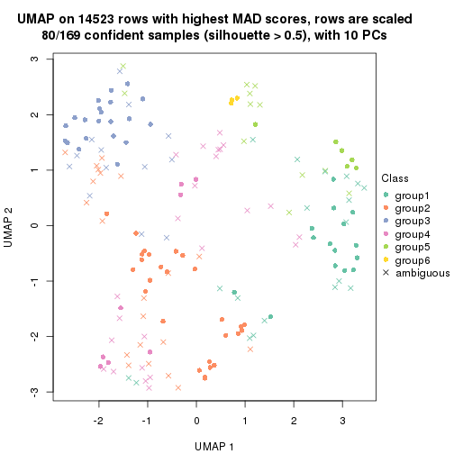</p>

</div>
</div>


Following heatmap shows how subgroups are split when increasing `k`:

```r
collect_classes(res)
```

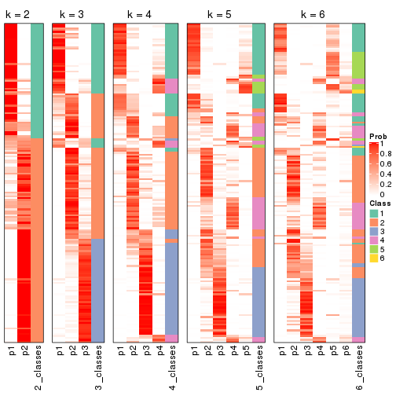


If matrix rows can be associated to genes, consider to use `GO_Enrichment(res,
...)` to perform function enrichment for the signature genes.


 

---------------------------------------------------


### ATC:hclust


The object with results only for a single top-value method and a single partition method 
can be extracted as:

```r
res = res_list["ATC", "hclust"]
# you can also extract it by
# res = res_list["ATC:hclust"]
```

A summary of `res` and all the functions that can be applied to it:

```r
res
```

```
#> A 'ConsensusPartition' object with k = 2, 3, 4, 5, 6.
#>   On a matrix with 14523 rows and 169 columns.
#>   Top rows (1000, 2000, 3000, 4000, 5000) are extracted by 'ATC' method.
#>   Subgroups are detected by 'hclust' method.
#>   Performed in total 1250 partitions by row resampling.
#>   Best k for subgroups seems to be 3.
#> 
#> Following methods can be applied to this 'ConsensusPartition' object:
#>  [1] "cola_report"             "collect_classes"         "collect_plots"          
#>  [4] "collect_stats"           "colnames"                "compare_signatures"     
#>  [7] "consensus_heatmap"       "dimension_reduction"     "functional_enrichment"  
#> [10] "get_anno_col"            "get_anno"                "get_classes"            
#> [13] "get_consensus"           "get_matrix"              "get_membership"         
#> [16] "get_param"               "get_signatures"          "get_stats"              
#> [19] "is_best_k"               "is_stable_k"             "membership_heatmap"     
#> [22] "ncol"                    "nrow"                    "plot_ecdf"              
#> [25] "rownames"                "select_partition_number" "show"                   
#> [28] "suggest_best_k"          "test_to_known_factors"
```

`collect_plots()` function collects all the plots made from `res` for all `k` (number of partitions)
into one single page to provide an easy and fast comparison between different `k`.

```r
collect_plots(res)
```

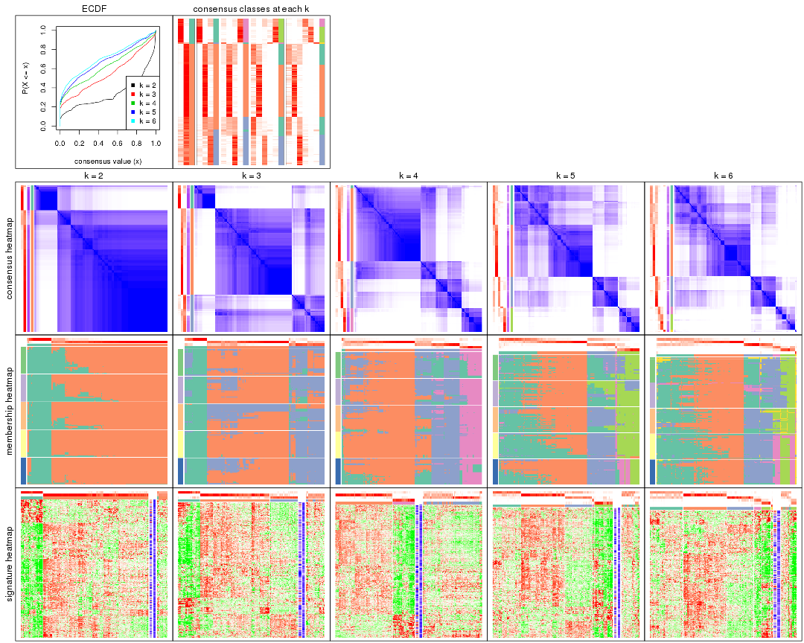

The plots are:

- The first row: a plot of the ECDF (Empirical cumulative distribution
  function) curves of the consensus matrix for each `k` and the heatmap of
  predicted classes for each `k`.
- The second row: heatmaps of the consensus matrix for each `k`.
- The third row: heatmaps of the membership matrix for each `k`.
- The fouth row: heatmaps of the signatures for each `k`.

All the plots in panels can be made by individual functions and they are
plotted later in this section.

`select_partition_number()` produces several plots showing different
statistics for choosing "optimized" `k`. There are following statistics:

- ECDF curves of the consensus matrix for each `k`;
- 1-PAC. [The PAC
  score](https://en.wikipedia.org/wiki/Consensus_clustering#Over-interpretation_potential_of_consensus_clustering)
  measures the proportion of the ambiguous subgrouping.
- Mean silhouette score.
- Concordance. The mean probability of fiting the consensus class ids in all
  partitions.
- Area increased. Denote $A_k$ as the area under the ECDF curve for current
  `k`, the area increased is defined as $A_k - A_{k-1}$.
- Rand index. The percent of pairs of samples that are both in a same cluster
  or both are not in a same cluster in the partition of k and k-1.
- Jaccard index. The ratio of pairs of samples are both in a same cluster in
  the partition of k and k-1 and the pairs of samples are both in a same
  cluster in the partition k or k-1.

The detailed explanations of these statistics can be found in [the cola
vignette](http://bioconductor.org/packages/devel/bioc/vignettes/cola/inst/doc/cola.html#toc_13).

Generally speaking, lower PAC score, higher mean silhouette score or higher
concordance corresponds to better partition. Rand index and Jaccard index
measure how similar the current partition is compared to partition with `k-1`.
If they are too similar, we won't accept `k` is better than `k-1`.

```r
select_partition_number(res)
```

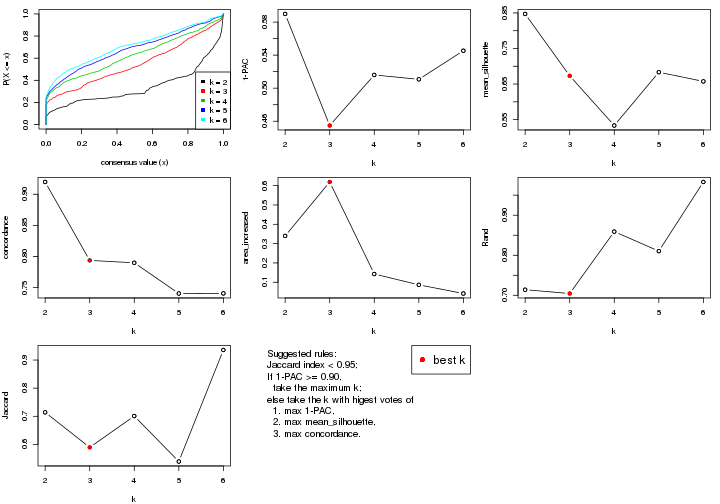

The numeric values for all these statistics can be obtained by `get_stats()`.

```r
get_stats(res)
```

```
#>   k 1-PAC mean_silhouette concordance area_increased  Rand Jaccard
#> 2 2 0.590           0.847       0.920         0.3398 0.714   0.714
#> 3 3 0.455           0.673       0.794         0.6189 0.704   0.589
#> 4 4 0.516           0.533       0.790         0.1427 0.859   0.701
#> 5 5 0.511           0.683       0.740         0.0867 0.810   0.539
#> 6 6 0.545           0.657       0.741         0.0418 0.983   0.936
```

`suggest_best_k()` suggests the best $k$ based on these statistics. The rules are as follows:

- All $k$ with Jaccard index larger than 0.95 are removed because the increase of
  the partition number does not provides enough extra information. If all $k$ are removed,
  the best $k$ is assigned by `NA`.
- For $k$ with 1-PAC larger than 0.9, the maximal $k$ is taken as the "best k". Other $k$ is called "optional k".
- If it does not fit the second rule. The $k$ with the highest vote of highest
  1-PAC, mean silhouette and concordance is taken as the "best k".

```r
suggest_best_k(res)
```

```
#> [1] 3
```


Following shows the table of the partitions (You need to click the **show/hide
code output** link to see it). The membership matrix (columns with name `p*`)
is inferred by
[`clue::cl_consensus()`](https://www.rdocumentation.org/link/cl_consensus?package=clue)
function with the `SE` method. Basically the value in the membership matrix
represents the probability to belong to a certain group. The finall class
label for an item is determined with the group with highest probability it
belongs to.

In `get_classes()` function, the entropy is calculated from the membership
matrix and the silhouette score is calculated from the consensus matrix.


<script>
$( function() {
	$( '#tabs-ATC-hclust-get-classes' ).tabs();
} );
</script>
<div id='tabs-ATC-hclust-get-classes'>
<ul>
<li><a href='#tab-ATC-hclust-get-classes-1'>k = 2</a></li>
<li><a href='#tab-ATC-hclust-get-classes-2'>k = 3</a></li>
<li><a href='#tab-ATC-hclust-get-classes-3'>k = 4</a></li>
<li><a href='#tab-ATC-hclust-get-classes-4'>k = 5</a></li>
<li><a href='#tab-ATC-hclust-get-classes-5'>k = 6</a></li>
</ul>

<div id='tab-ATC-hclust-get-classes-1'>
<p><a id='tab-ATC-hclust-get-classes-1-a' style='color:#0366d6' href='#'>show/hide code output</a></p>
<pre><code class="r">cbind(get_classes(res, k = 2), get_membership(res, k = 2))
</code></pre>

<pre><code>#&gt;            class entropy silhouette    p1    p2
#&gt; SRR2052702     2  0.0000    0.90862 0.000 1.000
#&gt; SRR2052701     2  0.0000    0.90862 0.000 1.000
#&gt; SRR2052700     2  0.6247    0.83963 0.156 0.844
#&gt; SRR2052699     2  0.1184    0.90829 0.016 0.984
#&gt; SRR2052698     2  0.1633    0.90752 0.024 0.976
#&gt; SRR2052708     2  0.5408    0.86406 0.124 0.876
#&gt; SRR2052749     2  0.2603    0.90240 0.044 0.956
#&gt; SRR2052786     2  0.0000    0.90862 0.000 1.000
#&gt; SRR2052825     1  0.0000    0.94495 1.000 0.000
#&gt; SRR2052824     1  0.0000    0.94495 1.000 0.000
#&gt; SRR2052823     2  0.0000    0.90862 0.000 1.000
#&gt; SRR2052822     2  0.1633    0.90738 0.024 0.976
#&gt; SRR2052821     2  0.0000    0.90862 0.000 1.000
#&gt; SRR2052820     2  0.9795    0.43632 0.416 0.584
#&gt; SRR2052819     1  0.0000    0.94495 1.000 0.000
#&gt; SRR2052818     2  0.0000    0.90862 0.000 1.000
#&gt; SRR2052817     2  0.3431    0.89566 0.064 0.936
#&gt; SRR2052816     2  0.3431    0.89513 0.064 0.936
#&gt; SRR2052815     1  0.0000    0.94495 1.000 0.000
#&gt; SRR2052814     1  0.9922   -0.00384 0.552 0.448
#&gt; SRR2052813     2  0.0376    0.90886 0.004 0.996
#&gt; SRR2052812     2  0.0000    0.90862 0.000 1.000
#&gt; SRR2052811     2  0.0000    0.90862 0.000 1.000
#&gt; SRR2052810     2  0.6438    0.83373 0.164 0.836
#&gt; SRR2052809     2  0.1414    0.90790 0.020 0.980
#&gt; SRR2052808     2  0.2948    0.89977 0.052 0.948
#&gt; SRR2052807     1  0.0000    0.94495 1.000 0.000
#&gt; SRR2052806     2  0.3114    0.89904 0.056 0.944
#&gt; SRR2052805     2  0.5178    0.86877 0.116 0.884
#&gt; SRR2052804     1  0.5519    0.82267 0.872 0.128
#&gt; SRR2052803     2  0.3114    0.89904 0.056 0.944
#&gt; SRR2052802     1  0.0000    0.94495 1.000 0.000
#&gt; SRR2052801     1  0.0000    0.94495 1.000 0.000
#&gt; SRR2052800     1  0.0000    0.94495 1.000 0.000
#&gt; SRR2052799     1  0.0000    0.94495 1.000 0.000
#&gt; SRR2052798     2  0.2603    0.90240 0.044 0.956
#&gt; SRR2052797     2  0.0938    0.90873 0.012 0.988
#&gt; SRR2052796     1  0.0000    0.94495 1.000 0.000
#&gt; SRR2052795     2  0.5408    0.86406 0.124 0.876
#&gt; SRR2052794     1  0.0000    0.94495 1.000 0.000
#&gt; SRR2052793     1  0.0000    0.94495 1.000 0.000
#&gt; SRR2052792     1  0.0000    0.94495 1.000 0.000
#&gt; SRR2052791     1  0.3114    0.90159 0.944 0.056
#&gt; SRR2052790     2  0.1633    0.90738 0.024 0.976
#&gt; SRR2052789     2  0.6247    0.83829 0.156 0.844
#&gt; SRR2052788     2  0.6343    0.83479 0.160 0.840
#&gt; SRR2052787     2  0.0000    0.90862 0.000 1.000
#&gt; SRR2052785     2  0.5178    0.86973 0.116 0.884
#&gt; SRR2052784     2  0.1633    0.90738 0.024 0.976
#&gt; SRR2052783     2  0.2043    0.90651 0.032 0.968
#&gt; SRR2052782     2  0.1184    0.90845 0.016 0.984
#&gt; SRR2052781     2  0.1843    0.90660 0.028 0.972
#&gt; SRR2052780     2  0.4161    0.88683 0.084 0.916
#&gt; SRR2052777     2  0.1184    0.90845 0.016 0.984
#&gt; SRR2052779     2  0.1184    0.90845 0.016 0.984
#&gt; SRR2052778     2  0.9896    0.37500 0.440 0.560
#&gt; SRR2052776     2  0.2236    0.90471 0.036 0.964
#&gt; SRR2052775     2  0.9000    0.63657 0.316 0.684
#&gt; SRR2052773     2  0.3879    0.89064 0.076 0.924
#&gt; SRR2052772     2  0.6438    0.83146 0.164 0.836
#&gt; SRR2052774     2  0.3879    0.89064 0.076 0.924
#&gt; SRR2052771     1  0.0672    0.93979 0.992 0.008
#&gt; SRR2052769     2  0.7815    0.75977 0.232 0.768
#&gt; SRR2052770     2  0.9460    0.55051 0.364 0.636
#&gt; SRR2052768     2  0.0000    0.90862 0.000 1.000
#&gt; SRR2052767     2  0.0000    0.90862 0.000 1.000
#&gt; SRR2052766     1  0.0000    0.94495 1.000 0.000
#&gt; SRR2052765     2  0.0938    0.90873 0.012 0.988
#&gt; SRR2052763     2  0.8499    0.69719 0.276 0.724
#&gt; SRR2052764     2  0.0000    0.90862 0.000 1.000
#&gt; SRR2052761     2  0.5737    0.85435 0.136 0.864
#&gt; SRR2052760     2  0.0000    0.90862 0.000 1.000
#&gt; SRR2052759     2  0.9896    0.37500 0.440 0.560
#&gt; SRR2052762     2  0.1184    0.90829 0.016 0.984
#&gt; SRR2052758     2  0.6148    0.84169 0.152 0.848
#&gt; SRR2052756     2  0.9129    0.61340 0.328 0.672
#&gt; SRR2052757     2  0.4431    0.88325 0.092 0.908
#&gt; SRR2052755     2  0.0000    0.90862 0.000 1.000
#&gt; SRR2052754     1  0.0000    0.94495 1.000 0.000
#&gt; SRR2052753     2  0.0000    0.90862 0.000 1.000
#&gt; SRR2052752     2  0.5178    0.86877 0.116 0.884
#&gt; SRR2052750     2  0.0000    0.90862 0.000 1.000
#&gt; SRR2052751     2  0.0938    0.90862 0.012 0.988
#&gt; SRR2052748     1  0.0000    0.94495 1.000 0.000
#&gt; SRR2052747     2  0.0938    0.90905 0.012 0.988
#&gt; SRR2052746     2  0.9815    0.42658 0.420 0.580
#&gt; SRR2052745     2  0.9896    0.37500 0.440 0.560
#&gt; SRR2052744     2  0.0000    0.90862 0.000 1.000
#&gt; SRR2052741     2  0.0376    0.90886 0.004 0.996
#&gt; SRR2052743     2  0.0376    0.90886 0.004 0.996
#&gt; SRR2052740     2  0.0000    0.90862 0.000 1.000
#&gt; SRR2052742     2  0.0938    0.90862 0.012 0.988
#&gt; SRR2052739     2  0.0000    0.90862 0.000 1.000
#&gt; SRR2052738     2  0.9815    0.42658 0.420 0.580
#&gt; SRR2052736     2  0.0000    0.90862 0.000 1.000
#&gt; SRR2052735     2  0.0000    0.90862 0.000 1.000
#&gt; SRR2052734     2  0.0000    0.90862 0.000 1.000
#&gt; SRR2052737     2  0.0000    0.90862 0.000 1.000
#&gt; SRR2052733     2  0.9896    0.37500 0.440 0.560
#&gt; SRR2052732     2  0.0000    0.90862 0.000 1.000
#&gt; SRR2052731     2  0.5737    0.85435 0.136 0.864
#&gt; SRR2052729     2  0.0000    0.90862 0.000 1.000
#&gt; SRR2052728     2  0.0000    0.90862 0.000 1.000
#&gt; SRR2052730     1  0.5519    0.82267 0.872 0.128
#&gt; SRR2052727     2  0.0000    0.90862 0.000 1.000
#&gt; SRR2052725     2  0.0000    0.90862 0.000 1.000
#&gt; SRR2052726     2  0.0000    0.90862 0.000 1.000
#&gt; SRR2052724     2  0.9427    0.55362 0.360 0.640
#&gt; SRR2052723     2  0.9896    0.37500 0.440 0.560
#&gt; SRR2052722     2  0.6623    0.82400 0.172 0.828
#&gt; SRR2052721     2  0.0000    0.90862 0.000 1.000
#&gt; SRR2052720     2  0.0000    0.90862 0.000 1.000
#&gt; SRR2052719     2  0.0000    0.90862 0.000 1.000
#&gt; SRR2052718     2  0.0000    0.90862 0.000 1.000
#&gt; SRR2052717     2  0.0938    0.90862 0.012 0.988
#&gt; SRR2052714     2  0.9795    0.43891 0.416 0.584
#&gt; SRR2052716     2  0.9896    0.37500 0.440 0.560
#&gt; SRR2052715     2  0.9460    0.55051 0.364 0.636
#&gt; SRR2052713     2  0.6623    0.82747 0.172 0.828
#&gt; SRR2052712     1  0.0000    0.94495 1.000 0.000
#&gt; SRR2052711     1  0.9358    0.35310 0.648 0.352
#&gt; SRR2052710     2  0.4690    0.87976 0.100 0.900
#&gt; SRR2052707     2  0.6438    0.83146 0.164 0.836
#&gt; SRR2052709     2  0.6343    0.83479 0.160 0.840
#&gt; SRR2052704     1  0.0000    0.94495 1.000 0.000
#&gt; SRR2052705     2  0.0376    0.90886 0.004 0.996
#&gt; SRR2052697     2  0.0000    0.90862 0.000 1.000
#&gt; SRR2052703     2  0.6148    0.84169 0.152 0.848
#&gt; SRR2052696     2  0.2603    0.90240 0.044 0.956
#&gt; SRR2052706     2  0.2236    0.90488 0.036 0.964
#&gt; SRR2052695     2  0.0000    0.90862 0.000 1.000
#&gt; SRR2052694     2  0.0000    0.90862 0.000 1.000
#&gt; SRR2052692     2  0.6343    0.83479 0.160 0.840
#&gt; SRR2052693     2  0.5178    0.86973 0.116 0.884
#&gt; SRR2052691     2  0.0376    0.90886 0.004 0.996
#&gt; SRR2052690     2  0.0376    0.90886 0.004 0.996
#&gt; SRR2052689     1  0.5519    0.82267 0.872 0.128
#&gt; SRR2052687     2  0.7056    0.80599 0.192 0.808
#&gt; SRR2052686     2  0.0000    0.90862 0.000 1.000
#&gt; SRR2052688     2  0.0000    0.90862 0.000 1.000
#&gt; SRR2052684     1  0.0000    0.94495 1.000 0.000
#&gt; SRR2052685     2  0.0000    0.90862 0.000 1.000
#&gt; SRR2052683     1  0.2423    0.91626 0.960 0.040
#&gt; SRR2052681     2  0.7139    0.80195 0.196 0.804
#&gt; SRR2052680     1  0.0000    0.94495 1.000 0.000
#&gt; SRR2052682     2  0.0000    0.90862 0.000 1.000
#&gt; SRR2052679     2  0.0000    0.90862 0.000 1.000
#&gt; SRR2052678     2  0.6531    0.82807 0.168 0.832
#&gt; SRR2052677     2  0.0376    0.90886 0.004 0.996
#&gt; SRR2052675     2  0.0000    0.90862 0.000 1.000
#&gt; SRR2052676     2  0.0000    0.90862 0.000 1.000
#&gt; SRR2052674     2  0.3274    0.89687 0.060 0.940
#&gt; SRR2052672     2  0.9754    0.45616 0.408 0.592
#&gt; SRR2052673     2  0.0000    0.90862 0.000 1.000
#&gt; SRR2052671     2  0.0000    0.90862 0.000 1.000
#&gt; SRR2052670     2  0.4161    0.88683 0.084 0.916
#&gt; SRR2052669     2  0.0000    0.90862 0.000 1.000
#&gt; SRR2052668     2  0.0672    0.90885 0.008 0.992
#&gt; SRR2052667     2  0.0000    0.90862 0.000 1.000
#&gt; SRR2052666     2  0.3879    0.88888 0.076 0.924
#&gt; SRR2052665     2  0.0376    0.90886 0.004 0.996
#&gt; SRR2052664     1  0.0000    0.94495 1.000 0.000
#&gt; SRR2052663     2  0.0000    0.90862 0.000 1.000
#&gt; SRR2052662     2  0.0000    0.90862 0.000 1.000
#&gt; SRR2052661     2  0.0000    0.90862 0.000 1.000
#&gt; SRR2052660     2  0.4161    0.88683 0.084 0.916
#&gt; SRR2052659     2  0.5737    0.85435 0.136 0.864
#&gt; SRR2052658     2  0.0938    0.90862 0.012 0.988
#&gt; SRR2052657     2  0.5178    0.86957 0.116 0.884
</code></pre>

<script>
$('#tab-ATC-hclust-get-classes-1-a').parent().next().next().hide();
$('#tab-ATC-hclust-get-classes-1-a').click(function(){
  $('#tab-ATC-hclust-get-classes-1-a').parent().next().next().toggle();
  return(false);
});
</script>
</div>

<div id='tab-ATC-hclust-get-classes-2'>
<p><a id='tab-ATC-hclust-get-classes-2-a' style='color:#0366d6' href='#'>show/hide code output</a></p>
<pre><code class="r">cbind(get_classes(res, k = 3), get_membership(res, k = 3))
</code></pre>

<pre><code>#&gt;            class entropy silhouette    p1    p2    p3
#&gt; SRR2052702     2  0.0000     0.7991 0.000 1.000 0.000
#&gt; SRR2052701     2  0.0000     0.7991 0.000 1.000 0.000
#&gt; SRR2052700     3  0.7075    -0.1063 0.020 0.484 0.496
#&gt; SRR2052699     2  0.4750     0.7218 0.000 0.784 0.216
#&gt; SRR2052698     2  0.5733     0.5935 0.000 0.676 0.324
#&gt; SRR2052708     2  0.6779     0.2985 0.012 0.544 0.444
#&gt; SRR2052749     2  0.5678     0.5999 0.000 0.684 0.316
#&gt; SRR2052786     2  0.0000     0.7991 0.000 1.000 0.000
#&gt; SRR2052825     1  0.0000     0.9037 1.000 0.000 0.000
#&gt; SRR2052824     1  0.0000     0.9037 1.000 0.000 0.000
#&gt; SRR2052823     2  0.2448     0.7995 0.000 0.924 0.076
#&gt; SRR2052822     2  0.5216     0.6824 0.000 0.740 0.260
#&gt; SRR2052821     2  0.2448     0.7995 0.000 0.924 0.076
#&gt; SRR2052820     3  0.3816     0.5620 0.148 0.000 0.852
#&gt; SRR2052819     1  0.0000     0.9037 1.000 0.000 0.000
#&gt; SRR2052818     2  0.0000     0.7991 0.000 1.000 0.000
#&gt; SRR2052817     3  0.6286     0.0928 0.000 0.464 0.536
#&gt; SRR2052816     2  0.6204     0.3688 0.000 0.576 0.424
#&gt; SRR2052815     1  0.0000     0.9037 1.000 0.000 0.000
#&gt; SRR2052814     3  0.4974     0.3330 0.236 0.000 0.764
#&gt; SRR2052813     2  0.3551     0.7758 0.000 0.868 0.132
#&gt; SRR2052812     2  0.0000     0.7991 0.000 1.000 0.000
#&gt; SRR2052811     2  0.0000     0.7991 0.000 1.000 0.000
#&gt; SRR2052810     3  0.7295    -0.0928 0.028 0.480 0.492
#&gt; SRR2052809     2  0.5178     0.6864 0.000 0.744 0.256
#&gt; SRR2052808     2  0.6168     0.3991 0.000 0.588 0.412
#&gt; SRR2052807     1  0.0000     0.9037 1.000 0.000 0.000
#&gt; SRR2052806     2  0.5902     0.5864 0.004 0.680 0.316
#&gt; SRR2052805     2  0.6468     0.3199 0.004 0.552 0.444
#&gt; SRR2052804     1  0.5859     0.6241 0.656 0.000 0.344
#&gt; SRR2052803     2  0.6209     0.5005 0.004 0.628 0.368
#&gt; SRR2052802     1  0.0000     0.9037 1.000 0.000 0.000
#&gt; SRR2052801     1  0.0000     0.9037 1.000 0.000 0.000
#&gt; SRR2052800     1  0.0000     0.9037 1.000 0.000 0.000
#&gt; SRR2052799     1  0.0000     0.9037 1.000 0.000 0.000
#&gt; SRR2052798     2  0.5678     0.5999 0.000 0.684 0.316
#&gt; SRR2052797     2  0.4291     0.7496 0.000 0.820 0.180
#&gt; SRR2052796     1  0.0747     0.8995 0.984 0.000 0.016
#&gt; SRR2052795     2  0.6779     0.2985 0.012 0.544 0.444
#&gt; SRR2052794     1  0.0000     0.9037 1.000 0.000 0.000
#&gt; SRR2052793     1  0.4399     0.8307 0.812 0.000 0.188
#&gt; SRR2052792     1  0.0000     0.9037 1.000 0.000 0.000
#&gt; SRR2052791     1  0.5560     0.7260 0.700 0.000 0.300
#&gt; SRR2052790     2  0.5216     0.6824 0.000 0.740 0.260
#&gt; SRR2052789     3  0.4654     0.7066 0.000 0.208 0.792
#&gt; SRR2052788     3  0.4605     0.7091 0.000 0.204 0.796
#&gt; SRR2052787     2  0.0237     0.8001 0.000 0.996 0.004
#&gt; SRR2052785     2  0.6280     0.2847 0.000 0.540 0.460
#&gt; SRR2052784     2  0.5216     0.6824 0.000 0.740 0.260
#&gt; SRR2052783     2  0.5363     0.6680 0.000 0.724 0.276
#&gt; SRR2052782     2  0.4931     0.7110 0.000 0.768 0.232
#&gt; SRR2052781     2  0.5465     0.6448 0.000 0.712 0.288
#&gt; SRR2052780     3  0.5465     0.6132 0.000 0.288 0.712
#&gt; SRR2052777     2  0.4931     0.7110 0.000 0.768 0.232
#&gt; SRR2052779     2  0.4931     0.7110 0.000 0.768 0.232
#&gt; SRR2052778     3  0.4346     0.5169 0.184 0.000 0.816
#&gt; SRR2052776     2  0.5988     0.5057 0.000 0.632 0.368
#&gt; SRR2052775     3  0.4189     0.6663 0.056 0.068 0.876
#&gt; SRR2052773     3  0.5706     0.5578 0.000 0.320 0.680
#&gt; SRR2052772     3  0.4834     0.7101 0.004 0.204 0.792
#&gt; SRR2052774     3  0.5706     0.5578 0.000 0.320 0.680
#&gt; SRR2052771     1  0.4842     0.8075 0.776 0.000 0.224
#&gt; SRR2052769     3  0.7962     0.0959 0.060 0.428 0.512
#&gt; SRR2052770     3  0.4137     0.6254 0.096 0.032 0.872
#&gt; SRR2052768     2  0.0000     0.7991 0.000 1.000 0.000
#&gt; SRR2052767     2  0.0000     0.7991 0.000 1.000 0.000
#&gt; SRR2052766     1  0.0000     0.9037 1.000 0.000 0.000
#&gt; SRR2052765     2  0.3619     0.7748 0.000 0.864 0.136
#&gt; SRR2052763     3  0.3587     0.6890 0.020 0.088 0.892
#&gt; SRR2052764     2  0.0000     0.7991 0.000 1.000 0.000
#&gt; SRR2052761     3  0.4887     0.6892 0.000 0.228 0.772
#&gt; SRR2052760     2  0.0000     0.7991 0.000 1.000 0.000
#&gt; SRR2052759     3  0.4346     0.5169 0.184 0.000 0.816
#&gt; SRR2052762     2  0.5016     0.7021 0.000 0.760 0.240
#&gt; SRR2052758     3  0.4702     0.7036 0.000 0.212 0.788
#&gt; SRR2052756     3  0.8394     0.4009 0.108 0.316 0.576
#&gt; SRR2052757     2  0.6215     0.3802 0.000 0.572 0.428
#&gt; SRR2052755     2  0.1529     0.8036 0.000 0.960 0.040
#&gt; SRR2052754     1  0.0000     0.9037 1.000 0.000 0.000
#&gt; SRR2052753     2  0.1643     0.8036 0.000 0.956 0.044
#&gt; SRR2052752     2  0.6468     0.3199 0.004 0.552 0.444
#&gt; SRR2052750     2  0.3267     0.7873 0.000 0.884 0.116
#&gt; SRR2052751     2  0.4796     0.7202 0.000 0.780 0.220
#&gt; SRR2052748     1  0.4702     0.8167 0.788 0.000 0.212
#&gt; SRR2052747     2  0.4654     0.7294 0.000 0.792 0.208
#&gt; SRR2052746     3  0.3816     0.5587 0.148 0.000 0.852
#&gt; SRR2052745     3  0.4346     0.5169 0.184 0.000 0.816
#&gt; SRR2052744     2  0.1031     0.8031 0.000 0.976 0.024
#&gt; SRR2052741     2  0.1860     0.8030 0.000 0.948 0.052
#&gt; SRR2052743     2  0.1860     0.8030 0.000 0.948 0.052
#&gt; SRR2052740     2  0.0000     0.7991 0.000 1.000 0.000
#&gt; SRR2052742     2  0.4842     0.7170 0.000 0.776 0.224
#&gt; SRR2052739     2  0.0892     0.8031 0.000 0.980 0.020
#&gt; SRR2052738     3  0.3816     0.5587 0.148 0.000 0.852
#&gt; SRR2052736     2  0.0000     0.7991 0.000 1.000 0.000
#&gt; SRR2052735     2  0.0000     0.7991 0.000 1.000 0.000
#&gt; SRR2052734     2  0.0000     0.7991 0.000 1.000 0.000
#&gt; SRR2052737     2  0.2959     0.7928 0.000 0.900 0.100
#&gt; SRR2052733     3  0.4452     0.5087 0.192 0.000 0.808
#&gt; SRR2052732     2  0.0000     0.7991 0.000 1.000 0.000
#&gt; SRR2052731     3  0.4887     0.6892 0.000 0.228 0.772
#&gt; SRR2052729     2  0.0892     0.8015 0.000 0.980 0.020
#&gt; SRR2052728     2  0.0000     0.7991 0.000 1.000 0.000
#&gt; SRR2052730     1  0.5859     0.6241 0.656 0.000 0.344
#&gt; SRR2052727     2  0.0592     0.7995 0.000 0.988 0.012
#&gt; SRR2052725     2  0.1643     0.8036 0.000 0.956 0.044
#&gt; SRR2052726     2  0.0000     0.7991 0.000 1.000 0.000
#&gt; SRR2052724     3  0.7529     0.3822 0.060 0.316 0.624
#&gt; SRR2052723     3  0.4452     0.5087 0.192 0.000 0.808
#&gt; SRR2052722     3  0.4861     0.7128 0.008 0.192 0.800
#&gt; SRR2052721     2  0.0592     0.7995 0.000 0.988 0.012
#&gt; SRR2052720     2  0.0000     0.7991 0.000 1.000 0.000
#&gt; SRR2052719     2  0.0000     0.7991 0.000 1.000 0.000
#&gt; SRR2052718     2  0.1529     0.8036 0.000 0.960 0.040
#&gt; SRR2052717     2  0.4974     0.7061 0.000 0.764 0.236
#&gt; SRR2052714     3  0.3038     0.5765 0.104 0.000 0.896
#&gt; SRR2052716     3  0.4452     0.5087 0.192 0.000 0.808
#&gt; SRR2052715     3  0.4137     0.6254 0.096 0.032 0.872
#&gt; SRR2052713     2  0.7665     0.1630 0.044 0.500 0.456
#&gt; SRR2052712     1  0.0000     0.9037 1.000 0.000 0.000
#&gt; SRR2052711     3  0.6079    -0.0466 0.388 0.000 0.612
#&gt; SRR2052710     2  0.6373     0.4288 0.004 0.588 0.408
#&gt; SRR2052707     3  0.4834     0.7101 0.004 0.204 0.792
#&gt; SRR2052709     3  0.4605     0.7091 0.000 0.204 0.796
#&gt; SRR2052704     1  0.4702     0.8167 0.788 0.000 0.212
#&gt; SRR2052705     2  0.2356     0.7997 0.000 0.928 0.072
#&gt; SRR2052697     2  0.0000     0.7991 0.000 1.000 0.000
#&gt; SRR2052703     3  0.4842     0.6953 0.000 0.224 0.776
#&gt; SRR2052696     2  0.5465     0.6410 0.000 0.712 0.288
#&gt; SRR2052706     2  0.5621     0.6029 0.000 0.692 0.308
#&gt; SRR2052695     2  0.1163     0.8040 0.000 0.972 0.028
#&gt; SRR2052694     2  0.0000     0.7991 0.000 1.000 0.000
#&gt; SRR2052692     3  0.4605     0.7091 0.000 0.204 0.796
#&gt; SRR2052693     2  0.6291     0.2605 0.000 0.532 0.468
#&gt; SRR2052691     2  0.2165     0.8012 0.000 0.936 0.064
#&gt; SRR2052690     2  0.2959     0.7903 0.000 0.900 0.100
#&gt; SRR2052689     1  0.5859     0.6241 0.656 0.000 0.344
#&gt; SRR2052687     3  0.7841    -0.0867 0.052 0.472 0.476
#&gt; SRR2052686     2  0.1643     0.8036 0.000 0.956 0.044
#&gt; SRR2052688     2  0.2796     0.7956 0.000 0.908 0.092
#&gt; SRR2052684     1  0.4702     0.8167 0.788 0.000 0.212
#&gt; SRR2052685     2  0.2261     0.8014 0.000 0.932 0.068
#&gt; SRR2052683     1  0.4178     0.8251 0.828 0.000 0.172
#&gt; SRR2052681     2  0.7920     0.0753 0.056 0.476 0.468
#&gt; SRR2052680     1  0.0000     0.9037 1.000 0.000 0.000
#&gt; SRR2052682     2  0.0000     0.7991 0.000 1.000 0.000
#&gt; SRR2052679     2  0.0592     0.7995 0.000 0.988 0.012
#&gt; SRR2052678     3  0.5012     0.7107 0.008 0.204 0.788
#&gt; SRR2052677     2  0.3879     0.7650 0.000 0.848 0.152
#&gt; SRR2052675     2  0.0000     0.7991 0.000 1.000 0.000
#&gt; SRR2052676     2  0.0000     0.7991 0.000 1.000 0.000
#&gt; SRR2052674     2  0.6192     0.3795 0.000 0.580 0.420
#&gt; SRR2052672     3  0.2878     0.5809 0.096 0.000 0.904
#&gt; SRR2052673     2  0.0000     0.7991 0.000 1.000 0.000
#&gt; SRR2052671     2  0.0000     0.7991 0.000 1.000 0.000
#&gt; SRR2052670     3  0.5465     0.6132 0.000 0.288 0.712
#&gt; SRR2052669     2  0.0000     0.7991 0.000 1.000 0.000
#&gt; SRR2052668     2  0.3412     0.7816 0.000 0.876 0.124
#&gt; SRR2052667     2  0.1643     0.8043 0.000 0.956 0.044
#&gt; SRR2052666     3  0.5835     0.5374 0.000 0.340 0.660
#&gt; SRR2052665     2  0.2261     0.8006 0.000 0.932 0.068
#&gt; SRR2052664     1  0.0237     0.9024 0.996 0.000 0.004
#&gt; SRR2052663     2  0.0000     0.7991 0.000 1.000 0.000
#&gt; SRR2052662     2  0.0000     0.7991 0.000 1.000 0.000
#&gt; SRR2052661     2  0.0000     0.7991 0.000 1.000 0.000
#&gt; SRR2052660     3  0.5431     0.6193 0.000 0.284 0.716
#&gt; SRR2052659     3  0.4887     0.6892 0.000 0.228 0.772
#&gt; SRR2052658     2  0.4974     0.7061 0.000 0.764 0.236
#&gt; SRR2052657     2  0.6754     0.3351 0.012 0.556 0.432
</code></pre>

<script>
$('#tab-ATC-hclust-get-classes-2-a').parent().next().next().hide();
$('#tab-ATC-hclust-get-classes-2-a').click(function(){
  $('#tab-ATC-hclust-get-classes-2-a').parent().next().next().toggle();
  return(false);
});
</script>
</div>

<div id='tab-ATC-hclust-get-classes-3'>
<p><a id='tab-ATC-hclust-get-classes-3-a' style='color:#0366d6' href='#'>show/hide code output</a></p>
<pre><code class="r">cbind(get_classes(res, k = 4), get_membership(res, k = 4))
</code></pre>

<pre><code>#&gt;            class entropy silhouette    p1    p2    p3    p4
#&gt; SRR2052702     2  0.0336     0.7866 0.000 0.992 0.008 0.000
#&gt; SRR2052701     2  0.0188     0.7833 0.004 0.996 0.000 0.000
#&gt; SRR2052700     3  0.7641    -0.0118 0.224 0.324 0.452 0.000
#&gt; SRR2052699     2  0.6450     0.5261 0.108 0.616 0.276 0.000
#&gt; SRR2052698     2  0.6889     0.2854 0.108 0.496 0.396 0.000
#&gt; SRR2052708     3  0.7630     0.0234 0.208 0.364 0.428 0.000
#&gt; SRR2052749     2  0.7341     0.2361 0.164 0.476 0.360 0.000
#&gt; SRR2052786     2  0.0524     0.7860 0.004 0.988 0.008 0.000
#&gt; SRR2052825     4  0.1637     0.8582 0.060 0.000 0.000 0.940
#&gt; SRR2052824     4  0.1637     0.8582 0.060 0.000 0.000 0.940
#&gt; SRR2052823     2  0.2928     0.7747 0.052 0.896 0.052 0.000
#&gt; SRR2052822     2  0.6867     0.4321 0.124 0.552 0.324 0.000
#&gt; SRR2052821     2  0.2928     0.7747 0.052 0.896 0.052 0.000
#&gt; SRR2052820     3  0.5578     0.2390 0.128 0.000 0.728 0.144
#&gt; SRR2052819     4  0.1637     0.8582 0.060 0.000 0.000 0.940
#&gt; SRR2052818     2  0.0524     0.7860 0.004 0.988 0.008 0.000
#&gt; SRR2052817     3  0.6025     0.1255 0.096 0.236 0.668 0.000
#&gt; SRR2052816     3  0.7469     0.0499 0.180 0.368 0.452 0.000
#&gt; SRR2052815     4  0.1637     0.8582 0.060 0.000 0.000 0.940
#&gt; SRR2052814     1  0.3991     0.3773 0.808 0.000 0.172 0.020
#&gt; SRR2052813     2  0.4039     0.7412 0.084 0.836 0.080 0.000
#&gt; SRR2052812     2  0.0188     0.7833 0.004 0.996 0.000 0.000
#&gt; SRR2052811     2  0.0188     0.7833 0.004 0.996 0.000 0.000
#&gt; SRR2052810     3  0.7921    -0.0248 0.224 0.320 0.448 0.008
#&gt; SRR2052809     2  0.6819     0.4547 0.124 0.564 0.312 0.000
#&gt; SRR2052808     3  0.7463     0.0397 0.176 0.384 0.440 0.000
#&gt; SRR2052807     4  0.0000     0.8551 0.000 0.000 0.000 1.000
#&gt; SRR2052806     2  0.7248     0.1867 0.148 0.472 0.380 0.000
#&gt; SRR2052805     3  0.7595     0.0286 0.200 0.372 0.428 0.000
#&gt; SRR2052804     4  0.6373     0.5750 0.248 0.000 0.116 0.636
#&gt; SRR2052803     2  0.7521     0.0598 0.184 0.420 0.396 0.000
#&gt; SRR2052802     4  0.0000     0.8551 0.000 0.000 0.000 1.000
#&gt; SRR2052801     4  0.1637     0.8582 0.060 0.000 0.000 0.940
#&gt; SRR2052800     4  0.0000     0.8551 0.000 0.000 0.000 1.000
#&gt; SRR2052799     4  0.1637     0.8582 0.060 0.000 0.000 0.940
#&gt; SRR2052798     2  0.7341     0.2361 0.164 0.476 0.360 0.000
#&gt; SRR2052797     2  0.5857     0.6257 0.108 0.696 0.196 0.000
#&gt; SRR2052796     4  0.1940     0.8578 0.076 0.000 0.000 0.924
#&gt; SRR2052795     3  0.7630     0.0234 0.208 0.364 0.428 0.000
#&gt; SRR2052794     4  0.0000     0.8551 0.000 0.000 0.000 1.000
#&gt; SRR2052793     4  0.4444     0.7694 0.120 0.000 0.072 0.808
#&gt; SRR2052792     4  0.0000     0.8551 0.000 0.000 0.000 1.000
#&gt; SRR2052791     4  0.5923     0.6342 0.128 0.000 0.176 0.696
#&gt; SRR2052790     2  0.6852     0.4395 0.124 0.556 0.320 0.000
#&gt; SRR2052789     3  0.0188     0.4037 0.004 0.000 0.996 0.000
#&gt; SRR2052788     3  0.0336     0.4034 0.008 0.000 0.992 0.000
#&gt; SRR2052787     2  0.0524     0.7856 0.008 0.988 0.004 0.000
#&gt; SRR2052785     3  0.7323     0.0477 0.164 0.352 0.484 0.000
#&gt; SRR2052784     2  0.6852     0.4395 0.124 0.556 0.320 0.000
#&gt; SRR2052783     2  0.6936     0.4228 0.132 0.548 0.320 0.000
#&gt; SRR2052782     2  0.6323     0.5676 0.112 0.640 0.248 0.000
#&gt; SRR2052781     2  0.7053     0.3439 0.132 0.512 0.356 0.000
#&gt; SRR2052780     3  0.2385     0.3772 0.028 0.052 0.920 0.000
#&gt; SRR2052777     2  0.6323     0.5676 0.112 0.640 0.248 0.000
#&gt; SRR2052779     2  0.6323     0.5676 0.112 0.640 0.248 0.000
#&gt; SRR2052778     3  0.5962     0.2038 0.128 0.000 0.692 0.180
#&gt; SRR2052776     3  0.7006    -0.0813 0.116 0.428 0.456 0.000
#&gt; SRR2052775     3  0.4037     0.3155 0.112 0.000 0.832 0.056
#&gt; SRR2052773     3  0.3399     0.3369 0.040 0.092 0.868 0.000
#&gt; SRR2052772     3  0.0524     0.4029 0.008 0.000 0.988 0.004
#&gt; SRR2052774     3  0.3399     0.3369 0.040 0.092 0.868 0.000
#&gt; SRR2052771     4  0.5000     0.7401 0.128 0.000 0.100 0.772
#&gt; SRR2052769     3  0.8067    -0.1278 0.272 0.300 0.420 0.008
#&gt; SRR2052770     3  0.4834     0.2831 0.120 0.000 0.784 0.096
#&gt; SRR2052768     2  0.0336     0.7866 0.000 0.992 0.008 0.000
#&gt; SRR2052767     2  0.0000     0.7844 0.000 1.000 0.000 0.000
#&gt; SRR2052766     4  0.0000     0.8551 0.000 0.000 0.000 1.000
#&gt; SRR2052765     2  0.5021     0.6759 0.064 0.756 0.180 0.000
#&gt; SRR2052763     3  0.3160     0.3365 0.108 0.000 0.872 0.020
#&gt; SRR2052764     2  0.0188     0.7833 0.004 0.996 0.000 0.000
#&gt; SRR2052761     3  0.0779     0.4010 0.004 0.016 0.980 0.000
#&gt; SRR2052760     2  0.0188     0.7833 0.004 0.996 0.000 0.000
#&gt; SRR2052759     3  0.5962     0.2038 0.128 0.000 0.692 0.180
#&gt; SRR2052762     2  0.6720     0.4777 0.120 0.580 0.300 0.000
#&gt; SRR2052758     3  0.0376     0.4040 0.004 0.004 0.992 0.000
#&gt; SRR2052756     1  0.7678     0.2006 0.440 0.228 0.332 0.000
#&gt; SRR2052757     3  0.7332     0.0548 0.160 0.372 0.468 0.000
#&gt; SRR2052755     2  0.2300     0.7812 0.016 0.920 0.064 0.000
#&gt; SRR2052754     4  0.2011     0.8503 0.080 0.000 0.000 0.920
#&gt; SRR2052753     2  0.2593     0.7767 0.016 0.904 0.080 0.000
#&gt; SRR2052752     3  0.7595     0.0286 0.200 0.372 0.428 0.000
#&gt; SRR2052750     2  0.4724     0.7144 0.076 0.788 0.136 0.000
#&gt; SRR2052751     2  0.6220     0.5741 0.104 0.648 0.248 0.000
#&gt; SRR2052748     4  0.4834     0.7524 0.120 0.000 0.096 0.784
#&gt; SRR2052747     2  0.6251     0.5892 0.140 0.664 0.196 0.000
#&gt; SRR2052746     3  0.5578     0.2370 0.128 0.000 0.728 0.144
#&gt; SRR2052745     3  0.5962     0.2038 0.128 0.000 0.692 0.180
#&gt; SRR2052744     2  0.1356     0.7883 0.008 0.960 0.032 0.000
#&gt; SRR2052741     2  0.2131     0.7833 0.036 0.932 0.032 0.000
#&gt; SRR2052743     2  0.2131     0.7833 0.036 0.932 0.032 0.000
#&gt; SRR2052740     2  0.0188     0.7833 0.004 0.996 0.000 0.000
#&gt; SRR2052742     2  0.6275     0.5642 0.104 0.640 0.256 0.000
#&gt; SRR2052739     2  0.0895     0.7867 0.020 0.976 0.004 0.000
#&gt; SRR2052738     3  0.5578     0.2370 0.128 0.000 0.728 0.144
#&gt; SRR2052736     2  0.0188     0.7833 0.004 0.996 0.000 0.000
#&gt; SRR2052735     2  0.0188     0.7833 0.004 0.996 0.000 0.000
#&gt; SRR2052734     2  0.0188     0.7833 0.004 0.996 0.000 0.000
#&gt; SRR2052737     2  0.3842     0.7441 0.036 0.836 0.128 0.000
#&gt; SRR2052733     3  0.6039     0.1973 0.128 0.000 0.684 0.188
#&gt; SRR2052732     2  0.0188     0.7833 0.004 0.996 0.000 0.000
#&gt; SRR2052731     3  0.0779     0.4010 0.004 0.016 0.980 0.000
#&gt; SRR2052729     2  0.1398     0.7864 0.004 0.956 0.040 0.000
#&gt; SRR2052728     2  0.0188     0.7833 0.004 0.996 0.000 0.000
#&gt; SRR2052730     4  0.6373     0.5750 0.248 0.000 0.116 0.636
#&gt; SRR2052727     2  0.0921     0.7862 0.000 0.972 0.028 0.000
#&gt; SRR2052725     2  0.2593     0.7767 0.016 0.904 0.080 0.000
#&gt; SRR2052726     2  0.0188     0.7833 0.004 0.996 0.000 0.000
#&gt; SRR2052724     1  0.8685     0.1625 0.344 0.308 0.316 0.032
#&gt; SRR2052723     3  0.6039     0.1973 0.128 0.000 0.684 0.188
#&gt; SRR2052722     3  0.0804     0.3983 0.012 0.000 0.980 0.008
#&gt; SRR2052721     2  0.1004     0.7850 0.004 0.972 0.024 0.000
#&gt; SRR2052720     2  0.0376     0.7847 0.004 0.992 0.004 0.000
#&gt; SRR2052719     2  0.0188     0.7833 0.004 0.996 0.000 0.000
#&gt; SRR2052718     2  0.2376     0.7801 0.016 0.916 0.068 0.000
#&gt; SRR2052717     2  0.6402     0.5426 0.108 0.624 0.268 0.000
#&gt; SRR2052714     3  0.5661     0.2045 0.220 0.000 0.700 0.080
#&gt; SRR2052716     3  0.6039     0.1973 0.128 0.000 0.684 0.188
#&gt; SRR2052715     3  0.4834     0.2831 0.120 0.000 0.784 0.096
#&gt; SRR2052713     3  0.7792    -0.0383 0.260 0.324 0.416 0.000
#&gt; SRR2052712     4  0.1637     0.8582 0.060 0.000 0.000 0.940
#&gt; SRR2052711     1  0.5850     0.1622 0.700 0.000 0.116 0.184
#&gt; SRR2052710     3  0.7567     0.0154 0.192 0.396 0.412 0.000
#&gt; SRR2052707     3  0.0524     0.4029 0.008 0.000 0.988 0.004
#&gt; SRR2052709     3  0.0336     0.4034 0.008 0.000 0.992 0.000
#&gt; SRR2052704     4  0.4834     0.7524 0.120 0.000 0.096 0.784
#&gt; SRR2052705     2  0.3505     0.7611 0.048 0.864 0.088 0.000
#&gt; SRR2052697     2  0.0188     0.7833 0.004 0.996 0.000 0.000
#&gt; SRR2052703     3  0.1182     0.3973 0.016 0.016 0.968 0.000
#&gt; SRR2052696     2  0.7198     0.3417 0.160 0.520 0.320 0.000
#&gt; SRR2052706     2  0.6972     0.3043 0.124 0.520 0.356 0.000
#&gt; SRR2052695     2  0.1624     0.7872 0.020 0.952 0.028 0.000
#&gt; SRR2052694     2  0.0376     0.7847 0.004 0.992 0.004 0.000
#&gt; SRR2052692     3  0.0336     0.4034 0.008 0.000 0.992 0.000
#&gt; SRR2052693     3  0.7205     0.0517 0.152 0.344 0.504 0.000
#&gt; SRR2052691     2  0.2589     0.7812 0.044 0.912 0.044 0.000
#&gt; SRR2052690     2  0.3471     0.7620 0.072 0.868 0.060 0.000
#&gt; SRR2052689     4  0.6373     0.5750 0.248 0.000 0.116 0.636
#&gt; SRR2052687     3  0.7768    -0.0517 0.260 0.312 0.428 0.000
#&gt; SRR2052686     2  0.2593     0.7767 0.016 0.904 0.080 0.000
#&gt; SRR2052688     2  0.3308     0.7649 0.036 0.872 0.092 0.000
#&gt; SRR2052684     4  0.4834     0.7524 0.120 0.000 0.096 0.784
#&gt; SRR2052685     2  0.2759     0.7779 0.044 0.904 0.052 0.000
#&gt; SRR2052683     4  0.5318     0.7349 0.196 0.000 0.072 0.732
#&gt; SRR2052681     3  0.7790    -0.0563 0.264 0.316 0.420 0.000
#&gt; SRR2052680     4  0.1637     0.8582 0.060 0.000 0.000 0.940
#&gt; SRR2052682     2  0.0188     0.7833 0.004 0.996 0.000 0.000
#&gt; SRR2052679     2  0.0895     0.7842 0.004 0.976 0.020 0.000
#&gt; SRR2052678     3  0.0672     0.4017 0.008 0.000 0.984 0.008
#&gt; SRR2052677     2  0.5174     0.6825 0.092 0.756 0.152 0.000
#&gt; SRR2052675     2  0.0188     0.7833 0.004 0.996 0.000 0.000
#&gt; SRR2052676     2  0.0188     0.7833 0.004 0.996 0.000 0.000
#&gt; SRR2052674     3  0.7475     0.0480 0.180 0.372 0.448 0.000
#&gt; SRR2052672     3  0.5558     0.2167 0.208 0.000 0.712 0.080
#&gt; SRR2052673     2  0.0188     0.7833 0.004 0.996 0.000 0.000
#&gt; SRR2052671     2  0.0188     0.7833 0.004 0.996 0.000 0.000
#&gt; SRR2052670     3  0.2385     0.3772 0.028 0.052 0.920 0.000
#&gt; SRR2052669     2  0.0376     0.7847 0.004 0.992 0.004 0.000
#&gt; SRR2052668     2  0.4798     0.6892 0.052 0.768 0.180 0.000
#&gt; SRR2052667     2  0.2882     0.7744 0.024 0.892 0.084 0.000
#&gt; SRR2052666     3  0.3790     0.2779 0.164 0.016 0.820 0.000
#&gt; SRR2052665     2  0.3421     0.7630 0.044 0.868 0.088 0.000
#&gt; SRR2052664     4  0.2197     0.8505 0.080 0.000 0.004 0.916
#&gt; SRR2052663     2  0.0188     0.7833 0.004 0.996 0.000 0.000
#&gt; SRR2052662     2  0.0376     0.7847 0.004 0.992 0.004 0.000
#&gt; SRR2052661     2  0.0188     0.7833 0.004 0.996 0.000 0.000
#&gt; SRR2052660     3  0.2300     0.3794 0.028 0.048 0.924 0.000
#&gt; SRR2052659     3  0.0779     0.4010 0.004 0.016 0.980 0.000
#&gt; SRR2052658     2  0.6402     0.5426 0.108 0.624 0.268 0.000
#&gt; SRR2052657     3  0.7641     0.0244 0.208 0.376 0.416 0.000
</code></pre>

<script>
$('#tab-ATC-hclust-get-classes-3-a').parent().next().next().hide();
$('#tab-ATC-hclust-get-classes-3-a').click(function(){
  $('#tab-ATC-hclust-get-classes-3-a').parent().next().next().toggle();
  return(false);
});
</script>
</div>

<div id='tab-ATC-hclust-get-classes-4'>
<p><a id='tab-ATC-hclust-get-classes-4-a' style='color:#0366d6' href='#'>show/hide code output</a></p>
<pre><code class="r">cbind(get_classes(res, k = 5), get_membership(res, k = 5))
</code></pre>

<pre><code>#&gt;            class entropy silhouette    p1    p2    p3    p4    p5
#&gt; SRR2052702     2  0.1608     0.8472 0.072 0.928 0.000 0.000 0.000
#&gt; SRR2052701     2  0.0000     0.8346 0.000 1.000 0.000 0.000 0.000
#&gt; SRR2052700     1  0.3757     0.6201 0.828 0.088 0.076 0.008 0.000
#&gt; SRR2052699     1  0.4867     0.4719 0.544 0.432 0.024 0.000 0.000
#&gt; SRR2052698     1  0.5446     0.6838 0.628 0.272 0.100 0.000 0.000
#&gt; SRR2052708     1  0.3131     0.6883 0.860 0.104 0.028 0.008 0.000
#&gt; SRR2052749     1  0.3398     0.7413 0.780 0.216 0.000 0.004 0.000
#&gt; SRR2052786     2  0.1544     0.8478 0.068 0.932 0.000 0.000 0.000
#&gt; SRR2052825     5  0.0865     0.7221 0.004 0.000 0.024 0.000 0.972
#&gt; SRR2052824     5  0.0865     0.7221 0.004 0.000 0.024 0.000 0.972
#&gt; SRR2052823     2  0.3508     0.6679 0.252 0.748 0.000 0.000 0.000
#&gt; SRR2052822     1  0.4770     0.6574 0.644 0.320 0.036 0.000 0.000
#&gt; SRR2052821     2  0.3508     0.6679 0.252 0.748 0.000 0.000 0.000
#&gt; SRR2052820     3  0.4994     0.6622 0.184 0.000 0.704 0.000 0.112
#&gt; SRR2052819     5  0.0955     0.7222 0.004 0.000 0.028 0.000 0.968
#&gt; SRR2052818     2  0.0290     0.8367 0.008 0.992 0.000 0.000 0.000
#&gt; SRR2052817     1  0.5697     0.2228 0.596 0.116 0.288 0.000 0.000
#&gt; SRR2052816     1  0.3351     0.6963 0.836 0.132 0.028 0.004 0.000
#&gt; SRR2052815     5  0.0865     0.7221 0.004 0.000 0.024 0.000 0.972
#&gt; SRR2052814     4  0.3229     0.7199 0.128 0.000 0.032 0.840 0.000
#&gt; SRR2052813     2  0.4151     0.4283 0.344 0.652 0.004 0.000 0.000
#&gt; SRR2052812     2  0.0703     0.8426 0.024 0.976 0.000 0.000 0.000
#&gt; SRR2052811     2  0.0000     0.8346 0.000 1.000 0.000 0.000 0.000
#&gt; SRR2052810     1  0.3917     0.6137 0.824 0.084 0.080 0.008 0.004
#&gt; SRR2052809     1  0.4731     0.6453 0.640 0.328 0.032 0.000 0.000
#&gt; SRR2052808     1  0.3527     0.7073 0.820 0.148 0.028 0.004 0.000
#&gt; SRR2052807     5  0.4412     0.7131 0.076 0.000 0.012 0.132 0.780
#&gt; SRR2052806     1  0.3366     0.7396 0.784 0.212 0.000 0.004 0.000
#&gt; SRR2052805     1  0.3233     0.6960 0.852 0.112 0.028 0.008 0.000
#&gt; SRR2052804     5  0.6453     0.4616 0.224 0.000 0.244 0.004 0.528
#&gt; SRR2052803     1  0.2890     0.7334 0.836 0.160 0.000 0.004 0.000
#&gt; SRR2052802     5  0.4412     0.7131 0.076 0.000 0.012 0.132 0.780
#&gt; SRR2052801     5  0.0290     0.7141 0.008 0.000 0.000 0.000 0.992
#&gt; SRR2052800     5  0.4412     0.7131 0.076 0.000 0.012 0.132 0.780
#&gt; SRR2052799     5  0.0290     0.7141 0.008 0.000 0.000 0.000 0.992
#&gt; SRR2052798     1  0.3398     0.7413 0.780 0.216 0.000 0.004 0.000
#&gt; SRR2052797     1  0.4450     0.2336 0.508 0.488 0.004 0.000 0.000
#&gt; SRR2052796     5  0.0798     0.7209 0.008 0.000 0.016 0.000 0.976
#&gt; SRR2052795     1  0.3131     0.6883 0.860 0.104 0.028 0.008 0.000
#&gt; SRR2052794     5  0.4412     0.7131 0.076 0.000 0.012 0.132 0.780
#&gt; SRR2052793     5  0.7053     0.6197 0.088 0.000 0.216 0.132 0.564
#&gt; SRR2052792     5  0.4412     0.7131 0.076 0.000 0.012 0.132 0.780
#&gt; SRR2052791     5  0.7841     0.4666 0.152 0.000 0.260 0.132 0.456
#&gt; SRR2052790     1  0.4787     0.6526 0.640 0.324 0.036 0.000 0.000
#&gt; SRR2052789     3  0.4201     0.7711 0.408 0.000 0.592 0.000 0.000
#&gt; SRR2052788     3  0.4192     0.7729 0.404 0.000 0.596 0.000 0.000
#&gt; SRR2052787     2  0.1544     0.8478 0.068 0.932 0.000 0.000 0.000
#&gt; SRR2052785     1  0.4314     0.6615 0.780 0.124 0.092 0.004 0.000
#&gt; SRR2052784     1  0.4787     0.6526 0.640 0.324 0.036 0.000 0.000
#&gt; SRR2052783     1  0.4346     0.6817 0.680 0.304 0.012 0.004 0.000
#&gt; SRR2052782     1  0.4974     0.4977 0.560 0.408 0.032 0.000 0.000
#&gt; SRR2052781     1  0.4622     0.7008 0.684 0.276 0.040 0.000 0.000
#&gt; SRR2052780     3  0.4811     0.6933 0.452 0.020 0.528 0.000 0.000
#&gt; SRR2052777     1  0.4974     0.4977 0.560 0.408 0.032 0.000 0.000
#&gt; SRR2052779     1  0.4974     0.4977 0.560 0.408 0.032 0.000 0.000
#&gt; SRR2052778     3  0.5048     0.6218 0.152 0.000 0.704 0.000 0.144
#&gt; SRR2052776     1  0.4914     0.6936 0.704 0.204 0.092 0.000 0.000
#&gt; SRR2052775     3  0.4268     0.7332 0.268 0.000 0.708 0.000 0.024
#&gt; SRR2052773     3  0.5295     0.5788 0.464 0.048 0.488 0.000 0.000
#&gt; SRR2052772     3  0.4182     0.7737 0.400 0.000 0.600 0.000 0.000
#&gt; SRR2052774     3  0.5295     0.5788 0.464 0.048 0.488 0.000 0.000
#&gt; SRR2052771     5  0.7249     0.5885 0.092 0.000 0.244 0.132 0.532
#&gt; SRR2052769     1  0.5044     0.5611 0.764 0.084 0.100 0.048 0.004
#&gt; SRR2052770     3  0.4855     0.7091 0.236 0.000 0.700 0.004 0.060
#&gt; SRR2052768     2  0.1608     0.8472 0.072 0.928 0.000 0.000 0.000
#&gt; SRR2052767     2  0.1478     0.8478 0.064 0.936 0.000 0.000 0.000
#&gt; SRR2052766     5  0.4412     0.7131 0.076 0.000 0.012 0.132 0.780
#&gt; SRR2052765     2  0.4249     0.1255 0.432 0.568 0.000 0.000 0.000
#&gt; SRR2052763     3  0.3730     0.7431 0.288 0.000 0.712 0.000 0.000
#&gt; SRR2052764     2  0.0000     0.8346 0.000 1.000 0.000 0.000 0.000
#&gt; SRR2052761     3  0.4249     0.7552 0.432 0.000 0.568 0.000 0.000
#&gt; SRR2052760     2  0.1410     0.8477 0.060 0.940 0.000 0.000 0.000
#&gt; SRR2052759     3  0.5048     0.6218 0.152 0.000 0.704 0.000 0.144
#&gt; SRR2052762     1  0.4822     0.6171 0.616 0.352 0.032 0.000 0.000
#&gt; SRR2052758     3  0.4210     0.7691 0.412 0.000 0.588 0.000 0.000
#&gt; SRR2052756     1  0.6028     0.2517 0.656 0.032 0.088 0.216 0.008
#&gt; SRR2052757     1  0.4269     0.6912 0.780 0.140 0.076 0.004 0.000
#&gt; SRR2052755     2  0.3109     0.7497 0.200 0.800 0.000 0.000 0.000
#&gt; SRR2052754     5  0.1202     0.6928 0.004 0.000 0.004 0.032 0.960
#&gt; SRR2052753     2  0.3242     0.7268 0.216 0.784 0.000 0.000 0.000
#&gt; SRR2052752     1  0.3233     0.6960 0.852 0.112 0.028 0.008 0.000
#&gt; SRR2052750     2  0.4288     0.3529 0.384 0.612 0.000 0.004 0.000
#&gt; SRR2052751     1  0.4930     0.4722 0.548 0.424 0.028 0.000 0.000
#&gt; SRR2052748     5  0.7104     0.6044 0.084 0.000 0.240 0.128 0.548
#&gt; SRR2052747     1  0.4359     0.4341 0.584 0.412 0.000 0.004 0.000
#&gt; SRR2052746     3  0.4981     0.6617 0.188 0.000 0.704 0.000 0.108
#&gt; SRR2052745     3  0.5048     0.6218 0.152 0.000 0.704 0.000 0.144
#&gt; SRR2052744     2  0.1410     0.8375 0.060 0.940 0.000 0.000 0.000
#&gt; SRR2052741     2  0.2674     0.8042 0.140 0.856 0.004 0.000 0.000
#&gt; SRR2052743     2  0.2674     0.8042 0.140 0.856 0.004 0.000 0.000
#&gt; SRR2052740     2  0.0963     0.8448 0.036 0.964 0.000 0.000 0.000
#&gt; SRR2052742     1  0.4917     0.4944 0.556 0.416 0.028 0.000 0.000
#&gt; SRR2052739     2  0.2020     0.8363 0.100 0.900 0.000 0.000 0.000
#&gt; SRR2052738     3  0.4981     0.6617 0.188 0.000 0.704 0.000 0.108
#&gt; SRR2052736     2  0.0000     0.8346 0.000 1.000 0.000 0.000 0.000
#&gt; SRR2052735     2  0.0000     0.8346 0.000 1.000 0.000 0.000 0.000
#&gt; SRR2052734     2  0.0000     0.8346 0.000 1.000 0.000 0.000 0.000
#&gt; SRR2052737     2  0.4015     0.4389 0.348 0.652 0.000 0.000 0.000
#&gt; SRR2052733     3  0.5126     0.6135 0.152 0.000 0.696 0.000 0.152
#&gt; SRR2052732     2  0.0000     0.8346 0.000 1.000 0.000 0.000 0.000
#&gt; SRR2052731     3  0.4242     0.7572 0.428 0.000 0.572 0.000 0.000
#&gt; SRR2052729     2  0.1908     0.8358 0.092 0.908 0.000 0.000 0.000
#&gt; SRR2052728     2  0.0000     0.8346 0.000 1.000 0.000 0.000 0.000
#&gt; SRR2052730     5  0.6453     0.4616 0.224 0.000 0.244 0.004 0.528
#&gt; SRR2052727     2  0.1608     0.8434 0.072 0.928 0.000 0.000 0.000
#&gt; SRR2052725     2  0.3242     0.7268 0.216 0.784 0.000 0.000 0.000
#&gt; SRR2052726     2  0.0000     0.8346 0.000 1.000 0.000 0.000 0.000
#&gt; SRR2052724     1  0.7668     0.3104 0.556 0.100 0.188 0.128 0.028
#&gt; SRR2052723     3  0.5126     0.6135 0.152 0.000 0.696 0.000 0.152
#&gt; SRR2052722     3  0.4425     0.7731 0.392 0.000 0.600 0.000 0.008
#&gt; SRR2052721     2  0.1478     0.8446 0.064 0.936 0.000 0.000 0.000
#&gt; SRR2052720     2  0.1478     0.8482 0.064 0.936 0.000 0.000 0.000
#&gt; SRR2052719     2  0.1410     0.8477 0.060 0.940 0.000 0.000 0.000
#&gt; SRR2052718     2  0.3143     0.7432 0.204 0.796 0.000 0.000 0.000
#&gt; SRR2052717     1  0.4949     0.5382 0.572 0.396 0.032 0.000 0.000
#&gt; SRR2052714     3  0.6540     0.6220 0.196 0.000 0.616 0.124 0.064
#&gt; SRR2052716     3  0.5126     0.6135 0.152 0.000 0.696 0.000 0.152
#&gt; SRR2052715     3  0.4855     0.7091 0.236 0.000 0.700 0.004 0.060
#&gt; SRR2052713     1  0.4564     0.6592 0.796 0.104 0.032 0.060 0.008
#&gt; SRR2052712     5  0.0865     0.7221 0.004 0.000 0.024 0.000 0.972
#&gt; SRR2052711     4  0.7103     0.6501 0.144 0.000 0.116 0.576 0.164
#&gt; SRR2052710     1  0.3541     0.7251 0.824 0.144 0.020 0.012 0.000
#&gt; SRR2052707     3  0.4182     0.7737 0.400 0.000 0.600 0.000 0.000
#&gt; SRR2052709     3  0.4192     0.7729 0.404 0.000 0.596 0.000 0.000
#&gt; SRR2052704     5  0.7104     0.6044 0.084 0.000 0.240 0.128 0.548
#&gt; SRR2052705     2  0.3550     0.6893 0.236 0.760 0.004 0.000 0.000
#&gt; SRR2052697     2  0.0000     0.8346 0.000 1.000 0.000 0.000 0.000
#&gt; SRR2052703     3  0.4504     0.7535 0.428 0.008 0.564 0.000 0.000
#&gt; SRR2052696     1  0.3715     0.7102 0.736 0.260 0.000 0.004 0.000
#&gt; SRR2052706     1  0.4109     0.6992 0.700 0.288 0.012 0.000 0.000
#&gt; SRR2052695     2  0.2471     0.8135 0.136 0.864 0.000 0.000 0.000
#&gt; SRR2052694     2  0.1478     0.8482 0.064 0.936 0.000 0.000 0.000
#&gt; SRR2052692     3  0.4192     0.7729 0.404 0.000 0.596 0.000 0.000
#&gt; SRR2052693     1  0.4473     0.6317 0.768 0.116 0.112 0.004 0.000
#&gt; SRR2052691     2  0.3048     0.7720 0.176 0.820 0.004 0.000 0.000
#&gt; SRR2052690     2  0.3424     0.6905 0.240 0.760 0.000 0.000 0.000
#&gt; SRR2052689     5  0.6453     0.4616 0.224 0.000 0.244 0.004 0.528
#&gt; SRR2052687     1  0.4169     0.6294 0.816 0.088 0.052 0.044 0.000
#&gt; SRR2052686     2  0.3242     0.7268 0.216 0.784 0.000 0.000 0.000
#&gt; SRR2052688     2  0.3857     0.5424 0.312 0.688 0.000 0.000 0.000
#&gt; SRR2052684     5  0.7104     0.6044 0.084 0.000 0.240 0.128 0.548
#&gt; SRR2052685     2  0.3424     0.6898 0.240 0.760 0.000 0.000 0.000
#&gt; SRR2052683     5  0.4903     0.5531 0.080 0.000 0.124 0.036 0.760
#&gt; SRR2052681     1  0.4311     0.6361 0.812 0.092 0.048 0.044 0.004
#&gt; SRR2052680     5  0.0865     0.7221 0.004 0.000 0.024 0.000 0.972
#&gt; SRR2052682     2  0.0000     0.8346 0.000 1.000 0.000 0.000 0.000
#&gt; SRR2052679     2  0.1410     0.8450 0.060 0.940 0.000 0.000 0.000
#&gt; SRR2052678     3  0.4171     0.7737 0.396 0.000 0.604 0.000 0.000
#&gt; SRR2052677     2  0.4590     0.0985 0.420 0.568 0.012 0.000 0.000
#&gt; SRR2052675     2  0.0000     0.8346 0.000 1.000 0.000 0.000 0.000
#&gt; SRR2052676     2  0.0000     0.8346 0.000 1.000 0.000 0.000 0.000
#&gt; SRR2052674     1  0.3396     0.7004 0.832 0.136 0.028 0.004 0.000
#&gt; SRR2052672     3  0.6452     0.6340 0.184 0.000 0.628 0.124 0.064
#&gt; SRR2052673     2  0.0000     0.8346 0.000 1.000 0.000 0.000 0.000
#&gt; SRR2052671     2  0.1410     0.8477 0.060 0.940 0.000 0.000 0.000
#&gt; SRR2052670     3  0.4811     0.6933 0.452 0.020 0.528 0.000 0.000
#&gt; SRR2052669     2  0.1478     0.8482 0.064 0.936 0.000 0.000 0.000
#&gt; SRR2052668     2  0.4401     0.4286 0.328 0.656 0.016 0.000 0.000
#&gt; SRR2052667     2  0.3333     0.7327 0.208 0.788 0.004 0.000 0.000
#&gt; SRR2052666     3  0.3795     0.4295 0.192 0.000 0.780 0.028 0.000
#&gt; SRR2052665     2  0.3521     0.6957 0.232 0.764 0.004 0.000 0.000
#&gt; SRR2052664     5  0.1564     0.7084 0.004 0.000 0.024 0.024 0.948
#&gt; SRR2052663     2  0.0000     0.8346 0.000 1.000 0.000 0.000 0.000
#&gt; SRR2052662     2  0.1478     0.8482 0.064 0.936 0.000 0.000 0.000
#&gt; SRR2052661     2  0.0000     0.8346 0.000 1.000 0.000 0.000 0.000
#&gt; SRR2052660     3  0.4807     0.6999 0.448 0.020 0.532 0.000 0.000
#&gt; SRR2052659     3  0.4242     0.7572 0.428 0.000 0.572 0.000 0.000
#&gt; SRR2052658     1  0.4949     0.5382 0.572 0.396 0.032 0.000 0.000
#&gt; SRR2052657     1  0.3283     0.7019 0.848 0.116 0.028 0.008 0.000
</code></pre>

<script>
$('#tab-ATC-hclust-get-classes-4-a').parent().next().next().hide();
$('#tab-ATC-hclust-get-classes-4-a').click(function(){
  $('#tab-ATC-hclust-get-classes-4-a').parent().next().next().toggle();
  return(false);
});
</script>
</div>

<div id='tab-ATC-hclust-get-classes-5'>
<p><a id='tab-ATC-hclust-get-classes-5-a' style='color:#0366d6' href='#'>show/hide code output</a></p>
<pre><code class="r">cbind(get_classes(res, k = 6), get_membership(res, k = 6))
</code></pre>

<pre><code>#&gt;            class entropy silhouette    p1    p2    p3    p4    p5    p6
#&gt; SRR2052702     2  0.1812     0.8306 0.080 0.912 0.008 0.000 0.000 0.000
#&gt; SRR2052701     2  0.0146     0.8157 0.000 0.996 0.000 0.000 0.000 0.004
#&gt; SRR2052700     1  0.4870     0.6038 0.580 0.008 0.376 0.024 0.004 0.008
#&gt; SRR2052699     1  0.6146     0.4845 0.392 0.360 0.244 0.004 0.000 0.000
#&gt; SRR2052698     1  0.5975     0.6839 0.440 0.196 0.360 0.004 0.000 0.000
#&gt; SRR2052708     1  0.4772     0.6672 0.604 0.016 0.352 0.020 0.000 0.008
#&gt; SRR2052749     1  0.5352     0.7312 0.576 0.124 0.296 0.004 0.000 0.000
#&gt; SRR2052786     2  0.1700     0.8313 0.080 0.916 0.004 0.000 0.000 0.000
#&gt; SRR2052825     5  0.2595     0.6372 0.004 0.000 0.000 0.160 0.836 0.000
#&gt; SRR2052824     5  0.2632     0.6348 0.004 0.000 0.000 0.164 0.832 0.000
#&gt; SRR2052823     2  0.4191     0.5887 0.284 0.676 0.040 0.000 0.000 0.000
#&gt; SRR2052822     1  0.5988     0.6810 0.476 0.232 0.288 0.004 0.000 0.000
#&gt; SRR2052821     2  0.4191     0.5887 0.284 0.676 0.040 0.000 0.000 0.000
#&gt; SRR2052820     3  0.3817     0.6065 0.000 0.000 0.720 0.252 0.028 0.000
#&gt; SRR2052819     5  0.2703     0.6265 0.004 0.000 0.000 0.172 0.824 0.000
#&gt; SRR2052818     2  0.0405     0.8211 0.004 0.988 0.008 0.000 0.000 0.000
#&gt; SRR2052817     3  0.4970    -0.2249 0.300 0.060 0.624 0.016 0.000 0.000
#&gt; SRR2052816     1  0.4625     0.6702 0.572 0.036 0.388 0.004 0.000 0.000
#&gt; SRR2052815     5  0.2595     0.6372 0.004 0.000 0.000 0.160 0.836 0.000
#&gt; SRR2052814     6  0.0692     0.7820 0.004 0.000 0.020 0.000 0.000 0.976
#&gt; SRR2052813     2  0.4788     0.3033 0.372 0.568 0.060 0.000 0.000 0.000
#&gt; SRR2052812     2  0.0777     0.8240 0.024 0.972 0.000 0.000 0.000 0.004
#&gt; SRR2052811     2  0.0000     0.8176 0.000 1.000 0.000 0.000 0.000 0.000
#&gt; SRR2052810     1  0.5063     0.6013 0.572 0.008 0.376 0.024 0.012 0.008
#&gt; SRR2052809     1  0.5984     0.6708 0.480 0.240 0.276 0.004 0.000 0.000
#&gt; SRR2052808     1  0.4827     0.6825 0.568 0.052 0.376 0.004 0.000 0.000
#&gt; SRR2052807     5  0.3852     0.3754 0.004 0.000 0.000 0.384 0.612 0.000
#&gt; SRR2052806     1  0.5387     0.7233 0.560 0.120 0.316 0.004 0.000 0.000
#&gt; SRR2052805     1  0.4468     0.6736 0.612 0.016 0.356 0.016 0.000 0.000
#&gt; SRR2052804     4  0.6230     0.7569 0.112 0.000 0.104 0.612 0.164 0.008
#&gt; SRR2052803     1  0.4845     0.7145 0.604 0.064 0.328 0.004 0.000 0.000
#&gt; SRR2052802     5  0.3852     0.3754 0.004 0.000 0.000 0.384 0.612 0.000
#&gt; SRR2052801     5  0.0713     0.6358 0.000 0.000 0.000 0.028 0.972 0.000
#&gt; SRR2052800     5  0.3852     0.3754 0.004 0.000 0.000 0.384 0.612 0.000
#&gt; SRR2052799     5  0.0865     0.6372 0.000 0.000 0.000 0.036 0.964 0.000
#&gt; SRR2052798     1  0.5352     0.7312 0.576 0.124 0.296 0.004 0.000 0.000
#&gt; SRR2052797     1  0.5735     0.3684 0.444 0.388 0.168 0.000 0.000 0.000
#&gt; SRR2052796     5  0.1556     0.6320 0.000 0.000 0.000 0.080 0.920 0.000
#&gt; SRR2052795     1  0.4706     0.6684 0.604 0.016 0.356 0.016 0.000 0.008
#&gt; SRR2052794     5  0.3852     0.3754 0.004 0.000 0.000 0.384 0.612 0.000
#&gt; SRR2052793     4  0.4091     0.7673 0.000 0.000 0.068 0.732 0.200 0.000
#&gt; SRR2052792     5  0.3852     0.3754 0.004 0.000 0.000 0.384 0.612 0.000
#&gt; SRR2052791     4  0.4595     0.7619 0.000 0.000 0.168 0.696 0.136 0.000
#&gt; SRR2052790     1  0.5992     0.6768 0.476 0.236 0.284 0.004 0.000 0.000
#&gt; SRR2052789     3  0.0146     0.7561 0.004 0.000 0.996 0.000 0.000 0.000
#&gt; SRR2052788     3  0.0000     0.7590 0.000 0.000 1.000 0.000 0.000 0.000
#&gt; SRR2052787     2  0.1753     0.8308 0.084 0.912 0.004 0.000 0.000 0.000
#&gt; SRR2052785     1  0.4953     0.6501 0.524 0.048 0.420 0.008 0.000 0.000
#&gt; SRR2052784     1  0.5992     0.6768 0.476 0.236 0.284 0.004 0.000 0.000
#&gt; SRR2052783     1  0.5907     0.7034 0.496 0.216 0.284 0.004 0.000 0.000
#&gt; SRR2052782     1  0.5982     0.5505 0.464 0.320 0.212 0.004 0.000 0.000
#&gt; SRR2052781     1  0.5746     0.7172 0.488 0.188 0.324 0.000 0.000 0.000
#&gt; SRR2052780     3  0.2317     0.6655 0.064 0.020 0.900 0.016 0.000 0.000
#&gt; SRR2052777     1  0.5982     0.5505 0.464 0.320 0.212 0.004 0.000 0.000
#&gt; SRR2052779     1  0.5982     0.5505 0.464 0.320 0.212 0.004 0.000 0.000
#&gt; SRR2052778     3  0.4029     0.5518 0.000 0.000 0.680 0.292 0.028 0.000
#&gt; SRR2052776     1  0.5507     0.6685 0.448 0.128 0.424 0.000 0.000 0.000
#&gt; SRR2052775     3  0.2527     0.7080 0.000 0.000 0.832 0.168 0.000 0.000
#&gt; SRR2052773     3  0.3286     0.5575 0.116 0.036 0.832 0.016 0.000 0.000
#&gt; SRR2052772     3  0.0146     0.7603 0.000 0.000 0.996 0.004 0.000 0.000
#&gt; SRR2052774     3  0.3286     0.5575 0.116 0.036 0.832 0.016 0.000 0.000
#&gt; SRR2052771     4  0.3991     0.8240 0.000 0.000 0.088 0.756 0.156 0.000
#&gt; SRR2052769     1  0.5883     0.5410 0.536 0.008 0.344 0.088 0.004 0.020
#&gt; SRR2052770     3  0.3243     0.6714 0.000 0.000 0.780 0.208 0.008 0.004
#&gt; SRR2052768     2  0.1812     0.8306 0.080 0.912 0.008 0.000 0.000 0.000
#&gt; SRR2052767     2  0.1556     0.8314 0.080 0.920 0.000 0.000 0.000 0.000
#&gt; SRR2052766     5  0.3852     0.3754 0.004 0.000 0.000 0.384 0.612 0.000
#&gt; SRR2052765     2  0.5510     0.1314 0.340 0.516 0.144 0.000 0.000 0.000
#&gt; SRR2052763     3  0.2178     0.7249 0.000 0.000 0.868 0.132 0.000 0.000
#&gt; SRR2052764     2  0.0000     0.8176 0.000 1.000 0.000 0.000 0.000 0.000
#&gt; SRR2052761     3  0.1088     0.7311 0.024 0.000 0.960 0.016 0.000 0.000
#&gt; SRR2052760     2  0.1387     0.8314 0.068 0.932 0.000 0.000 0.000 0.000
#&gt; SRR2052759     3  0.4029     0.5518 0.000 0.000 0.680 0.292 0.028 0.000
#&gt; SRR2052762     1  0.6056     0.6421 0.460 0.268 0.268 0.004 0.000 0.000
#&gt; SRR2052758     3  0.0260     0.7531 0.008 0.000 0.992 0.000 0.000 0.000
#&gt; SRR2052756     1  0.7651     0.1381 0.344 0.008 0.248 0.092 0.008 0.300
#&gt; SRR2052757     1  0.5042     0.6755 0.520 0.064 0.412 0.004 0.000 0.000
#&gt; SRR2052755     2  0.3649     0.7291 0.196 0.764 0.040 0.000 0.000 0.000
#&gt; SRR2052754     5  0.3062     0.5021 0.000 0.000 0.000 0.160 0.816 0.024
#&gt; SRR2052753     2  0.3896     0.7081 0.196 0.748 0.056 0.000 0.000 0.000
#&gt; SRR2052752     1  0.4468     0.6736 0.612 0.016 0.356 0.016 0.000 0.000
#&gt; SRR2052750     2  0.5456     0.2409 0.340 0.536 0.120 0.004 0.000 0.000
#&gt; SRR2052751     1  0.6028     0.5277 0.444 0.336 0.216 0.004 0.000 0.000
#&gt; SRR2052748     4  0.4174     0.8251 0.000 0.000 0.092 0.736 0.172 0.000
#&gt; SRR2052747     1  0.5674     0.5127 0.520 0.320 0.156 0.004 0.000 0.000
#&gt; SRR2052746     3  0.3841     0.6027 0.000 0.000 0.716 0.256 0.028 0.000
#&gt; SRR2052745     3  0.4029     0.5518 0.000 0.000 0.680 0.292 0.028 0.000
#&gt; SRR2052744     2  0.2052     0.8198 0.056 0.912 0.028 0.000 0.000 0.004
#&gt; SRR2052741     2  0.3027     0.7819 0.148 0.824 0.028 0.000 0.000 0.000
#&gt; SRR2052743     2  0.3027     0.7819 0.148 0.824 0.028 0.000 0.000 0.000
#&gt; SRR2052740     2  0.1007     0.8290 0.044 0.956 0.000 0.000 0.000 0.000
#&gt; SRR2052742     1  0.6046     0.5462 0.444 0.328 0.224 0.004 0.000 0.000
#&gt; SRR2052739     2  0.2234     0.8150 0.124 0.872 0.004 0.000 0.000 0.000
#&gt; SRR2052738     3  0.3841     0.6027 0.000 0.000 0.716 0.256 0.028 0.000
#&gt; SRR2052736     2  0.0146     0.8157 0.000 0.996 0.000 0.000 0.000 0.004
#&gt; SRR2052735     2  0.0146     0.8157 0.000 0.996 0.000 0.000 0.000 0.004
#&gt; SRR2052734     2  0.0146     0.8157 0.000 0.996 0.000 0.000 0.000 0.004
#&gt; SRR2052737     2  0.5058     0.4142 0.292 0.600 0.108 0.000 0.000 0.000
#&gt; SRR2052733     3  0.4065     0.5426 0.000 0.000 0.672 0.300 0.028 0.000
#&gt; SRR2052732     2  0.0000     0.8176 0.000 1.000 0.000 0.000 0.000 0.000
#&gt; SRR2052731     3  0.1176     0.7337 0.024 0.000 0.956 0.020 0.000 0.000
#&gt; SRR2052729     2  0.2221     0.8202 0.072 0.896 0.032 0.000 0.000 0.000
#&gt; SRR2052728     2  0.0146     0.8157 0.000 0.996 0.000 0.000 0.000 0.004
#&gt; SRR2052730     4  0.6230     0.7569 0.112 0.000 0.104 0.612 0.164 0.008
#&gt; SRR2052727     2  0.1908     0.8271 0.056 0.916 0.028 0.000 0.000 0.000
#&gt; SRR2052725     2  0.3896     0.7081 0.196 0.748 0.056 0.000 0.000 0.000
#&gt; SRR2052726     2  0.0146     0.8157 0.000 0.996 0.000 0.000 0.000 0.004
#&gt; SRR2052724     1  0.7201     0.3199 0.468 0.016 0.288 0.096 0.004 0.128
#&gt; SRR2052723     3  0.4065     0.5426 0.000 0.000 0.672 0.300 0.028 0.000
#&gt; SRR2052722     3  0.0363     0.7621 0.000 0.000 0.988 0.012 0.000 0.000
#&gt; SRR2052721     2  0.1765     0.8283 0.052 0.924 0.024 0.000 0.000 0.000
#&gt; SRR2052720     2  0.1644     0.8316 0.076 0.920 0.004 0.000 0.000 0.000
#&gt; SRR2052719     2  0.1501     0.8317 0.076 0.924 0.000 0.000 0.000 0.000
#&gt; SRR2052718     2  0.3714     0.7232 0.196 0.760 0.044 0.000 0.000 0.000
#&gt; SRR2052717     1  0.6061     0.5737 0.448 0.312 0.236 0.004 0.000 0.000
#&gt; SRR2052714     3  0.5329     0.6025 0.032 0.000 0.696 0.128 0.016 0.128
#&gt; SRR2052716     3  0.4065     0.5426 0.000 0.000 0.672 0.300 0.028 0.000
#&gt; SRR2052715     3  0.3243     0.6714 0.000 0.000 0.780 0.208 0.008 0.004
#&gt; SRR2052713     1  0.5843     0.6350 0.560 0.016 0.336 0.056 0.008 0.024
#&gt; SRR2052712     5  0.2595     0.6372 0.004 0.000 0.000 0.160 0.836 0.000
#&gt; SRR2052711     6  0.5335     0.7649 0.032 0.000 0.056 0.192 0.032 0.688
#&gt; SRR2052710     1  0.4990     0.7058 0.588 0.052 0.348 0.004 0.000 0.008
#&gt; SRR2052707     3  0.0146     0.7603 0.000 0.000 0.996 0.004 0.000 0.000
#&gt; SRR2052709     3  0.0000     0.7590 0.000 0.000 1.000 0.000 0.000 0.000
#&gt; SRR2052704     4  0.4174     0.8251 0.000 0.000 0.092 0.736 0.172 0.000
#&gt; SRR2052705     2  0.4328     0.6527 0.212 0.708 0.080 0.000 0.000 0.000
#&gt; SRR2052697     2  0.0146     0.8157 0.000 0.996 0.000 0.000 0.000 0.004
#&gt; SRR2052703     3  0.0858     0.7322 0.028 0.004 0.968 0.000 0.000 0.000
#&gt; SRR2052696     1  0.5544     0.7274 0.568 0.168 0.260 0.004 0.000 0.000
#&gt; SRR2052706     1  0.5823     0.7129 0.508 0.192 0.296 0.004 0.000 0.000
#&gt; SRR2052695     2  0.2988     0.7848 0.152 0.824 0.024 0.000 0.000 0.000
#&gt; SRR2052694     2  0.1588     0.8319 0.072 0.924 0.004 0.000 0.000 0.000
#&gt; SRR2052692     3  0.0000     0.7590 0.000 0.000 1.000 0.000 0.000 0.000
#&gt; SRR2052693     1  0.4922     0.6199 0.504 0.044 0.444 0.008 0.000 0.000
#&gt; SRR2052691     2  0.3612     0.7284 0.200 0.764 0.036 0.000 0.000 0.000
#&gt; SRR2052690     2  0.4227     0.6263 0.256 0.692 0.052 0.000 0.000 0.000
#&gt; SRR2052689     4  0.6230     0.7569 0.112 0.000 0.104 0.612 0.164 0.008
#&gt; SRR2052687     1  0.5463     0.6105 0.564 0.008 0.352 0.056 0.004 0.016
#&gt; SRR2052686     2  0.3896     0.7081 0.196 0.748 0.056 0.000 0.000 0.000
#&gt; SRR2052688     2  0.4670     0.5088 0.292 0.636 0.072 0.000 0.000 0.000
#&gt; SRR2052684     4  0.4174     0.8251 0.000 0.000 0.092 0.736 0.172 0.000
#&gt; SRR2052685     2  0.4067     0.6330 0.260 0.700 0.040 0.000 0.000 0.000
#&gt; SRR2052683     5  0.5911     0.2224 0.056 0.000 0.056 0.384 0.500 0.004
#&gt; SRR2052681     1  0.5633     0.6166 0.564 0.012 0.344 0.056 0.008 0.016
#&gt; SRR2052680     5  0.2632     0.6348 0.004 0.000 0.000 0.164 0.832 0.000
#&gt; SRR2052682     2  0.0146     0.8157 0.000 0.996 0.000 0.000 0.000 0.004
#&gt; SRR2052679     2  0.1682     0.8287 0.052 0.928 0.020 0.000 0.000 0.000
#&gt; SRR2052678     3  0.0260     0.7609 0.000 0.000 0.992 0.008 0.000 0.000
#&gt; SRR2052677     2  0.5552    -0.0444 0.392 0.484 0.120 0.004 0.000 0.000
#&gt; SRR2052675     2  0.0146     0.8157 0.000 0.996 0.000 0.000 0.000 0.004
#&gt; SRR2052676     2  0.0146     0.8157 0.000 0.996 0.000 0.000 0.000 0.004
#&gt; SRR2052674     1  0.4676     0.6747 0.572 0.040 0.384 0.004 0.000 0.000
#&gt; SRR2052672     3  0.5181     0.6130 0.028 0.000 0.708 0.128 0.016 0.120
#&gt; SRR2052673     2  0.0146     0.8157 0.000 0.996 0.000 0.000 0.000 0.004
#&gt; SRR2052671     2  0.1501     0.8317 0.076 0.924 0.000 0.000 0.000 0.000
#&gt; SRR2052670     3  0.2317     0.6655 0.064 0.020 0.900 0.016 0.000 0.000
#&gt; SRR2052669     2  0.1644     0.8316 0.076 0.920 0.004 0.000 0.000 0.000
#&gt; SRR2052668     2  0.5249     0.3995 0.244 0.600 0.156 0.000 0.000 0.000
#&gt; SRR2052667     2  0.4044     0.7044 0.180 0.744 0.076 0.000 0.000 0.000
#&gt; SRR2052666     3  0.5565     0.1016 0.364 0.000 0.528 0.088 0.000 0.020
#&gt; SRR2052665     2  0.4328     0.6526 0.212 0.708 0.080 0.000 0.000 0.000
#&gt; SRR2052664     5  0.2964     0.6168 0.004 0.000 0.000 0.204 0.792 0.000
#&gt; SRR2052663     2  0.0000     0.8176 0.000 1.000 0.000 0.000 0.000 0.000
#&gt; SRR2052662     2  0.1644     0.8316 0.076 0.920 0.004 0.000 0.000 0.000
#&gt; SRR2052661     2  0.0146     0.8157 0.000 0.996 0.000 0.000 0.000 0.004
#&gt; SRR2052660     3  0.2257     0.6720 0.060 0.020 0.904 0.016 0.000 0.000
#&gt; SRR2052659     3  0.1176     0.7337 0.024 0.000 0.956 0.020 0.000 0.000
#&gt; SRR2052658     1  0.6061     0.5737 0.448 0.312 0.236 0.004 0.000 0.000
#&gt; SRR2052657     1  0.4892     0.6824 0.604 0.028 0.344 0.016 0.000 0.008
</code></pre>

<script>
$('#tab-ATC-hclust-get-classes-5-a').parent().next().next().hide();
$('#tab-ATC-hclust-get-classes-5-a').click(function(){
  $('#tab-ATC-hclust-get-classes-5-a').parent().next().next().toggle();
  return(false);
});
</script>
</div>
</div>

Heatmaps for the consensus matrix. It visualizes the probability of two
samples to be in a same group.


<script>
$( function() {
	$( '#tabs-ATC-hclust-consensus-heatmap' ).tabs();
} );
</script>
<div id='tabs-ATC-hclust-consensus-heatmap'>
<ul>
<li><a href='#tab-ATC-hclust-consensus-heatmap-1'>k = 2</a></li>
<li><a href='#tab-ATC-hclust-consensus-heatmap-2'>k = 3</a></li>
<li><a href='#tab-ATC-hclust-consensus-heatmap-3'>k = 4</a></li>
<li><a href='#tab-ATC-hclust-consensus-heatmap-4'>k = 5</a></li>
<li><a href='#tab-ATC-hclust-consensus-heatmap-5'>k = 6</a></li>
</ul>
<div id='tab-ATC-hclust-consensus-heatmap-1'>
<pre><code class="r">consensus_heatmap(res, k = 2)
</code></pre>

<p>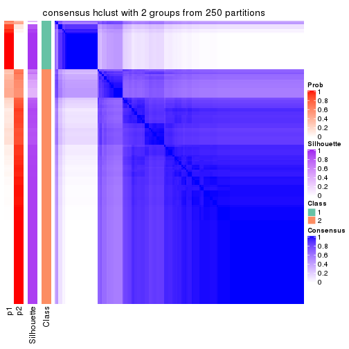</p>

</div>
<div id='tab-ATC-hclust-consensus-heatmap-2'>
<pre><code class="r">consensus_heatmap(res, k = 3)
</code></pre>

<p>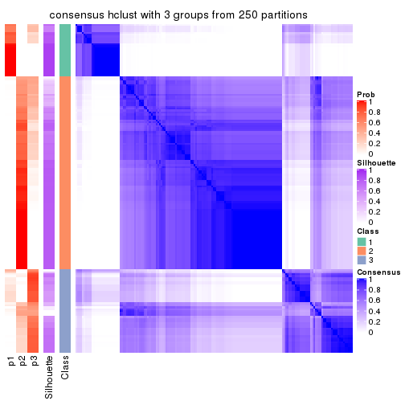</p>

</div>
<div id='tab-ATC-hclust-consensus-heatmap-3'>
<pre><code class="r">consensus_heatmap(res, k = 4)
</code></pre>

<p>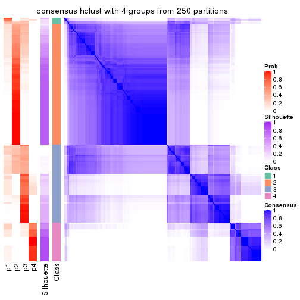</p>

</div>
<div id='tab-ATC-hclust-consensus-heatmap-4'>
<pre><code class="r">consensus_heatmap(res, k = 5)
</code></pre>

<p>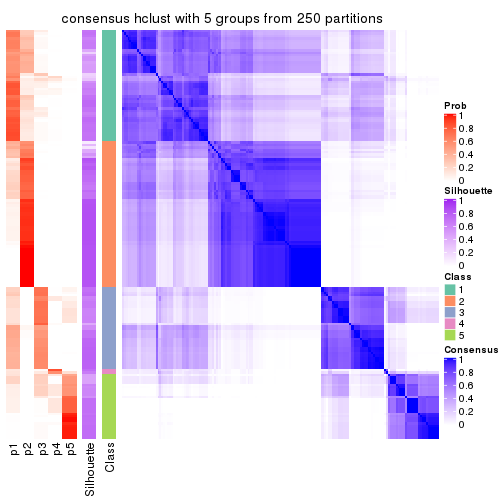</p>

</div>
<div id='tab-ATC-hclust-consensus-heatmap-5'>
<pre><code class="r">consensus_heatmap(res, k = 6)
</code></pre>

<p>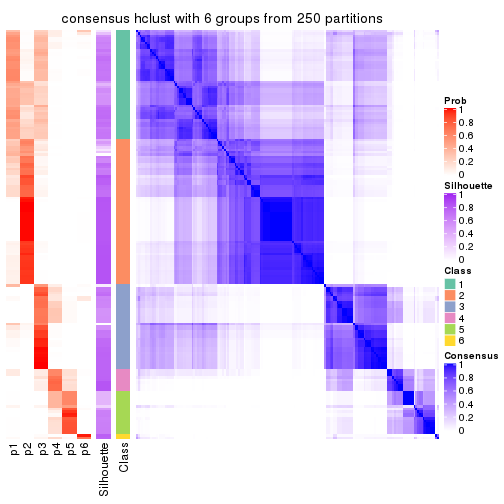</p>

</div>
</div>

Heatmaps for the membership of samples in all partitions to see how consistent they are:


<script>
$( function() {
	$( '#tabs-ATC-hclust-membership-heatmap' ).tabs();
} );
</script>
<div id='tabs-ATC-hclust-membership-heatmap'>
<ul>
<li><a href='#tab-ATC-hclust-membership-heatmap-1'>k = 2</a></li>
<li><a href='#tab-ATC-hclust-membership-heatmap-2'>k = 3</a></li>
<li><a href='#tab-ATC-hclust-membership-heatmap-3'>k = 4</a></li>
<li><a href='#tab-ATC-hclust-membership-heatmap-4'>k = 5</a></li>
<li><a href='#tab-ATC-hclust-membership-heatmap-5'>k = 6</a></li>
</ul>
<div id='tab-ATC-hclust-membership-heatmap-1'>
<pre><code class="r">membership_heatmap(res, k = 2)
</code></pre>

<p>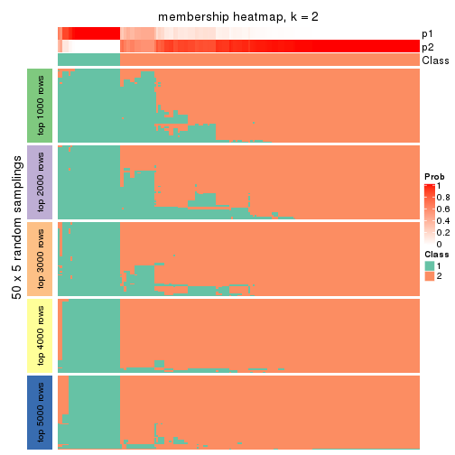</p>

</div>
<div id='tab-ATC-hclust-membership-heatmap-2'>
<pre><code class="r">membership_heatmap(res, k = 3)
</code></pre>

<p>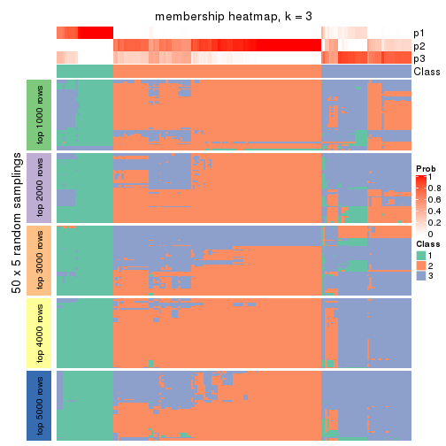</p>

</div>
<div id='tab-ATC-hclust-membership-heatmap-3'>
<pre><code class="r">membership_heatmap(res, k = 4)
</code></pre>

<p>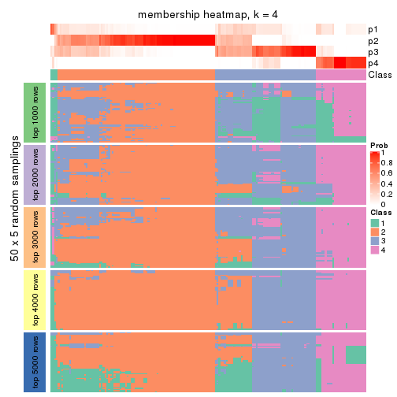</p>

</div>
<div id='tab-ATC-hclust-membership-heatmap-4'>
<pre><code class="r">membership_heatmap(res, k = 5)
</code></pre>

<p>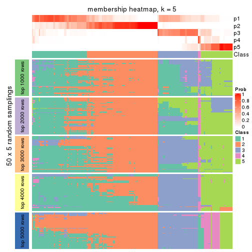</p>

</div>
<div id='tab-ATC-hclust-membership-heatmap-5'>
<pre><code class="r">membership_heatmap(res, k = 6)
</code></pre>

<p>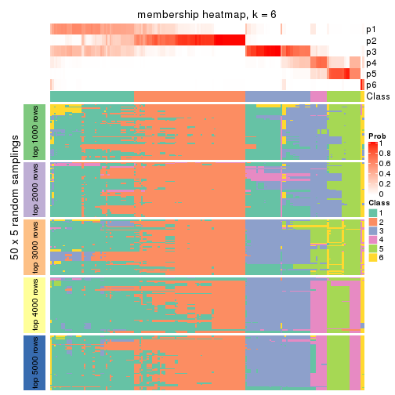</p>

</div>
</div>

As soon as we have had the classes for columns, we can look for signatures
which are significantly different between classes which can be candidate marks
for certain classes. Following are the heatmaps for signatures.


Signature heatmaps where rows are scaled:


<script>
$( function() {
	$( '#tabs-ATC-hclust-get-signatures' ).tabs();
} );
</script>
<div id='tabs-ATC-hclust-get-signatures'>
<ul>
<li><a href='#tab-ATC-hclust-get-signatures-1'>k = 2</a></li>
<li><a href='#tab-ATC-hclust-get-signatures-2'>k = 3</a></li>
<li><a href='#tab-ATC-hclust-get-signatures-3'>k = 4</a></li>
<li><a href='#tab-ATC-hclust-get-signatures-4'>k = 5</a></li>
<li><a href='#tab-ATC-hclust-get-signatures-5'>k = 6</a></li>
</ul>
<div id='tab-ATC-hclust-get-signatures-1'>
<pre><code class="r">get_signatures(res, k = 2)
</code></pre>

<p>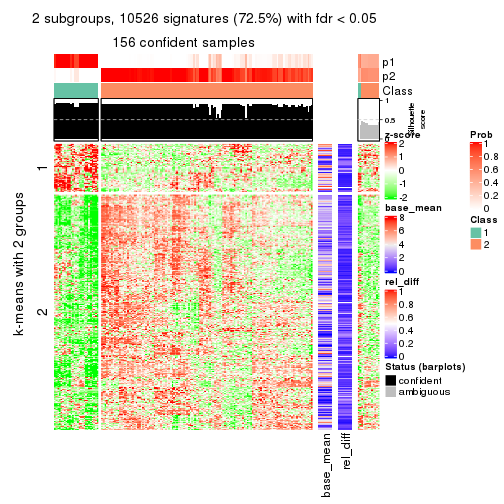</p>

</div>
<div id='tab-ATC-hclust-get-signatures-2'>
<pre><code class="r">get_signatures(res, k = 3)
</code></pre>

<p>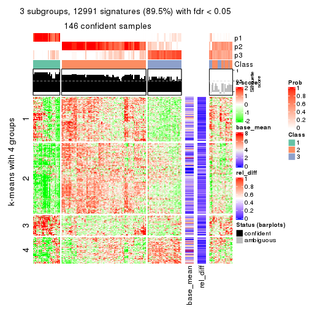</p>

</div>
<div id='tab-ATC-hclust-get-signatures-3'>
<pre><code class="r">get_signatures(res, k = 4)
</code></pre>

<p>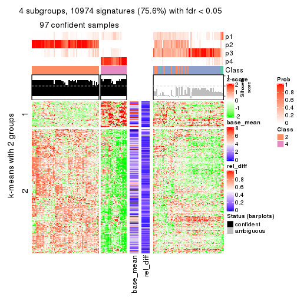</p>

</div>
<div id='tab-ATC-hclust-get-signatures-4'>
<pre><code class="r">get_signatures(res, k = 5)
</code></pre>

<p>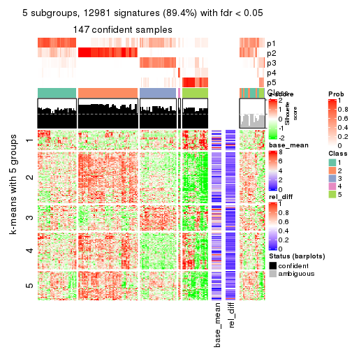</p>

</div>
<div id='tab-ATC-hclust-get-signatures-5'>
<pre><code class="r">get_signatures(res, k = 6)
</code></pre>

<p>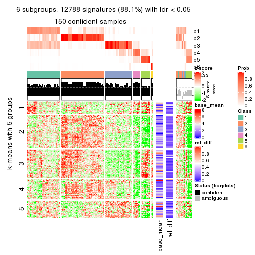</p>

</div>
</div>


Signature heatmaps where rows are not scaled:


<script>
$( function() {
	$( '#tabs-ATC-hclust-get-signatures-no-scale' ).tabs();
} );
</script>
<div id='tabs-ATC-hclust-get-signatures-no-scale'>
<ul>
<li><a href='#tab-ATC-hclust-get-signatures-no-scale-1'>k = 2</a></li>
<li><a href='#tab-ATC-hclust-get-signatures-no-scale-2'>k = 3</a></li>
<li><a href='#tab-ATC-hclust-get-signatures-no-scale-3'>k = 4</a></li>
<li><a href='#tab-ATC-hclust-get-signatures-no-scale-4'>k = 5</a></li>
<li><a href='#tab-ATC-hclust-get-signatures-no-scale-5'>k = 6</a></li>
</ul>
<div id='tab-ATC-hclust-get-signatures-no-scale-1'>
<pre><code class="r">get_signatures(res, k = 2, scale_rows = FALSE)
</code></pre>

<p>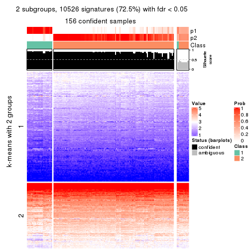</p>

</div>
<div id='tab-ATC-hclust-get-signatures-no-scale-2'>
<pre><code class="r">get_signatures(res, k = 3, scale_rows = FALSE)
</code></pre>

<p>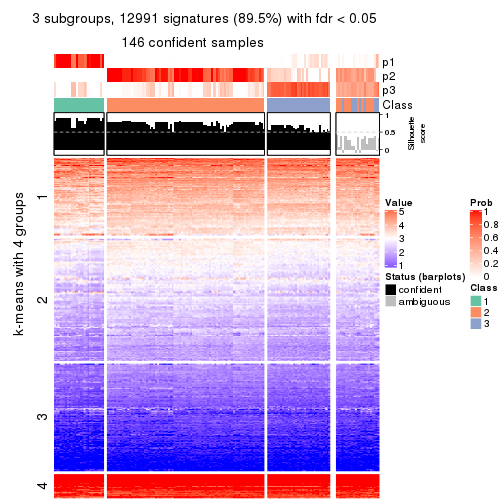</p>

</div>
<div id='tab-ATC-hclust-get-signatures-no-scale-3'>
<pre><code class="r">get_signatures(res, k = 4, scale_rows = FALSE)
</code></pre>

<p>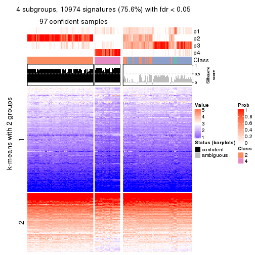</p>

</div>
<div id='tab-ATC-hclust-get-signatures-no-scale-4'>
<pre><code class="r">get_signatures(res, k = 5, scale_rows = FALSE)
</code></pre>

<p>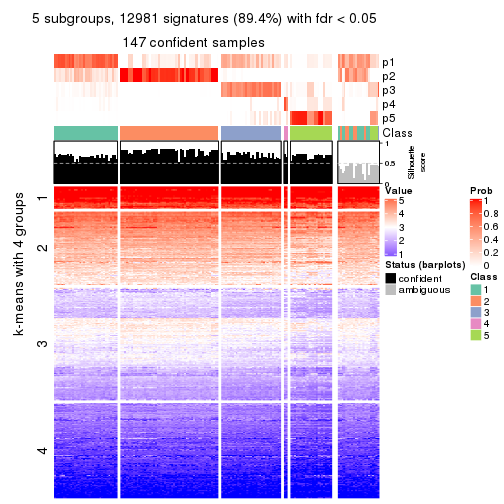</p>

</div>
<div id='tab-ATC-hclust-get-signatures-no-scale-5'>
<pre><code class="r">get_signatures(res, k = 6, scale_rows = FALSE)
</code></pre>

<p>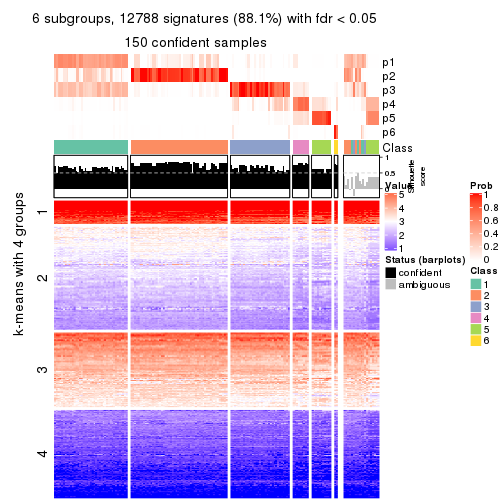</p>

</div>
</div>


Compare the overlap of signatures from different k:

```r
compare_signatures(res)
```

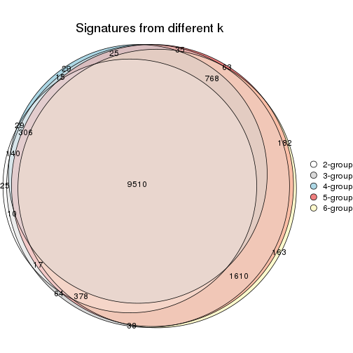

`get_signature()` returns a data frame invisibly. TO get the list of signatures, the function
call should be assigned to a variable explicitly. In following code, if `plot` argument is set
to `FALSE`, no heatmap is plotted while only the differential analysis is performed.

```r
# code only for demonstration
tb = get_signature(res, k = ..., plot = FALSE)
```

An example of the output of `tb` is:

```
#>   which_row         fdr    mean_1    mean_2 scaled_mean_1 scaled_mean_2 km
#> 1        38 0.042760348  8.373488  9.131774    -0.5533452     0.5164555  1
#> 2        40 0.018707592  7.106213  8.469186    -0.6173731     0.5762149  1
#> 3        55 0.019134737 10.221463 11.207825    -0.6159697     0.5749050  1
#> 4        59 0.006059896  5.921854  7.869574    -0.6899429     0.6439467  1
#> 5        60 0.018055526  8.928898 10.211722    -0.6204761     0.5791110  1
#> 6        98 0.009384629 15.714769 14.887706     0.6635654    -0.6193277  2
...
```

The columns in `tb` are:

1. `which_row`: row indices corresponding to the input matrix.
2. `fdr`: FDR for the differential test. 
3. `mean_x`: The mean value in group x.
4. `scaled_mean_x`: The mean value in group x after rows are scaled.
5. `km`: Row groups if k-means clustering is applied to rows.


UMAP plot which shows how samples are separated.


<script>
$( function() {
	$( '#tabs-ATC-hclust-dimension-reduction' ).tabs();
} );
</script>
<div id='tabs-ATC-hclust-dimension-reduction'>
<ul>
<li><a href='#tab-ATC-hclust-dimension-reduction-1'>k = 2</a></li>
<li><a href='#tab-ATC-hclust-dimension-reduction-2'>k = 3</a></li>
<li><a href='#tab-ATC-hclust-dimension-reduction-3'>k = 4</a></li>
<li><a href='#tab-ATC-hclust-dimension-reduction-4'>k = 5</a></li>
<li><a href='#tab-ATC-hclust-dimension-reduction-5'>k = 6</a></li>
</ul>
<div id='tab-ATC-hclust-dimension-reduction-1'>
<pre><code class="r">dimension_reduction(res, k = 2, method = &quot;UMAP&quot;)
</code></pre>

<p>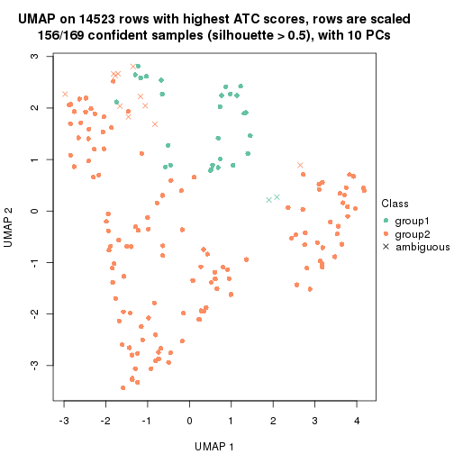</p>

</div>
<div id='tab-ATC-hclust-dimension-reduction-2'>
<pre><code class="r">dimension_reduction(res, k = 3, method = &quot;UMAP&quot;)
</code></pre>

<p>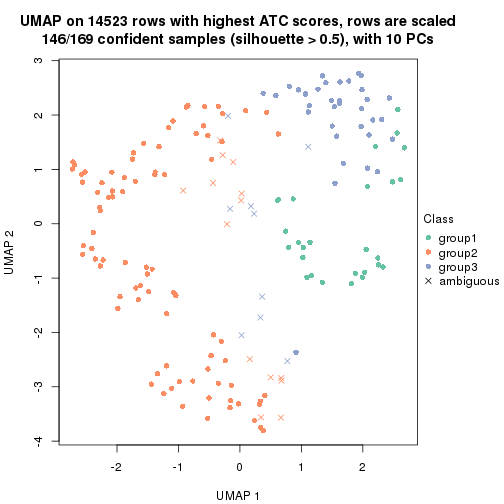</p>

</div>
<div id='tab-ATC-hclust-dimension-reduction-3'>
<pre><code class="r">dimension_reduction(res, k = 4, method = &quot;UMAP&quot;)
</code></pre>

<p>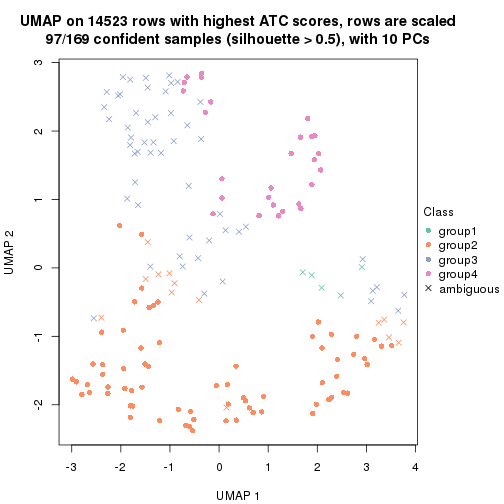</p>

</div>
<div id='tab-ATC-hclust-dimension-reduction-4'>
<pre><code class="r">dimension_reduction(res, k = 5, method = &quot;UMAP&quot;)
</code></pre>

<p>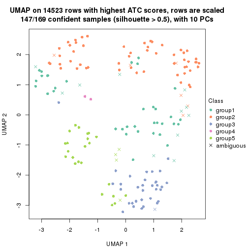</p>

</div>
<div id='tab-ATC-hclust-dimension-reduction-5'>
<pre><code class="r">dimension_reduction(res, k = 6, method = &quot;UMAP&quot;)
</code></pre>

<p>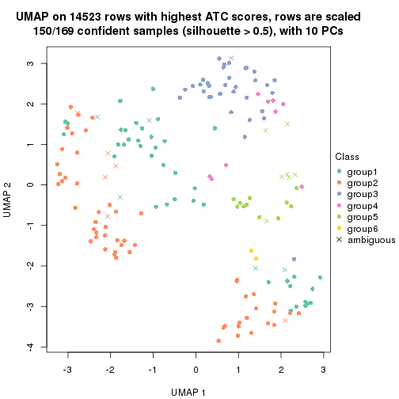</p>

</div>
</div>


Following heatmap shows how subgroups are split when increasing `k`:

```r
collect_classes(res)
```

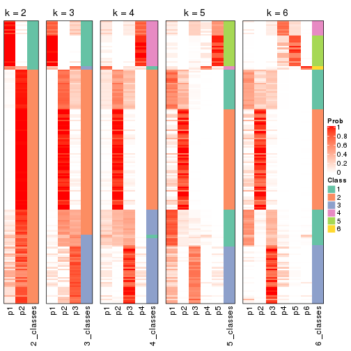


If matrix rows can be associated to genes, consider to use `GO_Enrichment(res,
...)` to perform function enrichment for the signature genes.


 

---------------------------------------------------


### ATC:kmeans*


The object with results only for a single top-value method and a single partition method 
can be extracted as:

```r
res = res_list["ATC", "kmeans"]
# you can also extract it by
# res = res_list["ATC:kmeans"]
```

A summary of `res` and all the functions that can be applied to it:

```r
res
```

```
#> A 'ConsensusPartition' object with k = 2, 3, 4, 5, 6.
#>   On a matrix with 14523 rows and 169 columns.
#>   Top rows (1000, 2000, 3000, 4000, 5000) are extracted by 'ATC' method.
#>   Subgroups are detected by 'kmeans' method.
#>   Performed in total 1250 partitions by row resampling.
#>   Best k for subgroups seems to be 3.
#> 
#> Following methods can be applied to this 'ConsensusPartition' object:
#>  [1] "cola_report"             "collect_classes"         "collect_plots"          
#>  [4] "collect_stats"           "colnames"                "compare_signatures"     
#>  [7] "consensus_heatmap"       "dimension_reduction"     "functional_enrichment"  
#> [10] "get_anno_col"            "get_anno"                "get_classes"            
#> [13] "get_consensus"           "get_matrix"              "get_membership"         
#> [16] "get_param"               "get_signatures"          "get_stats"              
#> [19] "is_best_k"               "is_stable_k"             "membership_heatmap"     
#> [22] "ncol"                    "nrow"                    "plot_ecdf"              
#> [25] "rownames"                "select_partition_number" "show"                   
#> [28] "suggest_best_k"          "test_to_known_factors"
```

`collect_plots()` function collects all the plots made from `res` for all `k` (number of partitions)
into one single page to provide an easy and fast comparison between different `k`.

```r
collect_plots(res)
```

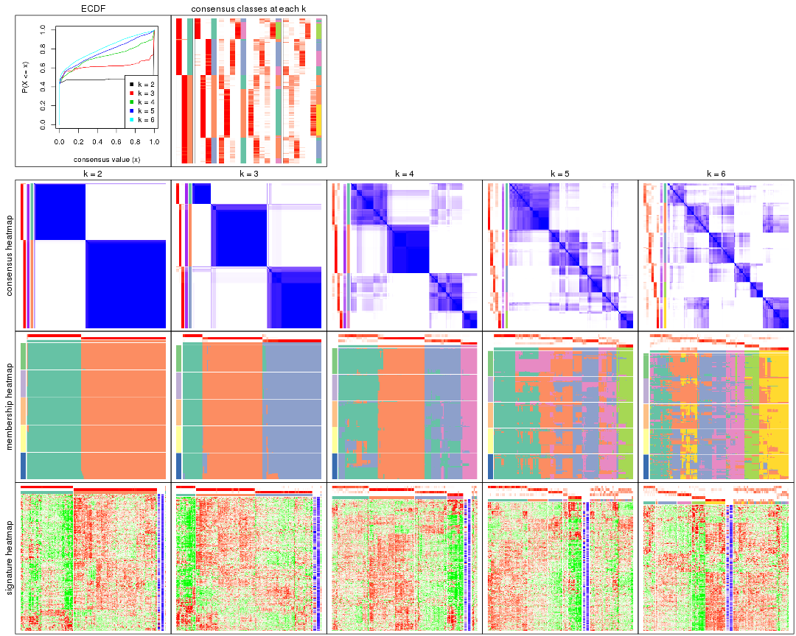

The plots are:

- The first row: a plot of the ECDF (Empirical cumulative distribution
  function) curves of the consensus matrix for each `k` and the heatmap of
  predicted classes for each `k`.
- The second row: heatmaps of the consensus matrix for each `k`.
- The third row: heatmaps of the membership matrix for each `k`.
- The fouth row: heatmaps of the signatures for each `k`.

All the plots in panels can be made by individual functions and they are
plotted later in this section.

`select_partition_number()` produces several plots showing different
statistics for choosing "optimized" `k`. There are following statistics:

- ECDF curves of the consensus matrix for each `k`;
- 1-PAC. [The PAC
  score](https://en.wikipedia.org/wiki/Consensus_clustering#Over-interpretation_potential_of_consensus_clustering)
  measures the proportion of the ambiguous subgrouping.
- Mean silhouette score.
- Concordance. The mean probability of fiting the consensus class ids in all
  partitions.
- Area increased. Denote $A_k$ as the area under the ECDF curve for current
  `k`, the area increased is defined as $A_k - A_{k-1}$.
- Rand index. The percent of pairs of samples that are both in a same cluster
  or both are not in a same cluster in the partition of k and k-1.
- Jaccard index. The ratio of pairs of samples are both in a same cluster in
  the partition of k and k-1 and the pairs of samples are both in a same
  cluster in the partition k or k-1.

The detailed explanations of these statistics can be found in [the cola
vignette](http://bioconductor.org/packages/devel/bioc/vignettes/cola/inst/doc/cola.html#toc_13).

Generally speaking, lower PAC score, higher mean silhouette score or higher
concordance corresponds to better partition. Rand index and Jaccard index
measure how similar the current partition is compared to partition with `k-1`.
If they are too similar, we won't accept `k` is better than `k-1`.

```r
select_partition_number(res)
```

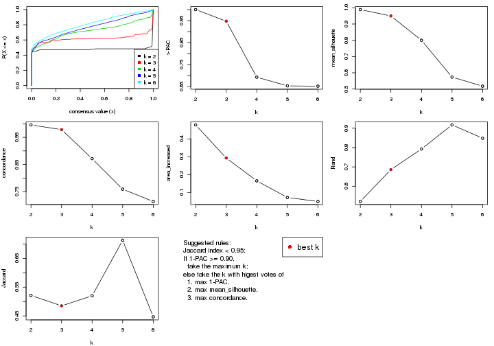

The numeric values for all these statistics can be obtained by `get_stats()`.

```r
get_stats(res)
```

```
#>   k 1-PAC mean_silhouette concordance area_increased  Rand Jaccard
#> 2 2 1.000           0.989       0.996         0.4783 0.521   0.521
#> 3 3 0.947           0.950       0.978         0.2930 0.686   0.485
#> 4 4 0.693           0.800       0.872         0.1648 0.793   0.520
#> 5 5 0.653           0.573       0.759         0.0717 0.917   0.713
#> 6 6 0.652           0.518       0.714         0.0491 0.848   0.447
```

`suggest_best_k()` suggests the best $k$ based on these statistics. The rules are as follows:

- All $k$ with Jaccard index larger than 0.95 are removed because the increase of
  the partition number does not provides enough extra information. If all $k$ are removed,
  the best $k$ is assigned by `NA`.
- For $k$ with 1-PAC larger than 0.9, the maximal $k$ is taken as the "best k". Other $k$ is called "optional k".
- If it does not fit the second rule. The $k$ with the highest vote of highest
  1-PAC, mean silhouette and concordance is taken as the "best k".

```r
suggest_best_k(res)
```

```
#> [1] 3
#> attr(,"optional")
#> [1] 2
```

There is also optional best $k$ = 2 that is worth to check.

Following shows the table of the partitions (You need to click the **show/hide
code output** link to see it). The membership matrix (columns with name `p*`)
is inferred by
[`clue::cl_consensus()`](https://www.rdocumentation.org/link/cl_consensus?package=clue)
function with the `SE` method. Basically the value in the membership matrix
represents the probability to belong to a certain group. The finall class
label for an item is determined with the group with highest probability it
belongs to.

In `get_classes()` function, the entropy is calculated from the membership
matrix and the silhouette score is calculated from the consensus matrix.


<script>
$( function() {
	$( '#tabs-ATC-kmeans-get-classes' ).tabs();
} );
</script>
<div id='tabs-ATC-kmeans-get-classes'>
<ul>
<li><a href='#tab-ATC-kmeans-get-classes-1'>k = 2</a></li>
<li><a href='#tab-ATC-kmeans-get-classes-2'>k = 3</a></li>
<li><a href='#tab-ATC-kmeans-get-classes-3'>k = 4</a></li>
<li><a href='#tab-ATC-kmeans-get-classes-4'>k = 5</a></li>
<li><a href='#tab-ATC-kmeans-get-classes-5'>k = 6</a></li>
</ul>

<div id='tab-ATC-kmeans-get-classes-1'>
<p><a id='tab-ATC-kmeans-get-classes-1-a' style='color:#0366d6' href='#'>show/hide code output</a></p>
<pre><code class="r">cbind(get_classes(res, k = 2), get_membership(res, k = 2))
</code></pre>

<pre><code>#&gt;            class entropy silhouette    p1    p2
#&gt; SRR2052702     2  0.0000      0.998 0.000 1.000
#&gt; SRR2052701     2  0.0000      0.998 0.000 1.000
#&gt; SRR2052700     2  0.0672      0.991 0.008 0.992
#&gt; SRR2052699     2  0.0000      0.998 0.000 1.000
#&gt; SRR2052698     2  0.0000      0.998 0.000 1.000
#&gt; SRR2052708     1  0.0000      0.992 1.000 0.000
#&gt; SRR2052749     2  0.0000      0.998 0.000 1.000
#&gt; SRR2052786     2  0.0000      0.998 0.000 1.000
#&gt; SRR2052825     1  0.0000      0.992 1.000 0.000
#&gt; SRR2052824     1  0.0000      0.992 1.000 0.000
#&gt; SRR2052823     2  0.0000      0.998 0.000 1.000
#&gt; SRR2052822     2  0.0000      0.998 0.000 1.000
#&gt; SRR2052821     2  0.0000      0.998 0.000 1.000
#&gt; SRR2052820     1  0.0000      0.992 1.000 0.000
#&gt; SRR2052819     1  0.0000      0.992 1.000 0.000
#&gt; SRR2052818     2  0.0000      0.998 0.000 1.000
#&gt; SRR2052817     2  0.0000      0.998 0.000 1.000
#&gt; SRR2052816     2  0.0000      0.998 0.000 1.000
#&gt; SRR2052815     1  0.0000      0.992 1.000 0.000
#&gt; SRR2052814     1  0.0000      0.992 1.000 0.000
#&gt; SRR2052813     2  0.0000      0.998 0.000 1.000
#&gt; SRR2052812     2  0.0000      0.998 0.000 1.000
#&gt; SRR2052811     2  0.0000      0.998 0.000 1.000
#&gt; SRR2052810     1  0.0000      0.992 1.000 0.000
#&gt; SRR2052809     2  0.0000      0.998 0.000 1.000
#&gt; SRR2052808     2  0.0000      0.998 0.000 1.000
#&gt; SRR2052807     1  0.0000      0.992 1.000 0.000
#&gt; SRR2052806     2  0.0000      0.998 0.000 1.000
#&gt; SRR2052805     1  0.0000      0.992 1.000 0.000
#&gt; SRR2052804     1  0.0000      0.992 1.000 0.000
#&gt; SRR2052803     2  0.0000      0.998 0.000 1.000
#&gt; SRR2052802     1  0.0000      0.992 1.000 0.000
#&gt; SRR2052801     1  0.0000      0.992 1.000 0.000
#&gt; SRR2052800     1  0.0000      0.992 1.000 0.000
#&gt; SRR2052799     1  0.0000      0.992 1.000 0.000
#&gt; SRR2052798     2  0.0000      0.998 0.000 1.000
#&gt; SRR2052797     2  0.0000      0.998 0.000 1.000
#&gt; SRR2052796     1  0.0000      0.992 1.000 0.000
#&gt; SRR2052795     1  0.0000      0.992 1.000 0.000
#&gt; SRR2052794     1  0.0000      0.992 1.000 0.000
#&gt; SRR2052793     1  0.0000      0.992 1.000 0.000
#&gt; SRR2052792     1  0.0000      0.992 1.000 0.000
#&gt; SRR2052791     1  0.0000      0.992 1.000 0.000
#&gt; SRR2052790     2  0.0000      0.998 0.000 1.000
#&gt; SRR2052789     1  0.9993      0.058 0.516 0.484
#&gt; SRR2052788     1  0.0000      0.992 1.000 0.000
#&gt; SRR2052787     2  0.0000      0.998 0.000 1.000
#&gt; SRR2052785     1  0.3114      0.934 0.944 0.056
#&gt; SRR2052784     2  0.0000      0.998 0.000 1.000
#&gt; SRR2052783     2  0.0000      0.998 0.000 1.000
#&gt; SRR2052782     2  0.0000      0.998 0.000 1.000
#&gt; SRR2052781     2  0.0000      0.998 0.000 1.000
#&gt; SRR2052780     2  0.2603      0.954 0.044 0.956
#&gt; SRR2052777     2  0.0000      0.998 0.000 1.000
#&gt; SRR2052779     2  0.0000      0.998 0.000 1.000
#&gt; SRR2052778     1  0.0000      0.992 1.000 0.000
#&gt; SRR2052776     2  0.0000      0.998 0.000 1.000
#&gt; SRR2052775     1  0.0000      0.992 1.000 0.000
#&gt; SRR2052773     2  0.0000      0.998 0.000 1.000
#&gt; SRR2052772     1  0.0000      0.992 1.000 0.000
#&gt; SRR2052774     2  0.0000      0.998 0.000 1.000
#&gt; SRR2052771     1  0.0000      0.992 1.000 0.000
#&gt; SRR2052769     1  0.0000      0.992 1.000 0.000
#&gt; SRR2052770     1  0.0000      0.992 1.000 0.000
#&gt; SRR2052768     2  0.0000      0.998 0.000 1.000
#&gt; SRR2052767     2  0.0000      0.998 0.000 1.000
#&gt; SRR2052766     1  0.0000      0.992 1.000 0.000
#&gt; SRR2052765     2  0.0000      0.998 0.000 1.000
#&gt; SRR2052763     1  0.0000      0.992 1.000 0.000
#&gt; SRR2052764     2  0.0000      0.998 0.000 1.000
#&gt; SRR2052761     2  0.3584      0.928 0.068 0.932
#&gt; SRR2052760     2  0.0000      0.998 0.000 1.000
#&gt; SRR2052759     1  0.0000      0.992 1.000 0.000
#&gt; SRR2052762     2  0.0000      0.998 0.000 1.000
#&gt; SRR2052758     1  0.0000      0.992 1.000 0.000
#&gt; SRR2052756     1  0.0376      0.988 0.996 0.004
#&gt; SRR2052757     2  0.0000      0.998 0.000 1.000
#&gt; SRR2052755     2  0.0000      0.998 0.000 1.000
#&gt; SRR2052754     1  0.0000      0.992 1.000 0.000
#&gt; SRR2052753     2  0.0000      0.998 0.000 1.000
#&gt; SRR2052752     1  0.0000      0.992 1.000 0.000
#&gt; SRR2052750     2  0.0000      0.998 0.000 1.000
#&gt; SRR2052751     2  0.0000      0.998 0.000 1.000
#&gt; SRR2052748     1  0.0000      0.992 1.000 0.000
#&gt; SRR2052747     2  0.0000      0.998 0.000 1.000
#&gt; SRR2052746     1  0.0000      0.992 1.000 0.000
#&gt; SRR2052745     1  0.0000      0.992 1.000 0.000
#&gt; SRR2052744     2  0.0000      0.998 0.000 1.000
#&gt; SRR2052741     2  0.0000      0.998 0.000 1.000
#&gt; SRR2052743     2  0.0000      0.998 0.000 1.000
#&gt; SRR2052740     2  0.0000      0.998 0.000 1.000
#&gt; SRR2052742     2  0.0000      0.998 0.000 1.000
#&gt; SRR2052739     2  0.0000      0.998 0.000 1.000
#&gt; SRR2052738     1  0.0000      0.992 1.000 0.000
#&gt; SRR2052736     2  0.0000      0.998 0.000 1.000
#&gt; SRR2052735     2  0.0000      0.998 0.000 1.000
#&gt; SRR2052734     2  0.0000      0.998 0.000 1.000
#&gt; SRR2052737     2  0.0000      0.998 0.000 1.000
#&gt; SRR2052733     1  0.0000      0.992 1.000 0.000
#&gt; SRR2052732     2  0.0000      0.998 0.000 1.000
#&gt; SRR2052731     1  0.0000      0.992 1.000 0.000
#&gt; SRR2052729     2  0.0000      0.998 0.000 1.000
#&gt; SRR2052728     2  0.0000      0.998 0.000 1.000
#&gt; SRR2052730     1  0.0000      0.992 1.000 0.000
#&gt; SRR2052727     2  0.0000      0.998 0.000 1.000
#&gt; SRR2052725     2  0.0000      0.998 0.000 1.000
#&gt; SRR2052726     2  0.0000      0.998 0.000 1.000
#&gt; SRR2052724     1  0.0000      0.992 1.000 0.000
#&gt; SRR2052723     1  0.0000      0.992 1.000 0.000
#&gt; SRR2052722     1  0.0000      0.992 1.000 0.000
#&gt; SRR2052721     2  0.0000      0.998 0.000 1.000
#&gt; SRR2052720     2  0.0000      0.998 0.000 1.000
#&gt; SRR2052719     2  0.0000      0.998 0.000 1.000
#&gt; SRR2052718     2  0.0000      0.998 0.000 1.000
#&gt; SRR2052717     2  0.0000      0.998 0.000 1.000
#&gt; SRR2052714     1  0.0000      0.992 1.000 0.000
#&gt; SRR2052716     1  0.0000      0.992 1.000 0.000
#&gt; SRR2052715     1  0.0000      0.992 1.000 0.000
#&gt; SRR2052713     2  0.0000      0.998 0.000 1.000
#&gt; SRR2052712     1  0.0000      0.992 1.000 0.000
#&gt; SRR2052711     1  0.0000      0.992 1.000 0.000
#&gt; SRR2052710     2  0.0000      0.998 0.000 1.000
#&gt; SRR2052707     1  0.0000      0.992 1.000 0.000
#&gt; SRR2052709     1  0.0000      0.992 1.000 0.000
#&gt; SRR2052704     1  0.0000      0.992 1.000 0.000
#&gt; SRR2052705     2  0.0000      0.998 0.000 1.000
#&gt; SRR2052697     2  0.0000      0.998 0.000 1.000
#&gt; SRR2052703     2  0.2236      0.963 0.036 0.964
#&gt; SRR2052696     2  0.0000      0.998 0.000 1.000
#&gt; SRR2052706     2  0.0000      0.998 0.000 1.000
#&gt; SRR2052695     2  0.0000      0.998 0.000 1.000
#&gt; SRR2052694     2  0.0000      0.998 0.000 1.000
#&gt; SRR2052692     1  0.0000      0.992 1.000 0.000
#&gt; SRR2052693     2  0.0938      0.987 0.012 0.988
#&gt; SRR2052691     2  0.0000      0.998 0.000 1.000
#&gt; SRR2052690     2  0.0000      0.998 0.000 1.000
#&gt; SRR2052689     1  0.0000      0.992 1.000 0.000
#&gt; SRR2052687     1  0.0000      0.992 1.000 0.000
#&gt; SRR2052686     2  0.0000      0.998 0.000 1.000
#&gt; SRR2052688     2  0.0000      0.998 0.000 1.000
#&gt; SRR2052684     1  0.0000      0.992 1.000 0.000
#&gt; SRR2052685     2  0.0000      0.998 0.000 1.000
#&gt; SRR2052683     1  0.0000      0.992 1.000 0.000
#&gt; SRR2052681     1  0.0000      0.992 1.000 0.000
#&gt; SRR2052680     1  0.0000      0.992 1.000 0.000
#&gt; SRR2052682     2  0.0000      0.998 0.000 1.000
#&gt; SRR2052679     2  0.0000      0.998 0.000 1.000
#&gt; SRR2052678     1  0.0000      0.992 1.000 0.000
#&gt; SRR2052677     2  0.0000      0.998 0.000 1.000
#&gt; SRR2052675     2  0.0000      0.998 0.000 1.000
#&gt; SRR2052676     2  0.0000      0.998 0.000 1.000
#&gt; SRR2052674     2  0.0000      0.998 0.000 1.000
#&gt; SRR2052672     1  0.0000      0.992 1.000 0.000
#&gt; SRR2052673     2  0.0000      0.998 0.000 1.000
#&gt; SRR2052671     2  0.0000      0.998 0.000 1.000
#&gt; SRR2052670     2  0.0000      0.998 0.000 1.000
#&gt; SRR2052669     2  0.0000      0.998 0.000 1.000
#&gt; SRR2052668     2  0.0000      0.998 0.000 1.000
#&gt; SRR2052667     2  0.0000      0.998 0.000 1.000
#&gt; SRR2052666     2  0.0000      0.998 0.000 1.000
#&gt; SRR2052665     2  0.0000      0.998 0.000 1.000
#&gt; SRR2052664     1  0.0000      0.992 1.000 0.000
#&gt; SRR2052663     2  0.0000      0.998 0.000 1.000
#&gt; SRR2052662     2  0.0000      0.998 0.000 1.000
#&gt; SRR2052661     2  0.0000      0.998 0.000 1.000
#&gt; SRR2052660     2  0.0000      0.998 0.000 1.000
#&gt; SRR2052659     1  0.0000      0.992 1.000 0.000
#&gt; SRR2052658     2  0.0000      0.998 0.000 1.000
#&gt; SRR2052657     2  0.0000      0.998 0.000 1.000
</code></pre>

<script>
$('#tab-ATC-kmeans-get-classes-1-a').parent().next().next().hide();
$('#tab-ATC-kmeans-get-classes-1-a').click(function(){
  $('#tab-ATC-kmeans-get-classes-1-a').parent().next().next().toggle();
  return(false);
});
</script>
</div>

<div id='tab-ATC-kmeans-get-classes-2'>
<p><a id='tab-ATC-kmeans-get-classes-2-a' style='color:#0366d6' href='#'>show/hide code output</a></p>
<pre><code class="r">cbind(get_classes(res, k = 3), get_membership(res, k = 3))
</code></pre>

<pre><code>#&gt;            class entropy silhouette    p1    p2    p3
#&gt; SRR2052702     2  0.0000     0.9795 0.000 1.000 0.000
#&gt; SRR2052701     2  0.0000     0.9795 0.000 1.000 0.000
#&gt; SRR2052700     3  0.1529     0.9354 0.000 0.040 0.960
#&gt; SRR2052699     2  0.0592     0.9680 0.000 0.988 0.012
#&gt; SRR2052698     3  0.0000     0.9638 0.000 0.000 1.000
#&gt; SRR2052708     3  0.0000     0.9638 0.000 0.000 1.000
#&gt; SRR2052749     3  0.5138     0.6566 0.000 0.252 0.748
#&gt; SRR2052786     2  0.0000     0.9795 0.000 1.000 0.000
#&gt; SRR2052825     1  0.0000     0.9939 1.000 0.000 0.000
#&gt; SRR2052824     1  0.0000     0.9939 1.000 0.000 0.000
#&gt; SRR2052823     2  0.0000     0.9795 0.000 1.000 0.000
#&gt; SRR2052822     3  0.1529     0.9354 0.000 0.040 0.960
#&gt; SRR2052821     2  0.0000     0.9795 0.000 1.000 0.000
#&gt; SRR2052820     3  0.0000     0.9638 0.000 0.000 1.000
#&gt; SRR2052819     1  0.0000     0.9939 1.000 0.000 0.000
#&gt; SRR2052818     2  0.0000     0.9795 0.000 1.000 0.000
#&gt; SRR2052817     3  0.0000     0.9638 0.000 0.000 1.000
#&gt; SRR2052816     3  0.1411     0.9385 0.000 0.036 0.964
#&gt; SRR2052815     1  0.0000     0.9939 1.000 0.000 0.000
#&gt; SRR2052814     3  0.0000     0.9638 0.000 0.000 1.000
#&gt; SRR2052813     2  0.0000     0.9795 0.000 1.000 0.000
#&gt; SRR2052812     2  0.0000     0.9795 0.000 1.000 0.000
#&gt; SRR2052811     2  0.0000     0.9795 0.000 1.000 0.000
#&gt; SRR2052810     3  0.0000     0.9638 0.000 0.000 1.000
#&gt; SRR2052809     3  0.1643     0.9319 0.000 0.044 0.956
#&gt; SRR2052808     3  0.1529     0.9354 0.000 0.040 0.960
#&gt; SRR2052807     1  0.0000     0.9939 1.000 0.000 0.000
#&gt; SRR2052806     2  0.0237     0.9758 0.000 0.996 0.004
#&gt; SRR2052805     3  0.0000     0.9638 0.000 0.000 1.000
#&gt; SRR2052804     1  0.0000     0.9939 1.000 0.000 0.000
#&gt; SRR2052803     3  0.1753     0.9283 0.000 0.048 0.952
#&gt; SRR2052802     1  0.0000     0.9939 1.000 0.000 0.000
#&gt; SRR2052801     1  0.0000     0.9939 1.000 0.000 0.000
#&gt; SRR2052800     1  0.0000     0.9939 1.000 0.000 0.000
#&gt; SRR2052799     1  0.0000     0.9939 1.000 0.000 0.000
#&gt; SRR2052798     3  0.1860     0.9242 0.000 0.052 0.948
#&gt; SRR2052797     2  0.0747     0.9639 0.000 0.984 0.016
#&gt; SRR2052796     1  0.0000     0.9939 1.000 0.000 0.000
#&gt; SRR2052795     3  0.0000     0.9638 0.000 0.000 1.000
#&gt; SRR2052794     1  0.0000     0.9939 1.000 0.000 0.000
#&gt; SRR2052793     1  0.0000     0.9939 1.000 0.000 0.000
#&gt; SRR2052792     1  0.0000     0.9939 1.000 0.000 0.000
#&gt; SRR2052791     3  0.0000     0.9638 0.000 0.000 1.000
#&gt; SRR2052790     3  0.0000     0.9638 0.000 0.000 1.000
#&gt; SRR2052789     3  0.0000     0.9638 0.000 0.000 1.000
#&gt; SRR2052788     3  0.0000     0.9638 0.000 0.000 1.000
#&gt; SRR2052787     2  0.0000     0.9795 0.000 1.000 0.000
#&gt; SRR2052785     3  0.0000     0.9638 0.000 0.000 1.000
#&gt; SRR2052784     3  0.0892     0.9502 0.000 0.020 0.980
#&gt; SRR2052783     3  0.1753     0.9283 0.000 0.048 0.952
#&gt; SRR2052782     2  0.2959     0.8711 0.000 0.900 0.100
#&gt; SRR2052781     3  0.0000     0.9638 0.000 0.000 1.000
#&gt; SRR2052780     3  0.0000     0.9638 0.000 0.000 1.000
#&gt; SRR2052777     2  0.3879     0.8071 0.000 0.848 0.152
#&gt; SRR2052779     2  0.3879     0.8071 0.000 0.848 0.152
#&gt; SRR2052778     3  0.0000     0.9638 0.000 0.000 1.000
#&gt; SRR2052776     3  0.0000     0.9638 0.000 0.000 1.000
#&gt; SRR2052775     3  0.0000     0.9638 0.000 0.000 1.000
#&gt; SRR2052773     3  0.0000     0.9638 0.000 0.000 1.000
#&gt; SRR2052772     3  0.0000     0.9638 0.000 0.000 1.000
#&gt; SRR2052774     3  0.0000     0.9638 0.000 0.000 1.000
#&gt; SRR2052771     3  0.5363     0.6261 0.276 0.000 0.724
#&gt; SRR2052769     3  0.0000     0.9638 0.000 0.000 1.000
#&gt; SRR2052770     3  0.0000     0.9638 0.000 0.000 1.000
#&gt; SRR2052768     2  0.0000     0.9795 0.000 1.000 0.000
#&gt; SRR2052767     2  0.0000     0.9795 0.000 1.000 0.000
#&gt; SRR2052766     1  0.0000     0.9939 1.000 0.000 0.000
#&gt; SRR2052765     2  0.0000     0.9795 0.000 1.000 0.000
#&gt; SRR2052763     3  0.0000     0.9638 0.000 0.000 1.000
#&gt; SRR2052764     2  0.0000     0.9795 0.000 1.000 0.000
#&gt; SRR2052761     3  0.0000     0.9638 0.000 0.000 1.000
#&gt; SRR2052760     2  0.0000     0.9795 0.000 1.000 0.000
#&gt; SRR2052759     3  0.0000     0.9638 0.000 0.000 1.000
#&gt; SRR2052762     3  0.1753     0.9283 0.000 0.048 0.952
#&gt; SRR2052758     3  0.0000     0.9638 0.000 0.000 1.000
#&gt; SRR2052756     3  0.1753     0.9283 0.000 0.048 0.952
#&gt; SRR2052757     3  0.0000     0.9638 0.000 0.000 1.000
#&gt; SRR2052755     2  0.0000     0.9795 0.000 1.000 0.000
#&gt; SRR2052754     1  0.0000     0.9939 1.000 0.000 0.000
#&gt; SRR2052753     2  0.0000     0.9795 0.000 1.000 0.000
#&gt; SRR2052752     3  0.0000     0.9638 0.000 0.000 1.000
#&gt; SRR2052750     2  0.0000     0.9795 0.000 1.000 0.000
#&gt; SRR2052751     2  0.3879     0.8071 0.000 0.848 0.152
#&gt; SRR2052748     1  0.1753     0.9556 0.952 0.000 0.048
#&gt; SRR2052747     2  0.0000     0.9795 0.000 1.000 0.000
#&gt; SRR2052746     3  0.0000     0.9638 0.000 0.000 1.000
#&gt; SRR2052745     3  0.4504     0.7550 0.196 0.000 0.804
#&gt; SRR2052744     2  0.0000     0.9795 0.000 1.000 0.000
#&gt; SRR2052741     2  0.0000     0.9795 0.000 1.000 0.000
#&gt; SRR2052743     2  0.0000     0.9795 0.000 1.000 0.000
#&gt; SRR2052740     2  0.0000     0.9795 0.000 1.000 0.000
#&gt; SRR2052742     2  0.5678     0.5420 0.000 0.684 0.316
#&gt; SRR2052739     2  0.0000     0.9795 0.000 1.000 0.000
#&gt; SRR2052738     3  0.0000     0.9638 0.000 0.000 1.000
#&gt; SRR2052736     2  0.0000     0.9795 0.000 1.000 0.000
#&gt; SRR2052735     2  0.0000     0.9795 0.000 1.000 0.000
#&gt; SRR2052734     2  0.0000     0.9795 0.000 1.000 0.000
#&gt; SRR2052737     2  0.0000     0.9795 0.000 1.000 0.000
#&gt; SRR2052733     3  0.2796     0.8828 0.092 0.000 0.908
#&gt; SRR2052732     2  0.0000     0.9795 0.000 1.000 0.000
#&gt; SRR2052731     3  0.0000     0.9638 0.000 0.000 1.000
#&gt; SRR2052729     2  0.0000     0.9795 0.000 1.000 0.000
#&gt; SRR2052728     2  0.0000     0.9795 0.000 1.000 0.000
#&gt; SRR2052730     3  0.0000     0.9638 0.000 0.000 1.000
#&gt; SRR2052727     2  0.0000     0.9795 0.000 1.000 0.000
#&gt; SRR2052725     2  0.0000     0.9795 0.000 1.000 0.000
#&gt; SRR2052726     2  0.0000     0.9795 0.000 1.000 0.000
#&gt; SRR2052724     3  0.0000     0.9638 0.000 0.000 1.000
#&gt; SRR2052723     3  0.4504     0.7550 0.196 0.000 0.804
#&gt; SRR2052722     3  0.0000     0.9638 0.000 0.000 1.000
#&gt; SRR2052721     2  0.0000     0.9795 0.000 1.000 0.000
#&gt; SRR2052720     2  0.0000     0.9795 0.000 1.000 0.000
#&gt; SRR2052719     2  0.0000     0.9795 0.000 1.000 0.000
#&gt; SRR2052718     2  0.0000     0.9795 0.000 1.000 0.000
#&gt; SRR2052717     2  0.0000     0.9795 0.000 1.000 0.000
#&gt; SRR2052714     3  0.0000     0.9638 0.000 0.000 1.000
#&gt; SRR2052716     3  0.0000     0.9638 0.000 0.000 1.000
#&gt; SRR2052715     3  0.0000     0.9638 0.000 0.000 1.000
#&gt; SRR2052713     3  0.4931     0.6900 0.000 0.232 0.768
#&gt; SRR2052712     1  0.0000     0.9939 1.000 0.000 0.000
#&gt; SRR2052711     1  0.0000     0.9939 1.000 0.000 0.000
#&gt; SRR2052710     3  0.1753     0.9283 0.000 0.048 0.952
#&gt; SRR2052707     3  0.0000     0.9638 0.000 0.000 1.000
#&gt; SRR2052709     3  0.0000     0.9638 0.000 0.000 1.000
#&gt; SRR2052704     3  0.6307     0.0662 0.488 0.000 0.512
#&gt; SRR2052705     2  0.0000     0.9795 0.000 1.000 0.000
#&gt; SRR2052697     2  0.0000     0.9795 0.000 1.000 0.000
#&gt; SRR2052703     3  0.0000     0.9638 0.000 0.000 1.000
#&gt; SRR2052696     2  0.3752     0.8134 0.000 0.856 0.144
#&gt; SRR2052706     2  0.4002     0.7969 0.000 0.840 0.160
#&gt; SRR2052695     2  0.0000     0.9795 0.000 1.000 0.000
#&gt; SRR2052694     2  0.0000     0.9795 0.000 1.000 0.000
#&gt; SRR2052692     3  0.0000     0.9638 0.000 0.000 1.000
#&gt; SRR2052693     3  0.0000     0.9638 0.000 0.000 1.000
#&gt; SRR2052691     2  0.0000     0.9795 0.000 1.000 0.000
#&gt; SRR2052690     2  0.0000     0.9795 0.000 1.000 0.000
#&gt; SRR2052689     1  0.1753     0.9556 0.952 0.000 0.048
#&gt; SRR2052687     3  0.0000     0.9638 0.000 0.000 1.000
#&gt; SRR2052686     2  0.0000     0.9795 0.000 1.000 0.000
#&gt; SRR2052688     2  0.0000     0.9795 0.000 1.000 0.000
#&gt; SRR2052684     1  0.1753     0.9556 0.952 0.000 0.048
#&gt; SRR2052685     2  0.0000     0.9795 0.000 1.000 0.000
#&gt; SRR2052683     1  0.0000     0.9939 1.000 0.000 0.000
#&gt; SRR2052681     3  0.0000     0.9638 0.000 0.000 1.000
#&gt; SRR2052680     1  0.0000     0.9939 1.000 0.000 0.000
#&gt; SRR2052682     2  0.0000     0.9795 0.000 1.000 0.000
#&gt; SRR2052679     2  0.0000     0.9795 0.000 1.000 0.000
#&gt; SRR2052678     3  0.0000     0.9638 0.000 0.000 1.000
#&gt; SRR2052677     2  0.0000     0.9795 0.000 1.000 0.000
#&gt; SRR2052675     2  0.0000     0.9795 0.000 1.000 0.000
#&gt; SRR2052676     2  0.0000     0.9795 0.000 1.000 0.000
#&gt; SRR2052674     3  0.1529     0.9354 0.000 0.040 0.960
#&gt; SRR2052672     3  0.0000     0.9638 0.000 0.000 1.000
#&gt; SRR2052673     2  0.0000     0.9795 0.000 1.000 0.000
#&gt; SRR2052671     2  0.0000     0.9795 0.000 1.000 0.000
#&gt; SRR2052670     3  0.0000     0.9638 0.000 0.000 1.000
#&gt; SRR2052669     2  0.0000     0.9795 0.000 1.000 0.000
#&gt; SRR2052668     2  0.0000     0.9795 0.000 1.000 0.000
#&gt; SRR2052667     2  0.0000     0.9795 0.000 1.000 0.000
#&gt; SRR2052666     3  0.0000     0.9638 0.000 0.000 1.000
#&gt; SRR2052665     2  0.0000     0.9795 0.000 1.000 0.000
#&gt; SRR2052664     1  0.0000     0.9939 1.000 0.000 0.000
#&gt; SRR2052663     2  0.0000     0.9795 0.000 1.000 0.000
#&gt; SRR2052662     2  0.0000     0.9795 0.000 1.000 0.000
#&gt; SRR2052661     2  0.0000     0.9795 0.000 1.000 0.000
#&gt; SRR2052660     3  0.0000     0.9638 0.000 0.000 1.000
#&gt; SRR2052659     3  0.0000     0.9638 0.000 0.000 1.000
#&gt; SRR2052658     2  0.0000     0.9795 0.000 1.000 0.000
#&gt; SRR2052657     3  0.0000     0.9638 0.000 0.000 1.000
</code></pre>

<script>
$('#tab-ATC-kmeans-get-classes-2-a').parent().next().next().hide();
$('#tab-ATC-kmeans-get-classes-2-a').click(function(){
  $('#tab-ATC-kmeans-get-classes-2-a').parent().next().next().toggle();
  return(false);
});
</script>
</div>

<div id='tab-ATC-kmeans-get-classes-3'>
<p><a id='tab-ATC-kmeans-get-classes-3-a' style='color:#0366d6' href='#'>show/hide code output</a></p>
<pre><code class="r">cbind(get_classes(res, k = 4), get_membership(res, k = 4))
</code></pre>

<pre><code>#&gt;            class entropy silhouette    p1    p2    p3    p4
#&gt; SRR2052702     2  0.0469     0.9612 0.012 0.988 0.000 0.000
#&gt; SRR2052701     2  0.0000     0.9644 0.000 1.000 0.000 0.000
#&gt; SRR2052700     1  0.2647     0.6899 0.880 0.000 0.120 0.000
#&gt; SRR2052699     1  0.3801     0.7191 0.780 0.220 0.000 0.000
#&gt; SRR2052698     1  0.3569     0.7744 0.804 0.000 0.196 0.000
#&gt; SRR2052708     3  0.4916     0.5109 0.424 0.000 0.576 0.000
#&gt; SRR2052749     1  0.2101     0.7595 0.928 0.060 0.012 0.000
#&gt; SRR2052786     2  0.0000     0.9644 0.000 1.000 0.000 0.000
#&gt; SRR2052825     4  0.1520     0.9440 0.024 0.000 0.020 0.956
#&gt; SRR2052824     4  0.1833     0.9410 0.024 0.000 0.032 0.944
#&gt; SRR2052823     2  0.0469     0.9612 0.012 0.988 0.000 0.000
#&gt; SRR2052822     1  0.4095     0.7841 0.804 0.024 0.172 0.000
#&gt; SRR2052821     2  0.1792     0.9137 0.068 0.932 0.000 0.000
#&gt; SRR2052820     3  0.0921     0.7902 0.028 0.000 0.972 0.000
#&gt; SRR2052819     4  0.1833     0.9410 0.024 0.000 0.032 0.944
#&gt; SRR2052818     2  0.0469     0.9612 0.012 0.988 0.000 0.000
#&gt; SRR2052817     1  0.3569     0.7744 0.804 0.000 0.196 0.000
#&gt; SRR2052816     1  0.1824     0.7415 0.936 0.004 0.060 0.000
#&gt; SRR2052815     4  0.1733     0.9423 0.024 0.000 0.028 0.948
#&gt; SRR2052814     3  0.4250     0.6786 0.276 0.000 0.724 0.000
#&gt; SRR2052813     2  0.0336     0.9598 0.008 0.992 0.000 0.000
#&gt; SRR2052812     2  0.0000     0.9644 0.000 1.000 0.000 0.000
#&gt; SRR2052811     2  0.0469     0.9612 0.012 0.988 0.000 0.000
#&gt; SRR2052810     3  0.4855     0.5526 0.400 0.000 0.600 0.000
#&gt; SRR2052809     1  0.4095     0.7841 0.804 0.024 0.172 0.000
#&gt; SRR2052808     1  0.1209     0.7581 0.964 0.004 0.032 0.000
#&gt; SRR2052807     4  0.0000     0.9476 0.000 0.000 0.000 1.000
#&gt; SRR2052806     1  0.2814     0.6970 0.868 0.132 0.000 0.000
#&gt; SRR2052805     3  0.4916     0.5109 0.424 0.000 0.576 0.000
#&gt; SRR2052804     3  0.6138     0.4813 0.092 0.000 0.648 0.260
#&gt; SRR2052803     1  0.2469     0.7026 0.892 0.000 0.108 0.000
#&gt; SRR2052802     4  0.0000     0.9476 0.000 0.000 0.000 1.000
#&gt; SRR2052801     4  0.0000     0.9476 0.000 0.000 0.000 1.000
#&gt; SRR2052800     4  0.0000     0.9476 0.000 0.000 0.000 1.000
#&gt; SRR2052799     4  0.0000     0.9476 0.000 0.000 0.000 1.000
#&gt; SRR2052798     1  0.1936     0.7646 0.940 0.032 0.028 0.000
#&gt; SRR2052797     1  0.3688     0.7211 0.792 0.208 0.000 0.000
#&gt; SRR2052796     4  0.1733     0.9423 0.024 0.000 0.028 0.948
#&gt; SRR2052795     3  0.4916     0.5109 0.424 0.000 0.576 0.000
#&gt; SRR2052794     4  0.0000     0.9476 0.000 0.000 0.000 1.000
#&gt; SRR2052793     4  0.0000     0.9476 0.000 0.000 0.000 1.000
#&gt; SRR2052792     4  0.0000     0.9476 0.000 0.000 0.000 1.000
#&gt; SRR2052791     3  0.0817     0.7899 0.024 0.000 0.976 0.000
#&gt; SRR2052790     1  0.3569     0.7744 0.804 0.000 0.196 0.000
#&gt; SRR2052789     1  0.4888     0.4904 0.588 0.000 0.412 0.000
#&gt; SRR2052788     3  0.3219     0.7039 0.164 0.000 0.836 0.000
#&gt; SRR2052787     2  0.0000     0.9644 0.000 1.000 0.000 0.000
#&gt; SRR2052785     1  0.5000     0.0618 0.504 0.000 0.496 0.000
#&gt; SRR2052784     1  0.3569     0.7744 0.804 0.000 0.196 0.000
#&gt; SRR2052783     1  0.3581     0.7909 0.852 0.032 0.116 0.000
#&gt; SRR2052782     1  0.4387     0.7691 0.804 0.144 0.052 0.000
#&gt; SRR2052781     1  0.3569     0.7744 0.804 0.000 0.196 0.000
#&gt; SRR2052780     1  0.4843     0.5235 0.604 0.000 0.396 0.000
#&gt; SRR2052777     1  0.4462     0.7741 0.804 0.132 0.064 0.000
#&gt; SRR2052779     1  0.4440     0.7726 0.804 0.136 0.060 0.000
#&gt; SRR2052778     3  0.0817     0.7899 0.024 0.000 0.976 0.000
#&gt; SRR2052776     1  0.3569     0.7744 0.804 0.000 0.196 0.000
#&gt; SRR2052775     3  0.1302     0.7845 0.044 0.000 0.956 0.000
#&gt; SRR2052773     1  0.3569     0.7744 0.804 0.000 0.196 0.000
#&gt; SRR2052772     3  0.2345     0.7577 0.100 0.000 0.900 0.000
#&gt; SRR2052774     1  0.3569     0.7744 0.804 0.000 0.196 0.000
#&gt; SRR2052771     3  0.2675     0.7555 0.044 0.000 0.908 0.048
#&gt; SRR2052769     3  0.4134     0.6838 0.260 0.000 0.740 0.000
#&gt; SRR2052770     3  0.0921     0.7902 0.028 0.000 0.972 0.000
#&gt; SRR2052768     2  0.0469     0.9612 0.012 0.988 0.000 0.000
#&gt; SRR2052767     2  0.0469     0.9612 0.012 0.988 0.000 0.000
#&gt; SRR2052766     4  0.0000     0.9476 0.000 0.000 0.000 1.000
#&gt; SRR2052765     1  0.3123     0.7131 0.844 0.156 0.000 0.000
#&gt; SRR2052763     3  0.2281     0.7607 0.096 0.000 0.904 0.000
#&gt; SRR2052764     2  0.0469     0.9612 0.012 0.988 0.000 0.000
#&gt; SRR2052761     1  0.4643     0.6151 0.656 0.000 0.344 0.000
#&gt; SRR2052760     2  0.0000     0.9644 0.000 1.000 0.000 0.000
#&gt; SRR2052759     3  0.0921     0.7902 0.028 0.000 0.972 0.000
#&gt; SRR2052762     1  0.4199     0.7863 0.804 0.032 0.164 0.000
#&gt; SRR2052758     3  0.4193     0.5405 0.268 0.000 0.732 0.000
#&gt; SRR2052756     3  0.4898     0.5264 0.416 0.000 0.584 0.000
#&gt; SRR2052757     1  0.3486     0.7764 0.812 0.000 0.188 0.000
#&gt; SRR2052755     2  0.0000     0.9644 0.000 1.000 0.000 0.000
#&gt; SRR2052754     4  0.1733     0.9423 0.024 0.000 0.028 0.948
#&gt; SRR2052753     2  0.3123     0.7985 0.156 0.844 0.000 0.000
#&gt; SRR2052752     3  0.4746     0.6129 0.368 0.000 0.632 0.000
#&gt; SRR2052750     2  0.4164     0.6184 0.264 0.736 0.000 0.000
#&gt; SRR2052751     1  0.4485     0.7644 0.796 0.152 0.052 0.000
#&gt; SRR2052748     4  0.4134     0.6530 0.000 0.000 0.260 0.740
#&gt; SRR2052747     2  0.3266     0.7828 0.168 0.832 0.000 0.000
#&gt; SRR2052746     3  0.0921     0.7902 0.028 0.000 0.972 0.000
#&gt; SRR2052745     3  0.1151     0.7888 0.024 0.000 0.968 0.008
#&gt; SRR2052744     2  0.0000     0.9644 0.000 1.000 0.000 0.000
#&gt; SRR2052741     2  0.0000     0.9644 0.000 1.000 0.000 0.000
#&gt; SRR2052743     2  0.0000     0.9644 0.000 1.000 0.000 0.000
#&gt; SRR2052740     2  0.0000     0.9644 0.000 1.000 0.000 0.000
#&gt; SRR2052742     1  0.4513     0.7869 0.804 0.076 0.120 0.000
#&gt; SRR2052739     2  0.0469     0.9612 0.012 0.988 0.000 0.000
#&gt; SRR2052738     3  0.0921     0.7902 0.028 0.000 0.972 0.000
#&gt; SRR2052736     2  0.0000     0.9644 0.000 1.000 0.000 0.000
#&gt; SRR2052735     2  0.0000     0.9644 0.000 1.000 0.000 0.000
#&gt; SRR2052734     2  0.0000     0.9644 0.000 1.000 0.000 0.000
#&gt; SRR2052737     1  0.4382     0.6366 0.704 0.296 0.000 0.000
#&gt; SRR2052733     3  0.1151     0.7888 0.024 0.000 0.968 0.008
#&gt; SRR2052732     2  0.0469     0.9612 0.012 0.988 0.000 0.000
#&gt; SRR2052731     3  0.3486     0.6749 0.188 0.000 0.812 0.000
#&gt; SRR2052729     2  0.0000     0.9644 0.000 1.000 0.000 0.000
#&gt; SRR2052728     2  0.0000     0.9644 0.000 1.000 0.000 0.000
#&gt; SRR2052730     3  0.3219     0.7224 0.164 0.000 0.836 0.000
#&gt; SRR2052727     2  0.0188     0.9627 0.004 0.996 0.000 0.000
#&gt; SRR2052725     2  0.3219     0.8025 0.164 0.836 0.000 0.000
#&gt; SRR2052726     2  0.0000     0.9644 0.000 1.000 0.000 0.000
#&gt; SRR2052724     3  0.4193     0.6777 0.268 0.000 0.732 0.000
#&gt; SRR2052723     3  0.1151     0.7888 0.024 0.000 0.968 0.008
#&gt; SRR2052722     3  0.2530     0.7542 0.112 0.000 0.888 0.000
#&gt; SRR2052721     2  0.0000     0.9644 0.000 1.000 0.000 0.000
#&gt; SRR2052720     2  0.0000     0.9644 0.000 1.000 0.000 0.000
#&gt; SRR2052719     2  0.0469     0.9612 0.012 0.988 0.000 0.000
#&gt; SRR2052718     2  0.0469     0.9612 0.012 0.988 0.000 0.000
#&gt; SRR2052717     1  0.3942     0.7041 0.764 0.236 0.000 0.000
#&gt; SRR2052714     3  0.2149     0.7626 0.088 0.000 0.912 0.000
#&gt; SRR2052716     3  0.1302     0.7801 0.044 0.000 0.956 0.000
#&gt; SRR2052715     3  0.0921     0.7902 0.028 0.000 0.972 0.000
#&gt; SRR2052713     1  0.3080     0.7004 0.880 0.024 0.096 0.000
#&gt; SRR2052712     4  0.0895     0.9459 0.020 0.000 0.004 0.976
#&gt; SRR2052711     3  0.7149     0.4171 0.184 0.000 0.552 0.264
#&gt; SRR2052710     1  0.1209     0.7581 0.964 0.004 0.032 0.000
#&gt; SRR2052707     3  0.3356     0.6906 0.176 0.000 0.824 0.000
#&gt; SRR2052709     3  0.3444     0.6840 0.184 0.000 0.816 0.000
#&gt; SRR2052704     3  0.1406     0.7866 0.024 0.000 0.960 0.016
#&gt; SRR2052705     2  0.4624     0.4407 0.340 0.660 0.000 0.000
#&gt; SRR2052697     2  0.0469     0.9612 0.012 0.988 0.000 0.000
#&gt; SRR2052703     1  0.4661     0.6093 0.652 0.000 0.348 0.000
#&gt; SRR2052696     1  0.2480     0.7473 0.904 0.088 0.008 0.000
#&gt; SRR2052706     1  0.1637     0.7614 0.940 0.060 0.000 0.000
#&gt; SRR2052695     2  0.0592     0.9602 0.016 0.984 0.000 0.000
#&gt; SRR2052694     2  0.0000     0.9644 0.000 1.000 0.000 0.000
#&gt; SRR2052692     3  0.2589     0.7479 0.116 0.000 0.884 0.000
#&gt; SRR2052693     1  0.3610     0.7714 0.800 0.000 0.200 0.000
#&gt; SRR2052691     2  0.0000     0.9644 0.000 1.000 0.000 0.000
#&gt; SRR2052690     2  0.0469     0.9575 0.012 0.988 0.000 0.000
#&gt; SRR2052689     3  0.4144     0.6807 0.068 0.000 0.828 0.104
#&gt; SRR2052687     3  0.4661     0.5996 0.348 0.000 0.652 0.000
#&gt; SRR2052686     2  0.4277     0.6683 0.280 0.720 0.000 0.000
#&gt; SRR2052688     2  0.2973     0.8326 0.144 0.856 0.000 0.000
#&gt; SRR2052684     4  0.4134     0.6530 0.000 0.000 0.260 0.740
#&gt; SRR2052685     2  0.0469     0.9612 0.012 0.988 0.000 0.000
#&gt; SRR2052683     3  0.7442     0.2468 0.184 0.000 0.476 0.340
#&gt; SRR2052681     3  0.4967     0.4623 0.452 0.000 0.548 0.000
#&gt; SRR2052680     4  0.3307     0.8744 0.028 0.000 0.104 0.868
#&gt; SRR2052682     2  0.0000     0.9644 0.000 1.000 0.000 0.000
#&gt; SRR2052679     2  0.0000     0.9644 0.000 1.000 0.000 0.000
#&gt; SRR2052678     3  0.3444     0.6840 0.184 0.000 0.816 0.000
#&gt; SRR2052677     1  0.4164     0.6755 0.736 0.264 0.000 0.000
#&gt; SRR2052675     2  0.0000     0.9644 0.000 1.000 0.000 0.000
#&gt; SRR2052676     2  0.0000     0.9644 0.000 1.000 0.000 0.000
#&gt; SRR2052674     1  0.1824     0.7415 0.936 0.004 0.060 0.000
#&gt; SRR2052672     3  0.0921     0.7902 0.028 0.000 0.972 0.000
#&gt; SRR2052673     2  0.0000     0.9644 0.000 1.000 0.000 0.000
#&gt; SRR2052671     2  0.0469     0.9612 0.012 0.988 0.000 0.000
#&gt; SRR2052670     1  0.4543     0.6426 0.676 0.000 0.324 0.000
#&gt; SRR2052669     2  0.0000     0.9644 0.000 1.000 0.000 0.000
#&gt; SRR2052668     1  0.3975     0.7002 0.760 0.240 0.000 0.000
#&gt; SRR2052667     2  0.0188     0.9627 0.004 0.996 0.000 0.000
#&gt; SRR2052666     1  0.4843     0.5235 0.604 0.000 0.396 0.000
#&gt; SRR2052665     2  0.0188     0.9627 0.004 0.996 0.000 0.000
#&gt; SRR2052664     4  0.1733     0.9423 0.024 0.000 0.028 0.948
#&gt; SRR2052663     2  0.0469     0.9612 0.012 0.988 0.000 0.000
#&gt; SRR2052662     2  0.0000     0.9644 0.000 1.000 0.000 0.000
#&gt; SRR2052661     2  0.0000     0.9644 0.000 1.000 0.000 0.000
#&gt; SRR2052660     1  0.4605     0.6267 0.664 0.000 0.336 0.000
#&gt; SRR2052659     3  0.3356     0.6906 0.176 0.000 0.824 0.000
#&gt; SRR2052658     1  0.3801     0.7191 0.780 0.220 0.000 0.000
#&gt; SRR2052657     1  0.1118     0.7570 0.964 0.000 0.036 0.000
</code></pre>

<script>
$('#tab-ATC-kmeans-get-classes-3-a').parent().next().next().hide();
$('#tab-ATC-kmeans-get-classes-3-a').click(function(){
  $('#tab-ATC-kmeans-get-classes-3-a').parent().next().next().toggle();
  return(false);
});
</script>
</div>

<div id='tab-ATC-kmeans-get-classes-4'>
<p><a id='tab-ATC-kmeans-get-classes-4-a' style='color:#0366d6' href='#'>show/hide code output</a></p>
<pre><code class="r">cbind(get_classes(res, k = 5), get_membership(res, k = 5))
</code></pre>

<pre><code>#&gt;            class entropy silhouette    p1    p2    p3    p4    p5
#&gt; SRR2052702     1  0.3402     0.8112 0.804 0.008 0.004 0.184 0.000
#&gt; SRR2052701     1  0.0000     0.8177 1.000 0.000 0.000 0.000 0.000
#&gt; SRR2052700     4  0.5202     0.5276 0.000 0.348 0.056 0.596 0.000
#&gt; SRR2052699     2  0.4548     0.5125 0.052 0.716 0.000 0.232 0.000
#&gt; SRR2052698     2  0.0912     0.6121 0.000 0.972 0.016 0.012 0.000
#&gt; SRR2052708     4  0.5957     0.5526 0.000 0.236 0.176 0.588 0.000
#&gt; SRR2052749     2  0.4626     0.1811 0.020 0.616 0.000 0.364 0.000
#&gt; SRR2052786     1  0.3966     0.8053 0.796 0.072 0.000 0.132 0.000
#&gt; SRR2052825     5  0.2624     0.8628 0.000 0.000 0.012 0.116 0.872
#&gt; SRR2052824     5  0.3055     0.8514 0.000 0.000 0.016 0.144 0.840
#&gt; SRR2052823     1  0.4158     0.7955 0.748 0.020 0.008 0.224 0.000
#&gt; SRR2052822     2  0.0981     0.6136 0.008 0.972 0.008 0.012 0.000
#&gt; SRR2052821     1  0.6848     0.4094 0.444 0.316 0.008 0.232 0.000
#&gt; SRR2052820     3  0.1725     0.6955 0.000 0.044 0.936 0.020 0.000
#&gt; SRR2052819     5  0.2966     0.8549 0.000 0.000 0.016 0.136 0.848
#&gt; SRR2052818     1  0.3935     0.7973 0.760 0.012 0.008 0.220 0.000
#&gt; SRR2052817     2  0.1836     0.5957 0.000 0.932 0.036 0.032 0.000
#&gt; SRR2052816     4  0.4555     0.3077 0.000 0.472 0.008 0.520 0.000
#&gt; SRR2052815     5  0.3055     0.8514 0.000 0.000 0.016 0.144 0.840
#&gt; SRR2052814     4  0.4403     0.2458 0.000 0.004 0.436 0.560 0.000
#&gt; SRR2052813     1  0.6569     0.4803 0.496 0.288 0.004 0.212 0.000
#&gt; SRR2052812     1  0.0324     0.8170 0.992 0.000 0.004 0.004 0.000
#&gt; SRR2052811     1  0.1153     0.8113 0.964 0.008 0.004 0.024 0.000
#&gt; SRR2052810     4  0.4638     0.4373 0.000 0.028 0.324 0.648 0.000
#&gt; SRR2052809     2  0.1087     0.6136 0.008 0.968 0.008 0.016 0.000
#&gt; SRR2052808     2  0.4264     0.0764 0.000 0.620 0.004 0.376 0.000
#&gt; SRR2052807     5  0.0162     0.8699 0.000 0.000 0.004 0.000 0.996
#&gt; SRR2052806     4  0.4382     0.2949 0.024 0.288 0.000 0.688 0.000
#&gt; SRR2052805     4  0.5964     0.5496 0.000 0.232 0.180 0.588 0.000
#&gt; SRR2052804     3  0.4890    -0.0212 0.000 0.000 0.524 0.452 0.024
#&gt; SRR2052803     4  0.4415     0.4493 0.000 0.388 0.008 0.604 0.000
#&gt; SRR2052802     5  0.0162     0.8699 0.000 0.000 0.004 0.000 0.996
#&gt; SRR2052801     5  0.0000     0.8699 0.000 0.000 0.000 0.000 1.000
#&gt; SRR2052800     5  0.0162     0.8699 0.000 0.000 0.004 0.000 0.996
#&gt; SRR2052799     5  0.0000     0.8699 0.000 0.000 0.000 0.000 1.000
#&gt; SRR2052798     2  0.4400     0.2422 0.020 0.672 0.000 0.308 0.000
#&gt; SRR2052797     2  0.4443     0.5106 0.028 0.724 0.008 0.240 0.000
#&gt; SRR2052796     5  0.2723     0.8612 0.000 0.000 0.012 0.124 0.864
#&gt; SRR2052795     4  0.6009     0.5483 0.000 0.240 0.180 0.580 0.000
#&gt; SRR2052794     5  0.0290     0.8691 0.000 0.000 0.008 0.000 0.992
#&gt; SRR2052793     5  0.1364     0.8684 0.000 0.000 0.012 0.036 0.952
#&gt; SRR2052792     5  0.0290     0.8691 0.000 0.000 0.008 0.000 0.992
#&gt; SRR2052791     3  0.1668     0.6854 0.000 0.028 0.940 0.032 0.000
#&gt; SRR2052790     2  0.1106     0.6113 0.000 0.964 0.024 0.012 0.000
#&gt; SRR2052789     2  0.4909    -0.0760 0.000 0.560 0.412 0.028 0.000
#&gt; SRR2052788     3  0.4953     0.3775 0.000 0.440 0.532 0.028 0.000
#&gt; SRR2052787     1  0.4718     0.7742 0.728 0.092 0.000 0.180 0.000
#&gt; SRR2052785     2  0.4199     0.4694 0.000 0.772 0.160 0.068 0.000
#&gt; SRR2052784     2  0.1087     0.6121 0.008 0.968 0.008 0.016 0.000
#&gt; SRR2052783     2  0.1538     0.6083 0.008 0.948 0.008 0.036 0.000
#&gt; SRR2052782     2  0.3621     0.5654 0.020 0.788 0.000 0.192 0.000
#&gt; SRR2052781     2  0.0798     0.6106 0.000 0.976 0.016 0.008 0.000
#&gt; SRR2052780     2  0.4733     0.1415 0.000 0.624 0.348 0.028 0.000
#&gt; SRR2052777     2  0.3621     0.5654 0.020 0.788 0.000 0.192 0.000
#&gt; SRR2052779     2  0.3621     0.5654 0.020 0.788 0.000 0.192 0.000
#&gt; SRR2052778     3  0.1830     0.6925 0.000 0.040 0.932 0.028 0.000
#&gt; SRR2052776     2  0.0798     0.6106 0.000 0.976 0.016 0.008 0.000
#&gt; SRR2052775     3  0.3454     0.6519 0.000 0.156 0.816 0.028 0.000
#&gt; SRR2052773     2  0.1907     0.5936 0.000 0.928 0.044 0.028 0.000
#&gt; SRR2052772     3  0.4276     0.5947 0.000 0.256 0.716 0.028 0.000
#&gt; SRR2052774     2  0.2139     0.5872 0.000 0.916 0.052 0.032 0.000
#&gt; SRR2052771     3  0.2037     0.6515 0.000 0.012 0.920 0.064 0.004
#&gt; SRR2052769     3  0.4559    -0.1683 0.000 0.008 0.512 0.480 0.000
#&gt; SRR2052770     3  0.1774     0.6966 0.000 0.052 0.932 0.016 0.000
#&gt; SRR2052768     1  0.4941     0.7781 0.708 0.080 0.004 0.208 0.000
#&gt; SRR2052767     1  0.1059     0.8122 0.968 0.008 0.004 0.020 0.000
#&gt; SRR2052766     5  0.0290     0.8691 0.000 0.000 0.008 0.000 0.992
#&gt; SRR2052765     4  0.5140    -0.0537 0.024 0.444 0.008 0.524 0.000
#&gt; SRR2052763     3  0.4276     0.5947 0.000 0.256 0.716 0.028 0.000
#&gt; SRR2052764     1  0.1153     0.8113 0.964 0.008 0.004 0.024 0.000
#&gt; SRR2052761     2  0.4718     0.1534 0.000 0.628 0.344 0.028 0.000
#&gt; SRR2052760     1  0.0000     0.8177 1.000 0.000 0.000 0.000 0.000
#&gt; SRR2052759     3  0.1484     0.6978 0.000 0.048 0.944 0.008 0.000
#&gt; SRR2052762     2  0.0981     0.6136 0.008 0.972 0.008 0.012 0.000
#&gt; SRR2052758     2  0.4978    -0.2780 0.000 0.496 0.476 0.028 0.000
#&gt; SRR2052756     4  0.4734     0.4514 0.000 0.036 0.312 0.652 0.000
#&gt; SRR2052757     2  0.1469     0.6000 0.000 0.948 0.016 0.036 0.000
#&gt; SRR2052755     1  0.3196     0.8054 0.804 0.004 0.000 0.192 0.000
#&gt; SRR2052754     5  0.2574     0.8633 0.000 0.000 0.012 0.112 0.876
#&gt; SRR2052753     1  0.5594     0.6723 0.632 0.136 0.000 0.232 0.000
#&gt; SRR2052752     4  0.6284     0.3968 0.000 0.188 0.288 0.524 0.000
#&gt; SRR2052750     1  0.6653     0.2435 0.408 0.364 0.000 0.228 0.000
#&gt; SRR2052751     2  0.3812     0.5560 0.024 0.772 0.000 0.204 0.000
#&gt; SRR2052748     5  0.4841     0.3131 0.000 0.000 0.416 0.024 0.560
#&gt; SRR2052747     1  0.6200     0.5498 0.548 0.196 0.000 0.256 0.000
#&gt; SRR2052746     3  0.1341     0.6974 0.000 0.056 0.944 0.000 0.000
#&gt; SRR2052745     3  0.1915     0.6917 0.000 0.040 0.928 0.032 0.000
#&gt; SRR2052744     1  0.2763     0.8171 0.848 0.004 0.000 0.148 0.000
#&gt; SRR2052741     1  0.4712     0.7753 0.732 0.100 0.000 0.168 0.000
#&gt; SRR2052743     1  0.4748     0.7728 0.728 0.100 0.000 0.172 0.000
#&gt; SRR2052740     1  0.0000     0.8177 1.000 0.000 0.000 0.000 0.000
#&gt; SRR2052742     2  0.3548     0.5686 0.012 0.796 0.004 0.188 0.000
#&gt; SRR2052739     1  0.3652     0.8072 0.784 0.012 0.004 0.200 0.000
#&gt; SRR2052738     3  0.1341     0.6974 0.000 0.056 0.944 0.000 0.000
#&gt; SRR2052736     1  0.0000     0.8177 1.000 0.000 0.000 0.000 0.000
#&gt; SRR2052735     1  0.0000     0.8177 1.000 0.000 0.000 0.000 0.000
#&gt; SRR2052734     1  0.0000     0.8177 1.000 0.000 0.000 0.000 0.000
#&gt; SRR2052737     2  0.6131     0.3232 0.208 0.564 0.000 0.228 0.000
#&gt; SRR2052733     3  0.1836     0.6898 0.000 0.036 0.932 0.032 0.000
#&gt; SRR2052732     1  0.1393     0.8077 0.956 0.012 0.008 0.024 0.000
#&gt; SRR2052731     3  0.4937     0.3975 0.000 0.428 0.544 0.028 0.000
#&gt; SRR2052729     1  0.4333     0.7759 0.740 0.048 0.000 0.212 0.000
#&gt; SRR2052728     1  0.0000     0.8177 1.000 0.000 0.000 0.000 0.000
#&gt; SRR2052730     3  0.4166     0.2010 0.000 0.004 0.648 0.348 0.000
#&gt; SRR2052727     1  0.4958     0.7402 0.692 0.084 0.000 0.224 0.000
#&gt; SRR2052725     1  0.5726     0.6686 0.612 0.140 0.000 0.248 0.000
#&gt; SRR2052726     1  0.0000     0.8177 1.000 0.000 0.000 0.000 0.000
#&gt; SRR2052724     4  0.4375     0.3050 0.000 0.004 0.420 0.576 0.000
#&gt; SRR2052723     3  0.1753     0.6872 0.000 0.032 0.936 0.032 0.000
#&gt; SRR2052722     3  0.4924     0.4144 0.000 0.420 0.552 0.028 0.000
#&gt; SRR2052721     1  0.2763     0.8171 0.848 0.004 0.000 0.148 0.000
#&gt; SRR2052720     1  0.1894     0.8080 0.920 0.072 0.000 0.008 0.000
#&gt; SRR2052719     1  0.1059     0.8122 0.968 0.008 0.004 0.020 0.000
#&gt; SRR2052718     1  0.3353     0.8084 0.796 0.008 0.000 0.196 0.000
#&gt; SRR2052717     2  0.4555     0.5246 0.068 0.732 0.000 0.200 0.000
#&gt; SRR2052714     3  0.3835     0.3858 0.000 0.008 0.732 0.260 0.000
#&gt; SRR2052716     3  0.2909     0.5831 0.000 0.012 0.848 0.140 0.000
#&gt; SRR2052715     3  0.1502     0.6977 0.000 0.056 0.940 0.004 0.000
#&gt; SRR2052713     4  0.4371     0.5029 0.000 0.344 0.012 0.644 0.000
#&gt; SRR2052712     5  0.2522     0.8643 0.000 0.000 0.012 0.108 0.880
#&gt; SRR2052711     4  0.5772     0.3064 0.000 0.000 0.328 0.564 0.108
#&gt; SRR2052710     2  0.3123     0.4320 0.004 0.812 0.000 0.184 0.000
#&gt; SRR2052707     3  0.4953     0.3775 0.000 0.440 0.532 0.028 0.000
#&gt; SRR2052709     3  0.4974     0.3231 0.000 0.464 0.508 0.028 0.000
#&gt; SRR2052704     3  0.1997     0.6903 0.000 0.040 0.924 0.036 0.000
#&gt; SRR2052705     2  0.6531    -0.0255 0.336 0.456 0.000 0.208 0.000
#&gt; SRR2052697     1  0.1059     0.8122 0.968 0.008 0.004 0.020 0.000
#&gt; SRR2052703     2  0.4718     0.1482 0.000 0.628 0.344 0.028 0.000
#&gt; SRR2052696     4  0.4979    -0.1348 0.028 0.480 0.000 0.492 0.000
#&gt; SRR2052706     2  0.4630     0.2564 0.004 0.572 0.008 0.416 0.000
#&gt; SRR2052695     1  0.6409     0.5706 0.536 0.244 0.004 0.216 0.000
#&gt; SRR2052694     1  0.1894     0.8080 0.920 0.072 0.000 0.008 0.000
#&gt; SRR2052692     3  0.4885     0.4446 0.000 0.400 0.572 0.028 0.000
#&gt; SRR2052693     2  0.3336     0.5366 0.000 0.844 0.096 0.060 0.000
#&gt; SRR2052691     1  0.4489     0.7853 0.740 0.068 0.000 0.192 0.000
#&gt; SRR2052690     1  0.6422     0.4323 0.488 0.316 0.000 0.196 0.000
#&gt; SRR2052689     3  0.3906     0.4399 0.000 0.000 0.744 0.240 0.016
#&gt; SRR2052687     4  0.5143     0.4206 0.000 0.048 0.368 0.584 0.000
#&gt; SRR2052686     4  0.6245    -0.1989 0.368 0.132 0.004 0.496 0.000
#&gt; SRR2052688     2  0.6835    -0.2611 0.372 0.384 0.004 0.240 0.000
#&gt; SRR2052684     5  0.4841     0.3131 0.000 0.000 0.416 0.024 0.560
#&gt; SRR2052685     1  0.3944     0.7979 0.756 0.016 0.004 0.224 0.000
#&gt; SRR2052683     4  0.4863     0.4091 0.000 0.000 0.296 0.656 0.048
#&gt; SRR2052681     4  0.5909     0.5567 0.000 0.244 0.164 0.592 0.000
#&gt; SRR2052680     5  0.6442     0.4065 0.000 0.000 0.252 0.244 0.504
#&gt; SRR2052682     1  0.0000     0.8177 1.000 0.000 0.000 0.000 0.000
#&gt; SRR2052679     1  0.3209     0.8088 0.812 0.008 0.000 0.180 0.000
#&gt; SRR2052678     3  0.4974     0.3231 0.000 0.464 0.508 0.028 0.000
#&gt; SRR2052677     2  0.4433     0.5342 0.060 0.740 0.000 0.200 0.000
#&gt; SRR2052675     1  0.0000     0.8177 1.000 0.000 0.000 0.000 0.000
#&gt; SRR2052676     1  0.0162     0.8170 0.996 0.000 0.000 0.004 0.000
#&gt; SRR2052674     4  0.4546     0.3329 0.000 0.460 0.008 0.532 0.000
#&gt; SRR2052672     3  0.1628     0.6978 0.000 0.056 0.936 0.008 0.000
#&gt; SRR2052673     1  0.0000     0.8177 1.000 0.000 0.000 0.000 0.000
#&gt; SRR2052671     1  0.1059     0.8122 0.968 0.008 0.004 0.020 0.000
#&gt; SRR2052670     2  0.4301     0.3456 0.000 0.712 0.260 0.028 0.000
#&gt; SRR2052669     1  0.3413     0.7877 0.832 0.124 0.000 0.044 0.000
#&gt; SRR2052668     2  0.4558     0.5221 0.064 0.728 0.000 0.208 0.000
#&gt; SRR2052667     1  0.5567     0.6986 0.644 0.160 0.000 0.196 0.000
#&gt; SRR2052666     2  0.4963     0.1313 0.000 0.608 0.352 0.040 0.000
#&gt; SRR2052665     1  0.6003     0.6159 0.584 0.224 0.000 0.192 0.000
#&gt; SRR2052664     5  0.3011     0.8533 0.000 0.000 0.016 0.140 0.844
#&gt; SRR2052663     1  0.1153     0.8113 0.964 0.008 0.004 0.024 0.000
#&gt; SRR2052662     1  0.1894     0.8080 0.920 0.072 0.000 0.008 0.000
#&gt; SRR2052661     1  0.0162     0.8170 0.996 0.000 0.000 0.004 0.000
#&gt; SRR2052660     2  0.4602     0.2248 0.000 0.656 0.316 0.028 0.000
#&gt; SRR2052659     3  0.4824     0.4746 0.000 0.376 0.596 0.028 0.000
#&gt; SRR2052658     2  0.4525     0.5197 0.056 0.724 0.000 0.220 0.000
#&gt; SRR2052657     4  0.4451     0.3169 0.000 0.492 0.004 0.504 0.000
</code></pre>

<script>
$('#tab-ATC-kmeans-get-classes-4-a').parent().next().next().hide();
$('#tab-ATC-kmeans-get-classes-4-a').click(function(){
  $('#tab-ATC-kmeans-get-classes-4-a').parent().next().next().toggle();
  return(false);
});
</script>
</div>

<div id='tab-ATC-kmeans-get-classes-5'>
<p><a id='tab-ATC-kmeans-get-classes-5-a' style='color:#0366d6' href='#'>show/hide code output</a></p>
<pre><code class="r">cbind(get_classes(res, k = 6), get_membership(res, k = 6))
</code></pre>

<pre><code>#&gt;            class entropy silhouette    p1    p2    p3    p4    p5    p6
#&gt; SRR2052702     6  0.4580    0.49083 0.052 0.336 0.000 0.000 0.000 0.612
#&gt; SRR2052701     6  0.0260    0.73591 0.000 0.008 0.000 0.000 0.000 0.992
#&gt; SRR2052700     1  0.4008    0.71004 0.768 0.100 0.128 0.004 0.000 0.000
#&gt; SRR2052699     2  0.4697    0.32315 0.028 0.500 0.464 0.000 0.000 0.008
#&gt; SRR2052698     3  0.3101    0.55916 0.032 0.148 0.820 0.000 0.000 0.000
#&gt; SRR2052708     1  0.4040    0.70544 0.792 0.044 0.108 0.056 0.000 0.000
#&gt; SRR2052749     1  0.6169    0.27346 0.392 0.348 0.256 0.000 0.000 0.004
#&gt; SRR2052786     6  0.4584    0.14781 0.000 0.404 0.040 0.000 0.000 0.556
#&gt; SRR2052825     5  0.1732    0.83917 0.072 0.004 0.000 0.004 0.920 0.000
#&gt; SRR2052824     5  0.3265    0.80682 0.112 0.004 0.000 0.056 0.828 0.000
#&gt; SRR2052823     2  0.4845   -0.10446 0.060 0.540 0.000 0.000 0.000 0.400
#&gt; SRR2052822     3  0.3345    0.49038 0.020 0.204 0.776 0.000 0.000 0.000
#&gt; SRR2052821     2  0.5551    0.42313 0.060 0.652 0.104 0.000 0.000 0.184
#&gt; SRR2052820     4  0.1686    0.77991 0.012 0.000 0.064 0.924 0.000 0.000
#&gt; SRR2052819     5  0.3138    0.81434 0.096 0.004 0.000 0.060 0.840 0.000
#&gt; SRR2052818     6  0.5071    0.38751 0.084 0.376 0.000 0.000 0.000 0.540
#&gt; SRR2052817     3  0.1219    0.64893 0.004 0.048 0.948 0.000 0.000 0.000
#&gt; SRR2052816     1  0.5190    0.58370 0.592 0.280 0.128 0.000 0.000 0.000
#&gt; SRR2052815     5  0.2868    0.81773 0.112 0.004 0.000 0.032 0.852 0.000
#&gt; SRR2052814     1  0.5124    0.39012 0.620 0.008 0.012 0.300 0.060 0.000
#&gt; SRR2052813     2  0.5446    0.44448 0.008 0.600 0.156 0.000 0.000 0.236
#&gt; SRR2052812     6  0.2212    0.71717 0.008 0.112 0.000 0.000 0.000 0.880
#&gt; SRR2052811     6  0.2473    0.70409 0.008 0.136 0.000 0.000 0.000 0.856
#&gt; SRR2052810     1  0.3931    0.63244 0.788 0.048 0.008 0.144 0.012 0.000
#&gt; SRR2052809     3  0.3454    0.48091 0.024 0.208 0.768 0.000 0.000 0.000
#&gt; SRR2052808     1  0.5737    0.48652 0.512 0.216 0.272 0.000 0.000 0.000
#&gt; SRR2052807     5  0.2833    0.84807 0.004 0.148 0.000 0.012 0.836 0.000
#&gt; SRR2052806     1  0.4660    0.54676 0.636 0.308 0.048 0.000 0.000 0.008
#&gt; SRR2052805     1  0.4104    0.70601 0.788 0.048 0.108 0.056 0.000 0.000
#&gt; SRR2052804     4  0.5164    0.34277 0.288 0.016 0.000 0.616 0.080 0.000
#&gt; SRR2052803     1  0.4352    0.69456 0.724 0.148 0.128 0.000 0.000 0.000
#&gt; SRR2052802     5  0.2833    0.84807 0.004 0.148 0.000 0.012 0.836 0.000
#&gt; SRR2052801     5  0.2833    0.84807 0.004 0.148 0.000 0.012 0.836 0.000
#&gt; SRR2052800     5  0.2833    0.84807 0.004 0.148 0.000 0.012 0.836 0.000
#&gt; SRR2052799     5  0.2692    0.84826 0.000 0.148 0.000 0.012 0.840 0.000
#&gt; SRR2052798     1  0.6207    0.27578 0.384 0.332 0.280 0.000 0.000 0.004
#&gt; SRR2052797     2  0.4891    0.44834 0.060 0.576 0.360 0.000 0.000 0.004
#&gt; SRR2052796     5  0.2331    0.83274 0.080 0.000 0.000 0.032 0.888 0.000
#&gt; SRR2052795     1  0.3934    0.70344 0.796 0.036 0.116 0.052 0.000 0.000
#&gt; SRR2052794     5  0.2833    0.84807 0.004 0.148 0.000 0.012 0.836 0.000
#&gt; SRR2052793     5  0.4882    0.77404 0.016 0.128 0.000 0.160 0.696 0.000
#&gt; SRR2052792     5  0.2833    0.84807 0.004 0.148 0.000 0.012 0.836 0.000
#&gt; SRR2052791     4  0.0692    0.78911 0.004 0.000 0.020 0.976 0.000 0.000
#&gt; SRR2052790     3  0.2358    0.60220 0.016 0.108 0.876 0.000 0.000 0.000
#&gt; SRR2052789     3  0.2877    0.64005 0.012 0.000 0.820 0.168 0.000 0.000
#&gt; SRR2052788     3  0.3710    0.51653 0.012 0.000 0.696 0.292 0.000 0.000
#&gt; SRR2052787     2  0.4808    0.09033 0.000 0.476 0.052 0.000 0.000 0.472
#&gt; SRR2052785     3  0.2471    0.66238 0.044 0.020 0.896 0.040 0.000 0.000
#&gt; SRR2052784     3  0.3481    0.50013 0.032 0.192 0.776 0.000 0.000 0.000
#&gt; SRR2052783     3  0.3630    0.46604 0.032 0.212 0.756 0.000 0.000 0.000
#&gt; SRR2052782     2  0.4127    0.32309 0.004 0.508 0.484 0.000 0.000 0.004
#&gt; SRR2052781     3  0.2949    0.57025 0.028 0.140 0.832 0.000 0.000 0.000
#&gt; SRR2052780     3  0.2632    0.64660 0.004 0.000 0.832 0.164 0.000 0.000
#&gt; SRR2052777     2  0.4315    0.29805 0.012 0.492 0.492 0.000 0.000 0.004
#&gt; SRR2052779     2  0.4315    0.30624 0.012 0.496 0.488 0.000 0.000 0.004
#&gt; SRR2052778     4  0.0547    0.78941 0.000 0.000 0.020 0.980 0.000 0.000
#&gt; SRR2052776     3  0.3062    0.56405 0.032 0.144 0.824 0.000 0.000 0.000
#&gt; SRR2052775     4  0.4147    0.17627 0.012 0.000 0.436 0.552 0.000 0.000
#&gt; SRR2052773     3  0.0713    0.66052 0.000 0.028 0.972 0.000 0.000 0.000
#&gt; SRR2052772     3  0.4184    0.01716 0.012 0.000 0.504 0.484 0.000 0.000
#&gt; SRR2052774     3  0.0547    0.66352 0.000 0.020 0.980 0.000 0.000 0.000
#&gt; SRR2052771     4  0.1265    0.76719 0.044 0.008 0.000 0.948 0.000 0.000
#&gt; SRR2052769     1  0.4445    0.24814 0.572 0.000 0.032 0.396 0.000 0.000
#&gt; SRR2052770     4  0.2841    0.72861 0.012 0.000 0.164 0.824 0.000 0.000
#&gt; SRR2052768     2  0.5458    0.06923 0.048 0.532 0.040 0.000 0.000 0.380
#&gt; SRR2052767     6  0.2489    0.70794 0.012 0.128 0.000 0.000 0.000 0.860
#&gt; SRR2052766     5  0.2833    0.84807 0.004 0.148 0.000 0.012 0.836 0.000
#&gt; SRR2052765     2  0.5430   -0.12278 0.408 0.492 0.092 0.000 0.000 0.008
#&gt; SRR2052763     3  0.4184    0.01645 0.012 0.000 0.504 0.484 0.000 0.000
#&gt; SRR2052764     6  0.2431    0.70246 0.008 0.132 0.000 0.000 0.000 0.860
#&gt; SRR2052761     3  0.2631    0.65168 0.008 0.000 0.840 0.152 0.000 0.000
#&gt; SRR2052760     6  0.0865    0.73336 0.000 0.036 0.000 0.000 0.000 0.964
#&gt; SRR2052759     4  0.1802    0.77806 0.012 0.000 0.072 0.916 0.000 0.000
#&gt; SRR2052762     3  0.3454    0.48073 0.024 0.208 0.768 0.000 0.000 0.000
#&gt; SRR2052758     3  0.3287    0.59737 0.012 0.000 0.768 0.220 0.000 0.000
#&gt; SRR2052756     1  0.2976    0.65321 0.844 0.012 0.020 0.124 0.000 0.000
#&gt; SRR2052757     3  0.3172    0.57066 0.048 0.128 0.824 0.000 0.000 0.000
#&gt; SRR2052755     6  0.3965    0.26340 0.008 0.388 0.000 0.000 0.000 0.604
#&gt; SRR2052754     5  0.1588    0.83932 0.072 0.000 0.000 0.004 0.924 0.000
#&gt; SRR2052753     2  0.4874    0.10552 0.040 0.496 0.008 0.000 0.000 0.456
#&gt; SRR2052752     1  0.4747    0.65126 0.724 0.028 0.136 0.112 0.000 0.000
#&gt; SRR2052750     2  0.5058    0.45604 0.020 0.640 0.072 0.000 0.000 0.268
#&gt; SRR2052751     2  0.4120    0.35010 0.004 0.524 0.468 0.000 0.000 0.004
#&gt; SRR2052748     4  0.5105    0.21797 0.008 0.076 0.000 0.584 0.332 0.000
#&gt; SRR2052747     2  0.5413    0.32255 0.092 0.572 0.016 0.000 0.000 0.320
#&gt; SRR2052746     4  0.3201    0.68544 0.012 0.000 0.208 0.780 0.000 0.000
#&gt; SRR2052745     4  0.0692    0.78922 0.004 0.000 0.020 0.976 0.000 0.000
#&gt; SRR2052744     6  0.3647    0.33835 0.000 0.360 0.000 0.000 0.000 0.640
#&gt; SRR2052741     2  0.4808    0.07153 0.000 0.476 0.052 0.000 0.000 0.472
#&gt; SRR2052743     2  0.4808    0.08485 0.000 0.480 0.052 0.000 0.000 0.468
#&gt; SRR2052740     6  0.0260    0.73552 0.000 0.008 0.000 0.000 0.000 0.992
#&gt; SRR2052742     3  0.4226   -0.31432 0.008 0.484 0.504 0.000 0.000 0.004
#&gt; SRR2052739     6  0.4787    0.30436 0.052 0.432 0.000 0.000 0.000 0.516
#&gt; SRR2052738     4  0.2912    0.72245 0.012 0.000 0.172 0.816 0.000 0.000
#&gt; SRR2052736     6  0.0146    0.73549 0.000 0.004 0.000 0.000 0.000 0.996
#&gt; SRR2052735     6  0.0260    0.73270 0.000 0.008 0.000 0.000 0.000 0.992
#&gt; SRR2052734     6  0.0000    0.73514 0.000 0.000 0.000 0.000 0.000 1.000
#&gt; SRR2052737     2  0.5348    0.55164 0.016 0.608 0.272 0.000 0.000 0.104
#&gt; SRR2052733     4  0.0692    0.78922 0.004 0.000 0.020 0.976 0.000 0.000
#&gt; SRR2052732     6  0.3440    0.64209 0.028 0.196 0.000 0.000 0.000 0.776
#&gt; SRR2052731     3  0.3967    0.39796 0.012 0.000 0.632 0.356 0.000 0.000
#&gt; SRR2052729     2  0.4338    0.00851 0.020 0.492 0.000 0.000 0.000 0.488
#&gt; SRR2052728     6  0.0146    0.73387 0.000 0.004 0.000 0.000 0.000 0.996
#&gt; SRR2052730     4  0.3509    0.52951 0.240 0.016 0.000 0.744 0.000 0.000
#&gt; SRR2052727     2  0.4310    0.14270 0.020 0.540 0.000 0.000 0.000 0.440
#&gt; SRR2052725     2  0.5361    0.09757 0.084 0.492 0.008 0.000 0.000 0.416
#&gt; SRR2052726     6  0.0260    0.73270 0.000 0.008 0.000 0.000 0.000 0.992
#&gt; SRR2052724     1  0.3888    0.45358 0.672 0.000 0.016 0.312 0.000 0.000
#&gt; SRR2052723     4  0.0692    0.78922 0.004 0.000 0.020 0.976 0.000 0.000
#&gt; SRR2052722     3  0.3690    0.52217 0.012 0.000 0.700 0.288 0.000 0.000
#&gt; SRR2052721     6  0.3782    0.33861 0.004 0.360 0.000 0.000 0.000 0.636
#&gt; SRR2052720     6  0.3950    0.50072 0.000 0.240 0.040 0.000 0.000 0.720
#&gt; SRR2052719     6  0.2389    0.70885 0.008 0.128 0.000 0.000 0.000 0.864
#&gt; SRR2052718     6  0.4515    0.45881 0.056 0.304 0.000 0.000 0.000 0.640
#&gt; SRR2052717     2  0.4268    0.40770 0.004 0.556 0.428 0.000 0.000 0.012
#&gt; SRR2052714     4  0.2793    0.62582 0.200 0.000 0.000 0.800 0.000 0.000
#&gt; SRR2052716     4  0.1701    0.74745 0.072 0.000 0.008 0.920 0.000 0.000
#&gt; SRR2052715     4  0.3230    0.68064 0.012 0.000 0.212 0.776 0.000 0.000
#&gt; SRR2052713     1  0.3842    0.71064 0.784 0.100 0.112 0.004 0.000 0.000
#&gt; SRR2052712     5  0.1901    0.83834 0.076 0.004 0.000 0.008 0.912 0.000
#&gt; SRR2052711     1  0.5582    0.33680 0.576 0.008 0.000 0.252 0.164 0.000
#&gt; SRR2052710     3  0.5595   -0.03515 0.360 0.132 0.504 0.004 0.000 0.000
#&gt; SRR2052707     3  0.3710    0.51653 0.012 0.000 0.696 0.292 0.000 0.000
#&gt; SRR2052709     3  0.3564    0.55426 0.012 0.000 0.724 0.264 0.000 0.000
#&gt; SRR2052704     4  0.0806    0.78843 0.008 0.000 0.020 0.972 0.000 0.000
#&gt; SRR2052705     2  0.5351    0.52226 0.000 0.592 0.208 0.000 0.000 0.200
#&gt; SRR2052697     6  0.2212    0.71352 0.008 0.112 0.000 0.000 0.000 0.880
#&gt; SRR2052703     3  0.2692    0.65258 0.012 0.000 0.840 0.148 0.000 0.000
#&gt; SRR2052696     2  0.6106   -0.23523 0.416 0.420 0.140 0.000 0.000 0.024
#&gt; SRR2052706     2  0.5351    0.13428 0.288 0.568 0.144 0.000 0.000 0.000
#&gt; SRR2052695     2  0.5884    0.41516 0.040 0.584 0.132 0.000 0.000 0.244
#&gt; SRR2052694     6  0.3900    0.51214 0.000 0.232 0.040 0.000 0.000 0.728
#&gt; SRR2052692     3  0.3967    0.39796 0.012 0.000 0.632 0.356 0.000 0.000
#&gt; SRR2052693     3  0.2172    0.66036 0.044 0.020 0.912 0.024 0.000 0.000
#&gt; SRR2052691     6  0.4407   -0.05699 0.000 0.480 0.024 0.000 0.000 0.496
#&gt; SRR2052690     2  0.5400    0.47826 0.000 0.572 0.164 0.000 0.000 0.264
#&gt; SRR2052689     4  0.3603    0.64126 0.140 0.016 0.000 0.804 0.040 0.000
#&gt; SRR2052687     1  0.3769    0.63228 0.780 0.040 0.012 0.168 0.000 0.000
#&gt; SRR2052686     2  0.5965   -0.04837 0.404 0.420 0.008 0.000 0.000 0.168
#&gt; SRR2052688     2  0.4997    0.48005 0.048 0.712 0.108 0.000 0.000 0.132
#&gt; SRR2052684     4  0.5105    0.21797 0.008 0.076 0.000 0.584 0.332 0.000
#&gt; SRR2052685     2  0.4778   -0.13383 0.052 0.524 0.000 0.000 0.000 0.424
#&gt; SRR2052683     1  0.4982    0.45591 0.648 0.000 0.000 0.180 0.172 0.000
#&gt; SRR2052681     1  0.3482    0.70442 0.824 0.020 0.108 0.048 0.000 0.000
#&gt; SRR2052680     5  0.5683    0.43159 0.224 0.004 0.000 0.220 0.552 0.000
#&gt; SRR2052682     6  0.0000    0.73514 0.000 0.000 0.000 0.000 0.000 1.000
#&gt; SRR2052679     6  0.3944    0.17329 0.004 0.428 0.000 0.000 0.000 0.568
#&gt; SRR2052678     3  0.3541    0.55914 0.012 0.000 0.728 0.260 0.000 0.000
#&gt; SRR2052677     2  0.4450    0.38485 0.004 0.528 0.448 0.000 0.000 0.020
#&gt; SRR2052675     6  0.0713    0.73391 0.000 0.028 0.000 0.000 0.000 0.972
#&gt; SRR2052676     6  0.0547    0.72686 0.000 0.020 0.000 0.000 0.000 0.980
#&gt; SRR2052674     1  0.5172    0.58832 0.600 0.268 0.132 0.000 0.000 0.000
#&gt; SRR2052672     4  0.3171    0.68926 0.012 0.000 0.204 0.784 0.000 0.000
#&gt; SRR2052673     6  0.0000    0.73514 0.000 0.000 0.000 0.000 0.000 1.000
#&gt; SRR2052671     6  0.2389    0.70885 0.008 0.128 0.000 0.000 0.000 0.864
#&gt; SRR2052670     3  0.2006    0.67597 0.000 0.016 0.904 0.080 0.000 0.000
#&gt; SRR2052669     6  0.4838    0.09644 0.000 0.396 0.060 0.000 0.000 0.544
#&gt; SRR2052668     2  0.4268    0.40770 0.004 0.556 0.428 0.000 0.000 0.012
#&gt; SRR2052667     2  0.5086    0.29974 0.000 0.532 0.084 0.000 0.000 0.384
#&gt; SRR2052666     3  0.2700    0.64958 0.004 0.004 0.836 0.156 0.000 0.000
#&gt; SRR2052665     2  0.5386    0.41799 0.000 0.548 0.136 0.000 0.000 0.316
#&gt; SRR2052664     5  0.2726    0.81938 0.112 0.000 0.000 0.032 0.856 0.000
#&gt; SRR2052663     6  0.2431    0.70246 0.008 0.132 0.000 0.000 0.000 0.860
#&gt; SRR2052662     6  0.3900    0.51214 0.000 0.232 0.040 0.000 0.000 0.728
#&gt; SRR2052661     6  0.0713    0.72286 0.000 0.028 0.000 0.000 0.000 0.972
#&gt; SRR2052660     3  0.2442    0.65563 0.004 0.000 0.852 0.144 0.000 0.000
#&gt; SRR2052659     3  0.4123    0.23376 0.012 0.000 0.568 0.420 0.000 0.000
#&gt; SRR2052658     2  0.4482    0.37547 0.012 0.528 0.448 0.000 0.000 0.012
#&gt; SRR2052657     1  0.5060    0.63178 0.648 0.144 0.204 0.004 0.000 0.000
</code></pre>

<script>
$('#tab-ATC-kmeans-get-classes-5-a').parent().next().next().hide();
$('#tab-ATC-kmeans-get-classes-5-a').click(function(){
  $('#tab-ATC-kmeans-get-classes-5-a').parent().next().next().toggle();
  return(false);
});
</script>
</div>
</div>

Heatmaps for the consensus matrix. It visualizes the probability of two
samples to be in a same group.


<script>
$( function() {
	$( '#tabs-ATC-kmeans-consensus-heatmap' ).tabs();
} );
</script>
<div id='tabs-ATC-kmeans-consensus-heatmap'>
<ul>
<li><a href='#tab-ATC-kmeans-consensus-heatmap-1'>k = 2</a></li>
<li><a href='#tab-ATC-kmeans-consensus-heatmap-2'>k = 3</a></li>
<li><a href='#tab-ATC-kmeans-consensus-heatmap-3'>k = 4</a></li>
<li><a href='#tab-ATC-kmeans-consensus-heatmap-4'>k = 5</a></li>
<li><a href='#tab-ATC-kmeans-consensus-heatmap-5'>k = 6</a></li>
</ul>
<div id='tab-ATC-kmeans-consensus-heatmap-1'>
<pre><code class="r">consensus_heatmap(res, k = 2)
</code></pre>

<p>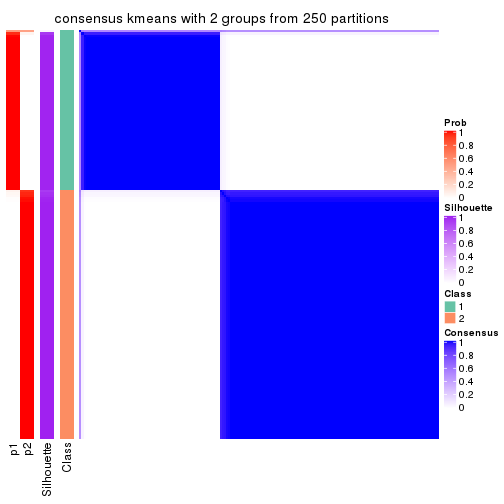</p>

</div>
<div id='tab-ATC-kmeans-consensus-heatmap-2'>
<pre><code class="r">consensus_heatmap(res, k = 3)
</code></pre>

<p>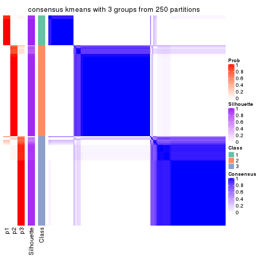</p>

</div>
<div id='tab-ATC-kmeans-consensus-heatmap-3'>
<pre><code class="r">consensus_heatmap(res, k = 4)
</code></pre>

<p>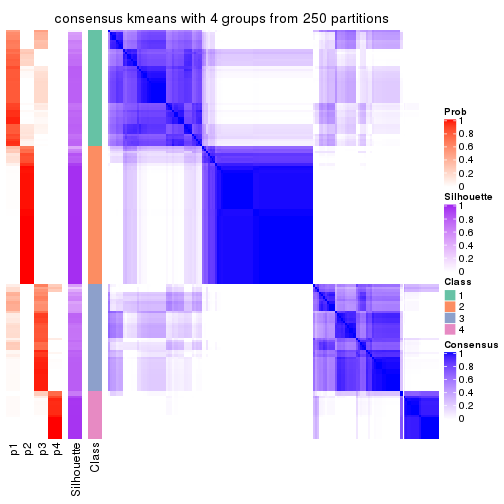</p>

</div>
<div id='tab-ATC-kmeans-consensus-heatmap-4'>
<pre><code class="r">consensus_heatmap(res, k = 5)
</code></pre>

<p>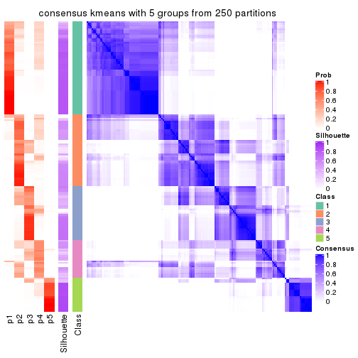</p>

</div>
<div id='tab-ATC-kmeans-consensus-heatmap-5'>
<pre><code class="r">consensus_heatmap(res, k = 6)
</code></pre>

<p>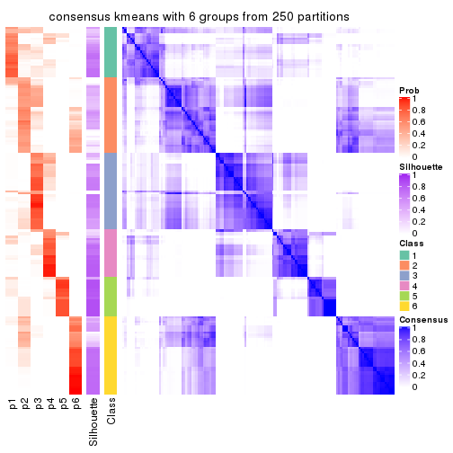</p>

</div>
</div>

Heatmaps for the membership of samples in all partitions to see how consistent they are:


<script>
$( function() {
	$( '#tabs-ATC-kmeans-membership-heatmap' ).tabs();
} );
</script>
<div id='tabs-ATC-kmeans-membership-heatmap'>
<ul>
<li><a href='#tab-ATC-kmeans-membership-heatmap-1'>k = 2</a></li>
<li><a href='#tab-ATC-kmeans-membership-heatmap-2'>k = 3</a></li>
<li><a href='#tab-ATC-kmeans-membership-heatmap-3'>k = 4</a></li>
<li><a href='#tab-ATC-kmeans-membership-heatmap-4'>k = 5</a></li>
<li><a href='#tab-ATC-kmeans-membership-heatmap-5'>k = 6</a></li>
</ul>
<div id='tab-ATC-kmeans-membership-heatmap-1'>
<pre><code class="r">membership_heatmap(res, k = 2)
</code></pre>

<p>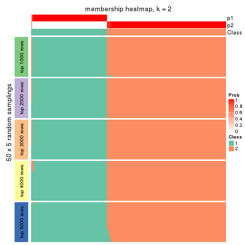</p>

</div>
<div id='tab-ATC-kmeans-membership-heatmap-2'>
<pre><code class="r">membership_heatmap(res, k = 3)
</code></pre>

<p>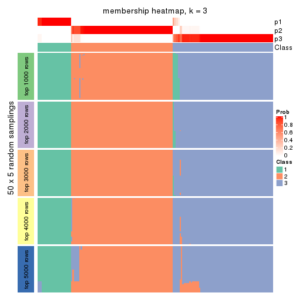</p>

</div>
<div id='tab-ATC-kmeans-membership-heatmap-3'>
<pre><code class="r">membership_heatmap(res, k = 4)
</code></pre>

<p>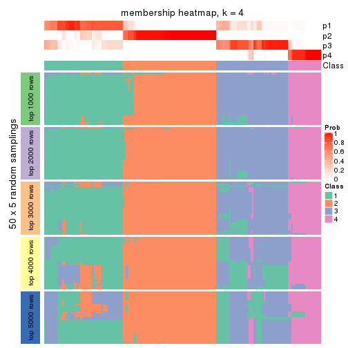</p>

</div>
<div id='tab-ATC-kmeans-membership-heatmap-4'>
<pre><code class="r">membership_heatmap(res, k = 5)
</code></pre>

<p>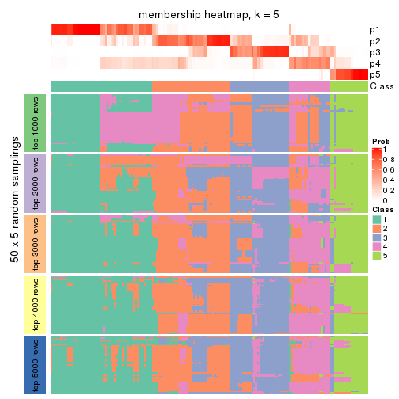</p>

</div>
<div id='tab-ATC-kmeans-membership-heatmap-5'>
<pre><code class="r">membership_heatmap(res, k = 6)
</code></pre>

<p>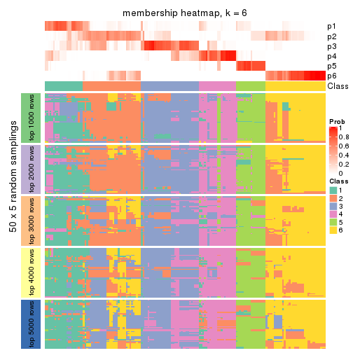</p>

</div>
</div>

As soon as we have had the classes for columns, we can look for signatures
which are significantly different between classes which can be candidate marks
for certain classes. Following are the heatmaps for signatures.


Signature heatmaps where rows are scaled:


<script>
$( function() {
	$( '#tabs-ATC-kmeans-get-signatures' ).tabs();
} );
</script>
<div id='tabs-ATC-kmeans-get-signatures'>
<ul>
<li><a href='#tab-ATC-kmeans-get-signatures-1'>k = 2</a></li>
<li><a href='#tab-ATC-kmeans-get-signatures-2'>k = 3</a></li>
<li><a href='#tab-ATC-kmeans-get-signatures-3'>k = 4</a></li>
<li><a href='#tab-ATC-kmeans-get-signatures-4'>k = 5</a></li>
<li><a href='#tab-ATC-kmeans-get-signatures-5'>k = 6</a></li>
</ul>
<div id='tab-ATC-kmeans-get-signatures-1'>
<pre><code class="r">get_signatures(res, k = 2)
</code></pre>

<p>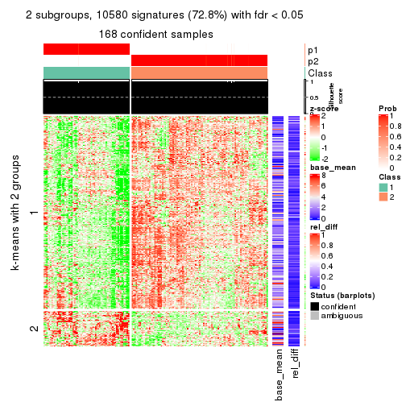</p>

</div>
<div id='tab-ATC-kmeans-get-signatures-2'>
<pre><code class="r">get_signatures(res, k = 3)
</code></pre>

<p>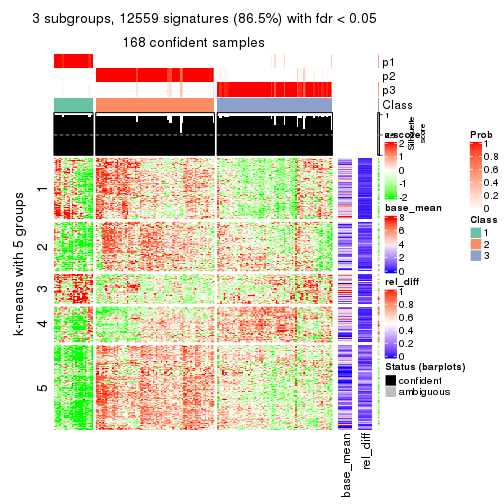</p>

</div>
<div id='tab-ATC-kmeans-get-signatures-3'>
<pre><code class="r">get_signatures(res, k = 4)
</code></pre>

<p>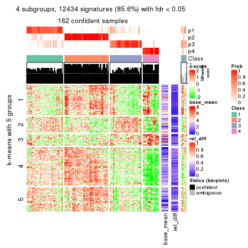</p>

</div>
<div id='tab-ATC-kmeans-get-signatures-4'>
<pre><code class="r">get_signatures(res, k = 5)
</code></pre>

<p>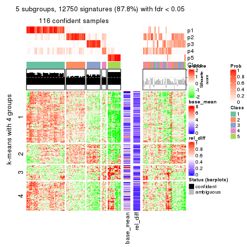</p>

</div>
<div id='tab-ATC-kmeans-get-signatures-5'>
<pre><code class="r">get_signatures(res, k = 6)
</code></pre>

<p>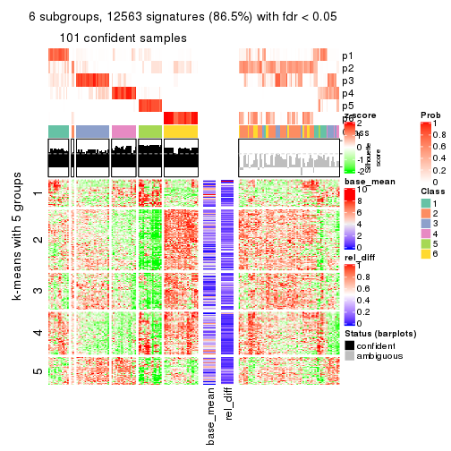</p>

</div>
</div>


Signature heatmaps where rows are not scaled:


<script>
$( function() {
	$( '#tabs-ATC-kmeans-get-signatures-no-scale' ).tabs();
} );
</script>
<div id='tabs-ATC-kmeans-get-signatures-no-scale'>
<ul>
<li><a href='#tab-ATC-kmeans-get-signatures-no-scale-1'>k = 2</a></li>
<li><a href='#tab-ATC-kmeans-get-signatures-no-scale-2'>k = 3</a></li>
<li><a href='#tab-ATC-kmeans-get-signatures-no-scale-3'>k = 4</a></li>
<li><a href='#tab-ATC-kmeans-get-signatures-no-scale-4'>k = 5</a></li>
<li><a href='#tab-ATC-kmeans-get-signatures-no-scale-5'>k = 6</a></li>
</ul>
<div id='tab-ATC-kmeans-get-signatures-no-scale-1'>
<pre><code class="r">get_signatures(res, k = 2, scale_rows = FALSE)
</code></pre>

<p>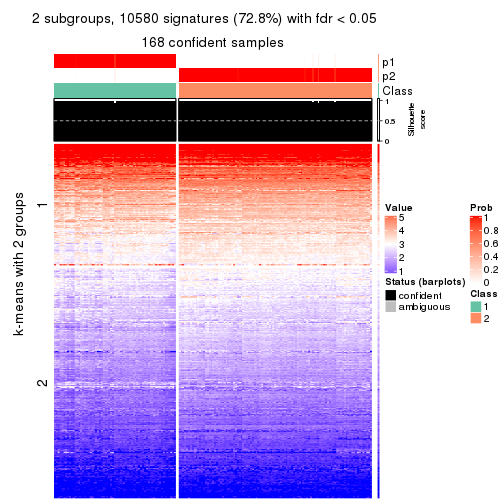</p>

</div>
<div id='tab-ATC-kmeans-get-signatures-no-scale-2'>
<pre><code class="r">get_signatures(res, k = 3, scale_rows = FALSE)
</code></pre>

<p>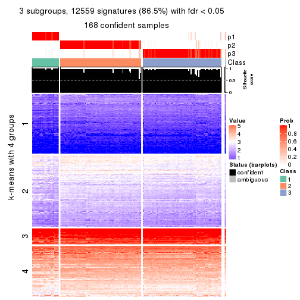</p>

</div>
<div id='tab-ATC-kmeans-get-signatures-no-scale-3'>
<pre><code class="r">get_signatures(res, k = 4, scale_rows = FALSE)
</code></pre>

<p>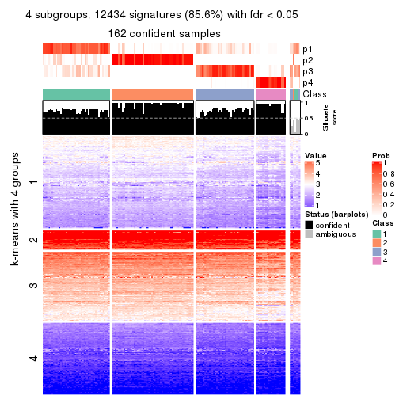</p>

</div>
<div id='tab-ATC-kmeans-get-signatures-no-scale-4'>
<pre><code class="r">get_signatures(res, k = 5, scale_rows = FALSE)
</code></pre>

<p>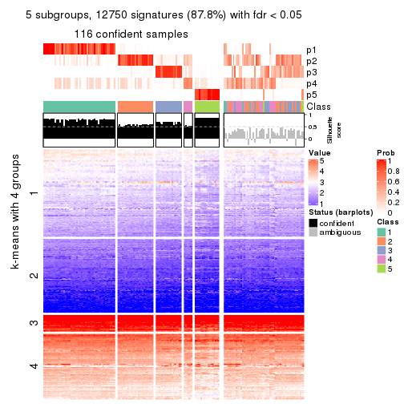</p>

</div>
<div id='tab-ATC-kmeans-get-signatures-no-scale-5'>
<pre><code class="r">get_signatures(res, k = 6, scale_rows = FALSE)
</code></pre>

<p>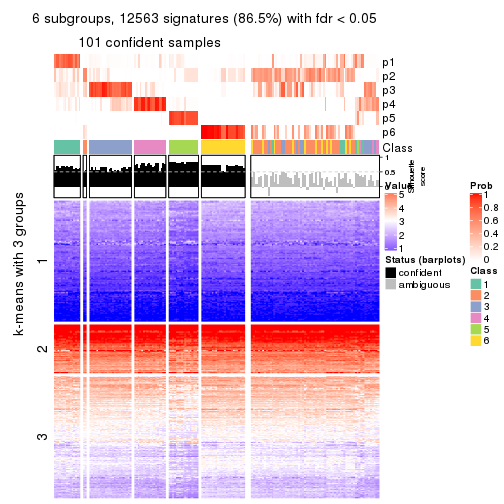</p>

</div>
</div>


Compare the overlap of signatures from different k:

```r
compare_signatures(res)
```

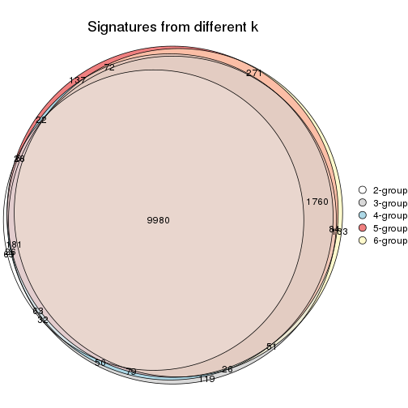

`get_signature()` returns a data frame invisibly. TO get the list of signatures, the function
call should be assigned to a variable explicitly. In following code, if `plot` argument is set
to `FALSE`, no heatmap is plotted while only the differential analysis is performed.

```r
# code only for demonstration
tb = get_signature(res, k = ..., plot = FALSE)
```

An example of the output of `tb` is:

```
#>   which_row         fdr    mean_1    mean_2 scaled_mean_1 scaled_mean_2 km
#> 1        38 0.042760348  8.373488  9.131774    -0.5533452     0.5164555  1
#> 2        40 0.018707592  7.106213  8.469186    -0.6173731     0.5762149  1
#> 3        55 0.019134737 10.221463 11.207825    -0.6159697     0.5749050  1
#> 4        59 0.006059896  5.921854  7.869574    -0.6899429     0.6439467  1
#> 5        60 0.018055526  8.928898 10.211722    -0.6204761     0.5791110  1
#> 6        98 0.009384629 15.714769 14.887706     0.6635654    -0.6193277  2
...
```

The columns in `tb` are:

1. `which_row`: row indices corresponding to the input matrix.
2. `fdr`: FDR for the differential test. 
3. `mean_x`: The mean value in group x.
4. `scaled_mean_x`: The mean value in group x after rows are scaled.
5. `km`: Row groups if k-means clustering is applied to rows.


UMAP plot which shows how samples are separated.


<script>
$( function() {
	$( '#tabs-ATC-kmeans-dimension-reduction' ).tabs();
} );
</script>
<div id='tabs-ATC-kmeans-dimension-reduction'>
<ul>
<li><a href='#tab-ATC-kmeans-dimension-reduction-1'>k = 2</a></li>
<li><a href='#tab-ATC-kmeans-dimension-reduction-2'>k = 3</a></li>
<li><a href='#tab-ATC-kmeans-dimension-reduction-3'>k = 4</a></li>
<li><a href='#tab-ATC-kmeans-dimension-reduction-4'>k = 5</a></li>
<li><a href='#tab-ATC-kmeans-dimension-reduction-5'>k = 6</a></li>
</ul>
<div id='tab-ATC-kmeans-dimension-reduction-1'>
<pre><code class="r">dimension_reduction(res, k = 2, method = &quot;UMAP&quot;)
</code></pre>

<p>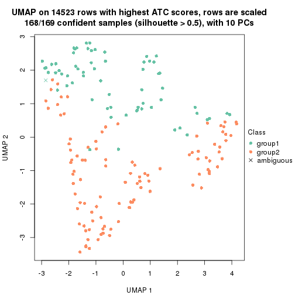</p>

</div>
<div id='tab-ATC-kmeans-dimension-reduction-2'>
<pre><code class="r">dimension_reduction(res, k = 3, method = &quot;UMAP&quot;)
</code></pre>

<p>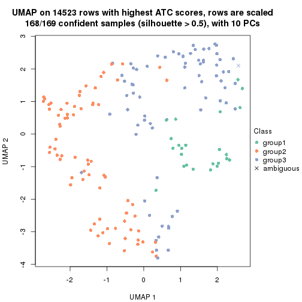</p>

</div>
<div id='tab-ATC-kmeans-dimension-reduction-3'>
<pre><code class="r">dimension_reduction(res, k = 4, method = &quot;UMAP&quot;)
</code></pre>

<p>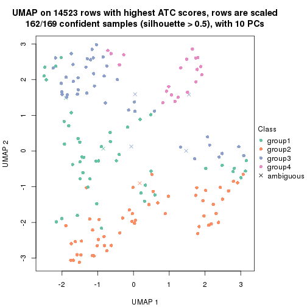</p>

</div>
<div id='tab-ATC-kmeans-dimension-reduction-4'>
<pre><code class="r">dimension_reduction(res, k = 5, method = &quot;UMAP&quot;)
</code></pre>

<p>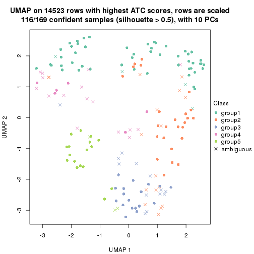</p>

</div>
<div id='tab-ATC-kmeans-dimension-reduction-5'>
<pre><code class="r">dimension_reduction(res, k = 6, method = &quot;UMAP&quot;)
</code></pre>

<p>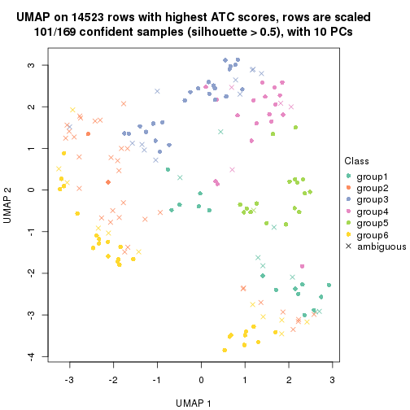</p>

</div>
</div>


Following heatmap shows how subgroups are split when increasing `k`:

```r
collect_classes(res)
```

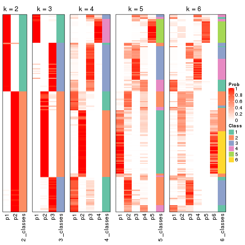


If matrix rows can be associated to genes, consider to use `GO_Enrichment(res,
...)` to perform function enrichment for the signature genes.


 

---------------------------------------------------


### ATC:skmeans**


The object with results only for a single top-value method and a single partition method 
can be extracted as:

```r
res = res_list["ATC", "skmeans"]
# you can also extract it by
# res = res_list["ATC:skmeans"]
```

A summary of `res` and all the functions that can be applied to it:

```r
res
```

```
#> A 'ConsensusPartition' object with k = 2, 3, 4, 5, 6.
#>   On a matrix with 14523 rows and 169 columns.
#>   Top rows (1000, 2000, 3000, 4000, 5000) are extracted by 'ATC' method.
#>   Subgroups are detected by 'skmeans' method.
#>   Performed in total 1250 partitions by row resampling.
#>   Best k for subgroups seems to be 2.
#> 
#> Following methods can be applied to this 'ConsensusPartition' object:
#>  [1] "cola_report"             "collect_classes"         "collect_plots"          
#>  [4] "collect_stats"           "colnames"                "compare_signatures"     
#>  [7] "consensus_heatmap"       "dimension_reduction"     "functional_enrichment"  
#> [10] "get_anno_col"            "get_anno"                "get_classes"            
#> [13] "get_consensus"           "get_matrix"              "get_membership"         
#> [16] "get_param"               "get_signatures"          "get_stats"              
#> [19] "is_best_k"               "is_stable_k"             "membership_heatmap"     
#> [22] "ncol"                    "nrow"                    "plot_ecdf"              
#> [25] "rownames"                "select_partition_number" "show"                   
#> [28] "suggest_best_k"          "test_to_known_factors"
```

`collect_plots()` function collects all the plots made from `res` for all `k` (number of partitions)
into one single page to provide an easy and fast comparison between different `k`.

```r
collect_plots(res)
```

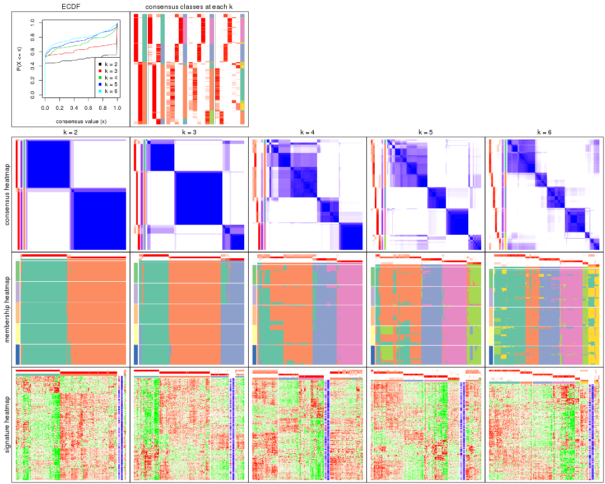

The plots are:

- The first row: a plot of the ECDF (Empirical cumulative distribution
  function) curves of the consensus matrix for each `k` and the heatmap of
  predicted classes for each `k`.
- The second row: heatmaps of the consensus matrix for each `k`.
- The third row: heatmaps of the membership matrix for each `k`.
- The fouth row: heatmaps of the signatures for each `k`.

All the plots in panels can be made by individual functions and they are
plotted later in this section.

`select_partition_number()` produces several plots showing different
statistics for choosing "optimized" `k`. There are following statistics:

- ECDF curves of the consensus matrix for each `k`;
- 1-PAC. [The PAC
  score](https://en.wikipedia.org/wiki/Consensus_clustering#Over-interpretation_potential_of_consensus_clustering)
  measures the proportion of the ambiguous subgrouping.
- Mean silhouette score.
- Concordance. The mean probability of fiting the consensus class ids in all
  partitions.
- Area increased. Denote $A_k$ as the area under the ECDF curve for current
  `k`, the area increased is defined as $A_k - A_{k-1}$.
- Rand index. The percent of pairs of samples that are both in a same cluster
  or both are not in a same cluster in the partition of k and k-1.
- Jaccard index. The ratio of pairs of samples are both in a same cluster in
  the partition of k and k-1 and the pairs of samples are both in a same
  cluster in the partition k or k-1.

The detailed explanations of these statistics can be found in [the cola
vignette](http://bioconductor.org/packages/devel/bioc/vignettes/cola/inst/doc/cola.html#toc_13).

Generally speaking, lower PAC score, higher mean silhouette score or higher
concordance corresponds to better partition. Rand index and Jaccard index
measure how similar the current partition is compared to partition with `k-1`.
If they are too similar, we won't accept `k` is better than `k-1`.

```r
select_partition_number(res)
```

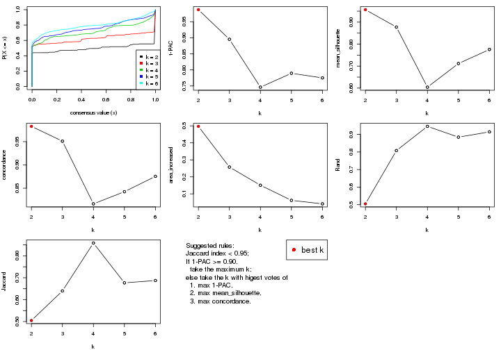

The numeric values for all these statistics can be obtained by `get_stats()`.

```r
get_stats(res)
```

```
#>   k 1-PAC mean_silhouette concordance area_increased  Rand Jaccard
#> 2 2 0.988           0.957       0.983         0.4970 0.505   0.505
#> 3 3 0.895           0.878       0.951         0.2576 0.808   0.640
#> 4 4 0.746           0.604       0.816         0.1506 0.946   0.859
#> 5 5 0.789           0.712       0.842         0.0618 0.885   0.677
#> 6 6 0.775           0.776       0.876         0.0414 0.915   0.687
```

`suggest_best_k()` suggests the best $k$ based on these statistics. The rules are as follows:

- All $k$ with Jaccard index larger than 0.95 are removed because the increase of
  the partition number does not provides enough extra information. If all $k$ are removed,
  the best $k$ is assigned by `NA`.
- For $k$ with 1-PAC larger than 0.9, the maximal $k$ is taken as the "best k". Other $k$ is called "optional k".
- If it does not fit the second rule. The $k$ with the highest vote of highest
  1-PAC, mean silhouette and concordance is taken as the "best k".

```r
suggest_best_k(res)
```

```
#> [1] 2
```


Following shows the table of the partitions (You need to click the **show/hide
code output** link to see it). The membership matrix (columns with name `p*`)
is inferred by
[`clue::cl_consensus()`](https://www.rdocumentation.org/link/cl_consensus?package=clue)
function with the `SE` method. Basically the value in the membership matrix
represents the probability to belong to a certain group. The finall class
label for an item is determined with the group with highest probability it
belongs to.

In `get_classes()` function, the entropy is calculated from the membership
matrix and the silhouette score is calculated from the consensus matrix.


<script>
$( function() {
	$( '#tabs-ATC-skmeans-get-classes' ).tabs();
} );
</script>
<div id='tabs-ATC-skmeans-get-classes'>
<ul>
<li><a href='#tab-ATC-skmeans-get-classes-1'>k = 2</a></li>
<li><a href='#tab-ATC-skmeans-get-classes-2'>k = 3</a></li>
<li><a href='#tab-ATC-skmeans-get-classes-3'>k = 4</a></li>
<li><a href='#tab-ATC-skmeans-get-classes-4'>k = 5</a></li>
<li><a href='#tab-ATC-skmeans-get-classes-5'>k = 6</a></li>
</ul>

<div id='tab-ATC-skmeans-get-classes-1'>
<p><a id='tab-ATC-skmeans-get-classes-1-a' style='color:#0366d6' href='#'>show/hide code output</a></p>
<pre><code class="r">cbind(get_classes(res, k = 2), get_membership(res, k = 2))
</code></pre>

<pre><code>#&gt;            class entropy silhouette    p1    p2
#&gt; SRR2052702     2  0.0000      0.979 0.000 1.000
#&gt; SRR2052701     2  0.0000      0.979 0.000 1.000
#&gt; SRR2052700     1  0.5842      0.827 0.860 0.140
#&gt; SRR2052699     2  0.0000      0.979 0.000 1.000
#&gt; SRR2052698     2  0.0000      0.979 0.000 1.000
#&gt; SRR2052708     1  0.0000      0.987 1.000 0.000
#&gt; SRR2052749     2  0.0000      0.979 0.000 1.000
#&gt; SRR2052786     2  0.0000      0.979 0.000 1.000
#&gt; SRR2052825     1  0.0000      0.987 1.000 0.000
#&gt; SRR2052824     1  0.0000      0.987 1.000 0.000
#&gt; SRR2052823     2  0.0000      0.979 0.000 1.000
#&gt; SRR2052822     2  0.0000      0.979 0.000 1.000
#&gt; SRR2052821     2  0.0000      0.979 0.000 1.000
#&gt; SRR2052820     1  0.0000      0.987 1.000 0.000
#&gt; SRR2052819     1  0.0000      0.987 1.000 0.000
#&gt; SRR2052818     2  0.0000      0.979 0.000 1.000
#&gt; SRR2052817     2  0.7376      0.740 0.208 0.792
#&gt; SRR2052816     2  0.0000      0.979 0.000 1.000
#&gt; SRR2052815     1  0.0000      0.987 1.000 0.000
#&gt; SRR2052814     1  0.0000      0.987 1.000 0.000
#&gt; SRR2052813     2  0.0000      0.979 0.000 1.000
#&gt; SRR2052812     2  0.0000      0.979 0.000 1.000
#&gt; SRR2052811     2  0.0000      0.979 0.000 1.000
#&gt; SRR2052810     1  0.0000      0.987 1.000 0.000
#&gt; SRR2052809     2  0.0000      0.979 0.000 1.000
#&gt; SRR2052808     2  0.0000      0.979 0.000 1.000
#&gt; SRR2052807     1  0.0000      0.987 1.000 0.000
#&gt; SRR2052806     2  0.0000      0.979 0.000 1.000
#&gt; SRR2052805     1  0.0000      0.987 1.000 0.000
#&gt; SRR2052804     1  0.0000      0.987 1.000 0.000
#&gt; SRR2052803     1  0.9881      0.224 0.564 0.436
#&gt; SRR2052802     1  0.0000      0.987 1.000 0.000
#&gt; SRR2052801     1  0.0000      0.987 1.000 0.000
#&gt; SRR2052800     1  0.0000      0.987 1.000 0.000
#&gt; SRR2052799     1  0.0000      0.987 1.000 0.000
#&gt; SRR2052798     2  0.0000      0.979 0.000 1.000
#&gt; SRR2052797     2  0.0000      0.979 0.000 1.000
#&gt; SRR2052796     1  0.0000      0.987 1.000 0.000
#&gt; SRR2052795     1  0.0000      0.987 1.000 0.000
#&gt; SRR2052794     1  0.0000      0.987 1.000 0.000
#&gt; SRR2052793     1  0.0000      0.987 1.000 0.000
#&gt; SRR2052792     1  0.0000      0.987 1.000 0.000
#&gt; SRR2052791     1  0.0000      0.987 1.000 0.000
#&gt; SRR2052790     2  0.0000      0.979 0.000 1.000
#&gt; SRR2052789     1  0.0000      0.987 1.000 0.000
#&gt; SRR2052788     1  0.0000      0.987 1.000 0.000
#&gt; SRR2052787     2  0.0000      0.979 0.000 1.000
#&gt; SRR2052785     1  0.0000      0.987 1.000 0.000
#&gt; SRR2052784     2  0.0000      0.979 0.000 1.000
#&gt; SRR2052783     2  0.0000      0.979 0.000 1.000
#&gt; SRR2052782     2  0.0000      0.979 0.000 1.000
#&gt; SRR2052781     2  0.0000      0.979 0.000 1.000
#&gt; SRR2052780     1  0.0000      0.987 1.000 0.000
#&gt; SRR2052777     2  0.0000      0.979 0.000 1.000
#&gt; SRR2052779     2  0.0000      0.979 0.000 1.000
#&gt; SRR2052778     1  0.0000      0.987 1.000 0.000
#&gt; SRR2052776     2  0.0000      0.979 0.000 1.000
#&gt; SRR2052775     1  0.0000      0.987 1.000 0.000
#&gt; SRR2052773     2  0.7453      0.734 0.212 0.788
#&gt; SRR2052772     1  0.0000      0.987 1.000 0.000
#&gt; SRR2052774     2  0.7528      0.728 0.216 0.784
#&gt; SRR2052771     1  0.0000      0.987 1.000 0.000
#&gt; SRR2052769     1  0.0000      0.987 1.000 0.000
#&gt; SRR2052770     1  0.0000      0.987 1.000 0.000
#&gt; SRR2052768     2  0.0000      0.979 0.000 1.000
#&gt; SRR2052767     2  0.0000      0.979 0.000 1.000
#&gt; SRR2052766     1  0.0000      0.987 1.000 0.000
#&gt; SRR2052765     2  0.0000      0.979 0.000 1.000
#&gt; SRR2052763     1  0.0000      0.987 1.000 0.000
#&gt; SRR2052764     2  0.0000      0.979 0.000 1.000
#&gt; SRR2052761     1  0.0000      0.987 1.000 0.000
#&gt; SRR2052760     2  0.0000      0.979 0.000 1.000
#&gt; SRR2052759     1  0.0000      0.987 1.000 0.000
#&gt; SRR2052762     2  0.0000      0.979 0.000 1.000
#&gt; SRR2052758     1  0.0000      0.987 1.000 0.000
#&gt; SRR2052756     1  0.0000      0.987 1.000 0.000
#&gt; SRR2052757     2  0.6887      0.775 0.184 0.816
#&gt; SRR2052755     2  0.0000      0.979 0.000 1.000
#&gt; SRR2052754     1  0.0000      0.987 1.000 0.000
#&gt; SRR2052753     2  0.0000      0.979 0.000 1.000
#&gt; SRR2052752     1  0.0000      0.987 1.000 0.000
#&gt; SRR2052750     2  0.0000      0.979 0.000 1.000
#&gt; SRR2052751     2  0.0000      0.979 0.000 1.000
#&gt; SRR2052748     1  0.0000      0.987 1.000 0.000
#&gt; SRR2052747     2  0.0000      0.979 0.000 1.000
#&gt; SRR2052746     1  0.0000      0.987 1.000 0.000
#&gt; SRR2052745     1  0.0000      0.987 1.000 0.000
#&gt; SRR2052744     2  0.0000      0.979 0.000 1.000
#&gt; SRR2052741     2  0.0000      0.979 0.000 1.000
#&gt; SRR2052743     2  0.0000      0.979 0.000 1.000
#&gt; SRR2052740     2  0.0000      0.979 0.000 1.000
#&gt; SRR2052742     2  0.0000      0.979 0.000 1.000
#&gt; SRR2052739     2  0.0000      0.979 0.000 1.000
#&gt; SRR2052738     1  0.0000      0.987 1.000 0.000
#&gt; SRR2052736     2  0.0000      0.979 0.000 1.000
#&gt; SRR2052735     2  0.0000      0.979 0.000 1.000
#&gt; SRR2052734     2  0.0000      0.979 0.000 1.000
#&gt; SRR2052737     2  0.0000      0.979 0.000 1.000
#&gt; SRR2052733     1  0.0000      0.987 1.000 0.000
#&gt; SRR2052732     2  0.0000      0.979 0.000 1.000
#&gt; SRR2052731     1  0.0000      0.987 1.000 0.000
#&gt; SRR2052729     2  0.0000      0.979 0.000 1.000
#&gt; SRR2052728     2  0.0000      0.979 0.000 1.000
#&gt; SRR2052730     1  0.0000      0.987 1.000 0.000
#&gt; SRR2052727     2  0.0000      0.979 0.000 1.000
#&gt; SRR2052725     2  0.0000      0.979 0.000 1.000
#&gt; SRR2052726     2  0.0000      0.979 0.000 1.000
#&gt; SRR2052724     1  0.0000      0.987 1.000 0.000
#&gt; SRR2052723     1  0.0000      0.987 1.000 0.000
#&gt; SRR2052722     1  0.0000      0.987 1.000 0.000
#&gt; SRR2052721     2  0.0000      0.979 0.000 1.000
#&gt; SRR2052720     2  0.0000      0.979 0.000 1.000
#&gt; SRR2052719     2  0.0000      0.979 0.000 1.000
#&gt; SRR2052718     2  0.0000      0.979 0.000 1.000
#&gt; SRR2052717     2  0.0000      0.979 0.000 1.000
#&gt; SRR2052714     1  0.0000      0.987 1.000 0.000
#&gt; SRR2052716     1  0.0000      0.987 1.000 0.000
#&gt; SRR2052715     1  0.0000      0.987 1.000 0.000
#&gt; SRR2052713     2  0.9944      0.157 0.456 0.544
#&gt; SRR2052712     1  0.0000      0.987 1.000 0.000
#&gt; SRR2052711     1  0.0000      0.987 1.000 0.000
#&gt; SRR2052710     2  0.0000      0.979 0.000 1.000
#&gt; SRR2052707     1  0.0000      0.987 1.000 0.000
#&gt; SRR2052709     1  0.0000      0.987 1.000 0.000
#&gt; SRR2052704     1  0.0000      0.987 1.000 0.000
#&gt; SRR2052705     2  0.0000      0.979 0.000 1.000
#&gt; SRR2052697     2  0.0000      0.979 0.000 1.000
#&gt; SRR2052703     1  0.0000      0.987 1.000 0.000
#&gt; SRR2052696     2  0.0000      0.979 0.000 1.000
#&gt; SRR2052706     2  0.0000      0.979 0.000 1.000
#&gt; SRR2052695     2  0.0000      0.979 0.000 1.000
#&gt; SRR2052694     2  0.0000      0.979 0.000 1.000
#&gt; SRR2052692     1  0.0000      0.987 1.000 0.000
#&gt; SRR2052693     1  0.0000      0.987 1.000 0.000
#&gt; SRR2052691     2  0.0000      0.979 0.000 1.000
#&gt; SRR2052690     2  0.0000      0.979 0.000 1.000
#&gt; SRR2052689     1  0.0000      0.987 1.000 0.000
#&gt; SRR2052687     1  0.0000      0.987 1.000 0.000
#&gt; SRR2052686     2  0.0000      0.979 0.000 1.000
#&gt; SRR2052688     2  0.0000      0.979 0.000 1.000
#&gt; SRR2052684     1  0.0000      0.987 1.000 0.000
#&gt; SRR2052685     2  0.0000      0.979 0.000 1.000
#&gt; SRR2052683     1  0.0000      0.987 1.000 0.000
#&gt; SRR2052681     1  0.0000      0.987 1.000 0.000
#&gt; SRR2052680     1  0.0000      0.987 1.000 0.000
#&gt; SRR2052682     2  0.0000      0.979 0.000 1.000
#&gt; SRR2052679     2  0.0000      0.979 0.000 1.000
#&gt; SRR2052678     1  0.0000      0.987 1.000 0.000
#&gt; SRR2052677     2  0.0000      0.979 0.000 1.000
#&gt; SRR2052675     2  0.0000      0.979 0.000 1.000
#&gt; SRR2052676     2  0.0000      0.979 0.000 1.000
#&gt; SRR2052674     2  0.0000      0.979 0.000 1.000
#&gt; SRR2052672     1  0.0000      0.987 1.000 0.000
#&gt; SRR2052673     2  0.0000      0.979 0.000 1.000
#&gt; SRR2052671     2  0.0000      0.979 0.000 1.000
#&gt; SRR2052670     2  0.7815      0.703 0.232 0.768
#&gt; SRR2052669     2  0.0000      0.979 0.000 1.000
#&gt; SRR2052668     2  0.0000      0.979 0.000 1.000
#&gt; SRR2052667     2  0.0000      0.979 0.000 1.000
#&gt; SRR2052666     1  0.9522      0.388 0.628 0.372
#&gt; SRR2052665     2  0.0000      0.979 0.000 1.000
#&gt; SRR2052664     1  0.0000      0.987 1.000 0.000
#&gt; SRR2052663     2  0.0000      0.979 0.000 1.000
#&gt; SRR2052662     2  0.0000      0.979 0.000 1.000
#&gt; SRR2052661     2  0.0000      0.979 0.000 1.000
#&gt; SRR2052660     1  0.0672      0.979 0.992 0.008
#&gt; SRR2052659     1  0.0000      0.987 1.000 0.000
#&gt; SRR2052658     2  0.0000      0.979 0.000 1.000
#&gt; SRR2052657     2  0.9909      0.216 0.444 0.556
</code></pre>

<script>
$('#tab-ATC-skmeans-get-classes-1-a').parent().next().next().hide();
$('#tab-ATC-skmeans-get-classes-1-a').click(function(){
  $('#tab-ATC-skmeans-get-classes-1-a').parent().next().next().toggle();
  return(false);
});
</script>
</div>

<div id='tab-ATC-skmeans-get-classes-2'>
<p><a id='tab-ATC-skmeans-get-classes-2-a' style='color:#0366d6' href='#'>show/hide code output</a></p>
<pre><code class="r">cbind(get_classes(res, k = 3), get_membership(res, k = 3))
</code></pre>

<pre><code>#&gt;            class entropy silhouette    p1    p2    p3
#&gt; SRR2052702     2  0.0000     0.9907 0.000 1.000 0.000
#&gt; SRR2052701     2  0.0000     0.9907 0.000 1.000 0.000
#&gt; SRR2052700     1  0.0000     0.9151 1.000 0.000 0.000
#&gt; SRR2052699     2  0.0000     0.9907 0.000 1.000 0.000
#&gt; SRR2052698     3  0.5216     0.6042 0.000 0.260 0.740
#&gt; SRR2052708     1  0.0000     0.9151 1.000 0.000 0.000
#&gt; SRR2052749     2  0.0000     0.9907 0.000 1.000 0.000
#&gt; SRR2052786     2  0.0000     0.9907 0.000 1.000 0.000
#&gt; SRR2052825     1  0.0000     0.9151 1.000 0.000 0.000
#&gt; SRR2052824     1  0.0000     0.9151 1.000 0.000 0.000
#&gt; SRR2052823     2  0.0000     0.9907 0.000 1.000 0.000
#&gt; SRR2052822     2  0.2356     0.9139 0.000 0.928 0.072
#&gt; SRR2052821     2  0.0000     0.9907 0.000 1.000 0.000
#&gt; SRR2052820     3  0.6126     0.4842 0.400 0.000 0.600
#&gt; SRR2052819     1  0.0000     0.9151 1.000 0.000 0.000
#&gt; SRR2052818     2  0.0000     0.9907 0.000 1.000 0.000
#&gt; SRR2052817     3  0.0000     0.8586 0.000 0.000 1.000
#&gt; SRR2052816     2  0.5733     0.5227 0.324 0.676 0.000
#&gt; SRR2052815     1  0.0000     0.9151 1.000 0.000 0.000
#&gt; SRR2052814     1  0.0000     0.9151 1.000 0.000 0.000
#&gt; SRR2052813     2  0.0000     0.9907 0.000 1.000 0.000
#&gt; SRR2052812     2  0.0000     0.9907 0.000 1.000 0.000
#&gt; SRR2052811     2  0.0000     0.9907 0.000 1.000 0.000
#&gt; SRR2052810     1  0.0000     0.9151 1.000 0.000 0.000
#&gt; SRR2052809     2  0.3267     0.8599 0.000 0.884 0.116
#&gt; SRR2052808     2  0.0000     0.9907 0.000 1.000 0.000
#&gt; SRR2052807     1  0.0000     0.9151 1.000 0.000 0.000
#&gt; SRR2052806     2  0.0000     0.9907 0.000 1.000 0.000
#&gt; SRR2052805     1  0.0000     0.9151 1.000 0.000 0.000
#&gt; SRR2052804     1  0.0000     0.9151 1.000 0.000 0.000
#&gt; SRR2052803     1  0.1411     0.8679 0.964 0.036 0.000
#&gt; SRR2052802     1  0.0000     0.9151 1.000 0.000 0.000
#&gt; SRR2052801     1  0.0000     0.9151 1.000 0.000 0.000
#&gt; SRR2052800     1  0.0000     0.9151 1.000 0.000 0.000
#&gt; SRR2052799     1  0.0000     0.9151 1.000 0.000 0.000
#&gt; SRR2052798     2  0.0000     0.9907 0.000 1.000 0.000
#&gt; SRR2052797     2  0.0000     0.9907 0.000 1.000 0.000
#&gt; SRR2052796     1  0.0000     0.9151 1.000 0.000 0.000
#&gt; SRR2052795     1  0.0000     0.9151 1.000 0.000 0.000
#&gt; SRR2052794     1  0.0000     0.9151 1.000 0.000 0.000
#&gt; SRR2052793     1  0.0000     0.9151 1.000 0.000 0.000
#&gt; SRR2052792     1  0.0000     0.9151 1.000 0.000 0.000
#&gt; SRR2052791     1  0.0000     0.9151 1.000 0.000 0.000
#&gt; SRR2052790     3  0.1753     0.8247 0.000 0.048 0.952
#&gt; SRR2052789     3  0.0000     0.8586 0.000 0.000 1.000
#&gt; SRR2052788     3  0.0000     0.8586 0.000 0.000 1.000
#&gt; SRR2052787     2  0.0000     0.9907 0.000 1.000 0.000
#&gt; SRR2052785     3  0.6126     0.4842 0.400 0.000 0.600
#&gt; SRR2052784     2  0.4605     0.7315 0.000 0.796 0.204
#&gt; SRR2052783     2  0.0000     0.9907 0.000 1.000 0.000
#&gt; SRR2052782     2  0.0000     0.9907 0.000 1.000 0.000
#&gt; SRR2052781     3  0.0892     0.8463 0.000 0.020 0.980
#&gt; SRR2052780     3  0.0000     0.8586 0.000 0.000 1.000
#&gt; SRR2052777     2  0.0000     0.9907 0.000 1.000 0.000
#&gt; SRR2052779     2  0.0000     0.9907 0.000 1.000 0.000
#&gt; SRR2052778     3  0.6126     0.4842 0.400 0.000 0.600
#&gt; SRR2052776     3  0.0592     0.8516 0.000 0.012 0.988
#&gt; SRR2052775     3  0.3816     0.7797 0.148 0.000 0.852
#&gt; SRR2052773     3  0.0000     0.8586 0.000 0.000 1.000
#&gt; SRR2052772     3  0.0000     0.8586 0.000 0.000 1.000
#&gt; SRR2052774     3  0.0000     0.8586 0.000 0.000 1.000
#&gt; SRR2052771     1  0.0000     0.9151 1.000 0.000 0.000
#&gt; SRR2052769     1  0.0000     0.9151 1.000 0.000 0.000
#&gt; SRR2052770     1  0.6291    -0.1119 0.532 0.000 0.468
#&gt; SRR2052768     2  0.0000     0.9907 0.000 1.000 0.000
#&gt; SRR2052767     2  0.0000     0.9907 0.000 1.000 0.000
#&gt; SRR2052766     1  0.0000     0.9151 1.000 0.000 0.000
#&gt; SRR2052765     2  0.0000     0.9907 0.000 1.000 0.000
#&gt; SRR2052763     3  0.0000     0.8586 0.000 0.000 1.000
#&gt; SRR2052764     2  0.0000     0.9907 0.000 1.000 0.000
#&gt; SRR2052761     3  0.0000     0.8586 0.000 0.000 1.000
#&gt; SRR2052760     2  0.0000     0.9907 0.000 1.000 0.000
#&gt; SRR2052759     3  0.5138     0.6925 0.252 0.000 0.748
#&gt; SRR2052762     2  0.0000     0.9907 0.000 1.000 0.000
#&gt; SRR2052758     3  0.0000     0.8586 0.000 0.000 1.000
#&gt; SRR2052756     1  0.0000     0.9151 1.000 0.000 0.000
#&gt; SRR2052757     3  0.0000     0.8586 0.000 0.000 1.000
#&gt; SRR2052755     2  0.0000     0.9907 0.000 1.000 0.000
#&gt; SRR2052754     1  0.0000     0.9151 1.000 0.000 0.000
#&gt; SRR2052753     2  0.0000     0.9907 0.000 1.000 0.000
#&gt; SRR2052752     1  0.0000     0.9151 1.000 0.000 0.000
#&gt; SRR2052750     2  0.0000     0.9907 0.000 1.000 0.000
#&gt; SRR2052751     2  0.0000     0.9907 0.000 1.000 0.000
#&gt; SRR2052748     1  0.6192     0.0823 0.580 0.000 0.420
#&gt; SRR2052747     2  0.0000     0.9907 0.000 1.000 0.000
#&gt; SRR2052746     3  0.6111     0.4915 0.396 0.000 0.604
#&gt; SRR2052745     3  0.6126     0.4842 0.400 0.000 0.600
#&gt; SRR2052744     2  0.0000     0.9907 0.000 1.000 0.000
#&gt; SRR2052741     2  0.0000     0.9907 0.000 1.000 0.000
#&gt; SRR2052743     2  0.0000     0.9907 0.000 1.000 0.000
#&gt; SRR2052740     2  0.0000     0.9907 0.000 1.000 0.000
#&gt; SRR2052742     2  0.0000     0.9907 0.000 1.000 0.000
#&gt; SRR2052739     2  0.0000     0.9907 0.000 1.000 0.000
#&gt; SRR2052738     3  0.5138     0.6925 0.252 0.000 0.748
#&gt; SRR2052736     2  0.0000     0.9907 0.000 1.000 0.000
#&gt; SRR2052735     2  0.0000     0.9907 0.000 1.000 0.000
#&gt; SRR2052734     2  0.0000     0.9907 0.000 1.000 0.000
#&gt; SRR2052737     2  0.0000     0.9907 0.000 1.000 0.000
#&gt; SRR2052733     1  0.6168     0.1124 0.588 0.000 0.412
#&gt; SRR2052732     2  0.0000     0.9907 0.000 1.000 0.000
#&gt; SRR2052731     3  0.0000     0.8586 0.000 0.000 1.000
#&gt; SRR2052729     2  0.0000     0.9907 0.000 1.000 0.000
#&gt; SRR2052728     2  0.0000     0.9907 0.000 1.000 0.000
#&gt; SRR2052730     1  0.0000     0.9151 1.000 0.000 0.000
#&gt; SRR2052727     2  0.0000     0.9907 0.000 1.000 0.000
#&gt; SRR2052725     2  0.0000     0.9907 0.000 1.000 0.000
#&gt; SRR2052726     2  0.0000     0.9907 0.000 1.000 0.000
#&gt; SRR2052724     1  0.0000     0.9151 1.000 0.000 0.000
#&gt; SRR2052723     1  0.6126     0.1544 0.600 0.000 0.400
#&gt; SRR2052722     3  0.5138     0.6925 0.252 0.000 0.748
#&gt; SRR2052721     2  0.0000     0.9907 0.000 1.000 0.000
#&gt; SRR2052720     2  0.0000     0.9907 0.000 1.000 0.000
#&gt; SRR2052719     2  0.0000     0.9907 0.000 1.000 0.000
#&gt; SRR2052718     2  0.0000     0.9907 0.000 1.000 0.000
#&gt; SRR2052717     2  0.0000     0.9907 0.000 1.000 0.000
#&gt; SRR2052714     1  0.0000     0.9151 1.000 0.000 0.000
#&gt; SRR2052716     1  0.0000     0.9151 1.000 0.000 0.000
#&gt; SRR2052715     3  0.6126     0.4842 0.400 0.000 0.600
#&gt; SRR2052713     1  0.0000     0.9151 1.000 0.000 0.000
#&gt; SRR2052712     1  0.0000     0.9151 1.000 0.000 0.000
#&gt; SRR2052711     1  0.0000     0.9151 1.000 0.000 0.000
#&gt; SRR2052710     2  0.0000     0.9907 0.000 1.000 0.000
#&gt; SRR2052707     3  0.0000     0.8586 0.000 0.000 1.000
#&gt; SRR2052709     3  0.0000     0.8586 0.000 0.000 1.000
#&gt; SRR2052704     3  0.6126     0.4842 0.400 0.000 0.600
#&gt; SRR2052705     2  0.0000     0.9907 0.000 1.000 0.000
#&gt; SRR2052697     2  0.0000     0.9907 0.000 1.000 0.000
#&gt; SRR2052703     3  0.0000     0.8586 0.000 0.000 1.000
#&gt; SRR2052696     2  0.0000     0.9907 0.000 1.000 0.000
#&gt; SRR2052706     2  0.0000     0.9907 0.000 1.000 0.000
#&gt; SRR2052695     2  0.0000     0.9907 0.000 1.000 0.000
#&gt; SRR2052694     2  0.0000     0.9907 0.000 1.000 0.000
#&gt; SRR2052692     3  0.0000     0.8586 0.000 0.000 1.000
#&gt; SRR2052693     3  0.4002     0.7715 0.160 0.000 0.840
#&gt; SRR2052691     2  0.0000     0.9907 0.000 1.000 0.000
#&gt; SRR2052690     2  0.0000     0.9907 0.000 1.000 0.000
#&gt; SRR2052689     1  0.0000     0.9151 1.000 0.000 0.000
#&gt; SRR2052687     1  0.0000     0.9151 1.000 0.000 0.000
#&gt; SRR2052686     2  0.0000     0.9907 0.000 1.000 0.000
#&gt; SRR2052688     2  0.0000     0.9907 0.000 1.000 0.000
#&gt; SRR2052684     1  0.6140     0.1409 0.596 0.000 0.404
#&gt; SRR2052685     2  0.0000     0.9907 0.000 1.000 0.000
#&gt; SRR2052683     1  0.0000     0.9151 1.000 0.000 0.000
#&gt; SRR2052681     1  0.0000     0.9151 1.000 0.000 0.000
#&gt; SRR2052680     1  0.0000     0.9151 1.000 0.000 0.000
#&gt; SRR2052682     2  0.0000     0.9907 0.000 1.000 0.000
#&gt; SRR2052679     2  0.0000     0.9907 0.000 1.000 0.000
#&gt; SRR2052678     3  0.0000     0.8586 0.000 0.000 1.000
#&gt; SRR2052677     2  0.0000     0.9907 0.000 1.000 0.000
#&gt; SRR2052675     2  0.0000     0.9907 0.000 1.000 0.000
#&gt; SRR2052676     2  0.0000     0.9907 0.000 1.000 0.000
#&gt; SRR2052674     1  0.6235     0.1818 0.564 0.436 0.000
#&gt; SRR2052672     3  0.6111     0.4915 0.396 0.000 0.604
#&gt; SRR2052673     2  0.0000     0.9907 0.000 1.000 0.000
#&gt; SRR2052671     2  0.0000     0.9907 0.000 1.000 0.000
#&gt; SRR2052670     3  0.0000     0.8586 0.000 0.000 1.000
#&gt; SRR2052669     2  0.0000     0.9907 0.000 1.000 0.000
#&gt; SRR2052668     2  0.0000     0.9907 0.000 1.000 0.000
#&gt; SRR2052667     2  0.0000     0.9907 0.000 1.000 0.000
#&gt; SRR2052666     3  0.0000     0.8586 0.000 0.000 1.000
#&gt; SRR2052665     2  0.0000     0.9907 0.000 1.000 0.000
#&gt; SRR2052664     1  0.0000     0.9151 1.000 0.000 0.000
#&gt; SRR2052663     2  0.0000     0.9907 0.000 1.000 0.000
#&gt; SRR2052662     2  0.0000     0.9907 0.000 1.000 0.000
#&gt; SRR2052661     2  0.0000     0.9907 0.000 1.000 0.000
#&gt; SRR2052660     3  0.0000     0.8586 0.000 0.000 1.000
#&gt; SRR2052659     3  0.0000     0.8586 0.000 0.000 1.000
#&gt; SRR2052658     2  0.0000     0.9907 0.000 1.000 0.000
#&gt; SRR2052657     1  0.6095     0.3096 0.608 0.392 0.000
</code></pre>

<script>
$('#tab-ATC-skmeans-get-classes-2-a').parent().next().next().hide();
$('#tab-ATC-skmeans-get-classes-2-a').click(function(){
  $('#tab-ATC-skmeans-get-classes-2-a').parent().next().next().toggle();
  return(false);
});
</script>
</div>

<div id='tab-ATC-skmeans-get-classes-3'>
<p><a id='tab-ATC-skmeans-get-classes-3-a' style='color:#0366d6' href='#'>show/hide code output</a></p>
<pre><code class="r">cbind(get_classes(res, k = 4), get_membership(res, k = 4))
</code></pre>

<pre><code>#&gt;            class entropy silhouette    p1    p2    p3    p4
#&gt; SRR2052702     2  0.4804     0.5818 0.384 0.616 0.000 0.000
#&gt; SRR2052701     2  0.4624     0.5869 0.340 0.660 0.000 0.000
#&gt; SRR2052700     4  0.0707     0.9594 0.020 0.000 0.000 0.980
#&gt; SRR2052699     2  0.0817     0.4410 0.024 0.976 0.000 0.000
#&gt; SRR2052698     1  0.7002     0.4545 0.492 0.388 0.120 0.000
#&gt; SRR2052708     4  0.0000     0.9745 0.000 0.000 0.000 1.000
#&gt; SRR2052749     2  0.4992     0.4867 0.476 0.524 0.000 0.000
#&gt; SRR2052786     2  0.0000     0.4408 0.000 1.000 0.000 0.000
#&gt; SRR2052825     4  0.0000     0.9745 0.000 0.000 0.000 1.000
#&gt; SRR2052824     4  0.0000     0.9745 0.000 0.000 0.000 1.000
#&gt; SRR2052823     2  0.4804     0.5818 0.384 0.616 0.000 0.000
#&gt; SRR2052822     2  0.4999    -0.3825 0.492 0.508 0.000 0.000
#&gt; SRR2052821     2  0.4713     0.5847 0.360 0.640 0.000 0.000
#&gt; SRR2052820     3  0.2345     0.8616 0.000 0.000 0.900 0.100
#&gt; SRR2052819     4  0.0000     0.9745 0.000 0.000 0.000 1.000
#&gt; SRR2052818     2  0.4941     0.5453 0.436 0.564 0.000 0.000
#&gt; SRR2052817     3  0.5409     0.3169 0.492 0.012 0.496 0.000
#&gt; SRR2052816     1  0.5408    -0.5148 0.500 0.488 0.000 0.012
#&gt; SRR2052815     4  0.0000     0.9745 0.000 0.000 0.000 1.000
#&gt; SRR2052814     4  0.0000     0.9745 0.000 0.000 0.000 1.000
#&gt; SRR2052813     2  0.0336     0.4319 0.008 0.992 0.000 0.000
#&gt; SRR2052812     2  0.4605     0.5861 0.336 0.664 0.000 0.000
#&gt; SRR2052811     2  0.4804     0.5818 0.384 0.616 0.000 0.000
#&gt; SRR2052810     4  0.0707     0.9594 0.020 0.000 0.000 0.980
#&gt; SRR2052809     2  0.4999    -0.3825 0.492 0.508 0.000 0.000
#&gt; SRR2052808     2  0.5000     0.4608 0.496 0.504 0.000 0.000
#&gt; SRR2052807     4  0.0000     0.9745 0.000 0.000 0.000 1.000
#&gt; SRR2052806     1  0.4999    -0.5209 0.508 0.492 0.000 0.000
#&gt; SRR2052805     4  0.0469     0.9652 0.012 0.000 0.000 0.988
#&gt; SRR2052804     4  0.0000     0.9745 0.000 0.000 0.000 1.000
#&gt; SRR2052803     4  0.3539     0.8096 0.176 0.004 0.000 0.820
#&gt; SRR2052802     4  0.0000     0.9745 0.000 0.000 0.000 1.000
#&gt; SRR2052801     4  0.0000     0.9745 0.000 0.000 0.000 1.000
#&gt; SRR2052800     4  0.0000     0.9745 0.000 0.000 0.000 1.000
#&gt; SRR2052799     4  0.0000     0.9745 0.000 0.000 0.000 1.000
#&gt; SRR2052798     2  0.4989     0.4906 0.472 0.528 0.000 0.000
#&gt; SRR2052797     2  0.0921     0.4332 0.028 0.972 0.000 0.000
#&gt; SRR2052796     4  0.0000     0.9745 0.000 0.000 0.000 1.000
#&gt; SRR2052795     4  0.0000     0.9745 0.000 0.000 0.000 1.000
#&gt; SRR2052794     4  0.0000     0.9745 0.000 0.000 0.000 1.000
#&gt; SRR2052793     4  0.0000     0.9745 0.000 0.000 0.000 1.000
#&gt; SRR2052792     4  0.0000     0.9745 0.000 0.000 0.000 1.000
#&gt; SRR2052791     4  0.2704     0.8294 0.000 0.000 0.124 0.876
#&gt; SRR2052790     1  0.7068     0.4543 0.492 0.380 0.128 0.000
#&gt; SRR2052789     3  0.0000     0.8634 0.000 0.000 1.000 0.000
#&gt; SRR2052788     3  0.0000     0.8634 0.000 0.000 1.000 0.000
#&gt; SRR2052787     2  0.0000     0.4408 0.000 1.000 0.000 0.000
#&gt; SRR2052785     3  0.2704     0.8481 0.000 0.000 0.876 0.124
#&gt; SRR2052784     2  0.4999    -0.3825 0.492 0.508 0.000 0.000
#&gt; SRR2052783     2  0.4830    -0.2533 0.392 0.608 0.000 0.000
#&gt; SRR2052782     2  0.4999    -0.3825 0.492 0.508 0.000 0.000
#&gt; SRR2052781     1  0.7068     0.4539 0.492 0.380 0.128 0.000
#&gt; SRR2052780     3  0.2973     0.7764 0.144 0.000 0.856 0.000
#&gt; SRR2052777     2  0.4999    -0.3825 0.492 0.508 0.000 0.000
#&gt; SRR2052779     2  0.4999    -0.3825 0.492 0.508 0.000 0.000
#&gt; SRR2052778     3  0.2345     0.8616 0.000 0.000 0.900 0.100
#&gt; SRR2052776     1  0.7184     0.4379 0.492 0.364 0.144 0.000
#&gt; SRR2052775     3  0.1022     0.8665 0.000 0.000 0.968 0.032
#&gt; SRR2052773     3  0.5409     0.3160 0.492 0.012 0.496 0.000
#&gt; SRR2052772     3  0.0000     0.8634 0.000 0.000 1.000 0.000
#&gt; SRR2052774     3  0.5168     0.3327 0.492 0.004 0.504 0.000
#&gt; SRR2052771     4  0.0000     0.9745 0.000 0.000 0.000 1.000
#&gt; SRR2052769     4  0.0000     0.9745 0.000 0.000 0.000 1.000
#&gt; SRR2052770     3  0.2868     0.8397 0.000 0.000 0.864 0.136
#&gt; SRR2052768     2  0.4643     0.5855 0.344 0.656 0.000 0.000
#&gt; SRR2052767     2  0.4661     0.5861 0.348 0.652 0.000 0.000
#&gt; SRR2052766     4  0.0000     0.9745 0.000 0.000 0.000 1.000
#&gt; SRR2052765     2  0.4866     0.5692 0.404 0.596 0.000 0.000
#&gt; SRR2052763     3  0.0000     0.8634 0.000 0.000 1.000 0.000
#&gt; SRR2052764     2  0.4843     0.5780 0.396 0.604 0.000 0.000
#&gt; SRR2052761     3  0.0000     0.8634 0.000 0.000 1.000 0.000
#&gt; SRR2052760     2  0.0336     0.4451 0.008 0.992 0.000 0.000
#&gt; SRR2052759     3  0.2149     0.8642 0.000 0.000 0.912 0.088
#&gt; SRR2052762     2  0.4999    -0.3825 0.492 0.508 0.000 0.000
#&gt; SRR2052758     3  0.0000     0.8634 0.000 0.000 1.000 0.000
#&gt; SRR2052756     4  0.0000     0.9745 0.000 0.000 0.000 1.000
#&gt; SRR2052757     1  0.7345     0.3947 0.492 0.336 0.172 0.000
#&gt; SRR2052755     2  0.4866     0.5715 0.404 0.596 0.000 0.000
#&gt; SRR2052754     4  0.0000     0.9745 0.000 0.000 0.000 1.000
#&gt; SRR2052753     2  0.4866     0.5715 0.404 0.596 0.000 0.000
#&gt; SRR2052752     4  0.0000     0.9745 0.000 0.000 0.000 1.000
#&gt; SRR2052750     2  0.4866     0.5715 0.404 0.596 0.000 0.000
#&gt; SRR2052751     2  0.4331    -0.0724 0.288 0.712 0.000 0.000
#&gt; SRR2052748     3  0.2868     0.8397 0.000 0.000 0.864 0.136
#&gt; SRR2052747     2  0.4992     0.4867 0.476 0.524 0.000 0.000
#&gt; SRR2052746     3  0.2345     0.8616 0.000 0.000 0.900 0.100
#&gt; SRR2052745     3  0.2345     0.8616 0.000 0.000 0.900 0.100
#&gt; SRR2052744     2  0.4790     0.5837 0.380 0.620 0.000 0.000
#&gt; SRR2052741     2  0.0000     0.4408 0.000 1.000 0.000 0.000
#&gt; SRR2052743     2  0.0000     0.4408 0.000 1.000 0.000 0.000
#&gt; SRR2052740     2  0.0000     0.4408 0.000 1.000 0.000 0.000
#&gt; SRR2052742     2  0.4961    -0.3332 0.448 0.552 0.000 0.000
#&gt; SRR2052739     2  0.4661     0.5861 0.348 0.652 0.000 0.000
#&gt; SRR2052738     3  0.2149     0.8642 0.000 0.000 0.912 0.088
#&gt; SRR2052736     2  0.4585     0.5854 0.332 0.668 0.000 0.000
#&gt; SRR2052735     2  0.4790     0.5837 0.380 0.620 0.000 0.000
#&gt; SRR2052734     2  0.4761     0.5857 0.372 0.628 0.000 0.000
#&gt; SRR2052737     2  0.0000     0.4408 0.000 1.000 0.000 0.000
#&gt; SRR2052733     3  0.2868     0.8397 0.000 0.000 0.864 0.136
#&gt; SRR2052732     2  0.4898     0.5649 0.416 0.584 0.000 0.000
#&gt; SRR2052731     3  0.0000     0.8634 0.000 0.000 1.000 0.000
#&gt; SRR2052729     2  0.4866     0.5715 0.404 0.596 0.000 0.000
#&gt; SRR2052728     2  0.4790     0.5837 0.380 0.620 0.000 0.000
#&gt; SRR2052730     4  0.0000     0.9745 0.000 0.000 0.000 1.000
#&gt; SRR2052727     2  0.4866     0.5715 0.404 0.596 0.000 0.000
#&gt; SRR2052725     2  0.4907     0.5624 0.420 0.580 0.000 0.000
#&gt; SRR2052726     2  0.4790     0.5837 0.380 0.620 0.000 0.000
#&gt; SRR2052724     4  0.0000     0.9745 0.000 0.000 0.000 1.000
#&gt; SRR2052723     3  0.3266     0.8098 0.000 0.000 0.832 0.168
#&gt; SRR2052722     3  0.2149     0.8642 0.000 0.000 0.912 0.088
#&gt; SRR2052721     2  0.4866     0.5715 0.404 0.596 0.000 0.000
#&gt; SRR2052720     2  0.0188     0.4364 0.004 0.996 0.000 0.000
#&gt; SRR2052719     2  0.4661     0.5861 0.348 0.652 0.000 0.000
#&gt; SRR2052718     2  0.4907     0.5624 0.420 0.580 0.000 0.000
#&gt; SRR2052717     2  0.4585    -0.1535 0.332 0.668 0.000 0.000
#&gt; SRR2052714     4  0.0000     0.9745 0.000 0.000 0.000 1.000
#&gt; SRR2052716     4  0.0000     0.9745 0.000 0.000 0.000 1.000
#&gt; SRR2052715     3  0.2345     0.8616 0.000 0.000 0.900 0.100
#&gt; SRR2052713     4  0.3074     0.8405 0.152 0.000 0.000 0.848
#&gt; SRR2052712     4  0.0000     0.9745 0.000 0.000 0.000 1.000
#&gt; SRR2052711     4  0.0000     0.9745 0.000 0.000 0.000 1.000
#&gt; SRR2052710     2  0.4624    -0.1677 0.340 0.660 0.000 0.000
#&gt; SRR2052707     3  0.0000     0.8634 0.000 0.000 1.000 0.000
#&gt; SRR2052709     3  0.0000     0.8634 0.000 0.000 1.000 0.000
#&gt; SRR2052704     3  0.2345     0.8616 0.000 0.000 0.900 0.100
#&gt; SRR2052705     2  0.0000     0.4408 0.000 1.000 0.000 0.000
#&gt; SRR2052697     2  0.4843     0.5780 0.396 0.604 0.000 0.000
#&gt; SRR2052703     3  0.0000     0.8634 0.000 0.000 1.000 0.000
#&gt; SRR2052696     2  0.4992     0.4867 0.476 0.524 0.000 0.000
#&gt; SRR2052706     2  0.4877     0.5660 0.408 0.592 0.000 0.000
#&gt; SRR2052695     2  0.0707     0.4465 0.020 0.980 0.000 0.000
#&gt; SRR2052694     2  0.0000     0.4408 0.000 1.000 0.000 0.000
#&gt; SRR2052692     3  0.0000     0.8634 0.000 0.000 1.000 0.000
#&gt; SRR2052693     3  0.1302     0.8668 0.000 0.000 0.956 0.044
#&gt; SRR2052691     2  0.4679     0.5865 0.352 0.648 0.000 0.000
#&gt; SRR2052690     2  0.0000     0.4408 0.000 1.000 0.000 0.000
#&gt; SRR2052689     4  0.0000     0.9745 0.000 0.000 0.000 1.000
#&gt; SRR2052687     4  0.0000     0.9745 0.000 0.000 0.000 1.000
#&gt; SRR2052686     2  0.4955     0.5387 0.444 0.556 0.000 0.000
#&gt; SRR2052688     2  0.4679     0.5855 0.352 0.648 0.000 0.000
#&gt; SRR2052684     3  0.2868     0.8397 0.000 0.000 0.864 0.136
#&gt; SRR2052685     2  0.4804     0.5818 0.384 0.616 0.000 0.000
#&gt; SRR2052683     4  0.0000     0.9745 0.000 0.000 0.000 1.000
#&gt; SRR2052681     4  0.0000     0.9745 0.000 0.000 0.000 1.000
#&gt; SRR2052680     4  0.0000     0.9745 0.000 0.000 0.000 1.000
#&gt; SRR2052682     2  0.4790     0.5837 0.380 0.620 0.000 0.000
#&gt; SRR2052679     2  0.4843     0.5758 0.396 0.604 0.000 0.000
#&gt; SRR2052678     3  0.0000     0.8634 0.000 0.000 1.000 0.000
#&gt; SRR2052677     2  0.4999    -0.3825 0.492 0.508 0.000 0.000
#&gt; SRR2052675     2  0.4585     0.5854 0.332 0.668 0.000 0.000
#&gt; SRR2052676     2  0.4866     0.5715 0.404 0.596 0.000 0.000
#&gt; SRR2052674     1  0.6434    -0.4575 0.500 0.432 0.000 0.068
#&gt; SRR2052672     3  0.2345     0.8616 0.000 0.000 0.900 0.100
#&gt; SRR2052673     2  0.4713     0.5872 0.360 0.640 0.000 0.000
#&gt; SRR2052671     2  0.4679     0.5865 0.352 0.648 0.000 0.000
#&gt; SRR2052670     3  0.4994     0.3591 0.480 0.000 0.520 0.000
#&gt; SRR2052669     2  0.0336     0.4319 0.008 0.992 0.000 0.000
#&gt; SRR2052668     2  0.0000     0.4408 0.000 1.000 0.000 0.000
#&gt; SRR2052667     2  0.0000     0.4408 0.000 1.000 0.000 0.000
#&gt; SRR2052666     3  0.4992     0.3644 0.476 0.000 0.524 0.000
#&gt; SRR2052665     2  0.0000     0.4408 0.000 1.000 0.000 0.000
#&gt; SRR2052664     4  0.0000     0.9745 0.000 0.000 0.000 1.000
#&gt; SRR2052663     2  0.4843     0.5780 0.396 0.604 0.000 0.000
#&gt; SRR2052662     2  0.0000     0.4408 0.000 1.000 0.000 0.000
#&gt; SRR2052661     2  0.4843     0.5758 0.396 0.604 0.000 0.000
#&gt; SRR2052660     3  0.2973     0.7764 0.144 0.000 0.856 0.000
#&gt; SRR2052659     3  0.0000     0.8634 0.000 0.000 1.000 0.000
#&gt; SRR2052658     2  0.0000     0.4408 0.000 1.000 0.000 0.000
#&gt; SRR2052657     4  0.7198     0.2517 0.180 0.280 0.000 0.540
</code></pre>

<script>
$('#tab-ATC-skmeans-get-classes-3-a').parent().next().next().hide();
$('#tab-ATC-skmeans-get-classes-3-a').click(function(){
  $('#tab-ATC-skmeans-get-classes-3-a').parent().next().next().toggle();
  return(false);
});
</script>
</div>

<div id='tab-ATC-skmeans-get-classes-4'>
<p><a id='tab-ATC-skmeans-get-classes-4-a' style='color:#0366d6' href='#'>show/hide code output</a></p>
<pre><code class="r">cbind(get_classes(res, k = 5), get_membership(res, k = 5))
</code></pre>

<pre><code>#&gt;            class entropy silhouette    p1    p2    p3    p4    p5
#&gt; SRR2052702     2  0.4182     0.4244 0.400 0.600 0.000 0.000 0.000
#&gt; SRR2052701     2  0.3810     0.6539 0.176 0.788 0.000 0.000 0.036
#&gt; SRR2052700     4  0.3730     0.6251 0.288 0.000 0.000 0.712 0.000
#&gt; SRR2052699     2  0.3141     0.6788 0.016 0.832 0.000 0.000 0.152
#&gt; SRR2052698     5  0.2248     0.7264 0.000 0.012 0.088 0.000 0.900
#&gt; SRR2052708     4  0.1282     0.9302 0.044 0.000 0.000 0.952 0.004
#&gt; SRR2052749     2  0.4599     0.1009 0.356 0.624 0.000 0.000 0.020
#&gt; SRR2052786     2  0.3480     0.6656 0.000 0.752 0.000 0.000 0.248
#&gt; SRR2052825     4  0.0000     0.9619 0.000 0.000 0.000 1.000 0.000
#&gt; SRR2052824     4  0.0000     0.9619 0.000 0.000 0.000 1.000 0.000
#&gt; SRR2052823     2  0.4201     0.4082 0.408 0.592 0.000 0.000 0.000
#&gt; SRR2052822     5  0.0703     0.7521 0.000 0.024 0.000 0.000 0.976
#&gt; SRR2052821     2  0.4201     0.4082 0.408 0.592 0.000 0.000 0.000
#&gt; SRR2052820     3  0.1478     0.9318 0.000 0.000 0.936 0.064 0.000
#&gt; SRR2052819     4  0.0000     0.9619 0.000 0.000 0.000 1.000 0.000
#&gt; SRR2052818     1  0.4015     0.3691 0.652 0.348 0.000 0.000 0.000
#&gt; SRR2052817     5  0.3636     0.5584 0.000 0.000 0.272 0.000 0.728
#&gt; SRR2052816     1  0.0579     0.6306 0.984 0.008 0.000 0.008 0.000
#&gt; SRR2052815     4  0.0000     0.9619 0.000 0.000 0.000 1.000 0.000
#&gt; SRR2052814     4  0.0162     0.9602 0.000 0.000 0.000 0.996 0.004
#&gt; SRR2052813     2  0.4455     0.6448 0.036 0.704 0.000 0.000 0.260
#&gt; SRR2052812     2  0.3988     0.6078 0.252 0.732 0.000 0.000 0.016
#&gt; SRR2052811     2  0.4161     0.4389 0.392 0.608 0.000 0.000 0.000
#&gt; SRR2052810     4  0.3074     0.7627 0.196 0.000 0.000 0.804 0.000
#&gt; SRR2052809     5  0.0703     0.7521 0.000 0.024 0.000 0.000 0.976
#&gt; SRR2052808     1  0.1544     0.6497 0.932 0.068 0.000 0.000 0.000
#&gt; SRR2052807     4  0.0000     0.9619 0.000 0.000 0.000 1.000 0.000
#&gt; SRR2052806     1  0.3882     0.5068 0.756 0.224 0.000 0.000 0.020
#&gt; SRR2052805     4  0.3368     0.7946 0.156 0.000 0.000 0.820 0.024
#&gt; SRR2052804     4  0.0000     0.9619 0.000 0.000 0.000 1.000 0.000
#&gt; SRR2052803     1  0.6096     0.4118 0.620 0.224 0.000 0.136 0.020
#&gt; SRR2052802     4  0.0000     0.9619 0.000 0.000 0.000 1.000 0.000
#&gt; SRR2052801     4  0.0000     0.9619 0.000 0.000 0.000 1.000 0.000
#&gt; SRR2052800     4  0.0000     0.9619 0.000 0.000 0.000 1.000 0.000
#&gt; SRR2052799     4  0.0000     0.9619 0.000 0.000 0.000 1.000 0.000
#&gt; SRR2052798     2  0.4570     0.1193 0.348 0.632 0.000 0.000 0.020
#&gt; SRR2052797     2  0.5221     0.3800 0.400 0.552 0.000 0.000 0.048
#&gt; SRR2052796     4  0.0000     0.9619 0.000 0.000 0.000 1.000 0.000
#&gt; SRR2052795     4  0.1725     0.9165 0.044 0.000 0.000 0.936 0.020
#&gt; SRR2052794     4  0.0000     0.9619 0.000 0.000 0.000 1.000 0.000
#&gt; SRR2052793     4  0.0000     0.9619 0.000 0.000 0.000 1.000 0.000
#&gt; SRR2052792     4  0.0000     0.9619 0.000 0.000 0.000 1.000 0.000
#&gt; SRR2052791     4  0.1732     0.8798 0.000 0.000 0.080 0.920 0.000
#&gt; SRR2052790     5  0.1281     0.7477 0.000 0.012 0.032 0.000 0.956
#&gt; SRR2052789     3  0.0000     0.9420 0.000 0.000 1.000 0.000 0.000
#&gt; SRR2052788     3  0.0000     0.9420 0.000 0.000 1.000 0.000 0.000
#&gt; SRR2052787     2  0.3480     0.6656 0.000 0.752 0.000 0.000 0.248
#&gt; SRR2052785     3  0.1792     0.9184 0.000 0.000 0.916 0.084 0.000
#&gt; SRR2052784     5  0.0703     0.7521 0.000 0.024 0.000 0.000 0.976
#&gt; SRR2052783     5  0.2966     0.6073 0.000 0.184 0.000 0.000 0.816
#&gt; SRR2052782     5  0.1341     0.7412 0.000 0.056 0.000 0.000 0.944
#&gt; SRR2052781     5  0.1012     0.7496 0.000 0.012 0.020 0.000 0.968
#&gt; SRR2052780     3  0.3305     0.6863 0.000 0.000 0.776 0.000 0.224
#&gt; SRR2052777     5  0.1732     0.7246 0.000 0.080 0.000 0.000 0.920
#&gt; SRR2052779     5  0.0963     0.7494 0.000 0.036 0.000 0.000 0.964
#&gt; SRR2052778     3  0.1478     0.9318 0.000 0.000 0.936 0.064 0.000
#&gt; SRR2052776     5  0.1894     0.7345 0.000 0.008 0.072 0.000 0.920
#&gt; SRR2052775     3  0.0162     0.9425 0.000 0.000 0.996 0.004 0.000
#&gt; SRR2052773     5  0.3636     0.5584 0.000 0.000 0.272 0.000 0.728
#&gt; SRR2052772     3  0.0000     0.9420 0.000 0.000 1.000 0.000 0.000
#&gt; SRR2052774     5  0.3636     0.5584 0.000 0.000 0.272 0.000 0.728
#&gt; SRR2052771     4  0.0510     0.9490 0.000 0.000 0.016 0.984 0.000
#&gt; SRR2052769     4  0.0000     0.9619 0.000 0.000 0.000 1.000 0.000
#&gt; SRR2052770     3  0.1792     0.9179 0.000 0.000 0.916 0.084 0.000
#&gt; SRR2052768     2  0.4269     0.5640 0.300 0.684 0.000 0.000 0.016
#&gt; SRR2052767     2  0.4193     0.5607 0.304 0.684 0.000 0.000 0.012
#&gt; SRR2052766     4  0.0000     0.9619 0.000 0.000 0.000 1.000 0.000
#&gt; SRR2052765     1  0.4015     0.3691 0.652 0.348 0.000 0.000 0.000
#&gt; SRR2052763     3  0.0000     0.9420 0.000 0.000 1.000 0.000 0.000
#&gt; SRR2052764     2  0.4182     0.4244 0.400 0.600 0.000 0.000 0.000
#&gt; SRR2052761     3  0.0000     0.9420 0.000 0.000 1.000 0.000 0.000
#&gt; SRR2052760     2  0.3424     0.6687 0.000 0.760 0.000 0.000 0.240
#&gt; SRR2052759     3  0.0510     0.9426 0.000 0.000 0.984 0.016 0.000
#&gt; SRR2052762     5  0.0703     0.7521 0.000 0.024 0.000 0.000 0.976
#&gt; SRR2052758     3  0.0000     0.9420 0.000 0.000 1.000 0.000 0.000
#&gt; SRR2052756     4  0.0162     0.9602 0.000 0.000 0.000 0.996 0.004
#&gt; SRR2052757     5  0.1792     0.7273 0.000 0.000 0.084 0.000 0.916
#&gt; SRR2052755     2  0.0880     0.6566 0.032 0.968 0.000 0.000 0.000
#&gt; SRR2052754     4  0.0162     0.9602 0.000 0.000 0.000 0.996 0.004
#&gt; SRR2052753     2  0.0963     0.6540 0.036 0.964 0.000 0.000 0.000
#&gt; SRR2052752     4  0.1043     0.9349 0.040 0.000 0.000 0.960 0.000
#&gt; SRR2052750     2  0.0880     0.6566 0.032 0.968 0.000 0.000 0.000
#&gt; SRR2052751     5  0.4235     0.0442 0.000 0.424 0.000 0.000 0.576
#&gt; SRR2052748     3  0.1792     0.9179 0.000 0.000 0.916 0.084 0.000
#&gt; SRR2052747     2  0.4570     0.1193 0.348 0.632 0.000 0.000 0.020
#&gt; SRR2052746     3  0.1410     0.9332 0.000 0.000 0.940 0.060 0.000
#&gt; SRR2052745     3  0.1478     0.9318 0.000 0.000 0.936 0.064 0.000
#&gt; SRR2052744     2  0.0609     0.6629 0.020 0.980 0.000 0.000 0.000
#&gt; SRR2052741     2  0.3480     0.6656 0.000 0.752 0.000 0.000 0.248
#&gt; SRR2052743     2  0.3480     0.6656 0.000 0.752 0.000 0.000 0.248
#&gt; SRR2052740     2  0.3336     0.6722 0.000 0.772 0.000 0.000 0.228
#&gt; SRR2052742     5  0.3003     0.6184 0.000 0.188 0.000 0.000 0.812
#&gt; SRR2052739     2  0.4213     0.5561 0.308 0.680 0.000 0.000 0.012
#&gt; SRR2052738     3  0.0510     0.9426 0.000 0.000 0.984 0.016 0.000
#&gt; SRR2052736     2  0.2329     0.6871 0.000 0.876 0.000 0.000 0.124
#&gt; SRR2052735     2  0.0798     0.6676 0.016 0.976 0.000 0.000 0.008
#&gt; SRR2052734     2  0.0290     0.6726 0.000 0.992 0.000 0.000 0.008
#&gt; SRR2052737     2  0.3480     0.6656 0.000 0.752 0.000 0.000 0.248
#&gt; SRR2052733     3  0.1908     0.9107 0.000 0.000 0.908 0.092 0.000
#&gt; SRR2052732     2  0.4242     0.3623 0.428 0.572 0.000 0.000 0.000
#&gt; SRR2052731     3  0.0000     0.9420 0.000 0.000 1.000 0.000 0.000
#&gt; SRR2052729     2  0.0963     0.6540 0.036 0.964 0.000 0.000 0.000
#&gt; SRR2052728     2  0.0609     0.6629 0.020 0.980 0.000 0.000 0.000
#&gt; SRR2052730     4  0.0000     0.9619 0.000 0.000 0.000 1.000 0.000
#&gt; SRR2052727     2  0.0963     0.6540 0.036 0.964 0.000 0.000 0.000
#&gt; SRR2052725     2  0.1732     0.6366 0.080 0.920 0.000 0.000 0.000
#&gt; SRR2052726     2  0.0609     0.6629 0.020 0.980 0.000 0.000 0.000
#&gt; SRR2052724     4  0.0162     0.9602 0.000 0.000 0.000 0.996 0.004
#&gt; SRR2052723     3  0.2424     0.8656 0.000 0.000 0.868 0.132 0.000
#&gt; SRR2052722     3  0.0609     0.9422 0.000 0.000 0.980 0.020 0.000
#&gt; SRR2052721     2  0.0880     0.6566 0.032 0.968 0.000 0.000 0.000
#&gt; SRR2052720     2  0.3480     0.6656 0.000 0.752 0.000 0.000 0.248
#&gt; SRR2052719     2  0.4193     0.5607 0.304 0.684 0.000 0.000 0.012
#&gt; SRR2052718     2  0.1965     0.6281 0.096 0.904 0.000 0.000 0.000
#&gt; SRR2052717     5  0.4304    -0.1803 0.000 0.484 0.000 0.000 0.516
#&gt; SRR2052714     4  0.0000     0.9619 0.000 0.000 0.000 1.000 0.000
#&gt; SRR2052716     4  0.0000     0.9619 0.000 0.000 0.000 1.000 0.000
#&gt; SRR2052715     3  0.1478     0.9318 0.000 0.000 0.936 0.064 0.000
#&gt; SRR2052713     4  0.6967     0.1858 0.256 0.224 0.000 0.496 0.024
#&gt; SRR2052712     4  0.0000     0.9619 0.000 0.000 0.000 1.000 0.000
#&gt; SRR2052711     4  0.0162     0.9602 0.000 0.000 0.000 0.996 0.004
#&gt; SRR2052710     5  0.4390     0.0180 0.000 0.428 0.000 0.004 0.568
#&gt; SRR2052707     3  0.0000     0.9420 0.000 0.000 1.000 0.000 0.000
#&gt; SRR2052709     3  0.0000     0.9420 0.000 0.000 1.000 0.000 0.000
#&gt; SRR2052704     3  0.1478     0.9318 0.000 0.000 0.936 0.064 0.000
#&gt; SRR2052705     2  0.3480     0.6656 0.000 0.752 0.000 0.000 0.248
#&gt; SRR2052697     2  0.3876     0.5504 0.316 0.684 0.000 0.000 0.000
#&gt; SRR2052703     3  0.0000     0.9420 0.000 0.000 1.000 0.000 0.000
#&gt; SRR2052696     2  0.4570     0.1193 0.348 0.632 0.000 0.000 0.020
#&gt; SRR2052706     1  0.3949     0.4012 0.668 0.332 0.000 0.000 0.000
#&gt; SRR2052695     2  0.5066     0.6054 0.240 0.676 0.000 0.000 0.084
#&gt; SRR2052694     2  0.3480     0.6656 0.000 0.752 0.000 0.000 0.248
#&gt; SRR2052692     3  0.0000     0.9420 0.000 0.000 1.000 0.000 0.000
#&gt; SRR2052693     3  0.0404     0.9431 0.000 0.000 0.988 0.012 0.000
#&gt; SRR2052691     2  0.0798     0.6676 0.016 0.976 0.000 0.000 0.008
#&gt; SRR2052690     2  0.3480     0.6656 0.000 0.752 0.000 0.000 0.248
#&gt; SRR2052689     4  0.0000     0.9619 0.000 0.000 0.000 1.000 0.000
#&gt; SRR2052687     4  0.0000     0.9619 0.000 0.000 0.000 1.000 0.000
#&gt; SRR2052686     2  0.4291    -0.2518 0.464 0.536 0.000 0.000 0.000
#&gt; SRR2052688     2  0.4182     0.4244 0.400 0.600 0.000 0.000 0.000
#&gt; SRR2052684     3  0.1908     0.9107 0.000 0.000 0.908 0.092 0.000
#&gt; SRR2052685     2  0.4182     0.4244 0.400 0.600 0.000 0.000 0.000
#&gt; SRR2052683     4  0.0162     0.9602 0.000 0.000 0.000 0.996 0.004
#&gt; SRR2052681     4  0.0162     0.9602 0.000 0.000 0.000 0.996 0.004
#&gt; SRR2052680     4  0.0000     0.9619 0.000 0.000 0.000 1.000 0.000
#&gt; SRR2052682     2  0.0290     0.6726 0.000 0.992 0.000 0.000 0.008
#&gt; SRR2052679     2  0.0880     0.6566 0.032 0.968 0.000 0.000 0.000
#&gt; SRR2052678     3  0.0000     0.9420 0.000 0.000 1.000 0.000 0.000
#&gt; SRR2052677     5  0.1608     0.7311 0.000 0.072 0.000 0.000 0.928
#&gt; SRR2052675     2  0.4088     0.6564 0.168 0.776 0.000 0.000 0.056
#&gt; SRR2052676     2  0.0880     0.6566 0.032 0.968 0.000 0.000 0.000
#&gt; SRR2052674     1  0.1579     0.6380 0.944 0.024 0.000 0.032 0.000
#&gt; SRR2052672     3  0.1478     0.9318 0.000 0.000 0.936 0.064 0.000
#&gt; SRR2052673     2  0.3319     0.6592 0.160 0.820 0.000 0.000 0.020
#&gt; SRR2052671     2  0.4193     0.5607 0.304 0.684 0.000 0.000 0.012
#&gt; SRR2052670     5  0.3730     0.5404 0.000 0.000 0.288 0.000 0.712
#&gt; SRR2052669     2  0.3508     0.6633 0.000 0.748 0.000 0.000 0.252
#&gt; SRR2052668     2  0.3561     0.6590 0.000 0.740 0.000 0.000 0.260
#&gt; SRR2052667     2  0.3366     0.6711 0.000 0.768 0.000 0.000 0.232
#&gt; SRR2052666     5  0.3895     0.4987 0.000 0.000 0.320 0.000 0.680
#&gt; SRR2052665     2  0.3480     0.6656 0.000 0.752 0.000 0.000 0.248
#&gt; SRR2052664     4  0.0000     0.9619 0.000 0.000 0.000 1.000 0.000
#&gt; SRR2052663     2  0.4182     0.4244 0.400 0.600 0.000 0.000 0.000
#&gt; SRR2052662     2  0.3480     0.6656 0.000 0.752 0.000 0.000 0.248
#&gt; SRR2052661     2  0.0794     0.6589 0.028 0.972 0.000 0.000 0.000
#&gt; SRR2052660     3  0.3366     0.6735 0.000 0.000 0.768 0.000 0.232
#&gt; SRR2052659     3  0.0000     0.9420 0.000 0.000 1.000 0.000 0.000
#&gt; SRR2052658     2  0.3480     0.6656 0.000 0.752 0.000 0.000 0.248
#&gt; SRR2052657     2  0.7014    -0.2620 0.348 0.444 0.000 0.184 0.024
</code></pre>

<script>
$('#tab-ATC-skmeans-get-classes-4-a').parent().next().next().hide();
$('#tab-ATC-skmeans-get-classes-4-a').click(function(){
  $('#tab-ATC-skmeans-get-classes-4-a').parent().next().next().toggle();
  return(false);
});
</script>
</div>

<div id='tab-ATC-skmeans-get-classes-5'>
<p><a id='tab-ATC-skmeans-get-classes-5-a' style='color:#0366d6' href='#'>show/hide code output</a></p>
<pre><code class="r">cbind(get_classes(res, k = 6), get_membership(res, k = 6))
</code></pre>

<pre><code>#&gt;            class entropy silhouette    p1    p2    p3    p4    p5    p6
#&gt; SRR2052702     6  0.3950     0.5504 0.432 0.000 0.000 0.000 0.004 0.564
#&gt; SRR2052701     1  0.0935     0.8180 0.964 0.000 0.000 0.000 0.004 0.032
#&gt; SRR2052700     6  0.3991    -0.2113 0.000 0.000 0.000 0.472 0.004 0.524
#&gt; SRR2052699     1  0.1713     0.8240 0.928 0.028 0.000 0.000 0.044 0.000
#&gt; SRR2052698     2  0.0748     0.8432 0.004 0.976 0.016 0.000 0.000 0.004
#&gt; SRR2052708     4  0.3101     0.6719 0.000 0.000 0.000 0.756 0.244 0.000
#&gt; SRR2052749     5  0.2122     0.8365 0.076 0.000 0.000 0.000 0.900 0.024
#&gt; SRR2052786     1  0.1204     0.8172 0.944 0.056 0.000 0.000 0.000 0.000
#&gt; SRR2052825     4  0.0000     0.9141 0.000 0.000 0.000 1.000 0.000 0.000
#&gt; SRR2052824     4  0.0000     0.9141 0.000 0.000 0.000 1.000 0.000 0.000
#&gt; SRR2052823     6  0.3756     0.6453 0.352 0.000 0.000 0.000 0.004 0.644
#&gt; SRR2052822     2  0.1141     0.8435 0.052 0.948 0.000 0.000 0.000 0.000
#&gt; SRR2052821     6  0.3684     0.6540 0.332 0.000 0.000 0.000 0.004 0.664
#&gt; SRR2052820     3  0.1594     0.8910 0.000 0.016 0.932 0.052 0.000 0.000
#&gt; SRR2052819     4  0.1082     0.9123 0.000 0.004 0.040 0.956 0.000 0.000
#&gt; SRR2052818     6  0.1471     0.5518 0.064 0.000 0.000 0.000 0.004 0.932
#&gt; SRR2052817     2  0.2164     0.8044 0.000 0.908 0.056 0.000 0.008 0.028
#&gt; SRR2052816     6  0.1387     0.4455 0.000 0.000 0.000 0.000 0.068 0.932
#&gt; SRR2052815     4  0.0000     0.9141 0.000 0.000 0.000 1.000 0.000 0.000
#&gt; SRR2052814     4  0.1610     0.8734 0.000 0.000 0.000 0.916 0.084 0.000
#&gt; SRR2052813     1  0.3020     0.7551 0.844 0.080 0.000 0.000 0.000 0.076
#&gt; SRR2052812     1  0.2320     0.7425 0.864 0.000 0.000 0.000 0.004 0.132
#&gt; SRR2052811     6  0.3937     0.5674 0.424 0.000 0.000 0.000 0.004 0.572
#&gt; SRR2052810     4  0.3240     0.6719 0.000 0.000 0.000 0.752 0.004 0.244
#&gt; SRR2052809     2  0.1444     0.8407 0.072 0.928 0.000 0.000 0.000 0.000
#&gt; SRR2052808     6  0.1285     0.4704 0.004 0.000 0.000 0.000 0.052 0.944
#&gt; SRR2052807     4  0.1528     0.9081 0.000 0.016 0.048 0.936 0.000 0.000
#&gt; SRR2052806     5  0.2003     0.8107 0.000 0.000 0.000 0.000 0.884 0.116
#&gt; SRR2052805     5  0.3843     0.0841 0.000 0.000 0.000 0.452 0.548 0.000
#&gt; SRR2052804     4  0.0820     0.9146 0.000 0.016 0.012 0.972 0.000 0.000
#&gt; SRR2052803     5  0.1858     0.8187 0.000 0.000 0.000 0.004 0.904 0.092
#&gt; SRR2052802     4  0.1528     0.9081 0.000 0.016 0.048 0.936 0.000 0.000
#&gt; SRR2052801     4  0.0363     0.9152 0.000 0.000 0.012 0.988 0.000 0.000
#&gt; SRR2052800     4  0.1461     0.9092 0.000 0.016 0.044 0.940 0.000 0.000
#&gt; SRR2052799     4  0.0000     0.9141 0.000 0.000 0.000 1.000 0.000 0.000
#&gt; SRR2052798     5  0.2122     0.8365 0.076 0.000 0.000 0.000 0.900 0.024
#&gt; SRR2052797     6  0.4446     0.6160 0.348 0.040 0.000 0.000 0.000 0.612
#&gt; SRR2052796     4  0.0000     0.9141 0.000 0.000 0.000 1.000 0.000 0.000
#&gt; SRR2052795     4  0.3862     0.1352 0.000 0.000 0.000 0.524 0.476 0.000
#&gt; SRR2052794     4  0.1528     0.9081 0.000 0.016 0.048 0.936 0.000 0.000
#&gt; SRR2052793     4  0.1528     0.9081 0.000 0.016 0.048 0.936 0.000 0.000
#&gt; SRR2052792     4  0.1528     0.9081 0.000 0.016 0.048 0.936 0.000 0.000
#&gt; SRR2052791     4  0.3431     0.6970 0.000 0.016 0.228 0.756 0.000 0.000
#&gt; SRR2052790     2  0.0458     0.8433 0.000 0.984 0.016 0.000 0.000 0.000
#&gt; SRR2052789     3  0.2358     0.8850 0.000 0.040 0.900 0.000 0.012 0.048
#&gt; SRR2052788     3  0.1334     0.9022 0.000 0.032 0.948 0.000 0.000 0.020
#&gt; SRR2052787     1  0.1349     0.8165 0.940 0.056 0.000 0.000 0.000 0.004
#&gt; SRR2052785     3  0.1610     0.8794 0.000 0.000 0.916 0.084 0.000 0.000
#&gt; SRR2052784     2  0.1141     0.8435 0.052 0.948 0.000 0.000 0.000 0.000
#&gt; SRR2052783     2  0.3390     0.6041 0.296 0.704 0.000 0.000 0.000 0.000
#&gt; SRR2052782     2  0.2003     0.8175 0.116 0.884 0.000 0.000 0.000 0.000
#&gt; SRR2052781     2  0.0458     0.8433 0.000 0.984 0.016 0.000 0.000 0.000
#&gt; SRR2052780     3  0.4438     0.6597 0.000 0.244 0.696 0.000 0.012 0.048
#&gt; SRR2052777     2  0.2260     0.7965 0.140 0.860 0.000 0.000 0.000 0.000
#&gt; SRR2052779     2  0.1610     0.8361 0.084 0.916 0.000 0.000 0.000 0.000
#&gt; SRR2052778     3  0.1594     0.8910 0.000 0.016 0.932 0.052 0.000 0.000
#&gt; SRR2052776     2  0.0820     0.8386 0.000 0.972 0.016 0.000 0.000 0.012
#&gt; SRR2052775     3  0.0547     0.9063 0.000 0.020 0.980 0.000 0.000 0.000
#&gt; SRR2052773     2  0.1972     0.8071 0.000 0.916 0.056 0.000 0.004 0.024
#&gt; SRR2052772     3  0.1245     0.9031 0.000 0.032 0.952 0.000 0.000 0.016
#&gt; SRR2052774     2  0.2265     0.8027 0.000 0.904 0.056 0.000 0.012 0.028
#&gt; SRR2052771     4  0.2581     0.8333 0.000 0.016 0.128 0.856 0.000 0.000
#&gt; SRR2052769     4  0.0146     0.9146 0.000 0.004 0.000 0.996 0.000 0.000
#&gt; SRR2052770     3  0.2214     0.8590 0.000 0.016 0.888 0.096 0.000 0.000
#&gt; SRR2052768     1  0.3163     0.6255 0.780 0.004 0.000 0.000 0.004 0.212
#&gt; SRR2052767     1  0.3023     0.6254 0.784 0.000 0.000 0.000 0.004 0.212
#&gt; SRR2052766     4  0.1528     0.9081 0.000 0.016 0.048 0.936 0.000 0.000
#&gt; SRR2052765     6  0.1444     0.5605 0.072 0.000 0.000 0.000 0.000 0.928
#&gt; SRR2052763     3  0.1245     0.9031 0.000 0.032 0.952 0.000 0.000 0.016
#&gt; SRR2052764     6  0.3915     0.5886 0.412 0.000 0.000 0.000 0.004 0.584
#&gt; SRR2052761     3  0.2287     0.8872 0.000 0.036 0.904 0.000 0.012 0.048
#&gt; SRR2052760     1  0.0806     0.8240 0.972 0.020 0.000 0.000 0.000 0.008
#&gt; SRR2052759     3  0.0260     0.9049 0.000 0.000 0.992 0.008 0.000 0.000
#&gt; SRR2052762     2  0.1387     0.8416 0.068 0.932 0.000 0.000 0.000 0.000
#&gt; SRR2052758     3  0.1977     0.8937 0.000 0.032 0.920 0.000 0.008 0.040
#&gt; SRR2052756     4  0.1610     0.8734 0.000 0.000 0.000 0.916 0.084 0.000
#&gt; SRR2052757     2  0.1552     0.8353 0.000 0.940 0.020 0.000 0.004 0.036
#&gt; SRR2052755     1  0.3457     0.6897 0.752 0.000 0.000 0.000 0.232 0.016
#&gt; SRR2052754     4  0.0547     0.9068 0.000 0.000 0.000 0.980 0.020 0.000
#&gt; SRR2052753     1  0.3457     0.6897 0.752 0.000 0.000 0.000 0.232 0.016
#&gt; SRR2052752     4  0.4238     0.7123 0.000 0.016 0.048 0.736 0.200 0.000
#&gt; SRR2052750     1  0.3457     0.6897 0.752 0.000 0.000 0.000 0.232 0.016
#&gt; SRR2052751     2  0.3833     0.2386 0.444 0.556 0.000 0.000 0.000 0.000
#&gt; SRR2052748     3  0.2163     0.8625 0.000 0.016 0.892 0.092 0.000 0.000
#&gt; SRR2052747     5  0.2230     0.8254 0.084 0.000 0.000 0.000 0.892 0.024
#&gt; SRR2052746     3  0.1141     0.8970 0.000 0.000 0.948 0.052 0.000 0.000
#&gt; SRR2052745     3  0.1594     0.8910 0.000 0.016 0.932 0.052 0.000 0.000
#&gt; SRR2052744     1  0.1779     0.8129 0.920 0.000 0.000 0.000 0.064 0.016
#&gt; SRR2052741     1  0.1141     0.8187 0.948 0.052 0.000 0.000 0.000 0.000
#&gt; SRR2052743     1  0.1204     0.8172 0.944 0.056 0.000 0.000 0.000 0.000
#&gt; SRR2052740     1  0.0260     0.8245 0.992 0.008 0.000 0.000 0.000 0.000
#&gt; SRR2052742     2  0.3175     0.6577 0.256 0.744 0.000 0.000 0.000 0.000
#&gt; SRR2052739     1  0.3081     0.6103 0.776 0.000 0.000 0.000 0.004 0.220
#&gt; SRR2052738     3  0.0260     0.9049 0.000 0.000 0.992 0.008 0.000 0.000
#&gt; SRR2052736     1  0.0508     0.8224 0.984 0.000 0.000 0.000 0.004 0.012
#&gt; SRR2052735     1  0.1528     0.8165 0.936 0.000 0.000 0.000 0.048 0.016
#&gt; SRR2052734     1  0.1320     0.8176 0.948 0.000 0.000 0.000 0.036 0.016
#&gt; SRR2052737     1  0.1349     0.8165 0.940 0.056 0.000 0.000 0.000 0.004
#&gt; SRR2052733     3  0.2358     0.8470 0.000 0.016 0.876 0.108 0.000 0.000
#&gt; SRR2052732     6  0.3728     0.6496 0.344 0.000 0.000 0.000 0.004 0.652
#&gt; SRR2052731     3  0.2287     0.8872 0.000 0.036 0.904 0.000 0.012 0.048
#&gt; SRR2052729     1  0.3457     0.6897 0.752 0.000 0.000 0.000 0.232 0.016
#&gt; SRR2052728     1  0.1719     0.8132 0.924 0.000 0.000 0.000 0.060 0.016
#&gt; SRR2052730     4  0.1528     0.9081 0.000 0.016 0.048 0.936 0.000 0.000
#&gt; SRR2052727     1  0.3457     0.6897 0.752 0.000 0.000 0.000 0.232 0.016
#&gt; SRR2052725     1  0.4590     0.6061 0.680 0.000 0.000 0.000 0.224 0.096
#&gt; SRR2052726     1  0.1594     0.8155 0.932 0.000 0.000 0.000 0.052 0.016
#&gt; SRR2052724     4  0.0632     0.9056 0.000 0.000 0.000 0.976 0.024 0.000
#&gt; SRR2052723     3  0.2821     0.7947 0.000 0.016 0.832 0.152 0.000 0.000
#&gt; SRR2052722     3  0.0820     0.9067 0.000 0.012 0.972 0.016 0.000 0.000
#&gt; SRR2052721     1  0.3457     0.6897 0.752 0.000 0.000 0.000 0.232 0.016
#&gt; SRR2052720     1  0.1204     0.8172 0.944 0.056 0.000 0.000 0.000 0.000
#&gt; SRR2052719     1  0.3023     0.6254 0.784 0.000 0.000 0.000 0.004 0.212
#&gt; SRR2052718     1  0.4908     0.5551 0.648 0.000 0.000 0.000 0.224 0.128
#&gt; SRR2052717     1  0.2416     0.7182 0.844 0.156 0.000 0.000 0.000 0.000
#&gt; SRR2052714     4  0.1528     0.9081 0.000 0.016 0.048 0.936 0.000 0.000
#&gt; SRR2052716     4  0.1528     0.9081 0.000 0.016 0.048 0.936 0.000 0.000
#&gt; SRR2052715     3  0.1398     0.8944 0.000 0.008 0.940 0.052 0.000 0.000
#&gt; SRR2052713     5  0.1327     0.7953 0.000 0.000 0.000 0.064 0.936 0.000
#&gt; SRR2052712     4  0.0000     0.9141 0.000 0.000 0.000 1.000 0.000 0.000
#&gt; SRR2052711     4  0.1556     0.8758 0.000 0.000 0.000 0.920 0.080 0.000
#&gt; SRR2052710     1  0.4786     0.5693 0.724 0.164 0.000 0.016 0.084 0.012
#&gt; SRR2052707     3  0.1245     0.9031 0.000 0.032 0.952 0.000 0.000 0.016
#&gt; SRR2052709     3  0.1245     0.9031 0.000 0.032 0.952 0.000 0.000 0.016
#&gt; SRR2052704     3  0.1594     0.8910 0.000 0.016 0.932 0.052 0.000 0.000
#&gt; SRR2052705     1  0.1141     0.8187 0.948 0.052 0.000 0.000 0.000 0.000
#&gt; SRR2052697     1  0.3290     0.5534 0.744 0.000 0.000 0.000 0.004 0.252
#&gt; SRR2052703     3  0.2358     0.8850 0.000 0.040 0.900 0.000 0.012 0.048
#&gt; SRR2052696     5  0.2122     0.8365 0.076 0.000 0.000 0.000 0.900 0.024
#&gt; SRR2052706     6  0.1265     0.5294 0.044 0.000 0.000 0.000 0.008 0.948
#&gt; SRR2052695     1  0.2981     0.6823 0.820 0.020 0.000 0.000 0.000 0.160
#&gt; SRR2052694     1  0.1204     0.8172 0.944 0.056 0.000 0.000 0.000 0.000
#&gt; SRR2052692     3  0.1245     0.9031 0.000 0.032 0.952 0.000 0.000 0.016
#&gt; SRR2052693     3  0.1194     0.9068 0.000 0.032 0.956 0.008 0.000 0.004
#&gt; SRR2052691     1  0.1500     0.8179 0.936 0.000 0.000 0.000 0.052 0.012
#&gt; SRR2052690     1  0.1204     0.8172 0.944 0.056 0.000 0.000 0.000 0.000
#&gt; SRR2052689     4  0.1528     0.9081 0.000 0.016 0.048 0.936 0.000 0.000
#&gt; SRR2052687     4  0.0603     0.9094 0.000 0.000 0.000 0.980 0.004 0.016
#&gt; SRR2052686     6  0.5191     0.4299 0.172 0.000 0.000 0.000 0.212 0.616
#&gt; SRR2052688     6  0.3907     0.5925 0.408 0.000 0.000 0.000 0.004 0.588
#&gt; SRR2052684     3  0.2311     0.8513 0.000 0.016 0.880 0.104 0.000 0.000
#&gt; SRR2052685     6  0.3930     0.5748 0.420 0.000 0.000 0.000 0.004 0.576
#&gt; SRR2052683     4  0.0547     0.9068 0.000 0.000 0.000 0.980 0.020 0.000
#&gt; SRR2052681     4  0.1610     0.8734 0.000 0.000 0.000 0.916 0.084 0.000
#&gt; SRR2052680     4  0.0000     0.9141 0.000 0.000 0.000 1.000 0.000 0.000
#&gt; SRR2052682     1  0.1320     0.8176 0.948 0.000 0.000 0.000 0.036 0.016
#&gt; SRR2052679     1  0.3457     0.6897 0.752 0.000 0.000 0.000 0.232 0.016
#&gt; SRR2052678     3  0.1245     0.9031 0.000 0.032 0.952 0.000 0.000 0.016
#&gt; SRR2052677     2  0.2178     0.8045 0.132 0.868 0.000 0.000 0.000 0.000
#&gt; SRR2052675     1  0.0603     0.8218 0.980 0.000 0.000 0.000 0.004 0.016
#&gt; SRR2052676     1  0.3457     0.6897 0.752 0.000 0.000 0.000 0.232 0.016
#&gt; SRR2052674     6  0.1285     0.4704 0.004 0.000 0.000 0.000 0.052 0.944
#&gt; SRR2052672     3  0.1141     0.8970 0.000 0.000 0.948 0.052 0.000 0.000
#&gt; SRR2052673     1  0.1261     0.8184 0.952 0.000 0.000 0.000 0.024 0.024
#&gt; SRR2052671     1  0.3023     0.6254 0.784 0.000 0.000 0.000 0.004 0.212
#&gt; SRR2052670     2  0.3115     0.7634 0.000 0.848 0.092 0.000 0.012 0.048
#&gt; SRR2052669     1  0.1204     0.8172 0.944 0.056 0.000 0.000 0.000 0.000
#&gt; SRR2052668     1  0.1204     0.8172 0.944 0.056 0.000 0.000 0.000 0.000
#&gt; SRR2052667     1  0.0547     0.8242 0.980 0.020 0.000 0.000 0.000 0.000
#&gt; SRR2052666     2  0.3480     0.7335 0.000 0.816 0.124 0.000 0.012 0.048
#&gt; SRR2052665     1  0.1075     0.8199 0.952 0.048 0.000 0.000 0.000 0.000
#&gt; SRR2052664     4  0.0146     0.9132 0.000 0.000 0.000 0.996 0.004 0.000
#&gt; SRR2052663     6  0.3915     0.5886 0.412 0.000 0.000 0.000 0.004 0.584
#&gt; SRR2052662     1  0.1204     0.8172 0.944 0.056 0.000 0.000 0.000 0.000
#&gt; SRR2052661     1  0.3290     0.7122 0.776 0.000 0.000 0.000 0.208 0.016
#&gt; SRR2052660     3  0.4528     0.6327 0.000 0.260 0.680 0.000 0.012 0.048
#&gt; SRR2052659     3  0.2287     0.8872 0.000 0.036 0.904 0.000 0.012 0.048
#&gt; SRR2052658     1  0.1204     0.8172 0.944 0.056 0.000 0.000 0.000 0.000
#&gt; SRR2052657     5  0.0458     0.8287 0.016 0.000 0.000 0.000 0.984 0.000
</code></pre>

<script>
$('#tab-ATC-skmeans-get-classes-5-a').parent().next().next().hide();
$('#tab-ATC-skmeans-get-classes-5-a').click(function(){
  $('#tab-ATC-skmeans-get-classes-5-a').parent().next().next().toggle();
  return(false);
});
</script>
</div>
</div>

Heatmaps for the consensus matrix. It visualizes the probability of two
samples to be in a same group.


<script>
$( function() {
	$( '#tabs-ATC-skmeans-consensus-heatmap' ).tabs();
} );
</script>
<div id='tabs-ATC-skmeans-consensus-heatmap'>
<ul>
<li><a href='#tab-ATC-skmeans-consensus-heatmap-1'>k = 2</a></li>
<li><a href='#tab-ATC-skmeans-consensus-heatmap-2'>k = 3</a></li>
<li><a href='#tab-ATC-skmeans-consensus-heatmap-3'>k = 4</a></li>
<li><a href='#tab-ATC-skmeans-consensus-heatmap-4'>k = 5</a></li>
<li><a href='#tab-ATC-skmeans-consensus-heatmap-5'>k = 6</a></li>
</ul>
<div id='tab-ATC-skmeans-consensus-heatmap-1'>
<pre><code class="r">consensus_heatmap(res, k = 2)
</code></pre>

<p>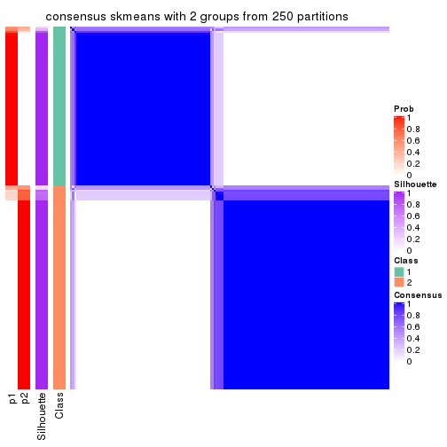</p>

</div>
<div id='tab-ATC-skmeans-consensus-heatmap-2'>
<pre><code class="r">consensus_heatmap(res, k = 3)
</code></pre>

<p>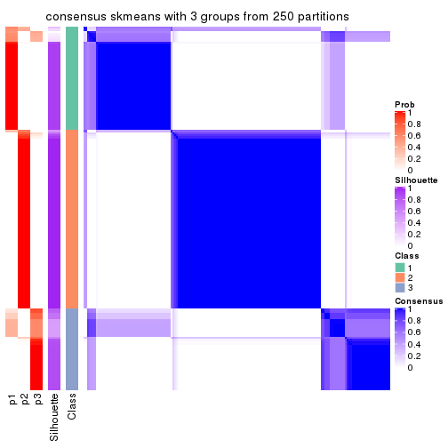</p>

</div>
<div id='tab-ATC-skmeans-consensus-heatmap-3'>
<pre><code class="r">consensus_heatmap(res, k = 4)
</code></pre>

<p>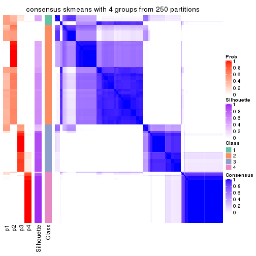</p>

</div>
<div id='tab-ATC-skmeans-consensus-heatmap-4'>
<pre><code class="r">consensus_heatmap(res, k = 5)
</code></pre>

<p>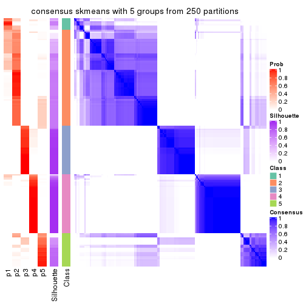</p>

</div>
<div id='tab-ATC-skmeans-consensus-heatmap-5'>
<pre><code class="r">consensus_heatmap(res, k = 6)
</code></pre>

<p>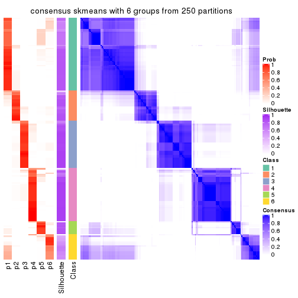</p>

</div>
</div>

Heatmaps for the membership of samples in all partitions to see how consistent they are:


<script>
$( function() {
	$( '#tabs-ATC-skmeans-membership-heatmap' ).tabs();
} );
</script>
<div id='tabs-ATC-skmeans-membership-heatmap'>
<ul>
<li><a href='#tab-ATC-skmeans-membership-heatmap-1'>k = 2</a></li>
<li><a href='#tab-ATC-skmeans-membership-heatmap-2'>k = 3</a></li>
<li><a href='#tab-ATC-skmeans-membership-heatmap-3'>k = 4</a></li>
<li><a href='#tab-ATC-skmeans-membership-heatmap-4'>k = 5</a></li>
<li><a href='#tab-ATC-skmeans-membership-heatmap-5'>k = 6</a></li>
</ul>
<div id='tab-ATC-skmeans-membership-heatmap-1'>
<pre><code class="r">membership_heatmap(res, k = 2)
</code></pre>

<p>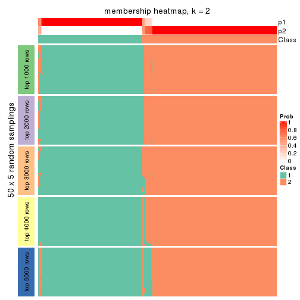</p>

</div>
<div id='tab-ATC-skmeans-membership-heatmap-2'>
<pre><code class="r">membership_heatmap(res, k = 3)
</code></pre>

<p>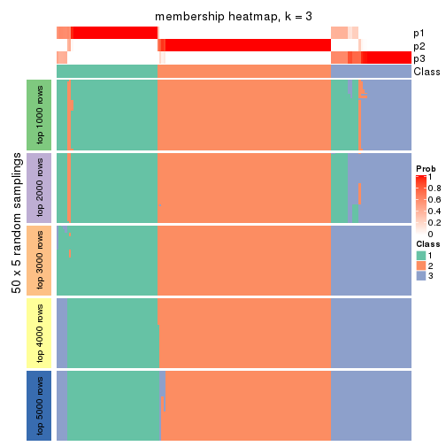</p>

</div>
<div id='tab-ATC-skmeans-membership-heatmap-3'>
<pre><code class="r">membership_heatmap(res, k = 4)
</code></pre>

<p>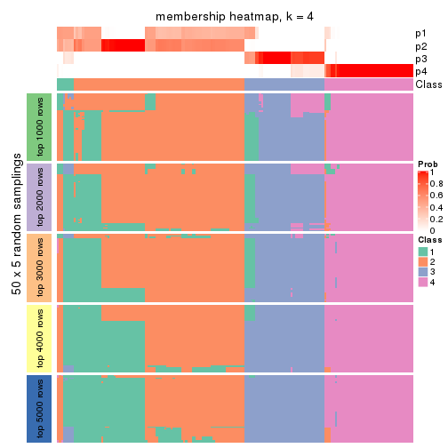</p>

</div>
<div id='tab-ATC-skmeans-membership-heatmap-4'>
<pre><code class="r">membership_heatmap(res, k = 5)
</code></pre>

<p>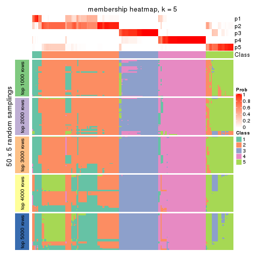</p>

</div>
<div id='tab-ATC-skmeans-membership-heatmap-5'>
<pre><code class="r">membership_heatmap(res, k = 6)
</code></pre>

<p>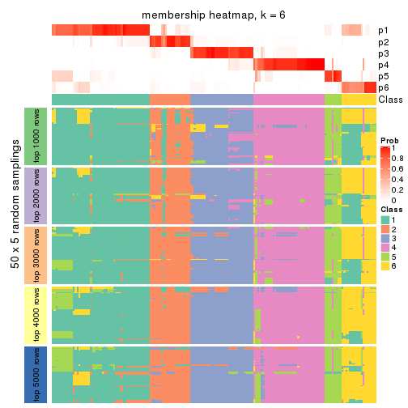</p>

</div>
</div>

As soon as we have had the classes for columns, we can look for signatures
which are significantly different between classes which can be candidate marks
for certain classes. Following are the heatmaps for signatures.


Signature heatmaps where rows are scaled:


<script>
$( function() {
	$( '#tabs-ATC-skmeans-get-signatures' ).tabs();
} );
</script>
<div id='tabs-ATC-skmeans-get-signatures'>
<ul>
<li><a href='#tab-ATC-skmeans-get-signatures-1'>k = 2</a></li>
<li><a href='#tab-ATC-skmeans-get-signatures-2'>k = 3</a></li>
<li><a href='#tab-ATC-skmeans-get-signatures-3'>k = 4</a></li>
<li><a href='#tab-ATC-skmeans-get-signatures-4'>k = 5</a></li>
<li><a href='#tab-ATC-skmeans-get-signatures-5'>k = 6</a></li>
</ul>
<div id='tab-ATC-skmeans-get-signatures-1'>
<pre><code class="r">get_signatures(res, k = 2)
</code></pre>

<p>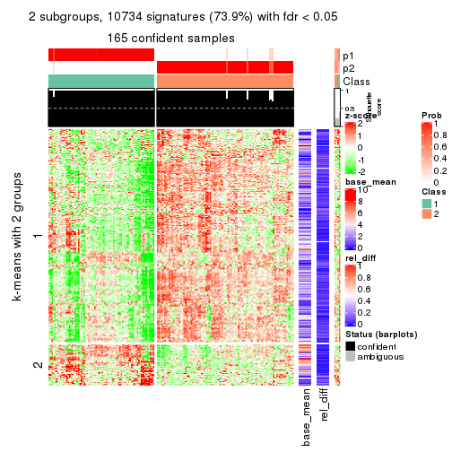</p>

</div>
<div id='tab-ATC-skmeans-get-signatures-2'>
<pre><code class="r">get_signatures(res, k = 3)
</code></pre>

<p>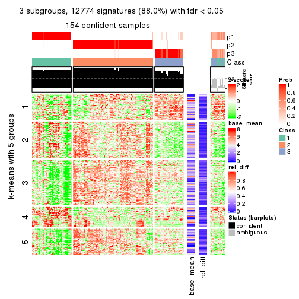</p>

</div>
<div id='tab-ATC-skmeans-get-signatures-3'>
<pre><code class="r">get_signatures(res, k = 4)
</code></pre>

<p>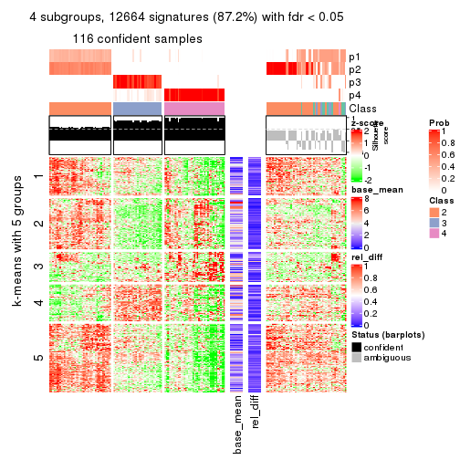</p>

</div>
<div id='tab-ATC-skmeans-get-signatures-4'>
<pre><code class="r">get_signatures(res, k = 5)
</code></pre>

<p>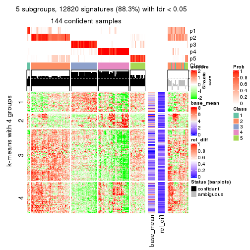</p>

</div>
<div id='tab-ATC-skmeans-get-signatures-5'>
<pre><code class="r">get_signatures(res, k = 6)
</code></pre>

<p>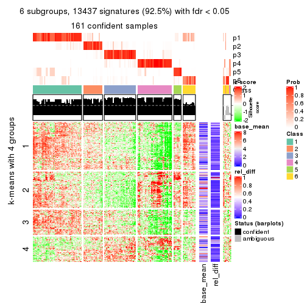</p>

</div>
</div>


Signature heatmaps where rows are not scaled:


<script>
$( function() {
	$( '#tabs-ATC-skmeans-get-signatures-no-scale' ).tabs();
} );
</script>
<div id='tabs-ATC-skmeans-get-signatures-no-scale'>
<ul>
<li><a href='#tab-ATC-skmeans-get-signatures-no-scale-1'>k = 2</a></li>
<li><a href='#tab-ATC-skmeans-get-signatures-no-scale-2'>k = 3</a></li>
<li><a href='#tab-ATC-skmeans-get-signatures-no-scale-3'>k = 4</a></li>
<li><a href='#tab-ATC-skmeans-get-signatures-no-scale-4'>k = 5</a></li>
<li><a href='#tab-ATC-skmeans-get-signatures-no-scale-5'>k = 6</a></li>
</ul>
<div id='tab-ATC-skmeans-get-signatures-no-scale-1'>
<pre><code class="r">get_signatures(res, k = 2, scale_rows = FALSE)
</code></pre>

<p>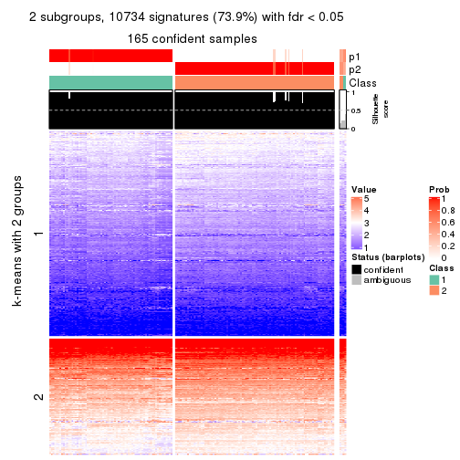</p>

</div>
<div id='tab-ATC-skmeans-get-signatures-no-scale-2'>
<pre><code class="r">get_signatures(res, k = 3, scale_rows = FALSE)
</code></pre>

<p>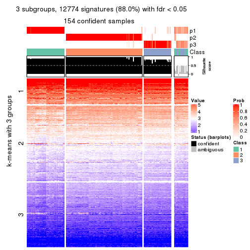</p>

</div>
<div id='tab-ATC-skmeans-get-signatures-no-scale-3'>
<pre><code class="r">get_signatures(res, k = 4, scale_rows = FALSE)
</code></pre>

<p>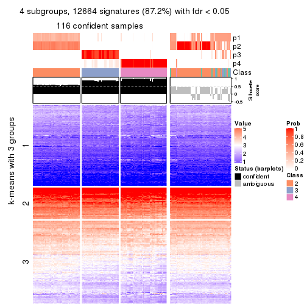</p>

</div>
<div id='tab-ATC-skmeans-get-signatures-no-scale-4'>
<pre><code class="r">get_signatures(res, k = 5, scale_rows = FALSE)
</code></pre>

<p>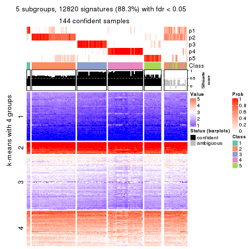</p>

</div>
<div id='tab-ATC-skmeans-get-signatures-no-scale-5'>
<pre><code class="r">get_signatures(res, k = 6, scale_rows = FALSE)
</code></pre>

<p>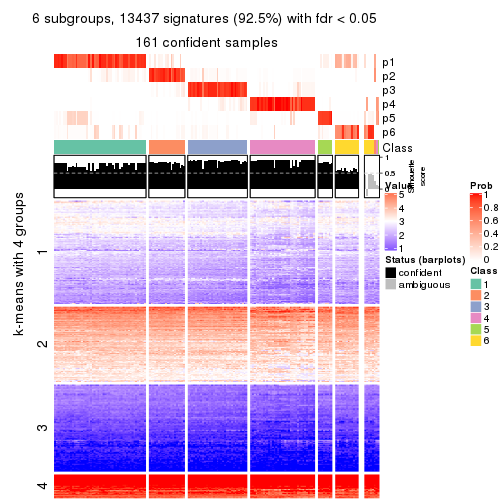</p>

</div>
</div>


Compare the overlap of signatures from different k:

```r
compare_signatures(res)
```

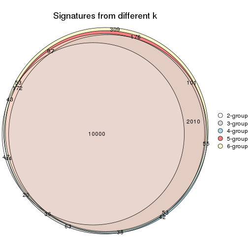

`get_signature()` returns a data frame invisibly. TO get the list of signatures, the function
call should be assigned to a variable explicitly. In following code, if `plot` argument is set
to `FALSE`, no heatmap is plotted while only the differential analysis is performed.

```r
# code only for demonstration
tb = get_signature(res, k = ..., plot = FALSE)
```

An example of the output of `tb` is:

```
#>   which_row         fdr    mean_1    mean_2 scaled_mean_1 scaled_mean_2 km
#> 1        38 0.042760348  8.373488  9.131774    -0.5533452     0.5164555  1
#> 2        40 0.018707592  7.106213  8.469186    -0.6173731     0.5762149  1
#> 3        55 0.019134737 10.221463 11.207825    -0.6159697     0.5749050  1
#> 4        59 0.006059896  5.921854  7.869574    -0.6899429     0.6439467  1
#> 5        60 0.018055526  8.928898 10.211722    -0.6204761     0.5791110  1
#> 6        98 0.009384629 15.714769 14.887706     0.6635654    -0.6193277  2
...
```

The columns in `tb` are:

1. `which_row`: row indices corresponding to the input matrix.
2. `fdr`: FDR for the differential test. 
3. `mean_x`: The mean value in group x.
4. `scaled_mean_x`: The mean value in group x after rows are scaled.
5. `km`: Row groups if k-means clustering is applied to rows.


UMAP plot which shows how samples are separated.


<script>
$( function() {
	$( '#tabs-ATC-skmeans-dimension-reduction' ).tabs();
} );
</script>
<div id='tabs-ATC-skmeans-dimension-reduction'>
<ul>
<li><a href='#tab-ATC-skmeans-dimension-reduction-1'>k = 2</a></li>
<li><a href='#tab-ATC-skmeans-dimension-reduction-2'>k = 3</a></li>
<li><a href='#tab-ATC-skmeans-dimension-reduction-3'>k = 4</a></li>
<li><a href='#tab-ATC-skmeans-dimension-reduction-4'>k = 5</a></li>
<li><a href='#tab-ATC-skmeans-dimension-reduction-5'>k = 6</a></li>
</ul>
<div id='tab-ATC-skmeans-dimension-reduction-1'>
<pre><code class="r">dimension_reduction(res, k = 2, method = &quot;UMAP&quot;)
</code></pre>

<p>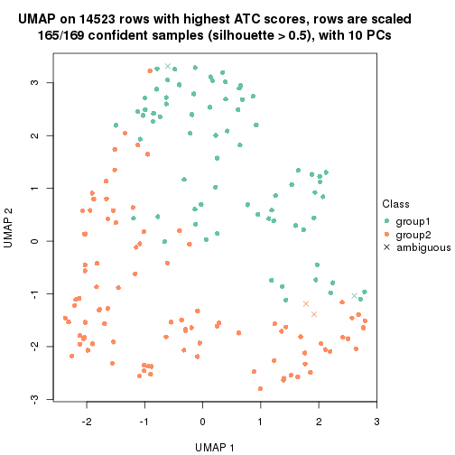</p>

</div>
<div id='tab-ATC-skmeans-dimension-reduction-2'>
<pre><code class="r">dimension_reduction(res, k = 3, method = &quot;UMAP&quot;)
</code></pre>

<p>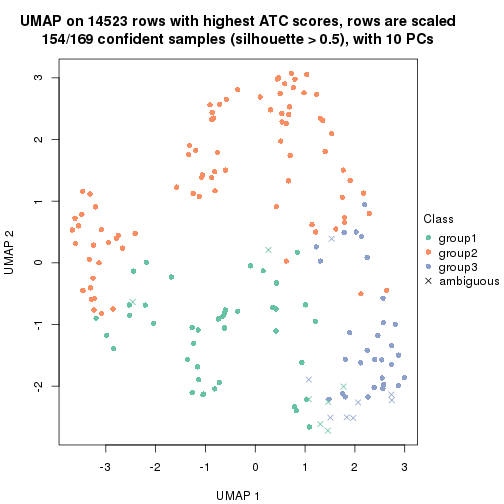</p>

</div>
<div id='tab-ATC-skmeans-dimension-reduction-3'>
<pre><code class="r">dimension_reduction(res, k = 4, method = &quot;UMAP&quot;)
</code></pre>

<p>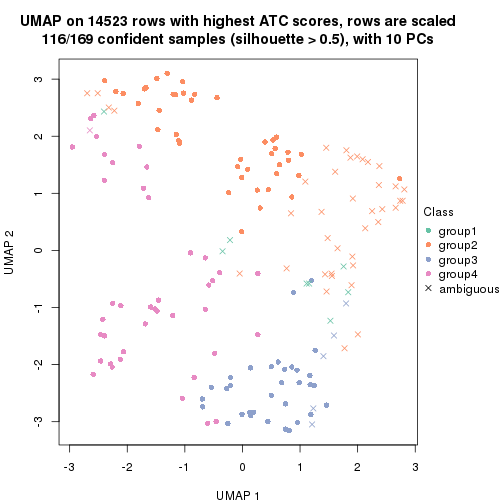</p>

</div>
<div id='tab-ATC-skmeans-dimension-reduction-4'>
<pre><code class="r">dimension_reduction(res, k = 5, method = &quot;UMAP&quot;)
</code></pre>

<p>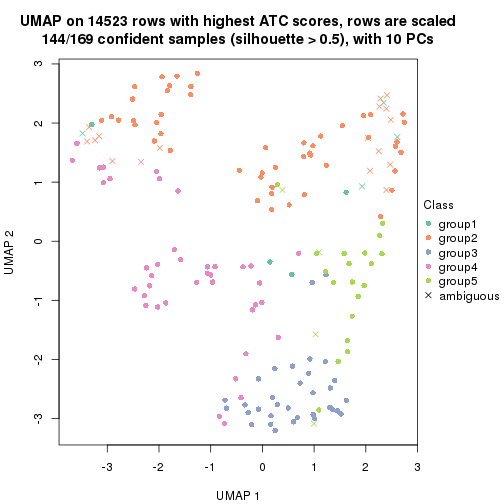</p>

</div>
<div id='tab-ATC-skmeans-dimension-reduction-5'>
<pre><code class="r">dimension_reduction(res, k = 6, method = &quot;UMAP&quot;)
</code></pre>

<p>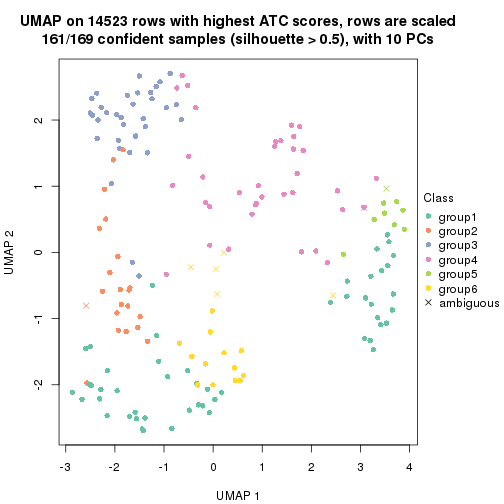</p>

</div>
</div>


Following heatmap shows how subgroups are split when increasing `k`:

```r
collect_classes(res)
```

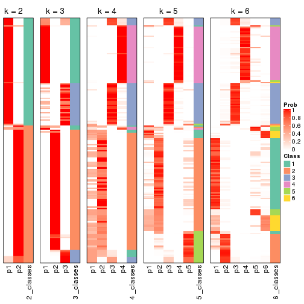


If matrix rows can be associated to genes, consider to use `GO_Enrichment(res,
...)` to perform function enrichment for the signature genes.


 

---------------------------------------------------


### ATC:pam


The object with results only for a single top-value method and a single partition method 
can be extracted as:

```r
res = res_list["ATC", "pam"]
# you can also extract it by
# res = res_list["ATC:pam"]
```

A summary of `res` and all the functions that can be applied to it:

```r
res
```

```
#> A 'ConsensusPartition' object with k = 2, 3, 4, 5, 6.
#>   On a matrix with 14523 rows and 169 columns.
#>   Top rows (1000, 2000, 3000, 4000, 5000) are extracted by 'ATC' method.
#>   Subgroups are detected by 'pam' method.
#>   Performed in total 1250 partitions by row resampling.
#>   Best k for subgroups seems to be 3.
#> 
#> Following methods can be applied to this 'ConsensusPartition' object:
#>  [1] "cola_report"             "collect_classes"         "collect_plots"          
#>  [4] "collect_stats"           "colnames"                "compare_signatures"     
#>  [7] "consensus_heatmap"       "dimension_reduction"     "functional_enrichment"  
#> [10] "get_anno_col"            "get_anno"                "get_classes"            
#> [13] "get_consensus"           "get_matrix"              "get_membership"         
#> [16] "get_param"               "get_signatures"          "get_stats"              
#> [19] "is_best_k"               "is_stable_k"             "membership_heatmap"     
#> [22] "ncol"                    "nrow"                    "plot_ecdf"              
#> [25] "rownames"                "select_partition_number" "show"                   
#> [28] "suggest_best_k"          "test_to_known_factors"
```

`collect_plots()` function collects all the plots made from `res` for all `k` (number of partitions)
into one single page to provide an easy and fast comparison between different `k`.

```r
collect_plots(res)
```

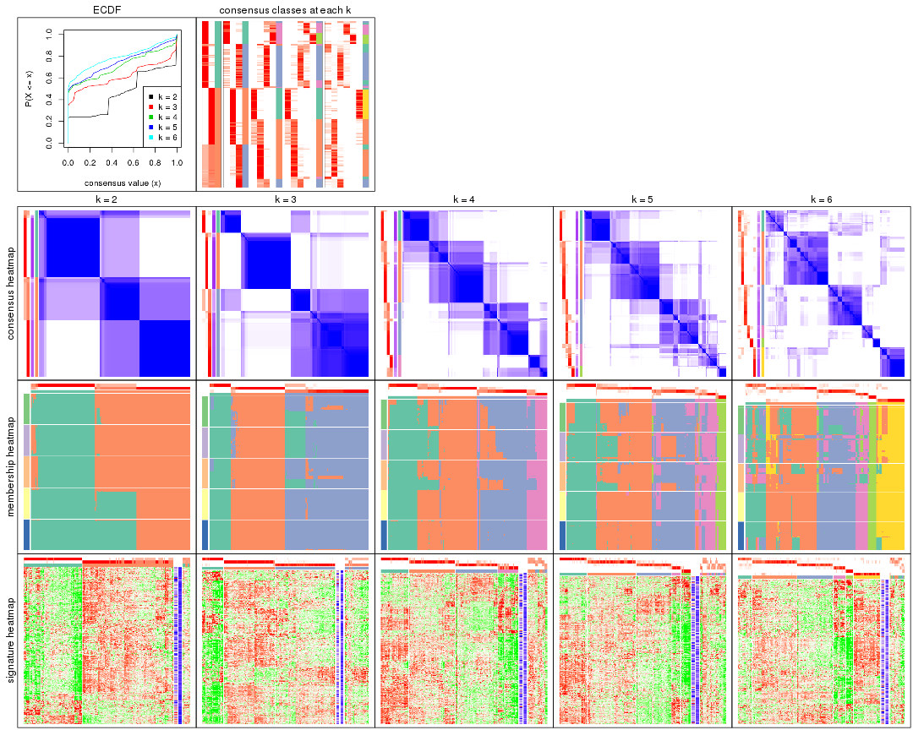

The plots are:

- The first row: a plot of the ECDF (Empirical cumulative distribution
  function) curves of the consensus matrix for each `k` and the heatmap of
  predicted classes for each `k`.
- The second row: heatmaps of the consensus matrix for each `k`.
- The third row: heatmaps of the membership matrix for each `k`.
- The fouth row: heatmaps of the signatures for each `k`.

All the plots in panels can be made by individual functions and they are
plotted later in this section.

`select_partition_number()` produces several plots showing different
statistics for choosing "optimized" `k`. There are following statistics:

- ECDF curves of the consensus matrix for each `k`;
- 1-PAC. [The PAC
  score](https://en.wikipedia.org/wiki/Consensus_clustering#Over-interpretation_potential_of_consensus_clustering)
  measures the proportion of the ambiguous subgrouping.
- Mean silhouette score.
- Concordance. The mean probability of fiting the consensus class ids in all
  partitions.
- Area increased. Denote $A_k$ as the area under the ECDF curve for current
  `k`, the area increased is defined as $A_k - A_{k-1}$.
- Rand index. The percent of pairs of samples that are both in a same cluster
  or both are not in a same cluster in the partition of k and k-1.
- Jaccard index. The ratio of pairs of samples are both in a same cluster in
  the partition of k and k-1 and the pairs of samples are both in a same
  cluster in the partition k or k-1.

The detailed explanations of these statistics can be found in [the cola
vignette](http://bioconductor.org/packages/devel/bioc/vignettes/cola/inst/doc/cola.html#toc_13).

Generally speaking, lower PAC score, higher mean silhouette score or higher
concordance corresponds to better partition. Rand index and Jaccard index
measure how similar the current partition is compared to partition with `k-1`.
If they are too similar, we won't accept `k` is better than `k-1`.

```r
select_partition_number(res)
```

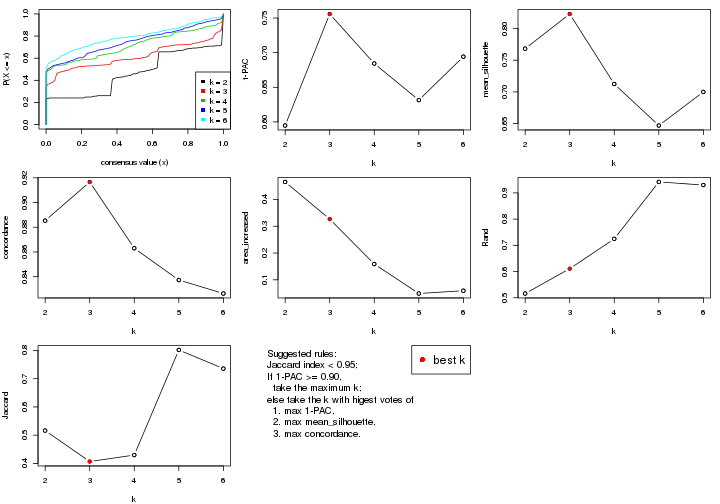

The numeric values for all these statistics can be obtained by `get_stats()`.

```r
get_stats(res)
```

```
#>   k 1-PAC mean_silhouette concordance area_increased  Rand Jaccard
#> 2 2 0.595           0.768       0.885         0.4652 0.516   0.516
#> 3 3 0.756           0.823       0.917         0.3266 0.611   0.407
#> 4 4 0.684           0.712       0.863         0.1588 0.725   0.429
#> 5 5 0.632           0.647       0.837         0.0488 0.942   0.802
#> 6 6 0.694           0.700       0.826         0.0594 0.930   0.736
```

`suggest_best_k()` suggests the best $k$ based on these statistics. The rules are as follows:

- All $k$ with Jaccard index larger than 0.95 are removed because the increase of
  the partition number does not provides enough extra information. If all $k$ are removed,
  the best $k$ is assigned by `NA`.
- For $k$ with 1-PAC larger than 0.9, the maximal $k$ is taken as the "best k". Other $k$ is called "optional k".
- If it does not fit the second rule. The $k$ with the highest vote of highest
  1-PAC, mean silhouette and concordance is taken as the "best k".

```r
suggest_best_k(res)
```

```
#> [1] 3
```


Following shows the table of the partitions (You need to click the **show/hide
code output** link to see it). The membership matrix (columns with name `p*`)
is inferred by
[`clue::cl_consensus()`](https://www.rdocumentation.org/link/cl_consensus?package=clue)
function with the `SE` method. Basically the value in the membership matrix
represents the probability to belong to a certain group. The finall class
label for an item is determined with the group with highest probability it
belongs to.

In `get_classes()` function, the entropy is calculated from the membership
matrix and the silhouette score is calculated from the consensus matrix.


<script>
$( function() {
	$( '#tabs-ATC-pam-get-classes' ).tabs();
} );
</script>
<div id='tabs-ATC-pam-get-classes'>
<ul>
<li><a href='#tab-ATC-pam-get-classes-1'>k = 2</a></li>
<li><a href='#tab-ATC-pam-get-classes-2'>k = 3</a></li>
<li><a href='#tab-ATC-pam-get-classes-3'>k = 4</a></li>
<li><a href='#tab-ATC-pam-get-classes-4'>k = 5</a></li>
<li><a href='#tab-ATC-pam-get-classes-5'>k = 6</a></li>
</ul>

<div id='tab-ATC-pam-get-classes-1'>
<p><a id='tab-ATC-pam-get-classes-1-a' style='color:#0366d6' href='#'>show/hide code output</a></p>
<pre><code class="r">cbind(get_classes(res, k = 2), get_membership(res, k = 2))
</code></pre>

<pre><code>#&gt;            class entropy silhouette    p1    p2
#&gt; SRR2052702     2  0.0000     0.8001 0.000 1.000
#&gt; SRR2052701     2  0.0000     0.8001 0.000 1.000
#&gt; SRR2052700     1  0.9954    -0.1876 0.540 0.460
#&gt; SRR2052699     2  0.9491     0.6243 0.368 0.632
#&gt; SRR2052698     2  0.9491     0.6243 0.368 0.632
#&gt; SRR2052708     1  0.7602     0.6081 0.780 0.220
#&gt; SRR2052749     2  0.9491     0.6243 0.368 0.632
#&gt; SRR2052786     2  0.0000     0.8001 0.000 1.000
#&gt; SRR2052825     1  0.0000     0.9416 1.000 0.000
#&gt; SRR2052824     1  0.0000     0.9416 1.000 0.000
#&gt; SRR2052823     2  0.0000     0.8001 0.000 1.000
#&gt; SRR2052822     2  0.9491     0.6243 0.368 0.632
#&gt; SRR2052821     2  0.0000     0.8001 0.000 1.000
#&gt; SRR2052820     1  0.0000     0.9416 1.000 0.000
#&gt; SRR2052819     1  0.0000     0.9416 1.000 0.000
#&gt; SRR2052818     2  0.0000     0.8001 0.000 1.000
#&gt; SRR2052817     2  0.9491     0.6243 0.368 0.632
#&gt; SRR2052816     2  0.9491     0.6243 0.368 0.632
#&gt; SRR2052815     1  0.0000     0.9416 1.000 0.000
#&gt; SRR2052814     1  0.0000     0.9416 1.000 0.000
#&gt; SRR2052813     2  0.0000     0.8001 0.000 1.000
#&gt; SRR2052812     2  0.0000     0.8001 0.000 1.000
#&gt; SRR2052811     2  0.0000     0.8001 0.000 1.000
#&gt; SRR2052810     1  0.0938     0.9287 0.988 0.012
#&gt; SRR2052809     2  0.9491     0.6243 0.368 0.632
#&gt; SRR2052808     2  0.9491     0.6243 0.368 0.632
#&gt; SRR2052807     1  0.0000     0.9416 1.000 0.000
#&gt; SRR2052806     2  0.0000     0.8001 0.000 1.000
#&gt; SRR2052805     1  0.0000     0.9416 1.000 0.000
#&gt; SRR2052804     1  0.0000     0.9416 1.000 0.000
#&gt; SRR2052803     2  0.9552     0.6111 0.376 0.624
#&gt; SRR2052802     1  0.0000     0.9416 1.000 0.000
#&gt; SRR2052801     1  0.0000     0.9416 1.000 0.000
#&gt; SRR2052800     1  0.0000     0.9416 1.000 0.000
#&gt; SRR2052799     1  0.0000     0.9416 1.000 0.000
#&gt; SRR2052798     2  0.9491     0.6243 0.368 0.632
#&gt; SRR2052797     2  0.9491     0.6243 0.368 0.632
#&gt; SRR2052796     1  0.0000     0.9416 1.000 0.000
#&gt; SRR2052795     1  0.0376     0.9374 0.996 0.004
#&gt; SRR2052794     1  0.0000     0.9416 1.000 0.000
#&gt; SRR2052793     1  0.0000     0.9416 1.000 0.000
#&gt; SRR2052792     1  0.0000     0.9416 1.000 0.000
#&gt; SRR2052791     1  0.0000     0.9416 1.000 0.000
#&gt; SRR2052790     2  0.9491     0.6243 0.368 0.632
#&gt; SRR2052789     1  0.9993    -0.2753 0.516 0.484
#&gt; SRR2052788     1  0.0000     0.9416 1.000 0.000
#&gt; SRR2052787     2  0.0000     0.8001 0.000 1.000
#&gt; SRR2052785     1  0.9710     0.0610 0.600 0.400
#&gt; SRR2052784     2  0.9491     0.6243 0.368 0.632
#&gt; SRR2052783     2  0.9491     0.6243 0.368 0.632
#&gt; SRR2052782     2  0.9491     0.6243 0.368 0.632
#&gt; SRR2052781     2  0.9491     0.6243 0.368 0.632
#&gt; SRR2052780     2  0.9993     0.3591 0.484 0.516
#&gt; SRR2052777     2  0.9491     0.6243 0.368 0.632
#&gt; SRR2052779     2  0.9491     0.6243 0.368 0.632
#&gt; SRR2052778     1  0.0000     0.9416 1.000 0.000
#&gt; SRR2052776     2  0.9491     0.6243 0.368 0.632
#&gt; SRR2052775     1  0.0000     0.9416 1.000 0.000
#&gt; SRR2052773     2  0.9491     0.6243 0.368 0.632
#&gt; SRR2052772     1  0.0000     0.9416 1.000 0.000
#&gt; SRR2052774     2  0.9491     0.6243 0.368 0.632
#&gt; SRR2052771     1  0.0000     0.9416 1.000 0.000
#&gt; SRR2052769     1  0.0000     0.9416 1.000 0.000
#&gt; SRR2052770     1  0.0000     0.9416 1.000 0.000
#&gt; SRR2052768     2  0.0000     0.8001 0.000 1.000
#&gt; SRR2052767     2  0.0000     0.8001 0.000 1.000
#&gt; SRR2052766     1  0.0000     0.9416 1.000 0.000
#&gt; SRR2052765     2  0.0000     0.8001 0.000 1.000
#&gt; SRR2052763     1  0.0000     0.9416 1.000 0.000
#&gt; SRR2052764     2  0.0000     0.8001 0.000 1.000
#&gt; SRR2052761     1  0.9896    -0.1095 0.560 0.440
#&gt; SRR2052760     2  0.0000     0.8001 0.000 1.000
#&gt; SRR2052759     1  0.0000     0.9416 1.000 0.000
#&gt; SRR2052762     2  0.9491     0.6243 0.368 0.632
#&gt; SRR2052758     1  0.8207     0.5251 0.744 0.256
#&gt; SRR2052756     1  0.7602     0.6084 0.780 0.220
#&gt; SRR2052757     2  0.9522     0.6178 0.372 0.628
#&gt; SRR2052755     2  0.0000     0.8001 0.000 1.000
#&gt; SRR2052754     1  0.0000     0.9416 1.000 0.000
#&gt; SRR2052753     2  0.0000     0.8001 0.000 1.000
#&gt; SRR2052752     1  0.0000     0.9416 1.000 0.000
#&gt; SRR2052750     2  0.9491     0.6243 0.368 0.632
#&gt; SRR2052751     2  0.9491     0.6243 0.368 0.632
#&gt; SRR2052748     1  0.0000     0.9416 1.000 0.000
#&gt; SRR2052747     2  0.0000     0.8001 0.000 1.000
#&gt; SRR2052746     1  0.0000     0.9416 1.000 0.000
#&gt; SRR2052745     1  0.0000     0.9416 1.000 0.000
#&gt; SRR2052744     2  0.0000     0.8001 0.000 1.000
#&gt; SRR2052741     2  0.0000     0.8001 0.000 1.000
#&gt; SRR2052743     2  0.0000     0.8001 0.000 1.000
#&gt; SRR2052740     2  0.0000     0.8001 0.000 1.000
#&gt; SRR2052742     2  0.9491     0.6243 0.368 0.632
#&gt; SRR2052739     2  0.0000     0.8001 0.000 1.000
#&gt; SRR2052738     1  0.0000     0.9416 1.000 0.000
#&gt; SRR2052736     2  0.0000     0.8001 0.000 1.000
#&gt; SRR2052735     2  0.0000     0.8001 0.000 1.000
#&gt; SRR2052734     2  0.0000     0.8001 0.000 1.000
#&gt; SRR2052737     2  0.9491     0.6243 0.368 0.632
#&gt; SRR2052733     1  0.0000     0.9416 1.000 0.000
#&gt; SRR2052732     2  0.0000     0.8001 0.000 1.000
#&gt; SRR2052731     1  0.0000     0.9416 1.000 0.000
#&gt; SRR2052729     2  0.0000     0.8001 0.000 1.000
#&gt; SRR2052728     2  0.0000     0.8001 0.000 1.000
#&gt; SRR2052730     1  0.0000     0.9416 1.000 0.000
#&gt; SRR2052727     2  0.0000     0.8001 0.000 1.000
#&gt; SRR2052725     2  0.0000     0.8001 0.000 1.000
#&gt; SRR2052726     2  0.0000     0.8001 0.000 1.000
#&gt; SRR2052724     1  0.0000     0.9416 1.000 0.000
#&gt; SRR2052723     1  0.0000     0.9416 1.000 0.000
#&gt; SRR2052722     1  0.0000     0.9416 1.000 0.000
#&gt; SRR2052721     2  0.0000     0.8001 0.000 1.000
#&gt; SRR2052720     2  0.0000     0.8001 0.000 1.000
#&gt; SRR2052719     2  0.0000     0.8001 0.000 1.000
#&gt; SRR2052718     2  0.0000     0.8001 0.000 1.000
#&gt; SRR2052717     2  0.8327     0.6860 0.264 0.736
#&gt; SRR2052714     1  0.0000     0.9416 1.000 0.000
#&gt; SRR2052716     1  0.0000     0.9416 1.000 0.000
#&gt; SRR2052715     1  0.0000     0.9416 1.000 0.000
#&gt; SRR2052713     2  0.9795     0.5319 0.416 0.584
#&gt; SRR2052712     1  0.0000     0.9416 1.000 0.000
#&gt; SRR2052711     1  0.0000     0.9416 1.000 0.000
#&gt; SRR2052710     2  0.9491     0.6243 0.368 0.632
#&gt; SRR2052707     1  0.0000     0.9416 1.000 0.000
#&gt; SRR2052709     1  0.0000     0.9416 1.000 0.000
#&gt; SRR2052704     1  0.0000     0.9416 1.000 0.000
#&gt; SRR2052705     2  0.0000     0.8001 0.000 1.000
#&gt; SRR2052697     2  0.0000     0.8001 0.000 1.000
#&gt; SRR2052703     2  0.9993     0.3591 0.484 0.516
#&gt; SRR2052696     2  0.9491     0.6243 0.368 0.632
#&gt; SRR2052706     2  0.9491     0.6243 0.368 0.632
#&gt; SRR2052695     2  0.0000     0.8001 0.000 1.000
#&gt; SRR2052694     2  0.0000     0.8001 0.000 1.000
#&gt; SRR2052692     1  0.0000     0.9416 1.000 0.000
#&gt; SRR2052693     2  0.9998     0.3348 0.492 0.508
#&gt; SRR2052691     2  0.0000     0.8001 0.000 1.000
#&gt; SRR2052690     2  0.8608     0.6751 0.284 0.716
#&gt; SRR2052689     1  0.0000     0.9416 1.000 0.000
#&gt; SRR2052687     1  0.0000     0.9416 1.000 0.000
#&gt; SRR2052686     2  0.0000     0.8001 0.000 1.000
#&gt; SRR2052688     2  0.0000     0.8001 0.000 1.000
#&gt; SRR2052684     1  0.0000     0.9416 1.000 0.000
#&gt; SRR2052685     2  0.0000     0.8001 0.000 1.000
#&gt; SRR2052683     1  0.0000     0.9416 1.000 0.000
#&gt; SRR2052681     1  0.9881    -0.0932 0.564 0.436
#&gt; SRR2052680     1  0.0000     0.9416 1.000 0.000
#&gt; SRR2052682     2  0.0000     0.8001 0.000 1.000
#&gt; SRR2052679     2  0.0000     0.8001 0.000 1.000
#&gt; SRR2052678     1  0.0000     0.9416 1.000 0.000
#&gt; SRR2052677     2  0.9491     0.6243 0.368 0.632
#&gt; SRR2052675     2  0.0000     0.8001 0.000 1.000
#&gt; SRR2052676     2  0.0000     0.8001 0.000 1.000
#&gt; SRR2052674     2  0.9491     0.6243 0.368 0.632
#&gt; SRR2052672     1  0.0000     0.9416 1.000 0.000
#&gt; SRR2052673     2  0.0000     0.8001 0.000 1.000
#&gt; SRR2052671     2  0.0000     0.8001 0.000 1.000
#&gt; SRR2052670     2  0.9491     0.6243 0.368 0.632
#&gt; SRR2052669     2  0.0000     0.8001 0.000 1.000
#&gt; SRR2052668     2  0.9491     0.6243 0.368 0.632
#&gt; SRR2052667     2  0.0000     0.8001 0.000 1.000
#&gt; SRR2052666     2  0.9608     0.5964 0.384 0.616
#&gt; SRR2052665     2  0.0000     0.8001 0.000 1.000
#&gt; SRR2052664     1  0.0000     0.9416 1.000 0.000
#&gt; SRR2052663     2  0.0000     0.8001 0.000 1.000
#&gt; SRR2052662     2  0.0000     0.8001 0.000 1.000
#&gt; SRR2052661     2  0.0000     0.8001 0.000 1.000
#&gt; SRR2052660     2  0.9522     0.6178 0.372 0.628
#&gt; SRR2052659     1  0.0000     0.9416 1.000 0.000
#&gt; SRR2052658     2  0.9491     0.6243 0.368 0.632
#&gt; SRR2052657     2  0.9522     0.6178 0.372 0.628
</code></pre>

<script>
$('#tab-ATC-pam-get-classes-1-a').parent().next().next().hide();
$('#tab-ATC-pam-get-classes-1-a').click(function(){
  $('#tab-ATC-pam-get-classes-1-a').parent().next().next().toggle();
  return(false);
});
</script>
</div>

<div id='tab-ATC-pam-get-classes-2'>
<p><a id='tab-ATC-pam-get-classes-2-a' style='color:#0366d6' href='#'>show/hide code output</a></p>
<pre><code class="r">cbind(get_classes(res, k = 3), get_membership(res, k = 3))
</code></pre>

<pre><code>#&gt;            class entropy silhouette    p1    p2    p3
#&gt; SRR2052702     2  0.0000      0.962 0.000 1.000 0.000
#&gt; SRR2052701     2  0.0000      0.962 0.000 1.000 0.000
#&gt; SRR2052700     3  0.1163      0.840 0.000 0.028 0.972
#&gt; SRR2052699     3  0.1964      0.833 0.000 0.056 0.944
#&gt; SRR2052698     3  0.1753      0.836 0.000 0.048 0.952
#&gt; SRR2052708     3  0.0000      0.840 0.000 0.000 1.000
#&gt; SRR2052749     3  0.1964      0.833 0.000 0.056 0.944
#&gt; SRR2052786     2  0.0000      0.962 0.000 1.000 0.000
#&gt; SRR2052825     1  0.0000      0.957 1.000 0.000 0.000
#&gt; SRR2052824     1  0.2625      0.886 0.916 0.000 0.084
#&gt; SRR2052823     2  0.0000      0.962 0.000 1.000 0.000
#&gt; SRR2052822     3  0.1964      0.833 0.000 0.056 0.944
#&gt; SRR2052821     2  0.0000      0.962 0.000 1.000 0.000
#&gt; SRR2052820     3  0.5988      0.493 0.368 0.000 0.632
#&gt; SRR2052819     1  0.0000      0.957 1.000 0.000 0.000
#&gt; SRR2052818     2  0.0000      0.962 0.000 1.000 0.000
#&gt; SRR2052817     3  0.0237      0.841 0.000 0.004 0.996
#&gt; SRR2052816     3  0.1964      0.833 0.000 0.056 0.944
#&gt; SRR2052815     1  0.0000      0.957 1.000 0.000 0.000
#&gt; SRR2052814     3  0.5988      0.493 0.368 0.000 0.632
#&gt; SRR2052813     2  0.0000      0.962 0.000 1.000 0.000
#&gt; SRR2052812     2  0.0000      0.962 0.000 1.000 0.000
#&gt; SRR2052811     2  0.0000      0.962 0.000 1.000 0.000
#&gt; SRR2052810     3  0.0592      0.839 0.012 0.000 0.988
#&gt; SRR2052809     3  0.1964      0.833 0.000 0.056 0.944
#&gt; SRR2052808     3  0.1860      0.834 0.000 0.052 0.948
#&gt; SRR2052807     1  0.0000      0.957 1.000 0.000 0.000
#&gt; SRR2052806     2  0.5760      0.542 0.000 0.672 0.328
#&gt; SRR2052805     3  0.0747      0.836 0.016 0.000 0.984
#&gt; SRR2052804     1  0.4178      0.792 0.828 0.000 0.172
#&gt; SRR2052803     3  0.1529      0.838 0.000 0.040 0.960
#&gt; SRR2052802     1  0.0000      0.957 1.000 0.000 0.000
#&gt; SRR2052801     1  0.0000      0.957 1.000 0.000 0.000
#&gt; SRR2052800     1  0.0000      0.957 1.000 0.000 0.000
#&gt; SRR2052799     1  0.0000      0.957 1.000 0.000 0.000
#&gt; SRR2052798     3  0.1643      0.837 0.000 0.044 0.956
#&gt; SRR2052797     3  0.3686      0.761 0.000 0.140 0.860
#&gt; SRR2052796     1  0.0000      0.957 1.000 0.000 0.000
#&gt; SRR2052795     3  0.0000      0.840 0.000 0.000 1.000
#&gt; SRR2052794     1  0.0000      0.957 1.000 0.000 0.000
#&gt; SRR2052793     1  0.0000      0.957 1.000 0.000 0.000
#&gt; SRR2052792     1  0.0000      0.957 1.000 0.000 0.000
#&gt; SRR2052791     3  0.5988      0.493 0.368 0.000 0.632
#&gt; SRR2052790     3  0.1964      0.833 0.000 0.056 0.944
#&gt; SRR2052789     3  0.0000      0.840 0.000 0.000 1.000
#&gt; SRR2052788     3  0.0000      0.840 0.000 0.000 1.000
#&gt; SRR2052787     2  0.0000      0.962 0.000 1.000 0.000
#&gt; SRR2052785     3  0.0000      0.840 0.000 0.000 1.000
#&gt; SRR2052784     3  0.1964      0.833 0.000 0.056 0.944
#&gt; SRR2052783     3  0.1964      0.833 0.000 0.056 0.944
#&gt; SRR2052782     3  0.2066      0.830 0.000 0.060 0.940
#&gt; SRR2052781     3  0.1643      0.837 0.000 0.044 0.956
#&gt; SRR2052780     3  0.0000      0.840 0.000 0.000 1.000
#&gt; SRR2052777     3  0.1964      0.833 0.000 0.056 0.944
#&gt; SRR2052779     3  0.1964      0.833 0.000 0.056 0.944
#&gt; SRR2052778     3  0.5988      0.493 0.368 0.000 0.632
#&gt; SRR2052776     3  0.1643      0.837 0.000 0.044 0.956
#&gt; SRR2052775     3  0.5968      0.499 0.364 0.000 0.636
#&gt; SRR2052773     3  0.0237      0.841 0.000 0.004 0.996
#&gt; SRR2052772     3  0.2165      0.812 0.064 0.000 0.936
#&gt; SRR2052774     3  0.0000      0.840 0.000 0.000 1.000
#&gt; SRR2052771     3  0.6062      0.463 0.384 0.000 0.616
#&gt; SRR2052769     3  0.5968      0.499 0.364 0.000 0.636
#&gt; SRR2052770     3  0.5988      0.493 0.368 0.000 0.632
#&gt; SRR2052768     2  0.0000      0.962 0.000 1.000 0.000
#&gt; SRR2052767     2  0.0000      0.962 0.000 1.000 0.000
#&gt; SRR2052766     1  0.0000      0.957 1.000 0.000 0.000
#&gt; SRR2052765     2  0.6215      0.312 0.000 0.572 0.428
#&gt; SRR2052763     3  0.3038      0.784 0.104 0.000 0.896
#&gt; SRR2052764     2  0.0000      0.962 0.000 1.000 0.000
#&gt; SRR2052761     3  0.0000      0.840 0.000 0.000 1.000
#&gt; SRR2052760     2  0.0000      0.962 0.000 1.000 0.000
#&gt; SRR2052759     3  0.5988      0.493 0.368 0.000 0.632
#&gt; SRR2052762     3  0.1643      0.837 0.000 0.044 0.956
#&gt; SRR2052758     3  0.0000      0.840 0.000 0.000 1.000
#&gt; SRR2052756     3  0.3043      0.802 0.084 0.008 0.908
#&gt; SRR2052757     3  0.1163      0.840 0.000 0.028 0.972
#&gt; SRR2052755     2  0.0000      0.962 0.000 1.000 0.000
#&gt; SRR2052754     1  0.0000      0.957 1.000 0.000 0.000
#&gt; SRR2052753     2  0.2356      0.891 0.000 0.928 0.072
#&gt; SRR2052752     3  0.3038      0.785 0.104 0.000 0.896
#&gt; SRR2052750     3  0.3686      0.761 0.000 0.140 0.860
#&gt; SRR2052751     3  0.3412      0.777 0.000 0.124 0.876
#&gt; SRR2052748     1  0.0424      0.953 0.992 0.000 0.008
#&gt; SRR2052747     2  0.5560      0.594 0.000 0.700 0.300
#&gt; SRR2052746     3  0.5988      0.493 0.368 0.000 0.632
#&gt; SRR2052745     3  0.6026      0.479 0.376 0.000 0.624
#&gt; SRR2052744     2  0.0000      0.962 0.000 1.000 0.000
#&gt; SRR2052741     2  0.0000      0.962 0.000 1.000 0.000
#&gt; SRR2052743     2  0.0000      0.962 0.000 1.000 0.000
#&gt; SRR2052740     2  0.0000      0.962 0.000 1.000 0.000
#&gt; SRR2052742     3  0.1964      0.833 0.000 0.056 0.944
#&gt; SRR2052739     2  0.0000      0.962 0.000 1.000 0.000
#&gt; SRR2052738     3  0.5988      0.493 0.368 0.000 0.632
#&gt; SRR2052736     2  0.0000      0.962 0.000 1.000 0.000
#&gt; SRR2052735     2  0.0000      0.962 0.000 1.000 0.000
#&gt; SRR2052734     2  0.0000      0.962 0.000 1.000 0.000
#&gt; SRR2052737     3  0.3038      0.796 0.000 0.104 0.896
#&gt; SRR2052733     3  0.5988      0.493 0.368 0.000 0.632
#&gt; SRR2052732     2  0.0000      0.962 0.000 1.000 0.000
#&gt; SRR2052731     3  0.0000      0.840 0.000 0.000 1.000
#&gt; SRR2052729     2  0.0000      0.962 0.000 1.000 0.000
#&gt; SRR2052728     2  0.0000      0.962 0.000 1.000 0.000
#&gt; SRR2052730     3  0.5988      0.493 0.368 0.000 0.632
#&gt; SRR2052727     2  0.0000      0.962 0.000 1.000 0.000
#&gt; SRR2052725     2  0.1753      0.916 0.000 0.952 0.048
#&gt; SRR2052726     2  0.0000      0.962 0.000 1.000 0.000
#&gt; SRR2052724     3  0.5988      0.493 0.368 0.000 0.632
#&gt; SRR2052723     3  0.5988      0.493 0.368 0.000 0.632
#&gt; SRR2052722     3  0.0000      0.840 0.000 0.000 1.000
#&gt; SRR2052721     2  0.0000      0.962 0.000 1.000 0.000
#&gt; SRR2052720     2  0.0000      0.962 0.000 1.000 0.000
#&gt; SRR2052719     2  0.0000      0.962 0.000 1.000 0.000
#&gt; SRR2052718     2  0.0000      0.962 0.000 1.000 0.000
#&gt; SRR2052717     3  0.5926      0.410 0.000 0.356 0.644
#&gt; SRR2052714     3  0.5988      0.493 0.368 0.000 0.632
#&gt; SRR2052716     3  0.5988      0.493 0.368 0.000 0.632
#&gt; SRR2052715     3  0.5988      0.493 0.368 0.000 0.632
#&gt; SRR2052713     3  0.1163      0.840 0.000 0.028 0.972
#&gt; SRR2052712     1  0.0000      0.957 1.000 0.000 0.000
#&gt; SRR2052711     3  0.6154      0.435 0.408 0.000 0.592
#&gt; SRR2052710     3  0.1529      0.838 0.000 0.040 0.960
#&gt; SRR2052707     3  0.0000      0.840 0.000 0.000 1.000
#&gt; SRR2052709     3  0.0000      0.840 0.000 0.000 1.000
#&gt; SRR2052704     3  0.6140      0.420 0.404 0.000 0.596
#&gt; SRR2052705     2  0.5905      0.494 0.000 0.648 0.352
#&gt; SRR2052697     2  0.0000      0.962 0.000 1.000 0.000
#&gt; SRR2052703     3  0.0000      0.840 0.000 0.000 1.000
#&gt; SRR2052696     3  0.1964      0.833 0.000 0.056 0.944
#&gt; SRR2052706     3  0.2356      0.822 0.000 0.072 0.928
#&gt; SRR2052695     2  0.0000      0.962 0.000 1.000 0.000
#&gt; SRR2052694     2  0.0000      0.962 0.000 1.000 0.000
#&gt; SRR2052692     3  0.0000      0.840 0.000 0.000 1.000
#&gt; SRR2052693     3  0.0000      0.840 0.000 0.000 1.000
#&gt; SRR2052691     2  0.0000      0.962 0.000 1.000 0.000
#&gt; SRR2052690     3  0.5968      0.401 0.000 0.364 0.636
#&gt; SRR2052689     1  0.4178      0.792 0.828 0.000 0.172
#&gt; SRR2052687     3  0.0000      0.840 0.000 0.000 1.000
#&gt; SRR2052686     2  0.0000      0.962 0.000 1.000 0.000
#&gt; SRR2052688     2  0.4291      0.763 0.000 0.820 0.180
#&gt; SRR2052684     1  0.0424      0.953 0.992 0.000 0.008
#&gt; SRR2052685     2  0.0000      0.962 0.000 1.000 0.000
#&gt; SRR2052683     1  0.4178      0.792 0.828 0.000 0.172
#&gt; SRR2052681     3  0.0424      0.841 0.000 0.008 0.992
#&gt; SRR2052680     1  0.4178      0.792 0.828 0.000 0.172
#&gt; SRR2052682     2  0.0000      0.962 0.000 1.000 0.000
#&gt; SRR2052679     2  0.0000      0.962 0.000 1.000 0.000
#&gt; SRR2052678     3  0.0000      0.840 0.000 0.000 1.000
#&gt; SRR2052677     3  0.4750      0.672 0.000 0.216 0.784
#&gt; SRR2052675     2  0.0000      0.962 0.000 1.000 0.000
#&gt; SRR2052676     2  0.0000      0.962 0.000 1.000 0.000
#&gt; SRR2052674     3  0.1964      0.833 0.000 0.056 0.944
#&gt; SRR2052672     3  0.5988      0.493 0.368 0.000 0.632
#&gt; SRR2052673     2  0.0000      0.962 0.000 1.000 0.000
#&gt; SRR2052671     2  0.0000      0.962 0.000 1.000 0.000
#&gt; SRR2052670     3  0.0000      0.840 0.000 0.000 1.000
#&gt; SRR2052669     2  0.0000      0.962 0.000 1.000 0.000
#&gt; SRR2052668     3  0.3619      0.765 0.000 0.136 0.864
#&gt; SRR2052667     2  0.1860      0.911 0.000 0.948 0.052
#&gt; SRR2052666     3  0.0000      0.840 0.000 0.000 1.000
#&gt; SRR2052665     2  0.0237      0.958 0.000 0.996 0.004
#&gt; SRR2052664     1  0.0000      0.957 1.000 0.000 0.000
#&gt; SRR2052663     2  0.0000      0.962 0.000 1.000 0.000
#&gt; SRR2052662     2  0.0000      0.962 0.000 1.000 0.000
#&gt; SRR2052661     2  0.0000      0.962 0.000 1.000 0.000
#&gt; SRR2052660     3  0.0000      0.840 0.000 0.000 1.000
#&gt; SRR2052659     3  0.0000      0.840 0.000 0.000 1.000
#&gt; SRR2052658     3  0.1964      0.833 0.000 0.056 0.944
#&gt; SRR2052657     3  0.0237      0.841 0.000 0.004 0.996
</code></pre>

<script>
$('#tab-ATC-pam-get-classes-2-a').parent().next().next().hide();
$('#tab-ATC-pam-get-classes-2-a').click(function(){
  $('#tab-ATC-pam-get-classes-2-a').parent().next().next().toggle();
  return(false);
});
</script>
</div>

<div id='tab-ATC-pam-get-classes-3'>
<p><a id='tab-ATC-pam-get-classes-3-a' style='color:#0366d6' href='#'>show/hide code output</a></p>
<pre><code class="r">cbind(get_classes(res, k = 4), get_membership(res, k = 4))
</code></pre>

<pre><code>#&gt;            class entropy silhouette    p1    p2    p3    p4
#&gt; SRR2052702     1  0.1211     0.9375 0.960 0.040 0.000 0.000
#&gt; SRR2052701     1  0.0000     0.9610 1.000 0.000 0.000 0.000
#&gt; SRR2052700     2  0.2281     0.7271 0.000 0.904 0.096 0.000
#&gt; SRR2052699     2  0.0000     0.8148 0.000 1.000 0.000 0.000
#&gt; SRR2052698     2  0.0000     0.8148 0.000 1.000 0.000 0.000
#&gt; SRR2052708     3  0.0921     0.7523 0.000 0.028 0.972 0.000
#&gt; SRR2052749     2  0.0000     0.8148 0.000 1.000 0.000 0.000
#&gt; SRR2052786     2  0.4967     0.3623 0.452 0.548 0.000 0.000
#&gt; SRR2052825     4  0.0000     0.7882 0.000 0.000 0.000 1.000
#&gt; SRR2052824     4  0.4933     0.5934 0.000 0.000 0.432 0.568
#&gt; SRR2052823     1  0.1211     0.9375 0.960 0.040 0.000 0.000
#&gt; SRR2052822     2  0.0000     0.8148 0.000 1.000 0.000 0.000
#&gt; SRR2052821     2  0.4998     0.2742 0.488 0.512 0.000 0.000
#&gt; SRR2052820     3  0.0000     0.7525 0.000 0.000 1.000 0.000
#&gt; SRR2052819     4  0.3074     0.7540 0.000 0.000 0.152 0.848
#&gt; SRR2052818     1  0.1211     0.9375 0.960 0.040 0.000 0.000
#&gt; SRR2052817     3  0.4977     0.4555 0.000 0.460 0.540 0.000
#&gt; SRR2052816     2  0.0336     0.8104 0.000 0.992 0.008 0.000
#&gt; SRR2052815     4  0.4925     0.5979 0.000 0.000 0.428 0.572
#&gt; SRR2052814     3  0.0000     0.7525 0.000 0.000 1.000 0.000
#&gt; SRR2052813     2  0.4830     0.4820 0.392 0.608 0.000 0.000
#&gt; SRR2052812     1  0.0188     0.9587 0.996 0.004 0.000 0.000
#&gt; SRR2052811     1  0.0000     0.9610 1.000 0.000 0.000 0.000
#&gt; SRR2052810     3  0.5483    -0.3606 0.000 0.016 0.536 0.448
#&gt; SRR2052809     2  0.0000     0.8148 0.000 1.000 0.000 0.000
#&gt; SRR2052808     2  0.0000     0.8148 0.000 1.000 0.000 0.000
#&gt; SRR2052807     4  0.0000     0.7882 0.000 0.000 0.000 1.000
#&gt; SRR2052806     1  0.4967     0.1100 0.548 0.452 0.000 0.000
#&gt; SRR2052805     3  0.3266     0.7132 0.000 0.168 0.832 0.000
#&gt; SRR2052804     4  0.4994     0.5257 0.000 0.000 0.480 0.520
#&gt; SRR2052803     2  0.0336     0.8090 0.000 0.992 0.008 0.000
#&gt; SRR2052802     4  0.0000     0.7882 0.000 0.000 0.000 1.000
#&gt; SRR2052801     4  0.0000     0.7882 0.000 0.000 0.000 1.000
#&gt; SRR2052800     4  0.0000     0.7882 0.000 0.000 0.000 1.000
#&gt; SRR2052799     4  0.0000     0.7882 0.000 0.000 0.000 1.000
#&gt; SRR2052798     2  0.0000     0.8148 0.000 1.000 0.000 0.000
#&gt; SRR2052797     2  0.0000     0.8148 0.000 1.000 0.000 0.000
#&gt; SRR2052796     4  0.4500     0.6810 0.000 0.000 0.316 0.684
#&gt; SRR2052795     3  0.1118     0.7539 0.000 0.036 0.964 0.000
#&gt; SRR2052794     4  0.0000     0.7882 0.000 0.000 0.000 1.000
#&gt; SRR2052793     4  0.4907     0.6052 0.000 0.000 0.420 0.580
#&gt; SRR2052792     4  0.0000     0.7882 0.000 0.000 0.000 1.000
#&gt; SRR2052791     3  0.0000     0.7525 0.000 0.000 1.000 0.000
#&gt; SRR2052790     2  0.2149     0.7256 0.000 0.912 0.088 0.000
#&gt; SRR2052789     3  0.4304     0.6683 0.000 0.284 0.716 0.000
#&gt; SRR2052788     3  0.2647     0.7479 0.000 0.120 0.880 0.000
#&gt; SRR2052787     2  0.4304     0.6344 0.284 0.716 0.000 0.000
#&gt; SRR2052785     3  0.4222     0.6755 0.000 0.272 0.728 0.000
#&gt; SRR2052784     2  0.0000     0.8148 0.000 1.000 0.000 0.000
#&gt; SRR2052783     2  0.0000     0.8148 0.000 1.000 0.000 0.000
#&gt; SRR2052782     2  0.0000     0.8148 0.000 1.000 0.000 0.000
#&gt; SRR2052781     2  0.0000     0.8148 0.000 1.000 0.000 0.000
#&gt; SRR2052780     3  0.4907     0.5297 0.000 0.420 0.580 0.000
#&gt; SRR2052777     2  0.0000     0.8148 0.000 1.000 0.000 0.000
#&gt; SRR2052779     2  0.0000     0.8148 0.000 1.000 0.000 0.000
#&gt; SRR2052778     3  0.0000     0.7525 0.000 0.000 1.000 0.000
#&gt; SRR2052776     2  0.0000     0.8148 0.000 1.000 0.000 0.000
#&gt; SRR2052775     3  0.0188     0.7534 0.000 0.004 0.996 0.000
#&gt; SRR2052773     3  0.4955     0.4874 0.000 0.444 0.556 0.000
#&gt; SRR2052772     3  0.2530     0.7491 0.000 0.112 0.888 0.000
#&gt; SRR2052774     3  0.4948     0.4949 0.000 0.440 0.560 0.000
#&gt; SRR2052771     3  0.0000     0.7525 0.000 0.000 1.000 0.000
#&gt; SRR2052769     3  0.0188     0.7534 0.000 0.004 0.996 0.000
#&gt; SRR2052770     3  0.0000     0.7525 0.000 0.000 1.000 0.000
#&gt; SRR2052768     1  0.1302     0.9338 0.956 0.044 0.000 0.000
#&gt; SRR2052767     1  0.0000     0.9610 1.000 0.000 0.000 0.000
#&gt; SRR2052766     4  0.0000     0.7882 0.000 0.000 0.000 1.000
#&gt; SRR2052765     2  0.1940     0.7752 0.076 0.924 0.000 0.000
#&gt; SRR2052763     3  0.2408     0.7507 0.000 0.104 0.896 0.000
#&gt; SRR2052764     1  0.0000     0.9610 1.000 0.000 0.000 0.000
#&gt; SRR2052761     3  0.4304     0.6683 0.000 0.284 0.716 0.000
#&gt; SRR2052760     1  0.0000     0.9610 1.000 0.000 0.000 0.000
#&gt; SRR2052759     3  0.0000     0.7525 0.000 0.000 1.000 0.000
#&gt; SRR2052762     2  0.0000     0.8148 0.000 1.000 0.000 0.000
#&gt; SRR2052758     3  0.4304     0.6683 0.000 0.284 0.716 0.000
#&gt; SRR2052756     3  0.4941     0.1499 0.000 0.436 0.564 0.000
#&gt; SRR2052757     2  0.1118     0.7831 0.000 0.964 0.036 0.000
#&gt; SRR2052755     2  0.4331     0.6315 0.288 0.712 0.000 0.000
#&gt; SRR2052754     4  0.0000     0.7882 0.000 0.000 0.000 1.000
#&gt; SRR2052753     2  0.4304     0.6360 0.284 0.716 0.000 0.000
#&gt; SRR2052752     3  0.0592     0.7548 0.000 0.016 0.984 0.000
#&gt; SRR2052750     2  0.0000     0.8148 0.000 1.000 0.000 0.000
#&gt; SRR2052751     2  0.0000     0.8148 0.000 1.000 0.000 0.000
#&gt; SRR2052748     3  0.4985    -0.0297 0.000 0.000 0.532 0.468
#&gt; SRR2052747     2  0.1389     0.8008 0.048 0.952 0.000 0.000
#&gt; SRR2052746     3  0.0000     0.7525 0.000 0.000 1.000 0.000
#&gt; SRR2052745     3  0.0000     0.7525 0.000 0.000 1.000 0.000
#&gt; SRR2052744     2  0.4948     0.3912 0.440 0.560 0.000 0.000
#&gt; SRR2052741     2  0.4304     0.6344 0.284 0.716 0.000 0.000
#&gt; SRR2052743     2  0.4304     0.6344 0.284 0.716 0.000 0.000
#&gt; SRR2052740     1  0.0000     0.9610 1.000 0.000 0.000 0.000
#&gt; SRR2052742     2  0.0000     0.8148 0.000 1.000 0.000 0.000
#&gt; SRR2052739     1  0.1211     0.9375 0.960 0.040 0.000 0.000
#&gt; SRR2052738     3  0.0000     0.7525 0.000 0.000 1.000 0.000
#&gt; SRR2052736     1  0.0000     0.9610 1.000 0.000 0.000 0.000
#&gt; SRR2052735     1  0.0000     0.9610 1.000 0.000 0.000 0.000
#&gt; SRR2052734     1  0.0000     0.9610 1.000 0.000 0.000 0.000
#&gt; SRR2052737     2  0.0000     0.8148 0.000 1.000 0.000 0.000
#&gt; SRR2052733     3  0.0000     0.7525 0.000 0.000 1.000 0.000
#&gt; SRR2052732     1  0.0000     0.9610 1.000 0.000 0.000 0.000
#&gt; SRR2052731     3  0.4277     0.6710 0.000 0.280 0.720 0.000
#&gt; SRR2052729     2  0.4331     0.6315 0.288 0.712 0.000 0.000
#&gt; SRR2052728     1  0.0000     0.9610 1.000 0.000 0.000 0.000
#&gt; SRR2052730     3  0.0000     0.7525 0.000 0.000 1.000 0.000
#&gt; SRR2052727     2  0.4304     0.6344 0.284 0.716 0.000 0.000
#&gt; SRR2052725     2  0.4643     0.5629 0.344 0.656 0.000 0.000
#&gt; SRR2052726     1  0.0000     0.9610 1.000 0.000 0.000 0.000
#&gt; SRR2052724     3  0.0000     0.7525 0.000 0.000 1.000 0.000
#&gt; SRR2052723     3  0.0000     0.7525 0.000 0.000 1.000 0.000
#&gt; SRR2052722     3  0.2647     0.7479 0.000 0.120 0.880 0.000
#&gt; SRR2052721     2  0.5000     0.2425 0.500 0.500 0.000 0.000
#&gt; SRR2052720     2  0.4998     0.2982 0.488 0.512 0.000 0.000
#&gt; SRR2052719     1  0.0188     0.9587 0.996 0.004 0.000 0.000
#&gt; SRR2052718     1  0.1118     0.9391 0.964 0.036 0.000 0.000
#&gt; SRR2052717     2  0.0000     0.8148 0.000 1.000 0.000 0.000
#&gt; SRR2052714     3  0.0000     0.7525 0.000 0.000 1.000 0.000
#&gt; SRR2052716     3  0.0000     0.7525 0.000 0.000 1.000 0.000
#&gt; SRR2052715     3  0.0000     0.7525 0.000 0.000 1.000 0.000
#&gt; SRR2052713     2  0.1118     0.7831 0.000 0.964 0.036 0.000
#&gt; SRR2052712     4  0.0000     0.7882 0.000 0.000 0.000 1.000
#&gt; SRR2052711     4  0.4994     0.5257 0.000 0.000 0.480 0.520
#&gt; SRR2052710     2  0.0336     0.8091 0.000 0.992 0.008 0.000
#&gt; SRR2052707     3  0.4277     0.6710 0.000 0.280 0.720 0.000
#&gt; SRR2052709     3  0.2647     0.7479 0.000 0.120 0.880 0.000
#&gt; SRR2052704     3  0.0000     0.7525 0.000 0.000 1.000 0.000
#&gt; SRR2052705     2  0.0000     0.8148 0.000 1.000 0.000 0.000
#&gt; SRR2052697     1  0.0000     0.9610 1.000 0.000 0.000 0.000
#&gt; SRR2052703     3  0.4304     0.6683 0.000 0.284 0.716 0.000
#&gt; SRR2052696     2  0.0000     0.8148 0.000 1.000 0.000 0.000
#&gt; SRR2052706     2  0.0000     0.8148 0.000 1.000 0.000 0.000
#&gt; SRR2052695     2  0.4888     0.4466 0.412 0.588 0.000 0.000
#&gt; SRR2052694     2  0.4998     0.2982 0.488 0.512 0.000 0.000
#&gt; SRR2052692     3  0.2647     0.7479 0.000 0.120 0.880 0.000
#&gt; SRR2052693     3  0.4888     0.5433 0.000 0.412 0.588 0.000
#&gt; SRR2052691     2  0.4304     0.6344 0.284 0.716 0.000 0.000
#&gt; SRR2052690     2  0.0000     0.8148 0.000 1.000 0.000 0.000
#&gt; SRR2052689     4  0.4994     0.5257 0.000 0.000 0.480 0.520
#&gt; SRR2052687     3  0.0592     0.7548 0.000 0.016 0.984 0.000
#&gt; SRR2052686     1  0.3486     0.7170 0.812 0.188 0.000 0.000
#&gt; SRR2052688     2  0.2868     0.7519 0.136 0.864 0.000 0.000
#&gt; SRR2052684     3  0.4985    -0.0297 0.000 0.000 0.532 0.468
#&gt; SRR2052685     1  0.1211     0.9375 0.960 0.040 0.000 0.000
#&gt; SRR2052683     4  0.4994     0.5257 0.000 0.000 0.480 0.520
#&gt; SRR2052681     2  0.4730     0.2677 0.000 0.636 0.364 0.000
#&gt; SRR2052680     4  0.4994     0.5257 0.000 0.000 0.480 0.520
#&gt; SRR2052682     1  0.0000     0.9610 1.000 0.000 0.000 0.000
#&gt; SRR2052679     2  0.4898     0.4378 0.416 0.584 0.000 0.000
#&gt; SRR2052678     3  0.2647     0.7479 0.000 0.120 0.880 0.000
#&gt; SRR2052677     2  0.0000     0.8148 0.000 1.000 0.000 0.000
#&gt; SRR2052675     1  0.0000     0.9610 1.000 0.000 0.000 0.000
#&gt; SRR2052676     1  0.0000     0.9610 1.000 0.000 0.000 0.000
#&gt; SRR2052674     2  0.0336     0.8104 0.000 0.992 0.008 0.000
#&gt; SRR2052672     3  0.0000     0.7525 0.000 0.000 1.000 0.000
#&gt; SRR2052673     1  0.0000     0.9610 1.000 0.000 0.000 0.000
#&gt; SRR2052671     1  0.0000     0.9610 1.000 0.000 0.000 0.000
#&gt; SRR2052670     3  0.4925     0.5171 0.000 0.428 0.572 0.000
#&gt; SRR2052669     2  0.4998     0.2982 0.488 0.512 0.000 0.000
#&gt; SRR2052668     2  0.0000     0.8148 0.000 1.000 0.000 0.000
#&gt; SRR2052667     2  0.3942     0.6785 0.236 0.764 0.000 0.000
#&gt; SRR2052666     3  0.4925     0.5171 0.000 0.428 0.572 0.000
#&gt; SRR2052665     2  0.4277     0.6386 0.280 0.720 0.000 0.000
#&gt; SRR2052664     4  0.2647     0.7626 0.000 0.000 0.120 0.880
#&gt; SRR2052663     1  0.0000     0.9610 1.000 0.000 0.000 0.000
#&gt; SRR2052662     2  0.4998     0.2982 0.488 0.512 0.000 0.000
#&gt; SRR2052661     1  0.0000     0.9610 1.000 0.000 0.000 0.000
#&gt; SRR2052660     3  0.4925     0.5171 0.000 0.428 0.572 0.000
#&gt; SRR2052659     3  0.3123     0.7340 0.000 0.156 0.844 0.000
#&gt; SRR2052658     2  0.0000     0.8148 0.000 1.000 0.000 0.000
#&gt; SRR2052657     2  0.4643     0.1485 0.000 0.656 0.344 0.000
</code></pre>

<script>
$('#tab-ATC-pam-get-classes-3-a').parent().next().next().hide();
$('#tab-ATC-pam-get-classes-3-a').click(function(){
  $('#tab-ATC-pam-get-classes-3-a').parent().next().next().toggle();
  return(false);
});
</script>
</div>

<div id='tab-ATC-pam-get-classes-4'>
<p><a id='tab-ATC-pam-get-classes-4-a' style='color:#0366d6' href='#'>show/hide code output</a></p>
<pre><code class="r">cbind(get_classes(res, k = 5), get_membership(res, k = 5))
</code></pre>

<pre><code>#&gt;            class entropy silhouette    p1    p2    p3    p4    p5
#&gt; SRR2052702     1  0.2690    0.81155 0.844 0.156 0.000 0.000 0.000
#&gt; SRR2052701     1  0.0000    0.91433 1.000 0.000 0.000 0.000 0.000
#&gt; SRR2052700     4  0.6513    0.26037 0.000 0.384 0.192 0.424 0.000
#&gt; SRR2052699     2  0.0290    0.80421 0.000 0.992 0.008 0.000 0.000
#&gt; SRR2052698     2  0.1965    0.74953 0.000 0.904 0.096 0.000 0.000
#&gt; SRR2052708     3  0.4542    0.02379 0.000 0.008 0.536 0.456 0.000
#&gt; SRR2052749     2  0.0000    0.80394 0.000 1.000 0.000 0.000 0.000
#&gt; SRR2052786     2  0.3752    0.63136 0.292 0.708 0.000 0.000 0.000
#&gt; SRR2052825     5  0.4242    0.50036 0.000 0.000 0.000 0.428 0.572
#&gt; SRR2052824     4  0.0703    0.53719 0.000 0.000 0.024 0.976 0.000
#&gt; SRR2052823     1  0.2690    0.81155 0.844 0.156 0.000 0.000 0.000
#&gt; SRR2052822     2  0.0290    0.80421 0.000 0.992 0.008 0.000 0.000
#&gt; SRR2052821     2  0.4060    0.52846 0.360 0.640 0.000 0.000 0.000
#&gt; SRR2052820     3  0.2280    0.64972 0.000 0.000 0.880 0.120 0.000
#&gt; SRR2052819     4  0.3109    0.40092 0.000 0.000 0.200 0.800 0.000
#&gt; SRR2052818     1  0.2690    0.81155 0.844 0.156 0.000 0.000 0.000
#&gt; SRR2052817     3  0.3796    0.56598 0.000 0.300 0.700 0.000 0.000
#&gt; SRR2052816     2  0.2654    0.74255 0.000 0.884 0.084 0.032 0.000
#&gt; SRR2052815     4  0.0162    0.54396 0.000 0.000 0.004 0.996 0.000
#&gt; SRR2052814     4  0.4262    0.07776 0.000 0.000 0.440 0.560 0.000
#&gt; SRR2052813     2  0.3561    0.67328 0.260 0.740 0.000 0.000 0.000
#&gt; SRR2052812     1  0.0162    0.91219 0.996 0.004 0.000 0.000 0.000
#&gt; SRR2052811     1  0.0000    0.91433 1.000 0.000 0.000 0.000 0.000
#&gt; SRR2052810     4  0.2424    0.52058 0.000 0.000 0.132 0.868 0.000
#&gt; SRR2052809     2  0.0609    0.79961 0.000 0.980 0.020 0.000 0.000
#&gt; SRR2052808     2  0.2280    0.72707 0.000 0.880 0.120 0.000 0.000
#&gt; SRR2052807     5  0.0000    0.86256 0.000 0.000 0.000 0.000 1.000
#&gt; SRR2052806     1  0.5039    0.18471 0.512 0.456 0.000 0.032 0.000
#&gt; SRR2052805     3  0.5171   -0.01699 0.000 0.040 0.504 0.456 0.000
#&gt; SRR2052804     4  0.0609    0.54764 0.000 0.000 0.020 0.980 0.000
#&gt; SRR2052803     4  0.6069    0.11792 0.000 0.432 0.120 0.448 0.000
#&gt; SRR2052802     5  0.0000    0.86256 0.000 0.000 0.000 0.000 1.000
#&gt; SRR2052801     5  0.0000    0.86256 0.000 0.000 0.000 0.000 1.000
#&gt; SRR2052800     5  0.0000    0.86256 0.000 0.000 0.000 0.000 1.000
#&gt; SRR2052799     5  0.0000    0.86256 0.000 0.000 0.000 0.000 1.000
#&gt; SRR2052798     2  0.0000    0.80394 0.000 1.000 0.000 0.000 0.000
#&gt; SRR2052797     2  0.0290    0.80421 0.000 0.992 0.008 0.000 0.000
#&gt; SRR2052796     4  0.0955    0.52260 0.000 0.000 0.004 0.968 0.028
#&gt; SRR2052795     3  0.4249    0.11030 0.000 0.000 0.568 0.432 0.000
#&gt; SRR2052794     5  0.0000    0.86256 0.000 0.000 0.000 0.000 1.000
#&gt; SRR2052793     5  0.6553    0.24117 0.000 0.000 0.216 0.328 0.456
#&gt; SRR2052792     5  0.0000    0.86256 0.000 0.000 0.000 0.000 1.000
#&gt; SRR2052791     3  0.2471    0.63915 0.000 0.000 0.864 0.136 0.000
#&gt; SRR2052790     2  0.2891    0.64999 0.000 0.824 0.176 0.000 0.000
#&gt; SRR2052789     3  0.3242    0.66770 0.000 0.216 0.784 0.000 0.000
#&gt; SRR2052788     3  0.0703    0.70437 0.000 0.024 0.976 0.000 0.000
#&gt; SRR2052787     2  0.3305    0.70870 0.224 0.776 0.000 0.000 0.000
#&gt; SRR2052785     3  0.3242    0.66770 0.000 0.216 0.784 0.000 0.000
#&gt; SRR2052784     2  0.2127    0.73787 0.000 0.892 0.108 0.000 0.000
#&gt; SRR2052783     2  0.0794    0.79589 0.000 0.972 0.028 0.000 0.000
#&gt; SRR2052782     2  0.0290    0.80421 0.000 0.992 0.008 0.000 0.000
#&gt; SRR2052781     2  0.3109    0.64272 0.000 0.800 0.200 0.000 0.000
#&gt; SRR2052780     3  0.3242    0.66770 0.000 0.216 0.784 0.000 0.000
#&gt; SRR2052777     2  0.0290    0.80421 0.000 0.992 0.008 0.000 0.000
#&gt; SRR2052779     2  0.0290    0.80421 0.000 0.992 0.008 0.000 0.000
#&gt; SRR2052778     3  0.2329    0.64721 0.000 0.000 0.876 0.124 0.000
#&gt; SRR2052776     2  0.2280    0.72707 0.000 0.880 0.120 0.000 0.000
#&gt; SRR2052775     3  0.0290    0.69401 0.000 0.000 0.992 0.008 0.000
#&gt; SRR2052773     3  0.3707    0.58876 0.000 0.284 0.716 0.000 0.000
#&gt; SRR2052772     3  0.0609    0.70357 0.000 0.020 0.980 0.000 0.000
#&gt; SRR2052774     3  0.3661    0.59863 0.000 0.276 0.724 0.000 0.000
#&gt; SRR2052771     3  0.3424    0.52461 0.000 0.000 0.760 0.240 0.000
#&gt; SRR2052769     3  0.4283    0.04201 0.000 0.000 0.544 0.456 0.000
#&gt; SRR2052770     3  0.2020    0.67533 0.000 0.000 0.900 0.100 0.000
#&gt; SRR2052768     1  0.2813    0.80053 0.832 0.168 0.000 0.000 0.000
#&gt; SRR2052767     1  0.0000    0.91433 1.000 0.000 0.000 0.000 0.000
#&gt; SRR2052766     5  0.0000    0.86256 0.000 0.000 0.000 0.000 1.000
#&gt; SRR2052765     2  0.2054    0.77361 0.072 0.916 0.008 0.004 0.000
#&gt; SRR2052763     3  0.0510    0.70251 0.000 0.016 0.984 0.000 0.000
#&gt; SRR2052764     1  0.0000    0.91433 1.000 0.000 0.000 0.000 0.000
#&gt; SRR2052761     3  0.3242    0.66770 0.000 0.216 0.784 0.000 0.000
#&gt; SRR2052760     1  0.0000    0.91433 1.000 0.000 0.000 0.000 0.000
#&gt; SRR2052759     3  0.2280    0.64972 0.000 0.000 0.880 0.120 0.000
#&gt; SRR2052762     2  0.2127    0.73787 0.000 0.892 0.108 0.000 0.000
#&gt; SRR2052758     3  0.3242    0.66770 0.000 0.216 0.784 0.000 0.000
#&gt; SRR2052756     4  0.3835    0.53004 0.000 0.012 0.244 0.744 0.000
#&gt; SRR2052757     2  0.3508    0.55875 0.000 0.748 0.252 0.000 0.000
#&gt; SRR2052755     2  0.3274    0.70920 0.220 0.780 0.000 0.000 0.000
#&gt; SRR2052754     4  0.4219   -0.13668 0.000 0.000 0.000 0.584 0.416
#&gt; SRR2052753     2  0.3274    0.70920 0.220 0.780 0.000 0.000 0.000
#&gt; SRR2052752     3  0.4242    0.12093 0.000 0.000 0.572 0.428 0.000
#&gt; SRR2052750     2  0.0000    0.80394 0.000 1.000 0.000 0.000 0.000
#&gt; SRR2052751     2  0.0290    0.80421 0.000 0.992 0.008 0.000 0.000
#&gt; SRR2052748     3  0.5720    0.34438 0.000 0.000 0.600 0.124 0.276
#&gt; SRR2052747     2  0.1043    0.79972 0.040 0.960 0.000 0.000 0.000
#&gt; SRR2052746     3  0.1478    0.67874 0.000 0.000 0.936 0.064 0.000
#&gt; SRR2052745     3  0.2329    0.64721 0.000 0.000 0.876 0.124 0.000
#&gt; SRR2052744     2  0.3684    0.64389 0.280 0.720 0.000 0.000 0.000
#&gt; SRR2052741     2  0.3242    0.71118 0.216 0.784 0.000 0.000 0.000
#&gt; SRR2052743     2  0.3305    0.70870 0.224 0.776 0.000 0.000 0.000
#&gt; SRR2052740     1  0.0000    0.91433 1.000 0.000 0.000 0.000 0.000
#&gt; SRR2052742     2  0.0290    0.80421 0.000 0.992 0.008 0.000 0.000
#&gt; SRR2052739     1  0.2773    0.80464 0.836 0.164 0.000 0.000 0.000
#&gt; SRR2052738     3  0.2280    0.64972 0.000 0.000 0.880 0.120 0.000
#&gt; SRR2052736     1  0.0000    0.91433 1.000 0.000 0.000 0.000 0.000
#&gt; SRR2052735     1  0.0162    0.91257 0.996 0.004 0.000 0.000 0.000
#&gt; SRR2052734     1  0.0000    0.91433 1.000 0.000 0.000 0.000 0.000
#&gt; SRR2052737     2  0.0290    0.80421 0.000 0.992 0.008 0.000 0.000
#&gt; SRR2052733     3  0.2561    0.63266 0.000 0.000 0.856 0.144 0.000
#&gt; SRR2052732     1  0.0000    0.91433 1.000 0.000 0.000 0.000 0.000
#&gt; SRR2052731     3  0.1043    0.70436 0.000 0.040 0.960 0.000 0.000
#&gt; SRR2052729     2  0.3274    0.70920 0.220 0.780 0.000 0.000 0.000
#&gt; SRR2052728     1  0.0000    0.91433 1.000 0.000 0.000 0.000 0.000
#&gt; SRR2052730     3  0.4287    0.20779 0.000 0.000 0.540 0.460 0.000
#&gt; SRR2052727     2  0.3242    0.71118 0.216 0.784 0.000 0.000 0.000
#&gt; SRR2052725     2  0.3707    0.64015 0.284 0.716 0.000 0.000 0.000
#&gt; SRR2052726     1  0.0290    0.91039 0.992 0.008 0.000 0.000 0.000
#&gt; SRR2052724     4  0.4268    0.07307 0.000 0.000 0.444 0.556 0.000
#&gt; SRR2052723     3  0.3143    0.56786 0.000 0.000 0.796 0.204 0.000
#&gt; SRR2052722     3  0.0963    0.70527 0.000 0.036 0.964 0.000 0.000
#&gt; SRR2052721     2  0.4114    0.49071 0.376 0.624 0.000 0.000 0.000
#&gt; SRR2052720     2  0.4268    0.41767 0.444 0.556 0.000 0.000 0.000
#&gt; SRR2052719     1  0.0162    0.91219 0.996 0.004 0.000 0.000 0.000
#&gt; SRR2052718     1  0.2732    0.80957 0.840 0.160 0.000 0.000 0.000
#&gt; SRR2052717     2  0.0290    0.80421 0.000 0.992 0.008 0.000 0.000
#&gt; SRR2052714     4  0.4287    0.00403 0.000 0.000 0.460 0.540 0.000
#&gt; SRR2052716     4  0.4307   -0.06107 0.000 0.000 0.496 0.504 0.000
#&gt; SRR2052715     3  0.0290    0.69401 0.000 0.000 0.992 0.008 0.000
#&gt; SRR2052713     4  0.6360    0.23765 0.000 0.388 0.164 0.448 0.000
#&gt; SRR2052712     5  0.4242    0.50036 0.000 0.000 0.000 0.428 0.572
#&gt; SRR2052711     4  0.0404    0.54673 0.000 0.000 0.012 0.988 0.000
#&gt; SRR2052710     2  0.2648    0.69504 0.000 0.848 0.152 0.000 0.000
#&gt; SRR2052707     3  0.3242    0.66770 0.000 0.216 0.784 0.000 0.000
#&gt; SRR2052709     3  0.3109    0.67266 0.000 0.200 0.800 0.000 0.000
#&gt; SRR2052704     3  0.2329    0.64721 0.000 0.000 0.876 0.124 0.000
#&gt; SRR2052705     2  0.0290    0.80421 0.000 0.992 0.008 0.000 0.000
#&gt; SRR2052697     1  0.0000    0.91433 1.000 0.000 0.000 0.000 0.000
#&gt; SRR2052703     3  0.3242    0.66770 0.000 0.216 0.784 0.000 0.000
#&gt; SRR2052696     2  0.0000    0.80394 0.000 1.000 0.000 0.000 0.000
#&gt; SRR2052706     2  0.1082    0.79259 0.000 0.964 0.008 0.028 0.000
#&gt; SRR2052695     2  0.3612    0.66404 0.268 0.732 0.000 0.000 0.000
#&gt; SRR2052694     2  0.4273    0.40954 0.448 0.552 0.000 0.000 0.000
#&gt; SRR2052692     3  0.0703    0.70437 0.000 0.024 0.976 0.000 0.000
#&gt; SRR2052693     3  0.3242    0.66770 0.000 0.216 0.784 0.000 0.000
#&gt; SRR2052691     2  0.3242    0.71118 0.216 0.784 0.000 0.000 0.000
#&gt; SRR2052690     2  0.0290    0.80421 0.000 0.992 0.008 0.000 0.000
#&gt; SRR2052689     4  0.3949    0.30091 0.000 0.000 0.332 0.668 0.000
#&gt; SRR2052687     4  0.4126    0.34922 0.000 0.000 0.380 0.620 0.000
#&gt; SRR2052686     1  0.3508    0.68208 0.748 0.252 0.000 0.000 0.000
#&gt; SRR2052688     2  0.2230    0.77833 0.116 0.884 0.000 0.000 0.000
#&gt; SRR2052684     3  0.5720    0.34438 0.000 0.000 0.600 0.124 0.276
#&gt; SRR2052685     1  0.2773    0.80464 0.836 0.164 0.000 0.000 0.000
#&gt; SRR2052683     4  0.0794    0.54589 0.000 0.000 0.028 0.972 0.000
#&gt; SRR2052681     4  0.6773    0.24060 0.000 0.344 0.276 0.380 0.000
#&gt; SRR2052680     4  0.0162    0.54396 0.000 0.000 0.004 0.996 0.000
#&gt; SRR2052682     1  0.0000    0.91433 1.000 0.000 0.000 0.000 0.000
#&gt; SRR2052679     2  0.3612    0.65794 0.268 0.732 0.000 0.000 0.000
#&gt; SRR2052678     3  0.3109    0.67266 0.000 0.200 0.800 0.000 0.000
#&gt; SRR2052677     2  0.0290    0.80421 0.000 0.992 0.008 0.000 0.000
#&gt; SRR2052675     1  0.0000    0.91433 1.000 0.000 0.000 0.000 0.000
#&gt; SRR2052676     1  0.0290    0.91039 0.992 0.008 0.000 0.000 0.000
#&gt; SRR2052674     2  0.3051    0.70634 0.000 0.852 0.120 0.028 0.000
#&gt; SRR2052672     3  0.2280    0.64972 0.000 0.000 0.880 0.120 0.000
#&gt; SRR2052673     1  0.0000    0.91433 1.000 0.000 0.000 0.000 0.000
#&gt; SRR2052671     1  0.0000    0.91433 1.000 0.000 0.000 0.000 0.000
#&gt; SRR2052670     3  0.3242    0.66770 0.000 0.216 0.784 0.000 0.000
#&gt; SRR2052669     2  0.4268    0.41767 0.444 0.556 0.000 0.000 0.000
#&gt; SRR2052668     2  0.0000    0.80394 0.000 1.000 0.000 0.000 0.000
#&gt; SRR2052667     2  0.2929    0.73765 0.180 0.820 0.000 0.000 0.000
#&gt; SRR2052666     3  0.3242    0.66770 0.000 0.216 0.784 0.000 0.000
#&gt; SRR2052665     2  0.3210    0.71461 0.212 0.788 0.000 0.000 0.000
#&gt; SRR2052664     4  0.0162    0.54396 0.000 0.000 0.004 0.996 0.000
#&gt; SRR2052663     1  0.0000    0.91433 1.000 0.000 0.000 0.000 0.000
#&gt; SRR2052662     2  0.4268    0.41767 0.444 0.556 0.000 0.000 0.000
#&gt; SRR2052661     1  0.0290    0.91039 0.992 0.008 0.000 0.000 0.000
#&gt; SRR2052660     3  0.3242    0.66770 0.000 0.216 0.784 0.000 0.000
#&gt; SRR2052659     3  0.0794    0.70479 0.000 0.028 0.972 0.000 0.000
#&gt; SRR2052658     2  0.0290    0.80421 0.000 0.992 0.008 0.000 0.000
#&gt; SRR2052657     2  0.6754   -0.28291 0.000 0.396 0.332 0.272 0.000
</code></pre>

<script>
$('#tab-ATC-pam-get-classes-4-a').parent().next().next().hide();
$('#tab-ATC-pam-get-classes-4-a').click(function(){
  $('#tab-ATC-pam-get-classes-4-a').parent().next().next().toggle();
  return(false);
});
</script>
</div>

<div id='tab-ATC-pam-get-classes-5'>
<p><a id='tab-ATC-pam-get-classes-5-a' style='color:#0366d6' href='#'>show/hide code output</a></p>
<pre><code class="r">cbind(get_classes(res, k = 6), get_membership(res, k = 6))
</code></pre>

<pre><code>#&gt;            class entropy silhouette    p1    p2    p3    p4    p5    p6
#&gt; SRR2052702     6  0.3076      0.694 0.000 0.240 0.000 0.000 0.000 0.760
#&gt; SRR2052701     6  0.0000      0.854 0.000 0.000 0.000 0.000 0.000 1.000
#&gt; SRR2052700     1  0.5014      0.542 0.720 0.108 0.080 0.092 0.000 0.000
#&gt; SRR2052699     2  0.0146      0.800 0.000 0.996 0.004 0.000 0.000 0.000
#&gt; SRR2052698     2  0.3920      0.649 0.120 0.768 0.112 0.000 0.000 0.000
#&gt; SRR2052708     1  0.4320      0.608 0.704 0.008 0.240 0.048 0.000 0.000
#&gt; SRR2052749     2  0.3804      0.285 0.424 0.576 0.000 0.000 0.000 0.000
#&gt; SRR2052786     2  0.1957      0.769 0.000 0.888 0.000 0.000 0.000 0.112
#&gt; SRR2052825     4  0.2823      0.700 0.000 0.000 0.000 0.796 0.204 0.000
#&gt; SRR2052824     4  0.0000      0.823 0.000 0.000 0.000 1.000 0.000 0.000
#&gt; SRR2052823     6  0.3101      0.691 0.000 0.244 0.000 0.000 0.000 0.756
#&gt; SRR2052822     2  0.2257      0.743 0.116 0.876 0.008 0.000 0.000 0.000
#&gt; SRR2052821     2  0.3050      0.656 0.000 0.764 0.000 0.000 0.000 0.236
#&gt; SRR2052820     3  0.3352      0.753 0.072 0.000 0.816 0.112 0.000 0.000
#&gt; SRR2052819     4  0.1075      0.787 0.000 0.000 0.048 0.952 0.000 0.000
#&gt; SRR2052818     6  0.3101      0.691 0.000 0.244 0.000 0.000 0.000 0.756
#&gt; SRR2052817     3  0.3920      0.643 0.120 0.112 0.768 0.000 0.000 0.000
#&gt; SRR2052816     1  0.4653      0.406 0.588 0.360 0.052 0.000 0.000 0.000
#&gt; SRR2052815     4  0.0547      0.829 0.020 0.000 0.000 0.980 0.000 0.000
#&gt; SRR2052814     1  0.4414      0.555 0.676 0.000 0.260 0.064 0.000 0.000
#&gt; SRR2052813     2  0.1556      0.783 0.000 0.920 0.000 0.000 0.000 0.080
#&gt; SRR2052812     6  0.0146      0.851 0.000 0.004 0.000 0.000 0.000 0.996
#&gt; SRR2052811     6  0.0000      0.854 0.000 0.000 0.000 0.000 0.000 1.000
#&gt; SRR2052810     4  0.3888      0.588 0.312 0.000 0.016 0.672 0.000 0.000
#&gt; SRR2052809     2  0.2494      0.736 0.120 0.864 0.016 0.000 0.000 0.000
#&gt; SRR2052808     2  0.3947      0.642 0.136 0.764 0.100 0.000 0.000 0.000
#&gt; SRR2052807     5  0.0000      0.933 0.000 0.000 0.000 0.000 1.000 0.000
#&gt; SRR2052806     1  0.3348      0.456 0.768 0.216 0.000 0.000 0.000 0.016
#&gt; SRR2052805     1  0.3778      0.622 0.796 0.020 0.136 0.048 0.000 0.000
#&gt; SRR2052804     1  0.4136      0.109 0.560 0.000 0.012 0.428 0.000 0.000
#&gt; SRR2052803     1  0.1701      0.585 0.920 0.008 0.072 0.000 0.000 0.000
#&gt; SRR2052802     5  0.0000      0.933 0.000 0.000 0.000 0.000 1.000 0.000
#&gt; SRR2052801     5  0.0000      0.933 0.000 0.000 0.000 0.000 1.000 0.000
#&gt; SRR2052800     5  0.0000      0.933 0.000 0.000 0.000 0.000 1.000 0.000
#&gt; SRR2052799     5  0.0260      0.927 0.000 0.000 0.000 0.008 0.992 0.000
#&gt; SRR2052798     1  0.3620      0.268 0.648 0.352 0.000 0.000 0.000 0.000
#&gt; SRR2052797     2  0.0146      0.800 0.000 0.996 0.004 0.000 0.000 0.000
#&gt; SRR2052796     4  0.2092      0.766 0.124 0.000 0.000 0.876 0.000 0.000
#&gt; SRR2052795     1  0.4587      0.592 0.632 0.004 0.316 0.048 0.000 0.000
#&gt; SRR2052794     5  0.0000      0.933 0.000 0.000 0.000 0.000 1.000 0.000
#&gt; SRR2052793     5  0.6392      0.232 0.140 0.000 0.056 0.304 0.500 0.000
#&gt; SRR2052792     5  0.0000      0.933 0.000 0.000 0.000 0.000 1.000 0.000
#&gt; SRR2052791     3  0.4302      0.694 0.116 0.000 0.728 0.156 0.000 0.000
#&gt; SRR2052790     2  0.5254      0.339 0.120 0.564 0.316 0.000 0.000 0.000
#&gt; SRR2052789     3  0.1327      0.796 0.000 0.064 0.936 0.000 0.000 0.000
#&gt; SRR2052788     3  0.0000      0.806 0.000 0.000 1.000 0.000 0.000 0.000
#&gt; SRR2052787     2  0.1957      0.769 0.000 0.888 0.000 0.000 0.000 0.112
#&gt; SRR2052785     3  0.3396      0.694 0.116 0.072 0.812 0.000 0.000 0.000
#&gt; SRR2052784     2  0.3876      0.651 0.120 0.772 0.108 0.000 0.000 0.000
#&gt; SRR2052783     2  0.2581      0.731 0.120 0.860 0.020 0.000 0.000 0.000
#&gt; SRR2052782     2  0.0146      0.800 0.000 0.996 0.004 0.000 0.000 0.000
#&gt; SRR2052781     2  0.5228      0.357 0.120 0.572 0.308 0.000 0.000 0.000
#&gt; SRR2052780     3  0.1387      0.795 0.000 0.068 0.932 0.000 0.000 0.000
#&gt; SRR2052777     2  0.0146      0.800 0.000 0.996 0.004 0.000 0.000 0.000
#&gt; SRR2052779     2  0.0146      0.800 0.000 0.996 0.004 0.000 0.000 0.000
#&gt; SRR2052778     3  0.3842      0.727 0.076 0.000 0.768 0.156 0.000 0.000
#&gt; SRR2052776     2  0.4004      0.637 0.120 0.760 0.120 0.000 0.000 0.000
#&gt; SRR2052775     3  0.1349      0.803 0.056 0.000 0.940 0.004 0.000 0.000
#&gt; SRR2052773     3  0.3876      0.648 0.120 0.108 0.772 0.000 0.000 0.000
#&gt; SRR2052772     3  0.1075      0.806 0.048 0.000 0.952 0.000 0.000 0.000
#&gt; SRR2052774     3  0.3876      0.648 0.120 0.108 0.772 0.000 0.000 0.000
#&gt; SRR2052771     1  0.5438      0.394 0.560 0.000 0.280 0.160 0.000 0.000
#&gt; SRR2052769     1  0.4452      0.532 0.636 0.000 0.316 0.048 0.000 0.000
#&gt; SRR2052770     3  0.1387      0.802 0.068 0.000 0.932 0.000 0.000 0.000
#&gt; SRR2052768     6  0.3244      0.669 0.000 0.268 0.000 0.000 0.000 0.732
#&gt; SRR2052767     6  0.0146      0.852 0.000 0.004 0.000 0.000 0.000 0.996
#&gt; SRR2052766     5  0.0000      0.933 0.000 0.000 0.000 0.000 1.000 0.000
#&gt; SRR2052765     2  0.3448      0.729 0.108 0.816 0.004 0.000 0.000 0.072
#&gt; SRR2052763     3  0.1204      0.804 0.056 0.000 0.944 0.000 0.000 0.000
#&gt; SRR2052764     6  0.0000      0.854 0.000 0.000 0.000 0.000 0.000 1.000
#&gt; SRR2052761     3  0.1444      0.792 0.000 0.072 0.928 0.000 0.000 0.000
#&gt; SRR2052760     6  0.0000      0.854 0.000 0.000 0.000 0.000 0.000 1.000
#&gt; SRR2052759     3  0.3396      0.751 0.072 0.000 0.812 0.116 0.000 0.000
#&gt; SRR2052762     2  0.3876      0.651 0.120 0.772 0.108 0.000 0.000 0.000
#&gt; SRR2052758     3  0.1444      0.792 0.000 0.072 0.928 0.000 0.000 0.000
#&gt; SRR2052756     1  0.2971      0.608 0.844 0.000 0.104 0.052 0.000 0.000
#&gt; SRR2052757     2  0.5254      0.341 0.120 0.564 0.316 0.000 0.000 0.000
#&gt; SRR2052755     2  0.3012      0.725 0.196 0.796 0.000 0.000 0.000 0.008
#&gt; SRR2052754     4  0.3101      0.661 0.000 0.000 0.000 0.756 0.244 0.000
#&gt; SRR2052753     2  0.3012      0.725 0.196 0.796 0.000 0.000 0.000 0.008
#&gt; SRR2052752     1  0.4575      0.567 0.600 0.000 0.352 0.048 0.000 0.000
#&gt; SRR2052750     2  0.2762      0.728 0.196 0.804 0.000 0.000 0.000 0.000
#&gt; SRR2052751     2  0.0146      0.800 0.000 0.996 0.004 0.000 0.000 0.000
#&gt; SRR2052748     3  0.6119      0.232 0.020 0.000 0.460 0.160 0.360 0.000
#&gt; SRR2052747     2  0.2902      0.727 0.196 0.800 0.000 0.000 0.000 0.004
#&gt; SRR2052746     3  0.2384      0.789 0.064 0.000 0.888 0.048 0.000 0.000
#&gt; SRR2052745     3  0.3842      0.727 0.076 0.000 0.768 0.156 0.000 0.000
#&gt; SRR2052744     2  0.3110      0.724 0.196 0.792 0.000 0.000 0.000 0.012
#&gt; SRR2052741     2  0.1908      0.780 0.096 0.900 0.000 0.000 0.000 0.004
#&gt; SRR2052743     2  0.2066      0.783 0.024 0.904 0.000 0.000 0.000 0.072
#&gt; SRR2052740     6  0.0000      0.854 0.000 0.000 0.000 0.000 0.000 1.000
#&gt; SRR2052742     2  0.0146      0.800 0.000 0.996 0.004 0.000 0.000 0.000
#&gt; SRR2052739     6  0.3221      0.673 0.000 0.264 0.000 0.000 0.000 0.736
#&gt; SRR2052738     3  0.2499      0.785 0.072 0.000 0.880 0.048 0.000 0.000
#&gt; SRR2052736     6  0.0000      0.854 0.000 0.000 0.000 0.000 0.000 1.000
#&gt; SRR2052735     6  0.2048      0.784 0.120 0.000 0.000 0.000 0.000 0.880
#&gt; SRR2052734     6  0.0000      0.854 0.000 0.000 0.000 0.000 0.000 1.000
#&gt; SRR2052737     2  0.0146      0.800 0.000 0.996 0.004 0.000 0.000 0.000
#&gt; SRR2052733     3  0.4459      0.677 0.132 0.000 0.712 0.156 0.000 0.000
#&gt; SRR2052732     6  0.0000      0.854 0.000 0.000 0.000 0.000 0.000 1.000
#&gt; SRR2052731     3  0.0363      0.807 0.000 0.012 0.988 0.000 0.000 0.000
#&gt; SRR2052729     2  0.3012      0.725 0.196 0.796 0.000 0.000 0.000 0.008
#&gt; SRR2052728     6  0.0000      0.854 0.000 0.000 0.000 0.000 0.000 1.000
#&gt; SRR2052730     1  0.4549      0.543 0.680 0.000 0.232 0.088 0.000 0.000
#&gt; SRR2052727     2  0.2902      0.727 0.196 0.800 0.000 0.000 0.000 0.004
#&gt; SRR2052725     2  0.3837      0.691 0.196 0.752 0.000 0.000 0.000 0.052
#&gt; SRR2052726     6  0.2871      0.722 0.192 0.004 0.000 0.000 0.000 0.804
#&gt; SRR2052724     1  0.4487      0.557 0.668 0.000 0.264 0.068 0.000 0.000
#&gt; SRR2052723     3  0.4996      0.588 0.200 0.000 0.644 0.156 0.000 0.000
#&gt; SRR2052722     3  0.0260      0.807 0.000 0.008 0.992 0.000 0.000 0.000
#&gt; SRR2052721     2  0.5062      0.573 0.196 0.636 0.000 0.000 0.000 0.168
#&gt; SRR2052720     2  0.3620      0.538 0.000 0.648 0.000 0.000 0.000 0.352
#&gt; SRR2052719     6  0.0363      0.849 0.000 0.012 0.000 0.000 0.000 0.988
#&gt; SRR2052718     6  0.5492      0.526 0.192 0.244 0.000 0.000 0.000 0.564
#&gt; SRR2052717     2  0.0146      0.800 0.000 0.996 0.004 0.000 0.000 0.000
#&gt; SRR2052714     3  0.5413      0.513 0.228 0.000 0.580 0.192 0.000 0.000
#&gt; SRR2052716     3  0.5374      0.530 0.212 0.000 0.588 0.200 0.000 0.000
#&gt; SRR2052715     3  0.1349      0.803 0.056 0.000 0.940 0.004 0.000 0.000
#&gt; SRR2052713     1  0.2554      0.597 0.876 0.000 0.076 0.048 0.000 0.000
#&gt; SRR2052712     4  0.2823      0.700 0.000 0.000 0.000 0.796 0.204 0.000
#&gt; SRR2052711     4  0.2996      0.700 0.228 0.000 0.000 0.772 0.000 0.000
#&gt; SRR2052710     2  0.4926      0.473 0.120 0.640 0.240 0.000 0.000 0.000
#&gt; SRR2052707     3  0.1327      0.796 0.000 0.064 0.936 0.000 0.000 0.000
#&gt; SRR2052709     3  0.1141      0.800 0.000 0.052 0.948 0.000 0.000 0.000
#&gt; SRR2052704     3  0.3912      0.722 0.076 0.000 0.760 0.164 0.000 0.000
#&gt; SRR2052705     2  0.0146      0.800 0.000 0.996 0.004 0.000 0.000 0.000
#&gt; SRR2052697     6  0.0000      0.854 0.000 0.000 0.000 0.000 0.000 1.000
#&gt; SRR2052703     3  0.1444      0.792 0.000 0.072 0.928 0.000 0.000 0.000
#&gt; SRR2052696     1  0.3868     -0.157 0.504 0.496 0.000 0.000 0.000 0.000
#&gt; SRR2052706     2  0.1908      0.758 0.096 0.900 0.004 0.000 0.000 0.000
#&gt; SRR2052695     2  0.1957      0.769 0.000 0.888 0.000 0.000 0.000 0.112
#&gt; SRR2052694     2  0.3684      0.502 0.000 0.628 0.000 0.000 0.000 0.372
#&gt; SRR2052692     3  0.0000      0.806 0.000 0.000 1.000 0.000 0.000 0.000
#&gt; SRR2052693     3  0.3492      0.686 0.120 0.076 0.804 0.000 0.000 0.000
#&gt; SRR2052691     2  0.2006      0.777 0.104 0.892 0.000 0.000 0.000 0.004
#&gt; SRR2052690     2  0.0146      0.800 0.000 0.996 0.004 0.000 0.000 0.000
#&gt; SRR2052689     4  0.2897      0.734 0.088 0.000 0.060 0.852 0.000 0.000
#&gt; SRR2052687     1  0.3854      0.553 0.772 0.000 0.092 0.136 0.000 0.000
#&gt; SRR2052686     6  0.5856      0.249 0.196 0.368 0.000 0.000 0.000 0.436
#&gt; SRR2052688     2  0.1152      0.795 0.000 0.952 0.004 0.000 0.000 0.044
#&gt; SRR2052684     3  0.6125      0.221 0.020 0.000 0.456 0.160 0.364 0.000
#&gt; SRR2052685     6  0.3221      0.673 0.000 0.264 0.000 0.000 0.000 0.736
#&gt; SRR2052683     4  0.2048      0.784 0.120 0.000 0.000 0.880 0.000 0.000
#&gt; SRR2052681     1  0.4743      0.570 0.724 0.152 0.092 0.032 0.000 0.000
#&gt; SRR2052680     4  0.0547      0.829 0.020 0.000 0.000 0.980 0.000 0.000
#&gt; SRR2052682     6  0.0000      0.854 0.000 0.000 0.000 0.000 0.000 1.000
#&gt; SRR2052679     2  0.2902      0.727 0.196 0.800 0.000 0.000 0.000 0.004
#&gt; SRR2052678     3  0.1141      0.800 0.000 0.052 0.948 0.000 0.000 0.000
#&gt; SRR2052677     2  0.0146      0.800 0.000 0.996 0.004 0.000 0.000 0.000
#&gt; SRR2052675     6  0.0000      0.854 0.000 0.000 0.000 0.000 0.000 1.000
#&gt; SRR2052676     6  0.2772      0.733 0.180 0.004 0.000 0.000 0.000 0.816
#&gt; SRR2052674     1  0.4893      0.436 0.584 0.340 0.076 0.000 0.000 0.000
#&gt; SRR2052672     3  0.2499      0.785 0.072 0.000 0.880 0.048 0.000 0.000
#&gt; SRR2052673     6  0.0000      0.854 0.000 0.000 0.000 0.000 0.000 1.000
#&gt; SRR2052671     6  0.0000      0.854 0.000 0.000 0.000 0.000 0.000 1.000
#&gt; SRR2052670     3  0.1757      0.785 0.008 0.076 0.916 0.000 0.000 0.000
#&gt; SRR2052669     2  0.3592      0.550 0.000 0.656 0.000 0.000 0.000 0.344
#&gt; SRR2052668     2  0.1387      0.790 0.068 0.932 0.000 0.000 0.000 0.000
#&gt; SRR2052667     2  0.1644      0.787 0.076 0.920 0.000 0.000 0.000 0.004
#&gt; SRR2052666     3  0.1387      0.795 0.000 0.068 0.932 0.000 0.000 0.000
#&gt; SRR2052665     2  0.1643      0.789 0.068 0.924 0.000 0.000 0.000 0.008
#&gt; SRR2052664     4  0.0363      0.827 0.012 0.000 0.000 0.988 0.000 0.000
#&gt; SRR2052663     6  0.0000      0.854 0.000 0.000 0.000 0.000 0.000 1.000
#&gt; SRR2052662     2  0.3634      0.531 0.000 0.644 0.000 0.000 0.000 0.356
#&gt; SRR2052661     6  0.2902      0.718 0.196 0.004 0.000 0.000 0.000 0.800
#&gt; SRR2052660     3  0.1588      0.790 0.004 0.072 0.924 0.000 0.000 0.000
#&gt; SRR2052659     3  0.1349      0.806 0.056 0.004 0.940 0.000 0.000 0.000
#&gt; SRR2052658     2  0.0146      0.800 0.000 0.996 0.004 0.000 0.000 0.000
#&gt; SRR2052657     1  0.2726      0.595 0.856 0.032 0.112 0.000 0.000 0.000
</code></pre>

<script>
$('#tab-ATC-pam-get-classes-5-a').parent().next().next().hide();
$('#tab-ATC-pam-get-classes-5-a').click(function(){
  $('#tab-ATC-pam-get-classes-5-a').parent().next().next().toggle();
  return(false);
});
</script>
</div>
</div>

Heatmaps for the consensus matrix. It visualizes the probability of two
samples to be in a same group.


<script>
$( function() {
	$( '#tabs-ATC-pam-consensus-heatmap' ).tabs();
} );
</script>
<div id='tabs-ATC-pam-consensus-heatmap'>
<ul>
<li><a href='#tab-ATC-pam-consensus-heatmap-1'>k = 2</a></li>
<li><a href='#tab-ATC-pam-consensus-heatmap-2'>k = 3</a></li>
<li><a href='#tab-ATC-pam-consensus-heatmap-3'>k = 4</a></li>
<li><a href='#tab-ATC-pam-consensus-heatmap-4'>k = 5</a></li>
<li><a href='#tab-ATC-pam-consensus-heatmap-5'>k = 6</a></li>
</ul>
<div id='tab-ATC-pam-consensus-heatmap-1'>
<pre><code class="r">consensus_heatmap(res, k = 2)
</code></pre>

<p>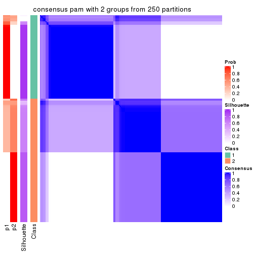</p>

</div>
<div id='tab-ATC-pam-consensus-heatmap-2'>
<pre><code class="r">consensus_heatmap(res, k = 3)
</code></pre>

<p>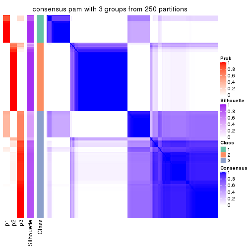</p>

</div>
<div id='tab-ATC-pam-consensus-heatmap-3'>
<pre><code class="r">consensus_heatmap(res, k = 4)
</code></pre>

<p>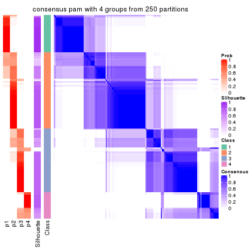</p>

</div>
<div id='tab-ATC-pam-consensus-heatmap-4'>
<pre><code class="r">consensus_heatmap(res, k = 5)
</code></pre>

<p>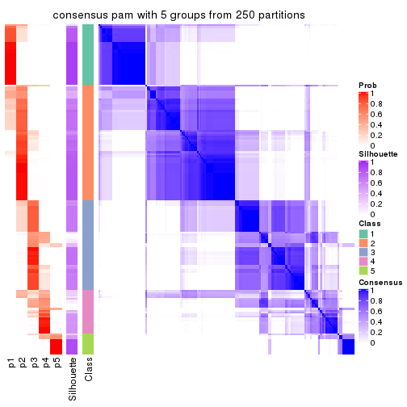</p>

</div>
<div id='tab-ATC-pam-consensus-heatmap-5'>
<pre><code class="r">consensus_heatmap(res, k = 6)
</code></pre>

<p>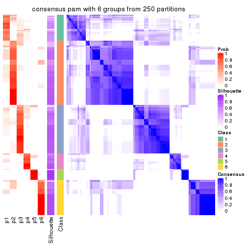</p>

</div>
</div>

Heatmaps for the membership of samples in all partitions to see how consistent they are:


<script>
$( function() {
	$( '#tabs-ATC-pam-membership-heatmap' ).tabs();
} );
</script>
<div id='tabs-ATC-pam-membership-heatmap'>
<ul>
<li><a href='#tab-ATC-pam-membership-heatmap-1'>k = 2</a></li>
<li><a href='#tab-ATC-pam-membership-heatmap-2'>k = 3</a></li>
<li><a href='#tab-ATC-pam-membership-heatmap-3'>k = 4</a></li>
<li><a href='#tab-ATC-pam-membership-heatmap-4'>k = 5</a></li>
<li><a href='#tab-ATC-pam-membership-heatmap-5'>k = 6</a></li>
</ul>
<div id='tab-ATC-pam-membership-heatmap-1'>
<pre><code class="r">membership_heatmap(res, k = 2)
</code></pre>

<p>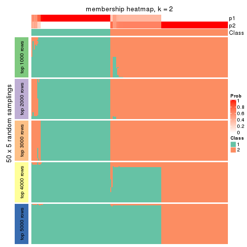</p>

</div>
<div id='tab-ATC-pam-membership-heatmap-2'>
<pre><code class="r">membership_heatmap(res, k = 3)
</code></pre>

<p>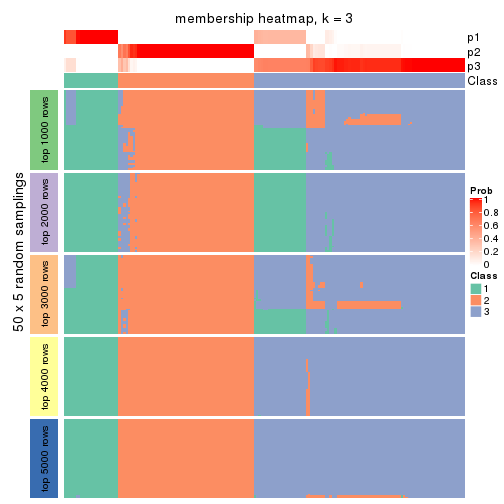</p>

</div>
<div id='tab-ATC-pam-membership-heatmap-3'>
<pre><code class="r">membership_heatmap(res, k = 4)
</code></pre>

<p>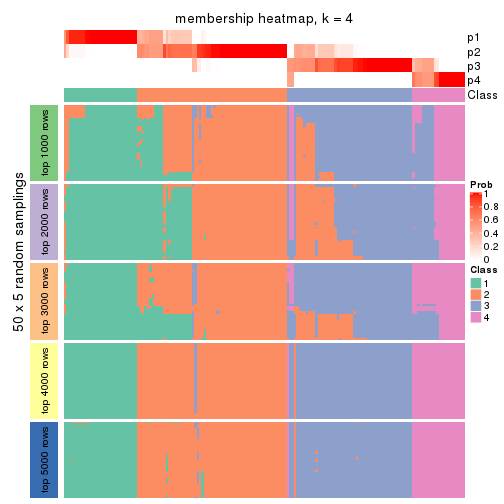</p>

</div>
<div id='tab-ATC-pam-membership-heatmap-4'>
<pre><code class="r">membership_heatmap(res, k = 5)
</code></pre>

<p>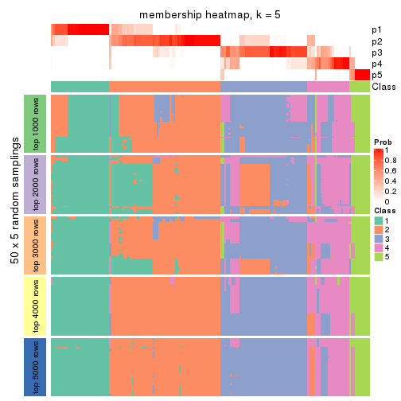</p>

</div>
<div id='tab-ATC-pam-membership-heatmap-5'>
<pre><code class="r">membership_heatmap(res, k = 6)
</code></pre>

<p>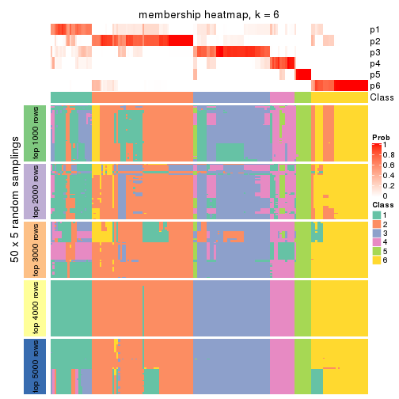</p>

</div>
</div>

As soon as we have had the classes for columns, we can look for signatures
which are significantly different between classes which can be candidate marks
for certain classes. Following are the heatmaps for signatures.


Signature heatmaps where rows are scaled:


<script>
$( function() {
	$( '#tabs-ATC-pam-get-signatures' ).tabs();
} );
</script>
<div id='tabs-ATC-pam-get-signatures'>
<ul>
<li><a href='#tab-ATC-pam-get-signatures-1'>k = 2</a></li>
<li><a href='#tab-ATC-pam-get-signatures-2'>k = 3</a></li>
<li><a href='#tab-ATC-pam-get-signatures-3'>k = 4</a></li>
<li><a href='#tab-ATC-pam-get-signatures-4'>k = 5</a></li>
<li><a href='#tab-ATC-pam-get-signatures-5'>k = 6</a></li>
</ul>
<div id='tab-ATC-pam-get-signatures-1'>
<pre><code class="r">get_signatures(res, k = 2)
</code></pre>

<p>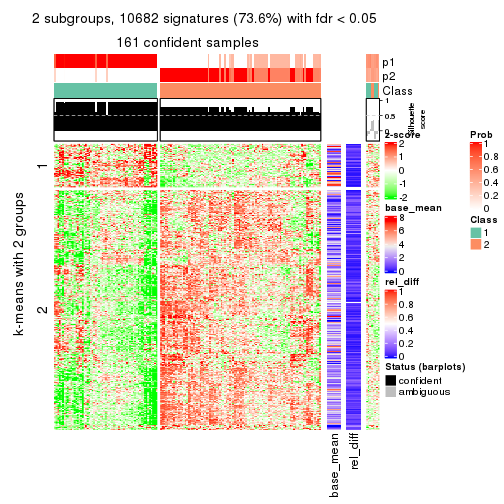</p>

</div>
<div id='tab-ATC-pam-get-signatures-2'>
<pre><code class="r">get_signatures(res, k = 3)
</code></pre>

<p>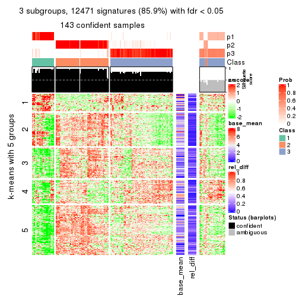</p>

</div>
<div id='tab-ATC-pam-get-signatures-3'>
<pre><code class="r">get_signatures(res, k = 4)
</code></pre>

<p>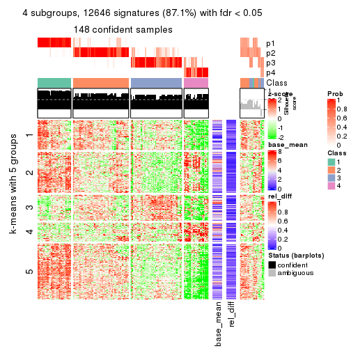</p>

</div>
<div id='tab-ATC-pam-get-signatures-4'>
<pre><code class="r">get_signatures(res, k = 5)
</code></pre>

<p>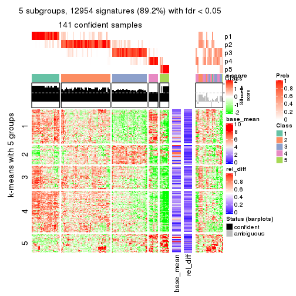</p>

</div>
<div id='tab-ATC-pam-get-signatures-5'>
<pre><code class="r">get_signatures(res, k = 6)
</code></pre>

<p>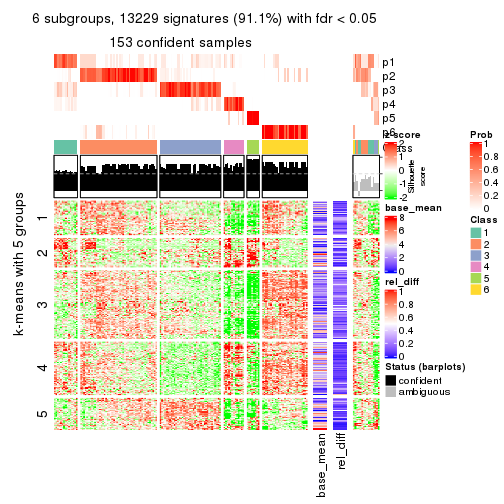</p>

</div>
</div>


Signature heatmaps where rows are not scaled:


<script>
$( function() {
	$( '#tabs-ATC-pam-get-signatures-no-scale' ).tabs();
} );
</script>
<div id='tabs-ATC-pam-get-signatures-no-scale'>
<ul>
<li><a href='#tab-ATC-pam-get-signatures-no-scale-1'>k = 2</a></li>
<li><a href='#tab-ATC-pam-get-signatures-no-scale-2'>k = 3</a></li>
<li><a href='#tab-ATC-pam-get-signatures-no-scale-3'>k = 4</a></li>
<li><a href='#tab-ATC-pam-get-signatures-no-scale-4'>k = 5</a></li>
<li><a href='#tab-ATC-pam-get-signatures-no-scale-5'>k = 6</a></li>
</ul>
<div id='tab-ATC-pam-get-signatures-no-scale-1'>
<pre><code class="r">get_signatures(res, k = 2, scale_rows = FALSE)
</code></pre>

<p>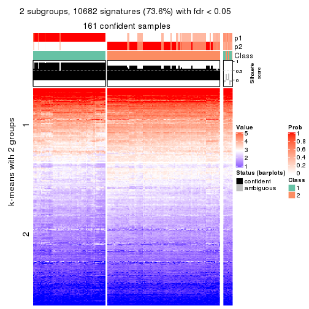</p>

</div>
<div id='tab-ATC-pam-get-signatures-no-scale-2'>
<pre><code class="r">get_signatures(res, k = 3, scale_rows = FALSE)
</code></pre>

<p>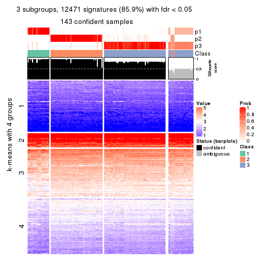</p>

</div>
<div id='tab-ATC-pam-get-signatures-no-scale-3'>
<pre><code class="r">get_signatures(res, k = 4, scale_rows = FALSE)
</code></pre>

<p>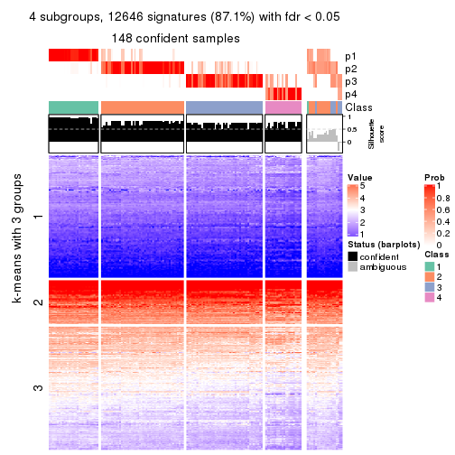</p>

</div>
<div id='tab-ATC-pam-get-signatures-no-scale-4'>
<pre><code class="r">get_signatures(res, k = 5, scale_rows = FALSE)
</code></pre>

<p>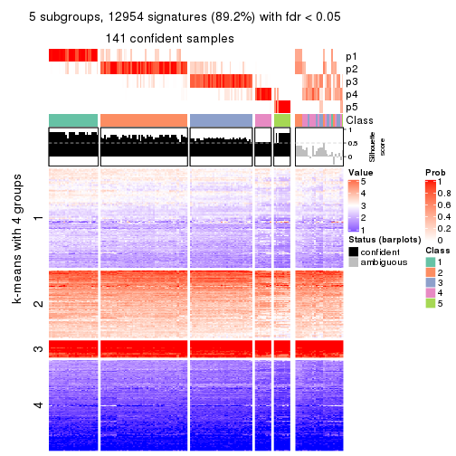</p>

</div>
<div id='tab-ATC-pam-get-signatures-no-scale-5'>
<pre><code class="r">get_signatures(res, k = 6, scale_rows = FALSE)
</code></pre>

<p>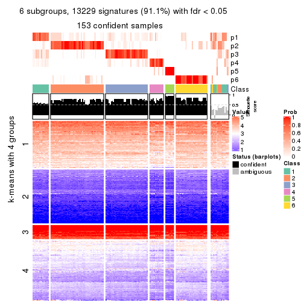</p>

</div>
</div>


Compare the overlap of signatures from different k:

```r
compare_signatures(res)
```

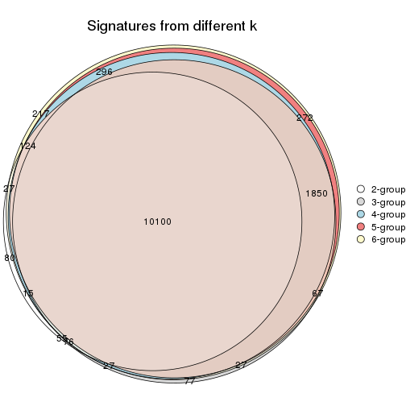

`get_signature()` returns a data frame invisibly. TO get the list of signatures, the function
call should be assigned to a variable explicitly. In following code, if `plot` argument is set
to `FALSE`, no heatmap is plotted while only the differential analysis is performed.

```r
# code only for demonstration
tb = get_signature(res, k = ..., plot = FALSE)
```

An example of the output of `tb` is:

```
#>   which_row         fdr    mean_1    mean_2 scaled_mean_1 scaled_mean_2 km
#> 1        38 0.042760348  8.373488  9.131774    -0.5533452     0.5164555  1
#> 2        40 0.018707592  7.106213  8.469186    -0.6173731     0.5762149  1
#> 3        55 0.019134737 10.221463 11.207825    -0.6159697     0.5749050  1
#> 4        59 0.006059896  5.921854  7.869574    -0.6899429     0.6439467  1
#> 5        60 0.018055526  8.928898 10.211722    -0.6204761     0.5791110  1
#> 6        98 0.009384629 15.714769 14.887706     0.6635654    -0.6193277  2
...
```

The columns in `tb` are:

1. `which_row`: row indices corresponding to the input matrix.
2. `fdr`: FDR for the differential test. 
3. `mean_x`: The mean value in group x.
4. `scaled_mean_x`: The mean value in group x after rows are scaled.
5. `km`: Row groups if k-means clustering is applied to rows.


UMAP plot which shows how samples are separated.


<script>
$( function() {
	$( '#tabs-ATC-pam-dimension-reduction' ).tabs();
} );
</script>
<div id='tabs-ATC-pam-dimension-reduction'>
<ul>
<li><a href='#tab-ATC-pam-dimension-reduction-1'>k = 2</a></li>
<li><a href='#tab-ATC-pam-dimension-reduction-2'>k = 3</a></li>
<li><a href='#tab-ATC-pam-dimension-reduction-3'>k = 4</a></li>
<li><a href='#tab-ATC-pam-dimension-reduction-4'>k = 5</a></li>
<li><a href='#tab-ATC-pam-dimension-reduction-5'>k = 6</a></li>
</ul>
<div id='tab-ATC-pam-dimension-reduction-1'>
<pre><code class="r">dimension_reduction(res, k = 2, method = &quot;UMAP&quot;)
</code></pre>

<p>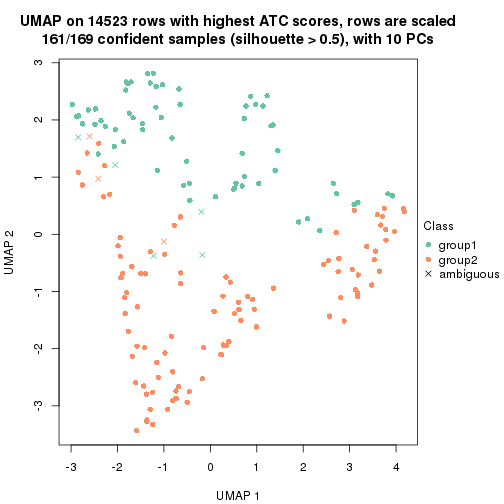</p>

</div>
<div id='tab-ATC-pam-dimension-reduction-2'>
<pre><code class="r">dimension_reduction(res, k = 3, method = &quot;UMAP&quot;)
</code></pre>

<p>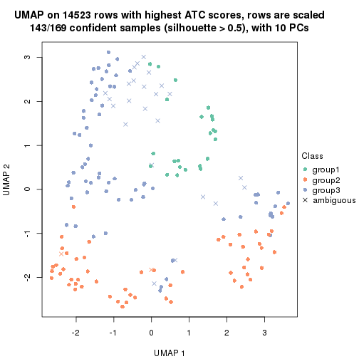</p>

</div>
<div id='tab-ATC-pam-dimension-reduction-3'>
<pre><code class="r">dimension_reduction(res, k = 4, method = &quot;UMAP&quot;)
</code></pre>

<p>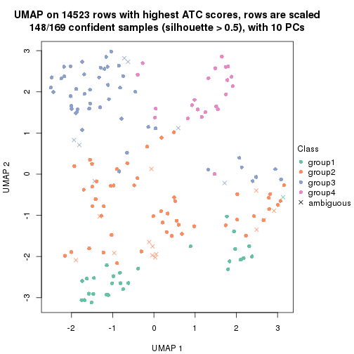</p>

</div>
<div id='tab-ATC-pam-dimension-reduction-4'>
<pre><code class="r">dimension_reduction(res, k = 5, method = &quot;UMAP&quot;)
</code></pre>

<p>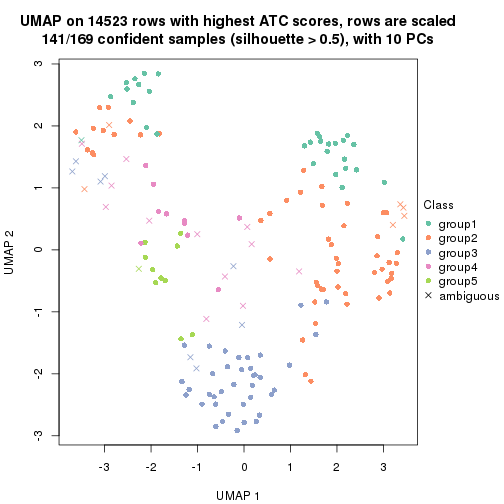</p>

</div>
<div id='tab-ATC-pam-dimension-reduction-5'>
<pre><code class="r">dimension_reduction(res, k = 6, method = &quot;UMAP&quot;)
</code></pre>

<p>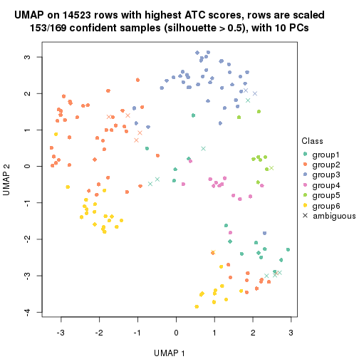</p>

</div>
</div>


Following heatmap shows how subgroups are split when increasing `k`:

```r
collect_classes(res)
```

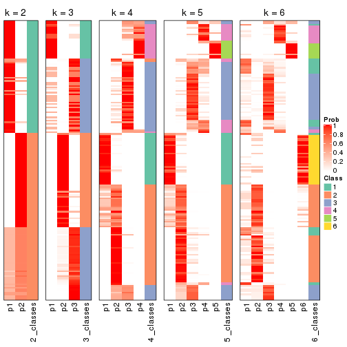


If matrix rows can be associated to genes, consider to use `GO_Enrichment(res,
...)` to perform function enrichment for the signature genes.


 

---------------------------------------------------


### ATC:mclust*


The object with results only for a single top-value method and a single partition method 
can be extracted as:

```r
res = res_list["ATC", "mclust"]
# you can also extract it by
# res = res_list["ATC:mclust"]
```

A summary of `res` and all the functions that can be applied to it:

```r
res
```

```
#> A 'ConsensusPartition' object with k = 2, 3, 4, 5, 6.
#>   On a matrix with 14523 rows and 169 columns.
#>   Top rows (1000, 2000, 3000, 4000, 5000) are extracted by 'ATC' method.
#>   Subgroups are detected by 'mclust' method.
#>   Performed in total 1250 partitions by row resampling.
#>   Best k for subgroups seems to be 2.
#> 
#> Following methods can be applied to this 'ConsensusPartition' object:
#>  [1] "cola_report"             "collect_classes"         "collect_plots"          
#>  [4] "collect_stats"           "colnames"                "compare_signatures"     
#>  [7] "consensus_heatmap"       "dimension_reduction"     "functional_enrichment"  
#> [10] "get_anno_col"            "get_anno"                "get_classes"            
#> [13] "get_consensus"           "get_matrix"              "get_membership"         
#> [16] "get_param"               "get_signatures"          "get_stats"              
#> [19] "is_best_k"               "is_stable_k"             "membership_heatmap"     
#> [22] "ncol"                    "nrow"                    "plot_ecdf"              
#> [25] "rownames"                "select_partition_number" "show"                   
#> [28] "suggest_best_k"          "test_to_known_factors"
```

`collect_plots()` function collects all the plots made from `res` for all `k` (number of partitions)
into one single page to provide an easy and fast comparison between different `k`.

```r
collect_plots(res)
```

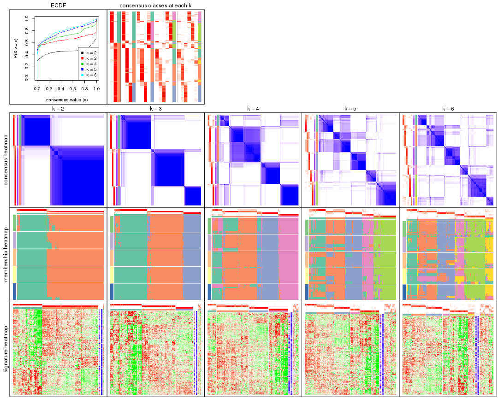

The plots are:

- The first row: a plot of the ECDF (Empirical cumulative distribution
  function) curves of the consensus matrix for each `k` and the heatmap of
  predicted classes for each `k`.
- The second row: heatmaps of the consensus matrix for each `k`.
- The third row: heatmaps of the membership matrix for each `k`.
- The fouth row: heatmaps of the signatures for each `k`.

All the plots in panels can be made by individual functions and they are
plotted later in this section.

`select_partition_number()` produces several plots showing different
statistics for choosing "optimized" `k`. There are following statistics:

- ECDF curves of the consensus matrix for each `k`;
- 1-PAC. [The PAC
  score](https://en.wikipedia.org/wiki/Consensus_clustering#Over-interpretation_potential_of_consensus_clustering)
  measures the proportion of the ambiguous subgrouping.
- Mean silhouette score.
- Concordance. The mean probability of fiting the consensus class ids in all
  partitions.
- Area increased. Denote $A_k$ as the area under the ECDF curve for current
  `k`, the area increased is defined as $A_k - A_{k-1}$.
- Rand index. The percent of pairs of samples that are both in a same cluster
  or both are not in a same cluster in the partition of k and k-1.
- Jaccard index. The ratio of pairs of samples are both in a same cluster in
  the partition of k and k-1 and the pairs of samples are both in a same
  cluster in the partition k or k-1.

The detailed explanations of these statistics can be found in [the cola
vignette](http://bioconductor.org/packages/devel/bioc/vignettes/cola/inst/doc/cola.html#toc_13).

Generally speaking, lower PAC score, higher mean silhouette score or higher
concordance corresponds to better partition. Rand index and Jaccard index
measure how similar the current partition is compared to partition with `k-1`.
If they are too similar, we won't accept `k` is better than `k-1`.

```r
select_partition_number(res)
```

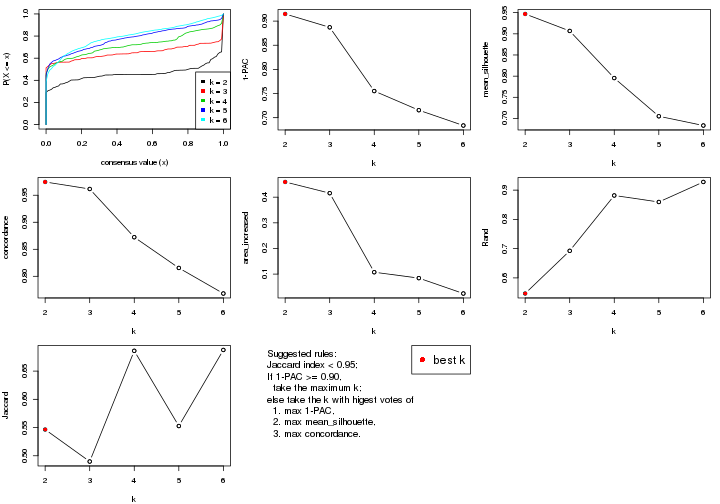

The numeric values for all these statistics can be obtained by `get_stats()`.

```r
get_stats(res)
```

```
#>   k 1-PAC mean_silhouette concordance area_increased  Rand Jaccard
#> 2 2 0.915           0.947       0.975         0.4593 0.546   0.546
#> 3 3 0.887           0.907       0.962         0.4156 0.692   0.490
#> 4 4 0.755           0.795       0.872         0.1073 0.882   0.686
#> 5 5 0.715           0.705       0.815         0.0843 0.859   0.553
#> 6 6 0.684           0.683       0.768         0.0242 0.928   0.687
```

`suggest_best_k()` suggests the best $k$ based on these statistics. The rules are as follows:

- All $k$ with Jaccard index larger than 0.95 are removed because the increase of
  the partition number does not provides enough extra information. If all $k$ are removed,
  the best $k$ is assigned by `NA`.
- For $k$ with 1-PAC larger than 0.9, the maximal $k$ is taken as the "best k". Other $k$ is called "optional k".
- If it does not fit the second rule. The $k$ with the highest vote of highest
  1-PAC, mean silhouette and concordance is taken as the "best k".

```r
suggest_best_k(res)
```

```
#> [1] 2
```


Following shows the table of the partitions (You need to click the **show/hide
code output** link to see it). The membership matrix (columns with name `p*`)
is inferred by
[`clue::cl_consensus()`](https://www.rdocumentation.org/link/cl_consensus?package=clue)
function with the `SE` method. Basically the value in the membership matrix
represents the probability to belong to a certain group. The finall class
label for an item is determined with the group with highest probability it
belongs to.

In `get_classes()` function, the entropy is calculated from the membership
matrix and the silhouette score is calculated from the consensus matrix.


<script>
$( function() {
	$( '#tabs-ATC-mclust-get-classes' ).tabs();
} );
</script>
<div id='tabs-ATC-mclust-get-classes'>
<ul>
<li><a href='#tab-ATC-mclust-get-classes-1'>k = 2</a></li>
<li><a href='#tab-ATC-mclust-get-classes-2'>k = 3</a></li>
<li><a href='#tab-ATC-mclust-get-classes-3'>k = 4</a></li>
<li><a href='#tab-ATC-mclust-get-classes-4'>k = 5</a></li>
<li><a href='#tab-ATC-mclust-get-classes-5'>k = 6</a></li>
</ul>

<div id='tab-ATC-mclust-get-classes-1'>
<p><a id='tab-ATC-mclust-get-classes-1-a' style='color:#0366d6' href='#'>show/hide code output</a></p>
<pre><code class="r">cbind(get_classes(res, k = 2), get_membership(res, k = 2))
</code></pre>

<pre><code>#&gt;            class entropy silhouette    p1    p2
#&gt; SRR2052702     2  0.3274      0.928 0.060 0.940
#&gt; SRR2052701     2  0.0000      0.972 0.000 1.000
#&gt; SRR2052700     1  0.0000      0.978 1.000 0.000
#&gt; SRR2052699     2  0.0000      0.972 0.000 1.000
#&gt; SRR2052698     2  0.0000      0.972 0.000 1.000
#&gt; SRR2052708     1  0.0000      0.978 1.000 0.000
#&gt; SRR2052749     2  0.0000      0.972 0.000 1.000
#&gt; SRR2052786     2  0.0000      0.972 0.000 1.000
#&gt; SRR2052825     1  0.0000      0.978 1.000 0.000
#&gt; SRR2052824     1  0.0000      0.978 1.000 0.000
#&gt; SRR2052823     1  0.5519      0.854 0.872 0.128
#&gt; SRR2052822     2  0.0000      0.972 0.000 1.000
#&gt; SRR2052821     1  0.0000      0.978 1.000 0.000
#&gt; SRR2052820     2  0.0000      0.972 0.000 1.000
#&gt; SRR2052819     1  0.0000      0.978 1.000 0.000
#&gt; SRR2052818     1  0.0000      0.978 1.000 0.000
#&gt; SRR2052817     2  0.0000      0.972 0.000 1.000
#&gt; SRR2052816     1  0.0000      0.978 1.000 0.000
#&gt; SRR2052815     1  0.0000      0.978 1.000 0.000
#&gt; SRR2052814     1  0.0000      0.978 1.000 0.000
#&gt; SRR2052813     2  0.2236      0.948 0.036 0.964
#&gt; SRR2052812     2  0.5178      0.872 0.116 0.884
#&gt; SRR2052811     1  0.6973      0.779 0.812 0.188
#&gt; SRR2052810     1  0.0000      0.978 1.000 0.000
#&gt; SRR2052809     2  0.0000      0.972 0.000 1.000
#&gt; SRR2052808     2  0.4815      0.885 0.104 0.896
#&gt; SRR2052807     1  0.0000      0.978 1.000 0.000
#&gt; SRR2052806     1  0.0000      0.978 1.000 0.000
#&gt; SRR2052805     1  0.0000      0.978 1.000 0.000
#&gt; SRR2052804     1  0.0000      0.978 1.000 0.000
#&gt; SRR2052803     1  0.0000      0.978 1.000 0.000
#&gt; SRR2052802     1  0.0000      0.978 1.000 0.000
#&gt; SRR2052801     1  0.0000      0.978 1.000 0.000
#&gt; SRR2052800     1  0.0000      0.978 1.000 0.000
#&gt; SRR2052799     1  0.0000      0.978 1.000 0.000
#&gt; SRR2052798     2  0.0000      0.972 0.000 1.000
#&gt; SRR2052797     2  0.5519      0.859 0.128 0.872
#&gt; SRR2052796     1  0.0000      0.978 1.000 0.000
#&gt; SRR2052795     1  0.0376      0.975 0.996 0.004
#&gt; SRR2052794     1  0.0000      0.978 1.000 0.000
#&gt; SRR2052793     1  0.0000      0.978 1.000 0.000
#&gt; SRR2052792     1  0.0000      0.978 1.000 0.000
#&gt; SRR2052791     2  0.4022      0.909 0.080 0.920
#&gt; SRR2052790     2  0.0000      0.972 0.000 1.000
#&gt; SRR2052789     2  0.0000      0.972 0.000 1.000
#&gt; SRR2052788     2  0.0000      0.972 0.000 1.000
#&gt; SRR2052787     2  0.0000      0.972 0.000 1.000
#&gt; SRR2052785     2  0.0000      0.972 0.000 1.000
#&gt; SRR2052784     2  0.0000      0.972 0.000 1.000
#&gt; SRR2052783     2  0.0000      0.972 0.000 1.000
#&gt; SRR2052782     2  0.0000      0.972 0.000 1.000
#&gt; SRR2052781     2  0.0000      0.972 0.000 1.000
#&gt; SRR2052780     2  0.0000      0.972 0.000 1.000
#&gt; SRR2052777     2  0.0000      0.972 0.000 1.000
#&gt; SRR2052779     2  0.0000      0.972 0.000 1.000
#&gt; SRR2052778     2  0.0000      0.972 0.000 1.000
#&gt; SRR2052776     2  0.0000      0.972 0.000 1.000
#&gt; SRR2052775     2  0.0000      0.972 0.000 1.000
#&gt; SRR2052773     2  0.0000      0.972 0.000 1.000
#&gt; SRR2052772     2  0.0000      0.972 0.000 1.000
#&gt; SRR2052774     2  0.0000      0.972 0.000 1.000
#&gt; SRR2052771     1  0.0000      0.978 1.000 0.000
#&gt; SRR2052769     1  0.0376      0.975 0.996 0.004
#&gt; SRR2052770     2  0.1633      0.956 0.024 0.976
#&gt; SRR2052768     2  0.0000      0.972 0.000 1.000
#&gt; SRR2052767     2  0.0000      0.972 0.000 1.000
#&gt; SRR2052766     1  0.0000      0.978 1.000 0.000
#&gt; SRR2052765     1  0.0000      0.978 1.000 0.000
#&gt; SRR2052763     2  0.0000      0.972 0.000 1.000
#&gt; SRR2052764     1  0.0000      0.978 1.000 0.000
#&gt; SRR2052761     2  0.0000      0.972 0.000 1.000
#&gt; SRR2052760     2  0.0000      0.972 0.000 1.000
#&gt; SRR2052759     2  0.0000      0.972 0.000 1.000
#&gt; SRR2052762     2  0.0000      0.972 0.000 1.000
#&gt; SRR2052758     2  0.0000      0.972 0.000 1.000
#&gt; SRR2052756     1  0.0000      0.978 1.000 0.000
#&gt; SRR2052757     2  0.0000      0.972 0.000 1.000
#&gt; SRR2052755     1  0.5842      0.842 0.860 0.140
#&gt; SRR2052754     1  0.0000      0.978 1.000 0.000
#&gt; SRR2052753     1  0.0000      0.978 1.000 0.000
#&gt; SRR2052752     2  0.2423      0.947 0.040 0.960
#&gt; SRR2052750     2  0.0000      0.972 0.000 1.000
#&gt; SRR2052751     2  0.0000      0.972 0.000 1.000
#&gt; SRR2052748     2  0.3879      0.913 0.076 0.924
#&gt; SRR2052747     2  0.5842      0.846 0.140 0.860
#&gt; SRR2052746     2  0.0000      0.972 0.000 1.000
#&gt; SRR2052745     2  0.4431      0.897 0.092 0.908
#&gt; SRR2052744     2  0.0000      0.972 0.000 1.000
#&gt; SRR2052741     2  0.0000      0.972 0.000 1.000
#&gt; SRR2052743     2  0.0000      0.972 0.000 1.000
#&gt; SRR2052740     2  0.0000      0.972 0.000 1.000
#&gt; SRR2052742     2  0.0000      0.972 0.000 1.000
#&gt; SRR2052739     2  0.0672      0.967 0.008 0.992
#&gt; SRR2052738     2  0.0000      0.972 0.000 1.000
#&gt; SRR2052736     2  0.0000      0.972 0.000 1.000
#&gt; SRR2052735     2  0.0000      0.972 0.000 1.000
#&gt; SRR2052734     2  0.0000      0.972 0.000 1.000
#&gt; SRR2052737     2  0.0000      0.972 0.000 1.000
#&gt; SRR2052733     2  0.3879      0.913 0.076 0.924
#&gt; SRR2052732     1  0.0000      0.978 1.000 0.000
#&gt; SRR2052731     2  0.0000      0.972 0.000 1.000
#&gt; SRR2052729     2  0.1843      0.953 0.028 0.972
#&gt; SRR2052728     2  0.0000      0.972 0.000 1.000
#&gt; SRR2052730     1  0.0000      0.978 1.000 0.000
#&gt; SRR2052727     2  0.0000      0.972 0.000 1.000
#&gt; SRR2052725     1  0.0000      0.978 1.000 0.000
#&gt; SRR2052726     2  0.0000      0.972 0.000 1.000
#&gt; SRR2052724     1  0.0000      0.978 1.000 0.000
#&gt; SRR2052723     2  0.3879      0.913 0.076 0.924
#&gt; SRR2052722     2  0.0000      0.972 0.000 1.000
#&gt; SRR2052721     2  0.0000      0.972 0.000 1.000
#&gt; SRR2052720     2  0.0000      0.972 0.000 1.000
#&gt; SRR2052719     2  0.2236      0.948 0.036 0.964
#&gt; SRR2052718     1  0.0000      0.978 1.000 0.000
#&gt; SRR2052717     2  0.0000      0.972 0.000 1.000
#&gt; SRR2052714     1  0.0000      0.978 1.000 0.000
#&gt; SRR2052716     2  0.8661      0.638 0.288 0.712
#&gt; SRR2052715     2  0.0000      0.972 0.000 1.000
#&gt; SRR2052713     1  0.0000      0.978 1.000 0.000
#&gt; SRR2052712     1  0.0000      0.978 1.000 0.000
#&gt; SRR2052711     1  0.0000      0.978 1.000 0.000
#&gt; SRR2052710     2  0.8763      0.622 0.296 0.704
#&gt; SRR2052707     2  0.0000      0.972 0.000 1.000
#&gt; SRR2052709     2  0.0000      0.972 0.000 1.000
#&gt; SRR2052704     2  0.3431      0.923 0.064 0.936
#&gt; SRR2052705     2  0.0000      0.972 0.000 1.000
#&gt; SRR2052697     1  0.7453      0.744 0.788 0.212
#&gt; SRR2052703     2  0.0000      0.972 0.000 1.000
#&gt; SRR2052696     2  0.0000      0.972 0.000 1.000
#&gt; SRR2052706     1  0.0000      0.978 1.000 0.000
#&gt; SRR2052695     2  0.0000      0.972 0.000 1.000
#&gt; SRR2052694     2  0.0000      0.972 0.000 1.000
#&gt; SRR2052692     2  0.0000      0.972 0.000 1.000
#&gt; SRR2052693     2  0.0000      0.972 0.000 1.000
#&gt; SRR2052691     2  0.0000      0.972 0.000 1.000
#&gt; SRR2052690     2  0.0000      0.972 0.000 1.000
#&gt; SRR2052689     1  0.0000      0.978 1.000 0.000
#&gt; SRR2052687     1  0.0000      0.978 1.000 0.000
#&gt; SRR2052686     1  0.0000      0.978 1.000 0.000
#&gt; SRR2052688     2  0.9044      0.547 0.320 0.680
#&gt; SRR2052684     2  0.4022      0.909 0.080 0.920
#&gt; SRR2052685     1  0.7139      0.768 0.804 0.196
#&gt; SRR2052683     1  0.0000      0.978 1.000 0.000
#&gt; SRR2052681     1  0.0000      0.978 1.000 0.000
#&gt; SRR2052680     1  0.0000      0.978 1.000 0.000
#&gt; SRR2052682     2  0.0000      0.972 0.000 1.000
#&gt; SRR2052679     2  0.0000      0.972 0.000 1.000
#&gt; SRR2052678     2  0.0000      0.972 0.000 1.000
#&gt; SRR2052677     2  0.0000      0.972 0.000 1.000
#&gt; SRR2052675     2  0.2778      0.938 0.048 0.952
#&gt; SRR2052676     2  0.3114      0.932 0.056 0.944
#&gt; SRR2052674     1  0.0000      0.978 1.000 0.000
#&gt; SRR2052672     2  0.9580      0.442 0.380 0.620
#&gt; SRR2052673     2  0.0000      0.972 0.000 1.000
#&gt; SRR2052671     2  0.2043      0.951 0.032 0.968
#&gt; SRR2052670     2  0.0000      0.972 0.000 1.000
#&gt; SRR2052669     2  0.0000      0.972 0.000 1.000
#&gt; SRR2052668     2  0.0000      0.972 0.000 1.000
#&gt; SRR2052667     2  0.0000      0.972 0.000 1.000
#&gt; SRR2052666     2  0.8555      0.652 0.280 0.720
#&gt; SRR2052665     2  0.0000      0.972 0.000 1.000
#&gt; SRR2052664     1  0.0000      0.978 1.000 0.000
#&gt; SRR2052663     1  0.1414      0.961 0.980 0.020
#&gt; SRR2052662     2  0.0000      0.972 0.000 1.000
#&gt; SRR2052661     1  0.9170      0.510 0.668 0.332
#&gt; SRR2052660     2  0.0000      0.972 0.000 1.000
#&gt; SRR2052659     2  0.0000      0.972 0.000 1.000
#&gt; SRR2052658     2  0.0000      0.972 0.000 1.000
#&gt; SRR2052657     2  0.4939      0.881 0.108 0.892
</code></pre>

<script>
$('#tab-ATC-mclust-get-classes-1-a').parent().next().next().hide();
$('#tab-ATC-mclust-get-classes-1-a').click(function(){
  $('#tab-ATC-mclust-get-classes-1-a').parent().next().next().toggle();
  return(false);
});
</script>
</div>

<div id='tab-ATC-mclust-get-classes-2'>
<p><a id='tab-ATC-mclust-get-classes-2-a' style='color:#0366d6' href='#'>show/hide code output</a></p>
<pre><code class="r">cbind(get_classes(res, k = 3), get_membership(res, k = 3))
</code></pre>

<pre><code>#&gt;            class entropy silhouette    p1    p2    p3
#&gt; SRR2052702     2  0.0000     0.9588 0.000 1.000 0.000
#&gt; SRR2052701     2  0.0000     0.9588 0.000 1.000 0.000
#&gt; SRR2052700     1  0.0000     0.9493 1.000 0.000 0.000
#&gt; SRR2052699     2  0.0000     0.9588 0.000 1.000 0.000
#&gt; SRR2052698     3  0.0000     0.9689 0.000 0.000 1.000
#&gt; SRR2052708     1  0.0000     0.9493 1.000 0.000 0.000
#&gt; SRR2052749     2  0.0000     0.9588 0.000 1.000 0.000
#&gt; SRR2052786     2  0.0000     0.9588 0.000 1.000 0.000
#&gt; SRR2052825     1  0.0000     0.9493 1.000 0.000 0.000
#&gt; SRR2052824     1  0.0000     0.9493 1.000 0.000 0.000
#&gt; SRR2052823     1  0.4931     0.7225 0.768 0.232 0.000
#&gt; SRR2052822     3  0.1031     0.9474 0.000 0.024 0.976
#&gt; SRR2052821     1  0.3879     0.8183 0.848 0.152 0.000
#&gt; SRR2052820     3  0.0000     0.9689 0.000 0.000 1.000
#&gt; SRR2052819     1  0.0000     0.9493 1.000 0.000 0.000
#&gt; SRR2052818     1  0.0000     0.9493 1.000 0.000 0.000
#&gt; SRR2052817     3  0.0000     0.9689 0.000 0.000 1.000
#&gt; SRR2052816     1  0.0000     0.9493 1.000 0.000 0.000
#&gt; SRR2052815     1  0.0000     0.9493 1.000 0.000 0.000
#&gt; SRR2052814     1  0.0000     0.9493 1.000 0.000 0.000
#&gt; SRR2052813     2  0.0000     0.9588 0.000 1.000 0.000
#&gt; SRR2052812     2  0.0000     0.9588 0.000 1.000 0.000
#&gt; SRR2052811     1  0.5397     0.6467 0.720 0.280 0.000
#&gt; SRR2052810     1  0.0000     0.9493 1.000 0.000 0.000
#&gt; SRR2052809     2  0.0747     0.9460 0.000 0.984 0.016
#&gt; SRR2052808     2  0.0892     0.9415 0.020 0.980 0.000
#&gt; SRR2052807     1  0.0000     0.9493 1.000 0.000 0.000
#&gt; SRR2052806     1  0.0000     0.9493 1.000 0.000 0.000
#&gt; SRR2052805     1  0.0000     0.9493 1.000 0.000 0.000
#&gt; SRR2052804     1  0.0000     0.9493 1.000 0.000 0.000
#&gt; SRR2052803     1  0.0000     0.9493 1.000 0.000 0.000
#&gt; SRR2052802     1  0.0000     0.9493 1.000 0.000 0.000
#&gt; SRR2052801     1  0.0000     0.9493 1.000 0.000 0.000
#&gt; SRR2052800     1  0.0000     0.9493 1.000 0.000 0.000
#&gt; SRR2052799     1  0.0000     0.9493 1.000 0.000 0.000
#&gt; SRR2052798     2  0.0000     0.9588 0.000 1.000 0.000
#&gt; SRR2052797     1  0.6045     0.4419 0.620 0.380 0.000
#&gt; SRR2052796     1  0.0000     0.9493 1.000 0.000 0.000
#&gt; SRR2052795     1  0.1753     0.9112 0.952 0.048 0.000
#&gt; SRR2052794     1  0.0000     0.9493 1.000 0.000 0.000
#&gt; SRR2052793     1  0.0000     0.9493 1.000 0.000 0.000
#&gt; SRR2052792     1  0.0000     0.9493 1.000 0.000 0.000
#&gt; SRR2052791     1  0.6302     0.1073 0.520 0.000 0.480
#&gt; SRR2052790     3  0.0000     0.9689 0.000 0.000 1.000
#&gt; SRR2052789     3  0.0000     0.9689 0.000 0.000 1.000
#&gt; SRR2052788     3  0.0000     0.9689 0.000 0.000 1.000
#&gt; SRR2052787     2  0.0000     0.9588 0.000 1.000 0.000
#&gt; SRR2052785     2  0.5254     0.6339 0.000 0.736 0.264
#&gt; SRR2052784     2  0.5733     0.5264 0.000 0.676 0.324
#&gt; SRR2052783     2  0.0000     0.9588 0.000 1.000 0.000
#&gt; SRR2052782     2  0.1860     0.9142 0.000 0.948 0.052
#&gt; SRR2052781     2  0.5835     0.4893 0.000 0.660 0.340
#&gt; SRR2052780     3  0.0000     0.9689 0.000 0.000 1.000
#&gt; SRR2052777     2  0.0237     0.9559 0.000 0.996 0.004
#&gt; SRR2052779     2  0.5431     0.6091 0.000 0.716 0.284
#&gt; SRR2052778     3  0.0000     0.9689 0.000 0.000 1.000
#&gt; SRR2052776     3  0.3752     0.8125 0.000 0.144 0.856
#&gt; SRR2052775     3  0.0000     0.9689 0.000 0.000 1.000
#&gt; SRR2052773     3  0.0000     0.9689 0.000 0.000 1.000
#&gt; SRR2052772     3  0.0000     0.9689 0.000 0.000 1.000
#&gt; SRR2052774     3  0.0000     0.9689 0.000 0.000 1.000
#&gt; SRR2052771     1  0.0000     0.9493 1.000 0.000 0.000
#&gt; SRR2052769     1  0.0000     0.9493 1.000 0.000 0.000
#&gt; SRR2052770     3  0.0000     0.9689 0.000 0.000 1.000
#&gt; SRR2052768     2  0.0000     0.9588 0.000 1.000 0.000
#&gt; SRR2052767     2  0.0000     0.9588 0.000 1.000 0.000
#&gt; SRR2052766     1  0.0000     0.9493 1.000 0.000 0.000
#&gt; SRR2052765     1  0.4452     0.7760 0.808 0.192 0.000
#&gt; SRR2052763     3  0.0000     0.9689 0.000 0.000 1.000
#&gt; SRR2052764     1  0.3686     0.8303 0.860 0.140 0.000
#&gt; SRR2052761     3  0.0000     0.9689 0.000 0.000 1.000
#&gt; SRR2052760     2  0.0000     0.9588 0.000 1.000 0.000
#&gt; SRR2052759     3  0.0000     0.9689 0.000 0.000 1.000
#&gt; SRR2052762     2  0.0424     0.9527 0.000 0.992 0.008
#&gt; SRR2052758     3  0.0000     0.9689 0.000 0.000 1.000
#&gt; SRR2052756     1  0.0000     0.9493 1.000 0.000 0.000
#&gt; SRR2052757     2  0.0000     0.9588 0.000 1.000 0.000
#&gt; SRR2052755     2  0.1163     0.9333 0.028 0.972 0.000
#&gt; SRR2052754     1  0.0000     0.9493 1.000 0.000 0.000
#&gt; SRR2052753     1  0.3551     0.8380 0.868 0.132 0.000
#&gt; SRR2052752     1  0.4629     0.7593 0.808 0.004 0.188
#&gt; SRR2052750     2  0.0000     0.9588 0.000 1.000 0.000
#&gt; SRR2052751     3  0.6079     0.3479 0.000 0.388 0.612
#&gt; SRR2052748     1  0.0000     0.9493 1.000 0.000 0.000
#&gt; SRR2052747     2  0.0000     0.9588 0.000 1.000 0.000
#&gt; SRR2052746     3  0.0000     0.9689 0.000 0.000 1.000
#&gt; SRR2052745     1  0.0000     0.9493 1.000 0.000 0.000
#&gt; SRR2052744     2  0.0000     0.9588 0.000 1.000 0.000
#&gt; SRR2052741     2  0.0000     0.9588 0.000 1.000 0.000
#&gt; SRR2052743     2  0.0000     0.9588 0.000 1.000 0.000
#&gt; SRR2052740     2  0.0000     0.9588 0.000 1.000 0.000
#&gt; SRR2052742     2  0.6305     0.0635 0.000 0.516 0.484
#&gt; SRR2052739     2  0.0000     0.9588 0.000 1.000 0.000
#&gt; SRR2052738     3  0.0000     0.9689 0.000 0.000 1.000
#&gt; SRR2052736     2  0.0000     0.9588 0.000 1.000 0.000
#&gt; SRR2052735     2  0.0000     0.9588 0.000 1.000 0.000
#&gt; SRR2052734     2  0.0000     0.9588 0.000 1.000 0.000
#&gt; SRR2052737     2  0.0000     0.9588 0.000 1.000 0.000
#&gt; SRR2052733     3  0.0000     0.9689 0.000 0.000 1.000
#&gt; SRR2052732     1  0.0892     0.9348 0.980 0.020 0.000
#&gt; SRR2052731     3  0.0000     0.9689 0.000 0.000 1.000
#&gt; SRR2052729     2  0.0000     0.9588 0.000 1.000 0.000
#&gt; SRR2052728     2  0.0000     0.9588 0.000 1.000 0.000
#&gt; SRR2052730     1  0.0000     0.9493 1.000 0.000 0.000
#&gt; SRR2052727     2  0.0000     0.9588 0.000 1.000 0.000
#&gt; SRR2052725     1  0.2165     0.8994 0.936 0.064 0.000
#&gt; SRR2052726     2  0.0000     0.9588 0.000 1.000 0.000
#&gt; SRR2052724     1  0.0000     0.9493 1.000 0.000 0.000
#&gt; SRR2052723     3  0.0237     0.9654 0.004 0.000 0.996
#&gt; SRR2052722     3  0.0000     0.9689 0.000 0.000 1.000
#&gt; SRR2052721     2  0.0000     0.9588 0.000 1.000 0.000
#&gt; SRR2052720     2  0.0000     0.9588 0.000 1.000 0.000
#&gt; SRR2052719     2  0.0000     0.9588 0.000 1.000 0.000
#&gt; SRR2052718     2  0.5327     0.5937 0.272 0.728 0.000
#&gt; SRR2052717     2  0.0000     0.9588 0.000 1.000 0.000
#&gt; SRR2052714     1  0.0000     0.9493 1.000 0.000 0.000
#&gt; SRR2052716     1  0.0000     0.9493 1.000 0.000 0.000
#&gt; SRR2052715     3  0.0000     0.9689 0.000 0.000 1.000
#&gt; SRR2052713     1  0.0000     0.9493 1.000 0.000 0.000
#&gt; SRR2052712     1  0.0000     0.9493 1.000 0.000 0.000
#&gt; SRR2052711     1  0.0000     0.9493 1.000 0.000 0.000
#&gt; SRR2052710     2  0.0000     0.9588 0.000 1.000 0.000
#&gt; SRR2052707     3  0.0000     0.9689 0.000 0.000 1.000
#&gt; SRR2052709     3  0.0000     0.9689 0.000 0.000 1.000
#&gt; SRR2052704     1  0.0892     0.9341 0.980 0.000 0.020
#&gt; SRR2052705     2  0.0000     0.9588 0.000 1.000 0.000
#&gt; SRR2052697     2  0.0000     0.9588 0.000 1.000 0.000
#&gt; SRR2052703     3  0.0000     0.9689 0.000 0.000 1.000
#&gt; SRR2052696     2  0.0000     0.9588 0.000 1.000 0.000
#&gt; SRR2052706     1  0.0000     0.9493 1.000 0.000 0.000
#&gt; SRR2052695     2  0.0000     0.9588 0.000 1.000 0.000
#&gt; SRR2052694     2  0.0000     0.9588 0.000 1.000 0.000
#&gt; SRR2052692     3  0.0000     0.9689 0.000 0.000 1.000
#&gt; SRR2052693     2  0.5706     0.5329 0.000 0.680 0.320
#&gt; SRR2052691     2  0.0000     0.9588 0.000 1.000 0.000
#&gt; SRR2052690     2  0.0000     0.9588 0.000 1.000 0.000
#&gt; SRR2052689     1  0.0000     0.9493 1.000 0.000 0.000
#&gt; SRR2052687     1  0.0000     0.9493 1.000 0.000 0.000
#&gt; SRR2052686     1  0.0000     0.9493 1.000 0.000 0.000
#&gt; SRR2052688     2  0.0000     0.9588 0.000 1.000 0.000
#&gt; SRR2052684     1  0.0000     0.9493 1.000 0.000 0.000
#&gt; SRR2052685     2  0.3879     0.7923 0.152 0.848 0.000
#&gt; SRR2052683     1  0.0000     0.9493 1.000 0.000 0.000
#&gt; SRR2052681     1  0.0000     0.9493 1.000 0.000 0.000
#&gt; SRR2052680     1  0.0000     0.9493 1.000 0.000 0.000
#&gt; SRR2052682     2  0.0000     0.9588 0.000 1.000 0.000
#&gt; SRR2052679     2  0.0000     0.9588 0.000 1.000 0.000
#&gt; SRR2052678     3  0.0000     0.9689 0.000 0.000 1.000
#&gt; SRR2052677     3  0.6291     0.0972 0.000 0.468 0.532
#&gt; SRR2052675     2  0.0000     0.9588 0.000 1.000 0.000
#&gt; SRR2052676     2  0.0000     0.9588 0.000 1.000 0.000
#&gt; SRR2052674     1  0.0000     0.9493 1.000 0.000 0.000
#&gt; SRR2052672     1  0.0000     0.9493 1.000 0.000 0.000
#&gt; SRR2052673     2  0.1031     0.9370 0.024 0.976 0.000
#&gt; SRR2052671     2  0.0000     0.9588 0.000 1.000 0.000
#&gt; SRR2052670     3  0.0000     0.9689 0.000 0.000 1.000
#&gt; SRR2052669     2  0.0000     0.9588 0.000 1.000 0.000
#&gt; SRR2052668     2  0.0000     0.9588 0.000 1.000 0.000
#&gt; SRR2052667     2  0.0000     0.9588 0.000 1.000 0.000
#&gt; SRR2052666     1  0.0000     0.9493 1.000 0.000 0.000
#&gt; SRR2052665     2  0.0000     0.9588 0.000 1.000 0.000
#&gt; SRR2052664     1  0.0000     0.9493 1.000 0.000 0.000
#&gt; SRR2052663     1  0.4555     0.7670 0.800 0.200 0.000
#&gt; SRR2052662     2  0.0000     0.9588 0.000 1.000 0.000
#&gt; SRR2052661     1  0.5835     0.5335 0.660 0.340 0.000
#&gt; SRR2052660     3  0.0000     0.9689 0.000 0.000 1.000
#&gt; SRR2052659     3  0.0000     0.9689 0.000 0.000 1.000
#&gt; SRR2052658     2  0.0000     0.9588 0.000 1.000 0.000
#&gt; SRR2052657     2  0.0000     0.9588 0.000 1.000 0.000
</code></pre>

<script>
$('#tab-ATC-mclust-get-classes-2-a').parent().next().next().hide();
$('#tab-ATC-mclust-get-classes-2-a').click(function(){
  $('#tab-ATC-mclust-get-classes-2-a').parent().next().next().toggle();
  return(false);
});
</script>
</div>

<div id='tab-ATC-mclust-get-classes-3'>
<p><a id='tab-ATC-mclust-get-classes-3-a' style='color:#0366d6' href='#'>show/hide code output</a></p>
<pre><code class="r">cbind(get_classes(res, k = 4), get_membership(res, k = 4))
</code></pre>

<pre><code>#&gt;            class entropy silhouette    p1    p2    p3    p4
#&gt; SRR2052702     2  0.4399    0.83264 0.224 0.760 0.000 0.016
#&gt; SRR2052701     2  0.4134    0.82827 0.260 0.740 0.000 0.000
#&gt; SRR2052700     1  0.4164    0.75067 0.736 0.000 0.000 0.264
#&gt; SRR2052699     2  0.0188    0.81573 0.004 0.996 0.000 0.000
#&gt; SRR2052698     3  0.4103    0.72517 0.000 0.256 0.744 0.000
#&gt; SRR2052708     4  0.1576    0.87135 0.004 0.048 0.000 0.948
#&gt; SRR2052749     2  0.4086    0.83877 0.216 0.776 0.000 0.008
#&gt; SRR2052786     2  0.0000    0.81442 0.000 1.000 0.000 0.000
#&gt; SRR2052825     4  0.0000    0.94256 0.000 0.000 0.000 1.000
#&gt; SRR2052824     4  0.0000    0.94256 0.000 0.000 0.000 1.000
#&gt; SRR2052823     1  0.1637    0.73146 0.940 0.000 0.000 0.060
#&gt; SRR2052822     3  0.4134    0.72158 0.000 0.260 0.740 0.000
#&gt; SRR2052821     1  0.3311    0.76563 0.828 0.000 0.000 0.172
#&gt; SRR2052820     3  0.0000    0.90928 0.000 0.000 1.000 0.000
#&gt; SRR2052819     4  0.0000    0.94256 0.000 0.000 0.000 1.000
#&gt; SRR2052818     1  0.4164    0.75067 0.736 0.000 0.000 0.264
#&gt; SRR2052817     3  0.0000    0.90928 0.000 0.000 1.000 0.000
#&gt; SRR2052816     1  0.4164    0.75067 0.736 0.000 0.000 0.264
#&gt; SRR2052815     4  0.0000    0.94256 0.000 0.000 0.000 1.000
#&gt; SRR2052814     4  0.0000    0.94256 0.000 0.000 0.000 1.000
#&gt; SRR2052813     2  0.1940    0.82932 0.076 0.924 0.000 0.000
#&gt; SRR2052812     2  0.3982    0.83904 0.220 0.776 0.000 0.004
#&gt; SRR2052811     1  0.2521    0.72344 0.912 0.024 0.000 0.064
#&gt; SRR2052810     1  0.4522    0.69932 0.680 0.000 0.000 0.320
#&gt; SRR2052809     2  0.0469    0.80745 0.000 0.988 0.012 0.000
#&gt; SRR2052808     2  0.5072    0.80588 0.208 0.740 0.000 0.052
#&gt; SRR2052807     4  0.0000    0.94256 0.000 0.000 0.000 1.000
#&gt; SRR2052806     1  0.4277    0.74107 0.720 0.000 0.000 0.280
#&gt; SRR2052805     4  0.3123    0.72682 0.156 0.000 0.000 0.844
#&gt; SRR2052804     4  0.0000    0.94256 0.000 0.000 0.000 1.000
#&gt; SRR2052803     1  0.4699    0.69890 0.676 0.004 0.000 0.320
#&gt; SRR2052802     4  0.0000    0.94256 0.000 0.000 0.000 1.000
#&gt; SRR2052801     4  0.0000    0.94256 0.000 0.000 0.000 1.000
#&gt; SRR2052800     4  0.0000    0.94256 0.000 0.000 0.000 1.000
#&gt; SRR2052799     4  0.0000    0.94256 0.000 0.000 0.000 1.000
#&gt; SRR2052798     2  0.0524    0.81268 0.004 0.988 0.008 0.000
#&gt; SRR2052797     1  0.2593    0.75316 0.892 0.004 0.000 0.104
#&gt; SRR2052796     4  0.0000    0.94256 0.000 0.000 0.000 1.000
#&gt; SRR2052795     2  0.4746    0.40165 0.000 0.632 0.000 0.368
#&gt; SRR2052794     4  0.0000    0.94256 0.000 0.000 0.000 1.000
#&gt; SRR2052793     4  0.0000    0.94256 0.000 0.000 0.000 1.000
#&gt; SRR2052792     4  0.0000    0.94256 0.000 0.000 0.000 1.000
#&gt; SRR2052791     3  0.3219    0.73177 0.000 0.000 0.836 0.164
#&gt; SRR2052790     3  0.2973    0.81522 0.000 0.144 0.856 0.000
#&gt; SRR2052789     3  0.0000    0.90928 0.000 0.000 1.000 0.000
#&gt; SRR2052788     3  0.0000    0.90928 0.000 0.000 1.000 0.000
#&gt; SRR2052787     2  0.3801    0.83932 0.220 0.780 0.000 0.000
#&gt; SRR2052785     3  0.4609    0.72390 0.000 0.224 0.752 0.024
#&gt; SRR2052784     2  0.4948   -0.07547 0.000 0.560 0.440 0.000
#&gt; SRR2052783     2  0.0000    0.81442 0.000 1.000 0.000 0.000
#&gt; SRR2052782     2  0.1792    0.76298 0.000 0.932 0.068 0.000
#&gt; SRR2052781     2  0.4907    0.00526 0.000 0.580 0.420 0.000
#&gt; SRR2052780     3  0.0000    0.90928 0.000 0.000 1.000 0.000
#&gt; SRR2052777     2  0.0188    0.81248 0.000 0.996 0.004 0.000
#&gt; SRR2052779     2  0.3610    0.60331 0.000 0.800 0.200 0.000
#&gt; SRR2052778     3  0.0000    0.90928 0.000 0.000 1.000 0.000
#&gt; SRR2052776     3  0.4134    0.72158 0.000 0.260 0.740 0.000
#&gt; SRR2052775     3  0.0000    0.90928 0.000 0.000 1.000 0.000
#&gt; SRR2052773     3  0.0592    0.90071 0.000 0.016 0.984 0.000
#&gt; SRR2052772     3  0.0000    0.90928 0.000 0.000 1.000 0.000
#&gt; SRR2052774     3  0.0000    0.90928 0.000 0.000 1.000 0.000
#&gt; SRR2052771     4  0.4996   -0.32687 0.484 0.000 0.000 0.516
#&gt; SRR2052769     4  0.0000    0.94256 0.000 0.000 0.000 1.000
#&gt; SRR2052770     3  0.0469    0.90038 0.000 0.000 0.988 0.012
#&gt; SRR2052768     2  0.3649    0.84115 0.204 0.796 0.000 0.000
#&gt; SRR2052767     2  0.3942    0.83629 0.236 0.764 0.000 0.000
#&gt; SRR2052766     4  0.0000    0.94256 0.000 0.000 0.000 1.000
#&gt; SRR2052765     1  0.6350    0.27986 0.612 0.296 0.000 0.092
#&gt; SRR2052763     3  0.0000    0.90928 0.000 0.000 1.000 0.000
#&gt; SRR2052764     1  0.2469    0.75525 0.892 0.000 0.000 0.108
#&gt; SRR2052761     3  0.0000    0.90928 0.000 0.000 1.000 0.000
#&gt; SRR2052760     2  0.3764    0.83987 0.216 0.784 0.000 0.000
#&gt; SRR2052759     3  0.0000    0.90928 0.000 0.000 1.000 0.000
#&gt; SRR2052762     2  0.0336    0.80995 0.000 0.992 0.008 0.000
#&gt; SRR2052758     3  0.0000    0.90928 0.000 0.000 1.000 0.000
#&gt; SRR2052756     4  0.0000    0.94256 0.000 0.000 0.000 1.000
#&gt; SRR2052757     2  0.1389    0.78149 0.000 0.952 0.048 0.000
#&gt; SRR2052755     2  0.4134    0.82827 0.260 0.740 0.000 0.000
#&gt; SRR2052754     4  0.0000    0.94256 0.000 0.000 0.000 1.000
#&gt; SRR2052753     4  0.6831    0.08548 0.112 0.352 0.000 0.536
#&gt; SRR2052752     3  0.7658    0.13524 0.000 0.236 0.456 0.308
#&gt; SRR2052750     2  0.3801    0.83932 0.220 0.780 0.000 0.000
#&gt; SRR2052751     3  0.4304    0.69858 0.000 0.284 0.716 0.000
#&gt; SRR2052748     4  0.0000    0.94256 0.000 0.000 0.000 1.000
#&gt; SRR2052747     2  0.4883    0.78700 0.288 0.696 0.000 0.016
#&gt; SRR2052746     3  0.0000    0.90928 0.000 0.000 1.000 0.000
#&gt; SRR2052745     4  0.0000    0.94256 0.000 0.000 0.000 1.000
#&gt; SRR2052744     2  0.3907    0.83717 0.232 0.768 0.000 0.000
#&gt; SRR2052741     2  0.0000    0.81442 0.000 1.000 0.000 0.000
#&gt; SRR2052743     2  0.0000    0.81442 0.000 1.000 0.000 0.000
#&gt; SRR2052740     2  0.3801    0.83932 0.220 0.780 0.000 0.000
#&gt; SRR2052742     2  0.3569    0.61144 0.000 0.804 0.196 0.000
#&gt; SRR2052739     2  0.3837    0.83882 0.224 0.776 0.000 0.000
#&gt; SRR2052738     3  0.0000    0.90928 0.000 0.000 1.000 0.000
#&gt; SRR2052736     2  0.4134    0.82827 0.260 0.740 0.000 0.000
#&gt; SRR2052735     2  0.4134    0.82827 0.260 0.740 0.000 0.000
#&gt; SRR2052734     2  0.4134    0.82827 0.260 0.740 0.000 0.000
#&gt; SRR2052737     2  0.0707    0.82004 0.020 0.980 0.000 0.000
#&gt; SRR2052733     3  0.0000    0.90928 0.000 0.000 1.000 0.000
#&gt; SRR2052732     1  0.3123    0.76488 0.844 0.000 0.000 0.156
#&gt; SRR2052731     3  0.0000    0.90928 0.000 0.000 1.000 0.000
#&gt; SRR2052729     2  0.4134    0.82827 0.260 0.740 0.000 0.000
#&gt; SRR2052728     2  0.4134    0.82827 0.260 0.740 0.000 0.000
#&gt; SRR2052730     1  0.4941    0.49936 0.564 0.000 0.000 0.436
#&gt; SRR2052727     2  0.3942    0.83626 0.236 0.764 0.000 0.000
#&gt; SRR2052725     4  0.3266    0.75815 0.084 0.040 0.000 0.876
#&gt; SRR2052726     2  0.4134    0.82827 0.260 0.740 0.000 0.000
#&gt; SRR2052724     4  0.0000    0.94256 0.000 0.000 0.000 1.000
#&gt; SRR2052723     3  0.0000    0.90928 0.000 0.000 1.000 0.000
#&gt; SRR2052722     3  0.0336    0.90363 0.000 0.000 0.992 0.008
#&gt; SRR2052721     2  0.4134    0.82827 0.260 0.740 0.000 0.000
#&gt; SRR2052720     2  0.0000    0.81442 0.000 1.000 0.000 0.000
#&gt; SRR2052719     2  0.3837    0.83935 0.224 0.776 0.000 0.000
#&gt; SRR2052718     2  0.4516    0.82488 0.252 0.736 0.000 0.012
#&gt; SRR2052717     2  0.0000    0.81442 0.000 1.000 0.000 0.000
#&gt; SRR2052714     4  0.0000    0.94256 0.000 0.000 0.000 1.000
#&gt; SRR2052716     4  0.0469    0.92772 0.000 0.000 0.012 0.988
#&gt; SRR2052715     3  0.0000    0.90928 0.000 0.000 1.000 0.000
#&gt; SRR2052713     4  0.0000    0.94256 0.000 0.000 0.000 1.000
#&gt; SRR2052712     4  0.0000    0.94256 0.000 0.000 0.000 1.000
#&gt; SRR2052711     4  0.0000    0.94256 0.000 0.000 0.000 1.000
#&gt; SRR2052710     2  0.4894    0.79128 0.120 0.780 0.000 0.100
#&gt; SRR2052707     3  0.0000    0.90928 0.000 0.000 1.000 0.000
#&gt; SRR2052709     3  0.0000    0.90928 0.000 0.000 1.000 0.000
#&gt; SRR2052704     3  0.4967    0.18241 0.000 0.000 0.548 0.452
#&gt; SRR2052705     2  0.0000    0.81442 0.000 1.000 0.000 0.000
#&gt; SRR2052697     2  0.6016    0.55693 0.412 0.544 0.000 0.044
#&gt; SRR2052703     3  0.0000    0.90928 0.000 0.000 1.000 0.000
#&gt; SRR2052696     2  0.3982    0.83859 0.220 0.776 0.000 0.004
#&gt; SRR2052706     1  0.4164    0.75067 0.736 0.000 0.000 0.264
#&gt; SRR2052695     2  0.3610    0.84128 0.200 0.800 0.000 0.000
#&gt; SRR2052694     2  0.0000    0.81442 0.000 1.000 0.000 0.000
#&gt; SRR2052692     3  0.0000    0.90928 0.000 0.000 1.000 0.000
#&gt; SRR2052693     3  0.4356    0.68720 0.000 0.292 0.708 0.000
#&gt; SRR2052691     2  0.0188    0.81585 0.004 0.996 0.000 0.000
#&gt; SRR2052690     2  0.0000    0.81442 0.000 1.000 0.000 0.000
#&gt; SRR2052689     1  0.4992    0.40028 0.524 0.000 0.000 0.476
#&gt; SRR2052687     1  0.4382    0.72570 0.704 0.000 0.000 0.296
#&gt; SRR2052686     4  0.0000    0.94256 0.000 0.000 0.000 1.000
#&gt; SRR2052688     1  0.5846   -0.35673 0.516 0.452 0.000 0.032
#&gt; SRR2052684     4  0.0000    0.94256 0.000 0.000 0.000 1.000
#&gt; SRR2052685     1  0.1854    0.71766 0.940 0.012 0.000 0.048
#&gt; SRR2052683     4  0.0000    0.94256 0.000 0.000 0.000 1.000
#&gt; SRR2052681     4  0.3486    0.61613 0.000 0.188 0.000 0.812
#&gt; SRR2052680     4  0.0000    0.94256 0.000 0.000 0.000 1.000
#&gt; SRR2052682     2  0.4134    0.82827 0.260 0.740 0.000 0.000
#&gt; SRR2052679     2  0.0707    0.81946 0.020 0.980 0.000 0.000
#&gt; SRR2052678     3  0.0000    0.90928 0.000 0.000 1.000 0.000
#&gt; SRR2052677     3  0.4605    0.63094 0.000 0.336 0.664 0.000
#&gt; SRR2052675     2  0.3945    0.83907 0.216 0.780 0.000 0.004
#&gt; SRR2052676     2  0.4164    0.82656 0.264 0.736 0.000 0.000
#&gt; SRR2052674     1  0.4164    0.75067 0.736 0.000 0.000 0.264
#&gt; SRR2052672     4  0.0000    0.94256 0.000 0.000 0.000 1.000
#&gt; SRR2052673     2  0.4134    0.82827 0.260 0.740 0.000 0.000
#&gt; SRR2052671     2  0.3837    0.83882 0.224 0.776 0.000 0.000
#&gt; SRR2052670     3  0.0000    0.90928 0.000 0.000 1.000 0.000
#&gt; SRR2052669     2  0.0000    0.81442 0.000 1.000 0.000 0.000
#&gt; SRR2052668     2  0.0000    0.81442 0.000 1.000 0.000 0.000
#&gt; SRR2052667     2  0.3356    0.84161 0.176 0.824 0.000 0.000
#&gt; SRR2052666     4  0.0000    0.94256 0.000 0.000 0.000 1.000
#&gt; SRR2052665     2  0.0000    0.81442 0.000 1.000 0.000 0.000
#&gt; SRR2052664     4  0.0000    0.94256 0.000 0.000 0.000 1.000
#&gt; SRR2052663     1  0.1940    0.74067 0.924 0.000 0.000 0.076
#&gt; SRR2052662     2  0.0000    0.81442 0.000 1.000 0.000 0.000
#&gt; SRR2052661     2  0.4313    0.82655 0.260 0.736 0.000 0.004
#&gt; SRR2052660     3  0.0000    0.90928 0.000 0.000 1.000 0.000
#&gt; SRR2052659     3  0.0000    0.90928 0.000 0.000 1.000 0.000
#&gt; SRR2052658     2  0.0000    0.81442 0.000 1.000 0.000 0.000
#&gt; SRR2052657     2  0.4834    0.79126 0.120 0.784 0.000 0.096
</code></pre>

<script>
$('#tab-ATC-mclust-get-classes-3-a').parent().next().next().hide();
$('#tab-ATC-mclust-get-classes-3-a').click(function(){
  $('#tab-ATC-mclust-get-classes-3-a').parent().next().next().toggle();
  return(false);
});
</script>
</div>

<div id='tab-ATC-mclust-get-classes-4'>
<p><a id='tab-ATC-mclust-get-classes-4-a' style='color:#0366d6' href='#'>show/hide code output</a></p>
<pre><code class="r">cbind(get_classes(res, k = 5), get_membership(res, k = 5))
</code></pre>

<pre><code>#&gt;            class entropy silhouette    p1    p2    p3    p4    p5
#&gt; SRR2052702     1  0.6351     0.1778 0.508 0.192 0.000 0.300 0.000
#&gt; SRR2052701     1  0.0000     0.7623 1.000 0.000 0.000 0.000 0.000
#&gt; SRR2052700     4  0.0955     0.8237 0.000 0.004 0.000 0.968 0.028
#&gt; SRR2052699     2  0.3999     0.6523 0.344 0.656 0.000 0.000 0.000
#&gt; SRR2052698     2  0.3949     0.4138 0.000 0.668 0.332 0.000 0.000
#&gt; SRR2052708     5  0.3578     0.7580 0.048 0.000 0.000 0.132 0.820
#&gt; SRR2052749     2  0.6510    -0.0963 0.224 0.480 0.000 0.296 0.000
#&gt; SRR2052786     2  0.3983     0.6558 0.340 0.660 0.000 0.000 0.000
#&gt; SRR2052825     5  0.0162     0.8842 0.000 0.000 0.000 0.004 0.996
#&gt; SRR2052824     5  0.0162     0.8842 0.000 0.000 0.000 0.004 0.996
#&gt; SRR2052823     4  0.1877     0.8175 0.012 0.064 0.000 0.924 0.000
#&gt; SRR2052822     2  0.3395     0.5950 0.000 0.764 0.236 0.000 0.000
#&gt; SRR2052821     4  0.0960     0.8234 0.008 0.004 0.000 0.972 0.016
#&gt; SRR2052820     3  0.0404     0.8946 0.000 0.012 0.988 0.000 0.000
#&gt; SRR2052819     5  0.0000     0.8845 0.000 0.000 0.000 0.000 1.000
#&gt; SRR2052818     4  0.0955     0.8237 0.000 0.004 0.000 0.968 0.028
#&gt; SRR2052817     3  0.2074     0.9197 0.000 0.104 0.896 0.000 0.000
#&gt; SRR2052816     4  0.1041     0.8223 0.000 0.004 0.000 0.964 0.032
#&gt; SRR2052815     5  0.0290     0.8835 0.000 0.000 0.000 0.008 0.992
#&gt; SRR2052814     5  0.0290     0.8844 0.000 0.008 0.000 0.000 0.992
#&gt; SRR2052813     2  0.3300     0.5306 0.204 0.792 0.000 0.004 0.000
#&gt; SRR2052812     1  0.6589     0.1524 0.456 0.232 0.000 0.312 0.000
#&gt; SRR2052811     4  0.4106     0.7461 0.136 0.068 0.000 0.792 0.004
#&gt; SRR2052810     4  0.4331     0.1823 0.000 0.004 0.000 0.596 0.400
#&gt; SRR2052809     2  0.3841     0.6551 0.188 0.780 0.032 0.000 0.000
#&gt; SRR2052808     4  0.5375     0.6498 0.136 0.200 0.000 0.664 0.000
#&gt; SRR2052807     5  0.0162     0.8845 0.000 0.000 0.000 0.004 0.996
#&gt; SRR2052806     4  0.3867     0.7765 0.004 0.048 0.000 0.804 0.144
#&gt; SRR2052805     5  0.4114     0.4078 0.000 0.000 0.000 0.376 0.624
#&gt; SRR2052804     5  0.2280     0.8126 0.000 0.000 0.000 0.120 0.880
#&gt; SRR2052803     4  0.4365     0.7511 0.008 0.056 0.000 0.768 0.168
#&gt; SRR2052802     5  0.0162     0.8845 0.000 0.000 0.000 0.004 0.996
#&gt; SRR2052801     5  0.0162     0.8844 0.000 0.004 0.000 0.000 0.996
#&gt; SRR2052800     5  0.0162     0.8845 0.000 0.000 0.000 0.004 0.996
#&gt; SRR2052799     5  0.0162     0.8844 0.000 0.004 0.000 0.000 0.996
#&gt; SRR2052798     2  0.4251     0.6718 0.316 0.672 0.012 0.000 0.000
#&gt; SRR2052797     4  0.3583     0.7832 0.012 0.192 0.000 0.792 0.004
#&gt; SRR2052796     5  0.0000     0.8845 0.000 0.000 0.000 0.000 1.000
#&gt; SRR2052795     5  0.2806     0.7525 0.152 0.000 0.000 0.004 0.844
#&gt; SRR2052794     5  0.0162     0.8845 0.000 0.000 0.000 0.004 0.996
#&gt; SRR2052793     5  0.0162     0.8841 0.000 0.000 0.004 0.000 0.996
#&gt; SRR2052792     5  0.0162     0.8845 0.000 0.000 0.000 0.004 0.996
#&gt; SRR2052791     3  0.3209     0.7058 0.000 0.008 0.812 0.000 0.180
#&gt; SRR2052790     3  0.4235     0.3848 0.000 0.424 0.576 0.000 0.000
#&gt; SRR2052789     3  0.2127     0.9199 0.000 0.108 0.892 0.000 0.000
#&gt; SRR2052788     3  0.2127     0.9199 0.000 0.108 0.892 0.000 0.000
#&gt; SRR2052787     1  0.2690     0.6456 0.844 0.156 0.000 0.000 0.000
#&gt; SRR2052785     2  0.4511     0.4070 0.016 0.628 0.356 0.000 0.000
#&gt; SRR2052784     2  0.3430     0.6133 0.004 0.776 0.220 0.000 0.000
#&gt; SRR2052783     2  0.3932     0.6695 0.328 0.672 0.000 0.000 0.000
#&gt; SRR2052782     2  0.3596     0.6242 0.012 0.776 0.212 0.000 0.000
#&gt; SRR2052781     2  0.3430     0.6132 0.004 0.776 0.220 0.000 0.000
#&gt; SRR2052780     3  0.2127     0.9199 0.000 0.108 0.892 0.000 0.000
#&gt; SRR2052777     2  0.4049     0.6415 0.056 0.780 0.164 0.000 0.000
#&gt; SRR2052779     2  0.3596     0.6242 0.012 0.776 0.212 0.000 0.000
#&gt; SRR2052778     3  0.0404     0.8946 0.000 0.012 0.988 0.000 0.000
#&gt; SRR2052776     2  0.3561     0.5639 0.000 0.740 0.260 0.000 0.000
#&gt; SRR2052775     3  0.2127     0.9199 0.000 0.108 0.892 0.000 0.000
#&gt; SRR2052773     3  0.3003     0.8410 0.000 0.188 0.812 0.000 0.000
#&gt; SRR2052772     3  0.0290     0.9036 0.000 0.008 0.992 0.000 0.000
#&gt; SRR2052774     3  0.2127     0.9199 0.000 0.108 0.892 0.000 0.000
#&gt; SRR2052771     5  0.4321     0.4256 0.000 0.004 0.000 0.396 0.600
#&gt; SRR2052769     5  0.0671     0.8768 0.016 0.004 0.000 0.000 0.980
#&gt; SRR2052770     3  0.0404     0.9046 0.000 0.012 0.988 0.000 0.000
#&gt; SRR2052768     1  0.4300     0.2062 0.524 0.476 0.000 0.000 0.000
#&gt; SRR2052767     1  0.1121     0.7469 0.956 0.044 0.000 0.000 0.000
#&gt; SRR2052766     5  0.0000     0.8845 0.000 0.000 0.000 0.000 1.000
#&gt; SRR2052765     4  0.5208     0.7587 0.068 0.180 0.000 0.720 0.032
#&gt; SRR2052763     3  0.0000     0.9006 0.000 0.000 1.000 0.000 0.000
#&gt; SRR2052764     4  0.3001     0.8235 0.032 0.052 0.000 0.884 0.032
#&gt; SRR2052761     3  0.2020     0.9194 0.000 0.100 0.900 0.000 0.000
#&gt; SRR2052760     1  0.3210     0.5597 0.788 0.212 0.000 0.000 0.000
#&gt; SRR2052759     3  0.0404     0.8946 0.000 0.012 0.988 0.000 0.000
#&gt; SRR2052762     2  0.4213     0.6717 0.308 0.680 0.012 0.000 0.000
#&gt; SRR2052758     3  0.2127     0.9199 0.000 0.108 0.892 0.000 0.000
#&gt; SRR2052756     5  0.0290     0.8844 0.000 0.008 0.000 0.000 0.992
#&gt; SRR2052757     2  0.5082     0.6382 0.096 0.684 0.220 0.000 0.000
#&gt; SRR2052755     1  0.0162     0.7613 0.996 0.000 0.000 0.000 0.004
#&gt; SRR2052754     5  0.0162     0.8844 0.000 0.004 0.000 0.000 0.996
#&gt; SRR2052753     5  0.5696     0.3883 0.344 0.000 0.000 0.096 0.560
#&gt; SRR2052752     5  0.7176     0.2795 0.088 0.040 0.340 0.028 0.504
#&gt; SRR2052750     1  0.6133     0.2601 0.544 0.292 0.000 0.164 0.000
#&gt; SRR2052751     2  0.3835     0.5914 0.012 0.744 0.244 0.000 0.000
#&gt; SRR2052748     5  0.3427     0.7553 0.000 0.012 0.192 0.000 0.796
#&gt; SRR2052747     4  0.6323     0.3622 0.252 0.220 0.000 0.528 0.000
#&gt; SRR2052746     3  0.0290     0.9035 0.000 0.008 0.992 0.000 0.000
#&gt; SRR2052745     5  0.3462     0.7511 0.000 0.012 0.196 0.000 0.792
#&gt; SRR2052744     1  0.1522     0.7475 0.944 0.044 0.000 0.012 0.000
#&gt; SRR2052741     2  0.3932     0.6695 0.328 0.672 0.000 0.000 0.000
#&gt; SRR2052743     2  0.3932     0.6695 0.328 0.672 0.000 0.000 0.000
#&gt; SRR2052740     1  0.2074     0.7049 0.896 0.104 0.000 0.000 0.000
#&gt; SRR2052742     2  0.3630     0.6311 0.016 0.780 0.204 0.000 0.000
#&gt; SRR2052739     1  0.1768     0.7289 0.924 0.072 0.000 0.004 0.000
#&gt; SRR2052738     3  0.0000     0.9006 0.000 0.000 1.000 0.000 0.000
#&gt; SRR2052736     1  0.0000     0.7623 1.000 0.000 0.000 0.000 0.000
#&gt; SRR2052735     1  0.0000     0.7623 1.000 0.000 0.000 0.000 0.000
#&gt; SRR2052734     1  0.0000     0.7623 1.000 0.000 0.000 0.000 0.000
#&gt; SRR2052737     2  0.3983     0.6573 0.340 0.660 0.000 0.000 0.000
#&gt; SRR2052733     3  0.0566     0.8922 0.000 0.012 0.984 0.000 0.004
#&gt; SRR2052732     4  0.0992     0.8251 0.008 0.000 0.000 0.968 0.024
#&gt; SRR2052731     3  0.0000     0.9006 0.000 0.000 1.000 0.000 0.000
#&gt; SRR2052729     1  0.0000     0.7623 1.000 0.000 0.000 0.000 0.000
#&gt; SRR2052728     1  0.0000     0.7623 1.000 0.000 0.000 0.000 0.000
#&gt; SRR2052730     5  0.4434     0.2619 0.000 0.004 0.000 0.460 0.536
#&gt; SRR2052727     1  0.0912     0.7599 0.972 0.012 0.000 0.016 0.000
#&gt; SRR2052725     5  0.4002     0.7298 0.084 0.000 0.000 0.120 0.796
#&gt; SRR2052726     1  0.0000     0.7623 1.000 0.000 0.000 0.000 0.000
#&gt; SRR2052724     5  0.0162     0.8841 0.000 0.000 0.004 0.000 0.996
#&gt; SRR2052723     3  0.0404     0.8946 0.000 0.012 0.988 0.000 0.000
#&gt; SRR2052722     3  0.2127     0.9199 0.000 0.108 0.892 0.000 0.000
#&gt; SRR2052721     1  0.0000     0.7623 1.000 0.000 0.000 0.000 0.000
#&gt; SRR2052720     2  0.4088     0.6119 0.368 0.632 0.000 0.000 0.000
#&gt; SRR2052719     1  0.6231     0.3963 0.544 0.252 0.000 0.204 0.000
#&gt; SRR2052718     1  0.2966     0.6823 0.848 0.000 0.000 0.136 0.016
#&gt; SRR2052717     2  0.3913     0.6706 0.324 0.676 0.000 0.000 0.000
#&gt; SRR2052714     5  0.0162     0.8841 0.000 0.000 0.004 0.000 0.996
#&gt; SRR2052716     5  0.3530     0.6961 0.000 0.000 0.204 0.012 0.784
#&gt; SRR2052715     3  0.2127     0.9199 0.000 0.108 0.892 0.000 0.000
#&gt; SRR2052713     5  0.0451     0.8811 0.004 0.000 0.000 0.008 0.988
#&gt; SRR2052712     5  0.0000     0.8845 0.000 0.000 0.000 0.000 1.000
#&gt; SRR2052711     5  0.0290     0.8844 0.000 0.008 0.000 0.000 0.992
#&gt; SRR2052710     1  0.7671     0.1422 0.428 0.240 0.000 0.064 0.268
#&gt; SRR2052707     3  0.2127     0.9199 0.000 0.108 0.892 0.000 0.000
#&gt; SRR2052709     3  0.2127     0.9199 0.000 0.108 0.892 0.000 0.000
#&gt; SRR2052704     3  0.3992     0.5515 0.000 0.012 0.720 0.000 0.268
#&gt; SRR2052705     2  0.3932     0.6695 0.328 0.672 0.000 0.000 0.000
#&gt; SRR2052697     4  0.6411     0.3716 0.312 0.196 0.000 0.492 0.000
#&gt; SRR2052703     3  0.2127     0.9199 0.000 0.108 0.892 0.000 0.000
#&gt; SRR2052696     1  0.6671     0.2258 0.440 0.292 0.000 0.268 0.000
#&gt; SRR2052706     4  0.0955     0.8237 0.000 0.004 0.000 0.968 0.028
#&gt; SRR2052695     2  0.4648    -0.1138 0.464 0.524 0.000 0.012 0.000
#&gt; SRR2052694     2  0.3932     0.6695 0.328 0.672 0.000 0.000 0.000
#&gt; SRR2052692     3  0.2127     0.9199 0.000 0.108 0.892 0.000 0.000
#&gt; SRR2052693     2  0.3452     0.5856 0.000 0.756 0.244 0.000 0.000
#&gt; SRR2052691     2  0.4030     0.6379 0.352 0.648 0.000 0.000 0.000
#&gt; SRR2052690     2  0.3932     0.6695 0.328 0.672 0.000 0.000 0.000
#&gt; SRR2052689     5  0.4331     0.4171 0.000 0.004 0.000 0.400 0.596
#&gt; SRR2052687     4  0.2488     0.7646 0.000 0.004 0.000 0.872 0.124
#&gt; SRR2052686     5  0.2068     0.8232 0.004 0.000 0.000 0.092 0.904
#&gt; SRR2052688     4  0.5104     0.6897 0.116 0.192 0.000 0.692 0.000
#&gt; SRR2052684     5  0.3427     0.7553 0.000 0.012 0.192 0.000 0.796
#&gt; SRR2052685     4  0.3954     0.7722 0.036 0.192 0.000 0.772 0.000
#&gt; SRR2052683     5  0.0162     0.8842 0.000 0.000 0.000 0.004 0.996
#&gt; SRR2052681     5  0.3055     0.7994 0.064 0.000 0.000 0.072 0.864
#&gt; SRR2052680     5  0.0162     0.8842 0.000 0.000 0.000 0.004 0.996
#&gt; SRR2052682     1  0.0000     0.7623 1.000 0.000 0.000 0.000 0.000
#&gt; SRR2052679     2  0.4201     0.5389 0.408 0.592 0.000 0.000 0.000
#&gt; SRR2052678     3  0.2127     0.9199 0.000 0.108 0.892 0.000 0.000
#&gt; SRR2052677     2  0.3967     0.5634 0.012 0.724 0.264 0.000 0.000
#&gt; SRR2052675     1  0.5904     0.5292 0.596 0.232 0.000 0.172 0.000
#&gt; SRR2052676     1  0.3055     0.7019 0.864 0.072 0.000 0.064 0.000
#&gt; SRR2052674     4  0.0955     0.8237 0.000 0.004 0.000 0.968 0.028
#&gt; SRR2052672     5  0.1768     0.8457 0.000 0.004 0.072 0.000 0.924
#&gt; SRR2052673     1  0.0000     0.7623 1.000 0.000 0.000 0.000 0.000
#&gt; SRR2052671     1  0.3530     0.6777 0.784 0.204 0.000 0.012 0.000
#&gt; SRR2052670     3  0.2127     0.9199 0.000 0.108 0.892 0.000 0.000
#&gt; SRR2052669     2  0.3932     0.6695 0.328 0.672 0.000 0.000 0.000
#&gt; SRR2052668     2  0.3932     0.6695 0.328 0.672 0.000 0.000 0.000
#&gt; SRR2052667     1  0.4287    -0.1924 0.540 0.460 0.000 0.000 0.000
#&gt; SRR2052666     5  0.1831     0.8430 0.000 0.004 0.076 0.000 0.920
#&gt; SRR2052665     2  0.3932     0.6695 0.328 0.672 0.000 0.000 0.000
#&gt; SRR2052664     5  0.0000     0.8845 0.000 0.000 0.000 0.000 1.000
#&gt; SRR2052663     4  0.1934     0.8232 0.020 0.040 0.000 0.932 0.008
#&gt; SRR2052662     2  0.3932     0.6695 0.328 0.672 0.000 0.000 0.000
#&gt; SRR2052661     1  0.1410     0.7260 0.940 0.000 0.000 0.000 0.060
#&gt; SRR2052660     3  0.2127     0.9199 0.000 0.108 0.892 0.000 0.000
#&gt; SRR2052659     3  0.0290     0.8966 0.000 0.008 0.992 0.000 0.000
#&gt; SRR2052658     2  0.3932     0.6695 0.328 0.672 0.000 0.000 0.000
#&gt; SRR2052657     1  0.6711    -0.2096 0.420 0.404 0.000 0.012 0.164
</code></pre>

<script>
$('#tab-ATC-mclust-get-classes-4-a').parent().next().next().hide();
$('#tab-ATC-mclust-get-classes-4-a').click(function(){
  $('#tab-ATC-mclust-get-classes-4-a').parent().next().next().toggle();
  return(false);
});
</script>
</div>

<div id='tab-ATC-mclust-get-classes-5'>
<p><a id='tab-ATC-mclust-get-classes-5-a' style='color:#0366d6' href='#'>show/hide code output</a></p>
<pre><code class="r">cbind(get_classes(res, k = 6), get_membership(res, k = 6))
</code></pre>

<pre><code>#&gt;            class entropy silhouette    p1    p2    p3    p4    p5    p6
#&gt; SRR2052702     6  0.5796     0.7423 0.136 0.096 0.000 0.124 0.000 0.644
#&gt; SRR2052701     1  0.1714     0.8315 0.908 0.092 0.000 0.000 0.000 0.000
#&gt; SRR2052700     4  0.1768     0.7742 0.044 0.000 0.004 0.932 0.008 0.012
#&gt; SRR2052699     2  0.3908     0.6619 0.132 0.768 0.000 0.000 0.000 0.100
#&gt; SRR2052698     2  0.3851    -0.1657 0.000 0.540 0.460 0.000 0.000 0.000
#&gt; SRR2052708     5  0.4664     0.6810 0.016 0.088 0.004 0.168 0.724 0.000
#&gt; SRR2052749     6  0.5164     0.6985 0.044 0.240 0.000 0.060 0.000 0.656
#&gt; SRR2052786     2  0.2945     0.7167 0.156 0.824 0.000 0.000 0.000 0.020
#&gt; SRR2052825     5  0.2030     0.8347 0.064 0.000 0.000 0.028 0.908 0.000
#&gt; SRR2052824     5  0.2799     0.8127 0.064 0.000 0.000 0.076 0.860 0.000
#&gt; SRR2052823     4  0.4581     0.2848 0.020 0.016 0.000 0.596 0.000 0.368
#&gt; SRR2052822     2  0.3101     0.4808 0.000 0.756 0.244 0.000 0.000 0.000
#&gt; SRR2052821     4  0.1293     0.7634 0.020 0.004 0.000 0.956 0.004 0.016
#&gt; SRR2052820     3  0.0458     0.8259 0.000 0.000 0.984 0.000 0.000 0.016
#&gt; SRR2052819     5  0.1204     0.8434 0.000 0.000 0.000 0.000 0.944 0.056
#&gt; SRR2052818     4  0.0551     0.7764 0.004 0.000 0.000 0.984 0.008 0.004
#&gt; SRR2052817     3  0.1863     0.8498 0.000 0.104 0.896 0.000 0.000 0.000
#&gt; SRR2052816     4  0.0405     0.7772 0.000 0.000 0.004 0.988 0.008 0.000
#&gt; SRR2052815     5  0.2318     0.8295 0.064 0.000 0.000 0.044 0.892 0.000
#&gt; SRR2052814     5  0.1194     0.8427 0.008 0.000 0.000 0.004 0.956 0.032
#&gt; SRR2052813     2  0.4742    -0.1348 0.048 0.512 0.000 0.000 0.000 0.440
#&gt; SRR2052812     6  0.5393     0.7629 0.084 0.104 0.000 0.128 0.000 0.684
#&gt; SRR2052811     4  0.4780     0.2631 0.036 0.012 0.000 0.580 0.000 0.372
#&gt; SRR2052810     4  0.2653     0.7637 0.064 0.000 0.004 0.876 0.056 0.000
#&gt; SRR2052809     2  0.0260     0.6898 0.000 0.992 0.008 0.000 0.000 0.000
#&gt; SRR2052808     6  0.5837     0.6907 0.036 0.116 0.004 0.248 0.000 0.596
#&gt; SRR2052807     5  0.1956     0.8371 0.008 0.000 0.000 0.004 0.908 0.080
#&gt; SRR2052806     4  0.6377     0.3417 0.012 0.068 0.000 0.520 0.320 0.080
#&gt; SRR2052805     5  0.6057     0.2196 0.012 0.052 0.004 0.372 0.512 0.048
#&gt; SRR2052804     5  0.4515     0.5482 0.064 0.000 0.000 0.280 0.656 0.000
#&gt; SRR2052803     4  0.6071     0.4380 0.000 0.056 0.004 0.592 0.224 0.124
#&gt; SRR2052802     5  0.1956     0.8371 0.008 0.000 0.000 0.004 0.908 0.080
#&gt; SRR2052801     5  0.0146     0.8450 0.000 0.000 0.000 0.000 0.996 0.004
#&gt; SRR2052800     5  0.1956     0.8371 0.008 0.000 0.000 0.004 0.908 0.080
#&gt; SRR2052799     5  0.0000     0.8448 0.000 0.000 0.000 0.000 1.000 0.000
#&gt; SRR2052798     2  0.2135     0.7281 0.128 0.872 0.000 0.000 0.000 0.000
#&gt; SRR2052797     6  0.4875     0.6394 0.008 0.080 0.000 0.264 0.000 0.648
#&gt; SRR2052796     5  0.0000     0.8448 0.000 0.000 0.000 0.000 1.000 0.000
#&gt; SRR2052795     5  0.2710     0.8007 0.008 0.100 0.012 0.004 0.872 0.004
#&gt; SRR2052794     5  0.1956     0.8371 0.008 0.000 0.000 0.004 0.908 0.080
#&gt; SRR2052793     5  0.2046     0.8438 0.000 0.000 0.032 0.000 0.908 0.060
#&gt; SRR2052792     5  0.1956     0.8371 0.008 0.000 0.000 0.004 0.908 0.080
#&gt; SRR2052791     3  0.0820     0.8202 0.000 0.000 0.972 0.000 0.012 0.016
#&gt; SRR2052790     3  0.5197     0.6080 0.000 0.332 0.560 0.000 0.000 0.108
#&gt; SRR2052789     3  0.4159     0.8358 0.000 0.140 0.744 0.000 0.000 0.116
#&gt; SRR2052788     3  0.3435     0.8470 0.000 0.136 0.804 0.000 0.000 0.060
#&gt; SRR2052787     1  0.3807     0.4848 0.628 0.368 0.000 0.000 0.000 0.004
#&gt; SRR2052785     2  0.3665     0.3781 0.004 0.696 0.296 0.000 0.000 0.004
#&gt; SRR2052784     2  0.2053     0.6404 0.000 0.888 0.108 0.000 0.000 0.004
#&gt; SRR2052783     2  0.2260     0.7269 0.140 0.860 0.000 0.000 0.000 0.000
#&gt; SRR2052782     2  0.2020     0.6508 0.000 0.896 0.096 0.000 0.000 0.008
#&gt; SRR2052781     2  0.2135     0.6240 0.000 0.872 0.128 0.000 0.000 0.000
#&gt; SRR2052780     3  0.2790     0.8496 0.000 0.140 0.840 0.000 0.000 0.020
#&gt; SRR2052777     2  0.0405     0.6893 0.000 0.988 0.008 0.000 0.000 0.004
#&gt; SRR2052779     2  0.1610     0.6597 0.000 0.916 0.084 0.000 0.000 0.000
#&gt; SRR2052778     3  0.0458     0.8259 0.000 0.000 0.984 0.000 0.000 0.016
#&gt; SRR2052776     2  0.3923     0.1607 0.000 0.620 0.372 0.000 0.000 0.008
#&gt; SRR2052775     3  0.4159     0.8358 0.000 0.140 0.744 0.000 0.000 0.116
#&gt; SRR2052773     3  0.4721     0.7770 0.000 0.212 0.672 0.000 0.000 0.116
#&gt; SRR2052772     3  0.0692     0.8371 0.000 0.020 0.976 0.000 0.000 0.004
#&gt; SRR2052774     3  0.4232     0.8323 0.000 0.148 0.736 0.000 0.000 0.116
#&gt; SRR2052771     4  0.4456     0.5887 0.064 0.000 0.000 0.668 0.268 0.000
#&gt; SRR2052769     5  0.2231     0.8269 0.000 0.028 0.068 0.004 0.900 0.000
#&gt; SRR2052770     3  0.1124     0.8405 0.000 0.036 0.956 0.000 0.000 0.008
#&gt; SRR2052768     2  0.6039    -0.1785 0.264 0.412 0.000 0.000 0.000 0.324
#&gt; SRR2052767     1  0.3962     0.7036 0.764 0.120 0.000 0.000 0.000 0.116
#&gt; SRR2052766     5  0.1204     0.8434 0.000 0.000 0.000 0.000 0.944 0.056
#&gt; SRR2052765     6  0.7256     0.3844 0.040 0.076 0.000 0.324 0.116 0.444
#&gt; SRR2052763     3  0.0603     0.8281 0.000 0.004 0.980 0.000 0.000 0.016
#&gt; SRR2052764     4  0.5089     0.6177 0.024 0.024 0.000 0.720 0.136 0.096
#&gt; SRR2052761     3  0.2219     0.8500 0.000 0.136 0.864 0.000 0.000 0.000
#&gt; SRR2052760     2  0.5011     0.0837 0.420 0.508 0.000 0.000 0.000 0.072
#&gt; SRR2052759     3  0.0458     0.8259 0.000 0.000 0.984 0.000 0.000 0.016
#&gt; SRR2052762     2  0.2572     0.7273 0.136 0.852 0.012 0.000 0.000 0.000
#&gt; SRR2052758     3  0.4159     0.8358 0.000 0.140 0.744 0.000 0.000 0.116
#&gt; SRR2052756     5  0.1080     0.8443 0.004 0.000 0.004 0.000 0.960 0.032
#&gt; SRR2052757     2  0.3268     0.5936 0.008 0.808 0.164 0.000 0.000 0.020
#&gt; SRR2052755     1  0.2841     0.8073 0.864 0.092 0.000 0.000 0.032 0.012
#&gt; SRR2052754     5  0.0146     0.8448 0.000 0.000 0.000 0.000 0.996 0.004
#&gt; SRR2052753     5  0.5387     0.5637 0.228 0.076 0.000 0.016 0.656 0.024
#&gt; SRR2052752     5  0.6389     0.4784 0.012 0.148 0.232 0.032 0.568 0.008
#&gt; SRR2052750     6  0.5517     0.5693 0.148 0.244 0.000 0.012 0.000 0.596
#&gt; SRR2052751     2  0.3619     0.3404 0.000 0.680 0.316 0.000 0.000 0.004
#&gt; SRR2052748     5  0.4788     0.3960 0.008 0.000 0.424 0.000 0.532 0.036
#&gt; SRR2052747     6  0.5206     0.7558 0.056 0.100 0.000 0.152 0.000 0.692
#&gt; SRR2052746     3  0.0935     0.8401 0.000 0.032 0.964 0.000 0.000 0.004
#&gt; SRR2052745     3  0.4434    -0.1177 0.000 0.000 0.544 0.000 0.428 0.028
#&gt; SRR2052744     1  0.4506     0.6593 0.704 0.120 0.000 0.000 0.000 0.176
#&gt; SRR2052741     2  0.2653     0.7249 0.144 0.844 0.000 0.000 0.000 0.012
#&gt; SRR2052743     2  0.2653     0.7249 0.144 0.844 0.000 0.000 0.000 0.012
#&gt; SRR2052740     1  0.3636     0.5675 0.676 0.320 0.000 0.000 0.000 0.004
#&gt; SRR2052742     2  0.1267     0.6647 0.000 0.940 0.060 0.000 0.000 0.000
#&gt; SRR2052739     1  0.5121     0.3920 0.604 0.124 0.000 0.000 0.000 0.272
#&gt; SRR2052738     3  0.0291     0.8316 0.000 0.004 0.992 0.000 0.000 0.004
#&gt; SRR2052736     1  0.1714     0.8315 0.908 0.092 0.000 0.000 0.000 0.000
#&gt; SRR2052735     1  0.1714     0.8315 0.908 0.092 0.000 0.000 0.000 0.000
#&gt; SRR2052734     1  0.1714     0.8315 0.908 0.092 0.000 0.000 0.000 0.000
#&gt; SRR2052737     2  0.3283     0.7038 0.160 0.804 0.000 0.000 0.000 0.036
#&gt; SRR2052733     3  0.0717     0.8223 0.000 0.000 0.976 0.000 0.008 0.016
#&gt; SRR2052732     4  0.1096     0.7661 0.020 0.004 0.000 0.964 0.004 0.008
#&gt; SRR2052731     3  0.0458     0.8263 0.000 0.000 0.984 0.000 0.000 0.016
#&gt; SRR2052729     1  0.1858     0.8297 0.904 0.092 0.000 0.000 0.000 0.004
#&gt; SRR2052728     1  0.1714     0.8315 0.908 0.092 0.000 0.000 0.000 0.000
#&gt; SRR2052730     4  0.2773     0.7609 0.064 0.000 0.004 0.868 0.064 0.000
#&gt; SRR2052727     1  0.3103     0.7931 0.836 0.100 0.000 0.000 0.000 0.064
#&gt; SRR2052725     5  0.3925     0.7729 0.028 0.072 0.000 0.056 0.820 0.024
#&gt; SRR2052726     1  0.1714     0.8315 0.908 0.092 0.000 0.000 0.000 0.000
#&gt; SRR2052724     5  0.2006     0.8201 0.000 0.080 0.016 0.000 0.904 0.000
#&gt; SRR2052723     3  0.0717     0.8223 0.000 0.000 0.976 0.000 0.008 0.016
#&gt; SRR2052722     3  0.3482     0.6796 0.000 0.316 0.684 0.000 0.000 0.000
#&gt; SRR2052721     1  0.1858     0.8297 0.904 0.092 0.000 0.000 0.000 0.004
#&gt; SRR2052720     2  0.2730     0.7202 0.152 0.836 0.000 0.000 0.000 0.012
#&gt; SRR2052719     6  0.5700     0.7222 0.156 0.120 0.000 0.076 0.000 0.648
#&gt; SRR2052718     1  0.6498     0.5281 0.608 0.092 0.000 0.128 0.144 0.028
#&gt; SRR2052717     2  0.2362     0.7280 0.136 0.860 0.000 0.000 0.000 0.004
#&gt; SRR2052714     5  0.1765     0.8170 0.000 0.000 0.096 0.000 0.904 0.000
#&gt; SRR2052716     5  0.3062     0.7744 0.000 0.000 0.160 0.024 0.816 0.000
#&gt; SRR2052715     3  0.2260     0.8497 0.000 0.140 0.860 0.000 0.000 0.000
#&gt; SRR2052713     5  0.1961     0.8375 0.020 0.016 0.004 0.016 0.932 0.012
#&gt; SRR2052712     5  0.1524     0.8404 0.060 0.000 0.000 0.008 0.932 0.000
#&gt; SRR2052711     5  0.1194     0.8427 0.008 0.000 0.000 0.004 0.956 0.032
#&gt; SRR2052710     5  0.5944     0.2767 0.168 0.268 0.004 0.004 0.548 0.008
#&gt; SRR2052707     3  0.4074     0.8379 0.000 0.140 0.752 0.000 0.000 0.108
#&gt; SRR2052709     3  0.4159     0.8358 0.000 0.140 0.744 0.000 0.000 0.116
#&gt; SRR2052704     3  0.2251     0.7698 0.008 0.000 0.904 0.000 0.052 0.036
#&gt; SRR2052705     2  0.2821     0.7204 0.152 0.832 0.000 0.000 0.000 0.016
#&gt; SRR2052697     6  0.5046     0.7200 0.052 0.072 0.000 0.180 0.000 0.696
#&gt; SRR2052703     3  0.4159     0.8358 0.000 0.140 0.744 0.000 0.000 0.116
#&gt; SRR2052696     6  0.5357     0.6494 0.088 0.248 0.000 0.032 0.000 0.632
#&gt; SRR2052706     4  0.0405     0.7769 0.000 0.000 0.000 0.988 0.008 0.004
#&gt; SRR2052695     6  0.5488     0.3334 0.128 0.396 0.000 0.000 0.000 0.476
#&gt; SRR2052694     2  0.2821     0.7206 0.152 0.832 0.000 0.000 0.000 0.016
#&gt; SRR2052692     3  0.4159     0.8358 0.000 0.140 0.744 0.000 0.000 0.116
#&gt; SRR2052693     2  0.3380     0.4818 0.004 0.748 0.244 0.000 0.000 0.004
#&gt; SRR2052691     2  0.2730     0.7207 0.152 0.836 0.000 0.000 0.000 0.012
#&gt; SRR2052690     2  0.2442     0.7258 0.144 0.852 0.000 0.000 0.000 0.004
#&gt; SRR2052689     4  0.3453     0.7162 0.064 0.000 0.000 0.804 0.132 0.000
#&gt; SRR2052687     4  0.2973     0.7631 0.064 0.000 0.004 0.860 0.068 0.004
#&gt; SRR2052686     5  0.3624     0.7856 0.020 0.072 0.000 0.052 0.836 0.020
#&gt; SRR2052688     6  0.5157     0.7422 0.056 0.084 0.000 0.168 0.000 0.692
#&gt; SRR2052684     5  0.4805     0.3555 0.008 0.000 0.440 0.000 0.516 0.036
#&gt; SRR2052685     6  0.4734     0.6677 0.024 0.060 0.000 0.224 0.000 0.692
#&gt; SRR2052683     5  0.1757     0.8265 0.008 0.000 0.000 0.076 0.916 0.000
#&gt; SRR2052681     5  0.3441     0.7814 0.012 0.092 0.004 0.060 0.832 0.000
#&gt; SRR2052680     5  0.2799     0.8127 0.064 0.000 0.000 0.076 0.860 0.000
#&gt; SRR2052682     1  0.1714     0.8315 0.908 0.092 0.000 0.000 0.000 0.000
#&gt; SRR2052679     2  0.2814     0.7064 0.172 0.820 0.000 0.000 0.000 0.008
#&gt; SRR2052678     3  0.4159     0.8358 0.000 0.140 0.744 0.000 0.000 0.116
#&gt; SRR2052677     3  0.4072     0.3949 0.000 0.448 0.544 0.000 0.000 0.008
#&gt; SRR2052675     6  0.5705     0.6834 0.160 0.160 0.000 0.048 0.000 0.632
#&gt; SRR2052676     1  0.5345    -0.0901 0.464 0.072 0.000 0.012 0.000 0.452
#&gt; SRR2052674     4  0.0405     0.7772 0.000 0.000 0.004 0.988 0.008 0.000
#&gt; SRR2052672     5  0.2100     0.8088 0.000 0.000 0.112 0.000 0.884 0.004
#&gt; SRR2052673     1  0.1714     0.8315 0.908 0.092 0.000 0.000 0.000 0.000
#&gt; SRR2052671     6  0.5458     0.2596 0.396 0.124 0.000 0.000 0.000 0.480
#&gt; SRR2052670     3  0.2750     0.8503 0.000 0.136 0.844 0.000 0.000 0.020
#&gt; SRR2052669     2  0.2653     0.7249 0.144 0.844 0.000 0.000 0.000 0.012
#&gt; SRR2052668     2  0.2402     0.7268 0.140 0.856 0.000 0.000 0.000 0.004
#&gt; SRR2052667     2  0.2838     0.6923 0.188 0.808 0.000 0.000 0.000 0.004
#&gt; SRR2052666     5  0.2346     0.7996 0.000 0.000 0.124 0.000 0.868 0.008
#&gt; SRR2052665     2  0.2653     0.7249 0.144 0.844 0.000 0.000 0.000 0.012
#&gt; SRR2052664     5  0.0000     0.8448 0.000 0.000 0.000 0.000 1.000 0.000
#&gt; SRR2052663     4  0.2265     0.7294 0.024 0.008 0.000 0.900 0.000 0.068
#&gt; SRR2052662     2  0.2730     0.7201 0.152 0.836 0.000 0.000 0.000 0.012
#&gt; SRR2052661     1  0.4514     0.6135 0.716 0.092 0.000 0.000 0.184 0.008
#&gt; SRR2052660     3  0.4074     0.8379 0.000 0.140 0.752 0.000 0.000 0.108
#&gt; SRR2052659     3  0.0363     0.8271 0.000 0.000 0.988 0.000 0.000 0.012
#&gt; SRR2052658     2  0.2260     0.7269 0.140 0.860 0.000 0.000 0.000 0.000
#&gt; SRR2052657     2  0.5971     0.1834 0.168 0.456 0.004 0.000 0.368 0.004
</code></pre>

<script>
$('#tab-ATC-mclust-get-classes-5-a').parent().next().next().hide();
$('#tab-ATC-mclust-get-classes-5-a').click(function(){
  $('#tab-ATC-mclust-get-classes-5-a').parent().next().next().toggle();
  return(false);
});
</script>
</div>
</div>

Heatmaps for the consensus matrix. It visualizes the probability of two
samples to be in a same group.


<script>
$( function() {
	$( '#tabs-ATC-mclust-consensus-heatmap' ).tabs();
} );
</script>
<div id='tabs-ATC-mclust-consensus-heatmap'>
<ul>
<li><a href='#tab-ATC-mclust-consensus-heatmap-1'>k = 2</a></li>
<li><a href='#tab-ATC-mclust-consensus-heatmap-2'>k = 3</a></li>
<li><a href='#tab-ATC-mclust-consensus-heatmap-3'>k = 4</a></li>
<li><a href='#tab-ATC-mclust-consensus-heatmap-4'>k = 5</a></li>
<li><a href='#tab-ATC-mclust-consensus-heatmap-5'>k = 6</a></li>
</ul>
<div id='tab-ATC-mclust-consensus-heatmap-1'>
<pre><code class="r">consensus_heatmap(res, k = 2)
</code></pre>

<p>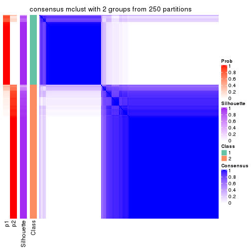</p>

</div>
<div id='tab-ATC-mclust-consensus-heatmap-2'>
<pre><code class="r">consensus_heatmap(res, k = 3)
</code></pre>

<p>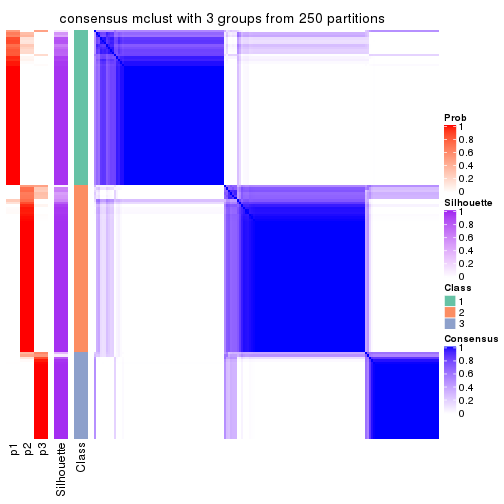</p>

</div>
<div id='tab-ATC-mclust-consensus-heatmap-3'>
<pre><code class="r">consensus_heatmap(res, k = 4)
</code></pre>

<p>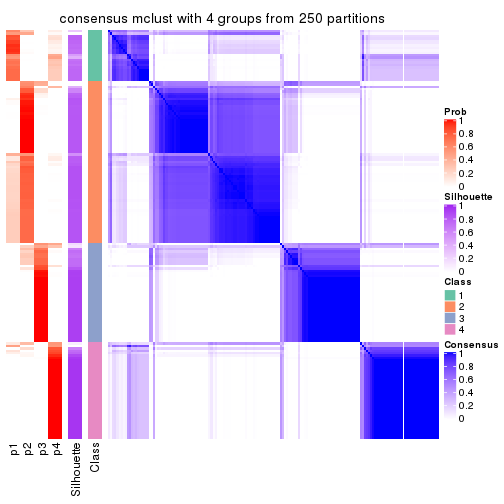</p>

</div>
<div id='tab-ATC-mclust-consensus-heatmap-4'>
<pre><code class="r">consensus_heatmap(res, k = 5)
</code></pre>

<p>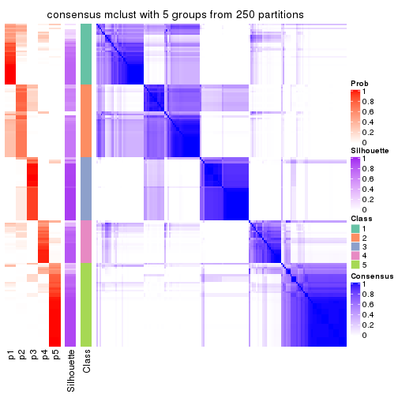</p>

</div>
<div id='tab-ATC-mclust-consensus-heatmap-5'>
<pre><code class="r">consensus_heatmap(res, k = 6)
</code></pre>

<p>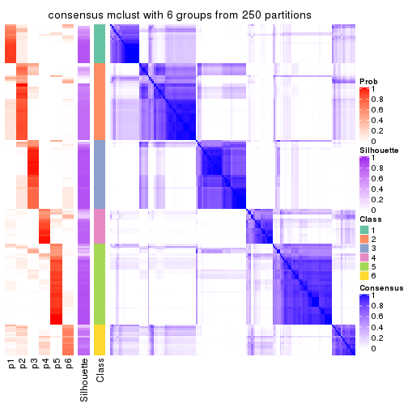</p>

</div>
</div>

Heatmaps for the membership of samples in all partitions to see how consistent they are:


<script>
$( function() {
	$( '#tabs-ATC-mclust-membership-heatmap' ).tabs();
} );
</script>
<div id='tabs-ATC-mclust-membership-heatmap'>
<ul>
<li><a href='#tab-ATC-mclust-membership-heatmap-1'>k = 2</a></li>
<li><a href='#tab-ATC-mclust-membership-heatmap-2'>k = 3</a></li>
<li><a href='#tab-ATC-mclust-membership-heatmap-3'>k = 4</a></li>
<li><a href='#tab-ATC-mclust-membership-heatmap-4'>k = 5</a></li>
<li><a href='#tab-ATC-mclust-membership-heatmap-5'>k = 6</a></li>
</ul>
<div id='tab-ATC-mclust-membership-heatmap-1'>
<pre><code class="r">membership_heatmap(res, k = 2)
</code></pre>

<p>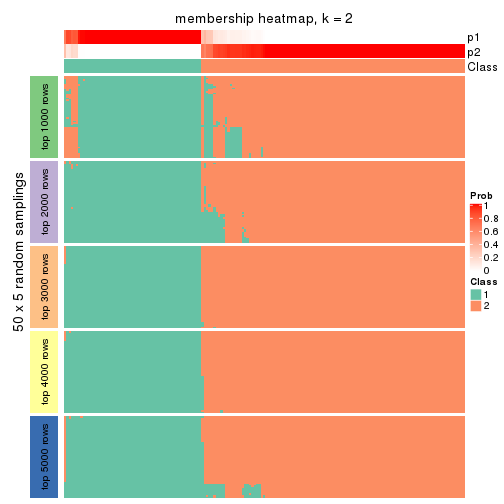</p>

</div>
<div id='tab-ATC-mclust-membership-heatmap-2'>
<pre><code class="r">membership_heatmap(res, k = 3)
</code></pre>

<p>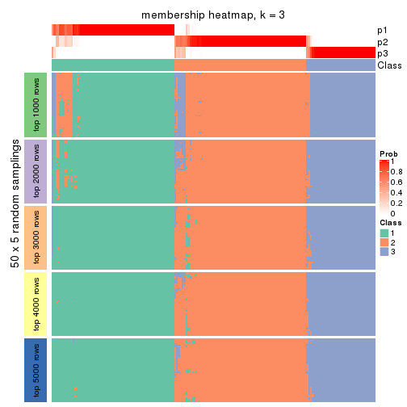</p>

</div>
<div id='tab-ATC-mclust-membership-heatmap-3'>
<pre><code class="r">membership_heatmap(res, k = 4)
</code></pre>

<p>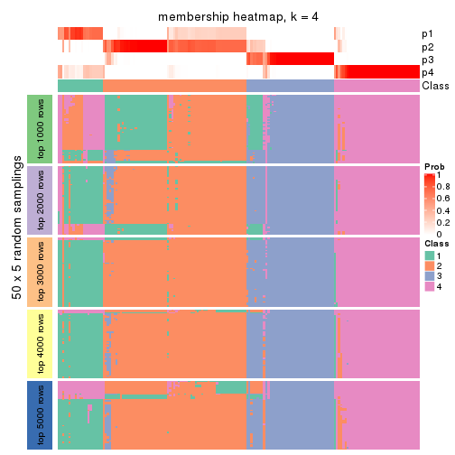</p>

</div>
<div id='tab-ATC-mclust-membership-heatmap-4'>
<pre><code class="r">membership_heatmap(res, k = 5)
</code></pre>

<p>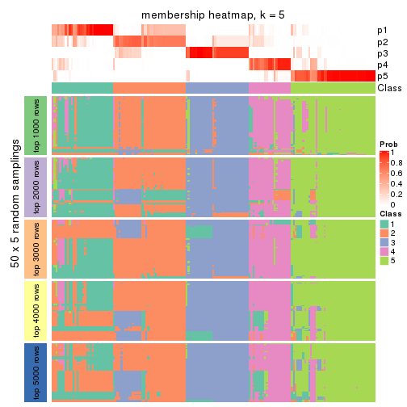</p>

</div>
<div id='tab-ATC-mclust-membership-heatmap-5'>
<pre><code class="r">membership_heatmap(res, k = 6)
</code></pre>

<p>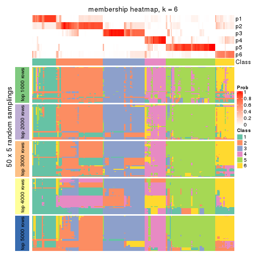</p>

</div>
</div>

As soon as we have had the classes for columns, we can look for signatures
which are significantly different between classes which can be candidate marks
for certain classes. Following are the heatmaps for signatures.


Signature heatmaps where rows are scaled:


<script>
$( function() {
	$( '#tabs-ATC-mclust-get-signatures' ).tabs();
} );
</script>
<div id='tabs-ATC-mclust-get-signatures'>
<ul>
<li><a href='#tab-ATC-mclust-get-signatures-1'>k = 2</a></li>
<li><a href='#tab-ATC-mclust-get-signatures-2'>k = 3</a></li>
<li><a href='#tab-ATC-mclust-get-signatures-3'>k = 4</a></li>
<li><a href='#tab-ATC-mclust-get-signatures-4'>k = 5</a></li>
<li><a href='#tab-ATC-mclust-get-signatures-5'>k = 6</a></li>
</ul>
<div id='tab-ATC-mclust-get-signatures-1'>
<pre><code class="r">get_signatures(res, k = 2)
</code></pre>

<p>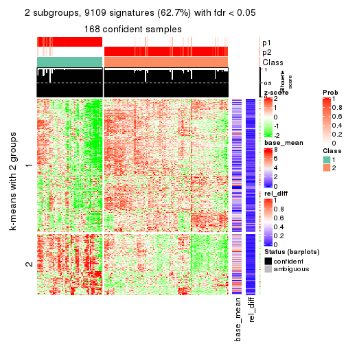</p>

</div>
<div id='tab-ATC-mclust-get-signatures-2'>
<pre><code class="r">get_signatures(res, k = 3)
</code></pre>

<p>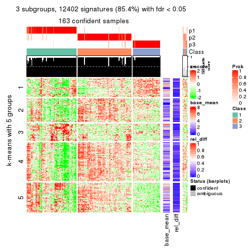</p>

</div>
<div id='tab-ATC-mclust-get-signatures-3'>
<pre><code class="r">get_signatures(res, k = 4)
</code></pre>

<p>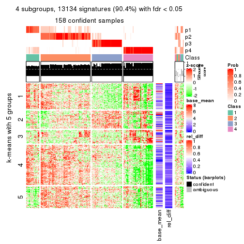</p>

</div>
<div id='tab-ATC-mclust-get-signatures-4'>
<pre><code class="r">get_signatures(res, k = 5)
</code></pre>

<p>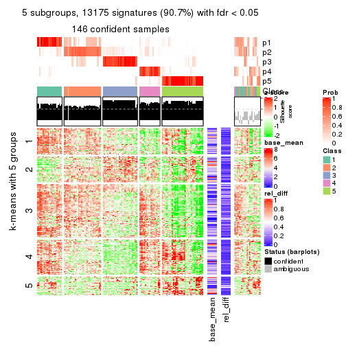</p>

</div>
<div id='tab-ATC-mclust-get-signatures-5'>
<pre><code class="r">get_signatures(res, k = 6)
</code></pre>

<p>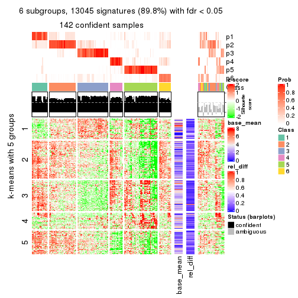</p>

</div>
</div>


Signature heatmaps where rows are not scaled:


<script>
$( function() {
	$( '#tabs-ATC-mclust-get-signatures-no-scale' ).tabs();
} );
</script>
<div id='tabs-ATC-mclust-get-signatures-no-scale'>
<ul>
<li><a href='#tab-ATC-mclust-get-signatures-no-scale-1'>k = 2</a></li>
<li><a href='#tab-ATC-mclust-get-signatures-no-scale-2'>k = 3</a></li>
<li><a href='#tab-ATC-mclust-get-signatures-no-scale-3'>k = 4</a></li>
<li><a href='#tab-ATC-mclust-get-signatures-no-scale-4'>k = 5</a></li>
<li><a href='#tab-ATC-mclust-get-signatures-no-scale-5'>k = 6</a></li>
</ul>
<div id='tab-ATC-mclust-get-signatures-no-scale-1'>
<pre><code class="r">get_signatures(res, k = 2, scale_rows = FALSE)
</code></pre>

<p>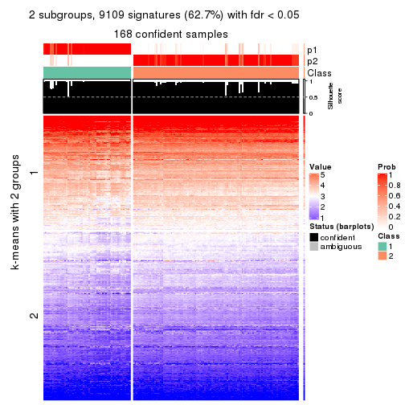</p>

</div>
<div id='tab-ATC-mclust-get-signatures-no-scale-2'>
<pre><code class="r">get_signatures(res, k = 3, scale_rows = FALSE)
</code></pre>

<p>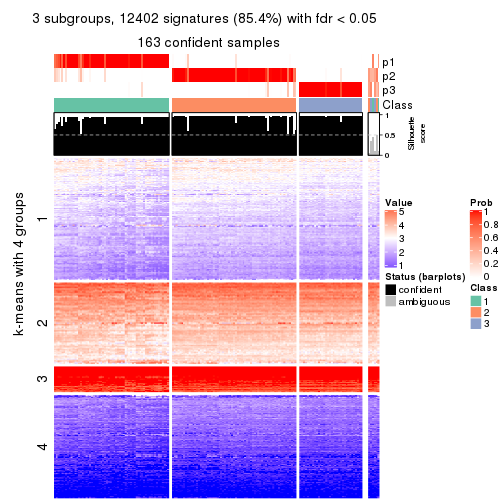</p>

</div>
<div id='tab-ATC-mclust-get-signatures-no-scale-3'>
<pre><code class="r">get_signatures(res, k = 4, scale_rows = FALSE)
</code></pre>

<p>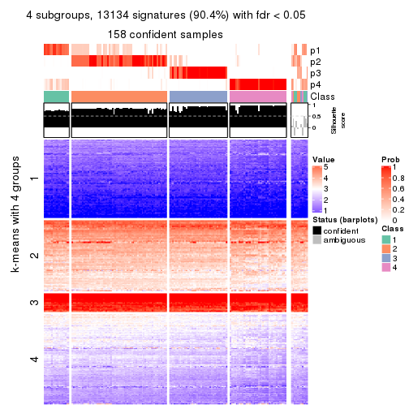</p>

</div>
<div id='tab-ATC-mclust-get-signatures-no-scale-4'>
<pre><code class="r">get_signatures(res, k = 5, scale_rows = FALSE)
</code></pre>

<p>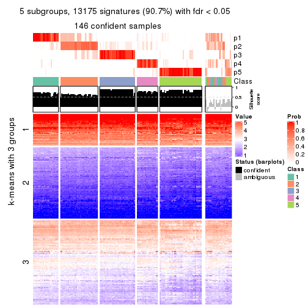</p>

</div>
<div id='tab-ATC-mclust-get-signatures-no-scale-5'>
<pre><code class="r">get_signatures(res, k = 6, scale_rows = FALSE)
</code></pre>

<p>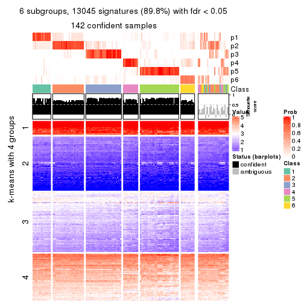</p>

</div>
</div>


Compare the overlap of signatures from different k:

```r
compare_signatures(res)
```

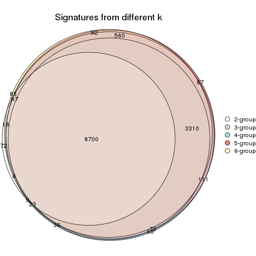

`get_signature()` returns a data frame invisibly. TO get the list of signatures, the function
call should be assigned to a variable explicitly. In following code, if `plot` argument is set
to `FALSE`, no heatmap is plotted while only the differential analysis is performed.

```r
# code only for demonstration
tb = get_signature(res, k = ..., plot = FALSE)
```

An example of the output of `tb` is:

```
#>   which_row         fdr    mean_1    mean_2 scaled_mean_1 scaled_mean_2 km
#> 1        38 0.042760348  8.373488  9.131774    -0.5533452     0.5164555  1
#> 2        40 0.018707592  7.106213  8.469186    -0.6173731     0.5762149  1
#> 3        55 0.019134737 10.221463 11.207825    -0.6159697     0.5749050  1
#> 4        59 0.006059896  5.921854  7.869574    -0.6899429     0.6439467  1
#> 5        60 0.018055526  8.928898 10.211722    -0.6204761     0.5791110  1
#> 6        98 0.009384629 15.714769 14.887706     0.6635654    -0.6193277  2
...
```

The columns in `tb` are:

1. `which_row`: row indices corresponding to the input matrix.
2. `fdr`: FDR for the differential test. 
3. `mean_x`: The mean value in group x.
4. `scaled_mean_x`: The mean value in group x after rows are scaled.
5. `km`: Row groups if k-means clustering is applied to rows.


UMAP plot which shows how samples are separated.


<script>
$( function() {
	$( '#tabs-ATC-mclust-dimension-reduction' ).tabs();
} );
</script>
<div id='tabs-ATC-mclust-dimension-reduction'>
<ul>
<li><a href='#tab-ATC-mclust-dimension-reduction-1'>k = 2</a></li>
<li><a href='#tab-ATC-mclust-dimension-reduction-2'>k = 3</a></li>
<li><a href='#tab-ATC-mclust-dimension-reduction-3'>k = 4</a></li>
<li><a href='#tab-ATC-mclust-dimension-reduction-4'>k = 5</a></li>
<li><a href='#tab-ATC-mclust-dimension-reduction-5'>k = 6</a></li>
</ul>
<div id='tab-ATC-mclust-dimension-reduction-1'>
<pre><code class="r">dimension_reduction(res, k = 2, method = &quot;UMAP&quot;)
</code></pre>

<p>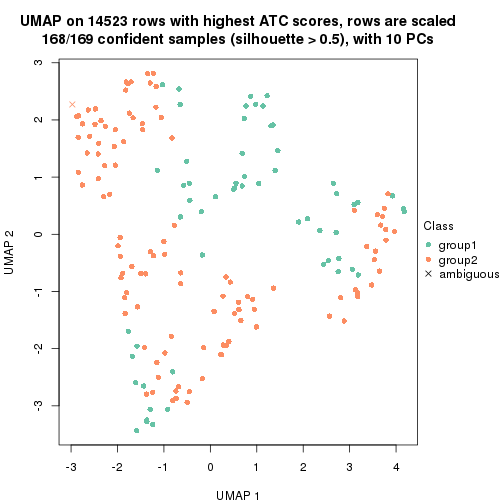</p>

</div>
<div id='tab-ATC-mclust-dimension-reduction-2'>
<pre><code class="r">dimension_reduction(res, k = 3, method = &quot;UMAP&quot;)
</code></pre>

<p>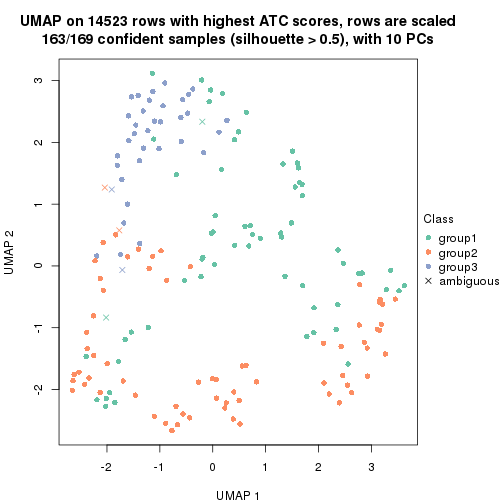</p>

</div>
<div id='tab-ATC-mclust-dimension-reduction-3'>
<pre><code class="r">dimension_reduction(res, k = 4, method = &quot;UMAP&quot;)
</code></pre>

<p>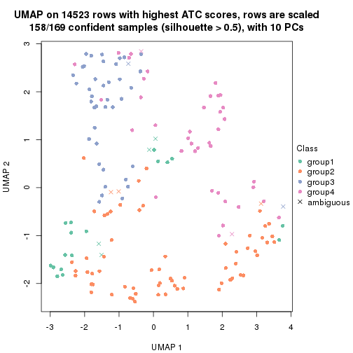</p>

</div>
<div id='tab-ATC-mclust-dimension-reduction-4'>
<pre><code class="r">dimension_reduction(res, k = 5, method = &quot;UMAP&quot;)
</code></pre>

<p>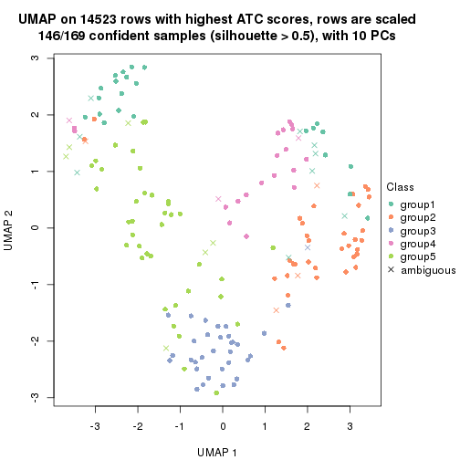</p>

</div>
<div id='tab-ATC-mclust-dimension-reduction-5'>
<pre><code class="r">dimension_reduction(res, k = 6, method = &quot;UMAP&quot;)
</code></pre>

<p>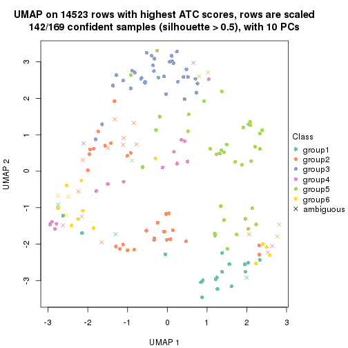</p>

</div>
</div>


Following heatmap shows how subgroups are split when increasing `k`:

```r
collect_classes(res)
```

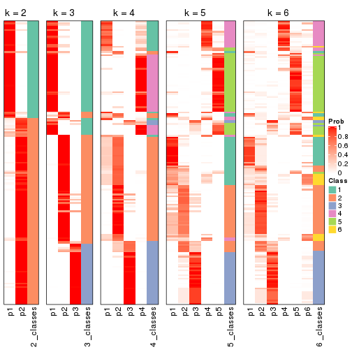


If matrix rows can be associated to genes, consider to use `GO_Enrichment(res,
...)` to perform function enrichment for the signature genes.


 

---------------------------------------------------


### ATC:NMF*


The object with results only for a single top-value method and a single partition method 
can be extracted as:

```r
res = res_list["ATC", "NMF"]
# you can also extract it by
# res = res_list["ATC:NMF"]
```

A summary of `res` and all the functions that can be applied to it:

```r
res
```

```
#> A 'ConsensusPartition' object with k = 2, 3, 4, 5, 6.
#>   On a matrix with 14523 rows and 169 columns.
#>   Top rows (1000, 2000, 3000, 4000, 5000) are extracted by 'ATC' method.
#>   Subgroups are detected by 'NMF' method.
#>   Performed in total 1250 partitions by row resampling.
#>   Best k for subgroups seems to be 2.
#> 
#> Following methods can be applied to this 'ConsensusPartition' object:
#>  [1] "cola_report"             "collect_classes"         "collect_plots"          
#>  [4] "collect_stats"           "colnames"                "compare_signatures"     
#>  [7] "consensus_heatmap"       "dimension_reduction"     "functional_enrichment"  
#> [10] "get_anno_col"            "get_anno"                "get_classes"            
#> [13] "get_consensus"           "get_matrix"              "get_membership"         
#> [16] "get_param"               "get_signatures"          "get_stats"              
#> [19] "is_best_k"               "is_stable_k"             "membership_heatmap"     
#> [22] "ncol"                    "nrow"                    "plot_ecdf"              
#> [25] "rownames"                "select_partition_number" "show"                   
#> [28] "suggest_best_k"          "test_to_known_factors"
```

`collect_plots()` function collects all the plots made from `res` for all `k` (number of partitions)
into one single page to provide an easy and fast comparison between different `k`.

```r
collect_plots(res)
```

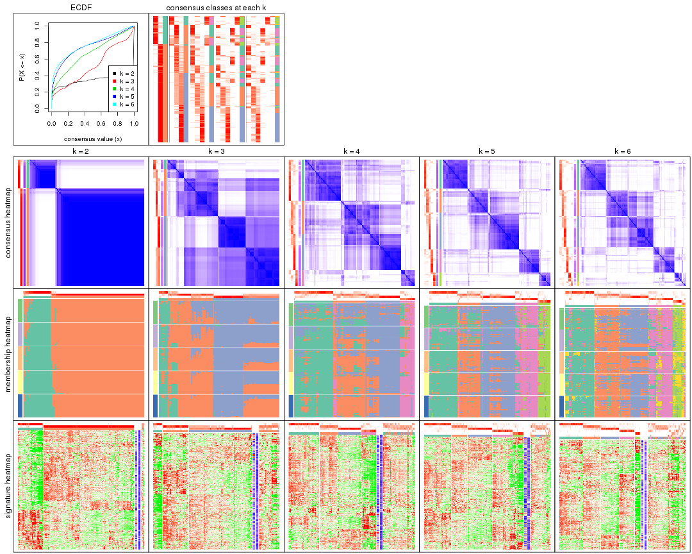

The plots are:

- The first row: a plot of the ECDF (Empirical cumulative distribution
  function) curves of the consensus matrix for each `k` and the heatmap of
  predicted classes for each `k`.
- The second row: heatmaps of the consensus matrix for each `k`.
- The third row: heatmaps of the membership matrix for each `k`.
- The fouth row: heatmaps of the signatures for each `k`.

All the plots in panels can be made by individual functions and they are
plotted later in this section.

`select_partition_number()` produces several plots showing different
statistics for choosing "optimized" `k`. There are following statistics:

- ECDF curves of the consensus matrix for each `k`;
- 1-PAC. [The PAC
  score](https://en.wikipedia.org/wiki/Consensus_clustering#Over-interpretation_potential_of_consensus_clustering)
  measures the proportion of the ambiguous subgrouping.
- Mean silhouette score.
- Concordance. The mean probability of fiting the consensus class ids in all
  partitions.
- Area increased. Denote $A_k$ as the area under the ECDF curve for current
  `k`, the area increased is defined as $A_k - A_{k-1}$.
- Rand index. The percent of pairs of samples that are both in a same cluster
  or both are not in a same cluster in the partition of k and k-1.
- Jaccard index. The ratio of pairs of samples are both in a same cluster in
  the partition of k and k-1 and the pairs of samples are both in a same
  cluster in the partition k or k-1.

The detailed explanations of these statistics can be found in [the cola
vignette](http://bioconductor.org/packages/devel/bioc/vignettes/cola/inst/doc/cola.html#toc_13).

Generally speaking, lower PAC score, higher mean silhouette score or higher
concordance corresponds to better partition. Rand index and Jaccard index
measure how similar the current partition is compared to partition with `k-1`.
If they are too similar, we won't accept `k` is better than `k-1`.

```r
select_partition_number(res)
```

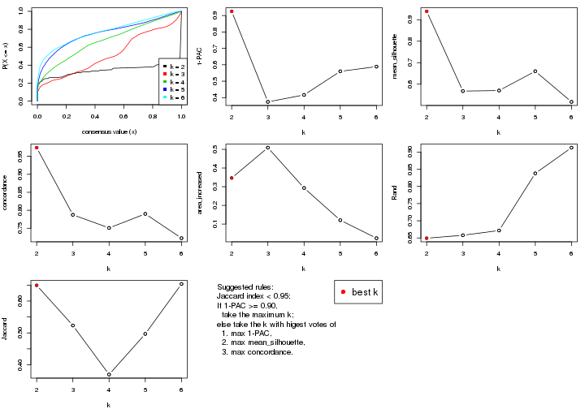

The numeric values for all these statistics can be obtained by `get_stats()`.

```r
get_stats(res)
```

```
#>   k 1-PAC mean_silhouette concordance area_increased  Rand Jaccard
#> 2 2 0.926           0.939       0.974         0.3467 0.649   0.649
#> 3 3 0.374           0.568       0.787         0.5089 0.658   0.523
#> 4 4 0.416           0.570       0.751         0.2930 0.672   0.370
#> 5 5 0.560           0.660       0.790         0.1206 0.838   0.497
#> 6 6 0.589           0.517       0.722         0.0244 0.913   0.654
```

`suggest_best_k()` suggests the best $k$ based on these statistics. The rules are as follows:

- All $k$ with Jaccard index larger than 0.95 are removed because the increase of
  the partition number does not provides enough extra information. If all $k$ are removed,
  the best $k$ is assigned by `NA`.
- For $k$ with 1-PAC larger than 0.9, the maximal $k$ is taken as the "best k". Other $k$ is called "optional k".
- If it does not fit the second rule. The $k$ with the highest vote of highest
  1-PAC, mean silhouette and concordance is taken as the "best k".

```r
suggest_best_k(res)
```

```
#> [1] 2
```


Following shows the table of the partitions (You need to click the **show/hide
code output** link to see it). The membership matrix (columns with name `p*`)
is inferred by
[`clue::cl_consensus()`](https://www.rdocumentation.org/link/cl_consensus?package=clue)
function with the `SE` method. Basically the value in the membership matrix
represents the probability to belong to a certain group. The finall class
label for an item is determined with the group with highest probability it
belongs to.

In `get_classes()` function, the entropy is calculated from the membership
matrix and the silhouette score is calculated from the consensus matrix.


<script>
$( function() {
	$( '#tabs-ATC-NMF-get-classes' ).tabs();
} );
</script>
<div id='tabs-ATC-NMF-get-classes'>
<ul>
<li><a href='#tab-ATC-NMF-get-classes-1'>k = 2</a></li>
<li><a href='#tab-ATC-NMF-get-classes-2'>k = 3</a></li>
<li><a href='#tab-ATC-NMF-get-classes-3'>k = 4</a></li>
<li><a href='#tab-ATC-NMF-get-classes-4'>k = 5</a></li>
<li><a href='#tab-ATC-NMF-get-classes-5'>k = 6</a></li>
</ul>

<div id='tab-ATC-NMF-get-classes-1'>
<p><a id='tab-ATC-NMF-get-classes-1-a' style='color:#0366d6' href='#'>show/hide code output</a></p>
<pre><code class="r">cbind(get_classes(res, k = 2), get_membership(res, k = 2))
</code></pre>

<pre><code>#&gt;            class entropy silhouette    p1    p2
#&gt; SRR2052702     2  0.0672     0.9770 0.008 0.992
#&gt; SRR2052701     2  0.0376     0.9804 0.004 0.996
#&gt; SRR2052700     1  0.2778     0.9099 0.952 0.048
#&gt; SRR2052699     2  0.0000     0.9837 0.000 1.000
#&gt; SRR2052698     2  0.0000     0.9837 0.000 1.000
#&gt; SRR2052708     1  0.7950     0.7216 0.760 0.240
#&gt; SRR2052749     2  0.0000     0.9837 0.000 1.000
#&gt; SRR2052786     2  0.0000     0.9837 0.000 1.000
#&gt; SRR2052825     1  0.0000     0.9319 1.000 0.000
#&gt; SRR2052824     1  0.0000     0.9319 1.000 0.000
#&gt; SRR2052823     2  0.0000     0.9837 0.000 1.000
#&gt; SRR2052822     2  0.0000     0.9837 0.000 1.000
#&gt; SRR2052821     2  0.0000     0.9837 0.000 1.000
#&gt; SRR2052820     2  0.0000     0.9837 0.000 1.000
#&gt; SRR2052819     1  0.9522     0.4774 0.628 0.372
#&gt; SRR2052818     1  0.0000     0.9319 1.000 0.000
#&gt; SRR2052817     2  0.0000     0.9837 0.000 1.000
#&gt; SRR2052816     2  0.0000     0.9837 0.000 1.000
#&gt; SRR2052815     1  0.0000     0.9319 1.000 0.000
#&gt; SRR2052814     1  0.0000     0.9319 1.000 0.000
#&gt; SRR2052813     2  0.0000     0.9837 0.000 1.000
#&gt; SRR2052812     2  0.0000     0.9837 0.000 1.000
#&gt; SRR2052811     2  0.0000     0.9837 0.000 1.000
#&gt; SRR2052810     1  0.0000     0.9319 1.000 0.000
#&gt; SRR2052809     2  0.0000     0.9837 0.000 1.000
#&gt; SRR2052808     2  0.0000     0.9837 0.000 1.000
#&gt; SRR2052807     1  0.0000     0.9319 1.000 0.000
#&gt; SRR2052806     1  0.0000     0.9319 1.000 0.000
#&gt; SRR2052805     2  0.9983    -0.0148 0.476 0.524
#&gt; SRR2052804     1  0.1843     0.9210 0.972 0.028
#&gt; SRR2052803     1  0.8909     0.6108 0.692 0.308
#&gt; SRR2052802     1  0.0000     0.9319 1.000 0.000
#&gt; SRR2052801     1  0.0000     0.9319 1.000 0.000
#&gt; SRR2052800     1  0.0000     0.9319 1.000 0.000
#&gt; SRR2052799     1  0.0000     0.9319 1.000 0.000
#&gt; SRR2052798     2  0.0000     0.9837 0.000 1.000
#&gt; SRR2052797     2  0.0000     0.9837 0.000 1.000
#&gt; SRR2052796     1  0.0000     0.9319 1.000 0.000
#&gt; SRR2052795     2  0.6343     0.7942 0.160 0.840
#&gt; SRR2052794     1  0.7056     0.7843 0.808 0.192
#&gt; SRR2052793     2  0.0000     0.9837 0.000 1.000
#&gt; SRR2052792     1  0.8327     0.6723 0.736 0.264
#&gt; SRR2052791     2  0.0000     0.9837 0.000 1.000
#&gt; SRR2052790     2  0.0000     0.9837 0.000 1.000
#&gt; SRR2052789     2  0.0000     0.9837 0.000 1.000
#&gt; SRR2052788     2  0.0000     0.9837 0.000 1.000
#&gt; SRR2052787     2  0.0000     0.9837 0.000 1.000
#&gt; SRR2052785     2  0.0000     0.9837 0.000 1.000
#&gt; SRR2052784     2  0.0000     0.9837 0.000 1.000
#&gt; SRR2052783     2  0.0000     0.9837 0.000 1.000
#&gt; SRR2052782     2  0.0000     0.9837 0.000 1.000
#&gt; SRR2052781     2  0.0000     0.9837 0.000 1.000
#&gt; SRR2052780     2  0.0000     0.9837 0.000 1.000
#&gt; SRR2052777     2  0.0000     0.9837 0.000 1.000
#&gt; SRR2052779     2  0.0000     0.9837 0.000 1.000
#&gt; SRR2052778     2  0.0000     0.9837 0.000 1.000
#&gt; SRR2052776     2  0.0000     0.9837 0.000 1.000
#&gt; SRR2052775     2  0.0000     0.9837 0.000 1.000
#&gt; SRR2052773     2  0.0000     0.9837 0.000 1.000
#&gt; SRR2052772     2  0.0000     0.9837 0.000 1.000
#&gt; SRR2052774     2  0.0000     0.9837 0.000 1.000
#&gt; SRR2052771     2  0.0000     0.9837 0.000 1.000
#&gt; SRR2052769     2  0.6973     0.7536 0.188 0.812
#&gt; SRR2052770     2  0.0000     0.9837 0.000 1.000
#&gt; SRR2052768     2  0.0000     0.9837 0.000 1.000
#&gt; SRR2052767     2  0.0000     0.9837 0.000 1.000
#&gt; SRR2052766     2  0.0000     0.9837 0.000 1.000
#&gt; SRR2052765     1  0.2236     0.9153 0.964 0.036
#&gt; SRR2052763     2  0.0000     0.9837 0.000 1.000
#&gt; SRR2052764     1  0.0672     0.9293 0.992 0.008
#&gt; SRR2052761     2  0.0000     0.9837 0.000 1.000
#&gt; SRR2052760     2  0.0000     0.9837 0.000 1.000
#&gt; SRR2052759     2  0.0000     0.9837 0.000 1.000
#&gt; SRR2052762     2  0.0000     0.9837 0.000 1.000
#&gt; SRR2052758     2  0.0000     0.9837 0.000 1.000
#&gt; SRR2052756     1  0.0000     0.9319 1.000 0.000
#&gt; SRR2052757     2  0.0000     0.9837 0.000 1.000
#&gt; SRR2052755     2  0.9993    -0.0446 0.484 0.516
#&gt; SRR2052754     1  0.0000     0.9319 1.000 0.000
#&gt; SRR2052753     1  0.1184     0.9264 0.984 0.016
#&gt; SRR2052752     2  0.0000     0.9837 0.000 1.000
#&gt; SRR2052750     2  0.0000     0.9837 0.000 1.000
#&gt; SRR2052751     2  0.0000     0.9837 0.000 1.000
#&gt; SRR2052748     2  0.0000     0.9837 0.000 1.000
#&gt; SRR2052747     2  0.0376     0.9804 0.004 0.996
#&gt; SRR2052746     2  0.0000     0.9837 0.000 1.000
#&gt; SRR2052745     2  0.0000     0.9837 0.000 1.000
#&gt; SRR2052744     2  0.0000     0.9837 0.000 1.000
#&gt; SRR2052741     2  0.0000     0.9837 0.000 1.000
#&gt; SRR2052743     2  0.0000     0.9837 0.000 1.000
#&gt; SRR2052740     2  0.0000     0.9837 0.000 1.000
#&gt; SRR2052742     2  0.0000     0.9837 0.000 1.000
#&gt; SRR2052739     2  0.0938     0.9735 0.012 0.988
#&gt; SRR2052738     2  0.0000     0.9837 0.000 1.000
#&gt; SRR2052736     2  0.0000     0.9837 0.000 1.000
#&gt; SRR2052735     2  0.0000     0.9837 0.000 1.000
#&gt; SRR2052734     2  0.0000     0.9837 0.000 1.000
#&gt; SRR2052737     2  0.0000     0.9837 0.000 1.000
#&gt; SRR2052733     2  0.0000     0.9837 0.000 1.000
#&gt; SRR2052732     1  0.9866     0.3154 0.568 0.432
#&gt; SRR2052731     2  0.0000     0.9837 0.000 1.000
#&gt; SRR2052729     2  0.5946     0.8173 0.144 0.856
#&gt; SRR2052728     2  0.0672     0.9770 0.008 0.992
#&gt; SRR2052730     2  0.1633     0.9619 0.024 0.976
#&gt; SRR2052727     2  0.0376     0.9804 0.004 0.996
#&gt; SRR2052725     1  0.0000     0.9319 1.000 0.000
#&gt; SRR2052726     2  0.0000     0.9837 0.000 1.000
#&gt; SRR2052724     1  0.6801     0.7969 0.820 0.180
#&gt; SRR2052723     2  0.0000     0.9837 0.000 1.000
#&gt; SRR2052722     2  0.0000     0.9837 0.000 1.000
#&gt; SRR2052721     2  0.0000     0.9837 0.000 1.000
#&gt; SRR2052720     2  0.0000     0.9837 0.000 1.000
#&gt; SRR2052719     2  0.0000     0.9837 0.000 1.000
#&gt; SRR2052718     1  0.2423     0.9146 0.960 0.040
#&gt; SRR2052717     2  0.0000     0.9837 0.000 1.000
#&gt; SRR2052714     2  0.0000     0.9837 0.000 1.000
#&gt; SRR2052716     2  0.0000     0.9837 0.000 1.000
#&gt; SRR2052715     2  0.0000     0.9837 0.000 1.000
#&gt; SRR2052713     1  0.0000     0.9319 1.000 0.000
#&gt; SRR2052712     1  0.0000     0.9319 1.000 0.000
#&gt; SRR2052711     1  0.0000     0.9319 1.000 0.000
#&gt; SRR2052710     2  0.0000     0.9837 0.000 1.000
#&gt; SRR2052707     2  0.0000     0.9837 0.000 1.000
#&gt; SRR2052709     2  0.0000     0.9837 0.000 1.000
#&gt; SRR2052704     2  0.0000     0.9837 0.000 1.000
#&gt; SRR2052705     2  0.0000     0.9837 0.000 1.000
#&gt; SRR2052697     2  0.0000     0.9837 0.000 1.000
#&gt; SRR2052703     2  0.0000     0.9837 0.000 1.000
#&gt; SRR2052696     2  0.0000     0.9837 0.000 1.000
#&gt; SRR2052706     2  0.0000     0.9837 0.000 1.000
#&gt; SRR2052695     2  0.0000     0.9837 0.000 1.000
#&gt; SRR2052694     2  0.0000     0.9837 0.000 1.000
#&gt; SRR2052692     2  0.0000     0.9837 0.000 1.000
#&gt; SRR2052693     2  0.0000     0.9837 0.000 1.000
#&gt; SRR2052691     2  0.0000     0.9837 0.000 1.000
#&gt; SRR2052690     2  0.0000     0.9837 0.000 1.000
#&gt; SRR2052689     2  0.1414     0.9652 0.020 0.980
#&gt; SRR2052687     1  0.7299     0.7700 0.796 0.204
#&gt; SRR2052686     1  0.0000     0.9319 1.000 0.000
#&gt; SRR2052688     2  0.0000     0.9837 0.000 1.000
#&gt; SRR2052684     2  0.0000     0.9837 0.000 1.000
#&gt; SRR2052685     2  0.0000     0.9837 0.000 1.000
#&gt; SRR2052683     1  0.0000     0.9319 1.000 0.000
#&gt; SRR2052681     1  0.4022     0.8870 0.920 0.080
#&gt; SRR2052680     1  0.0000     0.9319 1.000 0.000
#&gt; SRR2052682     2  0.0376     0.9804 0.004 0.996
#&gt; SRR2052679     2  0.0000     0.9837 0.000 1.000
#&gt; SRR2052678     2  0.0000     0.9837 0.000 1.000
#&gt; SRR2052677     2  0.0000     0.9837 0.000 1.000
#&gt; SRR2052675     2  0.0000     0.9837 0.000 1.000
#&gt; SRR2052676     2  0.5294     0.8497 0.120 0.880
#&gt; SRR2052674     2  0.3879     0.9060 0.076 0.924
#&gt; SRR2052672     2  0.0000     0.9837 0.000 1.000
#&gt; SRR2052673     2  0.0376     0.9804 0.004 0.996
#&gt; SRR2052671     2  0.0000     0.9837 0.000 1.000
#&gt; SRR2052670     2  0.0000     0.9837 0.000 1.000
#&gt; SRR2052669     2  0.0000     0.9837 0.000 1.000
#&gt; SRR2052668     2  0.0000     0.9837 0.000 1.000
#&gt; SRR2052667     2  0.0000     0.9837 0.000 1.000
#&gt; SRR2052666     2  0.0000     0.9837 0.000 1.000
#&gt; SRR2052665     2  0.0000     0.9837 0.000 1.000
#&gt; SRR2052664     1  0.0000     0.9319 1.000 0.000
#&gt; SRR2052663     2  0.2043     0.9538 0.032 0.968
#&gt; SRR2052662     2  0.0000     0.9837 0.000 1.000
#&gt; SRR2052661     2  0.6801     0.7647 0.180 0.820
#&gt; SRR2052660     2  0.0000     0.9837 0.000 1.000
#&gt; SRR2052659     2  0.0000     0.9837 0.000 1.000
#&gt; SRR2052658     2  0.0000     0.9837 0.000 1.000
#&gt; SRR2052657     2  0.0000     0.9837 0.000 1.000
</code></pre>

<script>
$('#tab-ATC-NMF-get-classes-1-a').parent().next().next().hide();
$('#tab-ATC-NMF-get-classes-1-a').click(function(){
  $('#tab-ATC-NMF-get-classes-1-a').parent().next().next().toggle();
  return(false);
});
</script>
</div>

<div id='tab-ATC-NMF-get-classes-2'>
<p><a id='tab-ATC-NMF-get-classes-2-a' style='color:#0366d6' href='#'>show/hide code output</a></p>
<pre><code class="r">cbind(get_classes(res, k = 3), get_membership(res, k = 3))
</code></pre>

<pre><code>#&gt;            class entropy silhouette    p1    p2    p3
#&gt; SRR2052702     2  0.2625     0.7007 0.000 0.916 0.084
#&gt; SRR2052701     2  0.4504     0.6247 0.000 0.804 0.196
#&gt; SRR2052700     2  0.0592     0.6571 0.012 0.988 0.000
#&gt; SRR2052699     3  0.6079     0.6167 0.000 0.388 0.612
#&gt; SRR2052698     3  0.5621     0.6563 0.000 0.308 0.692
#&gt; SRR2052708     2  0.0983     0.6781 0.004 0.980 0.016
#&gt; SRR2052749     3  0.6244     0.5195 0.000 0.440 0.560
#&gt; SRR2052786     3  0.6079     0.6159 0.000 0.388 0.612
#&gt; SRR2052825     2  0.6026    -0.1722 0.376 0.624 0.000
#&gt; SRR2052824     2  0.5948    -0.1345 0.360 0.640 0.000
#&gt; SRR2052823     2  0.5706     0.3691 0.000 0.680 0.320
#&gt; SRR2052822     3  0.5650     0.6571 0.000 0.312 0.688
#&gt; SRR2052821     3  0.6168     0.5750 0.000 0.412 0.588
#&gt; SRR2052820     3  0.0237     0.6737 0.000 0.004 0.996
#&gt; SRR2052819     1  0.7599     0.5081 0.656 0.084 0.260
#&gt; SRR2052818     2  0.0237     0.6641 0.004 0.996 0.000
#&gt; SRR2052817     3  0.1163     0.6795 0.000 0.028 0.972
#&gt; SRR2052816     2  0.2860     0.6999 0.004 0.912 0.084
#&gt; SRR2052815     2  0.6026    -0.1693 0.376 0.624 0.000
#&gt; SRR2052814     1  0.5327     0.6895 0.728 0.272 0.000
#&gt; SRR2052813     3  0.6079     0.6167 0.000 0.388 0.612
#&gt; SRR2052812     3  0.6204     0.5560 0.000 0.424 0.576
#&gt; SRR2052811     2  0.3412     0.6820 0.000 0.876 0.124
#&gt; SRR2052810     2  0.4121     0.4151 0.168 0.832 0.000
#&gt; SRR2052809     3  0.5948     0.6425 0.000 0.360 0.640
#&gt; SRR2052808     3  0.6267     0.4985 0.000 0.452 0.548
#&gt; SRR2052807     1  0.0892     0.8370 0.980 0.020 0.000
#&gt; SRR2052806     2  0.0000     0.6676 0.000 1.000 0.000
#&gt; SRR2052805     2  0.1289     0.6875 0.000 0.968 0.032
#&gt; SRR2052804     2  0.6330    -0.1995 0.396 0.600 0.004
#&gt; SRR2052803     2  0.0592     0.6771 0.000 0.988 0.012
#&gt; SRR2052802     1  0.0892     0.8370 0.980 0.020 0.000
#&gt; SRR2052801     1  0.0892     0.8345 0.980 0.020 0.000
#&gt; SRR2052800     1  0.0892     0.8370 0.980 0.020 0.000
#&gt; SRR2052799     1  0.2448     0.8299 0.924 0.076 0.000
#&gt; SRR2052798     3  0.6062     0.6212 0.000 0.384 0.616
#&gt; SRR2052797     3  0.6180     0.5741 0.000 0.416 0.584
#&gt; SRR2052796     1  0.5178     0.7176 0.744 0.256 0.000
#&gt; SRR2052795     2  0.6204     0.0195 0.000 0.576 0.424
#&gt; SRR2052794     1  0.3539     0.7927 0.888 0.012 0.100
#&gt; SRR2052793     3  0.6168     0.5745 0.000 0.412 0.588
#&gt; SRR2052792     1  0.3370     0.8180 0.904 0.024 0.072
#&gt; SRR2052791     3  0.0892     0.6760 0.000 0.020 0.980
#&gt; SRR2052790     3  0.1860     0.6794 0.000 0.052 0.948
#&gt; SRR2052789     3  0.0592     0.6785 0.000 0.012 0.988
#&gt; SRR2052788     3  0.0237     0.6754 0.000 0.004 0.996
#&gt; SRR2052787     3  0.6215     0.5331 0.000 0.428 0.572
#&gt; SRR2052785     3  0.5397     0.6601 0.000 0.280 0.720
#&gt; SRR2052784     3  0.5948     0.6425 0.000 0.360 0.640
#&gt; SRR2052783     3  0.5988     0.6361 0.000 0.368 0.632
#&gt; SRR2052782     3  0.5926     0.6444 0.000 0.356 0.644
#&gt; SRR2052781     3  0.5948     0.6425 0.000 0.360 0.640
#&gt; SRR2052780     3  0.0424     0.6773 0.000 0.008 0.992
#&gt; SRR2052777     3  0.5948     0.6425 0.000 0.360 0.640
#&gt; SRR2052779     3  0.5859     0.6491 0.000 0.344 0.656
#&gt; SRR2052778     3  0.0000     0.6735 0.000 0.000 1.000
#&gt; SRR2052776     3  0.5706     0.6558 0.000 0.320 0.680
#&gt; SRR2052775     3  0.0424     0.6773 0.000 0.008 0.992
#&gt; SRR2052773     3  0.2066     0.6789 0.000 0.060 0.940
#&gt; SRR2052772     3  0.0237     0.6754 0.000 0.004 0.996
#&gt; SRR2052774     3  0.1163     0.6798 0.000 0.028 0.972
#&gt; SRR2052771     3  0.3276     0.6106 0.024 0.068 0.908
#&gt; SRR2052769     2  0.8631     0.4451 0.180 0.600 0.220
#&gt; SRR2052770     3  0.0000     0.6735 0.000 0.000 1.000
#&gt; SRR2052768     3  0.6168     0.5788 0.000 0.412 0.588
#&gt; SRR2052767     2  0.4733     0.6246 0.004 0.800 0.196
#&gt; SRR2052766     1  0.4235     0.7498 0.824 0.000 0.176
#&gt; SRR2052765     2  0.0661     0.6664 0.008 0.988 0.004
#&gt; SRR2052763     3  0.0000     0.6735 0.000 0.000 1.000
#&gt; SRR2052764     2  0.0237     0.6710 0.000 0.996 0.004
#&gt; SRR2052761     3  0.0747     0.6783 0.000 0.016 0.984
#&gt; SRR2052760     3  0.6095     0.6100 0.000 0.392 0.608
#&gt; SRR2052759     3  0.0000     0.6735 0.000 0.000 1.000
#&gt; SRR2052762     3  0.5926     0.6446 0.000 0.356 0.644
#&gt; SRR2052758     3  0.0424     0.6773 0.000 0.008 0.992
#&gt; SRR2052756     2  0.5678     0.3333 0.316 0.684 0.000
#&gt; SRR2052757     3  0.6008     0.6340 0.000 0.372 0.628
#&gt; SRR2052755     2  0.3607     0.6906 0.008 0.880 0.112
#&gt; SRR2052754     1  0.4504     0.7780 0.804 0.196 0.000
#&gt; SRR2052753     2  0.2860     0.6421 0.084 0.912 0.004
#&gt; SRR2052752     3  0.6045     0.6261 0.000 0.380 0.620
#&gt; SRR2052750     2  0.5785     0.3440 0.000 0.668 0.332
#&gt; SRR2052751     3  0.5968     0.6409 0.000 0.364 0.636
#&gt; SRR2052748     3  0.1163     0.6511 0.028 0.000 0.972
#&gt; SRR2052747     2  0.4062     0.6543 0.000 0.836 0.164
#&gt; SRR2052746     3  0.0000     0.6735 0.000 0.000 1.000
#&gt; SRR2052745     3  0.1129     0.6587 0.020 0.004 0.976
#&gt; SRR2052744     2  0.5810     0.3431 0.000 0.664 0.336
#&gt; SRR2052741     3  0.5988     0.6361 0.000 0.368 0.632
#&gt; SRR2052743     3  0.5988     0.6361 0.000 0.368 0.632
#&gt; SRR2052740     3  0.6045     0.6226 0.000 0.380 0.620
#&gt; SRR2052742     3  0.5706     0.6558 0.000 0.320 0.680
#&gt; SRR2052739     2  0.2945     0.7006 0.004 0.908 0.088
#&gt; SRR2052738     3  0.0000     0.6735 0.000 0.000 1.000
#&gt; SRR2052736     2  0.6180     0.0316 0.000 0.584 0.416
#&gt; SRR2052735     2  0.5706     0.3998 0.000 0.680 0.320
#&gt; SRR2052734     2  0.4750     0.5984 0.000 0.784 0.216
#&gt; SRR2052737     3  0.6111     0.6045 0.000 0.396 0.604
#&gt; SRR2052733     3  0.0892     0.6581 0.020 0.000 0.980
#&gt; SRR2052732     2  0.1129     0.6796 0.004 0.976 0.020
#&gt; SRR2052731     3  0.0000     0.6735 0.000 0.000 1.000
#&gt; SRR2052729     2  0.4346     0.6378 0.000 0.816 0.184
#&gt; SRR2052728     2  0.4121     0.6520 0.000 0.832 0.168
#&gt; SRR2052730     2  0.8109     0.2384 0.272 0.620 0.108
#&gt; SRR2052727     2  0.5016     0.5621 0.000 0.760 0.240
#&gt; SRR2052725     2  0.0424     0.6644 0.008 0.992 0.000
#&gt; SRR2052726     2  0.5254     0.5212 0.000 0.736 0.264
#&gt; SRR2052724     2  0.8277    -0.1401 0.456 0.468 0.076
#&gt; SRR2052723     3  0.0892     0.6581 0.020 0.000 0.980
#&gt; SRR2052722     3  0.0592     0.6785 0.000 0.012 0.988
#&gt; SRR2052721     2  0.5905     0.3008 0.000 0.648 0.352
#&gt; SRR2052720     3  0.5988     0.6361 0.000 0.368 0.632
#&gt; SRR2052719     2  0.5560     0.4362 0.000 0.700 0.300
#&gt; SRR2052718     2  0.0475     0.6695 0.004 0.992 0.004
#&gt; SRR2052717     3  0.5948     0.6425 0.000 0.360 0.640
#&gt; SRR2052714     3  0.2804     0.6576 0.060 0.016 0.924
#&gt; SRR2052716     3  0.1620     0.6602 0.012 0.024 0.964
#&gt; SRR2052715     3  0.0000     0.6735 0.000 0.000 1.000
#&gt; SRR2052713     2  0.2625     0.6259 0.084 0.916 0.000
#&gt; SRR2052712     2  0.6095    -0.1924 0.392 0.608 0.000
#&gt; SRR2052711     1  0.5621     0.6395 0.692 0.308 0.000
#&gt; SRR2052710     2  0.6754    -0.0520 0.012 0.556 0.432
#&gt; SRR2052707     3  0.0592     0.6785 0.000 0.012 0.988
#&gt; SRR2052709     3  0.0592     0.6785 0.000 0.012 0.988
#&gt; SRR2052704     3  0.1031     0.6546 0.024 0.000 0.976
#&gt; SRR2052705     3  0.6062     0.6212 0.000 0.384 0.616
#&gt; SRR2052697     2  0.2878     0.6964 0.000 0.904 0.096
#&gt; SRR2052703     3  0.0592     0.6785 0.000 0.012 0.988
#&gt; SRR2052696     2  0.5835     0.3295 0.000 0.660 0.340
#&gt; SRR2052706     2  0.6111     0.0374 0.000 0.604 0.396
#&gt; SRR2052695     3  0.6180     0.5718 0.000 0.416 0.584
#&gt; SRR2052694     3  0.6026     0.6297 0.000 0.376 0.624
#&gt; SRR2052692     3  0.0424     0.6773 0.000 0.008 0.992
#&gt; SRR2052693     3  0.5785     0.6526 0.000 0.332 0.668
#&gt; SRR2052691     3  0.6079     0.6159 0.000 0.388 0.612
#&gt; SRR2052690     3  0.6062     0.6212 0.000 0.384 0.616
#&gt; SRR2052689     3  0.8792    -0.0729 0.116 0.392 0.492
#&gt; SRR2052687     2  0.1170     0.6625 0.016 0.976 0.008
#&gt; SRR2052686     2  0.0747     0.6608 0.016 0.984 0.000
#&gt; SRR2052688     2  0.5431     0.4622 0.000 0.716 0.284
#&gt; SRR2052684     3  0.1163     0.6511 0.028 0.000 0.972
#&gt; SRR2052685     2  0.5810     0.3208 0.000 0.664 0.336
#&gt; SRR2052683     2  0.5948    -0.1292 0.360 0.640 0.000
#&gt; SRR2052681     2  0.0475     0.6695 0.004 0.992 0.004
#&gt; SRR2052680     2  0.5968    -0.1408 0.364 0.636 0.000
#&gt; SRR2052682     2  0.4235     0.6454 0.000 0.824 0.176
#&gt; SRR2052679     3  0.6111     0.6040 0.000 0.396 0.604
#&gt; SRR2052678     3  0.0592     0.6785 0.000 0.012 0.988
#&gt; SRR2052677     3  0.5926     0.6453 0.000 0.356 0.644
#&gt; SRR2052675     3  0.6180     0.5718 0.000 0.416 0.584
#&gt; SRR2052676     2  0.2878     0.6967 0.000 0.904 0.096
#&gt; SRR2052674     2  0.0892     0.6777 0.000 0.980 0.020
#&gt; SRR2052672     3  0.1989     0.6347 0.048 0.004 0.948
#&gt; SRR2052673     2  0.4504     0.6243 0.000 0.804 0.196
#&gt; SRR2052671     2  0.5058     0.5541 0.000 0.756 0.244
#&gt; SRR2052670     3  0.0424     0.6773 0.000 0.008 0.992
#&gt; SRR2052669     3  0.5948     0.6425 0.000 0.360 0.640
#&gt; SRR2052668     3  0.5948     0.6425 0.000 0.360 0.640
#&gt; SRR2052667     3  0.6168     0.5696 0.000 0.412 0.588
#&gt; SRR2052666     3  0.0237     0.6754 0.000 0.004 0.996
#&gt; SRR2052665     3  0.5988     0.6361 0.000 0.368 0.632
#&gt; SRR2052664     2  0.6244    -0.3017 0.440 0.560 0.000
#&gt; SRR2052663     2  0.1753     0.6936 0.000 0.952 0.048
#&gt; SRR2052662     3  0.6008     0.6326 0.000 0.372 0.628
#&gt; SRR2052661     2  0.5167     0.6464 0.024 0.804 0.172
#&gt; SRR2052660     3  0.0424     0.6773 0.000 0.008 0.992
#&gt; SRR2052659     3  0.0000     0.6735 0.000 0.000 1.000
#&gt; SRR2052658     3  0.5988     0.6361 0.000 0.368 0.632
#&gt; SRR2052657     3  0.6305     0.3590 0.000 0.484 0.516
</code></pre>

<script>
$('#tab-ATC-NMF-get-classes-2-a').parent().next().next().hide();
$('#tab-ATC-NMF-get-classes-2-a').click(function(){
  $('#tab-ATC-NMF-get-classes-2-a').parent().next().next().toggle();
  return(false);
});
</script>
</div>

<div id='tab-ATC-NMF-get-classes-3'>
<p><a id='tab-ATC-NMF-get-classes-3-a' style='color:#0366d6' href='#'>show/hide code output</a></p>
<pre><code class="r">cbind(get_classes(res, k = 4), get_membership(res, k = 4))
</code></pre>

<pre><code>#&gt;            class entropy silhouette    p1    p2    p3    p4
#&gt; SRR2052702     1  0.1297    0.76340 0.964 0.020 0.016 0.000
#&gt; SRR2052701     1  0.6350    0.34318 0.564 0.364 0.072 0.000
#&gt; SRR2052700     1  0.0188    0.73978 0.996 0.004 0.000 0.000
#&gt; SRR2052699     1  0.7752   -0.06080 0.436 0.264 0.300 0.000
#&gt; SRR2052698     3  0.4988    0.48172 0.036 0.236 0.728 0.000
#&gt; SRR2052708     1  0.2570    0.75085 0.916 0.052 0.004 0.028
#&gt; SRR2052749     1  0.5148    0.67247 0.736 0.056 0.208 0.000
#&gt; SRR2052786     2  0.7563    0.52906 0.220 0.476 0.304 0.000
#&gt; SRR2052825     4  0.5599    0.71308 0.316 0.040 0.000 0.644
#&gt; SRR2052824     4  0.5284    0.65715 0.368 0.016 0.000 0.616
#&gt; SRR2052823     1  0.2706    0.77518 0.900 0.020 0.080 0.000
#&gt; SRR2052822     3  0.4916    0.05080 0.000 0.424 0.576 0.000
#&gt; SRR2052821     1  0.4434    0.66326 0.756 0.016 0.228 0.000
#&gt; SRR2052820     3  0.0336    0.76394 0.000 0.008 0.992 0.000
#&gt; SRR2052819     4  0.4750    0.72360 0.052 0.016 0.128 0.804
#&gt; SRR2052818     1  0.0000    0.73998 1.000 0.000 0.000 0.000
#&gt; SRR2052817     3  0.0817    0.76479 0.000 0.024 0.976 0.000
#&gt; SRR2052816     1  0.1821    0.75874 0.948 0.012 0.032 0.008
#&gt; SRR2052815     4  0.5289    0.68477 0.344 0.020 0.000 0.636
#&gt; SRR2052814     2  0.4961   -0.54491 0.000 0.552 0.000 0.448
#&gt; SRR2052813     1  0.7069    0.24568 0.532 0.144 0.324 0.000
#&gt; SRR2052812     1  0.4842    0.68728 0.760 0.048 0.192 0.000
#&gt; SRR2052811     1  0.2319    0.77444 0.924 0.040 0.036 0.000
#&gt; SRR2052810     1  0.0657    0.72956 0.984 0.004 0.000 0.012
#&gt; SRR2052809     2  0.5055    0.51302 0.008 0.624 0.368 0.000
#&gt; SRR2052808     1  0.3718    0.72588 0.820 0.012 0.168 0.000
#&gt; SRR2052807     4  0.0469    0.79824 0.000 0.012 0.000 0.988
#&gt; SRR2052806     1  0.1798    0.75215 0.944 0.040 0.000 0.016
#&gt; SRR2052805     1  0.2275    0.76136 0.928 0.048 0.020 0.004
#&gt; SRR2052804     1  0.5780   -0.35967 0.496 0.000 0.028 0.476
#&gt; SRR2052803     1  0.2275    0.76065 0.928 0.048 0.020 0.004
#&gt; SRR2052802     4  0.0376    0.79704 0.000 0.004 0.004 0.992
#&gt; SRR2052801     4  0.1716    0.80004 0.000 0.064 0.000 0.936
#&gt; SRR2052800     4  0.0188    0.79771 0.000 0.000 0.004 0.996
#&gt; SRR2052799     4  0.3400    0.79695 0.000 0.180 0.000 0.820
#&gt; SRR2052798     2  0.7844    0.44482 0.288 0.404 0.308 0.000
#&gt; SRR2052797     1  0.4422    0.62918 0.736 0.008 0.256 0.000
#&gt; SRR2052796     4  0.5249    0.78531 0.044 0.248 0.000 0.708
#&gt; SRR2052795     2  0.7638    0.26806 0.044 0.584 0.128 0.244
#&gt; SRR2052794     4  0.2197    0.77758 0.000 0.004 0.080 0.916
#&gt; SRR2052793     1  0.6309    0.46958 0.588 0.076 0.336 0.000
#&gt; SRR2052792     4  0.3982    0.65880 0.000 0.004 0.220 0.776
#&gt; SRR2052791     3  0.2124    0.72222 0.028 0.040 0.932 0.000
#&gt; SRR2052790     3  0.4830    0.18105 0.000 0.392 0.608 0.000
#&gt; SRR2052789     3  0.4277    0.46399 0.000 0.280 0.720 0.000
#&gt; SRR2052788     3  0.1389    0.75511 0.000 0.048 0.952 0.000
#&gt; SRR2052787     2  0.4356    0.61009 0.048 0.804 0.148 0.000
#&gt; SRR2052785     3  0.5138    0.16724 0.008 0.392 0.600 0.000
#&gt; SRR2052784     2  0.5285    0.31141 0.008 0.524 0.468 0.000
#&gt; SRR2052783     2  0.4882    0.59939 0.020 0.708 0.272 0.000
#&gt; SRR2052782     3  0.5296   -0.23013 0.008 0.492 0.500 0.000
#&gt; SRR2052781     2  0.4925    0.39998 0.000 0.572 0.428 0.000
#&gt; SRR2052780     3  0.0921    0.76347 0.000 0.028 0.972 0.000
#&gt; SRR2052777     2  0.5398    0.45814 0.016 0.580 0.404 0.000
#&gt; SRR2052779     2  0.4996    0.25277 0.000 0.516 0.484 0.000
#&gt; SRR2052778     3  0.0336    0.75918 0.000 0.000 0.992 0.008
#&gt; SRR2052776     3  0.4388    0.62965 0.060 0.132 0.808 0.000
#&gt; SRR2052775     3  0.0707    0.76467 0.000 0.020 0.980 0.000
#&gt; SRR2052773     3  0.4888    0.10457 0.000 0.412 0.588 0.000
#&gt; SRR2052772     3  0.0592    0.76633 0.000 0.016 0.984 0.000
#&gt; SRR2052774     3  0.4643    0.31497 0.000 0.344 0.656 0.000
#&gt; SRR2052771     3  0.4612    0.49926 0.188 0.020 0.780 0.012
#&gt; SRR2052769     2  0.5928   -0.17484 0.012 0.640 0.036 0.312
#&gt; SRR2052770     3  0.1059    0.75758 0.000 0.016 0.972 0.012
#&gt; SRR2052768     1  0.7088    0.39770 0.568 0.228 0.204 0.000
#&gt; SRR2052767     1  0.5934    0.61208 0.680 0.248 0.064 0.008
#&gt; SRR2052766     4  0.2722    0.78751 0.000 0.064 0.032 0.904
#&gt; SRR2052765     1  0.0817    0.73800 0.976 0.024 0.000 0.000
#&gt; SRR2052763     3  0.0188    0.76529 0.000 0.004 0.996 0.000
#&gt; SRR2052764     1  0.0336    0.74439 0.992 0.008 0.000 0.000
#&gt; SRR2052761     3  0.0817    0.76031 0.000 0.024 0.976 0.000
#&gt; SRR2052760     2  0.7366    0.56505 0.224 0.524 0.252 0.000
#&gt; SRR2052759     3  0.0000    0.76394 0.000 0.000 1.000 0.000
#&gt; SRR2052762     2  0.4643    0.53348 0.000 0.656 0.344 0.000
#&gt; SRR2052758     3  0.0336    0.76609 0.000 0.008 0.992 0.000
#&gt; SRR2052756     4  0.5295    0.62226 0.008 0.488 0.000 0.504
#&gt; SRR2052757     3  0.7344   -0.29794 0.160 0.380 0.460 0.000
#&gt; SRR2052755     2  0.4885    0.42883 0.248 0.728 0.020 0.004
#&gt; SRR2052754     4  0.3749    0.80676 0.032 0.128 0.000 0.840
#&gt; SRR2052753     2  0.4256    0.48880 0.132 0.824 0.012 0.032
#&gt; SRR2052752     1  0.5619    0.51892 0.640 0.040 0.320 0.000
#&gt; SRR2052750     1  0.4205    0.75013 0.820 0.056 0.124 0.000
#&gt; SRR2052751     3  0.6677   -0.12709 0.092 0.384 0.524 0.000
#&gt; SRR2052748     3  0.0895    0.74697 0.000 0.004 0.976 0.020
#&gt; SRR2052747     1  0.3400    0.77731 0.872 0.064 0.064 0.000
#&gt; SRR2052746     3  0.0469    0.76523 0.000 0.012 0.988 0.000
#&gt; SRR2052745     3  0.1114    0.74460 0.008 0.004 0.972 0.016
#&gt; SRR2052744     1  0.6461    0.53013 0.640 0.216 0.144 0.000
#&gt; SRR2052741     2  0.5200    0.62223 0.036 0.700 0.264 0.000
#&gt; SRR2052743     2  0.5272    0.60623 0.032 0.680 0.288 0.000
#&gt; SRR2052740     2  0.4919    0.63308 0.048 0.752 0.200 0.000
#&gt; SRR2052742     2  0.4999    0.24033 0.000 0.508 0.492 0.000
#&gt; SRR2052739     1  0.3435    0.76363 0.864 0.100 0.036 0.000
#&gt; SRR2052738     3  0.0336    0.76583 0.000 0.008 0.992 0.000
#&gt; SRR2052736     2  0.6862    0.59110 0.228 0.596 0.176 0.000
#&gt; SRR2052735     2  0.5906    0.61922 0.152 0.700 0.148 0.000
#&gt; SRR2052734     1  0.6574    0.29621 0.548 0.364 0.088 0.000
#&gt; SRR2052737     2  0.7796    0.49094 0.288 0.424 0.288 0.000
#&gt; SRR2052733     3  0.0804    0.75273 0.000 0.008 0.980 0.012
#&gt; SRR2052732     1  0.0336    0.74425 0.992 0.008 0.000 0.000
#&gt; SRR2052731     3  0.0188    0.76529 0.000 0.004 0.996 0.000
#&gt; SRR2052729     1  0.6171    0.24005 0.500 0.456 0.040 0.004
#&gt; SRR2052728     1  0.5031    0.68261 0.740 0.212 0.048 0.000
#&gt; SRR2052730     1  0.3695    0.69058 0.828 0.000 0.156 0.016
#&gt; SRR2052727     1  0.5839    0.63385 0.696 0.200 0.104 0.000
#&gt; SRR2052725     1  0.3208    0.69830 0.848 0.148 0.000 0.004
#&gt; SRR2052726     2  0.6187    0.52850 0.236 0.656 0.108 0.000
#&gt; SRR2052724     4  0.5388    0.67042 0.012 0.456 0.000 0.532
#&gt; SRR2052723     3  0.0524    0.75687 0.000 0.004 0.988 0.008
#&gt; SRR2052722     3  0.4643    0.32444 0.000 0.344 0.656 0.000
#&gt; SRR2052721     2  0.5222    0.61686 0.112 0.756 0.132 0.000
#&gt; SRR2052720     2  0.5200    0.61826 0.036 0.700 0.264 0.000
#&gt; SRR2052719     1  0.3015    0.77448 0.884 0.024 0.092 0.000
#&gt; SRR2052718     1  0.2675    0.75667 0.892 0.100 0.008 0.000
#&gt; SRR2052717     2  0.5189    0.51687 0.012 0.616 0.372 0.000
#&gt; SRR2052714     2  0.7841    0.23251 0.000 0.404 0.284 0.312
#&gt; SRR2052716     3  0.1124    0.74472 0.012 0.004 0.972 0.012
#&gt; SRR2052715     3  0.0707    0.76313 0.000 0.020 0.980 0.000
#&gt; SRR2052713     2  0.7554   -0.31103 0.212 0.472 0.000 0.316
#&gt; SRR2052712     4  0.5026    0.71546 0.312 0.016 0.000 0.672
#&gt; SRR2052711     4  0.4855    0.73821 0.004 0.352 0.000 0.644
#&gt; SRR2052710     2  0.4070    0.59780 0.044 0.824 0.132 0.000
#&gt; SRR2052707     3  0.0921    0.76448 0.000 0.028 0.972 0.000
#&gt; SRR2052709     3  0.2868    0.68334 0.000 0.136 0.864 0.000
#&gt; SRR2052704     3  0.0657    0.75315 0.000 0.004 0.984 0.012
#&gt; SRR2052705     2  0.7811    0.45444 0.260 0.404 0.336 0.000
#&gt; SRR2052697     1  0.1833    0.76959 0.944 0.032 0.024 0.000
#&gt; SRR2052703     3  0.2921    0.67522 0.000 0.140 0.860 0.000
#&gt; SRR2052696     1  0.4428    0.74945 0.808 0.068 0.124 0.000
#&gt; SRR2052706     1  0.1389    0.75849 0.952 0.000 0.048 0.000
#&gt; SRR2052695     1  0.6469    0.47639 0.628 0.124 0.248 0.000
#&gt; SRR2052694     2  0.6634    0.56188 0.100 0.564 0.336 0.000
#&gt; SRR2052692     3  0.0592    0.76649 0.000 0.016 0.984 0.000
#&gt; SRR2052693     3  0.4948    0.00225 0.000 0.440 0.560 0.000
#&gt; SRR2052691     2  0.6855    0.59615 0.144 0.580 0.276 0.000
#&gt; SRR2052690     2  0.7620    0.49647 0.220 0.456 0.324 0.000
#&gt; SRR2052689     1  0.5167    0.47733 0.644 0.000 0.340 0.016
#&gt; SRR2052687     1  0.0524    0.73943 0.988 0.000 0.008 0.004
#&gt; SRR2052686     1  0.2149    0.71860 0.912 0.088 0.000 0.000
#&gt; SRR2052688     1  0.2048    0.77417 0.928 0.008 0.064 0.000
#&gt; SRR2052684     3  0.0895    0.74697 0.000 0.004 0.976 0.020
#&gt; SRR2052685     1  0.3435    0.77116 0.864 0.036 0.100 0.000
#&gt; SRR2052683     4  0.6242    0.69410 0.308 0.080 0.000 0.612
#&gt; SRR2052681     1  0.4741    0.53485 0.668 0.328 0.000 0.004
#&gt; SRR2052680     4  0.5548    0.68733 0.340 0.032 0.000 0.628
#&gt; SRR2052682     2  0.6148   -0.10693 0.468 0.484 0.048 0.000
#&gt; SRR2052679     2  0.7780    0.44464 0.300 0.428 0.272 0.000
#&gt; SRR2052678     3  0.3649    0.59774 0.000 0.204 0.796 0.000
#&gt; SRR2052677     3  0.6016   -0.07090 0.044 0.412 0.544 0.000
#&gt; SRR2052675     1  0.7064    0.39979 0.572 0.220 0.208 0.000
#&gt; SRR2052676     1  0.3013    0.77268 0.888 0.080 0.032 0.000
#&gt; SRR2052674     1  0.0188    0.74135 0.996 0.000 0.004 0.000
#&gt; SRR2052672     2  0.6079    0.04490 0.000 0.492 0.464 0.044
#&gt; SRR2052673     1  0.4388    0.74432 0.808 0.132 0.060 0.000
#&gt; SRR2052671     1  0.3679    0.76857 0.856 0.060 0.084 0.000
#&gt; SRR2052670     3  0.1637    0.74574 0.000 0.060 0.940 0.000
#&gt; SRR2052669     2  0.5420    0.54606 0.024 0.624 0.352 0.000
#&gt; SRR2052668     2  0.4999    0.56941 0.012 0.660 0.328 0.000
#&gt; SRR2052667     2  0.5694    0.63729 0.080 0.696 0.224 0.000
#&gt; SRR2052666     3  0.4624    0.32381 0.000 0.340 0.660 0.000
#&gt; SRR2052665     2  0.5865    0.56794 0.048 0.612 0.340 0.000
#&gt; SRR2052664     4  0.5624    0.78081 0.172 0.108 0.000 0.720
#&gt; SRR2052663     1  0.1488    0.76190 0.956 0.032 0.012 0.000
#&gt; SRR2052662     2  0.6141    0.59309 0.072 0.616 0.312 0.000
#&gt; SRR2052661     2  0.2907    0.54706 0.064 0.900 0.032 0.004
#&gt; SRR2052660     3  0.0592    0.76580 0.000 0.016 0.984 0.000
#&gt; SRR2052659     3  0.0188    0.76529 0.000 0.004 0.996 0.000
#&gt; SRR2052658     2  0.5141    0.61508 0.032 0.700 0.268 0.000
#&gt; SRR2052657     2  0.5139    0.63144 0.052 0.748 0.196 0.004
</code></pre>

<script>
$('#tab-ATC-NMF-get-classes-3-a').parent().next().next().hide();
$('#tab-ATC-NMF-get-classes-3-a').click(function(){
  $('#tab-ATC-NMF-get-classes-3-a').parent().next().next().toggle();
  return(false);
});
</script>
</div>

<div id='tab-ATC-NMF-get-classes-4'>
<p><a id='tab-ATC-NMF-get-classes-4-a' style='color:#0366d6' href='#'>show/hide code output</a></p>
<pre><code class="r">cbind(get_classes(res, k = 5), get_membership(res, k = 5))
</code></pre>

<pre><code>#&gt;            class entropy silhouette    p1    p2    p3    p4    p5
#&gt; SRR2052702     4  0.1484     0.7801 0.048 0.008 0.000 0.944 0.000
#&gt; SRR2052701     2  0.6518     0.4567 0.292 0.560 0.036 0.112 0.000
#&gt; SRR2052700     4  0.0609     0.7722 0.020 0.000 0.000 0.980 0.000
#&gt; SRR2052699     1  0.2845     0.8334 0.876 0.020 0.096 0.008 0.000
#&gt; SRR2052698     3  0.3484     0.7027 0.028 0.144 0.824 0.004 0.000
#&gt; SRR2052708     1  0.2424     0.8694 0.912 0.012 0.008 0.056 0.012
#&gt; SRR2052749     1  0.2387     0.8739 0.908 0.004 0.048 0.040 0.000
#&gt; SRR2052786     2  0.5869     0.7175 0.164 0.656 0.160 0.020 0.000
#&gt; SRR2052825     4  0.3430     0.5696 0.004 0.000 0.000 0.776 0.220
#&gt; SRR2052824     4  0.3169     0.6636 0.004 0.016 0.000 0.840 0.140
#&gt; SRR2052823     4  0.4354     0.6608 0.252 0.008 0.020 0.720 0.000
#&gt; SRR2052822     3  0.4252     0.4499 0.008 0.340 0.652 0.000 0.000
#&gt; SRR2052821     4  0.6079     0.5602 0.180 0.008 0.208 0.604 0.000
#&gt; SRR2052820     3  0.1124     0.7355 0.036 0.004 0.960 0.000 0.000
#&gt; SRR2052819     5  0.7281     0.5025 0.008 0.064 0.136 0.260 0.532
#&gt; SRR2052818     4  0.1041     0.7772 0.032 0.004 0.000 0.964 0.000
#&gt; SRR2052817     3  0.1444     0.7659 0.012 0.040 0.948 0.000 0.000
#&gt; SRR2052816     4  0.4677     0.6524 0.252 0.008 0.036 0.704 0.000
#&gt; SRR2052815     4  0.2488     0.6860 0.004 0.000 0.000 0.872 0.124
#&gt; SRR2052814     2  0.3793     0.2175 0.016 0.800 0.000 0.016 0.168
#&gt; SRR2052813     3  0.8304    -0.2978 0.124 0.276 0.304 0.296 0.000
#&gt; SRR2052812     1  0.5116     0.7146 0.724 0.016 0.100 0.160 0.000
#&gt; SRR2052811     4  0.4608     0.5213 0.336 0.012 0.008 0.644 0.000
#&gt; SRR2052810     4  0.0579     0.7634 0.008 0.000 0.000 0.984 0.008
#&gt; SRR2052809     2  0.4033     0.6315 0.016 0.744 0.236 0.004 0.000
#&gt; SRR2052808     4  0.4816     0.6915 0.172 0.008 0.084 0.736 0.000
#&gt; SRR2052807     5  0.0404     0.7848 0.000 0.000 0.000 0.012 0.988
#&gt; SRR2052806     1  0.2172     0.8570 0.908 0.016 0.000 0.076 0.000
#&gt; SRR2052805     1  0.1365     0.8753 0.952 0.004 0.004 0.040 0.000
#&gt; SRR2052804     5  0.6658     0.3884 0.096 0.008 0.036 0.304 0.556
#&gt; SRR2052803     1  0.1857     0.8679 0.928 0.008 0.004 0.060 0.000
#&gt; SRR2052802     5  0.0404     0.7848 0.000 0.000 0.000 0.012 0.988
#&gt; SRR2052801     5  0.0833     0.7870 0.004 0.016 0.000 0.004 0.976
#&gt; SRR2052800     5  0.0404     0.7848 0.000 0.000 0.000 0.012 0.988
#&gt; SRR2052799     5  0.3532     0.7836 0.076 0.092 0.000 0.000 0.832
#&gt; SRR2052798     1  0.1357     0.8754 0.948 0.004 0.048 0.000 0.000
#&gt; SRR2052797     4  0.4855     0.5551 0.032 0.016 0.260 0.692 0.000
#&gt; SRR2052796     5  0.4351     0.7627 0.132 0.100 0.000 0.000 0.768
#&gt; SRR2052795     1  0.2754     0.8288 0.884 0.080 0.004 0.000 0.032
#&gt; SRR2052794     5  0.2017     0.7697 0.000 0.000 0.080 0.008 0.912
#&gt; SRR2052793     1  0.2304     0.8514 0.892 0.008 0.100 0.000 0.000
#&gt; SRR2052792     5  0.2909     0.7229 0.000 0.000 0.140 0.012 0.848
#&gt; SRR2052791     3  0.4446     0.2263 0.400 0.008 0.592 0.000 0.000
#&gt; SRR2052790     3  0.4196     0.4340 0.004 0.356 0.640 0.000 0.000
#&gt; SRR2052789     3  0.3816     0.5438 0.000 0.304 0.696 0.000 0.000
#&gt; SRR2052788     3  0.2424     0.7346 0.000 0.132 0.868 0.000 0.000
#&gt; SRR2052787     2  0.3654     0.6858 0.036 0.836 0.108 0.020 0.000
#&gt; SRR2052785     3  0.6154     0.3580 0.016 0.308 0.568 0.108 0.000
#&gt; SRR2052784     2  0.4817     0.3513 0.024 0.572 0.404 0.000 0.000
#&gt; SRR2052783     2  0.3685     0.6724 0.020 0.816 0.148 0.016 0.000
#&gt; SRR2052782     3  0.4830    -0.0634 0.020 0.488 0.492 0.000 0.000
#&gt; SRR2052781     2  0.4465     0.5594 0.024 0.672 0.304 0.000 0.000
#&gt; SRR2052780     3  0.1671     0.7588 0.000 0.076 0.924 0.000 0.000
#&gt; SRR2052777     2  0.4843     0.6096 0.036 0.676 0.280 0.008 0.000
#&gt; SRR2052779     2  0.4760     0.3061 0.020 0.564 0.416 0.000 0.000
#&gt; SRR2052778     3  0.0162     0.7626 0.000 0.004 0.996 0.000 0.000
#&gt; SRR2052776     3  0.3368     0.7225 0.016 0.120 0.844 0.020 0.000
#&gt; SRR2052775     3  0.1965     0.7514 0.000 0.096 0.904 0.000 0.000
#&gt; SRR2052773     3  0.4392     0.3484 0.008 0.380 0.612 0.000 0.000
#&gt; SRR2052772     3  0.1043     0.7663 0.000 0.040 0.960 0.000 0.000
#&gt; SRR2052774     3  0.4118     0.4664 0.004 0.336 0.660 0.000 0.000
#&gt; SRR2052771     3  0.4911     0.3423 0.308 0.008 0.652 0.032 0.000
#&gt; SRR2052769     4  0.6923     0.2544 0.016 0.380 0.056 0.488 0.060
#&gt; SRR2052770     3  0.0955     0.7652 0.000 0.028 0.968 0.004 0.000
#&gt; SRR2052768     2  0.7725     0.2693 0.368 0.392 0.112 0.128 0.000
#&gt; SRR2052767     2  0.5400     0.1121 0.056 0.576 0.004 0.364 0.000
#&gt; SRR2052766     5  0.3180     0.7636 0.000 0.076 0.068 0.000 0.856
#&gt; SRR2052765     4  0.0703     0.7739 0.024 0.000 0.000 0.976 0.000
#&gt; SRR2052763     3  0.0579     0.7593 0.008 0.008 0.984 0.000 0.000
#&gt; SRR2052764     4  0.1043     0.7783 0.040 0.000 0.000 0.960 0.000
#&gt; SRR2052761     3  0.2130     0.7023 0.080 0.012 0.908 0.000 0.000
#&gt; SRR2052760     2  0.5969     0.7148 0.152 0.664 0.148 0.036 0.000
#&gt; SRR2052759     3  0.0162     0.7626 0.000 0.004 0.996 0.000 0.000
#&gt; SRR2052762     2  0.4193     0.6694 0.040 0.748 0.212 0.000 0.000
#&gt; SRR2052758     3  0.0703     0.7676 0.000 0.024 0.976 0.000 0.000
#&gt; SRR2052756     2  0.6264    -0.4625 0.080 0.484 0.000 0.024 0.412
#&gt; SRR2052757     3  0.6512     0.3022 0.020 0.284 0.548 0.148 0.000
#&gt; SRR2052755     1  0.2124     0.8422 0.900 0.096 0.000 0.004 0.000
#&gt; SRR2052754     5  0.3847     0.7856 0.068 0.088 0.000 0.016 0.828
#&gt; SRR2052753     1  0.3044     0.7927 0.840 0.148 0.000 0.008 0.004
#&gt; SRR2052752     1  0.2621     0.8397 0.876 0.008 0.112 0.004 0.000
#&gt; SRR2052750     1  0.2430     0.8783 0.912 0.020 0.040 0.028 0.000
#&gt; SRR2052751     1  0.4369     0.6295 0.740 0.052 0.208 0.000 0.000
#&gt; SRR2052748     3  0.0566     0.7551 0.012 0.000 0.984 0.000 0.004
#&gt; SRR2052747     1  0.1492     0.8768 0.948 0.004 0.008 0.040 0.000
#&gt; SRR2052746     3  0.1270     0.7644 0.000 0.052 0.948 0.000 0.000
#&gt; SRR2052745     3  0.0771     0.7490 0.020 0.004 0.976 0.000 0.000
#&gt; SRR2052744     1  0.1701     0.8799 0.944 0.016 0.028 0.012 0.000
#&gt; SRR2052741     2  0.6086     0.6244 0.304 0.544 0.152 0.000 0.000
#&gt; SRR2052743     2  0.4872     0.7219 0.120 0.720 0.160 0.000 0.000
#&gt; SRR2052740     2  0.5470     0.6612 0.268 0.628 0.104 0.000 0.000
#&gt; SRR2052742     2  0.6797     0.4500 0.356 0.356 0.288 0.000 0.000
#&gt; SRR2052739     4  0.2905     0.7456 0.036 0.096 0.000 0.868 0.000
#&gt; SRR2052738     3  0.0609     0.7663 0.000 0.020 0.980 0.000 0.000
#&gt; SRR2052736     1  0.3698     0.7907 0.832 0.104 0.052 0.012 0.000
#&gt; SRR2052735     1  0.2249     0.8558 0.896 0.096 0.008 0.000 0.000
#&gt; SRR2052734     1  0.2758     0.8796 0.896 0.032 0.024 0.048 0.000
#&gt; SRR2052737     2  0.6645     0.6040 0.044 0.584 0.148 0.224 0.000
#&gt; SRR2052733     3  0.0404     0.7631 0.000 0.012 0.988 0.000 0.000
#&gt; SRR2052732     4  0.2439     0.7574 0.120 0.004 0.000 0.876 0.000
#&gt; SRR2052731     3  0.0290     0.7645 0.000 0.008 0.992 0.000 0.000
#&gt; SRR2052729     1  0.1668     0.8707 0.940 0.032 0.000 0.028 0.000
#&gt; SRR2052728     1  0.1772     0.8803 0.940 0.020 0.008 0.032 0.000
#&gt; SRR2052730     3  0.6761    -0.3003 0.192 0.008 0.412 0.388 0.000
#&gt; SRR2052727     1  0.1243     0.8777 0.960 0.008 0.004 0.028 0.000
#&gt; SRR2052725     4  0.5072     0.6096 0.188 0.116 0.000 0.696 0.000
#&gt; SRR2052726     1  0.1843     0.8726 0.932 0.052 0.008 0.008 0.000
#&gt; SRR2052724     5  0.6190     0.6534 0.236 0.148 0.000 0.016 0.600
#&gt; SRR2052723     3  0.0000     0.7611 0.000 0.000 1.000 0.000 0.000
#&gt; SRR2052722     3  0.4182     0.4652 0.004 0.352 0.644 0.000 0.000
#&gt; SRR2052721     1  0.1331     0.8720 0.952 0.040 0.008 0.000 0.000
#&gt; SRR2052720     2  0.4664     0.7188 0.096 0.748 0.152 0.004 0.000
#&gt; SRR2052719     4  0.1901     0.7793 0.040 0.024 0.004 0.932 0.000
#&gt; SRR2052718     1  0.3459     0.8286 0.832 0.052 0.000 0.116 0.000
#&gt; SRR2052717     2  0.5082     0.6958 0.096 0.684 0.220 0.000 0.000
#&gt; SRR2052714     5  0.7602     0.4306 0.124 0.292 0.116 0.000 0.468
#&gt; SRR2052716     3  0.0727     0.7524 0.012 0.004 0.980 0.004 0.000
#&gt; SRR2052715     3  0.2074     0.7511 0.000 0.104 0.896 0.000 0.000
#&gt; SRR2052713     1  0.4342     0.7380 0.788 0.116 0.000 0.012 0.084
#&gt; SRR2052712     5  0.4397     0.3350 0.004 0.000 0.000 0.432 0.564
#&gt; SRR2052711     5  0.5324     0.7006 0.040 0.304 0.000 0.020 0.636
#&gt; SRR2052710     2  0.3344     0.6766 0.028 0.852 0.104 0.016 0.000
#&gt; SRR2052707     3  0.1478     0.7629 0.000 0.064 0.936 0.000 0.000
#&gt; SRR2052709     3  0.3177     0.6765 0.000 0.208 0.792 0.000 0.000
#&gt; SRR2052704     3  0.0162     0.7599 0.004 0.000 0.996 0.000 0.000
#&gt; SRR2052705     2  0.6649     0.6536 0.236 0.536 0.212 0.016 0.000
#&gt; SRR2052697     1  0.4236     0.6549 0.728 0.008 0.016 0.248 0.000
#&gt; SRR2052703     3  0.2605     0.7193 0.000 0.148 0.852 0.000 0.000
#&gt; SRR2052696     1  0.1412     0.8775 0.952 0.004 0.008 0.036 0.000
#&gt; SRR2052706     4  0.1412     0.7787 0.036 0.008 0.004 0.952 0.000
#&gt; SRR2052695     4  0.5582     0.5452 0.032 0.132 0.136 0.700 0.000
#&gt; SRR2052694     2  0.5460     0.7140 0.120 0.684 0.184 0.012 0.000
#&gt; SRR2052692     3  0.0794     0.7673 0.000 0.028 0.972 0.000 0.000
#&gt; SRR2052693     3  0.4701     0.3817 0.016 0.368 0.612 0.004 0.000
#&gt; SRR2052691     1  0.2270     0.8556 0.908 0.016 0.072 0.004 0.000
#&gt; SRR2052690     1  0.5083     0.5384 0.700 0.140 0.160 0.000 0.000
#&gt; SRR2052689     4  0.4341     0.6720 0.048 0.008 0.180 0.764 0.000
#&gt; SRR2052687     4  0.1329     0.7781 0.032 0.008 0.004 0.956 0.000
#&gt; SRR2052686     4  0.3354     0.7429 0.088 0.068 0.000 0.844 0.000
#&gt; SRR2052688     4  0.1372     0.7757 0.024 0.016 0.004 0.956 0.000
#&gt; SRR2052684     3  0.0932     0.7470 0.020 0.004 0.972 0.000 0.004
#&gt; SRR2052685     1  0.4841     0.6686 0.716 0.012 0.052 0.220 0.000
#&gt; SRR2052683     5  0.5927     0.7165 0.144 0.052 0.000 0.124 0.680
#&gt; SRR2052681     4  0.4375     0.6805 0.064 0.136 0.000 0.784 0.016
#&gt; SRR2052680     4  0.3006     0.6532 0.004 0.004 0.000 0.836 0.156
#&gt; SRR2052682     1  0.3004     0.8525 0.864 0.108 0.008 0.020 0.000
#&gt; SRR2052679     1  0.1638     0.8686 0.932 0.004 0.064 0.000 0.000
#&gt; SRR2052678     3  0.3366     0.6451 0.000 0.232 0.768 0.000 0.000
#&gt; SRR2052677     3  0.5442     0.1589 0.056 0.380 0.560 0.004 0.000
#&gt; SRR2052675     1  0.3940     0.8152 0.828 0.032 0.088 0.052 0.000
#&gt; SRR2052676     1  0.1569     0.8766 0.944 0.008 0.004 0.044 0.000
#&gt; SRR2052674     4  0.1569     0.7789 0.044 0.008 0.004 0.944 0.000
#&gt; SRR2052672     2  0.4689     0.3188 0.008 0.592 0.392 0.000 0.008
#&gt; SRR2052673     1  0.3281     0.8589 0.864 0.024 0.032 0.080 0.000
#&gt; SRR2052671     4  0.5749     0.2627 0.412 0.052 0.016 0.520 0.000
#&gt; SRR2052670     3  0.2006     0.7582 0.012 0.072 0.916 0.000 0.000
#&gt; SRR2052669     2  0.5076     0.7077 0.108 0.692 0.200 0.000 0.000
#&gt; SRR2052668     2  0.6447     0.6363 0.284 0.532 0.176 0.008 0.000
#&gt; SRR2052667     2  0.4835     0.7238 0.128 0.736 0.132 0.004 0.000
#&gt; SRR2052666     3  0.3929     0.6444 0.028 0.208 0.764 0.000 0.000
#&gt; SRR2052665     2  0.6362     0.6433 0.284 0.532 0.180 0.004 0.000
#&gt; SRR2052664     5  0.4613     0.7688 0.064 0.052 0.000 0.096 0.788
#&gt; SRR2052663     4  0.4183     0.5560 0.324 0.008 0.000 0.668 0.000
#&gt; SRR2052662     2  0.5799     0.6996 0.220 0.612 0.168 0.000 0.000
#&gt; SRR2052661     1  0.3013     0.7913 0.832 0.160 0.000 0.008 0.000
#&gt; SRR2052660     3  0.1310     0.7641 0.020 0.024 0.956 0.000 0.000
#&gt; SRR2052659     3  0.1041     0.7427 0.032 0.004 0.964 0.000 0.000
#&gt; SRR2052658     2  0.4970     0.7234 0.140 0.712 0.148 0.000 0.000
#&gt; SRR2052657     1  0.1282     0.8618 0.952 0.044 0.000 0.004 0.000
</code></pre>

<script>
$('#tab-ATC-NMF-get-classes-4-a').parent().next().next().hide();
$('#tab-ATC-NMF-get-classes-4-a').click(function(){
  $('#tab-ATC-NMF-get-classes-4-a').parent().next().next().toggle();
  return(false);
});
</script>
</div>

<div id='tab-ATC-NMF-get-classes-5'>
<p><a id='tab-ATC-NMF-get-classes-5-a' style='color:#0366d6' href='#'>show/hide code output</a></p>
<pre><code class="r">cbind(get_classes(res, k = 6), get_membership(res, k = 6))
</code></pre>

<pre><code>#&gt;            class entropy silhouette    p1    p2    p3    p4    p5    p6
#&gt; SRR2052702     4  0.1738     0.6612 0.052 0.004 0.000 0.928 0.000 0.016
#&gt; SRR2052701     2  0.6413     0.1118 0.216 0.572 0.020 0.148 0.000 0.044
#&gt; SRR2052700     4  0.2401     0.6145 0.000 0.044 0.000 0.892 0.004 0.060
#&gt; SRR2052699     1  0.4496     0.5470 0.704 0.180 0.116 0.000 0.000 0.000
#&gt; SRR2052698     3  0.4751     0.2160 0.000 0.392 0.560 0.044 0.000 0.004
#&gt; SRR2052708     1  0.2506     0.7623 0.896 0.008 0.008 0.036 0.000 0.052
#&gt; SRR2052749     1  0.1180     0.7725 0.960 0.012 0.016 0.012 0.000 0.000
#&gt; SRR2052786     2  0.3881     0.6859 0.036 0.784 0.160 0.012 0.000 0.008
#&gt; SRR2052825     4  0.6260     0.2700 0.000 0.080 0.000 0.568 0.224 0.128
#&gt; SRR2052824     4  0.6807     0.1655 0.000 0.140 0.000 0.508 0.220 0.132
#&gt; SRR2052823     4  0.4225     0.5644 0.240 0.012 0.028 0.716 0.000 0.004
#&gt; SRR2052822     3  0.4457     0.1287 0.000 0.432 0.544 0.016 0.000 0.008
#&gt; SRR2052821     4  0.5020     0.5390 0.204 0.012 0.104 0.676 0.000 0.004
#&gt; SRR2052820     3  0.0653     0.6496 0.012 0.004 0.980 0.004 0.000 0.000
#&gt; SRR2052819     2  0.7750    -0.2769 0.004 0.460 0.040 0.128 0.216 0.152
#&gt; SRR2052818     4  0.0713     0.6631 0.028 0.000 0.000 0.972 0.000 0.000
#&gt; SRR2052817     3  0.4395     0.4715 0.016 0.300 0.664 0.016 0.000 0.004
#&gt; SRR2052816     4  0.4757     0.5354 0.264 0.016 0.040 0.672 0.000 0.008
#&gt; SRR2052815     4  0.4593     0.4982 0.000 0.052 0.000 0.752 0.104 0.092
#&gt; SRR2052814     6  0.3558     0.3719 0.000 0.184 0.000 0.004 0.032 0.780
#&gt; SRR2052813     2  0.7374     0.2389 0.096 0.336 0.240 0.324 0.000 0.004
#&gt; SRR2052812     1  0.6015     0.1106 0.512 0.048 0.068 0.364 0.000 0.008
#&gt; SRR2052811     4  0.4059     0.5760 0.224 0.016 0.020 0.736 0.000 0.004
#&gt; SRR2052810     4  0.1074     0.6484 0.000 0.012 0.000 0.960 0.000 0.028
#&gt; SRR2052809     2  0.4572     0.6205 0.000 0.672 0.272 0.020 0.000 0.036
#&gt; SRR2052808     4  0.5159     0.5484 0.196 0.016 0.104 0.676 0.000 0.008
#&gt; SRR2052807     5  0.0146     0.6566 0.000 0.004 0.000 0.000 0.996 0.000
#&gt; SRR2052806     1  0.1956     0.7357 0.908 0.008 0.000 0.080 0.000 0.004
#&gt; SRR2052805     1  0.0696     0.7779 0.980 0.008 0.004 0.004 0.000 0.004
#&gt; SRR2052804     4  0.6852     0.4531 0.184 0.012 0.084 0.564 0.144 0.012
#&gt; SRR2052803     1  0.1870     0.7593 0.928 0.012 0.012 0.044 0.000 0.004
#&gt; SRR2052802     5  0.0436     0.6548 0.000 0.004 0.004 0.000 0.988 0.004
#&gt; SRR2052801     5  0.1155     0.6531 0.004 0.004 0.000 0.000 0.956 0.036
#&gt; SRR2052800     5  0.0291     0.6566 0.000 0.000 0.004 0.000 0.992 0.004
#&gt; SRR2052799     5  0.3834     0.5883 0.044 0.024 0.000 0.000 0.792 0.140
#&gt; SRR2052798     1  0.0984     0.7774 0.968 0.008 0.012 0.000 0.000 0.012
#&gt; SRR2052797     4  0.3046     0.6112 0.028 0.008 0.112 0.848 0.000 0.004
#&gt; SRR2052796     5  0.5396     0.4270 0.196 0.052 0.000 0.000 0.660 0.092
#&gt; SRR2052795     1  0.4253     0.6801 0.776 0.072 0.008 0.000 0.020 0.124
#&gt; SRR2052794     5  0.2213     0.6017 0.000 0.008 0.100 0.000 0.888 0.004
#&gt; SRR2052793     1  0.1655     0.7678 0.940 0.012 0.032 0.012 0.000 0.004
#&gt; SRR2052792     5  0.2308     0.5957 0.000 0.008 0.108 0.000 0.880 0.004
#&gt; SRR2052791     1  0.4713     0.4831 0.672 0.044 0.264 0.016 0.000 0.004
#&gt; SRR2052790     2  0.4306     0.1882 0.000 0.520 0.464 0.012 0.000 0.004
#&gt; SRR2052789     3  0.3819     0.4840 0.000 0.316 0.672 0.000 0.000 0.012
#&gt; SRR2052788     3  0.3659     0.4068 0.000 0.364 0.636 0.000 0.000 0.000
#&gt; SRR2052787     2  0.2892     0.6720 0.000 0.840 0.136 0.004 0.000 0.020
#&gt; SRR2052785     2  0.5007     0.5046 0.000 0.592 0.340 0.052 0.000 0.016
#&gt; SRR2052784     2  0.3942     0.4907 0.000 0.624 0.368 0.004 0.000 0.004
#&gt; SRR2052783     2  0.5593     0.5672 0.000 0.580 0.180 0.008 0.000 0.232
#&gt; SRR2052782     2  0.4251     0.5225 0.000 0.624 0.348 0.028 0.000 0.000
#&gt; SRR2052781     2  0.3337     0.6423 0.000 0.736 0.260 0.004 0.000 0.000
#&gt; SRR2052780     3  0.3337     0.5685 0.000 0.260 0.736 0.004 0.000 0.000
#&gt; SRR2052777     2  0.4357     0.5970 0.000 0.660 0.304 0.020 0.000 0.016
#&gt; SRR2052779     2  0.4048     0.5408 0.000 0.644 0.340 0.012 0.000 0.004
#&gt; SRR2052778     3  0.2003     0.6793 0.000 0.116 0.884 0.000 0.000 0.000
#&gt; SRR2052776     3  0.4334     0.2139 0.000 0.408 0.568 0.024 0.000 0.000
#&gt; SRR2052775     3  0.2454     0.6616 0.000 0.160 0.840 0.000 0.000 0.000
#&gt; SRR2052773     3  0.4380     0.1288 0.000 0.436 0.544 0.012 0.000 0.008
#&gt; SRR2052772     3  0.2912     0.6182 0.000 0.216 0.784 0.000 0.000 0.000
#&gt; SRR2052774     3  0.3975     0.3058 0.000 0.392 0.600 0.000 0.000 0.008
#&gt; SRR2052771     3  0.6039    -0.2216 0.420 0.020 0.444 0.108 0.000 0.008
#&gt; SRR2052769     6  0.5784     0.2065 0.000 0.068 0.020 0.380 0.016 0.516
#&gt; SRR2052770     3  0.2597     0.5408 0.000 0.004 0.868 0.112 0.004 0.012
#&gt; SRR2052768     4  0.8394     0.0514 0.260 0.124 0.088 0.340 0.000 0.188
#&gt; SRR2052767     6  0.5458     0.1978 0.004 0.112 0.000 0.372 0.000 0.512
#&gt; SRR2052766     5  0.5512     0.1237 0.000 0.008 0.420 0.000 0.472 0.100
#&gt; SRR2052765     4  0.1088     0.6496 0.000 0.016 0.000 0.960 0.000 0.024
#&gt; SRR2052763     3  0.0665     0.6595 0.004 0.008 0.980 0.008 0.000 0.000
#&gt; SRR2052764     4  0.1275     0.6576 0.012 0.016 0.000 0.956 0.000 0.016
#&gt; SRR2052761     3  0.2685     0.5977 0.068 0.036 0.880 0.016 0.000 0.000
#&gt; SRR2052760     2  0.7128     0.5260 0.096 0.560 0.168 0.088 0.000 0.088
#&gt; SRR2052759     3  0.0865     0.6773 0.000 0.036 0.964 0.000 0.000 0.000
#&gt; SRR2052762     2  0.3271     0.6618 0.000 0.760 0.232 0.000 0.000 0.008
#&gt; SRR2052758     3  0.1387     0.6845 0.000 0.068 0.932 0.000 0.000 0.000
#&gt; SRR2052756     6  0.5273     0.2403 0.044 0.124 0.000 0.000 0.152 0.680
#&gt; SRR2052757     3  0.5791    -0.1036 0.000 0.380 0.440 0.180 0.000 0.000
#&gt; SRR2052755     1  0.3878     0.6817 0.772 0.116 0.000 0.000 0.000 0.112
#&gt; SRR2052754     5  0.5515     0.5064 0.072 0.084 0.000 0.008 0.680 0.156
#&gt; SRR2052753     1  0.5065     0.5568 0.664 0.128 0.000 0.000 0.012 0.196
#&gt; SRR2052752     1  0.1194     0.7746 0.956 0.008 0.032 0.004 0.000 0.000
#&gt; SRR2052750     1  0.3531     0.7229 0.804 0.152 0.008 0.004 0.000 0.032
#&gt; SRR2052751     1  0.5823     0.2553 0.568 0.172 0.244 0.012 0.000 0.004
#&gt; SRR2052748     3  0.0363     0.6561 0.000 0.012 0.988 0.000 0.000 0.000
#&gt; SRR2052747     1  0.0924     0.7749 0.972 0.008 0.008 0.008 0.000 0.004
#&gt; SRR2052746     3  0.2520     0.6658 0.000 0.152 0.844 0.004 0.000 0.000
#&gt; SRR2052745     3  0.0508     0.6459 0.000 0.004 0.984 0.012 0.000 0.000
#&gt; SRR2052744     1  0.2698     0.7593 0.872 0.096 0.008 0.004 0.000 0.020
#&gt; SRR2052741     2  0.5131     0.5713 0.200 0.640 0.156 0.000 0.000 0.004
#&gt; SRR2052743     2  0.3523     0.6841 0.028 0.796 0.164 0.000 0.000 0.012
#&gt; SRR2052740     2  0.5397     0.5280 0.216 0.652 0.096 0.004 0.000 0.032
#&gt; SRR2052742     2  0.5894     0.3882 0.216 0.452 0.332 0.000 0.000 0.000
#&gt; SRR2052739     4  0.2882     0.6078 0.004 0.076 0.000 0.860 0.000 0.060
#&gt; SRR2052738     3  0.1444     0.6846 0.000 0.072 0.928 0.000 0.000 0.000
#&gt; SRR2052736     1  0.3988     0.6470 0.756 0.200 0.024 0.012 0.000 0.008
#&gt; SRR2052735     1  0.3239     0.7246 0.816 0.152 0.008 0.000 0.000 0.024
#&gt; SRR2052734     1  0.1750     0.7784 0.932 0.040 0.012 0.016 0.000 0.000
#&gt; SRR2052737     2  0.4467     0.6621 0.000 0.724 0.184 0.080 0.000 0.012
#&gt; SRR2052733     3  0.0837     0.6713 0.000 0.020 0.972 0.004 0.000 0.004
#&gt; SRR2052732     4  0.2553     0.6362 0.144 0.000 0.000 0.848 0.000 0.008
#&gt; SRR2052731     3  0.1444     0.6852 0.000 0.072 0.928 0.000 0.000 0.000
#&gt; SRR2052729     1  0.1934     0.7629 0.916 0.040 0.000 0.000 0.000 0.044
#&gt; SRR2052728     1  0.1375     0.7794 0.952 0.028 0.004 0.008 0.000 0.008
#&gt; SRR2052730     4  0.6034     0.3519 0.184 0.016 0.292 0.508 0.000 0.000
#&gt; SRR2052727     1  0.0862     0.7783 0.972 0.016 0.004 0.000 0.000 0.008
#&gt; SRR2052725     4  0.7373    -0.0643 0.156 0.180 0.000 0.388 0.000 0.276
#&gt; SRR2052726     1  0.1845     0.7708 0.916 0.072 0.004 0.000 0.000 0.008
#&gt; SRR2052724     1  0.6967     0.0247 0.440 0.080 0.000 0.000 0.244 0.236
#&gt; SRR2052723     3  0.0713     0.6745 0.000 0.028 0.972 0.000 0.000 0.000
#&gt; SRR2052722     2  0.4080     0.2229 0.000 0.536 0.456 0.000 0.000 0.008
#&gt; SRR2052721     1  0.2078     0.7655 0.912 0.040 0.004 0.000 0.000 0.044
#&gt; SRR2052720     2  0.3099     0.6825 0.008 0.820 0.160 0.004 0.000 0.008
#&gt; SRR2052719     4  0.1078     0.6610 0.016 0.012 0.000 0.964 0.000 0.008
#&gt; SRR2052718     1  0.2781     0.7372 0.868 0.008 0.000 0.084 0.000 0.040
#&gt; SRR2052717     2  0.4066     0.6416 0.004 0.696 0.272 0.000 0.000 0.028
#&gt; SRR2052714     6  0.8737     0.0467 0.224 0.184 0.100 0.000 0.228 0.264
#&gt; SRR2052716     3  0.0692     0.6714 0.000 0.020 0.976 0.000 0.000 0.004
#&gt; SRR2052715     3  0.2794     0.6665 0.000 0.144 0.840 0.004 0.000 0.012
#&gt; SRR2052713     1  0.4978     0.5976 0.704 0.104 0.000 0.000 0.036 0.156
#&gt; SRR2052712     4  0.5682     0.1280 0.000 0.040 0.000 0.500 0.396 0.064
#&gt; SRR2052711     6  0.5502     0.0491 0.008 0.116 0.000 0.000 0.332 0.544
#&gt; SRR2052710     2  0.4627     0.6037 0.000 0.716 0.108 0.012 0.000 0.164
#&gt; SRR2052707     3  0.3765     0.2869 0.000 0.404 0.596 0.000 0.000 0.000
#&gt; SRR2052709     3  0.4039     0.2229 0.000 0.424 0.568 0.000 0.000 0.008
#&gt; SRR2052704     3  0.0458     0.6638 0.000 0.016 0.984 0.000 0.000 0.000
#&gt; SRR2052705     2  0.4766     0.6558 0.084 0.684 0.220 0.012 0.000 0.000
#&gt; SRR2052697     1  0.4830     0.0043 0.532 0.016 0.020 0.428 0.000 0.004
#&gt; SRR2052703     3  0.3265     0.5859 0.000 0.248 0.748 0.000 0.000 0.004
#&gt; SRR2052696     1  0.1230     0.7766 0.956 0.008 0.008 0.000 0.000 0.028
#&gt; SRR2052706     4  0.1080     0.6632 0.032 0.004 0.004 0.960 0.000 0.000
#&gt; SRR2052695     4  0.4830     0.3935 0.008 0.128 0.136 0.716 0.000 0.012
#&gt; SRR2052694     2  0.3183     0.6805 0.004 0.788 0.200 0.008 0.000 0.000
#&gt; SRR2052692     3  0.1610     0.6840 0.000 0.084 0.916 0.000 0.000 0.000
#&gt; SRR2052693     2  0.4079     0.4619 0.000 0.608 0.380 0.004 0.000 0.008
#&gt; SRR2052691     1  0.2867     0.7632 0.872 0.064 0.040 0.000 0.000 0.024
#&gt; SRR2052690     2  0.5548     0.5322 0.248 0.596 0.144 0.004 0.000 0.008
#&gt; SRR2052689     4  0.3380     0.6265 0.040 0.012 0.104 0.836 0.000 0.008
#&gt; SRR2052687     4  0.0603     0.6545 0.000 0.004 0.000 0.980 0.000 0.016
#&gt; SRR2052686     4  0.5457     0.4583 0.068 0.072 0.000 0.652 0.000 0.208
#&gt; SRR2052688     4  0.1340     0.6494 0.008 0.040 0.000 0.948 0.000 0.004
#&gt; SRR2052684     3  0.0260     0.6530 0.000 0.008 0.992 0.000 0.000 0.000
#&gt; SRR2052685     1  0.5341     0.0759 0.532 0.020 0.052 0.392 0.000 0.004
#&gt; SRR2052683     5  0.7954     0.2422 0.140 0.128 0.000 0.068 0.428 0.236
#&gt; SRR2052681     4  0.6142     0.0248 0.004 0.384 0.000 0.464 0.028 0.120
#&gt; SRR2052680     4  0.5933     0.3431 0.000 0.080 0.000 0.620 0.176 0.124
#&gt; SRR2052682     1  0.3304     0.7253 0.804 0.172 0.004 0.008 0.000 0.012
#&gt; SRR2052679     1  0.0993     0.7755 0.964 0.012 0.024 0.000 0.000 0.000
#&gt; SRR2052678     3  0.3833     0.4456 0.000 0.344 0.648 0.000 0.000 0.008
#&gt; SRR2052677     2  0.5536     0.3804 0.028 0.516 0.396 0.056 0.000 0.004
#&gt; SRR2052675     1  0.4674     0.6392 0.760 0.072 0.064 0.096 0.000 0.008
#&gt; SRR2052676     1  0.0810     0.7787 0.976 0.008 0.004 0.004 0.000 0.008
#&gt; SRR2052674     4  0.1410     0.6632 0.044 0.004 0.000 0.944 0.000 0.008
#&gt; SRR2052672     3  0.5983    -0.1622 0.000 0.400 0.432 0.000 0.012 0.156
#&gt; SRR2052673     1  0.3052     0.7474 0.868 0.048 0.020 0.056 0.000 0.008
#&gt; SRR2052671     4  0.4731     0.5234 0.264 0.020 0.028 0.676 0.000 0.012
#&gt; SRR2052670     3  0.2912     0.6191 0.000 0.216 0.784 0.000 0.000 0.000
#&gt; SRR2052669     2  0.3323     0.6828 0.008 0.784 0.200 0.004 0.000 0.004
#&gt; SRR2052668     1  0.7110    -0.2248 0.368 0.344 0.196 0.000 0.000 0.092
#&gt; SRR2052667     2  0.3197     0.6777 0.016 0.828 0.140 0.004 0.000 0.012
#&gt; SRR2052666     3  0.4294     0.3022 0.012 0.388 0.592 0.008 0.000 0.000
#&gt; SRR2052665     2  0.6379     0.3931 0.316 0.448 0.216 0.004 0.000 0.016
#&gt; SRR2052664     5  0.6994     0.3729 0.068 0.136 0.000 0.044 0.540 0.212
#&gt; SRR2052663     4  0.3614     0.5608 0.260 0.004 0.004 0.728 0.000 0.004
#&gt; SRR2052662     2  0.3903     0.6822 0.060 0.764 0.172 0.004 0.000 0.000
#&gt; SRR2052661     1  0.4243     0.6489 0.736 0.132 0.000 0.000 0.000 0.132
#&gt; SRR2052660     3  0.2454     0.6599 0.000 0.160 0.840 0.000 0.000 0.000
#&gt; SRR2052659     3  0.1606     0.6780 0.008 0.056 0.932 0.004 0.000 0.000
#&gt; SRR2052658     2  0.3601     0.6840 0.040 0.792 0.160 0.000 0.000 0.008
#&gt; SRR2052657     1  0.2588     0.7576 0.888 0.040 0.008 0.000 0.004 0.060
</code></pre>

<script>
$('#tab-ATC-NMF-get-classes-5-a').parent().next().next().hide();
$('#tab-ATC-NMF-get-classes-5-a').click(function(){
  $('#tab-ATC-NMF-get-classes-5-a').parent().next().next().toggle();
  return(false);
});
</script>
</div>
</div>

Heatmaps for the consensus matrix. It visualizes the probability of two
samples to be in a same group.


<script>
$( function() {
	$( '#tabs-ATC-NMF-consensus-heatmap' ).tabs();
} );
</script>
<div id='tabs-ATC-NMF-consensus-heatmap'>
<ul>
<li><a href='#tab-ATC-NMF-consensus-heatmap-1'>k = 2</a></li>
<li><a href='#tab-ATC-NMF-consensus-heatmap-2'>k = 3</a></li>
<li><a href='#tab-ATC-NMF-consensus-heatmap-3'>k = 4</a></li>
<li><a href='#tab-ATC-NMF-consensus-heatmap-4'>k = 5</a></li>
<li><a href='#tab-ATC-NMF-consensus-heatmap-5'>k = 6</a></li>
</ul>
<div id='tab-ATC-NMF-consensus-heatmap-1'>
<pre><code class="r">consensus_heatmap(res, k = 2)
</code></pre>

<p>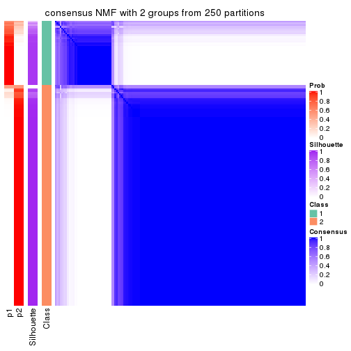</p>

</div>
<div id='tab-ATC-NMF-consensus-heatmap-2'>
<pre><code class="r">consensus_heatmap(res, k = 3)
</code></pre>

<p>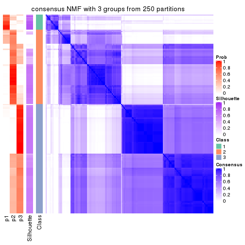</p>

</div>
<div id='tab-ATC-NMF-consensus-heatmap-3'>
<pre><code class="r">consensus_heatmap(res, k = 4)
</code></pre>

<p>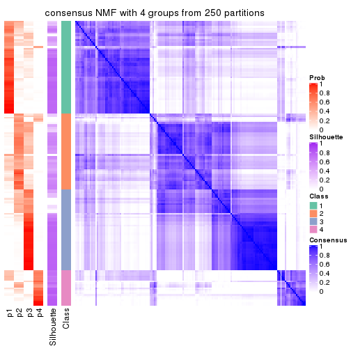</p>

</div>
<div id='tab-ATC-NMF-consensus-heatmap-4'>
<pre><code class="r">consensus_heatmap(res, k = 5)
</code></pre>

<p>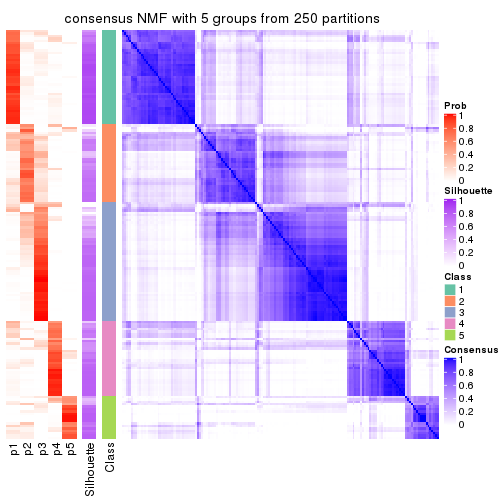</p>

</div>
<div id='tab-ATC-NMF-consensus-heatmap-5'>
<pre><code class="r">consensus_heatmap(res, k = 6)
</code></pre>

<p>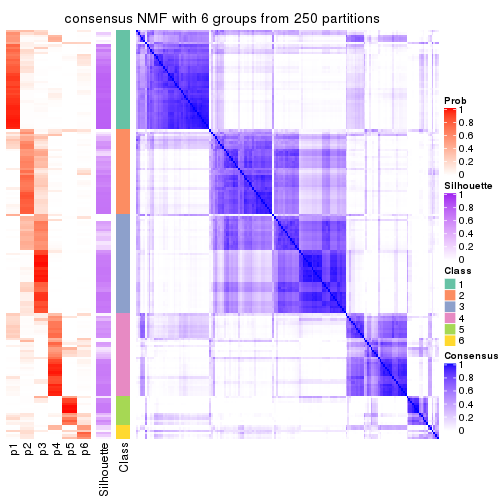</p>

</div>
</div>

Heatmaps for the membership of samples in all partitions to see how consistent they are:


<script>
$( function() {
	$( '#tabs-ATC-NMF-membership-heatmap' ).tabs();
} );
</script>
<div id='tabs-ATC-NMF-membership-heatmap'>
<ul>
<li><a href='#tab-ATC-NMF-membership-heatmap-1'>k = 2</a></li>
<li><a href='#tab-ATC-NMF-membership-heatmap-2'>k = 3</a></li>
<li><a href='#tab-ATC-NMF-membership-heatmap-3'>k = 4</a></li>
<li><a href='#tab-ATC-NMF-membership-heatmap-4'>k = 5</a></li>
<li><a href='#tab-ATC-NMF-membership-heatmap-5'>k = 6</a></li>
</ul>
<div id='tab-ATC-NMF-membership-heatmap-1'>
<pre><code class="r">membership_heatmap(res, k = 2)
</code></pre>

<p>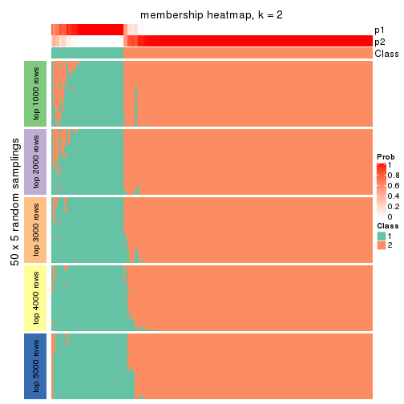</p>

</div>
<div id='tab-ATC-NMF-membership-heatmap-2'>
<pre><code class="r">membership_heatmap(res, k = 3)
</code></pre>

<p>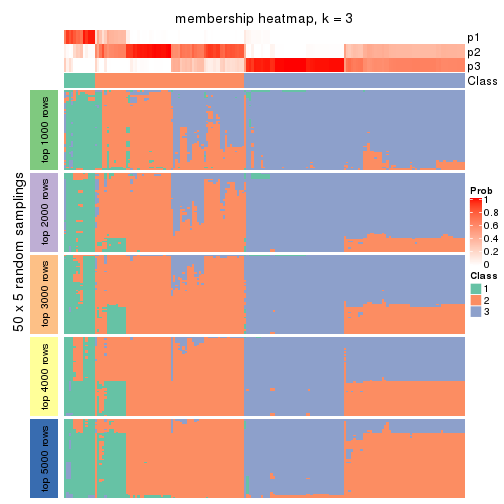</p>

</div>
<div id='tab-ATC-NMF-membership-heatmap-3'>
<pre><code class="r">membership_heatmap(res, k = 4)
</code></pre>

<p>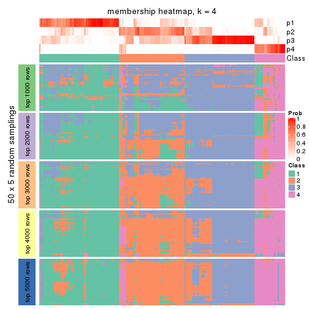</p>

</div>
<div id='tab-ATC-NMF-membership-heatmap-4'>
<pre><code class="r">membership_heatmap(res, k = 5)
</code></pre>

<p>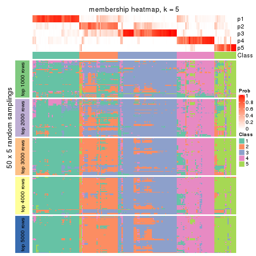</p>

</div>
<div id='tab-ATC-NMF-membership-heatmap-5'>
<pre><code class="r">membership_heatmap(res, k = 6)
</code></pre>

<p>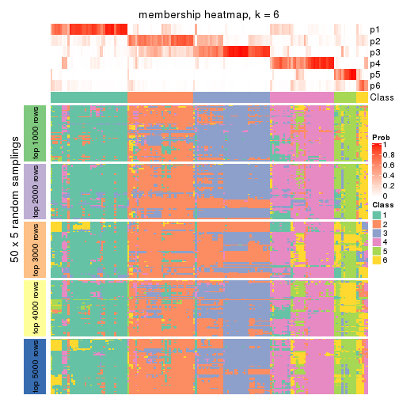</p>

</div>
</div>

As soon as we have had the classes for columns, we can look for signatures
which are significantly different between classes which can be candidate marks
for certain classes. Following are the heatmaps for signatures.


Signature heatmaps where rows are scaled:


<script>
$( function() {
	$( '#tabs-ATC-NMF-get-signatures' ).tabs();
} );
</script>
<div id='tabs-ATC-NMF-get-signatures'>
<ul>
<li><a href='#tab-ATC-NMF-get-signatures-1'>k = 2</a></li>
<li><a href='#tab-ATC-NMF-get-signatures-2'>k = 3</a></li>
<li><a href='#tab-ATC-NMF-get-signatures-3'>k = 4</a></li>
<li><a href='#tab-ATC-NMF-get-signatures-4'>k = 5</a></li>
<li><a href='#tab-ATC-NMF-get-signatures-5'>k = 6</a></li>
</ul>
<div id='tab-ATC-NMF-get-signatures-1'>
<pre><code class="r">get_signatures(res, k = 2)
</code></pre>

<p>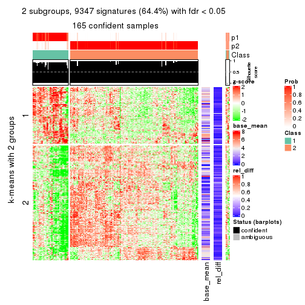</p>

</div>
<div id='tab-ATC-NMF-get-signatures-2'>
<pre><code class="r">get_signatures(res, k = 3)
</code></pre>

<p>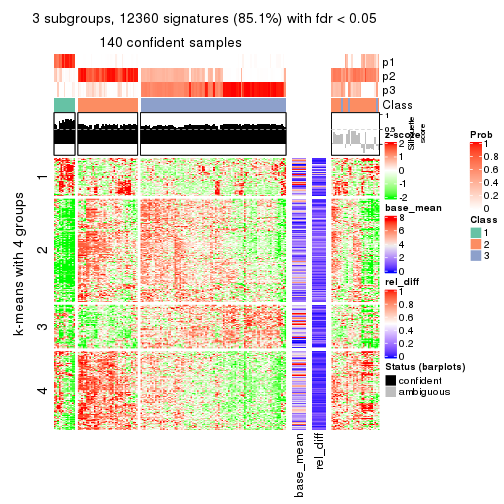</p>

</div>
<div id='tab-ATC-NMF-get-signatures-3'>
<pre><code class="r">get_signatures(res, k = 4)
</code></pre>

<p>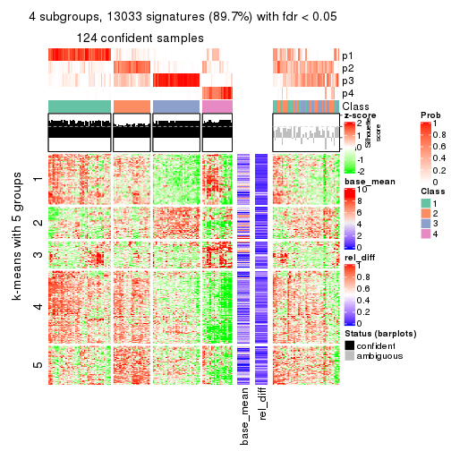</p>

</div>
<div id='tab-ATC-NMF-get-signatures-4'>
<pre><code class="r">get_signatures(res, k = 5)
</code></pre>

<p>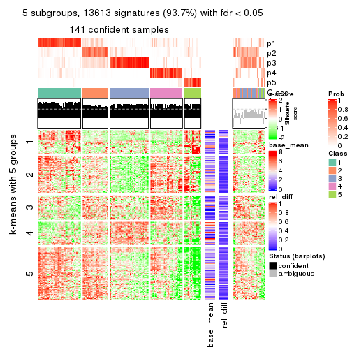</p>

</div>
<div id='tab-ATC-NMF-get-signatures-5'>
<pre><code class="r">get_signatures(res, k = 6)
</code></pre>

<p>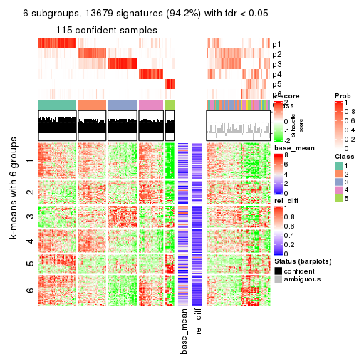</p>

</div>
</div>


Signature heatmaps where rows are not scaled:


<script>
$( function() {
	$( '#tabs-ATC-NMF-get-signatures-no-scale' ).tabs();
} );
</script>
<div id='tabs-ATC-NMF-get-signatures-no-scale'>
<ul>
<li><a href='#tab-ATC-NMF-get-signatures-no-scale-1'>k = 2</a></li>
<li><a href='#tab-ATC-NMF-get-signatures-no-scale-2'>k = 3</a></li>
<li><a href='#tab-ATC-NMF-get-signatures-no-scale-3'>k = 4</a></li>
<li><a href='#tab-ATC-NMF-get-signatures-no-scale-4'>k = 5</a></li>
<li><a href='#tab-ATC-NMF-get-signatures-no-scale-5'>k = 6</a></li>
</ul>
<div id='tab-ATC-NMF-get-signatures-no-scale-1'>
<pre><code class="r">get_signatures(res, k = 2, scale_rows = FALSE)
</code></pre>

<p>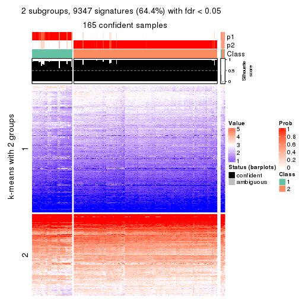</p>

</div>
<div id='tab-ATC-NMF-get-signatures-no-scale-2'>
<pre><code class="r">get_signatures(res, k = 3, scale_rows = FALSE)
</code></pre>

<p>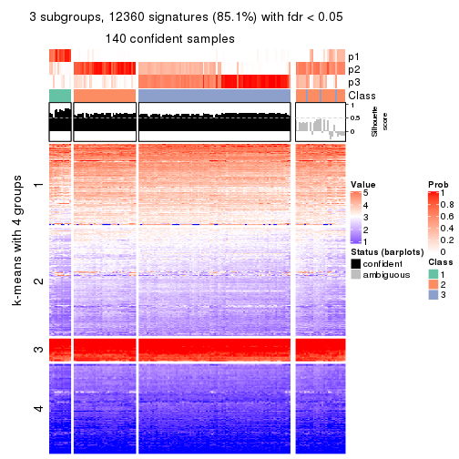</p>

</div>
<div id='tab-ATC-NMF-get-signatures-no-scale-3'>
<pre><code class="r">get_signatures(res, k = 4, scale_rows = FALSE)
</code></pre>

<p>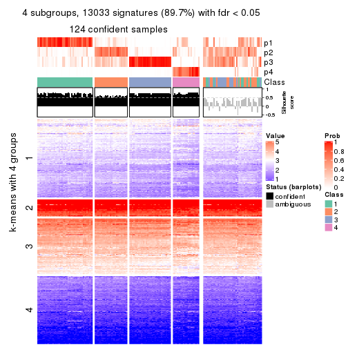</p>

</div>
<div id='tab-ATC-NMF-get-signatures-no-scale-4'>
<pre><code class="r">get_signatures(res, k = 5, scale_rows = FALSE)
</code></pre>

<p>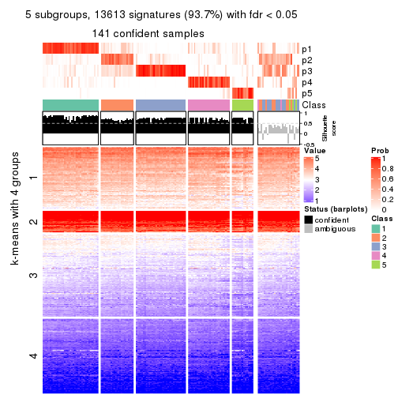</p>

</div>
<div id='tab-ATC-NMF-get-signatures-no-scale-5'>
<pre><code class="r">get_signatures(res, k = 6, scale_rows = FALSE)
</code></pre>

<p>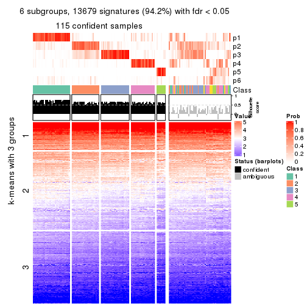</p>

</div>
</div>


Compare the overlap of signatures from different k:

```r
compare_signatures(res)
```

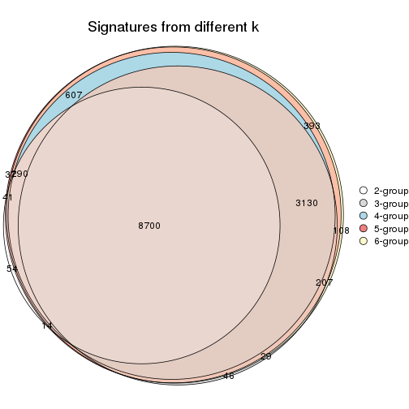

`get_signature()` returns a data frame invisibly. TO get the list of signatures, the function
call should be assigned to a variable explicitly. In following code, if `plot` argument is set
to `FALSE`, no heatmap is plotted while only the differential analysis is performed.

```r
# code only for demonstration
tb = get_signature(res, k = ..., plot = FALSE)
```

An example of the output of `tb` is:

```
#>   which_row         fdr    mean_1    mean_2 scaled_mean_1 scaled_mean_2 km
#> 1        38 0.042760348  8.373488  9.131774    -0.5533452     0.5164555  1
#> 2        40 0.018707592  7.106213  8.469186    -0.6173731     0.5762149  1
#> 3        55 0.019134737 10.221463 11.207825    -0.6159697     0.5749050  1
#> 4        59 0.006059896  5.921854  7.869574    -0.6899429     0.6439467  1
#> 5        60 0.018055526  8.928898 10.211722    -0.6204761     0.5791110  1
#> 6        98 0.009384629 15.714769 14.887706     0.6635654    -0.6193277  2
...
```

The columns in `tb` are:

1. `which_row`: row indices corresponding to the input matrix.
2. `fdr`: FDR for the differential test. 
3. `mean_x`: The mean value in group x.
4. `scaled_mean_x`: The mean value in group x after rows are scaled.
5. `km`: Row groups if k-means clustering is applied to rows.


UMAP plot which shows how samples are separated.


<script>
$( function() {
	$( '#tabs-ATC-NMF-dimension-reduction' ).tabs();
} );
</script>
<div id='tabs-ATC-NMF-dimension-reduction'>
<ul>
<li><a href='#tab-ATC-NMF-dimension-reduction-1'>k = 2</a></li>
<li><a href='#tab-ATC-NMF-dimension-reduction-2'>k = 3</a></li>
<li><a href='#tab-ATC-NMF-dimension-reduction-3'>k = 4</a></li>
<li><a href='#tab-ATC-NMF-dimension-reduction-4'>k = 5</a></li>
<li><a href='#tab-ATC-NMF-dimension-reduction-5'>k = 6</a></li>
</ul>
<div id='tab-ATC-NMF-dimension-reduction-1'>
<pre><code class="r">dimension_reduction(res, k = 2, method = &quot;UMAP&quot;)
</code></pre>

<p>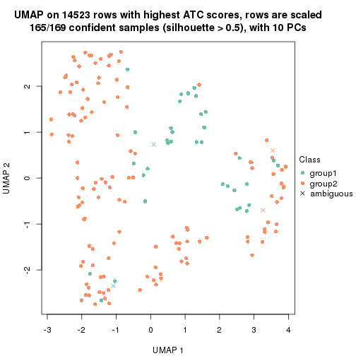</p>

</div>
<div id='tab-ATC-NMF-dimension-reduction-2'>
<pre><code class="r">dimension_reduction(res, k = 3, method = &quot;UMAP&quot;)
</code></pre>

<p>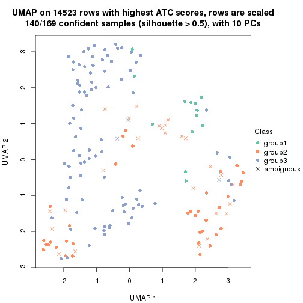</p>

</div>
<div id='tab-ATC-NMF-dimension-reduction-3'>
<pre><code class="r">dimension_reduction(res, k = 4, method = &quot;UMAP&quot;)
</code></pre>

<p>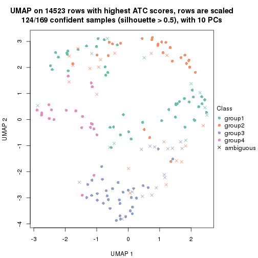</p>

</div>
<div id='tab-ATC-NMF-dimension-reduction-4'>
<pre><code class="r">dimension_reduction(res, k = 5, method = &quot;UMAP&quot;)
</code></pre>

<p>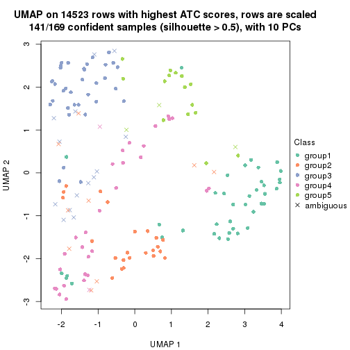</p>

</div>
<div id='tab-ATC-NMF-dimension-reduction-5'>
<pre><code class="r">dimension_reduction(res, k = 6, method = &quot;UMAP&quot;)
</code></pre>

<p>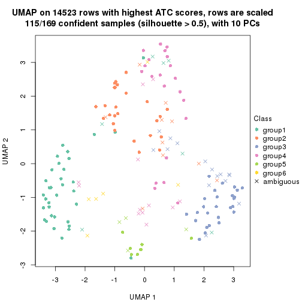</p>

</div>
</div>


Following heatmap shows how subgroups are split when increasing `k`:

```r
collect_classes(res)
```

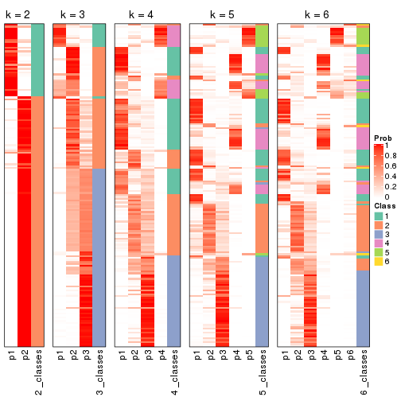


If matrix rows can be associated to genes, consider to use `GO_Enrichment(res,
...)` to perform function enrichment for the signature genes.


 

## Session info


```r
sessionInfo()
```

```
#> R version 3.6.0 (2019-04-26)
#> Platform: x86_64-pc-linux-gnu (64-bit)
#> Running under: CentOS Linux 7 (Core)
#> 
#> Matrix products: default
#> BLAS:   /usr/lib64/libblas.so.3.4.2
#> LAPACK: /usr/lib64/liblapack.so.3.4.2
#> 
#> locale:
#>  [1] LC_CTYPE=en_US.UTF-8       LC_NUMERIC=C               LC_TIME=en_US.UTF-8       
#>  [4] LC_COLLATE=en_US.UTF-8     LC_MONETARY=en_US.UTF-8    LC_MESSAGES=en_US.UTF-8   
#>  [7] LC_PAPER=en_US.UTF-8       LC_NAME=C                  LC_ADDRESS=C              
#> [10] LC_TELEPHONE=C             LC_MEASUREMENT=en_US.UTF-8 LC_IDENTIFICATION=C       
#> 
#> attached base packages:
#>  [1] grid      parallel  stats4    stats     graphics  grDevices utils     datasets  methods  
#> [10] base     
#> 
#> other attached packages:
#>  [1] genefilter_1.66.0           ComplexHeatmap_2.1.1        markdown_1.1               
#>  [4] knitr_1.26                  cola_1.3.2                  SummarizedExperiment_1.14.1
#>  [7] DelayedArray_0.10.0         BiocParallel_1.18.1         matrixStats_0.55.0         
#> [10] Biobase_2.44.0              GenomicRanges_1.36.1        GenomeInfoDb_1.20.0        
#> [13] IRanges_2.18.3              S4Vectors_0.22.1            BiocGenerics_0.30.0        
#> [16] GetoptLong_0.1.7           
#> 
#> loaded via a namespace (and not attached):
#>  [1] bitops_1.0-6           bit64_0.9-7            doParallel_1.0.15      RColorBrewer_1.1-2    
#>  [5] httr_1.4.1             backports_1.1.5        tools_3.6.0            R6_2.4.1              
#>  [9] DBI_1.0.0              lazyeval_0.2.2         colorspace_1.4-1       withr_2.1.2           
#> [13] tidyselect_0.2.5       gridExtra_2.3          bit_1.1-14             compiler_3.6.0        
#> [17] xml2_1.2.2             microbenchmark_1.4-7   pkgmaker_0.28          slam_0.1-46           
#> [21] scales_1.1.0           NMF_0.23.6             stringr_1.4.0          digest_0.6.23         
#> [25] XVector_0.24.0         pkgconfig_2.0.3        bibtex_0.4.2           highr_0.8             
#> [29] rlang_0.4.2            GlobalOptions_0.1.1    RSQLite_2.1.2          impute_1.58.0         
#> [33] shape_1.4.4            mclust_5.4.5           dendextend_1.12.0      dplyr_0.8.3           
#> [37] RCurl_1.95-4.12        magrittr_1.5           GenomeInfoDbData_1.2.1 Matrix_1.2-17         
#> [41] Rcpp_1.0.3             munsell_0.5.0          viridis_0.5.1          lifecycle_0.1.0       
#> [45] stringi_1.4.3          zlibbioc_1.30.0        plyr_1.8.4             blob_1.2.0            
#> [49] crayon_1.3.4           lattice_0.20-38        splines_3.6.0          annotate_1.62.0       
#> [53] circlize_0.4.9         zeallot_0.1.0          pillar_1.4.2           rjson_0.2.20          
#> [57] rngtools_1.4           reshape2_1.4.3         codetools_0.2-16       XML_3.98-1.20         
#> [61] glue_1.3.1             evaluate_0.14          vctrs_0.2.0            png_0.1-7             
#> [65] foreach_1.4.7          polyclip_1.10-0        gtable_0.3.0           purrr_0.3.3           
#> [69] clue_0.3-57            assertthat_0.2.1       ggplot2_3.2.1          xfun_0.11             
#> [73] gridBase_0.4-7         eulerr_6.0.0           xtable_1.8-4           skmeans_0.2-11        
#> [77] survival_2.44-1.1      viridisLite_0.3.0      tibble_2.1.3           iterators_1.0.12      
#> [81] memoise_1.1.0          AnnotationDbi_1.46.1   registry_0.5-1         GTF_0.0.1             
#> [85] cluster_2.1.0          brew_1.0-6
```


